# 단일 머신 H200에서 가장 빠른 DeepSeek V3와 R1 추론 시스템 최적화 비법

> 이 노트는 동적으로 업데이트될 수 있습니다. 노트는 https://github.com/BBuf/how-to-optim-algorithm-in-cuda/blob/master/large-language-model-note/sglang 이 디렉터리에 둘 예정이니, 관심 있는 분들은 이 저장소에 별을 눌러 주셔도 좋습니다.

## 0x0. 서문

관련 Benchmark 정보를 보면 현재 SGLang은 단일 머신 H200에서 DeepSeek V3/R1을 추론할 때 가장 빠른 대형 모델 오픈소스 추론 프레임워크일 것입니다. 다만 성능의 좋고 나쁨을 절대적으로 말하기는 어렵습니다. 각 프레임워크가 계속 서로 앞서거니 뒤서거니 빠르게 최적화하고 있으므로 시간이 지나면 리드 폭이 줄어들 수 있기 때문입니다. 여기서는 오픈소스 기술 공유 관점에서 SGLang이 단일 머신 규모 추론을 위해 수행한 많은 공학적 최적화 기법을 정리합니다. 여기에 포함된 기법은 제가 SGLang 개발에 참여하면서 수시로 기록한 것이고, 일부는 직접 기여한 것도 있어서 조금 자세할 것입니다. 한 가지 더 설명하자면, 아래 기록은 단일 머신 TP8, MTP를 켜지 않은 관련 최적화입니다. 또한 이 글은 main 브랜치에 apply된 최적화만 기록하며, 오래되었거나 삭제된 최적화 기법은 제외했습니다.

현재 시점은 2025년 5월 중순입니다. 여기서는 주로 2025년 상반기에 DeepSeek V3/R1을 대상으로 한 최적화를 기록합니다. 그 이전의 몇몇 최적화는 더 기본적인 편이라 기록하지 않았습니다. 관심이 있다면 SGLang의 이전 release blog 등을 참고할 수 있습니다. 이 timeline은 사실 제가 SGLang 오픈소스에 참여한 timeline이기도 합니다. 그 전의 내용은 익숙하지 않아 다시 보지 않았고, 2025년 상반기 이전 성능도 그렇게 강하지 않았습니다. 최적화할 곳이 너무 많았기 때문입니다. 아래 기록한 최적화는 크고 작은 차이가 있지만 모두 단일 머신 규모 DeepSeek V3/R1 추론 성능 향상에 기여했습니다. 해당 최적화 PR에 성능 데이터가 있으면 간단히 스크린샷도 붙입니다. 설명이 필요한 점은 성능 향상 스크린샷은 control variable 방식으로 현재 최적화의 효과만 강조한다는 것입니다. 그래서 아래 서로 다른 그림의 output throughput 차이가 꽤 클 수 있는데, 이는 정상입니다. main 브랜치에 최적화가 계속 merge되며 성능이 올라가기 때문입니다. 구체적인 최적화의 유효성만 보면 됩니다.

바로 시작하겠습니다. 이 노트는 생각나는 대로 기록한 것이며, 완전히 시간순은 아닙니다.

## 0x1. FP8 Block GEMM의 진화

DeepSeek V3/R1에서 독립 Linear에 대응하는 forward는 FP8 Block GEMM이며, 세 번의 진화를 거쳤습니다. 처음은 Triton 구현이었고, 코드는 여전히 여기에 남아 있습니다. https://github.com/sgl-project/sglang/blob/main/python/sglang/srt/layers/quantization/fp8_kernel.py#L743 물론 여기에도 여러 플랫폼에서 여러 파라미터를 tuning한 내용이 있습니다. 성능이 상대적으로 좋지 않아 이후 Cutlass 구현으로 진화했습니다. 구체적으로는 sgl-kernel 안의 https://github.com/sgl-project/sglang/blob/main/sgl-kernel/csrc/gemm/fp8_blockwise_gemm_kernel.cu 를 참고하세요. 그 뒤 DeepSeek의 DEEPGEMM이 오픈소스가 되었고, SGLang은 한 단계 더 나아가 DEEPGEMM 구현을 사용했습니다. 또한 JIT 컴파일 결과 캐시 문제도 해결했습니다. 자세한 내용은 https://github.com/sgl-project/sglang/blob/main/python/sglang/srt/layers/quantization/deep_gemm.py 및 https://github.com/sgl-project/sglang/blob/3e350a931e990c2b09cd18bc117ba219310bcda9/python/sglang/srt/layers/quantization/fp8_kernel.py#L784 를 참고하세요.

현재 SGLang에서는 DEEPGEMM이 기본으로 켜져 있습니다. 이 구현은 sgl-kernel의 cutlass 구현과 Triton 구현에 비해 거의 모든 case에서 장점이 있습니다. 사용 로직 스크린샷은 다음과 같습니다.

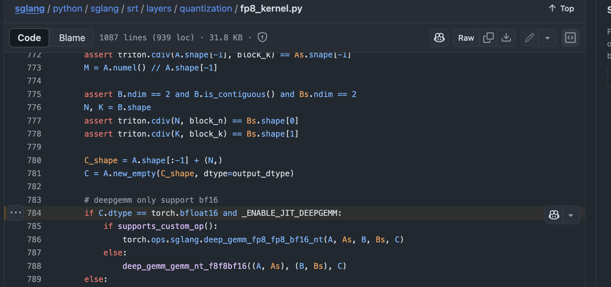

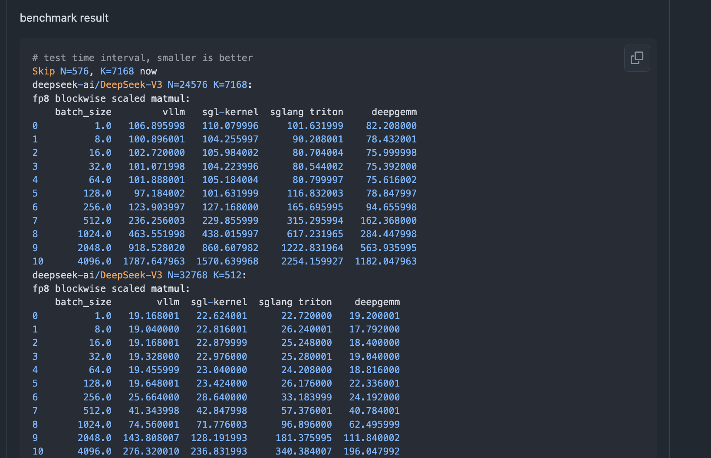

end-to-end 향상 폭은 입력/출력 데이터 길이와 관련이 있습니다. 예를 들어 10k-500 데이터에서는 output throughput 기준 end-to-end 5% 향상, 256-4k 데이터에서는 output throughput 기준 end-to-end 10% 향상을 얻었습니다. 여기서의 향상은 sgl-kernel cutlass 구현 대비입니다.

또한 DeepGEMM을 기반으로 SGLang은 모델 안의 일련의 BMM을 다시 작성하는 시도도 했습니다. 핵심 아이디어는 `per-token-group quant+deep_gemm's grouped_gemm_masked`가 `per-tensor quant+bmm_fp8`보다 빠르다는 것입니다(https://github.com/sgl-project/sglang/pull/5432). 다만 이 최적화는 정확도 문제를 일으킬 수 있어 프로덕션 환경에서 기본으로 사용되지는 않습니다.

## 0x2. FusedMoE module 최적화

여기서는 항목별로 정리합니다.

### 0x2.1 per_token_group_quant와 moe_align_block_size의 kernel 최적화

코드는 https://github.com/sgl-project/sglang/blob/main/sgl-kernel/csrc/gemm/per_token_group_quant_8bit.cu 및 https://github.com/sgl-project/sglang/blob/main/sgl-kernel/csrc/moe/moe_align_kernel.cu 를 참고하세요.

이 두 작업은 모두 FusedMoE module의 전처리 부분입니다. kernel 전체 비중은 크지 않고 둘 다 memory bound kernel이지만, 최적화를 통해 단일 kernel 성능을 여러 배 끌어올릴 수 있습니다. 구체적으로는 PR 개발 당시의 micro benchmark 결과를 볼 수 있습니다. 예: https://github.com/sgl-project/sglang/pull/5086

```shell
     num_tokens  num_experts  topk        SGL       Triton        VLLM
160      1024.0          8.0   1.0  18.031999    52.512001   20.416001
161      1024.0          8.0   2.0  18.432001    67.135997   27.327999
162      1024.0          8.0   4.0  20.032000   116.640002   41.632000
163      1024.0          8.0   8.0  21.952000   205.136001   69.760002
164      1024.0         32.0   1.0  18.368000    55.071998   22.304000
165      1024.0         32.0   2.0  19.040000    55.583999   29.536000
166      1024.0         32.0   4.0  20.256000    55.264000   43.712001
167      1024.0         32.0   8.0  23.104001    71.744002   77.408001
168      1024.0         64.0   1.0  19.760000    56.031998   22.304000
169      1024.0         64.0   2.0  20.368000    54.095998   26.144000
170      1024.0         64.0   4.0  21.648001    55.103999   40.544000
171      1024.0         64.0   8.0  24.224000    58.272000   63.904002
172      1024.0        128.0   1.0  21.088000    56.848001   32.000002
173      1024.0        128.0   2.0  21.984000    55.551998   35.583999
174      1024.0        128.0   4.0  23.024000    55.808000   42.367999
175      1024.0        128.0   8.0  24.992000    56.127999   54.111999
176      1024.0        256.0   1.0  25.072001    52.480001   66.431999
177      1024.0        256.0   2.0  25.264001    52.576002   67.199998
178      1024.0        256.0   4.0  26.848000    52.416001   70.703998
179      1024.0        256.0   8.0  29.120000    57.663999   81.055999
```

이것도 제가 SGLang 오픈소스에 발을 들인 초반 기여 중 하나입니다.

### 0x2.2 biased_grouped_topk의 fuse kernel 최적화

SGLang에서는 biased_grouped_topk(https://github.com/sgl-project/sglang/blob/main/python/sglang/srt/layers/moe/topk.py#L144)를 대상으로 fuse cuda kernel 최적화를 도입했습니다. 십여 개의 연산자를 하나의 cuda kernel로 fuse해 grouped topk 부분의 성능을 크게 개선했습니다. 이전에도 이 최적화를 소개하는 blog를 쓴 적이 있습니다. [DeepSeek V3 biased_grouped_topk cuda fusion operator fused_moe_gate kernel 그림 해설](https://mp.weixin.qq.com/s/p6LlY4sUBTy-Xfc9WumNSw) 관심이 있으면 참고하세요. 여기서는 더 자세히 반복하지 않겠습니다.

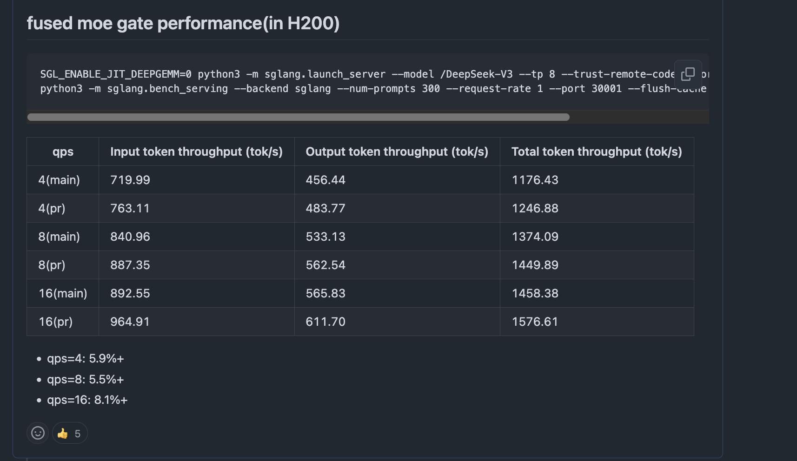

kernel에 대응하는 PR은 https://github.com/sgl-project/sglang/pull/4530 입니다.

DeepSeek V3/R1 추론 성능은 end-to-end로 약 5%-8% 향상되었습니다.

### 0x2.3 Shared Experts와 Route Experts 융합

구체적인 세부 사항은 예전에 쓴 이 blog를 참고할 수 있습니다. 이 최적화는 테스트에 꽤 많은 시간을 썼고, 상당히 견고한 향상이었습니다. [DeepSeek V3와 R1에서 Shared Experts와 일반 Experts를 융합하는 작은 기법](https://mp.weixin.qq.com/s/Bz3qdkldULZiZ8ypooOX-A) 아래는 end-to-end 성능 향상 그림입니다.

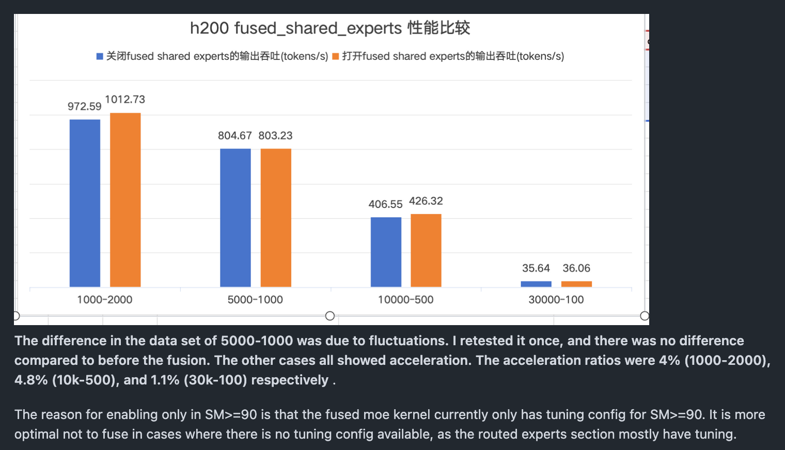

### 0x2.4 Triton Fused MoE Retuning

PyTorch Triton 버전을 업그레이드한 뒤 커뮤니티 기여자가 fused MoE kernel을 다시 tuning하면 명확한 성능 향상이 있다는 점을 발견했습니다. 예를 들어 Triton 3.2.0에서 Triton 3.1.0 tuning config를 계속 사용하면 오히려 성능이 떨어지지만, 다시 tuning하면 Triton 3.1.0보다 더 좋은 성능을 얻을 수 있습니다. https://github.com/sgl-project/sglang/pull/5716 및 https://github.com/sgl-project/sglang/pull/5740 을 통해 Fused MoE kernel을 다시 tuning했고, DeepSeek V3/R1에서 성능 향상을 얻었습니다.

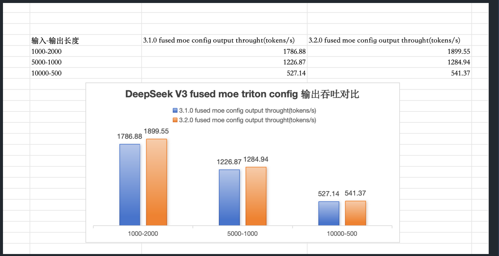

저도 Triton 3.2.0에서 Triton 3.3.0으로 업그레이드했을 때의 향상을 테스트했습니다.

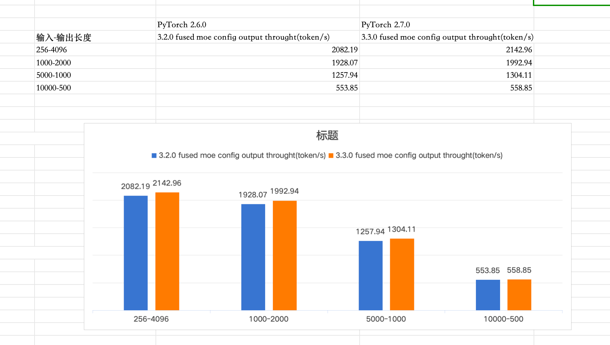

기본적으로 여기의 Retuning 결론과도 맞습니다. 또한 https://github.com/vllm-project/vllm/pull/17934#issuecomment-2868822690 의 micro benchmark 성능 테스트도 이 점을 뒷받침합니다.

### 0x2.5 topk_reduce kernel에 routed scaling factor fuse

expert 계산이 끝난 뒤 마지막에 routed_scaling_factor를 곱하는 로직을 Fused MoE module의 마지막 topk_reduce_sum kernel에 fuse했습니다. 자세한 내용은 https://github.com/sgl-project/sglang/pull/6220 를 참고하세요. end-to-end 향상은 다음과 같습니다.

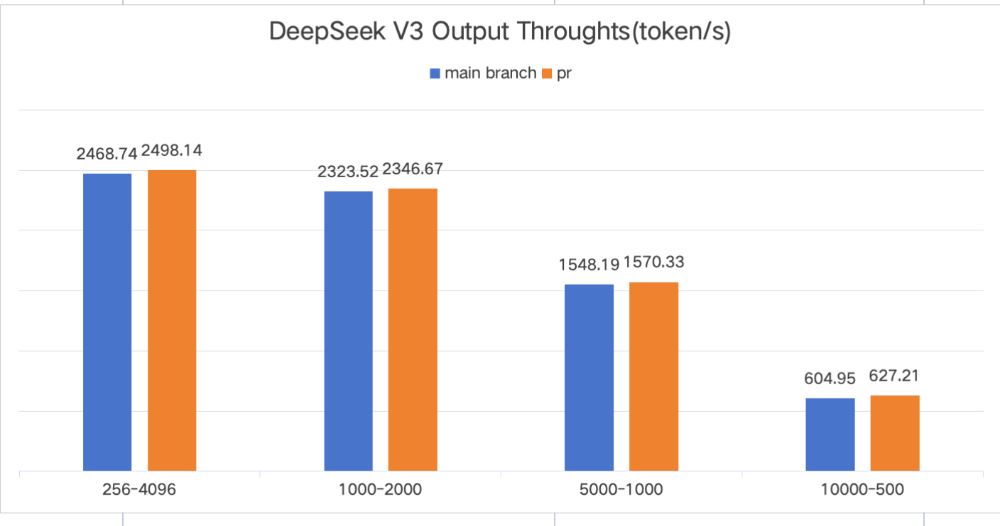

### 0x2.6 몇 가지 추가 탐색

SGLang에서는 TP 모드에서 Cutlass Grouped GEMM과 DEEPGEMM 기반 fused moe kernel 구현도 탐색했습니다. correctness test와 performance test는 통과했지만, TP8 모드에서는 DeepSeek V3/R1의 Triton Fused MoE kernel 대비 성능 향상을 보지 못했습니다. 여기서는 자세히 설명하지 않겠습니다.

## 0x3. Attention Backend 최적화

### 0x3.1 Flash Attention V3 Backend

LinkedIn에서 온 최적화입니다. 자세한 내용은 [SGLang에서 Flash Attention Backend 구현하기 - Basics and KV Cache](https://mp.weixin.qq.com/s/693f008zNo7olXeSogy-sg)를 참고하세요. end-to-end 처리량 향상 결과는 다음과 같습니다.

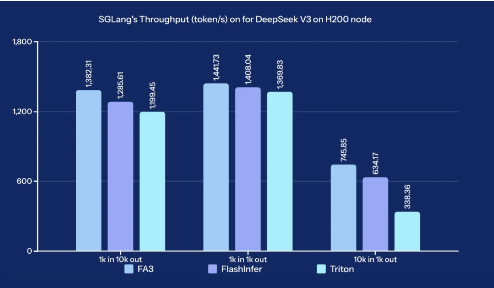

효과가 매우 뚜렷합니다. SGLang 커뮤니티도 더 넓은 가속을 얻기 위해 hybrid Attention Backend를 추진하고 있습니다. 참고: https://github.com/sgl-project/sglang/pull/6151

### 0x3.2 Cutlass MLA attention backend & FlashMLA Attention Backend

PR은 https://github.com/sgl-project/sglang/pull/5390 , https://github.com/sgl-project/sglang/pull/4514 , https://github.com/sgl-project/sglang/pull/6034 등을 참고하세요.

선택 가능한 Attention Backend는 많습니다. 예를 들어 가장 처음에는 FlashInfer Backend를 사용했습니다. 하지만 현재 SGLang은 기본적으로 Flash Attention V3 Backend를 사용하고 있으며, 적어도 H200에서는 대부분의 Case에서 가장 좋은 성능을 보입니다.

## 0x4. MLA 최적화

### 0x4.1 forward_absorb 안의 불필요한 copy

https://github.com/sgl-project/sglang/pull/5578 에 대응합니다. 이 최적화는 q_input과 k_input 같은 임시 변수의 생성과 처리를 제거하고, self.kv_lora_rank와 관련된 여러 copy 및 slice 작업을 없앴습니다. 변경은 다음과 같습니다.

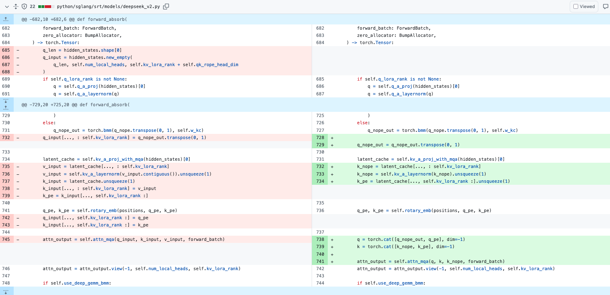

benchmark 결과는 다음과 같습니다.

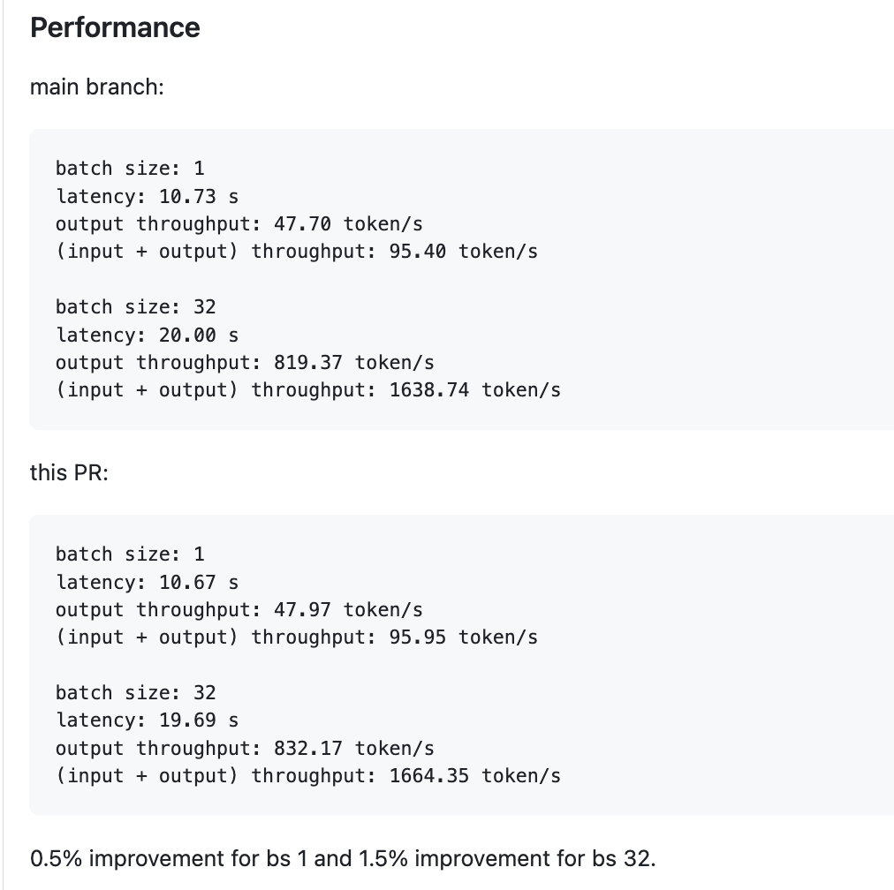

### 0x4.2 MHA와 MQA 선택 전략 최적화

추천 읽기: vLLM의 Prefill 단계와 Decode 단계에서 MLA의 서로 다른 구현을 비교 분석한 글(https://zhuanlan.zhihu.com/p/1897225385751585767)에서 idea의 세부 사항을 이해할 수 있습니다.

이 글에서는 MLA가 한 번의 추론 중 Prefill 단계에서는 MHA 구현을 사용하고, Decode 단계에서는 MQA 구현을 사용한다고 언급합니다. 두 구현의 차이는 주로 Q * K 행렬 계산 순서의 차이에서 오므로, 행렬을 진정한 의미에서 흡수할 필요는 없고 계산 순서만 바뀝니다. 또한 SGLang에서는 Chunked Prefix Cache를 고려하며, batch 안의 모든 sequence prefix 길이 합이 chunked_prefix_cache_threshold 이상이면 여전히 MHA 구현을 사용합니다. 여기서는 `MHA_CHUNKED_KV`입니다. 아래 코드 조각을 참고하세요.

```python
elif self.attention_backend == "fa3":
    # Flash Attention: Use MHA with chunked KV cache when prefilling on long sequences.
    if forward_batch.extend_prefix_lens_cpu is not None:
        sum_extend_prefix_lens = sum(forward_batch.extend_prefix_lens_cpu)
    if (
        forward_batch.forward_mode.is_extend()
        and not self.disable_chunked_prefix_cache
        and not forward_batch.forward_mode.is_target_verify()
        and not forward_batch.forward_mode.is_draft_extend()
        and (
            sum_extend_prefix_lens >= self.chunked_prefix_cache_threshold
            or sum_extend_prefix_lens == 0
        )
    ):
        return AttnForwardMethod.MHA_CHUNKED_KV
    else:
        return AttnForwardMethod.MLA
```

자세한 내용은 https://github.com/sgl-project/sglang/pull/5113 를 참고하세요. 이것도 2025년 상반기의 최적화입니다. 아래는 몇 가지 Benchmark 결과 스크린샷입니다.

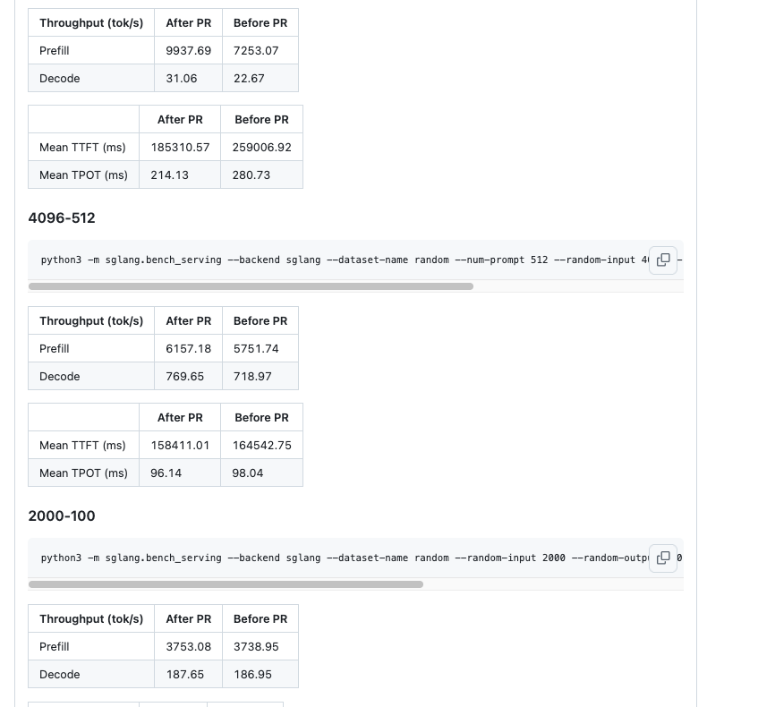

전체 end-to-end 처리량 향상도 명확하다는 것을 볼 수 있습니다.

### 0x4.3 Merge Attention States kernel 최적화

@DefTruth(https://www.zhihu.com/people/qyjdef)의 kernel 최적화입니다. 그는 Zhihu에서도 이 연산자에 대해 몇 편의 blog를 썼으니, 관심이 있으면 볼 수 있습니다.

- [vLLM 실전][연산자] vLLM 연산자 개발 흐름: 매우 자세한 기록 (https://zhuanlan.zhihu.com/p/1892966682634473987)
- [Triton 프로그래밍][기초] vLLM Triton Merge Attention States Kernel 상세 해설 (https://zhuanlan.zhihu.com/p/1904937907703243110)

SGLang의 PR은 https://github.com/sgl-project/sglang/pull/5381 이며, Benchmark는 https://github.com/sgl-project/sglang/pull/5381#issue-2993195410 를 참고할 수 있습니다.

전체 영향은 비교적 작습니다. kernel micro benchmark에서 보편적으로 향상이 제한적인 것으로 나타났기 때문입니다. 이 kernel은 위에서 소개한 MHA_CHUNKED_KV 모드에서 사용됩니다.

### 0x4.4 q_a_proj와 kv_a_proj fuse

이 최적화에 대응하는 PR은 https://github.com/sgl-project/sglang/pull/5619 입니다.

DeepSeek v3의 self-attention module에서 `q_a_proj`와 `kv_a_proj`는 모두 hidden state를 입력으로 사용하므로, 둘을 하나의 module로 fuse해 DeepGemm launch 한 번을 아낄 수 있습니다. 대응하는 변경은 다음과 같습니다. `q_lora_rank`가 0보다 클 때, 이는 DeepSeek V3와 R1에서 성립합니다. `self.q_a_proj`와 `self.kv_a_proj_with_mqa`는 새로운 module `self.fused_qkv_a_proj_with_mqa`로 fuse됩니다. 가중치를 로드할 때 `q_a_proj`와 `kv_a_proj`의 weight 및 block scales가 concat되어 `self.fused_qkv_a_proj_with_mqa`에 로드됩니다. benchmark 결과는 다음과 같습니다.

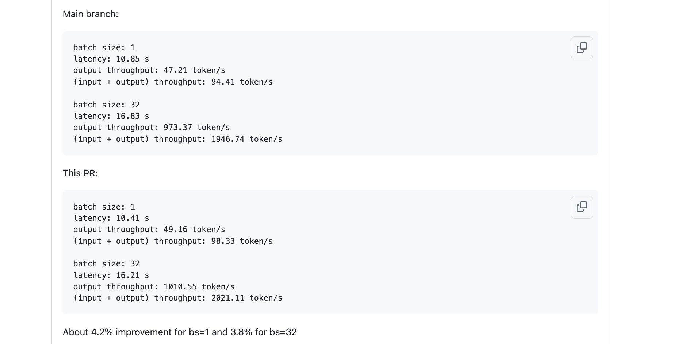

bs=1에서는 약 4.2%, bs=32에서는 약 3.8% 향상되었습니다.

### 0x4.5 MLA set kv cache kernel fuse

이 최적화에 대응하는 PR은 https://github.com/sgl-project/sglang/pull/5748 입니다.

이 작업은 MLA set kv cache kernel을 fuse하고 k concat 작업을 제거합니다. 현재는 FA3 backend만 지원합니다. 이후 검증을 거치면 다른 backend에도 적용할 수 있습니다.

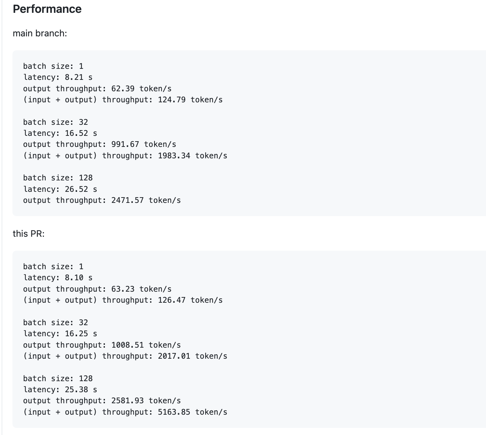

## 0x5. DeepSeek V3/R1의 다른 최적화 기법 기록

### 0x5.1 Overlap qk norm with two streams

두 개의 CUDA Stream을 사용해 DeepSeek V3/R1 Attention 부분의 `forward_absorb` 구현에서 q와 k에 각각 rmsnorm을 수행하는, 데이터 의존성이 없는 작업을 overlap합니다. PR은 https://github.com/sgl-project/sglang/pull/5977 입니다.

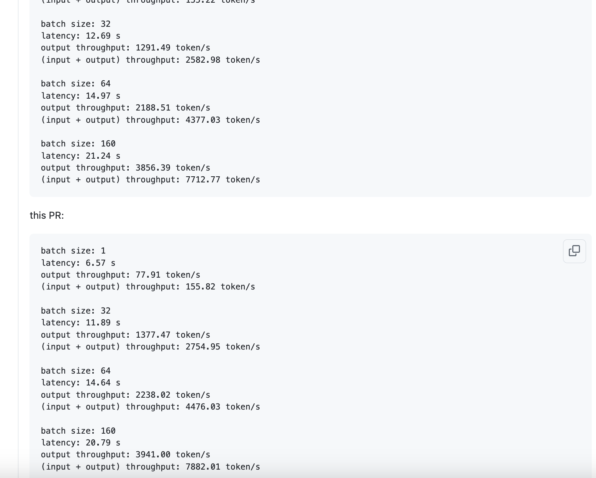

### 0x5.2 계층 간 재사용을 위한 BumpAllocator

출발점은 각 Layer마다 입력을 quantization해야 하고, quantization할 때마다 quantization 연산자에 새 zero scalar tensor를 신청해야 한다는 점이었습니다. 반복 신청을 피하기 위해 Tom이 BumpAllocator를 만들었고, 계층 간 메모리 재사용을 달성해 서로 다른 계층에서 반복적으로 torch.zeros를 생성하는 일을 줄였습니다. PR은 https://github.com/sgl-project/sglang/pull/5549 입니다.

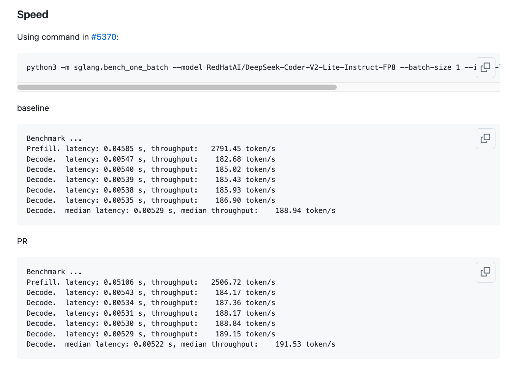

### 0x5.3 Triton 구현 대신 sgl-kernel의 sglang_per_token_group_quant_fp8 연산자 사용

PR은 https://github.com/sgl-project/sglang/pull/5473 입니다.

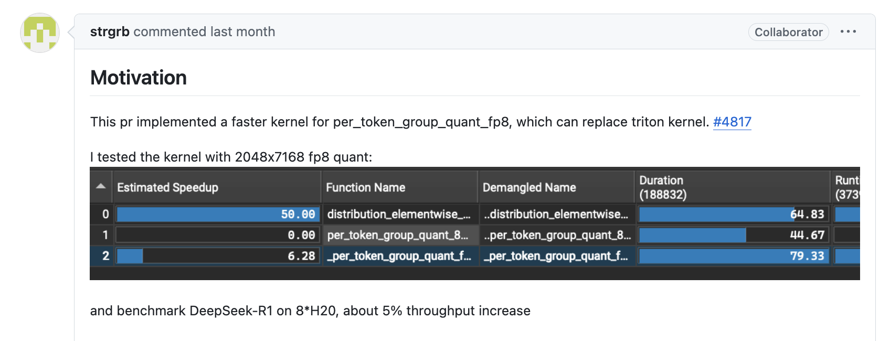

### 0x5.4 DeepSeek V3/R1에 cuda rope 적용

PR은 https://github.com/sgl-project/sglang/pull/5385 입니다.

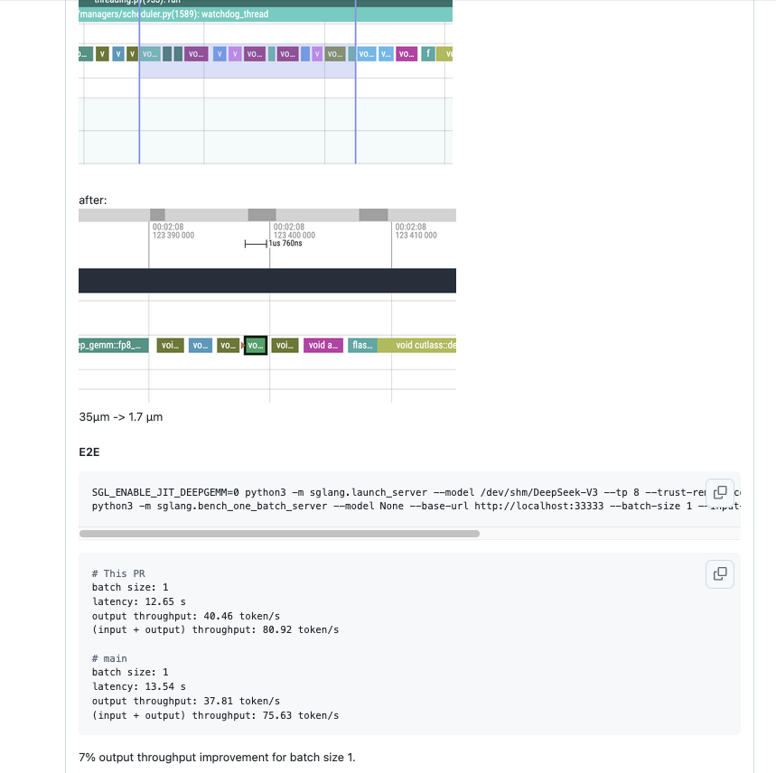

### 0x5.5 MLA의 fp8 quant kernel 최적화

이 최적화의 출발점은 아래 그림 오른쪽 위의 bmm을 deepgemm 또는 cutlass fp8 `bmm`으로 수행해야 하므로, 입력을 bf16에서 fp8로 변환해야 한다는 점입니다.

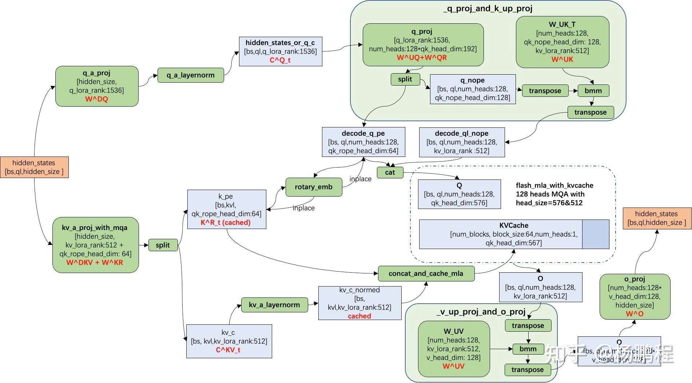

예를 들어 deepgemm bmm을 기준으로 하면 코드는 다음과 같습니다.

```python
q_nope, q_pe = q.split([self.qk_nope_head_dim, self.qk_rope_head_dim], dim=-1)
k_pe = latent_cache[..., self.kv_lora_rank :].unsqueeze(1)

if self.use_deep_gemm_bmm:
    q_nope_val, q_nope_scale, masked_m, expected_m, aligned_m = (
        per_token_group_quant_mla_deep_gemm_masked_fp8(q_nope.transpose(0, 1))
    )
    q_nope_out = q_nope.new_empty(
        (self.num_local_heads, aligned_m, self.kv_lora_rank)
    )
    deep_gemm_grouped_gemm_nt_f8f8bf16_masked(
        (q_nope_val, q_nope_scale),
        (self.w_kc, self.w_scale_k),
        q_nope_out,
        masked_m,
        expected_m,
    )
    q_nope_out = q_nope_out[:, :expected_m, :]
```

이 PR의 작업은 Triton으로 `per_token_group_quant_mla_deep_gemm_masked_fp8` kernel을 구현하는 것입니다. 이전에는 이 작업이 여러 작은 연산자로 구성되어 있었으므로, 이것도 CUDA kernel fuse 기법입니다. 편의를 위해 여기서는 Triton으로 kernel 하나를 직접 구현했습니다.

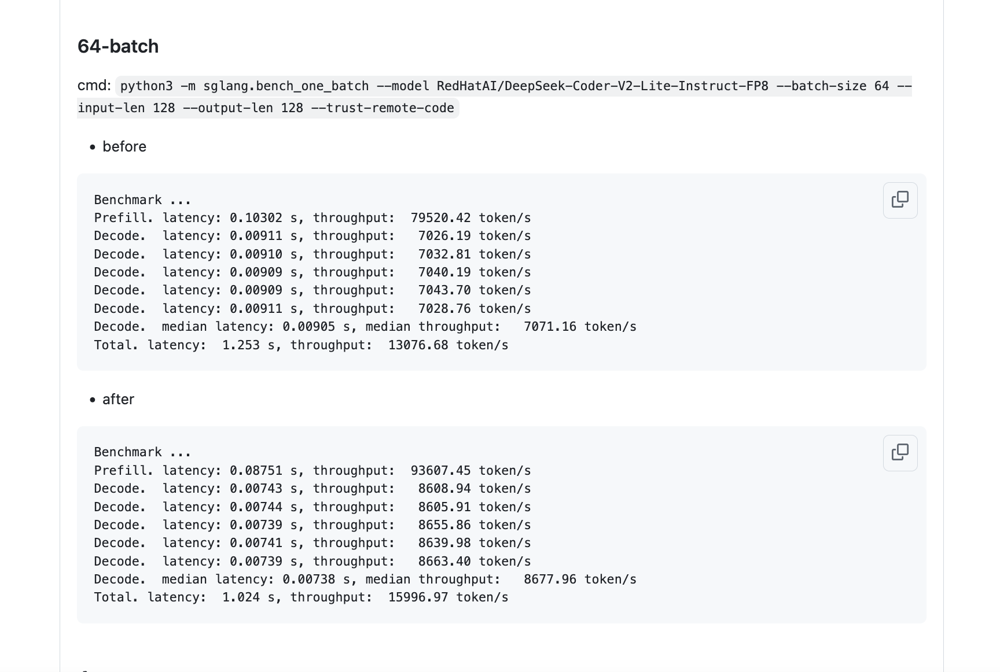


## 0x6. 요약

현재 제 기록은 대략 여기까지입니다. 한 가지 설명할 점은 어떤 최적화가 PR 하나로 끝나는 경우는 많지 않다는 것입니다. 상당히 장기적인 과정일 수 있습니다. 예를 들어 어떤 kernel은 몇 달 동안 계속 업데이트될 수 있고, Flash Attention V3도 feature roadmap에 따라 오랫동안 최적화와 bug 해결을 거쳤습니다. 모두 쉽지 않은 공학적 최적화입니다. SGLang 단일 머신 H200 DeepSeek V3/R1 추론에 관심이 있다면 소스 코드를 읽고 1차 정보를 얻을 수 있습니다.

위의 여러 최적화를 종합하면, DeepSeek V3/R1의 단일 머신 H200 추론 처리량은 연초 대비 몇 배 향상되었을 것입니다. 이 글이 도움이 되었다면 공유와 좋아요, 그리고 SGLang star를 부탁드립니다. 감사합니다.
