# 앤트그룹 오픈소스 x SGLang Meetup 기술 회고 해설 - 앤트그룹의 대규모 분산 추론을 위한 KVCache 다중 레벨 캐시 시스템

> 이 글은 2026년 1월 17일 앤트그룹 오픈소스 x SGLang Meetup의 「앤트그룹의 대규모 분산 추론을 위한 KVCache 다중 레벨 캐시 시스템」 발표의 회고 해설이다. slides의 실제 주선은 세 가지다: SGLang HiCache, DeepSeek Sparse Attention을 위한 HiSparse, 그리고 Mooncake/SGLang 위에 구축된 앤트그룹 Theta KVPool의 생산화 아키텍처. 여기서는 slides 순서에 따라 진행하지만, 코드와 공개 자료에 중점을 둔다: SGLang의 HiCache/HiSparse/Mooncake Store 소스 코드, DeepSeek-V3.2 관련 PR, Mooncake의 Dummy/Real Client 문서, 그리고 LMSYS의 몇 편의 blog.

## 0x0. 서론

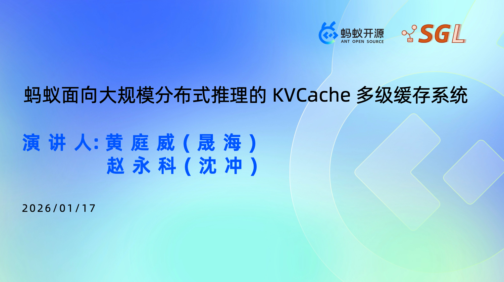

이 slides의 펼칠 만한 부분은, 단순히 "KVCache를 CPU로 offload"하는 것에 관한 이야기가 아니라는 점이다. 진짜 문제는, 온라인 추론이 멀티 테넌트, 다중 턴 대화, Agentic Coding, PD 분리, 이종 TP, Sparse Attention이 혼재하게 된 이후, KVCache가 더 이상 로컬 최적화 포인트가 아니라 scheduler, memory pool, storage backend, transfer engine에 걸친 시스템 문제가 되었다는 것이다.

SGLang의 이 계통은 PR [#2693 Hierarchical Caching for SGLang](https://github.com/sgl-project/sglang/pull/2693)까지 거슬러 올라갈 수 있다. 이후에 TP 수정, HiCache refactor, Mooncake/3FS/NIXL/AIBrix 백엔드 연결, 동적 backend, HiSparse 등 일련의 작업을 거쳤다. slides에서 "플랫폼 아키텍처"처럼 보이는 그림들이 코드 안에서는 사실 다음 파일들에서 그림자를 볼 수 있다:

- `python/sglang/srt/mem_cache/hiradix_cache.py`
- `python/sglang/srt/managers/cache_controller.py`
- `python/sglang/srt/mem_cache/memory_pool_host.py`
- `sgl-kernel/csrc/kvcacheio/transfer.cu`
- `python/sglang/srt/mem_cache/storage/mooncake_store/mooncake_store.py`
- `python/sglang/srt/managers/hisparse_coordinator.py`
- `python/sglang/jit_kernel/csrc/hisparse.cuh`

LMSYS blog에도 이 slides와 잘 대응되는 몇 편의 글이 있다:

- [SGLang HiCache: Fast Hierarchical KV Caching with Your Favorite Storage Backends](https://www.lmsys.org/blog/2025-09-10-sglang-hicache/): slides 전반부의 HiCache 데이터 면, 제어 면, Mooncake/3FS 백엔드에 대응한다.
- [SGLang Day 0 Support for DeepSeek-V3.2 with Sparse Attention](https://www.lmsys.org/blog/2025-09-29-deepseek-V32/): DeepSeek Sparse Attention의 배경, 즉 DSA, Lightning Indexer, Top-k Selector에 대응한다.
- [HiSparse: Turbocharging Sparse Attention with Hierarchical Memory](https://www.lmsys.org/blog/2026-04-10-sglang-hisparse/): slides 중간의 계층적 희소화와 hot buffer/LRU/swap-in 커널에 대응한다.
- [Together with SGLang: Best Practices for Serving DeepSeek-R1 on H20-96G](https://www.lmsys.org/blog/2025-09-26-sglang-ant-group/): 이 KVPool 발표와 같은 글은 아니지만, 그 안의 앤트그룹 H20 대규모 추론, Prefill/Decode 배포 구성이 나중의 Theta KVPool 생산 배경을 이해하는 데 도움이 된다.

먼저 LMSYS blog에서 이 slides와 가장 관련이 깊은 두 장의 시스템 그림을 여기에 보충한다. 첫 번째는 HiCache의 전체 구조다:

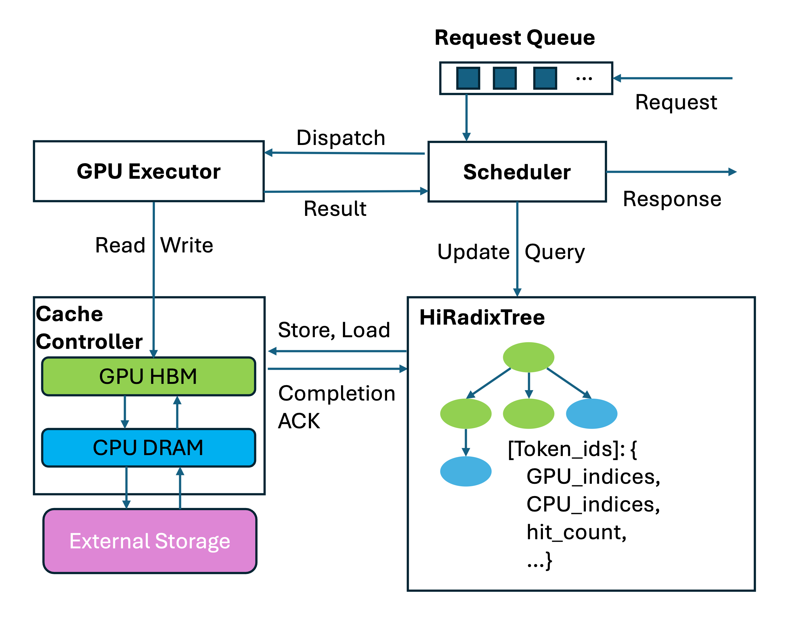

LMSYS의 HiCache 설명은 매우 직접적이다: RadixAttention의 GPU prefix cache를 GPU/CPU/외부 스토리지 3계층 캐시로 확장하면서 원래의 radix tree 기반 prefix 매칭 능력을 유지한다. 이 설명은 "KVCache offload"보다 더 정확하다. offload는 데이터를 바깥으로 옮기는 것만 설명하기 때문이다. HiCache가 실제로 추가한 것은 page table, write-back 전략, 비동기 로드, 다중 백엔드 I/O 추상화다. 나중에 코드를 페이지별로 볼 때 `HiRadixCache`, `HiCacheController`, `BaseKVStorage`라는 이름이 반복해서 등장한다.

두 번째는 HiCache의 메모리 레이아웃이다:

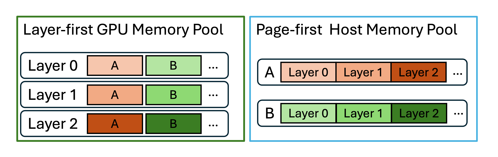

이 그림에서 가장 쉽게 놓치는 것은 page 입도다. HiCache는 하나의 요청의 전체 KV 세그먼트를 하나의 큰 blob으로 저장하는 것이 아니라 page 단위로 관리한다. GPU의 page index, CPU pinned memory의 page, 원격 backend의 key/value가 대응된 후에야, scheduler가 prefix 명중 시 필요한 부분만 복원할 수 있다. LMSYS blog는 두 가지 이점을 강조한다: GPU 공간이 부족할 때 prefix를 완전히 버릴 필요가 없고, CPU, 파일, Mooncake, 3FS 등 backend를 같은 인터페이스 뒤에 놓을 수 있다는 것이다. 대가도 명확하다: 매 명중 시 I/O가 가치 있는지 한 번의 계산이 추가로 필요하다. 따라서 SGLang에는 `--hicache-prefetch-threshold`, write policy, backend 선택 같은 파라미터가 생겼다.

HiSparse blog도 slides의 sparse attention 부분에 도움이 된다. DeepSeek Sparse Attention의 문제를 더 직접적으로 설명한다: Top-k selector가 attention이 전체 히스토리를 보지 않게 하지만, "어떤 token을 볼 것인가" 자체가 히스토리 인덱스를 필요로 한다. 인덱스와 KV가 모두 GPU에 남아 있으면, 긴 컨텍스트 동시성은 여전히 HBM에 막힌다. HiSparse의 방식은 뜨거운 KV를 GPU hot buffer에 남기고, 차가운 KV는 host나 외부 계층에 두며, miss 시에 swap in한다:

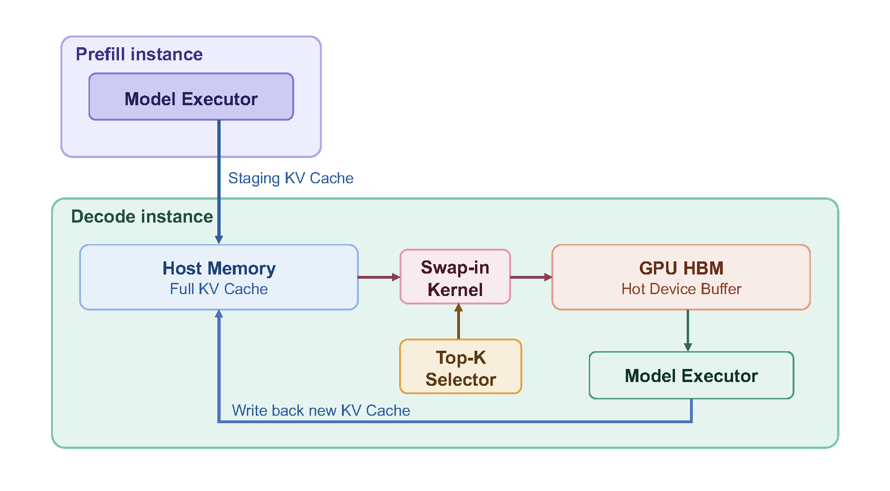

다음 그림은 LMSYS가 제시한 처리량 곡선이다. 어떤 절대값이 중요한 것이 아니라, concurrency가 올라갈 때 계층적 sparse cache가 GPU만 의존하는 방식보다 더 안정적임을 보여주는 것이 핵심이다:

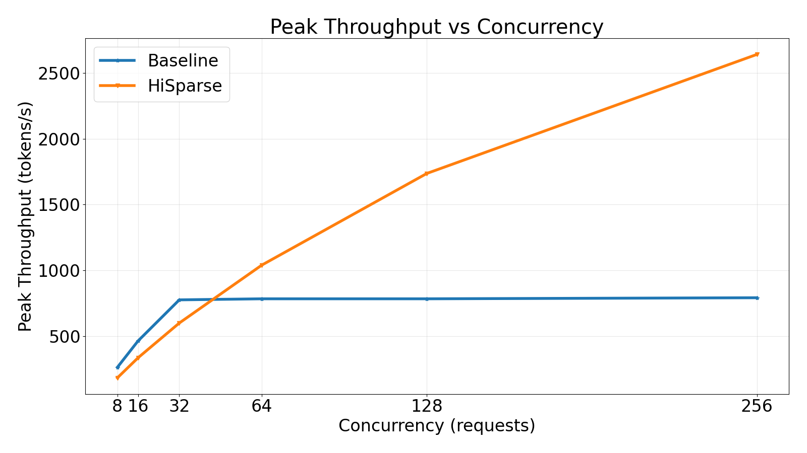

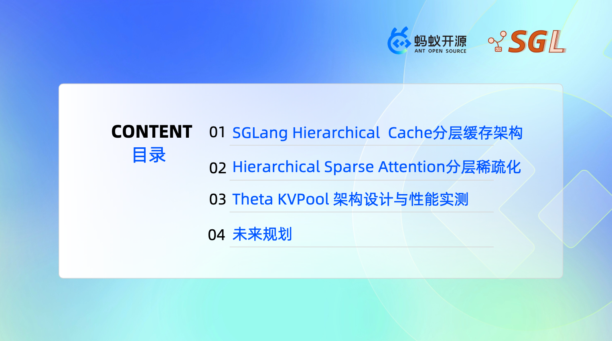

목차는 네 부분으로 나뉜다:

1. SGLang Hierarchical Cache 계층 캐시 아키텍처;
2. Hierarchical Sparse Attention 계층적 희소화;
3. Theta KVPool 아키텍처 설계와 성능 실측;
4. 향후 계획.

아래에서도 이 순서로 쓴다. HiCache부터 시작하는데, 이것이 이후 모든 것의 기반이기 때문이다.

## 0x1. RadixCache에서 HiCache로

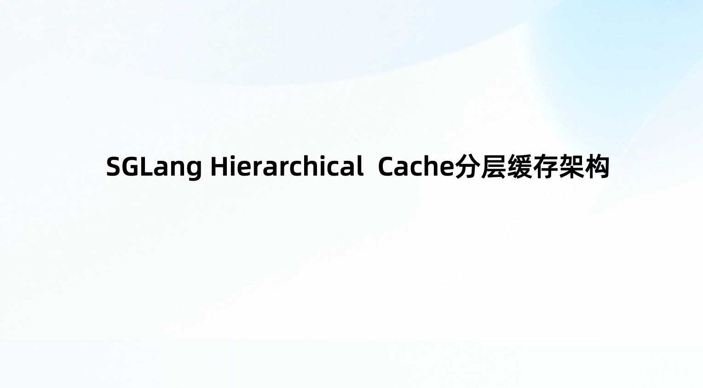

이 페이지는 장 구분 페이지지만, 첫 번째 핵심 단어를 제시한다: Hierarchical Cache. SGLang에는 원래 RadixCache, 즉 RadixAttention의 GPU prefix cache가 있었다. HiCache가 한 일은 이 radix tree를 CPU와 원격 스토리지로 확장한 것이다.

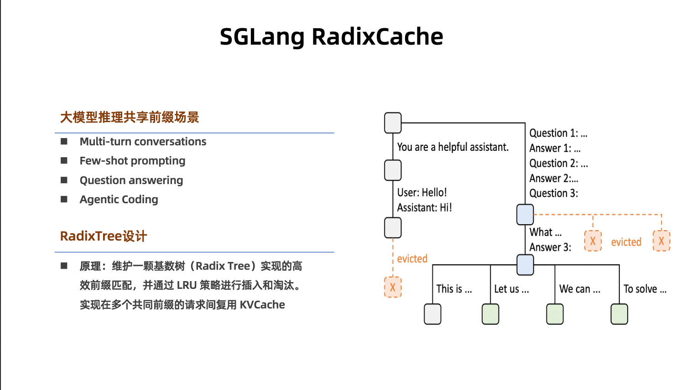

RadixCache의 기본 아이디어는 LMSYS 2024년의 [Fast and Expressive LLM Inference with RadixAttention and SGLang](https://www.lmsys.org/blog/2024-01-17-sglang/)으로 거슬러 올라간다. 다중 턴 대화, few-shot, self-consistency, agentic coding 같은 시나리오는 모두 공유 prefix가 있다. prefix에 해당하는 KVCache가 아직 GPU에 있으면 긴 prefill 계산을 건너뛸 수 있다.

SGLang의 `RadixCache`는 token 시퀀스를 radix tree에 매달며, value는 GPU KV page의 index다. 명중 시 연속 prefix의 device indices를 반환하고, 삽입 시 새 KV page를 트리에 연결하며, GPU 공간이 부족하면 LRU에 따라 leaf에서 축출한다.

문제도 직접적이다: GPU HBM이 이 정도밖에 안 된다. slides에서는 DeepSeek V3 예시를 들었는데, H20 8장에 약 130K token의 KVCache만 들어간다. 온라인 멀티 테넌트 시나리오에서 prompt 분포가 매우 넓어서, 어떤 세션이 방금 GPU cache에 써넣은 것이 다른 요청에 의해 금방 밀려날 수 있다. RadixCache 구조에는 문제가 없지만 용량이 부족하다.

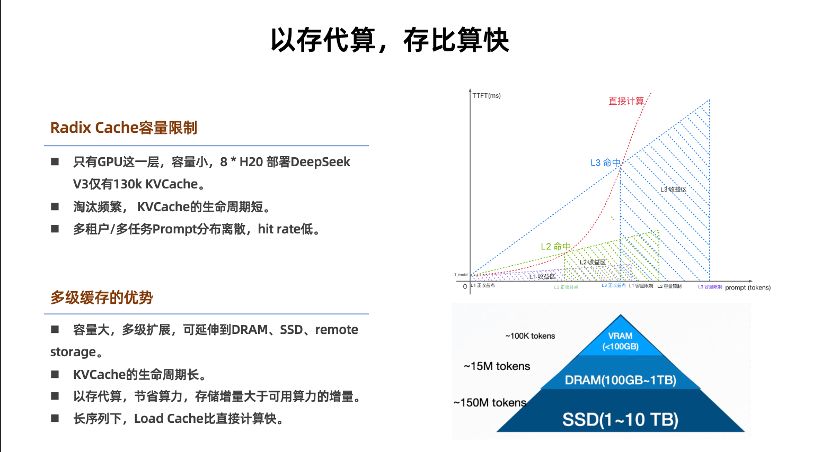

이 페이지에서는 "저장으로 계산을 대체하고, 저장이 계산보다 빠르다"는 말을 사용했지만, 이것이 성립하려면 두 가지 조건이 필요하다:

첫째, 반드시 긴 prefix 또는 긴 컨텍스트여야 한다. 짧은 prompt의 몇 십 개 token을 위해 L3에서 KV를 가져오면 가치가 없을 수 있다.

둘째, 캐시 경로를 숨기거나 배치화할 수 있어야 한다. 매 decode마다 동기적으로 CPU/원격 스토리지를 기다리면, 연산 능력 병목이 I/O 병목으로 바뀐 것뿐이다.

HiCache 설계는 바로 이 두 가지를 중심으로 한다: L1은 GPU, L2는 CPU pinned memory, L3는 file/Mooncake/3FS/NIXL/AIBrix 같은 backend다. Radix tree는 더 이상 GPU에 KV가 있는지만 기록하지 않고, HiRadixTree로 확장되어 어떤 prefix의 KV가 GPU, CPU, 원격 스토리지 중 어디에 있는지 기록한다.

LMSYS HiCache blog에 매우 핵심적인 문장이 있다: HiCache는 RadixAttention을 HiRadixTree로 확장하여, 이를 page table로 사용하고 GPU/CPU/외부 스토리지의 KV cache를 참조한다. 코드에서 대응되는 것은 `HiRadixCache(RadixCache)`다:

```python
class HiRadixCache(RadixCache):
    def __init__(self, params: CacheInitParams, server_args: ServerArgs):
        self.page_size = params.page_size
        self.kv_cache = params.token_to_kv_pool_allocator.get_kvcache()

        if isinstance(self.kv_cache, MHATokenToKVPool):
            self.token_to_kv_pool_host = MHATokenToKVPoolHost(
                self.kv_cache,
                server_args.hicache_ratio,
                server_args.hicache_size,
                self.page_size,
                server_args.hicache_mem_layout,
                allocator_type=server_args.hicache_storage_backend,
            )
        elif isinstance(self.kv_cache, MLATokenToKVPool):
            self.token_to_kv_pool_host = MLATokenToKVPoolHost(...)

        self.cache_controller = HiCacheController(
            params.token_to_kv_pool_allocator,
            self.token_to_kv_pool_host,
            self.page_size,
            self.tp_group,
            load_cache_event=self.load_cache_event,
            write_policy=server_args.hicache_write_policy,
            io_backend=server_args.hicache_io_backend,
            storage_backend=server_args.hicache_storage_backend,
            prefetch_threshold=prefetch_threshold,
            storage_backend_extra_config=extra_config,
            pp_rank=self.pp_rank,
            pp_size=self.pp_size,
        )
```

여기에는 두 가지 의미가 있다:

- `HiRadixCache`는 여전히 `RadixCache`를 상속하며, prefix 매칭, 트리 노드 분할, LRU 같은 기본 로직은 완전히 새로 만들지 않았다;
- 구체적인 데이터 이동은 `HiCacheController`에 맡기며, 트리는 어떤 node의 `value`, `host_value`, `backuped`, `evicted` 같은 메타데이터만 관리한다.

따라서 HiCache는 "처음부터 새 캐시를 만드는 것"이 아니라, RadixCache에 다중 레벨 주소를 추가한 것이다.

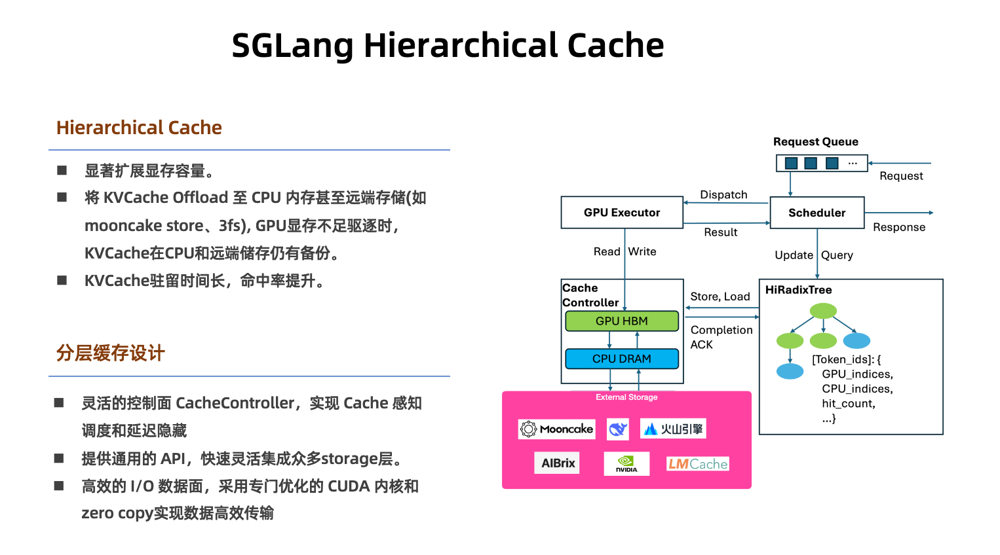

이 페이지는 HiCache의 전체 그림이다. L1 GPU, L2 CPU, L3 Storage. Storage는 Mooncake Store일 수도 있고 3FS일 수도 있다. 제어 면에 CacheController가 있고, 데이터 면에 효율적인 I/O 커널과 zero-copy가 있다.

`match_prefix`를 보면 이 메타데이터 집합이 어떻게 작동하는지 알 수 있다:

```python
def match_prefix(self, params: MatchPrefixParams):
    value, last_node = self._match_prefix_helper(self.root_node, key)
    value = torch.cat(value) if value else empty_value

    host_hit_length = 0
    last_host_node = last_node
    while last_node.evicted:
        host_hit_length += len(last_node.host_value)
        last_node = last_node.parent
    while not last_host_node.backuped:
        last_host_node = last_host_node.parent

    return MatchResult(
        device_indices=value,
        last_device_node=last_node,
        last_host_node=last_host_node,
        host_hit_length=host_hit_length,
    )
```

prefix의 앞 절반이 아직 GPU에 있으면, `device_indices`가 바로 prefill 건너뛰기에 사용될 수 있다. 뒤 절반이 GPU에서 축출되었지만 CPU에 백업이 있으면, `last_host_node`와 `host_hit_length`로 scheduler에 알린다: 이 구간은 load back할 기회가 있다.

실제로 CPU에서 GPU로 다시 가져오는 로직은 `load_back`에 있다:

```python
def load_back(self, node: TreeNode, mem_quota: Optional[int] = None):
    nodes_to_load = []
    while node.evicted:
        assert node.backuped
        nodes_to_load.insert(0, node)
        node = node.parent

    host_indices = torch.cat([n.host_value for n in nodes_to_load])
    if len(host_indices) < self.load_back_threshold:
        return None

    device_indices = self.cache_controller.load(
        host_indices=host_indices,
        node_id=last_hit_node.id,
        **self._get_extra_pools(),
    )
    if device_indices is None:
        self.evict(EvictParams(num_tokens=len(host_indices)))
        device_indices = self.cache_controller.load(...)

    for node in nodes_to_load:
        node.value = device_indices[offset : offset + len(node.host_value)].clone()
```

여기에 작은 세부사항이 있다: `load_back_threshold` 기본값은 10이다. 너무 짧은 host hit은 GPU로 다시 이동할 가치가 없다. 이동 자체에도 오버헤드가 있기 때문이다. 이 판단은 slides의 "긴 시퀀스 Load Cache가 계산보다 빠르다"와 같은 사고방식이다: cache가 항상 사용되는 것이 아니라, 이익이 임계값을 초과할 때만 사용한다.

L3 프리페치는 `prefetch_from_storage`를 통한다:

```python
def prefetch_from_storage(self, req_id, last_host_node, new_input_tokens, ...):
    prefetch_key = RadixKey(new_input_tokens, extra_key=last_host_node.key.extra_key)
    prefetch_key = prefetch_key.page_aligned(self.page_size)

    if (
        not self.enable_storage
        or len(prefetch_key) < self.prefetch_threshold
        or self.cache_controller.prefetch_rate_limited()
    ):
        return

    host_indices = self.cache_controller.mem_pool_host.alloc(len(prefetch_key))
    operation = self.cache_controller.prefetch(
        req_id,
        host_indices,
        prefetch_key,
        last_hash,
        prefix_keys,
        **self._get_extra_pools(),
    )
    self.ongoing_prefetch[req_id] = (
        last_host_node,
        prefetch_key,
        host_indices,
        operation,
    )
```

이것이 slides의 "L3 명중 후 먼저 L2로 프리페치하고, L2에서 L1으로 load back"하는 코드 경로다. L3 명중을 발견하고 바로 주 스레드를 블로킹하여 원격 I/O가 완료되기를 기다리는 것이 아니라, prefetch를 controller의 백그라운드 스레드에 넘긴다.

## 0x2. Host Memory Pool 레이아웃을 왜 변경해야 하는가

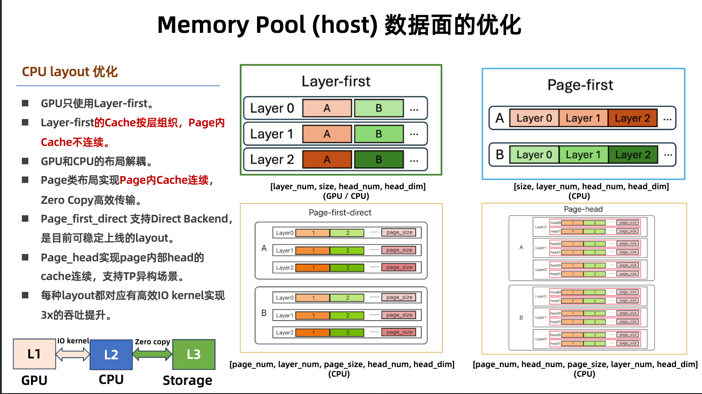

이 페이지는 매우 중요하다. HiCache 데이터 면의 핵심을 다룬다: GPU 측 계산은 자연스럽게 layer-first이지만, CPU/L3 측 I/O는 page-first를 선호한다.

GPU의 KVCache는 일반적으로 layer 단위로 구성된다. attention 계산이 층별로 실행되기 때문이다. 어떤 층에 대해서 커널은 그 층의 K/V만 필요하다. 그런데 L3 스토리지의 입도는 page이고, 원격 get/set은 한 번에 전체 페이지를 가져오는 것이 좋다. CPU도 layer-first를 사용하면, 하나의 page의 모든 층 데이터가 메모리에서 연속되지 않아 Mooncake/3FS에 전달할 때 불편하다.

따라서 SGLang의 host memory pool은 여러 layout을 지원한다:

```python
def init_kv_buffer(self):
    if self.layout == "layer_first":
        dims = (2, self.layer_num, self.size, self.head_num, self.head_dim)
    elif self.layout == "page_first":
        dims = (2, self.size, self.layer_num, self.head_num, self.head_dim)
    elif self.layout == "page_first_direct":
        dims = (
            2,
            self.page_num,
            self.layer_num,
            self.page_size,
            self.head_num,
            self.head_dim,
        )
    elif self.layout == "page_head":
        dims = (
            2,
            self.page_num,
            self.head_num,
            self.page_size,
            self.layer_num,
            self.head_dim,
        )
```

slides의 그 shape 몇 줄이 여기서 온다.

`page_first`는 같은 token/page의 모든 layer를 연결하여 L3 I/O에 편리하다. `page_first_direct`는 더 나아가 `page_num, layer_num, page_size`로 구성하여, CPU->GPU direct transfer를 "어떤 page의 어떤 layer"로 집계할 수 있게 한다. `page_head`는 나중에 이종 TP에서 사용하는 레이아웃으로, head 차원을 page 안으로 넣어 head 단위로 분할하기 편하게 한다.

파라미터 입구는 `server_args.py`에 있다:

```python
parser.add_argument(
    "--hicache-io-backend",
    choices=["direct", "kernel", "kernel_ascend"],
    help="The IO backend for KV cache transfer between CPU and GPU",
)
parser.add_argument(
    "--hicache-mem-layout",
    choices=[
        "layer_first",
        "page_first",
        "page_first_direct",
        "page_first_kv_split",
        "page_head",
    ],
    help="The layout of host memory pool for hierarchical cache.",
)
```

자동 호환 로직도 있다:

```python
def _resolve_layout_io_compatibility(self):
    if self.hicache_mem_layout == "page_first_direct" and self.hicache_io_backend == "kernel":
        self.hicache_io_backend = "direct"

    if self.hicache_mem_layout == "page_first" and self.hicache_io_backend == "direct":
        self.hicache_mem_layout = "page_first_direct"

def _resolve_storage_layout_compatibility(self):
    if self.hicache_storage_backend != "mooncake" or self.hicache_mem_layout != "layer_first":
        return

    if self.hicache_io_backend == "direct":
        new_layout = "page_first_direct"
    elif self.hicache_io_backend == "kernel":
        new_layout = "page_first"
    self.hicache_mem_layout = new_layout
```

이 코드는 온라인 기본 경향을 보여준다: backend가 Mooncake이면 L3 스토리지에 `layer_first`를 사용하지 않는다. Mooncake는 연속 page buffer와 zero-copy가 필요하므로 `layer_first`가 적합하지 않기 때문이다.

CPU/GPU 사이의 copy에는 두 가지 backend가 있다:

- `direct`: 일반적인 indexing/copy에 가깝고, `page_first_direct`에 적합하다;
- `kernel`: SGLang 자체 GPU 보조 I/O 커널을 사용하며, `page_first`, `page_head` 등 layout transform이 필요한 경로에 적합하다.

`load_to_device_per_layer`는 layout과 backend를 구체적인 커널로 매핑한다:

```python
def load_to_device_per_layer(self, device_pool, host_indices, device_indices, layer_id, io_backend):
    if io_backend == "kernel":
        if self.layout == "layer_first":
            transfer_kv_per_layer(...)
        elif self.layout == "page_first":
            transfer_kv_per_layer_pf_lf(...)
        elif self.layout == "page_head":
            transfer_kv_per_layer_ph_lf(...)

    elif io_backend == "direct":
        if self.layout == "layer_first":
            transfer_kv_direct(...)
        elif self.layout == "page_first_direct":
            transfer_kv_per_layer_direct_pf_lf(...)
```

역방향의 `backup_from_device_all_layer`도 유사하다:

```python
def backup_from_device_all_layer(self, device_pool, host_indices, device_indices, io_backend):
    if io_backend == "kernel":
        if self.layout == "page_first":
            transfer_kv_all_layer_lf_pf(...)
        elif self.layout == "page_head":
            transfer_kv_all_layer_lf_ph(...)
    elif io_backend == "direct":
        if self.layout == "page_first_direct":
            transfer_kv_all_layer_direct_lf_pf(...)
```

`sgl-kernel/csrc/kvcacheio/transfer.cu`는 slides의 "IO 커널 3배 처리량"의 실질적인 부분이다. 단순한 `cudaMemcpyAsync`가 아니라 warp 입도로 연속 item을 이동한다:

```cpp
transfer_item_warp(int32_t lane_id, const void* src_addr, void* dst_addr, int64_t item_size_bytes) {
  const uint64_t* __restrict__ src = static_cast<const uint64_t*>(src_addr);
  uint64_t* __restrict__ dst = static_cast<uint64_t*>(dst_addr);
  const int total_chunks = item_size_bytes / sizeof(uint64_t);

  for (int j = lane_id; j < total_chunks; j += WARP_SIZE) {
    uint64_t tmp;
    asm volatile("ld.global.nc.b64 %0,[%1];" : "=l"(tmp) : "l"(src + j) : "memory");
    asm volatile("st.global.cg.b64 [%0],%1;" ::"l"(dst + j), "l"(tmp) : "memory");
  }
}
```

`ld.global.nc`는 non-coherent load이고, `st.global.cg`는 cache-global store 방식이다. 이 선택이 바로 전형적인 스트리밍 이동이다: KV page를 이동하고 바로 attention에 사용하므로, 일반 tensor 연산자처럼 같은 cache line을 반복해서 읽고 쓸 필요가 없다.

`page_head`의 offset도 이 파일에 있다:

```cpp
// page head layout: [page_num, head_num, page_size, layer_num, head_dim]
return base + page_id / page_size * page_size * page_dim
     + page_dim / head_num * head_id * page_size
     + page_id % page_size * page_dim / head_num
     + layer_id * item_size_bytes / head_num;
```

`page_head`이면, 하나의 token의 모든 head가 메모리에서 단순한 연속 블록이 아니므로, 커널에 head loop가 하나 더 필요하다:

```cpp
for (int64_t layer_id = start_layer_id; layer_id < start_layer_id + num_layers_to_process; ++layer_id) {
  for (int64_t head_id = 0; head_id < head_num; ++head_id) {
    const char* src_k_ptr = SrcOffsetFn(..., layer_id, ..., head_id, head_num, page_size);
    char* dst_k_ptr = DstOffsetFn(..., layer_id, ..., head_id, head_num, page_size);
    transfer_item_warp(lane_id, src_k_ptr, dst_k_ptr, head_size_bytes);
    ...
  }
}
```

이것이 slides에서 "각 layout에 효율적인 IO 커널이 있다"는 의미다. layout은 L3와 이종 TP를 위한 것이고, 커널은 layout transform의 비용을 낮추기 위한 것이다.

## 0x3. HiCache 스케줄링 파이프라인

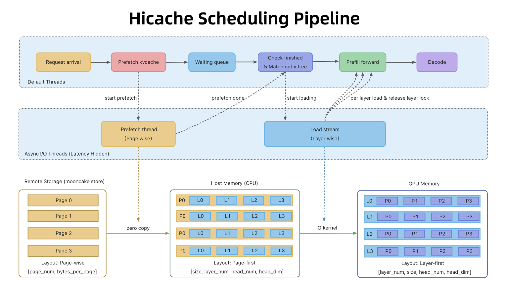

이 페이지는 장 구분 페이지다. slides 제목은 Scheduling Pipeline이라고 하지만 실제로 봐야 할 것은 `HiCacheController`다. 세 종류의 일을 담당한다:

- GPU -> CPU: write through / write back;
- CPU -> GPU: load back, layer 단위로 overlap 처리;
- CPU <-> L3: 프리페치와 백업의 백그라운드 스레드.

`HiCacheController` 초기화 시 layer transfer counter를 등록한다:

```python
class HiCacheController:
    def __init__(..., write_policy="write_through_selective", io_backend="", storage_backend=None, ...):
        self.mem_pool_device_allocator = token_to_kv_pool_allocator
        self.mem_pool_device = token_to_kv_pool_allocator.get_kvcache()
        self.mem_pool_host = mem_pool_host
        self.write_policy = write_policy
        self.io_backend = io_backend

        self.layer_num = self.mem_pool_device.layer_num
        self.layer_done_counter = LayerDoneCounter(self.layer_num)
        self.mem_pool_device.register_layer_transfer_counter(self.layer_done_counter)

        self.write_buffer = TransferBuffer(self.stop_event)
        self.load_buffer = TransferBuffer(self.stop_event, buffer_count=10, max_buffer_size=100)
        self.write_stream = device_module.Stream()
        self.load_stream = device_module.Stream()
```

LMSYS HiCache blog에서 한 가지 점을 언급한다: CPU->GPU 명중 시 HiCache는 layer-wise overlap을 수행한다. 코드는 `start_loading`에 있다:

```python
def start_loading(self) -> int:
    producer_id = self.layer_done_counter.update_producer()
    op = CacheOperation.merge_ops(self.load_queue)
    host_indices, device_indices = self.move_indices(op.host_indices, op.device_indices)
    producer_event = self.layer_done_counter.events[producer_id]

    with device_module.stream(self.load_stream):
        for i in range(self.layer_num):
            self.mem_pool_host.load_to_device_per_layer(
                self.mem_pool_device,
                host_indices,
                device_indices,
                i,
                self.io_backend,
            )
            producer_event.complete(i)
```

여기서 한 층을 완료할 때마다 `producer_event.complete(i)`를 통해 계산 측에 알린다: i번째 층의 데이터를 이제 사용할 수 있다. 모든 층이 다 이동될 때까지 기다린 후 prefill을 시작하는 것이 아니라, layer N 계산 중에 load stream이 layer N+1을 준비할 수 있다. 이것이 HiCache가 CPU->GPU 전송을 prefill에 숨길 수 있는 핵심이다.

GPU->CPU write back은 `start_writing`을 통한다:

```python
def start_writing(self) -> None:
    op = CacheOperation.merge_ops(self.write_queue)
    host_indices, device_indices = self.move_indices(op.host_indices, op.device_indices)

    with device_module.stream(self.write_stream):
        self.mem_pool_host.backup_from_device_all_layer(
            self.mem_pool_device,
            host_indices,
            device_indices,
            self.io_backend,
        )
        finish_event.record()

    self.ack_write_queue.append(HiCacheAck(start_event, finish_event, op.node_ids))
```

여기서 `CacheOperation.merge_ops`는 또 다른 쉽게 놓치는 작은 최적화다. 여러 node의 write back/로드가 하나의 배치 연산으로 합쳐져 커널 launch와 소량 DMA를 줄인다.

L3 프리페치는 백그라운드 스레드다. `prefetch_thread_func`는 먼저 L3 명중 길이를 확인하고, 임계값에 따라 실제로 가져올지 결정한다:

```python
def prefetch_thread_func(self):
    while not self.storage_stop_event.is_set() or not self.prefetch_queue.empty():
        operation = self.prefetch_queue.get(block=True, timeout=1)
        hash_value, storage_hit_count = self._storage_hit_query(operation)

        storage_hit_count_tensor = torch.tensor(storage_hit_count, dtype=torch.int)
        self._all_reduce_prefetch_groups(
            storage_hit_count_tensor,
            torch.distributed.ReduceOp.MIN,
        )
        storage_hit_count = storage_hit_count_tensor.item()

        if storage_hit_count < self.prefetch_threshold:
            self.prefetch_revoke_queue.put(operation.request_id)
            self.append_host_mem_release(operation.host_indices)
        else:
            operation.hash_value = hash_value[: storage_hit_count // self.page_size]
            operation.host_indices = operation.host_indices[:storage_hit_count]
            self.prefetch_buffer.put(operation)
```

이 `all_reduce(min)`이 매우 중요하다. TP 다중 카드 시, 각 rank가 같은 prefix에 대해 일관된 판단을 내려야 한다. rank0이 L3 명중이 1024 token이라고 판단하고 rank1이 960 token만 명중했다면, 최종적으로는 960 기준으로만 가능하다. 그렇지 않으면 page table이 불일치하게 된다.

L3에 쓰는 입구는 `write_storage`다:

```python
def write_storage(self, host_indices, token_ids, hash_value=None, prefix_keys=None) -> int:
    operation = StorageOperation(
        host_indices,
        token_ids,
        hash_value=hash_value,
        prefix_keys=prefix_keys,
    )
    self.backup_queue.put(operation)
    return operation.id
```

`HiRadixCache.write_backup_storage`는 CPU write back 완료 후 node의 host page를 L3에 쓴다:

```python
def write_backup_storage(self, node: TreeNode):
    operation_id = self.cache_controller.write_storage(
        node.host_value,
        node.key,
        node.hash_value,
        prefix_keys,
        **self._get_extra_pools(),
    )
    self.ongoing_backup[operation_id] = node
    node.protect_host()
```

이 일련의 제어 면은 slides의 "CacheController가 cache-aware scheduling과 latency hiding을 유연하게 지원한다"에 대응한다. 단순한 I/O 래퍼가 아니라, 비동기 이벤트, rank 간 일관성, host 메모리 회수, write policy, 프리페치 중단 정책도 담당한다.

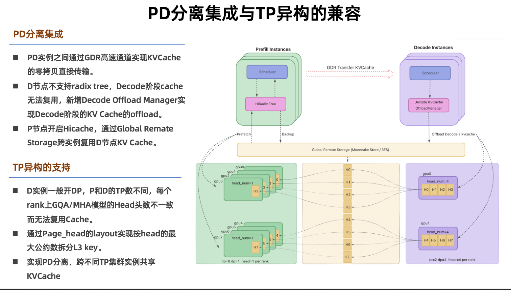

이 페이지는 PD 분리와 TP 이종 호환을 다루며 정보량이 매우 많다.

먼저 PD 분리. SGLang의 P/D 모드에서 Prefill 노드가 KV를 생성하고 Decode 노드가 이어서 사용한다. Mooncake TransferEngine은 GDR/RDMA로 고속 KV transfer를 수행할 수 있다. 문제는 Decode 노드가 radix tree를 사용하지 않아, Decode 측에서 생성된 새 KV가 자연스럽게 Prefill 측의 prefix cache에 들어가지 않는다는 것이다. slides의 방안은 Decode에 offload manager를 추가하여 Decode 단계의 KV도 원격 Global Remote Storage에 write back하는 것이다. 다음 요청이 Prefill 노드에 떨어지면 L3에서 재사용할 수 있다.

SGLang 문서의 시작 방식에서도 이 방향을 볼 수 있다:

```bash
python3 -m sglang.launch_server \
  --disaggregation-mode decode \
  --disaggregation-transfer-backend mooncake \
  --disaggregation-decode-enable-offload-kvcache \
  --hicache-storage-backend hf3fs
```

즉, Prefill 측에서 HiCache를 열어 인스턴스 간 재사용을 하고, Decode 측에서 비동기 offload를 열어 decode로 생성된 KV를 L3에 영속화한다. 이것이 slides의 "P 노드가 Global Remote Storage로 D 노드 KVCache 재사용"의 의미다.

다음으로 TP 이종. 서로 다른 서비스 클러스터가 서로 다른 TP 수를 사용할 수 있다. 예를 들어 Prefill 클러스터 TP8, Decode 또는 다른 재사용 클러스터 TP4. MHA/GQA에서 각 rank는 일부 head만 저장한다. `{model, token, rank}`로 L3 key를 직접 사용하면, TP4와 TP8의 rank 분할이 달라 KV가 맞지 않는다.

`page_head`의 역할은 head 차원을 layout에 명시적으로 넣고, head shard 단위로 여러 객체에 쓰는 것이다. SGLang에는 전용 함수가 있다:

```python
def get_split_heads_page_buffer_meta(self, indices: torch.Tensor, split_factor: int):
    """
    이종 rank KVCache zero copy를 위한 메타데이터 가져오기
    """
    assert self.layout == "page_head"
    assert len(indices) % self.page_size == 0
    assert self.head_num % split_factor == 0
    ptr_list = []
    indices = indices.tolist()

    for index in range(0, len(indices), self.page_size):
        for head_id in range(0, self.head_num, self.head_num // split_factor):
            k_ptr = kv_buffer_data_ptr + ...
            v_ptr = k_ptr + v_offset
            ptr_list.append(k_ptr)
            ptr_list.append(v_ptr)

    element_size = (
        self.layer_num
        * self.dtype.itemsize
        * self.page_size
        * self.head_num
        * self.head_dim
        // split_factor
    )
    return ptr_list, [element_size] * len(ptr_list)
```

Mooncake Store에서 이를 호출한다:

```python
def _get_mha_split_heads_buffer_meta(self, keys, indices):
    ptr_list, element_size_list = (
        self.mem_pool_host.get_split_heads_page_buffer_meta(
            indices,
            self.split_factor,
        )
    )
    key_list = []
    for key_ in keys:
        for suffix in self.mha_suffix:
            key_list.append(f"{key_}_{suffix}_k")
            key_list.append(f"{key_}_{suffix}_v")
    return key_list, ptr_list, element_size_list
```

`split_factor`는 `tp_lcm_size`에서 온다. 온라인에서 L3를 공유하는 TP 집합이 `{4, 8}`이면, LCM은 8이므로 L3에 더 세밀한 8개의 head shard로 저장한다. TP4의 rank는 두 개의 shard를 읽고, TP8의 rank는 하나의 shard를 읽는다. 이렇게 KVCache key가 더 이상 특정 TP 토폴로지에 묶이지 않는다.

이 기능은 공식 HiCache 문서에도 설명되어 있다: MHA 모델에 Mooncake + `page_head` layout 사용 시, HiCache가 `tp_lcm_size`에 따라 head shard를 분할하여 서로 다른 TP 배포가 KVCache를 공유할 수 있게 한다. slides에 그려진 GCD/서로 다른 TP 클러스터가 바로 이것이다.

## 0x4. DeepSeek Sparse Attention이 왜 여전히 메모리에 묶이는가

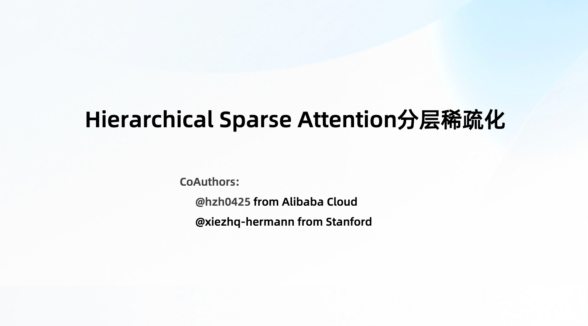

여기서 두 번째 부분: Hierarchical Sparse Attention에 들어간다. 제목 페이지는 개인정보를 펼치지 않으므로, 이후 바로 DSA와 HiSparse의 시스템 문제를 본다.


이 페이지는 DeepSeek Sparse Attention을 다룬다. DeepSeek-V3.2는 V3.1 대비 DSA가 추가되었다. LMSYS의 [DeepSeek-V3.2 Day 0 blog](https://www.lmsys.org/blog/2025-09-29-deepseek-V32/)에서도 같은 내용을 다루었다: DSA는 Lightning Indexer로 관련 token을 빠르게 선별하고, Top-k Selector로 선택된 KV에만 attention을 수행한다.

SGLang 측에 대응되는 것은 Native Sparse Attention, 즉 `nsa_backend.py`와 `nsa_indexer.py` 경로다. DSA의 indexer가 먼저 top-k token indices를 산출한다:

```python
topk_result = metadata.topk_transform(logits, self.index_topk)
```

attention backend가 top-k indices를 page table로 변환한다:

```python
if topk_transform_method == TopkTransformMethod.PAGED:
    page_table_1 = transform_index_page_table_prefill(
        page_table=metadata.page_table_1,
        topk_indices=topk_indices,
        extend_lens_cpu=metadata.nsa_extend_seq_lens_list,
        page_size=1,
    )
```

LMSYS blog에서 DSA가 핵심 attention 복잡도를 `O(L^2)`에서 `O(Lk)`로 낮춘다고 했다. 물론 중요한 일이지만, slides 다음 페이지에서 바로 시스템 수준의 문제를 지적한다.

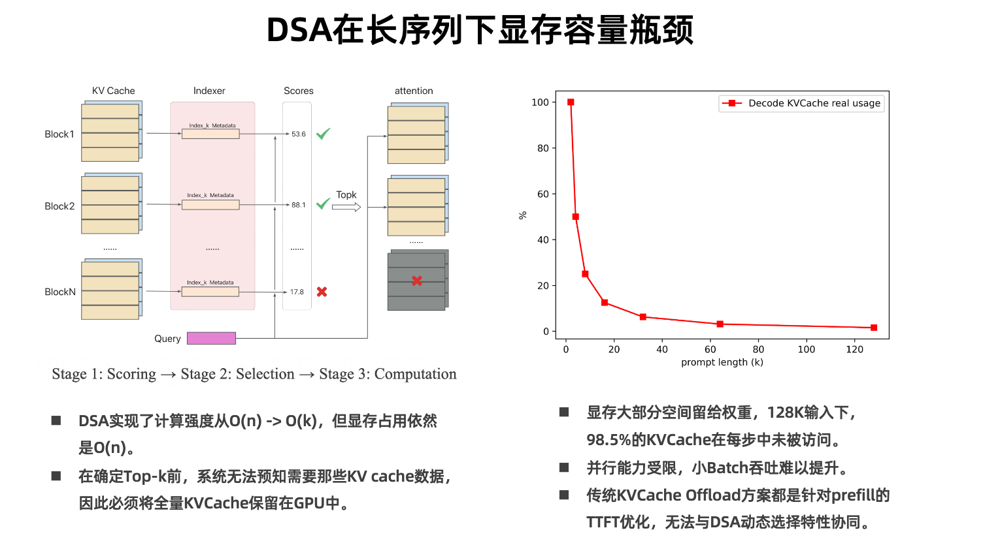

DSA는 계산량을 낮추지만, 자동으로 KVCache 상주 메모리를 낮추지는 않는다.

이유는 간단하다: Top-k는 decode의 각 단계, 각 층에서 동적으로 선택된다. Top-k를 계산하기 전에 시스템은 다음 단계에서 어떤 히스토리 token을 접근할지 알 수 없다. attention이 즉시 KV를 읽을 수 있도록 보장하기 위해, 전통적인 구현은 전체 히스토리 KV를 GPU에 남겨야 한다. 그 결과 attention 연산자는 2K 개 token만 읽지만, 128K의 KVCache가 여전히 메모리를 차지한다.

slides에서 제시한 수치: 128K 입력 시 각 step에서 98.5%의 KVCache가 접근되지 않는다. 여기서 낭비는 compute가 아니라 capacity다. GPU 메모리가 "지금 필요 없지만 다음 순간 필요할 수 있는" 대량의 KV로 채워져 batch size가 올라가지 않는다. Sparse attention의 처리량 곡선이 일찍 plateau에 도달하는 것이 바로 이 때문이다.

LMSYS HiSparse blog에서도 같은 판단을 사용한다: sparse attention이 compute-bound에서 capacity-bound로 변할 수 있다. 계층 메모리 없이는 top-k의 희소성이 동시성으로 전환될 수 없다.

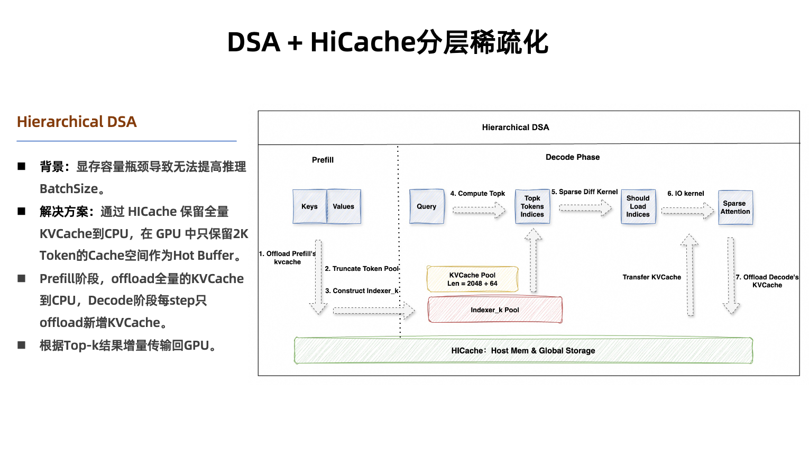

이 페이지는 HiSparse의 핵심 방안을 제시한다:

- CPU pinned memory에 완전한 KV 저장;
- GPU에는 각 요청에 작은 hot buffer만 남김, 예를 들어 2K 또는 4K/6K token slots;
- 각 decode 단계에서 Top-k에 따라 필요한 KV를 GPU로 swap-in;
- 새로 생성된 token의 KV는 다시 비동기적으로 CPU에 백업.

SGLang 문서에는 이미 [HiSparse Guide](https://github.com/sgl-project/sglang/blob/main/docs/advanced_features/hisparse_guide.md)가 있다. HiSparse는 현재 DSA 모델, 예를 들어 DeepSeek-V3.2, GLM-5를 대상으로 하며, decode 단계에서는 작은 hot KV buffer만 유지하고 완전한 KV는 CPU pinned memory에 둔다고 직접 설명한다.

관련 PR은 주로 다음과 같다:

- [#20343 HiSparse for Sparse Attention](https://github.com/sgl-project/sglang/pull/20343): HiSparse를 model runner, KV pool, NSA backend에 연결한다.
- [#21932 Optimize the scheduling of decode backup](https://github.com/sgl-project/sglang/pull/21932): decode backup 스케줄링 최적화.
- [#22238 Add readme docs for HiSparse Feature](https://github.com/sgl-project/sglang/pull/22238): 문서 보완.
- [#22425 Add HiSparse-DSA Model's nightly CI](https://github.com/sgl-project/sglang/pull/22425): CI 추가.
- 더 이전에는 [#11191](https://github.com/sgl-project/sglang/pull/11191)과 [#14619](https://github.com/sgl-project/sglang/pull/14619) 같은 sparse + HiCache 탐구 PR들도 있다.

입구는 `model_runner_kv_cache_mixin.py`에 있다. NSA/DSA 모델이고 `--enable-hisparse`를 열었으면, SGLang이 HiSparse 전용 KV pool로 교체한다:

```python
if is_nsa_model:
    nsa_pool_kwargs = dict(
        size=self.max_total_num_tokens,
        page_size=self.page_size,
        dtype=self.kv_cache_dtype,
        device=self.device,
        kv_cache_dim=self.calculate_mla_kv_cache_dim(),
        index_head_dim=get_nsa_index_head_dim(self.model_config.hf_config),
    )
    if self.enable_hisparse:
        hisparse_cfg = parse_hisparse_config(self.server_args)
        nsa_pool_kwargs["host_to_device_ratio"] = hisparse_cfg.host_to_device_ratio
        self.token_to_kv_pool = HiSparseNSATokenToKVPool(**nsa_pool_kwargs)
    else:
        self.token_to_kv_pool = NSATokenToKVPool(**nsa_pool_kwargs)
```

allocator도 교체해야 한다:

```python
if self.enable_hisparse:
    self.token_to_kv_pool_allocator = HiSparseTokenToKVPoolAllocator(
        self.max_total_num_tokens,
        page_size=self.page_size,
        dtype=self.kv_cache_dtype,
        device=self.device,
        kvcache=self.token_to_kv_pool,
        ...
    )
```

그런 다음 `model_runner.py`에서 `HiSparseCoordinator`를 초기화한다:

```python
if self.enable_hisparse:
    hisparse_cfg = parse_hisparse_config(self.server_args)
    self.hisparse_coordinator = HiSparseCoordinator(
        req_to_token_pool=self.req_to_token_pool,
        token_to_kv_pool_allocator=self.token_to_kv_pool_allocator,
        top_k=hisparse_cfg.top_k,
        device_buffer_size=hisparse_cfg.device_buffer_size,
        device=self.device,
        tp_group=self.attention_tp_group.cpu_group if self.server_args.enable_dp_attention else self.tp_group.cpu_group,
        host_to_device_ratio=hisparse_cfg.host_to_device_ratio,
    )
```

일반적인 설정은 다음과 같다:

```bash
python3 -m sglang.launch_server \
  --kv-cache-dtype bfloat16 \
  --nsa-decode-backend flashmla_sparse \
  --enable-hisparse \
  --hisparse-config '{"top_k": 2048, "device_buffer_size": 6144, "host_to_device_ratio": 10}'
```

여기서 `top_k=2048`은 DSA의 각 층 각 단계에서 볼 token 수이고, `device_buffer_size=6144`가 GPU hot buffer 용량이다. buffer가 top-k보다 큰 것은 인접 step의 top-k 교집합이 GPU에 남아 있어서 매 step마다 CPU에서 다시 가져오지 않기 위함이다.

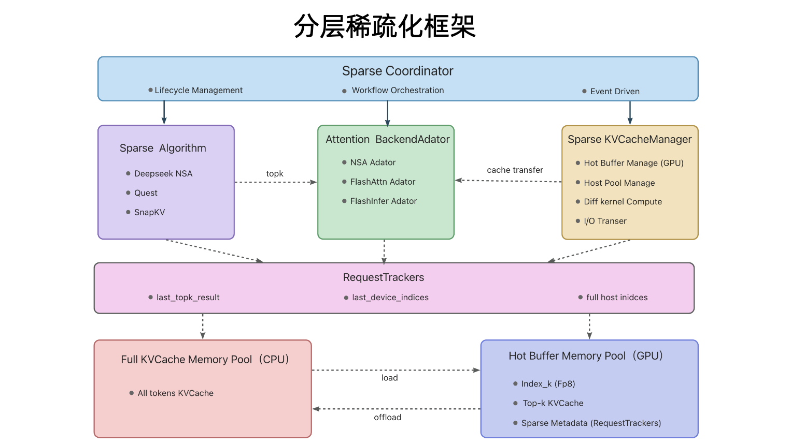

이 페이지는 "계층적 희소화 프레임워크" 장 구분 페이지다. HiCache가 prefix 입도의 계층 캐시이고, HiSparse가 top-k sparse attention 입도의 계층 캐시라고 이해할 수 있다. 전자는 prefill/prefix 재사용에 서비스하고, 후자는 decode/고동시성에 서비스한다.

## 0x5. HiSparse의 hot buffer, diff 커널, LRU

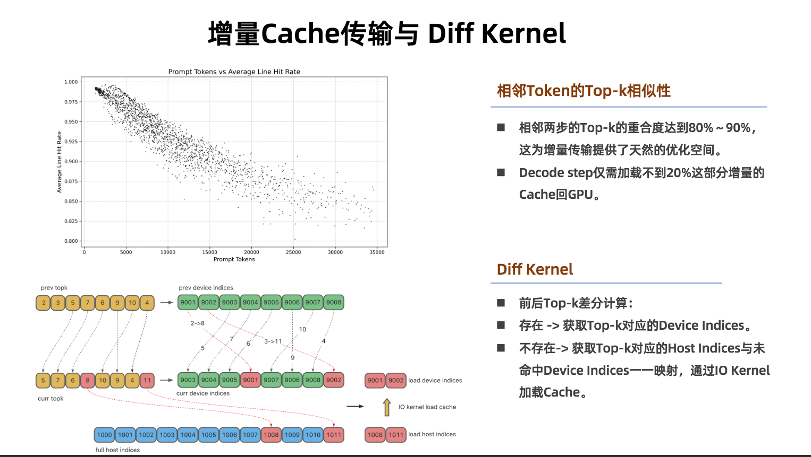

이 페이지는 증분 캐시 transfer를 다룬다. 인접 token의 Top-k overlap이 80%-90%에 달할 수 있으므로, 매 단계마다 2K 개의 Top-k KV를 CPU에서 GPU로 복사할 필요가 없다. 올바른 방법은 diff를 계산하는 것이다:

- 현재 Top-k가 device buffer에 이미 있음: 바로 device loc 반환;
- 현재 Top-k가 device buffer에 없음: host pool에서 host loc 찾고, 축출 가능한 slot 선택 후 device buffer로 복사;
- device buffer의 token->slot 매핑과 LRU 업데이트.

SGLang의 `HiSparseCoordinator`가 바로 이 조정 계층이다. 초기화 시 host KV pool과 여러 매핑 테이블을 만든다:

```python
class HiSparseCoordinator:
    def __init__(..., top_k, device_buffer_size, host_to_device_ratio=2):
        self.top_k = top_k
        self.device_buffer_size = device_buffer_size
        self.mem_pool_device = self.token_to_kv_pool_allocator.get_kvcache()
        self.mem_pool_host = MLATokenToKVPoolHost(
            device_pool=self.mem_pool_device,
            host_to_device_ratio=host_to_device_ratio,
            page_size=1,
            layout="layer_first",
            override_kv_cache_dim=self.mem_pool_device.kv_cache_dim,
        )

        self.req_to_device_buffer = torch.zeros((max_num_reqs, self.padded_buffer_size), ...)
        self.req_to_host_pool = torch.full((max_num_reqs, max_context_len), -1, ...)

        self.req_device_buffer_tokens = torch.full(
            (layer_num, max_num_reqs, self.padded_buffer_size),
            -1,
            dtype=torch.int32,
            device=device,
        )
        self.req_device_buffer_token_locs = torch.full(...)
        self.lru_slots = torch.arange(self.device_buffer_size, dtype=torch.int16, device=device)...
        self.top_k_device_locs_buffer = torch.full((max_num_reqs, self.top_k), -1, ...)
```

각 테이블의 의미:

- `req_to_host_pool[req, token_pos]`: 완전한 KV가 CPU host pool에서의 위치;
- `req_to_device_buffer[req, slot]`: hot buffer slot에 해당하는 device KV loc;
- `req_device_buffer_tokens[layer, req, slot]`: 어떤 층 어떤 요청 어떤 slot이 현재 어떤 token을 담고 있는가;
- `req_device_buffer_token_locs[layer, req, slot]`: slot에 해당하는 device loc;
- `lru_slots[layer, req, :]`: 이 요청 이 층의 LRU 순서.

prefill 완료 후 HiSparse는 이미 있는 KV를 CPU에 백업한다:

```python
def admit_request_into_staging(self, req: Req) -> None:
    logical_indices = self.req_to_token_pool.req_to_token[
        req.req_pool_idx, : len(req.fill_ids)
    ]
    device_indices = self.mem_pool_device._translate_loc_to_hisparse_device(logical_indices)

    host_indices = self.mem_pool_host.alloc(prefill_len)
    self.req_to_host_pool[req.req_pool_idx, :prefill_len] = host_indices

    with device_module.stream(self.write_staging_stream):
        self.mem_pool_host.backup_from_device_all_layer(
            self.mem_pool_device,
            host_indices,
            device_indices,
            io_backend="kernel",
        )
```

PD 분리에서는 더 흥미로운 direct-to-host 경로가 있다:

```python
def admit_request_direct(self, req: Req) -> None:
    """Direct-to-host 경로: KV 데이터가 이미 RDMA를 통해 host pool에 있음."""
    self.alloc_device_buffer(req)

    if req.kv_allocated_len <= self.device_buffer_size:
        self._preload_to_device_buffer(req)
    else:
        self.req_device_buffer_tokens[
            :, req.req_pool_idx, : self.device_buffer_size
        ] = -1

    self._skip_first_backup[req.req_pool_idx] = True
```

이 구간은 HiSparse Guide의 "Prefill GPU가 RDMA를 통해 Decode Host Pool에 직접 쓴다"에 대응한다. Decode 노드는 완전한 KV를 먼저 GPU에 받은 다음 GPU에서 CPU로 staging할 필요가 없다. 작은 device buffer만 할당하고 이후 각 step에서 Top-k에 따라 on-demand로 가져온다.

매 decode step마다 이전 step의 새로 생성된 token KV를 CPU로 백업해야 한다:

```python
def map_last_loc_to_buffer(self, seq_lens, out_cache_loc, req_pool_indices, seq_lens_cpu):
    self._eager_backup_previous_token(
        seq_lens,
        req_pool_indices,
        seq_lens_cpu,
        req_pool_indices.cpu(),
    )
    reserved_buffer_loc = self._grow_device_buffers(...)
    self.req_device_buffer_token_locs[
        :, req_pool_indices, self.device_buffer_size
    ] = reserved_buffer_loc.to(torch.int32)
```

PR [#21932](https://github.com/sgl-project/sglang/pull/21932)의 핵심이 여기 근처에 있다: decode backup이 주 decode 경로를 막아서는 안 되므로, 독립적인 stream과 event를 사용하여 "이전 token을 CPU에 write back"하는 작업을 최대한 우회로로 배치한다.

실제 swap-in은 `swap_in_selected_pages`에 있다:

```python
def swap_in_selected_pages(self, req_pool_indices, seq_lens, top_k_result, layer_id):
    top_k_indices = self.top_k_device_locs_buffer[:num_reqs]
    top_k_indices.fill_(-1)

    load_cache_to_device_buffer_mla(
        top_k_tokens=top_k_result,
        device_buffer_tokens=self.req_device_buffer_tokens[layer_id],
        host_cache_locs=self.req_to_host_pool,
        device_buffer_locs=self.req_device_buffer_token_locs[layer_id],
        host_cache=self.mem_pool_host.kv_buffer[layer_id],
        device_buffer=self.mem_pool_device.kv_buffer[layer_id],
        top_k_device_locs=top_k_indices,
        req_pool_indices=req_pool_indices,
        seq_lens=seq_lens,
        lru_slots=self.lru_slots[layer_id],
        item_size_bytes=self.mem_pool_host.token_stride_size,
        num_top_k=self.top_k,
        hot_buffer_size=self.device_buffer_size,
        page_size=1,
    )
    return top_k_indices
```

NSA backend에서 page table을 HiSparse device loc으로 변환한다:

```python
if forward_batch.hisparse_coordinator is not None:
    page_table_1 = (
        forward_batch.token_to_kv_pool.translate_loc_to_hisparse_device(
            page_table_1
        )
    )
```

즉, attention 커널이 뒤에서 보는 것은 여전히 "Top-k에 해당하는 device loc의 그룹"이지만, 이 loc들이 더 이상 완전한 KVCache pool의 loc이 아니라 hot buffer의 loc이다.

`hisparse.cuh`가 이 페이지에 해당하는 핵심 코드다. 커널의 각 block이 하나의 요청을 처리하며, 짧은 시퀀스는 fast path를 사용한다:

```cpp
if (seq_len <= HOT_BUFFER_SIZE) {
  const int count = (seq_len < NUM_TOP_K) ? static_cast<int>(seq_len) : NUM_TOP_K;
  for (int i = tid; i < count; i += BLOCK_SIZE) {
    int32_t token_pos = req_top_k_tokens[i];
    if (token_pos >= 0) {
      req_top_k_device_locs[i] = req_device_buffer_locs[token_pos];
    }
  }
  return;
}
```

긴 시퀀스만 diff 로직에 들어간다. 첫 번째 단계: 현재 top-k token을 shared memory hash table에 삽입한다:

```cpp
for (int i = tid; i < NUM_TOP_K; i += BLOCK_SIZE) {
  int32_t token_idx = req_top_k_tokens[i];
  if (token_idx == newest_token) {
    s_top_k_tokens[i] = TOKEN_HIT;
    req_top_k_device_locs[i] = req_device_buffer_locs[newest_slot];
    s_newest_hit = 1;
  } else {
    int slot = hash_slot(token_idx, HASH_SIZE);
    while (true) {
      int32_t old = atomicCAS(&s_hash_keys[slot], HASH_EMPTY, token_idx);
      if (old == HASH_EMPTY || old == token_idx) {
        s_hash_vals[slot] = static_cast<int16_t>(i);
        break;
      }
      slot = (slot + 1) % HASH_SIZE;
    }
    s_top_k_tokens[i] = token_idx;
  }
}
```

두 번째 단계: 현재 hot buffer의 LRU slot을 스캔하여 어떤 token이 이미 GPU에 있는지 확인한다:

```cpp
int16_t buf_slot = has_valid_slot ? req_lru_slots[slot_idx] : -1;
int32_t my_buffer_token = (buf_slot >= 0) ? req_device_buffer_tokens[buf_slot] : -1;

if (my_buffer_token >= 0) {
  int h = hash_slot(my_buffer_token, HASH_SIZE);
  while (true) {
    int32_t k = s_hash_keys[h];
    if (k == my_buffer_token) {
      my_found_top_k_idx = static_cast<int32_t>(s_hash_vals[h]);
      break;
    }
    if (k == HASH_EMPTY) break;
    h = (h + 1) % HASH_SIZE;
  }
}

if (is_hit) {
  s_top_k_tokens[my_found_top_k_idx] = TOKEN_HIT;
  req_top_k_device_locs[my_found_top_k_idx] = req_device_buffer_locs[buf_slot];
}
```

세 번째 단계: miss된 token의 축출 slot을 선택하고 host에서 device로 복사한다:

```cpp
if (is_miss) {
  int miss_offset = s_chunk_offset[chunk_idx] + local_miss_offset;
  int16_t evict_slot = s_lru_slots_out[HOT_BUFFER_SIZE - 1 - miss_offset];
  s_top_k_tokens[miss_offset] = my_token;
  req_top_k_device_locs[my_token_idx] = req_device_buffer_locs[evict_slot];
  req_device_buffer_tokens[evict_slot] = my_token;
}

for (int miss_idx = warp_id; miss_idx < total_misses; miss_idx += NUM_WARPS) {
  const int32_t miss_token = s_top_k_tokens[miss_idx];
  const int16_t evict_slot = s_lru_slots_out[HOT_BUFFER_SIZE - 1 - miss_idx];

  const int64_t src_loc = req_host_cache_locs[miss_token];
  const int64_t dst_loc = static_cast<int64_t>(req_device_buffer_locs[evict_slot]);

  const auto src_k = static_cast<const char*>(host_cache_k) + src_loc * item_size_bytes;
  auto dst_k = static_cast<char*>(device_buffer_k) + dst_loc * item_size_bytes;
  transfer_item_warp(lane_id, src_k, dst_k, item_size_bytes);
}
```

이 커널은 세 가지 일을 동시에 한다: hit 확인, LRU 정렬, miss 복사. 이것이 slides의 "Diff 커널" 구현이다.

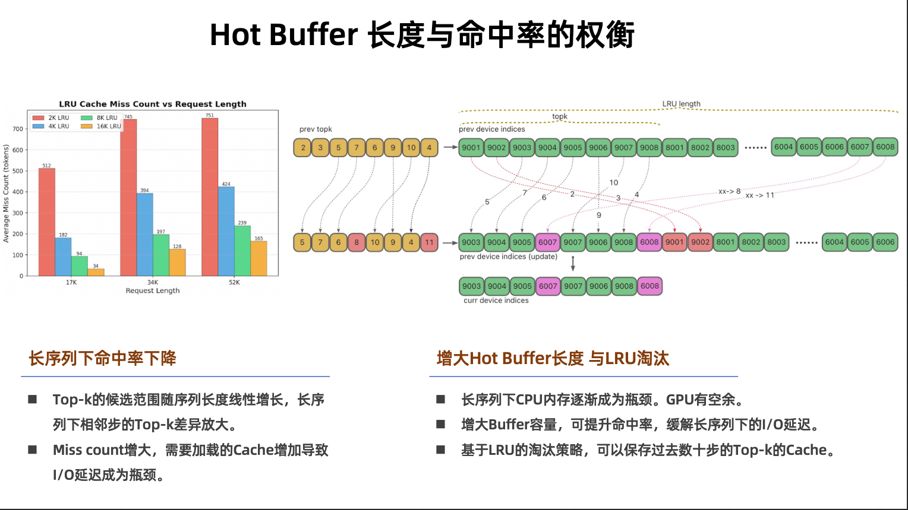

이 페이지는 hot buffer size가 왜 hit rate에 영향을 미치는지 설명한다. 시퀀스가 길수록 Top-k의 후보 범위가 커지고, 인접 step의 Top-k overlap이 감소하며, miss 수가 증가한다. miss가 많아지면 CPU->GPU copy가 decode의 임계 경로가 된다.

따라서 `device_buffer_size`는 임의로 설정할 수 없다. 예를 들어 `top_k=2048`이면, hot buffer도 2048밖에 안 되면 각 step에서 히스토리 명중을 위한 여유가 거의 없다. 4096이나 6144로 설정해야 지난 수십 step의 top-k 결과가 GPU에서 롤링으로 유지될 수 있다. HiSparse blog에도 유사한 결론이 있다: 더 큰 hot buffer에 LRU를 더하면 miss count를 크게 줄인다.

여기서 트레이드오프를 주목해야 한다: hot buffer가 클수록 각 요청이 차지하는 GPU KV 공간이 커지고, batch size 상한이 낮아진다. HiSparse는 GPU KV를 0으로 만드는 것이 아니라, "컨텍스트 길이와 선형으로 증가하는 것"을 "각 요청마다 고정 buffer"로 바꾸는 것이다. 이것만으로도 긴 컨텍스트 decode 동시성을 크게 향상시키기에 충분하다.

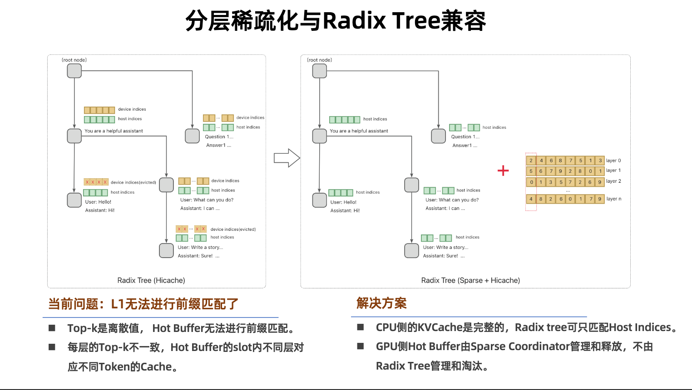

이 페이지는 HiSparse와 Radix Tree의 호환성을 다룬다. 문제가 세밀하다: Radix Tree가 관리하는 것은 연속 prefix이고, Sparse Attention은 각 층에서 이산된 Top-k에 접근한다. 심지어 서로 다른 layer의 Top-k도 다르며, 같은 hot buffer slot이 layer0과 layer20에서 서로 다른 token에 해당할 수 있다. 그렇다면 Radix Tree가 GPU hot buffer를 직접 관리할 수 있는가?

답은 그렇지 않다.

slides의 방안은: CPU KV는 완전하며, Radix Tree는 Host Indices만 매칭하고, GPU Hot Buffer는 Sparse Coordinator가 자체적으로 관리하고 해제한다. 이 설계는 코드에서도 매우 명확하다:

- `HiRadixCache`는 prefix/page 수준의 host storage를 담당하고;
- `HiSparseCoordinator`는 `req_to_host_pool`, `req_device_buffer_tokens`, `lru_slots`를 자체적으로 유지하며;
- attention backend가 Top-k를 받은 후 `hisparse_coordinator.swap_in_selected_pages`를 통해 hot buffer device loc을 얻는다.

이것은 radix tree를 "각 층마다 이산된 Top-k cache tree"로 만드는 것을 피한다. 그렇게 하면 복잡하기도 하고 prefix cache의 의미와도 맞지 않는다.

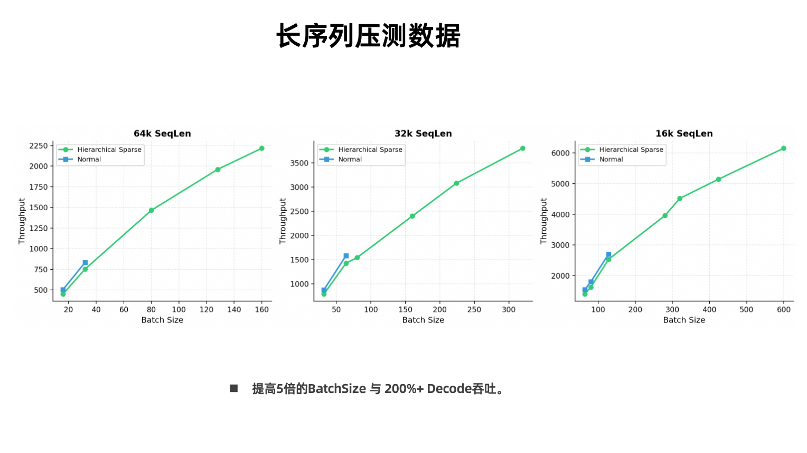

이 페이지는 긴 시퀀스 성능 테스트 결과다: BatchSize 5배 향상, Decode 처리량 200%+ 향상. 시스템 관점에서 이 결과는 합리적이다: DSA가 이미 각 step의 attention compute를 Top-k로 낮추었고, HiSparse가 요청별 GPU KV footprint를 고정 hot buffer로 낮추었으므로 decode batch가 눈에 띄게 커질 수 있다.

이 결과를 재현하려면 세 곳을 우선 보는 것이 좋다:

- `docs/advanced_features/hisparse_guide.md`
- `test/registered/8-gpu-models/test_dsa_models_hisparse.py`
- PR [#22425](https://github.com/sgl-project/sglang/pull/22425)

CI에서는 GLM5/DSA 모델의 HiSparse smoke 테스트를 실행한다. 실제 성능 테스트는 PD 환경, H20/H200 같은 기기, 충분히 긴 입출력, `flashmla_sparse` backend가 필요하다.

## 0x6. Mooncake와 Theta KVPool의 배경

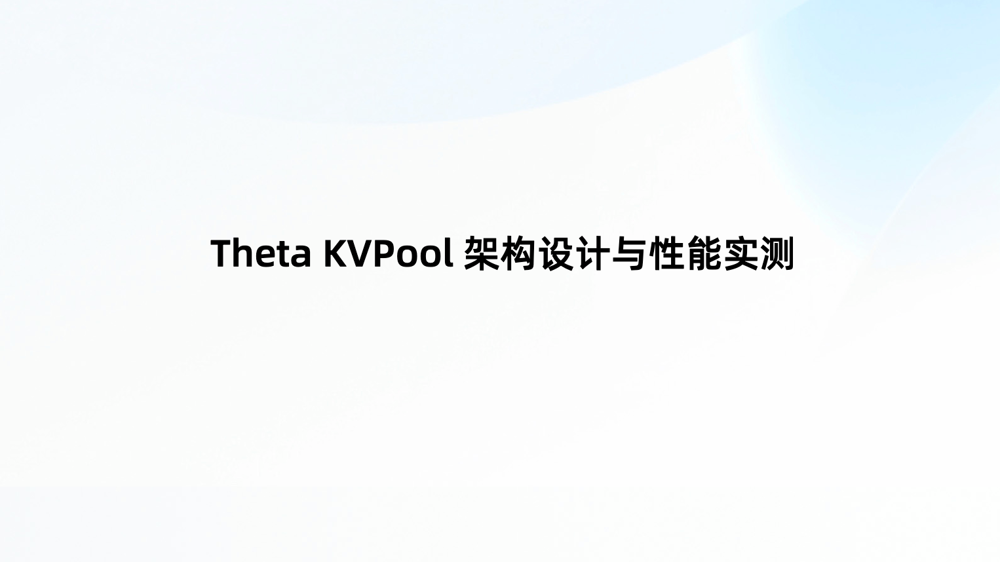

세 번째 부분, Theta KVPool에 들어간다. 여기서 slides는 SGLang 오픈소스 구현에서 앤트그룹 내부 플랫폼으로 전환하지만, 기반은 여전히 Mooncake/SGLang HiCache 사고방식이다.

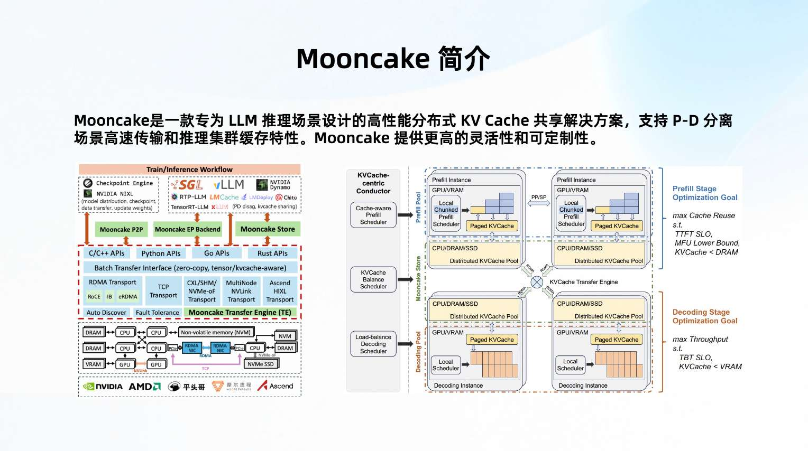

Mooncake는 KVCache 중심의 분산 추론 아키텍처다. 논문은 [Mooncake: A KVCache-centric Disaggregated Architecture for LLM Serving](https://arxiv.org/abs/2407.00079)이며, 코드는 [kvcache-ai/Mooncake](https://github.com/kvcache-ai/Mooncake)에 있다. SGLang의 기본 P/D disaggregation transfer backend도 오랫동안 Mooncake였다.

HiCache에서 Mooncake는 주로 L3 distributed KV store 역할을 한다. SGLang의 Mooncake Store wrapper는 다음에 있다:

```text
python/sglang/srt/mem_cache/storage/mooncake_store/mooncake_store.py
```

설정은 환경 변수로 할 수 있다:

```python
@dataclass
class MooncakeStoreConfig:
    local_hostname: str
    metadata_server: str
    global_segment_size: int
    protocol: str
    device_name: str
    master_server_address: str
    standalone_storage: bool
    client_server_address: str

    @staticmethod
    def load_from_env() -> "MooncakeStoreConfig":
        """
        export MOONCAKE_MASTER=10.13.3.232:50051
        export MOONCAKE_PROTOCOL="rdma"
        export MOONCAKE_DEVICE=""
        export MOONCAKE_TE_META_DATA_SERVER="P2PHANDSHAKE"
        """
```

SGLang 파라미터로도 전달할 수 있다:

```bash
python -m sglang.launch_server \
  --enable-hierarchical-cache \
  --hicache-storage-backend mooncake \
  --hicache-storage-backend-extra-config \
    '{"standalone_storage": true, "client_server_address": "127.0.0.1:50052"}'
```

이 `standalone_storage`가 나중에 slides의 Dummy/Real Client 아키텍처와 대응된다.

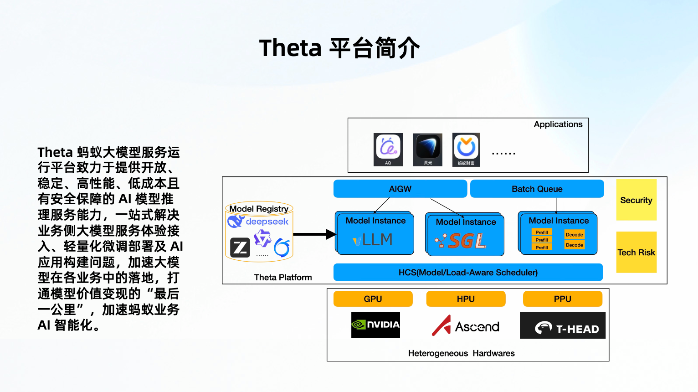

Theta는 앤트그룹의 대형 모델 서비스 플랫폼이다. 이 slides 페이지는 주로 플랫폼 소개다: 모델 서비스 접속, 경량 파인튜닝 배포, AI 애플리케이션, 안정성, 비용, 보안.

이 페이지에 대응하는 SGLang 오픈소스 코드는 없다. 그 의미는 KVPool이 단독 기기 데모가 아니라 서비스 플랫폼의 공유 인프라임을 알려주는 것이다. 플랫폼 계층에 놓여야만 L3 KVCache가 진정으로 인스턴스 간, P/D 역할 간, 테넌트 workload 간 재사용될 수 있다.

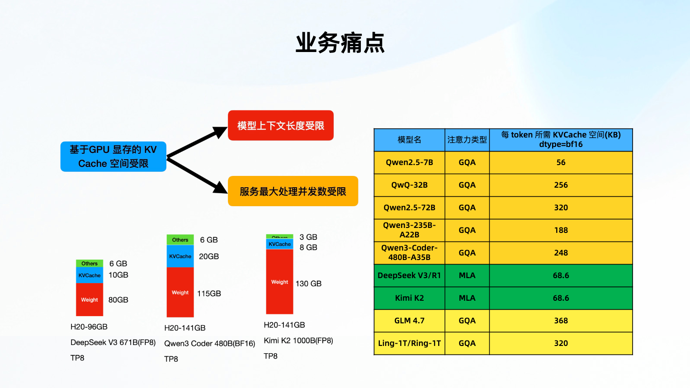

이 페이지에는 서로 다른 모델의 token당 KVCache 크기가 나열되어 있다. 대략 두 가지를 볼 수 있다:

첫째, GQA/MHA 모델의 KV가 보통 MLA 모델보다 훨씬 크다. 예를 들어 GLM 4.7 GQA는 368KB/token, Qwen2.5-72B GQA는 320KB/token이고, DeepSeek V3/R1 MLA는 68.6KB/token, Kimi K2 MLA도 68.6KB/token이다.

둘째, MLA라도 긴 컨텍스트와 큰 batch에서의 총량은 여전히 무섭다. 68.6KB/token에 128K token을 곱하면 단일 요청이 거의 8.6GB 규모의 KV다. 온라인에는 하나의 요청이 아니라 수백 수천 개의 요청이 있다. GPU HBM으로 버티는 것은 반드시 문제가 생긴다.

SGLang의 MLA host pool도 MLA의 KV 형태를 전용으로 처리했다. Mooncake Store에서 `is_mla_backend`를 판단하는데, MLA는 K 측 객체만 필요하고 MHA처럼 K/V 두 개의 head shard가 필요하지 않다:

```python
if self.is_mla_backend:
    key_multiplier = 1
else:
    key_multiplier = 2
```

이것이 HiCache가 MLA의 write back 최적화를 한 이유이기도 하다: MLA에서 여러 TP rank가 같은 KV를 가질 수 있어서, 각 rank가 L3에 하나씩 쓸 필요가 없다.

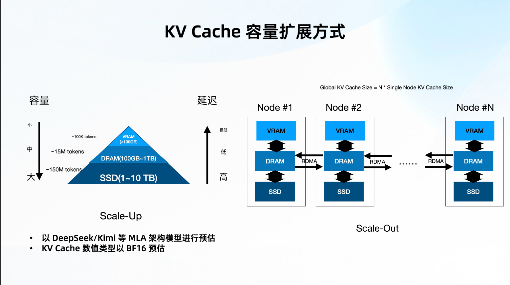

이 페이지는 KVCache 확장 방법을 다룬다. 모델 아키텍처 측면에서는 MLA로 KV 크기를 줄일 수 있고, 시스템 측면에서는 BF16/FP8 KV, CPU/SSD/원격 스토리지, 다중 레벨 캐시, PD 분리, 전역 KVPool을 사용할 수 있다.

SGLang 코드에서 보면, HiCache 이 인터페이스 집합은 이미 storage backend를 추상화했다:

```python
class HiCacheStorage:
    def register_mem_pool_host(self, mem_pool_host): ...
    def batch_exists_v2(self, keys, pool_transfers=None, extra_info=None): ...
    def batch_get_v2(self, transfers, extra_info=None): ...
    def batch_set_v2(self, transfers, extra_info=None): ...
```

v2 인터페이스의 의미는 hybrid model을 지원하는 것이다. KV 외에도 DSA의 indexer cache, Mamba의 state/cache도 `PoolTransfer`로서 L3 읽기/쓰기에 참여할 수 있다:

```python
@dataclass
class PoolTransfer:
    name: str
    keys: List[str]
    host_indices: torch.Tensor
    hit_policy: PoolHitPolicy = PoolHitPolicy.ALL_PAGES
```

PR [#21259](https://github.com/sgl-project/sglang/pull/21259)가 Mooncake backend의 DSA & Mamba 모델 지원이고, PR [#23241](https://github.com/sgl-project/sglang/pull/23241)이 3FS backend의 DSA & Mamba 모델 지원이다. 다시 말해, slides에서 "KVPool"을 말할 때, 미래에는 반드시 표준 attention KV만 pool화하는 것이 아니라 DSA indexer/mamba state 같은 더 잡다한 추론 상태도 pool화할 수 있다.

## 0x7. Dummy/Real Client와 Zero-Copy

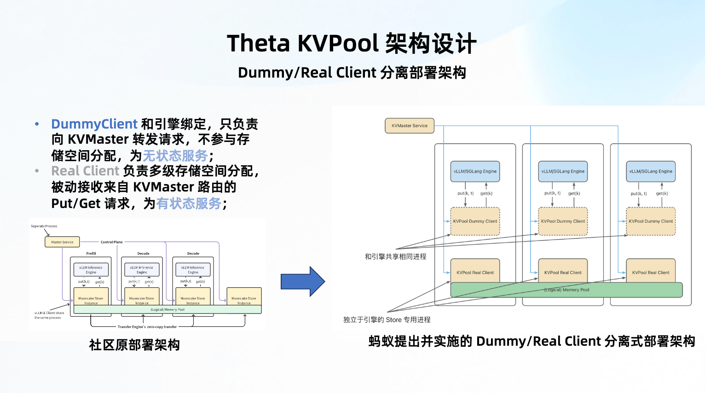

이 페이지는 Theta KVPool의 핵심 아키텍처: Dummy Client와 Real Client 분리다.

일반 커뮤니티 배포에서 SGLang 프로세스 자체가 추론을 실행하면서 동시에 Mooncake client의 RDMA/메모리/리소스 관리도 유지한다. 이 방식은 단순하지만 생산 플랫폼에서는 몇 가지 문제가 있다:

- 추론 프로세스 재시작이 로컬 등록 메모리와 연결 상태에 영향을 줄 수 있다;
- RDMA 리소스, 메모리 풀, SSD 리소스와 engine 생명주기가 너무 강하게 묶여 있다;
- 멀티 모델, 멀티 인스턴스, 플랫폼 스케줄링 시 상태 공유가 어렵다.

Mooncake 공식 문서에도 [Deployment with Dummy Client](https://kvcache-ai.github.io/Mooncake/getting_started/examples/sglang-integration/hicache-integration-v1.html) 절이 있다. 표현은: SGLang Server가 Dummy Client로서 RPC/IPC로 로컬 Store Service에 연결하고, Store Service가 Real Client로서 실제 메모리 풀과 RDMA 연결을 담당한다는 것이다.

slides의 Theta KVPool은 이 패턴을 더 플랫폼화한 것이다:

- `DummyClient`는 engine에 바인딩되어 요청을 `KVMaster`에 전달하기만 하고, 자체적으로는 무거운 리소스를 할당하지 않으며 최대한 stateless다;
- `Real Client`는 다중 레벨 스토리지 할당을 담당하여 `KVMaster`가 라우팅한 Put/Get을 받고 상태를 유지한다;
- `KVMaster`는 KV metadata와 라우팅을 관리한다.

SGLang 기존의 `MooncakeStoreConfig`에는 이미 이 몇 가지 필드가 있다:

```python
class MooncakeStoreConfig:
    standalone_storage: bool
    client_server_address: str
```

`standalone_storage=True`일 때, SGLang 측은 host tensor allocator가 Mooncake에서 온 것을 요구한다:

```python
if config.standalone_storage:
    if not isinstance(mem_pool.allocator, MooncakeHostTensorAllocator):
        raise RuntimeError(
            "MooncakeStore with standalone_storage=True requires MooncakeHostTensorAllocator."
        )
```

이것을 커뮤니티 버전 Dummy Client의 원형으로 이해할 수 있다. Theta 이 페이지에서 추가된 것은 플랫폼 측의 `KVMaster`와 더 완전한 Real Client 리소스 관리다.

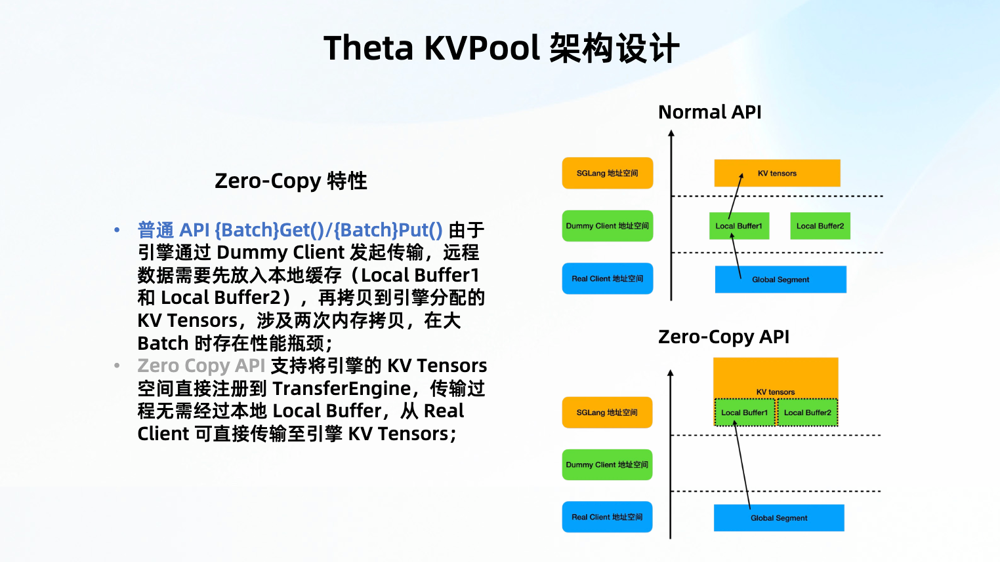

이 페이지는 Zero-Copy를 다룬다. 일반 API의 문제는 중간 buffer가 너무 많다는 것이다:

1. 원격 데이터가 먼저 Real Client의 Local Buffer에 도착하고;
2. 다시 Dummy Client/Engine의 buffer로 복사되며;
3. 마지막으로 engine KV tensor에 써넣는다.

batch가 커지면 병목은 네트워크가 아니라 로컬 메모리 copy와 CPU 스케줄링이 된다.

Mooncake Store의 zero-copy 인터페이스가 바로 이 문제를 해결한다. SGLang은 host pool buffer를 등록한다:

```python
def register_mem_pool_host(self, mem_pool_host: HostKVCache):
    super().register_mem_pool_host(mem_pool_host)
    assert self.mem_pool_host.layout in [
        "page_first",
        "page_first_direct",
        "page_head",
        "page_first_kv_split",
    ]
    buffer = self.mem_pool_host.kv_buffer
    super().register_buffer(buffer)

    bytes_per_page = mem_pool_host.get_ksize_per_token() * mem_pool_host.page_size
    self.gb_per_page = bytes_per_page / (1 << 30)
```

읽기/쓰기는 더 이상 tensor value를 전달하지 않고 대상 주소와 크기를 전달한다:

```python
def batch_set(self, keys, values=None, target_locations=None, target_sizes=None):
    assert len(keys) == len(target_locations) == len(target_sizes)
    put_result = self._put_batch_zero_copy_impl(
        set_keys,
        set_target_locations,
        set_target_sizes,
    )

def batch_get(self, keys, target_locations=None, target_sizes=None):
    get_result = self._get_batch_zero_copy_impl(
        keys,
        target_locations,
        target_sizes,
    )
```

기반은 Mooncake의 `batch_put_from`과 `batch_get_into`다:

```python
def _put_batch_zero_copy_impl(self, key_strs, buffer_ptrs, buffer_sizes):
    return self.store.batch_put_from(key_strs, buffer_ptrs, buffer_sizes)

def _get_batch_zero_copy_impl(self, key_strs, buffer_ptrs, buffer_sizes):
    return self.store.batch_get_into(key_strs, buffer_ptrs, buffer_sizes)
```

이것은 slides의 "Engine KV Tensors를 TransferEngine에 등록하고, Real Client가 Engine KV Tensors에 직접 전송"과 같은 방향이다. 공개된 SGLang 코드에서는 현재 주로 host pool을 등록하고 있으며, Theta 그림에서는 engine KV tensor도 전송 엔진에 등록할 수 있음을 더 강조하여 Dummy/Real 사이의 중간 복사를 줄인다.

Hybrid v2 경로도 zero-copy다:

```python
def _batch_io_v2(self, transfers: List[PoolTransfer], is_set: bool):
    for transfer in transfers:
        host_pool = self.registered_pools.get(transfer.name)
        ptr_list, element_size_list = host_pool.get_page_buffer_meta(host_indices)
        key_strs, key_multiplier = self._get_hybrid_page_component_keys(keys, transfer)

        if is_set:
            put_results = self._put_batch_zero_copy_impl(
                [key_strs[i] for i in missing_idx],
                [ptr_list[i] for i in missing_idx],
                [element_size_list[i] for i in missing_idx],
            )
        else:
            io_results = self._get_batch_zero_copy_impl(
                key_strs,
                ptr_list,
                element_size_list,
            )
```

따라서 이 페이지는 추상적인 "복사 줄이기" 구호가 아니라, 코드에서 인터페이스 형태가 이미 ptr + size로 변경되었다.

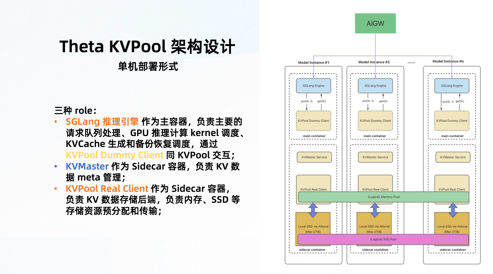

이 페이지는 단일 노드 배포다: SGLang engine 메인 컨테이너가 큐, GPU 추론 커널, KV 생성, 백업/복구 스케줄링을 담당하고, `KVMaster` sidecar가 metadata를 관리하며, `KVPool Real Client` sidecar가 스토리지 backend와 사전 할당 리소스를 관리한다.

이 아키텍처는 Mooncake Dummy Client 문서와 기본적으로 일치하며, Theta는 KVMaster라는 플랫폼 계층 컴포넌트가 추가되었다. 생산 환경에서 이 분리는 몇 가지 실용적인 가치가 있다:

- engine 롤링 업그레이드가 반드시 로컬 KVPool을 비울 필요가 없다;
- Mooncake/RDMA 리소스를 sidecar가 독립적으로 관리할 수 있다;
- KVMaster가 metadata를 서비스로 만들 수 있어 각 engine 안에 분산될 필요가 없다;
- 단일 노드에서 먼저 연결된 후 P/D 분리와 인스턴스 간 공유로 확장이 더 자연스럽다.

SGLang 측에 대응하는 설정이 `standalone_storage`와 `client_server_address`다. Mooncake 문서의 시작 방식은 대략 다음과 같다:

```bash
mooncake_master --eviction_high_watermark_ratio=0.95
mooncake_client --global_segment_size=4GB

python -m sglang.launch_server \
  --enable-hierarchical-cache \
  --hicache-storage-backend mooncake \
  --hicache-storage-backend-extra-config \
    '{"standalone_storage": true, "client_server_address": "127.0.0.1:50052"}'
```

여기의 `mooncake_client`를 Theta의 `KVPool Real Client sidecar`로 바꾸면, 기본적으로 slides의 단일 노드 형태가 된다.

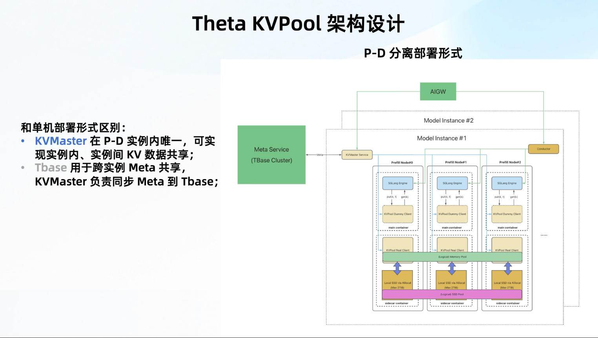

이 페이지는 P-D 분리 배포다. 차이는 `KVMaster`가 하나의 P-D instance 내에서 유일하며, metadata를 Tbase에 동기화하여 인스턴스 간 KV 데이터 공유를 한다는 것이다.

이것을 앞의 HiCache/P-D와 연결할 수 있다:

- Prefill 노드가 긴 prefix KV를 생성하고;
- Decode 노드가 계속 새 token KV를 추가하며;
- Decode offload manager가 이 KV를 KVPool로 write back하고;
- KVMaster/Tbase가 어떤 prefix/page가 어떤 Real Client에 있는지 기록하며;
- 새 요청이 들어왔을 때 Prefill 노드가 전역 KVPool에서 이미 있는 KV를 찾아 recompute를 줄인다.

SGLang 오픈소스의 HiCache L3 metadata는 현재 주로 storage backend 쿼리와 radix hash value로 구동된다. Theta 이 페이지의 KVMaster/Tbase는 플랫폼 측에서 더 강력한 metadata 서비스다. 양자는 모순이 아니다: SGLang engine이 로컬 tree와 실행 경로를 담당하고, 플랫폼 KVPool이 인스턴스 간 metadata와 리소스 라우팅을 담당한다.

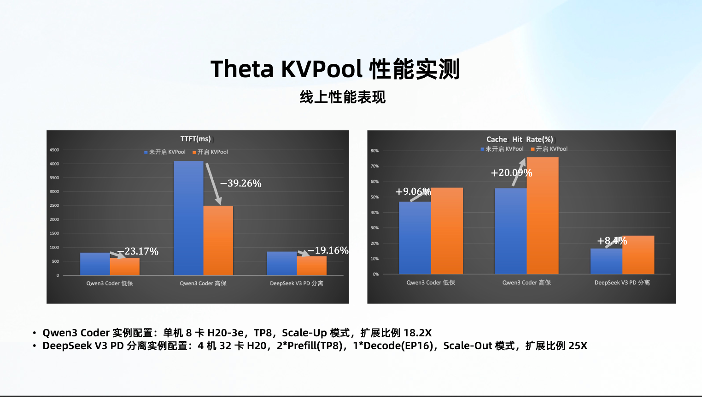

이 페이지는 성능 데이터다. slides에 두 가지 비즈니스 케이스가 있다:

- Qwen3 Coder 단일 8 H20-3e, TP8, scale-up, KV 확장 18.2배;
- DeepSeek V3 PD, 4대 32 H20, 2개 Prefill(TP8) + 1개 Decode(EP16), scale-out, KV 확장 25배.

오른쪽 막대 그래프에는 -23.17%, -39.26%, -19.16%, +9.06%, +20.09%, +8.4% 같은 수치가 있다. 스크린샷에 완전한 legend가 없으므로 각 막대의 정의를 여기서 추측하지 않는다. 확실한 것은, 이 페이지에서 두 가지를 말하고 싶다는 것이다:

1. KVPool 확장 후 캐시 명중과 긴 컨텍스트 처리량에 눈에 띄는 이점이 있다;
2. 이 이점이 단일 노드 소형 실험이 아니라 Qwen3 Coder와 DeepSeek V3의 H20 생산 형태에서 측정된 것이다.

이것은 LMSYS HiCache blog의 앤트그룹 피드백과도 대응된다: DeepSeek-R1-671B의 PD 분리 배포, 일반 QA 요청 샘플링에서 cache hit이 full recompute 대비 TTFT를 크게 낮출 수 있다. blog에서는 cache hit의 평균 TTFT가 84% 낮아진다고 쓰여 있다. slides 여기에는 Theta KVPool 기준의 다른 구성이므로 직접 혼합 계산할 수 없지만, 방향은 일치한다.

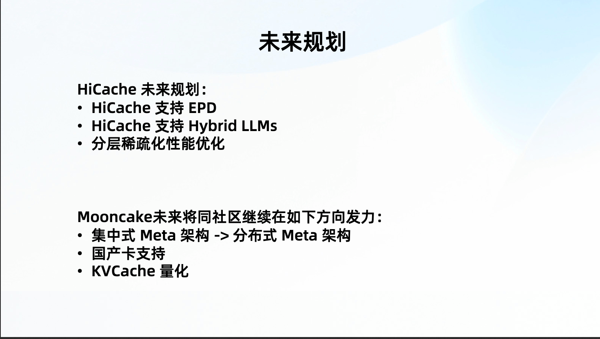

향후 계획은 두 가지 방향이다.

HiCache:

- EPD 지원;
- Hybrid LLMs 지원;
- hierarchical sparse 성능 최적화.

여기서 EPD는 SGLang 이후의 encoder-prefill-decode 분리 방향으로 연상할 수 있다. Hybrid LLMs는 DSA/Mamba/linear attention 같이 표준 KV만 있는 것이 아닌 모델에 해당한다. PR [#21259](https://github.com/sgl-project/sglang/pull/21259)와 [#23241](https://github.com/sgl-project/sglang/pull/23241)에서 이미 이 경로를 볼 수 있다: Mooncake/3FS backend가 더 이상 KV만 처리하는 것이 아니라 `PoolName.INDEXER`, `PoolName.MAMBA` 같은 추가 상태도 처리해야 한다.

Mooncake:

- central Meta -> distributed Meta;
- 중국산 가속카드 지원;
- KVCache 양자화.

central Meta에서 distributed Meta로의 전환은 쉽게 이해된다: 전역 KVPool의 모든 metadata가 하나의 중앙 서비스에 묶여 있으면, 규모가 커지면 새로운 병목이 된다. 중국산 가속카드 지원과 KVCache 양자화는 플랫폼 실용화에서 반드시 만나게 되는 비용 문제다.

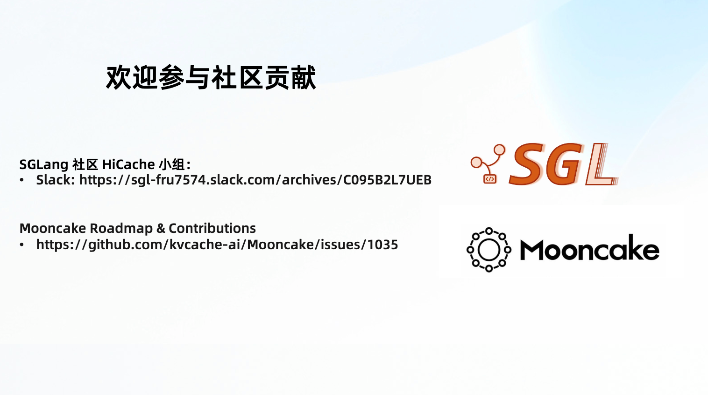

마지막 페이지에서는 커뮤니티 기여 입구를 제공한다:

- SGLang HiCache Slack: `https://sgl-fru7574.slack.com/archives/C095B2L7UEB`
- Mooncake roadmap: `https://github.com/kvcache-ai/Mooncake/issues/1035`

코드에서만 시작한다면, 다음 순서로 읽는 것을 권장한다:

1. 먼저 `hiradix_cache.py`를 읽어 HiCache가 RadixCache 위에서 L1/L2/L3 메타데이터를 어떻게 확장하는지 파악한다;
2. 다음으로 `cache_controller.py`를 읽어 load/write/prefetch의 비동기 스케줄링과 layer-wise overlap을 본다;
3. 그런 다음 `memory_pool_host.py`와 `transfer.cu`를 읽어 `layer_first/page_first/page_first_direct/page_head`가 왜 존재하는지 이해한다;
4. 이어서 `mooncake_store.py`를 읽어 zero-copy의 `target_locations/target_sizes`가 Mooncake에 어떻게 연결되는지 본다;
5. 마지막으로 `hisparse_coordinator.py`와 `hisparse.cuh`를 읽어 DSA에서 hot buffer + diff 커널 + LRU의 구현을 이해한다.

## 0x8. 소결

이 slides는 사실 SGLang의 최근 1년간 KVCache 방향의 몇 가지 큰 주제를 하나로 연결했다.

HiCache가 해결하는 것은 "GPU prefix cache 용량 부족"이다: RadixTree가 계속 prefix metadata를 하고, CPU와 L3가 확장하며, CacheController가 비동기 이동, 프리페치, 재채움, write back을 담당한다.

Host layout과 IO 커널이 해결하는 것은 "다중 레벨 스토리지가 단순히 cudaMemcpy에만 의존할 수 없다"는 것이다: GPU 계산은 layer-first를 선호하고, L3 스토리지는 page-first를 선호하며, 이종 TP에는 page-head도 필요하다. SGLang은 이 layout들을 위해 전용 transfer 커널을 작성하여 layout transform의 비용을 최대한 낮춘다.

HiSparse가 해결하는 것은 "Sparse Attention이 계산은 절감했지만 메모리는 절감하지 못했다"는 것이다: 완전한 KV는 CPU에 두고, GPU에는 고정 hot buffer만 유지하며, decode의 각 step에서 Top-k에 따라 hit/miss diff와 LRU swap-in을 수행한다. 이 부분의 핵심 코드가 이미 `hisparse.cuh`에 있으며, 종이 설계가 아니다.

Theta KVPool이 해결하는 것은 "단일 engine 내의 캐시가 아직 생산화에 부족하다"는 것이다: Mooncake/HiCache의 L3 능력을 플랫폼화하여 Dummy/Real Client, KVMaster, sidecar, zero-copy, P/D 인스턴스 간 metadata를 분리한다. 공개된 SGLang에서 Mooncake Store와 standalone storage의 기본 형태를 볼 수 있으며, Theta slides는 앤트그룹 생산 플랫폼에서 이것을 한 걸음 더 나아가게 했음을 보여준다.

이런 시스템은 "KVCache를 CPU/SSD에 두면 된다"로 쉽게 오해된다. 실제로는 그렇지 않다. 진정으로 어려운 것은: 언제 가져올 가치가 있는가, 얼마나 가져올 것인가, 계산과 어떻게 overlap할 것인가, 서로 다른 TP가 어떻게 재사용할 것인가, decode 새 KV를 어떻게 write back할 것인가, 원격 metadata를 어떻게 조회할 것인가, I/O 소량 블록을 어떻게 합칠 것인가, hot buffer miss를 어떻게 처리할 것인가이다. slides의 각 페이지가 그 중 하나의 작은 문제에 답하고 있으며, 합쳐져야 온라인에서 실행 가능한 대규모 KVCache 다중 레벨 캐시 시스템이 된다.
