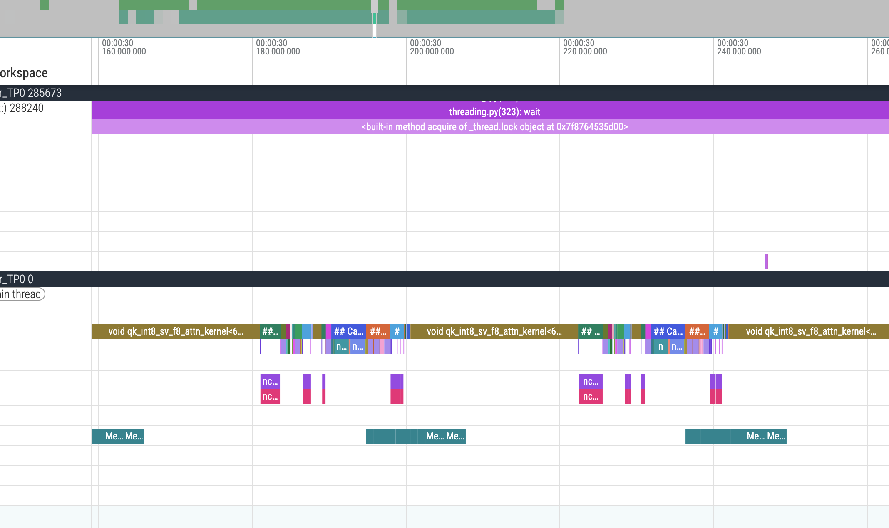
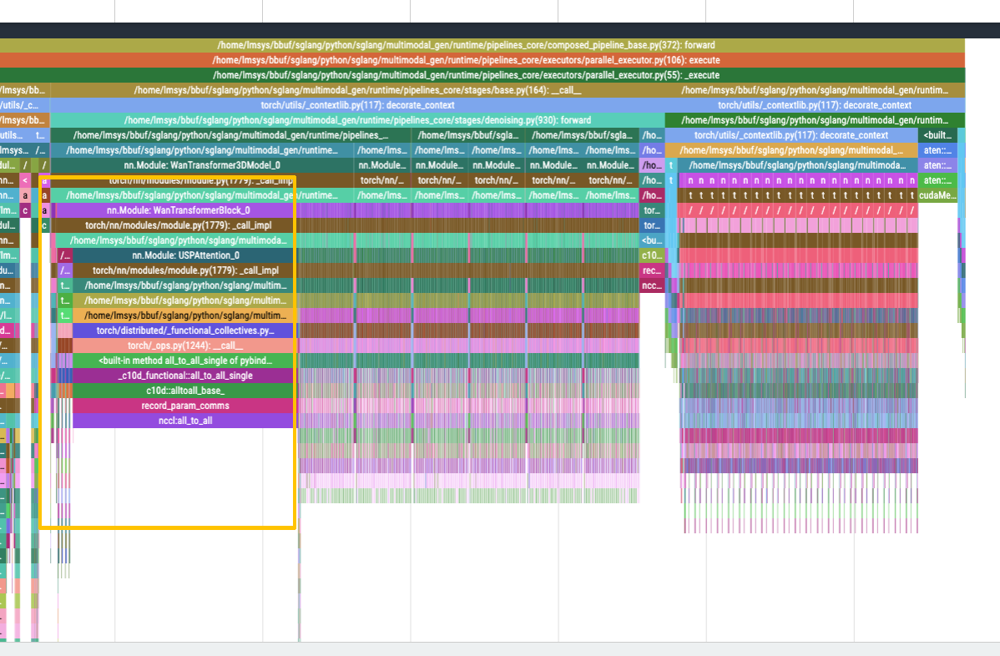

# 제로 오버헤드 계층별 가중치 오프로딩으로 SGLang Diffusion wan2.2 추론 속도 60퍼센트 가속하기

## 0x0. 서문

최근 SGLang의 Wan2.2 비디오 생성 모델 지원을 최적화하던 중 성능 문제를 발견했습니다. dual Transformer 아키텍처를 사용할 때 1번째 step과 19번째 step의 추론 속도가 정상 step보다 약 7배 느렸습니다. 깊이 분석한 뒤 **제로 오버헤드 계층별 가중치 오프로딩**(Layerwise Weight Offload) 기술을 구현했고, 최종적으로 전체 추론 속도를 **60%** 향상했습니다(149.69초에서 94.22초로 감소). 이 기술의 핵심 코드 구현 부분은 Skywork AI Infra의 비디오 모델 최적화에서 수정해 가져왔다는 점을 설명해 둡니다(https://github.com/sgl-project/sglang/blob/main/python/sglang/multimodal_gen/runtime/utils/layerwise_offload.py#L8).

이 최적화는 성능 향상뿐 아니라 Wan2.2 모델의 GPU 메모리 장벽도 깨뜨렸습니다. 예를 들어 이제 **24GB GPU 메모리의 4090**에서 OOM 없이 wan2.2를 실행할 수 있어 실용적 의미도 꽤 있습니다. 또한 이 최적화는 HunyuanVideo 같은 다른 모델로도 쉽게 확장할 수 있습니다. 이 글에서는 문제 발견, 분석, 해결 과정을 자세히 소개합니다.

관련 PR: https://github.com/sgl-project/sglang/pull/15511

테스트 환경: 8카드 H100

## 0x1. 문제 발견: 왜 Wan2.2는 이렇게 느린가?

### 0x1.1 성능 병목 찾기

Wan2.2 모델을 전체 profiling한 뒤 이상한 현상을 발견했습니다.

- 1번째 step과 19번째 step: 각각 약 36초와 31초가 걸려 비정상적으로 느립니다.
- 중간 step(2-18번째 step): 약 3.2초가 걸려 성능이 정상이며, cp4에서 cp8로 갔을 때 기대한 2배 가속에 완전히 부합합니다.
- 다른 step(20-27번째 step): 약 3.2초가 걸려 성능이 정상입니다.

1번째 step과 19번째 step의 시간은 정상 step 7개에 해당하므로 명백히 받아들일 수 없습니다.

main 브랜치 데이터:

```shell
sglang generate   --model-path Wan-AI/Wan2.2-T2V-A14B-Diffusers   --text-encoder-cpu-offload   --pin-cpu-memory   --num-gpus 8   --ulysses-degree 8 --attention-backend sage_attn  --enable-torch-compile --prompt "A cat walks on the grass, realistic" --num-frames 81 --height 720 --width 1280 --num-inference-steps 27 --guidance-scale 3.5 --guidance-scale-2 4.0 --perf-dump-path /home/lmsys/bbuf/dump/wan_step_profile_cp8_main.json

100%|███████████████████████████████████████████████████████████████████████████████████████████████████████████████████████████████████████████████████████████████████████| 27/27 [02:28<00:00,  5.52s/it]
[12-19 08:37:22] [DenoisingStage] average time per step: 5.5156 seconds
[12-19 08:37:23] [DenoisingStage] finished in 149.6943 seconds


"denoise_steps_ms": [
    35999.06893167645,
    3261.483933776617,
    3270.5406425520778,
    3267.8588768467307,
    3260.3964526206255,
    3263.016454875469,
    3268.026988953352,
    3264.5184732973576,
    3264.636719599366,
    3267.1875776723027,
    3268.562350422144,
    3268.1023878976703,
    3266.7769035324454,
    3268.044295720756,
    3264.268895611167,
    3271.0087513551116,
    3267.674465663731,
    3266.1060262471437,
    31282.590138725936,
    3263.5639663785696,
    3262.301029637456,
    3262.3210102319717,
    3261.833382770419,
    3264.719443395734,
    3265.314467251301,
    3267.530156299472,
    3261.9533529505134
  ],
```

이 글에서 소개하는 최적화 이후의 데이터:


```bash
sglang generate   --model-path Wan-AI/Wan2.2-T2V-A14B-Diffusers   --text-encoder-cpu-offload   --pin-cpu-memory   --num-gpus 8   --ulysses-degree 8 --attention-backend sage_attn  --enable-torch-compile --prompt "A cat walks on the grass, realistic" --num-frames 81 --height 720 --width 1280 --num-inference-steps 27 --guidance-scale 3.5 --guidance-scale-2 4.0 --dit-layerwise-offload true --perf-dump-path /home/lmsys/bbuf/dump/wan_step_profile_cp8_async_offload.json


100%|██████████████████████████████████████████████████████████████████████████████████████████████████| 27/27 [01:33<00:00,  3.46s/it]
[12-20 02:59:10] [DenoisingStage] average time per step: 3.4553 seconds
[12-20 02:59:10] [DenoisingStage] finished in 94.2283 seconds

"denoise_steps_ms": [
    7717.6975486800075,
    3275.042257271707,
    3280.2467988803983,
    3282.276245765388,
    3292.9044039919972,
    3286.5121429786086,
    3273.5616639256477,
    3271.6003246605396,
    3275.5934856832027,
    3291.9061705470085,
    3293.934356421232,
    3289.3909830600023,
    3298.0582248419523,
    3300.408118404448,
    3305.0247132778168,
    3299.3013756349683,
    3302.0150866359472,
    3299.040620215237,
    3291.0401169210672,
    3296.6199973598123,
    3290.26335850358,
    3302.190547809005,
    3295.942653901875,
    3297.3329443484545,
    3297.713255509734,
    3295.0284238904715,
    3290.1963284239173
  ],
```


### 0x1.2 근본 원인 분석

코드와 profiling 결과를 깊이 분석해 문제의 근본 원인을 찾았습니다.

1. Wan2.2는 **dual Transformer 아키텍처**를 사용합니다. 모델은 `transformer`와 `transformer_2`라는 두 개의 큰 Transformer module을 포함합니다.
2. **dit_cpu_offload**가 활성화되어 있습니다. GPU 메모리를 절약하기 위해 모델 가중치는 로드 후 CPU에 배치됩니다.
3. 1번째 step의 overhead: 첫 추론 때 `transformer`와 `transformer_2`의 가중치를 CPU에서 GPU로 복사해야 하므로 1번째 step이 매우 느립니다. 또한 첫 step에는 torch compile, nccl 초기화 같은 overhead도 있습니다.
4. 19번째 step의 overhead: 19번째 step에서 **dual-stream 전환**이 발생합니다. 두 Transformer의 가중치를 CPU로 다시 내리고, 서로 교체한 뒤 다시 GPU로 복사해야 합니다.

이런 전체 모델 수준의 가중치 이동이 막대한 성능 손실을 일으켰습니다.

## 0x2. 해결책: 제로 오버헤드 계층별 가중치 오프로딩

### 0x2.1 핵심 아이디어

전통적인 `dit_cpu_offload`는 전체 모델 가중치를 한 번에 CPU와 GPU 사이에서 이동합니다. 이는 다음을 초래합니다.

- 대량의 데이터 전송 시간
- GPU 계산과 데이터 전송의 overlap 불가
- dual-stream 전환 시 모든 가중치를 다시 이동해야 함

**제로 오버헤드 계층별 가중치 오프로딩**의 핵심 아이디어는 다음과 같습니다.

1. **계층별 관리**: 필요할 때만 특정 계층의 가중치를 CPU에서 GPU로 로드합니다.
2. **비동기 prefetch**: 독립 CUDA Stream을 사용해 다음 계층의 가중치를 미리 가져옵니다.
3. **계산과 전송 overlap**: 현재 계층이 계산 중일 때 다음 계층 가중치는 이미 비동기 로드 중입니다.
4. **즉시 해제**: 현재 계층 계산이 끝나면 즉시 해당 GPU 메모리를 해제합니다.
5. **Pin Memory 최적화**: CPU의 가중치를 물리 메모리에 pin해 page swap을 피합니다. 이는 제로 오버헤드를 구현하는 데 매우 중요합니다.

이렇게 하면 추가 오버헤드가 0에 가까워집니다. 데이터 전송이 계산에 완전히 가려져 전체 추론 시간을 늘리지 않기 때문입니다.

### 0x2.2 구현 세부 사항

#### LayerwiseOffloadManager 핵심 클래스

가벼운 계층별 CPU offload manager를 구현했습니다. 핵심 기능은 다음과 같습니다.

```python
class LayerwiseOffloadManager:
    """A lightweight layerwise CPU offload manager.
    
    This utility offloads per-layer parameters/buffers from GPU to CPU, and
    supports async H2D prefetch using a dedicated CUDA stream.
    """
    
    def __init__(
        self,
        model: torch.nn.Module,
        *,
        module_list_attr: str,  # for example "blocks"
        num_layers: int,
        enabled: bool,
        pin_cpu_memory: bool = True,
        auto_initialize: bool = False,
    ):
        # Create an independent CUDA Stream for async copy.
        self.copy_stream = torch.cuda.Stream() if self.enabled else None
        # Store weights on CPU.
        self._cpu_weights: Dict[int, Dict[str, torch.Tensor]] = {}
        # Track which layers are on GPU.
        self._gpu_layers: Dict[int, Set[str]] = {}
```

#### 초기화: 모든 계층 가중치를 CPU로 offload

```python
def initialize(self) -> None:
    if not self.enabled:
        return
    
    # Iterate over all parameters and buffers.
    for name, param in self._named_parameters.items():
        layer_idx = self._match_layer_idx(name)
        if layer_idx is None or layer_idx >= self.num_layers:
            continue
        # Offload to CPU and pin memory.
        self._offload_tensor(name, param, layer_idx)
    
    # Prefetch layer 0.
    self.prefetch_layer(0, non_blocking=False)
```

여기서 핵심은 `_offload_tensor` 메서드가 CPU의 tensor에 pin memory 작업을 수행한다는 점입니다.

```python
cpu_weight = tensor.detach().to("cpu")
if self.pin_cpu_memory:
    cpu_weight = cpu_weight.pin_memory()  # Lock physical memory.
```

**Pin memory**의 역할은 메모리 페이지를 물리 메모리에 고정해 운영체제가 디스크로 swap하지 못하게 하는 것입니다. 이렇게 하면 두 가지 장점이 있습니다.

1. **비동기 복사**(non_blocking=True)는 pinned memory에만 유효합니다. 그렇지 않으면 동기 복사로 퇴화합니다.
2. **DMA**(Direct Memory Access)가 pinned memory에 직접 접근할 수 있어 전송 속도가 더 빠릅니다.

Wan2.2 같은 대형 모델 장면에서 pin memory를 사용하지 않으면 비동기 복사가 무효화되고, 계산과 전송이 overlap될 수 없습니다. 그러면 제로 오버헤드는 말할 수도 없습니다.

#### 비동기 prefetch: 다음 계층을 미리 로드

```python
def prefetch_layer(self, layer_idx: int, non_blocking: bool = True) -> None:
    if not self.enabled:
        return
    
    # Wait for the main stream to finish current compute.
    self.copy_stream.wait_stream(torch.cuda.current_stream())
    
    # Copy weights asynchronously in an independent stream.
    for name, cpu_weight in self._cpu_weights[layer_idx].items():
        gpu_weight = torch.empty(
            cpu_weight.shape,
            dtype=self._cpu_dtypes[layer_idx][name],
            device=self.device,
        )
        with torch.cuda.stream(self.copy_stream):
            gpu_weight.copy_(cpu_weight, non_blocking=non_blocking)
        target.data = gpu_weight
```

#### 계층 단위 scope: 우아한 사용 방식

```python
@contextmanager
def layer_scope(
    self,
    *,
    prefetch_layer_idx: int | None,
    release_layer_idx: int | None,
    non_blocking: bool = True,
):
    """Prefetch the next layer on enter, then wait for copy and release current layer on exit."""
    if self.enabled and prefetch_layer_idx is not None:
        self.prefetch_layer(prefetch_layer_idx, non_blocking=non_blocking)
    try:
        yield
    finally:
        if self.enabled and self.copy_stream is not None:
            # Wait for async copy to finish.
            torch.cuda.current_stream().wait_stream(self.copy_stream)
        if self.enabled and release_layer_idx is not None:
            self.release_layer(release_layer_idx)
```

#### 모델 forward에서 사용하기

Wan2.2의 Transformer forward에 통합합니다.

```python
offload_mgr = getattr(self, "_layerwise_offload_manager", None)
if offload_mgr is not None and getattr(offload_mgr, "enabled", False):
    for i, block in enumerate(self.blocks):
        with offload_mgr.layer_scope(
            prefetch_layer_idx=i + 1,  # Prefetch the next layer.
            release_layer_idx=i,        # Release the current layer.
            non_blocking=True,
        ):
            hidden_states = block(
                hidden_states,
                encoder_hidden_states,
                timestep_proj,
                freqs_cis,
            )
```

`layer_scope` context manager를 통해 다음이 이루어집니다.

- i번째 계층을 실행할 때 i+1번째 계층의 가중치는 이미 비동기 로드 중입니다.
- i번째 계층 계산이 완료되면 즉시 해당 GPU 메모리를 해제합니다.
- 데이터 전송과 계산이 완전히 overlap되어 제로 오버헤드를 구현합니다.

### 0x2.3 사용 방식

SGLang 서비스를 시작할 때 `--dit-layerwise-offload true` 파라미터를 추가합니다. 아래는 8카드 H100에서의 테스트 명령입니다.

```bash
sglang generate \
  --model-path Wan-AI/Wan2.2-T2V-A14B-Diffusers \
  --text-encoder-cpu-offload \
  --pin-cpu-memory \
  --num-gpus 8 \
  --ulysses-degree 8 \
  --attention-backend sage_attn \
  --enable-torch-compile \
  --dit-layerwise-offload true \
  --prompt "A cat walks on the grass, realistic" \
  --num-frames 81 \
  --height 720 \
  --width 1280 \
  --num-inference-steps 27 \
  --guidance-scale 3.5 \
  --guidance-scale-2 4.0
```

주의:

- `--dit-layerwise-offload`는 `dit_cpu_offload`, `use_fsdp_inference`, `cache-dit`와 동시에 사용할 수 없습니다.

## 0x3. 성능 향상

### 0x3.1 main 브랜치 vs PR 브랜치

**main 브랜치(`dit_cpu_offload` 사용)**:

```
[12-19 08:37:22] [DenoisingStage] average time per step: 5.5156 seconds
[12-19 08:37:23] [DenoisingStage] finished in 149.6943 seconds

"denoise_steps_ms": [
    35999.07,  // step 1: 36 seconds!
    3261.48, 3270.54, 3267.86, 3260.40, 3263.02, 3268.03, 3264.52,
    3264.64, 3267.19, 3268.56, 3268.10, 3266.78, 3268.04, 3264.27,
    3271.01, 3267.67, 3266.11,
    31282.59,  // step 19: 31 seconds!
    3263.56, 3262.30, 3262.32, 3261.83, 3264.72, 3265.31, 3267.53, 3261.95
]
```

**PR 브랜치(`dit_layerwise_offload` 사용)**:

```
[12-20 02:59:10] [DenoisingStage] average time per step: 3.4553 seconds
[12-20 02:59:10] [DenoisingStage] finished in 94.2283 seconds

"denoise_steps_ms": [
    7717.70,   // step 1: 7.7 seconds, 78% improvement!
    3275.04, 3280.25, 3282.28, 3292.90, 3286.51, 3273.56, 3271.60,
    3275.59, 3291.91, 3293.93, 3289.39, 3298.06, 3300.41, 3305.02,
    3299.30, 3302.02, 3299.04,
    3291.04,   // step 19: 3.3 seconds, 89% improvement!
    3296.62, 3290.26, 3302.19, 3295.94, 3297.33, 3297.71, 3295.03, 3290.20
]
```

### 0x3.2 성능 분석

데이터를 보면 다음과 같습니다.

- **전체 가속**: 149.69초 → 94.22초, 58% 향상
- **1번째 step 가속**: 36초 → 7.7초, 78% 향상
- **19번째 step 가속**: 31초 → 3.3초, 89% 향상
- **중간 step**: 3.2-3.3초를 유지하며 성능이 안정적입니다.

아래는 torch profiler의 trace 스크린샷입니다. memcpy와 compute가 완전히 overlap되어 추가 overhead가 없음을 명확히 볼 수 있습니다.



timeline을 보면 **H2D memcpy 작업과 kernel 실행이 완전히 겹칩니다**. 이것이 제로 오버헤드의 표현입니다. 비동기 복사는 독립 stream에서 수행되며, main stream의 계산을 막지 않습니다.

## 0x4. 추가 최적화: All2All warmup

가중치 오프로딩 문제를 해결한 뒤에도 torch compile 활성화 여부와 관계없이 1번째 step 성능이 여전히 후속 step보다 약 7배 느리다는 것을 발견했습니다. 전체 profiling을 통해 이는 **NCCL All2All 작업의 초기화 overhead** 때문임을 알았습니다.



이 초기화 overhead는 denoise 단계에서 발생해서는 안 되고 미리 처리되어야 합니다. 그래서 All2All 작업만을 위한 **warmup 로직**을 구현했습니다. warmup 이후 compile을 켜지 않았을 때 1번째 step 시간은 거의 후속 step과 같아졌고, compile을 켰을 때도 1번째 step 시간은 후속 step의 약 2배에 그쳤습니다. 7배가 아니게 된 것입니다. NCCL All2All 초기화 overhead가 미리 제거되어 denoise 단계의 1번째 step에 더 이상 뚜렷한 지연이 없습니다.

## 0x5. 요약

이 최적화 방안의 핵심 기술 포인트는 다음과 같습니다. **계층별 가중치 관리**로 필요한 때에만 특정 계층의 가중치를 로드해 전체 모델 이동을 피합니다. **독립 CUDA Stream**으로 비동기 H2D 전송을 구현해 현재 계층이 계산되는 동안 다음 계층 가중치가 이미 로드되도록 합니다. **pinned memory**로 물리 메모리를 고정하는 것은 비동기 복사와 제로 오버헤드를 구현하기 위한 전제 조건입니다. 각 계층 계산이 완료되면 GPU 메모리를 즉시 해제합니다.

구현의 장점은 데이터 전송이 계산에 완전히 가려진다는 점입니다. `layer_scope` context manager로 간결한 API를 제공하고, `blocks` 속성을 가진 임의의 DiT 모델을 지원하며, cache-dit 같은 기능과는 상호 배타적으로 만들어 잠재 오류를 피합니다.

이 기술은 대형 Diffusion 모델, 예를 들어 Wan2.2에 특히 적합합니다. 또한 GPU 메모리가 제한된 장면, 즉 원래 80GB GPU 메모리가 필요하던 모델을 24GB GPU 메모리의 4090에서 실행해야 하는 경우, CPU와 GPU 사이에 가중치를 자주 이동해야 하는 경우, 다층 Transformer 구조를 가진 모델에 적합합니다.
