# 칭커 커뮤니티 SGLang DeepSeek V4 회고 해설 - SGLang에서 DeepSeek-V4 배포와 최적화

> 이 글은 칭커 커뮤니티 SGLang DeepSeek V4 회고 중 "Deploying and Optimizing DeepSeek-V4 on SGLang" 세션을 해설한다. Slides만이 아니라 최신 SGLang main branch를 기준으로, SGLang이 DeepSeek-V4의 SWA / CSA / HCA, ShadowRadix, KV pool, Flash Compressor, Lightning TopK, MTP, HiSparse, MegaMoE, CP / PD 배포 등을 어떻게 지원하는지도 함께 정리한다. 이 글은 `/Users/bbuf/workspace/Common/sglang`을 기준으로 하며, 2026-05-21 fetch 시점의 `origin/main` 이후 commit `8562d5ae9`까지 참고했다.

## 0x0. 머리말


관련 내용있다이 부분은 원문의 해당 기술 설명을 이어서 서술한다의관련 내용개관련 내용에서관련 내용보다：deploying 와 optimizing。DeepSeek-V4 에서 SGLang 관련 내용아니이다새관련 내용개모델관련 내용가능완료，후관련 내용각관련 내용모두에서관련 내용개문제：이모델의새 attention 이 부분은 원문의 해당 기술 설명을 이어서 서술한다까지가능배포、가능관련 내용가능관련 내용사용의 serving 관련 내용상。

DeepSeek-V4 이 부분은 원문의 해당 기술 설명을 이어서 서술한다와서의관련 내용주요아니에서「모델더큰」또는관련 내용「MoE 더관련 내용」，관련 내용에서 attention runtime 의관련 내용각layer모두있다 SWA，관련 내용된다에서 CSA 와 HCA 이 부분은 원문의 해당 기술 설명을 이어서 서술한다 (attention SGLang)아니가능이 부분은 원문의 해당 기술 설명을 이어서 서술한다 (KV cache per-layer raw KV)와서이 부분은 원문의 해당 기술 설명을 이어서 서술한다 (full-token SWA C4 C128 C4 indexer compress state)로및이들관련 내용에서 prefix cache、CUDA Graph、PD disaggregation、HiSparse offload 관련 내용의관련 내용

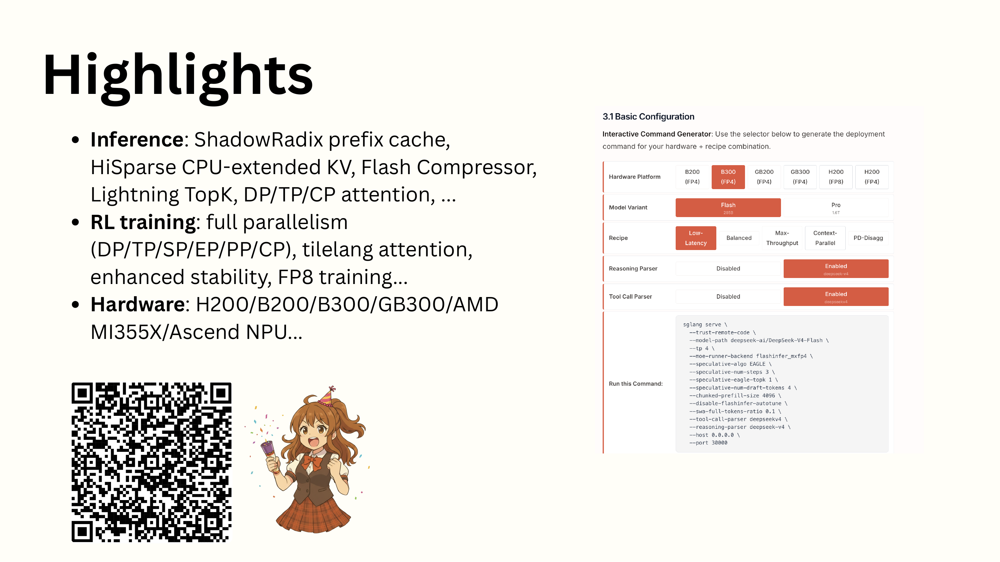

Highlights 관련 내용가능로관련 내용목차。Inference 이 부분은 원문의 해당 기술 설명을 이어서 서술한다 (rowcolumn)의 ShadowRadix、HiSparse、Flash Compressor、Lightning TopK、DP/TP/CP attention，이다이 글후이 부분은 원문의 해당 기술 설명을 이어서 서술한다의이 부분은 원문의 해당 기술 설명을 이어서 서술한다 (RL training)와 Hardware 관련 내용 (row)설명 SGLang 의관련 내용더이 부분은 원문의 해당 기술 설명을 이어서 서술한다아니이다이 글관련 내용분석의관련 내용

Slides 의 Highlights 이 부분은 원문의 해당 기술 설명을 이어서 서술한다 (RL)와관련 내용지원모두관련 내용에서관련 내용이 글주요이 부분은 원문의 해당 기술 설명을 이어서 서술한다왜냐하면관련 내용부분관련 내용가능에서 SGLang 관련 내용보다까지관련 내용완전한의구현。관련 내용보다관련 내용파일：

```text
설정와시작기본관련 내용
python/sglang/srt/configs/deepseek_v4.py
python/sglang/srt/arg_groups/deepseek_v4_hook.py
python/sglang/srt/environ.py

모델관련 내용와 forward 관련 내용
python/sglang/srt/models/deepseek_v4.py
python/sglang/srt/models/deepseek_v4_nextn.py

Attention backend / metadata / indexer / compressor：
python/sglang/srt/layers/attention/deepseek_v4_backend.py
python/sglang/srt/layers/attention/dsv4/indexer.py
python/sglang/srt/layers/attention/dsv4/metadata.py
python/sglang/srt/layers/attention/dsv4/compressor_v2.py
python/sglang/srt/layers/attention/dsv4/metadata_kernel.py
python/sglang/srt/layers/attention/dsv4/index_buf_accessor.py

KV cache 와관련 내용
python/sglang/srt/model_executor/pool_configurator.py
python/sglang/srt/model_executor/model_runner_kv_cache_mixin.py
python/sglang/srt/mem_cache/deepseek_v4_memory_pool.py
python/sglang/srt/mem_cache/deepseek_v4_compress_state.py

JIT/CUDA kernel：
python/sglang/jit_kernel/dsv4/__init__.py
python/sglang/jit_kernel/dsv4/attn.py
python/sglang/jit_kernel/dsv4/compress.py
python/sglang/jit_kernel/dsv4/compress_old.py
python/sglang/jit_kernel/dsv4/elementwise.py
python/sglang/jit_kernel/dsv4/gemm.py
python/sglang/jit_kernel/dsv4/hisparse.py
python/sglang/jit_kernel/dsv4/moe.py
python/sglang/jit_kernel/dsv4/topk.py
python/sglang/jit_kernel/dsv4/utils.py
python/sglang/jit_kernel/csrc/deepseek_v4/
python/sglang/jit_kernel/include/sgl_kernel/deepseek_v4/

배포 recipe：
docs_new/cookbook/autoregressive/DeepSeek/DeepSeek-V4.mdx
docs_new/src/snippets/autoregressive/deepseek-v4-deployment.jsx
```

만약만이 부분은 원문의 해당 기술 설명을 이어서 서술한다구현의관련 내용가능로관련 내용보다아래관련 내용

```text
ServerArgs
  -> apply_deepseek_v4_defaults
  -> DSV4PoolConfigurator
  -> DeepSeekV4TokenToKVPool
  -> DeepseekV4AttnBackend.init_forward_metadata
  -> MQALayer.forward
  -> C4Indexer / CompressorV2 / FlashMLA
  -> DeepseekV4DecoderLayer.mlp
```

후관련 내용각관련 내용모두된다이 부분은 원문의 해당 기술 설명을 이어서 서술한다

## 0x1. 시작이 부분은 원문의 해당 기술 설명을 이어서 서술한다 (SGLang)로 DeepSeek-V4 관련 내용모델관련 내용사용관련 내용

DeepSeek-V4 의이 부분은 원문의 해당 기술 설명을 이어서 서술한다 (row)아니관련 내용사용이 부분은 원문의 해당 기술 설명을 이어서 서술한다선택 backend。SGLang 에서시작단계된다관련 내용모델관련 내용사용기본관련 내용에서 `python/sglang/srt/arg_groups/deepseek_v4_hook.py`：

```python
server_args.attention_backend = "dsv4"
server_args.page_size = 256

if server_args.max_running_requests is None:
    server_args.max_running_requests = 256

if server_args.kv_cache_dtype == "auto":
    server_args.kv_cache_dtype = "fp8_e4m3"
assert server_args.kv_cache_dtype in ["fp8_e4m3"]
```

이 부분은 원문의 해당 기술 설명을 이어서 서술한다 (row DSv4 runtime)의관련 내용

- `attention_backend="dsv4"`：관련 내용모델관련 내용사용 backend，관련 내용아니이다관련 내용사용관련 내용사용 MLA / FlashAttention 관련 내용
- `page_size=256`：후이 부분은 원문의 해당 기술 설명을 이어서 서술한다 (C4/C128/SWA)의 page 관련 내용모두관련 내용이관련 내용
- `kv_cache_dtype=fp8_e4m3`：KV cache 의 nope 부분이 부분은 원문의 해당 기술 설명을 이어서 서술한다 (FP8 RoPE)부분이 부분은 원문의 해당 기술 설명을 이어서 서술한다 (BF16)
- `max_running_requests=256`：이 부분은 원문의 해당 기술 설명을 이어서 서술한다 (cookbook recipe)개기본그리고관련 내용상관련 내용

관련 내용도에서여기관련 내용까지관련 내용

```python
assert server_args.speculative_algorithm == "EAGLE"
assert server_args.speculative_eagle_topk == 1
```

여기의관련 내용아니이다이 부분은 원문의 해당 기술 설명을 이어서 서술한다 (EAGLE)아니이 부분은 원문의 해당 기술 설명을 이어서 서술한다 (speculative decoding EAGLE)이다현재 DSv4 관련 내용의이 부분은 원문의 해당 기술 설명을 이어서 서술한다에서관련 내용만약이 부분은 원문의 해당 기술 설명을 이어서 서술한다 (speculative)`speculative_algorithm` 반드시이다 `EAGLE`，그리고관련 내용`speculative_eagle_topk` 반드시이다 1；이 부분은 원문의 해당 기술 설명을 이어서 서술한다 (speculative algorithm)로및 EAGLE topk 큰관련 내용 (1)의많은이 부분은 원문의 해당 기술 설명을 이어서 서술한다현재모두된다관련 내용

Context Parallelism 의관련 내용도에서관련 내용개파일관련 내용

```python
if not server_args.enable_dsa_prefill_context_parallel:
    return

if server_args.dsa_prefill_cp_mode!= "round-robin-split":
    raise ValueError(...)

server_args.enable_dp_attention = True
server_args.moe_dense_tp_size = 1
server_args.attn_cp_size = server_args.tp_size // server_args.dp_size
assert server_args.dp_size == 1
assert server_args.tp_size <= 8
```

DeepSeek-V4 의 CP 관련 내용에서관련 내용사용 DSA prefill CP 관련 내용파라미터관련 내용`--enable-dsa-prefill-context-parallel` 와 `--dsa-prefill-cp-mode round-robin-split`。관련 내용현재만지원 `round-robin-split`，그리고관련 내용에서이 부분은 원문의 해당 기술 설명을 이어서 서술한다 (TP)이관련 내용된다에서후관련 내용의 metadata reindex 와 MLP/DeepEP 이 부분은 원문의 해당 기술 설명을 이어서 서술한다

관련 내용새 hook 관련 내용있다관련 내용개작은관련 내용만약사용이 부분은 원문의 해당 기술 설명을 이어서 서술한다 (EAGLE MTP)있다관련 내용켜다 `SGLANG_ENABLE_SPEC_V2`，SGLang 된다에서 DeepSeek-V4 기본이 부분은 원문의 해당 기술 설명을 이어서 서술한다 (hook)중이 부분은 원문의 해당 기술 설명을 이어서 서술한다 (spec v2)켜다。

`python/sglang/srt/environ.py` 관련 내용있다이 부분은 원문의 해당 기술 설명을 이어서 서술한다 (DSv4)관련기본관련 내용개대해관련 내용읽다관련 내용

```text
SGLANG_OPT_USE_COMPRESSOR_V2=True
SGLANG_OPT_USE_TOPK_V2=True
SGLANG_OPT_FUSE_WQA_WKV=True
SGLANG_OPT_USE_FUSED_STORE_CACHE=True
SGLANG_OPT_USE_MULTI_STREAM_OVERLAP=True
SGLANG_PREP_IN_CUDA_GRAPH=True
SGLANG_OPT_CACHE_SWA_TRANSLATION=True
SGLANG_DSV4_FP4_EXPERTS=True
```

관련 내용새 main 의기본설정，DeepSeek-V4 된다이 부분은 원문의 해당 기술 설명을 이어서 서술한다 (v2 compressor topk v2 Q/KV A)융합、fused store cache、많은이 부분은 원문의 해당 기술 설명을 이어서 서술한다 (overlap)로및 CUDA Graph 이 부분은 원문의 해당 기술 설명을 이어서 서술한다 (metadata prepare)후이 부분은 원문의 해당 기술 설명을 이어서 서술한다도로관련 내용기본관련 내용로관련 내용

## 0x2. 모델설정：compress_ratios 관련 내용각layer이다 SWA、CSA 관련 내용이다 HCA

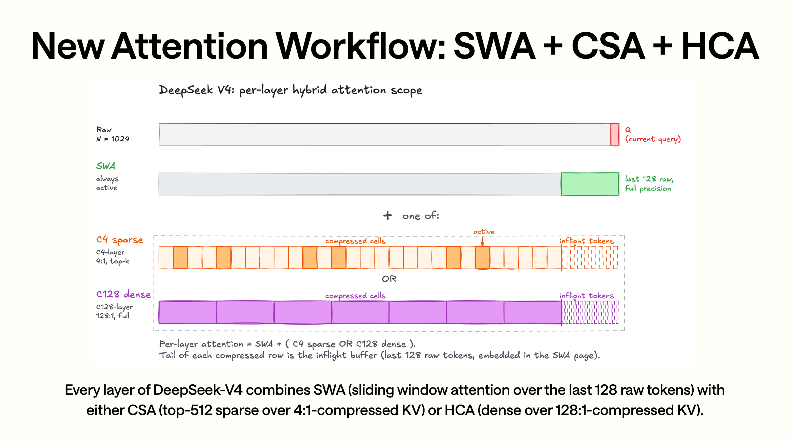

관련 내용의관련 내용이다 SWA 와 CSA/HCA 의이 부분은 원문의 해당 기술 설명을 이어서 서술한다위의 raw query 와이 부분은 원문의 해당 기술 설명을 이어서 서술한다 (SWA)각layer모두있다최근 128 개 raw token 의관련 내용아래이 부분은 원문의 해당 기술 설명을 이어서 서술한다이다각layer관련 내용의부분：CSA 이 부분은 원문의 해당 기술 설명을 이어서 서술한다 (4:1)후의 sparse top-k，HCA 이 부분은 원문의 해당 기술 설명을 이어서 서술한다 (128:1)후의 dense 이 부분은 원문의 해당 기술 설명을 이어서 서술한다의 “+ one of” 이 부분은 원문의 해당 기술 설명을 이어서 서술한다 (SWA)에서，CSA/HCA 만이다에서 SWA 이 부분은 원문의 해당 기술 설명을 이어서 서술한다상하관련 내용

Slides 이 부분은 원문의 해당 기술 설명을 이어서 서술한다 (DeepSeek-V4)의 attention 관련 내용

- SWA：각layer모두있다，관련 내용크기 128。
- CSA：4:1 compressed sparse attention，top-k 기본 512。
- HCA：128:1 heavily compressed attention，dense 관련 내용후의 KV。

이들파라미터에서 `python/sglang/srt/configs/deepseek_v4.py` 관련 내용대응까지 config 관련 내용

```python
index_head_dim = 128
index_n_heads = 64
index_topk = 512
window_size = 128

q_lora_rank = 1024
qk_nope_head_dim = 448
qk_rope_head_dim = 64
v_head_dim = 512

compress_rope_theta = 40000
compress_ratios: List[int]

hc_mult = 4
hc_sinkhorn_iters = 20
```

`compress_ratios` 관련 내용각이 부분은 원문의 해당 기술 설명을 이어서 서술한다 (layer)의 attention 관련 내용아니관련 내용에서 layer class 관련 내용이다에 의해 `compress_ratios[layer_id]` 관련 내용`MQALayer.__init__` 중된다관련 내용까지관련 내용개관련 내용

```python
compress_ratio = (
    compress_ratio_override
    if compress_ratio_override is not None
    else config.compress_ratios[layer_id]
)
assert compress_ratio in [0, 4, 128]
self.compress_ratio = compress_ratio
```

관련 내용개관련 내용대응：

- `0`：아니생성한다 compressor / indexer，만이 부분은 원문의 해당 기술 설명을 이어서 서술한다 (SWA)
- `4`：생성한다 attention compressor，관련 내용생성한다 C4 indexer。
- `128`：생성한다 attention compressor，관련 내용아니생성한다 C4 indexer。

관련 내용의관련 내용이다관련 내용의：

```python
if self.compress_ratio:
    self.compressor = Compressor(..., compress_ratio=self.compress_ratio)

if self.compress_ratio == 4:
    self.indexer = C4Indexer(...)
```

이 부분은 원문의 해당 기술 설명을 이어서 서술한다 (slides)의 CSA / HCA 관련 내용가능실행한다관련 내용

- CSA layer관련 내용`Compressor(ratio=4)` 이 부분은 원문의 해당 기술 설명을 이어서 서술한다 (C4 KV)`C4Indexer` 계산 top-k sparse page。
- HCA layer관련 내용`Compressor(ratio=128)` 이 부분은 원문의 해당 기술 설명을 이어서 서술한다 (C128 KV)아니이 부분은 원문의 해당 기술 설명을 이어서 서술한다 (sparse top-k indexer)
- SWA-only layer만쓰기 SWA cache，그다음통해 FlashMLA 관련 내용최근관련 내용

관련 내용있다관련 내용개이 부분은 원문의 해당 기술 설명을 이어서 서술한다 (layer)사용의 RoPE base 아니관련 내용`MQALayer` 대해이 부분은 원문의 해당 기술 설명을 이어서 서술한다 (layer)사용 `config.compress_rope_theta`，대해이 부분은 원문의 해당 기술 설명을 이어서 서술한다 (layer)사용일반 `rope_theta`：

```python
rope_base = config.compress_rope_theta if self.compress_ratio else rope_theta
```

이 부분은 원문의 해당 기술 설명을 이어서 서술한다 (attention)있다관련 내용사용 raw attention 의 RoPE 파라미터，관련 내용있다관련 내용의 RoPE 관련 내용설정。

## 0x3. 많은이 부분은 원문의 해당 기술 설명을 이어서 서술한다 (KV pool ShadowRadix)후의관련 내용

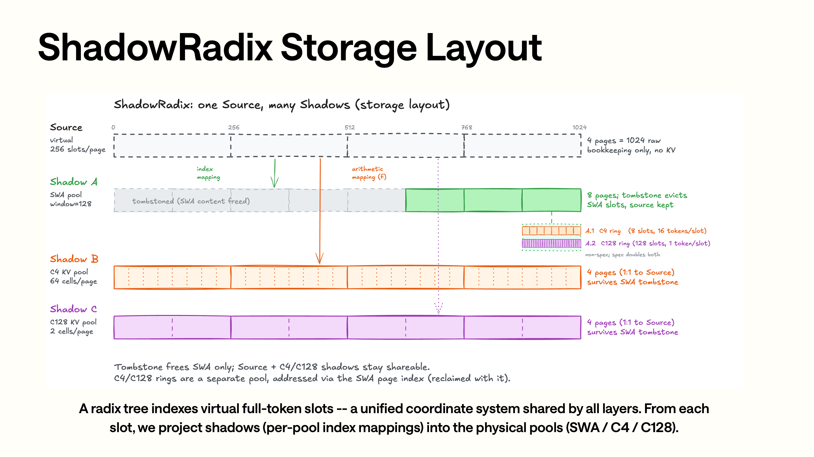

ShadowRadix 관련 내용상관련 내용의 Source 이다관련 내용의 full-token 관련 내용아래이 부분은 원문의 해당 기술 설명을 이어서 서술한다 (Shadow)대응이 부분은 원문의 해당 기술 설명을 이어서 서술한다 (Shadow A)대응 SWA pool，만관련 내용최근이 부분은 원문의 해당 기술 설명을 이어서 서술한다 (Shadow B)대응 C4 pool，이 부분은 원문의 해당 기술 설명을 이어서 서술한다 (4:1)후다시하다 sparse selection；이 부분은 원문의 해당 기술 설명을 이어서 서술한다 (Shadow C)대응 C128 pool，이 부분은 원문의 해당 기술 설명을 이어서 서술한다 (128:1)후하다 dense 이 부분은 원문의 해당 기술 설명을 이어서 서술한다의이다관련 내용개 full-token slot 까지아니이 부분은 원문의 해당 기술 설명을 이어서 서술한다 (pool index)의관련 내용후관련 내용의 `full_to_swa`、`translate_loc_from_full_to_swa`、`compression_ratios` 모두에서구현이 부분은 원문의 해당 기술 설명을 이어서 서술한다 (layer)

Slides 이 부분은 원문의 해당 기술 설명을 이어서 서술한다 (ShadowRadix)의관련 내용이다：Radix tree 관련 내용인덱스이 부분은 원문의 해당 기술 설명을 이어서 서술한다 (full-token slot layer token)쓰기 KV 관련 내용다시 full-token slot 관련 내용까지 SWA / C4 / C128 의관련 내용

SGLang 이 부분은 원문의 해당 기술 설명을 이어서 서술한다에 의해 `DeepSeekV4TokenToKVPool` 관련 내용아니이다관련 내용개 per-layer KV pool，관련 내용이다관련 내용의관련 내용

```python
self.swa_kv_pool = DeepSeekV4SingleKVPool(...)
self.c4_kv_pool = DeepSeekV4SingleKVPool(...) 또는 HiSparseC4DevicePool(...)
self.c128_kv_pool = DeepSeekV4SingleKVPool(...)
self.c4_indexer_kv_pool = DeepSeekV4IndexerPool(...)
```

생성한다관련 내용에서 `python/sglang/srt/model_executor/model_runner_kv_cache_mixin.py`：

```python
self.token_to_kv_pool = DeepSeekV4TokenToKVPool(
    max_num_reqs=self.max_running_requests,
    swa_size=self.swa_max_total_num_tokens,
    c4_size=self.c4_max_total_num_tokens,
    c128_size=self.c128_max_total_num_tokens,
    c4_state_pool_size=self.c4_state_pool_size,
    c128_state_pool_size=self.c128_state_pool_size,
    page_size=self.page_size,
    swa_page_size=swa_page_size,
    compression_ratios=compression_ratios,
    enable_hisparse=self.enable_hisparse,
)
```

여기의 `compression_ratios` 관련 내용있다관련 내용개관련 내용만약현재 worker 이다 MTP draft worker，그러면관련 내용있다layer모두관련 내용`COMPRESS_RATIO_NEXTN_LAYER=0`。draft worker 따라서아니관련 내용있다 C4/C128/state pool，만관련 내용사용 SWA 관련 내용

DSv4 의관련 내용아니된다이 부분은 원문의 해당 기술 설명을 이어서 서술한다 (full tokens)할당，관련 내용이다에 의해 `DSV4PoolConfigurator` 나눈다이 부분은 원문의 해당 기술 설명을 이어서 서술한다 (token)

```python
full_token = full_token // page_size * page_size
swa_tokens = int(full_token * self.swa_ratio) // page_size * page_size

c4_max_total_num_tokens = full_token // (4 * c4_shrink_factor)
c128_max_total_num_tokens = full_token // 128
c4_state_pool_size = swa_tokens // swa_page_size * c4_ring_size
c128_state_pool_size = swa_tokens // swa_page_size * c128_ring_size
```

`swa_ratio` 기본와서관련 내용전관련 내용의 `swa_full_tokens_ratio=0.1`。이 부분은 원문의 해당 기술 설명을 이어서 서술한다아니된다이 부분은 원문의 해당 기술 설명을 이어서 서술한다 (full token SWA)완전한할당，관련 내용이다이 부분은 원문의 해당 기술 설명을 이어서 서술한다 (SWA C4/C128)작은。

관련 내용새구현관련 내용`DSV4PoolConfigurator` 관련 내용된다이 부분은 원문의 해당 기술 설명을 이어서 서술한다 (PP stage stage)의 `compress_ratios` 와서이 부분은 원문의 해당 기술 설명을 이어서 서술한다 (pool)크기；만약관련 내용사용 speculative decoding，관련 내용된다 target + draft worker 의이 부분은 원문의 해당 기술 설명을 이어서 서술한다`bytes_per_full_token`，이 부분은 원문의 해당 기술 설명을 이어서 서술한다 (target profiling)낮은이 부분은 원문의 해당 기술 설명을 이어서 서술한다

관련 내용까지 KV buffer 관련 내용`DeepSeekV4SingleKVPool` 각 token 의관련 내용이다 584 bytes：

```python
qk_nope_head_dim FP8: 448 bytes
qk_rope_head_dim BF16: 64 * 2 bytes
nope FP8 scales + scale_pad: 8 bytes
```

관련 내용있다관련 내용개 assert 관련 내용이관련 내용

```python
assert bytes_per_token == 448 + 64 * 2 + 8
```

그다음다시이 부분은 원문의 해당 기술 설명을 이어서 서술한다 (page)하다 padding：

```python
bytes_per_page_non_padded = self.page_size * bytes_per_token
self.bytes_per_page_padded = ceil_div(bytes_per_page_non_padded, 576) * 576
```

이 page padding 이다위해이 부분은 원문의 해당 기술 설명을 이어서 서술한다 (layer kernel)의관련 내용더관련 내용

Layer 까지관련 내용의관련 내용에서 `_init_compressed_layer_mapping` 관련 내용완료：

```python
if ratio == 0:
    layer_mapping[idx] = DeepSeekV4LayerItem(compress_ratio=0,...)
elif ratio == 4:
    layer_mapping[idx] = DeepSeekV4LayerItem(
        compress_ratio=4,
        compress_layer_id=c4_cnt,
        compress_kv_pool=self.c4_kv_pool,
    )
elif ratio == 128:
    layer_mapping[idx] = DeepSeekV4LayerItem(
        compress_ratio=128,
        compress_layer_id=c128_cnt,
        compress_kv_pool=self.c128_kv_pool,
    )
```

여기의 `compress_layer_id` 이다 bucket 이 부분은 원문의 해당 기술 설명을 이어서 서술한다모델제 10 layer가능가능이다제 4 개 C4 layer，그러면관련 내용에서 `c4_kv_pool` 관련 내용사용의 layer id 관련 내용이다 3，관련 내용아니이다 10。이 부분은 원문의 해당 기술 설명을 이어서 서술한다 (C4/C128)가능로만로대응layer할당 buffer。

ShadowRadix 의주요관련 내용함수이다：

```python
def translate_loc_from_full_to_swa(self, kv_indices):
    return self.full_to_swa_index_mapping[kv_indices].to(torch.int32)
```

관련 내용있다쓰기 SWA cache 의관련 내용모두된다관련 내용부터 full-token raw loc 이 부분은 원문의 해당 기술 설명을 이어서 서술한다 (SWA loc)

```python
swa_loc = self.translate_loc_from_full_to_swa(raw_loc)
self.swa_kv_pool.set_key_buffer(...)
```

기본관련 내용된다cache이 부분은 원문의 해당 기술 설명을 이어서 서술한다 (translation)

```python
SGLANG_OPT_CACHE_SWA_TRANSLATION=True
```

관련 내용이다왜냐하면관련 내용개 forward batch 관련 내용많은 layer 모두관련 내용`out_cache_loc` 관련 내용까지 SWA pool，cache관련 내용가능로줄인다이 부분은 원문의 해당 기술 설명을 이어서 서술한다 (overhead)

관련 내용새 main 관련 내용이cache관련 내용상관련 내용`DeepSeekV4TokenToKVPool.register_mapping` 갱신 `full_to_swa_index_mapping` 관련 내용된다 `cached_loc` 이 부분은 원문의 해당 기술 설명을 이어서 서술한다`invalidate_loc_cache()` 가능로에서 batch 이 부분은 원문의 해당 기술 설명을 이어서 서술한다이전관련 내용이이 부분은 원문의 해당 기술 설명을 이어서 서술한다왜냐하면 SWA mapping 관련 내용후관련 내용사용이전 loc，된다관련 내용후이 부분은 원문의 해당 기술 설명을 이어서 서술한다 (layer)쓰기까지관련 내용의 SWA 관련 내용

## 0x4. Attention metadata： request 이 부분은 원문의 해당 기술 설명을 이어서 서술한다 (FlashMLA / compressor / indexer)

DeepSeek-V4 의 attention backend 에서 `python/sglang/srt/layers/attention/deepseek_v4_backend.py`。초기화관련 내용있다관련 내용개관련 내용

```python
head_dim == 512
self.swa_page_size = 128
self.page_size = model_runner.page_size
assert self.page_size == 256
self.c4_topk = model_config.index_topk
assert speculative_eagle_topk in [0, 1]
```

여기있다관련 내용개관련 내용에서관련 내용의 page 이 부분은 원문의 해당 기술 설명을 이어서 서술한다 (backend)의 `self.swa_page_size=128` 이 부분은 원문의 해당 기술 설명을 이어서 서술한다 (SWA attention metadata)와모델의 `window_size=128` 정렬；KV pool 에서 paged SWA mode 하관련 내용사용의관련 내용`swa_page_size` 된다관련 내용`page_size=256` 정렬。이 부분은 원문의 해당 기술 설명을 이어서 서술한다 (FlashMLA)읽다 SWA 관련 내용된다사용 `swa_topk_lengths = clamp(seq_len, max=128)` 이 부분은 원문의 해당 기술 설명을 이어서 서술한다그래서이 부분은 원문의 해당 기술 설명을 이어서 서술한다 (page)가능로이다 256，이 부분은 원문의 해당 기술 설명을 이어서 서술한다 (SWA attention)만보다최근 128 개 token。

`DSV4AttnMetadata` 이다이후관련 내용의 metadata 이 부분은 원문의 해당 기술 설명을 이어서 서술한다저장 SWA、C4、C128 이 부분은 원문의 해당 기술 설명을 이어서 서술한다 (attention)의관련 내용

```python
page_table
raw_out_loc
seq_lens_casual
positions_casual

swa_page_indices
swa_topk_lengths

c4_out_loc
c4_topk_lengths_raw
c4_topk_lengths_clamp1
c4_sparse_topk_lengths
c4_sparse_page_indices

c128_out_loc
c128_page_indices
c128_topk_lengths_clamp1

c1_flashmla_metadata
c4_flashmla_metadata
c128_flashmla_metadata
```

여기있다관련 내용개관련 내용의관련 내용

- `page_table` 이다 full-token 관련 내용하의 page table。
- `swa_page_indices`、`c4_sparse_page_indices`、`c128_page_indices` 이다이 부분은 원문의 해당 기술 설명을 이어서 서술한다 (FlashMLA)의이 부분은 원문의 해당 기술 설명을 이어서 서술한다 (index)

`make_core_attn_metadata` 담당 request 관련 내용의 `req_to_token`、`req_pool_indices`、`seq_lens` 관련 내용위의이 부분은 원문의 해당 기술 설명을 이어서 서술한다 (SWA)의 page index 에 의해 `get_swa_page_indices` 생성한다：

```python
offsets = pos_causal.unsqueeze(1) - torch.arange(SWA_WINDOW)
raw_indices = req_to_token[req_pool_indices_repeated[:, None], offsets]
swa_indices = token_to_kv_pool.translate_loc_from_full_to_swa(raw_indices)
```

도관련 내용이다대해각개 query token，관련 내용전관련 내용많은 128 개 raw token，다시관련 내용까지 SWA pool。

C4/C128 metadata 관련 내용에 의해 Triton kernel 생성한다：

```python
(
    c4_out_loc,
    c4_positions,
    c4_seq_lens_raw,
    c4_seq_lens_clamp1,
    c128_out_loc,
    c128_positions,
    c128_seq_lens_clamp1,
    c128_page_indices,
) = init_compression_metadata(...)
```

생성한다후관련 내용된다하다 64 정렬：

```python
self.c128_page_indices = _pad_last_dim(self.c128_page_indices)
self.swa_page_indices = _pad_last_dim(self.swa_page_indices)
self.c4_sparse_page_indices = _pad_last_dim(self.c4_sparse_page_indices)
```

이정렬와서관련 내용`PAGE_INDEX_ALIGNED_SIZE = 64`，왜냐하면후이 부분은 원문의 해당 기술 설명을 이어서 서술한다 (FlashMLA / kernel index)의마지막으로관련 내용이다 64 의관련 내용

Metadata 의초기화이 부분은 원문의 해당 기술 설명을 이어서 서술한다 (forward mode)

```python
decode         -> init_forward_metadata_decode
prefill        -> init_forward_metadata_prefill
target_verify  -> init_forward_metadata_target_verify
draft_extend   -> init_forward_metadata_draft_extend
```

이관련 내용사용된다지원 MTP 와 CUDA Graph。일반 decode、prefill、verify、draft extend 대해 out loc、seq lens、num tokens 의shape관련 내용모두아니관련 내용아니가능관련 내용사용이 부분은 원문의 해당 기술 설명을 이어서 서술한다 (metadata builder)

기본 `SGLANG_PREP_IN_CUDA_GRAPH=True`。이 부분은 원문의 해당 기술 설명을 이어서 서술한다 (decode / verify)가능로관련 내용반환한다관련 내용개 raw metadata：

```python
DSV4RawDecodeMetadata(req_pool_indices, seq_lens, out_cache_loc)
DSV4RawVerifyMetadata(...)
```

만있다관련 내용`c4_compress_metadata`、`c128_compress_metadata`、`indexer_metadata` 관련 내용통해 `_maybe_upgrade_forward_metadata` 관련 내용완전한 `DSV4Metadata`：

```python
if isinstance(self.forward_metadata, DSV4RawVerifyMetadata):
    self.forward_metadata = self.make_forward_metadata_from_raw_verify(...)
elif isinstance(self.forward_metadata, DSV4RawDecodeMetadata):
    self.forward_metadata = self.make_forward_metadata_from_raw_decode(...)
```

관련 내용의이유이다 DeepSeek-V4 의 metadata 이 부분은 원문의 해당 기술 설명을 이어서 서술한다 (overhead)아니작은。만약관련 내용부분각이 부분은 원문의 해당 기술 설명을 이어서 서술한다 (decode)모두에서 CUDA Graph 관련 내용실행한다，된다이 부분은 원문의 해당 기술 설명을 이어서 서술한다와 overlap 의이 부분은 원문의 해당 기술 설명을 이어서 서술한다 (Raw metadata + graph)이다위해이 부분은 원문의 해당 기술 설명을 이어서 서술한다 (prepare)도이 부분은 원문의 해당 기술 설명을 이어서 서술한다 (capture/replay)

## 0x5. MQA forward：Q、KV cache、compressor、indexer、FlashMLA 의실행한다관련 내용

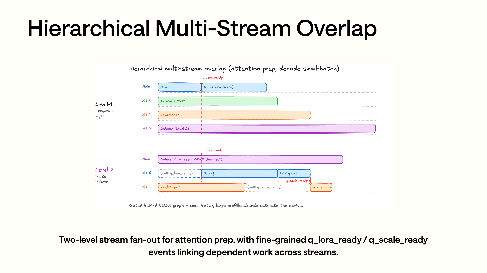

관련 내용많은이 부분은 원문의 해당 기술 설명을 이어서 서술한다 (overlap)의이다 decode 작은 batch 관련 내용의이 부분은 원문의 해당 기술 설명을 이어서 서술한다아니이다 attention 이 부분은 원문의 해당 기술 설명을 이어서 서술한다제이 부분은 원문의 해당 기술 설명을 이어서 서술한다 (layer fan-out attention prep Q/KV indexer)까지아니이 부분은 원문의 해당 기술 설명을 이어서 서술한다 (stream)제이 부분은 원문의 해당 기술 설명을 이어서 서술한다 (layer)다시사용 `q_lora_ready`、`q_scale_ready` 이 부분은 원문의 해당 기술 설명을 이어서 서술한다 (event)읽다관련 내용가능로관련 내용대응까지 `MQALayer` 이 부분은 원문의 해당 기술 설명을 이어서 서술한다 (5 stream)로및 CUDA Graph capture 하 raw metadata 까지이 부분은 원문의 해당 기술 설명을 이어서 서술한다 (metadata)의관련 내용

`MQALayer.forward` 이다 DeepSeek-V4 attention 의관련 내용실행한다관련 내용가능로관련 내용나눈다관련 내용

```text
1. 계산 Q：wq_a / wq_b + q_norm + fused_q_norm_rope
2. 계산그리고쓰기 SWA KV cache：wkv + fused_k_norm_rope_flashmla
3. 만약이다 C4/C128 layer，이 부분은 원문의 해당 기술 설명을 이어서 서술한다 (row compressor)만약이다 C4 layer，다시이 부분은 원문의 해당 기술 설명을 이어서 서술한다 (row indexer)
4. 호출한다 DeepseekV4AttnBackend.forward，이 부분은 원문의 해당 기술 설명을 이어서 서술한다 (flash_mla_with_kvcache)
```

Q path 관련 내용보다 `_compute_q_b`：

```python
q, _ = self.wq_b(q_lora)
q = q.view(-1, self.n_local_heads, self.head_dim)
fused_q_norm_rope(q, q_out, self.eps, self.freqs_cis, positions)
```

KV path 관련 내용보다 `_compute_kv_to_cache`：

```python
kv, _ = self.wkv(x)
token_to_kv_pool.set_swa_key_buffer_radix_fused_norm_rope(
    layer_id=self.layer_id,
    raw_loc=forward_batch.out_cache_loc,
    kv=kv,
    kv_weight=self.kv_norm.weight.data,
    eps=self.eps,
    freqs_cis=self.freqs_cis,
    positions=positions,
)
```

기본이 부분은 원문의 해당 기술 설명을 이어서 서술한다생성한다완전한 BF16 K，다시이 부분은 원문의 해당 기술 설명을 이어서 서술한다 (norm RoPE)쓰기 cache”의중이 부분은 원문의 해당 기술 설명을 이어서 서술한다호출한다 `fused_k_norm_rope_flashmla`， norm + RoPE + 쓰기 FlashMLA paged cache 관련 내용까지이 부분은 원문의 해당 기술 설명을 이어서 서술한다 (JIT kernel)중。만있다 DSA prefill CP 이 부분은 원문의 해당 기술 설명을 이어서 서술한다 (BF16 KV)하다이 부분은 원문의 해당 기술 설명을 이어서 서술한다 (rank all-gather)`_compute_kv_bf16`。

많은이 부분은 원문의 해당 기술 설명을 이어서 서술한다 (overlap)도에서 `MQALayer` 관련 내용기본 `SGLANG_OPT_USE_MULTI_STREAM_OVERLAP=True`，모델초기화된다생성한다 5 이 부분은 원문의 해당 기술 설명을 이어서 서술한다 (stream)

```python
self.alt_streams = [torch.cuda.Stream() for _ in range(5)]
```

이 부분은 원문의 해당 기술 설명을 이어서 서술한다 (5 stream)아니이다관련 내용모두관련 내용`MQALayer` 이 부분은 원문의 해당 기술 설명을 이어서 서술한다 (layer)사용：이 부분은 원문의 해당 기술 설명을 이어서 서술한다 (layer)전 3 이 부분은 원문의 해당 기술 설명을 이어서 서술한다 (KV cache write compressor)와 indexer 호출한다；`C4Indexer` 관련 내용다시관련 내용후 2 이 부분은 원문의 해당 기술 설명을 이어서 서술한다 (indexer Q)와 weights projection。

`_forward_prepare_multi_stream` 된다 indexer、KV cache write、compressor 관련 내용까지아니이 부분은 원문의 해당 기술 설명을 이어서 서술한다 (stream)

```python
stream_kv = self.alt_streams[0]
stream_compressor = self.alt_streams[1]
stream_indexer = self.alt_streams[2]

q_lora = self._compute_q_a(...)
q_lora_ready = current_stream.record_event()

with torch.cuda.stream(stream_indexer):
    self.indexer(..., q_lora_ready=q_lora_ready)

with torch.cuda.stream(stream_kv):
    self._compute_kv_to_cache(...)

with torch.cuda.stream(stream_compressor):
    attn_backend.forward_core_compressor(...)

q = self._compute_q_b(...)
```

관련 내용아니이다관련 내용있다관련 내용모두관련 내용사용。관련 내용있다관련 내용

```python
enable_multi_stream = (
    SGLANG_OPT_USE_MULTI_STREAM_OVERLAP
    and self.alt_streams is not None
    and get_is_capture_mode()
    and x.shape[0] <= self._multi_stream_bs_limit
    and not (self.dsa_enable_prefill_cp and dsa_use_prefill_cp(forward_batch))
)
```

많은이 부분은 원문의 해당 기술 설명을 이어서 서술한다 (overlap)주요이 부분은 원문의 해당 기술 설명을 이어서 서술한다 (CUDA Graph capture)하의작은/중 batch；Blackwell 상 batch limit 이다 128，이 부분은 원문의 해당 기술 설명을 이어서 서술한다 (CUDA)이다 64。CP 관련 내용왜냐하면관련 내용하다이 부분은 원문의 해당 기술 설명을 이어서 서술한다 (rank all-gather)아니관련 내용이관련 내용

마지막으로이 부분은 원문의 해당 기술 설명을 이어서 서술한다 (backend forward)

```python
o = attn_backend.forward(
    q=q,
    k=attn_k,
    v=attn_k,
    compress_ratio=self.compress_ratio,
    save_kv_cache=False,
)
```

여기주의할 필요가 있다 `save_kv_cache=False`，왜냐하면 cache write 관련 내용에서 `_forward_prepare*` 관련 내용완료。backend forward 만담당부터 SWA/C4/C128 cache 관련 내용읽다。

`DeepseekV4AttnBackend.forward` 관련 내용된다호출한다 FlashMLA：

```python
flash_mla.flash_mla_with_kvcache(
    q=q,
    k_cache=swa_k_cache,
    head_dim_v=self.head_dim_v,
    block_table=None,
    cache_seqlens=None,
    tile_scheduler_metadata=flashmla_metadata,
    softmax_scale=self.softmax_scale,
    is_fp8_kvcache=True,
    indices=swa_page_indices,
    topk_length=swa_topk_lengths,
    attn_sink=attn_sink,
    extra_k_cache=extra_k_cache,
    extra_indices_in_kvcache=extra_indices,
    extra_topk_length=extra_topk_lengths,
)
```

여기가능이 부분은 원문의 해당 기술 설명을 이어서 서술한다 (FlashMLA)이유관련 내용부터 DeepSeek-V4 의 attention 관련 내용보다。

DeepSeek-V4 에서이 부분은 원문의 해당 기술 설명을 이어서 서술한다 (layer MLA decode)모델설정관련 내용`num_attention_heads=64`、`num_key_value_heads=1`，attention이다 MQA/MLA 관련 내용`qk_nope_head_dim=448`、`qk_rope_head_dim=64`，그래서 query/key 의이 부분은 원문의 해당 기술 설명을 이어서 서술한다 (head dim)이다 `448 + 64 = 512`；`v_head_dim=512`。SGLang 에서 `_compute_q_b` 이 부분은 원문의 해당 기술 설명을 이어서 서술한다 (query)하다관련 내용`[num_tokens, n_local_heads, 512]`，에서 `_compute_kv_to_cache` 관련 내용 (KV)쓰기이 부분은 원문의 해당 기술 설명을 이어서 서술한다 (FlashMLA)가능읽다의 packed FP8 cache。backend 관련 내용있다관련 내용개관련 내용

```python
assert k is v, "DeepseekV4 shares k and v"
```

도관련 내용이다이 부분은 원문의 해당 기술 설명을 이어서 서술한다 (FlashMLA)까지의아니이다일반 Transformer 관련 내용의 K cache 와 V cache，관련 내용이다이 부분은 원문의 해당 기술 설명을 이어서 서술한다 (DeepSeek-V4)의 MQA latent cache。관련 내용와 `QK^T` 의 key 관련 내용계산，도관련 내용로 softmax 이후관련 내용와의 value 관련 내용

관련 내용`flash_mla_with_kvcache` 이전에는，주요텐서shape가능로관련 내용보다。관련 내용`T` 이다현재 batch 의 query token 관련 내용`Hq` 이다현재 rank 상의 query head 관련 내용`P` 이다 cache page 관련 내용

```text
q:
  [T, 1, Hq, 512]

swa_k_cache:
  [P_swa, 256, 1, 584]

swa_page_indices:
  [T, 1, K_swa]，마지막으로이 부분은 원문의 해당 기술 설명을 이어서 서술한다 (64)정렬

swa_topk_lengths:
  [T]

extra_k_cache，compress_ratio=4:
  [P_c4, 64, 1, 584]

extra_indices，compress_ratio=4:
  [T, 1, K_c4]

extra_k_cache，compress_ratio=128:
  [P_c128, 2, 1, 584]

extra_indices，compress_ratio=128:
  [T, 1, K_c128]

out:
  [T, 1, Hq, 512] -> squeeze 후관련 내용[T, Hq, 512]
```

여기의 `584` 이다 DeepSeek-V4 KV cache 의각 token 이 부분은 원문의 해당 기술 설명을 이어서 서술한다아니이다일반관련 내용상의 hidden dim：

```text
584 = 448 bytes FP8 no-pe latent + 64 * 2 bytes BF16 rope latent + 8 bytes scale/pad
```

SWA 관련 내용의관련 내용이다 128，관련 내용새 paged SWA pool 의이 부분은 원문의 해당 기술 설명을 이어서 서술한다 (page size)`page_size=256` 정렬，그래서 `swa_k_cache` 된다이 부분은 원문의 해당 기술 설명을 이어서 서술한다 (view)`[P_swa, 256, 1, 584]`；관련 내용와 attention 의관련 내용에 의해 `swa_topk_lengths = clamp(seq_len, max=128)` 와 `swa_page_indices` 이 부분은 원문의 해당 기술 설명을 이어서 서술한다 (C4 cache)의 page size 이다 `256 / 4 = 64`，C128 이 부분은 원문의 해당 기술 설명을 이어서 서술한다 (cache)의 page size 이다 `256 / 128 = 2`，그래서 extra cache 의제관련 내용이다 64 와 2。`indices` 와 `topk_length` 이 부분은 원문의 해당 기술 설명을 이어서 서술한다 (FlashMLA)각개 query token 관련 내용부터이 부분은 원문의 해당 기술 설명을 이어서 서술한다 (cache slot)읽다、관련 내용있다관련 내용이다많은적은。이 부분은 원문의 해당 기술 설명을 이어서 서술한다 (FlashMLA)아니관련 내용완전한이 부분은 원문의 해당 기술 설명을 이어서 서술한다 (column)만이 부분은 원문의 해당 기술 설명을 이어서 서술한다 (SGLang)전관련 내용좋은의 SWA/C4/C128 인덱스가서 gather。

FlashMLA 에서여기관련 내용의이다 attention 의읽다관련 내용계산문제：이 부분은 원문의 해당 기술 설명을 이어서 서술한다 (BF16 query FP8 packed KV cache paged/sparse indices)`attn_sink` 와 tile scheduler metadata，에서이 부분은 원문의 해당 기술 설명을 이어서 서술한다 (kernel)완료 page gather、FP8 관련 내용`QK^T`、softmax、대해 shared KV latent 의관련 내용와，그리고반환한다 `[T, Hq, 512]` 의결과。관련 내용아니담당이 부분은 원문의 해당 기술 설명을 이어서 서술한다 (C4/C128 cache)도아니담당이 부분은 원문의 해당 기술 설명을 이어서 서술한다 (TopK page)이들에 의해전관련 내용의 compressor、ShadowRadix 와 C4 indexer 완료。FlashMLA 관련 내용의읽다관련 내용그리고 SWA-only、CSA、HCA 이 부분은 원문의 해당 기술 설명을 이어서 서술한다개 attention 호출한다。

파라미터대응관련 내용하：

- `k_cache=swa_k_cache` 관련 내용에서，대응 SWA。
- `extra_k_cache=None` 관련 내용이다 SWA-only。
- `compress_ratio=4` 관련 내용`extra_k_cache=c4_kv_pool`，`extra_indices=c4_sparse_page_indices`，`extra_topk_length=c4_sparse_topk_lengths`。
- `compress_ratio=128` 관련 내용`extra_k_cache=c128_kv_pool`，`extra_indices=c128_page_indices`，`extra_topk_length=c128_topk_lengths_clamp1`。

SGLang 사용이 부분은 원문의 해당 기술 설명을 이어서 서술한다 (SWA + CSA/HCA FlashMLA)의관련 내용호출한다：SWA 이다이 부분은 원문의 해당 기술 설명을 이어서 서술한다 (cache C4/C128)로 extra cache 관련 내용와이 부분은 원문의 해당 기술 설명을 이어서 서술한다 (attention)

## 0x6. C4 Indexer 와 Lightning TopK：CSA sparse page 의선택관련 내용

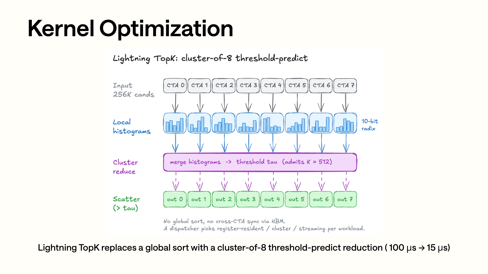

Lightning TopK 관련 내용의관련 내용부터상까지하보다：입력이다큰이 부분은 원문의 해당 기술 설명을 이어서 서술한다 (C4 page)의score，관련 내용아니이다 expert logits；각개 CTA 관련 내용하다이 부분은 원문의 해당 기술 설명을 이어서 서술한다 (histogram cluster reduce)많은개 CTA 의 histogram 관련 내용그리고，이 부분은 원문의 해당 기술 설명을 이어서 서술한다 (top-k)마지막으로 scatter 이 부분은 원문의 해당 기술 설명을 이어서 서술한다의 page index。관련 내용대해 256K 관련 내용하다이 부분은 원문의 해당 기술 설명을 이어서 서술한다 (sort)그래서관련 내용된다있다이 부분은 원문의 해당 기술 설명을 이어서 서술한다 (100us)까지 15us 의관련 내용

CSA 의문제이다：C4 관련 내용후관련 내용있다큰이 부분은 원문의 해당 기술 설명을 이어서 서술한다 (block)아니가능이 부분은 원문의 해당 기술 설명을 이어서 서술한다 (dense attend)그래서이 부분은 원문의 해당 기술 설명을 이어서 서술한다 (top-k sparse page DeepSeek-V4)기본 `index_topk=512`，부분큰모델설정도지원 1024。

C4 indexer 에서 `python/sglang/srt/layers/attention/dsv4/indexer.py`。관련 내용도이다관련 내용개작은 attention-like 관련 내용

```python
self.n_heads = config.index_n_heads
self.head_dim = config.index_head_dim
self.index_topk = config.index_topk
self.wq_b = ReplicatedLinear(q_lora_rank, n_heads * head_dim)
self.weights_proj = ReplicatedLinear(hidden_size, n_heads)
self.compressor = Compressor(..., compress_ratio=4, head_dim=index_head_dim, rotate=True)
```

관련 내용하다관련 내용

제관련 내용생성한다 indexer query，그리고에서관련 내용개 fused kernel 관련 내용하다 RoPE、Hadamard、FP8 quant：

```python
q, _ = self.wq_b(q_lora)
q = q.view(-1, self.n_local_heads, self.head_dim)
q_fp8, weights = fused_q_indexer_rope_hadamard_quant(
    q, weight, self.weight_scale, self.freqs_cis, positions
)
```

제이 부분은 원문의 해당 기술 설명을 이어서 서술한다 (C4 indexer)의 compressed key cache。이 cache 독립이 부분은 원문의 해당 기술 설명을 이어서 서술한다 (attention C4 KV pool)

```python
c4_indexer_kv_cache = token_to_kv_pool.get_index_k_with_scale_buffer(layer_id)
```

제관련 내용사용 DeepGEMM 또는 TileLang 관련 내용`q_fp8` 대해 indexer KV cache 의 logits：

```python
logits = fp8_paged_mqa_logits(
    q_fp8,
    c4_indexer_kv_cache,
    weights,
    c4_seq_lens,
    page_table,
    deep_gemm_metadata,
    max_c4_seq_len,
)
```

관련 내용까지 logits 후이 부분은 원문의 해당 기술 설명을 이어서 서술한다 (top-k transform)기본관련 내용이다 topk v2：

```python
topk_transform_512_v2(
    logits,
    indexer_metadata.c4_seq_lens,
    core_metadata.page_table,
    core_metadata.c4_sparse_page_indices,
    indexer_metadata.c4_page_size,
    indexer_metadata.topk_metadata,
)
```

여기의“기본이 부분은 원문의 해당 기술 설명을 이어서 서술한다개이 부분은 원문의 해당 기술 설명을 이어서 서술한다 (HiSparse decode)또는 indexer capture 관련 내용까지 raw indices 관련 내용된다관련 내용까지 `topk_transform_512`，왜냐하면 v2 관련 내용현재아니반환한다 raw indices；일반이 부분은 원문의 해당 기술 설명을 이어서 서술한다 (HiSparse decode)`topk_transform_512_v2`。

대응의 JIT/CUDA 코드에서：

```text
python/sglang/jit_kernel/dsv4/topk.py
python/sglang/jit_kernel/csrc/deepseek_v4/topk_v2.cuh
python/sglang/jit_kernel/include/sgl_kernel/deepseek_v4/topk/
```

`topk_v2.cuh` 관련 내용있다관련 내용호출한다 sort，관련 내용이다관련 내용입력관련 내용선택아니관련 내용

- short path：작은입력사용더관련 내용의 transform。
- fused one-stage：중이 부분은 원문의 해당 기술 설명을 이어서 서술한다 (batch)단계완료。
- two-stage / cluster path：큰입력사용 cluster topk。

`cluster.cuh` 의관련 내용이다관련 내용하다 histogram 와 threshold 관련 내용다시 scatter 관련 내용높은관련 내용의관련 내용와관련 내용의 tie 이 부분은 원문의 해당 기술 설명을 이어서 서술한다의관련 내용이다 CSA 의 top-512 page selection，아니관련 내용완전한정렬。

Slides 이 부분은 원문의 해당 기술 설명을 이어서 서술한다 (Lightning TopK)부터이 부분은 원문의 해당 기술 설명을 이어서 서술한다 (100us)까지이 부분은 원문의 해당 기술 설명을 이어서 서술한다 (15us)배경관련 내용에서여기。대해관련 내용각layer모두관련 내용하다 sparse selection 의 CSA 와서이 부분은 원문의 해당 기술 설명을 이어서 서술한다 (top-k)아니이다관련 내용작은최적화，관련 내용와서관련 내용이다 attention prep 의주요overhead관련 내용

## 0x7. Flash Compressor：C4/C128 이 부분은 원문의 해당 기술 설명을 이어서 서술한다와 fused 쓰기 cache

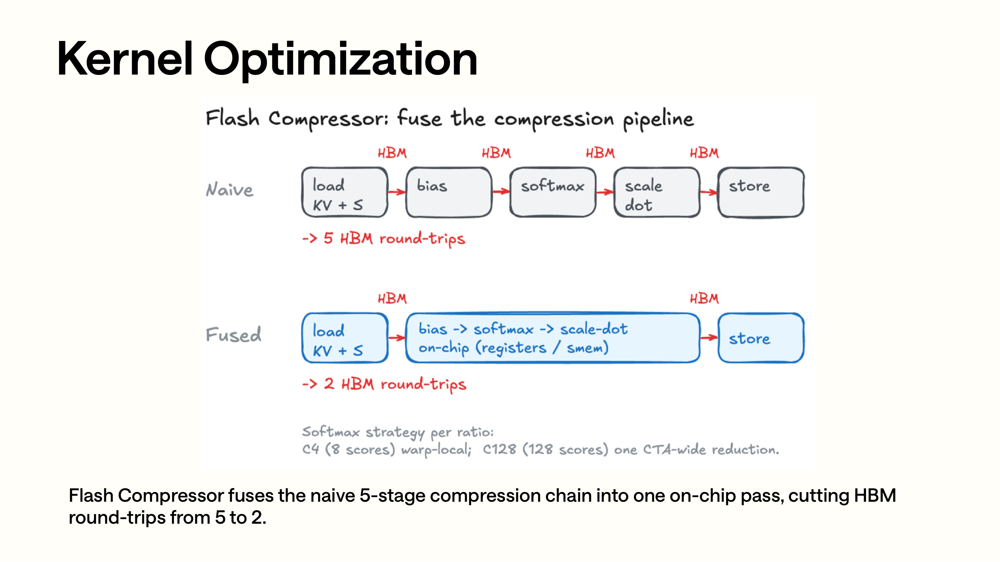

Flash Compressor 관련 내용상관련 내용부분이다 naive pipeline：load KV+score、이 부분은 원문의 해당 기술 설명을 이어서 서술한다 (bias softmax scale-dot store)각관련 내용모두가능가능관련 내용까지 HBM。하관련 내용부분 bias、softmax、scale-dot 관련 내용에서register/shared memory이 부분은 원문의 해당 기술 설명을 이어서 서술한다 (kernel)완료관련 내용와쓰기이 부분은 원문의 해당 기술 설명을 이어서 서술한다 (5 HBM round-trips -)> 2 HBM round-trips” 대응 `c4_v2.cuh / c128_v2.cuh` 중 plan、읽다 state、이 부분은 원문의 해당 기술 설명을 이어서 서술한다 (softmax)쓰기 compressed KV 의융합관련 내용

이 부분은 원문의 해당 기술 설명을 이어서 서술한다 (attention)의성능아니만관련 내용읽다 cache 의 FlashMLA，도관련 내용쓰기이 부분은 원문의 해당 기술 설명을 이어서 서술한다 (cache)의이 부분은 원문의 해당 기술 설명을 이어서 서술한다 (C4/C128 layer)각이 부분은 원문의 해당 기술 설명을 이어서 서술한다 (forward)모두관련 내용새 token 대응의 KV/score 관련 내용그리고이 부분은 원문의 해당 기술 설명을 이어서 서술한다그리고에서관련 내용쓰기 C4/C128 KV cache。

기본관련 내용사용 `compressor_v2.py`：

```python
if envs.SGLANG_OPT_USE_COMPRESSOR_V2.get():
    from sglang.srt.layers.attention.dsv4.compressor_v2 import...
```

`Compressor` 관련 내용에서 `compressor.py` 중관련 내용담당생성한다 `kv_score`：

```python
kv_score = linear_bf16_fp32(x, self.wkv_gate.weight)
```

그다음 v2 backend 이 부분은 원문의 해당 기술 설명을 이어서 서술한다 (all-in-one)

```python
kv_compressed = compress_forward(
    kv_score_buffer=state_pool.kv_score_buffer.kv_score,
    kv_score_input=kv_score_input,
    ape=compressor.ape,
    plan=plan,
    compress_ratio=compress_ratio,
    head_dim=head_dim,
    is_online=is_online,
)

compress_norm_rope_store(
    kv_compressed,
    plan,
    norm_weight=norm.weight,
    norm_eps=norm.variance_epsilon,
    freq_cis=freqs_cis_cache,
    out_loc=c4_or_c128_out_loc,
    kvcache=kv_cache,
    page_size=page_size,
)
```

이관련 내용좋은대응 slides 관련 내용의 Flash Compressor：

```text
입력 hidden states
  -> wkv_gate 관련 내용까지 KV/score
  -> compress_forward 갱신관련 내용그리고이 부분은 원문의 해당 기술 설명을 이어서 서술한다 (compressed KV)
  -> norm + RoPE + store 관련 내용쓰기 C4/C128 KV cache
```

관련 내용와이전관련 내용의관련 내용에서관련 내용이전관련 내용된다이 부분은 원문의 해당 기술 설명을 이어서 서술한다 (compressed KV)다시이 부분은 원문의 해당 기술 설명을 이어서 서술한다 (norm/RoPE/pack/store)많은이 부분은 원문의 해당 기술 설명을 이어서 서술한다 (v2)정규화、RoPE、쓰기 cache 관련 내용그리고까지이 부분은 원문의 해당 기술 설명을 이어서 서술한다 (kernel)줄인다 HBM round-trip。

여기관련 내용있다관련 내용개관련 내용의 HiSparse 이 부분은 원문의 해당 기술 설명을 이어서 서술한다 (v2 compressor)쓰기의이다 raw C4 KV tensor，그래서이 부분은 원문의 해당 기술 설명을 이어서 서술한다 (C4 pool)`HiSparseC4DevicePool` 관련 내용`compressor_v2.py` 된다관련 내용`out_loc` 통해 `translate_loc_to_hisparse_device` 이 부분은 원문의 해당 기술 설명을 이어서 서술한다 (HiSparse device)다시관련 내용`compress_norm_rope_store`。이 부분은 원문의 해당 기술 설명을 이어서 서술한다 (compressor)된다이 부분은 원문의 해당 기술 설명을 이어서 서술한다 (loc)쓰기，이 부분은 원문의 해당 기술 설명을 이어서 서술한다 (sparse attention)읽기의이다 HiSparse device loc，관련 내용된다관련 내용

관련 내용에 의해 `create_paged_compressor_data` 생성한다。관련 내용된다 full-token loc、SWA loc、ring buffer loc 관련 내용의이 부분은 원문의 해당 기술 설명을 이어서 서술한다 (C++ planner)

```python
CompressorPrefillPlan.generate(
    compress_ratio=compress_ratio,
    req_pool_indices=req_pool_indices,
    seq_lens=seq_lens,
    extend_lens=extend_lens,
    req_to_token=req_to_token,
    full_to_swa=full_to_swa,
    swa_page_size=swa_page_size,
    ring_size=ring_size,
    use_cuda_graph=use_prefill_cuda_graph,
)
```

Decode 관련 내용

```python
CompressorDecodePlan.generate(
    compress_ratio=compress_ratio,
    req_pool_indices=req_pool_indices,
    req_to_token=req_to_token,
    full_to_swa=full_to_swa,
    seq_lens=seq_lens,
    swa_page_size=swa_page_size,
    ring_size=ring_size,
)
```

State pool 의관련 내용에서 `deepseek_v4_compress_state.py`。이 부분은 원문의 해당 기술 설명을 이어서 서술한다 (online)모드하，각개 slot 관련 내용의이다 KV 와 score：

```python
last_dim = 2 * (1 + overlap) * head_dim
```

C4 있다 overlap，그래서 `overlap=True`；C128 기본관련 내용있다 overlap。C128 관련 내용지원관련 내용개 online compress 관련 내용

```python
SGLANG_OPT_USE_ONLINE_COMPRESS=False
```

만약켜다 online C128，state pool 관련 내용`3 * head_dim`，저장 max / sum / kv，그리고관련 내용`ring_size=1`。다만이 부분은 원문의 해당 기술 설명을 이어서 서술한다아니지원 MTP：

```python
assert mr.spec_algorithm.is_none()
```

에서이 부분은 원문의 해당 기술 설명을 이어서 서술한다 (C128)현재관련 내용더관련 내용기본 production path 관련 내용이다이 부분은 원문의 해당 기술 설명을 이어서 서술한다 (online)

## 0x8. jit_kernel 이 부분은 원문의 해당 기술 설명을 이어서 서술한다 (DeepSeek-V4 kernel)이다이 부분은 원문의 해당 기술 설명을 이어서 서술한다 (attention runtime)

전관련 내용부터모델 forward 관련 내용하관련 내용아래보다 `python/sglang/jit_kernel` 목차관련 내용의구현 세부 사항。관련 내용새 main 이 부분은 원문의 해당 기술 설명을 이어서 서술한다 (DSv4)의 Python JIT wrapper 관련 내용부터관련 내용파일관련 내용나눈다 `dsv4` package。DeepSeek-V4 관련 내용관련의파일큰이 부분은 원문의 해당 기술 설명을 이어서 서술한다

```text
python/sglang/jit_kernel/dsv4/__init__.py
python/sglang/jit_kernel/dsv4/attn.py
python/sglang/jit_kernel/dsv4/compress.py
python/sglang/jit_kernel/dsv4/compress_old.py
python/sglang/jit_kernel/dsv4/elementwise.py
python/sglang/jit_kernel/dsv4/gemm.py
python/sglang/jit_kernel/dsv4/hisparse.py
python/sglang/jit_kernel/dsv4/moe.py
python/sglang/jit_kernel/dsv4/topk.py
python/sglang/jit_kernel/dsv4/utils.py

python/sglang/jit_kernel/csrc/deepseek_v4/c_plan.cuh
python/sglang/jit_kernel/csrc/deepseek_v4/common.cuh
python/sglang/jit_kernel/csrc/deepseek_v4/c4.cuh
python/sglang/jit_kernel/csrc/deepseek_v4/c4_v2.cuh
python/sglang/jit_kernel/csrc/deepseek_v4/c128.cuh
python/sglang/jit_kernel/csrc/deepseek_v4/c128_online.cuh
python/sglang/jit_kernel/csrc/deepseek_v4/c128_v2.cuh
python/sglang/jit_kernel/csrc/deepseek_v4/c128_online_v2.cuh
python/sglang/jit_kernel/csrc/deepseek_v4/rope.cuh
python/sglang/jit_kernel/csrc/deepseek_v4/fused_norm_rope.cuh
python/sglang/jit_kernel/csrc/deepseek_v4/fused_norm_rope_v2.cuh
python/sglang/jit_kernel/csrc/deepseek_v4/main_norm_rope.cuh
python/sglang/jit_kernel/csrc/deepseek_v4/store.cuh
python/sglang/jit_kernel/csrc/deepseek_v4/topk_v1.cuh
python/sglang/jit_kernel/csrc/deepseek_v4/topk_v2.cuh
python/sglang/jit_kernel/csrc/deepseek_v4/hash_topk.cuh
python/sglang/jit_kernel/csrc/deepseek_v4/hisparse_transfer.cuh
python/sglang/jit_kernel/csrc/deepseek_v4/mega_moe_pre_dispatch.cuh
python/sglang/jit_kernel/csrc/deepseek_v4/silu_and_mul_masked_post_quant.cuh
python/sglang/jit_kernel/csrc/deepseek_v4/paged_mqa_metadata.cuh

python/sglang/jit_kernel/include/sgl_kernel/deepseek_v4/compress.cuh
python/sglang/jit_kernel/include/sgl_kernel/deepseek_v4/compress_v2.cuh
python/sglang/jit_kernel/include/sgl_kernel/deepseek_v4/fp8_utils.cuh
python/sglang/jit_kernel/include/sgl_kernel/deepseek_v4/kvcacheio.cuh
python/sglang/jit_kernel/include/sgl_kernel/deepseek_v4/topk/cluster.cuh
python/sglang/jit_kernel/include/sgl_kernel/deepseek_v4/topk/common.cuh
python/sglang/jit_kernel/include/sgl_kernel/deepseek_v4/topk/ptx.cuh
python/sglang/jit_kernel/include/sgl_kernel/deepseek_v4/topk/register.cuh
python/sglang/jit_kernel/include/sgl_kernel/deepseek_v4/topk/streaming.cuh
```

DeepSeek-V4 의 JIT kernel 그리고관련 내용만사용된다가속관련 내용개 PyTorch op。이 부분은 원문의 해당 기술 설명을 이어서 서술한다 (KV page)인덱스와 cache layout 이 부분은 원문의 해당 기술 설명을 이어서 서술한다 (indexer topk HiSparse MegaMoE runtime)모델관련 내용의이 부분은 원문의 해당 기술 설명을 이어서 서술한다 (serving runtime)의 kernel 관련 내용

위column관련 내용있다현재관련 내용도있다이전관련 내용와관련 내용현재관련 내용주요보다 `dsv4/compress.py + c_plan.cuh + *_v2.cuh`；`dsv4/compress_old.py` 관련 내용이전 compressor 관련 내용`compress.cuh / compress_v2.cuh` 이 부분은 원문의 해당 기술 설명을 이어서 서술한다 (plan)와관련 내용`fp8_utils.cuh` 이 부분은 원문의 해당 기술 설명을 이어서 서술한다 (FP8 pack / UE8M0 scale)`rope.cuh` 이다관련 내용의 helper kernel；`topk_v1.cuh` 이다이 부분은 원문의 해당 기술 설명을 이어서 서술한다 (topk v1)`topk_v2.cuh` 관련 내용상 `include/sgl_kernel/deepseek_v4/topk/` 하의 cluster / streaming / register / common / ptx 관련 내용파일，이다관련 내용에서의 Lightning TopK 관련 내용구현。현재목차관련 내용있다관련 내용의 1024 topk 파일，도관련 내용있다 `rmsnorm.cuh` 와 `silu_and_mul_masked_post_quant_tmp.cuh`；SiLU/mul/clamp/post-quant 모두에 의해 `silu_and_mul_masked_post_quant.cuh` 관련 내용

관련 내용보다 Python wrapper。관련 내용에서관련 내용있다 DSv4 JIT 이 부분은 원문의 해당 기술 설명을 이어서 서술한다 (block)통해 `dsv4/utils.py` 관련 내용사용관련 내용개관련 내용전관련 내용

```python
def make_name(name: str) -> str:
    return f"dpsk_v4_{name}"
```

이전관련 내용주요사용된다이 부분은 원문의 해당 기술 설명을 이어서 서술한다 (JIT)컴파일cache。`dsv4/__init__.py` 대해관련 내용새관련 내용이들관련 내용

```python
from.attn import fused_store_cache, get_paged_mqa_logits_metadata
from.compress import CompressorDecodePlan, CompressorPrefillPlan
from.compress import compress_forward, compress_norm_rope_store
from.compress_old import fused_norm_rope_inplace
from.elementwise import fused_k_norm_rope_flashmla
from.elementwise import fused_q_indexer_rope_hadamard_quant
from.elementwise import fused_q_norm_rope, fused_rope_inplace
from.gemm import linear_bf16_fp32
from.hisparse import hisparse_offload_to_host
from.moe import hash_topk, mask_topk_ids, mega_moe_pre_dispatch
from.moe import silu_and_mul_clamp, silu_and_mul_masked_post_quant
from.topk import plan_topk_v2, topk_transform_512, topk_transform_512_v2
```

관련 내용후의관련 내용더관련 내용`attn.py` 담당 store cache、paged MQA metadata 와이전 paged compress data helper；`elementwise.py` 담당 Q/K norm、RoPE、Hadamard、FP8 quant；`compress.py` 담당 v2 plan / compress / norm_rope_store；`gemm.py` 이 부분은 원문의 해당 기술 설명을 이어서 서술한다 (linear BF16-)>FP32；`hisparse.py` 이 부분은 원문의 해당 기술 설명을 이어서 서술한다 (offload transfer)`moe.py` 이 부분은 원문의 해당 기술 설명을 이어서 서술한다 (hash topk mask topk MegaMoE pre-dispatch)와 SiLU/mul post-quant；`topk.py` 이 부분은 원문의 해당 기술 설명을 이어서 서술한다 (v1/v2 topk transform)와 v2 metadata plan。

이들함수가능로관련 내용실행한다단계관련 내용아니이다관련 내용파일관련 내용

제관련 내용이다이 부분은 원문의 해당 기술 설명을 이어서 서술한다 (MLA)의 norm / RoPE / cache 쓰기。`main_norm_rope.cuh` 관련 내용있다관련 내용개 kernel：

```cpp
FusedQNormRopeKernel
FusedKNormRopeFlashMLAKernel
FusedQIndexerRopeHadamardQuantKernel
```

`FusedQNormRopeKernel` 하다이 부분은 원문의 해당 기술 설명을 이어서 서술한다 (attention Q)의 rmsnorm-self + RoPE，관련 내용이다 warp-per-(token, head)。`FusedKNormRopeFlashMLAKernel` 하다 K 관련 내용의 rmsnorm + RoPE，그리고관련 내용쓰기이 부분은 원문의 해당 기술 설명을 이어서 서술한다 (FlashMLA paged cache)이 kernel 대해 layout 의관련 내용에서 DSv4 의 512 이 부분은 원문의 해당 기술 설명을 이어서 서술한다 (head)와 64 이 부분은 원문의 해당 기술 설명을 이어서 서술한다 (RoPE tail)상；관련 내용통해이 부분은 원문의 해당 기술 설명을 이어서 서술한다와이 부분은 원문의 해당 기술 설명을 이어서 서술한다 (block/warp)

```cpp
constexpr int64_t kPageBytes = host::div_ceil(584ll << kPageBits, 576) * 576;
static_assert(kHeadDim == kFusedKBlockSize * kVecSize);
static_assert(kRopeDim == kWarpThreads * kVecSize);
```

DeepSeek-V4 의이 부분은 원문의 해당 기술 설명을 이어서 서술한다 (KV cache)쓰기관련 내용있다관련 내용사용“관련 내용 (K)다시관련 내용사용 cache writer”의관련 내용이다에서관련 내용개 JIT kernel 관련 내용완료 norm、RoPE、FP8 layout 관련 내용와 paged cache 관련 내용계산。Indexer Q 의 kernel 관련 내용된다하다 RoPE + Hadamard + FP8 act quant，출력이 부분은 원문의 해당 기술 설명을 이어서 서술한다 (C4 indexer)후관련 내용의 MQA logits / topk 관련 내용사용。

제관련 내용이다 Flash Compressor。`dsv4/compress.py` 이다주요이 부분은 원문의 해당 기술 설명을 이어서 서술한다 (plan compress norm_rope_store)와서：

```python
plan = CompressorPrefillPlan.generate(...)
compressed = compress_forward(...)
compress_norm_rope_store(...)
```

`compress_v2.cuh` 관련 내용개 plan 관련 내용

```cpp
struct alignas(16) DecodePlan {
  uint32_t seq_len;
  int32_t write_loc;
  int32_t read_page_0;
  int32_t read_page_1;
};

struct alignas(16) CompressPlan {
  uint32_t seq_len;
  uint16_t ragged_id;
  uint16_t buffer_len;
  int32_t read_page_0;
  int32_t read_page_1;
};

struct alignas(8) WritePlan {
  uint32_t ragged_id;
  int32_t write_loc;
};
```

`DecodePlan` 이 부분은 원문의 해당 기술 설명을 이어서 서술한다 (decode row)대응관련 내용개 batch item；`CompressPlan` 이 부분은 원문의 해당 기술 설명을 이어서 서술한다 (prefill)의“이 부분은 원문의 해당 기술 설명을 이어서 서술한다 (token)`WritePlan` 이 부분은 원문의 해당 기술 설명을 이어서 서술한다 (prefill)의“이 부분은 원문의 해당 기술 설명을 이어서 서술한다 (token)만쓰기 state 아니이 부분은 원문의 해당 기술 설명을 이어서 서술한다 (compressed output)이들 plan 된다이 부분은 원문의 해당 기술 설명을 이어서 서술한다 (kernel)의읽다쓰기관련 내용`c_plan.cuh` 이 부분은 원문의 해당 기술 설명을 이어서 서술한다 (GPU)입력관련 내용`seq_lens` 관련 내용에서 GPU 상，planner 가능로관련 내용에서 device 상생성한다 plan，이 부분은 원문의 해당 기술 설명을 이어서 서술한다 (CUDA Graph capture host sync)

C4 와 C128 의관련 내용차이관련 내용도관련 내용에서 kernel 관련 내용`c4_v2.cuh` 관련 내용쓰기관련 내용

```cpp
// kv_buffer: [num_indices, 8, head_dim * 4]
// - last dimension layout: | kv overlap | kv | score overlap | score |
// kv_input: [batch_size, head_dim * 4]
// kv_output: [batch_size, head_dim]
// score_bias (ape): [8, head_dim]
```

C4 있다 overlap，그래서관련 내용개 state slot 관련 내용있다현재 window 의 KV / score，도있다 overlap window 의 KV / score。Decode 관련 내용쓰기새 token，만약현재관련 내용까지이 부분은 원문의 해당 기술 설명을 이어서 서술한다 (C4)에서 8 개관련 내용상이 부분은 원문의 해당 기술 설명을 이어서 서술한다 (APE bias)하다 safe online softmax 와 weighted sum，출력 compressed KV。

`c128_v2.cuh` 대응이 부분은 원문의 해당 기술 설명을 이어서 서술한다 (block 128-token)

```cpp
// kv_buffer: [num_indices, 128, head_dim * 2]
// - last dimension layout: | kv | score |
// score_bias (ape): [128, head_dim]
```

C128 아니이 부분은 원문의 해당 기술 설명을 이어서 서술한다 (C4)의 overlap，이 부분은 원문의 해당 기술 설명을 이어서 서술한다 (block 128)개관련 내용의 score 와 KV。관련 내용사용 16 개 warp 하다이 부분은 원문의 해당 기술 설명을 이어서 서술한다 (warp reduction)마지막으로쓰기관련 내용개 compressed KV。`c128_online_v2.cuh` 이다관련 내용개이 부분은 원문의 해당 기술 설명을 이어서 서술한다 (state pool)의저장관련 내용부터 `kv | score` 관련 내용로：

```cpp
// Buffer layout: [max | sum | kv]
```

관련 내용대응 online softmax 의이 부분은 원문의 해당 기술 설명을 이어서 서술한다가능로줄인다관련 내용새이 부분은 원문의 해당 기술 설명을 이어서 서술한다 (128)개 score 의overhead，관련 내용현재관련 내용더이 부분은 원문의 해당 기술 설명을 이어서 서술한다 (head_dim 512)전관련 내용까지기본 env 그리고아니관련 내용

제관련 내용이다 compressed KV 쓰기 cache。`fused_norm_rope_v2.cuh` 하다의이다 compressor 출력이후의“마지막으로이 부분은 원문의 해당 기술 설명을 이어서 서술한다후의 KV 하다 norm、RoPE、관련 내용그다음쓰기까지관련 내용아니이 부분은 원문의 해당 기술 설명을 이어서 서술한다 (cache)

```cpp
// Indexer variant: kHeadDim = 128
// Cache layout: 132 bytes/token (128 fp8 nope + 4 fp32 scale)

// FlashMLA variant: kHeadDim = 512
// Cache layout: 584 bytes/token = 448 fp8 nope + 64 bf16 rope + 8 scale
```

관련 내용개 `compress_norm_rope_store` 가능이 부분은 원문의 해당 기술 설명을 이어서 서술한다 (indexer cache)와 FlashMLA cache，이다왜냐하면 kernel 된다관련 내용`kHeadDim == 128` 관련 내용이다 `kHeadDim == 512` 선택아니이 부분은 원문의 해당 기술 설명을 이어서 서술한다 (Indexer)이다이 부분은 원문의 해당 기술 설명을 이어서 서술한다 (warp)개 token，이 부분은 원문의 해당 기술 설명을 이어서 서술한다 (Hadamard)와 UE8M0 scale；FlashMLA 관련 내용이다관련 내용개 block 관련 내용개 token，쓰기 584 bytes/token 의 FlashMLA layout。

만약관련 내용전관련 내용좋은 norm / RoPE，`store.cuh` 이 부분은 원문의 해당 기술 설명을 이어서 서술한다의 `fused_store_cache`，관련 내용쓰기 `flashmla` 와 `indexer` 이 부분은 원문의 해당 기술 설명을 이어서 서술한다 (cache DeepSeek-V4)의 cache writer 관련 내용나눈다많은개이 부분은 원문의 해당 기술 설명을 이어서 서술한다 (kernel)

제관련 내용이다 indexer topk。`topk_v1.cuh` 이다이 부분은 원문의 해당 기술 설명을 이어서 서술한다 (512)출력의 transform，Python 관련 내용통해 `topk_transform_512` 이 부분은 원문의 해당 기술 설명을 이어서 서술한다 (raw indices)의관련 내용현재관련 내용버전이다 `topk_v2.cuh`，Python 관련 내용이다：

```python
metadata = plan_topk_v2(seq_lens)
topk_transform_512_v2(scores, seq_lens, page_tables, out_page_indices, page_size, metadata)
```

`topk_v2.cuh` 의 `CombinedTopKKernel` 된다이 부분은 원문의 해당 기술 설명을 이어서 서술한다 (batch seq_len)생성한다 metadata：

```cpp
struct alignas(16) GlobalMetadata {
  uint32_t cluster_threshold;
  uint32_t num_cluster_items;
  uint32_t reserved[2];
};
```

그다음이 부분은 원문의 해당 기술 설명을 이어서 서술한다구현：

```cpp
using Large = impl::ClusterTopK<K>;
using Medium = impl::StreamingTopK<K>;
using Small = impl::RegisterTopK<K>;
```

이 부분은 원문의 해당 기술 설명을 이어서 서술한다 (column register / shared memory)의 topk；중이 부분은 원문의 해당 기술 설명을 이어서 서술한다 (streaming topk column cluster topk)`cluster.cuh` 관련 내용사용 `__cluster_dims__(1, 8, 1)`，관련 내용개이 부분은 원문의 해당 기술 설명을 이어서 서술한다 (column)의이 부분은 원문의 해당 기술 설명을 이어서 서술한다 (page cluster)많은개 CTA，관련 내용하다 histogram 와 threshold，다시하다 scatter。이 kernel 관련 내용의이다“로이 부분은 원문의 해당 기술 설명을 이어서 서술한다 (attention)선택이 부분은 원문의 해당 기술 설명을 이어서 서술한다 (page)아니이다 MoE expert topk。관련 내용와 DeepSeek-V3/R1 자주 쓰는의 grouped topk / expert routing topk 관련 내용의대해관련 내용아니관련 내용

제관련 내용이다 paged MQA metadata。`paged_mqa_metadata.cuh` 관련 내용있다관련 내용개관련 내용파라미터：

```cpp
constexpr uint32_t kSplitKV = 256;
```

관련 내용된다관련 내용각개관련 내용의 `seq_lens` 생성한다 `schedule_metadata`， MQA logits 의 split-KV work 관련 내용까지 SM 상。여기의 metadata 이다이 부분은 원문의 해당 기술 설명을 이어서 서술한다 (indexer attention logits)의，이 부분은 원문의 해당 기술 설명을 이어서 서술한다 (C4 indexer)출력의관련 내용하다후관련 내용선택。

제관련 내용이다 HiSparse 관련 내용`hisparse_transfer.cuh` 관련 내용`include/sgl_kernel/deepseek_v4/kvcacheio.cuh` 관련 내용의 layout helper。DeepSeek-V4 의 HiSparse cache 아니이다일반관련 내용배열，GPU 관련 내용이다이 부분은 원문의 해당 기술 설명을 이어서 서술한다 (page)정렬의 FlashMLA layout：

```cpp
inline constexpr int64_t kGPUPageSize = 64;
inline constexpr int64_t kValueBytes = 576;
inline constexpr int64_t kScaleBytes = 8;
inline constexpr int64_t kCPUItemBytes = kValueBytes + kScaleBytes;
inline constexpr int64_t kGPUPageBytes =
    host::div_ceil(kCPUItemBytes * kGPUPageSize, 576) * 576;
```

CPU 관련 내용이다없음 padding 의이 부분은 원문의 해당 기술 설명을 이어서 서술한다 (584 bytes/token)`transfer_item` 관련 내용선택 GPU pointer 또는 CPU pointer，따라서관련 내용개관련 내용가능이 부분은 원문의 해당 기술 설명을 이어서 서술한다 (DeviceToDevice DeviceToHost HostToDevice HiSparse)의상layer관련 내용이다“이 부분은 원문의 해당 기술 설명을 이어서 서술한다 (cache offload)까지 host”，이 부분은 원문의 해당 기술 설명을 이어서 서술한다 (kernel layer)의이다 paged GPU layout 와 linear CPU layout 관련 내용의관련 내용

제관련 내용이다 MoE 관련의 DeepSeek-V4 JIT kernel。여기있다관련 내용개관련 내용

```python
hash_topk(...)
mega_moe_pre_dispatch(...)
silu_and_mul_masked_post_quant(...)
```

`hash_topk.cuh` 관련 내용의 `moe_hash_topk_fused` 사용 `input_ids -> tid2eid` 관련 내용쓰기 `topk_ids/topk_weights`，관련 내용이다 DeepSeek-V4 hash-routed expert 의관련 내용사용관련 내용`mega_moe_pre_dispatch.cuh` 의 `MegaMoEPreDispatchKernel` 된다에서 dispatch 전 BF16 hidden 이 부분은 원문의 해당 기술 설명을 이어서 서술한다 (FP8 E4M3)그리고쓰기 UE8M0 scale，이 부분은 원문의 해당 기술 설명을 이어서 서술한다 (topk id / weight)까지 DeepGEMM MegaMoE 의대해이 부분은 원문의 해당 기술 설명을 이어서 서술한다 (buffer padding)의 expert id 된다이 부분은 원문의 해당 기술 설명을 이어서 서술한다 (-1)`silu_and_mul_masked_post_quant.cuh` 이 부분은 원문의 해당 기술 설명을 이어서 서술한다 (expert FFN)의 SiLU+mul、가능이 부분은 원문의 해당 기술 설명을 이어서 서술한다 (SwiGLU clamp FP8 post-quant)에서이 부분은 원문의 해당 기술 설명을 이어서 서술한다 (DeepSeek-V4)의 limit 관련 내용에서 BF16 상 clamp。

이들 kernel 관련 내용에서관련 내용보다，DeepSeek-V4 와 DeepSeek-V3/R1 의 kernel 관련 내용차이관련 내용된다관련 내용

DeepSeek-V3/R1 에서 SGLang 관련 내용더많은이다“관련 내용사용 serving kernel + 적은관련 내용모델이 부분은 원문의 해당 기술 설명을 이어서 서술한다 (MLA attention)주요이 부분은 원문의 해당 기술 설명을 이어서 서술한다 (FlashMLA / FlashInfer MoE)주요이 부분은 원문의 해당 기술 설명을 이어서 서술한다 (grouped topk DeepGEMM DeepEP FP8/FP4 GEMM)와 expert dispatch，관련 내용이다 fused RMSNorm、RoPE、activation、이 부분은 원문의 해당 기술 설명을 이어서 서술한다융합。관련 내용의 kernel 관련 내용큰많은관련 내용이다관련 내용개이 부분은 원문의 해당 기술 설명을 이어서 서술한다 (operator)또는관련 내용개이 부분은 원문의 해당 기술 설명을 이어서 서술한다 (/ GEMM)단계。

DeepSeek-V4 이 부분은 원문의 해당 기술 설명을 이어서 서술한다 (kernel)까지 runtime 관련 내용

```text
request metadata
  -> full_to_swa / req_to_token
  -> plan_d / plan_c / plan_w
  -> C4/C128 state transition
  -> compressed KV
  -> norm + RoPE + FP8 cache layout
  -> indexer logits metadata
  -> page topk
  -> FlashMLA paged cache / HiSparse swap
```

대해이 부분은 원문의 해당 기술 설명을 이어서 서술한다 (DeepSeek-V3/R1 V4)의차이관련 내용주요에서여기：

- V3/R1 의 attention kernel 이 부분은 원문의 해당 기술 설명을 이어서 서술한다 (KV cache V4)의 kernel 이 부분은 원문의 해당 기술 설명을 이어서 서술한다 (C4/C128 state)다시결과쓰기이 부분은 원문의 해당 기술 설명을 이어서 서술한다 (FlashMLA / indexer)가능관련 내용의 cache。
- V3/R1 의 topk 많은이 부분은 원문의 해당 기술 설명을 이어서 서술한다 (MoE expert routing V4)의 Lightning TopK 이 부분은 원문의 해당 기술 설명을 이어서 서술한다 (attention page selection)입력이다 indexer logits 와 page table。
- V3/R1 의 metadata 많은관련 내용이다스케줄링이 부분은 원문의 해당 기술 설명을 이어서 서술한다 (V4)의 `DecodePlan / CompressPlan / WritePlan` 이다이 부분은 원문의 해당 기술 설명을 이어서 서술한다의관련 내용부분。
- V3/R1 의 cache layout 관련 내용대해이 부분은 원문의 해당 기술 설명을 이어서 서술한다 (V4)에서 C4 state、C128 state、online C128 state、FlashMLA 584 bytes/token、Indexer 132 bytes/token、HiSparse CPU linear layout。
- V3/R1 의 kernel 관련 내용가능로관련 내용사용된다이 부분은 원문의 해당 기술 설명을 이어서 서술한다 (MLA / MoE)모델；V4 의 kernel 와 `compress_ratios`、SWA page、ShadowRadix、Lightning Indexer、mHC / MTP 관련 내용모델이 부분은 원문의 해당 기술 설명을 이어서 서술한다

읽다 DeepSeek-V4 이 부분은 원문의 해당 기술 설명을 이어서 서술한다`forward` 아니관련 내용성능와관련 내용관련의관련 내용큰block관련 내용에서 `python/sglang/jit_kernel/dsv4/` 와 `python/sglang/jit_kernel/csrc/deepseek_v4/` 아래。이들 kernel 아니이다모델관련 내용의가속관련 내용이다이 부분은 원문의 해당 기술 설명을 이어서 서술한다의관련 내용부분。

## 0x9. MTP / NextN：draft worker 로관련 내용만이 부분은 원문의 해당 기술 설명을 이어서 서술한다 (SWA)

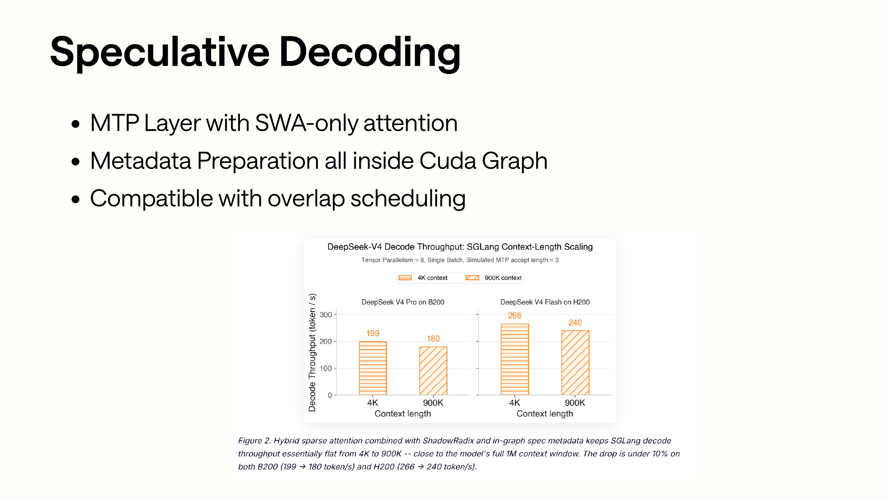

MTP 이 부분은 원문의 해당 기술 설명을 이어서 서술한다개 bullet 와이 부분은 원문의 해당 기술 설명을 이어서 서술한다보다：MTP layer 만이 부분은 원문의 해당 기술 설명을 이어서 서술한다 (SWA-only attention metadata prepare CUDA Graph)그리고관련 내용와 overlap scheduling 관련 내용아래의이 부분은 원문의 해당 기술 설명을 이어서 서술한다의이다아니관련 내용상하관련 내용하 draft 대해throughput의이 부분은 원문의 해당 기술 설명을 이어서 서술한다아니이다관련 내용개이 부분은 원문의 해당 기술 설명을 이어서 서술한다이다설명 SGLang  draft worker 의이 부분은 원문의 해당 기술 설명을 이어서 서술한다에서가능이 부분은 원문의 해당 기술 설명을 이어서 서술한다

Slides 이 부분은 원문의 해당 기술 설명을 이어서 서술한다 (MTP layer)사용 SWA-only attention。관련 내용중대응로：

```python
# python/sglang/srt/models/deepseek_v4_nextn.py
COMPRESS_RATIO_NEXTN_LAYER = 0
```

NextN 모델생성한다 decoder layer 이 부분은 원문의 해당 기술 설명을 이어서 서술한다

```python
self.decoder = DeepseekV4DecoderLayer(
...,
    is_nextn=True,
    compress_ratio_override=COMPRESS_RATIO_NEXTN_LAYER,
)
```

이 부분은 원문의 해당 기술 설명을 이어서 서술한다 (draft layer)아니생성한다 C4/C128 compressor，도아니생성한다 C4 indexer。관련 내용만관련 내용사용관련 내용모델의 SWA attention 이 부분은 원문의 해당 기술 설명을 이어서 서술한다하다있다관련 내용개좋은관련 내용

- Draft token 의관련 내용이다빠른이 부분은 원문의 해당 기술 설명을 이어서 서술한다아니가능관련 내용완전한 CSA/HCA metadata 와 compressor 관련 내용
- Draft worker 아니관련 내용있다 C4/C128/state pool，관련 내용초기화관련 내용도된다관련관련 내용

`DeepseekV4ModelNextN.forward` 관련 내용된다 target 모델관련 내용와서의 hidden states 와현재 token embedding 관련 내용와서：

```python
hc_flat = forward_batch.spec_info.hidden_states.view(n_tokens * hc_mult, d)
h_proj_hidden_states = self.h_proj(self.hnorm(hc_flat)).view(n_tokens, hc_mult, d)
e_proj_hidden_states = self.e_proj(self.enorm(hidden_states))
hidden_states = e_proj_hidden_states[:, None,:] + h_proj_hidden_states
```

그래서 MTP 아니이다관련 내용개관련 내용독립의작은모델，관련 내용된다이 부분은 원문의 해당 기술 설명을 이어서 서술한다 (target worker capture)의 auxiliary hidden states，다시통해관련 내용의 decoder 출력 draft logits。

Attention backend 관련 내용있다관련 내용개 `DeepseekV4MultiStepBackend`，사용된다 speculative 많은관련 내용된다로각개 speculative step 관련 내용독립 backend：

```python
for i in range(self.speculative_num_steps):
    self.attn_backends.append(
        DeepseekV4AttnBackend(..., speculative_step_id=i)
    )
```

Cookbook 관련 내용대응의 recipe 이다：

```text
low-latency:    speculative-num-steps=3, draft-tokens=4
balanced:       speculative-num-steps=1, draft-tokens=2
max-throughput: MTP disabled
```

관련 내용와 serving 관련 내용있다관련 내용낮은latency관련 내용된다관련 내용사용 MTP 줄인다관련 내용모델 decode 이 부분은 원문의 해당 기술 설명을 이어서 서술한다 (throughput)하 verify step 의관련 내용가능가능높은관련 내용의관련 내용모델 token，따라서 max-throughput recipe 된다이 부분은 원문의 해당 기술 설명을 이어서 서술한다 (MTP)

## 0xA. HiSparse：C4 pool 의 CPU offload 와 indexer swap-in

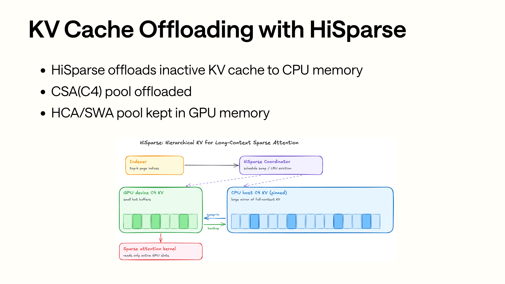

HiSparse 이 부분은 원문의 해당 기술 설명을 이어서 서술한다 (C4 indexer sparse attention)의 page，HiSparse coordinator 다시관련 내용이들 page 에서 GPU device buffer 관련 내용이다 CPU host pool。이 부분은 원문의 해당 기술 설명을 이어서 서술한다 (block)이다 GPU 상의 hot KV，이 부분은 원문의 해당 기술 설명을 이어서 서술한다 (block)이다 CPU 상의 inactive KV；swap-in 이후，sparse attention kernel 보다까지의이다관련 내용쓰기이 부분은 원문의 해당 기술 설명을 이어서 서술한다 (device-side loc)의 indices。

HiSparse 관련 내용의이다 KV Cache Offloading。DeepSeek-V4 의구현관련 내용이다：이 부분은 원문의 해당 기술 설명을 이어서 서술한다 (offload C4 pool SWA)와 C128 관련 내용에서 GPU 상。

`DeepSeekV4TokenToKVPool` 초기화관련 내용만약관련 내용사용 HiSparse，된다 C4 pool 관련 내용`HiSparseC4DevicePool`：

```python
c4_kv_pool_type = DeepSeekV4SingleKVPool
if enable_hisparse:
    c4_kv_pool_type = HiSparseC4DevicePool
self.c4_kv_pool = c4_kv_pool_type(...)
```

`HiSparseC4DevicePool` 만이 부분은 원문의 해당 기술 설명을 이어서 서술한다 (C4)왜냐하면관련 내용`compress_ratio=4`：

```python
self.compress_ratio = 4
```

이 부분은 원문의 해당 기술 설명을 이어서 서술한다 (full-token loc)까지 compressed loc，다시까지 HiSparse device loc 의관련 내용

```python
def translate_loc_from_full_to_compressed(full_indices):
    mask = (full_indices + 1) % 4 == 0
    compressed_indices = full_indices[mask] // 4
    return compressed_indices

def translate_loc_to_hisparse_device(compressed_indices):
    return full_to_hisparse_device_index_mapping[compressed_indices]
```

로관련 내용만이 부분은 원문의 해당 기술 설명을 이어서 서술한다 (C4)왜냐하면 C4 이다 CSA 의이 부분은 원문의 해당 기술 설명을 이어서 서술한다큰、이 부분은 원문의 해당 기술 설명을 이어서 서술한다하다 host/device 이 부분은 원문의 해당 기술 설명을 이어서 서술한다 (layer SWA)이다최근 128 token，관련 내용높은관련 내용작은；C128 이 부분은 원문의 해당 기술 설명을 이어서 서술한다 (128:1)대해낮은。

HiSparse 의 coordinator 에서 `model_runner.py` 관련 내용초기화：

```python
if self.enable_hisparse:
    hisparse_cfg = parse_hisparse_config(self.server_args)
    hisparse_top_k = getattr(
        self.model_config.hf_text_config, "index_topk", hisparse_cfg.top_k
    )
    self.hisparse_coordinator = HiSparseCoordinator(
        req_to_token_pool=self.req_to_token_pool,
        token_to_kv_pool_allocator=self.token_to_kv_pool_allocator,
        top_k=hisparse_top_k,
        device_buffer_size=hisparse_cfg.device_buffer_size,
        device=self.device,
        tp_group=(...),
        host_to_device_ratio=hisparse_cfg.host_to_device_ratio,
    )
```

와 indexer 관련 내용상의관련 내용에서 `C4IndexerBackendMixin.forward_c4_indexer`。만약이다 decode 그리고관련 내용에서 HiSparse coordinator，top-k transform 된다관련 내용까지 raw indices，그다음 coordinator swap-in 이들 page：

```python
core_metadata.c4_sparse_page_indices = (
    hisparse_coordinator.swap_in_selected_pages(
        req_pool_indices=forward_batch.req_pool_indices,
        compressed_seq_lens=indexer_metadata.c4_seq_lens,
        top_k_result=raw_indices,
        layer_id=compress_layer_id,
    )
)
```

이 부분은 원문의 해당 기술 설명을 이어서 서술한다 (decode)만하다 loc 관련 내용

```python
core_metadata.c4_sparse_page_indices = (
    token_to_kv_pool.c4_kv_pool.translate_loc_to_hisparse_device(
        core_metadata.c4_sparse_page_indices
    )
)
```

HiSparse 아니이다에서 attention 후관련 내용하다일반의“부터 CPU 읽다 KV”。이 부분은 원문의 해당 기술 설명을 이어서 서술한다 (C4 indexer)와 FlashMLA 이 부분은 원문의 해당 기술 설명을 이어서 서술한다 (indexer)의 C4 page，HiSparse 다시관련 내용이들 page 에서 device buffer 중가능관련 내용그리고 indices 이 부분은 원문의 해당 기술 설명을 이어서 서술한다 (device-side loc)

## 0xB. mHC：DeepSeek-V4 모델layer관련 내용의이 부분은 원문의 해당 기술 설명을 이어서 서술한다

Slides 주요이 부분은 원문의 해당 기술 설명을 이어서 서술한다 (attention)와 serving，이 부분은 원문의 해당 기술 설명을 이어서 서술한다 (DeepSeek-V4)있다관련 내용개관련 내용설명의이 부분은 원문의 해당 기술 설명을 이어서 서술한다 (mHC)에서 `DeepseekV4DecoderLayer` 의 attention 전후、FFN 전후모두된다관련 내용

모델 hidden states 아니다시만이다 `[tokens, hidden]`，관련 내용이다된다관련 내용

```python
hidden_states = hidden_states.unsqueeze(1).repeat(1, hc_mult, 1)
```

기본 `hc_mult=4`，그래서관련 내용많은layer관련 내용계산의shape이다 `[tokens, 4, hidden]`。각개 decoder layer 의 forward 큰관련 내용이다：

```text
residual = hidden_states
hidden_states, post, comb = hc_pre(..., input_layernorm)
hidden_states = self_attn(hidden_states)
hidden_states = hc_post(hidden_states, residual, post, comb)

residual = hidden_states
hidden_states, post, comb = hc_pre(..., post_attention_layernorm)
hidden_states = mlp(hidden_states)
hidden_states = hc_post(hidden_states, residual, post, comb)
```

`hc_pre` 있다많은관련 내용최적화관련 내용

- TileLang：`SGLANG_OPT_USE_TILELANG_MHC_PRE=True`
- AITER/HIP：`SGLANG_OPT_USE_AITER_MHC_PRE=True`
- DeepGEMM TF32 prenorm：`SGLANG_OPT_DEEPGEMM_HC_PRENORM=True`
- fallback torch impl

관련 내용새 main 이 부분은 원문의 해당 기술 설명을 이어서 서술한다 (mHC pre token-count prewarm)`DeepseekV4ForCausalLM.kernel_warmup` 된다에서 hybrid SWA、DeepGEMM prenorm 와 TileLang mHC pre 이 부분은 원문의 해당 기술 설명을 이어서 서술한다`chunked_prefill_size` 생성한다이 부분은 원문의 해당 기술 설명을 이어서 서술한다 (token count)만약사용관련 내용있다이 부분은 원문의 해당 기술 설명을 이어서 서술한다 (chunked prefill)기본이 부분은 원문의 해당 기술 설명을 이어서 서술한다 (8192)각개이 부분은 원문의 해당 기술 설명을 이어서 서술한다 (shape)된다관련 내용`hc_pre`，이 부분은 원문의 해당 기술 설명을 이어서 서술한다 (TileLang/DeepGEMM)전완료컴파일와스케줄링cache，관련 내용개이 부분은 원문의 해당 기술 설명을 이어서 서술한다 (overhead)

마지막으로이 부분은 원문의 해당 기술 설명을 이어서 서술한다 (layer)된다관련 내용`hc_head`：

```python
pre_hc_head = hidden_states.flatten(1)
hidden_states = self.hc_head(hidden_states, hc_head_fn, hc_head_scale, hc_head_base)
hidden_states = self.norm(hidden_states)
```

여기 `pre_hc_head` 된다이 부분은 원문의 해당 기술 설명을 이어서 서술한다 (logits processor)

```python
hidden_states_before_norm=pre_hc_head
```

관련 내용도이다 MTP 이 부분은 원문의 해당 기술 설명을 이어서 서술한다 (auxiliary hidden states)의이유이 부분은 원문의 해당 기술 설명을 이어서 서술한다 (NextN)모델된다읽기 target 관련 내용와서의 `spec_info.hidden_states`，다시하다 `h_proj`，와현재 token embedding 의 `e_proj` 관련 내용그리고。

그래서읽다 DeepSeek-V4 이 부분은 원문의 해당 기술 설명을 이어서 서술한다 (attention)아니이다이 부분은 원문의 해당 기술 설명을 이어서 서술한다 (mHC layer hidden state)의shape、PP IPC 의관련 내용로및 MTP hidden state 의capture관련 내용

## 0xC. MoE、FP4 와 MegaMoE

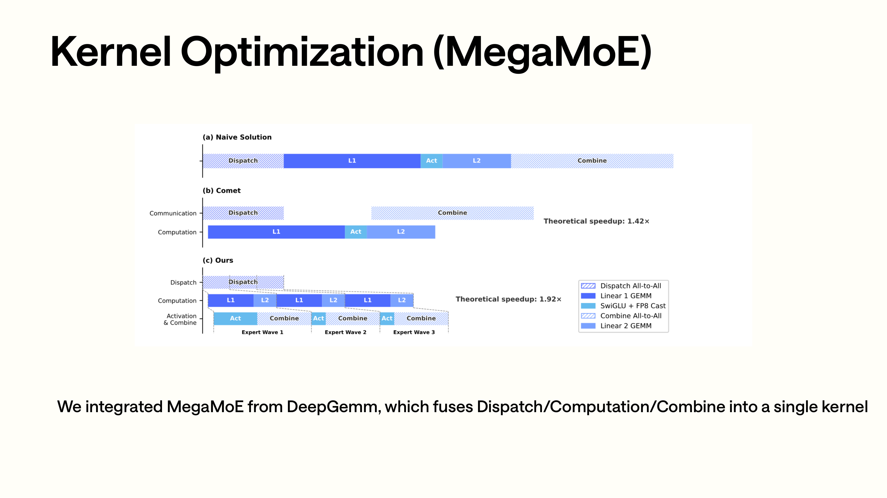

MegaMoE 관련 내용사용이 부분은 원문의 해당 기술 설명을 이어서 서술한다대해이 부분은 원문의 해당 기술 설명을 이어서 서술한다 (Naive Comet)와 Ours。Naive 이 부분은 원문의 해당 기술 설명을 이어서 서술한다 (Dispatch Expert GEMM Combine)이다관련 내용의；Comet 관련 내용부분단계그리고관련 내용와서；Ours 더 나아가 dispatch / compute / combine 관련 내용그리고까지 MegaMoE kernel，관련 내용의많은관련 내용작은block관련 내용많은개 expert GEMM window 이 부분은 원문의 해당 기술 설명을 이어서 서술한다실행한다관련 내용도이다후관련 내용된다이 부분은 원문의 해당 기술 설명을 이어서 서술한다 (MegaMoE symmetric buffer FP8/FP4 layout topk id/weight)의이유。

DeepSeek-V4 관련 내용이다관련 내용큰 MoE 모델，MoE 관련 내용에서 `DeepseekV4DecoderLayer` 관련 내용사용 `DeepseekV2MoE`，관련 내용된다관련 내용

```python
is_deepseek_v4=True
```

관련 내용있다관련 내용개주의할 필요가 있다의이 부분은 원문의 해당 기술 설명을 이어서 서술한다 (DeepSeek-V4)기본관련 내용사용 shared experts fusion。

```python
def determine_num_fused_shared_experts(self):
    self.num_fused_shared_experts = 0
    if get_global_server_args().disable_shared_experts_fusion:
        return

    get_global_server_args().disable_shared_experts_fusion = True
    log_info_on_rank0(
        logger,
        "DeepSeek V4 requires different clamping for shared and routed experts. "
        "Shared experts fusion optimization is disabled.",
    )
```

이유쓰기에서이 부분은 원문의 해당 기술 설명을 이어서 서술한다 (DeepSeek-V4)의 shared experts 와 routed experts 관련 내용아니이 부분은 원문의 해당 기술 설명을 이어서 서술한다 (clamping)아니가능관련 내용사용이전의 shared experts fusion 관련 내용

FP4 expertweight의관련 내용에서 config 관련 내용

```python
if dtype in ("U8", "I8", "F4"):
    return True
if dtype == "F8_E4M3":
    return False
```

배포상，Blackwell 기본관련 내용원본 FP4 experts + FP8 attention/dense 의이 부분은 원문의 해당 기술 설명을 이어서 서술한다 (checkpoint Hopper)가능로이 부분은 원문의 해당 기술 설명을 이어서 서술한다 (FP8 converted checkpoint)도가능로사용 Marlin / FlashInfer MXFP4 관련 내용원본 FP4 experts。

SGLang 관련 내용에서있다이 부분은 원문의 해당 기술 설명을 이어서 서술한다 (FlashInfer MXFP4 MoE)

```text
python/sglang/srt/layers/quantization/mxfp4_flashinfer_trtllm_moe.py
python/sglang/srt/layers/quantization/mxfp4_flashinfer_cutlass_moe.py
```

`mxfp4_flashinfer_trtllm_moe.py` 관련 내용된다 topk ids 와 topk weights 관련 내용다시호출한다 FlashInfer 의 TensorRT-LLM FP4 routed MoE：

```python
packed_topk = PackTopkIds.execute(topk_ids, topk_weights)
output = trtllm_fp4_block_scale_routed_moe(
    topk_ids=packed_topk,
...
)
```

`mxfp4_flashinfer_cutlass_moe.py` 관련 내용이다 FlashInfer SM90 CUTLASS 관련 내용도된다이 부분은 원문의 해당 기술 설명을 이어서 서술한다 (DeepSeek-V4)의 `swiglu_limit`，그리고 FP4 block scale 이 부분은 원문의 해당 기술 설명을 이어서 서술한다후관련 내용의관련 내용

MegaMoE 에서관련 내용이다이 부분은 원문의 해당 기술 설명을 이어서 서술한다 (MoE backend)에서：

```text
python/sglang/srt/layers/moe/mega_moe.py
python/sglang/jit_kernel/csrc/deepseek_v4/mega_moe_pre_dispatch.cuh
```

MegaMoE 의전관련 내용된다 hidden states、topk ids、topk weights 관련 내용까지 DeepGEMM 관련 내용의 symmetric buffer：

```python
mega_moe_pre_dispatch(
    hidden_states,
    topk_ids_in,
    topk_weights_in,
    buf.x,
    buf.x_scales,
    buf.topk_idx,
    buf.topk_weights,
)
```

그다음호출한다：

```python
deep_gemm.fp8_fp4_mega_moe(...)
```

만약켜다：

```text
SGLANG_OPT_DEEPGEMM_MEGA_MOE_USE_FP4_ACTS=1
SGLANG_OPT_DEEPGEMM_MEGA_MOE_USE_MXF4_KIND=1
```

관련 내용도된다이 부분은 원문의 해당 기술 설명을 이어서 서술한다 (FP4 packed)더 나아가줄인다 symmetric buffer footprint。

Cookbook 관련 내용대해 MegaMoE 의관련 내용도있다관련 내용설명：

- 주요이 부분은 원문의 해당 기술 설명을 이어서 서술한다 (Blackwell)
- 아니지원 Hopper。
- 아니지원 low-latency / CP recipe。
- 기본 W4A8，도가능로사용 W4A4。
- 이 부분은 원문의 해당 기술 설명을 이어서 서술한다 (workload)`SGLANG_OPT_DEEPGEMM_MEGA_MOE_NUM_MAX_TOKENS_PER_RANK`。

MegaMoE 아니이다관련 내용개가능관련 내용의관련 내용사용이 부분은 원문의 해당 기술 설명을 이어서 서술한다와높은throughput recipe。

## 0xD. CP 와 PD：DeepSeek-V4 그리고row설정의관련 내용

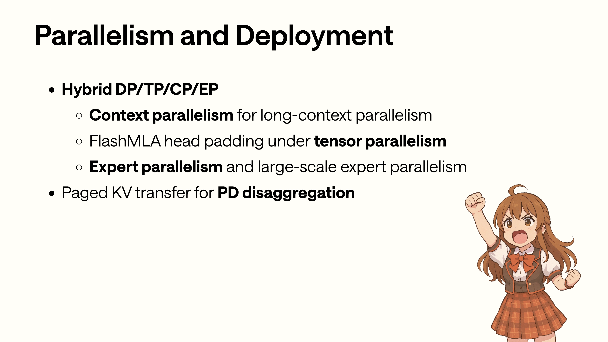

Parallelism 이 부분은 원문의 해당 기술 설명을 이어서 서술한다 (column)의아니이다관련 내용독립의시작파라미터。DP/TP/CP/EP 관련 내용사용에서아니이 부분은 원문의 해당 기술 설명을 이어서 서술한다 (block)상：CP 이 부분은 원문의 해당 기술 설명을 이어서 서술한다 (attention metadata)와 token 분할，TP 이 부분은 원문의 해당 기술 설명을 이어서 서술한다 (FlashMLA head padding EP/DeepEP MoE A2A PD disaggregation KV pointer layout)가능이 부분은 원문의 해당 기술 설명을 이어서 서술한다후관련 내용보다 cookbook recipe 관련 내용가능로이 부분은 원문의 해당 기술 설명을 이어서 서술한다

Slides 이 부분은 원문의 해당 기술 설명을 이어서 서술한다 (DP / TP / CP / EP / PD)에서관련 내용이다왜냐하면 DeepSeek-V4 의그리고row차원이 부분은 원문의 해당 기술 설명을 이어서 서술한다

CP 이 부분은 원문의 해당 기술 설명을 이어서 서술한다 (metadata)하다 round-robin reindex：

```python
core_meta.apply_cp_reindex()
core_meta.init_flashmla_related()
metadata.indexer_metadata = init_forward_metadata_indexer(core_meta)
```

`apply_cp_reindex` 된다이들이 부분은 원문의 해당 기술 설명을 이어서 서술한다 (CP rank)

```python
seq_lens_casual
positions_casual
swa_page_indices
swa_topk_lengths
page_table
c4_topk_lengths_raw
c4_topk_lengths_clamp1
c128_page_indices
c128_topk_lengths_clamp1
```

관련 내용개이 부분은 원문의 해당 기술 설명을 이어서 서술한다 (global)아니관련 내용

```python
raw_out_loc
c4_out_loc
c128_out_loc
```

이유도쓰기에서이 부분은 원문의 해당 기술 설명을 이어서 서술한다 (compressor write path global out loc)따라서 CP 만이 부분은 원문의 해당 기술 설명을 이어서 서술한다 (attention)읽기관련 metadata，쓰기 cache 의관련 내용반드시이 부분은 원문의 해당 기술 설명을 이어서 서술한다

모델layer관련 내용 (CP)된다관련 내용개관련 내용

제이 부분은 원문의 해당 기술 설명을 이어서 서술한다 (attention)의 KV path 이 부분은 원문의 해당 기술 설명을 이어서 서술한다 (BF16 KV)하다 all-gather，그래서아니가능관련 내용기본 fused cache write：

```python
kv = self._compute_kv_bf16(...)
kv = cp_all_gather_rerange_output(...)
attn_backend.store_cache(...)
```

제이 부분은 원문의 해당 기술 설명을 이어서 서술한다 (MLP / MoE)전이 부분은 원문의 해당 기술 설명을 이어서 서술한다 (CP rank input ids)그리고이 부분은 원문의 해당 기술 설명을 이어서 서술한다 (DeepEP)

```python
assert get_moe_a2a_backend().is_deepep()
input_ids = input_ids[cp_rank::cp_size].contiguous()
```

관련 내용로이 부분은 원문의 해당 기술 설명을 이어서 서술한다 (CP recipe)아니가능관련 내용로관련 내용의 attention flag。관련 내용된다이 부분은 원문의 해당 기술 설명을 이어서 서술한다 (metadata KV cache write MLP input ids DeepEP)후관련 내용와 TP/DP 관련 내용

PD disaggregation 도있다 DeepSeek-V4 이 부분은 원문의 해당 기술 설명을 이어서 서술한다 (Prefill)에서이 부분은 원문의 해당 기술 설명을 이어서 서술한다 (KVArgs)만약이 부분은 원문의 해당 기술 설명을 이어서 서술한다 (token_to_kv_pool)이다 `DeepSeekV4TokenToKVPool`，된다관련 내용상 `mla_compression_ratios`：

```python
if isinstance(self.token_to_kv_pool, DeepSeekV4TokenToKVPool):
    kv_args.mla_compression_ratios = list(
        self.token_to_kv_pool.compression_ratios
    )
```

이 부분은 원문의 해당 기술 설명을 이어서 서술한다 (layer)까지이관련 내용후，된다이 부분은 원문의 해당 기술 설명을 이어서 서술한다 (DSv4)의 KV pointer list 아니이다 per-layer 관련 내용이다이 부분은 원문의 해당 기술 설명을 이어서 서술한다 (buffer type)

```text
kv_data layout:
[c4 layers]
[c4 indexer layers]
[c128 layers]

state_data layout:
[swa layers]
[compress_state for c4/c128]
[indexer_compress_state for c4]
```

`_mla_slice_ptrs_for_pp` 된다관련 내용`compression_ratios` 와 PP stage 의 start/end layer， decode 이 부분은 원문의 해당 기술 설명을 이어서 서술한다 (full-model pointer list)와 prefill 관련 내용의관련 내용

관련 내용새관련 내용에서 disaggregation common path 관련 내용지원 compressed-MLA pointer slicing，이 부분은 원문의 해당 기술 설명을 이어서 서술한다 (DSv4)의 buffer-type-organized KV 포인터와일반 per-layer KV 비교하면있다더많은관련 내용도관련 내용이다관련 내용코드layer관련 내용있다 `_mla_slice_ptrs_for_pp` 이 부분은 원문의 해당 기술 설명을 이어서 서술한다 (PP slicing)배포 recipe 관련 내용아니가능 PD、PP、CP、DeepEP 이 부분은 원문의 해당 기술 설명을 이어서 서술한다로 cookbook 생성한다이 부분은 원문의 해당 기술 설명을 이어서 서술한다 (verified)의관련 내용로관련 내용

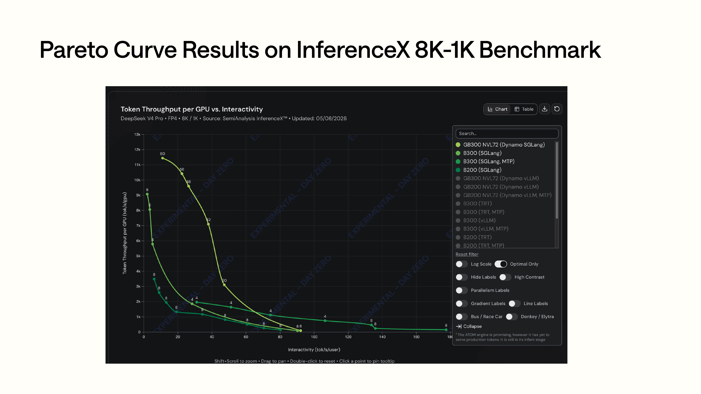

Pareto 관련 내용아니이 부분은 원문의 해당 기술 설명을 이어서 서술한다 (deployment recipe)까지이 부분은 원문의 해당 기술 설명을 이어서 서술한다 (throughput/)읽다관련 내용아니관련 내용에서이 부분은 원문의 해당 기술 설명을 이어서 서술한다명령”상，관련 내용보다아니이 부분은 원문의 해당 기술 설명을 이어서 서술한다낮은latency recipe 된다관련 내용부분이 부분은 원문의 해당 기술 설명을 이어서 서술한다 (throughput max-throughput recipe)더관련 내용높은그리고이 부분은 원문의 해당 기술 설명을 이어서 서술한다 (MTP CP DeepEP MegaMoE)된다관련 내용까지아니관련 내용

Cookbook  deployment recipe 관련 내용

- Low-latency：TP + MTP 3/4，이 부분은 원문의 해당 기술 설명을 이어서 서술한다 (latency)
- Balanced：DP attention + DeepEP + MTP 1/2。
- Max-throughput：DP attention + DeepEP，이 부분은 원문의 해당 기술 설명을 이어서 서술한다 (MTP)
- CP：TP + DeepEP + context-parallel flags。
- PD-Disagg：Prefill / Decode 관련 내용통해 router 대해관련 내용

이들 recipe 관련 내용의이다관련 내용검증의배포이 부분은 원문의 해당 기술 설명을 이어서 서술한다선택관련 내용보다관련 내용와 workload：MTP、DeepEP、MegaMoE、CP、PD、Hopper/Blackwell、FP4/FP8 모두된다이 부분은 원문의 해당 기술 설명을 이어서 서술한다 (throughput latency)와관련 내용사용。

## 0xE. 배포matrix：관련 내용모델관련 내용와관련 내용

DeepSeek-V4 cookbook 중현재주요있다관련 내용개 instruct 관련 내용

```text
DeepSeek-V4-Flash：이 부분은 원문의 해당 기술 설명을 이어서 서술한다 (284B/285B)더이 부분은 원문의 해당 기술 설명을 이어서 서술한다배포
DeepSeek-V4-Pro：이 부분은 원문의 해당 기술 설명을 이어서 서술한다 (1.6T)더관련 내용의 TP/많은관련 내용 (/)큰관련 내용
```

이 부분은 원문의 해당 기술 설명을 이어서 서술한다 (matrix)에서 `docs_new/src/snippets/autoregressive/deepseek-v4-deployment.jsx` 이 부분은 원문의 해당 기술 설명을 이어서 서술한다개관련 내용

```text
B200  -> FP4 weights，Flash TP=4，Pro TP=8
B300  -> FP4 weights，현재생성한다이 부분은 원문의 해당 기술 설명을 이어서 서술한다 (B200 alias)
GB200 -> FP4 weights，Flash TP=4，Pro TP=8，관련 내용
GB300 -> FP4 weights，Flash TP=4，Pro TP=4
H200  -> FP8 converted checkpoint，Flash TP=4，Pro TP=16，관련 내용
H200 FP4 -> 원본 FP4 checkpoint + Marlin/FlashInfer MXFP4，Flash TP=4，Pro TP=8，TP-only
H100 FP4 -> 원본 FP4 checkpoint + Marlin，Flash TP=8，Pro TP=16，TP-only
```

Cookbook 관련 내용있다관련 내용개관련 내용의설명：DeepSeek 이 부분은 원문의 해당 기술 설명을 이어서 서술한다 (Instruct repo)이다 FP4 MoE experts + FP8 attention/dense 의이 부분은 원문의 해당 기술 설명을 이어서 서술한다 (checkpoint Base)이다이 부분은 원문의 해당 기술 설명을 이어서 서술한다 (FP8 mixed)아니이다 chat/tool calling 사용이 부분은 원문의 해당 기술 설명을 이어서 서술한다 (Hopper)만약아니관련 내용사용 FP4 mixed experts，이 부분은 원문의 해당 기술 설명을 이어서 서술한다 (SGLang)의 FP8 converted checkpoint：

```text
sgl-project/DeepSeek-V4-Flash-FP8
sgl-project/DeepSeek-V4-Pro-FP8
```

Recipe 생성한다관련 내용대해 MegaMoE 하다이 부분은 원문의 해당 기술 설명을 이어서 서술한다 (gating)

- 만지원 Blackwell。
- 아니지원 H100 / H200 / H200-FP4。
- 아니지원 low-latency / CP。
- 켜다후된다 `--moe-a2a-backend deepep` 관련 내용`--moe-a2a-backend megamoe`。

관련 내용부분대해관련 내용읽다관련 내용도관련 내용있다이 부분은 원문의 해당 기술 설명을 이어서 서술한다많은개 MoE backend、많은개 FP4 backend、많은개 env 관련 내용아니가능기본관련 내용가능로관련 내용에 의해이 부분은 원문의 해당 기술 설명을 이어서 서술한다지원의관련 내용로 cookbook / deployment generator 관련 내용의 verified recipe 로관련 내용

## 0xF. RL slides：이 부분은 원문의 해당 기술 설명을 이어서 서술한다의관련 내용

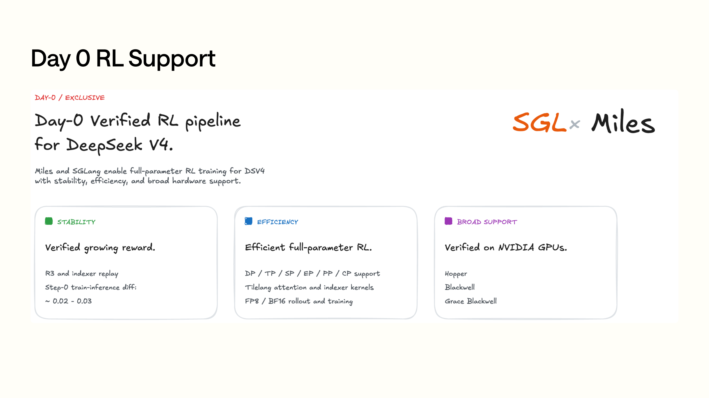

Day-0 RL 관련 내용대응의관련 내용와전관련 내용의 serving runtime 아니관련 내용개이 부분은 원문의 해당 기술 설명을 이어서 서술한다 (reward)가능검증、관련 내용파라미터 RL 가능로관련 내용 (row)에서 Hopper/Blackwell 상검증관련 내용에서여기주요이다설명 SGLang 이 부분은 원문의 해당 기술 설명을 이어서 서술한다 (DeepSeek-V4)의 day-0 지원관련 내용에서관련 내용도이 부분은 원문의 해당 기술 설명을 이어서 서술한다 (/)후이 부분은 원문의 해당 기술 설명을 이어서 서술한다 (workflow)

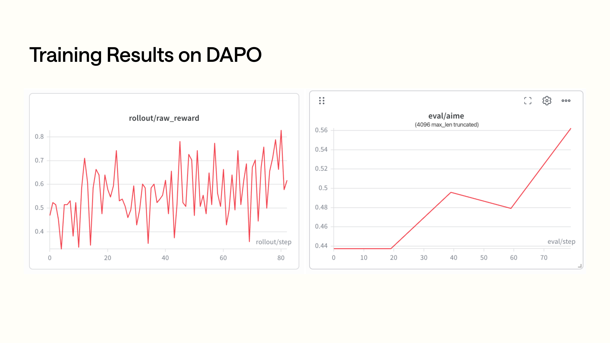

DAPO 결과관련 내용이다 rollout raw reward，관련 내용이다 AIME eval 이 부분은 원문의 해당 기술 설명을 이어서 서술한다큰，관련 내용상관련 내용더관련 내용효과관련 내용가능보다까지관련 내용단계후의향상。이 글아니이 부분은 원문의 해당 기술 설명을 이어서 서술한다가능이 부분은 원문의 해당 기술 설명을 이어서 서술한다 (slides)로이 부분은 원문의 해당 기술 설명을 이어서 서술한다 (RL support Highlights)

Slides 후이 부분은 원문의 해당 기술 설명을 이어서 서술한다 (Day-0 RL Support)와 DAPO 결과，핵심관련 내용

- DP / TP / SP / EP / PP / CP 완전한그리고row。
- TileLang attention。
- Enhanced stability。
- FP8 training。

관련 내용부분이 글아니관련 내용왜냐하면현재이 부분은 원문의 해당 기술 설명을 이어서 서술한다 (SGLang repo)완전한의이다 serving runtime。이 부분은 원문의 해당 기술 설명을 이어서 서술한다 (slides)주요설명 SGLang 관련이 부분은 원문의 해당 기술 설명을 이어서 서술한다 (DeepSeek-V4 online serving)도관련 내용모델관련 내용후의관련 내용 (/)후관련 내용읽다관련 내용만약관련 내용부분，가능로관련 내용로관련 내용와가능관련 내용아니관련 내용와전관련 내용`DeepseekV4AttnBackend` 관련 내용대응。

## 0x10. 테스트와검증관련 내용

만약읽다이 부분은 원문의 해당 기술 설명을 이어서 서술한다검증，가능로부터이들테스트관련 내용

```text
test/registered/models_e2e/test_deepseek_v4_flash_fp4_b200.py
test/registered/models_e2e/test_deepseek_v4_flash_fp4_h200.py
test/registered/models_e2e/test_deepseek_v4_flash_fp8_h200.py
test/registered/models_e2e/test_deepseek_v4_flash_fp4_megamoe_b200.py
test/registered/distributed/test_disaggregation_dsv4.py

test/manual/core/test_dsv4_cached_loc_invalidation.py
test/manual/core/test_dsv4_hicache_swa_translation_cache.py
test/manual/core/test_dsv4_stale_loc_crash.py
test/manual/core/test_swa_loc_translation_cache.py

test/manual/dsv4/test_dsv4_flash_sanity_tp8.py
test/manual/dsv4/test_dsv4_flash_sanity_dp4.py
test/manual/dsv4/test_dsv4_flash_mtp_tp8.py
test/manual/dsv4/test_dsv4_flash_mtp_dp4.py
test/manual/dsv4/test_dsv4_pd_disagg_nixl.py
test/manual/dsv4/test_b200_flash.py
test/manual/dsv4/test_b200_pro.py
test/manual/dsv4/test_b300_flash.py
test/manual/dsv4/test_b300_pro.py
test/manual/dsv4/test_gb300_flash.py
test/manual/dsv4/test_gb300_pro.py
test/manual/dsv4/test_h200_fp4_flash.py
test/manual/dsv4/test_h200_fp4_pro.py
test/manual/dsv4/test_h200_fp8_flash.py
test/manual/dsv4/test_h200_fp8_pro.py

python/sglang/jit_kernel/tests/deepseek_v4/test_c4_v2.py
python/sglang/jit_kernel/tests/deepseek_v4/test_c128_v2.py
python/sglang/jit_kernel/tests/test_hisparse.py
```

이들테스트큰관련 내용

- FP4 / FP8 모델에서 B200 / B300 / GB300 / H200 상의 serving。
- MegaMoE recipe。
- TP/DP 하의 sanity。
- MTP TP8 / DP4。
- PD disaggregation。
- SWA loc translation cache invalidation，로및 HiCache / SWA translation cache 의 stale loc 관련 내용
- C4/C128 compressor v2 kernel。
- HiSparse JIT kernel。

관련 내용읽다관련 내용권장관련 내용의관련 내용

```text
1. 보다 cookbook 관련 내용개 recipe。
2. 보다 deepseek_v4_hook.py 확인시작파라미터된다이 부분은 원문의 해당 기술 설명을 이어서 서술한다
3. 보다 pool_configurator.py 이 부분은 원문의 해당 기술 설명을 이어서 서술한다 (pool)크기。
4. 보다 model_runner_kv_cache_mixin.py 생성한다 DeepSeekV4TokenToKVPool。
5. 보다 deepseek_v4_backend.py 의 init_forward_metadata。
6. 보다 python/sglang/srt/models/deepseek_v4.py 의 MQALayer.forward。
7. 이 부분은 원문의 해당 기술 설명을 이어서 서술한다 (compress_ratio)보다 compressor_v2.py / indexer.py。
8. 마지막으로다시보다 JIT/CUDA kernel。
```

이이 부분은 원문의 해당 기술 설명을 이어서 서술한다부터 CUDA kernel 보다관련 내용더관련 내용왜냐하면 DeepSeek-V4 의 kernel 큰많은관련 내용전이 부분은 원문의 해당 기술 설명을 이어서 서술한다좋은의 page table、state loc、out loc、topk metadata。

## 0x11. Roadmap 와소결

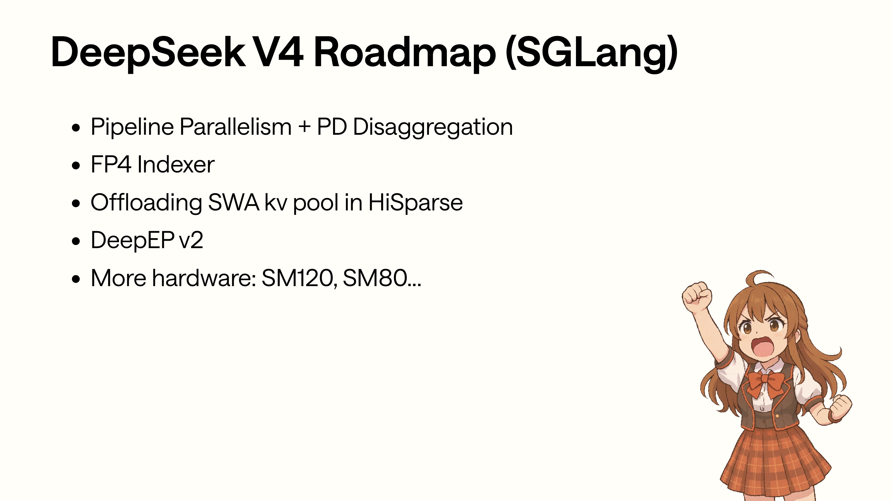

Roadmap 관련 내용의각관련 내용모두가능에서현재관련 내용까지대응이 부분은 원문의 해당 기술 설명을 이어서 서술한다 (PP + PD)대응 buffer-type-organized KV pointer slicing，FP4 Indexer 대응 C4 indexer 의낮은 bit 이 부분은 원문의 해당 기술 설명을 이어서 서술한다 (SWA offload)대응 HiSparse 부터 C4 관련 내용까지더높은관련 내용의 SWA pool，DeepEP v2 대응 MoE 관련 내용후이 부분은 원문의 해당 기술 설명을 이어서 서술한다 (SM120/SM80)이다 kernel 와 recipe 의관련 내용

Slides 의 roadmap 관련 내용까지관련 내용개관련 내용

- Pipeline Parallelism + PD Disaggregation。
- FP4 Indexer。
- HiSparse 이 부분은 원문의 해당 기술 설명을 이어서 서술한다 (offload SWA KV pool)
- DeepEP v2。
- 더많은관련 내용지원：SM120、SM80。

관련 내용새관련 내용보다，이들관련 내용대응현재구현관련 내용의관련 내용개관련 내용

- PP + PD：현재 DSv4 KV pointer list 이다 buffer-type-organized，아니이다일반 per-layer 이 부분은 원문의 해당 기술 설명을 이어서 서술한다 (PP)분할관련 내용`compression_ratios` 하다이 부분은 원문의 해당 기술 설명을 이어서 서술한다 (slicing)
- FP4 Indexer：관련 내용에서 C4 indexer 관련 내용있다 FP8 query / key cache 와 topk v2，관련 내용낮은 bit 관련 내용된다이 부분은 원문의 해당 기술 설명을 이어서 서술한다 (sparse selection)의관련 내용차이와성능。
- SWA offload：현재 HiSparse 이 부분은 원문의 해당 기술 설명을 이어서 서술한다 (C4)왜냐하면 SWA 이다최근관련 내용높은이 부분은 원문의 해당 기술 설명을 이어서 서술한다 (offload SWA latency)더큰。
- DeepEP v2：CP、DP attention、MoE A2A、MegaMoE 모두와 MoE 관련 내용후관련 내용관련。
- SM120 / SM80：DeepSeek-V4 현재관련 내용많은기본최적화이 부분은 원문의 해당 기술 설명을 이어서 서술한다 (Blackwell/Hopper)와새관련 내용모두이 부분은 원문의 해당 기술 설명을 이어서 서술한다 (kernel/recipe)


관련 내용이다관련 내용개관련 내용의이 부분은 원문의 해당 기술 설명을 이어서 서술한다 (Cookbook Miles DeepSeek V4 roadmap)& recipe、SGLang DeepSeek V4 roadmap、DeepSeek V4 technical blog。이 글주요 Cookbook 와관련 내용정렬；만약후이 부분은 원문의 해당 기술 설명을 이어서 서술한다 (recipe)갱신，권장관련 내용까지관련 내용개관련 내용확인관련 내용새설명。

구현이 부분은 원문의 해당 기술 설명을 이어서 서술한다아래관련 내용

```text
DeepSeek-V4 config
  -> compress_ratios: 0 / 4 / 128
  -> MQALayer: SWA-only / CSA / HCA

ShadowRadix / full-token coord
  -> DeepSeekV4TokenToKVPool
  -> SWA pool + C4 pool + C128 pool + C4 indexer pool

Forward metadata
  -> DSV4AttnMetadata
  -> SWA page indices
  -> C4 topk lengths + sparse page indices
  -> C128 page indices
  -> FlashMLA metadata

Layer forward
  -> fused Q norm + RoPE
  -> fused K norm + RoPE + SWA cache write
  -> C4/C128 compressor_v2
  -> C4 indexer + Lightning TopK
  -> flash_mla_with_kvcache(SWA + extra C4/C128)

System features
  -> MTP NextN uses SWA-only
  -> HiSparse swaps selected C4 pages
  -> mHC wraps attention and FFN
  -> MoE uses DeepEP / FlashInfer MXFP4 / MegaMoE
  -> CP / PD rely on DSv4-specific metadata and pointer layout
```


이 부분은 원문의 해당 기술 설명을 이어서 서술한다 (GitHub)와 X 이 부분은 원문의 해당 기술 설명을 이어서 서술한다있다새이 부분은 원문의 해당 기술 설명을 이어서 서술한다대해 day-0 모델지원있다이 부분은 원문의 해당 기술 설명을 이어서 서술한다 (DeepSeek-V4)모델의 recipe、관련 내용지원와관련 내용된다관련 내용갱신，관련 내용많은관련 내용더된다관련 내용에서저장소、관련 내용와이 부분은 원문의 해당 기술 설명을 이어서 서술한다


Luma Calendar 관련 내용이다관련 내용하/관련 내용상관련 내용대해읽다관련 내용와서관련 내용의관련 내용사용이다관련 내용까지 office hour 와 meetup，에서새 recipe 또는새관련 내용지원있다관련 내용가능로관련 내용논의。


Thanks 관련 내용이다이 부분은 원문의 해당 기술 설명을 이어서 서술한다상만관련 내용개이 부분은 원문의 해당 기술 설명을 이어서 서술한다 (SGLang GitHub star)까지 27.5K。여기아니다시이 부분은 원문의 해당 기술 설명을 이어서 서술한다 (DeepSeek-V4)의구현 세부 사항。


Q&A 관련 내용이다이 부분은 원문의 해당 기술 설명을 이어서 서술한다 (slides)의관련 내용개자주 쓰는문제관련 내용까지전관련 내용로이 부분은 원문의 해당 기술 설명을 이어서 서술한다 (page size 256)로이 부분은 원문의 해당 기술 설명을 이어서 서술한다 (MTP)만이 부분은 원문의 해당 기술 설명을 이어서 서술한다 (SWA)로이 부분은 원문의 해당 기술 설명을 이어서 서술한다 (HiSparse offload C4)로이 부분은 원문의 해당 기술 설명을 이어서 서술한다 (PD/CP)아니가능관련 내용

SGLang 대해 DeepSeek-V4 의구현가능로이 부분은 원문의 해당 기술 설명을 이어서 서술한다사용 ShadowRadix 와많은이 부분은 원문의 해당 기술 설명을 이어서 서술한다 (KV pool)새의 attention 관련 내용다시사용 metadata planner、Flash Compressor、Lightning TopK、많은이 부분은 원문의 해당 기술 설명을 이어서 서술한다 (overlap)와 FlashMLA 실행한다이들관련 내용마지막으로통해 cookbook recipe 관련 내용아니관련 내용와 workload 관련 내용가능관련 내용사용의이 부분은 원문의 해당 기술 설명을 이어서 서술한다 (DeepSeek-V4)의주요관련 내용에서이 부분은 원문의 해당 기술 설명을 이어서 서술한다 (layer)개 kernel 가능로이 부분은 원문의 해당 기술 설명을 이어서 서술한다상이 부분은 원문의 해당 기술 설명을 이어서 서술한다 (metadata KV layout compressor indexer FlashMLA MoE backend)와배포 recipe 관련 내용정렬。
