> 이 글은 칭커 커뮤니티 SGLang DeepSeek V4 회고 중 「Deploying and Optimizing DeepSeek-V4 on SGLang」 발표에 대한 기술 해설이다. 단순히 slides를 되풀이하는 것과 달리, 이 글은 주로 SGLang 최신 main 소스 코드를 기반으로 설명한다: SGLang이 DeepSeek-V4의 SWA / CSA / HCA, ShadowRadix, 다단계 KV pool, Flash Compressor, Lightning TopK, MTP, HiSparse, MegaMoE, CP / PD 배포를 어떻게 하나의 실행 가능한 시스템으로 엮어냈는지를 다룬다. 이 글은 `/Users/bbuf/工作目录/Common/sglang`을 기준으로 하며, 2026-05-21에 `origin/main`을 fetch 한 뒤의 commit `8562d5ae9`를 사용한다.

# 0x0. 서문

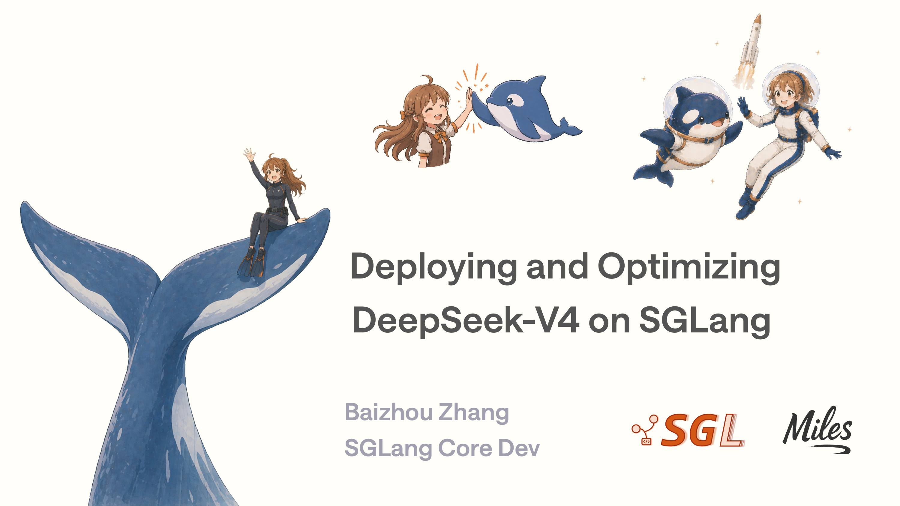

표지 페이지에는 기술적인 정보가 없지만, 제목 속의 두 단어는 함께 놓고 봐야 한다: deploying과 optimizing이다. DeepSeek-V4는 SGLang에서 모델 클래스 하나를 새로 추가한다고 끝나는 것이 아니며, 뒤의 모든 페이지가 기본적으로 같은 질문에 답하고 있다: 이 모델의 새로운 attention 구조를 어떻게 배포 가능하고, 튜닝 가능하며, 재사용 가능한 serving 경로 위에 올릴 것인가.

DeepSeek-V4가 추론 시스템에 가져온 도전은 주로 「모델이 더 크다」거나 「MoE가 더 무겁다」는 데 있지 않고, attention runtime의 상태 공간에 있다. 각 layer마다 SWA가 있고, 동시에 CSA와 HCA라는 두 가지 압축 attention 사이를 오간다. SGLang은 KV cache를 계속해서 per-layer raw KV 한 세트로 처리할 수 없으며, full-token 좌표, SWA 물리 pool, C4 압축 pool, C128 압축 pool, C4 indexer pool, compress state pool, 그리고 이 pool들이 prefix cache, CUDA Graph, PD disaggregation, HiSparse offload 안에서 갖는 매핑 관계를 동시에 유지해야 한다.

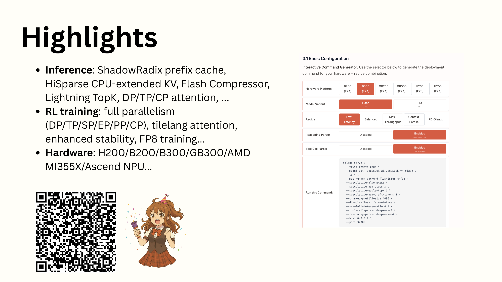

Highlights 페이지는 전체 글의 목차로 볼 수 있다. Inference 행에 나열된 ShadowRadix, HiSparse, Flash Compressor, Lightning TopK, DP/TP/CP attention은 이 글 뒷부분에서 소스 코드를 펼쳐 볼 주요 흐름이다. RL training과 Hardware 두 행은 SGLang의 커버 범위가 더 넓다는 것을 보여주지만, 이 글의 소스 코드 분석의 주 경로는 아니다.

Slides의 Highlights는 추론, RL 훈련, 하드웨어 지원을 모두 함께 다룬다. 이 글은 주로 추론 쪽을 펼쳐 보는데, 이 부분이 이미 SGLang 소스 코드에서 비교적 완전한 구현을 볼 수 있기 때문이다. 먼저 다음 몇 개 파일 그룹을 보자:

```text
설정과 시작 기본값:
python/sglang/srt/configs/deepseek_v4.py
python/sglang/srt/arg_groups/deepseek_v4_hook.py
python/sglang/srt/environ.py

모델 구조와 forward 주 경로:
python/sglang/srt/models/deepseek_v4.py
python/sglang/srt/models/deepseek_v4_nextn.py

Attention backend / metadata / indexer / compressor:
python/sglang/srt/layers/attention/deepseek_v4_backend.py
python/sglang/srt/layers/attention/dsv4/indexer.py
python/sglang/srt/layers/attention/dsv4/metadata.py
python/sglang/srt/layers/attention/dsv4/compressor_v2.py
python/sglang/srt/layers/attention/dsv4/metadata_kernel.py
python/sglang/srt/layers/attention/dsv4/index_buf_accessor.py

KV cache와 압축 상태:
python/sglang/srt/model_executor/pool_configurator.py
python/sglang/srt/model_executor/model_runner_kv_cache_mixin.py
python/sglang/srt/mem_cache/deepseek_v4_memory_pool.py
python/sglang/srt/mem_cache/deepseek_v4_compress_state.py

JIT/CUDA kernel:
python/sglang/jit_kernel/dsv4/__init__.py
python/sglang/jit_kernel/dsv4/attn.py
python/sglang/jit_kernel/dsv4/compress.py
python/sglang/jit_kernel/dsv4/compress_old.py
python/sglang/jit_kernel/dsv4/elementwise.py
python/sglang/jit_kernel/dsv4/gemm.py
python/sglang/jit_kernel/dsv4/hisparse.py
python/sglang/jit_kernel/dsv4/moe.py
python/sglang/jit_kernel/dsv4/topk.py
python/sglang/jit_kernel/dsv4/utils.py
python/sglang/jit_kernel/csrc/deepseek_v4/
python/sglang/jit_kernel/include/sgl_kernel/deepseek_v4/

배포 recipe:
docs_new/cookbook/autoregressive/DeepSeek/DeepSeek-V4.mdx
docs_new/src/snippets/autoregressive/deepseek-v4-deployment.jsx
```

이 구현의 주요 흐름만 잡고 싶다면, 먼저 아래 경로를 보면 된다:

```text
ServerArgs
  -> apply_deepseek_v4_defaults
  -> DSV4PoolConfigurator
  -> DeepSeekV4TokenToKVPool
  -> DeepseekV4AttnBackend.init_forward_metadata
  -> MQALayer.forward
  -> C4Indexer / CompressorV2 / FlashMLA
  -> DeepseekV4DecoderLayer.mlp
```

뒤의 각 절은 모두 이 경로를 따라 전개된다.

# 0x1. 시작 진입점: SGLang이 DeepSeek-V4를 위해 설정하는 모델 전용 제약

DeepSeek-V4의 실행 경로는 사용자가 항목별로 backend를 수동 선택하는 것에 의존하지 않는다. SGLang은 시작 단계에서 모델 전용 기본값 한 세트를 설정하며, 진입점은 `python/sglang/srt/arg_groups/deepseek_v4_hook.py`이다:

```python
server_args.attention_backend = "dsv4"
server_args.page_size = 256

if server_args.max_running_requests is None:
    server_args.max_running_requests = 256

if server_args.kv_cache_dtype == "auto":
    server_args.kv_cache_dtype = "fp8_e4m3"
assert server_args.kv_cache_dtype in ["fp8_e4m3"]
```

이 몇 줄이 DSv4 runtime의 기본 제약을 구성한다:

- `attention_backend="dsv4"`: 모델이 범용 MLA / FlashAttention 경로를 재사용하지 않고 전용 backend로 진입하게 한다.
- `page_size=256`: 뒤에 나오는 C4/C128/SWA의 page 유도가 모두 이 상수에 의존한다.
- `kv_cache_dtype=fp8_e4m3`: KV cache의 nope 부분은 FP8로 저장하고, RoPE 부분은 BF16으로 저장한다.
- `max_running_requests=256`: cookbook recipe에 기본 동시성 상한을 제공한다.

투기적 디코딩도 여기서 제약을 받는다:

```python
assert server_args.speculative_algorithm == "EAGLE"
assert server_args.speculative_eagle_topk == 1
```

여기서의 의미는 EAGLE이 speculative decoding에 속하지 않는다는 뜻이 아니다. 오히려 EAGLE이 현재 DSv4가 허용하는 투기적 디코딩 경로다. 제약은 이런 것이다: speculative를 켠다면 `speculative_algorithm`은 반드시 `EAGLE`이어야 하고, `speculative_eagle_topk`는 반드시 1이어야 한다. 그 외의 speculative algorithm과, EAGLE topk가 1보다 큰 다중 분기 후보 경로는 현재 모두 거부된다.

Context Parallelism의 제약도 같은 파일 안에 있다:

```python
if not server_args.enable_dsa_prefill_context_parallel:
    return

if server_args.dsa_prefill_cp_mode != "round-robin-split":
    raise ValueError(...)

server_args.enable_dp_attention = True
server_args.moe_dense_tp_size = 1
server_args.attn_cp_size = server_args.tp_size // server_args.dp_size
assert server_args.dp_size == 1
assert server_args.tp_size <= 8
```

DeepSeek-V4의 CP 진입점은 현재 DSA prefill CP 계열의 파라미터 이름을 그대로 따른다: `--enable-dsa-prefill-context-parallel`과 `--dsa-prefill-cp-mode round-robin-split`이다. 현재는 `round-robin-split`만 지원하며, 단일 노드 TP 범위 안으로 한정된다. 이 제약은 뒤에 나오는 metadata reindex와 MLP/DeepEP 경로에서도 계속 등장한다.

또 최신 hook에는 작은 변화가 하나 더 있다: 사용자가 EAGLE MTP를 켰지만 `SGLANG_ENABLE_SPEC_V2`를 명시적으로 켜지 않았다면, SGLang은 DeepSeek-V4 기본값 hook에서 자동으로 spec v2를 켠다.

`python/sglang/srt/environ.py`에도 DSv4 관련 기본 스위치 한 세트가 있다. 소스 코드를 읽는 데 특히 중요한 몇 가지는 다음과 같다:

```text
SGLANG_OPT_USE_COMPRESSOR_V2=True
SGLANG_OPT_USE_TOPK_V2=True
SGLANG_OPT_FUSE_WQA_WKV=True
SGLANG_OPT_USE_FUSED_STORE_CACHE=True
SGLANG_OPT_USE_MULTI_STREAM_OVERLAP=True
SGLANG_PREP_IN_CUDA_GRAPH=True
SGLANG_OPT_CACHE_SWA_TRANSLATION=True
SGLANG_DSV4_FP4_EXPERTS=True
```

최신 main의 기본 설정에 따르면 DeepSeek-V4는 v2 compressor, topk v2, Q/KV A 투영 융합, fused store cache, 다중 스트림 overlap, 그리고 CUDA Graph 내 metadata prepare 경로를 탄다. 뒤에서 소스 코드를 설명할 때도 이 기본 경로를 중심으로 한다.

# 0x2. 모델 설정: compress_ratios가 각 layer가 SWA인지 CSA인지 HCA인지를 결정한다

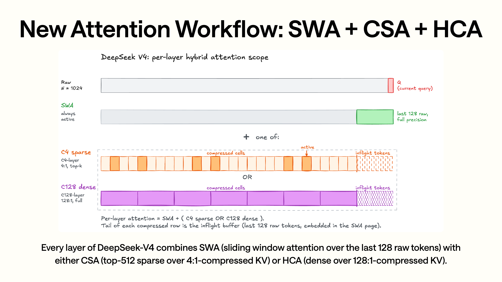

이 페이지 그림의 핵심은 SWA와 CSA/HCA의 조합 관계다. 가장 위의 raw query와 초록색 SWA는 "각 layer마다 최근 128개 raw token의 윈도우가 있다"는 것을 나타내고, 아래의 두 분기가 각 layer에서 둘 중 하나를 고르는 부분이다. CSA는 4:1 압축 후의 sparse top-k를 타고, HCA는 128:1 압축 후의 dense 접근을 탄다. 그림 속 "+ one of"는 SWA가 항상 존재하고, CSA/HCA는 SWA 외에 긴 컨텍스트 정보를 보충할 뿐임을 뜻한다.

Slides의 이 페이지는 DeepSeek-V4의 attention 구조를 제시한다:

- SWA: 모든 layer에 있으며, 윈도우 크기는 128이다.
- CSA: 4:1 compressed sparse attention, top-k 기본값은 512다.
- HCA: 128:1 heavily compressed attention, 압축된 KV에 dense 접근한다.

이 파라미터들은 `python/sglang/srt/configs/deepseek_v4.py` 안에서 config 필드로 대응된다:

```python
index_head_dim = 128
index_n_heads = 64
index_topk = 512
window_size = 128

q_lora_rank = 1024
qk_nope_head_dim = 448
qk_rope_head_dim = 64
v_head_dim = 512

compress_rope_theta = 40000
compress_ratios: List[int]

hc_mult = 4
hc_sinkhorn_iters = 20
```

`compress_ratios`가 먼저 각 layer의 attention 타입을 결정한다. 이것은 layer class 안에 고정되어 있지 않고, `compress_ratios[layer_id]`가 결정한다. `MQALayer.__init__`에서는 이를 세 가지 값으로 수렴시킨다:

```python
compress_ratio = (
    compress_ratio_override
    if compress_ratio_override is not None
    else config.compress_ratios[layer_id]
)
assert compress_ratio in [0, 4, 128]
self.compress_ratio = compress_ratio
```

세 가지 값은 각각 다음에 대응한다:

- `0`: compressor / indexer를 만들지 않고 SWA만 탄다.
- `4`: attention compressor를 만들고, 동시에 C4 indexer를 만든다.
- `128`: attention compressor는 만들지만, C4 indexer는 만들지 않는다.

소스 코드의 분기는 이렇게 되어 있다:

```python
if self.compress_ratio:
    self.compressor = Compressor(..., compress_ratio=self.compress_ratio)

if self.compress_ratio == 4:
    self.indexer = C4Indexer(...)
```

이로써 slides 속의 CSA / HCA가 실행 가능한 구조가 된다:

- CSA layer는 C4 KV를 유지하기 위해 `Compressor(ratio=4)`가 필요하고, top-k sparse page를 계산하기 위해 `C4Indexer`도 필요하다.
- HCA layer는 C128 KV를 유지하기 위해 `Compressor(ratio=128)`가 필요하고, sparse top-k indexer는 필요 없다.
- SWA-only layer는 SWA cache에만 쓰고, 그다음 FlashMLA를 통해 최근 윈도우에 접근한다.

세부 사항이 하나 더 있다: 압축 layer가 사용하는 RoPE base가 다르다. `MQALayer`는 압축 layer에 대해서는 `config.compress_rope_theta`를, 비압축 layer에 대해서는 일반 `rope_theta`를 사용한다:

```python
rope_base = config.compress_rope_theta if self.compress_ratio else rope_theta
```

압축 attention은 raw attention의 RoPE 파라미터를 재사용하지 않으며, 자체 RoPE 주파수 설정을 가진다.

# 0x3. 다단계 KV pool: ShadowRadix 뒤의 물리 저장

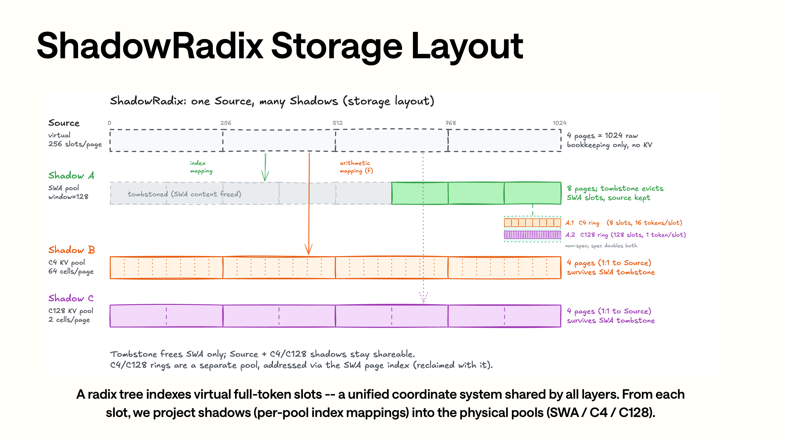

ShadowRadix 페이지 위쪽의 Source는 통일된 full-token 좌표이고, 아래의 세 Shadow가 물리 저장에 대응한다. 초록색 Shadow A는 SWA pool에 대응하며 최근 윈도우만 유지한다. 주황색 Shadow B는 C4 pool에 대응하며 4:1 압축 후 sparse selection을 한다. 보라색 Shadow C는 C128 pool에 대응하며 128:1 압축 후 dense 접근을 한다. 그림 속 점선 화살표가 표현하는 것은 같은 full-token slot에서 서로 다른 pool index로의 투영 관계이며, 뒤의 소스 코드에 나오는 `full_to_swa`, `translate_loc_from_full_to_swa`, `compression_ratios`가 모두 이 매핑 층을 구현한다.

Slides에서 말하는 ShadowRadix의 요점은 이렇다: Radix tree는 여전히 가상의 full-token slot을 인덱싱하고, 각 layer는 동일한 token 좌표 체계를 공유한다. KV를 쓸 때 다시 full-token slot을 SWA / C4 / C128의 물리 pool로 투영한다.

SGLang에서 이 물리 pool 세트는 `DeepSeekV4TokenToKVPool`이 관리한다. 이것은 단일 per-layer KV pool이 아니라 네 종류 pool의 조합이다:

```python
self.swa_kv_pool = DeepSeekV4SingleKVPool(...)
self.c4_kv_pool = DeepSeekV4SingleKVPool(...) 또는 HiSparseC4DevicePool(...)
self.c128_kv_pool = DeepSeekV4SingleKVPool(...)
self.c4_indexer_kv_pool = DeepSeekV4IndexerPool(...)
```

생성 진입점은 `python/sglang/srt/model_executor/model_runner_kv_cache_mixin.py`에 있다:

```python
self.token_to_kv_pool = DeepSeekV4TokenToKVPool(
    max_num_reqs=self.max_running_requests,
    swa_size=self.swa_max_total_num_tokens,
    c4_size=self.c4_max_total_num_tokens,
    c128_size=self.c128_max_total_num_tokens,
    c4_state_pool_size=self.c4_state_pool_size,
    c128_state_pool_size=self.c128_state_pool_size,
    page_size=self.page_size,
    swa_page_size=swa_page_size,
    compression_ratios=compression_ratios,
    enable_hisparse=self.enable_hisparse,
)
```

여기서의 `compression_ratios`에는 특수 처리가 하나 더 있다: 현재 worker가 MTP draft worker라면 모든 layer가 `COMPRESS_RATIO_NEXTN_LAYER=0`으로 바뀐다. 따라서 draft worker는 C4/C128/state pool을 갖지 않고 SWA 경로만 재사용한다.

DSv4의 메모리는 full tokens 기준으로 바로 할당되지 않고, `DSV4PoolConfigurator`가 몇 종류의 token 용량으로 쪼갠다:

```python
full_token = full_token // page_size * page_size
swa_tokens = int(full_token * self.swa_ratio) // page_size * page_size

c4_max_total_num_tokens = full_token // (4 * c4_shrink_factor)
c128_max_total_num_tokens = full_token // 128
c4_state_pool_size = swa_tokens // swa_page_size * c4_ring_size
c128_state_pool_size = swa_tokens // swa_page_size * c128_ring_size
```

`swa_ratio`의 기본값은 앞의 `swa_full_tokens_ratio=0.1`에서 온다. 이는 시스템이 full token 용량대로 SWA pool을 통째로 할당하지 않고, 일정 비율만큼 SWA 워킹셋을 남겨 둔다는 뜻이다. C4/C128은 압축 비율에 따라 축소된다.

최신 구현에서 `DSV4PoolConfigurator`는 PP stage 별로 해당 stage의 `compress_ratios`를 잘라내서 pool 크기를 추정하기도 한다. speculative decoding을 켠 경우에는 target + draft worker의 메모리를 함께 `bytes_per_full_token`에 접어 넣어, target 쪽 profiling이 전체 VRAM 요구량을 과소평가하는 것을 막는다.

KV buffer 레이아웃으로 구체화하면, `DeepSeekV4SingleKVPool`의 token 당 저장은 584 bytes다:

```python
qk_nope_head_dim FP8: 448 bytes
qk_rope_head_dim BF16: 64 * 2 bytes
nope FP8 scales + scale_pad: 8 bytes
```

소스 코드에는 이 레이아웃을 고정하는 assert가 있다:

```python
assert bytes_per_token == 448 + 64 * 2 + 8
```

그다음 page 단위로 padding을 한다:

```python
bytes_per_page_non_padded = self.page_size * bytes_per_token
self.bytes_per_page_padded = ceil_div(bytes_per_page_non_padded, 576) * 576
```

이 page padding은 하부 kernel의 접근 레이아웃을 더 정연하게 만들기 위한 것이다.

Layer에서 압축 pool로의 매핑은 `_init_compressed_layer_mapping`에서 이루어진다:

```python
if ratio == 0:
    layer_mapping[idx] = DeepSeekV4LayerItem(compress_ratio=0, ...)
elif ratio == 4:
    layer_mapping[idx] = DeepSeekV4LayerItem(
        compress_ratio=4,
        compress_layer_id=c4_cnt,
        compress_kv_pool=self.c4_kv_pool,
    )
elif ratio == 128:
    layer_mapping[idx] = DeepSeekV4LayerItem(
        compress_ratio=128,
        compress_layer_id=c128_cnt,
        compress_kv_pool=self.c128_kv_pool,
    )
```

여기서의 `compress_layer_id`는 bucket 내 지역 번호다. 예를 들어 전체 모델의 10번째 layer가 4번째 C4 layer일 수 있는데, 그러면 `c4_kv_pool`에서 사용하는 layer id는 10이 아니라 3이다. 이렇게 하면 C4/C128 pool이 해당 layer에 대해서만 buffer를 할당할 수 있다.

ShadowRadix의 주요 투영 함수는 다음과 같다:

```python
def translate_loc_from_full_to_swa(self, kv_indices):
    return self.full_to_swa_index_mapping[kv_indices].to(torch.int32)
```

SWA cache에 쓰는 모든 경로는 먼저 full-token raw loc을 SWA loc으로 변환한다:

```python
swa_loc = self.translate_loc_from_full_to_swa(raw_loc)
self.swa_kv_pool.set_key_buffer(...)
```

기본적으로 이 translation을 캐시하기도 한다:

```python
SGLANG_OPT_CACHE_SWA_TRANSLATION=True
```

같은 forward batch 안에서 많은 layer가 동일한 `out_cache_loc` 묶음을 SWA pool로 변환해야 하므로, 한 번 캐시해 두면 중복 매핑 비용을 줄일 수 있기 때문이다.

최신 main에서는 이 캐시에 무효화 경계도 보완되었다: `DeepSeekV4TokenToKVPool.register_mapping`이 `full_to_swa_index_mapping`을 갱신할 때 `cached_loc`을 비우고, 그 외에 `invalidate_loc_cache()`로 batch 수준에서 옛 translation을 능동적으로 지울 수 있다. 이 세부 사항은 매우 중요한데, SWA mapping을 재구축한 뒤에도 옛 loc을 계속 재사용하면 이후 layer가 잘못된 SWA 물리 위치에 쓰게 되기 때문이다.

# 0x4. Attention metadata: request 상태를 FlashMLA / compressor / indexer가 필요로 하는 구조로 바꾸기

DeepSeek-V4의 attention backend는 `python/sglang/srt/layers/attention/deepseek_v4_backend.py`에 있다. 초기화 시 몇 가지 하드 제약이 있다:

```python
head_dim == 512
self.swa_page_size = 128
self.page_size = model_runner.page_size
assert self.page_size == 256
self.c4_topk = model_config.index_topk
assert speculative_eagle_topk in [0, 1]
```

여기에는 서로 헷갈리기 쉬운 두 가지 page 개념이 있다. backend의 `self.swa_page_size=128`은 SWA attention metadata를 위한 것으로, 모델의 `window_size=128`과 정렬된다. KV pool이 paged SWA mode에서 사용하는 물리 `swa_page_size`는 시스템 `page_size=256`과 정렬된다. 최종적으로 FlashMLA가 SWA를 읽을 때는 `swa_topk_lengths = clamp(seq_len, max=128)`로 논리 윈도우를 제한하므로, 물리 page는 256이어도 실제 SWA attention은 여전히 최근 128개 token만 본다.

`DSV4AttnMetadata`는 이 backend의 metadata 컨테이너다. SWA, C4, C128 세 종류 attention이 필요로 하는 정보를 동시에 보관한다:

```python
page_table
raw_out_loc
seq_lens_casual
positions_casual

swa_page_indices
swa_topk_lengths

c4_out_loc
c4_topk_lengths_raw
c4_topk_lengths_clamp1
c4_sparse_topk_lengths
c4_sparse_page_indices

c128_out_loc
c128_page_indices
c128_topk_lengths_clamp1

c1_flashmla_metadata
c4_flashmla_metadata
c128_flashmla_metadata
```

여기에는 혼동하기 쉬운 개념이 두 가지 있다:

- `page_table`은 full-token 좌표 기준의 page table이다.
- `swa_page_indices`, `c4_sparse_page_indices`, `c128_page_indices`는 FlashMLA에 전달되는 실제 접근 index다.

`make_core_attn_metadata`는 request 수준의 `req_to_token`, `req_pool_indices`, `seq_lens`를 위의 구조로 바꾸는 역할을 한다. SWA의 page index는 `get_swa_page_indices`가 생성한다:

```python
offsets = pos_causal.unsqueeze(1) - torch.arange(SWA_WINDOW)
raw_indices = req_to_token[req_pool_indices_repeated[:, None], offsets]
swa_indices = token_to_kv_pool.translate_loc_from_full_to_swa(raw_indices)
```

즉 각 query token에 대해 앞쪽으로 최대 128개 raw token을 취한 뒤, SWA pool로 투영한다.

C4/C128 metadata는 Triton kernel이 생성한다:

```python
(
    c4_out_loc,
    c4_positions,
    c4_seq_lens_raw,
    c4_seq_lens_clamp1,
    c128_out_loc,
    c128_positions,
    c128_seq_lens_clamp1,
    c128_page_indices,
) = init_compression_metadata(...)
```

생성 후에는 64 정렬도 한다:

```python
self.c128_page_indices = _pad_last_dim(self.c128_page_indices)
self.swa_page_indices = _pad_last_dim(self.swa_page_indices)
self.c4_sparse_page_indices = _pad_last_dim(self.c4_sparse_page_indices)
```

이 정렬은 `PAGE_INDEX_ALIGNED_SIZE = 64`에서 오는데, 뒤에서 FlashMLA / kernel 접근이 index의 마지막 차원이 64의 배수이기를 원하기 때문이다.

Metadata의 초기화는 forward mode에 따라 몇 갈래 경로로 나뉜다:

```python
decode         -> init_forward_metadata_decode
prefill        -> init_forward_metadata_prefill
target_verify  -> init_forward_metadata_target_verify
draft_extend   -> init_forward_metadata_draft_extend
```

이 분기는 MTP와 CUDA Graph를 지원하기 위한 것이다. 일반 decode, prefill, verify, draft extend는 out loc, seq lens, num tokens에 대한 shape 요구가 모두 다르므로, 하나의 metadata builder를 공유할 수 없다.

기본값은 `SGLANG_PREP_IN_CUDA_GRAPH=True`이다. 이때 decode / verify는 먼저 raw metadata를 반환할 수 있다:

```python
DSV4RawDecodeMetadata(req_pool_indices, seq_lens, out_cache_loc)
DSV4RawVerifyMetadata(...)
```

`c4_compress_metadata`, `c128_compress_metadata`, `indexer_metadata`에 접근해야 할 때에만 `_maybe_upgrade_forward_metadata`를 통해 완전한 `DSV4Metadata`로 업그레이드한다:

```python
if isinstance(self.forward_metadata, DSV4RawVerifyMetadata):
    self.forward_metadata = self.make_forward_metadata_from_raw_verify(...)
elif isinstance(self.forward_metadata, DSV4RawDecodeMetadata):
    self.forward_metadata = self.make_forward_metadata_from_raw_decode(...)
```

이렇게 설계한 이유는 DeepSeek-V4의 metadata 준비 자체의 비용이 작지 않기 때문이다. 이 부분을 매 decode step마다 CUDA Graph 밖에서 실행하면 투기적 디코딩과 overlap의 이득이 약해진다. Raw metadata + graph 내 업그레이드는 prepare도 capture/replay 메커니즘 안으로 들어가게 하기 위한 것이다.

# 0x5. MQA forward: Q, KV cache, compressor, indexer, FlashMLA의 실행 순서

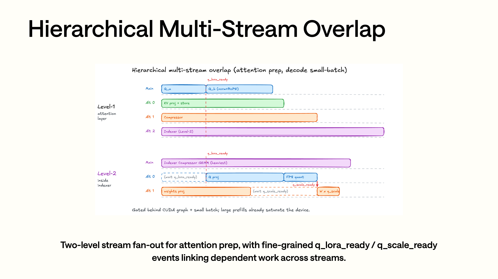

이 다중 스트림 overlap 그림이 묘사하는 것은 decode 시 작은 batch에서의 파이프라인이지, attention 수식 자체가 아니다. 그림의 첫 번째 fan-out은 attention prep, Q/KV 투영, indexer 등의 작업을 서로 다른 stream에 배치한다. 두 번째 층은 `q_lora_ready`, `q_scale_ready` 같은 event로 의존 관계를 엮는다. 소스 코드를 읽을 때 이 그림을 `MQALayer` 안의 5개 보조 stream, 그리고 CUDA Graph capture 하에서 raw metadata가 정식 metadata로 업그레이드되는 과정에 대응시켜 볼 수 있다.

`MQALayer.forward`는 DeepSeek-V4 attention의 주 실행 경로다. 네 단계로 나눌 수 있다:

```text
1. Q 계산: wq_a / wq_b + q_norm + fused_q_norm_rope
2. SWA KV cache 계산 및 쓰기: wkv + fused_k_norm_rope_flashmla
3. C4/C128 layer라면 compressor 실행, C4 layer라면 다시 indexer 실행
4. DeepseekV4AttnBackend.forward 호출, 최종적으로 flash_mla_with_kvcache로 진입
```

Q path는 먼저 `_compute_q_b`를 보자:

```python
q, _ = self.wq_b(q_lora)
q = q.view(-1, self.n_local_heads, self.head_dim)
fused_q_norm_rope(q, q_out, self.eps, self.freqs_cis, positions)
```

KV path는 먼저 `_compute_kv_to_cache`를 보자:

```python
kv, _ = self.wkv(x)
token_to_kv_pool.set_swa_key_buffer_radix_fused_norm_rope(
    layer_id=self.layer_id,
    raw_loc=forward_batch.out_cache_loc,
    kv=kv,
    kv_weight=self.kv_norm.weight.data,
    eps=self.eps,
    freqs_cis=self.freqs_cis,
    positions=positions,
)
```

기본 경로는 "먼저 완전한 BF16 K를 생성하고, 그다음 따로 norm, RoPE, 양자화, cache 쓰기를 한다"는 중간 형태를 생략하고, 곧바로 `fused_k_norm_rope_flashmla`를 호출해서 norm + RoPE + FlashMLA paged cache 쓰기를 하나의 JIT kernel로 합친다. DSA prefill CP 시나리오에서 BF16 KV로 rank 간 all-gather를 해야 할 때만 `_compute_kv_bf16` 경로를 탄다.

다중 스트림 overlap도 `MQALayer` 안에 있다. 기본값은 `SGLANG_OPT_USE_MULTI_STREAM_OVERLAP=True`이며, 모델 초기화 시 5개의 보조 stream을 만든다:

```python
self.alt_streams = [torch.cuda.Stream() for _ in range(5)]
```

이 5개 stream이 전부 `MQALayer` 바깥 층에서 직접 사용되는 것은 아니다. 바깥 층은 앞의 3개를 가져다 각각 KV cache write, compressor, indexer 호출을 돌리고, `C4Indexer` 내부에서 뒤의 2개를 가져다 각각 indexer Q와 weights projection을 계산한다.

`_forward_prepare_multi_stream`은 indexer, KV cache write, compressor를 서로 다른 stream에 나눈다:

```python
stream_kv = self.alt_streams[0]
stream_compressor = self.alt_streams[1]
stream_indexer = self.alt_streams[2]

q_lora = self._compute_q_a(...)
q_lora_ready = current_stream.record_event()

with torch.cuda.stream(stream_indexer):
    self.indexer(..., q_lora_ready=q_lora_ready)

with torch.cuda.stream(stream_kv):
    self._compute_kv_to_cache(...)

with torch.cuda.stream(stream_compressor):
    attn_backend.forward_core_compressor(...)

q = self._compute_q_b(...)
```

하지만 모든 경우에 활성화되지는 않는다. 소스 코드에 조건 한 세트가 있다:

```python
enable_multi_stream = (
    SGLANG_OPT_USE_MULTI_STREAM_OVERLAP
    and self.alt_streams is not None
    and get_is_capture_mode()
    and x.shape[0] <= self._multi_stream_bs_limit
    and not (self.dsa_enable_prefill_cp and dsa_use_prefill_cp(forward_batch))
)
```

다중 스트림 overlap은 주로 CUDA Graph capture 상황에서의 작은/중간 batch를 위한 것이다. Blackwell에서의 batch limit은 128이고, 다른 CUDA 플랫폼에서는 64다. CP 시나리오는 rank 간 all-gather를 해야 하므로 이 경로를 타지 않는다.

마지막으로 backend forward로 진입한다:

```python
o = attn_backend.forward(
    q=q,
    k=attn_k,
    v=attn_k,
    compress_ratio=self.compress_ratio,
    save_kv_cache=False,
)
```

여기서 `save_kv_cache=False`에 주의해야 한다. cache write는 이미 `_forward_prepare*`에서 완료했기 때문이다. backend forward는 SWA/C4/C128 cache에서 읽는 일만 담당한다.

`DeepseekV4AttnBackend.forward`는 최종적으로 FlashMLA를 호출한다:

```python
flash_mla.flash_mla_with_kvcache(
    q=q,
    k_cache=swa_k_cache,
    head_dim_v=self.head_dim_v,
    block_table=None,
    cache_seqlens=None,
    tile_scheduler_metadata=flashmla_metadata,
    softmax_scale=self.softmax_scale,
    is_fp8_kvcache=True,
    indices=swa_page_indices,
    topk_length=swa_topk_lengths,
    attn_sink=attn_sink,
    extra_k_cache=extra_k_cache,
    extra_indices_in_kvcache=extra_indices,
    extra_topk_length=extra_topk_lengths,
)
```

여기서 FlashMLA에 연결할 수 있는 이유는 DeepSeek-V4의 attention 형태에서 봐야 한다.

DeepSeek-V4는 이 층에서 이미 MLA decode 형태로 정리되어 있다. 모델 설정에서 `num_attention_heads=64`, `num_key_value_heads=1`이므로 attention은 MQA/MLA 스타일이다. `qk_nope_head_dim=448`, `qk_rope_head_dim=64`이므로 query/key의 실제 head dim은 `448 + 64 = 512`이고, `v_head_dim=512`다. SGLang은 `_compute_q_b`에서 query를 `[num_tokens, n_local_heads, 512]`로 만들고, `_compute_kv_to_cache`에서 KV를 FlashMLA가 읽을 수 있는 packed FP8 cache로 쓴다. backend에는 직접적인 제약도 하나 있다:

```python
assert k is v, "DeepseekV4 shares k and v"
```

즉 FlashMLA가 받는 것은 일반 Transformer처럼 분리된 K cache와 V cache가 아니라, DeepSeek-V4의 MQA latent cache 한 벌이다. 이것은 `QK^T`의 key 쪽 계산에 참여하는 동시에, softmax 이후 가중 합산되는 value 쪽 데이터로도 쓰인다.

`flash_mla_with_kvcache`로 진입하기 전 주요 텐서 shape은 이렇게 볼 수 있다. `T`를 현재 batch의 query token 수, `Hq`를 현재 rank 상의 query head 수, `P`를 cache page 수라고 하자:

```text
q:
  [T, 1, Hq, 512]

swa_k_cache:
  [P_swa, 256, 1, 584]

swa_page_indices:
  [T, 1, K_swa], 마지막 차원은 64로 정렬

swa_topk_lengths:
  [T]

extra_k_cache, compress_ratio=4:
  [P_c4, 64, 1, 584]

extra_indices, compress_ratio=4:
  [T, 1, K_c4]

extra_k_cache, compress_ratio=128:
  [P_c128, 2, 1, 584]

extra_indices, compress_ratio=128:
  [T, 1, K_c128]

out:
  [T, 1, Hq, 512] -> squeeze 후 [T, Hq, 512]가 된다
```

여기서의 `584`는 DeepSeek-V4 KV cache의 token 당 저장 바이트 수이지, 일반적인 의미의 hidden dim이 아니다:

```text
584 = 448 bytes FP8 no-pe latent + 64 * 2 bytes BF16 rope latent + 8 bytes scale/pad
```

SWA 쪽 경로의 논리 윈도우는 128이지만, 최신 paged SWA pool의 물리 page size는 시스템 `page_size=256`과 정렬되므로 `swa_k_cache`는 `[P_swa, 256, 1, 584]`로 view 된다. 실제로 attention에 참여하는 길이는 여전히 `swa_topk_lengths = clamp(seq_len, max=128)`과 `swa_page_indices`가 제한한다. C4 압축 cache의 page size는 `256 / 4 = 64`이고, C128 압축 cache의 page size는 `256 / 128 = 2`이므로 extra cache의 두 번째 차원은 각각 64와 2다. `indices`와 `topk_length`는 FlashMLA에게 각 query token이 이번 라운드에 어떤 cache slot에서 읽어야 하는지, 실제 유효 길이가 얼마인지를 알려준다. 이렇게 하면 FlashMLA는 전체 히스토리 시퀀스를 스캔할 필요 없이, SGLang이 앞에서 준비해 둔 SWA/C4/C128 인덱스에 따라 gather 하기만 하면 된다.

FlashMLA가 여기서 푸는 문제는 attention의 읽기 쪽 계산이다. BF16 query, FP8 packed KV cache, paged/sparse indices, `attn_sink`, tile scheduler metadata가 주어지면, 하나의 kernel 경로 안에서 page gather, FP8 역양자화, `QK^T`, softmax, shared KV latent에 대한 가중 합산을 완료하고 `[T, Hq, 512]` 결과를 반환한다. FlashMLA는 C4/C128 cache를 구성하지 않고, TopK page를 고르지도 않는다. 이것들은 앞의 compressor, ShadowRadix, C4 indexer가 완성한다. FlashMLA는 최종적인 읽기 쪽 계획을 소비하고, SWA-only, CSA, HCA 세 경로를 하나의 attention 호출로 통일한다.

파라미터 대응 관계는 다음과 같다:

- `k_cache=swa_k_cache`는 항상 존재하며, SWA에 대응한다.
- `extra_k_cache=None`이면 SWA-only다.
- `compress_ratio=4`일 때는 `extra_k_cache=c4_kv_pool`, `extra_indices=c4_sparse_page_indices`, `extra_topk_length=c4_sparse_topk_lengths`다.
- `compress_ratio=128`일 때는 `extra_k_cache=c128_kv_pool`, `extra_indices=c128_page_indices`, `extra_topk_length=c128_topk_lengths_clamp1`이다.

SGLang은 이런 방식으로 SWA + CSA/HCA를 FlashMLA 한 번의 호출로 조직한다: SWA가 주 cache이고, C4/C128은 extra cache로서 같은 attention에 참여한다.

# 0x6. C4 Indexer와 Lightning TopK: CSA sparse page의 선택 흐름

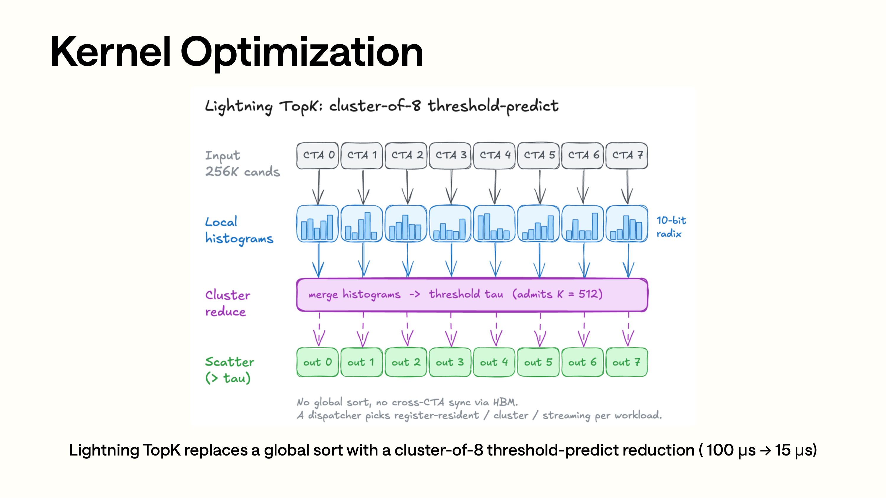

Lightning TopK 페이지의 흐름은 위에서 아래로 보면 된다. 입력은 expert logits가 아니라 대량의 후보 C4 page의 점수다. 각 CTA가 먼저 지역 histogram을 만들고, cluster reduce가 여러 CTA의 histogram을 합쳐서 top-k 임계값을 추정한다. 마지막으로 임계값을 만족하는 page index를 scatter 한다. 256K 급 후보에 대한 전역 sort를 피하기 때문에, 그림에 있는 100us에서 15us로의 수준 변화가 나온다.

CSA의 문제는 이렇다: C4 압축 후에도 여전히 대량의 히스토리 block이 남아 있어 전부 dense attend 할 수 없으므로, 먼저 top-k sparse page를 골라야 한다. DeepSeek-V4의 기본값은 `index_topk=512`이고, 일부 대형 모델 설정은 1024도 지원한다.

C4 indexer는 `python/sglang/srt/layers/attention/dsv4/indexer.py`에 있다. 그 자체도 작은 attention-like 구조다:

```python
self.n_heads = config.index_n_heads
self.head_dim = config.index_head_dim
self.index_topk = config.index_topk
self.wq_b = ReplicatedLinear(q_lora_rank, n_heads * head_dim)
self.weights_proj = ReplicatedLinear(hidden_size, n_heads)
self.compressor = Compressor(..., compress_ratio=4, head_dim=index_head_dim, rotate=True)
```

이것은 세 가지 일을 한다:

첫째, indexer query를 생성하고, 하나의 fused kernel 안에서 RoPE, Hadamard, FP8 quant를 수행한다:

```python
q, _ = self.wq_b(q_lora)
q = q.view(-1, self.n_local_heads, self.head_dim)
q_fp8, weights = fused_q_indexer_rope_hadamard_quant(
    q, weight, self.weight_scale, self.freqs_cis, positions
)
```

둘째, C4 indexer 자신의 compressed key cache를 유지한다. 이 cache는 attention C4 KV pool과 독립적이다:

```python
c4_indexer_kv_cache = token_to_kv_pool.get_index_k_with_scale_buffer(layer_id)
```

셋째, DeepGEMM 또는 TileLang으로 `q_fp8`의 indexer KV cache에 대한 logits를 계산한다:

```python
logits = fp8_paged_mqa_logits(
    q_fp8,
    c4_indexer_kv_cache,
    weights,
    c4_seq_lens,
    page_table,
    deep_gemm_metadata,
    max_c4_seq_len,
)
```

logits를 얻은 뒤에야 top-k transform으로 진입한다. 기본 경로는 topk v2다:

```python
topk_transform_512_v2(
    logits,
    indexer_metadata.c4_seq_lens,
    core_metadata.page_table,
    core_metadata.c4_sparse_page_indices,
    indexer_metadata.c4_page_size,
    indexer_metadata.topk_metadata,
)
```

여기서의 "기본 경로"에는 한정 조건을 하나 붙여야 한다. HiSparse decode나 indexer capture가 raw indices를 받아야 할 때, 소스 코드는 `topk_transform_512`로 되돌아간다. v2 경로가 현재 raw indices를 반환하지 않기 때문이다. 일반적인 비 HiSparse decode는 `topk_transform_512_v2`를 탄다.

대응하는 JIT/CUDA 코드는 다음 위치에 있다:

```text
python/sglang/jit_kernel/dsv4/topk.py
python/sglang/jit_kernel/csrc/deepseek_v4/topk_v2.cuh
python/sglang/jit_kernel/include/sgl_kernel/deepseek_v4/topk/
```

`topk_v2.cuh`는 sort를 직접 호출하지 않고, 입력 규모에 따라 다른 전략을 선택한다:

- short path: 작은 입력에는 더 가벼운 transform을 쓴다.
- fused one-stage: 중간 크기 batch는 가능한 한 한 단계에서 끝낸다.
- two-stage / cluster path: 큰 입력에는 cluster topk를 쓴다.

`cluster.cuh`의 아이디어는 먼저 histogram과 threshold 예측을 하고, 그다음 임계값보다 큰 원소와 필요한 tie 원소를 scatter 하는 것이다. 이것이 목표로 하는 것은 CSA의 top-512 page selection이며, 완전한 정렬은 필요하지 않다.

Slides에서 Lightning TopK가 약 100us에서 약 15us로 내려간 배경이 바로 여기에 있다. layer마다 sparse selection을 해야 하는 CSA에게 top-k는 주변부의 작은 최적화가 아니라, 원래부터 attention prep의 주요 비용 중 하나다.

# 0x7. Flash Compressor: C4/C128 압축 상태 유지와 fused cache 쓰기

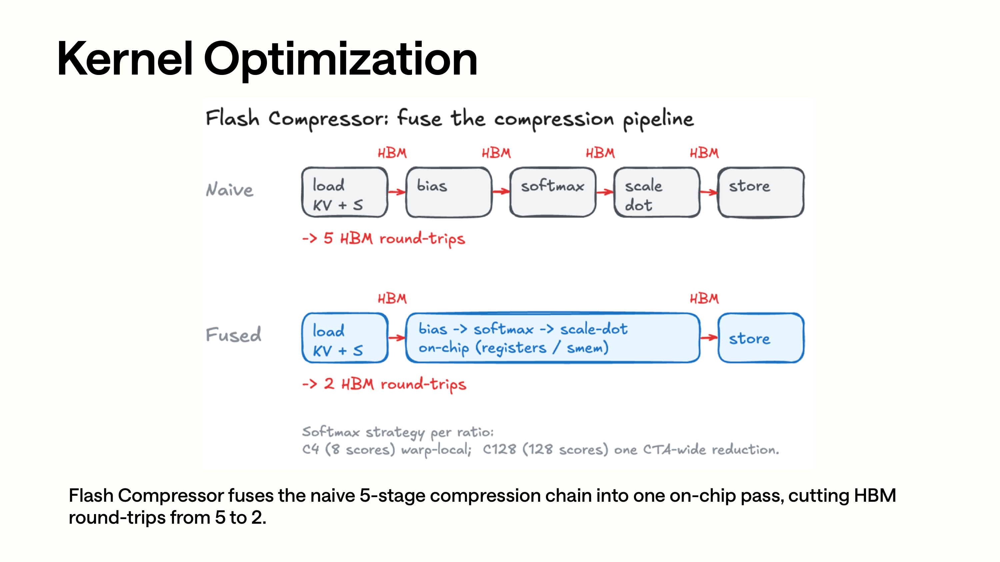

Flash Compressor 페이지의 위쪽 절반은 naive pipeline이다: load KV+score, bias 더하기, softmax, scale-dot, store로 이어지며 각 구간 사이마다 HBM으로 돌아갈 수 있다. 아래쪽 절반은 bias, softmax, scale-dot을 가능한 한 레지스터/공유 메모리에 남겨 두고, 한 번의 kernel로 압축과 write-back을 끝낸다. 그림의 "5 HBM round-trips -> 2 HBM round-trips"는 `c4_v2.cuh / c128_v2.cuh`에서 plan, state 읽기, softmax 계산, compressed KV 쓰기를 융합한 경로에 대응한다.

압축 attention의 성능은 cache를 읽는 FlashMLA에만 달려 있는 것이 아니라, 압축 cache를 쓰는 경로에도 달려 있다. C4/C128 layer는 forward 할 때마다 새 token에 해당하는 KV/score를 압축 상태에 병합하고, 압축 경계에서 C4/C128 KV cache에 써야 한다.

기본 경로는 `compressor_v2.py`를 사용한다:

```python
if envs.SGLANG_OPT_USE_COMPRESSOR_V2.get():
    from sglang.srt.layers.attention.dsv4.compressor_v2 import ...
```

`Compressor` 자체는 `compressor.py`에 정의되어 있으며, `kv_score` 생성을 담당한다:

```python
kv_score = linear_bf16_fp32(x, self.wkv_gate.weight)
```

그다음 v2 backend가 all-in-one 경로를 넘겨받는다:

```python
kv_compressed = compress_forward(
    kv_score_buffer=state_pool.kv_score_buffer.kv_score,
    kv_score_input=kv_score_input,
    ape=compressor.ape,
    plan=plan,
    compress_ratio=compress_ratio,
    head_dim=head_dim,
    is_online=is_online,
)

compress_norm_rope_store(
    kv_compressed,
    plan,
    norm_weight=norm.weight,
    norm_eps=norm.variance_epsilon,
    freq_cis=freqs_cis_cache,
    out_loc=c4_or_c128_out_loc,
    kvcache=kv_cache,
    page_size=page_size,
)
```

이 순서는 slides 속 Flash Compressor와 정확히 대응한다:

```text
입력 hidden states
  -> wkv_gate 로 KV/score 획득
  -> compress_forward 로 상태 갱신 및 compressed KV 산출
  -> norm + RoPE + store 로 C4/C128 KV cache에 직접 쓰기
```

옛 경로와의 차이는 이렇다: 옛 경로는 먼저 compressed KV를 만들고, 그다음 norm/RoPE/pack/store 등 여러 단계의 동작을 거쳤다. v2는 압축, 정규화, RoPE, cache 쓰기를 하나의 kernel 경로에 합쳐 HBM round-trip을 줄인다.

여기에는 놓치기 쉬운 HiSparse 보정도 하나 있다. v2 compressor가 쓰는 것은 raw C4 KV tensor이므로, C4 pool이 `HiSparseC4DevicePool`로 대체되면 `compressor_v2.py`는 먼저 `out_loc`을 `translate_loc_to_hisparse_device`로 HiSparse device 쪽 물리 위치로 변환한 다음 `compress_norm_rope_store`에 넘긴다. 그렇게 하지 않으면 compressor는 압축 loc 기준으로 쓰는데 sparse attention은 HiSparse device loc을 읽게 되어, 둘이 어긋난다.

압축 계획은 `create_paged_compressor_data`가 생성한다. full-token loc, SWA loc, ring buffer loc 사이의 관계를 C++ planner에게 넘긴다:

```python
CompressorPrefillPlan.generate(
    compress_ratio=compress_ratio,
    req_pool_indices=req_pool_indices,
    seq_lens=seq_lens,
    extend_lens=extend_lens,
    req_to_token=req_to_token,
    full_to_swa=full_to_swa,
    swa_page_size=swa_page_size,
    ring_size=ring_size,
    use_cuda_graph=use_prefill_cuda_graph,
)
```

Decode는 다음 경로를 탄다:

```python
CompressorDecodePlan.generate(
    compress_ratio=compress_ratio,
    req_pool_indices=req_pool_indices,
    req_to_token=req_to_token,
    full_to_swa=full_to_swa,
    seq_lens=seq_lens,
    swa_page_size=swa_page_size,
    ring_size=ring_size,
)
```

State pool의 레이아웃은 `deepseek_v4_compress_state.py`에 있다. 비 online 모드에서 각 slot에 저장되는 것은 KV와 score다:

```python
last_dim = 2 * (1 + overlap) * head_dim
```

C4에는 overlap이 있으므로 `overlap=True`이고, C128은 기본적으로 overlap이 없다. C128은 online compress 실험 경로도 지원한다:

```python
SGLANG_OPT_USE_ONLINE_COMPRESS=False
```

online C128을 켜면 state pool이 `3 * head_dim`이 되어 max / sum / kv를 저장하고, `ring_size=1`을 강제한다. 다만 소스 코드에는 아직 MTP를 지원하지 않는다는 제한이 명시되어 있다:

```python
assert mr.spec_algorithm.is_none()
```

온라인 C128 압축은 현재 제약이 더 강하며, 기본 production path는 여전히 비 online이다.

# 0x8. jit_kernel 관점: DeepSeek-V4 kernel은 압축 attention runtime 한 벌이다

앞의 몇 절은 모델 forward에서 아래로 펼쳐 나갔다. 이제 `python/sglang/jit_kernel` 디렉터리 안의 구현 세부 사항을 보자. 최신 main에서 DSv4의 Python JIT wrapper는 이미 단일 파일 진입점에서 `dsv4` package로 쪼개졌다. DeepSeek-V4와 직접 관련된 파일은 대체로 몇 그룹으로 나뉜다:

```text
python/sglang/jit_kernel/dsv4/__init__.py
python/sglang/jit_kernel/dsv4/attn.py
python/sglang/jit_kernel/dsv4/compress.py
python/sglang/jit_kernel/dsv4/compress_old.py
python/sglang/jit_kernel/dsv4/elementwise.py
python/sglang/jit_kernel/dsv4/gemm.py
python/sglang/jit_kernel/dsv4/hisparse.py
python/sglang/jit_kernel/dsv4/moe.py
python/sglang/jit_kernel/dsv4/topk.py
python/sglang/jit_kernel/dsv4/utils.py

python/sglang/jit_kernel/csrc/deepseek_v4/c_plan.cuh
python/sglang/jit_kernel/csrc/deepseek_v4/common.cuh
python/sglang/jit_kernel/csrc/deepseek_v4/c4.cuh
python/sglang/jit_kernel/csrc/deepseek_v4/c4_v2.cuh
python/sglang/jit_kernel/csrc/deepseek_v4/c128.cuh
python/sglang/jit_kernel/csrc/deepseek_v4/c128_online.cuh
python/sglang/jit_kernel/csrc/deepseek_v4/c128_v2.cuh
python/sglang/jit_kernel/csrc/deepseek_v4/c128_online_v2.cuh
python/sglang/jit_kernel/csrc/deepseek_v4/rope.cuh
python/sglang/jit_kernel/csrc/deepseek_v4/fused_norm_rope.cuh
python/sglang/jit_kernel/csrc/deepseek_v4/fused_norm_rope_v2.cuh
python/sglang/jit_kernel/csrc/deepseek_v4/main_norm_rope.cuh
python/sglang/jit_kernel/csrc/deepseek_v4/store.cuh
python/sglang/jit_kernel/csrc/deepseek_v4/topk_v1.cuh
python/sglang/jit_kernel/csrc/deepseek_v4/topk_v2.cuh
python/sglang/jit_kernel/csrc/deepseek_v4/hash_topk.cuh
python/sglang/jit_kernel/csrc/deepseek_v4/hisparse_transfer.cuh
python/sglang/jit_kernel/csrc/deepseek_v4/mega_moe_pre_dispatch.cuh
python/sglang/jit_kernel/csrc/deepseek_v4/silu_and_mul_masked_post_quant.cuh
python/sglang/jit_kernel/csrc/deepseek_v4/paged_mqa_metadata.cuh

python/sglang/jit_kernel/include/sgl_kernel/deepseek_v4/compress.cuh
python/sglang/jit_kernel/include/sgl_kernel/deepseek_v4/compress_v2.cuh
python/sglang/jit_kernel/include/sgl_kernel/deepseek_v4/fp8_utils.cuh
python/sglang/jit_kernel/include/sgl_kernel/deepseek_v4/kvcacheio.cuh
python/sglang/jit_kernel/include/sgl_kernel/deepseek_v4/topk/cluster.cuh
python/sglang/jit_kernel/include/sgl_kernel/deepseek_v4/topk/common.cuh
python/sglang/jit_kernel/include/sgl_kernel/deepseek_v4/topk/ptx.cuh
python/sglang/jit_kernel/include/sgl_kernel/deepseek_v4/topk/register.cuh
python/sglang/jit_kernel/include/sgl_kernel/deepseek_v4/topk/streaming.cuh
```

DeepSeek-V4의 JIT kernel은 어떤 PyTorch op 하나를 가속하기 위한 것만이 아니다. 이들은 압축 KV 상태를 유지하고, page 수준 인덱스와 cache layout 변환을 처리하며, indexer topk, HiSparse 이송, MegaMoE 전처리 같은 runtime 작업까지 커버해야 한다. 모델 구조의 변화가 serving runtime의 kernel 경계에 직접 영향을 준다.

위 목록에는 현재 주 경로도 있고, 옛 경로와 호환 경로도 있다. 현재 압축 경로는 주로 `dsv4/compress.py + c_plan.cuh + *_v2.cuh`를 보면 된다. `dsv4/compress_old.py`는 옛 compressor 진입점을 남겨 둔 것이다. `compress.cuh / compress_v2.cuh`에는 공유 plan 구조와 검증이 들어 있고, `fp8_utils.cuh`에는 FP8 pack / UE8M0 scale 같은 공용 도구가 들어 있다. `rope.cuh`는 분리된 helper kernel이다. `topk_v1.cuh`는 초기의 topk v1이고, `topk_v2.cuh`에 `include/sgl_kernel/deepseek_v4/topk/` 아래의 cluster / streaming / register / common / ptx 헤더 파일을 더한 것이 현재의 Lightning TopK 조합 구현이다. 현재 디렉터리에는 별도의 1024 topk 파일이 없고, `rmsnorm.cuh`와 `silu_and_mul_masked_post_quant_tmp.cuh`도 없다. SiLU/mul/clamp/post-quant는 모두 `silu_and_mul_masked_post_quant.cuh`가 받는다.

먼저 Python wrapper를 보자. 현재 모든 DSv4 JIT 모듈은 `dsv4/utils.py`를 통해 동일한 이름 접두사를 사용한다:

```python
def make_name(name: str) -> str:
    return f"dpsk_v4_{name}"
```

이 접두사는 주로 JIT 컴파일 캐시를 찾는 데 쓰인다. `dsv4/__init__.py`는 이 진입점들을 외부로 다시 export 한다:

```python
from .attn import fused_store_cache, get_paged_mqa_logits_metadata
from .compress import CompressorDecodePlan, CompressorPrefillPlan
from .compress import compress_forward, compress_norm_rope_store
from .compress_old import fused_norm_rope_inplace
from .elementwise import fused_k_norm_rope_flashmla
from .elementwise import fused_q_indexer_rope_hadamard_quant
from .elementwise import fused_q_norm_rope, fused_rope_inplace
from .gemm import linear_bf16_fp32
from .hisparse import hisparse_offload_to_host
from .moe import hash_topk, mask_topk_ids, mega_moe_pre_dispatch
from .moe import silu_and_mul_clamp, silu_and_mul_masked_post_quant
from .topk import plan_topk_v2, topk_transform_512, topk_transform_512_v2
```

분리 후의 경계는 더 명확하다. `attn.py`는 store cache, paged MQA metadata, 옛 paged compress data helper를 담당한다. `elementwise.py`는 Q/K norm, RoPE, Hadamard, FP8 quant를 담당한다. `compress.py`는 v2 plan / compress / norm_rope_store를 담당한다. `gemm.py`는 linear BF16->FP32를 담고, `hisparse.py`는 offload transfer를 담는다. `moe.py`는 hash topk, mask topk, MegaMoE pre-dispatch, SiLU/mul post-quant를 담고, `topk.py`는 v1/v2 topk transform과 v2 metadata plan을 담는다.

이 함수들은 파일 이름 기준이 아니라 실행 단계 기준으로 이해하는 편이 좋다.

첫 번째 부류는 주 MLA 경로의 norm / RoPE / cache 쓰기다. `main_norm_rope.cuh`에는 세 개의 kernel이 있다:

```cpp
FusedQNormRopeKernel
FusedKNormRopeFlashMLAKernel
FusedQIndexerRopeHadamardQuantKernel
```

`FusedQNormRopeKernel`은 주 attention Q 쪽의 rmsnorm-self + RoPE를 하며, 일반적으로 warp-per-(token, head) 방식이다. `FusedKNormRopeFlashMLAKernel`은 K 쪽의 rmsnorm + RoPE를 하고, 곧바로 FlashMLA paged cache에 쓴다. 이 kernel의 layout 제약은 DSv4의 512차원 head와 64차원 RoPE tail에 고정되어 있다. 소스 코드에서는 템플릿 인스턴스화와 정적 assertion으로 block/warp 분할을 제약한다:

```cpp
constexpr int64_t kPageBytes = host::div_ceil(584ll << kPageBits, 576) * 576;
static_assert(kHeadDim == kFusedKBlockSize * kVecSize);
static_assert(kRopeDim == kWarpThreads * kVecSize);
```

DeepSeek-V4의 주 KV cache 쓰기는 "K를 다 계산한 다음 범용 cache writer에 넘긴다"는 경로를 택하지 않고, 같은 JIT kernel 안에서 norm, RoPE, FP8 layout 패킹, paged cache 주소 계산을 모두 끝낸다. Indexer Q의 kernel은 RoPE + Hadamard + FP8 act quant도 수행하며, 그 출력은 C4 indexer 뒤의 MQA logits / topk가 사용한다.

두 번째 부류는 Flash Compressor다. `dsv4/compress.py`가 주요 진입점이며, plan, compress, norm_rope_store 세 단계를 엮는다:

```python
plan = CompressorPrefillPlan.generate(...)
compressed = compress_forward(...)
compress_norm_rope_store(...)
```

`compress_v2.cuh`에는 세 개의 plan 구조가 정의되어 있다:

```cpp
struct alignas(16) DecodePlan {
  uint32_t seq_len;
  int32_t write_loc;
  int32_t read_page_0;
  int32_t read_page_1;
};

struct alignas(16) CompressPlan {
  uint32_t seq_len;
  uint16_t ragged_id;
  uint16_t buffer_len;
  int32_t read_page_0;
  int32_t read_page_1;
};

struct alignas(8) WritePlan {
  uint32_t ragged_id;
  int32_t write_loc;
};
```

`DecodePlan`은 decode를 위한 것으로 한 행이 하나의 batch item에 대응한다. `CompressPlan`은 prefill의 "어떤 token을 압축할 것인가"를 담당한다. `WritePlan`은 prefill의 "어떤 token은 state에만 쓰고 compressed output을 만들지 않는가"를 담당한다. 이 plan들이 kernel의 읽기/쓰기 위치를 직접 제어한다. `c_plan.cuh`는 GPU 입력 경로도 남겨 두었다. `seq_lens`가 이미 GPU에 있으면 planner가 device에서 직접 plan을 생성할 수 있어, CUDA Graph capture 상황에서 host sync가 발생하는 것을 피할 수 있다.

C4와 C128의 데이터 레이아웃 차이도 kernel에 드러난다. `c4_v2.cuh`의 첫머리에 직접 적혀 있다:

```cpp
// kv_buffer: [num_indices, 8, head_dim * 4]
// - last dimension layout: | kv overlap | kv | score overlap | score |
// kv_input: [batch_size, head_dim * 4]
// kv_output: [batch_size, head_dim]
// score_bias (ape): [8, head_dim]
```

C4에는 overlap이 있으므로 하나의 state slot 안에 현재 window의 KV / score도 있고 overlap window의 KV / score도 있다. Decode 시 새 token을 쓰고, 현재 위치가 C4 경계에 도달하면 8개 후보 위치에 APE bias를 더한 뒤 safe online softmax와 weighted sum을 수행하여 compressed KV를 출력한다.

`c128_v2.cuh`는 128-token 블록 전체의 압축에 대응한다:

```cpp
// kv_buffer: [num_indices, 128, head_dim * 2]
// - last dimension layout: | kv | score |
// score_bias (ape): [128, head_dim]
```

C128은 C4 같은 overlap이 필요 없지만, block 안에서 128개 위치의 score와 KV를 처리해야 한다. 소스 코드에서는 16개 warp로 warp 간 reduction을 하고, 마지막에 하나의 compressed KV를 써낸다. `c128_online_v2.cuh`는 또 다른 실험 경로로, state pool의 저장 형태가 `kv | score`에서 다음과 같이 바뀐다:

```cpp
// Buffer layout: [max | sum | kv]
```

이것은 online softmax의 증분 상태에 대응한다. 128개 score를 다시 스캔하는 비용을 줄일 수 있지만, 현재는 제약이 더 강해서 head_dim이 512로 고정되어 있고, 앞에서 말한 대로 기본 env에서 켜져 있지 않다.

세 번째 부류는 compressed KV의 cache 쓰기다. `fused_norm_rope_v2.cuh`가 하는 일은 compressor 출력 이후의 "마지막 1마일"이다. 압축된 KV에 norm, RoPE, 양자화를 하고, 두 종류의 서로 다른 cache에 쓴다:

```cpp
// Indexer variant: kHeadDim = 128
// Cache layout: 132 bytes/token (128 fp8 nope + 4 fp32 scale)

// FlashMLA variant: kHeadDim = 512
// Cache layout: 584 bytes/token = 448 fp8 nope + 64 bf16 rope + 8 scale
```

같은 `compress_norm_rope_store`가 indexer cache와 FlashMLA cache를 모두 서비스할 수 있는 것은, kernel이 `kHeadDim == 128`인지 `kHeadDim == 512`인지에 따라 다른 경로를 고르기 때문이다. Indexer 경로는 warp 하나가 token 하나를 맡고, Hadamard와 UE8M0 scale도 포함한다. FlashMLA 경로는 block 전체가 token 하나를 처리하며, 584 bytes/token의 FlashMLA layout으로 쓴다.

norm / RoPE를 미리 계산해 두었다면, `store.cuh`는 순수한 `fused_store_cache`를 제공하여 `flashmla`와 `indexer` 두 종류 cache에 각각 쓴다. DeepSeek-V4의 cache writer는 소비자에 따라 여러 특화 kernel로 쪼개져 있다.

네 번째 부류는 indexer topk다. `topk_v1.cuh`는 초기의 고정 512 출력 transform이며, Python 쪽에서는 여전히 `topk_transform_512`로 raw indices가 필요한 경로에 노출된다. 현재 주 버전은 `topk_v2.cuh`이고, Python 진입점은 다음과 같다:

```python
metadata = plan_topk_v2(seq_lens)
topk_transform_512_v2(scores, seq_lens, page_tables, out_page_indices, page_size, metadata)
```

`topk_v2.cuh`의 `CombinedTopKKernel`은 먼저 batch 내 seq_len 분포에 따라 metadata를 생성한다:

```cpp
struct alignas(16) GlobalMetadata {
  uint32_t cluster_threshold;
  uint32_t num_cluster_items;
  uint32_t reserved[2];
};
```

그다음 길이에 따라 세 가지 구현을 탄다:

```cpp
using Large = impl::ClusterTopK<K>;
using Medium = impl::StreamingTopK<K>;
using Small = impl::RegisterTopK<K>;
```

짧은 시퀀스는 register / shared memory 기반 topk를 타고, 중간 길이는 streaming topk를, 긴 시퀀스는 cluster topk를 탄다. `cluster.cuh`에서는 `__cluster_dims__(1, 8, 1)`을 사용해 하나의 긴 시퀀스의 후보 page를 cluster 안의 여러 CTA에 나눠 주고, 먼저 histogram과 threshold를 구한 다음 scatter 한다. 이 kernel이 겨냥하는 것은 "압축 attention을 위해 히스토리 page를 선택하는 것"이지 MoE expert topk가 아니다. DeepSeek-V3/R1에서 흔한 grouped topk / expert routing topk와는 대상이 다르다.

다섯 번째 부류는 paged MQA metadata다. `paged_mqa_metadata.cuh`에는 고정 파라미터가 하나 있다:

```cpp
constexpr uint32_t kSplitKV = 256;
```

이것은 각 요청의 `seq_lens`에 따라 `schedule_metadata`를 생성해서 MQA logits의 split-KV work를 SM에 분배한다. 여기서의 metadata는 indexer attention logits를 위한 것이며, C4 indexer가 출력한 후보 page와 함께 이후의 선택에 쓰인다.

여섯 번째 부류는 HiSparse 이송이다. `hisparse_transfer.cuh`는 `include/sgl_kernel/deepseek_v4/kvcacheio.cuh` 안의 layout helper를 호출한다. DeepSeek-V4의 HiSparse cache는 일반적인 선형 배열이 아니며, GPU 쪽은 page 정렬된 FlashMLA layout이다:

```cpp
inline constexpr int64_t kGPUPageSize = 64;
inline constexpr int64_t kValueBytes = 576;
inline constexpr int64_t kScaleBytes = 8;
inline constexpr int64_t kCPUItemBytes = kValueBytes + kScaleBytes;
inline constexpr int64_t kGPUPageBytes =
    host::div_ceil(kCPUItemBytes * kGPUPageSize, 576) * 576;
```

CPU 쪽은 padding이 없는 선형 584 bytes/token이다. `transfer_item`은 방향에 따라 GPU pointer 또는 CPU pointer를 선택하므로, 하나의 이송 로직으로 DeviceToDevice, DeviceToHost, HostToDevice를 모두 커버할 수 있다. HiSparse의 상위 의미는 "차가운 cache를 host로 offload 한다"이지만, kernel 층이 풀어야 하는 것은 paged GPU layout과 linear CPU layout 사이의 변환이다.

일곱 번째 부류는 MoE 관련 DeepSeek-V4 JIT kernel이다. 여기에는 세 가지 지점이 있다:

```python
hash_topk(...)
mega_moe_pre_dispatch(...)
silu_and_mul_masked_post_quant(...)
```

`hash_topk.cuh`의 `moe_hash_topk_fused`는 `input_ids -> tid2eid` 매핑으로 `topk_ids/topk_weights`를 직접 쓰는데, 이것이 DeepSeek-V4 hash-routed expert의 전용 경로다. `mega_moe_pre_dispatch.cuh`의 `MegaMoEPreDispatchKernel`은 dispatch 전에 BF16 hidden을 FP8 E4M3으로 양자화하고 UE8M0 scale을 쓰며, 동시에 topk id / weight를 DeepGEMM MegaMoE의 대칭 buffer로 복사한다. 꼬리 부분 padding의 expert id는 -1로 채워진다. `silu_and_mul_masked_post_quant.cuh`는 expert FFN의 SiLU+mul, 선택적 SwiGLU clamp, FP8 post-quant를 하나로 융합하며, 소스 코드에는 DeepSeek-V4의 limit이 BF16 상에서 clamp 되어야 한다고 명시되어 있다.

이 kernel들을 함께 놓고 보면, DeepSeek-V4와 DeepSeek-V3/R1의 kernel 패러다임 차이가 비교적 뚜렷해진다.

DeepSeek-V3/R1은 SGLang에서 대체로 "범용 serving kernel + 소량의 모델 특화"에 가깝다. MLA attention은 주로 FlashMLA / FlashInfer에 의존하고, MoE는 주로 grouped topk, DeepGEMM, DeepEP, FP8/FP4 GEMM과 expert dispatch를 중심으로 하며, 나머지는 fused RMSNorm, RoPE, activation, 양자화 같은 국소적 융합이다. 이들의 kernel 경계는 대부분 여전히 하나의 수학 연산자 또는 하나의 통신 / GEMM 단계다.

DeepSeek-V4는 kernel 경계를 runtime 상태 기계까지 밀어 넣었다:

```text
request metadata
  -> full_to_swa / req_to_token
  -> plan_d / plan_c / plan_w
  -> C4/C128 state transition
  -> compressed KV
  -> norm + RoPE + FP8 cache layout
  -> indexer logits metadata
  -> page topk
  -> FlashMLA paged cache / HiSparse swap
```

DeepSeek-V3/R1과 비교하면 V4의 차이는 주로 여기에 있다:

- V3/R1의 attention kernel은 KV cache를 직접 소비한다. V4의 kernel은 먼저 C4/C128 압축 state를 유지한 다음, 그 결과를 FlashMLA / indexer가 소비할 수 있는 cache로 쓴다.
- V3/R1의 topk는 대부분 MoE expert routing을 위한 것이다. V4의 Lightning TopK는 attention page selection을 위한 것이며, 입력은 indexer logits와 page table이다.
- V3/R1의 metadata는 대부분 스케줄링 보조다. V4의 `DecodePlan / CompressPlan / WritePlan`은 압축 상태 기계 자체의 일부다.
- V3/R1의 cache layout은 비교적 통일되어 있다. V4에는 C4 state, C128 state, online C128 state, FlashMLA 584 bytes/token, Indexer 132 bytes/token, HiSparse CPU linear layout이 동시에 존재한다.
- V3/R1의 kernel은 보통 같은 부류의 MLA / MoE 모델에 재사용할 수 있다. V4의 kernel은 `compress_ratios`, SWA page, ShadowRadix, Lightning Indexer, mHC / MTP 같은 모델 설계와 강하게 묶여 있다.

DeepSeek-V4 소스 코드를 읽을 때 `forward`만 검색해서는 부족하다. 성능과 정확성에 관련된 상당 부분의 로직이 `python/sglang/jit_kernel/dsv4/`와 `python/sglang/jit_kernel/csrc/deepseek_v4/` 아래에 있다. 이 kernel들은 모델 외부의 가속 패치가 아니라, 추론 경로 자체의 일부다.

# 0x9. MTP / NextN: draft worker는 왜 SWA만 타는가

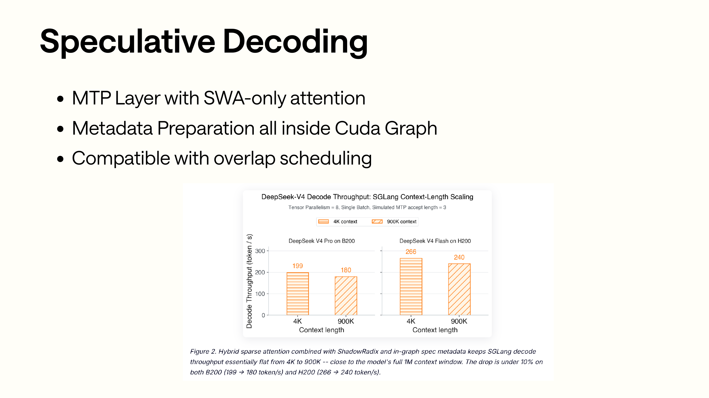

MTP 페이지는 세 개의 bullet과 막대 그래프를 함께 봐야 한다. MTP layer는 SWA-only attention만 타고, metadata prepare는 CUDA Graph 안에 넣으며, overlap scheduling과도 호환되어야 한다. 아래의 막대 그래프는 여러 컨텍스트 길이에서 draft가 처리량에 미치는 영향을 보여주는데, 핵심은 어떤 개별 숫자가 아니라 SGLang이 draft worker의 추가 비용을 수용 가능한 범위 안으로 통제했다는 점이다.

Slides에서는 MTP layer가 SWA-only attention을 사용한다는 점을 강조한다. 소스 코드에서는 다음에 대응한다:

```python
# python/sglang/srt/models/deepseek_v4_nextn.py
COMPRESS_RATIO_NEXTN_LAYER = 0
```

NextN 모델은 decoder layer를 만들 때 압축 비율을 강제로 덮어쓴다:

```python
self.decoder = DeepseekV4DecoderLayer(
    ...,
    is_nextn=True,
    compress_ratio_override=COMPRESS_RATIO_NEXTN_LAYER,
)
```

이는 draft layer가 C4/C128 compressor를 만들지 않고 C4 indexer도 만들지 않는다는 뜻이다. 주 모델의 SWA attention 형태만 재사용한다. 이렇게 하면 두 가지 장점이 있다:

- Draft token의 목표는 후보를 빠르게 예측하는 것이므로, 완전한 CSA/HCA metadata와 compressor 비용을 감당할 수 없다.
- Draft worker는 C4/C128/state pool을 가질 필요가 없으며, 메모리 pool 초기화 시 관련 용량도 0으로 설정된다.

`DeepseekV4ModelNextN.forward`는 target 모델에서 전달받은 hidden states와 현재 token embedding을 합치기도 한다:

```python
hc_flat = forward_batch.spec_info.hidden_states.view(n_tokens * hc_mult, d)
h_proj_hidden_states = self.h_proj(self.hnorm(hc_flat)).view(n_tokens, hc_mult, d)
e_proj_hidden_states = self.e_proj(self.enorm(hidden_states))
hidden_states = e_proj_hidden_states[:, None, :] + h_proj_hidden_states
```

그래서 MTP는 완전히 독립적인 작은 모델이 아니다. target worker가 캡처한 auxiliary hidden states를 소비한 뒤, 자체 decoder를 통해 draft logits를 출력한다.

Attention backend에는 speculative 다단계를 위한 `DeepseekV4MultiStepBackend`도 있다. 각 speculative step마다 독립적인 backend를 준비한다:

```python
for i in range(self.speculative_num_steps):
    self.attn_backends.append(
        DeepseekV4AttnBackend(..., speculative_step_id=i)
    )
```

Cookbook에서 대응하는 recipe는 다음과 같다:

```text
low-latency:    speculative-num-steps=3, draft-tokens=4
balanced:       speculative-num-steps=1, draft-tokens=2
max-throughput: MTP disabled
```

이는 serving 목표와 관련이 있다. 저지연 시나리오에서는 MTP를 사용해 주 모델의 decode 횟수를 줄인다. 만재 처리량 시나리오에서는 verify step의 비용이 절약한 주 모델 token보다 클 수 있으므로, max-throughput recipe는 MTP를 끈다.

# 0xA. HiSparse: C4 pool의 CPU offload와 indexer swap-in

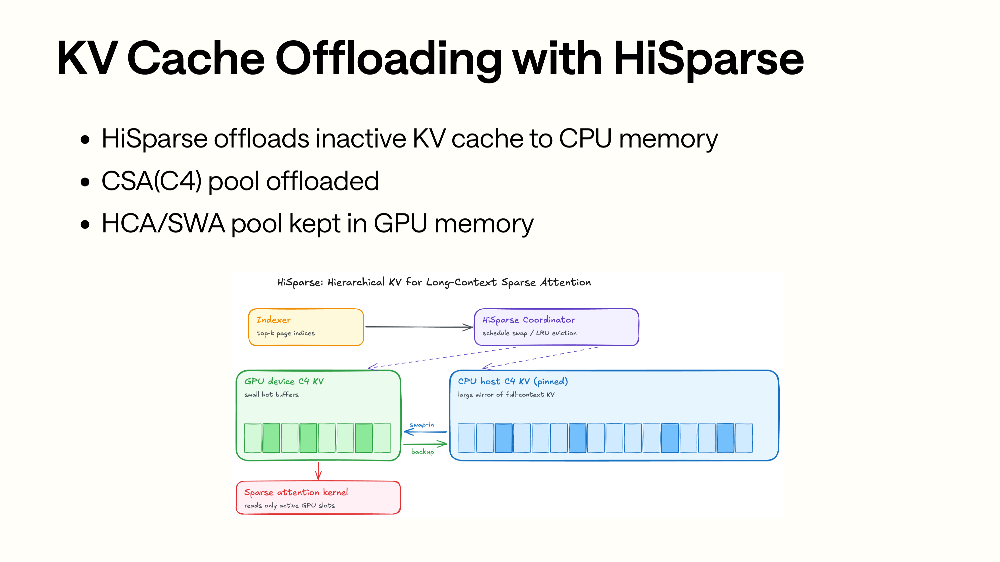

HiSparse 페이지에서는 화살표 관계에 주목해야 한다. C4 indexer가 먼저 sparse attention이 접근할 page를 고르고, HiSparse coordinator가 이 page들이 GPU device buffer에 있는지 CPU host pool에 있는지를 판단한다. 그림의 초록색 블록은 GPU 상의 hot KV이고, 파란색 블록은 CPU 상의 inactive KV다. swap-in 이후 sparse attention kernel이 보게 되는 것은 이미 device-side loc으로 고쳐 쓴 indices다.

HiSparse 페이지가 다루는 것은 KV Cache Offloading이다. DeepSeek-V4 구현의 핵심은 이렇다: 먼저 C4 pool을 offload 하고, SWA와 C128은 GPU에 유지한다.

`DeepSeekV4TokenToKVPool` 초기화 시 HiSparse를 켜면 C4 pool 클래스를 `HiSparseC4DevicePool`로 대체한다:

```python
c4_kv_pool_type = DeepSeekV4SingleKVPool
if enable_hisparse:
    c4_kv_pool_type = HiSparseC4DevicePool
self.c4_kv_pool = c4_kv_pool_type(...)
```

`HiSparseC4DevicePool`은 C4만 처리하는데, `compress_ratio=4`를 고정하기 때문이다:

```python
self.compress_ratio = 4
```

이것은 full-token loc에서 compressed loc으로, 다시 HiSparse device loc으로 가는 매핑을 제공한다:

```python
def translate_loc_from_full_to_compressed(full_indices):
    mask = (full_indices + 1) % 4 == 0
    compressed_indices = full_indices[mask] // 4
    return compressed_indices

def translate_loc_to_hisparse_device(compressed_indices):
    return full_to_hisparse_device_index_mapping[compressed_indices]
```

왜 C4부터 손대는가? C4는 CSA의 히스토리 접근 pool이라 용량이 크고 접근이 희소해서, host/device 계층화에 가장 적합하기 때문이다. SWA는 최근 128 token이라 접근 빈도가 높고 윈도우가 작다. C128은 이미 128:1로 압축되어 있어 용량 압박이 상대적으로 낮다.

HiSparse의 coordinator는 `model_runner.py`에서 초기화된다:

```python
if self.enable_hisparse:
    hisparse_cfg = parse_hisparse_config(self.server_args)
    hisparse_top_k = getattr(
        self.model_config.hf_text_config, "index_topk", hisparse_cfg.top_k
    )
    self.hisparse_coordinator = HiSparseCoordinator(
        req_to_token_pool=self.req_to_token_pool,
        token_to_kv_pool_allocator=self.token_to_kv_pool_allocator,
        top_k=hisparse_top_k,
        device_buffer_size=hisparse_cfg.device_buffer_size,
        device=self.device,
        tp_group=(...),
        host_to_device_ratio=hisparse_cfg.host_to_device_ratio,
    )
```

indexer와 이어지는 지점은 `C4IndexerBackendMixin.forward_c4_indexer`다. decode이고 HiSparse coordinator가 존재하면, top-k transform이 raw indices를 추가로 받아 오고, 그다음 coordinator가 이 page들을 swap-in 한다:

```python
core_metadata.c4_sparse_page_indices = (
    hisparse_coordinator.swap_in_selected_pages(
        req_pool_indices=forward_batch.req_pool_indices,
        compressed_seq_lens=indexer_metadata.c4_seq_lens,
        top_k_result=raw_indices,
        layer_id=compress_layer_id,
    )
)
```

decode가 아닌 시나리오에서는 loc 변환만 한다:

```python
core_metadata.c4_sparse_page_indices = (
    token_to_kv_pool.c4_kv_pool.translate_loc_to_hisparse_device(
        core_metadata.c4_sparse_page_indices
    )
)
```

HiSparse는 attention backend 안에서 평범하게 "CPU에서 KV를 읽는" 것이 아니다. 그것은 C4 indexer와 FlashMLA 사이에 위치한다. indexer가 먼저 접근할 C4 page를 고르고, HiSparse가 그 page들이 device buffer에서 접근 가능하도록 보장한 뒤 indices를 device-side loc으로 바꾼다.

# 0xB. mHC: DeepSeek-V4 모델 층의 또 다른 상태 형태

Slides는 주로 attention과 serving을 다루지만, 소스 코드에는 별도로 설명이 필요한 구조가 하나 더 있다: mHC다. 이것은 `DeepseekV4DecoderLayer`의 attention 전후, FFN 전후에 모두 등장한다.

모델 hidden states는 더 이상 `[tokens, hidden]`만이 아니라 다음과 같이 확장된다:

```python
hidden_states = hidden_states.unsqueeze(1).repeat(1, hc_mult, 1)
```

기본값은 `hc_mult=4`이므로, 많은 layer 내 계산의 shape은 `[tokens, 4, hidden]`이다. 각 decoder layer의 forward는 대체로 다음과 같다:

```text
residual = hidden_states
hidden_states, post, comb = hc_pre(..., input_layernorm)
hidden_states = self_attn(hidden_states)
hidden_states = hc_post(hidden_states, residual, post, comb)

residual = hidden_states
hidden_states, post, comb = hc_pre(..., post_attention_layernorm)
hidden_states = mlp(hidden_states)
hidden_states = hc_post(hidden_states, residual, post, comb)
```

`hc_pre`에는 여러 최적화 경로가 있다:

- TileLang: `SGLANG_OPT_USE_TILELANG_MHC_PRE=True`
- AITER/HIP: `SGLANG_OPT_USE_AITER_MHC_PRE=True`
- DeepGEMM TF32 prenorm: `SGLANG_OPT_DEEPGEMM_HC_PRENORM=True`
- fallback torch impl

최신 main은 mHC pre에 token-count prewarm도 추가했다. `DeepseekV4ForCausalLM.kernel_warmup`은 hybrid SWA, DeepGEMM prenorm, TileLang mHC pre가 동시에 켜져 있을 때 `chunked_prefill_size`에 따라 대표적인 token count 한 세트를 생성한다. 사용자가 chunked prefill을 설정하지 않았다면 기본적으로 8192로 추정한다. 각 대표 shape에 대해 먼저 `hc_pre`를 돌려서 TileLang/DeepGEMM 경로가 컴파일과 스케줄 캐시를 미리 완료하게 하여, 첫 실제 요청이 이 비용을 떠안는 것을 피한다.

마지막 layer는 `hc_head`도 거친다:

```python
pre_hc_head = hidden_states.flatten(1)
hidden_states = self.hc_head(hidden_states, hc_head_fn, hc_head_scale, hc_head_base)
hidden_states = self.norm(hidden_states)
```

여기서 `pre_hc_head`는 logits processor로 전달된다:

```python
hidden_states_before_norm=pre_hc_head
```

이것이 MTP가 auxiliary hidden states를 필요로 하는 이유 중 하나이기도 하다. NextN 모델은 target이 전달한 `spec_info.hidden_states`를 읽고 `h_proj`를 한 다음, 현재 token embedding의 `e_proj`와 합친다.

따라서 DeepSeek-V4 소스 코드를 읽을 때 attention만이 유일한 진입점은 아니다. mHC는 layer 안의 hidden state의 shape, PP IPC의 전송 형태, 그리고 MTP hidden state의 캡처 방식을 바꾼다.

# 0xC. MoE, FP4, MegaMoE

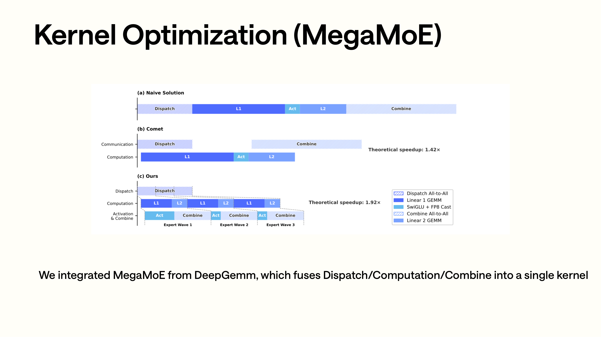

MegaMoE 페이지는 세 개의 타임라인으로 Naive, Comet, Ours를 비교한다. Naive에서는 Dispatch, Expert GEMM, Combine이 분리되어 있고, Comet은 이미 일부 단계를 병행시켰다. Ours는 한 걸음 더 나아가 dispatch / compute / combine을 MegaMoE kernel로 합친다. 그림의 여러 개의 파란색 작은 블록은 여러 expert GEMM window가 같은 실행 흐름에 배치되었음을 나타낸다. 뒤의 소스 코드에서 MegaMoE symmetric buffer, FP8/FP4 layout, topk id/weight 전처리가 등장하는 이유도 이것이다.

DeepSeek-V4는 여전히 초대형 MoE 모델이며, MoE 경로는 `DeepseekV4DecoderLayer`에서 `DeepseekV2MoE`를 재사용하지만 다음을 명시적으로 전달한다:

```python
is_deepseek_v4=True
```

주의해야 할 제한이 하나 더 있다: DeepSeek-V4는 기본적으로 shared experts fusion을 비활성화한다.

```python
def determine_num_fused_shared_experts(self):
    self.num_fused_shared_experts = 0
    if get_global_server_args().disable_shared_experts_fusion:
        return

    get_global_server_args().disable_shared_experts_fusion = True
    log_info_on_rank0(
        logger,
        "DeepSeek V4 requires different clamping for shared and routed experts. "
        "Shared experts fusion optimization is disabled.",
    )
```

이유는 로그에 적혀 있다. DeepSeek-V4의 shared experts와 routed experts는 서로 다른 clamping을 필요로 하므로, 옛 shared experts fusion 가정을 그대로 쓸 수 없다.

FP4 expert 가중치의 검출은 config 안에 있다:

```python
if dtype in ("U8", "I8", "F4"):
    return True
if dtype == "F8_E4M3":
    return False
```

배포 측면에서 Blackwell은 기본적으로 원본 FP4 experts + FP8 attention/dense의 혼합 checkpoint를 탄다. Hopper는 FP8 converted checkpoint를 탈 수도 있고, Marlin / FlashInfer MXFP4로 원본 FP4 experts를 돌릴 수도 있다.

SGLang에는 현재 두 갈래의 FlashInfer MXFP4 MoE 적응이 있다:

```text
python/sglang/srt/layers/quantization/mxfp4_flashinfer_trtllm_moe.py
python/sglang/srt/layers/quantization/mxfp4_flashinfer_cutlass_moe.py
```

`mxfp4_flashinfer_trtllm_moe.py`는 topk ids와 topk weights를 패킹한 뒤 FlashInfer의 TensorRT-LLM FP4 routed MoE를 호출한다:

```python
packed_topk = PackTopkIds.execute(topk_ids, topk_weights)
output = trtllm_fp4_block_scale_routed_moe(
    topk_ids=packed_topk,
    ...
)
```

`mxfp4_flashinfer_cutlass_moe.py`는 FlashInfer SM90 CUTLASS 노선이다. 이것도 DeepSeek-V4의 `swiglu_limit`을 처리하고, FP4 block scale 레이아웃을 backend가 필요로 하는 형식으로 정리한다.

MegaMoE는 소스 코드에서 또 하나의 MoE backend다. 진입점은 다음과 같다:

```text
python/sglang/srt/layers/moe/mega_moe.py
python/sglang/jit_kernel/csrc/deepseek_v4/mega_moe_pre_dispatch.cuh
```

MegaMoE의 전처리는 hidden states, topk ids, topk weights를 DeepGEMM이 기대하는 symmetric buffer로 정리한다:

```python
mega_moe_pre_dispatch(
    hidden_states,
    topk_ids_in,
    topk_weights_in,
    buf.x,
    buf.x_scales,
    buf.topk_idx,
    buf.topk_weights,
)
```

그다음 호출한다:

```python
deep_gemm.fp8_fp4_mega_moe(...)
```

다음을 켜면:

```text
SGLANG_OPT_DEEPGEMM_MEGA_MOE_USE_FP4_ACTS=1
SGLANG_OPT_DEEPGEMM_MEGA_MOE_USE_MXF4_KIND=1
```

활성값도 FP4 packed 경로를 타서, symmetric buffer footprint를 더 줄인다.

Cookbook에는 MegaMoE에 대한 제한도 명확히 설명되어 있다:

- 주로 Blackwell을 대상으로 한다.
- Hopper는 지원하지 않는다.
- low-latency / CP recipe는 지원하지 않는다.
- 기본값은 W4A8이고, W4A4도 쓸 수 있다.
- workload에 따라 `SGLANG_OPT_DEEPGEMM_MEGA_MOE_NUM_MAX_TOKENS_PER_RANK`를 조정해야 한다.

MegaMoE는 마음대로 켤 수 있는 범용 스위치가 아니며, 특정 하드웨어와 고처리량 recipe를 대상으로 한다.

# 0xD. CP와 PD: DeepSeek-V4 병렬 설정의 제약

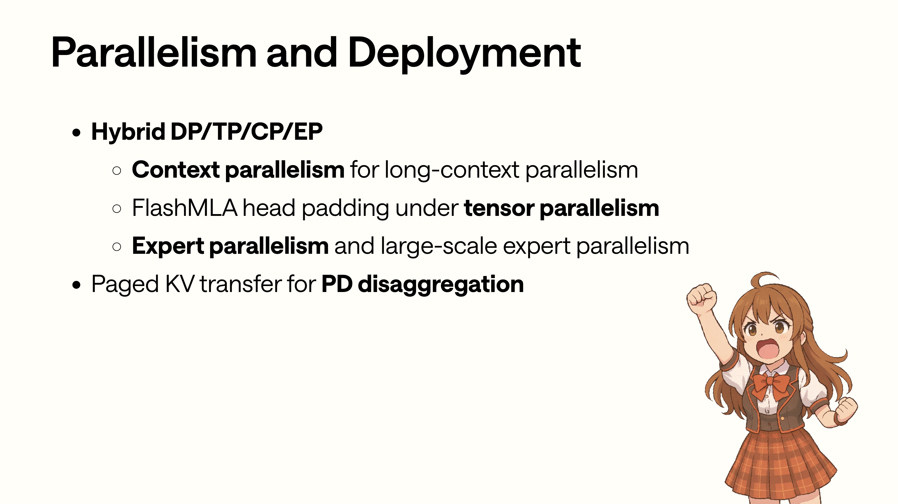

Parallelism 페이지에 나열된 것은 서로 독립적인 시작 파라미터가 아니다. DP/TP/CP/EP는 각각 서로 다른 모듈에 작용한다. CP는 attention metadata와 token 분할을 바꾸고, TP는 FlashMLA head padding에 영향을 준다. EP/DeepEP는 MoE A2A에 영향을 주고, PD disaggregation은 KV pointer layout이 프로세스 간에 전송될 수 있기를 요구한다. 뒤에서 cookbook recipe를 볼 때, 이 페이지를 먼저 제약 목록으로 삼을 수 있다.

Slides의 이 페이지가 DP / TP / CP / EP / PD를 함께 놓은 것은, DeepSeek-V4의 병렬 차원이 실제로 강하게 결합되어 있기 때문이다.

CP 경로에서는 metadata가 먼저 round-robin reindex를 해야 한다:

```python
core_meta.apply_cp_reindex()
core_meta.init_flashmla_related()
metadata.indexer_metadata = init_forward_metadata_indexer(core_meta)
```

`apply_cp_reindex`는 다음 필드들을 CP rank 기준으로 쪼갠다:

```python
seq_lens_casual
positions_casual
swa_page_indices
swa_topk_lengths
page_table
c4_topk_lengths_raw
c4_topk_lengths_clamp1
c128_page_indices
c128_topk_lengths_clamp1
```

하지만 다음 몇 개 필드는 global로 유지하고 쪼개지 않는다:

```python
raw_out_loc
c4_out_loc
c128_out_loc
```

이유도 소스 코드 주석에 적혀 있다. compressor write path는 여전히 global out loc이 필요하다. 따라서 CP는 attention 읽기 관련 metadata만 쪼개고, cache를 쓰는 위치 정보는 전역 의미를 유지해야 한다.

모델 층에서 CP는 두 곳에 영향을 준다.

첫째, attention의 KV path는 BF16 KV로 all-gather를 해야 하므로, 기본 fused cache write를 탈 수 없다:

```python
kv = self._compute_kv_bf16(...)
kv = cp_all_gather_rerange_output(...)
attn_backend.store_cache(...)
```

둘째, MLP / MoE 앞에서 CP rank 기준으로 input ids를 쪼개야 하고, DeepEP도 요구된다:

```python
assert get_moe_a2a_backend().is_deepep()
input_ids = input_ids[cp_rank::cp_size].contiguous()
```

이것이 CP recipe를 단독 attention flag로 볼 수 없는 이유다. CP는 metadata, KV cache write, MLP input ids, DeepEP backend, TP/DP 조합에 동시에 영향을 준다.

PD disaggregation에도 DeepSeek-V4 전용 처리가 있다. Prefill 쪽은 KVArgs를 설정할 때 token_to_kv_pool이 `DeepSeekV4TokenToKVPool`임을 발견하면 `mla_compression_ratios`를 추가로 함께 실어 보낸다:

```python
if isinstance(self.token_to_kv_pool, DeepSeekV4TokenToKVPool):
    kv_args.mla_compression_ratios = list(
        self.token_to_kv_pool.compression_ratios
    )
```

연결 층은 이 필드를 받으면 DSv4의 KV pointer list가 per-layer 레이아웃이 아니라 buffer type 기준으로 구간이 나뉜다는 것을 알게 된다:

```text
kv_data layout:
[c4 layers]
[c4 indexer layers]
[c128 layers]

state_data layout:
[swa layers]
[compress_state for c4/c128]
[indexer_compress_state for c4]
```

`_mla_slice_ptrs_for_pp`는 `compression_ratios`와 PP stage의 start/end layer에 따라 decode 쪽 full-model pointer list를 prefill 쪽과 동일한 부분 범위로 잘라낸다.

최신 소스 코드는 이미 disaggregation common path에서 compressed-MLA pointer slicing을 지원하지만, DSv4의 buffer-type 기반 KV 포인터는 일반적인 per-layer KV에 비해 제약이 더 많다. 즉 코드 수준에서는 이미 `_mla_slice_ptrs_for_pp` 같은 PP slicing 로직이 있지만, 배포 recipe에서는 여전히 PD, PP, CP, DeepEP를 마음대로 겹쳐 쓸 수 없다. cookbook 생성기에서 verified로 표시된 조합을 기준으로 삼아야 한다.

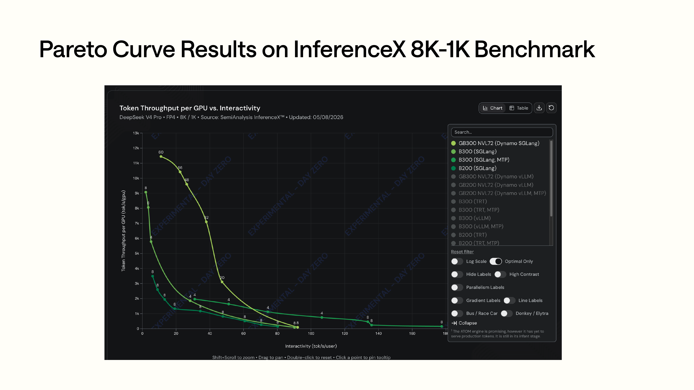

Pareto 곡선 페이지는 서로 다른 deployment recipe를 같은 처리량/상호작용성 그림에 올려 놓는다. 이 그림을 읽을 때는 "유일한 최적 명령"을 찾는 데 목표를 두지 말고, 각 곡선이 어떻게 이동하는지를 봐야 한다. 저지연 recipe는 만재 처리량의 일부를 희생하고, max-throughput recipe는 지속적인 고동시성에 더 적합하다. MTP, CP, DeepEP, MegaMoE는 점을 서로 다른 영역으로 옮긴다.

Cookbook은 deployment recipe를 몇 부류로 나눈다:

- Low-latency: TP + MTP 3/4, 단일 요청 지연을 우선적으로 줄인다.
- Balanced: DP attention + DeepEP + MTP 1/2.
- Max-throughput: DP attention + DeepEP, 보통 MTP를 끈다.
- CP: TP + DeepEP + context-parallel flags.
- PD-Disagg: Prefill / Decode 분리, router를 통해 외부에 서비스한다.

이 recipe들은 검증된 몇 갈래의 배포 노선을 제시한다. 실제 선택 시에는 하드웨어와 workload를 봐야 한다. MTP, DeepEP, MegaMoE, CP, PD, Hopper/Blackwell, FP4/FP8은 모두 처리량, 지연, VRAM 점유를 바꾼다.

# 0xE. 배포 매트릭스: 하드웨어, 모델 변형, 양자화 노선

DeepSeek-V4 cookbook에는 현재 주로 두 가지 instruct 변형이 있다:

```text
DeepSeek-V4-Flash: 약 284B/285B 급, 전반적으로 단일 노드 배포에 더 적합
DeepSeek-V4-Pro: 약 1.6T, 더 강한 TP/다중 노드/대용량 VRAM 조합이 필요
```

하드웨어 매트릭스는 `docs_new/src/snippets/autoregressive/deepseek-v4-deployment.jsx`에서 관리된다. 몇 가지 지점은 다음과 같다:

```text
B200  -> FP4 weights, Flash TP=4, Pro TP=8
B300  -> FP4 weights, 현재 생성기는 B200 alias로 처리
GB200 -> FP4 weights, Flash TP=4, Pro TP=8, 2 노드
GB300 -> FP4 weights, Flash TP=4, Pro TP=4
H200  -> FP8 converted checkpoint, Flash TP=4, Pro TP=16, 2 노드
H200 FP4 -> 원본 FP4 checkpoint + Marlin/FlashInfer MXFP4, Flash TP=4, Pro TP=8, TP-only
H100 FP4 -> 원본 FP4 checkpoint + Marlin, Flash TP=8, Pro TP=16, TP-only
```

Cookbook에는 유의해야 할 설명이 하나 있다. DeepSeek 공식 Instruct repo는 FP4 MoE experts + FP8 attention/dense의 혼합 checkpoint다. Base 변형은 순수 FP8 mixed이지만 chat/tool calling 용도가 아니다. Hopper에서 FP4 mixed experts를 사용하지 않으려면 SGLang이 배포한 FP8 converted checkpoint가 필요하다:

```text
sgl-project/DeepSeek-V4-Flash-FP8
sgl-project/DeepSeek-V4-Pro-FP8
```

Recipe 생성기에는 MegaMoE에 대한 명시적 gating도 있다:

- Blackwell만 지원한다.
- H100 / H200 / H200-FP4는 지원하지 않는다.
- low-latency / CP는 지원하지 않는다.
- 켜면 `--moe-a2a-backend deepep`을 `--moe-a2a-backend megamoe`로 바꾼다.

이 부분은 소스 코드를 읽는 데에도 도움이 된다. 소스 코드에 여러 MoE backend, 여러 FP4 backend, 여러 env 스위치가 나타날 때 이들이 자유롭게 조합될 수 있다고 전제해서는 안 된다. 실제로 지원되는 조합은 cookbook / deployment generator 안의 verified recipe를 기준으로 한다.

# 0xF. RL slides: 훈련 쪽 정보의 위치

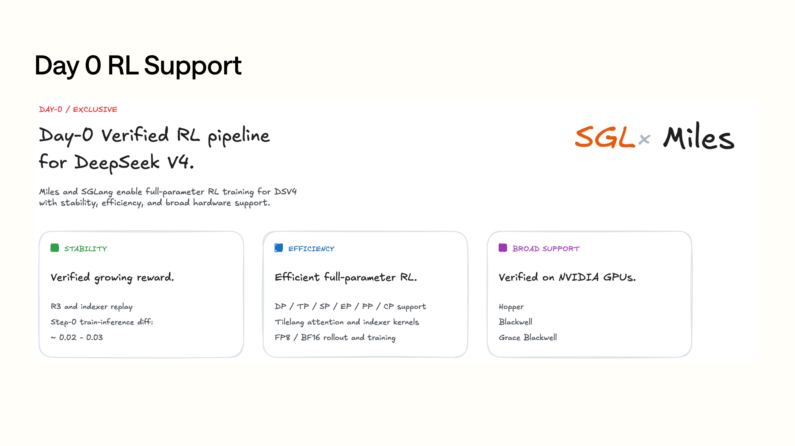

Day-0 RL 페이지에 대응하는 소스 코드 경로는 앞의 serving runtime과 다르다. 세 개의 카드는 각각 reward 증가가 검증 가능하다는 것, 전체 파라미터 RL을 실행할 수 있다는 것, Hopper/Blackwell에서 검증되었다는 것을 말한다. 여기에 놓인 것은 주로 SGLang이 DeepSeek-V4를 둘러싸고 제공하는 day-0 지원이 온라인 추론 외에 훈련/사후 훈련 워크플로도 커버한다는 점을 설명하기 위해서다.

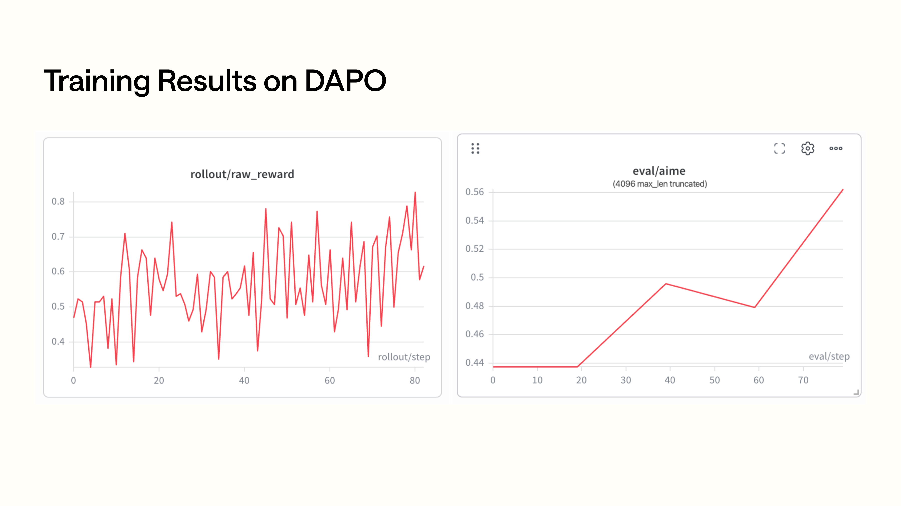

DAPO 결과 페이지의 왼쪽은 rollout raw reward이고, 오른쪽은 AIME eval 곡선이다. 왼쪽 그림은 변동이 크지만 전체적으로 상승한다. 오른쪽 그림은 최종 성능 지표에 더 가까우며, 여러 단계 이후의 향상을 볼 수 있다. 이 글은 훈련 소스 코드를 펼치지 않지만, 이 페이지는 slides가 왜 RL support를 Highlights에 넣었는지 이해하는 데 도움이 된다.

Slides 후반부는 Day-0 RL Support와 DAPO 결과를 다루며, 키워드는 다음과 같다:

- DP / TP / SP / EP / PP / CP 완전 병렬.
- TileLang attention.
- Enhanced stability.
- FP8 training.

이 부분은 이 글에서 소스 코드를 펼치지 않는데, 현재 로컬 SGLang 추론 repo에서 가장 직접적이고 완전한 것이 serving runtime이기 때문이다. 훈련 쪽 slides는 주로 SGLang의 관련 작업이 DeepSeek-V4를 둘러싸고 online serving 외에 모델 공개 후의 훈련/사후 훈련 연동도 포함한다는 점을 설명한다. 독자가 이 부분에 관심이 있다면 로드맵과 역량 소개로 이해하면 되고, 앞의 `DeepseekV4AttnBackend`와 일대일로 대응시킬 필요는 없다.

# 0x10. 테스트와 검증 진입점

독자가 소스 코드를 따라 계속 검증하고 싶다면, 다음 테스트 진입점에서 시작할 수 있다:

```text
test/registered/models_e2e/test_deepseek_v4_flash_fp4_b200.py
test/registered/models_e2e/test_deepseek_v4_flash_fp4_h200.py
test/registered/models_e2e/test_deepseek_v4_flash_fp8_h200.py
test/registered/models_e2e/test_deepseek_v4_flash_fp4_megamoe_b200.py
test/registered/distributed/test_disaggregation_dsv4.py

test/manual/core/test_dsv4_cached_loc_invalidation.py
test/manual/core/test_dsv4_hicache_swa_translation_cache.py
test/manual/core/test_dsv4_stale_loc_crash.py
test/manual/core/test_swa_loc_translation_cache.py

test/manual/dsv4/test_dsv4_flash_sanity_tp8.py
test/manual/dsv4/test_dsv4_flash_sanity_dp4.py
test/manual/dsv4/test_dsv4_flash_mtp_tp8.py
test/manual/dsv4/test_dsv4_flash_mtp_dp4.py
test/manual/dsv4/test_dsv4_pd_disagg_nixl.py
test/manual/dsv4/test_b200_flash.py
test/manual/dsv4/test_b200_pro.py
test/manual/dsv4/test_b300_flash.py
test/manual/dsv4/test_b300_pro.py
test/manual/dsv4/test_gb300_flash.py
test/manual/dsv4/test_gb300_pro.py
test/manual/dsv4/test_h200_fp4_flash.py
test/manual/dsv4/test_h200_fp4_pro.py
test/manual/dsv4/test_h200_fp8_flash.py
test/manual/dsv4/test_h200_fp8_pro.py

python/sglang/jit_kernel/tests/deepseek_v4/test_c4_v2.py
python/sglang/jit_kernel/tests/deepseek_v4/test_c128_v2.py
python/sglang/jit_kernel/tests/test_hisparse.py
```

이 테스트들은 대체로 다음을 커버한다:

- FP4 / FP8 모델의 B200 / B300 / GB300 / H200 상에서의 serving.
- MegaMoE recipe.
- TP/DP 하에서의 sanity.
- MTP TP8 / DP4.
- PD disaggregation.
- SWA loc translation cache invalidation, 그리고 HiCache / SWA translation cache의 stale loc 회귀.
- C4/C128 compressor v2 kernel.
- HiSparse JIT kernel.

소스 코드를 읽을 때는 다음 순서를 권한다:

```text
1. cookbook 을 보고 recipe 하나를 고른다.
2. deepseek_v4_hook.py 를 보고 시작 파라미터가 무엇으로 바뀌는지 확인한다.
3. pool_configurator.py 를 보고 각 종류 pool 크기를 계산한다.
4. model_runner_kv_cache_mixin.py 를 보고 DeepSeekV4TokenToKVPool 생성을 확인한다.
5. deepseek_v4_backend.py 의 init_forward_metadata 를 본다.
6. python/sglang/srt/models/deepseek_v4.py 의 MQALayer.forward 를 본다.
7. compress_ratio 에 따라 compressor_v2.py / indexer.py 를 각각 본다.
8. 마지막으로 JIT/CUDA kernel 을 본다.
```

이 순서가 CUDA kernel부터 바로 보는 것보다 쉬운데, DeepSeek-V4의 kernel 대부분이 앞에서 이미 구성해 둔 page table, state loc, out loc, topk metadata에 의존하기 때문이다.

# 0x11. Roadmap과 정리

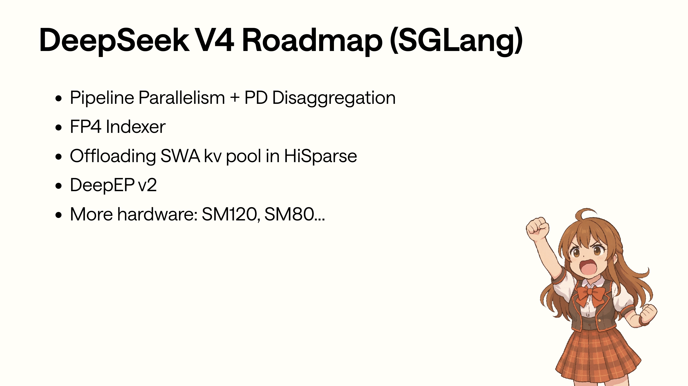

Roadmap 페이지의 각 항목은 현재 소스 코드에서 대응하는 압력 지점을 찾을 수 있다. PP + PD는 buffer-type-organized KV pointer slicing에 대응하고, FP4 Indexer는 C4 indexer의 저비트화에 대응한다. SWA offload는 HiSparse가 C4에서 더 고빈도인 SWA pool로 확장되는 것에 대응하고, DeepEP v2는 MoE 통신 backend에 대응한다. SM120/SM80은 kernel과 recipe의 하드웨어 커버리지다.

Slides의 roadmap은 몇 가지 방향을 언급한다:

- Pipeline Parallelism + PD Disaggregation.
- FP4 Indexer.
- HiSparse가 계속해서 SWA KV pool을 offload 하는 것.
- DeepEP v2.
- 더 많은 하드웨어 지원: SM120, SM80.

최신 소스 코드와 함께 보면, 이 방향들은 각각 현재 구현의 몇 가지 압력 지점에 대응한다:

- PP + PD: 현재 DSv4 KV pointer list는 buffer-type-organized이며 일반적인 per-layer 레이아웃이 아니므로, PP 분할은 `compression_ratios`에 의존해 복잡한 slicing을 해야 한다.
- FP4 Indexer: 현재 C4 indexer는 이미 FP8 query / key cache와 topk v2를 갖고 있는데, 더 저비트화하면 sparse selection의 오차와 성능에 영향을 준다.
- SWA offload: 현재 HiSparse는 C4부터 손대는데, SWA가 최근 윈도우로서 고빈도로 접근되기 때문이다. SWA를 offload 하려면 지연 리스크가 더 크다.
- DeepEP v2: CP, DP attention, MoE A2A, MegaMoE는 모두 MoE 통신 backend와 강하게 관련되어 있다.
- SM120 / SM80: DeepSeek-V4의 현재 기본 최적화 상당수가 Blackwell/Hopper를 대상으로 하므로, 구형 카드와 신형 카드 모두 별도의 kernel/recipe 적응이 필요하다.


이 페이지는 네 개 진입점의 QR 코드다: Cookbook, Miles DeepSeek V4 roadmap & recipe, SGLang DeepSeek V4 roadmap, DeepSeek V4 technical blog. 이 글은 주로 Cookbook과 소스 코드를 맞춰 보았다. 이후 recipe가 갱신된다면 이 진입점들로 먼저 돌아가서 최신 설명을 확인하기를 권한다.

구현 경로를 아래 그림으로 정리한다:

```text
DeepSeek-V4 config
  -> compress_ratios: 0 / 4 / 128
  -> MQALayer: SWA-only / CSA / HCA

ShadowRadix / full-token coord
  -> DeepSeekV4TokenToKVPool
  -> SWA pool + C4 pool + C128 pool + C4 indexer pool

Forward metadata
  -> DSV4AttnMetadata
  -> SWA page indices
  -> C4 topk lengths + sparse page indices
  -> C128 page indices
  -> FlashMLA metadata

Layer forward
  -> fused Q norm + RoPE
  -> fused K norm + RoPE + SWA cache write
  -> C4/C128 compressor_v2
  -> C4 indexer + Lightning TopK
  -> flash_mla_with_kvcache(SWA + extra C4/C128)

System features
  -> MTP NextN uses SWA-only
  -> HiSparse swaps selected C4 pages
  -> mHC wraps attention and FFN
  -> MoE uses DeepEP / FlashInfer MXFP4 / MegaMoE
  -> CP / PD rely on DSv4-specific metadata and pointer layout
```


커뮤니티 페이지는 GitHub와 X 진입점을 제공한다. 새로운 기술 내용은 없지만 day-0 모델 지원에는 참고 가치가 있다. DeepSeek-V4 같은 모델의 recipe, 하드웨어 지원, 제약 조건은 자주 갱신되며, 많은 변경이 저장소, 문서, 커뮤니티 채널에 먼저 나타난다.


Luma Calendar 페이지는 오프라인/온라인 행사 진입점이다. 독자에게 이 페이지의 역할은 office hour와 meetup을 찾는 것이며, 새 recipe나 새 하드웨어 지원에 의문이 있을 때 커뮤니티 논의를 참고할 수 있다.


Thanks 페이지는 마무리 페이지로, 기술적으로는 정보 하나만 남아 있다: SGLang의 당시 GitHub star 수가 이미 27.5K에 도달했다는 것이다. 여기에는 더 이상 DeepSeek-V4의 구현 세부 사항이 담기지 않는다.


Q&A 페이지는 현장 질의응답 자리다. 이 글에서는 slides가 암시하는 몇 가지 흔한 질문을 이미 앞쪽에 나눠 두었다: 왜 page size가 256으로 고정되어 있는가, 왜 MTP는 SWA만 타는가, 왜 HiSparse는 C4부터 offload 하는가, 왜 PD/CP는 임의로 조합할 수 없는가.

SGLang의 DeepSeek-V4 구현은 다음 흐름으로 이해할 수 있다. 먼저 ShadowRadix와 다단계 KV pool로 새로운 attention 상태를 관리하고, 그다음 metadata planner, Flash Compressor, Lightning TopK, 다중 스트림 overlap, FlashMLA로 이 상태들을 실행하며, 마지막으로 cookbook recipe를 통해 서로 다른 하드웨어와 workload에 재사용 가능한 조합을 제공한다. DeepSeek-V4의 주요 난점은 layer를 가로지르는 제약에 있다. 개별 kernel은 따로 설명할 수 있지만, 실제로 서비스에 올릴 때는 metadata, KV layout, compressor, indexer, FlashMLA, MoE backend, 배포 recipe가 동시에 맞아떨어져야 한다.
