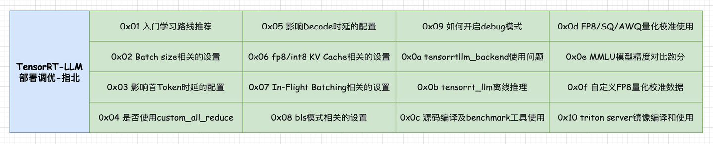
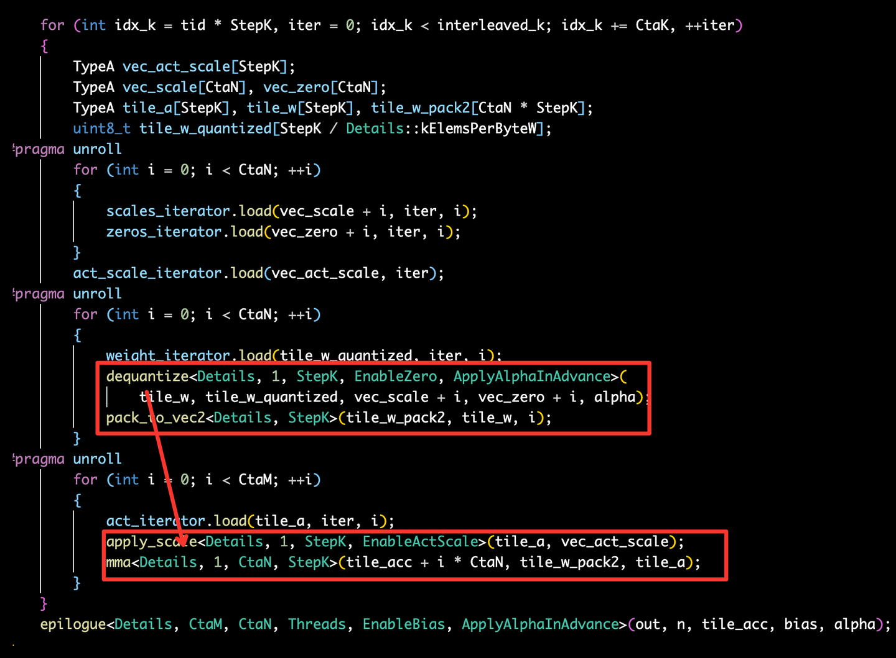

# [TensorRT-LLM][5만자] TensorRT-LLM 배포 튜닝 가이드

> 원문: https://zhuanlan.zhihu.com/p/699333691

> "내 보물이 갖고 싶나? 원한다면 전부 주겠다. 찾아라! 이 세상 전부를 거기에 두고 왔다!"  
> - 골 D. 로저

**목차**
- 0x00 서문
- 0x01 입문 학습 경로 추천
- 0x02 Batch size 관련 설정
- 0x03 첫 Token 지연에 영향을 주는 설정
- 0x04 custom_all_reduce를 사용할지 여부
- 0x05 Decode 지연에 영향을 주는 설정
- 0x06 FP8/INT8 KV Cache 관련 설정
- 0x07 In-Flight Batching 관련 설정
- 0x08 BLS 모드 관련 설정
- 0x09 debug 모드 켜기
- 0x0a tensorrtllm_backend 사용 중 겪은 문제
- 0x0b tensorrt_llm 오프라인 추론
- 0x0c 소스 빌드와 benchmark 도구 사용
- 0x0d Weight Only W8A16/W4A16 사용
- 0x0e FP8/SQ/AWQ/W4A8 양자화 캘리브레이션
- 0x0f MMLU 모델 정확도 비교
- 0x10 커스텀 FP8(W8A8) 양자화 캘리브레이션
- 0x11 Triton Server 이미지 빌드와 사용
- 0x12 W8A8에서 FP16 gptAttention을 쓰는 이유
- 0x13 정리

### 0x00 서문



이 글은 TensorRT-LLM의 **배포 튜닝**에 관한 글입니다. 여기서 말하는 튜닝은 kernel 수준의 성능 최적화가 아니라, 실제 서비스를 띄울 때 만나는 설정, 도구, 사용 경험, 사고방식을 정리하는 쪽에 가깝습니다. TensorRT-LLM을 쓰다 보면 `max_batch_size`, `max_num_tokens`, `enable_kv_cache_reuse`, `batch_scheduler_policy`, BLS, Triton config 같은 옵션들이 성능과 사용성에 직접적인 영향을 줍니다. 이 글은 그런 지점들을 하나씩 기록합니다.

더 많은 기술 노트와 CUDA 학습 노트는 LeetCUDA(CUDA Learn Notes with PyTorch)를 참고해 주세요. LeetCUDA에는 **LLM/VLM** 글 정리와 **FlashAttention, SGEMM, HGEMM, GEMV** 등 자주 쓰이는 **CUDA Kernel**의 예제 구현이 포함되어 있으며, 현재 누적 **3k+ stars**를 달성했습니다. 링크: https://github.com/xlite-dev/LeetCUDA


*CUDA Learn Notes with PyTorch*

### 0x01 입문 학습 경로 추천

TensorRT-LLM을 처음 접한다면 두 갈래로 나누어 보는 것이 좋습니다.

첫째는 **오프라인 추론**입니다. `examples/llama`, `examples/qwen` 같은 예제를 따라가며 checkpoint 변환, engine build, `run.py` 또는 `summarize.py` 실행 흐름을 익히면 기본 개념을 잡기 좋습니다.

둘째는 **온라인 serving**입니다. 이때는 `tensorrtllm_backend`의 문서를 함께 봐야 합니다. TensorRT-LLM 자체와 Triton backend는 별도의 프로젝트이므로, engine을 만드는 일과 Triton model repository를 구성하는 일을 구분해서 이해해야 합니다.

### 0x02 Batch size 관련 설정

#### max_batch_size

`max_batch_size`는 engine이 병렬로 처리할 수 있는 request 수와 관련된 핵심 설정입니다. 너무 작으면 throughput이 제한되고, 너무 크면 serving 시작 시 KV Cache 메모리 때문에 OOM이 날 수 있습니다.

주의할 점은 Triton Server의 `config.pbtxt`에 있는 `max_batch_size`와 `trtllm-build --max_batch_size`가 서로 다른 위치의 설정이라는 점입니다. 실제 서비스에서는 다음 값들을 가능한 한 일관되게 맞추는 편이 좋습니다.

- `trtllm-build --max_batch_size`
- `triton_model_repo/tensorrt_llm/config.pbtxt`
- `triton_model_repo/tensorrt_llm_bls/config.pbtxt`
- ensemble, preprocessing, postprocessing의 batch 관련 설정

예를 들면 Triton config에는 다음처럼 설정합니다.

```protobuf
name: "tensorrt_llm"
backend: "${triton_backend}"
max_batch_size: ${triton_max_batch_size}
```

engine build에는 다음처럼 지정합니다.

```bash
trtllm-build --checkpoint_dir ./tmp --output_dir ./engine --max_batch_size 8
```

#### max_num_tokens

`max_num_tokens`는 동시에 처리할 수 있는 token 수의 상한입니다. TensorRT-LLM v0.10 이후 기본값은 16384입니다. 이 값은 동시에 들어오는 첫 token request 수에 영향을 주며, `remove_input_padding`을 켠 경우에 의미가 있습니다.

대략적인 추정식은 다음과 같습니다.

```text
max_batch_size * max_input_len * alpha + max_batch_size * max_beam_width * (1 - alpha)
```

`max_beam_width=1`이면 보통 다음처럼 단순화해 생각할 수 있습니다.

```text
max_batch_size * max_input_len * alpha   # alpha는 대략 0.05~0.20
```

예를 들어 `max_batch_size=64`, `max_input_len=1024`, `alpha=0.2`라면 `max_num_tokens`는 약 13107 정도로 잡을 수 있습니다.

engine build는 성공했는데 Triton serving에서 OOM이 나는 경우가 있습니다. build 단계에서는 실제 미래 request의 KV Cache 사용량을 정확히 알 수 없기 때문에, 지나치게 큰 `max_batch_size`가 serving 시작 시점의 메모리 할당에서 문제를 일으킬 수 있습니다.

### 0x03 첫 Token 지연에 영향을 주는 설정

#### max_queue_delay_microseconds

`max_queue_delay_microseconds`는 Triton dynamic batching이 batch를 모으기 위해 기다리는 시간입니다. 너무 크게 잡으면 TTFT(Time To First Token)가 늘어납니다. In-Flight Batching을 쓰는 경우에는 이 값을 0으로 두고 IFB 쪽의 scheduler에 맡기는 편이 더 자연스럽습니다.

```protobuf
dynamic_batching {
    preferred_batch_size: [ 24 ]
    max_queue_delay_microseconds: 100
}
```

#### enable_kv_cache_reuse

`enable_kv_cache_reuse`는 TensorRT-LLM의 Automatic Prefix Caching입니다. prefix가 같은 prompt가 반복되는 장면에서 TTFT를 크게 줄일 수 있습니다. 이 기능을 쓰려면 engine build 시 `--use_paged_context_fmha enable`을 켜야 합니다.

```bash
gptManagerBenchmark --enable_kv_cache_reuse enable

trtllm-build --use_paged_context_fmha enable
```

Triton config에서는 다음처럼 설정합니다.

```protobuf
parameters: {
  key: "enable_kv_cache_reuse"
  value: { string_value: "true" }
}
```

이 기능은 `tokens_per_block`과 `kv_cache_host_memory_bytes`도 함께 튜닝할 수 있습니다. `tokens_per_block`이 작을수록 더 세밀한 prefix hit가 가능하지만 관리 overhead도 생깁니다. 예를 들어 다음처럼 지정합니다.

```bash
trtllm-build --tokens_per_block 32
```

host cache를 쓰고 싶다면 다음처럼 지정합니다.

```protobuf
parameters: {
  key: "kv_cache_host_memory_bytes"
  value: { string_value: "45000000000" }
}
```

#### use_fp8_context_fmha

Hopper 계열 GPU에서 FP8 양자화 모델을 쓴다면 `use_fp8_context_fmha`가 TTFT에 영향을 줄 수 있습니다. `paged_context_fmha`와 함께 사용할 수 있으며, 양자화 시 FP8 KV Cache를 함께 지정해야 합니다.

```bash
python ../quantization/quantize.py --model_dir ./tmp/Qwen/7B/ \
                                   --dtype float16 \
                                   --qformat fp8 \
                                   --kv_cache_dtype fp8 \
                                   --output_dir ./tllm_checkpoint_1gpu_fp8 \
                                   --calib_size 512

trtllm-build --checkpoint_dir ./tllm_checkpoint_1gpu_fp8 \
             --output_dir ./engine_outputs \
             --gemm_plugin float16 \
             --use_fp8_context_fmha enable
```

#### FP8 GEMM Plugin

작은 batch size, 예를 들어 BS <= 4이고 FP8 양자화 모델을 쓰는 latency 중심 장면이라면 FP8 GEMM Plugin이 유리할 수 있습니다. throughput 중심 장면에서는 항상 이득이 보장되는 것은 아니므로 실제 benchmark가 필요합니다.

```bash
trtllm-build --gemm_plugin fp8
```

일반적으로 FP16/BF16 모델은 FP16/BF16 GEMM Plugin을 권장하고, FP8 모델은 `--gemm_plugin auto` 또는 작은 BS에서 명시적인 FP8 GEMM Plugin을 검토합니다.

### 0x04 custom_all_reduce를 사용할지 여부

`use_custom_all_reduce`는 현재 대부분의 경우 자동으로 켜집니다. 다만 이 옵션의 효과는 GPU 간 통신 구조에 크게 좌우됩니다. 핵심 판단 기준은 NVLink, PCIe P2P, NUMA topology입니다.

권장 방향은 대략 다음과 같습니다.

- NVLink가 있으면 켜는 것을 권장합니다. driver는 550 이상이 좋습니다.
- P2P가 가능하고 cross-NUMA가 아니면 켜서 이득을 볼 수 있습니다.
- P2P가 가능하더라도 cross-NUMA라면 권장하지 않습니다.
- P2P가 불가능하면 끄는 편이 낫습니다.

`custom_all_reduce`는 TPOT보다 TTFT 쪽에 더 큰 영향을 주는 경우가 많습니다. topology는 다음 명령으로 확인할 수 있습니다.

```bash
nvidia-smi topo --matrix
```

출력에서 `NV#`는 NVLink, `SYS`는 PCIe와 NUMA를 가로지르는 경로, `NODE`는 같은 NUMA node 안의 경로, `PHB/PXB/PIX`는 PCIe bridge 구조를 나타냅니다. GPU 통신을 제대로 이해하려면 NVLink, PCIe P2P, NUMA, NIC 관련 자료를 함께 보는 것을 추천합니다.

### 0x05 Decode 지연에 영향을 주는 설정

#### disable_xqa

XQA는 decoding 단계의 MQA/GQA 최적화입니다. FP16/BF16 compute, FP16/BF16/FP8/INT8 KV Cache, paged KV Cache 등을 지원합니다. 기본적으로 켜져 있지만 항상 XQA kernel이 선택되는 것은 아니며, 내부 heuristic이 XQA와 Masked MHA 중 하나를 고릅니다.

강제로 XQA를 사용하고 싶다면 build 전에 다음 환경변수를 지정할 수 있습니다.

```bash
export TRTLLM_FORCE_XQA=1
```

#### enable_chunked_context

`enable_chunked_context`는 vLLM의 chunked prefill과 비슷한 기능입니다. prompt가 긴 장면, 예를 들어 2048 token 이상인 장면에서 decode latency를 줄이는 데 도움이 됩니다. 긴 context prefill을 여러 chunk로 나누고, decode request와 함께 batch에 섞어 처리합니다.

TensorRT-LLM의 IFB는 decode-priority 성격이 강하고, vLLM의 continuous batching은 새 request의 prefill을 더 적극적으로 처리하는 쪽에 가깝습니다. chunked context는 이 둘 사이의 latency 균형을 조정하는 기능으로 이해할 수 있습니다.

benchmark에서는 다음처럼 켜고 끌 수 있습니다.

```bash
mpirun --allow-run-as-root -n 8 gptManagerBenchmark \
    --engine_dir ./engine \
    --type IFB \
    --enable_chunked_context true \
    --dataset ./tokens-fixed-lengths.json
```

`max_num_tokens`도 함께 성능에 영향을 줍니다. 원문 예시에서는 Qwen1.5-72B에서 `max_num_tokens=8192`일 때 TPOT가 143.79ms에서 136.57ms로 개선되었습니다.

#### use_fused_mlp

`use_fused_mlp`는 MLP를 하나의 kernel로 fuse합니다. decode TPOT를 대략 1~2.5% 개선할 수 있고, TTFT에는 영향이 크지 않습니다. 2024년 8월 기준으로는 기본 활성화 방향으로 바뀌었습니다.

```bash
trtllm-build --use_fused_mlp
```

주의할 점은 weight only와 동시에 쓰지 못하는 버전이 있었다는 것입니다.

#### multi_block_mode

`multi_block_mode`는 작은 batch의 latency 중심 chat 장면과 긴 input sequence에서 도움이 될 수 있는 runtime hint입니다. 켜 두더라도 TensorRT-LLM이 실제로 이득이 없다고 판단하면 사용하지 않을 수 있습니다. 개념적으로는 FlashDecoding과 비슷하게 이해할 수 있습니다.

### 0x06 FP8/INT8 KV Cache 관련 설정

INT8 또는 FP8 KV Cache를 사용할 때는 `kv_cache_scaling_factor`가 중요합니다. plugin은 quantize 시 `fp_value * (1.0 / kv_cache_scaling_factor)` 형태로 값을 압축하고, decode 단계에서는 `quantized_value * kv_cache_scaling_factor`로 dequantize합니다.

LLaMA에서 INT8 KV Cache와 weight only를 함께 쓰는 예시는 다음과 같습니다.

```bash
python convert_checkpoint.py --model_dir ./llama-models/llama-7b-hf \
                             --output_dir ./tllm_checkpoint_1gpu_int8_kv_wq \
                             --dtype float16 \
                             --int8_kv_cache \
                             --use_weight_only \
                             --weight_only_precision int8

trtllm-build --checkpoint_dir ./tllm_checkpoint_1gpu_int8_kv_wq \
             --output_dir ./tmp/llama/7B/trt_engines/int8_kv_cache_weight_only/1-gpu \
             --gemm_plugin auto \
             --multi_block_mode enable
```

### 0x07 In-Flight Batching 관련 설정

serving 성능을 볼 때 tokens/s, reqs/s만 보면 사용자 체감 latency를 놓치기 쉽습니다. scheduler 정책은 request 처리 방식과 tail latency에 영향을 줍니다.

`batch_scheduler_policy`에는 대표적으로 두 가지가 있습니다.

- `MAX_UTILIZATION`: 매 forward마다 가능한 많은 request를 채웁니다. KV Cache가 부족하면 request를 evict할 수 있습니다. throughput에는 유리합니다.
- `GUARANTEED_NO_EVICT`: evict를 피하는 정책입니다. recompute를 피하므로 사용자 경험에는 더 안정적입니다.

개인적으로는 IFB를 단순히 Continuous Batching과 동일시하면 헷갈린다고 봅니다. Continuous Batching은 iteration/request 단위 scheduling에 가깝고, TensorRT-LLM의 IFB는 여러 request의 decode stream을 interleave하는 느낌이 더 강합니다. 문서상 V1, UIFB, IFB라는 표현이 섞여 있어 세부 구현은 버전별로 확인이 필요합니다.

### 0x08 BLS 모드 관련 설정

BLS는 Triton의 Business Logic Scripting입니다. `tensorrtllm_backend`에서는 sampling logic처럼 동적인 처리를 감싸는 데 유용합니다.

#### bls_instance_count

`bls_instance_count`는 engine build 시 사용한 `max_batch_size`와 맞추는 것을 권장합니다. 이 값이 1이면 BLS 단계에서 request가 사실상 직렬화되어 TTFT가 길어질 수 있습니다. `instance_count >= max_batch_size`로 두면 병렬 처리 여지를 확보할 수 있습니다.

#### accumulate_tokens

streaming 응답에서 `accumulate_tokens=True`이면 BLS postprocessing은 현재 token 하나가 아니라 누적 token ids를 받습니다. 특수 token이 여러 token id로 구성되는 경우 중요합니다.

```protobuf
parameters: {
  key: "accumulate_tokens"
  value: { string_value: "False" }
}
```

### 0x09 debug 모드 켜기

Triton Server나 TensorRT-LLM runtime 로그를 더 자세히 보고 싶다면 `log-verbose=3`을 사용할 수 있습니다. `launch_triton_server.py`도 log mode에서 이 값을 사용합니다.

상세 로그에는 다음과 같은 runtime 상태가 출력됩니다.

```text
[TensorRT-LLM][INFO] {"Active Request Count":249, ...}
```

성능 분석은 공식 Performance Analysis 문서도 함께 참고할 만합니다.

### 0x0a tensorrtllm_backend 사용 중 겪은 문제

`tensorrtllm_backend`와 TensorRT-LLM은 별도 프로젝트입니다. vLLM처럼 하나의 FastAPI 서버로 바로 뜨는 구조가 아니므로, Triton Server의 model repository, config template, backend 버전 대응 관계를 같이 이해해야 합니다.

가장 자주 만나는 문제는 **버전 일치**입니다. `tensorrtllm_backend`와 TensorRT-LLM의 버전 대응이 엄격합니다. backend만 새 commit으로 올리고 예전 Triton model config를 쓰면 서비스가 실패할 수 있습니다. backend 코드와 `all_models` 안의 config template을 함께 맞추는 편이 안전합니다.

사용성 측면에서는 업그레이드 때마다 서버 코드와 config를 수동으로 복사하고 확인해야 하는 점이 불편합니다. TensorRT-LLM 안에 Triton Server API를 감싼 `server` module이 생기고, 다음과 같은 형태로 실행할 수 있으면 훨씬 좋아질 것 같습니다.

```bash
trtllm-launcher --model ./engine --tokenizer ./tokenizer --port 8000
```

또 하나의 아쉬움은 OpenAI protocol이 기본 지원되지 않는다는 점입니다. 실제 서비스에서는 사용자가 FastAPI wrapper를 직접 작성해야 하고, 이 과정에서 추가 bug가 생기기 쉽습니다.

### 0x0b tensorrt_llm 오프라인 추론

TensorRT-LLM의 오프라인 추론에는 `ModelRunner`, `ModelRunnerCpp`, High-Level API가 있습니다.

#### ModelRunnerCpp

`ModelRunnerCpp`는 prefix caching, chunk context 등 더 많은 기능을 지원합니다. 하지만 예제마다 Python `ModelRunner`와 C++ binding 기반 `ModelRunnerCpp`가 섞여 있고, 같은 이름의 `SamplingConfig`도 서로 다른 class라 처음 보면 혼란스럽습니다.

사용 흐름은 대략 다음과 같습니다.

```python
runner_cls = ModelRunner if args.use_py_session else ModelRunnerCpp
runner_kwargs = dict(
    engine_dir=args.engine_dir,
    kv_cache_enable_block_reuse=args.kv_cache_enable_block_reuse,
    enable_chunked_context=args.enable_chunked_context,
)
runner = runner_cls.from_dir(**runner_kwargs)

with torch.no_grad():
    outputs = runner.generate(batch_input_ids, sampling_config=sampling_config)
```

`SamplingConfig`로 sampling parameter를 지정하는 방식은 아직 정리가 덜 된 느낌입니다. C++의 `SamplingConfig`와 Python 구현체가 나뉘어 있고, 기능 지원도 완전히 같지 않습니다.

#### ModelRunner

`ModelRunner`는 임시 산물처럼 보이며 사용을 권장하기 어렵습니다. prefix caching, chunk context 같은 기능 지원도 `ModelRunnerCpp`보다 부족합니다.

#### High-Level API

TensorRT-LLM은 High-Level API도 개발 중입니다. 사용 방식은 더 자연스럽고, `config -> init -> generate`의 세 단계로 오프라인 추론을 나눕니다. 다만 원문 작성 시점에는 LLaMA 계열 모델 지원이 중심이었습니다.

예시는 다음 파일을 참고할 수 있습니다.

```text
https://github.com/NVIDIA/TensorRT-LLM/blob/main/examples/high-level-api/llm_examples.py
```

### 0x0c 소스 빌드와 benchmark 도구 사용

#### 소스 빌드

아래 명령은 원문 저자의 환경에서 사용한 참고용 명령입니다. 기본 이미지는 `nvcr.io/nvidia/pytorch:24.02-py3`, CUDA 12.3, TensorRT 10 계열입니다.

```bash
apt-get update
apt-get install sudo
apt install openmpi-bin libopenmpi-dev

unset CPLUS_INCLUDE_PATH && unset C_INCLUDE_PATH
export CPLUS_INCLUDE_PATH=/usr/local/mpi/include/:$CPLUS_INCLUDE_PATH
export C_INCLUDE_PATH=/usr/local/mpi/include/:$C_INCLUDE_PATH
export LD_LIBRARY_PATH=/opt/hpcx/ucx/lib:/opt/hpcx/ompi/lib:/usr/lib/x86_64-linux-gnu/:/usr/local/cuda/lib64

git clone https://github.com/NVIDIA/TensorRT-LLM.git
git submodule update --init --recursive --force

python3 -m pip install cmake
python3 -m pip install --no-cache-dir --extra-index-url https://pypi.nvidia.com mpi4py
python3 -m pip install -r requirements.txt
python3 -m pip install -r requirements-dev.txt
python3 -m pip install flash-attn --no-build-isolation

# 전체 architecture 빌드
python3 ./scripts/build_wheel.py --clean --trt_root /usr/local/tensorrt -j 48

# 특정 architecture만 빌드. 예: Ada sm89
python3 ./scripts/build_wheel.py --clean --cuda_architectures "89-real" --trt_root /usr/local/tensorrt
```

기본 빌드에는 benchmark 도구가 포함되지 않습니다. benchmark가 필요하면 `--benchmarks`를 지정해야 합니다.

```bash
python3 ./scripts/build_wheel.py --clean --benchmarks --trt_root /usr/local/tensorrt -j 48
python3 ./scripts/build_wheel.py --clean --benchmarks --cuda_architectures "89-real" --trt_root /usr/local/tensorrt -j 48
```

conda 환경에서는 Python executable을 명시해야 할 때도 있습니다.

```bash
python3 ./scripts/build_wheel.py --clean --benchmarks --trt_root /usr/local/tensorrt -j 48 \
    --extra-cmake-vars PYTHON_EXECUTABLE=/usr/bin/python3
```

#### gptSessionBenchmark

`gptSessionBenchmark`는 static batching 성능을 빠르게 보는 도구입니다. 예를 들어 InternLM2-chat-20B FP16 TP2 engine을 만든 뒤 다음처럼 실행할 수 있습니다.

```bash
export TRTLLM_BIN_DIR=/workspace/TensorRT-LLM/cpp/build
mpirun --allow-run-as-root -n 2 $TRTLLM_BIN_DIR/benchmarks/gptSessionBenchmark \
    --engine_dir ./engine/internlm2-chat-20b/fp16/2-gpu/ \
    --batch_size "1" --warm_up 2 --num_runs 20 \
    --input_output_len "3072,128"
```

prompt 2048 token일 때 첫 token latency만 빠르게 보고 싶다면 출력 길이를 1로 둡니다.

```bash
mpirun --allow-run-as-root -n 2 $TRTLLM_BIN_DIR/benchmarks/gptSessionBenchmark \
    --engine_dir ./engine/internlm2-chat-20b/fp16/2-gpu/ \
    --batch_size "1" --warm_up 2 --num_runs 20 \
    --input_output_len "2048,1"
```

#### gptManagerBenchmark

IFB 성능을 보려면 `gptManagerBenchmark`를 사용합니다. 먼저 dataset을 준비합니다.

```bash
cd TensorRT-LLM/benchmarks/cpp
python3 prepare_dataset.py \
  --output ./tokens-fixed-lengths.json \
  --tokenizer PATH-TO/internlm2-chat-20b/ \
  token-norm-dist \
  --num-requests 512 \
  --input-mean 2048 --input-stdev 0 \
  --output-mean 128 --output-stdev 0
```

그 뒤 IFB benchmark를 실행합니다. `request_rate`는 모의 QPS입니다.

```bash
export CUDA_VISIBLE_DEVICES=0,1
export TRTLLM_BIN_DIR=/workspace/TensorRT-LLM/cpp/build
mpirun --allow-run-as-root -n 2 $TRTLLM_BIN_DIR/benchmarks/gptManagerBenchmark \
    --engine_dir PATH-TO/engine/internlm2-chat-20b/fp16/2-gpu/ \
    --type IFB --request_rate 10 --max_num_samples 128 --warm_up 2 \
    --enable_kv_cache_reuse false --dataset ./tokens-fixed-lengths.json
```

여기서도 `max_batch_size`가 throughput에 큰 영향을 줍니다. 너무 작으면 병렬 request 수가 제한되고, 너무 크면 OOM이 날 수 있습니다. 원문에서는 InternLM2-chat-20B에서 `max_batch_size=8`일 때는 lmdeploy보다 느려 보였지만, 16 이상으로 올리면 결론이 달라질 수 있다고 언급합니다. TensorRT-LLM을 쓰기 피곤한 지점이 바로 이런 반복 튜닝입니다.

static batching처럼 한 번에 모든 request를 보내는 상황도 흉내 낼 수 있습니다. 내부적으로는 도착한 request를 IFB로 scheduling합니다.

```bash
mpirun --allow-run-as-root -n 2 $TRTLLM_BIN_DIR/benchmarks/gptManagerBenchmark \
    --engine_dir PATH-TO/engine/internlm2-chat-20b/fp16/2-gpu/ \
    --type IFB --request_rate -1 --static_emulated_batch_size 16 \
    --static_emulated_timeout 100 --max_num_samples 16 \
    --enable_kv_cache_reuse false \
    --dataset ./tokens-fixed-lengths.json
```

`static_emulated_batch_size`는 한 번에 모을 batch 크기이고, `static_emulated_timeout`은 batch를 기다리는 시간(ms)입니다.

#### TTFT/TPOT 성능 데이터

`gptManagerBenchmark`는 기본적으로 TTFT를 반환하지 않습니다. v0.10 이후 streaming mode를 켜면 TTFT를 볼 수 있습니다.

```bash
mpirun --allow-run-as-root -n 8 gptManagerBenchmark \
    --engine_dir $HF_MODELS/engine/Qwen1.5-72B-Chat/fp16/8-gpu/ \
    --type IFB --request_rate 0.1 --max_num_samples 8 \
    --enable_kv_cache_reuse false --streaming true \
    --dataset $BENCH_DIR/tokens-fixed-lengths.json
```

성공하면 다음과 비슷한 로그가 나옵니다.

```text
[BENCHMARK] avg_time_to_first_token(ms) 465.21
[BENCHMARK] max_time_to_first_token(ms) 525.54
[BENCHMARK] avg_inter_token_latency(ms) 31.62
[BENCHMARK] max_inter_token_latency(ms) 31.65
```

### 0x0d Weight Only W8A16/W4A16 사용

weight only int8/int4 양자화는 비교적 사용하기 편합니다. checkpoint 변환 스크립트에서 옵션을 켜고 engine을 다시 build하면 됩니다.

Weight Only는 특히 작은 batch size에 적합합니다. 작은 BS의 LLM decode는 memory bound 성격이 강합니다. 계산량은 작고, 매 forward마다 모델 weight를 읽는 IO 비용이 큽니다. FP16 weight를 INT8로 줄이면 weight 메모리와 IO가 줄어들고, dequantize overhead보다 IO 감소 이득이 커질 수 있습니다.

반대로 큰 batch size에서는 계산량이 커지고, weight loading 비용의 상대 비중이 낮아집니다. 이때는 online dequantize overhead가 이득을 상쇄할 수 있어 weight only의 효과가 줄거나 음수가 될 수 있습니다.


*weight only kernel*

W8A16 예시는 다음과 같습니다.

```bash
python3 convert_checkpoint.py \
    --model_dir $HF_MODELS/internlm2-chat-20b/ \
    --dtype float16 \
    --output_dir ./tmp_int8_tp2 \
    --use_weight_only \
    --weight_only_precision int8 \
    --tp_size 2

trtllm-build \
    --checkpoint_dir ./tmp_int8_tp2 \
    --output_dir $HF_MODELS/engine/internlm2-chat-20b/int8/2-gpu/ \
    --max_batch_size 16 \
    --max_input_len 3072 \
    --max_output_len 1024 \
    --max_num_tokens 16384 \
    --max_beam_width 1 \
    --workers 2 \
    --gemm_plugin float16 \
    --gpt_attention_plugin float16 \
    --remove_input_padding enable \
    --paged_kv_cache enable \
    --context_fmha enable \
    --use_paged_context_fmha enable \
    --weight_only_precision int8
```

W4A16은 `--weight_only_precision int4`로 바꿉니다.

```bash
python3 convert_checkpoint.py \
    --model_dir $HF_MODELS/internlm2-chat-20b/ \
    --dtype float16 \
    --output_dir ./tmp_int4_tp2 \
    --use_weight_only \
    --weight_only_precision int4 \
    --tp_size 2
```

최신 main branch에서는 `trtllm-build`의 `weight_only_precision` 옵션이 제거되었습니다. 버전별 문서를 확인해야 합니다.

### 0x0e FP8/SQ/AWQ/W4A8 양자화 캘리브레이션

TensorRT-LLM의 양자화 도구는 `examples/quantization` 아래에 있습니다. 별도 dependency 설치가 필요합니다.

```bash
cd TensorRT-LLM/examples/quantization
python3 -m pip install -r requirements.txt
python3 -m pip install "cython<3.0" pyyaml==5.4.1 --no-build-isolation
python3 -m pip install datasets==2.15.0
```

dependency가 자주 꼬이면 `requirements.txt`의 느슨한 version 조건을 명확한 version으로 고정하는 것도 방법입니다. 원문에서는 다음과 같은 예시를 들었습니다.

```text
--extra-index-url https://pypi.nvidia.com
tensorrt_llm==0.11.0.dev2024061100
datasets==2.15.0
nemo-toolkit==1.20.0
rouge_score==0.1.2
transformers_stream_generator==0.0.4
tiktoken
mpmath==1.3.0
```

#### FP8 W8A8

FP8 성능을 빠르게 평가하려면 별도 데이터를 준비하지 않아도 됩니다. `quantize.py`는 기본적으로 `cnn_dailymail` dataset으로 FP8 캘리브레이션을 수행합니다.

```bash
python3 quantize.py \
    --model_dir $HF_MODELS/Qwen1.5-7B-Chat/ \
    --dtype float16 \
    --qformat fp8 \
    --output_dir ./tmp_fp8_tp2 \
    --tp_size 2 \
    --calib_size 256 \
    --calib_max_seq_length 4096

trtllm-build \
    --checkpoint_dir ./tmp_fp8_tp2 \
    --output_dir $HF_MODELS/engine/Qwen1.5-7B-Chat/fp8/2-gpu/ \
    --max_batch_size 16 \
    --max_input_len 3072 \
    --max_output_len 1024 \
    --max_num_tokens 16384 \
    --max_beam_width 1 \
    --workers 2 \
    --gemm_plugin float16 \
    --gpt_attention_plugin float16 \
    --remove_input_padding enable \
    --paged_kv_cache enable \
    --context_fmha enable \
    --use_paged_context_fmha enable
```

#### SmoothQuant INT8 W8A8

SmoothQuant는 FP8과 달리 `convert_checkpoint.py` 단계에서 수행합니다.

```bash
cd TensorRT-LLM/examples/llama
python3 convert_checkpoint.py --model_dir /llama-models/llama-7b-hf \
                              --output_dir /tmp/tllm_checkpoint_1gpu_sq \
                              --dtype float16 \
                              --smoothquant 0.5 \
                              --per_token \
                              --per_channel

trtllm-build --checkpoint_dir /tmp/tllm_checkpoint_1gpu_sq \
             --output_dir ./engine_outputs \
             --gemm_plugin auto
```

TensorRT-LLM SmoothQuant는 기본적으로 per-tensor quantization을 쓰지만, `--per_token`과 `--per_channel`로 activation과 weight 차원별 quantization을 지정할 수 있습니다.

#### AWQ INT4 W4A16

TensorRT-LLM은 INT4 Weight Only를 내장 지원하지만, 실제 모델 정확도가 충분하지 않다면 AWQ를 고려할 수 있습니다. AWQ는 activation 분포를 보고 중요한 weight를 찾는 방식입니다. 논문에서는 전체 weight 중 0.1%~1%의 작은 부분이 출력 정확도에 큰 영향을 준다고 설명합니다.

```bash
python ../quantization/quantize.py --model_dir ./tmp/llama-7b-hf \
                                   --dtype float16 \
                                   --qformat int4_awq \
                                   --awq_block_size 128 \
                                   --output_dir ./quantized_int4-awq \
                                   --calib_size 32

trtllm-build --checkpoint_dir ./quantized_int4-awq \
             --output_dir ./tmp/llama/7B/trt_engines/int4_AWQ/1-gpu/ \
             --gemm_plugin auto
```

#### AWQ W4A8(FP8)

TensorRT-LLM은 nvidia-modelopt를 통해 AWQ W4A8(FP8) 양자화를 실험적으로 지원합니다. W4는 weight INT4, A8은 activation FP8을 뜻합니다. AWQ W4A16과 비교하면 FP8 Tensor Cores를 사용해 더 큰 성능 이득을 기대할 수 있습니다.

```bash
python3 quantize.py \
    --model_dir $HF_MODELS/Qwen1.5-72B-Chat \
    --dtype float16 \
    --qformat w4a8_awq \
    --output_dir ./tmp_w4a8_awq \
    --tp_size 8 \
    --calib_size 256

trtllm-build \
    --checkpoint_dir ./tmp_w4a8_awq \
    --output_dir ./w4a8_awq_fp8/8-gpu/ \
    --max_batch_size 8 \
    --max_input_len 3072 \
    --max_output_len 1024 \
    --max_num_tokens 16384 \
    --max_beam_width 1 \
    --workers 8 \
    --gemm_plugin float16 \
    --gpt_attention_plugin float16 \
    --remove_input_padding enable \
    --paged_kv_cache enable \
    --context_fmha enable \
    --use_paged_context_fmha enable \
    --use_custom_all_reduce enable \
    --multi_block_mode enable
```

주의할 점도 있습니다. 예를 들어 `w4a8_awq`는 원문 작성 시점 기준으로 bfloat16에서 w4a8로의 양자화를 지원하지 않았고, `awq_block_size`는 128만 가능했습니다. 특정 버전에서는 `builder.py` 쪽 bug를 임시 patch해야 하는 경우도 있었습니다.

원문 저자의 실측에서는 BS=1, 즉 low QPS의 memory bound 장면에서 AWQ W4A8이 W8A8보다 약 25% 빨랐습니다.

### 0x0f MMLU 모델 정확도 비교

engine build나 양자화 후에는 성능뿐 아니라 모델 품질이 크게 흔들리지 않았는지도 확인해야 합니다. 사람이 직접 GSB 평가를 하기 전, MMLU를 먼저 돌려 전체 품질을 대략 확인할 수 있습니다.

TensorRT-LLM에서는 `examples/mmlu.py`를 사용할 수 있습니다.

```bash
cd TensorRT-LLM/examples
mkdir data
wget https://people.eecs.berkeley.edu/~hendrycks/data.tar -O data/mmlu.tar
tar -xf data/mmlu.tar -C data && mv data/data data/mmlu

python3 mmlu.py --hf_model_dir <HF model path> --engine_dir <TRTLLM engine path> --test_trt_llm
python3 mmlu.py --hf_model_dir <HF model path> --engine_dir <TRTLLM engine path> --test_hf
```

Qwen1.5-72B 8카드 예시는 다음과 같습니다.

```bash
mpirun --allow-run-as-root -n 8 python3 mmlu.py \
    --hf_model_dir $HF_MODELS/Qwen1.5-72B-Chat \
    --engine_dir $HF_MODELS/engine/Qwen1.5-72B-Chat/fp16/8-gpu/ \
    --data_dir "./data/mmlu" --test_trt_llm

mpirun --allow-run-as-root -n 8 python3 mmlu.py \
    --hf_model_dir $HF_MODELS/Qwen1.5-72B-Chat \
    --engine_dir $HF_MODELS/engine/Qwen1.5-72B-Chat/fp16/8-gpu/ \
    --data_dir "./data/mmlu" --test_hf
```

MMLU 전체 실행은 시간이 꽤 걸립니다. 72B FP16 모델은 보통 0.5~2시간 정도 걸릴 수 있습니다. 로그는 다음처럼 subject별 accuracy를 출력합니다.

```text
Average accuracy 0.741 - anatomy
Average accuracy 0.868 - astronomy
...
Average accuracy: 0.602
```

원문 작성 시점에는 multi-GPU MMLU에서 문제가 있어 `--debug_mode`로 `ModelRunner`를 강제 사용하면 우회할 수 있었습니다. 최신 commit에서는 해당 문제가 수정되었다고 합니다.

```bash
mpirun --allow-run-as-root -n 8 python3 mmlu.py \
    --hf_model_dir $HF_MODELS/Qwen1.5-72B-Chat \
    --engine_dir $HF_MODELS/engine/Qwen1.5-72B-Chat/fp16/8-gpu/ \
    --data_dir "./data/mmlu" --test_trt_llm --debug_mode
```

Qwen1.5-7B-Chat 단카드 예시에서는 TensorRT-LLM FP16 engine의 MMLU가 60.2, HF 원본 모델이 59.5로 나왔고, 공식 보고 수치와 거의 일치했습니다.

### 0x10 커스텀 FP8(W8A8) 양자화 캘리브레이션

TensorRT-LLM의 FP8 캘리브레이션은 기본 dataset을 사용하지만, 정확도 요구가 높으면 SFT 학습 데이터를 사용해 캘리브레이션하고 싶을 수 있습니다. 최신 TensorRT-LLM은 nvidia-modelopt(TensorRT-Model-Optimizer)를 사용해 FP8 양자화를 수행합니다.

참고 문서:

```text
https://nvidia.github.io/TensorRT-Model-Optimizer/guides/_pytorch_quantization.html
https://github.com/NVIDIA/TensorRT-Model-Optimizer/tree/main/llm_ptq
```

HF 모델을 바로 FP8 캘리브레이션하고 trtllm checkpoint로 export할 수 있습니다. modelopt PTQ 팀의 관찰에 따르면 FP8 PTQ 정확도는 캘리브레이션 dataset에 비교적 robust하므로, 일반적으로는 기본 `cnn_dailymail` dataset으로도 충분한 경우가 많습니다.

커스텀 dataset을 쓰려면 `modelopt.torch.utils.dataset_utils`의 `get_dataset_dataloader`를 참고해 dataset loader를 준비하면 됩니다. FP8 PTQ의 forward 흐름은 일반적인 HF 모델 사용과 동일합니다.

modelopt로 양자화한 FP8 모델은 vLLM으로도 배포할 수 있습니다. vLLM 0.5.0.post1 기준으로 FP8 W8A8 kernel을 지원합니다. TensorRT-LLM이 특정 모델을 아직 지원하지 않지만 vLLM은 지원하는 경우, `ModelOpt FP8 PTQ + vLLM`도 대안이 될 수 있습니다.

vLLM에서 FP8 W8A8을 쓸 때는 AutoFP8도 추천할 만합니다.

```text
https://github.com/neuralmagic/AutoFP8
```

원문 저자의 한 장비 실측에서는 TensorRT-LLM FP8 W8A8과 vLLM FP8 W8A8의 TPOT가 대략 20ms 대 27ms였습니다. 사용 편의성까지 고려하면 vLLM FP8도 괜찮은 선택지입니다.

### 0x11 Triton Server 이미지 빌드와 사용

공식 문서:

```text
https://github.com/triton-inference-server/tensorrtllm_backend/tree/main
```

#### 이미지 빌드

먼저 submodule을 업데이트하고 Dockerfile로 backend 이미지를 빌드합니다.

```bash
cd tensorrtllm_backend
git lfs install
git submodule update --init --recursive

DOCKER_BUILDKIT=1 docker build -t triton_trt_llm -f dockerfile/Dockerfile.trt_llm_backend .
```

benchmark 도구가 포함된 trtllm + Triton Server 이미지를 만들고 싶다면 Dockerfile 안의 build 명령을 다음처럼 바꿉니다.

```dockerfile
RUN cd /app/tensorrt_llm && python3 scripts/build_wheel.py --benchmarks --trt_root="${TRT_ROOT}" -i -c && cd ..
```

proxy가 필요하다면 Dockerfile에 `http_proxy`, `https_proxy` build arg를 추가하고 다음처럼 빌드합니다.

```bash
DOCKER_BUILDKIT=1 docker build \
    --build-arg "http_proxy=http://ip:port" \
    --build-arg "https_proxy=http://ip:port" \
    -t triton_trt_llm -f dockerfile/Dockerfile.trt_llm_backend .
```

빌드 후 TensorRT-LLM 소스와 산출물은 이미지의 `/app/tensorrt_llm`에 있고, benchmark 도구는 `/app/tensorrt_llm/cpp/build/benchmarks/`에 있습니다.

#### 모델과 Triton models 준비

`tensorrtllm_backend`의 `all_models`를 자신의 model repository로 복사하고, build한 engine 파일을 `tensorrt_llm/1` 아래에 넣습니다.

```bash
cd /tensorrtllm_backend
mkdir triton_model_repo

cp -r all_models/inflight_batcher_llm/* triton_model_repo/
cp tensorrt_llm/examples/internlm2/engines/fp16/2-gpu/* triton_model_repo/tensorrt_llm/1
```

수정해야 하는 주요 config는 다음과 같습니다.

```text
triton_model_repo/preprocessing/config.pbtxt
triton_model_repo/postprocessing/config.pbtxt
triton_model_repo/tensorrt_llm/config.pbtxt
triton_model_repo/tensorrt_llm_bls/config.pbtxt
```

예를 들어 tokenizer 경로는 다음처럼 바꿉니다.

```protobuf
parameters {
  key: "tokenizer_dir"
  value: {
    string_value: "/workspace/hf_models/internlm2-chat-20b"
  }
}
```

IFB scheduler 정책을 `guaranteed_no_evict`로 바꾸려면 다음처럼 설정합니다.

```protobuf
parameters: {
  key: "batch_scheduler_policy"
  value: {
    string_value: "guaranteed_no_evict"
  }
}
```

#### config template 채우기

이 단계는 중요합니다. README만 보면 놓치기 쉽고, `docs/llama.md` 예제에서 확인할 수 있습니다. 이 방식으로 config를 생성한다면 수동 수정과 섞지 않는 편이 좋습니다.

```bash
export HF_INTERNLM2=/workspace/hf_models/internlm2-chat-20b
export ENGINE_PATH=/tensorrtllm_backend/triton_model_repo/tensorrt_llm/1

python3 tools/fill_template.py -i triton_model_repo/preprocessing/config.pbtxt \
    tokenizer_dir:${HF_INTERNLM2},triton_max_batch_size:16,preprocessing_instance_count:1

python3 tools/fill_template.py -i triton_model_repo/postprocessing/config.pbtxt \
    tokenizer_dir:${HF_INTERNLM2},triton_max_batch_size:16,postprocessing_instance_count:1

python3 tools/fill_template.py -i triton_model_repo/tensorrt_llm_bls/config.pbtxt \
    triton_max_batch_size:16,decoupled_mode:False,bls_instance_count:16,accumulate_tokens:False

python3 tools/fill_template.py -i triton_model_repo/ensemble/config.pbtxt \
    triton_max_batch_size:16

python3 tools/fill_template.py -i triton_model_repo/tensorrt_llm/config.pbtxt \
    triton_backend:tensorrtllm,triton_max_batch_size:16,decoupled_mode:False,max_beam_width:1,engine_dir:${ENGINE_PATH},exclude_input_in_output:True,enable_kv_cache_reuse:False,batching_strategy:inflight_fused_batching,max_queue_delay_microseconds:0
```

`bls_instance_count`는 engine build 시의 `max_batch_size`와 맞추는 것이 좋습니다. streaming 반환이 필요하면 `decoupled_mode:True`도 설정해야 합니다.

고QPS 장면에서는 preprocessing/postprocessing이 병목이 될 수 있으므로 instance count를 1보다 크게 늘리는 것도 고려할 수 있습니다.

#### 서비스 시작

`launch_triton_server.py`가 기본 Triton Server 시작 명령을 감싸고 있습니다. `model_repo`는 절대 경로를 사용해야 합니다.

```bash
cd /tensorrtllm_backend
python3 scripts/launch_triton_server.py --world_size=2 --model_repo=/tensorrtllm_backend/triton_model_repo
```

성공하면 HTTP는 8000, gRPC는 8001, metrics는 8002에서 뜹니다.

서비스 테스트는 다음처럼 할 수 있습니다.

```bash
curl -X POST localhost:8000/v2/models/ensemble/generate \
  -d '{"text_input": "What is machine learning?", "max_tokens": 20, "bad_words": "", "stop_words": ""}'
```

### 0x12 W8A8에서 FP16 gptAttention을 쓰는 이유

TensorRT-LLM의 양자화 예제를 보면 FP8 W8A8, SmoothQuant, W8A16, W4A16 같은 모델에서도 `trtllm-build` 때 `gpt_attention_plugin`을 `float16`으로 지정하는 경우가 많습니다.

예를 들어 FP8 W8A8 모델을 만들고도 다음처럼 build할 수 있습니다.

```bash
trtllm-build \
    --checkpoint_dir ./tmp_fp8_tp2 \
    --output_dir $HF_MODELS/engine/Qwen1.5-7B-Chat/fp8/2-gpu/ \
    --gemm_plugin auto \
    --gpt_attention_plugin float16 \
    --remove_input_padding enable \
    --paged_kv_cache enable \
    --context_fmha enable \
    --use_paged_context_fmha enable
```

이유는 decoder layer에서 Attention 자체에는 학습 weight가 없기 때문입니다. Attention은 주로 attention score와 value aggregation을 계산합니다. W8A8 같은 모델 양자화는 weight가 있는 부분을 대상으로 수행되며, Attention 부분은 비교적 plug-and-play 성격을 가집니다. 따라서 W8A8 모델이라도 FP16 `gpt_attention_plugin`을 사용할 수 있습니다.

`gemm_plugin`도 비슷해 보이지만 조금 더 조심해야 합니다. GEMM은 `qkv_proj`, `o_proj`, MLP linear에 직접 관여합니다. FP8 W8A8에서 `gemm_plugin=float16`을 쓰면 실제 계산이 FP8 Tensor Cores에서 FP16 Tensor Cores로 바뀌는지 확인이 필요합니다. Nsight로 kernel을 보면 알 수 있지만, 보수적으로는 공식 문서 권장값을 따르는 편이 좋습니다.

정리하면 다음과 같습니다.

- FP16/BF16/W8A16/W4A16 모델: FP16/BF16 GEMM Plugin 사용 가능
- W8A8 모델: GEMM Plugin을 끄거나, 작은 BS에서 FP8 GEMM Plugin을 명시적으로 검토
- `gpt_attention_plugin`: 정확도 안정성을 위해 FP16으로 두는 선택이 실무적으로 자주 가능

또한 decode layer 전체에서 Attention의 시간 비중은 크지 않은 경우가 많습니다. sequence length가 아주 길지 않다면 Attention은 모델 weight를 읽는 MLP/GEMM 계열보다 IO 부담이 낮습니다. 따라서 실제 응용에서는 FP16 `gpt_attention_plugin`으로 정확도 안정성을 확보하는 선택이 합리적일 수 있습니다.

### 0x13 정리

이 글은 TensorRT-LLM을 실제로 배포하고 튜닝할 때 성능에 영향을 주는 설정과 도구 사용법을 정리했습니다. 좋은 기억력보다 나쁜 필기가 낫다는 말처럼, 사용 중 만난 구덩이들을 계속 기록하는 성격의 글입니다.

최근 TensorRT-LLM, LMDeploy, vLLM의 성능을 비교한 글들을 보면 TensorRT-LLM 성능을 지나치게 낮게 측정한 경우가 종종 있습니다. TensorRT-LLM이 사용하기 어렵다는 말은 충분히 이해하지만, 성능이 바닥이라는 결론은 대개 설정을 제대로 맞추지 못한 데서 나온 것일 가능성이 큽니다. 이 글에서 정리한 옵션들을 함께 확인해 보길 권합니다.

LLM 추론 배포 관련 최신 흐름은 Awesome-LLM-Inference도 참고할 수 있습니다.

```text
https://github.com/DefTruth/Awesome-LLM-Inference
```

더 많은 기술 노트와 CUDA 학습 노트는 LeetCUDA(CUDA Learn Notes with PyTorch)를 참고해 주세요.

```text
https://github.com/xlite-dev/LeetCUDA
```

### 원문 상세 보강

#### 0x03 첫 Token 지연 관련 추가 세부

`use_fp8_context_fmha`는 Hopper architecture에서 FP8 quantized model을 사용할 때 context FMHA kernel도 FP8로 돌려 prefill stage를 가속하는 옵션이다. 이 기능은 주로 TTFT에 영향을 준다. `use_fp8_context_fmha`는 `use_paged_context_fmha`와 함께 사용할 수 있다. 원문 작성 시점의 최신 TensorRT-LLM은 non-Hopper architecture에서 이 option을 켜면 error가 나는 것으로 보였다.

주의할 세부사항이 있다. FP8 model을 quantize할 때 **FP8 KV cache도 함께 사용해야 한다**. 그렇지 않으면 engine build stage에서 compile error가 계속 발생할 수 있다.

```bash
# Quantize model into FP8 and export trtllm checkpoint
python ../quantization/quantize.py --model_dir ./tmp/Qwen/7B/ \
                                   --dtype float16 \
                                   --qformat fp8 \
                                   --kv_cache_dtype fp8 \
                                   --output_dir ./tllm_checkpoint_1gpu_fp8 \
                                   --calib_size 512

# Build trtllm engines from the trtllm checkpoint
# Enable fp8 context fmha to get further acceleration by setting `--use_fp8_context_fmha enable`
trtllm-build --checkpoint_dir ./tllm_checkpoint_1gpu_fp8 \
             --output_dir ./engine_outputs \
             --gemm_plugin float16 \
             --use_fp8_context_fmha enable
```

TensorRT-LLM의 Qwen example을 먼저 보는 것을 권한다. readthedocs 문서는 이 option을 쓸 때 주의해야 할 세부사항이 일부 빠져 있는 느낌이다.

FP8 GEMM Plugin은 small batch size, 특히 `BS <= 4`이고 FP8 quantized model을 사용하는 latency 중심 scenario에서 고려할 수 있다. FP8 `gemm_plugin`은 small BS 성능을 높일 수 있으며, **throughput이 아니라 latency를 추구하는 application scenario에 더 적합하다**. 높은 throughput을 추구하는 scenario에서는 FP8 GEMM Plugin이 BS가 커질수록 성능을 떨어뜨릴 수도 있다. 이 plugin은 TPOT도 개선한다. 원문 저자는 parameter scale이 다른 모델 몇 개를 실측했고, `BS <= 4`에서는 꽤 의미 있는 성능 향상이 있었다고 기록했다.

```bash
trtllm-build --gemm_plugin fp8

# one complete test command used by the author
trtllm-build \
        --checkpoint_dir ./tmp_fp8_kv8_tp8 \
        --output_dir $HF_MODELS/engine/Qwen1.5-72B-Chat/fp8_small_gemm/8-gpu/ \
        --max_batch_size 8 \
        --max_input_len 3072 \
        --max_output_len 1024 \
        --max_num_tokens 16384 \
        --max_beam_width 1 \
        --workers 8 \
        --gemm_plugin fp8 \
        --gpt_attention_plugin auto \
        --remove_input_padding enable \
        --paged_kv_cache enable \
        --context_fmha enable \
        --use_paged_context_fmha enable \
        --use_custom_all_reduce enable \
        --multi_block_mode enable \
        --use_fp8_context_fmha enable
```

GEMM Plugin에 대해서도 보충한다. 이 plugin이 모델 추론의 어느 부분에 주로 작용하는지는 원문 작성 시점에도 완전히 명확하지 않았다. 다만 GEMM Plugin은 NVIDIA cuBLASLt를 사용해 matrix multiplication을 수행한다. FP16과 BF16 precision inference에서는 이 option을 켜는 것을 권장한다. 일반적으로 더 나은 성능과 더 낮은 GPU memory 사용량을 얻을 수 있다. FP8 model에서는 끄거나, small BS에서 FP8 GEMM Plugin을 쓰는 것을 검토한다.

선택이 애매하면 `auto`를 쓴다. 최신 `trtllm-build`는 `gemm_plugin`에 `auto` option을 전달할 수 있고, TensorRT-LLM이 직접 선택한다. 다만 항상 최적을 고르는지는 확실하지 않다.

```bash
trtllm-build --gemm_plugin auto ...
```

#### 0x04 custom_all_reduce 세부

`custom_all_reduce`는 원문 작성 시점에 자동으로 켜진다. 이후 default가 바뀔지는 확실하지 않다. 이 option은 NVLink, P2P communication, cross-NUMA communication 여부에 영향을 받는다.

NVLink는 NVIDIA가 개발한 bus 및 communication protocol이다. point-to-point 구조와 serial transmission을 사용하며 CPU-GPU 연결 또는 multiple GPU 사이의 연결에 사용된다. PCI Express와 달리 하나의 device가 여러 NVLink를 포함할 수 있고, device 간 communication은 central hub 방식이 아니라 mesh network 방식으로 이루어진다. 같은 node 안 GPU 사이의 full interconnect를 지원하며, 세대를 거치며 bidirectional bandwidth가 계속 높아졌다.

P2P는 NVIDIA GPUDirect P2P communication을 뜻한다. GPUDirect는 Magnum IO의 일부로, GPU 중심 data movement와 access를 강화하는 기술이다. network adapter와 storage driver가 GPU memory를 직접 읽을 수 있어 불필요한 memory copy를 줄인다. 장점은 CPU load 감소, latency 감소, 성능 향상이다. 지원 기능에는 GPUDirect Peer to Peer(P2P), GPUDirect Remote Direct Memory Access(RDMA) 등이 있다.

NUMA server의 기본 특징은 여러 CPU module이 있고, 각 CPU module은 여러 CPU와 독립적인 local memory, I/O slot 등을 가진다는 점이다. node 사이가 interconnect module로 연결되어 전체 system memory에 접근할 수 있지만, local memory access는 remote memory access보다 훨씬 빠르다. 이 특성 때문에 application 개발 시 서로 다른 CPU module 사이의 data exchange를 최대한 줄이는 것이 좋다.

NIC는 network interface card다. 서버에서는 더 많은 network traffic을 처리하기 위해 여러 network interface를 갖는 경우가 많다. GPU server에서 NIC와 GPU topology도 communication 성능에 영향을 준다.

개인 실무 경험으로는 NVLink를 지원하는 machine에서 `custom_all_reduce`를 켜면 TTFT와 TPOT 모두에 성능 이득이 있다. P2P communication만 지원하지만 cross-NUMA가 아니라면 켜는 것을 권장한다. 성능 이득이 있을 수 있다. 반대로 P2P는 되지만 cross-NUMA communication이 필요한 경우, 예를 들어 8-card machine에서 GPU 0-3이 NUMA 0이고 GPU 4-7이 NUMA 1인 구조에서는 권장하지 않는다. P2P도 지원하지 않는다면 `custom_all_reduce`는 끄는 수밖에 없다.

TTFT와 TPOT를 나눠 보면 TTFT의 communication volume이 더 크고 TPOT의 communication volume은 작다. 따라서 `custom_all_reduce` 사용 여부는 TTFT에 더 뚜렷하게 영향을 준다. 마지막으로 driver는 항상 최신을 쓰는 것이 좋다. 원문 기준 권장 driver는 550 이상이다.

`nvidia-smi topo --matrix`로 현재 machine의 GPU-CPU communication topology를 볼 수 있다.

```text
nvidia-smi topo --matrix
GPU Topology:
        GPU0    GPU1    GPU2    GPU3    GPU4    GPU5    GPU6    GPU7    NIC0    CPU Affinity    NUMA Affinity   GPU NUMA ID
GPU0     X      PIX     PHB     PHB     SYS     SYS     SYS     SYS     PHB     0-13,28-41      0               N/A
GPU1    PIX      X      PHB     PHB     SYS     SYS     SYS     SYS     PHB     0-13,28-41      0               N/A
GPU2    PHB     PHB      X      PIX     SYS     SYS     SYS     SYS     PHB     0-13,28-41      0               N/A
GPU3    PHB     PHB     PIX      X      SYS     SYS     SYS     SYS     PHB     0-13,28-41      0               N/A
GPU4    SYS     SYS     SYS     SYS      X      PIX     PHB     PHB     SYS     14-27,42-55     1               N/A
GPU5    SYS     SYS     SYS     SYS     PIX      X      PHB     PHB     SYS     14-27,42-55     1               N/A
GPU6    SYS     SYS     SYS     SYS     PHB     PHB      X      PIX     SYS     14-27,42-55     1               N/A
GPU7    SYS     SYS     SYS     SYS     PHB     PHB     PIX      X      SYS     14-27,42-55     1               N/A
NIC0    PHB     PHB     PHB     PHB     SYS     SYS     SYS     SYS      X
```

`X`는 자기 자신과의 연결이다. `SYS`는 PCIe와 NUMA node 사이 interconnect를 거치는 cross-NUMA communication을 뜻한다. 예시에서 GPU4와 GPU0 topology가 `SYS`로 표시되므로 이 두 GPU communication은 NUMA를 건넌다. `PHB`, `PXB`, `PIX`는 모두 PCIe 연결이지만 연결 방식이 다르다. 일반적으로 이런 값으로 표시된 GPU 사이에는 cross-NUMA가 없다. `NIC0`은 machine에 NIC가 하나 있고 모든 GPU와 연결될 수 있음을 뜻한다. `NV#`는 GPU 사이가 NVLink로 연결되었음을 뜻한다.

NVLink가 있는 H20 예시는 다음과 같다.

```text
GPU Topology:
  GPU0 GPU1 GPU2 GPU3 GPU4 GPU5 GPU6 GPU7 NIC0 NIC1 NIC2 NIC3 NIC4 CPU Affinity NUMA Affinity GPU NUMA ID
GPU0 X NV18 NV18 NV18 NV18 NV18 NV18 NV18 NODE NODE NODE SYS SYS 0-47,96-143 0 N/A
GPU1 NV18 X NV18 NV18 NV18 NV18 NV18 NV18 NODE PIX NODE SYS SYS 0-47,96-143 0 N/A
GPU2 NV18 NV18 X NV18 NV18 NV18 NV18 NV18 NODE NODE NODE SYS SYS 0-47,96-143 0 N/A
GPU3 NV18 NV18 NV18 X NV18 NV18 NV18 NV18 NODE NODE PIX SYS SYS 0-47,96-143 0 N/A
GPU4 NV18 NV18 NV18 NV18 X NV18 NV18 NV18 SYS SYS SYS PIX NODE 48-95,144-191 1 N/A
GPU5 NV18 NV18 NV18 NV18 NV18 X NV18 NV18 SYS SYS SYS NODE NODE 48-95,144-191 1 N/A
GPU6 NV18 NV18 NV18 NV18 NV18 NV18 X NV18 SYS SYS SYS NODE PIX 48-95,144-191 1 N/A
GPU7 NV18 NV18 NV18 NV18 NV18 NV18 NV18 X SYS SYS SYS NODE NODE 48-95,144-191 1 N/A
NIC0 NODE NODE NODE NODE SYS SYS SYS SYS X NODE NODE SYS SYS
NIC1 NODE PIX NODE NODE SYS SYS SYS SYS NODE X NODE SYS SYS
NIC2 NODE NODE NODE PIX SYS SYS SYS SYS NODE NODE X SYS SYS
NIC3 SYS SYS SYS SYS PIX NODE NODE NODE SYS SYS SYS X NODE
NIC4 SYS SYS SYS SYS NODE NODE PIX NODE SYS SYS SYS NODE X
```

#### 0x05 decode latency 세부

XQA는 TensorRT-LLM이 decoding stage 및 MQA/GQA에 대해 제안한 optimization이다. 공식 문서 기준으로는 experimental feature다. XQA는 decode latency에 주로 영향을 준다. 지원 범위는 FP16/BF16 compute type, FP16/BF16/FP8/INT8 KV cache type, paged KV cache(64/128 tokens per block)이다.

XQA는 기본적으로 켜져 있지만 `trtllm-build`에서 `--disable_xqa`를 지정해 끌 수 있다. 다만 켜져 있다고 해서 최종적으로 반드시 XQA가 사용되는 것은 아니다. TensorRT-LLM 내부 heuristic이 실제로 XQA를 쓸지 Masked MHA Kernel을 쓸지 결정한다. 강제로 XQA를 쓰고 싶으면 build 전에 환경변수를 설정한다.

```bash
export TRTLLM_FORCE_XQA=1 # set before trtllm-build
```

`enable_chunked_context`는 vLLM의 chunk-prefills 기능과 비슷하다. prompt가 긴 경우, 예를 들어 2048 이상이면 고려할 수 있다. chunk context는 decode latency를 최적화한다. prompt를 chunk로 나누고 decode stage request와 batch를 만들어 inference한다.

Chunk Prefills 관련 논문은 《SARATHI: Efficient LLM Inference by Piggybacking Decodes with Chunked Prefills》이다. TensorRT-LLM의 IFB mode에서는 각 request가 decode stream 하나를 별도로 사용하고, request들이 교대로 실행된다. IFB는 decode-priority scheduling에 가깝다. 반대로 vLLM의 continuous batching은 first-token priority scheduling에 가깝다. 따라서 IFB mode에서 `enable_chunked_context`를 켜도 항상 큰 성능 향상이 있는 것은 아닐 수 있다.

Chunk prefills를 간단히 해석하면 이렇다. Transformer layer의 QKV computation은 token별로 독립적이므로 chunk할 수 있다. O와 attention computation에서는 Q를 chunk할 수 있지만, 각 Q chunk는 모든 K와 correlation을 계산하고 모든 V와 곱해 O를 얻어야 한다. 모든 KV 결과가 준비되기 전에 각 chunk의 attention은 partial result만 계산한다. 모든 chunk 계산이 끝난 뒤 reduce를 수행해 현재 `Q_chunk`와 모든 K의 중요도를 얻고, 다시 모든 V와 matrix multiplication을 수행한다. 이는 FlashDecoding의 split-KV 처리와 유사하게 볼 수 있다. 다만 Chunk Prefills 논문에서는 KV chunk를 직접 언급하지 않고, 서로 다른 prefill chunk가 pipeline 안에서 serial하게 실행된다.

Qwen1.5 72B에서 chunked context를 테스트한 원문 예시는 다음과 같다.

```bash
python3 convert_checkpoint.py \
        --model_dir $HF_MODELS/Qwen1.5-72B-Chat \
        --dtype float16 \
        --output_dir $HF_MODELS/engine/Qwen1.5-72B-Chat/trt_models/tmp_fp16_tp8 \
        --tp_size 8

trtllm-build \
        --checkpoint_dir $HF_MODELS/engine/Qwen1.5-72B-Chat/trt_models/tmp_fp16_tp8 \
        --output_dir $HF_MODELS/engine/Qwen1.5-72B-Chat/fp16/8-gpu/ \
        --max_batch_size 64 \
        --max_input_len 4096 \
        --max_output_len 512 \
        --max_num_tokens 8192 \
        --max_beam_width 1 \
        --workers 8 \
        --gemm_plugin float16 \
        --gpt_attention_plugin float16 \
        --remove_input_padding enable \
        --paged_kv_cache enable \
        --context_fmha enable \
        --logits_dtype float32 \
        --context_fmha_fp32_acc enable \
        --use_paged_context_fmha enable \
        --use_fused_mlp \
        --use_custom_all_reduce enable \
        --multi_block_mode enable

# without chunk context
mpirun --allow-run-as-root -n 8 gptManagerBenchmark \
    --engine_dir $HF_MODELS/engine/Qwen1.5-72B-Chat/fp16/8-gpu/ \
    --type IFB --request_rate -1 --static_emulated_batch_size 32 \
    --static_emulated_timeout 32 --max_num_samples 32 \
    --enable_kv_cache_reuse false --streaming true \
    --dataset $BENCH_DIR/tokens-fixed-lengths-4096-256.json

# with chunk context
mpirun --allow-run-as-root -n 8 gptManagerBenchmark \
    --engine_dir $HF_MODELS/engine/Qwen1.5-72B-Chat/fp16/8-gpu/ \
    --type IFB --request_rate -1 --static_emulated_batch_size 32 \
    --static_emulated_timeout 32 --max_num_samples 32 \
    --enable_kv_cache_reuse false --streaming true \
    --enable_chunked_context true \
    --dataset $BENCH_DIR/tokens-fixed-lengths-4096-256.json
```

chunked context는 tune이 필요하다. 성능은 `max_num_tokens`와 관련된다. `max_num_tokens`가 parallel processing에서 batch group size에 영향을 주기 때문이다. 이미 `max_num_tokens`를 매우 크게 설정했다면 chunked context가 항상 이득을 주지는 않을 수 있다. 반대로 `max_num_tokens`가 작은 scene에서는 이득을 줄 수 있다. 위 예시에서 `max_num_tokens=8192`일 때, chunked context를 켜기 전 TPOT는 143.79ms였고, 켠 뒤 136.57ms였다.

```text
# without chunked context TPOT
[BENCHMARK] avg_inter_token_latency(ms) 143.79
[BENCHMARK] max_inter_token_latency(ms) 173.68
[BENCHMARK] min_inter_token_latency(ms) 38.59

# with chunked context TPOT
[BENCHMARK] avg_inter_token_latency(ms) 136.57
[BENCHMARK] max_inter_token_latency(ms) 165.13
[BENCHMARK] min_inter_token_latency(ms) 38.09
```

`use_fused_mlp`는 MLP part를 하나의 kernel로 fuse한다. 켜면 decode stage TPOT가 일정하게 좋아진다. 원문 저자 경험으로는 대략 1%~2.5% 정도다. 모델 품질에 영향이 없다면 켜는 것을 권장한다. Kernel fusion은 주로 IO memory access를 줄인다. Decode stage의 LLM inference는 일반적으로 memory bound이고, 특히 BS가 작을 때 대부분의 시간이 model weight loading에 쓰인다. 따라서 memory access를 줄이면 inference performance를 어느 정도 높일 수 있다. Prefill stage는 일반적으로 compute bound라서 bottleneck이 GPU compute이고 memory bandwidth가 아니다. Kernel fusion이 IO access는 줄여도 compute량 자체를 줄이지는 않으므로 prefill stage, 즉 TTFT에 미치는 영향은 작다. 2024-08-20 기준 `use_fused_mlp`는 기본으로 켜졌다.

`multi_block_mode`는 small batch scenario, 예를 들어 latency 중심 chat service이고 throughput이 높지 않은 경우, 그리고 `input_seq_len > 1024`일 때 고려할 수 있다. 하지만 이 flag는 runtime hint일 뿐이다. 지정해도 TensorRT-LLM이 runtime에 이득이 없다고 판단하면 사용하지 않는다. 따라서 항상 켜도 큰 문제는 없어 보인다. 원리는 FlashDecoding과 비슷할 가능성이 있지만 확실하지 않다.

#### 0x07 IFB scheduler 세부

IFB의 scheduler policy는 request 처리 방식에 영향을 준다. 대부분은 default policy를 쓰면 되지만, business scenario에 따라 적절한 scheduling strategy를 고르는 것이 유리할 수 있다. 우리가 service quality를 볼 때 tokens/s 또는 reqs/s를 자주 사용하지만, user perspective에서는 tokens/s나 reqs/s가 크다고 각 request latency가 작다는 뜻은 아니다. 예를 들어 1만 개 request가 100초에 한꺼번에 완료되면 reqs/s는 100이지만, 각 user는 실제로 100초를 기다렸다. 이 경우 metric상 throughput은 좋아 보이지만 user experience는 나쁘다.

`batch_scheduler_policy`는 IFB scheduling strategy다. 원문 기준 두 strategy가 있다. `MAX_UTILIZATION`과 `GUARANTEED_NO_EVICT`다. IFB가 enabled이면 `MAX_UTILIZATION`은 각 forward마다 가능한 많은 request를 pack한다. GPU utilization을 최대화하려고 request를 가능한 많이 schedule하며, KV cache size limit에 도달하면 iteration 중인 request 일부가 evict될 수 있다. `GUARANTEED_NO_EVICT`는 request가 evict되지 않도록 보장한다. `MAX_UTILIZATION`은 high throughput scenario에 적합하고, `GUARANTEED_NO_EVICT`는 user experience를 더 중시하는 scene에 적합하다. request 강제 eviction으로 인한 recompute 시간이 추가되지 않기 때문이다.

TensorRT-LLM In-Flight Batching에 대한 개인적인 이해도 보충한다. In-Flight Batching과 Continuous Batching은 다르다. granularity 관점에서 Continuous Batching은 Iteration/Request Level에 가깝다. IFB는 단순한 Iteration/Request Level이 아니라 "per CUDA stream one request"에 더 가깝다. TensorRT-LLM의 IFB mode에서는 request마다 decode stream을 하나씩 사용하고 서로 다른 request가 interleaved하게 실행된다. IFB는 decode-priority scheduling에 가깝다.

vLLM의 Continuous Batching은 모든 request가 하나의 global stream으로 inference한다. 새 request가 도착하면 먼저 그 request의 prefill을 처리하고, 이후 새 request와 running request를 batch로 묶어 inference한다. IFB의 full name은 In-Flight **Fused** Batching이다. 이 fused operation에는 두 가능성이 있다고 추측한다. 하나는 모든 decode tokens를 fuse해 inference하는 방식이고, 이 경우 decode efficiency가 UIFB보다 좋아야 한다. 다른 하나는 새 request의 prefill과 다른 request의 decode tokens를 하나의 batch로 fuse해 inference하되 prefill chunk를 수행하지 않는 방식이다. 이 경우에도 decode efficiency는 좋다. TensorRT-LLM scheduling strategy에는 V1, UIFB, IFB 세 구현이 존재하지만 구체 차이를 설명하는 문서는 아직 찾지 못했다.

TensorRT-LLM이 batch scheduling strategy를 Continuous Batching이 아니라 In-Flight Batching이라고 부르는 점도 흥미롭다. vLLM 등 framework가 쓰는 Continuous Batching과 구분하려는 의도일 수 있다. vLLM Continuous Batching은 first-token priority scheduling에 속하고, TensorRT-LLM IFB는 throughput priority, GPU utilization maximization, 또는 non-first-token priority scheduling에 가깝다. 그래서 concurrency가 올라가면 vLLM의 first-token latency가 TensorRT-LLM보다 보통 좋고, TensorRT-LLM은 IFB와 aggressive kernel optimization 덕분에 TPOT와 throughput에서 더 좋은 경우가 많다.

#### 0x08 BLS mode 세부

`tensorrtllm_backend`는 BLS(Business Logic Scripting) mode라는 service access mode를 지원한다. 일반적으로 Triton Server는 service start 후 input/output이 고정되고 `config.pbtxt`에 의해 결정된다. 하지만 LLM postprocessing에서는 다양한 sampling strategy가 필요하고, 조건 판단도 많다. sampling strategy는 request에 들어온 조건값에 따라 다르게 처리되어야 한다. `tensorrtllm_backend`는 이 문제를 해결하기 위해 BLS mode를 사용한다.

`bls_instance_count`는 `trtllm-build`로 engine을 만들 때 쓴 `max_batch_size`와 같은 값으로 두는 것이 문서 권장이다. 그래야 request concurrent processing을 보장할 수 있다. `1`로 두면 BLS mode 사용 시 service가 serial processing처럼 동작할 수 있다. 실제로 `instance_count=1`과 `instance_count>=max_batch_size`를 비교하면 전자는 request 처리 시간이 길어지고, TTFT가 뚜렷하게 늘어난다. `instance_count>=max_batch_size`이면 충분한 parallelism을 보장할 수 있다.

`accumulate_tokens`는 streaming request에서 사용할 수 있다. `True`이면 BLS가 postprocessing models를 호출할 때 현재 step의 single token id만 쓰는 것이 아니라 accumulated token ids를 사용한다. 이는 tokenizer decoding 결과에 영향을 준다. 특히 어떤 special token이 실제로 여러 token ids로 구성될 때 `accumulate_tokens=True`가 필요하다.

```protobuf
parameters: {
  key: "accumulate_tokens"
  value: {
    string_value: "True"
  }
}
```

#### 0x0a backend 사용성 세부

`tensorrtllm_backend`와 TensorRT-LLM은 분리된 module이다. 따라서 사용감이 매끄럽지 않고 추가 문제가 생기기 쉽다. 커뮤니티의 많은 LLM inference framework는 server와 inference engine이 하나의 전체로 묶여 있다. vLLM을 쓰면 FastAPI concept을 별도로 이해할 필요 없이 `vllm.entrypoint.api_server`만 보면 된다. 사용도 단순하다. 반면 TensorRT-LLM service를 띄우려면 Triton Server model repository, config template, backend version까지 이해해야 한다.

version consistency 문제는 특히 중요하다. `tensorrtllm_backend`와 TensorRT-LLM version은 엄격하게 대응한다. backend 안의 Triton models는 아직 backward compatibility를 깊게 고려하지 않은 것으로 보인다. 예를 들어 commit 480의 `tensorrtllm_backend`로 build한 server image에서 480 이전 commit의 Triton models를 사용하면 동작하지 않을 수 있다. TensorRT-LLM과 backend를 upgrade할 때 models도 함께 바꿔야 한다. 그렇지 않으면 이상한 bug가 발생할 확률이 높다.

사용성 문제도 있다. server code와 TensorRT-LLM framework가 분리되어 있어 upgrade할 때마다 user가 server code를 수동 복사하고, 무엇이 바뀌었으며 현재 business code와 충돌하는 부분이 있는지 확인해야 한다. Triton Server와 TensorRT-LLM이 별도 framework인 것은 어쩔 수 없지만, TensorRT-LLM 안에 server module을 추가해 Triton Server 기반 unified API를 감싸고 server 관련 code를 TensorRT-LLM에 통합하는 것은 가능해 보인다. LMDeploy는 이런 방향을 취하고 있어 사용 경험이 괜찮다.

OpenAI protocol도 문제다. `tensorrtllm_backend`는 원문 작성 시점 기준 OpenAI protocol을 지원하지 않는 것으로 보인다. OpenAI protocol을 쓰려면 user가 FastAPI wrapper를 직접 한 겹 감싸야 한다. 이 과정은 새로운 문제와 bug를 만들기 쉽고, debugging도 효율적이지 않다.

원문 저자가 원하는 사용 방식은 대략 다음과 같은 launcher다.

```bash
trtllm-launcher --model Qwen/Qwen1.5-72B-Chat --tensor-parallel-size 8 --enable-kv-cache-reuse --use-custom-all-reduce --enforce-xqa ...
```

#### 0x0b offline inference 세부

원문 저자는 multimodal scene에서 examples의 `ModelRunner`를 `ModelRunnerCpp`로 바꾸고 prefix caching 기능을 쓰고 싶었다. 하지만 multimodal model은 아직 `ModelRunnerCpp` 사용을 지원하지 않는 것처럼 보였다. 왜 API와 기능이 완전히 맞지 않는 `ModelRunner`가 두 벌 있는지 혼란스럽다. `ModelRunnerCpp`는 더 많은 기능을 지원한다. source compile한 TensorRT-LLM은 기본으로 python binding을 compile한다. `ModelRunnerCpp`는 Prefix Caching과 Chunk Context를 지원하지만 `ModelRunner`는 지원하지 않는다. 같은 이름의 `SamplingConfig`도 서로 다른 class다. API가 완전히 통일되기를 기대한다.

`ModelRunnerCpp` 사용은 `examples/summarize.py`를 참고할 수 있다.

```python
# initialize ModelRunnerCpp
if test_trt_llm:
    if not PYTHON_BINDINGS and not args.use_py_session:
        logger.warning(
            "Python bindings of C++ session is unavailable, fallback to Python session."
        )
        args.use_py_session = True
    runner_cls = ModelRunner if args.use_py_session else ModelRunnerCpp
    runner_kwargs = dict(engine_dir=args.engine_dir,
                         rank=runtime_rank,
                         debug_mode=args.debug_mode,
                         gpu_weights_percent=args.gpu_weights_percent)
    if args.medusa_choices is not None:
        args.medusa_choices = ast.literal_eval(args.medusa_choices)
        assert args.temperature == 1.0, "Medusa should use temperature == 1.0"
        assert args.num_beams == 1, "Medusa should use num_beams == 1"
        runner_kwargs.update(medusa_choices=args.medusa_choices)
    if not args.use_py_session:
        runner_kwargs.update(
            max_batch_size=max_batch_size,
            max_input_len=test_token_num,
            max_output_len=output_len,
            max_beam_width=num_beams,
            max_attention_window_size=max_attention_window_size,
            sink_token_length=sink_token_length,
            max_tokens_in_paged_kv_cache=args.max_tokens_in_paged_kv_cache,
            kv_cache_enable_block_reuse=args.kv_cache_enable_block_reuse, # whether to use prefix caching
            kv_cache_free_gpu_memory_fraction=args.kv_cache_free_gpu_memory_fraction,
            enable_chunked_context=args.enable_chunked_context,
        )
    runner = runner_cls.from_dir(**runner_kwargs)

# call generate API
with torch.no_grad():
    outputs = runner.generate(
        batch_input_ids,
        max_new_tokens=output_len,
        max_attention_window_size=max_attention_window_size,
        sink_token_length=sink_token_length,
        end_id=end_id,
        pad_id=pad_id,
        temperature=temperature,
        top_k=top_k,
        top_p=top_p,
        stop_words_list=stop_words_list,
        bad_words_list=bad_words_list,
        num_beams=num_beams,
        length_penalty=length_penalty,
        early_stopping=early_stopping,
        repetition_penalty=repetition_penalty,
        presence_penalty=presence_penalty,
        frequency_penalty=frequency_penalty,
        lora_uids=args.lora_task_uids,
        output_sequence_lengths=True,
        return_dict=True,
        medusa_choices=args.medusa_choices)
    torch.cuda.synchronize()
```

sampling parameter 지정에 `SamplingConfig`를 쓰는 것은 권장하지 않는다. 원문 작성 시점에는 `SamplingConfig`가 매우 혼란스러웠다. Python 구현 안에 같은 이름의 class가 두 개 있었다. 하나는 C++ binding `SamplingConfig`이고, 다른 하나는 `ModelRunner`용 pure Python 구현이다. 최신 update에서는 `sampling_config` parameter가 제거된 것처럼 보였다. offline inference 예제도 다소 복잡하다. vLLM처럼 단순한 style이 더 낫다고 본다.

`ModelRunner`는 사용을 권장하지 않는다. 임시 산물처럼 보이고, 사용상 혼란이 크며, feature support도 `ModelRunnerCpp`보다 부족하다. prefix caching, chunk context 등을 지원하지 않는다.

High-Level API는 더 자연스러운 사용 방식을 목표로 개발 중이다. 원문 시점에는 LLaMA series model만 지원했다. 구조는 `config -> init -> generate` 세 단계로 나뉜다.

#### 0x0c source build 세부 명령 보강

원문 저자 환경은 `nvcr.io/nvidia/pytorch:24.02-py3`, CUDA 12.3, TensorRT 10이다. 아래는 TensorRT 10.0, 10.1, 10.2, 10.3, 10.4에 대한 설치 및 source build note다. 기본 build에는 benchmark가 포함되지 않으므로 benchmark tool이 필요하면 `--benchmarks`를 지정한다.

```bash
apt-get update
apt-get install sudo
apt install openmpi-bin libopenmpi-dev

unset CPLUS_INCLUDE_PATH && unset C_INCLUDE_PATH
export CPLUS_INCLUDE_PATH=//usr/local/mpi/include/:$CPLUS_INCLUDE_PATH
export C_INCLUDE_PATH=/usr/local/mpi/include/:$C_INCLUDE_PATH
export LD_LIBRARY_PATH=/opt/hpcx/ucx/lib:/opt/hpcx/ompi/lib:/usr/lib/x86_64-linux-gnu/:/usr/local/lib/python3.10/dist-packages/torch/lib:/usr/local/cuda/lib64:/usr/local/cuda/compat/lib:/usr/local/nvidia/lib:/usr/local/nvidia/lib64

# TensorRT 10.0.1.6 (0.10)
wget https://developer.nvidia.com/downloads/compute/machine-learning/tensorrt/10.0.1/tars/TensorRT-10.0.1.6.linux.x86_64-gnu.cuda-12.4.tar.gz --no-check-certificate
tar -xvf TensorRT-10.0.1.6.linux.x86_64-gnu.cuda-12.4.tar.gz
rm -f $(find /usr/lib/x86_64-linux-gnu -name "libnvinfer*.so*")
rm -f $(find /usr/lib/x86_64-linux-gnu -name "libnv*parser*.so*")
cp TensorRT-10.0.1.6/lib/*.so* /usr/lib/x86_64-linux-gnu
cp TensorRT-10.0.1.6/bin/trtexec /opt/tensorrt/trtexec
cp TensorRT-10.0.1.6/bin/trtexec /opt/tensorrt/bin/
python3 -m pip install TensorRT-10.0.1.6/python/tensorrt-10.0.1-cp310-none-linux_x86_64.whl
rm -rf /usr/local/tensorrt
cp -r TensorRT-10.0.1.6 /usr/local/tensorrt

# TensorRT 10.1.0.27 (0.11)
wget https://developer.nvidia.com/downloads/compute/machine-learning/tensorrt/10.1.0/tars/TensorRT-10.1.0.27.linux.x86_64-gnu.cuda-12.4.tar.gz
tar -xvf TensorRT-10.1.0.27.linux.x86_64-gnu.cuda-12.4.tar.gz
rm -f $(find /usr/lib/x86_64-linux-gnu -name "libnvinfer*.so*")
rm -f $(find /usr/lib/x86_64-linux-gnu -name "libnv*parser*.so*")
cp TensorRT-10.1.0.27/lib/*.so* /usr/lib/x86_64-linux-gnu
cp TensorRT-10.1.0.27/bin/trtexec /opt/tensorrt/trtexec
cp TensorRT-10.1.0.27/bin/trtexec /opt/tensorrt/bin/
python3 -m pip install TensorRT-10.1.0.27/python/tensorrt-10.1.0-cp310-none-linux_x86_64.whl
rm -rf /usr/local/tensorrt
cp -r TensorRT-10.1.0.27 /usr/local/tensorrt

# TensorRT 10.2.0.19 (0.12)
wget https://developer.nvidia.com/downloads/compute/machine-learning/tensorrt/10.2.0/tars/TensorRT-10.2.0.19.Linux.x86_64-gnu.cuda-12.5.tar.gz
tar -xvf TensorRT-10.2.0.19.Linux.x86_64-gnu.cuda-12.5.tar.gz
rm -f $(find /usr/lib/x86_64-linux-gnu -name "libnvinfer*.so*")
rm -f $(find /usr/lib/x86_64-linux-gnu -name "libnv*parser*.so*")
cp TensorRT-10.2.0.19/lib/*.so* /usr/lib/x86_64-linux-gnu
cp TensorRT-10.2.0.19/bin/trtexec /opt/tensorrt/trtexec
cp TensorRT-10.2.0.19/bin/trtexec /opt/tensorrt/bin/
python3 -m pip install TensorRT-10.2.0.19/python/tensorrt-10.2.0-cp310-none-linux_x86_64.whl
rm -rf /usr/local/tensorrt
cp -r TensorRT-10.2.0.19 /usr/local/tensorrt

# download TensorRT-LLM source
git clone https://github.com/NVIDIA/TensorRT-LLM.git
git submodule update --init --recursive --force

# manually install dependencies; direct requirement.txt install can get stuck at mpi4py
pip config set global.index-url https://mirrors.cloud.tencent.com/pypi/simple
python3 -m pip uninstall cugraph torch torch-tensorrt tensorrt transformer-engine flash-attn torchvision torchtext torchdata torchaudio dask-cuda cugraph-service-server cuml -y
python3 -m pip install cmake
python3 -m pip install --no-cache-dir --extra-index-url https://pypi.nvidia.com mpi4py
python3 -m pip install -r requirements.txt
python3 -m pip install -r requirements-dev.txt
python3 -m pip install flash-attn --no-build-isolation

# source build, all architectures, time-consuming
python3 ./scripts/build_wheel.py --clean --trt_root /usr/local/tensorrt -j 48
# build specified architecture only. Ada: sm89, Ampere sm80: A30/A800/A100, sm86: 4090/4080, ...
python3 ./scripts/build_wheel.py --clean --cuda_architectures "89-real" --trt_root /usr/local/tensorrt
```

TensorRT 10.3/10.4 environment setup examples:

```bash
# TensorRT 10.3.0.26 (0.13)
wget https://developer.nvidia.com/downloads/compute/machine-learning/tensorrt/10.3.0/tars/TensorRT-10.3.0.26.Linux.x86_64-gnu.cuda-12.5.tar.gz
tar -xvf TensorRT-10.3.0.26.linux.x86_64-gnu.cuda-12.5.tar.gz
rm -f $(find /usr/lib/x86_64-linux-gnu -name "libnvinfer*.so*")
rm -f $(find /usr/lib/x86_64-linux-gnu -name "libnv*parser*.so*")
cp TensorRT-10.3.0.26/lib/*.so* /usr/lib/x86_64-linux-gnu
cp TensorRT-10.3.0.26/bin/trtexec /opt/tensorrt/trtexec
cp TensorRT-10.3.0.26/bin/trtexec /opt/tensorrt/bin/
python3 -m pip install TensorRT-10.3.0.26/python/tensorrt-10.3.0-cp310-none-linux_x86_64.whl
rm -rf /usr/local/tensorrt
cp -r TensorRT-10.3.0.26 /usr/local/tensorrt

# TensorRT 10.4 (0.15.dev)
wget https://developer.nvidia.com/downloads/compute/machine-learning/tensorrt/10.4.0/tars/TensorRT-10.4.0.26.Linux.x86_64-gnu.cuda-12.6.tar.gz
tar -xvf TensorRT-10.4.0.26.linux.x86_64-gnu.cuda-12.6.tar.gz
rm -f $(find /usr/lib/x86_64-linux-gnu -name "libnvinfer*.so*")
rm -f $(find /usr/lib/x86_64-linux-gnu -name "libnv*parser*.so*")
cp TensorRT-10.4.0.26/lib/*.so* /usr/lib/x86_64-linux-gnu
cp TensorRT-10.4.0.26/bin/trtexec /opt/tensorrt/trtexec
cp TensorRT-10.4.0.26/bin/trtexec /opt/tensorrt/bin/
python3 -m pip install TensorRT-10.4.0.26/python/tensorrt-10.4.0-cp310-none-linux_x86_64.whl
rm -rf /usr/local/tensorrt
cp -r TensorRT-10.4.0.26 /usr/local/tensorrt

python3 ./scripts/build_wheel.py --clean --benchmarks --trt_root /usr/local/tensorrt -j 48
python3 ./scripts/build_wheel.py --clean --benchmarks --cuda_architectures "89-real" --trt_root /usr/local/tensorrt -j 48
python3 ./scripts/build_wheel.py --clean --benchmarks --trt_root /usr/local/tensorrt -j 48 \
    --extra-cmake-vars PYTHON_EXECUTABLE=/usr/bin/python3
```

#### 0x0e quantization dependency 보강

`examples/quantization`에서 dependency 설치는 시간이 꽤 걸리고, 의존성이 많다. PyPI mirror를 바꾸거나 특정 package version을 낮춰야 할 때가 있다.

```bash
cd TensorRT-LLM/examples/quantization

# use a domestic mirror if needed
pip config set global.index-url https://mirrors.cloud.tencent.com/pypi/simple

# pyyaml install can fail during dependency install. One workaround:
# https://pythonfix.com/error/pyyaml-attributeerror-cython_sources/
python3 -m pip install "cython<3.0" pyyaml==5.4.1 --no-build-isolation

# install is time-consuming and has many dependencies.
# If hash mismatch happens, refer to:
# https://stackoverflow.com/questions/71435874/pip-these-packages-do-mot-match-the-hashes-from-the-requirements-file
python3 -m pip install -r requirements.txt

# If offline loading of cnn_dailymail dataset fails, consider downgrading datasets.
python3 -m pip install datasets==2.15.0
```

#### 0x0f MMLU 추가 사례

72B model MMLU는 시간이 오래 걸린다. 원문 저자는 background로 실행해 두고 다른 일을 하라고 농담했다. 7B model은 훨씬 빠르다. `ModelRunner`로 돌릴 때는 `--debug_mode`를 붙이는 workaround가 있었다.

```bash
# run with ModelRunner
mpirun --allow-run-as-root -n 8 python3 mmlu.py \
    --hf_model_dir $HF_MODELS/Qwen1.5-72B-Chat \
    --engine_dir $HF_MODELS/engine/Qwen1.5-72B-Chat/fp16/8-gpu/ \
    --data_dir "./data/mmlu" --test_trt_llm --debug_mode
```

7B model example:

```bash
python3 mmlu.py \
    --hf_model_dir $HF_MODELS/Qwen1.5-7B-Chat \
    --engine_dir $HF_MODELS/engine/Qwen1.5-7B-Chat/fp16/1-gpu/ \
    --data_dir "./data/mmlu" --test_trt_llm

python3 mmlu.py \
    --hf_model_dir $HF_MODELS/Qwen1.5-7B-Chat \
    --engine_dir $HF_MODELS/engine/Qwen1.5-7B-Chat/fp16/1-gpu/ \
    --data_dir "./data/mmlu" --test_hf
```

원문 결과에서는 TensorRT-LLM engine과 HF original model의 score가 거의 일치했다. 7B의 경우 TRT-LLM FP16 engine은 MMLU 60.2, HF는 59.5가 나왔다.

#### 0x11 Triton Server serving command 보강

Triton model repository를 준비할 때는 `all_models/inflight_batcher_llm`의 example models를 복사하고, TRT engine을 `triton_model_repo/tensorrt_llm/1/` 아래에 복사한다.

```bash
# Create the model repository that will be used by the Triton server
mkdir triton_model_repo

# Copy the example models to the model repository
cp -r all_models/inflight_batcher_llm/* triton_model_repo/

# Copy the TRT engine to triton_model_repo/tensorrt_llm/1/
cp tensorrt_llm/examples/internlm2/engines/fp16/2-gpu/* triton_model_repo/tensorrt_llm/1
```

template filling을 건너뛰면 config가 꼬이기 쉽다. 특히 `preprocessing`, `postprocessing`, `tensorrt_llm_bls`, `ensemble`, `tensorrt_llm`의 batch size, tokenizer path, engine path, IFB 관련 parameter를 모두 맞춰야 한다.

```bash
python3 tools/fill_template.py -i triton_model_repo/tensorrt_llm/config.pbtxt \
    triton_backend:tensorrtllm,triton_max_batch_size:16,decoupled_mode:False,max_beam_width:1,engine_dir:${ENGINE_PATH},exclude_input_in_output:True,enable_kv_cache_reuse:False,batching_strategy:inflight_fused_batching,max_queue_delay_microseconds:0
```

`--world_size`는 serving에 사용할 GPU 수다.

```bash
python3 scripts/launch_triton_server.py --world_size=2 --model_repo=/tensorrtllm_backend/triton_model_repo
```

#### 0x12 W8A8 attention plugin 보강

FP8 W8A8 model을 build할 때 `gpt_attention_plugin=float16`을 두는 것은 이상해 보일 수 있지만, Attention module 자체에는 학습된 weight가 없기 때문에 가능한 선택이다. Quantization은 weight가 있는 linear/GEMM part를 대상으로 하며, attention score 계산은 plugin이 맡는다. 따라서 W8A8 model에서도 FP16 attention plugin을 쓰는 방식이 자주 등장한다.

반면 `gemm_plugin`은 qkv projection, output projection, MLP linear처럼 weight가 직접 관여하는 연산과 연결된다. W8A8에서 `gemm_plugin=float16`을 지정하면 실제로 FP8 Tensor Core를 쓰는지 FP16 Tensor Core를 쓰는지 Nsight로 확인하는 것이 좋다. 공식 example과 benchmark 결과를 기준으로 선택하는 편이 안전하다.

### 참고 문헌

- [0] https://nvidia.github.io/TensorRT-LLM/performance/perf-best-practices.html
- [1] GPU communication technology
- [2] GPU communication interconnect overview
- [3] CPU SMP and NUMA architecture overview
- [4] 100G NIC introduction and trend analysis
- [5] GPU communication and PCIe P2P DMA survey
- [6] High-performance GPU server AI network architecture, part 1
- [7] High-performance GPU server AI network architecture, part 2
- [8] What is a NIC(network interface card)?
- [9] https://nvidia.github.io/TensorRT-LLM/performance/perf-analysis.html
