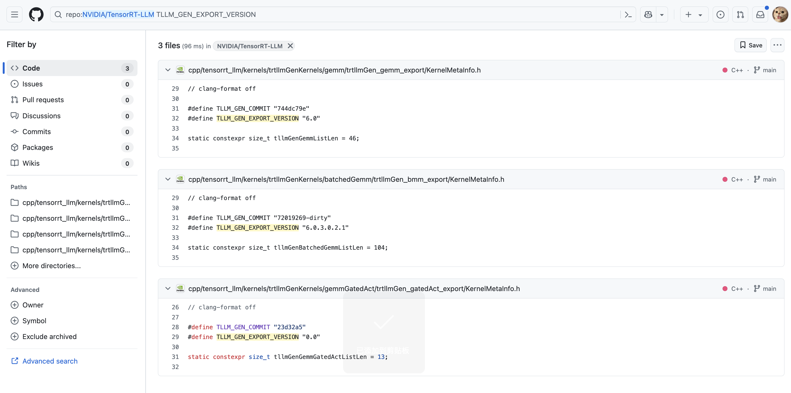
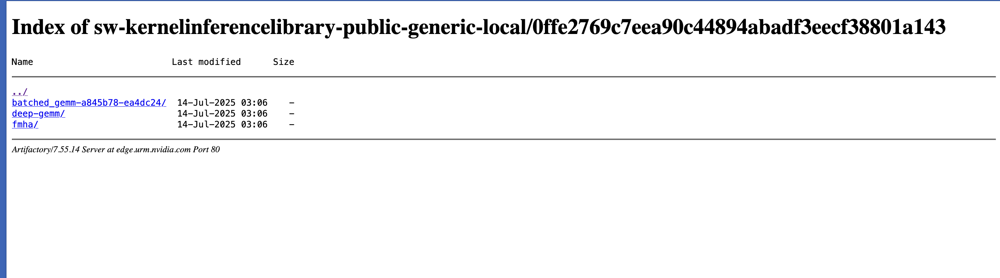
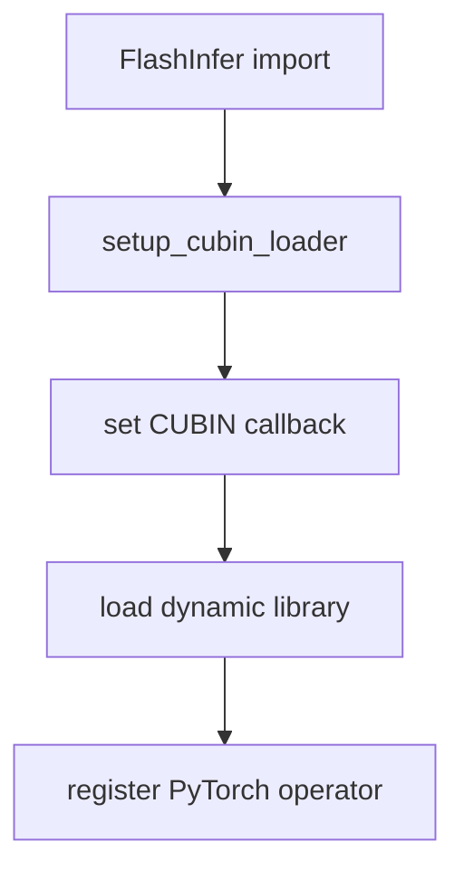
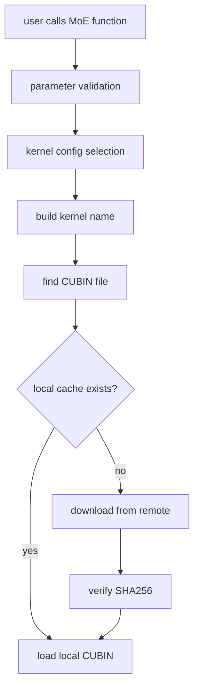
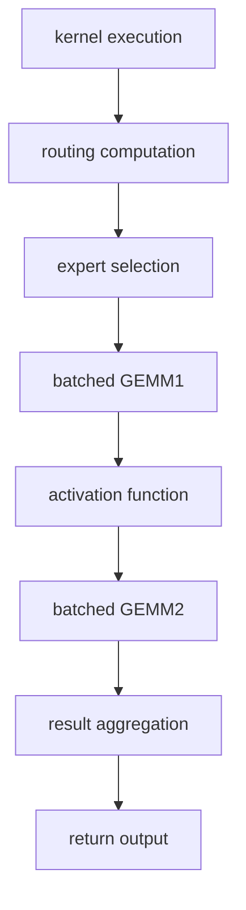

## 0x0. 서문

FlashInfer는 고성능 추론 프레임워크로서, 거대한 TensorRT-LLM 소스 코드를 직접 가져오지 않고도 우아한 통합 방식으로 TensorRT-LLM의 최적화 kernel을 자기 생태계에 매끄럽게 통합합니다. 여기서는 MoE 모듈을 예로 들어 FlashInfer가 TensorRT-LLM의 소스 코드와 CUBIN 파일을 어떻게 통합하는지 분석합니다. 사실 TensorRT-LLM에는 ds v3 low latency gemm 관련 kernel, 통신 관련 kernel처럼 비교적 독립적인 kernel이 많이 있습니다. 이런 kernel들은 오픈소스이며 cubin과 관련되지 않으므로 FlashInfer에 넣는 것이 상대적으로 쉽습니다. 여기서는 소스가 공개되지 않고 cubin 형태로 배포되는 kernel을 어떻게 통합하는지에만 집중합니다.

### 핵심 문제

- **TensorRT-LLM 소스 코드에 직접 의존하지 않으면서 그 최적화 kernel을 어떻게 사용할 것인가? 그리고 이 kernel들이 TensorRT-LLM Gen 시스템이 생성한 cubin에 의존하는 상황을 어떻게 처리할 것인가?**
- **많은 CUBIN 파일을 어떻게 동적으로 로드하고 관리할 것인가? 현재 소스 코드를 Huge하게 만들지 않으려면 어떻게 해야 하는가?**

### TensorRT-LLM Gen 시스템

TensorRT-LLM Gen은 NVIDIA가 개발한 코드 생성 시스템으로, 고도로 최적화된 CUDA kernel을 자동 생성하는 데 사용됩니다.



TensorRT-LLM의 github 저장소에서는 관련된 필드가 몇 개만 검색됩니다. 이 세 파일은 모두 Gen 시스템으로 생성된 template이지만, 구체적인 생성 script는 공개되어 있지 않습니다. 그래도 대략 이 필드들이 무엇을 의미하는지는 추측할 수 있습니다.

또한 Gen 시스템을 사용한 것은 Gemm, BatchGemm, MoE의 GemmGatedAct 모듈이라는 것을 볼 수 있습니다. 그 밖에도 MHA/MLA 모듈이 있을 것입니다. 이런 kernel들은 TensorRT-LLM의 moat에 해당하는 것으로 보입니다. 오픈소스 구현보다 성능이 강한 고도로 최적화된 구현이고, 마지막에 cubin 방식으로 배포하는 것도 이해할 수 있습니다. 아래는 Gen 시스템이 생성한 template 파일의 몇몇 필드 의미입니다.

- **버전 정보**: `TLLM_GEN_EXPORT_VERSION "6.0.3.0.2.1"`
- **commit hash**: `TLLM_GEN_COMMIT "c603ed2"`
- **config hash**: `TLLM_GEN_BATCHED_GEMM_CONFIG_HASH "65deb07"`

이 글은 FlashInfer가 TensorRT-LLM의 MoE 모듈을 통합한 것을 예로 들어 이 통합 기술을 탐색합니다. 흐름상 MoE 모듈에는 다음이 필요합니다.

- expert routing 계산
- batched matrix multiplication
- 여러 quantization format 지원(FP8, E4m3, E2m1 등)

## 0x1. 통합 아키텍처 설계

### 전체 아키텍처

```
FlashInfer Python API
    ↓
JIT compile layer (fused_moe.py)
    ↓  
CUDA kernel launcher (trtllm_fused_moe_kernel_launcher.cu)
    ↓
TRT-LLM kernel runner (trtllm_fused_moe_runner.cu)
    ↓
TRT-LLM kernel implementation (DevKernel.h, RoutingKernel.h, etc.)
    ↓
CUBIN dynamic loading and execution
```

### 계층 설계

위의 간단한 그림에서 이 통합 과정이 계층형 설계라는 것을 정리할 수 있습니다. 위에서 아래로 각각 다음과 같습니다.

1. **interface layer**: PyTorch 호환 API 제공
2. **scheduling layer**: kernel 선택과 파라미터 검증 관리
3. **execution layer**: routing과 MoE kernel 실행 조율
4. **loading layer**: CUBIN 파일 동적 관리

## 0x2. FlashInfer TRT-LLM MoE 모듈 소스 통합 기술

### 0x2.1 헤더 파일 통합

FlashInfer는 TensorRT-LLM의 핵심 헤더 파일을 자기 include 디렉터리에 직접 복사했습니다. 구체적으로는 다음을 포함합니다.

```cpp
// trtllm_fused_moe_kernel_launcher.cu 안
#include "flashinfer/trtllm/batched_gemm/trtllmGen_bmm_export/trtllm/gen/DtypeDecl.h"
#include "flashinfer/trtllm/fused_moe/DevKernel.h"
#include "flashinfer/trtllm/fused_moe/RoutingKernel.h"
#include "flashinfer/trtllm/batched_gemm/trtllmGen_bmm_export/BatchedGemmInterface.h"
```

대응 링크는 https://github.com/flashinfer-ai/flashinfer/tree/main/include/flashinfer/trtllm/fused_moe 와 https://github.com/flashinfer-ai/flashinfer/tree/main/include/flashinfer/trtllm/batched_gemm 입니다.

### 0x2.2 namespace 격리

이어서 FlashInfer는 TensorRT-LLM kernel에 대해 독립 namespace를 사용해 FlashInfer 자체 kernel과의 충돌을 피합니다. 예를 들어 csrc 아래의 fused moe kernel runner 구현 부분에는 `tensorrt_llm::kernels::trtllmGenFp8BlockScaleMoe ` namespace가 있고, cubin loading에는 `trtllm_cubin_loader` namespace가 있습니다. namespace 격리를 통해 FlashInfer 자체 kernel과의 충돌을 피할 수 있고, TensorRT-LLM의 kernel과도 충돌을 피할 수 있습니다.

### 0x2.3 핵심 소스 파일 훑어보기

FlashInfer는 5개의 핵심 CUDA 소스 파일을 통합했습니다.

| 파일 | 기능 | 역할 |
|------|------|------|
| `trtllm_fused_moe_kernel_launcher.cu` | PyTorch interface layer | 파라미터 검증, 메모리 관리, kernel scheduling |
| `trtllm_fused_moe_runner.cu` | fused moe kernel runner | routing과 MoE kernel 실행 조율 |
| `trtllm_fused_moe_routing_kernel.cu` | routing kernel | expert 선택과 load balancing |
| `trtllm_fused_moe_dev_kernel.cu` | device kernel | 저수준 CUDA kernel 구현 |
| `trtllm_batched_gemm_runner.cu` | Batched GEMM runner | matrix multiplication 최적화 |

## 0x3. CUBIN 동적 로딩 시스템

### 0x3.1 시스템 아키텍처

FlashInfer는 TensorRT-LLM의 `cubin.cpp` 파일을 직접 포함하지 않고, 혁신적인 동적 CUBIN loading system을 구현했습니다.

```cpp
// CUBIN loader callback mechanism
void (*callbackGetCubin)(const char* path, const char* sha256) = nullptr;

// Python callback setup
extern "C" void FlashInferSetCubinCallback(void (*callback)(const char* path, const char* sha256));

// API for getting CUBIN
std::string getCubin(const std::string& name, const std::string& sha256);
```

### 0x3.2 CUBIN 파일 경로를 얻는 구현

`BatchedGemmInterface.h`의 CUBIN 파일 구성 경로를 예로 들면 다음과 같습니다.

```cpp
const std::string pipeline_hash = "39b7e49bfedde88ea29bfdc2547cbba659f2b236";
const std::string cubin_path = pipeline_hash + "/" + std::string("batched_gemm-") +
                               TLLM_GEN_COMMIT + "-" + TLLM_GEN_BATCHED_GEMM_CONFIG_HASH + "/";
```

CUBIN 전체 경로 형식은 다음과 같습니다.

```
{pipeline_hash}/batched_gemm-{TLLM_GEN_COMMIT}-{TLLM_GEN_BATCHED_GEMM_CONFIG_HASH}/{kernel_name}
```

실제 예:

```
39b7e49bfedde88ea29bfdc2547cbba659f2b236/batched_gemm-c603ed2-65deb07/Bmm_Bfloat16_E2m1E2m1_Fp32_t128x16x256_et128x16_m128x16x64_cga1x1x1_16dp256b_s6_TN_transOut_schedP_bN_dynBatch_sm100a.cubin
```

이 코드는 https://github.com/flashinfer-ai/flashinfer/blob/main/include/flashinfer/trtllm/batched_gemm/trtllmGen_bmm_export/BatchedGemmInterface.h#L642-L658 에 대응합니다.

```c++

#ifdef TLLM_GEN_EXPORT_INTERFACE
  CUmodule cuModule;
  CUfunction cuFunction;

  auto fiModuleLoadData = [&](CUmodule* module) {
    const std::string sha256 = config.mHash ? config.mHash : "";
    const std::string pipeline_hash = "39b7e49bfedde88ea29bfdc2547cbba659f2b236";
    const std::string cubin_path = pipeline_hash + "/" + std::string("batched_gemm-") +
                                   TLLM_GEN_COMMIT + "-" + TLLM_GEN_BATCHED_GEMM_CONFIG_HASH + "/";
    std::string fname_cubin = config.mFunctionName;
    if (!fname_cubin.empty()) {
      fname_cubin[0] = static_cast<char>(std::toupper(static_cast<unsigned char>(fname_cubin[0])));
    }
    fname_cubin = cubin_path + fname_cubin;
    std::string cubin = flashinfer::trtllm_cubin_loader::getCubin(fname_cubin, sha256);
    cuModuleLoadData(&cuModule, cubin.c_str());
  };
```

### 0x3.3 remote repository 관리

FlashInfer는 NVIDIA Artifactory repository에서 CUBIN 파일을 가져옵니다.

```python
FLASHINFER_CUBINS_REPOSITORY = os.environ.get(
    "FLASHINFER_CUBINS_REPOSITORY",
    "https://edge.urm.nvidia.com/artifactory/sw-kernelinferencelibrary-public-generic-local/"
)
```

이 cubin remote repository 스크린샷에서 해당 commit 아래 어떤 cubin 파일을 다운로드할 수 있는지 볼 수 있습니다.



### 0x3.4 FlashInfer cubin cache 메커니즘

```python
def get_cubin(name, sha256, file_extension=".cubin"):
    cubin_fname = name + file_extension
    cubin_path = FLASHINFER_CACHE_DIR / "cubins" / cubin_fname
    
    # 1. local cache에서 loading 시도
    cubin = load_cubin(cubin_path, sha256)
    if cubin:
        return cubin
    
    # 2. remote repository에서 다운로드
    uri = FLASHINFER_CUBINS_REPOSITORY + "/" + cubin_fname
    download_file(uri, cubin_path)
    return load_cubin(cubin_path, sha256)
```

## 0x4. 핵심 컴포넌트 분석

### 0x4.1 JIT compile system 컴포넌트

#### setup_cubin_loader 기능

코드 위치: https://github.com/flashinfer-ai/flashinfer/blob/main/flashinfer/jit/cubin_loader.py#L170

```python
def setup_cubin_loader(dll_path: str):
    _LIB = ctypes.CDLL(dll_path)
    
    def get_cubin_callback(name, sha256):
        cubin = get_cubin(name.decode("utf-8"), sha256.decode("utf-8"))
        _LIB.FlashInferSetCurrentCubin(
            convert_to_ctypes_char_p(cubin), ctypes.c_int(len(cubin))
        )
    
    cb = CALLBACK_TYPE(get_cubin_callback)
    _LIB.FlashInferSetCubinCallback(cb)
```

**기능:**

- CUBIN loading callback 함수 설정
- 동적 라이브러리 loading 관리
- Python과 C++의 interface 처리

#### `module.build_and_load` 기능

코드 위치: https://github.com/flashinfer-ai/flashinfer/blob/main/flashinfer/jit/core.py#L117-L130

```python
def build_and_load(self, class_name: str = None):
    if self.aot_path.exists():
        so_path = self.aot_path
    else:
        so_path = self.jit_library_path
        self.build(verbose)
    
    load_class = class_name is not None
    loader = torch.classes if load_class else torch.ops
    loader.load_library(so_path)
    
    if load_class:
        cls = torch._C._get_custom_class_python_wrapper(self.name, class_name)
        return cls
    return getattr(loader, self.name)
```

**기능:**

- CUDA source를 compile해 dynamic library 생성
- dynamic library를 PyTorch로 load
- 호출 가능한 operator 또는 class 반환

### 0x4.2 kernel configuration system(Batched GEMM 예시)

#### 데이터 타입 지원

코드 대응: https://github.com/flashinfer-ai/flashinfer/blob/main/include/flashinfer/trtllm/batched_gemm/trtllmGen_bmm_export/trtllm/gen/DtypeDecl.h#L43

```cpp
enum class Dtype : uint32_t {
    Bfloat16, E2m1, E2m3, E3m2, E4m3, E5m2, Fp16, Fp32, 
    Int8, Int32, Int64, MxE2m1, MxE4m3, UE8m0, ...
};
```

#### kernel naming convention

kernel 이름은 완전한 configuration 정보를 포함합니다. Batched GEMM을 예로 들면 다음과 같습니다.

```
Bmm_{InputType}_{WeightType}_{OutputType}_t{TileSize}_et{EpilogueTile}_m{MmaTile}_cga{ClusterGridArray}_{Stages}_{Transpose}_{Schedule}_{BatchMode}_{Architecture}
```

**예시 해석:**

- `Bmm_Bfloat16_E2m1E2m1_Fp32`: 입력 BFloat16, weight E2m1, 출력 FP32
- `t128x16x256`: Tile size 128x16x256
- `schedP`: parallel scheduling strategy
- `bN`: batch N dimension
- `sm100a`: SM100 architecture(H200/H100)

### 0x4.3 MoE kernel 구현

#### routing kernel

코드 위치: https://github.com/flashinfer-ai/flashinfer/blob/main/csrc/trtllm_fused_moe_kernel_launcher.cu#L179

```cpp
tensorrt_llm::kernels::trtllmGenFp8BlockScaleMoe::Routing::Runner routing_runner(tile_tokens_dim);
routing_runner.run(
    args.routing_logits, args.routing_bias, args.num_tokens, args.num_experts, args.top_k,
    args.n_group, args.topk_group, args.local_expert_offset, args.local_num_experts,
    args.routed_scaling_factor, expert_indexes.data_ptr<int>(),
    expert_count_histogram.data_ptr<int>(), total_num_padded_tokens.data_ptr<int>(),
    // ... other parameters
);
```

#### Batched GEMM kernel

코드 위치: https://github.com/flashinfer-ai/flashinfer/blob/main/include/flashinfer/trtllm/batched_gemm/trtllmGen_bmm_export/BatchedGemmInterface.h#L701

```cpp
auto result = trtllm::gen::launchKernel(
    (void*)&kernelParams, cudaStream, config.mSharedMemSize, cuFunction, block3, grid3, cluster3,
    usePdl && (config.mOptions.mGridWaitForPrimaryEarlyExit |
               config.mOptions.mGridWaitForPrimaryA | config.mOptions.mGridWaitForPrimaryB));
```

## 0x5. workflow 상세 설명

### 0x5.1 초기화 단계



### 0x5.2 kernel 선택 단계



### 0x5.3 실행 단계



### 0x5.4 구체적 구현 예시

#### trtllm_gen_fused_moe 모듈

코드 위치: https://github.com/flashinfer-ai/flashinfer/blob/main/flashinfer/fused_moe.py#L698-L774

```python
def trtllm_gen_fused_moe_sm100_module():
    return JitSpec(
        name="trtllm_gen_fused_moe_sm100",
        cuda_sources=[
            "trtllm_fused_moe_kernel_launcher.cu",
            "trtllm_fused_moe_runner.cu", 
            "trtllm_fused_moe_routing_kernel.cu",
            "trtllm_fused_moe_dev_kernel.cu",
            "trtllm_batched_gemm_runner.cu"
        ],
        cuda_include_dirs=[
            "include/flashinfer/trtllm/batched_gemm/trtllmGen_bmm_export",
            "include/flashinfer/trtllm/fused_moe",
            "include/flashinfer/trtllm/common",
            "include/flashinfer/trtllm/fmha",
            "csrc/nv_internal"
        ]
    )

@functools.cache
def get_trtllm_moe_sm100_module():
    module = trtllm_gen_fused_moe_sm100_module()
    moe_op = module.build_and_load()
    setup_cubin_loader(str(module.get_library_path()))

    @register_custom_op(
        "flashinfer::trtllm_fp8_per_tensor_scale_moe",
        mutates_args=(""),
    )
    def trtllm_fp8_per_tensor_scale_moe_op(
        routing_logits: torch.Tensor,
        routing_bias: torch.Tensor,
        hidden_states: torch.Tensor,
        gemm1_weights: torch.Tensor,
        output1_scales_scalar: torch.Tensor,
        output1_scales_gate_scalar: torch.Tensor,
        gemm2_weights: torch.Tensor,
        output2_scales_scalar: torch.Tensor,
        num_experts: int,
        top_k: int,
        n_group: int,
        topk_group: int,
        intermediate_size: int,
        local_expert_offset: int,
        local_num_experts: int,
        routed_scaling_factor: float,
        use_routing_scales_on_input: bool,
        tile_tokens_dim: int = 8,
        routing_method_type: int = 0,
    ) -> torch.Tensor:

        # Call the C++ function
        output = moe_op.trtllm_fp8_per_tensor_scale_moe(
            routing_logits,
            routing_bias,
            hidden_states,
            gemm1_weights,
            output1_scales_scalar,
            output1_scales_gate_scalar,
            gemm2_weights,
            output2_scales_scalar,
            num_experts,
            top_k,
            n_group,
            topk_group,
            intermediate_size,
            local_expert_offset,
            local_num_experts,
            routed_scaling_factor,
            use_routing_scales_on_input,
            tile_tokens_dim,
            routing_method_type,
        )
        return output
```

# 0x6. 정리

이상은 FlashInfer가 TensorRT-LLM kernel을 통합하는 기술에 대한 제 분석입니다. 이런 통합 방식은 TensorRT-LLM 소스 코드에 직접 의존하는 일을 피할 수 있고, 동시에 많은 CUBIN 파일을 동적으로 load하고 관리할 수 있게 해 줍니다. 그 결과 현재 소스 코드는 JIT compile 이전에 너무 커지지 않습니다.
