# TensorRT-LLM의 Hopper Mixed GEMM CUTLASS 3.x 구현 해설

> 이 강연은 CUTLASS 3.x 스타일의 코드를 사용하여 Hopper 아키텍처에서 FPA+INTB 혼합 정밀도 행렬 곱셈을 구현하는 방법을 소개한다. 내용은 다음과 같다: 1. CuTe를 사용한 데이터 전송. 2. FPA+INTB 행렬 곱셈 사례 해설. Slides는 BiliBili NVIDIA 영인다 채널에 업로드된 《TensorRT-LLM 中的 Hopper Mixed GEMM 的 CUTLASS 3.x 实现讲解》 영상 강의에서 가져왔다. 영상을 참고하여 각 페이지 Slides의 요점을 더 상세하게 기록하였으며, 이 영상을 통해 CuTe의 기본 개념과 CuTe로 GEMM 데이터 흐름을 구현하는 방법, 그리고 더 높은 수준에서 CUTLASS 3.x가 Mixed GEMM을 어떻게 구현하는지를 파악한다.

## 전체 개요 및 목차

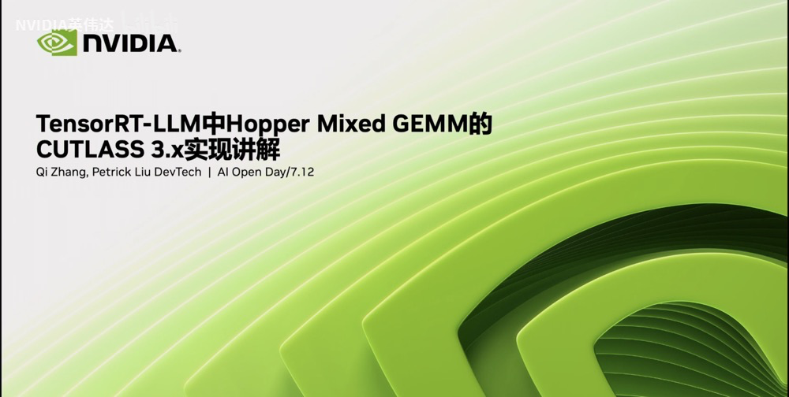

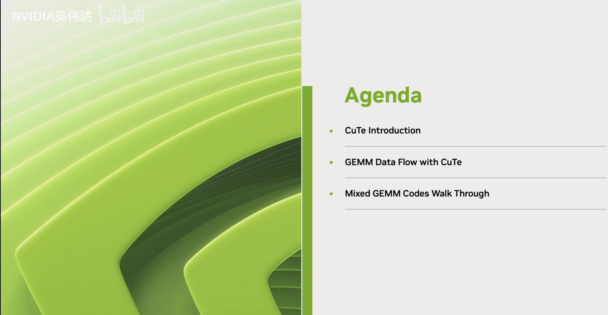

이 강연은 크게 세 부분으로 나뉜다. 먼저 CuTe 소개, 다음으로 GEMM 데이터 전송을 예시로 CuTe를 어떻게 활용하는지 보여준다. 이 두 절을 배치한 이유는, CUTLASS 3.x의 하위 구현에서 데이터의 각 레벨 관리든 실제 GEMM 연산 수행이든 모두 CuTe API를 대량으로 사용하기 때문이다. CUTLASS에 익숙하지 않은 개발자는 CuTe를 처음 보면 낯설 수 있으므로 소개하는 것이다. 마지막으로 Mixed GEMM의 CUTLASS 3.x 구현을 구체적으로 살펴본다.

## CuTe 소개

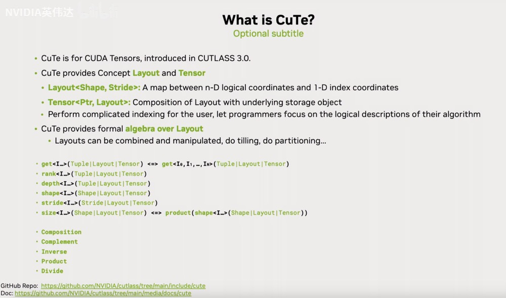

CuTe는 CUDA Tensor 연산을 관리하는 도구 라이브러리로, 가장 핵심적인 개념은 **Layout**과 **Tensor**이다. Layout은 **Shape**와 **Stride** 두 개념으로 구성되며, N차원 논리 좌표를 실제 1차원 연속 인덱스로 매핑하는 함수로 이해할 수 있다. Layout이 있으면, 실제 메모리 포인터를 Tensor의 템플릿 파라미터에 전달하여 실제 Tensor를 구성한다. 동일한 메모리 포인터가 가리키는 연속 공간에 서로 다른 Layout을 부여하면 다른 시각의 Tensor를 얻을 수 있어, CuTe에 큰 유연성을 제공하고 복잡한 인덱싱 문제를 처리할 수 있게 한다.

CuTe는 Layout에 대한 형식 대수 연산을 제공한다: Layout은 결합, 조작, tiling, 분할 등의 연산이 가능하다.

CuTe는 다양한 API를 제공하는데, 기본 변환 API가 포함된다. 여기서는 get, rank, depth, shape, stride, size 등 몇 가지 CuTe 연산 함수를 나열하였다. 마지막으로 Slides에서는 Composition(조합), Complement(보집합), Inverse(역), Product(곱), Divide(나눗셈) 등 몇 가지 관련 개념을 언급하였다. 이 Slides의 마지막 링크는 CuTe 공식 문서로, CuTe 개념 및 API 소개가 더 상세하게 나와 있다.

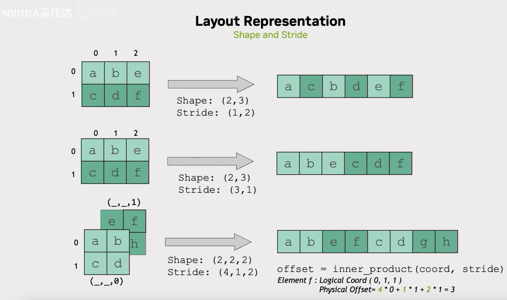

이 Slides는 CUDA 텐서 연산에서 Layout의 표현 방법을 해설하며, 주로 Shape(형태)과 Stride(보폭)으로 설명한다. 주요 내용은 다음과 같다:
- Layout 표현: Shape와 Stride로 다차원 배열의 메모리 내 배열 방식을 정의한다.
- 세 가지 예시로 서로 다른 Layout을 보여준다:
    - a. 첫 번째 예시:
        - Shape: (2,3)
        - Stride: (1,2)
        - 2x3 행렬을 행 우선 순서로 메모리에 저장하는 방법을 보여준다.
    - b. 두 번째 예시:
        - Shape: (2,3)
        - Stride: (3,1)
        - 동일한 2x3 행렬을 열 우선 순서로 저장하는 방법을 보여준다.
    - c. 세 번째 예시:
        - Shape: (2,2,2)
        - Stride: (4,1,2)
        - 3차원 배열의 Layout을 보여준다.
    - 오프셋 계산:
        - 공식 사용: offset = inner_product(coord, stride)
        - 예를 들어 원소 f의 경우, 논리 좌표가 (0,1,1)이면 물리 오프셋은 4×0 + 1×1 + 2×1 = 3으로 계산된다.

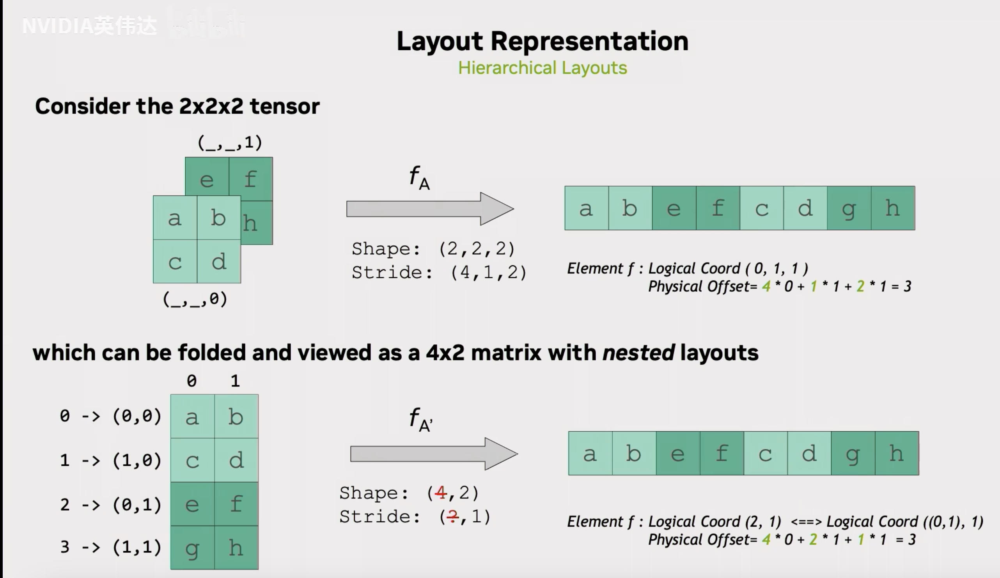

아까의 3차원 예시를 다시 보면, 이것을 두 개의 2x2 행렬로 볼 수 있고, 뒤의 행렬을 앞 행렬 아래에 놓을 수도 있다. 그렇게 하면 4x2의 2차원 행렬이 되는데, shape은 4x2라 볼 수 있지만 여기서 4를 직접 쓸 수 없다. ac/ce/eg 사이의 거리가 일정하지 않기 때문에 4로 쓰면 하나의 숫자로 행렬의 Stride를 표현할 수 없기 때문이다. a와 c 사이, e와 g 사이의 거리는 모두 4이고, a와 e, c와 g 사이의 거리는 모두 2임에 주목하라. 따라서 중첩된 표현이 필요하다. 아래 그림의 빨간 부분처럼:

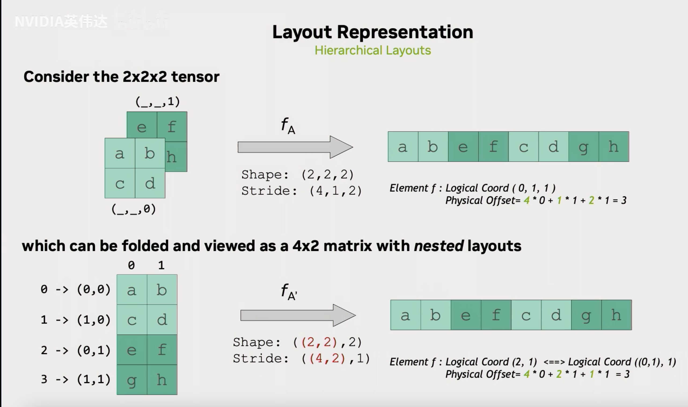

이 4x2 행렬의 첫 번째 차원 Shape를 (2,2)로, Stride를 (4,2)로 써야 한다. Slides 왼쪽 하단 그림을 참고하면, 수평 방향으로 각 원소에 2개의 하위 원소가 있고 각 하위 원소 사이의 거리가 4이므로 첫 번째 Stride는 4이고, z 방향으로 두 번 반복되므로 두 번째 Stride는 2이다. 따라서 중첩 형태로 더 복잡한 Layout 예시를 표현할 수 있다.

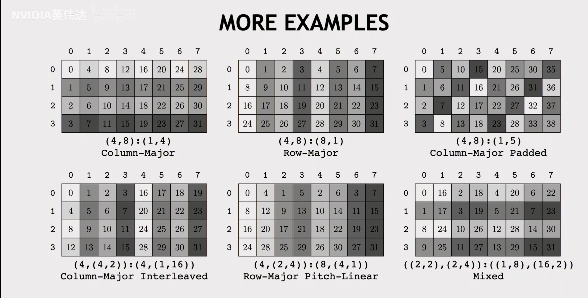

이 Slides는 다양한 Layout을 보여준다. 각 Layout에는 고유한 용도와 장점이 있다. 각 Layout에 대한 간략한 설명은 다음과 같다:
- Column-Major (열 우선):
    - 형태: (4,8), 보폭: (1,4)
    - 데이터를 열 단위로 저장하며, 각 열이 연속적이다.
- Row-Major (행 우선):
    - 형태: (4,8), 보폭: (8,1)
    - 데이터를 행 단위로 저장하며, 각 행이 연속적이다.
- Column-Major Padded (패딩 있는 열 우선):
    - 형태: (4,8), 보폭: (1,5)
    - 열 우선과 유사하지만 각 열 사이에 추가 패딩 공간이 있다.
- Column-Major Interleaved (인터리브 열 우선):
    - 형태: (4,(4,2)), 보폭: (4,(1,16))
    - 2x2 소블록 단위로 열 우선 저장한다.
- Row-Major Pitch-Linear (피치 선형 행 우선):
    - 형태: (4,(2,4)), 보폭: (8,(4,1))
    - 행 우선 저장이지만 각 행 사이에 추가 간격이 있을 수 있다.
- Mixed (혼합):
    - 형태: ((2,2),(2,4)), 보폭: ((1,8),(16,2))
    - 여러 Layout 특성을 결합하여 복잡한 중첩 구조를 형성한다.

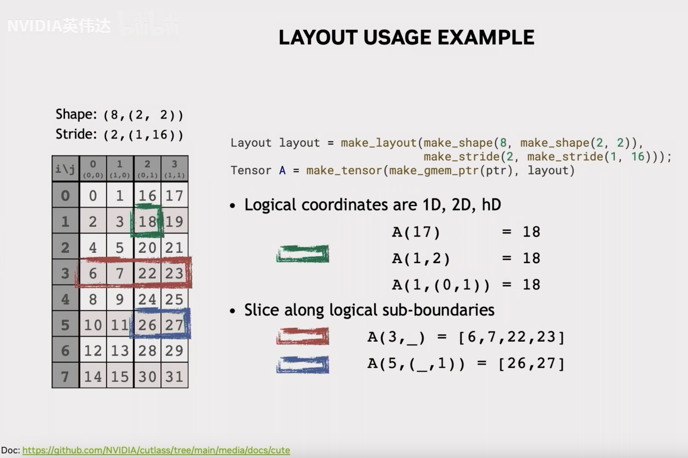

이 Slides는 CUTLASS 3.x에서 CuTe의 사용 예시를 소개한다. 주요 내용은 다음과 같다:

- 제목은 "LAYOUT USAGE EXAMPLE"(Layout 사용 예시)이다.
- Shape가 (8, (2, 2))이고 Stride가 (2, (1, 16))인 레이아웃을 정의한다.
- CuTe에서 `make_layout` 함수로 레이아웃을 생성하고, `make_tensor` 함수로 텐서를 생성하는 방법을 보여준다.
- 8x4 행렬 그림으로 원소의 메모리 내 배열을 보여준다.
- 논리 좌표가 1D, 2D, hD(고차원)임을 설명한다.
- 텐서 원소 접근 예시:
    - A(17) = 18
    - A(1,2) = 18
    - A(1,(0,1)) = 18
- 논리 하위 경계를 따라 슬라이싱하는 방법:
    - A(3,_) = [6,7,22,23]
    - A(5,(_,1)) = [26,27]
- 그림에서 서로 다른 색상으로 이 접근 및 슬라이싱 연산에 해당하는 행렬 영역을 표시하였다.

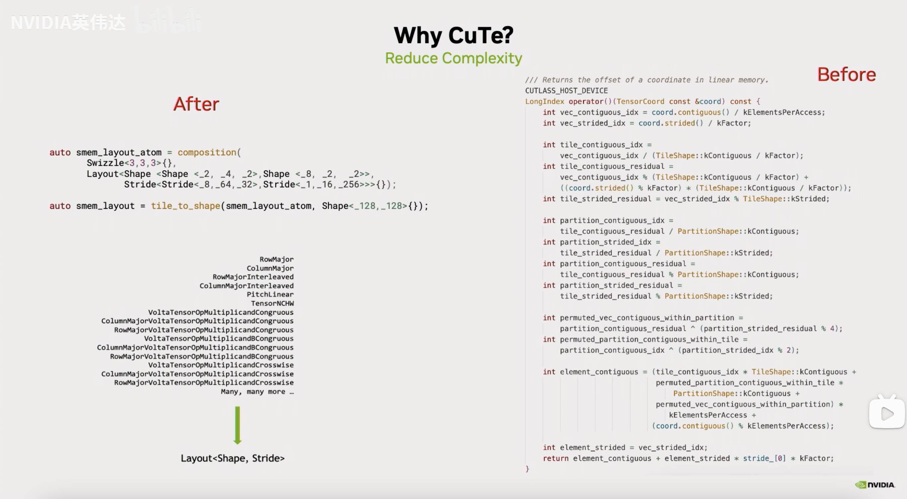

이 Slides는 CuTe가 필요한 이유를 이해하는 데 도움을 준다. CuTe 이전(CUTLASS 2.x)에는 주소 변환을 구현하는 데 Slides 오른쪽에 보이는 것처럼 많은 코드가 필요했고, 각 줄의 역할을 이해해야 했다. CuTe가 있으면 Slides 왼쪽의 몇 줄 코드만으로 완료할 수 있다. 또한 CUTLASS 2.x에서는 Layout을 정의할 때 각각 자체 구현이 필요했지만, 이제는 Shape와 Stride만으로 원하는 어떤 Layout도 얻을 수 있다.

## GEMM Data Flow with Cute

다음으로 GEMM에서 CuTe로 데이터 전송을 어떻게 하는지 살펴본다.

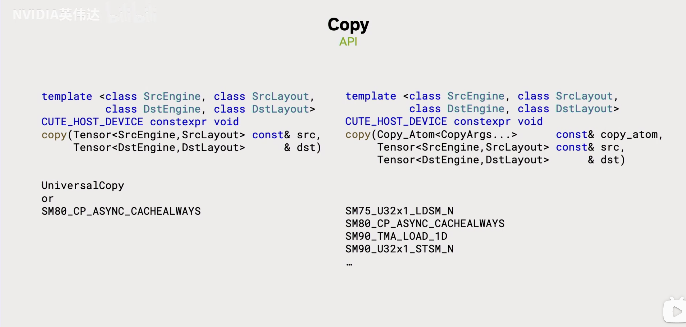

GEMM 데이터 전송을 설명하기 전에 Copy API에 대해 먼저 설명할 필요가 있다. 이 API는 CuTe로 데이터 전송을 할 때 반드시 사용하게 된다. 왼쪽 API는 비교적 단순한데, src Tensor와 dst Tensor를 전달하면 데이터 복사를 완료하며, GPU 아키텍처와 데이터 저장 위치에 따라 자동으로 UniversalCopy 또는 SM80_CP_ASYNC_CACHEALWAYS를 선택한다. 이 두 가지 중 하나를 선택하는데, 더 나은 성능을 원한다면 오른쪽 API를 사용하는 것이 좋다. 오른쪽 copy API는 첫 번째 파라미터에 copy_atom을 명시적으로 지정해야 한다. 이는 CuTe가 다양한 아키텍처의 데이터 전송 명령어를 캡슐화한 것이다. 여기에는 서로 다른 아키텍처의 데이터 전송 명령어가 나열되어 있으며, 두 번째 API를 사용하려면 각 명령어의 역할과 사용 시나리오를 이해해야 한다. 또한 copy의 대상이 Tensor이므로, 특수한 Layout을 사용하여 데이터 복사 외의 다른 변환 효과를 달성할 수 있다.

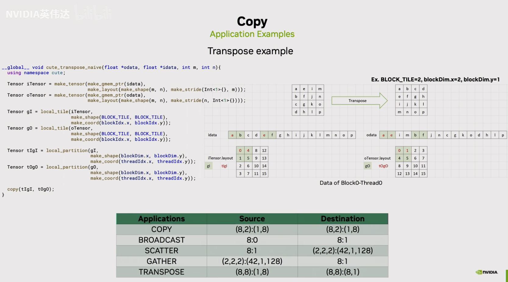

이 Slides는 Copy로 행렬 전치를 수행하는 간단한 예시를 들고 있다. 최적 성능 구현은 아니지만 CuTe의 매력을 볼 수 있다. 오른쪽 위 두 그림은 각각 논리와 물리 관점에서 행렬 전치가 무엇을 하는지 보여준다. 물리 관점에서 보면 abcd...->aeim... 순서로 바꾸는 것이다. Tensor를 구성할 때 iTensor와 oTensor의 shape을 모두 mxn으로 같게 하되, iTensor를 읽을 때 Column Major 방식으로 읽도록 Stride를 (1, m)으로 구성한다. 오른쪽 그림에는 iTensor.layout도 그려져 있으며, Row Major 방식으로 쓰면 전치 효과를 얻을 수 있으므로 oTensor의 stride는 (n, 1)이 된다.

이 단계에서 Tile/Partition 관련 코드를 보지 않고 COPY를 직접 호출하면 전치가 완료된다. 이제 병렬화하려면 서로 다른 Block과 Thread가 서로 다른 영역의 행렬 전치를 담당해야 한다. 따라서 local_tile을 호출하여 서로 다른 Block에 담당 영역을 할당하고, local_partition으로 Block 내 각 Thread에 영역을 할당한다.

코드의 local_tile에는 세 개의 파라미터가 있다. 첫 번째는 분할할 Tensor(여기서는 iTensor), 두 번째는 Block 크기(예시에서는 BLOCK_TILE을 2로 설정했는데, 실제로는 이렇게 작을 수 없고 이해를 돕기 위한 것), 세 번째는 현재 Block의 좌표를 전달한다. 이렇게 local_tile API를 통해 gI Tensor를 얻을 수 있으며, 현재 Block(Block 0)이 담당하는 영역을 가져올 수 있다. 오른쪽 그림에서 초록색으로 표시된 원소들, 즉 왼쪽 상단의 2x2 소행렬이 해당된다. 이 전치 작업을 완료하려면 총 4개의 Block이 필요하다.

Block에 필요한 Tile을 얻은 후, local_partition에 전달한다. 첫 번째 파라미터는 local_tile로 얻은 Tensor, 두 번째 파라미터는 Block 내 thread 배치(예시에서 blockDim.x=2, blockDim.y=1), 이것도 예시용이다. 이렇게 Tile이 2x2이고 thread 배치가 2x1이면, 하나의 thread가 1x2 Tile을 담당한다. Slides의 빨간 부분은 0번 Block의 0번 thread가 담당하는 데이터를 나타낸다. copy를 호출하면 병렬 복사가 이루어진다. 이 예시에서 0번 thread는 오프셋이 0인 idata(즉 a)를 odata의 오프셋 0 위치로 복사하고, 1번 thread는 오프셋이 4인 idata(즉 e)를 odata의 오프셋 1 위치로 복사한다.

Slides 하단의 표는 Layout을 통해 COPY, BROADCAST, GATHER 등의 연산도 수행할 수 있음을 보여준다. 또한 이러한 연산을 수행할 때 왼쪽의 구현 코드를 거의 수정할 필요 없이, Layout만 원하는 형태로 바꾸면 된다.

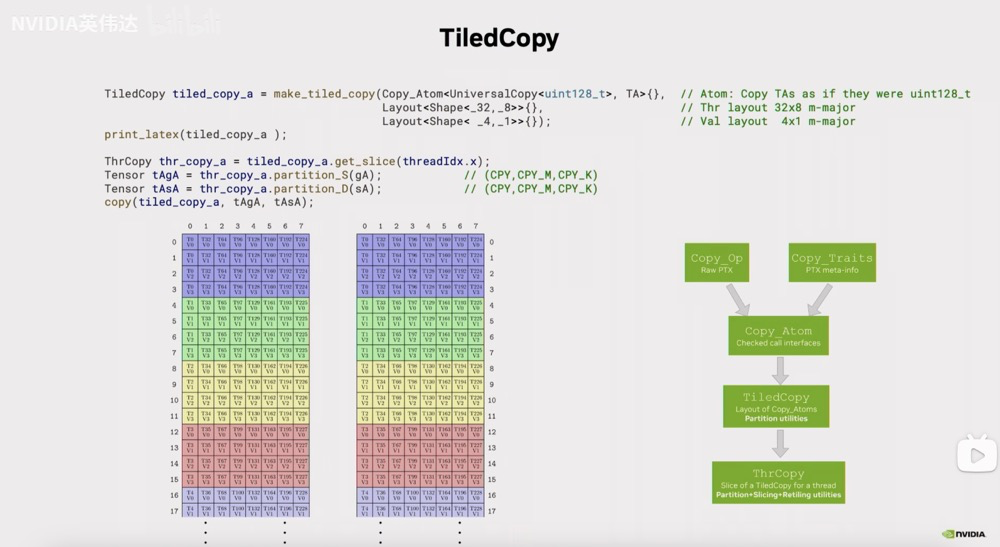

TiledCopy는 Tile 단위로 Copy할 때 source/dest tensor를 구성하는 데 사용하는 것이다. MMA도 서로 다른 MMA 구현에 서로 다른 Tile 형태가 필요하여 TiledCopy를 사용한다. TiledCopy를 구성하려면 `make_tiled_copy` API를 사용해야 한다. 첫 번째 파라미터는 Copy_Atom, 두 번째 파라미터는 Dest Tensor의 Stride Layout, 세 번째 파라미터는 Dest Tensor의 Value Layout이다.

Value Layout은 이해하기 어려울 수 있으므로, `print_latex`으로 구성한 TiledCopy를 출력하면 Slides 하단의 그림처럼 나온다. 가장 왼쪽 그림은 각 thread가 Source Tensor에서 읽는 데이터가 어떤 것인지 보여준다. 예를 들어 T0는 열 방향의 첫 4개 데이터를 읽고, T1은 열 방향의 다음 4개를 읽는다. 오른쪽 그림은 Dest Tensor에서 각 Thread가 쓸 데이터 위치를 보여주며, 이 예시에서는 읽기 Tensor와 위치가 같다.

이 그림을 통해 코드를 이해하면: 32x8은 thread가 M 방향으로 32개, K 방향으로 8개임을 의미한다. Value Layout의 4x1은 M 방향으로 연속 4개의 데이터를 읽고, K 방향으로는 1개만 읽는다는 의미다. 따라서 구성된 TiledCopy의 기본 Copy 단위는 (32×4, 8×1) = (128, 8)의 Tile이다.

TiledCopy를 얻은 후, 먼저 `get_slice`에 현재 thread 번호를 전달하면 현재 thread가 Copy해야 할 Tile을 나타내는 Thread Copy를 얻는다. 그런 다음 `partition_S`를 호출하고 Source Tensor를 전달하면 현재 thread가 복사를 담당하는 Source Tensor의 데이터가 무엇인지 바로 얻을 수 있다. Shape은 CPY_M과 CPY_K이며, CPY는 앞서 말한 128×8의 Tile 크기이고, CPY_M과 CPY_K는 M 방향과 K 방향에서 각각 이 횟수만큼 Copy해야 gA Tensor를 완전히 복사할 수 있음을 나타낸다. 마찬가지로 Dest Tensor에 대해서는 `partition_D`를 호출하면 (CPY, CPY_M, CPY_N) shape의 Tensor를 얻을 수 있고, copy API를 호출하면 된다.

가장 오른쪽 그림은 TiledCopy의 캡슐화 계층을 보여준다. 가장 하위에 Copy_Op와 Copy_Traits 두 개념이 있는데, Copy_Op는 하위 데이터 전송 명령어로 PTX 코드이며, Copy_Traits는 thread Layout 등 코드의 메타정보다. 이 두 가지로 가장 많이 사용하는 Copy_Atom을 캡슐화하고, CopyAtom에서 TiledCopy를 캡슐화한다. Source Tensor와 Dest Tensor를 분할할 때는 `get_slice`로 ThreadCopy를 얻어 분할한다.

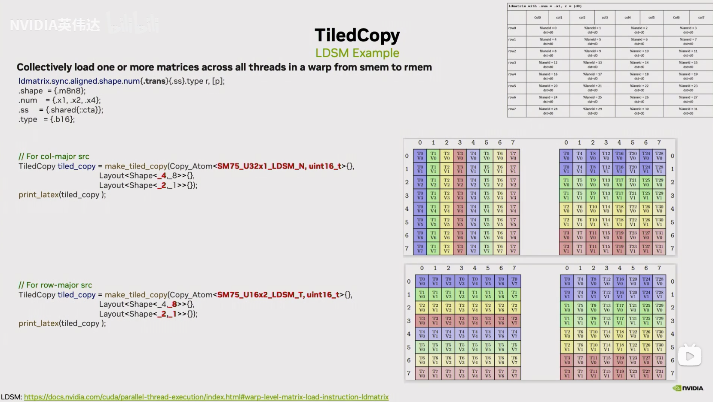

TiledCopy를 구성할 때 Thread Layout과 Value Layout은 어떻게 설정해야 할까? 이는 Copy_Atom의 명령어와 관련이 있다. 여기서는 LDSM 예시를 들어 파라미터를 어떻게 설정하는지 보여준다. LDSM은 `ld.matrix` 명령어로, warp 단위로 1개/2개/4개의 8x8 행렬을 load하는 명령어다. 이 명령어에는 Trans와 non-Trans 두 가지 형태가 있다. CuTe에서는 LDSM_ 접미사로 캡슐화하며, LDSM_N은 non-Trans 유형을 나타낸다. non-Trans 유형의 경우 Copy_Atom을 출력하면, non-Trans는 Source Thread가 연속된 열의 데이터를 읽고 Dest의 Thread는 연속된 열에서 2개의 원소를 가져옴을 알 수 있다.
Trans 유형의 경우, Source의 한 thread는 여전히 연속된 8개의 원소를 가져오지만, Dest에서는 Source의 한 thread의 연속 8개 원소가 8개의 서로 다른 thread에 분배되며, 한 thread의 원소는 두 개의 서로 다른 Source thread에서 온다. non-Trans 유형을 사용하는 경우 Layout에 반드시 col-major를 전달해야 하고, Trans 유형은 반드시 row-major Source Tensor가 필요하다.

다음으로 Stride/Value Layout 설정을 보면, 이는 Warp 수준의 명령어이므로 thread 수가 반드시 32의 배수여야 한다. non-Trans의 경우를 먼저 보면, Dest Tensor에서 m 방향으로 4개의 thread가 연속 8개의 데이터를 담당하는데, 이는 Thread Layout이 반드시 4의 배수여야 하고 M 방향에서 반드시 2개의 연속 데이터를 가져와야 함을 의미한다. 또한 Thread Layout의 빨간색으로 표시되지 않은 다른 숫자는 확대할 수 있어 더 큰 Tile을 얻을 수 있다.

마찬가지로 Trans 유형의 경우, 연속 8개의 데이터가 8개의 서로 다른 thread에 분배되고 각 thread가 1개의 데이터를 가져가므로, K 차원에서 thread는 반드시 8의 배수여야 하고 K 방향의 Value Layout은 반드시 1이어야 한다. 그리고 M 방향의 Value Layout은 2인데, 여기서 Dest Tensor의 어떤 thread가 M 방향에서 가져가는 2개의 데이터는 연속적이지 않다.

> TiledCopy는 다소 혼란스러웠으므로, reed님의 CuTe 글을 학습하는 것을 권장한다.

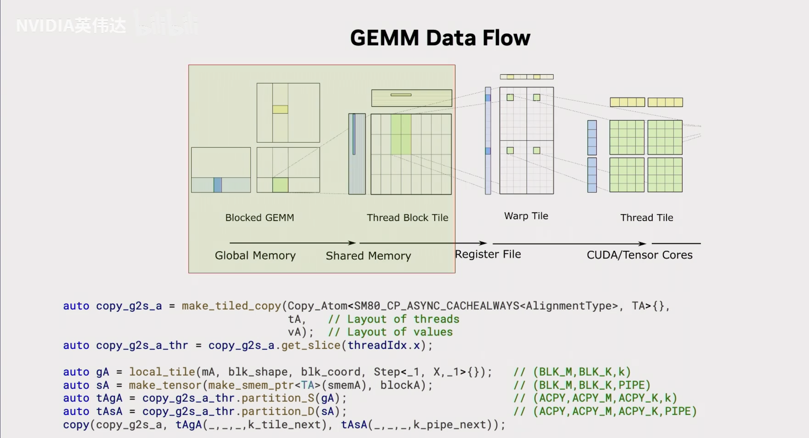

다음으로 GEMM에서 데이터 전송이 어떻게 이루어지는지 살펴본다. 행렬 A를 예시로 Global Memory에서 Shared Memory로 데이터를 어떻게 전송하는지 생각해본다.

먼저 `make_tiled_copy`로 TiledCopy를 구성하고, `get_slice`로 해당 Thread Copy를 얻는다. 다음으로 Copy의 Source Tensor를 구성하는데, 이때 Source Tensor는 Global Memory에서 온다. 그리고 Block 형태로 Shared Memory에 복사해야 하므로 `local_tile` 명령어가 필요하다. 첫 번째 파라미터는 Global Memory의 Tensor mA이며, Block Shape/Thread를 전달한다. Step은 `<_1, X, _1>{}` 인데, CUTLASS에서 Block을 M, N, K 3차원 구조로 쓰기 때문에, A에는 N 차원이 없으므로 X로 설정하여 이 차원이 계산에 참여하지 않음을 나타낸다. 이 `local_tile`을 통해 gA를 얻으며, 이것이 현재 Block이 담당하는 Source Tensor 표현이다. Shape은 (BLK_M, BLK_K, k)인데, BLK_M과 BLK_K는 이 Tile의 Shape이며, k는 이 Shape의 Tile을 총 k번 복사해야 함을 나타낸다. Dest Tensor를 구성할 때, Dest Tensor가 Shared Memory에 있으므로 `make_tensor`를 직접 사용하면 된다. 여기서 gA와 sA는 현재 Block이 담당하는 데이터 영역을 가져온 것이며, 앞서 얻은 Thread Copy를 사용하여 `partition_S`와 `partition_D`로 각각 현재 thread가 담당하는 영역을 얻어야 한다. Shape의 경우, `partition_S`로 얻은 것은 (ACPY, ACPY_M, ACPY_K, k)이며, k는 그대로 유지된다. 즉 총 k개의 Tile이 있으며, 현재 Tile을 복사할 때 ACPY 단위로 M과 K 방향에서 각각 그 횟수만큼 복사해야 한다. Dest Tensor의 경우, Shape의 마지막 차원은 k가 아니라 PIPE인데, Pipeline을 사용해야 하기 때문이며 PIPE는 총 Stage 수를 의미한다.

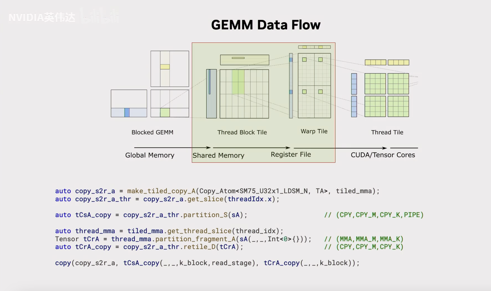

다음으로 Shared Memory에서 Register File로의 복사인데, Register File은 직접 MMA에 사용되므로 데이터 배열을 임의로 설정할 수 없다. CuTe가 제공하는 `make_tiled_copy_A` API를 직접 사용하여 TiledCopy를 구성하면, Thread Layout과 Value Layout을 설정할 필요 없이 MMA를 위해 구성한 tile_mma만 전달하면 자동으로 필요한 Layout을 계산해준다. 그런 다음 `get_slice`로 Thread Copy를 얻는다. Source Tensor는 Register File과 관련이 없으므로 `partition_S`를 사용하면 된다. Dest Tensor는 MMA와 관련이 있으므로 조금 다른데, MMA의 `get_thread_slice`로 thread_mma를 얻고, `partition_fragment_A`로 MMA 시각에서 현재 Thread가 담당하는 Tensor를 얻는다. 마지막으로 `retile_D`를 사용해야 Copy 시각에서 담당하는 Tensor를 얻을 수 있다. 마지막으로 마찬가지로 copy를 호출하여 데이터 복사를 완료한다.

## Mixed GEMM Walk Through

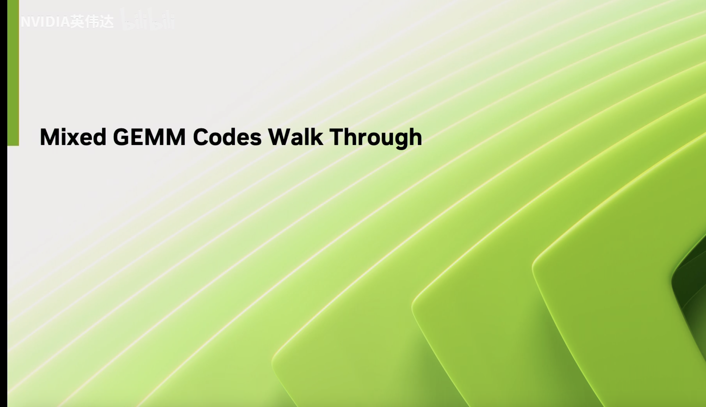

이 부분은 개념 수준에서 어떻게 할 것인지에 관한 내용으로, 위에서 언급한 CuTe 관련 코드와 《TensorRT-LLM中的 Quantization GEMM（Ampere Mixed GEMM）的 CUTLASS 2.x 实现讲解》에서 다룬 Fast Convert 관련 코드를 결합하여 어떻게 구현하는지를 주로 보여준다.

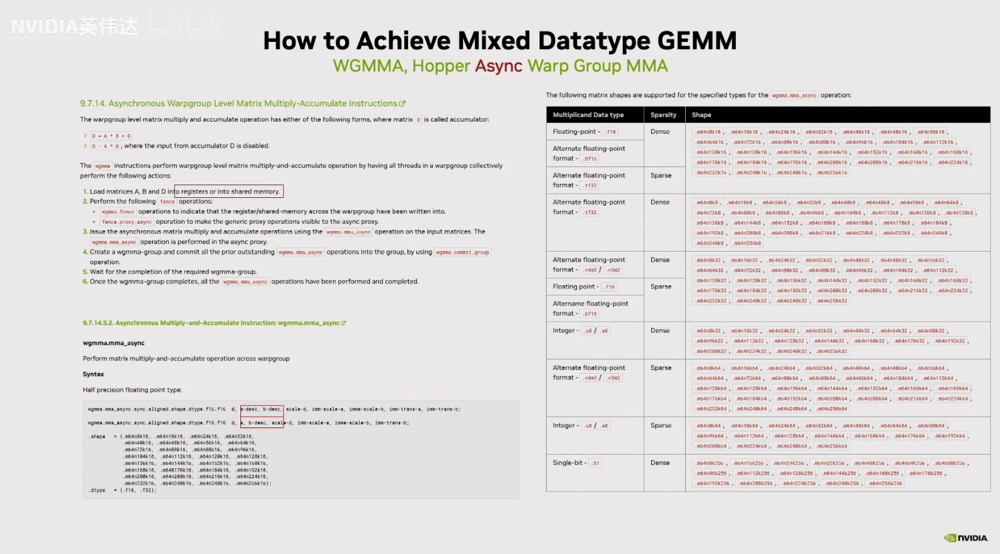

이 Slides는 Hopper의 WGMMA PTX를 보여주며, Hopper에서 WGMMA가 무엇을 하는지 정의한다. 《TensorRT-LLM中的 Quantization GEMM（Ampere Mixed GEMM）의 CUTLASS 2.x 실현 강해》에서 소개한 CUTLASS 2.x의 Ampere Tensor Core는 동기식이다. 동기식이란 입출력 A, B, C 모두 레지스터 수준에서 동기 명령어를 발사함을 의미한다. Hopper에서 이 명령어가 비동기가 된 후, Shared Memory에서 행렬 A, B를 받을 수 있게 되었다. 그리고 Hopper 아키텍처에서 여전히 FP8과 FP16을 직접 계산하는 명령어가 없으므로(FP8 명령어 제외), 수행해야 할 작업은 《TensorRT-LLM中的 Quantization GEMM（Ampere Mixed GEMM）的 CUTLASS 2.x 实现讲解》에서 소개한 것과 비슷하다. 데이터가 Mixed이지만, 읽어온 데이터를 Conversion해야 한다. 그리고 weight를 행렬 A 쪽에 놓고 읽어온 후 Conversion을 수행하여 데이터를 레지스터에 남겨두고, 원래 행렬 A를 행렬 B 위치에 놓으면 직접 읽을 수 있다.

이 Slides의 내용도 많은데, 그림이 다소 흐릿하므로 여기서 간략하게 설명한다. 이 Slides는 Mixed 데이터 타입의 범용 행렬 곱셈 덧셈(GEMM) 연산 구현 방법에 관한 것으로, 특히 Hopper 아키텍처에서 비동기 Warp Group 행렬 곱셈 덧셈 누산(MMA) 연산을 사용하는 경우다. 내용은 비동기 Warp Group 수준 행렬 곱셈과 누산 연산의 실행 방법, 지원하는 데이터 타입과 행렬 형태, 관련 프로그래밍 명령어를 포함한다. 구체적인 내용은 다음과 같다:

- 비동기 Warp Group 수준 행렬 곱셈과 누산 연산
    - **연산 유형**: 행렬 D가 입력 및 누산기로서 비활성화된 경우와 일반 행렬 곱셈 및 누산의 두 가지 기본 연산을 소개한다.
    - **실행 단계**: 이 연산들을 실행하는 여섯 단계를 설명한다:
        - 행렬 A, B, D를 레지스터 또는 shared memory에 로드한다.
        - fence 연산을 실행하여 레지스터/shared memory의 연산이 warp 그룹에서 보이도록 한다.
            - `wmma.fence` 연산을 실행하여 warp 그룹 내 레지스터 또는 shared memory에 대한 모든 쓰기가 완료되었음을 확인한다. 이는 데이터 일관성을 보장하는 핵심 단계다.
            - `fence.proxy.async` 연산을 실행한다. 이는 비동기 프록시에서 일반 프록시 연산을 보이게 하는 프록시 연산이다.
        - 비동기 행렬 곱셈 및 누산 연산을 시작한다.
            - `wmma.mma_async` 명령어로 비동기 행렬 곱셈 덧셈 연산을 수행한다. 이 명령어는 다른 GPU 연산을 차단하지 않고 행렬 곱셈과 누산을 수행할 수 있다.
        - wmma 그룹을 생성하고 이전 연산을 모두 제출한다.
            - `wmma.commit_group` 명령어를 사용하여 wmma 연산 그룹을 생성하고, 대기 중인 모든 `wmma.mma_async` 연산을 이 그룹에 제출한다.
        - wmma 그룹 연산 완료를 대기한다.
            - 계속하기 전에 필요한 wmma 그룹이 모든 연산을 완료했는지 확인한다.
        - wmma 그룹 연산 완료 처리.
            - wmma 그룹이 완료되면 모든 `wmma.mma_async` 연산도 모두 실행 완료된다.
- 비동기 Multiply-and-Accumulate 명령어
    - `wmma.mma_async` 명령어: 이 명령어를 사용하여 행렬 곱셈 덧셈 연산을 수행하는 방법을 구체적으로 소개한다.
    - 문법: 서로 다른 데이터 타입(예: 반정밀도 부동소수점)의 문법 예시를 제공한다.
- 지원하는 행렬 형태와 데이터 타입
    - 데이터 타입: 반정밀도 부동소수점, 정수 등 지원하는 여러 데이터 타입을 나열한다.
    - 행렬 형태: 16x16x16, 32x8x16 등 연산이 지원하는 행렬 형태를 상세히 나열하여 개발자가 특정 애플리케이션 요구에 맞는 행렬 형태를 선택할 수 있도록 한다.

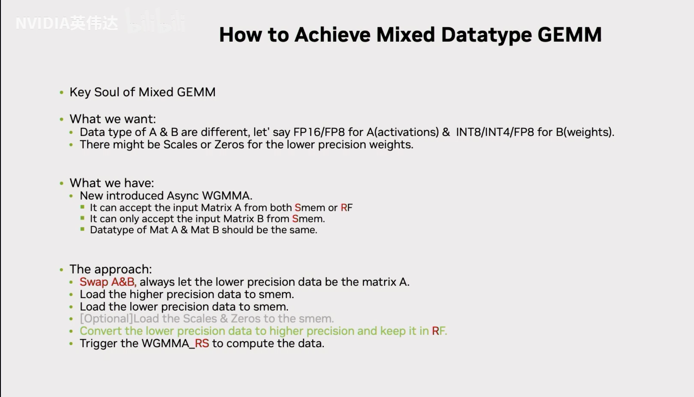

이 Slides는 Mixed 데이터 타입 GEMM(범용 행렬 곱셈) 구현 방법을 해설한다. 주요 내용은 다음과 같다:
- 원하는 것:
    - A와 B 행렬의 데이터 타입이 다름. 예를 들어 A(활성화)는 FP16/FP8, B(가중치)는 INT8/INT4/FP8 사용.
    - 저정밀도 가중치에는 스케일 팩터나 영점이 있을 수 있음.
- 보유한 것:
    - 새로 도입된 비동기 WGMMA
    - Smem 또는 RF에서 입력 행렬 A를 받을 수 있음
    - Smem에서만 입력 행렬 B를 받을 수 있음
    - 행렬 A와 B의 데이터 타입이 같아야 함
- 구현 방법:
    - **A와 B를 교환**하여 저정밀도 데이터가 항상 행렬 A가 되도록 함.
    - 고정밀도 데이터를 smem에 로드(Conversion 불필요).
    - 저정밀도 데이터를 smem에 로드(이는 필수 요건. MultiStage를 해야 하므로 데이터는 반드시 Global에서 각 Stage의 Shared Memory로 스트리밍되어야 함).
    - [선택사항] 스케일 팩터와 영점을 smem에 로드.
    - 저정밀도 데이터를 고정밀도로 변환하여 **RF**에 저장.
    - WGMMA_RS를 트리거하여 데이터 계산.

> 보충:
> - WGMMA: Hopper Warp Group MMA (행렬 곱셈 누산 연산)
> 설명: Hopper 아키텍처에서의 Warp 그룹 행렬 곱셈 누산 연산
> - WS: Warp Specialized
> 설명: 서로 다른 warp가 서로 다른 전문 작업을 수행하는 warp 전문화를 나타냄
> - SS: Src operator of GMMA are both from SMEM
> 설명: GMMA 연산의 두 소스 피연산자 모두 shared memory(SMEM)에서 옴
> - RS: Src operator A of GMMA is from RF, Src operator B is from SMEM

아래 Slides의 대부분 내용은 《CUTLASS 2.x & CUTLASS 3.x Intro 학습 노트》에서 다룬 바 있다. 학습 전에 아래에 붙여두어 복습하고 이 강의의 Slides와 비교하면 편리하다:

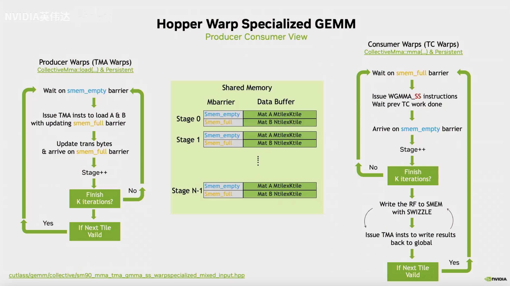

이 Slides는 Hopper 아키텍처에서 Warp Specialized GEMM 구현을 소개하며, 생산자-소비자 모델을 채택했다. 내용은 다음과 같다:
- 소스 코드 위치: `cutlass/gemm/collective/sm90_mma_tma_gmma_ss_warpspecialized_mixed_input.hpp`
- 전체 아키텍처는 Producer Warps(TMA Warps)와 Consumer Warps(TC Warps)로 나뉘며, shared memory를 통해 데이터를 교환한다.
- Producer Warps(TMA Warps):
    - `CollectiveMma::load(...) & Persistent` 방법 사용
    - `smem_empty barrier` 대기
    - TMA 명령어 발사하여 A와 B 행렬 로드, `smem_full barrier` 업데이트
    - 전송 바이트 수 업데이트 및 `smem_full barrier` 도착
    - K 반복 루프
- Consumer Warps(TC Warps):
    - `CollectiveMma::mma(...) & Persistent` 방법 사용
    - `smem_full barrier` 대기
    - `WGMMA_SS` 명령어 발사 및 이전 TC 작업 완료 대기
    - `smem_empty barrier` 도착
    - K 반복 루프
    - `SWIZZLE`로 레지스터 파일(RF)을 shared memory(SMEM)에 씀
    - TMA 명령어 발사하여 결과를 global memory에 다시 씀
- Shared memory 구조:
    - Mbarrier와 Data Buffer 두 부분 포함
    - 각 stage에 두 개의 buffer: `Mat A MtilexKtile`과 `Mat B NtilexKtile`
    - `smem_empty`와 `smem_full` 플래그를 사용하여 Producer와 Consumer 동기화
- 실행 흐름:
    - Producer와 Consumer가 교대로 작업하며 shared memory와 barrier 메커니즘으로 동기화
    - 여러 stage(0에서 N-1)가 파이프라인 연산에 사용됨
    - 모든 tile 계산이 완료될 때까지 루프 실행

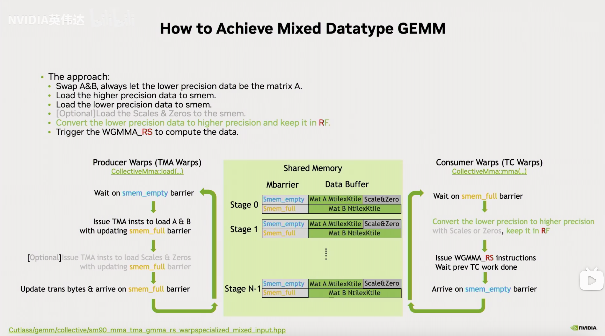

위의 Hopper 아키텍처 Warp Specialized GEMM 구현과 비교하면, 여기서 Consumer Warps에 Persistent 방법이 없고 `CollectiveMma::mma(...)`에만 집중한다. 중간의 Shared Memory는 이전에는 두 Data Type이 동일했지만, 여기서는 A, B 행렬을 교환했고 데이터 타입도 다르다. 따라서 여기서는 의도적으로 행렬 A 버퍼의 길이를 짧게 그려 저정밀도를 나타내었다.

- Slides의 흐름도는 데이터 처리 파이프라인을 보여주며, 다음을 포함한다:
    - 생산자 warp(Producer Warps / TMA Warps)
    - Shared Memory
    - 소비자 warp(Consumer Warps / TC Warps)
- 생산자 warp 작업 흐름:
    - `smem_empty barrier` 대기
    - TMA 명령어 발사하여 A와 B 행렬 로드, `smem_full barrier` 업데이트
    - 선택사항: TMA 명령어 발사하여 스케일 팩터와 영점 로드
    - 전송 바이트 업데이트 및 `smem_full barrier` 도착
- 소비자 warp 작업 흐름:
    - `smem_full barrier` 대기
    - 저정밀도 데이터를 고정밀도로 변환하고 RF에 저장
    - `WGMMA_RS` 명령어 발사
    - 이전 TC 작업 완료 대기
    - `smem_empty barrier` 도착

이 Slides에서 K 방향 루프가 생략되어 있지만, 실제 구현에서는 여전히 존재한다는 점에 주의해야 한다.

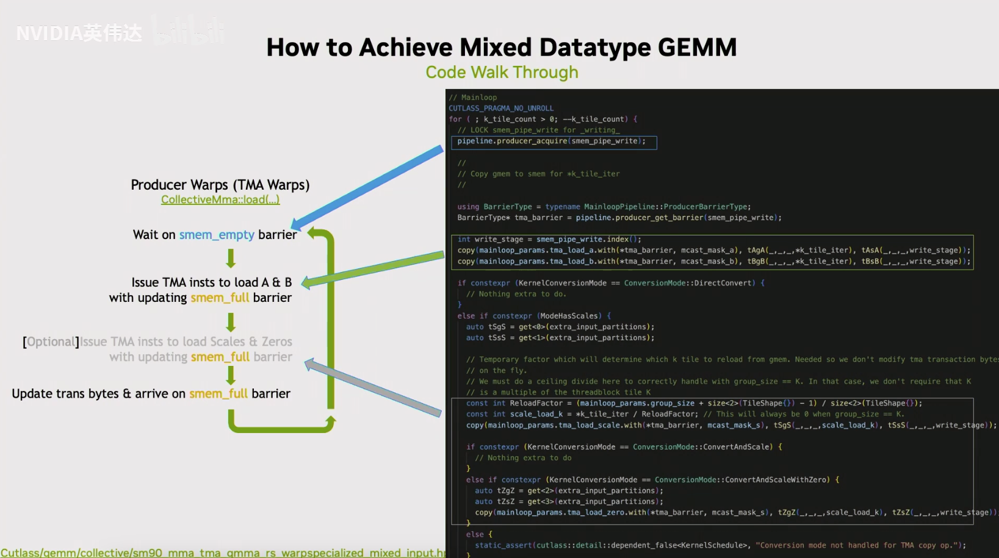

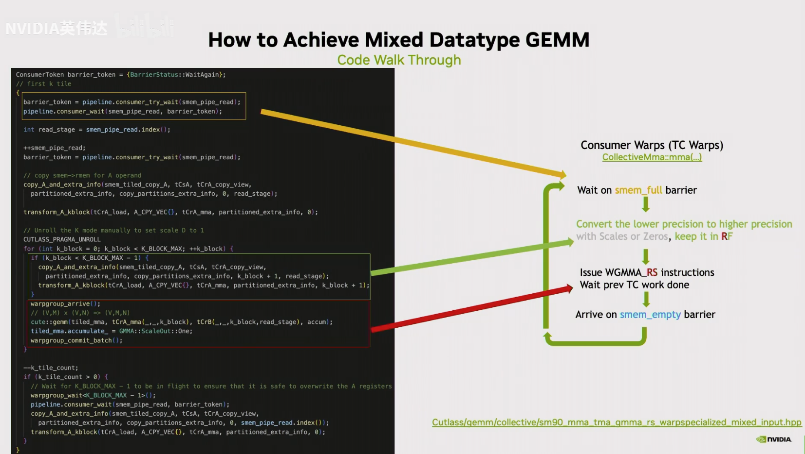

이 두 Slides는 각각 생산자 warp(Producer Warps)와 소비자 warp(TC Warps)의 해당 흐름에 대한 일부 하위 코드를 설명한다. 이 코드는 비교적 추상적이고 복잡하며, 영상에서도 자세히 다루지 않았으므로 관심 있는 분은 CUTLASS 소스 코드를 깊이 연구해 보길 바란다.

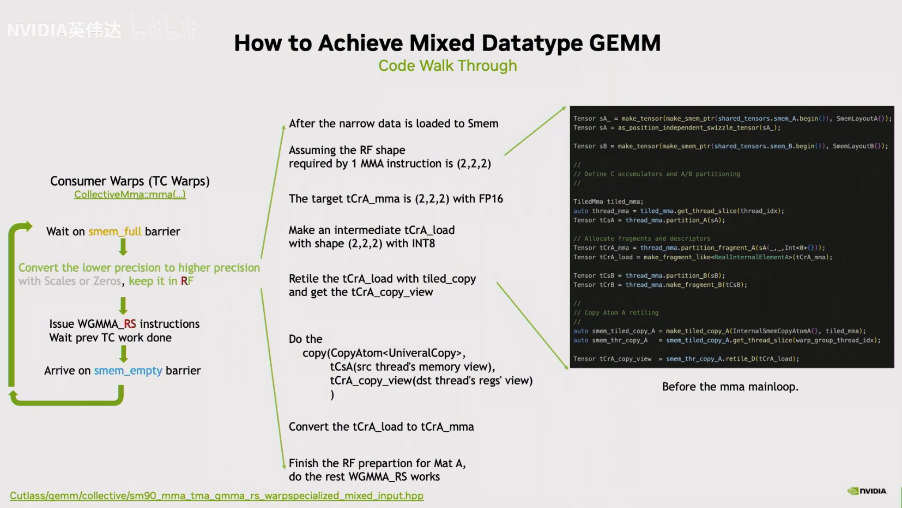

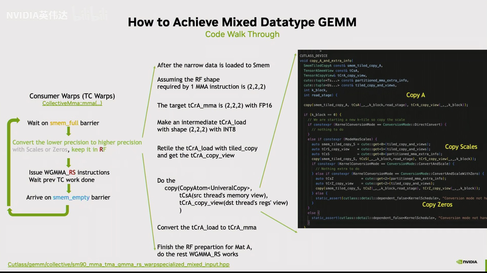

마지막 이 Slides는 소비자 warp(TC Warps)에서 저정밀도 데이터를 고정밀도로 변환하여 레지스터 파일(RF)에 저장하는 구현 세부사항과, 구체적으로 어떻게 Copy를 수행하는지의 세부사항을 소개한다.

## 총정리

전반적으로, 이 강연은 CUTLASS 3.x 버전이 Hopper 아키텍처에서 혼합 정밀도 행렬 곱셈을 구현하는 방법에 관한 기술 강연의 요약이다. 주요 내용은 다음과 같다:

- CuTe 도구 라이브러리 소개. 핵심 개념은 Layout과 Tensor이며, 복잡한 인덱싱 문제를 유연하게 처리할 수 있다.
- 행렬 전치와 GEMM 데이터 전송을 예시로, 데이터 조작과 병렬 계산에서 CuTe의 강력한 기능을 보여준다.
- Hopper 아키텍처에서 비동기 Warp Group 수준 행렬 곱셈 덧셈 연산의 실행 방법과 지원하는 데이터 타입을 상세히 설명한다.
- 비동기 WGMMA 명령어와 CuTe를 활용하여 Mixed GEMM을 구현하는 일부 세부사항을 소개한다.

이 노트를 통해 일부 개념을 간략히 이해하고, CuTe 관련 API를 소개하고 익히는 역할을 한다. 더 깊이 학습하려면 CuTe와 CUTLASS를 계속해서 심층적으로 학습해야 하며, 물론 여기의 내용도 CUTLASS 학습에 도움이 된다.
