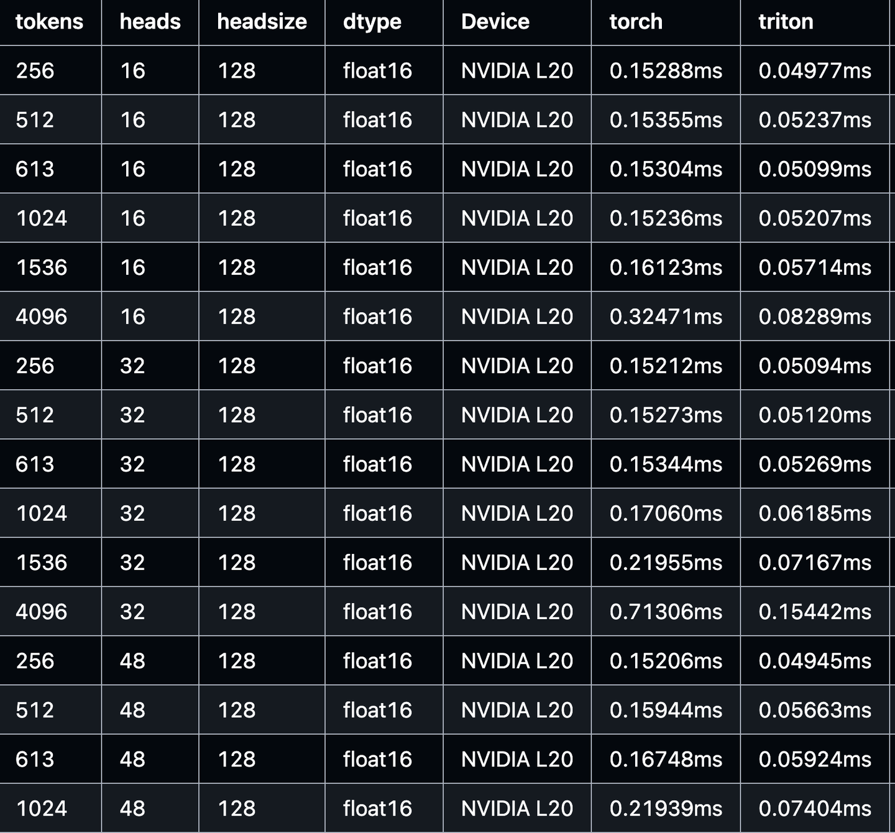

# vLLM Triton Merge Attention States Kernel 상세

> 원문: https://zhuanlan.zhihu.com/p/1904937907703243110

**목차**
- 0x00 머리말
- 0x01 Merge Attention States 소개
- 0x02 PyTorch 구현
- 0x03 Triton 기본 연산자
- 0x04 Triton 연산자 분석
- 0x05 NCU Profile 분석
- 0x06 성능 평가
- 0x07 정리

## 0x00 머리말

본 글은 vLLM의 Triton Merge Attention States Kernel 구현을 다룬다. PyTorch 원본 구현과 비교했을 때 이 Triton kernel은 최대 **3-5배 이상**의 연산자 가속을 얻을 수 있다. 원래는 「[vLLM 실전][연산자] vLLM 연산자 개발 프로세스」의 일부였으나, Triton 프로그래밍 기초/심화 시리즈 노트의 한 편으로 따로 떼어 확장해 정리한다. CUDA나 Triton 입문자를 대상으로 하며, 시리즈를 끝까지 보면 흔한 kernel을 직접 작성할 수 있게 되는 것이 목표다. 숙련자는 가볍게 넘겨도 된다.

저자의 더 많은 기술 노트와 CUDA 학습 노트는 LeetCUDA에서 확인할 수 있다. LeetCUDA에는 LLM/VLM 글 정리와 FlashAttention, SGEMM, HGEMM, GEMV 같은 대표 CUDA kernel 예제 구현이 포함되어 있고, 누적 4k+ stars를 기록했다. 링크: xlite-dev/LeetCUDA.


*LeetCUDA: Modern CUDA Learn Notes with PyTorch for Beginners*

저자의 Triton 관련 노트 목록:
- [Triton 기초] Triton 극간단 입문: Triton Vector Add
- [Triton 기초] Triton Fused Softmax Kernel 상세: Python에서 PTX까지
- [Triton 기초] vLLM Triton Merge Attention States Kernel 상세
- [Triton 고급] vLLM Triton Prefix Prefill Kernel 도해

## 0x01 Merge Attention States 소개

Merge Attention States 개념부터 간단히 살펴보자. 이 개념은 FlashInfer 논문(https://www.arxiv.org/pdf/2501.01005) 2.2절 Attention Composition에 등장하며, vLLM의 Triton MLA 구현에서도 사용된다.


*Merge Attention States*

알다시피 Attention 계산은 블록 단위로 나눌 수 있다. Block-Parallel Transformer (BPT)에 따르면, 같은 query에 대해 서로 다른 key/value를 사용할 때, 각 block의 Attention Output(O)과 scaling 계수(LSE)를 함께 보관해 두면 결과를 합칠 수 있다. 다시 말해 decode 단계에서는 보통 query가 매우 작고(예: 1) key/value가 긴 seqlen인 상황이 흔한데, 긴 시퀀스라면 key/value를 먼저 블록으로 나눠 각 블록이 자체 Attention 결과를 계산하고 해당 블록의 LSE를 기록한 뒤, 마지막에 scaling으로 합칠 수 있다. 이것이 이른바 **"Merge Attention States"**다. Chunked-Prefill, Prefix-Cache, Split-KV 시나리오에서 모두 의미가 있다.

q를 query, I를 인덱스 집합(즉 token 집합)이라 하자. **LSE(log-sum-exp)**는 다음과 같이 정의된다.

```
LSE(I) = log Σ_{i ∈ I} exp(q · k_i)            (1)
```

여기서 k_i는 i번째 key 벡터다. 이에 대응하는 **Attention output** O(I)는:

```
O(I) = Σ_{i ∈ I} ( exp(q · k_i) / exp(LSE(I)) ) · v_i      (2)
```

I의 **Attention States**를 Attention output(O)과 attention scaling 계수로 이루어진 튜플로 정의한다. 그러면 I ∪ J에 대한 최종 Attention Output은 I와 J의 결과를 다음처럼 합쳐 얻을 수 있다.

```
[ O(I ∪ J)      ]   [ O(I)   ]     [ O(J)   ]
[                ] = [        ]  ⊕  [        ]
[ LSE(I ∪ J)    ]   [ LSE(I) ]     [ LSE(J) ]

           ( exp(LSE(I))·O(I) + exp(LSE(J))·O(J) ) / ( exp(LSE(I)) + exp(LSE(J)) )
        =
           log( exp(LSE(I)) + exp(LSE(J)) )
```

요컨대 Merge Attention States가 하는 일은 단순하다. 두 분할된 Attention 결과를 최종적으로 보정하는 것이다.

## 0x02 PyTorch 구현

먼저 PyTorch 버전부터 간단히 작성해서, 이후 CUDA·Triton 연산자와 수치 정확도를 비교할 수 있도록 한다.

```python
# Naive PyTorch — implements section 2.2 of https://www.arxiv.org/pdf/2501.01005
# Can be used to combine partial attention results (in the split-KV case)
def merge_attn_states_torch(
        output: torch.Tensor,         # [NUM_TOKENS, NUM_HEADS, HEAD_SIZE]
        prefix_output: torch.Tensor,  # [NUM_TOKENS, NUM_HEADS, HEAD_SIZE]
        prefix_lse: torch.Tensor,     # [NUM_HEADS, NUM_TOKENS]
        suffix_output: torch.Tensor,  # [NUM_TOKENS, NUM_HEADS, HEAD_SIZE]
        suffix_lse: torch.Tensor,     # [NUM_HEADS, NUM_TOKENS]
        output_lse: Optional[torch.Tensor] = None,  # [NUM_HEADS, NUM_TOKENS]
):
    p_lse = prefix_lse
    s_lse = suffix_lse
    # inf -> -inf : exp(inf)=nan, exp(-inf)=0 이므로 output NaN을 피하기 위한 처리
    p_lse[p_lse == torch.inf] = -torch.inf
    s_lse[s_lse == torch.inf] = -torch.inf
    # max_lse [NUM_HEADS, NUM_TOKENS]
    max_lse = torch.maximum(p_lse, s_lse)
    # safe-softmax: 최댓값 빼기
    p_lse = p_lse - max_lse
    s_lse = s_lse - max_lse
    p_lse_exp = torch.exp(p_lse)
    s_lse_exp = torch.exp(s_lse)
    out_se = (p_lse_exp + s_lse_exp)
    if output_lse is not None:
        output_lse = torch.log(out_se) + max_lse
    # scale 계산
    p_scale = p_lse_exp / out_se  # [NUM_HEADS, NUM_TOKENS]
    s_scale = s_lse_exp / out_se  # [NUM_HEADS, NUM_TOKENS]
    p_scale = torch.transpose(p_scale, 0, 1).unsqueeze(2)  # [NUM_TOKENS, NUM_HEADS, 1]
    s_scale = torch.transpose(s_scale, 0, 1).unsqueeze(2)  # [NUM_TOKENS, NUM_HEADS, 1]
    # 결과 보정으로 최종 Attention 출력
    output = prefix_output * p_scale + suffix_output * s_scale
    return output, output_lse
```

다만 prefix_output과 prefix_lse의 dim 0이 서로 다르다는 점에 유의해야 한다. 각각 [NUM_TOKENS, NUM_HEADS, HEAD_SIZE]와 [NUM_HEADS, NUM_TOKENS]인데, 이는 vLLM의 chunk attention 계산 출력 텐서 shape에 맞춘 표기다. SGLang 같은 다른 프레임워크는 다를 수 있다. 예컨대 저자가 SGLang에 올린 PR 구현이 그렇다: https://github.com/sgl-project/sglang/pull/5428

## 0x03 Triton 기본 연산자

PyTorch 구현은 작은 op들이 많고 Tensor에 inplace write를 하기 때문에 성능이 좋지 않다. 그래서 vLLM은 PyTorch 구현을 직접 쓰지 않고, Triton 기반 kernel을 제공한다. 전체 코드 링크: attention/ops/triton_merge_attn_states.py. 구체적으로는:

- **데이터 load 및 inf 처리**


*데이터 load 및 inf 처리*

- **safe-softmax: 최댓값 빼기**


*safe-softmax*

- **최종 보정**: prefix_output과 suffix_output 각각의 scale을 계산하고 가중합해서 최종 출력을 얻는다.


*보정*

Triton kernel은 PyTorch 구현과 동일한 작업을 하지만, 모든 연산을 하나의 kernel로 fuse하고, inf 값 처리는 global memory를 수정하는 대신 register에서 online으로 판정한다. 일반적으로 성능이 더 좋다. 이 kernel의 호출 로직은 아래와 같다.


*Triton kernel 호출*

vLLM의 구현은 `merge_attn_states_kernel`에 (num_tokens, num_query_heads)개의 thread block을 할당하고, 각 block이 해당 head의 모든 값을 처리한다. 예를 들어 head_size=128이면 이 block은 128개 값을 처리한다.

## 0x04 Triton 연산자 분석

### 기본 분석

위에서 봤듯이 vLLM 구현은 `merge_attn_states_kernel`에 (num_tokens, num_query_heads)개의 thread block을 할당하고, 각 block이 해당 head의 모든 값을 처리한다. head_size=128이면 한 block이 128개 값을 처리하는 식이다. 그런데 이 방식에는 몇 가지 문제가 있다.

1. num_tokens, num_query_heads가 매우 크고 head_size가 작은 경우(예: 32)에는 thread block 개수가 과다해지고, block당 처리 데이터량은 너무 적어져 계산 밀도가 낮아진다. 그리고 이런 상황에서는 Triton이 효율적인 kernel을 생성하지 못할 수도 있다(아래에서 다룬다).
2. Triton kernel을 호출할 때 일정한 CPU overhead가 있다.


*CPU overhead가 발생할 수 있다*

### Gen code(PTX) 분석

Triton kernel을 분석하는 간단하면서도 효과적인 방법을 하나 소개한다(물론 ncu, nsys를 함께 쓰면 더 좋다). 보통 Triton이 실제로 어떤 kernel을 생성하는지, 예컨대 생성된 kernel PTX는 어떤 모양인지, 벡터화는 적용되었는지, cp.async가 쓰였는지, coalesced access는 잘 이뤄지는지 궁금하기 마련이다. 이때 `TRITON_CACHE_DIR` 환경 변수를 설정해 Triton이 생성한 중간 IR 파일을 저장해 분석할 수 있다.

```bash
export TRITON_CACHE_DIR=$(pwd)/cache
pytest -s test_merge_attn_states.py
# Triton이 생성한 중간 IR cache 파일
cache git:(dev) ✗ tree .
.
├── ALGAAi8N-ErdaDbXXL8N91RokvTI-e8O2oEwd0SL3N0
│   └── __triton_launcher.so
├── p4IOvvpWkyeVkuyW8j50rO-ANYlCc5AJOEr70sQD93A
│   ├── __grp__merge_attn_states_kernel.json
│   ├── merge_attn_states_kernel.cubin
│   ├── merge_attn_states_kernel.json
│   ├── merge_attn_states_kernel.llir
│   ├── merge_attn_states_kernel.ptx
│   ├── merge_attn_states_kernel.ttgir
│   └── merge_attn_states_kernel.ttir
└── q4oIpkjOtdHHfi8xBkm4jC4JWIk5AjKtN8WRkZb8MD8
    └── cuda_utils.so
```

이 중 `merge_attn_states_kernel.ptx`만 보면 된다. 예를 들어 num_tokens=512, num_query_heads=16, head_size=32 케이스에서 생성된 PTX 일부:

```
        @%p8 ld.global.b16 { %rs3 }, [ %rd16 + 0 ];   // 비벡터화 load
        // ......
        @%p8 ld.global.b16 { %rs4 }, [ %rd17 + 0 ];
        // end inline asm
        .loc    1 85 30                         // triton_merge_attn_states.py:85:30
        div.full.f32 %r15, %r16, %r17;
        // ......
        mov.b32     %f49, %r15;
        .loc    1 86 30                         // triton_merge_attn_states.py:86:30
        // ......
        mov.b32     %r23, %f54;
        // begin inline asm
        cvt.rn.bf16.f32 %rs6, %r23;
        // end inline asm
        and.b32     %r30, %r25, 96;
        setp.eq.s32 %p10, %r30, 0;
        // begin inline asm
        @%p10 st.global.b16 [ %rd18 + 0 ], { %rs6 };  // 비벡터화 store
```

이 경우 Triton은 효율적인 벡터화 ld/st 명령을 생성하지 않고 `ld.global.b16`, `st.global.b16`을 사용했다. 따라서 우리가 CUDA Kernel을 직접 작성하고 coalesced access를 손수 보장한다면 성능 이득을 얻을 수 있을 것이다. CUDA 연산자 최적화에 대해서는 별도의 글을 참고하자.

## 0x05 NCU Profile 분석

마지막으로 ncu로 실제 실행된 PTX와 SASS를 직접 들여다본다. Triton kernel을 ncu로 잡으면 다음과 같다. 이 케이스는 `ld/st.global.b16` (num_tokens=512, num_heads=16, head_size=128). 여러 번 실험해 본 결과, 벡터화 코드가 생성되는 경우도 있고 안 되는 경우도 있었다. 즉 이 Triton kernel은 손으로 작성한 CUDA 연산자로 메모리 접근을 더 최적화할 여지가 있다. 「[vLLM 실전][연산자] vLLM 연산자 개발 프로세스: '보모급' 상세 기록」 참고.


*Triton kernel NCU profile*

memory throughput 비교: 45.67 (Triton kernel) → 60.57 (CUDA kernel).


*memory throughput*

- **ncu profile** (NCU client로 profile 파일을 열면 된다)

```bash
ncu -o merge_attn_states.prof -f pytest -s test_merge_attn_states.py
```

## 0x06 성능 평가

단위 테스트를 돌리고 나면 성능 비교 markdown 표가 자동 생성된다. Triton Kernel을 사용하면 메모리 접근 비용을 크게 줄여 kernel 성능을 끌어올릴 수 있다. PyTorch 원본 구현과 비교하면 최대 3-5배 이상의 연산자 가속이 가능하다.


*Triton Kernel vs Torch naive*

## 0x07 정리

본 글은 vLLM의 `merge_attn_states` Triton 연산자 구현을 소개했다. Merge Attention States 개념 소개, PyTorch 구현, Triton 기본 연산자, Triton 연산자 분석, NCU 분석, 성능 평가를 다뤘다. 최종적으로 PyTorch 원본 구현과 비교했을 때 Triton kernel은 최대 **3-5배 이상**의 연산자 가속을 보였다.

저자의 더 많은 기술 노트와 CUDA 학습 노트는 LeetCUDA를 참고하면 된다. LLM/VLM 글 정리와 FlashAttention, SGEMM, HGEMM, GEMV 같은 대표 CUDA kernel 예제 구현을 포함하고 있으며, 누적 4k+ stars를 기록 중이다.

이 kernel은 저자의 학습 노트에 단독으로 정리되어 있어 가볍게 시도해 보기 좋다.

늘 그렇듯, 오류는 발견 즉시 갱신하고 수정해 나가겠다.
