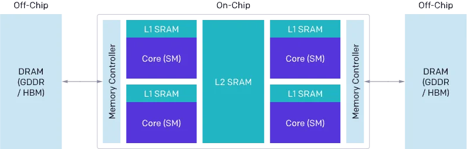
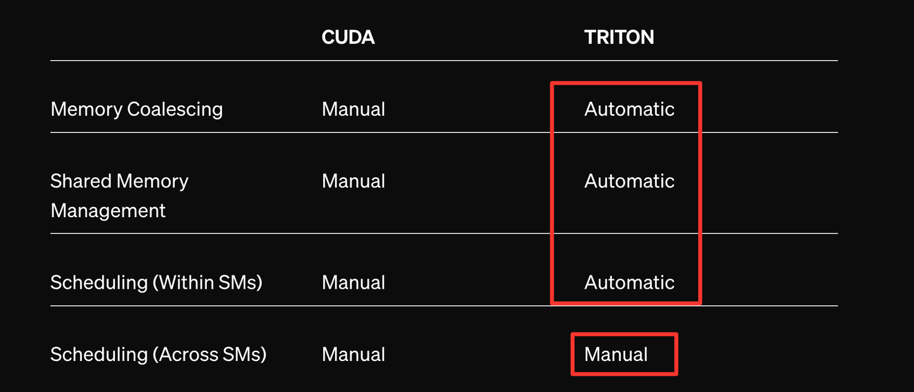
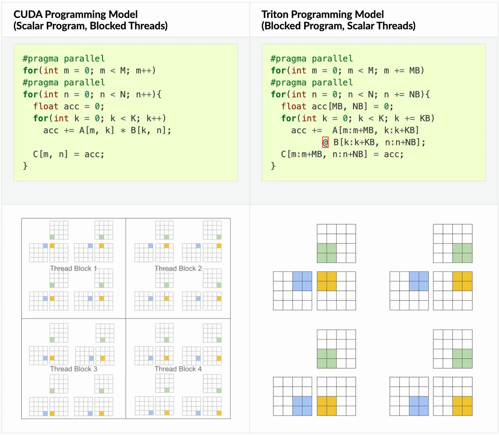
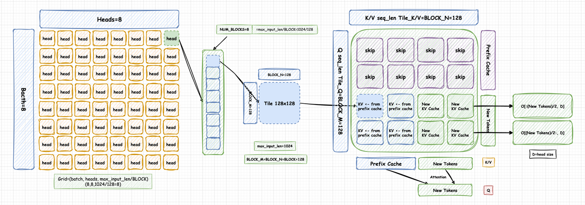
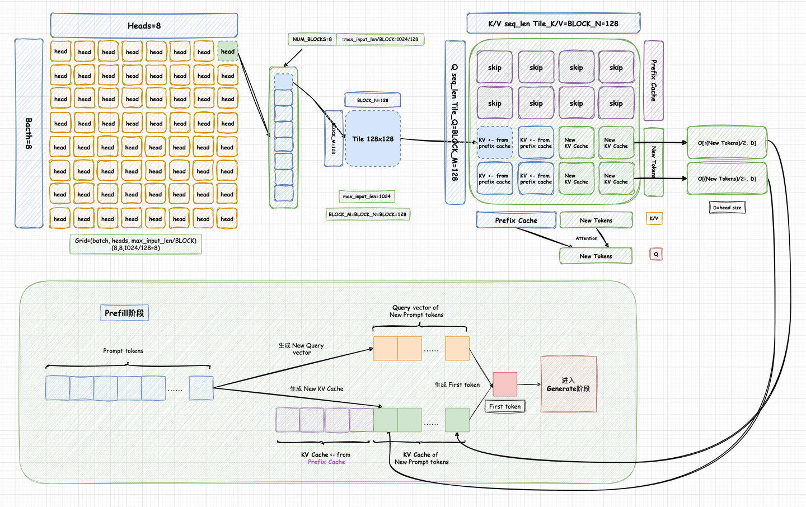
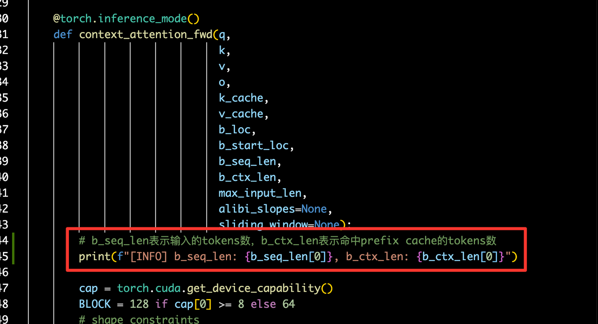
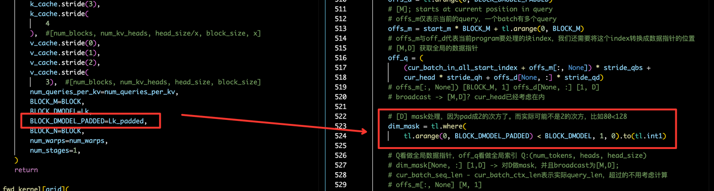
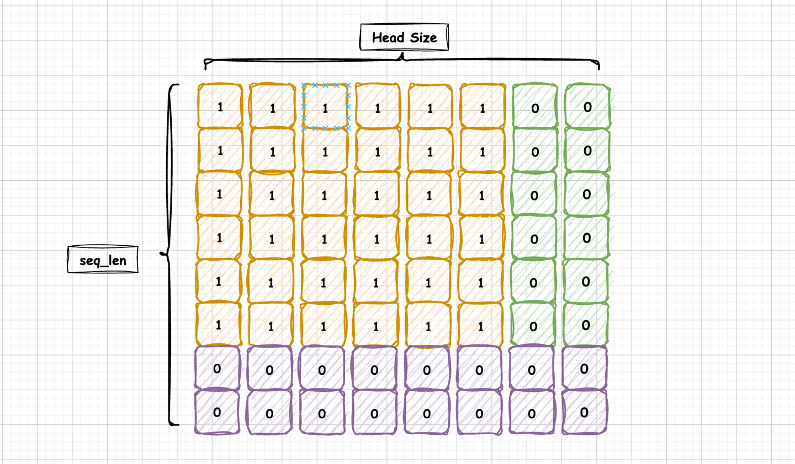

# vLLM Triton Prefix Prefill Kernel 도해

> 원문: https://zhuanlan.zhihu.com/p/695799736

**목차**
- 0x00 머리말
- 0x01 OpenAI Triton: Triton Kernel 프로그래밍 극간단 입문
- 0x02 vLLM Prefix Prefill Kernel: 일반 Attention Kernel과의 차이
- 0x03 vLLM Prefix Prefill Kernel: 우선 Tiling 분할 전략
- 0x04 vLLM Prefix Prefill Kernel: Kernel 호출 살펴보기
- 0x05 vLLM Prefix Prefill Kernel: Prefix Cache에 몇 토큰이 적중했는지 확인
- 0x06 vLLM Prefix Prefill Kernel: 일반 Head Size 지원
- 0x07 vLLM Prefix Prefill Kernel: MQA/GQA 지원
- 0x08 vLLM Prefix Prefill Kernel: Triton Kernel 해설
- 0x09 정리

## 0x00 머리말

저자의 더 많은 기술 노트와 CUDA 학습 노트는 LeetCUDA(CUDA Learn Notes with PyTorch)에서 확인할 수 있다. LeetCUDA는 LLM/VLM 글 정리와 FlashAttention, SGEMM, HGEMM, GEMV 같은 대표 CUDA kernel 예제 구현을 포함하며 누적 3k+ stars를 기록했다. 링크: https://github.com/xlite-dev/LeetCUDA


*LeetCUDA: CUDA Learn Notes with PyTorch for Beginners*

이전 Prefill 최적화 글에서는 vLLM Automatic Prefix Caching(Hash RadixAttention)의 원리와 cache 스케줄링 구현을 자세히 다뤘다. SGLang RadixAttention 원리 포함, 도해와 코드로 vLLM의 Hash RadixAttention 구현을 분석했다. Hash RadixAttention 관련 내용: Hash RadixAttention, Hash Prefix Tree, Prefix/Generate 단계 hash 처리, Prefix + Generated KV Caching의 스케줄링 로직, 경계 케이스 고찰, 다중 회차 대화에서의 활용 분석, 코드 활용 실습. 이번 글은 한 걸음 더 들어가, Automatic Prefix Caching에 쓰이는 Triton 기반 Prefix Prefill Kernel을 해설한다. **이전 글의 Automatic Prefix Caching 원리를 먼저 읽고 본 글에 들어오기를 권한다.**

저자의 Triton 관련 노트 목록:
- [Triton 기초] Triton 극간단 입문: Triton Vector Add
- [Triton 기초] Triton Fused Softmax Kernel 상세: Python에서 PTX까지
- [Triton 기초] vLLM Triton Merge Attention States Kernel 상세
- [Triton 고급] vLLM Triton Prefix Prefill Kernel 도해

본 글은 vLLM Automatic Prefix Cache를 사전 지식으로 한다는 점을 다시 한번 강조한다.

## 0x01 OpenAI Triton: Triton Kernel 프로그래밍 극간단 입문

OpenAI Triton에 대해서는 간단한 소개만 한다. 입문 글은 인터넷에 많이 있으니 중복은 피한다. 본 글은 Prefix Prefill Kernel 구현에 집중하며 Triton 저수준 원리에는 깊이 들어가지 않는다.


*GPU 기본 구조*

전통적으로 CUDA로 GPU를 프로그래밍하는 것은 난도가 높다. CUDA 코드를 최적화할 때는 DRAM, SRAM, ALU 사이의 데이터 흐름 load/store 문제, 그리고 Grid, Block, Thread, Warp 등 서로 다른 수준의 스케줄링 최적화를 세심하게 고려해야 한다.

> 1. DRAM의 메모리 전송은 큰 트랜잭션으로 합쳐서 현대 메모리 인터페이스의 큰 버스 폭(coalesced access)을 활용해야 한다.
> 2. 데이터는 재사용 전에 수동으로 SRAM에 저장해야 하며 bank conflict를 최소화하도록 관리해야 한다.
> 3. 계산은 SM 간뿐 아니라 SM 내부에서도 신중하게 분할·스케줄링해, instruction/thread level parallelism을 살리고 전용 ALU(예: Tensor Cores)를 활용해야 한다.

그래서 CUDA 숙련자라도 이론 피크에 가까운 성능의 kernel을 작성하려면 상당한 노력이 든다(나처럼 평범한 사람은 손수 CUDA Kernel 쓰는 걸 거의 포기했다). Triton의 등장은 이 진입 장벽을 낮춘다. 메모리 트랜잭션 합치기, SRAM 할당·관리, 파이프라인 최적화 같은 정교한 설계가 필요한 전략을 자동화해 준다. 그래서 프로그래머는 알고리즘 자체에 더 집중할 수 있다.


*Triton Compiler 컴파일 최적화*

공식 표를 보면, Triton을 쓰면 메모리 트랜잭션 합치기, SRAM 관리, SM 내부 thread 스케줄링이 자동이고, 우리는 SM 간 관리만 신경 쓰면 된다. 즉 **Triton의 프로그래밍 입자도는 Block**이지(각 Block은 SM 하나에 스케줄링) Thread가 아니다. 각 Block이 무엇을 할지만 정하면 되고, Thread/Warp 분포·스케줄링은 Triton이 알아서 한다. Triton에서 Block 개념은 **program**으로 표현된다.


*Triton Block-wise 프로그래밍 모델*

Block → program이며, Triton에서는 **program_id**로 program을 유일하게 식별한다. 프로그래머는 한 program(block) 내부 로직만 짜면 된다. 다음의 간단한 add_kernel을 보자. `x_ptr`, `y_ptr`, `output_ptr`은 입력 벡터들과 출력 벡터의 포인터다. GPU 메모리에 저장된다. PyTorch와 Triton을 같이 쓰는 경우가 흔한데, Triton은 전달된 Tensor를 데이터 텐서가 아니라 포인터로 다룬다. `BLOCK_SIZE: tl.constexpr`는 컴파일 타임 상수로, 각 block이 처리할 원소 수다. `mask = offsets < n_elements`는 메모리 연산이 범위를 넘지 않도록 mask를 만든다. `tl.load`와 `tl.store`는 Triton의 load/store다. 성능 최적화를 위해 Triton은 데이터 Tensor가 아니라 포인터 레벨에서 동작한다.

### Triton 기반 Kernel

```python
import triton
import triton.language as tl

@triton.jit
def add_kernel(x_ptr,        # 첫 번째 입력 벡터의 포인터
               y_ptr,        # 두 번째 입력 벡터의 포인터
               output_ptr,   # 출력 벡터의 포인터
               n_elements,   # 벡터 크기
               BLOCK_SIZE: tl.constexpr,  # 각 program이 처리할 원소 수
               ):
    # 여러 program(block)이 서로 다른 데이터를 처리한다.
    # 현재 어느 program인지 식별:
    pid = tl.program_id(axis=0)  # 1D launch grid, axis=0
    # 이 program은 초기 데이터에서 offset된 입력을 처리한다.
    # 길이 256 벡터, block_size 64이면 program 각각이
    # [0:64, 64:128, 128:192, 192:256]에 접근.
    block_start = pid * BLOCK_SIZE
    offsets = block_start + tl.arange(0, BLOCK_SIZE)
    # 범위 초과 접근 방지 mask
    mask = offsets < n_elements
    # DRAM에서 x, y 로드. 입력이 block 배수가 아니면 mask로 잘라낸다.
    x = tl.load(x_ptr + offsets, mask=mask)
    y = tl.load(y_ptr + offsets, mask=mask)
    output = x + y
    # x + y 결과를 DRAM에 다시 쓰기.
    tl.store(output_ptr + offsets, output, mask=mask)
```

### PyTorch 호출

(Triton은 전달된 Tensor를 포인터로 다룬다는 점에 유의)

```python
def add(x: torch.Tensor, y: torch.Tensor):
    # 출력 미리 할당
    output = torch.empty_like(x)
    assert x.is_cuda and y.is_cuda and output.is_cuda
    n_elements = output.numel()
    # SPMD launch grid는 병렬 실행되는 kernel 인스턴스 수를 의미.
    # CUDA launch grid와 유사. add_kernel은 1D grid (block 수만큼).
    grid = lambda meta: (triton.cdiv(n_elements, meta['BLOCK_SIZE']), )
    # 주의:
    #  - 각 torch.tensor 객체는 암묵적으로 첫 원소 포인터로 변환된다.
    #  - `triton.jit` 함수는 launch grid 인덱싱으로 호출 가능한 GPU kernel을 얻는다.
    #  - meta param은 keyword argument로 전달해야 한다.
    add_kernel[grid](x, y, output, n_elements, BLOCK_SIZE=1024)
    # z의 핸들을 반환. `torch.cuda.synchronize()` 호출 전이므로 kernel은 비동기 실행 중.
    return output
```

Triton은 전달된 Tensor를 포인터로 다룬다는 점, 그리고 Triton Kernel도 비동기 호출이라는 점에 주의해야 한다. 따라서 성능 측정 시에는 함수 반환 후 `torch.cuda.synchronize()`를 호출해야 한다. 더 자세한 Triton 입문은 「如何入门 OpenAI Triton 编程?」와 「科密中的科蜜: OpenAI Triton 입문 튜토리얼」을 추천한다. 본 글의 Triton 부분은 두 글을 참고했다. 본 글을 계속 읽기 위해서는 다음만 기억하면 된다.

> 1. Program은 CUDA의 Block에 해당하며, program_id는 block id에 해당한다.
> 2. CUDA의 grid-block-thread 프로그래밍 모델이 **Block-wise**로 단순화되었다. kernel 실행 시 grid 안 block의 layout만 고려하면 된다. 예: grid=(M, N, D/BLOCK_K)는 3D block layout.

## 0x02 vLLM Prefix Prefill Kernel: 일반 Attention Kernel과의 차이

Prefix Caching 얘기로 돌아온다. Prefix Caching을 적용한 뒤에는 일반 Attention kernel로는 Prefill 단계의 attention 결과를 계산할 수 없다. 일반 kernel은 Q_len == KV_len == prompt_len을 암묵적으로 가정하기 때문이다. Prefix Caching에서는 이 가정이 깨진다. 현재 요청의 prompt 중 일부가 KV Cache에 적중해 다시 계산하지 않으므로 Q_len < prompt_len이다. 그러나 각 query는 모든 과거 KV와 Attention을 해야 하므로 KV_len은 여전히 prompt_len과 같다. 즉 **Q_len < KV_len = prompt_len**이며, 이 상황을 처리할 새 kernel이 필요하다. vLLM도 그렇게 한다. 현재 prefix prefill kernel 구현은 `vllm/attention/ops/prefix_prefill.py`에 있다. prefix caching을 쓰면 여기에 구현된 triton 기반 prefix prefill kernel을 탄다.


*prefix prefill kernel*

prefix prefill kernel에는 디테일이 많다. 여기서는 우선 해결 문제만 간단히 짚고, 다음 절부터 소스를 분석한다.

## 0x03 vLLM Prefix Prefill Kernel: 우선 Tiling 분할 전략

### Tiling 분할 도해

Top-down으로 Prefix Prefill Kernel을 이해하기 위해 Tiling 전략과 Block layout부터 본다. 이 부분 코드는 다음과 같다. **BLOCK_M**: 최내층 **Q의 seq_len 행 방향 병렬**, 각 block이 BLOCK_M 토큰 처리. **BLOCK_N**: 최내층 **KV의 seq_len 열 방향 병렬**, 각 block이 BLOCK_N 토큰 처리. **BLOCK_M × BLOCK_N(128×128)**이 최소 Tile. `max_input_len/BLOCK`은 최대 몇 개 block이 필요한지를 의미하며 max_input_len은 사용자가 지정한다(1024/2048/4096 등). 현재 vLLM Prefix Prefill Kernel은 **BLOCK_M = BLOCK_N = BLOCK = 128**.

```python
# 다른 로직은 생략, Tiling/Block layout만 본다
cap = torch.cuda.get_device_capability()
BLOCK = 128 if cap[0] >= 8 else 64
# shape 제약
Lq, Lk, Lv = q.shape[-1], k.shape[-1], v.shape[-1]
sm_scale = 1.0 / (Lq**0.5)
batch, head = b_seq_len.shape[0], q.shape[1]
num_queries_per_kv = q.shape[1] // k.shape[1]
# BLOCK_M: Q seq_len 행 방향 병렬, block당 BLOCK_M 토큰 처리
# BLOCK_N: K seq_len 열 방향 병렬, block당 BLOCK_N 토큰 처리
# max_input_len/BLOCK: 최대 block 수
# BLOCK_M = BLOCK_N = BLOCK = 128
grid = (batch, head, triton.cdiv(max_input_len, BLOCK))  # batch, head, ...
```

Prefix Prefill Kernel의 분할 layout은 `[batch, heads, max_input_len/BLOCK]`이다. FlashAttention V2에 익숙하다면 곧 알아챌 것이다. 이게 FlashAttention V2의 Tiling 로직 그대로다. 다만 Prefix Prefill Kernel은 Prefix Cache에 적중한 KV Cache를 추가로 처리해야 한다. Prefix Cache에 적중한 부분과 적중하지 않은 New Tokens는 따로 처리된다. batch_size=8, heads=8, max_input_len=1024, BLOCK_SIZE(=BLOCK)=128을 예로 Tiling 전략과 Block layout을 보자.


*vLLM Prefix Prefill Kernel Tiling*

`[batch, heads, max_input_len/BLOCK]`. 최내층 `max_input_len/BLOCK`은 한 head의 Attention 계산을 처리하는 것에 해당한다. 예컨대 max_input_len=1024, BLOCK=128이면 최내층에 8개의 program(즉 Thread Block)이 그 head의 Attention 계산을 담당한다. BLOCK_M = BLOCK_N = BLOCK = 128이라 각 Thread Block은 그 Head의 BLOCK_M 개의 New Query Token에 대한 Attention을 처리하고, KV는 BLOCK_N=128 단위로 **FlashAttention** 반복 계산을 한다. 끝나면 Thread Block은 [BLOCK_M, D] 크기의 Attention 출력 O를 얻는다(D는 head size, 예: 64, 128 등). Prefix Cache에 적중한 Query Token에 해당하는 KV Cache가 많으면 그 토큰들의 Attention 계산은 건너뛸 수 있어 계산이 크게 절약된다. New Tokens에 대해서만 Attention을 계산하면 된다. FlashAttention 원리 해설은 별도 글을 참고하면 좋다.

### Prefix Caching 하의 Prefill 단계

Prefill의 목적은 두 가지다. (1) Prompt Token의 KV Cache 생성. (2) 첫 토큰 생성. Prefill 비용은 보통 TTFT(Time To First Token)로 측정한다. Prefix Cache를 Prefill 흐름에 통합하면 대략 다음과 같다. 보라색은 Prefix Cache에 적중한 토큰이며 이 부분 KV Cache는 Prefix Cache에 저장된 값을 그대로 쓴다. 초록색은 현재 입력 prompt에서 적중하지 않은 New Tokens로, 이 토큰들의 KV Cache는 계산해야 한다. prompt 모든 토큰의 KV Cache가 준비되면 첫 토큰을 생성할 수 있다.


*Prefill with Prefix Cache*

## 0x04 vLLM Prefix Prefill Kernel: Kernel 호출 살펴보기

Kernel을 이해하는 가장 기본은 인터페이스와 사용 예를 먼저 보는 것이다. `context_attention_fwd`는 `_fwd_kernel`의 래퍼 함수다. 인자는 다음과 같다.

```python
def context_attention_fwd(q,           # New tokens의 query Tensor (prefix cache 미적중)
                          k,           # New tokens의 keys Tensor
                          v,           # New tokens의 values Tensor
                          o,           # Attention 출력
                          k_cache,     # prefix cache에 적중한 tokens의 keys
                          v_cache,     # prefix cache에 적중한 tokens의 values
                          b_loc,       # new tokens의 block_table
                          b_start_loc, # new tokens len의 누적합 cumsum(query_lens)
                          b_seq_len,   # 실제 seq_len = new_tokens len + b_ctx_len
                          b_ctx_len,   # prefix cache에 적중한 token 수
                          max_input_len,  # 최대 seq_len 제한(1024, 4096 등)
                          alibi_slopes=None,
                          sliding_window=None):
```

자세한 설명은 코드 주석을 참고. prefix prefill kernel 단위 테스트는 `test_prefix_prefill.py`에 있다. 일부 코드와 주석:

```python
import torch, random
from vllm.attention.ops.prefix_prefill import context_attention_fwd

def test_contexted_kv_attention(
    num_heads: int,
    num_queries_per_kv: int,
    head_size: int,
    sliding_window: int,
    dtype: torch.dtype,
    device: str,
) -> None:
    random.seed(0)
    torch.manual_seed(0)
    if torch.cuda.is_available():
        torch.cuda.manual_seed(0)
    torch.set_default_device(device)
    torch.cuda.set_device(device)

    MAX_SEQ_LEN = 1024
    MAX_CTX_LEN = 1024
    BS = 10
    cache_size = 640        # cache block 640개
    block_size = 32         # 각 block은 32 토큰 KV Cache 저장
    max_block_per_request = 64
    # query_lens: prefix cache 미적중 토큰
    query_lens = [random.randint(16, MAX_SEQ_LEN) for _ in range(BS)]
    # ctx_lens: prefix cache 적중 토큰
    ctx_lens = [random.randint(16, MAX_CTX_LEN) for _ in range(BS)]
    # 현재 seq_len(prompt_len) = ctx_len + query_len
    seq_lens = [a + b for a, b in zip(query_lens, ctx_lens)]
    # MQA/GQA: kv head 하나당 query head 수
    # =1이면 MHA, >1이면 MQA/GQA
    num_kv_heads = num_heads // num_queries_per_kv
    # Batch 내 New Tokens 총합. prefix prefill kernel은 BS의 seq가
    # 이어 붙어 입력된다(padding 아님).
    num_tokens = sum(query_lens)
    query = torch.empty(num_tokens, num_heads, head_size, dtype=dtype)
    query.uniform_(-1e-3, 1e-3)
    output = torch.empty(num_tokens, num_heads, head_size, dtype=dtype)
    # 전체 KV Cache는 입력 seq_len 기준이며, Prefix Cache 여부와 무관하게
    # 메모리는 모두 필요하다.
    kv = torch.empty(sum(seq_lens), 2, num_kv_heads, head_size, dtype=dtype)
    kv.uniform_(-1e-3, 1e-3)
    key, value = kv.unbind(dim=1)
    # Prefix Cache의 K Cache 시뮬
    k_cache = torch.zeros(cache_size, block_size, num_kv_heads, head_size, dtype=dtype)
    # Prefix Cache의 V Cache 시뮬
    v_cache = torch.zeros(cache_size, block_size, num_kv_heads, head_size, dtype=dtype)
    # 미적중 New Tokens의 KV Cache 시뮬, query_lens 사용
    k = torch.zeros(sum(query_lens), num_kv_heads, head_size, dtype=dtype)
    v = torch.zeros(sum(query_lens), num_kv_heads, head_size, dtype=dtype)
    # block id 640개를 무작위로 섞고 BS 각 seq에 일부를 골라 block_table 구성
    values = torch.arange(0, cache_size, dtype=torch.long)
    values = values[torch.randperm(cache_size)]
    block_table = values[:BS * max_block_per_request].view(
        BS, max_block_per_request)
    b_seq_len = torch.tensor(seq_lens, dtype=torch.long)
    b_ctx_len = torch.tensor(ctx_lens, dtype=torch.long)
    # b_start_loc: query tensor start_loc, query_lens의 누적합.
    # query tensor가 BS의 new tokens 전부를 이어 붙인 형태이므로
    # kernel에서는 각 seq의 new tokens 시작 위치를 알아야 한다.
    b_start_loc = torch.cumsum(torch.tensor([0] + query_lens[:-1], dtype=torch.long), dim=0)
    max_input_len = MAX_SEQ_LEN
    # kv를 cache로 복사
    b_seq_start_loc = torch.cumsum(torch.tensor([0] + seq_lens[:-1], dtype=torch.long), dim=0)
    # key, value의 전체 cache 중 BS 각 seq의 block_table에 따라
    # Prefix Cache의 k_cache, v_cache로 복사.
    # New Tokens의 kv는 k, v로 복사.
    for i in range(BS):
        for j in range(query_lens[i]):
            k[b_start_loc[i] + j].copy_(key[b_seq_start_loc[i] + b_ctx_len[i] + j])
            v[b_start_loc[i] + j].copy_(value[b_seq_start_loc[i] + b_ctx_len[i] + j])
        cur_ctx = 0
        block_id = 0
        while cur_ctx < b_ctx_len[i]:
            start_loc = b_seq_start_loc[i] + cur_ctx
            if cur_ctx + block_size > b_ctx_len[i]:
                end_loc = b_seq_start_loc[i] + b_ctx_len[i]
            else:
                end_loc = start_loc + block_size
            start_slot = block_table[i, block_id] * block_size
            end_slot = start_slot + end_loc - start_loc
            k_cache.view(-1, num_kv_heads, head_size)[start_slot:end_slot].copy_(key[start_loc:end_loc])
            v_cache.view(-1, num_kv_heads, head_size)[start_slot:end_slot].copy_(value[start_loc:end_loc])
            cur_ctx += block_size
            block_id += 1
    # K_cache layout 변환: [num_blocks, block_size, num_kv_heads, head_size]
    # -> [num_blocks, num_kv_heads, head_size/8, block_size, 8]
    # (MQA/GQA + 8 단위 layout 재배치, kernel IO 효율 개선 추정)
    k_cache = k_cache.view(-1, block_size, num_kv_heads, head_size // 8, 8).permute(0, 2, 3, 1, 4).contiguous()
    # V_cache layout 변환: [num_blocks, block_size, num_kv_heads, head_size]
    # -> [num_blocks, num_kv_heads, head_size, block_size]
    v_cache = v_cache.view(-1, block_size, num_kv_heads, head_size).permute(0, 2, 3, 1).contiguous()
    # prefix prefill triton kernel 호출
    context_attention_fwd(query, k, v, output,
                          k_cache, v_cache,
                          block_table, b_start_loc, b_seq_len, b_ctx_len,
                          max_input_len,
                          sliding_window=sliding_window)
    torch.cuda.synchronize()
```

vllm을 소스 빌드 후 다음으로 단위 테스트를 돌릴 수 있다.

```bash
cd tests/kernels && pytest -v -s test_prefix_prefill.py
```

## 0x05 vLLM Prefix Prefill Kernel: 몇 토큰이 적중했는지 확인

Prefix Caching을 쓰고 있다면, 토큰 몇 개가 적중했는지에 분명 관심이 있을 것이다. 디버깅에 중요한 정보다. 현재 vllm logger 로그에는 이런 정보가 없지만, `context_attention_fwd`에 한 줄만 추가하면 임시로 볼 수 있다. `b_seq_len`은 입력 토큰 수, `b_ctx_len`은 prefix cache 적중 토큰 수다.


*prefix cache debug*

## 0x06 vLLM Prefix Prefill Kernel: 일반 Head Size 지원

Triton 기반 prefix prefill kernel은 처음에는 non-power-of-2 제한이 있어, head size(head dim)가 2의 거듭제곱(64, 128 등)인 경우만 지원했다. 80, 96 같은 비-2의 거듭제곱 head size는 지원하지 않았다. 이후 몇몇 분이 PR(나도 alibi 케이스 PR을 보탰다)을 올려 non-power-of-2 head size와 alibi 케이스를 함께 지원하게 됐다. 본 절은 그 일반 head size 지원을 해설한다.

### load/store Mask

non-power-of-2 일반 head size를 지원하는 핵심은 head size에 mask를 추가하는 것이다. 80, 96 같은 값을 2의 거듭제곱(예: 128)으로 올림(round up)하고, 실제 head size에 맞는 load/store mask를 만들어 메모리 오버런을 막는다는 발상이다.


*dim_mask 사용*

예를 들어 query tensor load 로직에서는 다음처럼 mask를 만든다.

```python
# [D]; head size, BLOCK_DMODEL_PADDED는 2의 거듭제곱
offs_d = tl.arange(0, BLOCK_DMODEL_PADDED)
# [M]; 현재 query 위치에서 시작
offs_m = start_m * BLOCK_M + tl.arange(0, BLOCK_M)
# offs_m, offs_d는 program이 처리할 block 인덱스. 데이터 포인터 위치로 변환 필요
off_q = (
    (cur_batch_in_all_start_index + offs_m[:, None]) * stride_qbs +
    cur_head * stride_qh + offs_d[None, :] * stride_qd)

# [D] mask: 2의 거듭제곱으로 pad 후 실제 head size로 잘라낸다
dim_mask = tl.where(
    tl.arange(0, BLOCK_DMODEL_PADDED) < BLOCK_DMODEL, 1, 0).to(tl.int1)

# Q를 전역 데이터 포인터로 보고 off_q를 전역 인덱스로 사용
# dim_mask[None, :] [1,D] -> D에 mask, [M,D]로 broadcast
# cur_batch_seq_len - cur_batch_ctx_len: 실제 query_len, 초과분 제외
q = tl.load(Q + off_q,
            mask=dim_mask[None, :] &
            (offs_m[:, None] < cur_batch_seq_len - cur_batch_ctx_len),
            other=0.0)
```

dim_mask와 seq_len 차원 mask(`offs_m[:, None] < cur_batch_seq_len - cur_batch_ctx_len`)를 결합해 query tensor의 최종 mask를 만든다. k, v tensor 로직도 비슷하다. 결과 mask 모양:


*query tensor용 mask*

## 0x07 vLLM Prefix Prefill Kernel: MQA/GQA 지원

다음으로 prefix prefill kernel의 MQA/GQA 지원을 본다. 로직은 단순하다. MQA/GQA에서는 현재 query head가 어떤 kv head 인덱스를 쓰는지만 잘 계산하면 된다.

```python
cur_batch = tl.program_id(0)  # batch의 서로 다른 query는 서로 다른 block에 배치
cur_head  = tl.program_id(1)  # 현재 query의 서로 다른 head도 서로 다른 block에 배치
# .....
# MQA/GQA: num_queries_per_kv=8이면 GQA로 query head 8개가 kv head 1개를 공유.
# 즉 query head idx를 8로 나눈 값이 사용할 kv head idx.
# 예) query head idx=14 -> kv head idx = 14//8 = 1 (0부터 시작)
cur_kv_head = cur_head // num_queries_per_kv
```

부연하자면, prefix prefill kernel의 GQA 지원은 사실 KV Cache IO Access 비용을 줄이지 못한다. 같은 그룹의 Query Heads가 각자 동일한 KV Cache를 따로 접근하기 때문이다. 따라서 이 구현으로는 Attention 계산이 가속되지 않고, GQA는 단지 메모리 사용량을 절약할 뿐이다. 이상적인 구현은 KV Cache를 한 번만 load하고 같은 그룹 내 Query Heads가 그 KV Cache를 공유해 여러 번 계산하는 형태일 것이다.

## 0x08 vLLM Prefix Prefill Kernel: Triton Kernel 해설

마지막으로 주석을 단 `_fwd_kernel_alibi` 소스를 붙인다. 앞에서 다룬 포인트를 이해했다면 어렵지 않다. 자세한 추가 설명은 생략한다(추후 갱신 시 보완).

```python
@triton.jit
def _fwd_kernel_alibi(
    Q,            # New tokens query Tensor
    K,            # New tokens keys Tensor
    V,            # New tokens values Tensor
    K_cache,      # K prefix cache (사전 준비 Tensor)
    V_cache,      # V prefix cache (사전 준비 Tensor)
    B_Loc,        # block table
    sm_scale,     # scale factor
    B_Start_Loc,  # new tokens len 누적합 cumsum(query_lens)
    B_Seqlen,     # 실제 seq_len = new_tokens len + b_ctx_len
    B_Ctxlen,     # prefix cache 적중 토큰 수
    Alibi_slopes,
    block_size,   # block size (예: 32)
    x,            # 8, k_cache layout 변환의 단위
    Out,          # attention 출력
    stride_b_loc_b, stride_b_loc_s,
    stride_qbs, stride_qh, stride_qd,
    stride_kbs, stride_kh, stride_kd,
    stride_vbs, stride_vh, stride_vd,
    stride_obs, stride_oh, stride_od,
    stride_k_cache_bs, stride_k_cache_h, stride_k_cache_d,
    stride_k_cache_bl, stride_k_cache_x,
    stride_v_cache_bs, stride_v_cache_h, stride_v_cache_d, stride_v_cache_bl,
    num_queries_per_kv: int,            # MQA/GQA: kv head 하나당 query head 수
    BLOCK_M: tl.constexpr,              # Q seq_len 분할 크기 (=BLOCK=128)
    BLOCK_DMODEL: tl.constexpr,         # 실제 head size
    BLOCK_DMODEL_PADDED: tl.constexpr,  # 2의 거듭제곱으로 pad한 head size
    BLOCK_N: tl.constexpr,              # KV seq_len 분할 크기 (=BLOCK=128)
):
    cur_batch = tl.program_id(0)
    cur_head  = tl.program_id(1)
    start_m   = tl.program_id(2)        # 현재 어떤 block인지(grid 최내층 block id)
    cur_kv_head = cur_head // num_queries_per_kv  # MQA/GQA

    cur_batch_ctx_len = tl.load(B_Ctxlen + cur_batch)
    cur_batch_seq_len = tl.load(B_Seqlen + cur_batch)
    # 입력이 pad되지 않고 이어 붙여진 형태이므로
    # 현재 sample의 batch 내 실제 start location을 저장
    cur_batch_in_all_start_index = tl.load(B_Start_Loc + cur_batch)

    block_start_loc = BLOCK_M * start_m   # 현재 block이 처리할 Q 시작 인덱스

    offs_n = tl.arange(0, BLOCK_N)
    offs_d = tl.arange(0, BLOCK_DMODEL_PADDED)
    offs_m = start_m * BLOCK_M + tl.arange(0, BLOCK_M)
    off_q = (
        (cur_batch_in_all_start_index + offs_m[:, None]) * stride_qbs +
        cur_head * stride_qh + offs_d[None, :] * stride_qd)

    # 2의 거듭제곱으로 pad되었지만 실제 head size로 잘라내는 mask
    dim_mask = tl.where(
        tl.arange(0, BLOCK_DMODEL_PADDED) < BLOCK_DMODEL, 1, 0).to(tl.int1)

    q = tl.load(Q + off_q,
                mask=dim_mask[None, :] &
                (offs_m[:, None] < cur_batch_seq_len - cur_batch_ctx_len),
                other=0.0)

    m_i = tl.zeros([BLOCK_M], dtype=tl.float32) - float("inf")
    l_i = tl.zeros([BLOCK_M], dtype=tl.float32)
    acc = tl.zeros([BLOCK_M, BLOCK_DMODEL_PADDED], dtype=tl.float32)

    # [1] query와 prefix cache에 있는 kv 사이의 attention
    alibi_slope = tl.load(Alibi_slopes + cur_head)   # head마다 하나의 alibi_slope
    alibi_start_q = tl.arange(0, BLOCK_M) + block_start_loc + cur_batch_ctx_len
    alibi_start_k = 0
    # K의 BLOCK_N 분할을 반복 처리 (split KV)
    for start_n in range(0, cur_batch_ctx_len, BLOCK_N):
        start_n = tl.multiple_of(start_n, BLOCK_N)
        # B_Loc: prefix cache block_table, 현재 query에 해당하는 block ids 로드
        bn = tl.load(B_Loc + cur_batch * stride_b_loc_b +
                     ((start_n + offs_n) // block_size) * stride_b_loc_s,
                     mask=(start_n + offs_n) < cur_batch_ctx_len,
                     other=0)
        off_k = (bn[None, :] * stride_k_cache_bs +
                 cur_kv_head * stride_k_cache_h +
                 (offs_d[:, None] // x) * stride_k_cache_d +
                 ((start_n + offs_n[None, :]) % block_size) * stride_k_cache_bl +
                 (offs_d[:, None] % x) * stride_k_cache_x)
        off_v = (
            bn[:, None] * stride_v_cache_bs +
            cur_kv_head * stride_v_cache_h +
            offs_d[None, :] * stride_v_cache_d +
            (start_n + offs_n[:, None]) % block_size * stride_v_cache_bl)

        # prefix kv cache load, D와 N에 mask. shape는 transposed [D, N]
        k = tl.load(K_cache + off_k,
                    mask=dim_mask[:, None] &
                    ((start_n + offs_n[None, :]) < cur_batch_ctx_len),
                    other=0.0)  # [D, N]

        qk = tl.zeros([BLOCK_M, BLOCK_N], dtype=tl.float32)
        qk += tl.dot(q, k)
        qk = tl.where((start_n + offs_n[None, :]) < cur_batch_ctx_len, qk,
                      float("-inf"))
        qk *= sm_scale

        # alibi: 현재 D 차원 위치 기준 head 내 offset 계산
        alibi = (tl.arange(0, BLOCK_N)[None, :] + alibi_start_k -
                 alibi_start_q[:, None]) * alibi_slope
        alibi = tl.where(
            (alibi <= 0) & (alibi_start_q[:, None] < cur_batch_seq_len),
            alibi, float("-inf"))
        qk += alibi
        alibi_start_k += BLOCK_N

        # m_ij, p, l_ij 계산
        m_ij = tl.max(qk, 1)
        m_i_new = tl.maximum(m_i, m_ij)
        p = tl.math.exp(qk - m_i_new[:, None])
        l_ij = tl.sum(p, 1)

        alpha = tl.math.exp(m_i - m_i_new)
        l_i_new = alpha * l_i + l_ij
        acc_scale = alpha
        acc = acc * acc_scale[:, None]
        v = tl.load(V_cache + off_v,
                    mask=dim_mask[None, :] &
                    ((start_n + offs_n[:, None]) < cur_batch_ctx_len),
                    other=0.0)

        p = p.to(v.dtype)
        acc += tl.dot(p, v, allow_tf32=False)
        l_i = l_i_new
        m_i = m_i_new

    off_k = (offs_n[None, :] * stride_kbs + cur_kv_head * stride_kh +
             offs_d[:, None] * stride_kd)
    off_v = (offs_n[:, None] * stride_vbs + cur_kv_head * stride_vh +
             offs_d[None, :] * stride_vd)
    k_ptrs = K + off_k
    v_ptrs = V + off_v

    block_mask = tl.where(
        block_start_loc < cur_batch_seq_len - cur_batch_ctx_len, 1, 0)

    alibi_slope = tl.load(Alibi_slopes + cur_head)
    alibi_start_q = tl.arange(0, BLOCK_M) + block_start_loc + cur_batch_ctx_len
    alibi_start_k = cur_batch_ctx_len

    # [2] query와 prefix cache에 없는 new kv 사이의 attention
    for start_n in range(0, block_mask * (start_m + 1) * BLOCK_M, BLOCK_N):
        start_n = tl.multiple_of(start_n, BLOCK_N)
        k = tl.load(k_ptrs +
                    (cur_batch_in_all_start_index + start_n) * stride_kbs,
                    mask=dim_mask[:, None] &
                    ((start_n + offs_n[None, :]) <
                     cur_batch_seq_len - cur_batch_ctx_len),
                    other=0.0)

        qk = tl.zeros([BLOCK_M, BLOCK_N], dtype=tl.float32)
        qk += tl.dot(q, k, allow_tf32=False)
        qk *= sm_scale
        qk = tl.where(offs_m[:, None] >= (start_n + offs_n[None, :]), qk,
                      float("-inf"))

        alibi = (tl.arange(0, BLOCK_N)[None, :] + alibi_start_k -
                 alibi_start_q[:, None]) * alibi_slope
        alibi = tl.where(
            (alibi <= 0) & (alibi_start_q[:, None] < cur_batch_seq_len),
            alibi, float("-inf"))
        qk += alibi
        alibi_start_k += BLOCK_N

        m_ij = tl.max(qk, 1)
        m_i_new = tl.maximum(m_i, m_ij)
        p = tl.math.exp(qk - m_i_new[:, None])
        l_ij = tl.sum(p, 1)

        alpha = tl.math.exp(m_i - m_i_new)
        l_i_new = alpha * l_i + l_ij
        acc_scale = alpha
        acc = acc * acc_scale[:, None]

        v = tl.load(v_ptrs +
                    (cur_batch_in_all_start_index + start_n) * stride_vbs,
                    mask=dim_mask[None, :] &
                    ((start_n + offs_n[:, None]) <
                     cur_batch_seq_len - cur_batch_ctx_len),
                    other=0.0)

        p = p.to(v.dtype)
        acc += tl.dot(p, v, allow_tf32=False)
        l_i = l_i_new
        m_i = m_i_new

    acc = acc / l_i[:, None]

    off_o = (
        (cur_batch_in_all_start_index + offs_m[:, None]) * stride_obs +
        cur_head * stride_oh + offs_d[None, :] * stride_od)
    out_ptrs = Out + off_o
    tl.store(out_ptrs, acc,
             mask=dim_mask[None, :] &
             (offs_m[:, None] < cur_batch_seq_len - cur_batch_ctx_len))
    return
```

## 0x09 정리

본 글은 vLLM Prefix Prefill Kernel의 핵심 로직을 자세히 다뤘다. Triton Kernel 프로그래밍 극간단 입문, 일반 Attention Kernel과의 차이, Tiling 분할 전략, Kernel 호출 로직(단위 테스트), Prefix Cache 적중 토큰 수 확인, 일반 Head Size 지원, MQA/GQA 지원, Triton Kernel 소스 해설을 포함한다. 부수적으로, LLM 추론 배포의 각 방향 새 진척을 정리한 Awesome-LLM-Inference도 추천한다. 링크: https://github.com/xlite-dev/Awesome-LLM-Inference


*Awesome-LLM-Inference*

저자의 더 많은 기술 노트와 CUDA 학습 노트는 LeetCUDA(CUDA Learn Notes with PyTorch)에서 확인할 수 있다. 누적 3k+ stars를 기록 중이다. 링크: https://github.com/xlite-dev/LeetCUDA


*CUDA Learn Notes with PyTorch*

늘 그렇듯, 오류는 발견 즉시 갱신하고 수정해 나가겠다.
