# [vLLM 실전][연산자] vLLM 연산자 개발 프로세스 상세 기록

> 원문: https://zhuanlan.zhihu.com/p/1892966682634473987

**목차**
- 0x00 서문
- 0x01 Merge Attention States 소개
- 0x02 PyTorch 구현
- 0x03 Triton 기본 연산자
- 0x04 Triton 연산자 분석
- 0x05 CUDA 연산자 최적화
- 0x06 NCU Profile 분석
- 0x07 Dispatch 로직
- 0x08 PyTorch binding
- 0x09 custom ops 래핑
- 0x0a fallback 로직
- 0x0b 단위 테스트
- 0x0c 성능 평가
- 0x0d 정확도 평가
- 0x0e 정리

### 0x00 서문

vLLM에서 custom operator를 개발하는 흐름을 빠르게 기록합니다. 최근 바빠서 글을 많이 업데이트하지 못했습니다. vLLM을 꽤 오래 사용했고, 저도 issue를 많이 올리던 사용자에서 점점 개발자로 넘어가 커뮤니티에 피드백을 주는 쪽으로 바뀌고 있습니다. vLLM은 커뮤니티 응답, 모델 지원, 새 기능 지원이 모두 빠릅니다. 거의 각 회사가 새 모델을 발표할 때 vLLM 또는 SGLang 배포 방안을 함께 가져오는 분위기입니다. 물론 bug는 있습니다. 하지만 코드가 오픈소스이기 때문에 직접 위치를 찾고 수정할 기회도 있습니다. 결론은 오픈소스를 적극적으로 쓰고 기여하자는 것입니다.

더 많은 기술 노트와 CUDA 학습 노트는 LeetCUDA를 참고해 주세요. LeetCUDA에는 **LLM/VLM** 글 정리와 **FlashAttention, SGEMM, HGEMM, GEMV** 등 흔히 쓰이는 **CUDA Kernel**의 **예제 구현**이 포함되어 있으며, 현재 누적 **3k+ stars**를 달성했습니다. 링크: xlite-dev/LeetCUDA

이 글은 `merge_attn_states` CUDA kernel 개발을 예로 들어 vLLM 연산자 개발 흐름을 기록합니다. 이 연산자는 충분히 단순해서 독자가 복잡한 연산자 이해에 빠지지 않도록 도와줍니다. 따라서 연산자 개발 프로세스를 설명하기에 적합합니다. 내용은 다음과 같습니다.

- 0x00 서문
- 0x01 Merge Attention States 소개
- 0x02 PyTorch 구현
- 0x03 Triton 기본 연산자
- 0x04 Triton 연산자 분석
- 0x05 CUDA 연산자 최적화
- 0x06 NCU Profile 분석
- 0x07 Dispatch 로직
- 0x08 PyTorch binding
- 0x09 custom ops 래핑
- 0x0a fallback 로직
- 0x0b 단위 테스트
- 0x0c 성능 평가
- 0x0d 정확도 평가
- 0x0e 정리

### 0x01 Merge Attention States 소개

이 절에서는 Merge Attention States 개념을 간단히 소개합니다. Merge Attention States는 FlashInfer 논문(https://www.arxiv.org/pdf/2501.01005)의 2.2 Attention Composition 절에 등장하며, vLLM의 Triton MLA 구현에서도 사용됩니다.

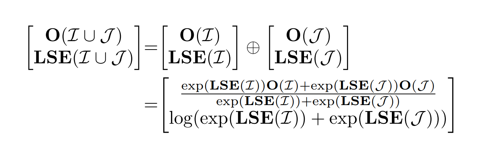
*Merge Attention States*

Attention 계산은 block으로 나눌 수 있습니다. Block-Parallel Transformer(BPT)는 같은 query와 서로 다른 key/value에 대해, 각 block의 O와 scaling factor LSE를 함께 보관하면 Attention Output(O)을 조합할 수 있음을 보여줍니다. decode 단계에서는 보통 query가 매우 작습니다. 예를 들어 query length가 1인 반면, key와 value는 sequence length만큼 깁니다. 따라서 긴 sequence에서는 key/value를 먼저 block으로 나누고, 각 block이 자신의 Attention 결과와 block에 대응되는 LSE를 기록한 뒤, 마지막에 scaling factor로 합칠 수 있습니다. 이것이 이른바 **Merge Attention States**입니다. Chunked-Prefill, Prefix-Cache, Split-KV 장면에서 의미가 있습니다.

`q`를 하나의 query, `I`를 index set(tokens)이라고 합시다. **LSE(log-exp-sum)**는 다음과 같이 정의할 수 있습니다.

```text
LSE(I) = log sum_{i in I} exp(q · k_i)
```

여기서 `k_i`는 i번째 key vector입니다. 대응되는 **attention output** `O(I)`는 다음과 같습니다.

```text
O(I) = sum_{i in I} exp(q · k_i) / exp(LSE(I)) · v_i
```

`I`의 **Attention States**는 attention output O와 attention scaling factor로 구성된 tuple로 정의합니다. 그러면 `I ∪ J`의 최종 Attention Output은 `I`와 `J`의 attention states를 조합하고 scaling하여 얻을 수 있습니다.

```text
[O(I ∪ J), LSE(I ∪ J)]
  = [O(I), LSE(I)] ⊕ [O(J), LSE(J)]
  = [
      (exp(LSE(I)) O(I) + exp(LSE(J)) O(J)) /
      (exp(LSE(I)) + exp(LSE(J))),
      log(exp(LSE(I)) + exp(LSE(J)))
    ]
```

사실 Merge Attention States가 하는 일은 매우 단순합니다. 두 block의 Attention 결과를 마지막에 보정해 합치는 것입니다.

### 0x02 PyTorch 구현

먼저 간단한 PyTorch 버전을 작성합니다. 이후 CUDA와 Triton 연산자의 수치 정확도를 대조하기 편합니다.

```python
# Naive PyTorch Implements section 2.2 of https://www.arxiv.org/pdf/2501.01005
# can be used to combine partial attention results (in the split-KV case)
def merge_attn_states_torch(
        output: torch.Tensor,  # [NUM_TOKENS, NUM_HEADS, HEAD_SIZE]
        prefix_output: torch.Tensor,  # [NUM_TOKENS, NUM_HEADS, HEAD_SIZE]
        prefix_lse: torch.Tensor,  # [NUM_HEADS, NUM_TOKENS]
        suffix_output: torch.Tensor,  # [NUM_TOKENS, NUM_HEADS, HEAD_SIZE]
        suffix_lse: torch.Tensor,  # [NUM_HEADS, NUM_TOKENS]
        output_lse: Optional[torch.Tensor] = None,  # [NUM_HEADS, NUM_TOKENS]
):
    p_lse = prefix_lse
    s_lse = suffix_lse
    # inf -> -inf. inf 값이 output을 NaN으로 만드는 것을 피하기 위함. exp(inf)=nan, exp(-inf)=0
    p_lse[p_lse == torch.inf] = -torch.inf
    s_lse[s_lse == torch.inf] = -torch.inf
    # max_lse [NUM_HEADS, NUM_TOKENS]
    max_lse = torch.maximum(p_lse, s_lse)
    # 최대값을 빼는 것은 safe softmax의 일반적인 처리
    p_lse = p_lse - max_lse
    s_lse = s_lse - max_lse
    p_lse_exp = torch.exp(p_lse)
    s_lse_exp = torch.exp(s_lse)
    out_se = (p_lse_exp + s_lse_exp)
    if output_lse is not None:
        output_lse = torch.log(out_se) + max_lse
    # 각자의 scale 값 계산
    p_scale = p_lse_exp / out_se  # [NUM_HEADS, NUM_TOKENS]
    s_scale = s_lse_exp / out_se  # [NUM_HEADS, NUM_TOKENS]
    p_scale = torch.transpose(p_scale, 0,
                              1).unsqueeze(2)  # [NUM_TOKENS, NUM_HEADS, 1]
    s_scale = torch.transpose(s_scale, 0,
                              1).unsqueeze(2)  # [NUM_TOKENS, NUM_HEADS, 1]
    # 결과를 보정해 최종 Attention 출력 획득
    output = prefix_output * p_scale + suffix_output * s_scale 
    return output, output_lse
```

### 0x03 Triton 기본 연산자

PyTorch 구현은 작은 op를 많이 사용하고 Tensor에 inplace write도 수행하므로 당연히 성능이 낮습니다. 따라서 vLLM은 PyTorch 구현을 직접 사용하지 않고 Triton 기반 kernel을 제공합니다. 전체 코드 링크는 `attention/ops/triton_merge_attn_states.py`입니다. 주요 흐름은 다음과 같습니다.

**data load 및 inf 처리**

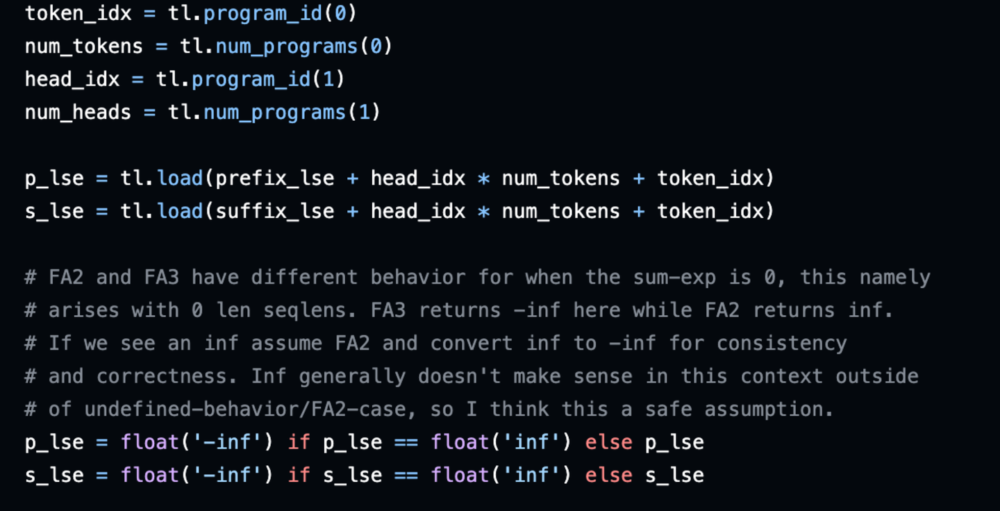
*data load 및 inf 처리*

**safe-softmax: 최대값 빼기**

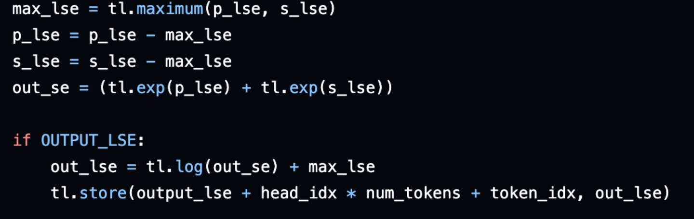
*safe-softmax*

**마지막 보정:** `prefix_output`과 `suffix_output` 각각의 scale 값을 계산한 뒤, 두 결과의 weighted sum을 최종 출력으로 사용합니다.

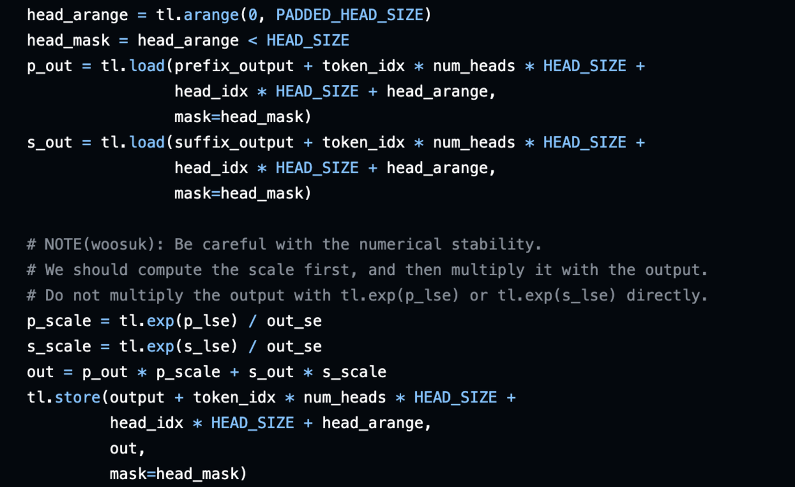
*보정*

Triton kernel이 하는 일은 PyTorch 구현과 같습니다. 다만 모든 연산을 하나의 kernel로 fuse하고, inf 판단을 online으로 register에서 수행합니다. global memory의 값을 직접 수정하지 않으므로 일반적으로 성능이 더 높습니다. 이 kernel의 호출 로직은 다음과 같습니다.

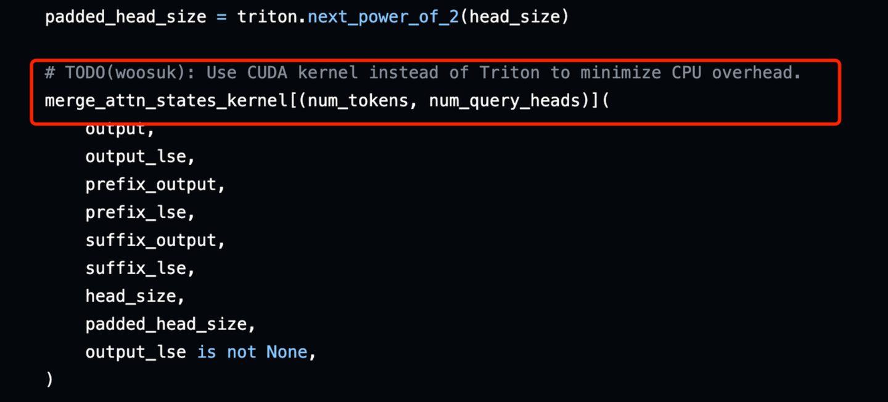
*Triton kernel 호출*

vLLM 구현은 `merge_attn_states_kernel`에 `(num_tokens, num_query_heads)`개의 thread block을 할당합니다. 각 block은 현재 head의 모든 값을 처리합니다. 예를 들어 `head_size=128`이면 이 block이 128개 값을 처리합니다.

### 0x04 Triton 연산자 분석

**기본 분석**

앞 절에서 보았듯 vLLM 구현은 `merge_attn_states_kernel`에 `(num_tokens, num_query_heads)`개의 thread block을 할당하고, 각 block이 현재 head의 모든 값을 처리합니다. `head_size=128`이라면 block 하나가 128개 값을 처리합니다. 하지만 이 방식에는 몇 가지 문제가 있습니다.

첫째, `num_tokens`와 `num_query_heads`가 크고 `head_size`가 작을 때, 예를 들어 32일 때 thread block 수가 지나치게 많아지고 각 block이 처리하는 데이터량은 너무 작아집니다. 계산 밀도가 작고, 이런 상황에서 Triton이 반드시 효율적인 kernel을 생성한다고 보기도 어렵습니다. 둘째, Triton kernel 호출에는 일정한 CPU overhead가 있습니다.


*may have CPU overhead*

**Generated code(PTX) 분석**

여기서는 Triton kernel을 분석하는 간단하고 효과적인 방법을 기록합니다. 물론 ncu, nsys를 함께 쓰면 더 좋습니다. 보통 Triton이 실제 어떤 kernel을 생성했는지, 생성된 PTX가 어떤 형태인지, vectorization을 사용했는지, cp.async가 있는지, coalesced access가 잘 되었는지 알고 싶습니다. 이때 `TRITON_CACHE_DIR` 환경 변수를 지정해 Triton이 생성한 중간 IR 파일을 저장하고 분석할 수 있습니다.

```bash
export TRITON_CACHE_DIR=$(pwd)/cache
pytest -s test_merge_attn_states.py
# Triton이 생성한 중간 IR cache 파일
cache git:(dev) ✗ tree .
.
├── ALGAAi8N-ErdaDbXXL8N91RokvTI-e8O2oEwd0SL3N0
│   └── __triton_launcher.so
├── p4IOvvpWkyeVkuyW8j50rO-ANYlCc5AJOEr70sQD93A
│   ├── __grp__merge_attn_states_kernel.json
│   ├── merge_attn_states_kernel.cubin
│   ├── merge_attn_states_kernel.json
│   ├── merge_attn_states_kernel.llir
│   ├── merge_attn_states_kernel.ptx
│   ├── merge_attn_states_kernel.ttgir
│   └── merge_attn_states_kernel.ttir
└── q4oIpkjOtdHHfi8xBkm4jC4JWIk5AjKtN8WRkZb8MD8
    └── cuda_utils.so
```

여기서는 주로 `merge_attn_states_kernel.ptx` PTX 파일만 보면 됩니다. 예를 들어 `num_tokens=512`, `num_query_heads=16`, `head_size=32`일 때 생성된 PTX 일부는 다음과 같습니다.

```ptx
        @%p8 ld.global.b16 { %rs3 }, [ %rd16 + 0 ]; // non-vectorized load
	// ......
	@%p8 ld.global.b16 { %rs4 }, [ %rd17 + 0 ];
	// end inline asm
	.loc	1 85 30                         // triton_merge_attn_states.py:85:30
	div.full.f32 %r15, %r16, %r17;
	// ......
	mov.b32 	%f49, %r15;
	.loc	1 86 30                         // triton_merge_attn_states.py:86:30
        // ......
	mov.b32 	%r23, %f54;
	// begin inline asm
	cvt.rn.bf16.f32 %rs6, %r23;
	// end inline asm
	and.b32  	%r30, %r25, 96;
	setp.eq.s32 	%p10, %r30, 0;
	// begin inline asm
	@%p10 st.global.b16 [ %rd18 + 0 ], { %rs6 }; // non-vectorized store
```

이 경우 Triton은 효율적인 vectorized `ld/st` instruction을 생성하지 않고 `ld.global.b16`, `st.global.b16`을 사용합니다. 따라서 custom CUDA Kernel을 작성하고 수동으로 coalesced memory access를 보장하면 일정한 성능 이득을 기대할 수 있습니다.

### 0x05 CUDA 연산자 최적화

`merge_attn_states`의 로직은 매우 단순하므로 대응되는 CUDA 구현도 빠르게 작성할 수 있습니다. 이런 유형의 kernel에서 가장 중요한 최적화는 coalesced memory access입니다. 먼저 **`vllm/csrc/attention`**에 **`merge_attn_states.cu`**를 추가합니다.

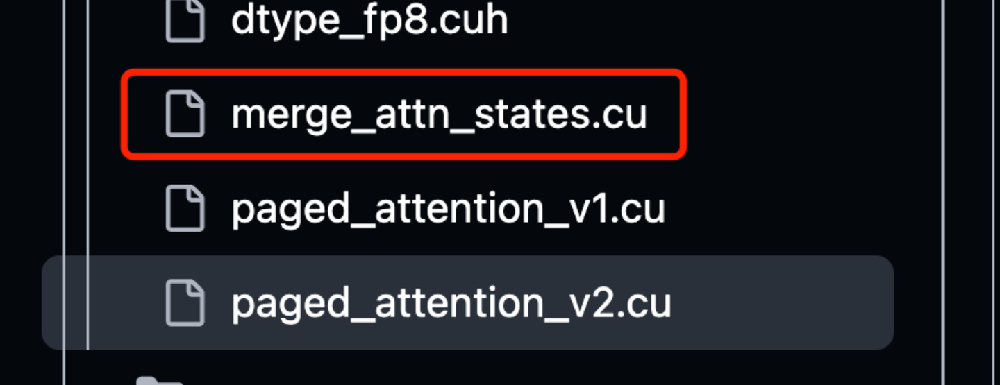
*merge_attn_states.cu*

새 `.cu` 파일을 추가했으므로 `CMakeList.txt`에도 추가해야 합니다.

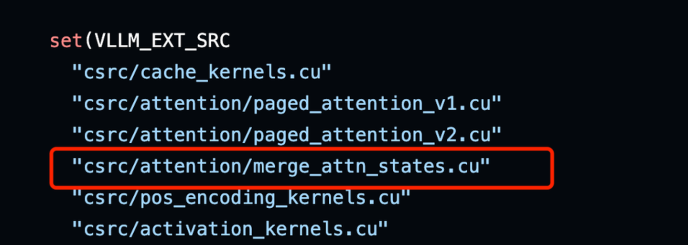
*CMakeList.txt 수정*

최종 CUDA 연산자는 다음과 같습니다. `NUM_THREADS` 기본값은 현재 128, 즉 128개 thread로 설정합니다.

```cpp
namespace vllm {

// Implements section 2.2 of https://www.arxiv.org/pdf/2501.01005
// can be used to combine partial attention results (in the split-KV case)
template <typename scalar_t, const uint NUM_THREADS>
__global__ void merge_attn_states_kernel(
    scalar_t* output, float* output_lse, const scalar_t* prefix_output,
    const float* prefix_lse, const scalar_t* suffix_output,
    const float* suffix_lse, const uint num_tokens, const uint num_heads,
    const uint head_size) {
  using pack_128b_t = uint4;
  const uint pack_size = 16 / sizeof(scalar_t);
  const uint threads_per_head = head_size / pack_size;

  const uint global_idx = blockIdx.x * NUM_THREADS + threadIdx.x;
  const uint token_head_threads = num_tokens * num_heads * threads_per_head;

  if (global_idx >= token_head_threads) return;

  // global_idx -> token_idx + head_idx + pack_idx
  const uint token_head_idx = global_idx / threads_per_head;
  const uint pack_idx = global_idx % threads_per_head;

  const uint token_idx = token_head_idx / num_heads;
  const uint head_idx = token_head_idx % num_heads;

  const uint pack_offset = pack_idx * pack_size;  // (0~15)*8, etc.
  const uint head_offset =
      token_idx * num_heads * head_size + head_idx * head_size;
  const scalar_t* prefix_head_ptr = prefix_output + head_offset;
  const scalar_t* suffix_head_ptr = suffix_output + head_offset;
  scalar_t* output_head_ptr = output + head_offset;

  float p_lse = prefix_lse[head_idx * num_tokens + token_idx];
  float s_lse = suffix_lse[head_idx * num_tokens + token_idx];
  p_lse = std::isinf(p_lse) ? -std::numeric_limits<float>::infinity() : p_lse;
  s_lse = std::isinf(s_lse) ? -std::numeric_limits<float>::infinity() : s_lse;

  const float max_lse = fmaxf(p_lse, s_lse);
  p_lse = p_lse - max_lse;
  s_lse = s_lse - max_lse;
  const float p_se = expf(p_lse);
  const float s_se = expf(s_lse);
  const float out_se = p_se + s_se;
  const float p_scale = p_se / out_se;
  const float s_scale = s_se / out_se;

  if (pack_offset < head_size) {
    // Pack 128b load
    pack_128b_t p_out_pack = reinterpret_cast<const pack_128b_t*>(
        prefix_head_ptr)[pack_offset / pack_size];
    pack_128b_t s_out_pack = reinterpret_cast<const pack_128b_t*>(
        suffix_head_ptr)[pack_offset / pack_size];
    pack_128b_t o_out_pack;

#pragma unroll
    for (uint i = 0; i < pack_size; ++i) {
      // Always use float for FMA to keep high precision.
      // half(uint16_t), bfloat16, float -> float.
      const float p_out_f =
          vllm::to_float(reinterpret_cast<const scalar_t*>(&p_out_pack)[i]);
      const float s_out_f =
          vllm::to_float(reinterpret_cast<const scalar_t*>(&s_out_pack)[i]);
      // fma: a * b + c = p_out_f * p_scale + (s_out_f * s_scale)
      const float o_out_f = p_out_f * p_scale + (s_out_f * s_scale);
      // float -> half(uint16_t), bfloat16, float.
      vllm::from_float(reinterpret_cast<scalar_t*>(&o_out_pack)[i], o_out_f);
    }

    // Pack 128b storage
    reinterpret_cast<pack_128b_t*>(output_head_ptr)[pack_offset / pack_size] =
        o_out_pack;
  }
  // We only need to write to output_lse once per head.
  if (output_lse != nullptr && pack_idx == 0) {
    float out_lse = logf(out_se) + max_lse;
    output_lse[head_idx * num_tokens + token_idx] = out_lse;
  }
}

}  // namespace vllm
```

`NUM_THREADS` 기본값은 현재 128입니다. thread block layout은 더 이상 `(num_tokens, num_query_heads)` layout을 사용하지 않습니다. 그 방식은 `head_size`가 작을 때 vectorization을 효율적으로 만들기 어렵기 때문입니다. 대신 `num_tokens`, `num_query_heads`, `head_size`를 하나의 dimension으로 flatten하여 통합 처리합니다. grid와 block 구성 로직은 다음과 같습니다.

```cpp
  // process one pack elements per thread. float -> 4, half/bf16 -> 8
  const uint threads_per_head = head_size / pack_size;
  const uint total_threads = num_tokens * num_heads * threads_per_head;

  dim3 block(NUM_THREADS);
  dim3 grid((total_threads + NUM_THREADS - 1) / NUM_THREADS);
```

그런 다음 kernel 내부에서 `block_idx`와 `thread_idx`로 대응되는 `token_idx`, `head_idx`, `pack_idx`를 역산합니다. 아래 코드에서 `token_head_threads`는 필요한 총 thread 수입니다. 각 thread는 하나의 pack 데이터를 처리합니다. float32의 경우 128 bits pack 하나가 float 4개를 포함하고, half/bfloat16의 경우 데이터 8개를 포함합니다. block은 고정으로 128 thread를 사용하므로 마지막 block에는 사용되지 않는 thread가 있을 수 있습니다. `token_head_idx`는 `num_tokens * num_heads`를 의미하고, `pack_idx`는 현재 thread가 `head_size` 안에서 몇 번째 pack 데이터를 처리하는지를 나타냅니다. 예를 들어 `head_size=128`, dtype이 half라면 총 `128/(16/2)=16`개 pack을 처리해야 하며, 코드에서는 `threads_per_head = head_size / pack_size`에 대응됩니다.

```cpp
  const uint pack_size = 16 / sizeof(scalar_t);
  const uint threads_per_head = head_size / pack_size;

  const uint global_idx = blockIdx.x * NUM_THREADS + threadIdx.x;
  const uint token_head_threads = num_tokens * num_heads * threads_per_head;

  if (global_idx >= token_head_threads) return;

  // global_idx -> token_idx + head_idx + pack_idx
  const uint token_head_idx = global_idx / threads_per_head;
  const uint pack_idx = global_idx % threads_per_head;

  const uint token_idx = token_head_idx / num_heads;
  const uint head_idx = token_head_idx % num_heads;
```

역산한 `token_idx`, `head_idx`, `pack_idx`로 현재 thread에 대한 각 Tensor pointer의 offset을 계산할 수 있습니다. 코드의 `pack_offset`과 `head_offset`이 그것입니다. `head_offset`은 현재 처리하는 token의 어느 head인지를 뜻하고, `pack_offset`은 그 head의 `head_size` 안에서 pack 단위의 offset을 나타냅니다.

```cpp
  const uint pack_offset = pack_idx * pack_size;  // (0~15)*8, etc.
  const uint head_offset =
      token_idx * num_heads * head_size + head_idx * head_size;
```

global memory access는 kernel 안에서 128b granularity를 강제로 사용합니다. 여기서 `pack_128b_t`로 어떤 타입을 쓰는지는 사실 중요하지 않습니다. `uint4`든 `float4`든 최종적으로는 같은 **`ld/st.global.v4.b32`** PTX instruction으로 변환됩니다. 이 점을 이해하면 vectorization을 어떻게 해야 하는지에 대한 고민이 줄어듭니다. 또한 register도 addressable하므로, 데이터를 pack으로 load한 뒤 pointer를 원래 `scalar_t` 타입으로 cast하면 됩니다.

vLLM에는 vectorization을 관리하는 `Vec` 클래스가 있습니다. 또 어떤 tutorial은 union 구조체로 Pack을 구성하는 방법을 설명합니다. 하지만 기본으로 돌아가면 `uint4`/`float4`만으로도 충분하다고 생각합니다. 간결하고 추가 abstraction이 필요 없으며 이해하기 쉽습니다. 이런 사용법은 제 학습 노트인 xlite-dev/CUDA-Learn-Notes에서도 많이 사용했습니다.

```cpp
    using pack_128b_t = uint4; // 128 bits
    // Pack 128b load
    pack_128b_t p_out_pack = reinterpret_cast<const pack_128b_t*>(
        prefix_head_ptr)[pack_offset / pack_size];
    pack_128b_t s_out_pack = reinterpret_cast<const pack_128b_t*>(
        suffix_head_ptr)[pack_offset / pack_size];
    // cast to scalar_t and convert to float
    const float p_out_f =
          vllm::to_float(reinterpret_cast<const scalar_t*>(&p_out_pack)[i]);
    const float s_out_f =
          vllm::to_float(reinterpret_cast<const scalar_t*>(&s_out_pack)[i]);
    // fma: a * b + c = p_out_f * p_scale + (s_out_f * s_scale)
    const float o_out_f = p_out_f * p_scale + (s_out_f * s_scale);
    // Pack 128b storage
    reinterpret_cast<pack_128b_t*>(output_head_ptr)[pack_offset / pack_size] =
        o_out_pack;
```

### 0x06 NCU Profile 분석

마지막으로 ncu로 실제 실행된 PTX와 SASS가 어떤 형태인지 확인할 수 있습니다. 잡아 보면 다음과 같고, 실제로 vectorized **`ld/st.global.v4.b32`** instruction이 사용된 것을 볼 수 있습니다. 조건은 `num_tokens=512`, `num_heads=16`, `head_size=128`입니다.

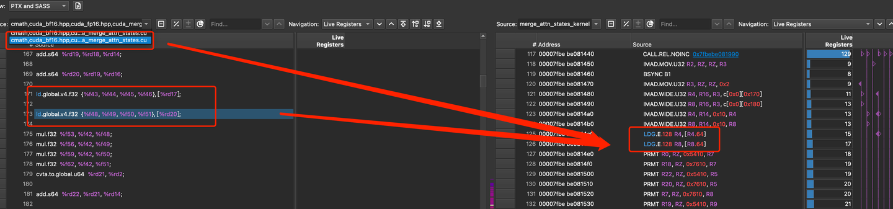
*CUDA kernel NCU profile*

Triton kernel을 ncu로 잡아 보면 다음과 같고, `ld/st.global.b16`을 사용합니다. 조건은 동일하게 `num_tokens=512`, `num_heads=16`, `head_size=128`입니다.

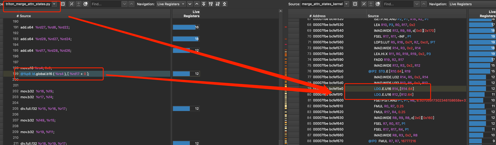
*Triton kernel NCU profile*

memory throughput을 비교하면 `45.67(Triton kernel) -> 60.57(CUDA kernel)`입니다.

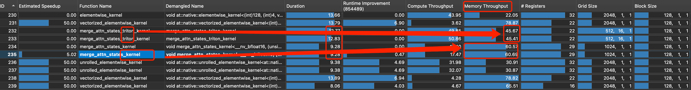
*memory throughput*

컴파일 명령과 ncu profile 명령도 붙입니다. 코드 링크는 글 끝을 참고하세요. PTX를 잡으려면 compile 시 `-g`를 넣어야 합니다.

**컴파일 옵션**

```python
lib = load(
    name='merge_attn_states_cuda', 
    sources=['cuda_merge_attn_states.cu'], 
    extra_cuda_cflags=[
        "-O3",
        "-U__CUDA_NO_HALF_OPERATORS__",
        "-U__CUDA_NO_HALF_CONVERSIONS__",
        "-U__CUDA_NO_HALF2_OPERATORS__",
        "-U__CUDA_NO_BFLOAT16_CONVERSIONS__",
        "--expt-relaxed-constexpr",
        "--expt-extended-lambda",
        "--generate-line-info -g", # for NCU debugging
        # "--use_fast_math"
    ], 
    extra_cflags=['-std=c++17'],
    verbose=True
)
```

**ncu profile**: 이후 NCU client로 profile 파일을 열면 됩니다.

```bash
ncu -o merge_attn_states.prof -f pytest -s test_merge_attn_states.py
```

### 0x07 Dispatch 로직

CUDA 개발이 끝나면 여러 dtype 지원도 고려해야 합니다. 최소한 float32, half, bfloat16 세 가지 기본 dtype을 지원해야 합니다. 즉 dtype에 따라 kernel을 dispatch해야 합니다. 이 부분은 구현이 쉽습니다. `page_atttention_v2.cu`의 macro를 참고해 비슷하게 작성하면 됩니다.

```cpp
// The following macro is used to dispatch the conversion function based on
// the output data type. The FN is a macro that calls a function with
// template<typename scalar_t>.
#define DISPATCH_BY_SCALAR_DTYPE(scalar_dtype, fn)                      \
  {                                                                     \
    if (scalar_dtype == at::ScalarType::Float) {                        \
      fn(float);                                                        \
    } else if (scalar_dtype == at::ScalarType::Half) {                  \
      fn(uint16_t);                                                     \
    } else if (scalar_dtype == at::ScalarType::BFloat16) {              \
      fn(__nv_bfloat16);                                                \
    } else {                                                            \
      TORCH_CHECK(false, "Unsupported data type of O: ", scalar_dtype); \
    }                                                                   \
  }

#define LAUNCH_MERGE_ATTN_STATES(scalar_t, NUM_THREADS)                     \
  {                                                                         \
    vllm::merge_attn_states_kernel<scalar_t, NUM_THREADS><<<grid, block>>>( \
        reinterpret_cast<scalar_t*>(output.data_ptr()), output_lse_ptr,     \
        reinterpret_cast<scalar_t*>(prefix_output.data_ptr()),              \
        reinterpret_cast<float*>(prefix_lse.data_ptr()),                    \
        reinterpret_cast<scalar_t*>(suffix_output.data_ptr()),              \
        reinterpret_cast<float*>(suffix_lse.data_ptr()), num_tokens,        \
        num_heads, head_size);                                              \
  }

template <typename scalar_t>
void merge_attn_states_launcher(torch::Tensor& output,
                                std::optional<torch::Tensor> output_lse,
                                const torch::Tensor& prefix_output,
                                const torch::Tensor& prefix_lse,
                                const torch::Tensor& suffix_output,
                                const torch::Tensor& suffix_lse) {
  constexpr uint NUM_THREADS = 128;
  // ......
  LAUNCH_MERGE_ATTN_STATES(scalar_t, NUM_THREADS);
}

#define CALL_MERGE_ATTN_STATES_LAUNCHER(scalar_t)                           \
  {                                                                         \
    merge_attn_states_launcher<scalar_t>(output, output_lse, prefix_output, \
                                         prefix_lse, suffix_output,         \
                                         suffix_lse);                       \
  }

void merge_attn_states(torch::Tensor& output,
                       std::optional<torch::Tensor> output_lse,
                       const torch::Tensor& prefix_output,
                       const torch::Tensor& prefix_lse,
                       const torch::Tensor& suffix_output,
                       const torch::Tensor& suffix_lse) {
  DISPATCH_BY_SCALAR_DTYPE(output.dtype(), CALL_MERGE_ATTN_STATES_LAUNCHER);
}
```

### 0x08 PyTorch binding

PyTorch에서 kernel을 사용하려면 binding이 필요합니다. 먼저 `vllm/csrc/ops.h` header에 함수 정의를 추가하고, 지원하는 hardware 제한도 고려해야 합니다. 예를 들어 현재는 AMD GPU를 지원하지 않습니다.

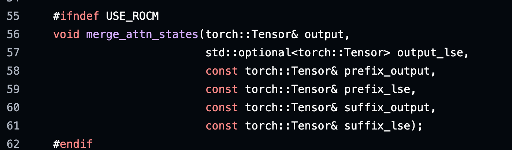
*ops.h*

`vllm/csrc/ops.h`에 정의를 추가한 뒤 `torch_binding.cpp`에 pybind를 추가합니다.

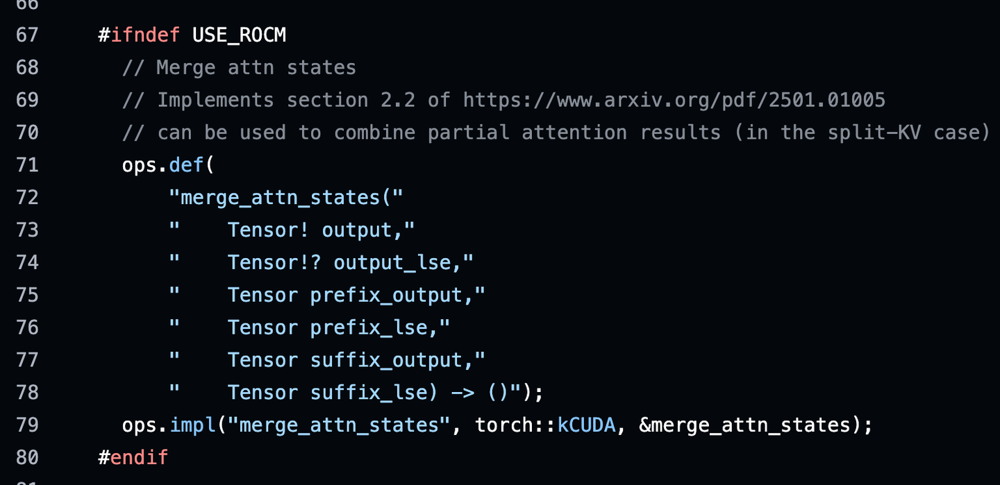
*torch_binding.cpp*

pybind 문법을 간단히 설명하면, 이 문법 표기는 PyTorch 특유의 것입니다. `Tensor`는 tensor를 의미하고, `!`는 writable, `?`는 None 가능을 의미합니다. 자세한 내용은 다음 참고를 보면 됩니다.

```cpp
// Note on op signatures:
// The X_meta signatures are for the meta functions corresponding to op X.
// They must be kept in sync with the signature for X. Generally, only
// functions that return Tensors require a meta function.
//
// See the following links for detailed docs on op registration and function
// schemas.
// https://docs.google.com/document/d/1_W62p8WJOQQUzPsJYa7s701JXt0qf2OfLub2sbkHOaU/edit#heading=h.ptttacy8y1u9
// https://github.com/pytorch/pytorch/blob/main/aten/src/ATen/native/README.md#annotations
```

### 0x09 custom ops 래핑

pybind가 끝나면 `vllm/_custom_ops.py`에서 kernel을 통일된 Python API로 래핑해야 합니다.

```python
# merge attn states ops
def merge_attn_states(output: torch.Tensor,
                      prefix_output: torch.Tensor,
                      prefix_lse: torch.Tensor,
                      suffix_output: torch.Tensor,
                      suffix_lse: torch.Tensor,
                      output_lse: Optional[torch.Tensor] = None) -> None:
    torch.ops._C.merge_attn_states(output, output_lse, prefix_output,
                                   prefix_lse, suffix_output, suffix_lse)
```

### 0x0a fallback 로직

우리가 작성한 kernel은 일부 dtype만 지원하고 FP8 등은 지원하지 않습니다. 또한 vectorization을 강제로 사용하므로 head_size가 `pack_size`의 정수 배여야 합니다. 대부분의 경우 이 조건은 만족됩니다. 그래도 마지막에 fallback 로직을 작성하는 것이 좋습니다. 지원하지 않는 경우 Triton kernel로 fallback하면 됩니다.

```python
def merge_attn_states(
    output: torch.Tensor,
    prefix_output: torch.Tensor,
    prefix_lse: torch.Tensor,
    suffix_output: torch.Tensor,
    suffix_lse: torch.Tensor,
    output_lse: Optional[torch.Tensor] = None,
) -> None:

    # NOTE(DefTruth): Currently, custom merge_attn_states CUDA kernel
    # is not support for FP8 dtype, fallback to use Triton kernel.
    def supported_dtypes(o: torch.Tensor) -> bool:
        return o.dtype in [torch.float32, torch.half, torch.bfloat16]

    # NOTE(DefTruth): Currently, custom merge_attn_states CUDA
    # kernel load/store 128b(16 bytes) per memory issue within
    # thread. Namely, the headsize(headdim) must be multiple of
    # pack_size (float32 -> 4, half/bfloat16 -> 8).
    def supported_headdim(o: torch.Tensor) -> bool:
        headdim = o.shape[2]  # [NUM_TOKENS, NUM_HEADS, HEAD_SIZE]
        if o.dtype == torch.float32:
            return headdim % 4 == 0
        return headdim % 8 == 0

    if (current_platform.is_cuda() and supported_dtypes(output)
            and supported_headdim(output)):
        from vllm._custom_ops import merge_attn_states
        return merge_attn_states(output, prefix_output, prefix_lse,
                                 suffix_output, suffix_lse, output_lse)
    else:
        from vllm.attention.ops.triton_merge_attn_states import (
            merge_attn_states)
        return merge_attn_states(output, prefix_output, prefix_lse,
                                 suffix_output, suffix_lse, output_lse)
```

### 0x0b 단위 테스트

연산자를 작성할 때 단위 테스트는 필수입니다. custom CUDA operator가 Triton보다 성능이 좋고 수치 정확도도 일치해야 의미가 있습니다. 전체 단위 테스트 코드는 `tests/kernels/test_merge_attn_states.py`에 있습니다. 아래는 한 case의 테스트 결과입니다.

```text
pytest -s test_merge_attn_states.py
----------------------------------------------------------------------------------------------------
NUM_TOKENS:512, NUM_HEADS:16, HEAD_SIZE:128, DTYPE: torch.float16, Device: NVIDIA L20
 Torch time: 0.149299ms
Triton time: 0.050995ms
  CUDA time: 0.015722ms, Performance: 3.24364x
----------------------------------------------------------------------------------------------------
Output all match, max abs diff:
 (CUDA  vs Triton): 0.0009765625
(Triton vs Torch) : 0.0015368461608886719
  (CUDA vs Torch) : 0.0015368461608886719
----------------------------------------------------------------------------------------------------
Output LSE all match, max abs diff:
(Triton vs Torch) : 2.384185791015625e-07
  (CUDA vs Torch) : 0.0
  (CUDA vs Triton): 2.384185791015625e-07
----------------------------------------------------------------------------------------------------
All output values test passed! All inf values are correctly replaced with -inf.
----------------------------------------------------------------------------------------------------
```

### 0x0c 성능 평가

`tests/kernels/test_merge_attn_states.py`를 실행하면 성능 비교 markdown table이 자동으로 생성됩니다. Triton 대신 CUDA kernel을 사용하면 CPU overhead를 최대한 줄이고 kernel 성능을 높일 수 있습니다. Triton kernel과 비교해 이 글에서 구현한 CUDA kernel은 최대 3배의 operator speedup을 달성할 수 있습니다. 현재 **PR도 vLLM에 merge되었습니다.** `[Kernel] support merge_attn_states CUDA kernel, 3x speedup by DefTruth · Pull Request #16173 · vllm-project/vllm`

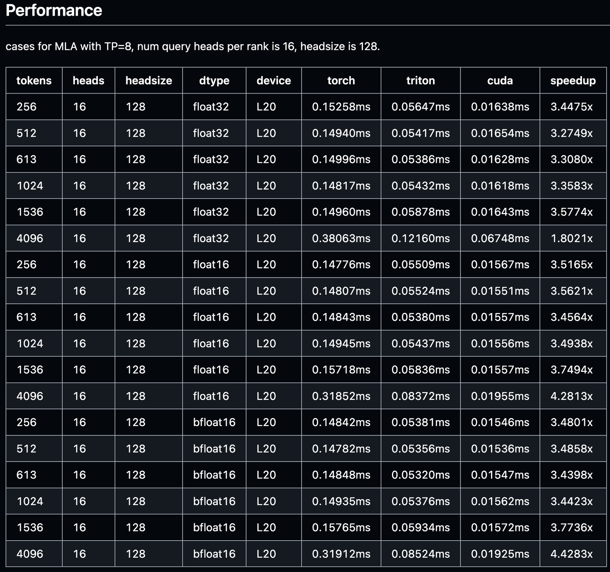
*성능 평가*

### 0x0d 정확도 평가

operator 수준 정확도 평가 외에도 evalscope로 end-to-end 정확도 regression을 돌릴 수 있습니다. 예를 들어 CEval benchmark입니다.

```bash
evalscope eval \
 --model /workspace/dev/hf_models/DeepSeek-R1 \
 --api-url http://0.0.0.0:8862/v1/chat/completions \
 --api-key EMPTY \
 --eval-batch-size 32 \
 --eval-type service \
 --datasets ceval \
 --dataset-args '{"ceval": {"local_path": "/workspace/dev/openllm/benchmarks/data/ceval"}}'
```

Total AverageAccuracy: 0.90997884615385. 각 테스트 결과에는 어느 정도 randomness가 있습니다.

### 0x0e 정리

이 글은 `merge_attn_states` 연산자를 통해 vLLM에서 operator를 개발하는 일반적인 흐름을 소개했습니다. 내용은 Merge Attention States 소개, PyTorch 구현, Triton 기본 연산자, Triton 연산자 분석, CUDA 연산자 최적화, Dispatch 로직, PyTorch binding, custom ops 래핑, fallback 로직, 단위 테스트, 성능 평가, 정확도 평가를 포함합니다.

최종적으로 Triton 대신 CUDA kernel을 사용하면 CPU overhead를 최대한 줄이고 성능을 높일 수 있습니다. Triton kernel과 비교해 이 글에서 구현한 CUDA kernel은 최대 3배의 operator speedup을 달성할 수 있습니다. 현재 **PR도 vLLM에 merge되었습니다.** `[Kernel] support merge_attn_states CUDA kernel, 3x speedup by DefTruth · Pull Request #16173 · vllm-project/vllm`

더 많은 기술 노트와 CUDA 학습 노트는 LeetCUDA를 참고해 주세요. LeetCUDA에는 **LLM/VLM** 글 정리와 **FlashAttention, SGEMM, HGEMM, GEMV** 등 흔히 쓰이는 **CUDA Kernel**의 **예제 구현**이 포함되어 있으며, 현재 누적 **3k+ stars**를 달성했습니다. 링크: xlite-dev/LeetCUDA

이 kernel은 현재 제 학습 노트에도 별도로 떼어 두었으니, 관심 있는 분은 직접 실험해 볼 수 있습니다.

늘 그렇듯 오류가 있으면 먼저 올린 뒤 수정하겠습니다.
