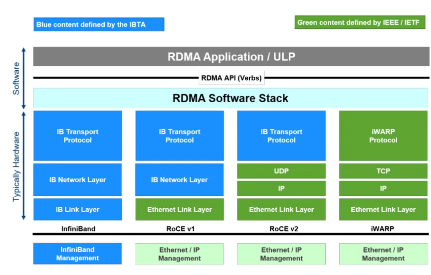
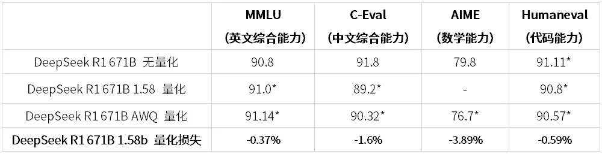

# [vLLM 실전] vLLM + DeepSeek-R1 671B 다중 머신 배포 및 버그 수정 노트

> 원문: https://zhuanlan.zhihu.com/p/29950052712

**목차**
- 0x00 서문
- 0x01 기본 환경
- 0x02 vLLM 소스 빌드
- 0x03 다중 머신 환경 구성
- 0x04 다중 머신 interconnect 확인
- 0x05 Ray 클러스터 시작
- 0x06 다중 머신 서비스 시작
- 0x07 서비스 테스트
- 0x08 성능 평가
- 0x09 Fused MoE 튜닝
- 0x0a W8A8 Block FP8 튜닝
- 0x0b AWQ INT4 W4A16
- 0x0c 정확도 평가
- 0x0d 정리

### 0x00 서문

**이 글은 실전 과정을 기록할 뿐 원리는 설명하지 않습니다.** DeepSeek의 인기가 점점 커지고 있습니다. R1 671B FP8 모델 weight만 해도 거의 700GB에 가깝습니다. 일반적인 환경에서는 한 대의 서버에 모두 담기 어렵기 때문에 이런 경우 다중 머신 배포가 필요합니다.

오픈소스 프레임워크 대부분은 다중 머신 배포를 지원합니다. 예를 들어 vLLM, SGLang, TensorRT-LLM 등이 있습니다. SGLang은 현재 PP를 지원하지 않고 다중 머신 TP를 지원합니다. vLLM과 TRT-LLM은 PP를 지원합니다. vLLM은 사용 난이도가 낮고 커뮤니티가 활발하며, 문제가 생기면 issue에서 대부분 단서를 찾을 수 있습니다. 그래서 이 글에서는 vLLM 프레임워크를 선택해 **R1 671B** 다중 머신 배포 사례를 다루고, 소스 빌드부터 각 단계를 자세히 기록합니다.

테스트 과정에서 크고 작은 버그를 만났고, 몇 개 PR을 올려 수정했습니다. 일부는 merge되었고 일부는 아직 merge되지 않았습니다. 비슷한 문제를 만난 분은 해당 PR을 pick해서 해결할 수 있습니다.

- [Bugfix][W8A8] fixed cutlass block fp8 binding (merged)
- [Bugfix][V1] Fix flashinfer sampling (merged)
- [Bugfix][MLA] Ensure MLA kv_c_normed contiguous for gptq_marlin_gemm
- [Bugfix] fix torch.compiled cache hash
- [W8A8] Add w8a8 block fp8 tuning script

더 많은 기술 노트와 CUDA 학습 노트는 LeetCUDA를 참고해 주세요. LeetCUDA에는 **LLM/VLM** 글 정리와 **FlashAttention, SGEMM, HGEMM, GEMV** 등 흔히 쓰이는 **CUDA Kernel**의 **예제 구현**이 포함되어 있으며, 현재 누적 **3k+ stars**를 달성했습니다. 링크: xlite-dev/LeetCUDA

먼저 공식 배포 문서인 Running vLLM on multiple nodes를 읽어 보는 것이 좋습니다. 이 글의 내용은 다음과 같습니다.

- 0x00 서문
- 0x01 기본 환경
- 0x02 vLLM 소스 빌드
- 0x03 다중 머신 환경 구성
- 0x04 다중 머신 interconnect 테스트
- 0x05 Ray 클러스터 시작
- 0x06 다중 머신 서비스 시작
- 0x07 서비스 테스트
- 0x08 성능 평가
- 0x09 Fused MoE 튜닝
- 0x0a W8A8 Block FP8 튜닝
- 0x0b AWQ INT4 W4A16
- 0x0c 정확도 평가
- 0x0d 정리

### 0x01 기본 환경

깨끗한 환경은 많은 삽질을 줄여 줍니다. vLLM 공식 Dockerfile은 CUDA 12.4 이미지를 사용합니다. 여기서 시작하는 것이 좋은 선택입니다. Dockerfile 링크는 `vllm/Dockerfile at main · vllm-project/vllm`이고, vLLM의 현재 최신 이미지는 `vllm/vllm-openai:v0.7.3`입니다.

```dockerfile
ARG CUDA_VERSION=12.4.1
#################### BASE BUILD IMAGE ####################
# prepare basic build environment
FROM nvidia/cuda:${CUDA_VERSION}-devel-ubuntu20.04 AS base
ARG CUDA_VERSION=12.4.1
ARG PYTHON_VERSION=3.12
ARG TARGETPLATFORM
ENV DEBIAN_FRONTEND=noninteractive
```

물론 실제 요구에 따라 NGC의 PyTorch 이미지를 써도 됩니다. 예를 들면 다음과 같습니다.

```bash
docker pull nvcr.io/nvidia/pytorch:24.05-py3 # NGC
docker pull vllm/vllm-openai:v0.7.3 # vLLM 공식 이미지(추천)
```

저는 `nvcr.io/nvidia/pytorch:24.05-py3`, CUDA 12.4 환경을 사용했습니다. 주된 이유는 소스 빌드를 한 번 직접 돌려 보고 싶었기 때문입니다. 먼저 한 대를 선택해 head container를 시작합니다. 참고로 **vLLM 코드는 CUDA >= 12.4 + SM < 90 환경에서 bug가 있었습니다.** 이미 수정 PR을 올렸습니다: https://github.com/vllm-project/vllm/pull/14796. 최근 Triton MLA 쪽의 이상한 error도 이 bug와 관련되어 보입니다. 수정 후에는 CUDA 12.2 ~ CUDA 12.6에서 잘 실행됩니다.

```bash
# nvcr.io/nvidia/pytorch:24.05-py3 사용
docker run -itd --gpus all --privileged --shm-size 128g --ulimit memlock=-1 \
        -v /data/:/workspace --network=host --name="head" \
        nvcr.io/nvidia/pytorch:24.05-py3 bash
# 또는 vllm/vllm-openai:v0.7.3 (추천)
docker run -itd --gpus all --privileged --shm-size 128g --ulimit memlock=-1 \
        -v /data/:/workspace --network=host --name="head" \
        --entrypoint="/bin/bash" vllm/vllm-openai:v0.7.3
```

head container에 들어가 vLLM 소스를 받습니다.

```bash
git clone https://github.com/vllm-project/vllm.git
```

기본 의존성을 먼저 설치합니다.

```bash
# 먼저 이전 버전 vllm 등을 제거하고 새 vllm 설치 준비
python3 -m pip uninstall vllm -y
# vllm/vllm-openai:v0.7.3 (추천)를 쓰지 않는다면 torch, flash-attn 등을 제거하고 vllm이 요구하는 버전으로 재설치
python3 -m pip uninstall torch flash-attn lightning-thunder torch_tensorrt torchprofile torchvision transformer_engine -y
python3 -m pip config set global.index-url https://mirrors.cloud.tencent.com/pypi/simple
python3 -m pip install --upgrade pip
python3 -m pip install torch==2.6.0 torchvision torchaudio xformers --no-cache
python3 -m pip install flash-attn --no-build-isolation
cd vllm/requirements
python3 -m pip install -r cuda.txt
python3 -m pip install -r build.txt
apt-get install kmod
```

### 0x02 vLLM 소스 빌드

vLLM nightly 버전을 바로 설치할 수도 있고, 소스에서 직접 빌드할 수도 있습니다. nightly 설치 방식은 다음과 같습니다. 추천 방식입니다.

```bash
python3 -m pip install vllm --pre --extra-index-url https://wheels.vllm.ai/nightly
```

또는 소스에서 빌드할 수 있습니다. 시간이 꽤 걸립니다. 저는 `0.7.4.dev415+g0ce356d01`와 `vllm-0.7.4.dev439+g26d1dbecc`를 직접 빌드했습니다. vLLM nightly를 바로 설치했을 때 다중 머신 배포에서 error가 나서, 그냥 직접 빌드하는 쪽을 선택했습니다. 또한 결과가 비정상적이거나 비어 있다면 CUDA 12.2 이미지로 다시 빌드해 보는 것을 추천합니다.

```bash
export MAX_JOBS=32 # 먼저 빌드 JOBS 수를 제한해 메모리를 터뜨리지 않도록 함
cd your-path-to/vllm
python3 setup.py bdist_wheel # 빌드
```

기본값으로는 지원 가능한 모든 architecture를 빌드합니다. 다만 kernel마다 지원하는 architecture 범위는 다릅니다.

```text
-- CUDA Compilation Architectures: 70;72;75;80;86;87;89;90;90a
-- cuBLAS Disabled.
-- Configuring cuBLAS ... done.
-- Building Marlin kernels for archs: 8.0;8.6;8.7;9.0
-- Building AllSpark kernels for archs: 8.0;8.6;8.7
-- Building scaled_mm_c3x_sm90 for archs: 9.0a
-- Not building scaled_mm_c3x_100 as no compatible archs found in CUDA target architectures
-- Building scaled_mm_c2x for archs: 7.5;8.0;8.6;8.7;9.0
-- Building sparse_scaled_mm_c3x for archs: 9.0a
-- Not building NVFP4 as no compatible archs were found.
-- Machete generation script hash: dec2c6596ac38e4b4ac06b8d7ca5054f
-- Last run machete generate script hash:
-- Machete generation completed successfully.
-- Building Machete kernels for archs: 9.0a
-- Enabling C extension.
-- Building Marlin MOE kernels for archs: 8.0;8.6;8.7;9.0
-- Enabling moe extension.
```

빌드를 빠르게 하고 싶다면 특정 architecture만 빌드할 수 있습니다. 예를 들어 Ada architecture만 빌드하려면 torch 환경 변수 **TORCH_CUDA_ARCH_LIST=Ada**를 설정합니다.

```text
# export TORCH_CUDA_ARCH_LIST=Ada && python3 setup.py bdist_wheel
-- CUDA target architectures: 8.9
-- CUDA supported target architectures: 8.9
-- Configuring cublas ...
-- cuBLAS Disabled.
-- Configuring cuBLAS ... done.
-- Building Marlin kernels for archs: 8.9
-- Building AllSpark kernels for archs: 8.9
-- Not building scaled_mm_c3x_sm90 as no compatible archs found in CUDA target architectures
-- Not building scaled_mm_c3x_100 as no compatible archs found in CUDA target architectures
-- Building scaled_mm_c2x for archs: 8.9
-- Not building sparse_scaled_mm_c3x as no compatible archs found in CUDA target architectures
-- Not building NVFP4 as no compatible archs were found.
-- Not building Machete kernels as no compatible archs found in CUDA target architectures
-- Enabling C extension.
-- Building Marlin MOE kernels for archs: 8.9
-- Enabling moe extension.
```

잠시 기다리면 빌드가 끝납니다. 생성된 whl package를 설치합니다.

```bash
python3 -m pip install dist/*.whl
```

vLLM 설치 후 NCCL을 최신 버전으로 업그레이드합니다. 관련 issue: https://github.com/vllm-project/vllm/issues/13136

```bash
python3 -m pip install -U nvidia-nccl-cu12
```

또한 opencv가 정상 import되는지 확인합니다. 안 되면 고정 버전으로 재설치합니다. 관련 issue: https://github.com/vllm-project/vllm/issues/13703

```bash
# AttributeError: module 'cv2.dnn' has no attribute 'DictValue' 해결
python3 -m pip install opencv-python-headless==4.5.4.58
```

새 이미지를 commit한 뒤 다른 node로 보내고 worker node container를 시작합니다.

```bash
docker commit head_container_id vllm-deepseeek-r1:node
```

다른 node에서 worker container를 시작합니다.

```bash
docker run -itd --gpus all --privileged --shm-size 128g --ulimit memlock=-1 \
        -v /data/:/workspace --network=host --name="node" \
        vllm-deepseeek-r1:node bash
```

여기까지 하면 기본 환경이 준비됩니다.

### 0x03 다중 머신 환경 구성

이후 설정에 사용할 network 확인 도구를 먼저 설치합니다.

```bash
apt-get update
apt-get install net-tools # for ifconfig
```

먼저 각 머신의 cross-machine communication 방식이 무엇인지 확인합니다. 가장 중요한 것은 모든 머신의 통신 방식이 동일해야 한다는 점입니다. 예를 들어 모두 IB/RoCE/Ethernet 중 하나로 맞아야 합니다. 어떤 머신만 통신 방식이 다르면 다중 머신 통신이 실패할 수 있으므로, 해당 머신의 통신 방식을 downgrade/upgrade하여 다른 머신과 맞춰야 합니다.

가장 먼저 IB/RoCE가 있는지 확인합니다. `ibv_devinfo`를 사용할 수 있습니다.

```text
# ibv_devinfo
No IB devices found
```

이 로그는 해당 머신에 IB/RoCE가 없고 Ethernet으로 cross-machine communication을 수행한다는 뜻입니다. 또 다른 예시는 다음과 같습니다.

```text
# ibv_devinfo
hca_id:	mlx5_0
	transport:              InfiniBand (0)
	...
	link_layer:		Ethernet
```

`Link layer`가 `InfiniBand`라면 현재 머신이 InfiniBand로 연결되어 있다는 뜻입니다. 위 예시는 `Ethernet`이므로 IB interconnect가 아니라 Ethernet interconnect, 즉 RoCE(RDMA over Converged Ethernet)입니다. RoCE는 latency를 크게 낮출 수 있지만 여전히 IB보다는 높습니다. Mellanox NIC, 예를 들어 ConnectX-5/ConnectX-6 등은 여러 프로토콜을 지원합니다.

- **InfiniBand (IB)**: HPC와 데이터센터에서 자주 쓰는 고속 네트워크 프로토콜
- **Ethernet**: 범용 네트워크 환경에서 널리 쓰이는 표준 Ethernet 프로토콜

`Link layer: Ethernet`이 보이면 해당 NIC가 InfiniBand 모드가 아니라 Ethernet 모드로 구성되어 있다는 뜻입니다. RDMA에서 IB와 RoCE의 차이는 아래 그림처럼 볼 수 있습니다. 더 자세한 내용은 "RDMA AI 高性能通信技术 原理"와 "NVIDIA InfiniBand AI 高性能网络"을 추천합니다.


*RDMA: IB, RoCE and iWARP*

특히 주의해야 할 점은, 어떤 머신은 `No IB devices found`이고 어떤 머신은 IB/RoCE가 있다면 NCCL 사용 시 IB/RoCE를 비활성화해야 정상적인 cross-machine communication이 가능하다는 것입니다. 해당 NCCL 환경 변수는 다음과 같습니다.

```bash
# IB를 꺼야 하는 경우
export NCCL_IB_DISABLE=1
# IBEXT(RoCE)를 꺼야 하는 경우 참고: https://github.com/NVIDIA/nccl/issues/676
export NCCL_IBEXT_DISABLE=1 # 이것도 필요함. 그렇지 않으면 완전히 꺼지지 않음
```

head node와 worker node 모두 설정해야 합니다. 위 환경 변수 외에도 vLLM이 NCCL/GLOO backend로 통신할 수 있도록 `NCCL_SOCKET_IFNAME`, `GLOO_SOCKET_IFNAME`, `VLLM_HOST_IP` 세 환경 변수를 설정해야 합니다. 이 세 값은 각 node의 실제 환경에 맞춰 지정합니다.

`VLLM_HOST_IP`는 각 node 자신의 IP입니다. `NCCL_SOCKET_IFNAME`은 NCCL 통신용 NIC 이름이고, `GLOO_SOCKET_IFNAME`은 GLOO 통신용 NIC 이름입니다. NIC 이름은 `ifconfig`로 찾을 수 있습니다.

```text
# ifconfig -a
.......
eth0:   .......
        inet x.x.x.x  netmask x.x.x.x.x  broadcast x.x.x.x
        ...... (Ethernet)
```

`inet x.x.x.x`가 실제 IP입니다. 실제 IP에 대응하는 첫 번째 NIC 이름을 찾으면 됩니다. 여기서는 `eth0`입니다. 제 case에서는 NCCL과 GLOO 모두 Ethernet으로 cross-machine communication을 수행하므로 환경 변수는 다음처럼 설정했습니다. 참고로 모델 분산 학습 중 `"RuntimeError: Gloo connectFullMesh failed ..."` error가 난 경우에도 이 설정이 도움이 됩니다.

```bash
export GLOO_SOCKET_IFNAME=eth0
export NCCL_SOCKET_IFNAME=eth0
export VLLM_HOST_IP=x.x.x.x
```

마찬가지로 head node와 worker node 모두 설정해야 합니다. 핵심 환경 변수를 요약하면 다음과 같습니다.

```bash
# IB를 꺼야 하는 경우
export NCCL_IB_DISABLE=1
# IBEXT(RoCE)를 꺼야 하는 경우 참고: https://github.com/NVIDIA/nccl/issues/676
export NCCL_IBEXT_DISABLE=1 # 이것도 필요함. 그렇지 않으면 완전히 꺼지지 않음
export GLOO_SOCKET_IFNAME=eth0
export NCCL_SOCKET_IFNAME=eth0
export VLLM_HOST_IP=x.x.x.x
export CUDA_VISIBLE_DEVICES=0,1,2,3,4,5,6,7
```

다시 강조하지만, **head node와 worker node 모두 설정해야 합니다.**

### 0x04 다중 머신 interconnect 확인

모델 서비스를 실행하기 전에 vLLM이 제공하는 NCCL/GLOO interconnect test script를 먼저 통과시키는 것을 강력히 추천합니다. vLLM troubleshooting 문서를 참고해 `check_nccl.py`를 새로 만들고, 내용은 다음과 같이 작성합니다.

```python
# Test PyTorch NCCL
import torch
import torch.distributed as dist
dist.init_process_group(backend="nccl")
local_rank = dist.get_rank() % torch.cuda.device_count()
torch.cuda.set_device(local_rank)
data = torch.FloatTensor([1,] * 128).to("cuda")
dist.all_reduce(data, op=dist.ReduceOp.SUM)
torch.cuda.synchronize()
value = data.mean().item()
world_size = dist.get_world_size()
assert value == world_size, f"Expected {world_size}, got {value}"

print("PyTorch NCCL is successful!")

# Test PyTorch GLOO
gloo_group = dist.new_group(ranks=list(range(world_size)), backend="gloo")
cpu_data = torch.FloatTensor([1,] * 128)
dist.all_reduce(cpu_data, op=dist.ReduceOp.SUM, group=gloo_group)
value = cpu_data.mean().item()
assert value == world_size, f"Expected {world_size}, got {value}"

print("PyTorch GLOO is successful!")

if world_size <= 1:
    exit()

# Test vLLM NCCL, with cuda graph
from vllm.distributed.device_communicators.pynccl import PyNcclCommunicator

pynccl = PyNcclCommunicator(group=gloo_group, device=local_rank)
# pynccl is enabled by default for 0.6.5+,
# but for 0.6.4 and below, we need to enable it manually.
# keep the code for backward compatibility when because people
# prefer to read the latest documentation.
pynccl.disabled = False

s = torch.cuda.Stream()
with torch.cuda.stream(s):
    data.fill_(1)
    out = pynccl.all_reduce(data, stream=s)
    value = out.mean().item()
    assert value == world_size, f"Expected {world_size}, got {value}"

print("vLLM NCCL is successful!")

g = torch.cuda.CUDAGraph()
with torch.cuda.graph(cuda_graph=g, stream=s):
    out = pynccl.all_reduce(data, stream=torch.cuda.current_stream())

data.fill_(1)
g.replay()
torch.cuda.current_stream().synchronize()
value = out.mean().item()
assert value == world_size, f"Expected {world_size}, got {value}"

print("vLLM NCCL with cuda graph is successful!")

dist.destroy_process_group(gloo_group)
dist.destroy_process_group()
```

머신 3대에서 `PP3 + TP8`을 실행한다고 가정하면 테스트 명령은 다음과 같습니다.

```bash
# 3-machine interconnect communication 확인. 각 node에서 같은 명령 실행
NCCL_DEBUG=TRACE torchrun --nnodes 3 --nproc-per-node=8 --rdzv_backend=c10d --rdzv_endpoint=head_node_ip:8887 check_nccl.py
```

아래 로그가 출력되면 통신이 정상입니다. 그렇지 않으면 먼저 이 script를 통과시켜야 합니다.

```text
PyTorch NCCL is successful!
PyTorch GLOO is successful!
vLLM NCCL is successful!
vLLM NCCL with cuda graph is successful!
```

error가 나거나 멈춘다면 NCCL Trace log를 보고 각 머신에서 NCCL이 어떤 통신 방식을 찾았는지 확인합니다.

```text
[7] NCCL INFO NCCL_IBEXT_DISABLE set by environment to 1.
[7] NCCL INFO NCCL_IB_DISABLE set by environment to 1.
[7] NCCL INFO NCCL_SOCKET_IFNAME set by environment to eth0
[7] NCCL INFO NET/Socket : Using [0]eth0.x.x.x.x<0>
[7] NCCL INFO PROFILER/Plugin: Could not find: libnccl-profiler.so.
[7] NCCL INFO Using network Socket # Ethernet 사용
```

로그에 IB/IBEXT가 있다면 IB/RoCE를 찾은 것입니다. 예를 들면 다음과 같습니다.

```text
[7] NCCL INFO Plugin Path : /opt/hpcx/nccl_rdma_sharp_plugin/lib/libnccl-net.so
[7] NCCL INFO P2P plugin v8 IBext_v8
[7] NCCL INFO NCCL_SOCKET_IFNAME set by environment to eth0
[7] NCCL INFO NET/IB : Using [0]={[0] mlx5_0:1/RoCE, [1] mlx5_1:1/RoCE} [RO]; 
[7] NCCL INFO PROFILER/Plugin: Could not find: libnccl-profiler.so.
[7] NCCL INFO Using network IBext_v8
```

여기서 `IBext_v8`과 `mlx5_0:1/RoCE`는 RoCE를 사용한다는 뜻입니다. vLLM으로 다중 머신 배포를 할 때는 모든 머신의 통신 방식이 일치하는지 먼저 확인해야 합니다.

### 0x05 Ray 클러스터 시작

주의: Ray 클러스터를 시작하기 전에 관련 환경 변수를 반드시 먼저 설정해야 합니다.

```bash
# IB를 꺼야 하는 경우
export NCCL_IB_DISABLE=1
# IBEXT(RoCE)를 꺼야 하는 경우 참고: https://github.com/NVIDIA/nccl/issues/676
export NCCL_IBEXT_DISABLE=1 # 이것도 필요함. 그렇지 않으면 완전히 꺼지지 않음
export GLOO_SOCKET_IFNAME=eth0
export NCCL_SOCKET_IFNAME=eth0
export VLLM_HOST_IP=x.x.x.x
export CUDA_VISIBLE_DEVICES=0,1,2,3,4,5,6,7
```

head node 시작:

```bash
ray start --head --port=6667 --disable-usage-stats # head node에서 실행
```

worker node 시작:

```bash
ray start --address='head_node_ip:6667' # 각 worker node에서 실행
# worker 시작 시 port conflict가 발생하면 --min-worker-port와 --max-worker-port로 피할 수 있음
ray start --address="head_node_ip:6667" --min-worker-port 10002 --max-worker-port 18176
```

클러스터 상태 확인:

```bash
ray status
ray list nodes # pip install "ray[default]" 필요
```

클러스터 종료:

```bash
ray stop --force # 각 node에서 실행
```

### 0x06 다중 머신 서비스 시작

여기까지 왔다면 모든 환경 준비가 끝난 것입니다. 이제 다중 머신/다중 GPU로 DeepSeek-R1 full version을 배포할 수 있습니다.

```bash
python3 -m vllm.entrypoints.openai.api_server \
        --model=/workspace/DeepSeek-R1 \
        --dtype=auto \
        --block-size 32 \
        --tokenizer-mode=slow \
        --max-model-len 32768 \
        --max-num-batched-tokens 2048 \
        --tensor-parallel-size 8 \
        --pipeline-parallel-size 3 \
        --gpu-memory-utilization 0.90 \
        --max-num-seqs 128 \
        --trust-remote-code \
        --enable-prefix-caching \
        --enable-chunked-prefill=True \
        --disable-custom-all-reduce \
        --port 6666
```

다중 머신/다중 GPU 서비스가 정상적으로 시작되면 다음과 같은 로그가 나옵니다.

```text
INFO 03-13 10:25:10 [launcher.py:34] Route: /rerank, Methods: POST
INFO 03-13 10:25:10 [launcher.py:34] Route: /v1/rerank, Methods: POST
INFO 03-13 10:25:10 [launcher.py:34] Route: /v2/rerank, Methods: POST
INFO 03-13 10:25:10 [launcher.py:34] Route: /invocations, Methods: POST
INFO:     Started server process [2397]
INFO:     Waiting for application startup.
INFO:     Application startup complete.
```

### 0x07 서비스 테스트

`curl`로 한 번 테스트합니다.

```bash
curl -v http://0.0.0.0:6666/v1/chat/completions \
-H 'Content-Type: application/json' \
-d \
'{ "model": "/workspace/DeepSeek-R1",
"messages": [
{"role": "user", "content": "9.11和9.8哪个数值大？" } ],
"temperature": 0.6,
"repetition_penalty": 1.0,
"top_p": 0.95,
"top_k": 40,
"max_tokens": 4096,
"stream": false}'
```

잠시 후 모델은 9.8이 더 크다고 답합니다.

> 사용자는 9.11과 9.8 중 어떤 수가 더 큰지 물었습니다. 단순해 보이지만 조심해야 합니다. 수학적 비교 규칙에 따르면 먼저 정수 부분을 보고, 같으면 tenths digit, 그다음 hundredths digit을 봅니다. 9.8은 9.80과 같고, tenths digit에서 8이 1보다 크므로 9.8이 9.11보다 큽니다. 따라서 올바른 결론은 9.8이 더 크다는 것입니다.

### 0x08 성능 평가

서비스 성능은 `vLLM/benchmark/benchmark_serving.py`로 빠르게 평가할 수 있습니다. 예를 들면 다음과 같습니다.

```bash
python3 benchmark_serving.py \
        --backend vllm \
        --model /workspace/DeepSeek-R1 \
        --port 6666 \
        --endpoint /v1/completions \
        --dataset-name random \
        --dataset-path ./ShareGPT_V3_unfiltered_cleaned_split.json \
        --random-input-len 4096 \
        --random-output-len 1024 \
        --random-prefix-len 0 \
        --ignore-eos \
        --max-concurrency 16 \
        --num-prompts 32
```

잠시 기다리면 TTFT, TPOT 등의 지표가 출력됩니다.

```text
Starting initial single prompt test run...
Initial test run completed. Starting main benchmark run...
Traffic request rate: inf
Burstiness factor: 1.0 (Poisson process)
Maximum request concurrency: 16
============ Serving Benchmark Result ============
Successful requests:                     32
Benchmark duration (s):                  xxx
Total input tokens:                      xxx
Total generated tokens:                  xxx
Request throughput (req/s):              xxx
Output token throughput (tok/s):         xxx
Total Token throughput (tok/s):          xxx
---------------Time to First Token----------------
Mean TTFT (ms):                          xxx
Median TTFT (ms):                        xxx
P99 TTFT (ms):                           xxx
-----Time per Output Token (excl. 1st token)------
Mean TPOT (ms):                          xxx
Median TPOT (ms):                        xxx
P99 TPOT (ms):                           xxx
---------------Inter-token Latency----------------
Mean ITL (ms):                           xxx
Median ITL (ms):                         xxx
P99 ITL (ms):                            xxx
==================================================
```

### 0x09 Fused MoE 튜닝

서비스 시작 시 일부 머신에서 MoE Config warning이 나올 수 있습니다.

```text
Using default MoE config. Performance might be sub-optimal! Config file not found at /usr/local/lib/python3.10/site-packages/vllm/.../layers/fused_moe/configs/E=256,N=256,device_name=NVIDIA_xxx,dtype=fp8_w8a8,block_shape=[128,128].json
```

이는 현재 머신에서 runtime fused moe 설정이 default config라는 뜻이며, **성능 측면에서 최적이 아닐 수 있습니다.** 이 문제를 해결하려면 현재 머신에서 `vllm/benchmarks/kernels/benchmark_moe.py`를 실행해 fused moe를 tune하고, 최적 성능 config를 얻으면 됩니다. tune을 실행할 때 PP를 켤 필요는 없습니다. 실제 weight를 로드하지 않고, TP Size도 Expert 수 분할 계산 역할만 합니다.

```bash
cd vllm/benchmarks/kernels/
python3 benchmark_moe.py \
        --model /workspace/DeepSeek-R1 \
        --trust-remote-code \
        --dtype fp8_w8a8 \
        --tp-size 8 \
        --tune
```

시간이 꽤 걸리므로 기다려야 합니다. tune이 끝나면 생성된 `config.json` 파일을 `fused_moe/configs` 디렉터리에 복사합니다.

```text
vllm/vllm/model_executor/layers/fused_moe/configs
```

다시 whl package를 빌드하고 설치한 뒤 서비스를 시작하면 로그에 다음 내용이 나와야 합니다.

```text
INFO [fused_moe.py:874] Using configuration from /usr/local/lib/python3.10/dist-packages/vllm/model_executor/layers/fused_moe/configs/E=256,N=256,device_name=NVIDIA_xxx,dtype=fp8_w8a8,block_shape=[128,128].json for MoE layer.
```

이는 tune한 MoE runtime config를 찾아서 사용한다는 뜻입니다.

### 0x0a W8A8 Block FP8 튜닝

마찬가지로 일부 머신에서는 vLLM에 tuning된 W8A8 Block FP8 config가 없어서 default config를 사용합니다. 더 좋은 성능을 원한다면 W8A8 Block FP8 Triton Kernel도 tuning해야 합니다.

```text
WARNING 03-19 15:21:07 [fp8_utils.py:431] Using default W8A8 Block FP8 kernel config. Performance might be sub-optimal! Config file not found at /usr/local/lib/python3.10/dist-packages/vllm/model_executor/layers/quantization/utils/configs/N=1536,K=7168,device_name=NVIDIA_xxx,dtype=fp8_w8a8,block_shape=[128,128].json
```

현재 vLLM에는 W8A8 Block FP8 tuning tool이 없어서, 저는 SGLang의 `benchmark/kernels/quantize` 쪽에서 하나를 가져와 약간 수정해 사용했습니다. PR은 `[W8A8] Add w8a8 block fp8 tuning script`입니다. 사용법은 다음과 같습니다.

```bash
cd vllm/benchmarks/kernels
# Tune triton w8a8 block fp8 for DeepSeek-V3/DeepSeek-R1:
python3 benchmark_w8a8_block_fp8.py --tp-size 8 --input-type fp8
# Then copy then configs to vllm/model_executor/layers/quantization/utils/configs
```

다시 whl package를 빌드하고 설치한 뒤 서비스를 시작하면 다음과 같은 로그가 나옵니다.

```text
Using configuration from /usr/local/lib/python3.10/dist-packages/vllm/model_executor/layers/quantization/utils/configs/N=7168,K=256,device_name=NVIDIA_xxx,dtype=fp8_w8a8,block_shape=[128,128].json for W8A8 Block FP8 kernel.
```

### 0x0b AWQ INT4 W4A16

커뮤니티에서 이미 DeepSeek-R1 AWQ INT4 양자화 모델을 제공했습니다. vLLM 0.8.2 이후에는 AWQ + Triton MLA를 chunked-prefill, prefix cache 등의 최적화 수단과 함께 사용할 수 있습니다. 관심 있는 분은 시도해 볼 수 있습니다.

```text
https://huggingface.co/cognitivecomputations/DeepSeek-R1-AWQ
```

AWQ 모델 정확도는 다음 discussion을 참고할 수 있습니다: https://huggingface.co/cognitivecomputations/DeepSeek-R1-AWQ/discussions/15


*AWQ 모델 정확도*

배포 명령 예시는 다음과 같습니다. prefix cache, chunked prefill 등 가능한 최적화는 모두 켰습니다.

```bash
nohup python3 -m vllm.entrypoints.openai.api_server \
        --model=/workspace/DeepSeek-R1-awq \
        --dtype=auto \
        --tokenizer-mode=auto \
        --trust-remote-code \
        --max-model-len 32768 \
        --max-num-batched-tokens 2048 \
        --tensor-parallel-size 8 \
        --pipeline-parallel-size 2 \
        --gpu-memory-utilization 0.90 \
        --max-num-seqs 128 \
        --enable-prefix-caching \
        --enable-chunked-prefill=True \
        --disable-custom-all-reduce \
        --max-log-len 0 \
        --port 8862 > awq.log. 2>&1 &
```

### 0x0c 정확도 평가

정확도 평가는 여러 오픈소스 도구를 사용할 수 있습니다. 예를 들어 `llm-eval`과 Alibaba가 오픈소스한 `evalscope`가 있으며, 둘 다 바로 사용할 수 있는 도구입니다. 이 절에서는 `evalscope` 예시를 붙입니다. data는 먼저 다운로드해야 하며, 자세한 내용은 evalscope 공식 문서의 기본 사용법을 참고하세요.

```bash
valscope eval \
 --model /workspace/DeepSeek-R1-awq \
 --api-url http://0.0.0.0:6666/v1/chat/completions \
 --api-key EMPTY \
 --eval-batch-size 32 \
 --eval-type service \
 --datasets ceval \
 --dataset-args '{"ceval": {"local_path": "/workspace/data/ceval"}}'
```

### 0x0d 정리

이 글에서는 vLLM 프레임워크를 R1 671B 다중 머신 배포 사례로 선택해, 소스 빌드부터 각 단계를 설명했습니다. 이미지 선택, 소스 빌드, Ray 클러스터 시작, 환경 변수 구성, 다중 머신 서비스 시작, 서비스 테스트 등을 포함합니다.

더 많은 기술 노트와 CUDA 학습 노트는 LeetCUDA를 참고해 주세요. LeetCUDA에는 **LLM/VLM** 글 정리와 **FlashAttention, SGEMM, HGEMM, GEMV** 등 흔히 쓰이는 **CUDA Kernel**의 **예제 구현**이 포함되어 있으며, 현재 누적 **3k+ stars**를 달성했습니다. 링크: xlite-dev/LeetCUDA

늘 그렇듯 오류가 있으면 먼저 올린 뒤 수정하겠습니다. 테스트 과정에서 크고 작은 bug를 만났고, 몇 개 PR을 올려 수정했습니다. 일부는 merge되었고 일부는 아직 merge되지 않았습니다. 비슷한 문제를 만난 분은 해당 PR을 pick해 해결할 수 있습니다.

- [Bugfix][W8A8] fixed cutlass block fp8 binding (merged)
- [Bugfix][V1] Fix flashinfer sampling (merged)
- [Bugfix][MLA] Ensure MLA kv_c_normed contiguous for gptq_marlin_gemm
- [Bugfix] fix torch.compiled cache hash
- [W8A8] Add w8a8 block fp8 tuning script
