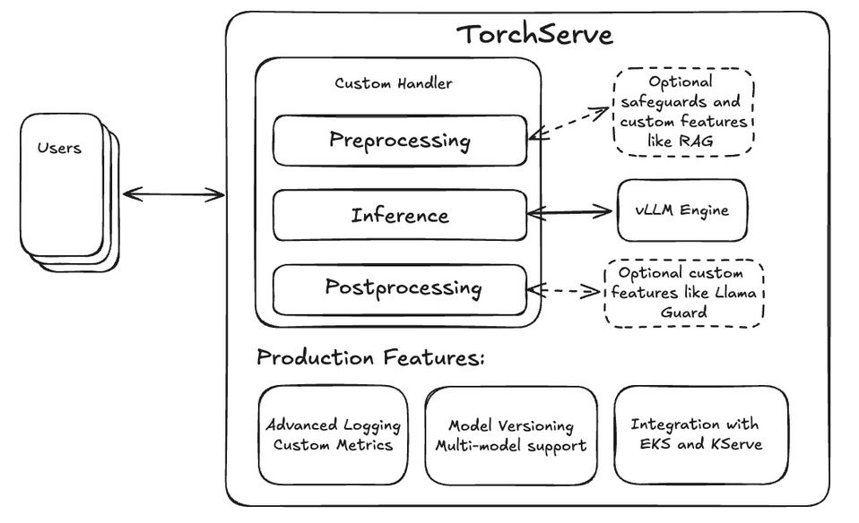
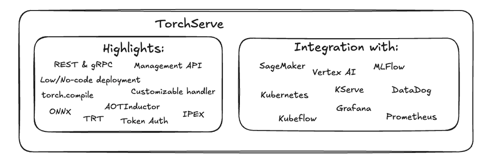
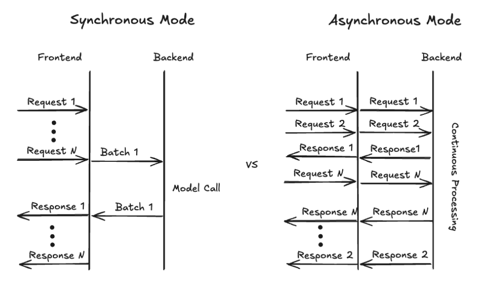

> 블로그 출처: https://pytorch.org/blog/deploying-llms-torchserve-vllm/

# TorchServe + vLLM으로 대규모 언어 모델 배포하기

> by Matthias Reso, Ankith Gunapal, Simon Mo, Li Ning, Hamid Shojanazeri

vLLM 엔진은 현재 대규모 언어 모델(LLM)을 실행하는 가장 고성능 방법 중 하나입니다. 단일 머신에서 모델을 배포하는 간단한 선택지로 vllm serve(https://docs.vllm.ai/en/latest/serving/openai_compatible_server.html) 명령을 제공합니다. 이 방식은 편리하지만, 프로덕션 환경에서 이러한 LLM을 대규모로 배포하려면 더 고급 기능이 필요합니다.



TorchServe는 커스텀 지표와 모델 버전 관리 같은 기본적인 프로덕션 기능을 제공하며, 유연한 커스텀 핸들러 설계를 통해 검색 증강 생성(RAG)이나 Llama Guard(https://ai.meta.com/research/publications/llama-guard-llm-based-input-output-safeguard-for-human-ai-conversations/) 같은 안전 보호 기능도 매우 쉽게 통합할 수 있습니다. 따라서 vLLM 엔진을 TorchServe와 결합해 기능이 완비된 프로덕션급 LLM 서빙 솔루션을 만드는 것은 자연스러운 선택입니다.

통합 세부 사항을 깊이 살펴보기 전에, TorchServe의 vLLM docker 이미지를 사용해 Llama-3.1-70B-Instruct 모델을 배포하는 방법을 먼저 보여드리겠습니다.

## TorchServe + vLLM에서 Llama 3.1 빠르게 시작하기

먼저 TorchServe 저장소(https://github.com/pytorch/serve)를 체크아웃한 뒤, 루트 폴더에서 다음 명령을 실행해 새로운 TS LLM Docker(https://github.com/pytorch/serve/tree/master/docker) 컨테이너 이미지를 빌드합니다.

```shell
docker build --pull . -f docker/Dockerfile.vllm -t ts/vllm
```

이 컨테이너는 새로운 LLM 시작 스크립트 `ts.llm_launcher`를 사용합니다. 이 스크립트는 Hugging Face 모델 URI 또는 로컬 폴더를 입력으로 받아, 백엔드에서 vLLM 엔진을 실행하는 로컬 TorchServe 인스턴스를 시작합니다. 로컬에 모델을 배포하려면 다음 명령으로 컨테이너 인스턴스를 만들 수 있습니다.

```shell
#export token=<HUGGINGFACE_HUB_TOKEN>
docker run --rm -ti --shm-size 10g --gpus all -e HUGGING_FACE_HUB_TOKEN=$token -p 
8080:8080 -v data:/data ts/vllm --model_id meta-llama/Meta-Llama-3.1-70B-Instruct --disable_token_auth
```

다음 curl 명령으로 로컬 엔드포인트를 테스트할 수 있습니다.

```shell
curl -X POST -d '{"model":"meta-llama/Meta-Llama-3.1-70B-Instruct", "prompt":"Hello, my name is", "max_tokens": 200}' --header "Content-Type: application/json" "http://localhost:8080/predictions/model/1.0/v1/completions"
```

docker는 모델 가중치를 로컬 폴더 "data"에 저장하며, 이 폴더는 컨테이너 안에서 /data로 마운트됩니다. 커스텀 로컬 가중치를 사용하려면 해당 가중치를 data에 복사하고 model_id가 /data/<your-weights>를 가리키도록 하면 됩니다.

내부적으로 컨테이너는 새로운 ts.llm_launcher 스크립트를 사용해 TorchServe를 시작하고 모델을 배포합니다. 이 런처는 TorchServe로 LLM을 배포하는 과정을 단일 명령줄로 단순화하며, 컨테이너 밖에서도 빠른 실험과 테스트 도구로 사용할 수 있습니다. docker 밖에서 런처를 사용하려면 TorchServe 설치 단계(https://github.com/pytorch/serve?tab=readme-ov-file#-quick-start-with-torchserve)를 따른 뒤, 다음 명령으로 8B Llama 모델을 시작합니다.


```shell
# after installing TorchServe and vLLM run
python -m ts.llm_launcher --model_id meta-llama/Meta-Llama-3.1-8B-Instruct  --disable_token_auth
```

여러 GPU를 사용할 수 있으면 런처는 보이는 모든 장치를 자동으로 사용하고 텐서 병렬화를 적용합니다. 사용할 GPU를 지정하려면 `CUDA_VISIBLE_DEVICES`를 참고하세요.

이 방식은 편리하지만 TorchServe가 제공하는 모든 기능을 포함하지는 않는다는 점에 유의해야 합니다. 더 고급 기능을 활용하려는 사용자는 모델 아카이브를 만들어야 합니다. 이 과정은 단일 명령을 실행하는 것보다 조금 더 복잡하지만, 커스텀 핸들러와 버전 관리라는 장점이 있습니다. 전자는 전처리 단계에서 RAG를 구현할 수 있게 해주고, 후자는 대규모 배포 전에 핸들러와 모델의 여러 버전을 테스트할 수 있게 해줍니다.

모델 아카이브를 만들고 배포하는 자세한 단계를 설명하기 전에, vLLM 엔진 통합의 세부 사항을 살펴보겠습니다.

## TorchServe의 vLLM 엔진 통합

최신 서빙 프레임워크인 vLLM은 PagedAttention, 연속 배치 처리, CUDA graphs를 통한 빠른 모델 실행, GPTQ, AWQ, INT4, INT8, FP8 같은 다양한 양자화 방식 지원 등 많은 고급 기능을 제공합니다. 또한 LoRA 같은 중요한 파라미터 효율 어댑터 방식과도 통합되어 있고, Llama와 Mistral을 포함한 폭넓은 모델 아키텍처를 사용할 수 있습니다. vLLM은 vLLM 팀과 활발한 오픈소스 커뮤니티가 유지보수하고 있습니다.

빠른 배포를 위해 vLLM은 HTTP로 LLM을 제공하는 FastAPI 기반 서빙 모드를 제공합니다. 더 긴밀하고 유연한 통합을 위해 이 프로젝트는 요청을 지속적으로 처리하는 인터페이스인 vllm.LLMEngine(https://docs.vllm.ai/en/latest/dev/engine/llm_engine.html)도 제공합니다. 우리는 비동기 변형(https://docs.vllm.ai/en/latest/dev/engine/async_llm_engine.html)을 활용해 이를 TorchServe에 통합했습니다.

TorchServe(https://pytorch.org/serve/)는 프로덕션 환경에서 PyTorch 모델을 배포하기 위한 사용하기 쉬운 오픈소스 솔루션입니다. 프로덕션에서 검증된 서빙 솔루션인 TorchServe는 PyTorch 모델을 대규모로 배포할 때 많은 이점과 기능을 제공합니다. vLLM 엔진의 추론 성능과 결합함으로써, 이제 이러한 이점을 LLM 대규모 배포에도 사용할 수 있습니다.



하드웨어 활용률을 극대화하기 위해 여러 사용자의 요청을 배치로 묶어 처리하는 것이 일반적으로 좋은 방법입니다. 역사적으로 TorchServe는 서로 다른 사용자 요청을 모으기 위해 동기 모드만 제공했습니다. 이 모드에서 TorchServe는 미리 정의된 시간(예: batch_delay=200ms)을 기다리거나 충분한 요청(예: batch_size=8)이 모일 때까지 기다립니다. 둘 중 하나가 트리거되면 배치 데이터가 백엔드로 전달되고, 모델이 배치를 처리한 뒤 프런트엔드를 통해 모델 출력을 사용자에게 반환합니다. 이 방식은 각 요청의 출력이 보통 동시에 완료되는 기존 비전 모델에 특히 효과적입니다.

생성형 사용 사례, 특히 텍스트 생성에서는 응답 길이가 서로 달라지므로 요청이 동시에 준비된다는 가정이 더 이상 성립하지 않습니다. TorchServe가 연속 배치 처리, 즉 요청을 동적으로 추가하고 제거하는 능력을 지원하기는 하지만, 이 모드는 정적인 최대 배치 크기에 맞춰져 있습니다. PagedAttention이 도입되면서 vLLM은 서로 다른 길이의 요청을 매우 적응적으로 조합해 메모리 활용률을 최적화할 수 있게 되었고, 최대 배치 크기라는 가정조차 더 유연해졌습니다.

최적의 메모리 활용률, 즉 메모리 안의 비어 있는 틈을 채우려면 테트리스처럼 어느 시점에 어떤 요청을 처리할지에 대한 결정을 vLLM이 완전히 제어해야 합니다. 이러한 유연성을 제공하기 위해 우리는 TorchServe가 사용자 요청을 처리하는 방식을 다시 평가해야 했습니다. 이전의 동기 처리 모드를 대체하기 위해 비동기 모드(https://github.com/pytorch/serve/blob/ba8c268fe09cb9396749a9ae5d480ba252764d71/examples/large_models/vllm/llama3/model-config.yaml#L7)를 도입했습니다. 아래 그림처럼 이 모드에서는 들어오는 요청이 백엔드로 직접 전달되어 vLLM이 사용할 수 있게 됩니다. 백엔드는 vllm.AsyncEngine에 데이터를 제공하며, 이제 모든 사용 가능한 요청 중에서 선택할 수 있습니다. 스트리밍 모드가 활성화되어 있고 요청의 첫 번째 token을 사용할 수 있으면, 백엔드는 즉시 결과를 보내고 마지막 token이 생성될 때까지 token을 계속 전송합니다.


우리의 VLLMHandler 구현(https://github.com/pytorch/serve/blob/master/ts/torch_handler/vllm_handler.py)은 사용자가 구성 파일만으로 vLLM 호환 모델을 빠르게 배포할 수 있게 하면서, 커스텀 핸들러를 통해 동일한 수준의 유연성과 사용자화를 제공합니다. 사용자는 VLLMHandler를 상속하고 해당 클래스 메서드를 재정의해 커스텀 전처리(https://github.com/pytorch/serve/blob/ba8c268fe09cb9396749a9ae5d480ba252764d71/ts/torch_handler/vllm_handler.py#L108) 또는 후처리(https://github.com/pytorch/serve/blob/ba8c268fe09cb9396749a9ae5d480ba252764d71/ts/torch_handler/vllm_handler.py#L160) 단계를 추가할 수 있습니다.

우리는 단일 노드, 다중 GPU 분산 추론(https://github.com/pytorch/serve/blob/master/examples/large_models/vllm/Readme.md#distributed-inference)도 지원합니다. 여기서는 vLLM이 텐서 병렬로 모델을 샤딩하도록 구성해 더 작은 모델의 처리 용량을 늘리거나, 70B Llama 변형처럼 단일 GPU에 들어가지 않는 큰 모델을 실행할 수 있습니다. 이전에 TorchServe는 torchrun을 사용하는 분산 추론만 지원했으며, 이 경우 여러 백엔드 워커 프로세스를 시작해 모델을 샤딩했습니다. vLLM은 이러한 프로세스 생성을 내부에서 관리하므로, 우리는 TorchServe에 새로운 "custom" 병렬 유형(https://github.com/pytorch/serve/blob/master/examples/large_models/vllm/Readme.md#distributed-inference)을 도입했습니다. 이 유형은 단일 백엔드 워커 프로세스를 시작하고 할당된 GPU 목록을 제공합니다. 그러면 백엔드 프로세스는 필요에 따라 자체 하위 프로세스를 시작할 수 있습니다.

TorchServe + vLLM 통합을 docker 기반 배포에 쉽게 넣을 수 있도록, TorchServe의 GPU docker 이미지를 기반으로 하고 vLLM을 의존성으로 추가한 별도 Dockerfile(https://github.com/pytorch/serve?tab=readme-ov-file#-quick-start-llm-deployment-with-docker)을 제공합니다. 기반이 되는 이미지는 TorchServe GPU docker 이미지(https://hub.docker.com/r/pytorch/torchserve)입니다. LLM이 아닌 배포의 docker 이미지 크기를 늘리지 않기 위해 둘을 분리했습니다.

다음으로, GPU 네 개가 있는 머신에서 TorchServe + vLLM으로 Llama 3.1 70B 모델을 배포하는 데 필요한 단계를 보여드리겠습니다.

## 단계별 가이드

이 단계별 가이드에서는 TorchServe(https://github.com/pytorch/serve/tree/master?tab=readme-ov-file#-quick-start-with-torchserve) 설치가 성공적으로 끝났다고 가정합니다. 현재 vLLM은 TorchServe의 필수 의존성이 아니므로 pip로 패키지를 설치합니다.

```shell
pip install -U vllm==0.6.1.post2
```

이후 단계에서는 선택적으로 모델 가중치를 다운로드하고, 구성을 설명하고, 모델 아카이브를 만들고, 배포한 뒤 테스트합니다.

### 1. 선택 사항: 모델 가중치 다운로드

이 단계는 선택 사항입니다. vLLM은 모델 서버가 시작될 때 가중치 다운로드도 처리할 수 있기 때문입니다. 하지만 모델 가중치를 미리 다운로드하고 TorchServe 인스턴스 간에 캐시 파일을 공유하면 저장 공간 사용량과 모델 워커 시작 시간 측면에서 이점이 있습니다. 가중치를 다운로드하려면 huggingface-cli를 사용해 다음을 실행합니다.

```shell
# make sure you have logged into huggingface with huggingface-cli login before
# and have your access request for the Llama 3.1 model weights approved

huggingface-cli download meta-llama/Meta-Llama-3.1-70B-Instruct --exclude original/*
```
이 명령은 파일을 $HF_HOME 아래에 다운로드합니다. 파일을 다른 위치에 두고 싶다면 이 변수를 변경하면 됩니다. TorchServe를 실행하는 모든 위치에서 이 변수를 갱신하고, 해당 폴더에 접근할 수 있는지 확인하세요.

### 2. 모델 구성

다음으로 모델 배포에 필요한 모든 파라미터가 들어 있는 YAML 구성 파일을 만듭니다. 구성 파일의 첫 번째 부분은 프런트엔드가 백엔드 워커 프로세스를 어떻게 시작할지를 지정합니다. 이 워커 프로세스는 최종적으로 핸들러 안에서 모델을 실행합니다. 두 번째 부분은 로드할 모델과 vLLM 자체의 여러 파라미터 같은 백엔드 핸들러 파라미터를 포함합니다. vLLM 엔진에서 가능한 구성에 대한 더 자세한 내용은 이 링크(https://docs.vllm.ai/en/latest/models/engine_args.html#engine-args)를 참고하세요.

```shell
echo '
# TorchServe frontend parameters
minWorkers: 1            
maxWorkers: 1            # Set the number of worker to create a single model instance
startupTimeout: 1200     # (in seconds) Give the worker time to load the model weights
deviceType: "gpu" 
asyncCommunication: true # This ensures we can cummunicate asynchronously with the worker
parallelType: "custom"   # This lets TS create a single backend prosses assigning 4 GPUs
parallelLevel: 4

# Handler parameters
handler:
    # model_path can be a model identifier for Hugging Face hub or a local path
    model_path: "meta-llama/Meta-Llama-3.1-70B-Instruct"
    vllm_engine_config:  # vLLM configuration which gets fed into AsyncVLLMEngine
        max_num_seqs: 16
        max_model_len: 512
        tensor_parallel_size: 4
        served_model_name:
            - "meta-llama/Meta-Llama-3.1-70B-Instruct"
            - "llama3"
'> model_config.yaml
```

### 3. 모델 폴더 생성

모델 구성 파일(model_config.yaml)을 만든 뒤에는 구성과 버전 정보 같은 기타 메타데이터를 포함하는 모델 아카이브를 만듭니다. 모델 가중치가 매우 크기 때문에 아카이브에는 포함하지 않습니다. 대신 핸들러가 모델 구성에 지정된 model_path에 따라 가중치에 접근합니다. 이 예시에서는 "no-archive" 형식을 사용해 필요한 모든 파일이 들어 있는 모델 폴더를 만듭니다. 이렇게 하면 실험할 때 구성 파일을 쉽게 수정할 수 있습니다. 이후에는 mar 또는 tgz 형식을 선택해 더 쉽게 전달할 수 있는 아티팩트를 만들 수도 있습니다.

```shell
mkdir model_store
torch-model-archiver --model-name vllm --version 1.0 --handler vllm_handler --config-file model_config.yaml --archive-format no-archive --export-path model_store/
```

### 4. 모델 배포

다음 단계는 TorchServe 인스턴스를 시작하고 모델을 로드하는 것입니다. 로컬 테스트를 위해 토큰 인증을 비활성화했다는 점에 유의하세요. 어떤 모델이든 공개 배포할 때는 강력히 어떤 형태로든 인증을 구현하는 것이 좋습니다.

TorchServe 인스턴스를 시작하고 모델을 로드하려면 다음 명령을 실행합니다.

```shell
torchserve --start --ncs  --model-store model_store --models vllm --disable-token-auth
```

로그 문장을 통해 모델 로드 진행 상황을 모니터링할 수 있습니다. 모델 로드가 완료되면 배포 테스트로 넘어갈 수 있습니다.

### 5. 배포 테스트

vLLM 통합은 OpenAI API 호환 형식을 사용하므로, 이 목적에 맞는 전용 도구나 curl을 사용할 수 있습니다. 여기서 사용하는 JSON 데이터에는 모델 식별자와 프롬프트 텍스트가 들어 있습니다. 다른 옵션과 기본값은 vLLMEngine 문서(https://docs.vllm.ai/en/latest/serving/openai_compatible_server.html)에서 확인할 수 있습니다.

```shell
echo '{
  "model": "llama3",
  "prompt": "A robot may not injure a human being",
  "stream": 0
}' | curl --header "Content-Type: application/json"   --request POST --data-binary @-   http://localhost:8080/predictions/vllm/1.0/v1/completions
```

요청 출력은 다음과 비슷합니다.

```shell
{
  "id": "cmpl-cd29f1d8aa0b48aebcbff4b559a0c783",
  "object": "text_completion",
  "created": 1727211972,
  "model": "meta-llama/Meta-Llama-3.1-70B-Instruct",
  "choices": [
    {
      "index": 0,
      "text": " or, through inaction, allow a human being to come to harm.\nA",
      "logprobs": null,
      "finish_reason": "length",
      "stop_reason": null,
      "prompt_logprobs": null
    }
  ],
  "usage": {
    "prompt_tokens": 10,
    "total_tokens": 26,
    "completion_tokens": 16
  }
```
streaming이 False이면 TorchServe는 전체 답변을 모아 마지막 token이 생성된 뒤 한 번에 보냅니다. stream 파라미터를 켜면 token 하나를 포함하는 메시지를 나누어 받게 됩니다.

## 결론

이 블로그에서는 vLLM 추론 엔진과 TorchServe의 새로운 네이티브 통합을 살펴보았습니다. ts.llm_launcher 스크립트를 사용해 Llama 3.1 70B 모델을 로컬에 배포하는 방법과, 어떤 TorchServe 인스턴스에도 배포할 수 있는 모델 아카이브를 만드는 방법을 보여드렸습니다. 또한 Kubernetes 또는 EKS에 배포할 수 있도록 Docker 컨테이너에서 솔루션을 빌드하고 실행하는 방법도 논의했습니다. 향후 작업에서는 vLLM과 TorchServe의 다중 노드 추론을 활성화하고, 배포 과정을 단순화하기 위해 미리 빌드된 Docker 이미지를 제공할 계획입니다.

이 블로그가 공개되기 전에 귀중한 도움을 준 Mark Saroufim과 vLLM 팀에 감사드립니다.
