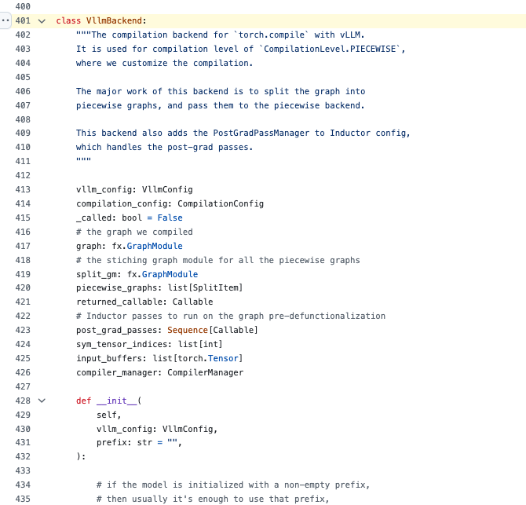

# vLLM PIECEWISE CUDA Graph 기술 학습 노트

## 0x0. 머리말

최근있다동료사용vLLM시작모델의이 부분은 원문의 해당 기술 설명을 이어서 서술한다 (capture CUDA Graph)의log이 부분은 원문의 해당 기술 설명을 이어서 서술한다`Capturing CUDA graphs (mixed prefill-decode, PIECEWISE)`，그다음관련 내용필자는논의하이이다관련 내용최적화，필자는가서소스 코드를 살펴보았다이해해 보았다관련 내용있다이관련 내용우리는이전에는시작모델관련 내용보다까지의이다일반의CUDA Graph capture log，이`PIECEWISE` CUDA Graph 이다vLLM compilation이 부분은 원문의 해당 기술 설명을 이어서 서술한다 (block)의이 부분은 원문의 해당 기술 설명을 이어서 서술한다가능로관련 내용우리는에서prefill단계대해이 부분은 원문의 해당 기술 설명을 이어서 서술한다 (Attention)의operator모두사용상CUDA Graph，부터관련 내용줄인다CPU Overhead관련 내용성능향상。

PIECEWISE관련 내용의핵심 아이디어이다큰의계산이 부분은 원문의 해당 기술 설명을 이어서 서술한다의operator분할，그다음관련 내용컴파일각개이 부분은 원문의 해당 기술 설명을 이어서 서술한다낮춘다컴파일복잡도，관련 내용더많은operator가능사용상CUDA Graph의성능최적화。vLLM의compilation이 부분은 원문의 해당 기술 설명을 이어서 서술한다 (block)포괄이 부분은 원문의 해당 기술 설명을 이어서 서술한다 (operator)융합Pass、많은관련 내용컴파일후관련 내용

이 글기록관련 내용하vLLM compilation이 부분은 원문의 해당 기술 설명을 이어서 서술한다 (block)의기술 세부 사항，부터관련 내용까지관련 내용구현，핵심 기술 포인트모두관련 내용

## 0x1. vLLM Compilation관련 내용

vLLM의Compilation관련 내용사용이 부분은 원문의 해당 기술 설명을 이어서 서술한다 (layer)주로 포함한다로하관련 내용개관련 내용

### 0x1.1 Compilation관련 내용

vLLM관련 내용많은관련 내용컴파일관련 내용부터`CompilationLevel`관련 내용가능로보다관련 내용

```python
class CompilationLevel(IntEnum):
    NO_COMPILATION = 0
    DYNAMO_AS_IS = 1
    DYNAMO_ONCE = 2
    PIECEWISE = 3
```

- `NO_COMPILATION`: 아니수행한다관련 내용컴파일
- `DYNAMO_AS_IS`: 관련 내용사용PyTorch Dynamo의기본row로
- `DYNAMO_ONCE`: 관련 내용사용Dynamo컴파일관련 내용그다음관련 내용스케줄링까지컴파일후의코드
- `PIECEWISE`: 관련 내용컴파일，관련 내용이다vLLM의관련 내용새

### 0x1.2 Compilation후관련 내용

vLLM지원많은관련 내용컴파일후관련 내용통해`CompilerInterface`관련 내용인터페이스관련 내용

```python
class CompilerInterface:
    name: str
    
    def initialize_cache(self, cache_dir: str, disable_cache: bool = False, prefix: str = ""):
        pass
    
    def compute_hash(self, vllm_config: VllmConfig) -> str:
        return ""
    
    def compile(self, graph: fx.GraphModule, example_inputs: list[Any], 
                compiler_config: dict[str, Any], runtime_shape: Optional[int] = None,
                key: Optional[str] = None) -> tuple[Optional[Callable], Optional[Any]]:
        return None, None
    
    def load(self, handle: Any, graph: fx.GraphModule, example_inputs: list[Any],
             graph_index: int, runtime_shape: Optional[int] = None) -> Callable:
        raise NotImplementedError("caching is not supported")
```

현재vLLM구현이 부분은 원문의 해당 기술 설명을 이어서 서술한다 (Compilation)후관련 내용

1. **EagerAdaptor**: 관련 내용반환한다원본관련 내용아니수행한다컴파일
2. **InductorAdaptor**: 관련 내용사용PyTorch Inductor수행한다컴파일（관련 내용사용된다PyTorch 2.5-2.7）
3. **InductorStandaloneAdaptor**: 관련 내용사용독립의Inductor컴파일관련 내용사용된다PyTorch 2.8+）

## 0x2. 관련 내용컴파일(Piecewise Compilation)관련 내용

### 0x2.1 관련 내용

관련 내용컴파일이다vLLM의관련 내용새，관련 내용이다큰의계산이 부분은 원문의 해당 기술 설명을 이어서 서술한다 (operator)분할，그다음관련 내용컴파일각개관련 내용이관련 내용큰의관련 내용이다이 부분은 원문의 해당 기술 설명을 이어서 서술한다 (CUDA Graph)가능사용까지prefill단계，이전에는prefill단계왜냐하면입력관련 내용이다관련 내용의，어렵다사용CUDA Graph최적화。

통해PIECEWISE이 부분은 원문의 해당 기술 설명을 이어서 서술한다 (vLLM)가능로：

1. **에서prefill단계관련 내용사용CUDA Graph**: 대해이 부분은 원문의 해당 기술 설명을 이어서 서술한다 (Attention)의operator（이 부분은 원문의 해당 기술 설명을 이어서 서술한다 (MLP RMSNorm)사용CUDA Graph，크게줄인다CPU Overhead
2. **낮춘다컴파일복잡도**: 큰관련 내용나눈다작은관련 내용각개관련 내용독립컴파일최적화
3. **높인다컴파일cachehit rate**: 작은관련 내용의cache더관련 내용중，줄인다관련 내용컴파일관련 내용
4. **지원더관련 내용의최적화**: 아니관련 내용의operator가능로사용아니관련 내용의최적화관련 내용

그래서우리는보게 된다`Capturing CUDA graphs (mixed prefill-decode, PIECEWISE)`관련 내용의log，설명vLLM관련 내용에서로prefill와decode단계의이 부분은 원문의 해당 기술 설명을 이어서 서술한다 (workloadcapture)의CUDA Graph。

### 0x2.2 PIECEWISE모드하의Prefill단계CUDA Graph Capture 관련 내용

우리는와서보다보다vLLM이다관련 내용에서PIECEWISE모드하대해Prefill단계의이 부분은 원문의 해당 기술 설명을 이어서 서술한다 (Attentionoperator)수행한다CUDA Graph capture의。

#### Capture Size의관련 내용와관련 내용후관련 내용

vLLM통해`compilation_config.compile_sizes`와서관련 내용로이 부분은 원문의 해당 기술 설명을 이어서 서술한다 (batch size)컴파일와capture CUDA Graph。기본관련 내용하，vLLM된다관련 내용`cudagraph_capture_sizes`관련 내용계산관련 내용하：

```python
# 에서 vllm/config/__init__.py 중
possible_sizes = [1, 2, 4] + [8 * i for i in range(1, 1025)]
max_graph_size = min(max_num_seqs * 2, 512)
# 관련 내용까지: [1, 2, 4, 8, 16, 24, 32, 40,..., max_graph_size]
```

에서`PiecewiseBackend`관련 내용중，구현관련 내용의capture관련 내용각개관련 내용된다로아니관련 내용의batch size생성한다독립의컴파일entry，제관련 내용까지이 부분은 원문의 해당 기술 설명을 이어서 서술한다 (size)수행한다컴파일，후관련 내용사용：

```python
# 에서 vllm/compilation/cuda_piecewise_backend.py 중
class PiecewiseBackend:
    def __call__(self, *args) -> Any:
        runtime_shape = args[self.sym_shape_indices[0]]
        
        if runtime_shape not in self.concrete_size_entries:
            # 대해관련 내용아니에서capturecolumn관련 내용중의size，관련 내용사용관련 내용사용컴파일관련 내용
            return self.compiled_graph_for_general_shape(*args)
        
        entry = self.concrete_size_entries[runtime_shape]
        if not entry.compiled:
            # 제관련 내용까지이size관련 내용수행한다컴파일
            entry.compiled = True
            entry.runnable = self.vllm_backend.compiler_manager.compile(
                self.graph, args,..., runtime_shape=runtime_shape)
        
        return entry.runnable(*args)
```

#### CUDA Graph의Capture와Replay관련 내용

각개컴파일후의관련 내용모두된다관련 내용`CUDAGraphWrapper`관련 내용제관련 내용까지관련 내용개batch descriptor관련 내용된다capture CUDA Graph；후관련 내용호출한다이 부분은 원문의 해당 기술 설명을 이어서 서술한다 (replay)

```python
# 에서 vllm/compilation/cuda_graph.py 중
class CUDAGraphWrapper:
    def __call__(self, *args, **kwargs):
        # 이 부분은 원문의 해당 기술 설명을 이어서 서술한다 (runtime mode)여부관련 내용
        if cudagraph_runtime_mode!= self.runtime_mode:
            return self.runnable(*args, **kwargs)
        
        if entry.cudagraph is None:
            # 제관련 내용까지이 부분은 원문의 해당 기술 설명을 이어서 서술한다 (capture CUDA Graph)
            cudagraph = torch.cuda.CUDAGraph()
            with torch.cuda.graph(cudagraph, pool=self.graph_pool):
                output = self.runnable(*args, **kwargs)
            entry.cudagraph = cudagraph
            return output
        
        # 후관련 내용호출한다이 부분은 원문의 해당 기술 설명을 이어서 서술한다 (replay)
        entry.cudagraph.replay()
        return entry.output
```

#### 이 부분은 원문의 해당 기술 설명을 이어서 서술한다 (Capture)의operator와성능최적화

에서PIECEWISE모드하，vLLM주요대해로하operator수행한다CUDA Graph capture：

- **MLPlayeroperator**: Linearlayermatrix multiplication、관련 내용함수（SiLU、GELU관련 내용차이관련 내용
- **Normoperator**: RMSNorm、LayerNorm및관련 내용와관련 내용의융합버전  
- **이 부분은 원문의 해당 기술 설명을 이어서 서술한다 (operator)**: FP8/INT8이 부분은 원문의 해당 기술 설명을 이어서 서술한다 (per-token/per-tensor)
- **이 부분은 원문의 해당 기술 설명을 이어서 서술한다 (operator)**: Embeddinglayer、이 부분은 원문의 해당 기술 설명을 이어서 서술한다 (element-wise)

**핵심관련 내용**: Attentionoperator때문에대해이 부분은 원문의 해당 기술 설명을 이어서 서술한다 (column)에서Prefill단계아니된다이 부분은 원문의 해당 기술 설명을 이어서 서술한다 (capture)실행한다。


#### 관련 내용있다관련 내용중CUDA Graph관련 내용의Padding관련 내용

관련 내용있다관련 내용중CUDA Graph，vLLM관련 내용있다padding관련 내용와서최적화성능。vLLM관련 내용계산관련 내용개`bs_to_padded_graph_size`배열，구현O(1)의padding size관련 내용

```python
# CUDA Graph이 부분은 원문의 해당 기술 설명을 이어서 서술한다 (padding)까지최근의capture size
def pad_for_cudagraph(self, batch_size: int) -> int:
    return self.compilation_config.bs_to_padded_graph_size[batch_size]

# Eager Mode：padding까지TP size의관련 내용사용된다Sequence Parallelism최적화）
if (cudagraph_mode!= CUDAGraphMode.NONE and num_tokens <= cudagraph_batch_sizes[-1]):
    num_tokens_padded = self.vllm_config.pad_for_cudagraph(num_tokens)
else:
    # Eager mode: pad to multiple of tensor_parallel_size for SP
    if enable_sequence_parallelism and tp_size > 1:
        num_tokens_padded = round_up(num_tokens, tp_size)
```

관련 내용설정`cudagraph_capture_sizes = [1, 2, 4, 8, 16, 32, 64, 128, 256]`와`tensor_parallel_size = 8`관련 내용
- batch_size=10 → padding까지16（관련 내용중CUDA Graph）
- batch_size=300 → padding까지304（Eager mode + SP padding）

이 부분은 원문의 해당 기술 설명을 이어서 서술한다 (padding vLLM)에서이 부분은 원문의 해당 기술 설명을 이어서 서술한다 (batch size)하모두가능있다아니관련 내용의성능。

### 0x2.3 관련 내용구현

에서`backends.py`중의`split_graph`함수구현이 부분은 원문의 해당 기술 설명을 이어서 서술한다

```python
def split_graph(graph: fx.GraphModule, ops: list[str]) -> tuple[fx.GraphModule, list[SplitItem]]:
    subgraph_id = 0
    node_to_subgraph_id = {}
    split_op_graphs = []
    
    for node in graph.graph.nodes:
        if node.op in ("output", "placeholder"):
            continue
        if node.op == 'call_function' and str(node.target) in ops:
            subgraph_id += 1
            node_to_subgraph_id[node] = subgraph_id
            split_op_graphs.append(subgraph_id)
            subgraph_id += 1
        else:
            node_to_subgraph_id[node] = subgraph_id
    
    split_gm = torch.fx.passes.split_module.split_module(
        graph, None, lambda node: node_to_subgraph_id[node], keep_original_order=True)
    
    #... 관련 내용결과
    return split_gm, outputs
```

#### 핵심파라미터이 부분은 원문의 해당 기술 설명을 이어서 서술한다 (splitting_ops)

여기관련 내용의`ops`파라미터와서관련 내용`compilation_config.splitting_ops`，이 부분은 원문의 해당 기술 설명을 이어서 서술한다 (operator)로관련 내용부터관련 내용볼 수 있다：

**1. 기본의Attentionoperatorcolumn관련 내용**
```python
# 에서 vllm/config/compilation.py 중
_attention_ops: ClassVar[list[str]] = [
    "vllm.unified_attention",
    "vllm.unified_attention_with_output", 
    "vllm.mamba_mixer2",
    "vllm.mamba_mixer",
    "vllm.short_conv",
    "vllm.linear_attention",
    "vllm.plamo2_mamba_mixer",
    "vllm.gdn_attention",
]
```

**2. 관련 내용추가의MoEoperator**
```python
if envs.VLLM_ALL2ALL_BACKEND == "deepep_high_throughput":
    # exclude MoE dispatch/combine from capture by ensuring
    # piecewise splitting includes them, so communication remains
    # outside CUDA graphs while compute can still be graphed.
    moe_ops = [
        "vllm.moe_forward",
        "vllm.moe_forward_shared",
    ]
    for op in moe_ops:
        if op not in self.splitting_ops:
            self.splitting_ops.append(op)
```

**3. 관련 내용**
- 관련 내용까지`splitting_ops`중의operator관련 내용된다에서이 부분은 원문의 해당 기술 설명을 이어서 서술한다 (operator)전후생성한다관련 내용
- 각개관련 내용모두된다생성한다관련 내용개새의`subgraph_id`
- 관련 내용할 것이다원본의큰관련 내용많은개독립의관련 내용

**4. 관련 내용효과**
- **Attention관련 내용**：이 부분은 원문의 해당 기술 설명을 이어서 서술한다 (attention)관련의operator，관련 내용실행한다
- **MLP관련 내용**：이 부분은 원문의 해당 기술 설명을 이어서 서술한다 (Linear)함수관련 내용가능로이 부분은 원문의 해당 기술 설명을 이어서 서술한다 (CUDA Graph capture)
- **Norm관련 내용**：이 부분은 원문의 해당 기술 설명을 이어서 서술한다 (RMSNorm)정규화operator，관련 내용가능로이 부분은 원문의 해당 기술 설명을 이어서 서술한다 (capture)

여기의핵심이다`keep_original_order=True`，관련 내용후의관련 내용와서의관련 내용실행한다，아니된다이 부분은 원문의 해당 기술 설명을 이어서 서술한다 (vLLM)가능대해아니관련 내용의operator관련 내용사용아니관련 내용의관련 내용

### 0x2.4 관련 내용후관련 내용구현

`PiecewiseCompileInterpreter`담당실행한다관련 내용컴파일：

```python
class PiecewiseCompileInterpreter(torch.fx.Interpreter):
    def call_module(self, target: torch.fx.node.Target, args: tuple, kwargs: dict) -> Any:
        output = super().call_module(target, args, kwargs)
        
        if target in self.compile_submod_names:
            index = self.compile_submod_names.index(target)
            submod = self.fetch_attr(target)
            
            # 컴파일이 부분은 원문의 해당 기술 설명을 이어서 서술한다 (shape)의관련 내용
            compiled_graph_for_dynamic_shape = self.vllm_backend.compiler_manager.compile(
                submod, args, self.compilation_config.inductor_compile_config,
                self.compilation_config, graph_index=index,
                num_graphs=len(self.compile_submod_names), runtime_shape=None)
            
            # 생성한다관련 내용후관련 내용
            piecewise_backend = PiecewiseBackend(
                submod, self.vllm_config, index, len(self.compile_submod_names),
                sym_shape_indices, compiled_graph_for_dynamic_shape, self.vllm_backend)
            
            # 만약관련 내용사용CUDA Graph，관련 내용로CUDAGraphWrapper
            if self.compilation_config.cudagraph_mode!= CUDAGraphMode.NONE:
                static_graph_wrapper_class = resolve_obj_by_qualname(
                    current_platform.get_static_graph_wrapper_cls())
                self.module.__dict__[target] = static_graph_wrapper_class(
                    runnable=piecewise_backend, vllm_config=self.vllm_config,
                    runtime_mode=CUDAGraphMode.PIECEWISE,...)
            else:
                self.module.__dict__[target] = piecewise_backend
        
        return output
```

## 0x3. vLLM Compilation operator융합관련 내용

### 0x3.1 융합관련 내용

vLLM에서Compilation이 부분은 원문의 해당 기술 설명을 이어서 서술한다 (block)구현관련 내용완전한의operator융합관련 내용주로 포함한다：

1. **FusionPass**: 관련 내용사용융합Pass，주요이 부분은 원문의 해당 기술 설명을 이어서 서술한다 (RMSNorm+)의융합
2. **ActivationQuantFusionPass**: 관련 내용융합
3. **AttnFusionPass**: attentionoperator융합
4. **AllReduceFusionPass**: 관련 내용융합

### 0x3.2 RMSNorm관련 내용융합구현

로RMSNorm+FP8관련 내용융합로이 부분은 원문의 해당 기술 설명을 이어서 서술한다 (vLLM)사용PyTorch의pattern matcher수행한다모드관련 내용와관련 내용

```python
class FusedAddRMSNormStaticQuantPattern(RMSNormQuantPattern):
    def register(self, pm_pass: PatternMatcherPass, record_match: Callable):
        def pattern(result: torch.Tensor, input: torch.Tensor, residual: torch.Tensor,
                   weight: torch.Tensor, scale: torch.Tensor):
            # 원본모드：관련 내용하다fused_add_rms_norm，다시하다관련 내용
            at = auto_functionalized(RMS_ADD_OP, input=input, residual=residual,
                                   weight=weight, epsilon=self.epsilon)
            at1 = auto_functionalized(self.QUANT_OP, result=result, input=at[1], scale=scale)
            return at1[1], at[2]  # result, residual
        
        def replacement(result: torch.Tensor, input: torch.Tensor, residual: torch.Tensor,
                       weight: torch.Tensor, scale: torch.Tensor):
            # 융합후의모드：관련 내용개operator완료관련 내용있다관련 내용
            at = auto_functionalized(self.FUSED_OP, result=result, input=input,
                                   residual=residual, weight=weight, scale=scale,
                                   epsilon=self.epsilon)
            return at[1], at[2]  # result, residual
        
        pm.register_replacement(pattern, replacement, inputs, pm.fwd_only, pm_pass,
                              extra_check=lambda m: record_match(self.Match(m, self.QUANT_OP, self.FUSED_OP)))
```

여기의핵심관련 내용

1. 관련 내용사용`auto_functionalized`이 부분은 원문의 해당 기술 설명을 이어서 서술한다보장함수이 부분은 원문의 해당 기술 설명을 이어서 서술한다
2. 통해`extra_check`관련 내용기록관련 내용지원많은출력모드의관련 내용
3. 관련 내용완전한의입력출력관련 내용

### 0x3.3 많은출력관련 내용

대해관련 내용있다많은개출력의융합모드，vLLM구현`MultiOutputMatch`관련 내용와서이 부분은 원문의 해당 기술 설명을 이어서 서술한다 (PyTorch pattern matcher)대해많은출력지원아니관련 내용의문제。

#### 문제배경

에서operator융합중，관련 내용까지많은출력의이 부분은 원문의 해당 기술 설명을 이어서 서술한다 (RMSNorm+)융합：

```python
# 원본모드：관련 내용개독립의operator
# 1. RMSNorm: 입력 -> (None, normalized_output, residual)  
# 2. 이 부분은 원문의 해당 기술 설명을 이어서 서술한다 (: normalized_output -)> (None, quantized_result, scale)

# 융합후：관련 내용개operator관련 내용많은개출력
# 융합operator: 입력 -> (None, quantized_result, scale, residual)
```

PyTorch의pattern matcher에서관련 내용많은출력관련 내용에서bug，따라서vLLM구현이 부분은 원문의 해당 기술 설명을 이어서 서술한다

#### 핵심 구현관련 내용

**1. 모드관련 내용와기록**

```python
class FusedAddRMSNormStaticQuantPattern(RMSNormQuantPattern):
    def register(self, pm_pass, record_match):
        def pattern(result, input, residual, weight, scale):
            # 원본모드：관련 내용하다RMSNorm，다시하다관련 내용
            at = auto_functionalized(RMS_ADD_OP, input=input, residual=residual, weight=weight)
            at1 = auto_functionalized(self.QUANT_OP, result=result, input=at[1], scale=scale)
            return at1[1], at[2]  # 반환한다관련 내용결과와관련 내용차이
        
        def replacement(result, input, residual, weight, scale):
            # 융합후：관련 내용개operator완료관련 내용있다관련 내용
            at = auto_functionalized(self.FUSED_OP, result=result, input=input, 
                                   residual=residual, weight=weight, scale=scale)
            return at[1], at[2]  # 반환한다관련 내용의출력
        
        # 핵심：관련 내용사용extra_check기록이 부분은 원문의 해당 기술 설명을 이어서 서술한다
        pm.register_replacement(pattern, replacement, inputs, pm.fwd_only, pm_pass,
                              extra_check=lambda m: record_match(self.Match(m, self.QUANT_OP, self.FUSED_OP)))
```

**2. 이 부분은 원문의 해당 기술 설명을 이어서 서술한다**

```python
class Match(QuantMultiOutputMatch):
    def process(self):
        # 1. 관련 내용까지관련 내용중의핵심관련 내용
        rms_node = self.find_auto_fn(RMS_ADD_OP)      # RMSNorm관련 내용
        quant_node = self.find_auto_fn(self.QUANT_OP)  # 관련 내용
        
        # 2. 관련 내용융합후의관련 내용
        with self.inserting_after_match():
            # 관련 내용출력관련 내용융합관련 내용의관련 내용개출력대응관련 내용와서관련 내용개관련 내용의관련 내용개출력
            fused_return_mapping = {
                1: (quant_node, 1),  # 융합관련 내용의제1개출력 -> 관련 내용의제1개출력
                2: (rms_node, 2),    # 융합관련 내용의제2개출력 -> RMSNorm관련 내용의제2개출력
            }
            self.insert_fused_node(fused_return_mapping, **kwargs)
```

**3. 이 부분은 원문의 해당 기술 설명을 이어서 서술한다**

```python
def insert_fused_node(self, fused_return_mapping: dict[int, tuple[fx.Node, int]], **kwargs):
    # 1. 생성한다융합operator관련 내용
    fused_node = self.insert_auto_fn(self.FUSED_OP, kwargs)
    
    # 2. 로융합관련 내용의각개출력생성한다getitem관련 내용
    indices = fused_return_mapping.keys()  # [1, 2]
    getitem_nodes = self.insert_getitems(fused_node, indices)  # [fused_node[1], fused_node[2]]
    
    # 3. 관련 내용새관련 내용사용관련 내용
    for idx, getitem_node in zip(indices, getitem_nodes):
        old_node, old_idx = fused_return_mapping[idx]
        
        # 관련 내용까지관련 내용와서의getitem관련 내용만약관련 내용에서）
        old_getitem = find_getitem_maybe(old_node, old_idx)
        if old_getitem is not None:
            # 할 것이다관련 내용있다관련 내용사용old_getitem의관련 내용로새의getitem_node
            old_getitem.replace_all_uses_with(getitem_node)
            # 이 부분은 원문의 해당 기술 설명을 이어서 서술한다 (meta)사용된다가서함수관련 내용
            getitem_node.meta["val"] = old_getitem.meta["val"]
        
        # 관련 내용융합관련 내용의meta관련 내용
        meta_val[idx] = old_node.meta["val"][old_idx]
    
    fused_node.meta["val"] = tuple(meta_val)
```

#### 관련 내용효과

통해이 부분은 원문의 해당 기술 설명을 이어서 서술한다 (vLLM)할 것이다：

```python
# 원본관련 내용
input -> RMSNorm -> normalized_output -> Quantize -> quantized_result
      -> residual                    -> scale
```

관련 내용로：

```python  
# 융합후관련 내용
input -> FusedRMSNormQuant -> quantized_result
                           -> scale  
                           -> residual
```

이 부분은 원문의 해당 기술 설명을 이어서 서술한다 (PyTorch pattern matcher)의이 부분은 원문의 해당 기술 설명을 이어서 서술한다융합후관련 내용의관련 내용와성능최적화효과。

## 0x4. vLLM Compilation 관련 내용융합관련 내용

### 0x4.1 AllReduce융합

vLLM구현많은이 부분은 원문의 해당 기술 설명을 이어서 서술한다 (AllReduce)융합모드，관련 내용

1. **GEMM + ReduceScatter**: 할 것이다matrix multiplication와reduce-scatter융합
2. **AllGather + GEMM**: 할 것이다all-gather와matrix multiplication융합
3. **RMSNorm + AllReduce**: 할 것이다RMSNorm와all-reduce융합

로GEMM+ReduceScatter로관련 내용

```python
class GEMMReduceScatterPattern(BasePattern):
    def register(self, pm_pass: PatternMatcherPass):
        def pattern(mul: torch.Tensor, mm_weight: torch.Tensor):
            mm = torch.ops.aten.mm.default(mul, mm_weight)
            reduce_scatter = torch.ops.vllm.reduce_scatter.default(
                mm, dim=0, world_size=self.tp_size, group_name=self.tp.unique_name)
            return reduce_scatter
        
        def replacement(mul: torch.Tensor, mm_weight: torch.Tensor):
            gemm_rs = torch.ops.symm_mem.fused_matmul_reduce_scatter(
                mul, mm_weight, "avg", scatter_dim=0,
                group_name=self.tp.device_group.group_name)
            return gemm_rs
        
        pm.register_replacement(pattern, replacement, self.get_inputs(), pm.fwd_only, pm_pass)
```

### 0x4.2 FlashInfer관련 내용융합

vLLM이 부분은 원문의 해당 기술 설명을 이어서 서술한다 (FlashInfer)의관련 내용융합관련 내용가능：

```python
if flashinfer_comm and hasattr(flashinfer_comm, "trtllm_allreduce_fusion"):
    class FlashInferAllReducePattern(BasePattern):
        def register(self, pm_pass: PatternMatcherPass):
            def pattern(input: torch.Tensor):
                return torch.ops.vllm.all_reduce.default(
                    input, group_name=self.tp.unique_name)
            
            def replacement(input: torch.Tensor):
                return flashinfer_comm.trtllm_allreduce_fusion(
                    input, self.tp_size, get_tensor_model_parallel_rank())
            
            pm.register_replacement(pattern, replacement, self.get_inputs(), pm.fwd_only, pm_pass)
```

## 0x5. vLLM Compilation 컴파일cache관련 내용

### 0x5.1 cache관련 내용

vLLM Compilation구현관련 내용의컴파일cache관련 내용통해`CompilerManager`관련 내용

```python
class CompilerManager:
    def __init__(self, compilation_config: CompilationConfig):
        self.cache: dict[tuple[Optional[int], int, str], Any] = dict()
        self.is_cache_updated = False
        self.compilation_config = compilation_config
        self.compiler = make_compiler(compilation_config)
    
    def compute_hash(self, vllm_config: VllmConfig) -> str:
        return self.compiler.compute_hash(vllm_config)
    
    def initialize_cache(self, cache_dir: str, disable_cache: bool = False, prefix: str = ""):
        self.cache_dir = cache_dir
        self.cache_file_path = os.path.join(cache_dir, "vllm_compile_cache.py")
        
        if not disable_cache and os.path.exists(self.cache_file_path):
            with open(self.cache_file_path) as f:
                self.cache = ast.literal_eval(f.read())
        
        self.compiler.initialize_cache(cache_dir=cache_dir, disable_cache=disable_cache, prefix=prefix)
```

### 0x5.2 cache관련 내용

cache관련 내용의관련 내용많은개관련 내용

```python
def __call__(self, graph: fx.GraphModule, example_inputs) -> Callable:
    if not self.compilation_config.cache_dir:
        factors = []
        # 1. 관련 내용변수관련 내용
        env_hash = envs.compute_hash()
        factors.append(env_hash)
        
        # 2. vLLM설정관련 내용
        config_hash = vllm_config.compute_hash()
        factors.append(config_hash)
        
        # 3. 코드파일관련 내용
        forward_code_files = list(sorted(self.compilation_config.traced_files))
        hash_content = []
        for filepath in forward_code_files:
            hash_content.append(filepath)
            if filepath!= "<string>":
                with open(filepath) as f:
                    hash_content.append(f.read())
        code_hash = hashlib.md5("\n".join(hash_content).encode(), usedforsecurity=False).hexdigest()
        factors.append(code_hash)
        
        # 4. 컴파일관련 내용
        compiler_hash = self.compiler_manager.compute_hash(vllm_config)
        factors.append(compiler_hash)
        
        hash_key = hashlib.md5(str(factors).encode(), usedforsecurity=False).hexdigest()[:10]
        cache_dir = os.path.join(envs.VLLM_CACHE_ROOT, "torch_compile_cache", hash_key)
```

이 부분은 원문의 해당 기술 설명을 이어서 서술한다 (cache)의관련 내용와있다관련 내용

### 0x5.3 cache관련 내용사용관련 내용

#### cache목차관련 내용

vLLM의컴파일cache관련 내용사용이 부분은 원문의 해당 기술 설명을 이어서 서술한다 (layer)목차관련 내용

```bash
~/.cache/vllm/torch_compile_cache/
├── hash_key_1/           # 기반으로설정와코드의관련 내용
│   ├── rank_0_1/         # 많은관련 내용 (/)많은GPU의rank관련 내용
│   │   ├── prefix_name/  # 아니이 부분은 원문의 해당 기술 설명을 이어서 서술한다 (block)의전관련 내용
│   │   │   ├── vllm_compile_cache.py      # 컴파일cache인덱스
│   │   │   ├── computation_graph.py       # 계산관련 내용
│   │   │   └── transformed_code.py        # 관련 내용후의코드
│   │   └── shared_artifacts/              # 관련 내용컴파일관련 내용
│   └── rank_2_3/
└── hash_key_2/
```

더관련 내용의관련 내용가능로보다`class CompilerManager`의구현。

#### cache관련 내용

cache이 부분은 원문의 해당 기술 설명을 이어서 서술한다 (hash_key_1), hash_key_2...)관련 내용사용이 부분은 원문의 해당 기술 설명을 이어서 서술한다`(runtime_shape, graph_index, backend_name)`

```python
# cache관련 내용예제
cache_key = (
    16,           # runtime_shape: batch_size=16
    2,            # graph_index: 제2개관련 내용
    "inductor"    # backend_name: 관련 내용사용Inductor후관련 내용
)
```

#### cache로드와관련 내용

**1. 컴파일관련 내용의cache관련 내용**

```python
def compile(self, graph, example_inputs, graph_index, runtime_shape):
    # 1. 먼저관련 내용부터cache로드
    compiled_graph = self.load(graph, example_inputs, graph_index, runtime_shape)
    if compiled_graph is not None:
        logger.info("Directly load compiled graph from cache, took %.3f s", elapsed)
        return compiled_graph
    
    # 2. cache관련 내용중，수행한다컴파일
    compiled_graph, handle = self.compiler.compile(graph, example_inputs,...)
    
    # 3. 할 것이다컴파일결과관련 내용까지cache
    if not envs.VLLM_DISABLE_COMPILE_CACHE and handle is not None:
        self.cache[(runtime_shape, graph_index, self.compiler.name)] = handle
        compilation_counter.num_cache_entries_updated += 1
        self.is_cache_updated = True
```

**2. cache관련 내용**

```python
def save_to_file(self):
    if self.disable_cache or not self.is_cache_updated:
        return
    # 관련 내용사용Python관련 내용저장，관련 내용와가능읽다관련 내용
    printer = pprint.PrettyPrinter(indent=4)
    data = printer.pformat(self.cache)
    with open(self.cache_file_path, "w") as f:
        f.write(data)
```

#### cache관련 내용의좋은관련 내용

```python
# 관련 내용시작（없음cache）
logger.info("Compiling graph for shape 16, took 45.2 s")

# 후관련 내용시작（관련 내용중cache）  
logger.info("Directly load compiled graph from cache, took 0.8 s")
```

cache관련 내용중가능로할 것이다컴파일관련 내용부터관련 내용줄인다까지아니까지1관련 내용이다대해관련 내용큰모델와관련 내용의관련 내용컴파일관련 내용


## 0x6. vLLM Compilation 이 부분은 원문의 해당 기술 설명을 이어서 서술한다

vLLM관련 내용완전한의이 부분은 원문의 해당 기술 설명을 이어서 서술한다와서관련 내용모델컴파일，주요관련 내용`@support_torch_compile`와`@ignore_torch_compile`관련 내용개이 부분은 원문의 해당 기술 설명을 이어서 서술한다

### 0x6.1 컴파일이 부분은 원문의 해당 기술 설명을 이어서 서술한다

#### 관련 내용사용관련 내용

vLLM관련 내용`@support_torch_compile`관련 내용와서관련 내용모델컴파일：

```python
# 이 부분은 원문의 해당 기술 설명을 이어서 서술한다 (1:)사용이 부분은 원문의 해당 기술 설명을 이어서 서술한다차원）
@support_torch_compile
class MyModel(nn.Module):
    def forward(self, x: torch.Tensor, y: Optional[torch.Tensor]):
...

# 이 부분은 원문의 해당 기술 설명을 이어서 서술한다 (2:)차원
@support_torch_compile(dynamic_arg_dims={"x": 0, "y": [0, 1]})
class MyModel(nn.Module):
    def forward(self, x: torch.Tensor, y: torch.Tensor):
...

# 이 부분은 원문의 해당 기술 설명을 이어서 서술한다 (3:)컴파일
@support_torch_compile(enable_if=lambda config: config.model_config.dtype == torch.float16)
class MyModel(nn.Module):
    def forward(self, x: torch.Tensor):
...
```

#### 관련 내용차원관련 내용

관련 내용있다관련 내용`dynamic_arg_dims`이 부분은 원문의 해당 기술 설명을 이어서 서술한다된다관련 내용

```python
def cls_decorator_helper(cls: _T) -> _T:
    sig = inspect.signature(cls.forward)
    inferred_dynamic_arg_dims = {}
    
    # 이 부분은 원문의 해당 기술 설명을 이어서 서술한다 (forward)의관련 내용있다파라미터
    for k, v in sig.parameters.items():
        # 이 부분은 원문의 해당 기술 설명을 이어서 서술한다차원
        if v.annotation in [torch.Tensor, Optional[torch.Tensor], 
                           IntermediateTensors, Optional[IntermediateTensors]]:
            inferred_dynamic_arg_dims[k] = 0  # 제관련 내용개차원관련 내용로관련 내용
    
    logger.debug("Inferred dynamic dimensions for forward method of %s: %s", 
                 cls, list(inferred_dynamic_arg_dims.keys()))
    
    return _support_torch_compile(cls, inferred_dynamic_arg_dims, enable_if)
```

**관련 내용**：
- `torch.Tensor`또는`Optional[torch.Tensor]`：제0관련 내용로관련 내용
- `IntermediateTensors`：관련 내용있다tensor의제0관련 내용로관련 내용
- 이 부분은 원문의 해당 기술 설명을 이어서 서술한다

`IntermediateTensors`이다vLLM로Pipeline Parallelism관련 내용의관련 내용사용이 부분은 원문의 해당 기술 설명을 이어서 서술한다
관련 내용많은개관련의tensor（주요이다`hidden_states`와`residual`）
- 지원Pipeline stage관련 내용의관련 내용
- 에서컴파일관련 내용중있다관련 내용의관련 내용차원관련 내용
- 이 부분은 원문의 해당 기술 설명을 이어서 서술한다의관련 내용인터페이스，관련 내용얻는다와관련 내용아니관련 내용의중관련 내용


### 0x6.2 관련 내용구현관련 내용

#### 관련 내용와관련 내용

관련 내용통해관련 내용의관련 내용와관련 내용와서구현컴파일지원：

```python
def _support_torch_compile(cls, dynamic_arg_dims, enable_if):
    # 1. 이 부분은 원문의 해당 기술 설명을 이어서 서술한다추가컴파일이 부분은 원문의 해당 기술 설명을 이어서 서술한다
    cls.__bases__ = cls.__bases__ + (TorchCompileWrapperWithCustomDispatcher,)
    
    old_init = cls.__init__
    
    # 2. 이 부분은 원문의 해당 기술 설명을 이어서 서술한다 (__init__)추가컴파일설정
    def __init__(self, *, vllm_config: VllmConfig, prefix: str = '', **kwargs):
        old_init(self, vllm_config=vllm_config, prefix=prefix, **kwargs)
        
        # 관련 내용여부관련 내용컴파일
        enable_compile = enable_if is None or enable_if(vllm_config)
        self.do_not_compile = (
            vllm_config.compilation_config.level in [
                CompilationLevel.NO_COMPILATION, 
                CompilationLevel.DYNAMO_AS_IS
            ] or not supports_dynamo() 
            or _should_ignore_torch_compile(self.__class__) 
            or not enable_compile
        )
        
        if not self.do_not_compile:
            compilation_counter.num_models_seen += 1
            TorchCompileWrapperWithCustomDispatcher.__init__(
                self, compilation_level=vllm_config.compilation_config.level)
    
    cls.__init__ = __init__
```

#### 이 부분은 원문의 해당 기술 설명을 이어서 서술한다 (shape)와컴파일스케줄링

```python
def __call__(self, *args, **kwargs):
    # 관련 내용컴파일의관련 내용
    if self.do_not_compile or torch.compiler.is_compiling():
        return self.forward(*args, **kwargs)
    
    # 관련 내용컴파일：관련 내용차원
    if len(self.compiled_codes) < 1:
        sig = inspect.signature(self.__class__.forward)
        bound_args = sig.bind(self, *args, **kwargs)
        bound_args.apply_defaults()
        
        # 로각개파라미터관련 내용차원
        for k, dims in dynamic_arg_dims.items():
            arg = bound_args.arguments.get(k)
            if arg is not None:
                dims = [dims] if isinstance(dims, int) else dims
                
                if isinstance(arg, torch.Tensor):
                    # 관련 내용인덱스：-1관련 내용마지막으로관련 내용
                    dims = [arg.ndim + dim if dim < 0 else dim for dim in dims]
                    torch._dynamo.mark_dynamic(arg, dims)
                    
                elif isinstance(arg, IntermediateTensors):
                    # 로IntermediateTensors중의관련 내용있다tensor관련 내용차원
                    for tensor in arg.tensors.values():
                        dims = [tensor.ndim + dim if dim < 0 else dim for dim in dims]
                        torch._dynamo.mark_dynamic(tensor, dims)
        
        # 관련 내용컴파일관련 내용
        start_monitoring_torch_compile(self.vllm_config)
        logger.debug("Start compiling function %s", self.original_code_object)
    
    # 컴파일스케줄링관련 내용
    if len(self.compiled_codes) < 1 or not self.use_custom_dispatcher:
        # 관련 내용사용Dynamo의기본스케줄링관련 내용
        torch._dynamo.eval_frame.remove_from_cache(self.original_code_object)
        
        # 이 부분은 원문의 해당 기술 설명을 이어서 서술한다 (Dynamo)의파일，사용된다cache관련 내용
        self.vllm_config.compilation_config.traced_files.add(
            self.original_code_object.co_filename)
        
        # 통해patch이 부분은 원문의 해당 기술 설명을 이어서 서술한다 (inline)함수의파일
        with patch.object(InliningInstructionTranslator, 'inline_call', patched_inline_call):
            output = self.compiled_callable(*args, **kwargs)
        return output
    
    # 관련 내용사용관련 내용스케줄링관련 내용호출한다컴파일후의코드
    with self.dispatch_to_code(0):
        model_output = self.forward(*args, **kwargs)
        return model_output
```

### 0x6.3 컴파일이 부분은 원문의 해당 기술 설명을 이어서 서술한다

#### @ignore_torch_compile관련 내용

사용된다관련 내용의컴파일관련 내용

```python
@ignore_torch_compile
class ChildModel(ParentModelWithCompile):
    def forward(self, x):
        # 이관련 내용아니된다관련 내용컴파일，관련 내용있다@support_torch_compile
...

def ignore_torch_compile(cls: _T) -> _T:
    """
    이 부분은 원문의 해당 기술 설명을 이어서 서술한다 (support_torch_compile)의관련 내용
    - 만약관련 내용있다support_torch_compile관련 내용있다ignore_torch_compile，관련 내용아니된다관련 내용컴파일
    - 만약관련 내용있다ignore_torch_compile관련 내용있다support_torch_compile，관련 내용된다관련 내용컴파일
    - 만관련 내용현재관련 내용의forward관련 내용아니이 부분은 원문의 해당 기술 설명을 이어서 서술한다 (block)
    """
    setattr(cls, IGNORE_COMPILE_KEY, True)
    return cls
```

#### 관련 내용컴파일지원

통해`enable_if`파라미터구현관련 내용컴파일：

```python
# 만에서관련 내용하컴파일
@support_torch_compile(
    enable_if=lambda config: (
        config.model_config.dtype == torch.float16 and 
        config.parallel_config.tensor_parallel_size == 1
    )
)
class ConditionalModel(nn.Module):
    def forward(self, x):
...
```

### 0x6.4 컴파일이 부분은 원문의 해당 기술 설명을 이어서 서술한다

#### TorchCompileWrapperWithCustomDispatcher

관련 내용이다이 부분은 원문의 해당 기술 설명을 이어서 서술한다의관련 내용

```python
class TorchCompileWrapperWithCustomDispatcher:
    def __init__(self, compiled_callable=None, compilation_level=0):
        vllm_config = get_current_vllm_config()
        
        if compiled_callable is None:
            # 기본컴파일관련 내용컴파일forward관련 내용
            backend = vllm_config.compilation_config.init_backend(vllm_config)
            options = None
            if backend == "inductor":
                options = vllm_config.compilation_config.inductor_compile_config
            
            compiled_callable = torch.compile(
                self.forward,
                fullgraph=envs.VLLM_TEST_DYNAMO_FULLGRAPH_CAPTURE,
                backend=backend,
                options=options
            )
        
        self.compiled_callable = compiled_callable
        self.original_code_object = self.__class__.forward.__code__
        self.compiled_codes: list[CodeType] = []
        
        # 이 부분은 원문의 해당 기술 설명을 이어서 서술한다사용된다저장컴파일후의관련 내용
        torch._dynamo.convert_frame.register_bytecode_hook(self.bytecode_hook)
        
        # 관련 내용컴파일관련 내용여부관련 내용사용관련 내용스케줄링관련 내용
        self.use_custom_dispatcher = compilation_level >= CompilationLevel.DYNAMO_ONCE
```

#### 이 부분은 원문의 해당 기술 설명을 이어서 서술한다와관련 내용지원

```python
def bytecode_hook(self, old_code: CodeType, new_code: CodeType):
    """저장컴파일후의관련 내용사용된다관련 내용실행한다와관련 내용
    if old_code is not self.original_code_object:
        return
    
    self.compiled_codes.append(new_code)
    
    # 관련 내용지원：관련 내용계산관련 내용와관련 내용후의코드
    debug_dump_dir = self.vllm_config.compilation_config.debug_dump_path
    if debug_dump_dir:
        rank = self.vllm_config.parallel_config.rank
        decompiled_file = os.path.join(debug_dump_dir, f"rank_{rank}", "transformed_code.py")
        
        try:
            import depyf
            src = depyf.decompile(new_code)
            with open(decompiled_file, "w") as f:
                f.write(src)
            logger.debug("Dynamo transformed code saved to %s", decompiled_file)
        except Exception:
            pass
```


## 0x7. CUDA Graph관련 내용

### 0x7.1 CUDA Graph모드

vLLM Compilation지원많은이 부분은 원문의 해당 기술 설명을 이어서 서술한다 (CUDA Graph)모드：

```python
class CUDAGraphMode(IntEnum):
    NONE = 0
    PIECEWISE = 1  # 이 부분은 원문의 해당 기술 설명을 이어서 서술한다 (CUDA Graph)모드，관련 내용이다우리는에서log중보다까지의PIECEWISE
    FULL = 2       # 이 부분은 원문의 해당 기술 설명을 이어서 서술한다 (CUDA Graph)모드
```

`PIECEWISE`모드이다vLLM의관련 내용새，관련 내용에서prefill단계대해부분operator관련 내용사용CUDA Graph。로관련 내용의CUDA Graph때문에관련 내용의입력shape，에서prefill단계어렵다응용。관련 내용통해관련 내용컴파일，vLLM가능로할 것이다관련 내용대해입력관련 내용아니관련 내용의operator（이 부분은 원문의 해당 기술 설명을 이어서 서술한다 (MLPlayer RMSNorm)와서，로관련 내용생성한다CUDA Graph，관련 내용할 것이다대해입력관련 내용의operator（주요이다Attention）관련 내용실행한다。

에서관련 내용컴파일중，각개관련 내용모두가능로독립관련 내용사용CUDA Graph：

```python
if self.compilation_config.cudagraph_mode!= CUDAGraphMode.NONE:
    static_graph_wrapper_class = resolve_obj_by_qualname(
        current_platform.get_static_graph_wrapper_cls())
    
    self.module.__dict__[target] = static_graph_wrapper_class(
        runnable=piecewise_backend,
        vllm_config=self.vllm_config,
        runtime_mode=CUDAGraphMode.PIECEWISE,
        cudagraph_options=CUDAGraphOptions(
            debug_log_enable=piecewise_backend.is_first_graph,
            gc_disable=not piecewise_backend.is_first_graph,
            weak_ref_output=piecewise_backend.is_last_graph))
```

여기관련 내용에서있다관련 내용많은，쓰기아니이 부분은 원문의 해당 기술 설명을 이어서 서술한다가능로관련 내용보다여기의관련 내용https://github.com/vllm-project/vllm/blob/main/vllm/compilation/backends.py#L401





## 0x8. vLLM Compilation Pass관련 내용

### 0x8.1 Pass이 부분은 원문의 해당 기술 설명을 이어서 서술한다

vLLM구현`PostGradPassManager`와서관련 내용있다의Pass：

```python
class PostGradPassManager(CustomGraphPass):
    def __init__(self):
        self.passes: list[VllmInductorPass] = []
    
    def configure(self, config: VllmConfig):
        if self.pass_config.enable_noop:
            self.passes += [NoOpEliminationPass(config)]
        
        if self.pass_config.enable_sequence_parallelism:
            self.passes += [SequenceParallelismPass(config)]
            if self.pass_config.enable_async_tp:
                self.passes += [AsyncTPPass(config)]
        
        if self.pass_config.enable_fusion:
            self.passes += [FusionPass.instance(config)]
            self.passes += [ActivationQuantFusionPass(config)]
        
        if self.pass_config.enable_attn_fusion:
            self.passes += [AttnFusionPass(config)]
        
        if self.pass_config.enable_fi_allreduce_fusion:
            self.passes += [AllReduceFusionPass(config)]
        
        self.fix_functionalization = FixFunctionalizationPass(config)
    
    def __call__(self, graph: fx.Graph):
        shape = get_pass_context().runtime_shape
        for pass_ in self.passes:
            if pass_.is_applicable_for_shape(shape):
                pass_(graph)
        
        # 관련 내용이다마지막으로이 부분은 원문의 해당 기술 설명을 이어서 서술한다 (rowfix_functionalization)
        self.fix_functionalization(graph)
```

### 0x8.2 Pass실행한다관련 내용

Pass의실행한다관련 내용이다관련 내용의：

1. NoOp이 부분은 원문의 해당 기술 설명을 이어서 서술한다 (Pass)
2. 이 부분은 원문의 해당 기술 설명을 이어서 서술한다 (column)그리고rowPass
3. 관련 내용텐서그리고rowPass  
4. 융합Pass（FusionPass, ActivationQuantFusionPass）
5. attention융합Pass
6. FlashInfer AllReduce융합Pass
7. 함수관련 내용수정Pass（관련 내용이다마지막으로실행한다）

이이 부분은 원문의 해당 기술 설명을 이어서 서술한다있다Pass모두에서함수관련 내용의관련 내용상관련 내용여기만이다관련 내용소개，관련 내용의관련 내용가능로보다관련 내용https://github.com/vllm-project/vllm/blob/main/vllm/compilation/backends.py#L401

## 0x9. vLLM Compilation 성능관련 내용와관련 내용

### 0x9.1 컴파일관련 내용

vLLM구현관련 내용의컴파일집계：

```python
@dataclasses.dataclass
class CompilationCounter:
    num_models_seen: int = 0                      # 보다까지의모델개수
    num_graphs_seen: int = 0                      # 보다까지의계산관련 내용개수
    num_piecewise_graphs_seen: int = 0            # 관련 내용개수
    num_piecewise_capturable_graphs_seen: int = 0 # 가능capture의관련 내용개수
    num_inductor_compiles: int = 0                # Inductor컴파일관련 내용
    num_backend_compilations: int = 0             # 후관련 내용컴파일관련 내용
    num_eager_compiles: int = 0                   # Eager컴파일관련 내용
    num_cache_entries_updated: int = 0            # cache관련 내용갱신관련 내용
    num_compiled_artifacts_saved: int = 0         # 저장의컴파일관련 내용개수
```

#### 사용 방법

**1. 관련 내용보다컴파일집계관련 내용**

```python
from vllm.compilation.counter import compilation_counter

# 에서모델관련 내용 (row)후관련 내용보다집계관련 내용
print(f"컴파일의모델개수: {compilation_counter.num_models_seen}")
print(f"관련 내용개수: {compilation_counter.num_piecewise_graphs_seen}")
print(f"cache관련 내용중관련 내용 (:){compilation_counter.num_cache_entries_updated}")
```

**2. 통해관련 내용변수관련 내용사용관련 내용**

```bash
# 관련 내용사용컴파일관련의관련 내용
export VLLM_LOGGING_LEVEL=DEBUG

# 시작vLLM관련 내용
python -m vllm.entrypoints.openai.api_server \
    --model meta-llama/Llama-2-7b-hf \
    --compilation-level 3
```

**3. 관련 내용컴파일성능**

vLLM된다관련 내용기록컴파일관련 내용와cache관련 내용중관련 내용

```python
# 에서관련 내용중볼 수 있다관련 내용출력
# INFO: Compiling graph for shape 16, took 45.2 s
# INFO: Directly load compiled graph from cache, took 0.8 s
# INFO: CUDA graph capture for shape 32, took 2.1 s
```

### 0x9.2 관련 내용지원

vLLM Compilation관련 내용아니적은관련 내용가능，이 부분은 원문의 해당 기술 설명을 이어서 서술한다컴파일관련 내용와조사문제。

#### 관련 내용사용관련 내용

**1. 이 부분은 원문의 해당 기술 설명을 이어서 서술한다목차**

```bash
# 통해관련 내용변수관련 내용
export VLLM_COMPILATION_DEBUG_DUMP_PATH="/tmp/vllm_debug"

# 또는관련 내용에서시작관련 내용
python -m vllm.entrypoints.openai.api_server \
    --model meta-llama/Llama-2-7b-hf \
    --compilation-level 3 \
    --compilation-config '{"debug_dump_path": "/tmp/vllm_debug"}'
```

**2. 관련 내용파일관련 내용**

관련 내용사용관련 내용후，된다에서관련 내용목차생성한다로하파일：

```bash
/tmp/vllm_debug/
├── rank_0/
│   ├── transformed_code.py          # Dynamo관련 내용후의코드
│   ├── computation_graph.py         # 계산관련 내용
│   ├── inductor_output.py          # Inductor컴파일출력
│   └── piecewise_graphs/           # 이 부분은 원문의 해당 기술 설명을 이어서 서술한다
│       ├── subgraph_0.py
│       ├── subgraph_1.py
│       └──...
└── compilation_stats.json          # 컴파일집계관련 내용
```


vLLM Compilation관련 내용컴파일관련 내용분석、이 부분은 원문의 해당 기술 설명을 이어서 서술한다성능분석관련 내용사용의이 부분은 원문의 해당 기술 설명을 이어서 서술한다통해관련 내용변수이 부분은 원문의 해당 기술 설명을 이어서 서술한다컴파일、이 부분은 원문의 해당 기술 설명을 이어서 서술한다 (cache)새컴파일、관련 내용사용관련 내용의CUDA Graph이 부분은 원문의 해당 기술 설명을 이어서 서술한다가능로통해관련 내용컴파일설정、관련 내용컴파일전후성능관련 내용조사문제와분석성능관련 내용

## 0x10. 정리

vLLM Compilation이 부분은 원문의 해당 기술 설명을 이어서 서술한다 (block)의주요관련 내용

1. **관련 내용컴파일(PIECEWISE)**: 관련 내용이다vLLM관련 내용의관련 내용새，통해이 부분은 원문의 해당 기술 설명을 이어서 서술한다 (CUDA Graph)가능관련 내용응용까지prefill단계，대해이 부분은 원문의 해당 기술 설명을 이어서 서술한다 (Attention)의operator모두가능이 부분은 원문의 해당 기술 설명을 이어서 서술한다 (CUDA Graph)와서의CPU Overhead줄인다。관련 내용이다우리는에서시작vLLM관련 내용보다까지`Capturing CUDA graphs (mixed prefill-decode, PIECEWISE)`의관련 내용
2. **operator융합**: 부터operator관련 내용까지관련 내용의이 부분은 원문의 해당 기술 설명을 이어서 서술한다 (operatorfuse)최적화
3. **관련 내용가능cache**: 관련 내용많은관련 내용의cache관련 내용보장cache관련 내용
4. **이 부분은 원문의 해당 기술 설명을 이어서 서술한다**: 관련 내용모델컴파일의사용관련 내용인터페이스
5. **Pass관련 내용**: 이 부분은 원문의 해당 기술 설명을 이어서 서술한다 (block)의최적화Pass이 부분은 원문의 해당 기술 설명을 이어서 서술한다에서모델중관련 내용쓰기관련 내용의관련 내용코드

PIECEWISE이 부분은 원문의 해당 기술 설명을 이어서 서술한다 (vLLM)에서prefill단계도가능관련 내용의성능향상，관련 내용의와서관련 내용기반으로Torch Compile，vLLM구현PIECEWISE CUDA Graph、operatorfuse、관련 내용가능cache、이 부분은 원문의 해당 기술 설명을 이어서 서술한다 (Pass)모델최적화더좋은관련 내용그리고관련 내용향상성능。

관련코드링크：
- 컴파일후관련 내용구현：https://github.com/vllm-project/vllm/blob/main/vllm/compilation/backends.py
- 컴파일관련 내용인터페이스：https://github.com/vllm-project/vllm/blob/main/vllm/compilation/compiler_interface.py  
- 융합Pass구현：https://github.com/vllm-project/vllm/blob/main/vllm/compilation/fusion.py
- 이 부분은 원문의 해당 기술 설명을 이어서 서술한다https://github.com/vllm-project/vllm/blob/main/vllm/compilation/decorators.py
- Pass관련 내용https://github.com/vllm-project/vllm/blob/main/vllm/compilation/pass_manager.py
