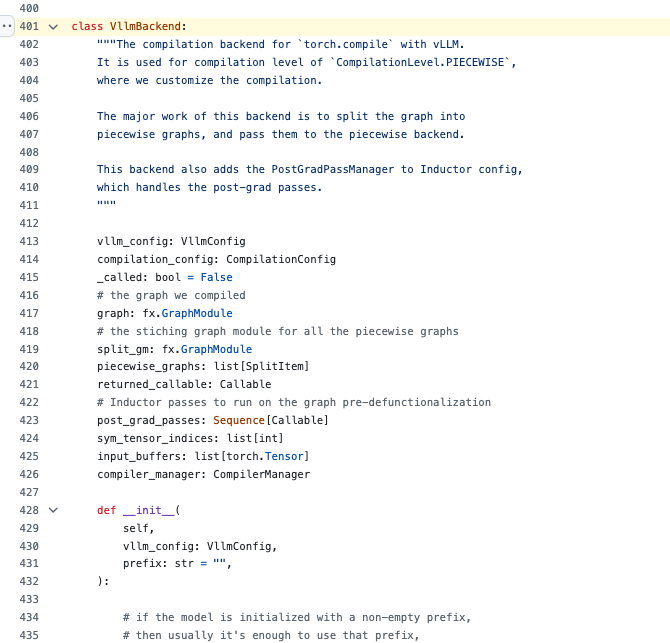

# 0x0. 서문

최근에 어떤 분이 vLLM으로 모델을 띄우다가 CUDA Graph를 capture하는 log가 `Capturing CUDA graphs (mixed prefill-decode, PIECEWISE)`라는 문장으로 바뀐 것을 발견하고, 이게 무슨 최적화인지 나와 이야기해 보고 싶어 했다. 그래서 소스 코드를 뒤져 보며 파악한 내용을 정리한 것이 이 블로그다. 예전에 모델을 띄울 때는 계속 일반적인 CUDA Graph capture log를 봤는데, 이 `PIECEWISE` CUDA Graph는 vLLM compilation 모듈의 핵심 기술이며, prefill 단계에서 Attention을 제외한 연산자에도 CUDA Graph를 적용할 수 있게 해 주어 CPU Overhead를 줄이고 성능을 높여 준다.

PIECEWISE 기술의 핵심 아이디어는 큰 계산 그래프를 특정 연산자를 기준으로 잘라낸 다음 각 서브그래프를 따로 컴파일하는 것이다. 이렇게 하면 컴파일 복잡도를 낮추면서도 더 많은 연산자가 CUDA Graph의 성능 최적화를 누릴 수 있다. vLLM의 compilation 모듈은 그래프 분할, 연산자 융합 Pass, 여러 컴파일 백엔드 등의 기술을 아우른다.

이 글에서는 vLLM compilation 모듈의 기술적 세부 사항을 전체 아키텍처부터 구체적인 구현까지 기록하면서 핵심 기술 포인트를 하나씩 정리한다.

# 0x1. vLLM Compilation 아키텍처

vLLM의 Compilation 시스템은 계층적 설계를 채택했으며, 주로 다음과 같은 핵심 컴포넌트로 구성된다.

## 0x1.1 Compilation 레벨 설계

vLLM은 여러 컴파일 레벨을 정의하고 있으며, `CompilationLevel` 열거형에서 이를 확인할 수 있다.

```python
class CompilationLevel(IntEnum):
    NO_COMPILATION = 0
    DYNAMO_AS_IS = 1
    DYNAMO_ONCE = 2
    PIECEWISE = 3
```

- `NO_COMPILATION`: 어떤 컴파일도 수행하지 않는다
- `DYNAMO_AS_IS`: PyTorch Dynamo의 기본 동작을 사용한다
- `DYNAMO_ONCE`: Dynamo로 한 번 컴파일한 뒤 컴파일된 코드로 바로 디스패치한다
- `PIECEWISE`: 분할 컴파일이며, 이것이 vLLM의 핵심 혁신이다

## 0x1.2 Compilation 백엔드 아키텍처

vLLM은 여러 컴파일 백엔드를 지원하며, `CompilerInterface` 추상 인터페이스를 통해 통합적으로 관리한다.

```python
class CompilerInterface:
    name: str
    
    def initialize_cache(self, cache_dir: str, disable_cache: bool = False, prefix: str = ""):
        pass
    
    def compute_hash(self, vllm_config: VllmConfig) -> str:
        return ""
    
    def compile(self, graph: fx.GraphModule, example_inputs: list[Any], 
                compiler_config: dict[str, Any], runtime_shape: Optional[int] = None,
                key: Optional[str] = None) -> tuple[Optional[Callable], Optional[Any]]:
        return None, None
    
    def load(self, handle: Any, graph: fx.GraphModule, example_inputs: list[Any],
             graph_index: int, runtime_shape: Optional[int] = None) -> Callable:
        raise NotImplementedError("caching is not supported")
```

현재 vLLM은 세 가지 Compilation 백엔드를 구현하고 있다.

1. **EagerAdaptor**: 원본 그래프를 그대로 반환하며 컴파일하지 않는다
2. **InductorAdaptor**: PyTorch Inductor로 컴파일한다 (PyTorch 2.5-2.7에 적용)
3. **InductorStandaloneAdaptor**: 독립적인 Inductor 컴파일러를 사용한다 (PyTorch 2.8+에 적용)

# 0x2. 분할 컴파일(Piecewise Compilation) 기술      

## 0x2.1 핵심 설계

분할 컴파일은 vLLM의 핵심 혁신으로, 기본 아이디어는 큰 계산 그래프를 특정 연산자를 기준으로 잘라낸 다음 각 서브그래프를 따로 컴파일하는 것이다. 이 기술의 가장 큰 가치는 CUDA Graph를 prefill 단계에도 쓸 수 있게 한 점이다. 예전에는 prefill 단계의 입력 길이가 동적이어서 CUDA Graph로 최적화하기가 어려웠다.

PIECEWISE 기술을 통해 vLLM은 다음을 할 수 있다.

1. **prefill 단계에서 CUDA Graph 사용**: Attention을 제외한 연산자(MLP, RMSNorm 등)에 CUDA Graph를 적용하여 CPU Overhead를 크게 줄인다
2. **컴파일 복잡도 감소**: 큰 그래프를 작은 그래프로 쪼개어 각 서브그래프를 독립적으로 컴파일하고 최적화한다
3. **컴파일 캐시 히트율 향상**: 작은 그래프는 캐시에 더 잘 히트하므로 중복 컴파일 시간이 줄어든다
4. **더 세밀한 단위의 최적화 지원**: 연산자 종류에 따라 서로 다른 최적화 전략을 쓸 수 있다

그래서 `Capturing CUDA graphs (mixed prefill-decode, PIECEWISE)` 같은 log를 보게 되는데, 이는 vLLM이 prefill과 decode 단계가 섞인 workload에 대해 분할된 CUDA Graph를 capture하고 있다는 뜻이다.

## 0x2.2 PIECEWISE 모드에서의 Prefill 단계 CUDA Graph Capture 분석

vLLM이 PIECEWISE 모드에서 Prefill 단계의 non-Attention 연산자를 어떻게 CUDA Graph로 capture하는지 살펴보자.

### Capture Size 결정과 분할 백엔드 메커니즘

vLLM은 `compilation_config.compile_sizes`를 통해 어떤 batch size에 대해 컴파일하고 CUDA Graph를 capture할지 결정한다. 기본적으로 vLLM은 `cudagraph_capture_sizes`를 기준으로 자동 추론하며, 계산 로직은 다음과 같다.

```python
# vllm/config/__init__.py 에서
possible_sizes = [1, 2, 4] + [8 * i for i in range(1, 1025)]
max_graph_size = min(max_num_seqs * 2, 512)
# 최종 결과: [1, 2, 4, 8, 16, 24, 32, 40, ..., max_graph_size]
```

`PiecewiseBackend` 클래스에 구체적인 capture 로직이 구현되어 있다. 각 서브그래프는 batch size별로 독립적인 컴파일 entry를 만들고, 특정 size를 처음 만났을 때 컴파일한 뒤 이후에는 그대로 재사용한다.

```python
# vllm/compilation/cuda_piecewise_backend.py 에서
class PiecewiseBackend:
    def __call__(self, *args) -> Any:
        runtime_shape = args[self.sym_shape_indices[0]]
        
        if runtime_shape not in self.concrete_size_entries:
            # capture 목록에 없는 size에 대해서는 범용 컴파일 그래프를 사용
            return self.compiled_graph_for_general_shape(*args)
        
        entry = self.concrete_size_entries[runtime_shape]
        if not entry.compiled:
            # 이 size를 처음 만났을 때 컴파일을 수행
            entry.compiled = True
            entry.runnable = self.vllm_backend.compiler_manager.compile(
                self.graph, args, ..., runtime_shape=runtime_shape)
        
        return entry.runnable(*args)
```

### CUDA Graph의 Capture와 Replay 메커니즘

컴파일된 각 서브그래프는 `CUDAGraphWrapper`로 감싸진다. 어떤 batch descriptor를 처음 만나면 CUDA Graph를 capture하고, 이후 호출에서는 바로 replay한다.

```python
# vllm/compilation/cuda_graph.py 에서
class CUDAGraphWrapper:
    def __call__(self, *args, **kwargs):
        # runtime mode가 일치하는지 확인
        if cudagraph_runtime_mode != self.runtime_mode:
            return self.runnable(*args, **kwargs)
        
        if entry.cudagraph is None:
            # 처음 만났을 때 CUDA Graph를 capture
            cudagraph = torch.cuda.CUDAGraph()
            with torch.cuda.graph(cudagraph, pool=self.graph_pool):
                output = self.runnable(*args, **kwargs)
            entry.cudagraph = cudagraph
            return output
        
        # 이후 호출은 바로 replay
        entry.cudagraph.replay()
        return entry.output
```

### 실제로 Capture되는 연산자와 성능 최적화

PIECEWISE 모드에서 vLLM은 주로 다음 연산자들을 CUDA Graph로 capture한다.

- **MLP 레이어 연산자**: Linear 레이어의 행렬 곱, 활성화 함수(SiLU, GELU 등), residual connection
- **Norm 연산자**: RMSNorm, LayerNorm 및 이들과 양자화가 융합된 버전  
- **양자화 연산자**: FP8/INT8 양자화, 각종 per-token/per-tensor 양자화
- **그 외 연산자**: Embedding 레이어, 위치 인코딩, element-wise 연산

**핵심 제외 대상**: Attention 연산자는 시퀀스 길이에 민감하기 때문에 Prefill 단계에서 capture되지 않고 동적 실행을 유지한다.


### CUDA Graph에 히트하지 못했을 때의 Padding 로직

CUDA Graph에 히트하지 못하더라도 vLLM에는 성능을 최적화하기 위한 padding 로직이 있다. vLLM은 `bs_to_padded_graph_size` 배열을 미리 계산해 두어 O(1)로 padding size를 조회한다.

```python
# CUDA Graph 범위 내: 가장 가까운 capture size로 padding
def pad_for_cudagraph(self, batch_size: int) -> int:
    return self.compilation_config.bs_to_padded_graph_size[batch_size]

# Eager Mode: TP size의 배수로 padding (Sequence Parallelism 최적화용)
if (cudagraph_mode != CUDAGraphMode.NONE and num_tokens <= cudagraph_batch_sizes[-1]):
    num_tokens_padded = self.vllm_config.pad_for_cudagraph(num_tokens)
else:
    # Eager mode: pad to multiple of tensor_parallel_size for SP
    if enable_sequence_parallelism and tp_size > 1:
        num_tokens_padded = round_up(num_tokens, tp_size)
```

예를 들어 `cudagraph_capture_sizes = [1, 2, 4, 8, 16, 32, 64, 128, 256]`과 `tensor_parallel_size = 8`로 설정한 경우다.
- batch_size=10 → 16으로 padding (CUDA Graph 히트)
- batch_size=300 → 304로 padding (Eager mode + SP padding)

이러한 이중 padding 전략 덕분에 vLLM은 다양한 batch size에서 괜찮은 성능을 낼 수 있다.

## 0x2.3 그래프 분할 구현

`backends.py`의 `split_graph` 함수가 그래프 분할 로직을 구현한다.

```python
def split_graph(graph: fx.GraphModule, ops: list[str]) -> tuple[fx.GraphModule, list[SplitItem]]:
    subgraph_id = 0
    node_to_subgraph_id = {}
    split_op_graphs = []
    
    for node in graph.graph.nodes:
        if node.op in ("output", "placeholder"):
            continue
        if node.op == 'call_function' and str(node.target) in ops:
            subgraph_id += 1
            node_to_subgraph_id[node] = subgraph_id
            split_op_graphs.append(subgraph_id)
            subgraph_id += 1
        else:
            node_to_subgraph_id[node] = subgraph_id
    
    split_gm = torch.fx.passes.split_module.split_module(
        graph, None, lambda node: node_to_subgraph_id[node], keep_original_order=True)
    
    # ... 분할 결과 처리
    return split_gm, outputs
```

### 핵심 파라미터 분석: splitting_ops

여기에 전달되는 `ops` 파라미터는 `compilation_config.splitting_ops`에서 오며, 어떤 연산자를 분할 지점으로 삼을지 정의한다. 소스 코드에서 다음을 확인할 수 있다.

**1. 기본 Attention 연산자 목록**
```python
# vllm/config/compilation.py 에서
_attention_ops: ClassVar[list[str]] = [
    "vllm.unified_attention",
    "vllm.unified_attention_with_output", 
    "vllm.mamba_mixer2",
    "vllm.mamba_mixer",
    "vllm.short_conv",
    "vllm.linear_attention",
    "vllm.plamo2_mamba_mixer",
    "vllm.gdn_attention",
]
```

**2. 동적으로 추가되는 MoE 연산자**
```python
if envs.VLLM_ALL2ALL_BACKEND == "deepep_high_throughput":
    # exclude MoE dispatch/combine from capture by ensuring
    # piecewise splitting includes them, so communication remains
    # outside CUDA graphs while compute can still be graphed.
    moe_ops = [
        "vllm.moe_forward",
        "vllm.moe_forward_shared",
    ]
    for op in moe_ops:
        if op not in self.splitting_ops:
            self.splitting_ops.append(op)
```

**3. 분할 로직**
- `splitting_ops`에 있는 연산자를 만나면 그 연산자의 앞뒤에 분할 지점을 만든다
- 각 분할 지점마다 새로운 `subgraph_id`가 생성된다
- 이렇게 해서 원래의 큰 그래프가 여러 개의 독립적인 서브그래프로 분할된다

**4. 분할 효과**
- **Attention 서브그래프**: attention 관련 연산자를 포함하며 동적 실행을 유지한다
- **MLP 서브그래프**: Linear, 활성화 함수 등을 포함하며 CUDA Graph로 capture될 수 있다
- **Norm 서브그래프**: RMSNorm 등 정규화 연산자를 포함하며 마찬가지로 capture될 수 있다

여기서 핵심은 `keep_original_order=True`로, 분할된 서브그래프가 원래 순서대로 실행되어 의미가 바뀌지 않도록 보장한다. 이를 통해 vLLM은 연산자 종류에 따라 서로 다른 처리 전략을 적용할 수 있다.

## 0x2.4 분할 백엔드 구현

`PiecewiseCompileInterpreter`가 분할 컴파일 실행을 담당한다.

```python
class PiecewiseCompileInterpreter(torch.fx.Interpreter):
    def call_module(self, target: torch.fx.node.Target, args: tuple, kwargs: dict) -> Any:
        output = super().call_module(target, args, kwargs)
        
        if target in self.compile_submod_names:
            index = self.compile_submod_names.index(target)
            submod = self.fetch_attr(target)
            
            # 동적 shape 그래프를 컴파일
            compiled_graph_for_dynamic_shape = self.vllm_backend.compiler_manager.compile(
                submod, args, self.compilation_config.inductor_compile_config,
                self.compilation_config, graph_index=index,
                num_graphs=len(self.compile_submod_names), runtime_shape=None)
            
            # 분할 백엔드 생성
            piecewise_backend = PiecewiseBackend(
                submod, self.vllm_config, index, len(self.compile_submod_names),
                sym_shape_indices, compiled_graph_for_dynamic_shape, self.vllm_backend)
            
            # CUDA Graph가 활성화되어 있으면 CUDAGraphWrapper로 감싼다
            if self.compilation_config.cudagraph_mode != CUDAGraphMode.NONE:
                static_graph_wrapper_class = resolve_obj_by_qualname(
                    current_platform.get_static_graph_wrapper_cls())
                self.module.__dict__[target] = static_graph_wrapper_class(
                    runnable=piecewise_backend, vllm_config=self.vllm_config,
                    runtime_mode=CUDAGraphMode.PIECEWISE, ...)
            else:
                self.module.__dict__[target] = piecewise_backend
        
        return output
```

# 0x3. vLLM Compilation 연산자 융합 기술

## 0x3.1 융합 프레임워크 설계

vLLM은 Compilation 모듈에 완전한 연산자 융합 프레임워크를 구현했으며, 주로 다음을 포함한다.

1. **FusionPass**: 범용 융합 Pass로, 주로 RMSNorm+양자화 융합을 처리한다
2. **ActivationQuantFusionPass**: 활성화 양자화 융합
3. **AttnFusionPass**: attention 연산자 융합
4. **AllReduceFusionPass**: 집합 통신 융합

## 0x3.2 RMSNorm 양자화 융합 구현

RMSNorm+FP8 양자화 융합을 예로 들면, vLLM은 PyTorch의 pattern matcher를 사용해 패턴 매칭과 치환을 수행한다.

```python
class FusedAddRMSNormStaticQuantPattern(RMSNormQuantPattern):
    def register(self, pm_pass: PatternMatcherPass, record_match: Callable):
        def pattern(result: torch.Tensor, input: torch.Tensor, residual: torch.Tensor,
                   weight: torch.Tensor, scale: torch.Tensor):
            # 원래 패턴: 먼저 fused_add_rms_norm을 하고 그다음 양자화
            at = auto_functionalized(RMS_ADD_OP, input=input, residual=residual,
                                   weight=weight, epsilon=self.epsilon)
            at1 = auto_functionalized(self.QUANT_OP, result=result, input=at[1], scale=scale)
            return at1[1], at[2]  # result, residual
        
        def replacement(result: torch.Tensor, input: torch.Tensor, residual: torch.Tensor,
                       weight: torch.Tensor, scale: torch.Tensor):
            # 융합 후 패턴: 하나의 연산자가 모든 연산을 수행
            at = auto_functionalized(self.FUSED_OP, result=result, input=input,
                                   residual=residual, weight=weight, scale=scale,
                                   epsilon=self.epsilon)
            return at[1], at[2]  # result, residual
        
        pm.register_replacement(pattern, replacement, inputs, pm.fwd_only, pm_pass,
                              extra_check=lambda m: record_match(self.Match(m, self.QUANT_OP, self.FUSED_OP)))
```

여기서의 핵심 기술 포인트는 다음과 같다.

1. `auto_functionalized`로 in-place 연산을 감싸서 함수형 프로그래밍 의미를 보장한다
2. `extra_check` 콜백으로 매칭을 기록하여 다중 출력 패턴의 수동 처리를 지원한다
3. 완전한 입출력 매핑 관계를 정의한다

## 0x3.3 다중 출력 매칭 처리

출력이 여러 개인 융합 패턴을 위해 vLLM은 `MultiOutputMatch` 클래스를 구현하여, PyTorch pattern matcher의 다중 출력 지원이 완전하지 않은 문제를 처리한다.

### 문제 배경

연산자 융합에서는 출력이 여러 개인 상황을 자주 만난다. 예를 들어 RMSNorm+양자화 융합이 그렇다.

```python
# 원래 패턴: 두 개의 독립적인 연산자
# 1. RMSNorm: 입력 -> (None, normalized_output, residual)  
# 2. 양자화: normalized_output -> (None, quantized_result, scale)

# 융합 후: 하나의 연산자가 여러 개의 출력을 만든다
# 융합 연산자: 입력 -> (None, quantized_result, scale, residual)
```

PyTorch의 pattern matcher는 이런 다중 출력 치환을 처리할 때 버그가 있어서, vLLM은 수동 처리 메커니즘을 구현했다.

### 핵심 구현 메커니즘

**1. 패턴 매칭과 기록**

```python
class FusedAddRMSNormStaticQuantPattern(RMSNormQuantPattern):
    def register(self, pm_pass, record_match):
        def pattern(result, input, residual, weight, scale):
            # 원래 패턴: 먼저 RMSNorm을 하고 그다음 양자화
            at = auto_functionalized(RMS_ADD_OP, input=input, residual=residual, weight=weight)
            at1 = auto_functionalized(self.QUANT_OP, result=result, input=at[1], scale=scale)
            return at1[1], at[2]  # 양자화 결과와 residual을 반환
        
        def replacement(result, input, residual, weight, scale):
            # 융합 후: 하나의 연산자가 모든 연산을 수행
            at = auto_functionalized(self.FUSED_OP, result=result, input=input, 
                                   residual=residual, weight=weight, scale=scale)
            return at[1], at[2]  # 동일한 출력을 반환
        
        # 핵심: extra_check로 매칭을 기록하여 수동 처리를 트리거한다
        pm.register_replacement(pattern, replacement, inputs, pm.fwd_only, pm_pass,
                              extra_check=lambda m: record_match(self.Match(m, self.QUANT_OP, self.FUSED_OP)))
```

**2. 수동 치환 처리**

```python
class Match(QuantMultiOutputMatch):
    def process(self):
        # 1. 매칭에서 핵심 노드를 찾는다
        rms_node = self.find_auto_fn(RMS_ADD_OP)      # RMSNorm 노드
        quant_node = self.find_auto_fn(self.QUANT_OP)  # 양자화 노드
        
        # 2. 융합된 노드를 삽입한다
        with self.inserting_after_match():
            # 출력 매핑 관계 정의: 융합 노드의 어떤 출력이 원래 어떤 노드의 어떤 출력에 대응하는지
            fused_return_mapping = {
                1: (quant_node, 1),  # 융합 노드의 1번 출력 -> 양자화 노드의 1번 출력
                2: (rms_node, 2),    # 융합 노드의 2번 출력 -> RMSNorm 노드의 2번 출력
            }
            self.insert_fused_node(fused_return_mapping, **kwargs)
```

**3. 핵심 치환 로직**

```python
def insert_fused_node(self, fused_return_mapping: dict[int, tuple[fx.Node, int]], **kwargs):
    # 1. 융합 연산자 노드를 생성
    fused_node = self.insert_auto_fn(self.FUSED_OP, kwargs)
    
    # 2. 융합 노드의 각 출력에 대해 getitem 노드를 생성
    indices = fused_return_mapping.keys()  # [1, 2]
    getitem_nodes = self.insert_getitems(fused_node, indices)  # [fused_node[1], fused_node[2]]
    
    # 3. 사용자 노드를 다시 바인딩
    for idx, getitem_node in zip(indices, getitem_nodes):
        old_node, old_idx = fused_return_mapping[idx]
        
        # 원래의 getitem 노드를 찾는다 (존재하는 경우)
        old_getitem = find_getitem_maybe(old_node, old_idx)
        if old_getitem is not None:
            # old_getitem을 사용하는 모든 곳을 새로운 getitem_node로 교체
            old_getitem.replace_all_uses_with(getitem_node)
            # meta 정보를 복사, defunctionalization에 사용
            getitem_node.meta["val"] = old_getitem.meta["val"]
        
        # 융합 노드의 meta 정보를 설정
        meta_val[idx] = old_node.meta["val"][old_idx]
    
    fused_node.meta["val"] = tuple(meta_val)
```

### 실제 효과

이 메커니즘을 통해 vLLM은 다음 구조를

```python
# 원래 그래프 구조
input -> RMSNorm -> normalized_output -> Quantize -> quantized_result
      -> residual                    -> scale
```

다음과 같이 변환한다.

```python  
# 융합 후 그래프 구조
input -> FusedRMSNormQuant -> quantized_result
                           -> scale  
                           -> residual
```

이러한 설계는 PyTorch pattern matcher의 한계를 해결하는 동시에 융합 후 그래프의 정확성과 성능 최적화 효과를 보장한다.

# 0x4. vLLM Compilation 집합 통신 융합 기술

## 0x4.1 AllReduce 융합

vLLM은 여러 가지 AllReduce 융합 패턴을 구현했으며, 다음을 포함한다.

1. **GEMM + ReduceScatter**: 행렬 곱과 reduce-scatter를 융합
2. **AllGather + GEMM**: all-gather와 행렬 곱을 융합
3. **RMSNorm + AllReduce**: RMSNorm과 all-reduce를 융합

GEMM+ReduceScatter를 예로 들면 다음과 같다.

```python
class GEMMReduceScatterPattern(BasePattern):
    def register(self, pm_pass: PatternMatcherPass):
        def pattern(mul: torch.Tensor, mm_weight: torch.Tensor):
            mm = torch.ops.aten.mm.default(mul, mm_weight)
            reduce_scatter = torch.ops.vllm.reduce_scatter.default(
                mm, dim=0, world_size=self.tp_size, group_name=self.tp.unique_name)
            return reduce_scatter
        
        def replacement(mul: torch.Tensor, mm_weight: torch.Tensor):
            gemm_rs = torch.ops.symm_mem.fused_matmul_reduce_scatter(
                mul, mm_weight, "avg", scatter_dim=0,
                group_name=self.tp.device_group.group_name)
            return gemm_rs
        
        pm.register_replacement(pattern, replacement, self.get_inputs(), pm.fwd_only, pm_pass)
```

## 0x4.2 FlashInfer 통신 융합

vLLM은 FlashInfer의 통신 융합 기능도 통합하고 있다.

```python
if flashinfer_comm and hasattr(flashinfer_comm, "trtllm_allreduce_fusion"):
    class FlashInferAllReducePattern(BasePattern):
        def register(self, pm_pass: PatternMatcherPass):
            def pattern(input: torch.Tensor):
                return torch.ops.vllm.all_reduce.default(
                    input, group_name=self.tp.unique_name)
            
            def replacement(input: torch.Tensor):
                return flashinfer_comm.trtllm_allreduce_fusion(
                    input, self.tp_size, get_tensor_model_parallel_rank())
            
            pm.register_replacement(pattern, replacement, self.get_inputs(), pm.fwd_only, pm_pass)
```

# 0x5. vLLM Compilation 컴파일 캐시 메커니즘

## 0x5.1 캐시 아키텍처 설계

vLLM Compilation은 잘 갖춰진 컴파일 캐시 메커니즘을 구현했으며, `CompilerManager`를 통해 통합 관리한다.

```python
class CompilerManager:
    def __init__(self, compilation_config: CompilationConfig):
        self.cache: dict[tuple[Optional[int], int, str], Any] = dict()
        self.is_cache_updated = False
        self.compilation_config = compilation_config
        self.compiler = make_compiler(compilation_config)
    
    def compute_hash(self, vllm_config: VllmConfig) -> str:
        return self.compiler.compute_hash(vllm_config)
    
    def initialize_cache(self, cache_dir: str, disable_cache: bool = False, prefix: str = ""):
        self.cache_dir = cache_dir
        self.cache_file_path = os.path.join(cache_dir, "vllm_compile_cache.py")
        
        if not disable_cache and os.path.exists(self.cache_file_path):
            with open(self.cache_file_path) as f:
                self.cache = ast.literal_eval(f.read())
        
        self.compiler.initialize_cache(cache_dir=cache_dir, disable_cache=disable_cache, prefix=prefix)
```

## 0x5.2 캐시 키 설계

캐시 키 설계는 여러 가지 요소를 고려한다.

```python
def __call__(self, graph: fx.GraphModule, example_inputs) -> Callable:
    if not self.compilation_config.cache_dir:
        factors = []
        # 1. 환경 변수 해시
        env_hash = envs.compute_hash()
        factors.append(env_hash)
        
        # 2. vLLM 설정 해시
        config_hash = vllm_config.compute_hash()
        factors.append(config_hash)
        
        # 3. 코드 파일 해시
        forward_code_files = list(sorted(self.compilation_config.traced_files))
        hash_content = []
        for filepath in forward_code_files:
            hash_content.append(filepath)
            if filepath != "<string>":
                with open(filepath) as f:
                    hash_content.append(f.read())
        code_hash = hashlib.md5("\n".join(hash_content).encode(), usedforsecurity=False).hexdigest()
        factors.append(code_hash)
        
        # 4. 컴파일러 해시
        compiler_hash = self.compiler_manager.compute_hash(vllm_config)
        factors.append(compiler_hash)
        
        hash_key = hashlib.md5(str(factors).encode(), usedforsecurity=False).hexdigest()[:10]
        cache_dir = os.path.join(envs.VLLM_CACHE_ROOT, "torch_compile_cache", hash_key)
```

이러한 설계가 캐시의 정확성과 유효성을 보장한다.

## 0x5.3 캐시 사용 방식

### 캐시 디렉터리 구조

vLLM의 컴파일 캐시는 계층적 디렉터리 구조를 사용한다.

```bash
~/.cache/vllm/torch_compile_cache/
├── hash_key_1/           # 설정과 코드 기반의 해시 값
│   ├── rank_0_1/         # 다중 프로세스/다중 GPU의 rank 정보
│   │   ├── prefix_name/  # 모듈별 prefix
│   │   │   ├── vllm_compile_cache.py      # 컴파일 캐시 인덱스
│   │   │   ├── computation_graph.py       # 계산 그래프 덤프
│   │   │   └── transformed_code.py        # 변환된 코드
│   │   └── shared_artifacts/              # 공유 컴파일 산출물
│   └── rank_2_3/
└── hash_key_2/
```

더 자세한 내용은 `class CompilerManager`의 구현을 보면 된다.

### 캐시 키 설계

캐시 키(hash_key_1, hash_key_2 ...)는 `(runtime_shape, graph_index, backend_name)`이라는 3-튜플 구조를 사용한다

```python
# 캐시 키 예시
cache_key = (
    16,           # runtime_shape: batch_size=16
    2,            # graph_index: 2번째 서브그래프  
    "inductor"    # backend_name: Inductor 백엔드 사용
)
```

### 캐시 로드와 저장 흐름

**1. 컴파일 시의 캐시 조회**

```python
def compile(self, graph, example_inputs, graph_index, runtime_shape):
    # 1. 먼저 캐시에서 로드를 시도
    compiled_graph = self.load(graph, example_inputs, graph_index, runtime_shape)
    if compiled_graph is not None:
        logger.info("Directly load compiled graph from cache, took %.3f s", elapsed)
        return compiled_graph
    
    # 2. 캐시 미스이면 컴파일을 수행
    compiled_graph, handle = self.compiler.compile(graph, example_inputs, ...)
    
    # 3. 컴파일 결과를 캐시에 저장
    if not envs.VLLM_DISABLE_COMPILE_CACHE and handle is not None:
        self.cache[(runtime_shape, graph_index, self.compiler.name)] = handle
        compilation_counter.num_cache_entries_updated += 1
        self.is_cache_updated = True
```

**2. 캐시 영속화**

```python
def save_to_file(self):
    if self.disable_cache or not self.is_cache_updated:
        return
    # Python 형식으로 저장하여 디버깅과 가독성을 높인다
    printer = pprint.PrettyPrinter(indent=4)
    data = printer.pformat(self.cache)
    with open(self.cache_file_path, "w") as f:
        f.write(data)
```

### 캐시 메커니즘의 이점

```python
# 최초 기동 (캐시 없음)
logger.info("Compiling graph for shape 16, took 45.2 s")

# 이후 기동 (캐시 히트)  
logger.info("Directly load compiled graph from cache, took 0.8 s")
```

캐시에 히트하면 컴파일 시간을 수십 초에서 1초 미만으로 줄일 수 있으며, 특히 대규모 모델과 복잡한 분할 컴파일 시나리오에서 효과가 크다.


# 0x6. vLLM Compilation 데코레이터 시스템

vLLM은 모델 컴파일을 단순화하기 위한 완전한 데코레이터 시스템을 제공하며, 핵심 데코레이터로 `@support_torch_compile`과 `@ignore_torch_compile` 두 가지가 있다.

## 0x6.1 컴파일 데코레이터 설계

### 기본 사용 방식

vLLM은 모델 컴파일을 단순화하기 위해 `@support_torch_compile` 데코레이터를 제공한다.

```python
# 방식 1: 데코레이터를 그대로 사용 (동적 차원 자동 추론)
@support_torch_compile
class MyModel(nn.Module):
    def forward(self, x: torch.Tensor, y: Optional[torch.Tensor]):
        ...

# 방식 2: 동적 차원을 명시적으로 지정
@support_torch_compile(dynamic_arg_dims={"x": 0, "y": [0, 1]})
class MyModel(nn.Module):
    def forward(self, x: torch.Tensor, y: torch.Tensor):
        ...

# 방식 3: 조건부 컴파일
@support_torch_compile(enable_if=lambda config: config.model_config.dtype == torch.float16)
class MyModel(nn.Module):
    def forward(self, x: torch.Tensor):
        ...
```

### 동적 차원 자동 추론

`dynamic_arg_dims`를 명시적으로 지정하지 않으면 데코레이터가 자동으로 추론한다.

```python
def cls_decorator_helper(cls: _T) -> _T:
    sig = inspect.signature(cls.forward)
    inferred_dynamic_arg_dims = {}
    
    # forward 메서드의 모든 파라미터를 순회
    for k, v in sig.parameters.items():
        # 타입 어노테이션을 기반으로 동적 차원을 자동 추론
        if v.annotation in [torch.Tensor, Optional[torch.Tensor], 
                           IntermediateTensors, Optional[IntermediateTensors]]:
            inferred_dynamic_arg_dims[k] = 0  # 첫 번째 차원을 동적으로 표시
    
    logger.debug("Inferred dynamic dimensions for forward method of %s: %s", 
                 cls, list(inferred_dynamic_arg_dims.keys()))
    
    return _support_torch_compile(cls, inferred_dynamic_arg_dims, enable_if)
```

**추론 규칙**:
- `torch.Tensor` 또는 `Optional[torch.Tensor]`: 0번째 차원을 동적으로 표시
- `IntermediateTensors`: 모든 tensor의 0번째 차원을 동적으로 표시
- 그 외 타입: 무시

`IntermediateTensors`는 vLLM이 Pipeline Parallelism을 위해 설계한 전용 데이터 구조이며, 다음과 같은 특징이 있다.
서로 연관된 여러 tensor(주로 `hidden_states`와 `residual`)를 캡슐화한다
- Pipeline stage 사이의 데이터 전달을 지원한다
- 컴파일 시스템에서 특별한 동적 차원 처리를 받는다
- 딕셔너리 형태의 접근 인터페이스를 제공하여 여러 중간 상태를 쉽게 읽고 쓸 수 있다


## 0x6.2 데코레이터 구현 메커니즘

### 클래스 상속과 메서드 교체

데코레이터는 클래스의 상속 관계를 수정하고 메서드를 교체하는 방식으로 컴파일 지원을 구현한다.

```python
def _support_torch_compile(cls, dynamic_arg_dims, enable_if):
    # 1. 상속 관계를 수정하여 컴파일 래퍼 기반 클래스를 추가
    cls.__bases__ = cls.__bases__ + (TorchCompileWrapperWithCustomDispatcher,)
    
    old_init = cls.__init__
    
    # 2. __init__ 메서드를 교체하여 컴파일 설정을 추가
    def __init__(self, *, vllm_config: VllmConfig, prefix: str = '', **kwargs):
        old_init(self, vllm_config=vllm_config, prefix=prefix, **kwargs)
        
        # 컴파일이 필요한지 판단
        enable_compile = enable_if is None or enable_if(vllm_config)
        self.do_not_compile = (
            vllm_config.compilation_config.level in [
                CompilationLevel.NO_COMPILATION, 
                CompilationLevel.DYNAMO_AS_IS
            ] or not supports_dynamo() 
            or _should_ignore_torch_compile(self.__class__) 
            or not enable_compile
        )
        
        if not self.do_not_compile:
            compilation_counter.num_models_seen += 1
            TorchCompileWrapperWithCustomDispatcher.__init__(
                self, compilation_level=vllm_config.compilation_config.level)
    
    cls.__init__ = __init__
```

### 동적 shape 표시와 컴파일 디스패치

```python
def __call__(self, *args, **kwargs):
    # 컴파일을 건너뛰는 경우
    if self.do_not_compile or torch.compiler.is_compiling():
        return self.forward(*args, **kwargs)
    
    # 최초 컴파일: 동적 차원 표시
    if len(self.compiled_codes) < 1:
        sig = inspect.signature(self.__class__.forward)
        bound_args = sig.bind(self, *args, **kwargs)
        bound_args.apply_defaults()
        
        # 각 파라미터에 대해 동적 차원을 표시
        for k, dims in dynamic_arg_dims.items():
            arg = bound_args.arguments.get(k)
            if arg is not None:
                dims = [dims] if isinstance(dims, int) else dims
                
                if isinstance(arg, torch.Tensor):
                    # 음수 인덱스 처리: -1은 마지막 차원을 의미
                    dims = [arg.ndim + dim if dim < 0 else dim for dim in dims]
                    torch._dynamo.mark_dynamic(arg, dims)
                    
                elif isinstance(arg, IntermediateTensors):
                    # IntermediateTensors 안의 모든 tensor에 동적 차원을 표시
                    for tensor in arg.tensors.values():
                        dims = [tensor.ndim + dim if dim < 0 else dim for dim in dims]
                        torch._dynamo.mark_dynamic(tensor, dims)
        
        # 컴파일 과정 모니터링 시작
        start_monitoring_torch_compile(self.vllm_config)
        logger.debug("Start compiling function %s", self.original_code_object)
    
    # 컴파일 디스패치 로직
    if len(self.compiled_codes) < 1 or not self.use_custom_dispatcher:
        # Dynamo의 기본 디스패치 메커니즘을 사용
        torch._dynamo.eval_frame.remove_from_cache(self.original_code_object)
        
        # Dynamo가 추적한 파일을 수집, 캐시 무효화에 사용
        self.vllm_config.compilation_config.traced_files.add(
            self.original_code_object.co_filename)
        
        # patch 메커니즘으로 인라인 함수의 파일을 수집
        with patch.object(InliningInstructionTranslator, 'inline_call', patched_inline_call):
            output = self.compiled_callable(*args, **kwargs)
        return output
    
    # 커스텀 디스패처로 컴파일된 코드를 직접 호출
    with self.dispatch_to_code(0):
        model_output = self.forward(*args, **kwargs)
        return model_output
```

## 0x6.3 컴파일 제어 데코레이터

### @ignore_torch_compile 데코레이터

부모 클래스의 컴파일 데코레이터를 무시하는 데 사용한다.

```python
@ignore_torch_compile
class ChildModel(ParentModelWithCompile):
    def forward(self, x):
        # 부모 클래스에 @support_torch_compile이 있어도 이 클래스는 컴파일되지 않는다
        ...

def ignore_torch_compile(cls: _T) -> _T:
    """
    support_torch_compile 데코레이터의 영향을 무시한다.
    - 부모 클래스에 support_torch_compile이 있고 자식 클래스에 ignore_torch_compile이 있으면 자식 클래스는 컴파일되지 않는다
    - 부모 클래스에 ignore_torch_compile이 있고 자식 클래스에 support_torch_compile이 있으면 자식 클래스는 여전히 컴파일된다
    - 현재 클래스의 forward 메서드에만 영향을 주며, 서브 모듈에는 영향을 주지 않는다
    """
    setattr(cls, IGNORE_COMPILE_KEY, True)
    return cls
```

### 조건부 컴파일 지원

`enable_if` 파라미터를 통해 조건부 컴파일을 구현한다.

```python
# 특정 조건에서만 컴파일
@support_torch_compile(
    enable_if=lambda config: (
        config.model_config.dtype == torch.float16 and 
        config.parallel_config.tensor_parallel_size == 1
    )
)
class ConditionalModel(nn.Module):
    def forward(self, x):
        ...
```

## 0x6.4 컴파일 래퍼 기반 클래스

### TorchCompileWrapperWithCustomDispatcher

이것이 데코레이터 시스템의 핵심 기반 클래스다.

```python
class TorchCompileWrapperWithCustomDispatcher:
    def __init__(self, compiled_callable=None, compilation_level=0):
        vllm_config = get_current_vllm_config()
        
        if compiled_callable is None:
            # 기본 컴파일 설정: forward 메서드를 컴파일
            backend = vllm_config.compilation_config.init_backend(vllm_config)
            options = None
            if backend == "inductor":
                options = vllm_config.compilation_config.inductor_compile_config
            
            compiled_callable = torch.compile(
                self.forward,
                fullgraph=envs.VLLM_TEST_DYNAMO_FULLGRAPH_CAPTURE,
                backend=backend,
                options=options
            )
        
        self.compiled_callable = compiled_callable
        self.original_code_object = self.__class__.forward.__code__
        self.compiled_codes: list[CodeType] = []
        
        # 바이트코드 훅을 등록하여 컴파일된 바이트코드를 저장
        torch._dynamo.convert_frame.register_bytecode_hook(self.bytecode_hook)
        
        # 컴파일 레벨에 따라 커스텀 디스패처 사용 여부를 결정
        self.use_custom_dispatcher = compilation_level >= CompilationLevel.DYNAMO_ONCE
```

### 바이트코드 훅과 디버깅 지원

```python
def bytecode_hook(self, old_code: CodeType, new_code: CodeType):
    """컴파일된 바이트코드를 저장하여 직접 실행과 디버깅에 사용한다"""
    if old_code is not self.original_code_object:
        return
    
    self.compiled_codes.append(new_code)
    
    # 디버깅 지원: 계산 그래프와 변환된 코드를 덤프
    debug_dump_dir = self.vllm_config.compilation_config.debug_dump_path
    if debug_dump_dir:
        rank = self.vllm_config.parallel_config.rank
        decompiled_file = os.path.join(debug_dump_dir, f"rank_{rank}", "transformed_code.py")
        
        try:
            import depyf
            src = depyf.decompile(new_code)
            with open(decompiled_file, "w") as f:
                f.write(src)
            logger.debug("Dynamo transformed code saved to %s", decompiled_file)
        except Exception:
            pass
```


# 0x7. CUDA Graph 통합

## 0x7.1 CUDA Graph 모드

vLLM Compilation은 여러 가지 CUDA Graph 모드를 지원한다.

```python
class CUDAGraphMode(IntEnum):
    NONE = 0
    PIECEWISE = 1  # 분할 CUDA Graph 모드, 우리가 log에서 보게 되는 그 PIECEWISE다
    FULL = 2       # 전체 그래프 CUDA Graph 모드
```

`PIECEWISE` 모드는 vLLM의 혁신으로, prefill 단계에서 일부 연산자에 CUDA Graph를 사용할 수 있게 해 준다. 기존의 CUDA Graph는 고정된 입력 shape이 필요했기 때문에 prefill 단계에 적용하기 어려웠다. 하지만 분할 컴파일을 통해 vLLM은 입력 길이에 민감하지 않은 연산자(MLP 레이어, RMSNorm 등)를 따로 뽑아내어 그것들에 대해 CUDA Graph를 만들고, 입력 길이에 민감한 연산자(주로 Attention)는 동적 실행으로 남겨 둘 수 있다.

분할 컴파일에서는 각 서브그래프가 독립적으로 CUDA Graph를 사용할 수 있다.

```python
if self.compilation_config.cudagraph_mode != CUDAGraphMode.NONE:
    static_graph_wrapper_class = resolve_obj_by_qualname(
        current_platform.get_static_graph_wrapper_cls())
    
    self.module.__dict__[target] = static_graph_wrapper_class(
        runnable=piecewise_backend,
        vllm_config=self.vllm_config,
        runtime_mode=CUDAGraphMode.PIECEWISE,
        cudagraph_options=CUDAGraphOptions(
            debug_log_enable=piecewise_backend.is_first_graph,
            gc_disable=not piecewise_backend.is_first_graph,
            weak_ref_output=piecewise_backend.is_last_graph))
```

여기는 세부 사항이 정말 많아서 더 쓰기는 어렵고, 관심이 있다면 여기 소스 코드를 직접 보면 된다: https://github.com/vllm-project/vllm/blob/main/vllm/compilation/backends.py#L401





# 0x8. vLLM Compilation Pass 관리 시스템

## 0x8.1 Pass 관리자 설계

vLLM은 모든 Pass를 관리하기 위해 `PostGradPassManager`를 구현했다.

```python
class PostGradPassManager(CustomGraphPass):
    def __init__(self):
        self.passes: list[VllmInductorPass] = []
    
    def configure(self, config: VllmConfig):
        if self.pass_config.enable_noop:
            self.passes += [NoOpEliminationPass(config)]
        
        if self.pass_config.enable_sequence_parallelism:
            self.passes += [SequenceParallelismPass(config)]
            if self.pass_config.enable_async_tp:
                self.passes += [AsyncTPPass(config)]
        
        if self.pass_config.enable_fusion:
            self.passes += [FusionPass.instance(config)]
            self.passes += [ActivationQuantFusionPass(config)]
        
        if self.pass_config.enable_attn_fusion:
            self.passes += [AttnFusionPass(config)]
        
        if self.pass_config.enable_fi_allreduce_fusion:
            self.passes += [AllReduceFusionPass(config)]
        
        self.fix_functionalization = FixFunctionalizationPass(config)
    
    def __call__(self, graph: fx.Graph):
        shape = get_pass_context().runtime_shape
        for pass_ in self.passes:
            if pass_.is_applicable_for_shape(shape):
                pass_(graph)
        
        # fix_functionalization은 항상 마지막에 실행
        self.fix_functionalization(graph)
```

## 0x8.2 Pass 실행 순서

Pass의 실행 순서는 다음과 같다.

1. NoOp 제거 Pass
2. 시퀀스 병렬 Pass
3. 비동기 텐서 병렬 Pass  
4. 융합 Pass (FusionPass, ActivationQuantFusionPass)
5. attention 융합 Pass
6. FlashInfer AllReduce 융합 Pass
7. 함수화 수정 Pass (항상 마지막에 실행)

이 순서는 모든 Pass가 함수화된 그래프 위에서 동작하도록 보장한다. 여기서는 간단히만 소개하며, 자세한 내용을 알고 싶다면 소스 코드를 보면 된다: https://github.com/vllm-project/vllm/blob/main/vllm/compilation/backends.py#L401

# 0x9. vLLM Compilation 성능 모니터링과 디버깅

## 0x9.1 컴파일 카운터

vLLM은 상세한 컴파일 통계를 구현하고 있다.

```python
@dataclasses.dataclass
class CompilationCounter:
    num_models_seen: int = 0                      # 확인된 모델 수
    num_graphs_seen: int = 0                      # 확인된 계산 그래프 수
    num_piecewise_graphs_seen: int = 0            # 분할 그래프 수
    num_piecewise_capturable_graphs_seen: int = 0 # capture 가능한 분할 그래프 수
    num_inductor_compiles: int = 0                # Inductor 컴파일 횟수
    num_backend_compilations: int = 0             # 백엔드 컴파일 횟수
    num_eager_compiles: int = 0                   # Eager 컴파일 횟수
    num_cache_entries_updated: int = 0            # 캐시 엔트리 갱신 횟수
    num_compiled_artifacts_saved: int = 0         # 저장된 컴파일 산출물 수
```

### 사용 방법

**1. 컴파일 통계 정보 확인**

```python
from vllm.compilation.counter import compilation_counter

# 모델 실행 후 통계 정보를 확인
print(f"컴파일된 모델 수: {compilation_counter.num_models_seen}")
print(f"분할 그래프 수: {compilation_counter.num_piecewise_graphs_seen}")
print(f"캐시 히트 상황: {compilation_counter.num_cache_entries_updated}")
```

**2. 환경 변수로 상세 로그 활성화**

```bash
# 컴파일 관련 상세 로그 활성화
export VLLM_LOGGING_LEVEL=DEBUG

# vLLM 서비스 기동
python -m vllm.entrypoints.openai.api_server \
    --model meta-llama/Llama-2-7b-hf \
    --compilation-level 3
```

**3. 컴파일 성능 모니터링**

vLLM은 컴파일 시간과 캐시 히트 상황을 자동으로 기록한다.

```python
# 로그에서 다음과 비슷한 출력을 볼 수 있다
# INFO: Compiling graph for shape 16, took 45.2 s
# INFO: Directly load compiled graph from cache, took 0.8 s
# INFO: CUDA graph capture for shape 32, took 2.1 s
```

## 0x9.2 디버깅 지원

vLLM Compilation은 개발자가 컴파일 과정을 이해하고 문제를 파악하기 쉽도록 여러 디버깅 기능을 제공한다.

### 디버그 덤프 활성화

**1. 디버그 덤프 디렉터리 설정**

```bash
# 환경 변수로 설정
export VLLM_COMPILATION_DEBUG_DUMP_PATH="/tmp/vllm_debug"

# 또는 기동 시에 지정
python -m vllm.entrypoints.openai.api_server \
    --model meta-llama/Llama-2-7b-hf \
    --compilation-level 3 \
    --compilation-config '{"debug_dump_path": "/tmp/vllm_debug"}'
```

**2. 디버그 파일 구조**

디버깅을 활성화하면 지정한 디렉터리에 다음 파일들이 생성된다.

```bash
/tmp/vllm_debug/
├── rank_0/
│   ├── transformed_code.py          # Dynamo가 변환한 코드
│   ├── computation_graph.py         # 계산 그래프 덤프
│   ├── inductor_output.py          # Inductor 컴파일 출력
│   └── piecewise_graphs/           # 분할 그래프 상세
│       ├── subgraph_0.py
│       ├── subgraph_1.py
│       └── ...
└── compilation_stats.json          # 컴파일 통계 정보
```


vLLM Compilation은 컴파일 시간 분석, 메모리 모니터링 등의 성능 분석 도구도 제공한다. 자주 쓰이는 디버깅 기법으로는 환경 변수로 특정 서브그래프의 컴파일을 건너뛰기, 캐시를 지워 강제로 재컴파일하기, 상세한 CUDA Graph 디버그 로그 활성화하기 등이 있다. 개발자는 컴파일 설정을 점검하거나 컴파일 전후의 성능을 비교하는 방식으로 문제를 파악하고 성능 회귀를 분석할 수 있다.

# 0x10. 요약

vLLM Compilation 모듈의 주요 특성은 다음과 같다.

1. **분할 컴파일(PIECEWISE)**: vLLM의 가장 핵심적인 혁신으로, 그래프 분할을 통해 CUDA Graph를 prefill 단계에도 적용할 수 있게 하여 Attention을 제외한 연산자들이 CUDA Graph가 가져다주는 CPU Overhead 감소를 누릴 수 있게 한다. vLLM을 띄울 때 보이는 `Capturing CUDA graphs (mixed prefill-decode, PIECEWISE)`가 바로 이 기술의 원리다
2. **연산자 융합**: 연산자 수준부터 통신 수준까지 전방위적인 연산자 fuse 최적화
3. **지능형 캐시**: 여러 요소를 고려한 캐시 키 설계로 캐시의 정확성을 보장
4. **데코레이터 시스템**: 모델 컴파일을 단순화하는 사용자 인터페이스
5. **Pass 관리**: 모듈화된 최적화 Pass 관리 시스템으로, 모델 안에 손으로 쓴 중복 코드를 반복해서 작성하지 않아도 된다

PIECEWISE 기술 덕분에 vLLM은 prefill 단계에서도 뚜렷한 성능 향상을 얻을 수 있다. 전체적으로 보면 Torch Compile을 기반으로 vLLM은 PIECEWISE CUDA Graph, 연산자 fuse, 지능형 캐시, 데코레이터 시스템, Pass 관리 등의 특성을 구현했고, 이를 통해 모델 최적화를 더 잘 유지보수하면서 성능도 높였다.

관련 코드 링크:
- 컴파일 백엔드 구현: https://github.com/vllm-project/vllm/blob/main/vllm/compilation/backends.py
- 컴파일러 인터페이스: https://github.com/vllm-project/vllm/blob/main/vllm/compilation/compiler_interface.py  
- 융합 Pass 구현: https://github.com/vllm-project/vllm/blob/main/vllm/compilation/fusion.py
- 데코레이터 시스템: https://github.com/vllm-project/vllm/blob/main/vllm/compilation/decorators.py
- Pass 관리자: https://github.com/vllm-project/vllm/blob/main/vllm/compilation/pass_manager.py
