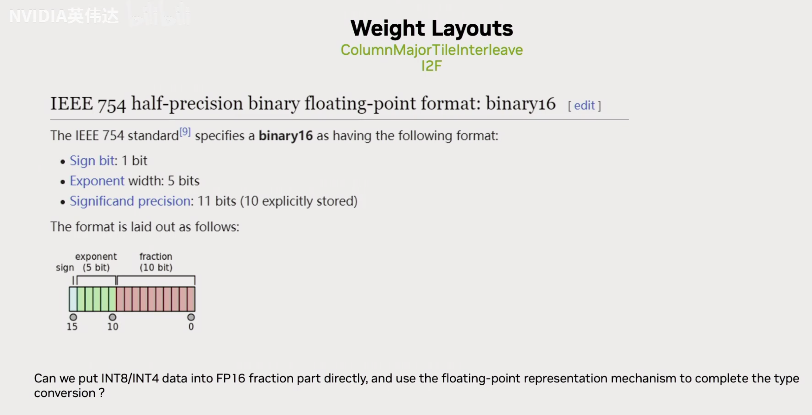
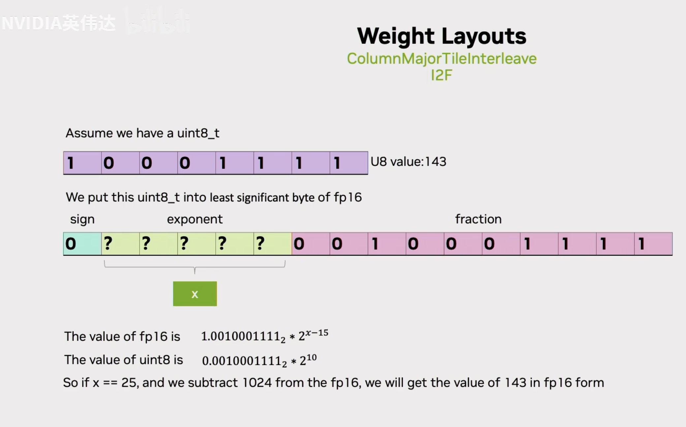
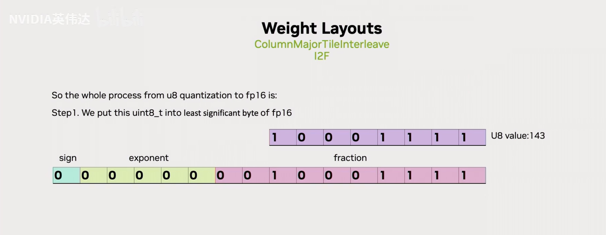
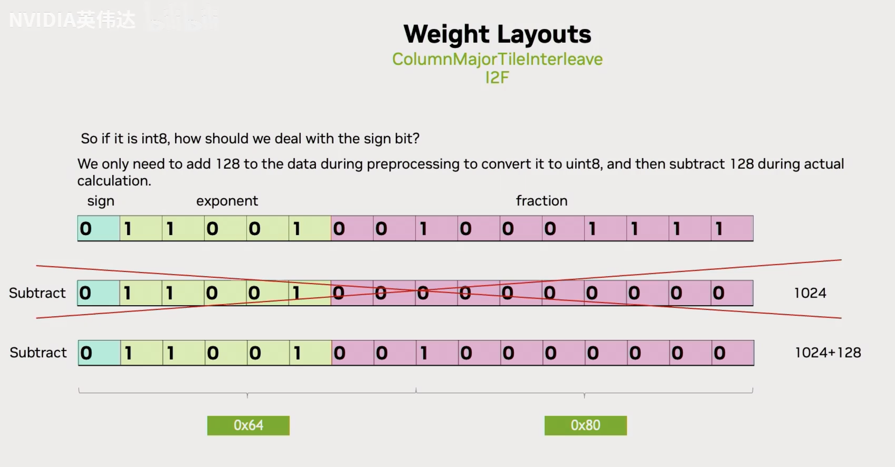
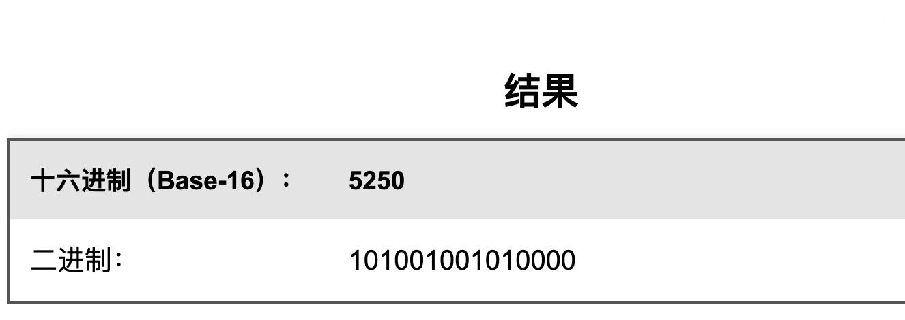
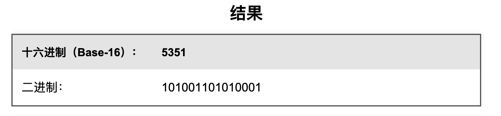
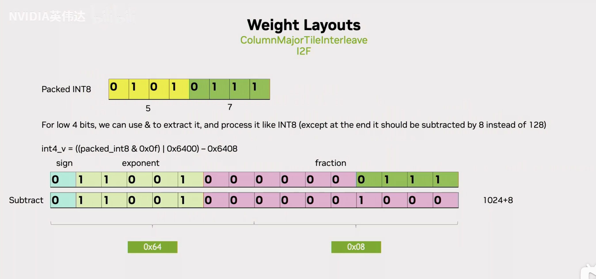
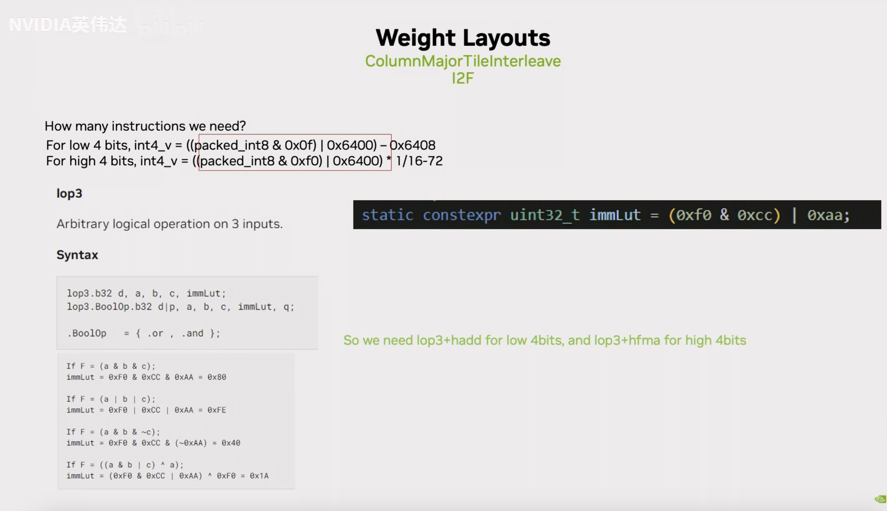
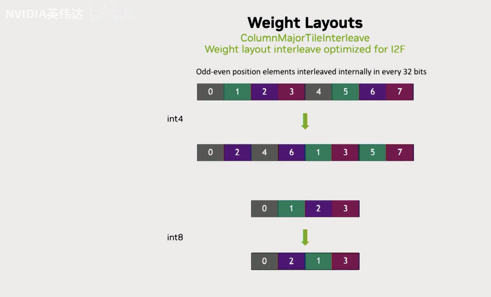

# vLLM과 SGLang awq dequantize kernel의 마법 상세 해설

## 0x0. 서문

이 글에서는 vLLM/SGLang의 awq int4 역양자화 kernel을 분석한다. 이 kernel은 입력 `x`의 shape에서 tokens < 256일 때 트리거된다. 이때 먼저 int4 awq weight를 `awq_dequantize`로 float16으로 역양자화한 뒤, PyTorch Matmul을 호출해 float16 곱셈을 수행한다. 코드 위치는 다음과 같다. https://github.com/vllm-project/vllm/blob/b82662d9523d9aa1386d8d1de410426781a1fa3b/vllm/model_executor/layers/quantization/awq.py#L162-L184

```python
def apply(self,
          layer: torch.nn.Module,
          x: torch.Tensor,
          bias: Optional[torch.Tensor] = None) -> torch.Tensor:
    qweight = layer.qweight
    scales = layer.scales
    qzeros = layer.qzeros
    pack_factor = self.quant_config.pack_factor
    out_shape = (x.shape[:-1] + (qweight.shape[-1] * pack_factor, ))
    reshaped_x = x.reshape(-1, x.shape[-1])

    # num_tokens >= threshold
    FP16_MATMUL_HEURISTIC_CONDITION = x.shape[:-1].numel() >= 256

    if FP16_MATMUL_HEURISTIC_CONDITION:
        out = ops.awq_dequantize(qweight, scales, qzeros, 0, 0, 0)
        out = torch.matmul(reshaped_x, out)
    else:
        out = ops.awq_gemm(reshaped_x, qweight, scales, qzeros,
                           pack_factor)
    if bias is not None:
        out.add_(bias)
    return out.reshape(out_shape)
```

이 글에서 분석하려는 것은 여기의 vllm `ops.awq_dequantize` kernel이다. 이 kernel의 코드를 따로 떼어내면 수십 줄뿐이지만, 코드 안에 들어 있는 마법과 수학이 꽤 많다. 이 원리를 모르면 읽기가 매우 고통스러워지므로 여기에서 자세히 풀어본다. vllm `ops.awq_dequantize` 연산자의 원래 출처는 FasterTransformer 저장소다. sglang의 sgl-kernel에도 이 연산자에 대한 깔끔한 구현이 하나 있으며, thread block을 조정해 더 빠른 속도를 낸다. 여기서는 이 코드를 직접 대상으로 분석한다. 링크는 다음과 같다. https://github.com/sgl-project/sglang/blob/main/sgl-kernel/csrc/gemm/awq_kernel.cu#L7-L127

> 추가로 설명해야 할 점이 있다. AWQ/GPTQ에서 weight 양자화는 PerChannel이 아니라 GroupWise이다. 즉 K 방향에 GS 그룹의 Scales와 Zeros가 있다. 예를 들어 K/GS=128이라고 가정하면, K 방향의 128개 weight 행이 하나의 Scales와 Zeros를 공유한다. 따라서 PerChannel과의 차이는 역양자화할 때 Scales를 곱하고 Zeros를 더해야 한다는 점이다. 이 밖에도 AWQ 자체는 Activation 계산 전에 자신의 ActScale을 곱해야 한다. 아래 Kernel에서 대상은 weight이며, K 방향은 행(row) 방향이다.

## 0x1. 인터페이스 함수

```c++
// AWQ weight 역양화를 위한 PyTorch 인터페이스 함수
torch::Tensor awq_dequantize(torch::Tensor qweight, torch::Tensor scales, torch::Tensor qzeros) {
  // 입력 텐서의 차원 정보를 가져온다
  int qweight_rows = qweight.size(0);
  int qweight_cols = qweight.size(1);
  int group_size = qweight_rows / scales.size(0); // 양자화 group 크기를 계산한다

  // CUDA grid와 block 차원을 설정한다
  int x_num_threads = 16;
  int y_num_threads = 16;
  int x_blocks = qweight_cols / x_num_threads;
  int y_blocks = qweight_rows / y_num_threads;

  // 올바른 CUDA device에서 실행되도록 보장한다
  const at::cuda::OptionalCUDAGuard device_guard(device_of(qweight));

  // scales와 같은 dtype 및 device를 갖는 출력 텐서를 만든다
  auto output_tensor_options = torch::TensorOptions().dtype(scales.dtype()).device(scales.device());
  at::Tensor output = torch::empty({qweight_rows, qweight_cols * 8}, output_tensor_options);

  // 각 텐서의 데이터 포인터를 가져온다
  auto _qweight = reinterpret_cast<int*>(qweight.data_ptr<int>());
  auto _scales = reinterpret_cast<half*>(scales.data_ptr<at::Half>());
  auto _zeros = reinterpret_cast<int*>(qzeros.data_ptr<int>());
  auto _output = reinterpret_cast<half*>(output.data_ptr<at::Half>());

  // CUDA kernel 함수의 실행 파라미터를 설정한다
  dim3 num_blocks(x_blocks, y_blocks);
  dim3 threads_per_block(x_num_threads, y_num_threads);

  // 현재 CUDA stream을 가져와 kernel 함수를 시작한다
  const cudaStream_t stream = at::cuda::getCurrentCUDAStream();
  dequantize_weights<<<num_blocks, threads_per_block, 0, stream>>>(
      _qweight, _scales, _zeros, _output, group_size, qweight_cols);

  // 역양자화된 weight 텐서를 반환한다
  return output;
}
```

주의할 점은 kernel의 입력 타입이 `int4`이고 출력 타입이 `float16`이라는 것이다. 입력 shape은 `[qweight_rows, qweight_cols]`이고 출력 shape은 `[qweight_rows, qweight_cols * 8]`이다. 여기서 입력 데이터의 한 원소는 32비트 정수 `source`이며, 8개의 4비트 정수(각 4비트는 0-15 값을 표현할 수 있다)를 담고 있음을 알 수 있다. 이 8개의 4비트 정수는 아래와 같이 촘촘하게 packed되어 있다.

`[4bit][4bit][4bit][4bit][4bit][4bit][4bit][4bit]`

다음으로 kernel launch 설정에서는 2차원 thread grid와 thread block을 사용하고, 각 thread가 입력 Tensor의 원소 하나를 처리한다. 매우 직관적이다.

```c++
int x_num_threads = 16;
int y_num_threads = 16;
int x_blocks = qweight_cols / x_num_threads;
int y_blocks = qweight_rows / y_num_threads;
dim3 num_blocks(x_blocks, y_blocks);
dim3 threads_per_block(x_num_threads, y_num_threads);
```

## 0x2. dequantize_weights kernel 흐름

```c++
// weight 역양자화 CUDA kernel, 최대 thread 수는 256이다
__global__ void __launch_bounds__(256) dequantize_weights(
    int* __restrict__ qweight,    // 양자화된 weight
    half* __restrict__ scales,    // 양자화 scale factor
    int* __restrict__ qzeros,     // 양자화 zero point
    half* __restrict__ output,    // 출력 역양자화 weight
    int group_size,               // 양자화 group 크기
    int qweight_cols) {           // 양자화 weight의 열 수
  // 현재 thread가 처리할 열과 행 index를 계산한다
  int col = blockIdx.x * blockDim.x + threadIdx.x;
  int row = blockIdx.y * blockDim.y + threadIdx.y;

  // 현재 처리 위치의 zero point를 가져와 fp16x2 형식으로 역양자화한다
  uint4 zeros = dequantize_s4_to_fp16x2(qzeros[col + (row / group_size) * qweight_cols]);
  // 대응하는 scale factor를 load한다
  uint4 loaded_scale = *(uint4*)(scales + 8 * col + (row / group_size) * qweight_cols * 8);

  // 양자화 weight를 fp16x2 형식으로 역양자화한다
  uint4 weight_fp16 = dequantize_s4_to_fp16x2(qweight[col + row * qweight_cols]);

  // 각 fp16x2 원소에 대해 (weight - zero) * scale 연산을 수행한다
  // 첫 번째 fp16 값 쌍 처리
  asm volatile("sub.f16x2 %0, %1, %2;\n" : "=r"(weight_fp16.x) : "r"(weight_fp16.x), "r"(zeros.x));
  asm volatile("mul.rn.f16x2 %0, %1, %2;\n" : "=r"(weight_fp16.x) : "r"(weight_fp16.x), "r"(loaded_scale.x));
  // 두 번째 fp16 값 쌍 처리
  asm volatile("sub.f16x2 %0, %1, %2;\n" : "=r"(weight_fp16.y) : "r"(weight_fp16.y), "r"(zeros.y));
  asm volatile("mul.rn.f16x2 %0, %1, %2;\n" : "=r"(weight_fp16.y) : "r"(weight_fp16.y), "r"(loaded_scale.y));
  // 세 번째 fp16 값 쌍 처리
  asm volatile("sub.f16x2 %0, %1, %2;\n" : "=r"(weight_fp16.z) : "r"(weight_fp16.z), "r"(zeros.z));
  asm volatile("mul.rn.f16x2 %0, %1, %2;\n" : "=r"(weight_fp16.z) : "r"(weight_fp16.z), "r"(loaded_scale.z));
  // 네 번째 fp16 값 쌍 처리
  asm volatile("sub.f16x2 %0, %1, %2;\n" : "=r"(weight_fp16.w) : "r"(weight_fp16.w), "r"(zeros.w));
  asm volatile("mul.rn.f16x2 %0, %1, %2;\n" : "=r"(weight_fp16.w) : "r"(weight_fp16.w), "r"(loaded_scale.w));

  // 출력 포인터 위치를 계산하고 결과를 저장한다
  half* output_ptr = output + 8 * col + 8 * row * qweight_cols;
  *(uint4*)output_ptr = weight_fp16;
}
```

여기서 전체 흐름은 이해하기 쉽다. thread id에 따라 현재 thread가 처리하는 열과 행 index를 찾은 뒤, zero point인 zeros, scale 계수인 loaded_scale, weight인 weight_fp16을 각각 load한다. 그리고 zeros/weight_fp16에 `dequantize_s4_to_fp16x2` 역양자화 kernel을 적용해 현재 행과 열에 있는 int32 타입 값(8개의 int4)을 8개의 half 타입 출력값으로 역양자화한다. 여기서는 4개의 half2로 저장한다는 점에 주의해야 한다. 그런 다음 `(weight - zero) * scale` 연산으로 역양자화 과정을 완료한다.

여기서 `asm volatile("sub.f16x2 %0, %1, %2;\n" : "=r"(weight_fp16.x) : "r"(weight_fp16.x), "r"(zeros.x));` 명령 하나를 분석해보자.

이 줄의 코드는 CUDA PTX를 사용해 반정밀도 부동소수점(fp16) 뺄셈을 수행한다. 기본 문법은 다음과 같다.

```shell
asm [volatile] ("assembly instruction" : output operands : input operands : registers that may be modified);
```

자세히 풀면 다음과 같다.

- `asm volatile`:
  - `asm` keyword는 이것이 inline assembly 코드임을 나타낸다.
  - `volatile` modifier는 compiler가 이 assembly 코드를 최적화하거나 재배열하지 않도록 알려주며, 지정된 순서대로 실행되도록 보장한다.
- `sub.f16x2 %0, %1, %2;\n`:
  - 실제 CUDA PTX assembly instruction이다.
  - `sub.f16x2`는 두 개의 나란히 packed된 fp16 값(packed half2)에 대해 뺄셈을 수행하는 CUDA instruction이다.
  - `%0, %1, %2`는 placeholder이며, 뒤에서 정의하는 output operand 및 input operand에 각각 대응한다.
  - `\n`은 assembly 코드 형식을 맞추기 위한 newline이다.
- `: "=r"(weight_fp16.x) : "r"(weight_fp16.x), "r"(zeros.x));`
  - 첫 번째 colon 뒤의 `"=r"(weight_fp16.x)`는 output operand이며, `=r`은 general-purpose register로 출력되는 값이라는 뜻이다.
  - 두 번째 colon 뒤의 `"r"(weight_fp16.x)`와 `"r"(zeros.x))`는 두 input operand이며, `r`은 이 값들이 general-purpose register에서 온다는 뜻이다.

이 명령을 통해 역양자화에서 zero point를 빼는 기능이 구현된다. kernel 안의 다른 PTX instruction도 같은 방식으로 이해하면 된다.

## 0x3. dequantize_s4_to_fp16x2 kernel, 마법이 일어나는 곳

이 코드에 대응하는 원리는 NVIDIA 2023년 여름 세션에서 간단히 다룬 적이 있다. 여기서는 당시 PPT를 바탕으로 원리를 다시 설명한다. 이 설명을 읽고 나면 코드 속의 여러 magic과 계산용 PTX instruction이 무엇을 하는지 알 수 있다. 아래에 인용한 그림은 BiliBili NVIDIA 채널에 올라온 "TensorRT-LLM의 Quantization GEMM(Ampere Mixed GEMM)의 CUTLASS 2.x 구현 해설"에서 가져온 것이다.

### FasterTransformer에서 효율적인 Int8/Int4의 FP16 빠른 변환




이 slide는 FP16의 IEEE 754 표준을 보여준다. 16bit 숫자 하나에는 sign bit 1개, exponent bit 5개, mantissa 10개가 들어 있다.



uint8 숫자 143이 있다고 가정하자. 이것을 실제 FP16의 mantissa bit 위치에 넣는다면, exponent bit를 적절히 설정해 143을 표현할 방법이 있을까? 알려진 FP16 수치 계산 방식에 따라 exponent bit의 binary 앞에 1.x를 붙이고, 여기에 2의 `(exponent 값 - 15)` 제곱을 곱한다. 143에 대응하는 실제 값은 아래와 같다. 이 FP16 값을 사용해 Int8을 표현하고 싶다고 가정하면, x=25일 때 위 FP16 값에서 1024를 빼면 아래의 143이 나온다는 것을 알 수 있다. 따라서 int8 값을 mantissa bit에 넣고 exponent bit를 25로 설정한 다음, FP16 수치 결과에서 1024를 빼면 UINT8에서 FP16으로 변환한 값을 얻을 수 있다.



요약하면 UINT8 값을 FP16의 mantissa bit에 직접 넣는다.


그런 다음 FP16의 exponent bit를 25로 설정한다. 이 25에 대응하는 hexadecimal 표현이 0x64이다.


이후 최종 값을 FP16 형식의 1024만큼 빼면 UINT8에서 FP16으로의 변환이 완료된다.



Int8이라면 어떻게 해야 할까? UINT8과 INT8은 값 범위만 다르다는 점에 주목할 수 있다. 그러면 INT8 데이터에 128을 더해 UINT8 형식으로 바꾸면 된다. 이렇게 변환해 얻은 FP16 결과는 1024를 뺄 때 128을 추가로 더 빼면 원래 INT8 값으로 복원된다.


그렇다면 실제 instruction으로 위에서 설명한 작업을 어떻게 수행할까? `prmt`라는 PTX instruction이 있다는 점에 주목할 수 있다. 이 instruction은 2개의 32bit register A, B에서 4개의 8bit를 뽑아 최종 d를 구성한다. 이 4개의 8bit를 어떻게 뽑을지는 c register의 낮은 4bit 안에 있는 각 8bit 대응 값으로 정한다. 즉 c register의 낮은 4bit 각각이 index이다. A, B 두 32bit register 안에 위 왼쪽 그림과 같은 ABCDEFGH 데이터 형식이 저장되어 있다고 가정하자. c register에서 index 4개가 각각 1, 3, 5, 7이면, 최종 D register 안의 4개 8bit 데이터는 GECA가 된다. 이 instruction을 통해 32bit register에서 원하는 byte를 뽑아내는 효과를 구현할 수 있다.


TRT-LLM의 변환 코드에 대응하면 이런 형태다. 입력 UINT8 데이터와 magic number로 구성된 두 32bit register에서 `permute` instruction을 사용해 4개의 8bit를 뽑고, 뽑는 index는 `mask_for_elt_01/23`에 둔다. 여기서 두 mask 값 `mask_for_elt_01 = 0x5250`과 `mask_for_elt_23 = 0x5351`은 CUDA PRMT(Permute) instruction의 control parameter이며, byte를 어떻게 재배열할지 결정한다.

--------------------구분선---------------------

여기서 이해하기 조금 어렵다고 느껴져 아래에서 자세히 분해해본다.

#### PRMT instruction 기본

먼저 PRMT instruction의 형식은 다음과 같다.

```shell
prmt.b32 d, a, b, c;
```

여기서 `d`는 destination register이고, `a`와 `b`는 source register이며, `c`는 control code, 즉 여기서 논의하는 mask이다. PRMT instruction은 `a`와 `b`의 byte를 재배열하며, control code `c` 안의 각 byte에 따라 출력의 각 byte를 결정한다.

#### mask의 binary 표현

mask를 binary로 바꾼다. 계산기로 계산했다.





#### mask의 동작 원리

PRMT instruction에서 control code `c`의 각 byte는 출력 byte 하나를 제어한다. 각 control byte의 형식은 다음과 같다.

```shell
[7:6] source selection (00=low word of a, 01=high word of a, 10=low word of b, 11=high word of b)
[5:3] reserved or used for other functions
[2:0] byte index selection (0-3)
```

**`mask_for_elt_01 (0x5250)` 분석**

4개 byte로 나누면 `0x52`, `0x50`이다.
- 첫 번째 byte `0x52 = 0101 0010`
  - `01`: a의 high word, 즉 source data의 high 16 bit를 선택한다.
  - `010`: index 2의 byte를 선택한다.
- 두 번째 byte 0x50 = 0101 0000
  - `01`: a의 high word를 선택한다.
  - `000`: index 0의 byte를 선택한다.
이 mask는 source data의 0번째와 2번째 byte, 즉 짝수 위치 byte를 추출하고, 결과의 low 16 bit에 넣는 데 사용된다.

**`mask_for_elt_23 (0x5351)` 분석**

4개 byte로 나누면 `0x53`, `0x51`이다.

- 첫 번째 byte `0x53 = 0101 0011`
  - `01`: a의 high word를 선택한다.
  - `011`: index 3의 byte를 선택한다.
- 두 번째 byte `0x51 = 0101 0001`
  - `01`: a의 high word를 선택한다.
  - `001`: index 1의 byte를 선택한다.
이 mask는 source data의 1번째와 3번째 byte, 즉 홀수 위치 byte를 추출하고, 결과의 low 16 bit에 넣는 데 사용된다.

#### 코드에 대응시키기

```c++
asm volatile("prmt.b32 %0,%1,%2,%3;\n" : "=r"(h[0]) : "r"(i8s), "r"(start_byte_for_fp16), "r"(mask_for_elt_01));
asm volatile("prmt.b32 %0,%1,%2,%3;\n" : "=r"(h[1]) : "r"(i8s), "r"(start_byte_for_fp16), "r"(mask_for_elt_23));
```

- 첫 번째 instruction은 `mask_for_elt_01`을 사용해 source data `i8s`의 짝수 위치 byte(0과 2)를 추출하고 `start_byte_for_fp16(0x64006400)`과 결합한다.
- 두 번째 instruction은 `mask_for_elt_23`을 사용해 source data `i8s`의 홀수 위치 byte(1과 3)를 추출하고 `start_byte_for_fp16`과 결합한다.

```c++
static constexpr uint32_t I8s_TO_F16s_MAGIC_NUM = 0x64806480;
asm volatile("sub.f16x2 %0, %1, %2;\n" : "=r"(h[0]) : "r"(h[0]), "r"(I8s_TO_F16s_MAGIC_NUM));
asm volatile("sub.f16x2 %0, %1, %2;\n" : "=r"(h[1]) : "r"(h[1]), "r"(I8s_TO_F16s_MAGIC_NUM));
```

이후 방금 설명한 것처럼 그 위에서 (1024+128)을 빼면 이 4개의 INT8에 대응하는 실제 FP16 값을 얻는다. 여기서 (1024+128)은 dtype=float16에서 1152에 대응하는 binary라는 점에 주의해야 한다.

----------------------------구분선-----------------------------

여기서 왜 0123을 뽑지 않고 01과 23을 각각 뽑는지 궁금할 수 있다. 주된 이유는 이후 INT4 구현과 일관성을 유지하기 위해서다. INT4 구현에서는 02, 13 방식으로 추출할 수밖에 없다.


앞에서는 INT8에서 FP16으로의 변환을 소개했다. 그러면 INT4는 어떻게 변환해야 할까? permute instruction은 8Bit 단위로만 데이터를 조작할 수 있다. 하지만 4Bit 변환에서는 4Bit가 8Bit 안에서 high 4Bit에 데이터 하나, low 4Bit에 다른 데이터 하나를 저장한다는 것을 알고 있다. 따라서 실제 8Bit 안의 high/low 4Bit를 추출할 수 있는 형태가 필요하다.



추출한 뒤에는 무엇을 해야 할까? 먼저 low 4bit를 보자. bit operation 방식으로 8Bit 안의 low 4Bit를 추출해 FP16 mantissa 안에 넣고, 앞에서와 같이 exponent bit에 Int8과 같은 25, 즉 hexadecimal 64를 넣는다고 가정한다. 그런 다음 얻은 값에서 (1024+8)을 빼면 최종적으로 이 low 4Bit에 대응하는 FP16 값을 얻게 된다.


high 4Bit라면 어떻게 해야 할까? low 4Bit는 가장 낮은 4Bit 위치에 직접 들어간다. high 4Bit도 bit operation으로 추출하지만, 이 high 4Bit는 Int8의 high 4Bit 위치에 존재한다. mantissa bit에 넣으려면 추가로 16으로 나누는 동작이 필요하며, 이는 4bit right shift와 같다. 마지막에는 노란색 위치로 이동한다. 여기까지 이동한 뒤에는 방금과 같은 작업을 수행하면 된다. 대응 값을 빼면 실제 FP16 값을 얻는다. 여기서 빼는 값은 1024/16=64이며, shift 때문에 8도 빼야 한다.



Int4 데이터를 추출할 때는 이 slide의 형태를 사용한다. 그리고 이 작업을 수행할 수 있는 `lop3`라는 PTX instruction이 마침 존재한다. lop3 PTX instruction을 대략 설명하면, 입력으로 a, b, c 세 register를 받고 LUT 값을 하나 갖는다. 이 LUT 값은 어떻게 정할까? a, b, c가 각각 0xF0, 0xCC, 0xAA에 대응한다고 가정하고, 이 세 값에 원하는 operation을 적용해 얻은 값을 LUT 값으로 삼는다. 이 LUT 값을 넣으면 instruction이 자동으로 a, b, c에 대응 operation을 수행하고 결과를 d에 쓴다. 따라서 이 instruction에 LUT 값을 넘겨 Int4 데이터 추출을 효율적으로 완료하게 할 수 있다. 결국 Int4를 FP16으로 바꾸는 과정은 하나의 lop3 instruction과 하나의 fma(또는 sub) instruction으로 변환된다.

AWQ 변환 코드와 연결하면 LOP3의 적용은 다음과 같다.

```c++
asm volatile("lop3.b32 %0, %1, %2, %3, %4;\n"
               : "=r"(h[0])
               : "r"(i4s), "n"(BOTTOM_MASK), "n"(I4s_TO_F16s_MAGIC_NUM), "n"(immLut));
```

여기서 LOP3 instruction은 `(i4s & BOTTOM_MASK) | I4s_TO_F16s_MAGIC_NUM`과 비슷한 operation을 구현하지만, 단 하나의 instruction으로 완료되므로 효율이 크게 높아진다.


이 slide는 Int4에서 FP16으로 변환하는 구체적인 코드 구현을 보여준다. 추출할 때 0x0f 또는 0xf0을 사용해 Int4를 추출한다는 점에 주목할 수 있다. 따라서 연속된 Int4가 있다면, 추출되는 것은 각각 0번째 Int4와 4번째 Int4, 그리고 1번째 Int4와 5번째 Int4이다. 즉 홀짝이 각각 따로 추출된다. 실제로는 8개의 연속된 Int4를 사용해 type conversion을 하므로, 매번 먼저 0번째 Int4와 4번째 Int4를 추출해 두 개의 연속된 FP16 안에 넣고, 다시 1번째와 5번째 Int4를 추출해 두 개의 연속된 FP16 안에 넣는 식으로 계속한다. 앞에서 Int8을 다룰 때도 홀짝을 나누어 추출한 것은 여기서 반드시 해야 하는 데이터 추출 동작과 일관성을 맞추기 위한 것이다.



실제 계산 시 이 원소 배치 변화를 되돌리기 위해서는 계산 전에 Layout을 그에 맞게 조정해야 한다. 다시 말해 Int4를 예로 들면, 홀수/짝수 위치 원소를 각각 추출한다. 그러면 실제 계산에서 INT4를 FP16으로 바꿀 때 앞 slide에서 소개한 operation을 통해 이 Layout에 대한 역연산을 수행하고, 실제 연속 배치 layout으로 복원하게 된다.

이것이 마지막으로 설명한 빠른 Int4/Int8 to FP16 최적화의 layout 변화다. 이 최적화를 통해 앞에서 언급한 convert instruction 하나가 일련의 `lop3` 또는 `prmt` instruction으로 바뀐다. instruction 수는 변하지 않지만, instruction latency는 더 낮아진다.

### dequantize_s4_to_fp16x2 kernel 분석

사실 위에서 원리로 분석한 코드가 바로 이 dequantize_s4_to_fp16x2 kernel이다. 위 원리 분석에 따라 주석을 몇 개 덧붙였으므로 이제 세부 내용이 꽤 명확해졌을 것이다.

```c++
__device__ uint4 dequantize_s4_to_fp16x2(uint32_t const& source) {
#if defined(__CUDA_ARCH__) && __CUDA_ARCH__ >= 750
  uint4 result;

  uint32_t* h = reinterpret_cast<uint32_t*>(&result);
  uint32_t const i4s = reinterpret_cast<uint32_t const&>(source);

  // First, we extract the i4s and construct an intermediate fp16 number.
  static constexpr uint32_t immLut = (0xf0 & 0xcc) | 0xaa;
  static constexpr uint32_t BOTTOM_MASK = 0x000f000f;
  static constexpr uint32_t TOP_MASK = 0x00f000f0;
  static constexpr uint32_t I4s_TO_F16s_MAGIC_NUM = 0x64006400;

  // 이 구현의 장점은 다음과 같다.
  // 1. 전체 sequence에 shift instruction이 하나만 필요하다.
  // 2. register packing 형식과 unsigned integer 표현을 활용한다.
  // 3. sub와 fma instruction이 같은 throughput을 갖는다는 점을 활용해 변환을 최적화한다.

  // i4s를 오른쪽으로 8bit shift하여 4-7번째 원소를 처리하는 데 사용한다.
  // RAW dependency를 숨기기 위해 미리 issue한다.
  const uint32_t top_i4s = i4s >> 8;
  
  // 0번째와 1번째 원소(low byte의 low 4bit)를 추출하고 변환한다.
  // LOP3 instruction을 사용해 (i4s & BOTTOM_MASK) | I4s_TO_F16s_MAGIC_NUM을 구현한다.
  asm volatile("lop3.b32 %0, %1, %2, %3, %4;\n"
               : "=r"(h[0])
               : "r"(i4s), "n"(BOTTOM_MASK), "n"(I4s_TO_F16s_MAGIC_NUM), "n"(immLut));
               
  // 2번째와 3번째 원소(low byte의 high 4bit)를 추출하고 변환한다.
  // LOP3 instruction을 사용해 (i4s & TOP_MASK) | I4s_TO_F16s_MAGIC_NUM을 구현한다.
  asm volatile("lop3.b32 %0, %1, %2, %3, %4;\n"
               : "=r"(h[1])
               : "r"(i4s), "n"(TOP_MASK), "n"(I4s_TO_F16s_MAGIC_NUM), "n"(immLut));
               
  // 4번째와 5번째 원소(high byte의 low 4bit)를 추출하고 변환한다.
  asm volatile("lop3.b32 %0, %1, %2, %3, %4;\n"
               : "=r"(h[2])
               : "r"(top_i4s), "n"(BOTTOM_MASK), "n"(I4s_TO_F16s_MAGIC_NUM), "n"(immLut));
               
  // 6번째와 7번째 원소(high byte의 high 4bit)를 추출하고 변환한다.
  asm volatile("lop3.b32 %0, %1, %2, %3, %4;\n"
               : "=r"(h[3])
               : "r"(top_i4s), "n"(TOP_MASK), "n"(I4s_TO_F16s_MAGIC_NUM), "n"(immLut));

  // 최종 변환에 사용할 magic number constant를 정의한다.
  // fp16 형식의 {1024, 1024}를 나타낸다.
  static constexpr uint32_t FP16_TOP_MAGIC_NUM = 0x64006400;
  // fp16 형식의 {1 / 16, 1 / 16}을 나타내며, high 4bit 값을 scaling하는 데 사용한다.
  static constexpr uint32_t ONE_SIXTEENTH = 0x2c002c00;
  // fp16 형식의 {-64, -64}를 나타내며, offset correction에 사용한다.
  static constexpr uint32_t NEG_64 = 0xd400d400;

  // 최종 변환 단계: intermediate fp16 값을 실제 int4 값으로 변환한다.
  // 0번째와 1번째 원소 처리: 1024를 직접 뺀다.
  asm volatile("sub.f16x2 %0, %1, %2;\n" : "=r"(h[0]) : "r"(h[0]), "r"(FP16_TOP_MAGIC_NUM));
  
  // 2번째와 3번째 원소 처리: 1/16을 곱한 뒤 64를 뺀다.
  // high 4bit에는 right shift 4bit가 필요하므로 (h[1] * 1/16 - 64)에 해당한다.
  asm volatile("fma.rn.f16x2 %0, %1, %2, %3;\n" : "=r"(h[1]) : "r"(h[1]), "r"(ONE_SIXTEENTH), "r"(NEG_64));
  
  // 4번째와 5번째 원소 처리: 1024를 직접 뺀다.
  asm volatile("sub.f16x2 %0, %1, %2;\n" : "=r"(h[2]) : "r"(h[2]), "r"(FP16_TOP_MAGIC_NUM));
  
  // 6번째와 7번째 원소 처리: 1/16을 곱한 뒤 64를 뺀다.
  asm volatile("fma.rn.f16x2 %0, %1, %2, %3;\n" : "=r"(h[3]) : "r"(h[3]), "r"(ONE_SIXTEENTH), "r"(NEG_64));

  return result;  // 8개의 fp16 값을 담은 uint4 구조체를 반환한다.
#else
  assert(false);  // CUDA architecture가 7.5보다 낮으면 assertion이 실패한다.
  return {};
#endif
}
```

## 0x4. 정리

이 글에서는 vLLM/SGLang의 AWQ int4 역양자화 kernel 구현 원리와 최적화 기법을 자세히 분석했다. 이 kernel은 IEEE 754 부동소수점 표현의 특성을 교묘하게 활용하고, LOP3와 PRMT 같은 PTX instruction으로 int4 weight를 fp16 형식으로 효율적으로 변환한다. mantissa bit와 exponent bit를 직접 조작함으로써 기존 변환 방법에서 필요한 여러 번의 shift와 type conversion을 피하고, 고성능 역양자화 연산을 구현했다. 전체 과정에는 소수의 효율적인 instruction만 필요하며, CUDA hardware 특성을 충분히 활용한 정교한 low-level 최적화 기술이다. 매우 low-level이기 때문에 코드 구현은 짧지만 많은 Magic Number와 사전 지식이 들어간다. 여기서는 NVIDIA PPT 하나와 내 이해를 결합해 이 내용을 정리했으며, 같은 혼란을 겪는 독자에게 도움이 되기를 바란다.
