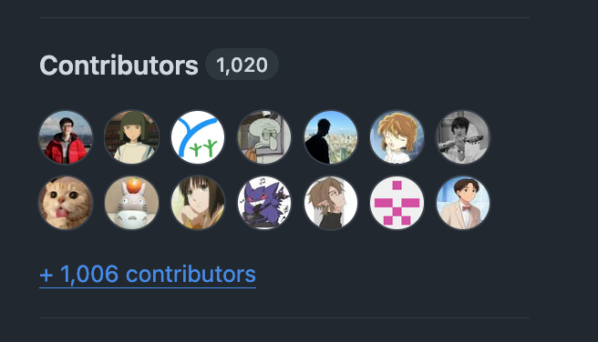
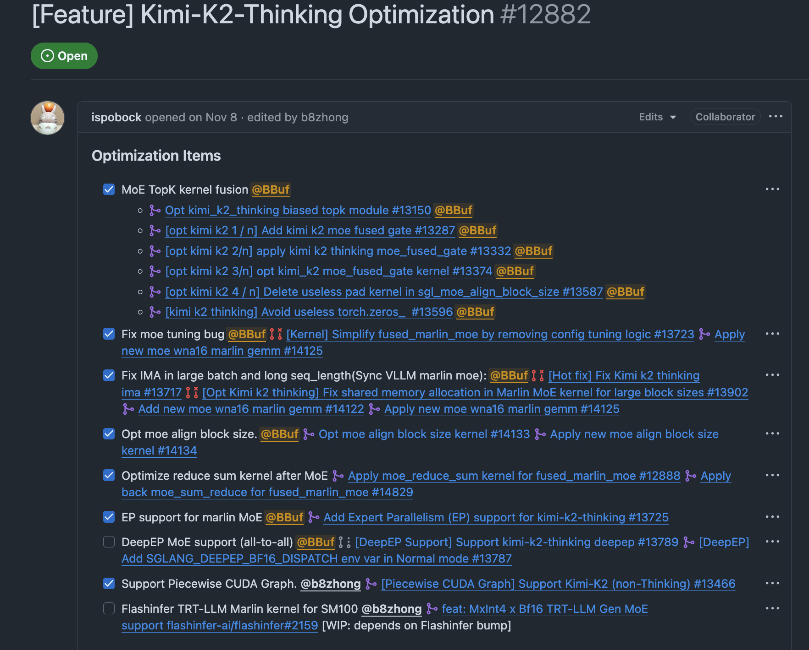

# 1인칭 시점으로 오픈소스 추론 프레임워크 개발에 참여한 1년

## 0x0. 서문

눈 깜짝할 사이에 2025년도 거의 끝나간다. 시간이 정말 너무 빠르다. 여기서 먼저 reader들에게 새해 복 많이 받으라고 전한다. 작년 연말 summary로 나는 MoE의 해에 대한 summary와 MoE inference optimization에 대한 몇 가지 인식(https://zhuanlan.zhihu.com/p/21251657579) blog를 썼다. 주로 당시 몇 가지 moe implementation의 차이를 비교한 것이었는데, 지금 보면 조금 outdated되었다. 오늘은 2025년에 open source community에서 했던 몇 가지 일을 정리한다. 올해 내가 open source community에서 주로 한 일은 조금 더 복잡한 bug들을 많이 해결하고, framework layer에서 몇 가지 feature를 시도했으며, MoE model과 Diffusion model의 framework performance optimization을 한 것이다. 하지만 더 low-level kernel 기법 같은 것은 별로 늘지 않았다. 이건 내년에 다시 공부해보겠다. 올해는 거의 1년 내내 SGLang open source framework 개발에 참여했고, 4분기에는 Cache-DIT 개발에도 참여했다. 그리고 SGLang contributor에서 framework Core Dev가 되어 더 많은 review 기회와 community를 통한 교류 기회를 얻었다. 현재 집에서 remote work를 한 지 4년이 넘은 나에게 open source community의 가장 큰 역할은 아마 친구 사귀기와 socializing인 것 같다. 마지막으로 나는 이 summary의 제목을 "1인칭 시점으로 open source framework 개발에 참여한 1년"이라고 붙였다.

SGLang 단체 사진:

Cache-DIT 단체 사진:

## 인상 깊었던 일

### SGLang 개발

- 첫 번째는 sgl-kernel의 구축과 iteration에 참여한 것이다. sgl-kernel 안에서 moe_align_block_size, per_tensor quant, per_token/group quant 같은 kernel을 작성하고 계속 optimize했다. 또한 community의 kernel PR도 많이 review했고, sgl-kernel을 통해 https://www.zhihu.com/people/anonymous-76-65-9 같은 매우 뛰어난 CUDA engineer들을 알게 되었다. 그리고 연말에는 sgl-kernel의 jit interface 추진에 참여하고 있는데, 이는 나중에 기회가 있으면 따로 소개하겠다.
- 두 번째는 DeepSeek V3/R1의 single-machine 및 two-machine small scale performance optimization에 참여한 것이다. 그 전에는 torch profiler를 별로 써본 적이 없었는데, 이후 torch profiler는 내가 문제를 분석할 때 가장 먼저 선택하는 도구가 되었다. 그리고 DeepSeek V3/R1 shared experts fusion(https://github.com/sgl-project/sglang/pull/4918), fused_moe_gate kernel을 적용해 grouped_topk module 전체를 fuse하기, routed scaling factor를 moe sum reduce kernel에 fuse하기, moe_align_block_size kernel 전의 zeros처럼 불필요한 작은 kernel 일부를 제거하거나 fuse하는 등의 optimization work에 참여했다. 당시에는 community 모두의 노력 결과를 보여주는 "single-machine H200에서 가장 빠른 DeepSeek V3와 R1 inference system optimization 비법"(https://zhuanlan.zhihu.com/p/1906411749634188889) 글도 정리했다.
- 세 번째는 flashinfer의 trt-llm allreduce fuse rms_norm_add kernel을 SGLang에 도입하고 token 수 tuning 같은 performance experiment를 수행한 것이다. 최종적으로 DeepSeek V3/R1, GPT-OSS, Qwen-MoE 같은 model에서 token<=어떤 값, 예를 들어 4096일 때 이 optimization을 사용할 수 있게 되었다. 이것이 인상 깊었던 이유는 IMA, performance regression 같은 문제를 많이 만났고, 이 부분 code를 더 generic하게 만들기 위해 여러 번 refactor했기 때문이다.
- 네 번째는 PieceWise CUDA Graph support에 조금 참여한 것이다. torch compile의 지저분한 부분을 몇 가지 만나면서 torch compile에 대한 적대감이 조금 늘었다.
- 다섯 번째는 4분기에 Kimi K2 Thinking model tuning에 참여해 performance를 많이 끌어올린 것이다. Torch profiler TimeLime도 아주 깔끔하게 만들었다. 인상 깊었던 이유는 IMA가 있었고, 뒤돌아보니 자신도 모르게 이미 많은 변경을 해왔다는 점을 깨달았기 때문이다.

- 마지막은 최근 참여한 SGLang Diffusion optimization일 것이다. Diffusion performance에는 아직 개선하고 최적화해야 할 부분이 많다. 그래서 Diffusion에서 FLUX, Qwen-Image, Wan2.2 같은 popular model을 optimize하는 performance PR을 꽤 자주 제출했다. 그리고 SGLang Diffsuion team의 전문성과 노력을 보았다. 개인적으로는 아직 매우 만족스러운 Diffusion inference framework가 나타났다고 생각하지는 않지만, 계속 노력한다면 SGLang Diffusion은 꽤 가까워질 수 있다고 본다. 나는 몇 편의 글도 썼다. "PyTorch model inference의 performance bottleneck을 체계적으로 찾아내고 분석하는 방법"(https://zhuanlan.zhihu.com/p/1987623785982076436), "zero-overhead layer-wise weight offload technique으로 SGLang Diffusion wan2.2의 inference speed를 60% 가속하기"(https://zhuanlan.zhihu.com/p/1986157623695922659)

### Cache-DIT

@DefTruth와 아주 많은 교류를 했고, 이 framework에서 serving 기능도 개발했다. 또한 Cache-DIT examples 측면의 usability 향상, Ulysses Anything Attention, Async Ulysses QKV Projection, FP8 Ulysses 같은 feature 개발을 지켜보았다. 이 모두가 인상 깊었다. Cache-DIT는 복잡한 wheel을 새로 만들지 않았고, diffuser model code를 과도하게 invasive하게 수정하지도 않았다. 하지만 Cache와 Diffusers system의 몇 가지 optimization, 그리고 DTensor 기반 parallel optimization인 TP/Ulysses를 통해 high-performance이면서 easy-to-use한 Diffusion inference framework를 만들 수 있다. 핵심 Cache 기능은 현재 VLLM과 SGLang에도 채택되었고 Diffusers도 추천하고 있으므로, 그 가치를 충분히 증명한다.

## 글

framework 개발 외에도 blog를 몇 편 썼다. 내 Zhihu homepage(https://www.zhihu.com/people/zhang-xiao-yu-45-67-74/posts) 또는 GiantPandaLLM public account에서 볼 수 있다. 필요한 developer에게 비교적 추천하는 글은 다음과 같다.

- "PyTorch model inference의 performance bottleneck을 체계적으로 찾아내고 분석하는 방법"(https://zhuanlan.zhihu.com/p/1987623785982076436)
- "SGLang 개발, debug의 몇 가지 tip 2탄 기록"(https://zhuanlan.zhihu.com/p/1984750078074839122)
- "Cache-DiT framework 아래에서 native Serving 기능 구현하기"(https://zhuanlan.zhihu.com/p/1979699155266995922)
- "SGLang 개발, compile, Profile의 몇 가지 작은 tip 기록"(https://zhuanlan.zhihu.com/p/1939041055208112436)
- "Dispatch Dtype이 일으킨 fp8 quant kernel performance 문제 하나"(https://zhuanlan.zhihu.com/p/1933901514658808801)
- "single-machine H200에서 가장 빠른 DeepSeek V3와 R1 inference system optimization 비법"(https://zhuanlan.zhihu.com/p/1906411749634188889）

## 요약

회고는 여기까지다. 이제 2026을 가져오자. 모두 새해 복 많이 받으시길.

