# GOSIM Hangzhou 기술 회고 해설 - Ant AI Gateway 대규모 온라인 추론 서비스 클러스터 최적화

> Inference gateway는 단순 forwarding layer가 아니다. LLM request의 길이, cache hit, backend batch state가 모두 cost를 바꾼다. 이 글은 이러한 정보가 routing decision에 어떻게 들어가는지 주로 살펴본다.

## 0x0. 서문

이 발표는 infra directory에 넣기에 매우 적합하다. Inference cluster의 가장 바깥쪽 scheduling 문제를 다루기 때문이다. Model serving이 아무리 빨라도 gateway가 긴 prompt를 cold node로 보내고 decode를 일부 instance에 몰아넣으면 TTFT와 throughput이 모두 낭비된다.

## 0x1. 자료와 코드 위치

Code mapping을 명확히 해야 한다. Ant 내부 AI Gateway의 complete implementation은 공개 repository에서 찾지 못했으므로, 본문에서는 동일한 PR이 있는 척하지 않는다. 공개 code와 대응할 수 있는 것은 두 종류다.

- Mooncake: `mooncake_connector_v1.py`의 `MooncakeConnectorScheduler` / `MooncakeConnectorWorker`, 그리고 `mooncake_store_service.py`의 `MooncakeStoreService`는 slides의 KVCache Store, PD remote prefill/decode, KV transfer에 대응한다.
- Envoy AI Gateway: `api/v1alpha1/ai_gateway_route.go`는 cloud-native AI Gateway의 routing CRD, model header, token cost metadata에 대응한다.
- Mooncake README에 언급된 SGLang HiCache와 PD scenario에서의 TTFT 감소 practice data는 KVCache sharing 방향의 공개 reference로 사용할 수 있다.

## 0x2. Slides 페이지별 해설

#### Slide 1: Ant AI Gateway: 대규모 온라인 추론 서비스 클러스터 최적화

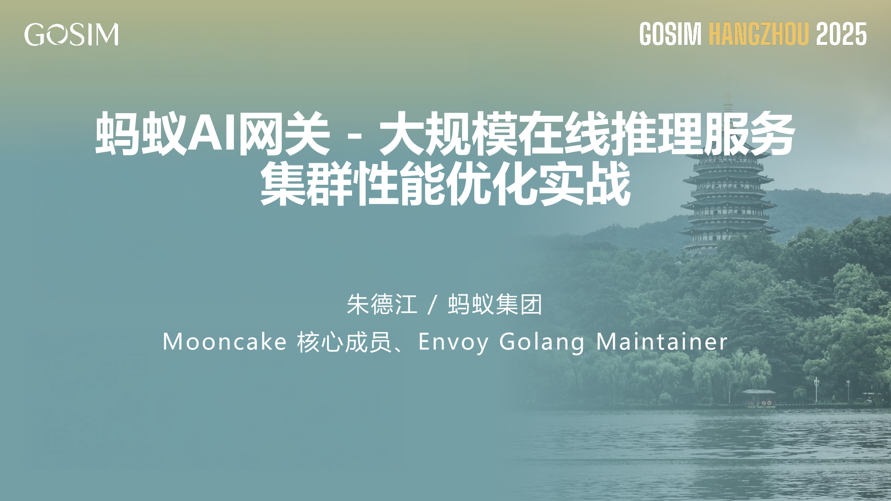

Title page는 발표 범위를 제시한다. Ant AI Gateway가 large-scale online inference service cluster에서 performance를 optimize하는 방법이다. Speaker는 Mooncake core member이자 Envoy Golang Maintainer이기도 하다. 그래서 뒤에서 KVCache Store, PD routing, cloud-native gateway가 함께 등장하는 이유가 설명된다.

이 글은 inference gateway를 다루며, 일반 HTTP gateway가 아니다. LLM request의 cost는 prompt length, decode length, cache hit, PD separation state, backend batch에 따라 달라진다. 따라서 routing layer는 model inference semantics를 어느 정도 이해해야 한다.

#### Slide 2: 목차: Load Feature에서 Gateway Scheduling까지

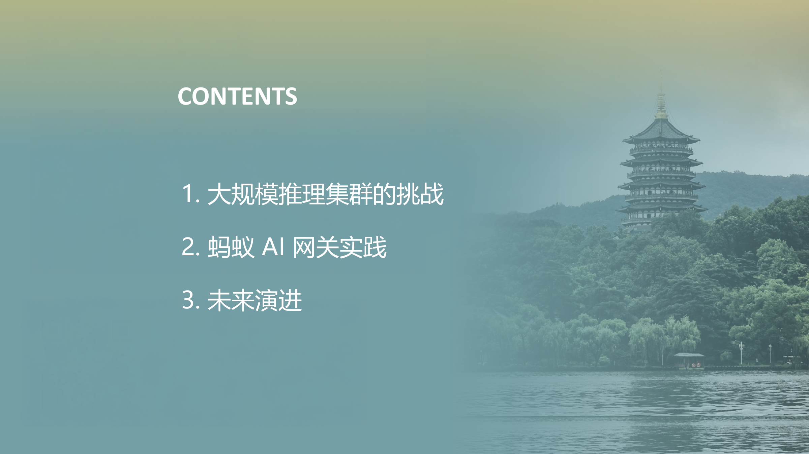

목차는 세 부분으로 나뉜다. Large-scale inference cluster의 challenge, Ant AI Gateway practice, future evolution이다. 이 순서가 중요하다. 먼저 왜 round-robin/least-connection이 충분하지 않은지 설명하고, 그 다음 v1/v2가 load와 cache signal을 어떻게 보완했는지 이야기하며, 마지막에 predicted latency, Mooncake Store, PD Router, cloud-native architecture로 들어간다.

주된 흐름은 gateway를 "request forwarder"에서 "inference cluster scheduler"로 upgrade하는 것이다. Gateway는 더 이상 HTTP connection만 보지 않고, input tokens, output tokens, prefix cache, prefill/decode state, multi-tenant SLO를 함께 decision에 넣어야 한다.

#### Slide 3: Inference Cluster에서 AI Gateway의 위치

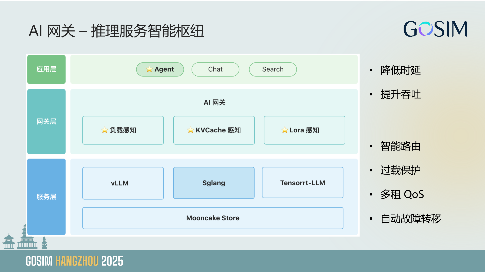

이 페이지는 AI Gateway를 inference service intelligent hub로 정의한다. 오른쪽에는 네 가지 target이 있다. intelligent routing, overload protection, multi-tenant QoS, automatic failover다. 위쪽의 두 benefit은 latency 감소와 throughput 향상이다. 즉 gateway는 entry governance를 수행하는 동시에 backend execution state도 이해해야 한다.

AI Gateway는 user/API와 inference backend 사이에 위치한다. Authentication, rate limiting, routing, circuit breaking을 수행해야 하며, backend SGLang/vLLM instance의 load state도 알아야 한다. Large model에서 routing miss 한 번은 수초의 TTFT 차이를 만들 수 있다. 특히 긴 prompt가 prefix cache가 없는 cold node로 전달될 때 그렇다.

#### Slide 4: LLM Request Load는 Nonlinear하다

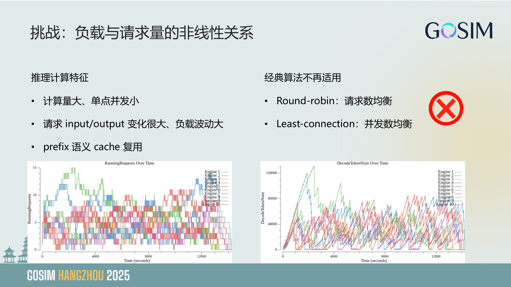

이 slide의 title은 "load와 request 수의 nonlinear relation"이다. 왼쪽은 inference computation feature를 나열한다. 계산량이 크고 single-node concurrency가 작으며, request input/output 변화가 크고 load fluctuation이 크며, prefix semantic cache를 재사용할 수 있다. 오른쪽은 classic algorithm이 더 이상 적용되지 않는 이유를 말한다. Round-robin은 request count만 balance하고, least-connection은 concurrency count만 balance한다.

LLM load는 request 수에 linear하게 더할 수 없다. 200-token prompt와 20k-token prompt는 prefill pressure가 완전히 다르다. Decode stage는 output token마다 계속 batch slot을 점유한다. 여기에 prefix cache까지 더하면, "비슷하게 idle해 보이는" 두 instance가 동일 request에 대해 완전히 다른 실제 cost를 가질 수 있다.

#### Slide 5: Prefill과 Decode 두 Stage

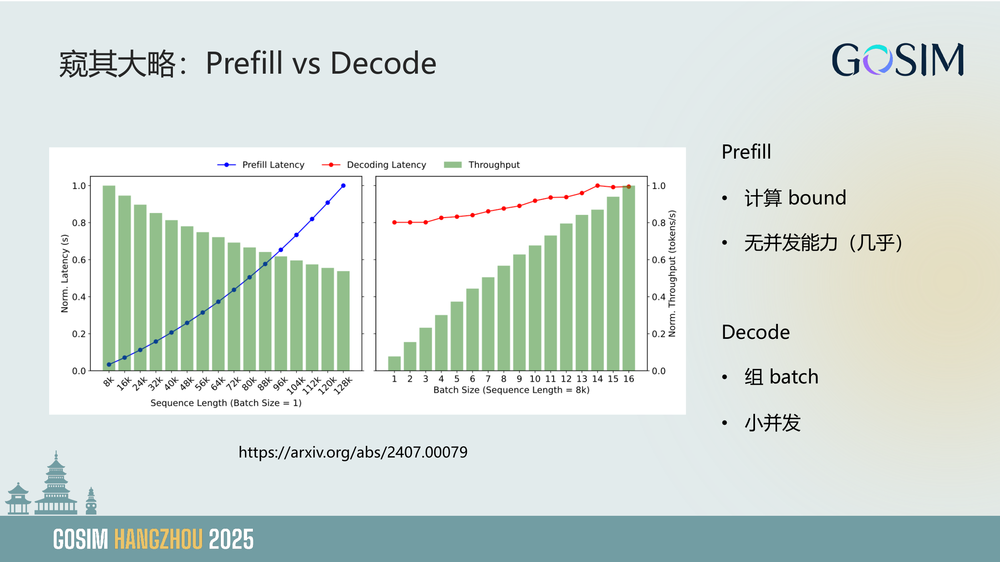

이 페이지는 inference process를 Prefill과 Decode로 나눈다. Prefill의 작은 글자는 compute bound이며 거의 concurrency capability가 없다고 설명한다. Decode는 grouped batch와 small concurrency를 강조한다. 그림의 역할은 routing layer에 같은 request라도 stage마다 resource profile이 완전히 다르다는 것을 상기시키는 것이다.

Prefill은 주로 long-sequence attention computation과 KV write를 소비한다. Prompt가 길수록 TTFT가 뚜렷해진다. Decode는 step마다 소량의 token만 생성하지만 batch slot에 많은 round 동안 머문다. PD separation은 이 두 load를 분리해 다른 node가 다른 stage를 맡게 하고, KV transfer를 통해 prefill result를 decode에 전달한다.

#### Slide 6: Attention과 FFN의 Resource 차이

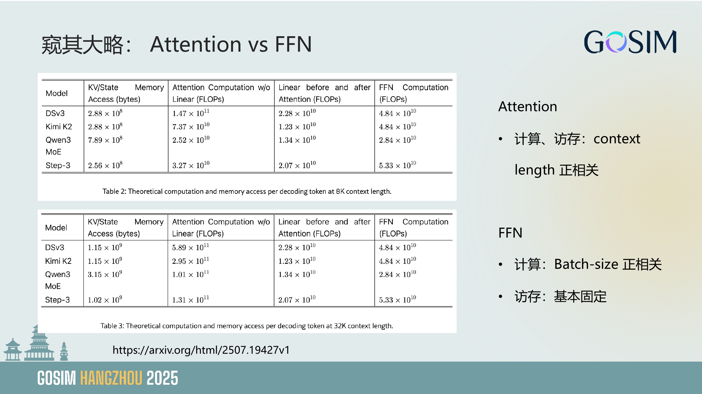

이 slide는 model 내부 resource를 계속 분해한다. Attention의 computation과 memory access는 context length와 양의 상관관계가 있고, FFN computation은 주로 batch size와 관련되며 memory access는 상대적으로 fixed하다. 즉 같은 batch size에서도 long context는 attention 쪽을 더 무겁게 만들고, 같은 context length에서는 large batch가 FFN 쪽을 더 무겁게 만든다.

이것이 gateway가 QPS만 보기 어려운 이유다. Backend instance는 request 수는 많지 않지만 ultra-long context prefill을 처리 중일 수 있다. 또는 connection 수는 많지만 대부분 short decode일 수도 있다. Load metric이 context length, batch size, stage를 구분하지 않으면 서로 다른 bottleneck을 섞어 버린다.

#### Slide 7: Request Scheduling에서 Token Scheduling까지

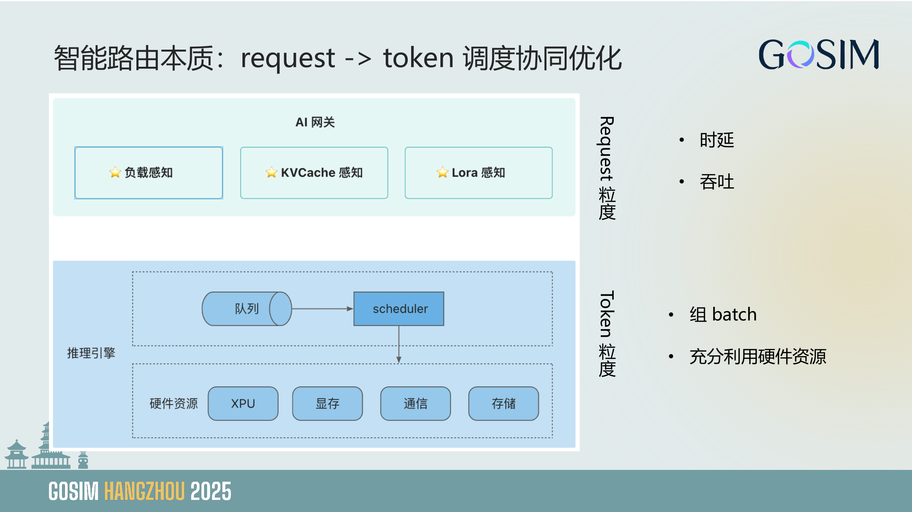

이 slide는 intelligent routing의 본질을 request granularity와 token granularity의 co-optimization으로 쓴다. Request granularity는 주로 latency와 throughput에 영향을 준다. Request가 어느 instance를 선택하는지, queue에서 얼마나 기다리는지, prefill이 cache hit하는지가 포함된다. Token granularity는 batch organization과 hardware utilization에 주로 영향을 준다. Decode stage의 각 step에서 어떤 token을 batch에 넣을지 결정한다.

Request-level scheduling은 "이 prompt를 어떤 machine으로 보낼지"만 결정한다. Token-level scheduling은 decode stage에서 지속적으로 얼마나 많은 resource를 점유하는지를 결정한다. Server-side batch scheduler와 gateway routing은 같은 문제의 두 면이다. Gateway가 request를 적절한 instance로 보내고, instance 내부 scheduler가 token을 batch에 어떻게 넣을지 결정한다.

#### Slide 8: Traditional Load Balancing이 충분하지 않은 이유

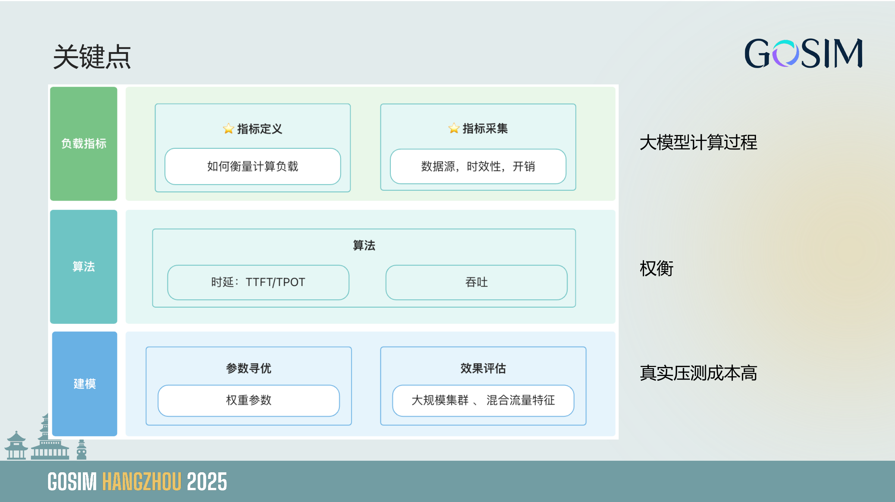

이 slide는 세 가지 key point를 나열한다. Large model computation process, tradeoff, real pressure test cost가 높다는 점이다. Gateway optimization에 classic load balancing experience를 그대로 적용할 수 없는 이유를 설명한다. LLM의 computation process에는 stage difference가 있고, routing 시 cache hit, current load, expected decode length 사이에서 tradeoff해야 한다. Real online pressure test는 cost가 높기 때문에 많은 strategy를 반복 trial-and-error로 조정하기 어렵다.

Traditional LB의 round-robin 또는 least-connection은 LLM에 충분하지 않다. 두 instance의 connection 수가 같아도 한쪽은 long prompt prefill을 처리 중이고 다른 쪽은 short decode만 처리 중일 수 있다. Queue 수가 같아도 한쪽에는 large prefix cache가 있어 재사용할 수 있을 수 있다.

#### Slide 9: Ant AI Gateway Practice Chapter Transition

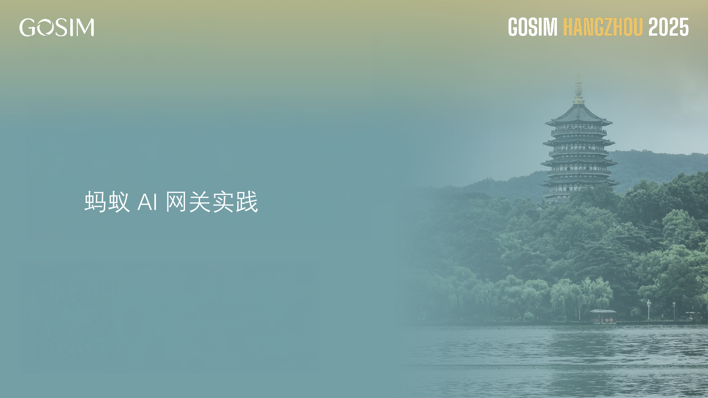

이 페이지는 practice section transition이다. 앞에서는 LLM request cost가 linear하지 않음을 설명했다. 뒤에서는 Ant AI Gateway가 v1의 simple queue-num에서 v2의 self-loop metrics와 cache-aware, 그리고 v3의 latency prediction으로 어떻게 iterate했는지 이야기한다.

여기서 optimization path도 볼 수 있다. 먼저 "load가 busy한지"를 명확히 보고, 그 다음 "이 request가 어느 node에서 덜 계산할 수 있는지"를 명확히 보며, 마지막으로 여러 signal을 predicted latency로 통합한다.

#### Slide 10: Ant AI Gateway Architecture

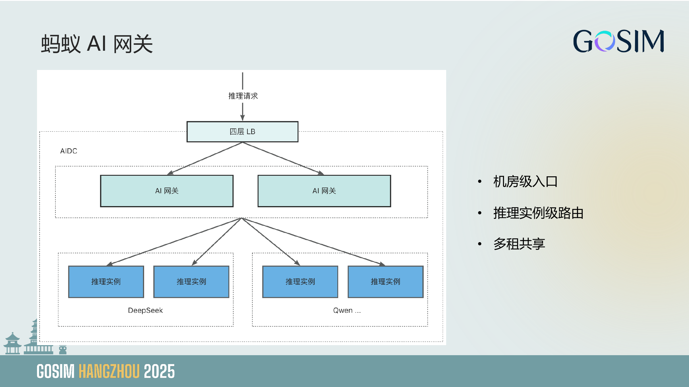

이 페이지는 Ant AI Gateway의 기본 위치를 그린다. Data-center-level entry, inference-instance-level routing, multi-tenant sharing이다. Data-center-level entry는 어떤 model instance 앞의 작은 proxy가 아니라 cluster entry라는 뜻이다. Inference-instance-level routing은 구체적인 backend instance state를 알아야 한다는 뜻이다. Multi-tenant sharing은 서로 다른 tenant의 SLO와 isolation을 처리해야 함을 의미한다.

Ant AI Gateway architecture는 control plane과 data plane을 나눈다. Data plane은 request를 받고 route하며, control plane은 backend metrics를 수집하고 instance state와 routing strategy를 유지한다. 뒤의 v1/v2/v3는 본질적으로 이 state와 strategy를 풍부하게 만드는 과정이다.

#### Slide 11: v1: Polling Metrics와 queue-num score

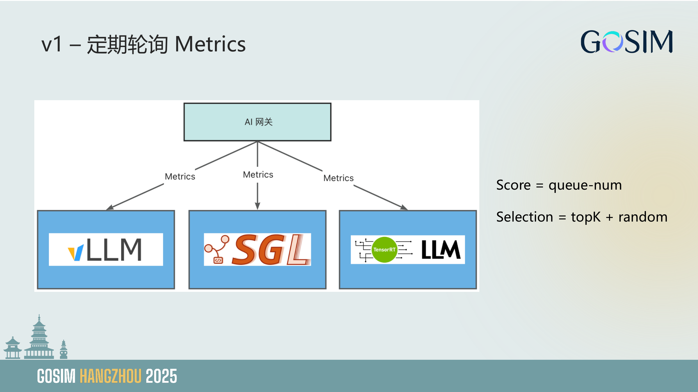

v1은 periodic metrics polling을 사용하고, score는 직접 `queue-num`을 사용한다. Selection은 `topK + random`이다. 즉 queue가 짧은 instance group을 먼저 고른 뒤, 그중 하나를 random하게 선택해 모든 request가 동일한 best instance로 몰리는 것을 피한다.

이 version은 단순하고 system을 먼저 실행하기에 적합하다. 하지만 두 가지 assumption이 숨어 있다. Queue length가 future latency를 대표하고, cache hit가 routing에 영향을 주지 않는다는 것이다. 이 두 assumption은 LLM scenario에서 모두 불안정하다. 긴 request와 짧은 request가 섞이면 queue count가 같다고 load가 같다는 뜻은 아니다. Prefix cache가 있으면 cold node가 반드시 hot node보다 빠른 것도 아니다.

#### Slide 12: v1의 문제: Metric Lag와 Cache-unaware

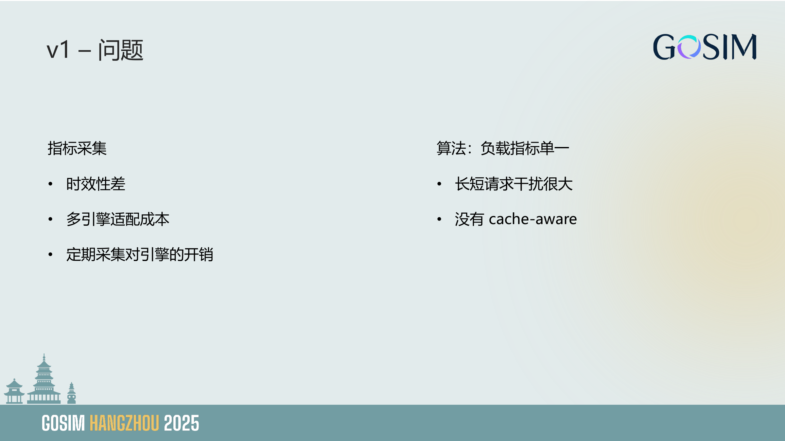

v1 problem page는 metric collection과 algorithm 양쪽으로 나뉜다. Metric collection 쪽에는 세 가지가 있다. Timeliness가 낮고, multi-engine adaptation cost가 높으며, periodic collection이 engine에 overhead를 준다. Algorithm 쪽도 세 가지다. Load metric이 단일하고, long/short request interference가 크며, cache-aware가 없다.

이 문제들은 서로 연결되어 있다. Metrics sampling interval 안에서 load는 이미 변했을 수 있고, queue-num은 어떤 request가 100 token인지 100k token인지 알지 못한다. Multi-engine scenario에서는 서로 다른 engine이 metrics를 expose하는 방식이 다르므로, gateway가 이를 통합 수집하는 것도 무거워진다.

#### Slide 13: v2: self-loop metrics

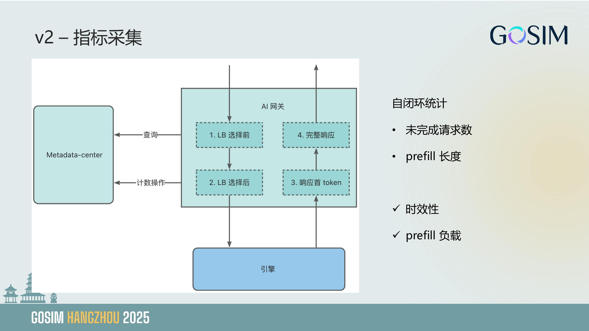

v2는 먼저 metric collection을 바꾸고 self-loop statistics를 도입한다. Slide에는 두 가지 core metric이 적혀 있다. unfinished request count와 prefill length다. Unfinished request count는 polling queue보다 data plane current state에 더 가깝다. Prefill length는 long prompt load를 routing에 explicit하게 포함한다.

Benefit도 slide에 적혀 있다. Timeliness와 prefill load다. Pure control-plane polling과 비교하면 self-loop statistics는 request path에 더 가깝고, short time window의 load estimation에 더 적합하다. 아직 complete prediction model은 아니지만, "queue는 짧지만 ultra-long prefill을 실행 중"인 많은 misjudgment를 피할 수 있다.

#### Slide 14: cache-aware prefix tree

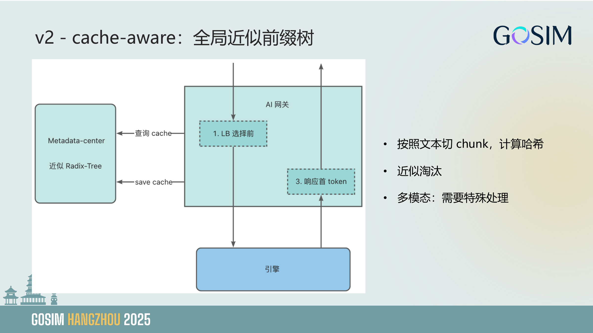

Cache-aware prefix tree는 이 발표에서 LLM inference semantics에 가장 가까운 slide다. 그림 왼쪽은 Metadata-center이며, 그 안에 approximate Radix-Tree를 유지한다. AI Gateway는 `1. LB 선택 전` Metadata-center에 `cache query`를 보내 후보 instance의 prefix hit 상태를 얻는다. Request가 engine에서 `3. first token response`까지 처리되면, gateway/engine은 새로 생성된 cache 정보를 Metadata-center에 `save cache`하여 다음 비슷한 prompt에 사용하게 한다.

오른쪽 세 가지 small text는 implementation detail을 설명한다. 먼저 text를 chunk로 나누고 chunk에 hash를 계산한다. Prefix tree는 무한히 증가할 수 없으므로 approximate eviction이 필요하다. Multi-modal input은 text hash logic을 그대로 적용할 수 없고, image/audio 같은 continuous feature 또는 special token에 추가 처리가 필요하다. 즉 gateway가 유지하는 것은 complete prompt raw text가 아니라 "이 request가 특정 instance에서 얼마나 많은 KV를 reuse할 수 있는지"를 estimate할 수 있는 metadata다.

#### Slide 15: score = cache_ratio - request_load - prefill_load

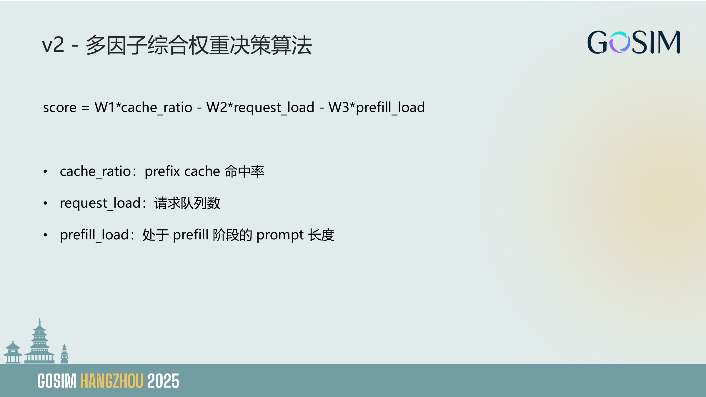

이 slide는 v2의 multi-factor scoring을 제시한다. `score = W1*cache_ratio - W2*request_load - W3*prefill_load`. `cache_ratio`는 prefix cache hit rate이며, 높을수록 선택해야 한다. `request_load`는 request queue count이며, 높을수록 queuing pressure가 크다는 뜻이다. `prefill_load`는 현재 prefill stage에 있는 prompt length이며, 높을수록 instance가 long-context prefill을 처리 중이라는 뜻이다.

이 formula는 engineering ranking item에 가깝다. Gateway side에서 세 signal을 하나의 score로 합친다. Cache만 보면 request가 hot node로 몰리고, queue만 보면 large KV reuse를 놓친다. `prefill_load`를 추가하면 long prompt가 실행 중인 instance는 downweight되어 앞선 prefill 때문에 TTFT가 끌리는 것을 피한다.

#### Slide 16: v2 Optimization Effect

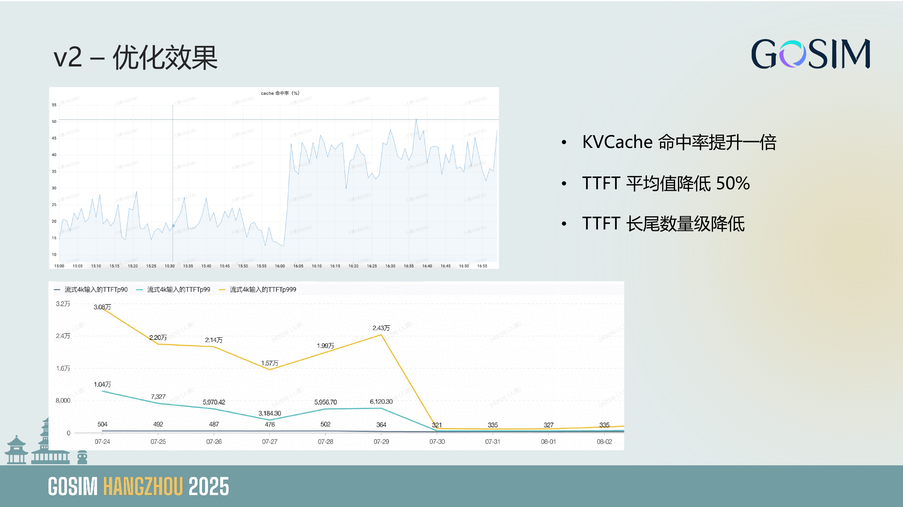

v2 result page는 세 가지 benefit을 제시한다. KVCache hit rate가 두 배 향상되었고, TTFT average가 50% 감소했으며, TTFT long-tail이 order-of-magnitude로 줄었다. 여기서 TTFT benefit은 두 방향에서 온다. Prefix cache hit 후 prefill을 덜 수행하고, long prompt가 cold node로 자주 route되지 않는다.

Long-tail order-of-magnitude reduction은 특히 중요하다. Average reduction은 전체적으로 빨라졌음을 뜻하지만, online user가 더 쉽게 체감하는 것은 P99/P999 waiting이다. Cache-aware routing은 reusable prefix를 가능한 한 기존 KV가 있는 instance로 보내므로 "일부 request가 갑자기 매우 느려지는" 상황을 크게 줄인다.

#### Slide 17: Online Scenario의 Stability Constraint


이 페이지는 future evolution transition이다. 앞서 v2가 self-loop metrics와 approximate prefix tree를 활용했지만, 여전히 heuristic scoring이다. Future evolution은 더 정확한 latency prediction, 더 정확한 cache-aware, 더 복잡한 PD/EP/DP hierarchical routing을 해결해야 한다.

Online system은 average latency만 볼 수 없고 jitter, failure recovery, multi-tenant priority도 봐야 한다. Gateway strategy가 cache만 과도하게 쫓으면 소수 hot node를 압도할 수 있다. Load만 과도하게 쫓으면 cache reuse를 희생해 long prompt를 반복 prefill하게 된다.

#### Slide 18: v2가 아직 해결하지 못한 부분

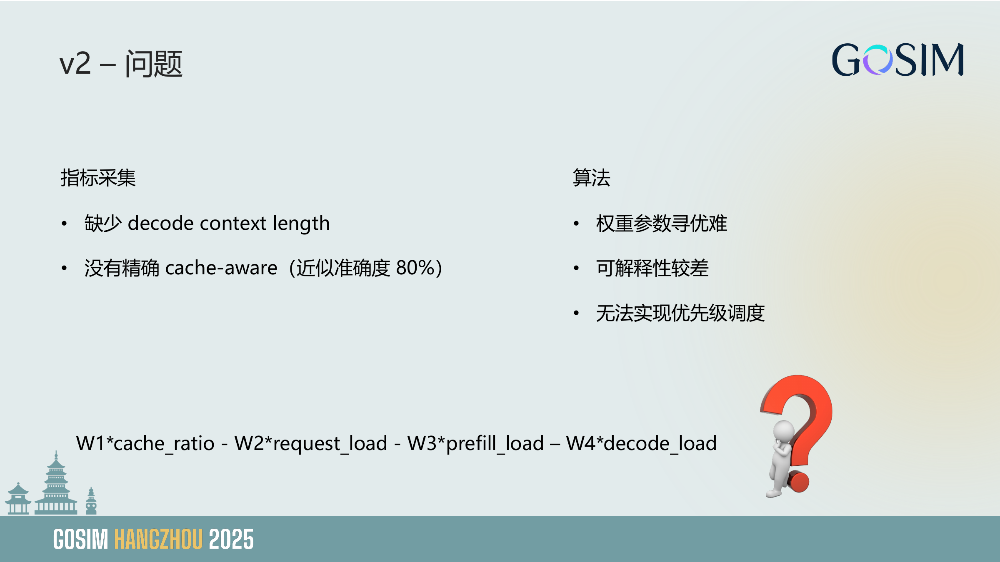

v2 problem page도 metric과 algorithm 양쪽으로 나뉜다. Metric 쪽은 decode context length가 부족하고, cache-aware도 아직 approximate라 accuracy가 약 80%다. Algorithm 쪽의 문제는 weight parameter tuning이 어렵고, explainability가 낮으며, priority scheduling을 구현할 수 없다는 점이다. 아래 formula는 decode_load도 추가한다. `W1*cache_ratio - W2*request_load - W3*prefill_load - W4*decode_load`.

이는 v2의 remaining issue가 score가 여전히 heuristic이라는 데 있음을 보여준다. Real latency는 model, batch, KV, decode length, PD path의 영향을 받는다. W1/W2/W3/W4를 수동 tuning하는 것은 모든 scenario를 cover하기 어렵다. Multi-tenant SLO에서는 "가장 빠른 node"가 아니라 "SLO를 만족하면서 더 적절한 resource를 쓰는 node"를 선택해야 할 때도 있다.

#### Slide 19: Latency prediction

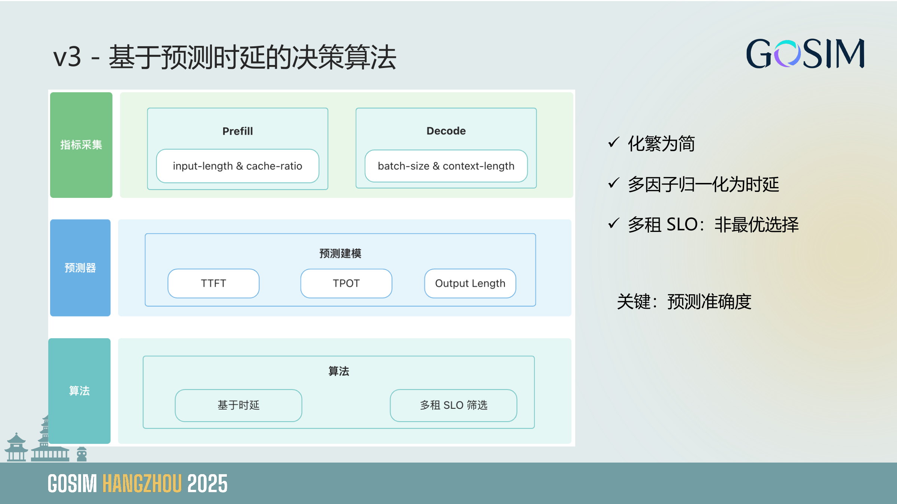

v3 slide는 heuristic scoring을 prediction modeling으로 바꾼다. 위쪽은 먼저 metric collection을 수행한다. Prefill stage에서는 `input-length & cache-ratio`를 수집하고, decode stage에서는 `batch-size & context-length`를 수집한다. 중간 predictor는 세 가지를 modeling한다. TTFT, TPOT, Output Length다. 아래 algorithm은 predicted latency 기반으로 선택하며, multi-tenant SLO filtering도 지원한다.

오른쪽의 몇 줄은 v2와의 차이를 설명한다. Multi-factor가 마지막에는 latency로 normalize되고, routing target은 "highest score"에서 "가장 적합한 predicted latency"로 바뀐다. Multi-tenant SLO scenario에서는 global fastest node를 항상 선택하는 것이 아니라, 먼저 SLO를 만족하는 후보를 filter하고 그 안에서 load와 cache를 trade off한다. 핵심은 prediction accuracy다. Predictor bias가 크면 routing이 error를 cluster 전체로 증폭한다.

#### Slide 20: Mooncake Store와 KVCache Sharing

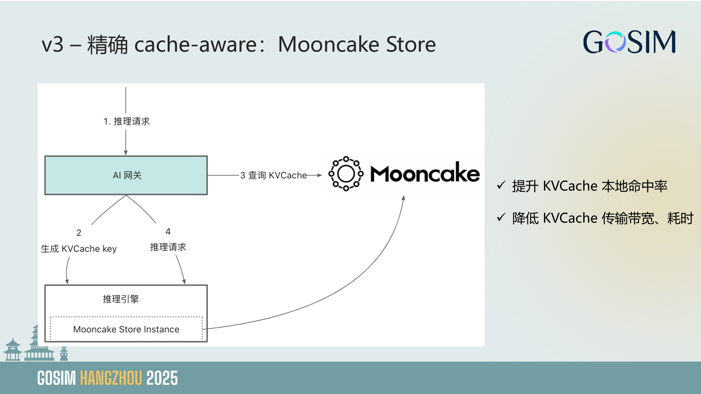

Mooncake Store slide는 더 정확한 cache-aware를 다룬다. Flow는 `1. inference request`가 AI Gateway에 들어오는 것으로 시작한다. Gateway는 request content에 따라 `2. KVCache key 생성`을 하고, Mooncake에 `3. KVCache query`를 보낸다. Store에서 해당 KV를 찾을 수 있으면 engine은 `4. inference request` 시 KV를 가져와 reuse할 수 있다. 오른쪽 두 benefit은 각각 KVCache local hit rate 향상과 KVCache transfer bandwidth/time 감소다.

공개 Mooncake code에는 KV transfer connector와 store service가 있어 remote prefill이 생성한 KV를 decode node로 가져와 repeated prefill을 피할 수 있다. v2의 prefix tree와 비교하면 Mooncake Store는 cache metadata와 cache data를 모두 system에 포함시키는 방식에 가깝다. Gateway는 어떤 node가 hit할지 추측하는 데 그치지 않고, store를 통해 KV가 node 사이를 이동하게 할 수 있다.

#### Slide 21: TTFT와 TPOT Modeling

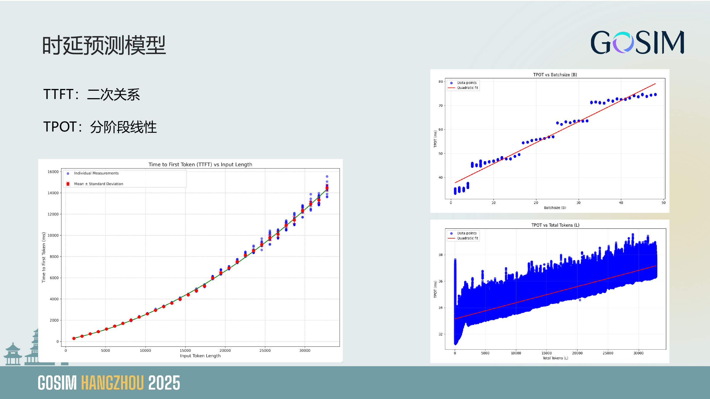

이 slide의 title은 "latency prediction model"이다. 왼쪽은 두 modeling assumption을 직접 제시한다. TTFT는 quadratic relation, TPOT는 stage-wise linear다. 왼쪽 아래 graph의 x-axis는 input token length, y-axis는 Time to First Token이다. Blue point는 single measurement, red point는 mean과 standard deviation, green fitted curve는 명확히 위로 휜다. Prompt가 길어지면 prefill cost가 linear하게 증가하지 않는다는 뜻이다. Attention computation, cache hit rate, batching, queuing이 함께 영향을 주므로 quadratic term approximation이 더 안정적이다.

오른쪽 위 graph는 TPOT vs Batchsize다. Blue point는 batch size가 커질수록 전체적으로 증가하고, red line은 fitted curve다. 오른쪽 아래 graph는 TPOT vs Total Tokens다. 점이 매우 dense하고 red line slope는 작다. 이는 decode per-token latency가 "batch size, context length, system load"가 더해진 stage-wise linear relation에 가깝다는 뜻이다. Routing side가 TTFT와 TPOT를 따로 predict하면 "prefill은 무겁지만 decode는 acceptable"과 "decode queue가 이미 꽉 찼다"는 두 상황을 구분할 수 있다.

#### Slide 22: PD Router와 DP imbalance

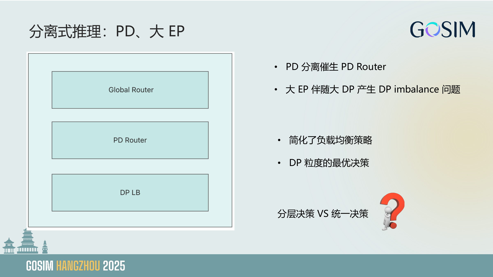

이 slide는 disaggregated inference 후 routing layer의 형태를 말한다. 왼쪽 그림은 세 layer 구조다. 맨 위 `Global Router`가 global entry decision을 먼저 하고, 중간 `PD Router`가 prefill/decode allocation을 결정하며, 아래 `DP LB`가 data parallel granularity에서 load balancing을 수행한다. 오른쪽 첫 문구는 "PD separation이 PD Router를 낳았다"는 뜻이다. Prefill과 decode를 분리하면 request는 더 이상 한 instance만 고르면 되는 것이 아니라, prefill을 어디에 둘지, decode를 어디에 둘지, KV를 어떻게 transfer할지 결정해야 한다.

두 번째 문구는 "large EP와 함께 large DP가 생기며 DP imbalance 문제가 발생한다"다. MoE에서 EP가 커지면 서로 다른 DP rank에서 expert hit와 request length가 불균형해질 수 있다. Instance-level queue length만으로 LB를 하면 rank 내부 imbalance가 숨겨진다. 아래의 "load balancing strategy 단순화"와 "DP granularity optimal decision"은 이 tension을 나타낸다. Hierarchical decision은 engineering 구현이 더 쉽지만, optimal scheduling은 PD, DP, KV transfer, cache state를 통합해서 봐야 할 수 있다.

#### Slide 23: Cloud-native Go Extension

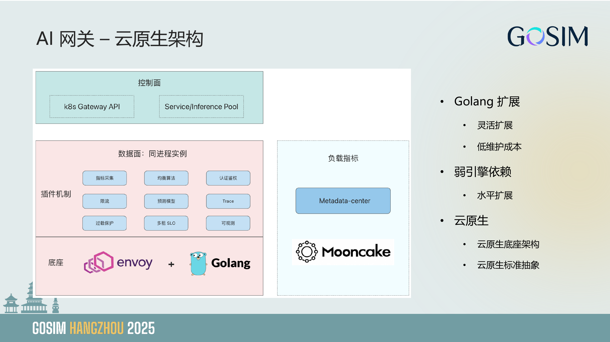

이 slide는 AI Gateway를 cloud-native architecture로 내린다. 왼쪽 위 control plane은 `k8s Gateway API`와 `Service/Inference Pool`을 받는다. Model entry, service pool, routing rule을 Kubernetes resource로 표현하려는 것이다. 왼쪽 아래 data plane은 same-process instance이고, base는 `envoy + Golang`이다. 중간 plugin mechanism은 metric collection, balancing algorithm, authentication/authorization, rate limiting, prediction model, Trace, overload protection, multi-tenant SLO, observability라는 9가지 capability를 나열한다.

오른쪽은 load metric path를 따로 그린다. `Metadata-center`와 Mooncake가 cache/load metadata를 제공하고, gateway plugin이 이 metric을 routing decision에 연결한다. 옆의 세 bullet group은 engineering tradeoff를 나타낸다. Golang extension의 장점은 flexibility와 낮은 maintenance cost다. Weak engine dependency는 gateway layer를 horizontal scale할 수 있게 하고, 모든 logic을 inference engine 안에 넣지 않겠다는 뜻이다. Cloud-native base는 model pool, routing, rate limiting을 standard abstraction으로 관리하게 한다.

#### Slide 24: Summary

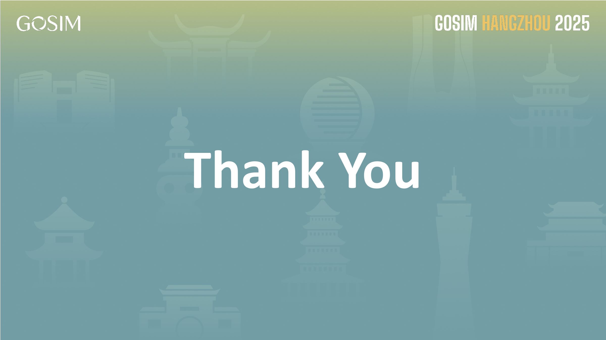

마지막 slide는 한 문장으로 요약할 수 있다. Large-model gateway는 request shape, cache location, backend execution state를 이해해야 한다. 그렇지 않으면 단지 HTTP forwarder일 뿐이고, inference cluster가 computation을 절약하도록 도울 수 없다.

## 0x3. 핵심 코드 해설

Mooncake의 vLLM connector는 slides의 PD/KVCache sharing을 설명하기에 매우 적합하다. `MooncakeConnectorScheduler` side는 먼저 이 request가 remote prefill KV를 load해야 하는지 판단한다.

```python
def get_num_new_matched_tokens(self, request, num_computed_tokens):
    params = request.kv_transfer_params
    if params is not None and params.get("do_remote_prefill"):
        count = len(request.prompt_token_ids) - num_computed_tokens
        if count > 0:
            return count, True
    return 0, False
```

KV blocks를 allocate한 뒤 connector는 request를 pending receive queue에 기록하고, worker side가 이후 asynchronous하게 pull한다.

```python
if params.get("do_remote_prefill"):
    local_block_ids = (blocks.get_unhashed_block_ids()
                       if num_external_tokens > 0 else [])
    self._reqs_need_recv[request.request_id] = (request, local_block_ids)
    params["do_remote_prefill"] = False
```

Request가 producer side에서 끝날 때 decode node에 넘겨 계속 실행해야 한다면, 새로운 transfer params를 반환한다.

```python
return delay_free_blocks, dict(
    do_remote_prefill=True,
    do_remote_decode=False,
    remote_host=self.side_channel_host,
    remote_port=self.side_channel_port,
)
```

Mooncake Store Service는 store operation을 REST API로 expose한다. `/api/reconfigure`는 prefill/decode mode 사이를 switch할 수 있고, decode mode에서는 shared memory segment를 mount한다.

```python
app.add_routes([
    web.post('/api/reconfigure', _timed_handler("RECONFIGURE", self.handle_reconfigure)),
    web.post('/api/mount_shm', _timed_handler("MOUNT_SHM", self.handle_mount_shm)),
    web.post('/api/unmount_shm', _timed_handler("UNMOUNT_SHM", self.handle_unmount_shm)),
    web.put('/api/put', _timed_handler("PUT", self.handle_put)),
    web.get('/api/get/{key}', _timed_handler("GET", self.handle_get)),
])
```

```python
if mode == "decode":
    result = self.store.mount_segment(path, size, offset, protocol, location)
    self.mounted_segment_ids = list(result["segment_ids"])
    self.current_mode = "decode"
elif mode == "prefill":
    if self.mounted_segment_ids:
        ret = self.store.unmount_segment(self.mounted_segment_ids)
    self.current_mode = "prefill"
```

Cloud-native 부분은 Envoy AI Gateway의 CRD를 보면 된다. Model routing과 token cost를 Kubernetes object에 쓴다.

```go
type AIGatewayRouteSpec struct {
    ParentRefs []gwapiv1.ParentReference `json:"parentRefs,omitempty"`
    Rules []AIGatewayRouteRule `json:"rules"`
    LLMRequestCosts []LLMRequestCost `json:"llmRequestCosts,omitempty"`
}
```

Comment는 `x-ai-eg-model` header가 request body에서 model name을 추출한 뒤 routing match에 사용된다고 언급한다. 이는 slides의 "AI gateway는 일반 layer-7 gateway가 아니다"와 같은 방향이다. Data plane은 URL만 보는 것이 아니라 OpenAI-compatible request를 이해해야 한다.

## 0x4. Summary

이 글의 핵심은 routing layer가 LLM inference를 이해하기 시작한다는 점이다. Cache-aware routing, latency prediction, PD/KV transfer는 모두 같은 질문에 답한다. 이 request를 어디로 보내야 덜 계산하고, 덜 기다리며, 덜 흔들릴까? Mooncake는 공개 KVCache sharing implementation을 제공하고, Envoy AI Gateway는 cloud-native routing CRD reference를 제공한다.
