# GOSIM Hangzhou 기술 회고 해설 - Ant 멀티모달 대모델 Ming-Omni 실전

> 멀티모달 글은 효과 전시로 흐르기 쉽다. 여기서는 최대한 구조와 코드로 좁혀서 본다. 시각, 오디오, 이미지 생성, LLM이 결국 어떻게 연결되는가.

## 0x0. 서문

멀티모달 모델 글은 효과 전시로 쓰이기 쉽다. 이 글은 가능한 한 구조와 코드에 착지한다. 입력 모달리티를 어떻게 LLM에 투영하는지, 이미지 생성이 condition을 어떻게 받는지, 오디오 token이 어떻게 연결되는지를 본다.

## 0x1. 자료와 코드 위치

코드 위치:

- Ming 저장소: `modeling_bailingmm2.py`, `BailingMM2NativeForConditionalGeneration`이 vision/audio/LLM/image generation 모듈을 한데 조직한다.
- Ming 저장소: `modeling_utils.py`, `patch_continuous_features`, `encode_audio_segments`가 연속 모달리티 특징을 텍스트 embedding에 접속한다.
- Ming 저장소: `s3bpe_tokenizer.py`, 오디오 이산 token에서 BPE token으로 이어지는 방식을 보여준다.
- Ming README: 공개 모델, HF/ModelScope, cookbook, Ming-flash-omni 2.0 정보를 제공한다.

## 0x2. Slides 페이지별 해설

#### Slide 1: Ant 멀티모달 대모델 실전

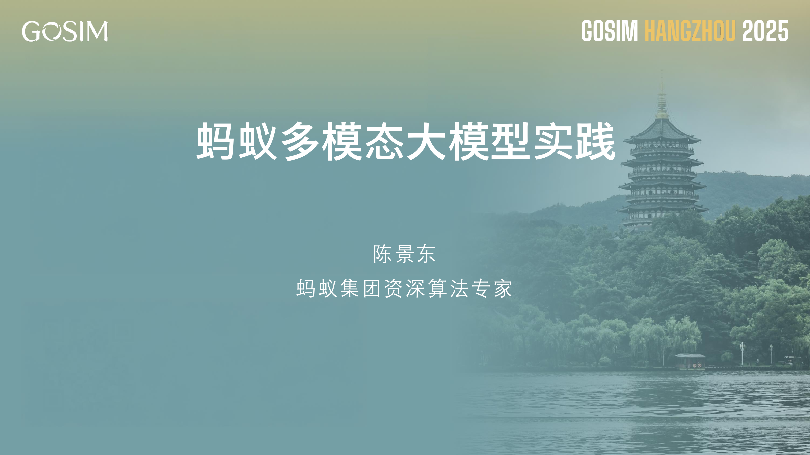

제목 페이지는 주제를 제시한다. Ant 멀티모달 대모델 실전이다. 본문의 주선은 Ming-Omni다. 이것은 단순한 VLM이 아니라 이미지, 비디오, 오디오, 텍스트 이해와 생성을 더 통합된 모델 체계 안에 넣는 시도다.

이런 모델의 어려움은 인터페이스 통합에 있다. 이미지/비디오는 연속 시각 특징이고, 오디오는 연속 특징일 수도 있고 이산 token일 수도 있다. 텍스트는 LLM을 지나며, 이미지 생성은 diffusion head에 연결되어야 한다. 뒤의 코드 해설도 이 인터페이스들을 중심으로 전개한다.

#### Slide 2: 목차: 모델 패밀리, Ming-Omni, 기술 세부

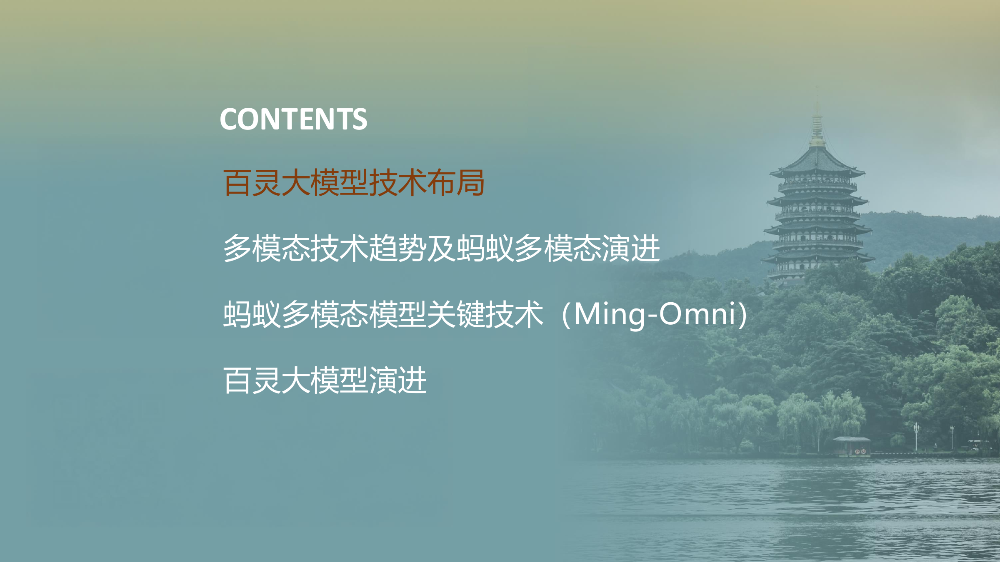

목차는 네 부분이다. Bailing 대모델 기술 배치, 멀티모달 기술 추세와 Ant 멀티모달의 진화, Ming-Omni 핵심 기술, Bailing 대모델의 진화다. 앞의 두 부분은 왜 통합 멀티모달을 해야 하는지 설명하고, 세 번째 부분에서야 모델 구조, 학습, 생성으로 들어간다.

코드 부분은 공개 Ming 저장소와 대조해서, 시각, 오디오, 이미지 생성을 어떻게 같은 모델 클래스와 `generate` 흐름에 접속하는지 본다. 이렇게 slides를 읽으면 효과 전시에 멈추지 않고, 입력 embedding, condition embeddings, diffusion 분기가 어떻게 연결되는지 볼 수 있다.

#### Slide 3: Ling/Ring/Ming 모델 배치

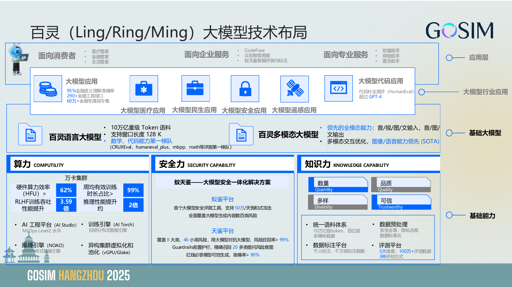

이 페이지는 Bailing 대모델 기술 배치이며 정보량이 많다. 상층은 의료 매니저, 금융 매니저, 생활 매니저, CodeFuse, 지능형 고객지원, 보험 도우미, 의사 도우미 같은 애플리케이션이다. 중간은 언어, 코드, 산업, 멀티모달 모델이고, 기반은 컴퓨팅, 안전, 지식 역량이다.

Ling/Ring/Ming은 모델 패밀리의 역할 분담이다. Ling은 언어 기반 모델에 더 가깝고, Ring은 추론과 효율을 강조하며, Ming은 멀티모달 방향을 맡는다. 이 배치를 이해하면 뒤에서 Ling-lite MoE를 언어 기반으로 쓰는 이유도 보인다. Ming-Omni는 처음부터 멀티모달 모델을 새로 만드는 것이 아니라, 이미 있는 언어 능력 위에 시각, 오디오, 생성 분기를 접속한다.

#### Slide 4: 모델 패밀리의 능력 경계

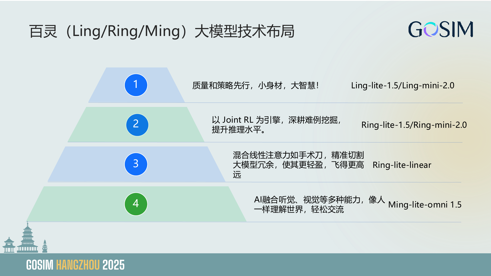

이 페이지는 네 가지 노선을 명확히 나열한다. Ling-lite/Ling-mini는 "작은 몸집, 큰 지능"의 고성비 언어 노선이고, Ring-lite/Ring-mini는 Joint RL로 어려운 사례를 깊게 파고 추론 수준을 높인다. Ring-lite-linear는 혼합 선형 어텐션으로 긴 텍스트의 중복을 낮춘다. Ming-lite-omni는 청각, 시각 등 여러 능력을 융합한다.

따라서 Ming-Omni의 목표는 각 모달리티마다 별도 서비스를 붙이는 것이 아니라, 하나의 모델 체계에서 이해와 생성을 통합하는 것이다. 이 목표는 학습 난제를 가져온다. 서로 다른 모달리티의 loss 수렴 속도가 같지 않고, 이해 작업과 생성 작업의 표현 공간도 쉽게 갈라진다.

#### Slide 5: 장 전환: Ming-Omni

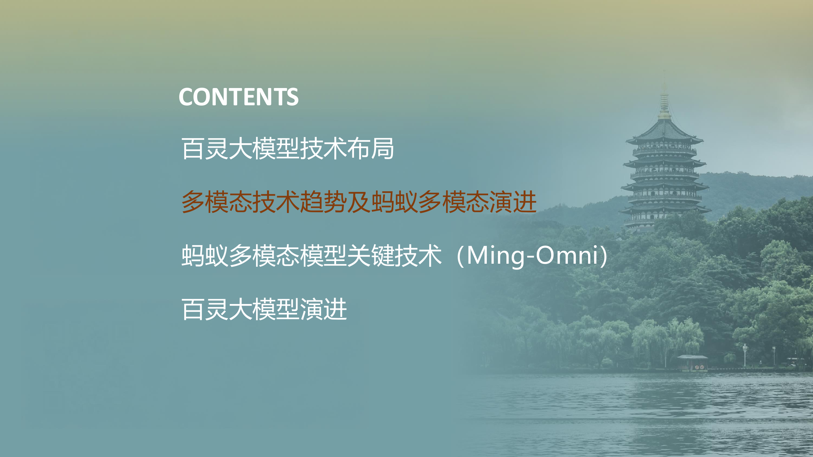

이 페이지는 목차 전환이며, 화제를 모델 패밀리 배치에서 멀티모달 기술 추세로 옮긴다. 뒤에서 답할 두 질문을 암시한다. 업계가 왜 "멀티모달 이해"에서 "이해와 생성의 통합"으로 가는가, 그리고 Ant는 왜 Ming-Omni 노선을 택했는가.

전체 모달리티 모델의 엔지니어링 난점은 학습 목표, token 표현, 생성 head가 동시에 어떻게 동작하느냐에 있다. 여러 encoder를 붙이는 것만으로는 입력 문제만 해결된다. 진짜 복잡한 부분은 이 모달리티들이 어떻게 컨텍스트를 공유하는지, 전문가로 어떻게 라우팅되는지, LLM hidden states를 이미지나 오디오 생성 조건으로 어떻게 바꾸는지다.

#### Slide 6: 멀티모달이 전체 모달리티 통합으로 향한다

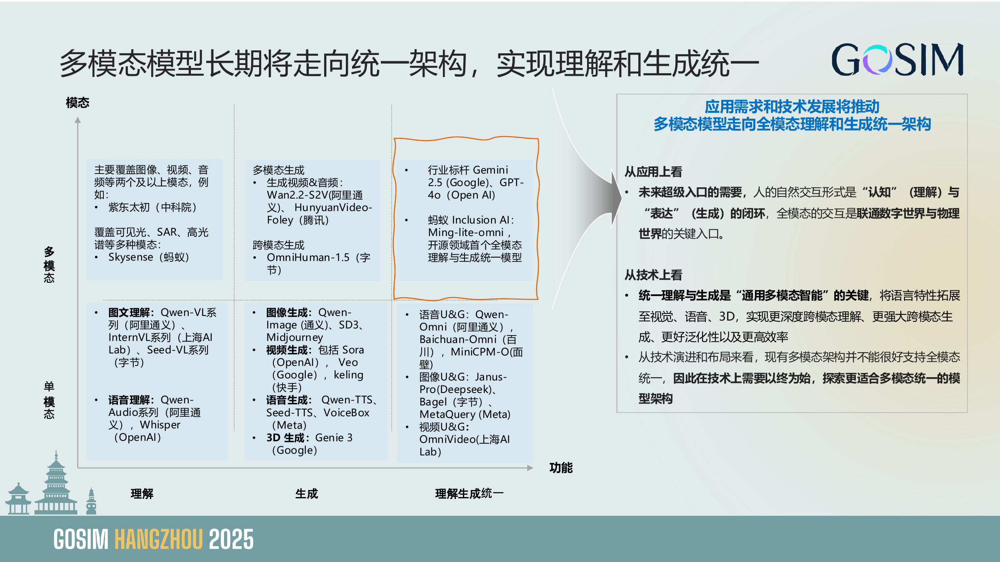

추세 페이지는 가로축을 "이해 -> 생성 -> 이해 생성 통합"으로, 세로축을 "단일 모달리티 -> 멀티모달"로 그린다. 왼쪽은 이미지-텍스트 이해, 음성 이해 같은 단방향 이해 모델이고, 가운데는 이미지/비디오/음성/3D 생성 모델이다. 오른쪽은 Gemini 2.5, GPT-4o, Qwen-Omni, Janus, Bagel, Ming-lite-omni 같은 이해와 생성 통합 방향이다.

오른쪽 두 단락의 작은 글자는 애플리케이션과 기술 양쪽에서 이유를 설명한다. 애플리케이션 측면에서 사람의 자연스러운 상호작용은 인지와 표현의 폐루프이며, 슈퍼 엔트리 포인트는 디지털 세계와 물리 세계를 연결해야 한다. 기술 측면에서 이해와 생성의 통합은 언어 특성을 시각, 음성, 3D로 확장해 더 깊은 크로스 모달 이해와 더 강한 생성 능력을 가져올 수 있다. Ming-Omni의 위치가 바로 이 오른쪽 위다.

#### Slide 7: Ming scaling 궤적

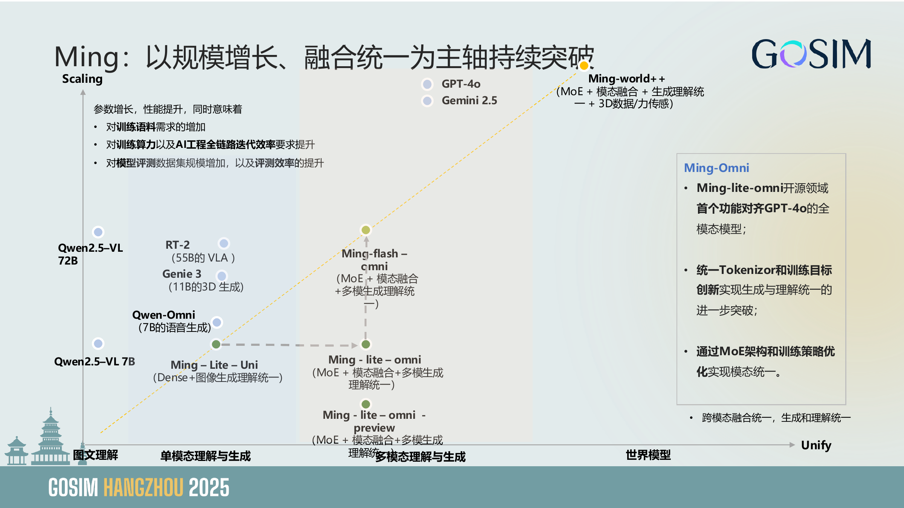

Ming scaling 궤적은 여러 모델을 하나의 좌표도에 놓는다. Qwen2.5-VL, Qwen-Omni, Ming-lite-uni, Ming-lite-omni-preview에서 Ming-flash-omni, Ming-Omni, Ming-world++로 이어진다. 오른쪽 Ming-Omni의 bullet에는 GPT-4o에 맞춘 전체 모달리티 모델, 통합 tokenizer와 학습 목표, MoE 구조와 학습 전략 최적화를 통한 모달리티 통합이 적혀 있다.

이 페이지는 scaling이 가져오는 엔지니어링 비용도 강조한다. 학습 말뭉치 수요가 늘고, 학습 컴퓨팅과 AI 엔지니어링 전체 체인의 반복 효율 요구도 높아지며, 평가 데이터셋 규모와 평가 효율도 올라가야 한다. MoE는 총 파라미터를 키우면서 active 파라미터를 제어할 수 있지만, 학습과 추론에서는 라우팅, 전문가 부하, 멀티모달 데이터 스케줄링을 처리해야 한다.

#### Slide 8: 장 전환: 기술 방안

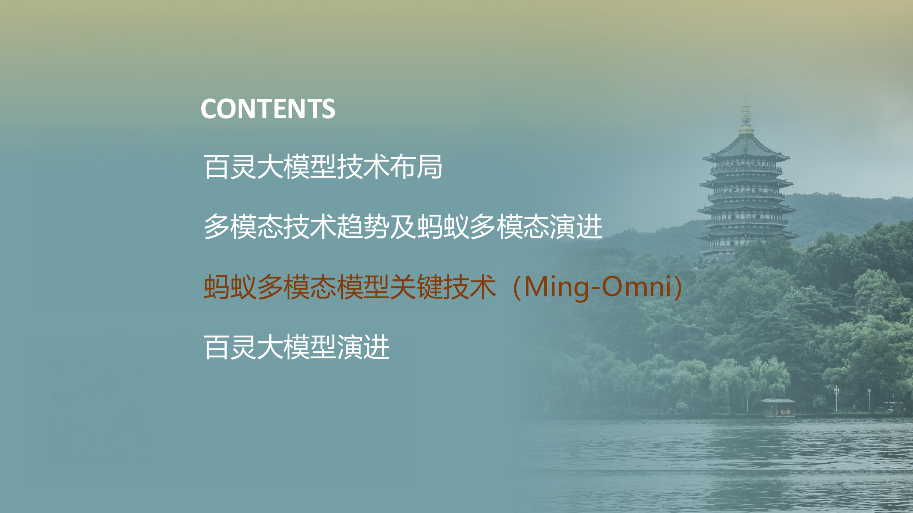

이 페이지는 Ming-Omni 핵심 기술로 들어가는 목차 전환이다. 뒤의 세 장 핵심 slide는 각각 모델 능력과 특성, 전체 모달리티 구조, 혼합 학습, 시각 이해와 생성 통합을 다룬다.

이 부분을 읽을 때는 세 가지 구현 문제를 붙잡으면 된다. 입력 embedding을 어떻게 붙이는가, 모달리티 라우팅을 어떻게 하는가, 생성 조건을 LLM hidden states에서 어떻게 가져오는가. 공개 Ming 코드의 `patch_continuous_features`, audio encoder, vision projector, diffusion sample이 모두 이 세 가지에 대응한다.

#### Slide 9: Ming-Omni: 보고, 듣고, 말하고, 그린다

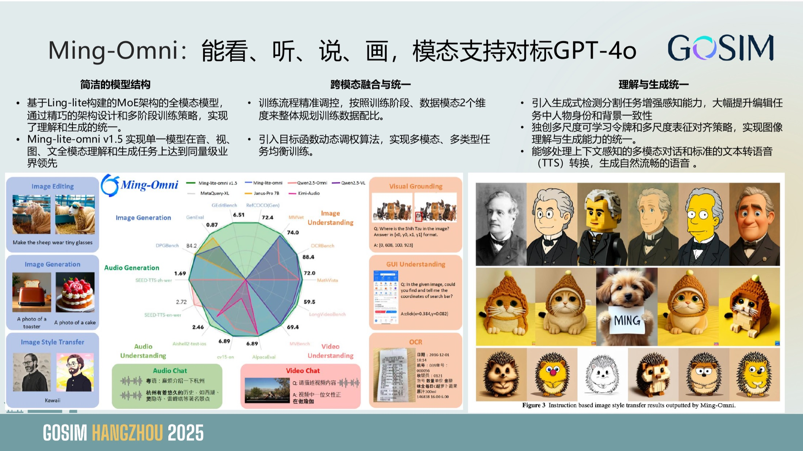

Ming-Omni의 능력 페이지는 세 그룹의 특성을 적는다. 첫 번째는 간결한 모델 구조다. Ling-lite 기반 MoE 구조 위에서 구조 설계와 다단계 학습을 통해 이해와 생성을 통합한다. Ming-lite-omni v1.5는 음성, 시각, 이미지, 텍스트 전체 모달리티 이해와 생성을 지원한다. 두 번째는 크로스 모달 융합과 통합이다. 학습 단계와 데이터 모달리티 두 축으로 학습 데이터 비율을 조절하고, 목표 함수 동적 가중 알고리즘을 도입한다. 세 번째는 이해와 생성의 통합이다. 생성식 검출/분할로 지각을 강화하고, 다중 스케일 학습 가능 token과 표현 정렬로 이미지 이해와 생성을 통합하며, 멀티모달 대화와 TTS도 지원한다.

코드에서는 vision transformer, Whisper audio encoder, MoE LLM, image generation diffusion head가 모두 같은 클래스 안에 있음을 볼 수 있다. slide에서 말하는 "통합"은 모든 모달리티가 하나의 head를 공유한다는 뜻이 아니라, LLM 컨텍스트로 통합 진입한 뒤 출력 모달리티에 따라 서로 다른 생성 분기에 연결된다는 뜻이다.

#### Slide 10: 능력 전시

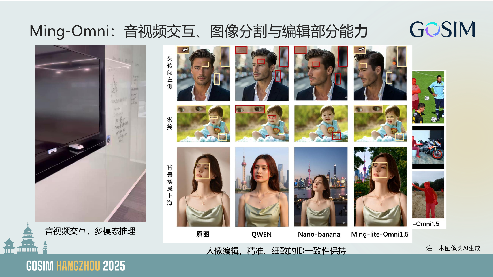

능력 전시 페이지에는 음성/비디오 상호작용, 멀티모달 추론, 이미지 분할, 생성식 편집, 인물 편집, ID 일관성 유지가 들어 있다. 이 페이지의 역할은 Ming-Omni가 단일 VQA가 아니라 지각, 추론, 편집, 생성의 조합 작업을 포괄한다는 점을 보여주는 것이다.

기술적으로 주의할 점은 서로 다른 출력 모달리티가 반드시 같은 head를 지나지 않는다는 것이다. 텍스트는 LLM generate를 지나고, 이미지 생성은 diffusion loss sample을 지나며, 음성은 talker나 오디오 token 생성을 지날 수 있다. 통합 모델은 컨텍스트와 조건을 잘 조직한 뒤, 생성 작업을 알맞은 출력 분기로 나누어 보내야 한다.

#### Slide 11: Ming-Omni 구조

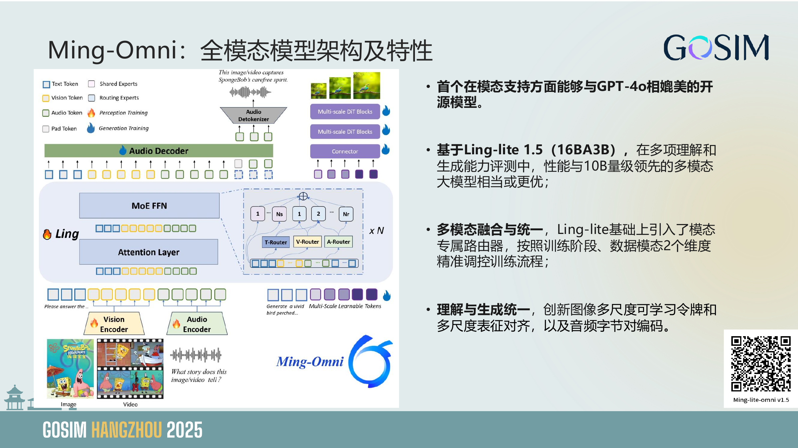

이 페이지의 왼쪽 범례는 먼저 token 타입을 제시한다. 파란 박스는 text token, 노란 박스는 vision token, 초록 박스는 audio token, 회색 박스는 pad token이다. 연한 색 블록은 shared experts, 파란 블록은 routing experts를 뜻한다. 불꽃은 perception training, 물방울은 generation training이다. 하단의 image/video는 먼저 Vision Encoder로 들어가고, audio는 Audio Encoder로 들어간다. 연속 특징은 token 시퀀스에 다시 삽입된 뒤 Ling 기반 모델로 들어간다. 가운데 Ling은 Attention Layer와 MoE FFN을 쌓은 구조다. 오른쪽 아래에는 T/V/A Router도 그려져 있어 텍스트, 시각, 오디오 token이 서로 다른 모달리티 라우팅을 거쳐 shared/routing experts와 조합될 수 있음을 보여준다.

위쪽 Audio Decoder는 초록 audio token으로 오디오 생성을 수행한다. 오른쪽 위 이미지 생성 분기는 보라색 multi-scale learnable tokens에서 출발해 Connector와 Multi-scale DiT Blocks를 지나 다중 스케일 이미지를 생성한다. 오른쪽 설명은 특성을 명확히 말한다. Ling-lite 1.5(16B A3B)를 기반으로 하며, Ling-lite 위에 모달리티 전용 router를 도입하고, 학습 단계와 데이터 모달리티 두 축으로 학습 흐름을 스케줄링한다. 공개 코드의 `BailingMM2NativeForConditionalGeneration`이 vision/audio/LLM/image generation 모듈을 같은 모델 클래스에 넣는 것이 이 그림과 대응된다.

#### Slide 12: 혼합 전체 모달리티 학습

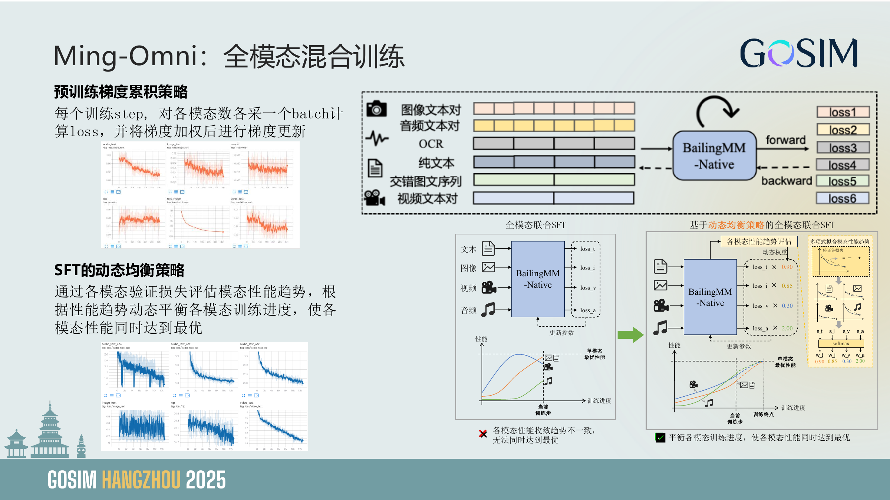

이 페이지의 왼쪽 위는 사전학습 gradient accumulation 전략을 설명한다. 각 step에서 각 모달리티의 batch를 하나씩 샘플링해 각각 loss를 계산하고, 다시 gradient weighted update를 수행한다. 오른쪽 위 점선 박스는 학습 데이터 형태를 나열한다. 이미지-텍스트 쌍, 오디오-텍스트 쌍, OCR, 순수 텍스트, 교차 이미지-텍스트 시퀀스, 비디오-텍스트 쌍이 모두 `BailingMM-Native`로 들어가고, forward 결과 `loss1`부터 `loss6`까지 얻은 뒤 backward에서 파라미터 업데이트로 합쳐진다.

아래쪽은 SFT의 동적 균형 전략이다. 왼쪽 아래 일반 전체 모달리티 joint SFT는 텍스트, 이미지, 비디오, 오디오가 각각 loss_t/loss_i/loss_v/loss_a를 내고 바로 업데이트한다. 옆의 곡선은 서로 다른 모달리티의 수렴 추세가 일치하지 않음을 보여준다. 같은 학습 step에서 어떤 모달리티는 이미 최적에 가까워졌고, 어떤 모달리티는 아직 따라오지 못했다. 오른쪽 아래 동적 전략은 먼저 각 모달리티의 성능 추세를 평가하고 loss에 동적 가중치를 곱한다. 예를 들어 그림에서는 `loss_t x 0.90`, `loss_i x 0.85`, `loss_v x 0.30`, `loss_a x 2.00`을 보인다. 여기서 목표는 모든 loss 수치를 같게 만드는 것이 아니라, 각 모달리티의 능력 진도를 더 비슷하게 맞추는 것이다.

#### Slide 13: 시각 이해와 생성 통합

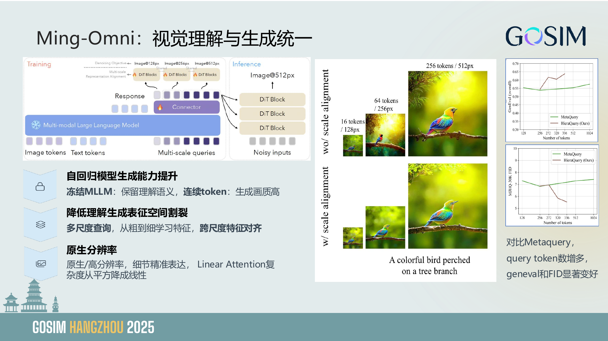

이 페이지 왼쪽은 학습과 추론을 함께 그린다. 학습 때 image tokens, text tokens, multi-scale queries가 Multi-modal LLM으로 들어간다. response 쪽의 multi-scale query는 Connector를 거쳐 DiT Blocks에 연결되고, 각각 128px, 256px, 512px denoising objective를 담당한다. 동시에 representation alignment도 있어 서로 다른 스케일의 표현을 정렬한다. 추론 때는 noisy inputs가 여러 층의 DiT Block에 들어가 최종 512px 이미지를 만든다.

오른쪽은 scale alignment가 없는 경우와 있는 경우의 생성 효과를 비교한다. 위쪽은 정렬이 없을 때 16 tokens/128px, 64 tokens/256px, 256 tokens/512px의 이미지 세부와 의미 일관성이 불안정하다. 아래쪽은 cross-scale alignment를 한 뒤 같은 "A colorful bird perched on a tree branch" prompt가 서로 다른 해상도에서 더 일관되게 나온다. 오른쪽 두 곡선은 MetaQuery와 비교해 HieraQuery가 query token이 늘수록 Geneval overall이 오르고 MJHQ-30K FID가 내려간다는 점을 보여준다. 코드에서 이 부분은 image generation 분기에 있다. LLM이 condition embeddings를 내고, diffusion head/DiT가 이 condition으로 sampling한다.

#### Slide 14: 장 전환: 오픈소스와 진화

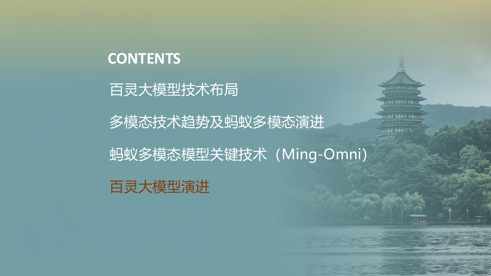

이 페이지는 "Bailing 대모델 진화"로 들어가는 목차 전환이다. 앞에서는 이미 Ming-Omni의 구조와 학습을 설명했고, 뒤에서는 버전 진화와 오픈소스 자료로 돌아간다.

오픈소스 자료에는 GitHub, HuggingFace, ModelScope, technical report, project page가 있다. 아래 코드 해설에서 쓰는 것은 현재 Ming 저장소이며, 버전은 slides의 v1.5보다 더 새롭다. 그래서 본문은 안정적인 구현 경로, 즉 vision/audio 특징 접속, LLM 컨텍스트, image generation condition을 중심으로 설명한다.

#### Slide 15: 버전 진화

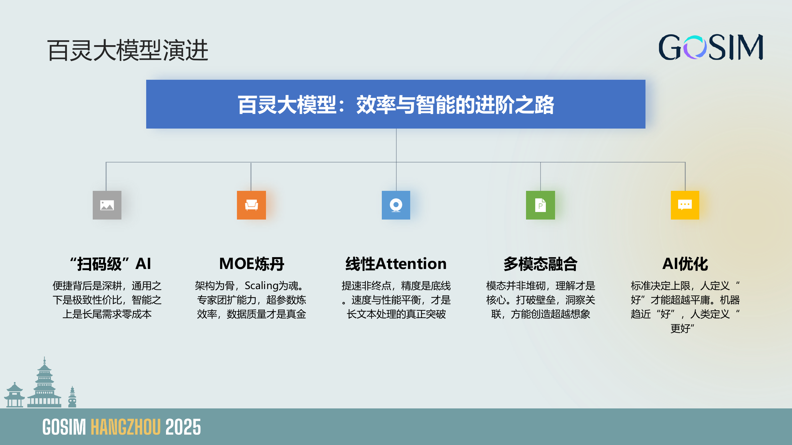

버전 진화 페이지는 "효율과 지능의 진화 경로"를 다섯 지점으로 나눈다. 스캔 수준 AI, MoE, 선형 Attention, 멀티모달 융합, AI 최적화다. 이 페이지가 표현하려는 것은 모델 진화가 파라미터를 키우는 것만으로 이루어지지 않고, 비용 대비 성능, 구조, 긴 텍스트 효율, 모달리티 이해, 평가 기준도 포함한다는 점이다.

공개 README에는 이미 Ming-flash-omni 2.0이 적혀 있으며, 기반은 Ling-2.0 MoE다. 총 파라미터와 active 파라미터도 slides의 버전보다 더 크다. 블로그를 쓸 때는 버전 차이에 주의해야 한다. slides는 v1.5 설계를 설명하고, 소스 코드 해설은 현재 공개 저장소 구현을 기준으로 한다.

#### Slide 16: 논문, 모델, 코드 링크

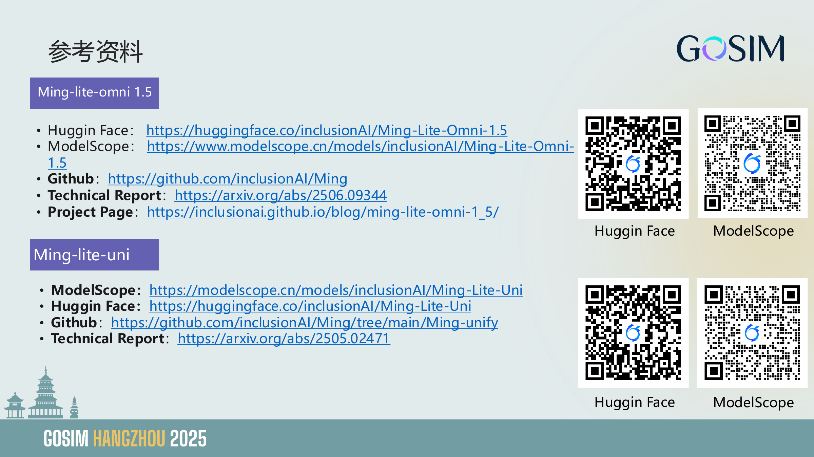

링크 페이지는 Ming-lite-omni 1.5와 Ming-lite-uni의 공개 진입점을 제공한다. HuggingFace, ModelScope, GitHub, technical report, project page가 포함된다. 또한 사용자가 논문만 읽는 것이 아니라 바로 weight를 다운로드하고, cookbook을 보고, demo를 실행할 수 있음을 보여준다.

이런 링크는 블로그에서 추상적인 평가보다 더 중요하다. 멀티모달 모델은 재현 문턱이 높고, processor, 의존성, 이미지/오디오 전처리, 추론 파라미터에 모두 예제가 필요하다. 공개 저장소의 README와 cookbook은 독자가 이 글을 로컬 실험으로 옮기는 입구다.

#### Slide 17: 정리


정리 페이지는 실전으로 돌아온다. Ming-Omni의 핵심은 모달리티를 쌓아 올리는 데 있지 않고, 연속 특징, 이산 token, 생성 condition, 다중 목표 학습을 유지보수 가능한 모델 구현 안에 넣는 데 있다.

## 0x3. 핵심 코드 해설

Ming의 모델 클래스는 직관적이다. 초기화 때 vision, audio, LLM, projection layer를 각각 만든다.

```python
if self.config.vision_config:
    self.vision = Qwen3MoeVisionTransformer(self.config.vision_config)

if self.config.audio_config:
    self.audio = WhisperAudioEncoder(**self.config.audio_config.whisper_encoder_config)

self.model = BailingMoeV2ForCausalLM(self.config.llm_config)

mlp_modules_img = [nn.Linear(self.vision.image_emb_dim, self.model.config.hidden_size)]
self.linear_proj = nn.Sequential(*mlp_modules_img)
```

모델 입구에서는 processor가 메시지 안의 텍스트, 이미지, 비디오, 오디오를 먼저 분해한다. 공식 README의 추론 경로가 대표적이다. `apply_chat_template`은 멀티턴 대화를 텍스트 prompt로 바꾸고, `process_vision_info`는 시각/오디오 객체를 수집한다. 마지막으로 processor가 한 번에 `input_ids`, `pixel_values`, `pixel_values_videos`, `audio_feats` 같은 필드를 만든다.

```python
text = processor.apply_chat_template(
    messages,
    sys_prompt_exp=sys_prompt_exp,
    use_cot_system_prompt=use_cot_system_prompt,
)
image_inputs, video_inputs, audio_inputs = processor.process_vision_info(messages)

inputs = processor(
    text=[text],
    images=image_inputs,
    videos=video_inputs,
    audios=audio_inputs,
    return_tensors="pt",
    audio_kwargs={"use_whisper_encoder": True},
).to(model.device)

for k in inputs.keys():
    if k in ("pixel_values", "pixel_values_videos", "audio_feats"):
        inputs[k] = inputs[k].to(dtype=torch.bfloat16)
```

이 코드는 Slide 9/11과 대응된다. Ming-Omni는 LLM 앞에 encoder 몇 개를 단순히 붙이는 것이 아니라, 서로 다른 모달리티 입력을 먼저 통합 batch로 정리한 뒤, 모델 내부에서 placeholder 위치에 연속 특징을 다시 embedding 시퀀스로 채워 넣는다.

시각 특징은 먼저 vision transformer를 지나고, 다시 LLM hidden size로 투영한 뒤 normalize한다.

```python
def extract_image_feature(self, pixel_values, grid_thw):
    with torch.cuda.amp.autocast(dtype=torch.bfloat16):
        image_embeds = self.vision(pixel_values, grid_thw=grid_thw)
    image_embeds = self.linear_proj(image_embeds)
    image_embeds = F.normalize(image_embeds, dim=-1)
    return image_embeds
```

오디오 특징은 Whisper encoder와 downsampling projection을 지난다.

```python
def extract_audio_feature(self, audio_feats, audio_feats_lengths, use_whisper_encoder=False):
    audio_embeds, _, audio_embeds_lengths = encode_audio_segments(
        encoder=self.audio,
        proj_layer=self.linear_proj_audio,
        wav_feats=audio_feats,
        wav_feats_lengths=audio_feats_lengths,
        audio_config=self.config.audio_config,
    )
    if self.config.audio_config.norm_query_embeds:
        audio_embeds = F.normalize(audio_embeds, dim=2)
    return audio_embeds.to(audio_feats.dtype), audio_embeds_lengths
```

연속 특징을 텍스트 시퀀스에 다시 넣는 방식은 `patch_continuous_features`에서 볼 수 있다. placeholder token이 먼저 자리를 차지하고, encoder 출력이 나온 뒤 해당 embedding을 덮어쓴다.

```python
def patch_continuous_features(input_embeddings, placeholder_loc_lens, encoded_feats, encoded_feat_lens):
    batch_size = input_embeddings.size(0)
    for i in range(batch_size):
        audio_feat_start = 0
        for j in range(placeholder_loc_lens.shape[1]):
            placeholder_start = int(placeholder_loc_lens[i, j, 0].item())
            placeholder_len = int(placeholder_loc_lens[i, j, 1].item())
            if placeholder_len <= 0:
                break
            feat_len = int(encoded_feat_lens[i, j].item())
            target_len = min(feat_len, placeholder_len)
            input_embeddings[i, placeholder_start:placeholder_start + target_len] = \
                encoded_feats[i, audio_feat_start:audio_feat_start + target_len]
            audio_feat_start += feat_len
    return input_embeddings
```

이미지 생성 분기는 다른 경로를 지난다. `generate(image_gen=True)`일 때 condition embeddings를 가져온 뒤 diffusion loss의 sample을 호출한다.

```python
if image_gen:
    condition_embeds = self.get_condition_embeds_for_image_gen(
        input_ids=input_ids,
        attention_mask=attention_mask,
        image_embeds=image_embeds,
        use_cache=use_cache,
        image_grid_thw=image_grid_thw,
        llm_hidden_states=image_gen_llm_hidden_states,
    )

    image = self.diffusion_loss.sample(
        condition_embeds=condition_embeds,
        negative_condition_embeds=negative_condition_embeds,
        steps=image_gen_steps,
        seed=image_gen_seed,
        cfg=image_gen_cfg,
        height=image_gen_height,
        width=image_gen_width,
    )
```

오디오 이산 token의 BPE 연결은 `S3BpeTokenizer`에서 볼 수 있다.

```python
def encode(self, s3_code: List[int]):
    new_s3_code = [self.s3_to_zh[x] for x in s3_code]
    new_s3_code = ''.join(new_s3_code)
    output = self.sp.encode(new_s3_code)
    return output.ids, output.tokens
```

이런 구현은 Ming-Omni의 "통합"이 모든 것을 같은 token으로 바꾸는 것이 아니라, 연속 특징, 이산 오디오 token, 생성 condition을 LLM이 처리할 수 있는 인터페이스에 통합한다는 점을 보여준다.

## 0x4. 소결

Ming-Omni의 엔지니어링 핵심은 모달리티 인터페이스다. vision/audio encoder는 연속 특징을 내고, LLM은 통합 컨텍스트를 담당하며, 이미지 생성은 다시 hidden states에서 condition을 가져와 diffusion head에 전달한다. 이 구조는 단순히 능력을 나열하는 것보다 훨씬 볼 가치가 있다.
