# GOSIM Hangzhou 기술 회고 해설 - GLM-4.5 시리즈 모델 오픈소스 생태

> GLM-4.5는 능력 순위 측면에서 이야기할 수도 있지만, infra 디렉터리에 배치한 만큼 모델 생태 뒤에 있는 학습, rollout, 오픈소스 적응 체인에 중점을 둔다.

## 0x0. 서론

이 글에서는 GLM-4.5의 slides를 순위표 복술이 아닌 생태 해설로 다룬다. 모델 결과는 중요하지만, infra 디렉터리 관점에서 더 명확하게 봐야 할 것은 GLM 시리즈의 post-training이 어떻게 시스템화되었는지, rollout 백엔드가 어떻게 SGLang에 연결되는지, 그리고 모델이 오픈소스화된 후 Transformers, vLLM, SGLang, PEFT 등의 생태계에 어떻게 편입되는지다.

## 0x1. 자료 및 코드 위치

관련 자료 및 코드:

- GLM-4.5 공식 입구: `https://github.com/zai-org/GLM-4.5`, GLM-V 입구: `https://github.com/zai-org/GLM-V`.
- slime: `README.md`에 GLM-4.5/4.6/4.7/5 시리즈 뒤에 있는 RL framework임이 명확히 나열되어 있다.
- slime: `slime/backends/sglang_utils/sglang_engine.py`, SGLang engine 시작, release/resume, 가중치 업데이트.
- slime: `slime/ray/rollout.py`, SGLang server group, router, colocate offload/onload, rollout 데이터 피드백.
- slime 문서: `docs/zh/get_started/quick_start.md`와 `docs/zh/examples/glm4.7-355B-A32B.md`. SGLang 파라미터, partial rollout, MTP 설정 등을 볼 수 있다.
- LMSYS slime blog: `https://lmsys.org/blog/2025-07-09-slime/`. SGLang 네이티브 RL 시스템이 왜 학습, rollout, 가중치 동기화를 같은 프레임워크에 넣는지 설명한다.

GLM-4.5의 모델 생태를 가중치 발표만 보면 한 부분이 빠진다: 이 모델들의 사후 RL/post-training이 어떻게 실행되는지, rollout 백엔드가 어떻게 연결되는지, 가중치가 어떻게 동기화되는지다. LMSYS의 slime blog를 공개 참고자료로 사용할 수 있다:


이 그림의 SGLang Server Group, Router, Weight Sync, Partial Rollout이 기본적으로 나중에 slime 코드를 읽는 지도가 된다. GLM 시리즈 모델은 규모가 크고 MoE가 많으며 컨텍스트가 길어서, 학습 측에서 매 라운드 업데이트 후 rollout 측이 새 가중치를 빨리 받을 수 있어야 한다. slime이 SGLang 중심의 네이티브 통합을 선택한 이유도 여기 있다: 추론 엔진의 release/resume, server group 관리, 샘플링 파라미터와 rollout 데이터 피드백이 모두 학습 프레임워크의 스케줄링 면에 들어가야 한다.

## 0x2. Slides 페이지별 해설

#### Slide 1: GLM-4.5 시리즈 모델 오픈소스 생태

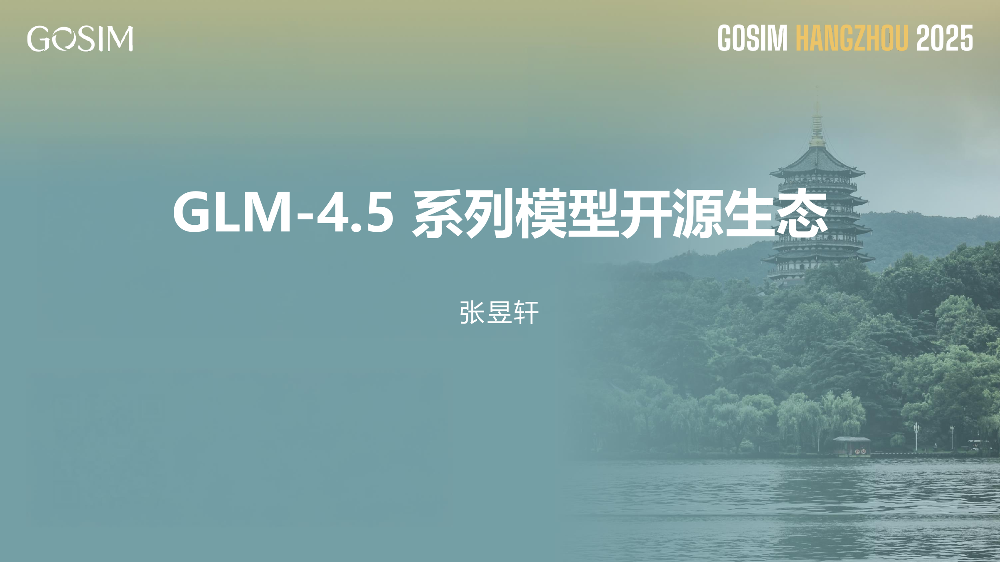

제목 페이지는 주제를 제시한다: GLM-4.5 시리즈 모델 오픈소스 생태. 여기서 "생태"는 단순히 모델 가중치를 HuggingFace에 업로드하는 것이 아니라, 언어 모델, 시각 모델, 학습 프레임워크, 추론 프레임워크, 문서, 커뮤니티 활동이 함께 구성하는 사용 경로다.

infra 디렉터리와 가장 관련이 깊은 것은 slime이다: GLM-4.5 뒤의 RL/post-training 프레임워크가 공개된 후, 학습과 SGLang rollout의 엔지니어링 세부사항도 논의할 수 있게 되었다. 나중에 GLM-4.5 강화학습 부분을 볼 때, slime의 training, rollout, data buffer가 주선이 된다.

#### Slide 2: 목차

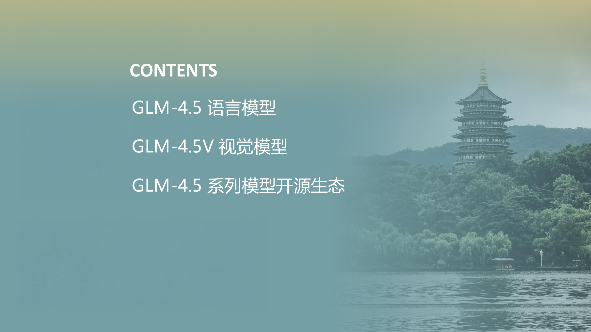

목차는 세 단락으로 나뉜다: GLM-4.5 언어 모델, GLM-4.5V 시각 모델, GLM-4.5 시리즈 모델 오픈소스 생태. 이 순서도 자연스럽다: 먼저 언어 모델 능력과 학습을 설명하고, 다음으로 시각 모델의 구조와 데이터 엔지니어링을 설명하며, 마지막으로 오픈소스 적응과 커뮤니티 전파를 다룬다.

엔지니어링 관점에서 세 번째 부분은 마무리 자료가 아니라 모델이 실제로 사용될 수 있는지의 핵심이다. 대형 모델 가중치가 발표된 후 사용자에게는 tokenizer, processor, 추론 예시, 프레임워크 호환성, 양자화/서빙 방안과 issue 수정이 여전히 필요하다. 이 모든 것이 모델의 실제 사용 가능성에 영향을 미친다.

#### Slide 3: 언어 모델 능력 배경

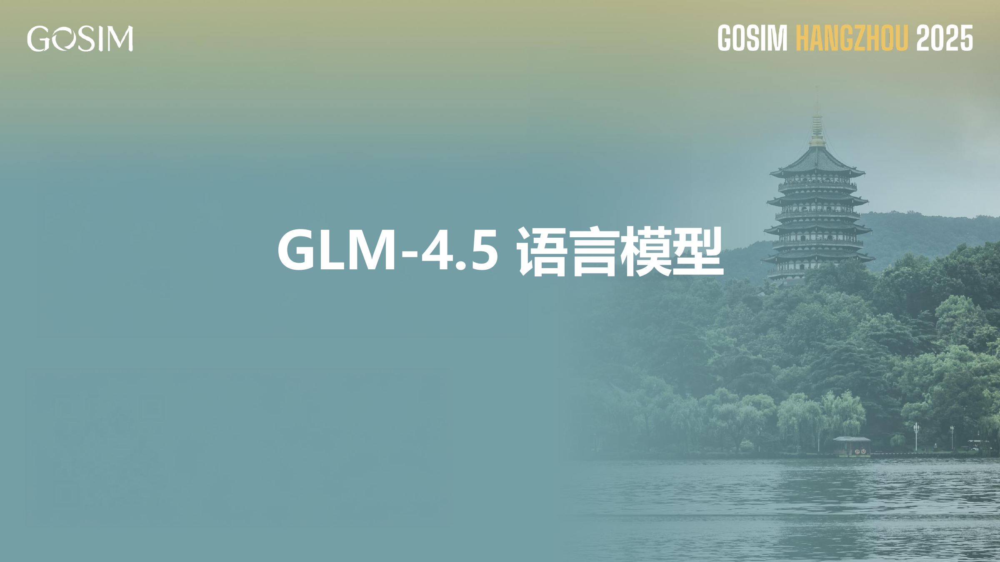

이 페이지는 언어 모델 장의 구분 페이지다. 이후 몇 페이지는 GLM-4.5의 all-round 포지셔닝을 중심으로 전개된다: reasoning, coding, agent 및 일반 능력을 모두 커버해야 한다.

이 포지셔닝은 학습 시스템에 직접적인 영향을 미친다. 채팅 모델만 만들 때는 SFT와 선호도 정렬이 주도하지만, coding과 agent를 수행하려면 실행 피드백, 도구 호출, 다중 턴 환경과 검증 가능한 reward가 필요하다. 즉, "모델이 질문에 답하도록 학습"에서 "모델이 작업을 완수하도록 학습"으로 나아가는 것이다.

#### Slide 4: GLM-4.5: All-round model

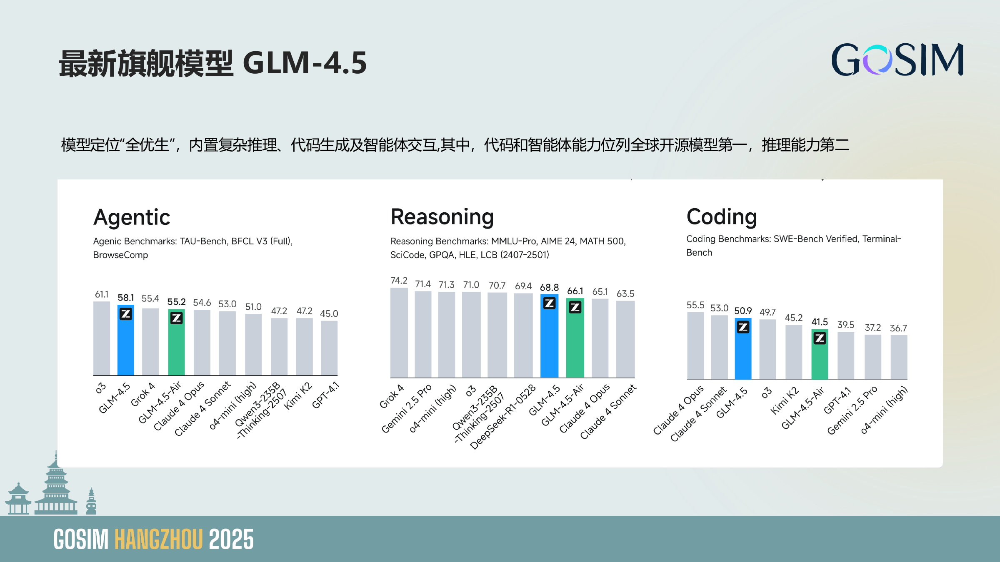

이 페이지는 GLM-4.5를 "올라운더"로 포지셔닝한다. slide 소문자에는 복잡한 추론, 코드 생성, 에이전트 상호작용이 내장 능력이며, 코딩과 에이전트 능력이 전 세계 오픈소스 모델 1위, 추론 능력 2위라고 쓰여 있다. 여기서의 표현이 강조하는 것은 "균형"이다: 어떤 한 benchmark에서만 높은 점수를 내는 것이 아니라 모델이 실제 작업의 다양한 능력을 커버할 수 있게 하는 것이다.

균형 잡힌 모델은 post-training에 더 민감하다. reasoning은 검증 가능한 문제와 과정 보상이 필요하고, coding은 실행 피드백과 테스트 케이스가 필요하며, agent는 도구 호출 궤적과 환경 피드백이 필요하다. 이 데이터들이 최종적으로 RL 또는 rejection sampling 흐름에 들어가야 한다. slime/SGLang의 의미가 바로 여기에 있다: 대규모 rollout과 학습 업데이트가 피드백 루프를 형성할 수 있게 한다.

#### Slide 5: Agent 능력 비교

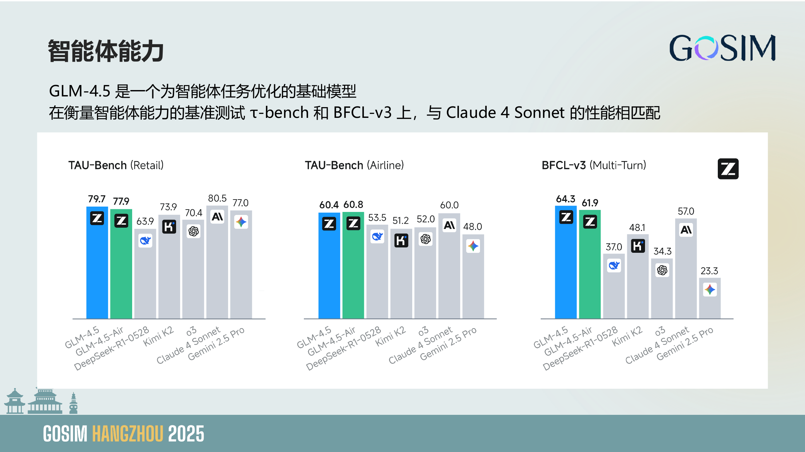

Agent 능력 비교 페이지에서는 τ-bench와 BFCL-v3을 언급하며, GLM-4.5가 이 기준에서 Claude 4 Sonnet에 근접한다고 말한다. τ-bench는 실제 도구 환경에서의 작업 완료에 초점을 맞추고, BFCL-v3는 function calling의 도구 선택, 파라미터 생성, 다중 턴 호출에 초점을 맞춘다.

이런 benchmark의 어려움은 단일 턴 언어 품질이 아니라 상태 추적과 도구 프로토콜에 있다. 모델은 언제 도구를 호출할지, 어떤 도구를 호출할지, 파라미터가 완전한지 알아야 하며, 도구 반환 후에도 다음 단계를 계속 계획해야 한다. 시스템 측면으로 돌아오면, agentic rollout, tool parser, chat template, reward/verifier, 서버 측 세션 관리에 해당한다.

#### Slide 6: 코딩 능력

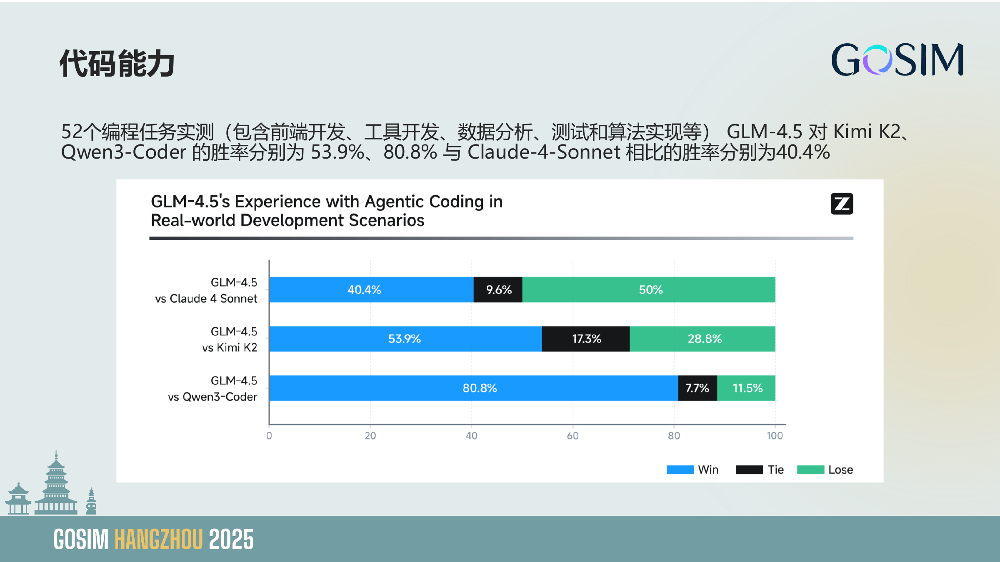

코딩 능력 페이지에는 52개의 프로그래밍 작업 실측이 제시되며, 작업은 프런트엔드 개발, 도구 개발, 데이터 분석, 테스트, 알고리즘 구현 등을 커버한다. slide에는 비교 승률도 있다: Kimi K2, Qwen3-Coder, Claude-4-Sonnet 대비 각각 다른 승률을 보여준다.

코딩 능력 향상은 보통 pretrain만으로 되지 않는다. 실제로 격차를 벌리는 것은 고품질 지시 데이터, 실행 피드백, 단위 테스트/verifier, 오류 샘플 재학습, 코드 궤적을 안정적으로 생성할 수 있는 rollout 시스템이다. 이것은 GLM-4.5 강화학습 부분과 연결된다: coding의 reward는 보통 테스트 결과에서 나오며, 인간 선호도 점수만으로는 해결할 수 없다.

#### Slide 7: 일반 능력

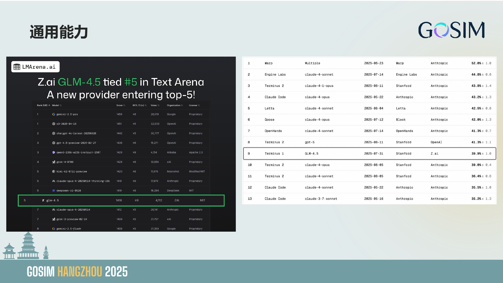

일반 능력 페이지는 모델이 agent/coding에만 편향되지 않았음을 보여준다. 전능형 모델이 어떤 좁은 작업만을 위해 최적화되면, 일반 Q&A, 글쓰기, 지식, 수학 외에서 능력 붕괴가 쉽게 발생한다.

이런 모델 학습에서는 데이터 mixture, loss balancing, post-training 단계 전환이 최종 능력에 직접 영향을 미친다. 예를 들어 agent/coding 데이터 비율이 너무 높으면 모델이 과도하게 도구화될 수 있고, 일반 대화 데이터가 부족하면 일상적 사용성에 영향을 준다. 나중에 GLM-V의 멀티모달 학습도 유사한 "다중 작업 진도 불일치" 문제를 만나게 된다.

#### Slide 8: 검색 도구 호출 예시

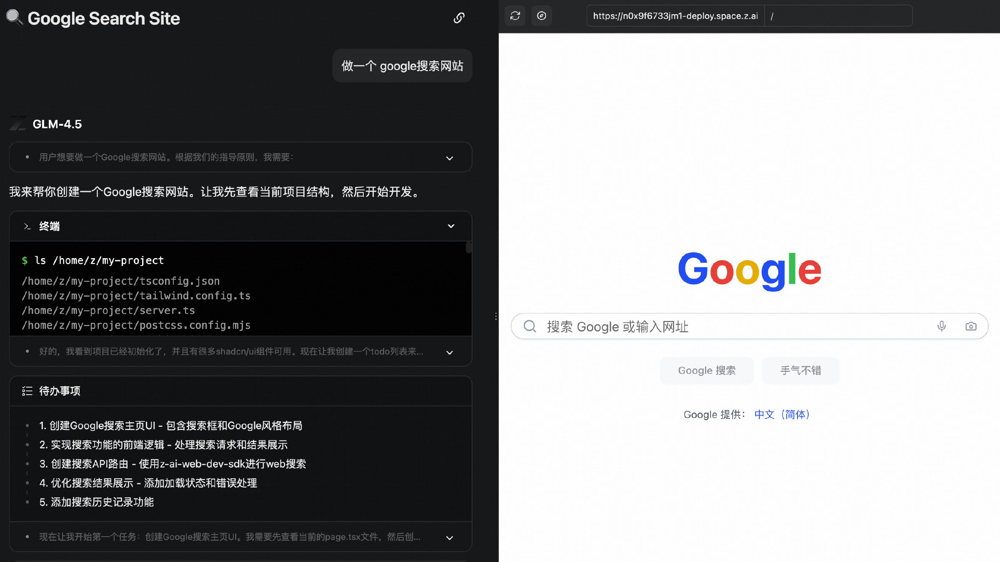

이 페이지는 검색 유형의 도구 호출을 보여준다. 화면에서 모델은 먼저 사용자 질문을 이해하고, 그것을 검색 가능한 쿼리로 분해한 다음, 외부 정보를 얻어 답변을 구성한다. 핵심 시스템 그림은 아니지만, GLM-4.5의 제품화 목표를 볼 수 있다: 모델이 정적 질문에만 답하는 것이 아니라 외부 도구를 추론 과정에 통합할 수 있다.

학습 시스템 관점에서, 이런 샘플들은 rollout을 단일 턴 텍스트 생성에서 tool-use 트랙으로 밀어낸다. 학습 데이터에는 tool call, tool result, 최종 답변 사이의 경계가 유지되어야 하며, 추론 시에는 동일한 다중 턴 대화를 최대한 같은 백엔드에 유지하여 KV 재구성 비용을 줄여야 한다.

#### Slide 9: 모델이 곧 제품인 능력 전시

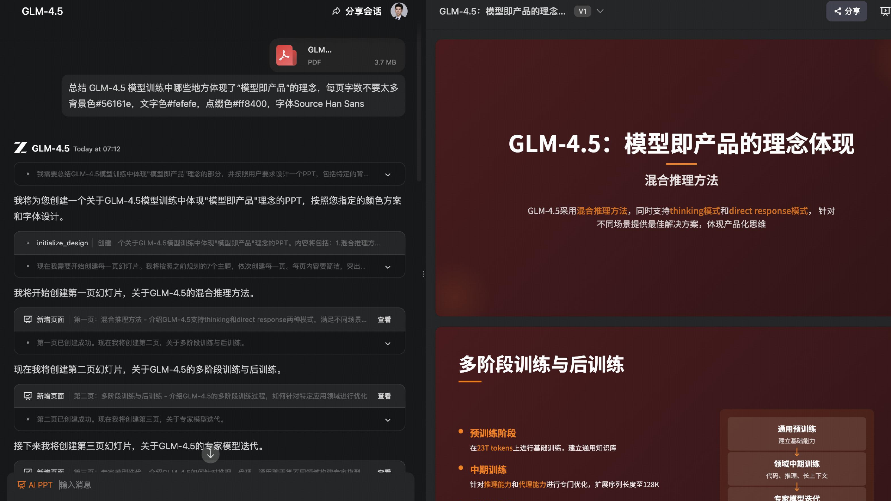

이 페이지는 "모델이 곧 제품"의 전시다: 복잡한 요구사항이 검색, 계획, 글쓰기, 형식 제어 등 여러 단계로 분해된다. 모델 능력 부분에 배치되었는데, GLM-4.5가 단순히 benchmark 점수를 추구하는 것이 아니라 agent/product workflow의 사용성을 강조하고 있음을 보여준다.

학습 시스템 관점에서, 이런 페이지는 하나의 평가 방향을 시사한다: 모델 출력의 최종 결과는 마지막 단계일 뿐이며, 중간에 계획을 세울 수 있는지, 검색 결과를 답변에 통합할 수 있는지, 목표 형식으로 출력할 수 있는지가 모두 데이터 구축과 평가에 들어가야 한다. Agent 능력을 최종 텍스트만 보면 중간 의사결정 품질을 놓치기 쉽다.

#### Slide 10: Tic-tac-toe 예시

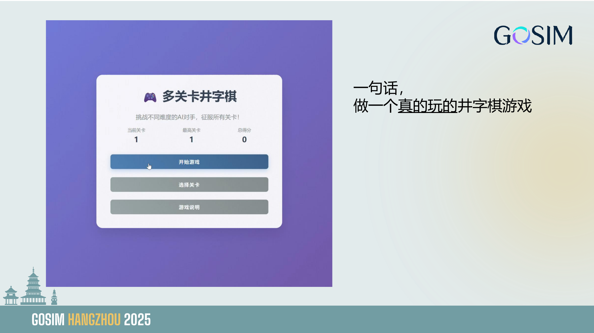

Tic-tac-toe 예시의 prompt는 "한 문장으로, 진짜로 플레이할 수 있는 틱택토 게임을 만들어라"이다. 제품 데모처럼 보이지만 기술적으로는 코드 생성, 상호작용 상태 관리, 프런트엔드 로직을 커버한다. 모델은 정적 HTML만 작성할 수 없고, 보드 상태, 승패 판단, 재시작 로직이 모두 작동해야 한다.

이 예시는 coding-agent 작업의 변화를 반영한다: 사용자는 고립된 코드 조각이 아니라 실행 가능하고 상호작용 가능하며 제약 조건을 만족하는 소형 애플리케이션을 원한다. 학습과 평가 시에도 자연어 유사도만 볼 수 없고, 실행 환경이나 브라우저 환경에서 검증하는 것이 최선이다.

#### Slide 11: PPT/샤오홍수 생성 예시

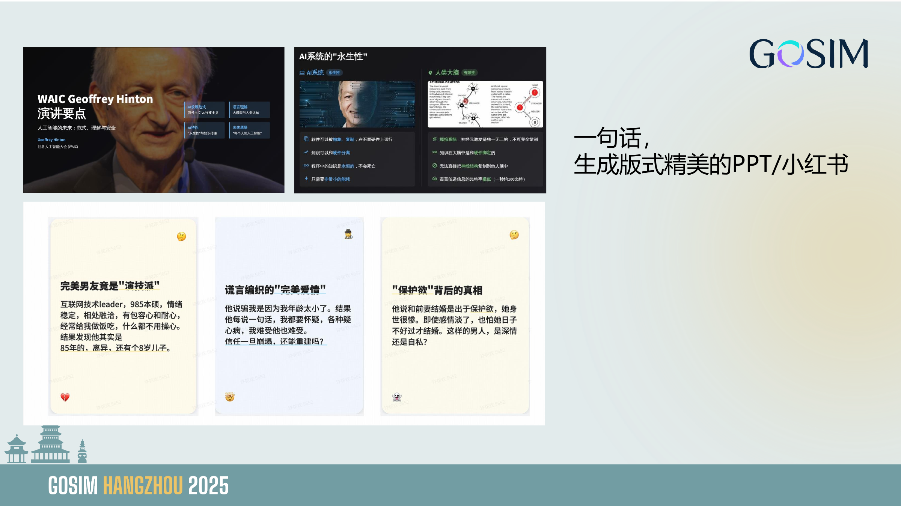

PPT/샤오홍수 예시는 제품화 성격이 강하지만, 다른 유형의 능력을 테스트한다: 긴 구조화된 출력, 시각적 레이아웃, 스타일 제어와 도구 호출의 조합. 사용자가 한 마디 요구사항만 주면, 모델이 형식, 계층, 미적 제약 조건이 있는 콘텐츠를 생성해야 한다.

앞의 검색 페이지와 연결하면, "도구를 호출할 줄 안다"에서 "형식 요구사항이 있는 작업을 완수할 수 있다"로 나아가는 것이다. 학습 데이터에 최종 텍스트만 기록하고 중간 계획과 도구 상태를 기록하지 않으면, 모델이 이런 workflow를 안정적으로 학습하기 어렵다.

이런 작업은 컨텍스트와 출력 길이도 높아진다: 모델이 먼저 주제를 이해하고, 제목, 단락, 이미지 텍스트 위치와 스타일을 구성해야 한다. 서버 측에서 이런 workflow를 처리하려면 모델 능력 외에 긴 출력 decode, 도구 호출 타임아웃, 중간 상태 저장도 고려해야 한다.

#### Slide 12: 모델 구조 비교

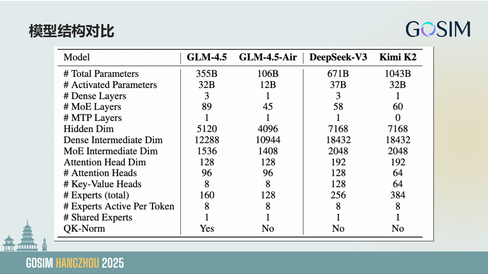

모델 구조 페이지는 GLM-4.5 시리즈의 기반 차이를 다룬다. 표는 보통 총 파라미터, 활성 파라미터, 컨텍스트 길이, 모델 크기와 다른 버전을 함께 비교한다. infra 독자 관점에서 중요한 것은 단순히 파라미터 규모가 아니라, MoE, active 파라미터, 긴 컨텍스트와 추론 비용이 함께 나중의 학습, rollout, serving 방안을 결정한다는 것이다.

MoE의 장점은 총 파라미터를 올릴 수 있고 단일 token active 파라미터가 제어된다는 것이다. 대가는 학습과 추론 모두에서 expert routing, EP/DP 부하 불균형, checkpoint 변환, serving cache를 처리해야 한다는 것이다. 구체적인 수치는 공식 저장소를 기준으로 하며, 본문에서 스크린샷을 토대로 재인용하지 않는다.

#### Slide 13: GLM-4.5 학습 과정

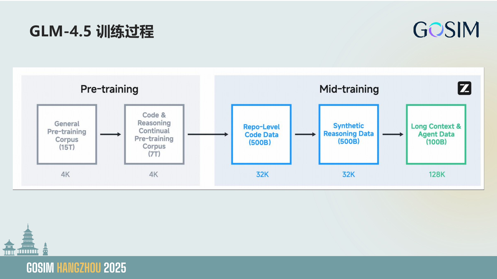

학습 과정 페이지는 pretraining, mid-training, SFT, RL을 연결한다. pretraining이 기반을 쌓고, mid-training이 능력 분포를 조정하며, SFT가 지시 형식을 정렬하고, RL이 reward/verifier에 따라 reasoning, coding, agent 등의 작업을 최적화한다.

slime이 바로 사후 학습 단계의 시스템적 지원 중 하나다: training 모듈이 data buffer에서 데이터를 읽고 모델을 업데이트하며, rollout 모듈이 SGLang + router로 새 샘플을 생성하고, reward/verifier 결과가 다시 data buffer에 기록된다. "학습"과 "학습 데이터 생성"을 두 개의 스크립트에서 하나의 연동 시스템으로 바꾼다.

#### Slide 14: GLM-4.5 강화학습

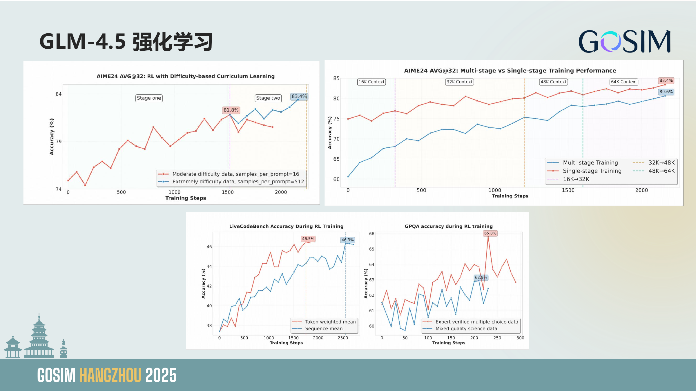

강화학습 첫 번째 페이지에서 GLM-4.5의 post-training이 정적 SFT만 하지 않음을 보여준다. RL은 rollout 엔진이 끊임없이 샘플을 생성하고 reward/verifier 결과를 학습에 피드백하는 것이 필요하다. 모델이 클수록 rollout 처리량, 메모리 점유, 가중치 동기화가 시스템 문제가 된다.

slide의 그림에서 slime은 training, rollout, data buffer 세 블록으로 구성된다. training이 주요 학습 과정을 담당하고 학습 후 파라미터를 rollout에 동기화하며, rollout이 SGLang + router로 새 데이터를 생성하고 보상/검증기 출력을 포함하며, data buffer가 prompt 초기화, 커스텀 데이터, rollout 생성 방식을 관리한다. 이것이 GLM-4.5 RL에서 가장 핵심적인 infra 경로다.

#### Slide 15: 강화학습 전략 세부사항

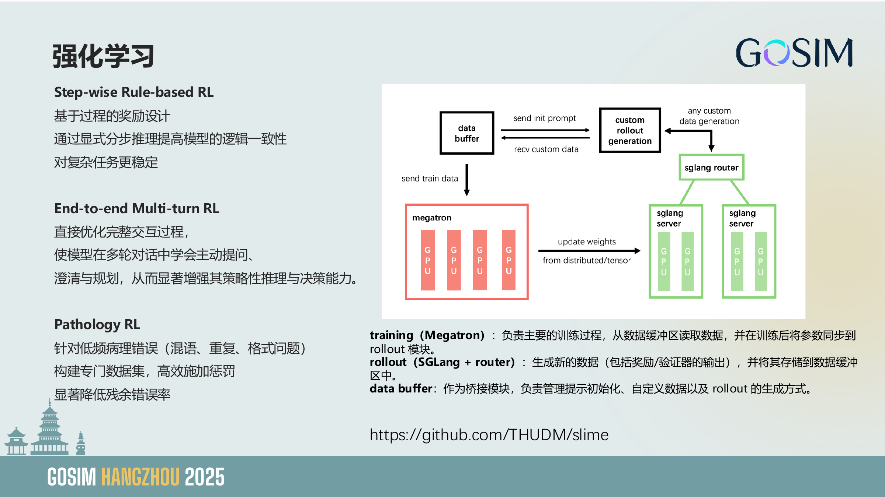

이 페이지는 RL recipe를 계속 펼친다. Step-wise Rule-based RL은 과정 보상을 사용하여 단계별 추론을 명시적으로 제약하고 복잡한 작업에서의 논리적 일관성을 향상시킨다. End-to-end Multi-turn RL은 완전한 상호작용 과정을 직접 최적화하여 모델이 능동적으로 질문하고, 명확히 하고, 계획하는 것을 학습하게 한다. Pathology RL은 언어 혼용, 반복, 형식 문제 같은 저빈도 오류를 위해 전용 데이터를 구성하고 페널티를 가한다.

이 전략들은 모두 안정적인 rollout에 의존한다. 과정 보상은 중간 단계를 가져와야 하고, multi-turn RL은 다중 턴 궤적을 저장해야 하며, Pathology RL은 저빈도 실패 샘플을 찾아내어 피드백해야 한다. slime의 data buffer와 SGLang rollout은 부수적인 도구가 아니라 이러한 RL 전략이 실행될 수 있는 기반이다.

#### Slide 16: slime 개발자 문서

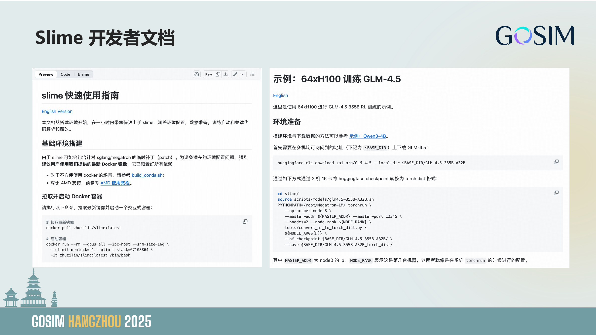

slime 문서 입구가 여기의 코드 위치다. slide 스크린샷에는 개발자 문서 페이지가 있는데, GLM-4.5의 RL 시스템이 내부적인 구두 방안이 아니라 이미 문서에 따라 시작하고 디버깅할 수 있도록 공개되어 있음을 보여준다.

slime README에는 GLM-4.5 뒤의 RL framework이며 Megatron + SGLang으로 학습과 rollout을 연결한다고 명확히 쓰여 있다. 나중에 코드 분해에서 SGLang engine, router, weight update를 따라 볼 것이다: server가 어떻게 시작되는지, rollout worker가 어떻게 router에 등록되는지, 학습 후 가중치가 어떻게 추론 측에 업데이트되는지.

#### Slide 17: GLM-4.5V 시각 이해 모델

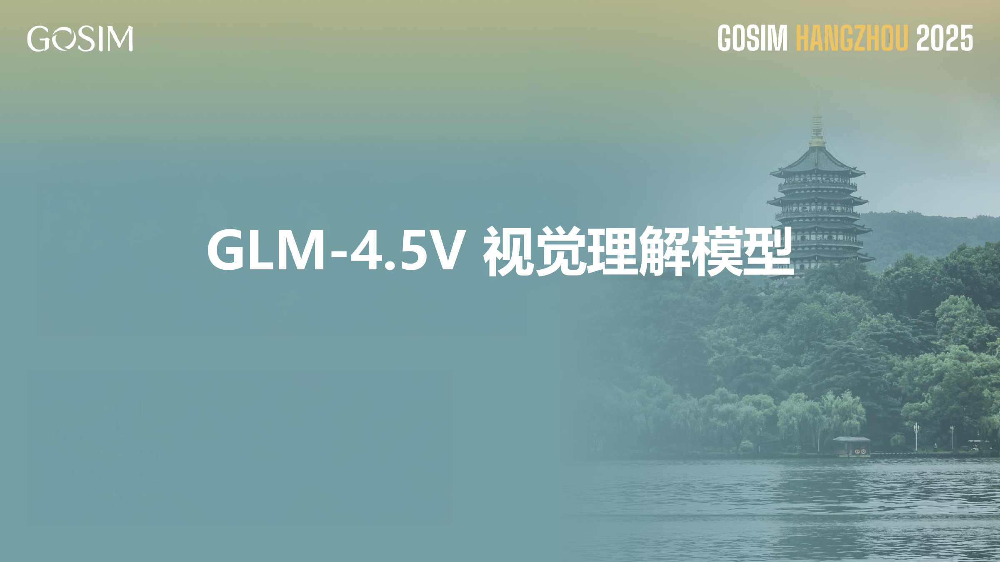

GLM-4.5V는 주제를 시각 언어 모델로 전환한다. 단순한 "언어 모델에 이미지 입력 추가"가 아니라, grounding, OCR, 비디오, GUI, 시각 Q&A, 멀티모달 안전 같은 작업을 처리해야 한다.

VLM의 RL은 순수 텍스트보다 더 복잡하다. 입출력이 영역 위치, 스크린샷 상태, GUI 조작, 시각 verifier를 포함할 수 있기 때문이다. 학습 샘플은 token ids 외에 이미지 patch, box, time index, 비디오 프레임, 작업 액션을 포함할 수 있다.

이 페이지는 시각 모델 장의 시작으로, 이후 몇 페이지를 연결한다: 먼저 grounding과 안전 감지를 다루고, 다음으로 모델 구조, 사전 학습 데이터, 학습 전략, VLM RL을 다룬다. GLM-4.5V를 이해하려면 구조와 데이터 엔지니어링을 동시에 봐야 하며, 능력 순위표 하나만 봐서는 안 된다.

#### Slide 18: Grounding과 의미 이해

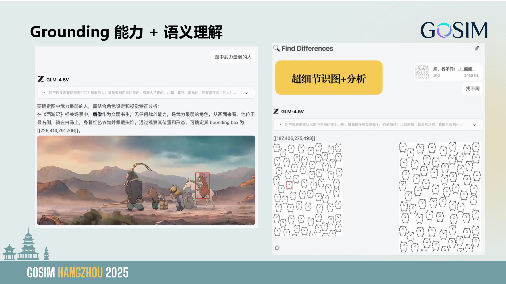

Grounding과 의미 능력 페이지는 시각적 위치 파악을 강조한다. 그림은 일반 caption이 아니라, 모델이 이미지에서 목표를 찾고 영역 관계를 이해하여 언어로 표현해야 함을 보여준다. 학습 데이터에는 box, region, OCR, 의미 관계 등의 감독이 필요하며, 추론 시에도 충분한 시각 해상도를 유지해야 한다.

VLM의 어려움은 단순히 "이미지를 컨텍스트에 넣는 것"이 아니라, 공간 정보를 언어 모델이 안정적으로 처리할 수 있게 하는 것이다. vision encoder가 생성한 patch token이 projector를 통해 language decoder에 들어가는데, token이 너무 적으면 세부사항을 잃고, 너무 많으면 컨텍스트 비용이 높아진다.

#### Slide 19: 안전 감지와 Grounding 능력

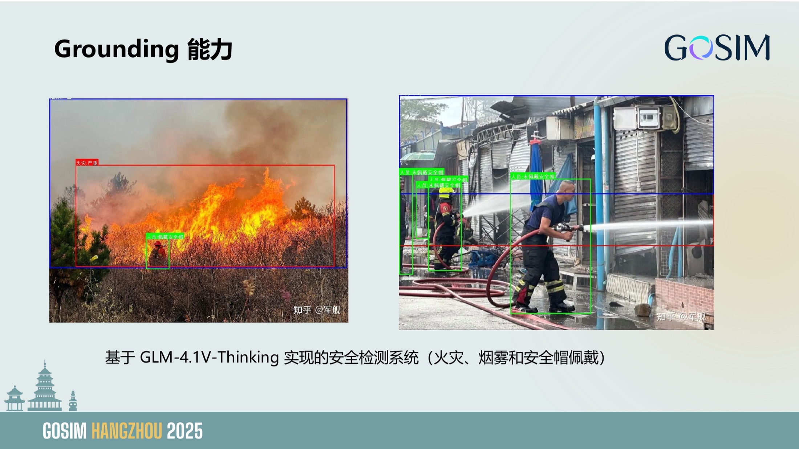

이 페이지는 grounding 능력과 안전 감지를 함께 보여주는데, 예시는 GLM-4.1V-Thinking 기반의 화재, 연기, 안전모 착용 감지 시스템이다. 단순한 분류 작업이 아니라 많은 시나리오에서 모델이 위험이 어느 영역에 발생했는지 지적해야 한다.

멀티모달 안전은 텍스트보다 어렵다. 이미지에는 텍스트, 기호, 자세, 장면 단서가 숨겨져 있을 수 있고, grounding 능력은 모델이 실제로 위치를 이해해야 하며 언어 사전만으로 추측해서는 안 된다. 산업 응용 시에는 이런 능력을 경보 임계값, 인적 검토, 오탐/누락 비용과 함께 설계해야 한다.

#### Slide 20: GLM-4.5V 모델 소개

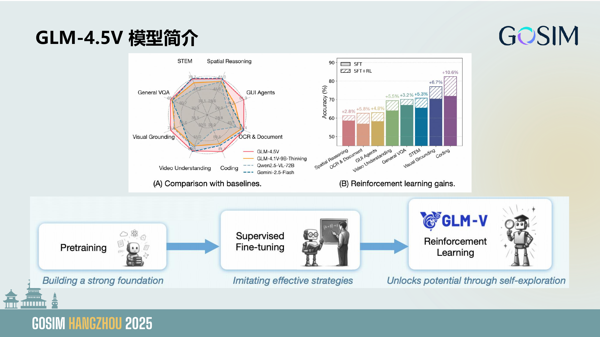

GLM-4.5V 모델 소개 페이지는 시각 모델과 언어 모델을 연결한다. 보통 기반 모델, 입력 해상도, 지원하는 이미지/비디오 유형, grounding, OCR, GUI, 비디오 이해에서의 포지셔닝을 설명한다.

오픈소스 생태에서 VLM은 가중치만 제공해서는 안 된다. 사용자에게는 processor, chat template, 이미지/비디오 전처리, 추론 예시, 평가 스크립트도 필요하다. 그렇지 않으면 모델이 오픈소스여도 실제 비즈니스나 평가 환경에서 연결할 수 없다.

이것은 Slide 21의 구조 그림을 위한 복선이기도 하다: 시각 입력은 하나의 이미지가 바로 LLM에 들어가는 것이 아니라, ViT encoder, projector, token 접합을 거쳐 language decoder에 들어간다. 비디오는 시간 압축과 time index token도 고려해야 한다.

#### Slide 21: V 모델 구조

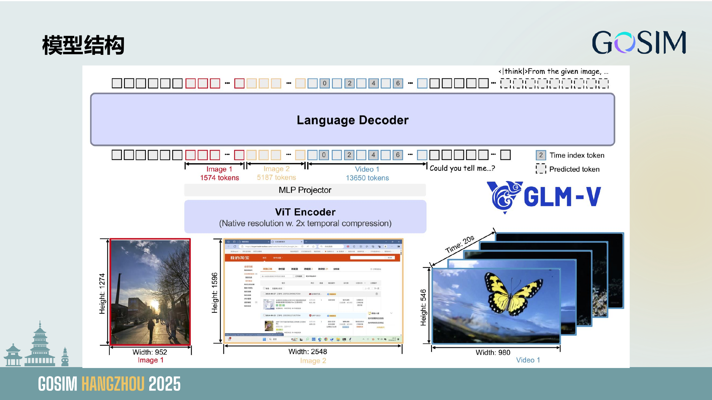

이 페이지는 GLM-V의 입력 시퀀스를 비교적 명확하게 그렸다. 하단은 원본 해상도 입력이다: Image 1, Image 2와 약 20초의 Video 1이 있고, ViT Encoder가 시각 특징을 추출하며 비디오 경로에는 2x temporal compression이 있다. 중간의 MLP Projector가 시각 특징을 언어 모델 hidden size로 투영한다. 상단의 Language Decoder가 받는 것은 혼합된 token 시퀀스다: 일반 텍스트 token, 이미지 token, 비디오 token, time index token, 그리고 오른쪽 상단 점선 박스의 predicted token.

그림에 token 수가 표시되어 있다: 첫 번째 이미지 약 1574 token, 두 번째 이미지 약 5187 token, 비디오 약 13650 token. 이 규모는 VLM의 컨텍스트 압박이 주로 시각 token에서 온다는 것을 보여준다. 사용자의 "Could you tell me...?"가 아니다. 따라서 GLM-V 같은 모델은 native resolution, 시간 압축, projector, 긴 컨텍스트 추론 사이에서 균형을 잡아야 한다. 그렇지 않으면 이미지/비디오 이해 능력이 높아지면 serving 비용이 빠르게 상한에 도달한다.

#### Slide 22: 사전 학습

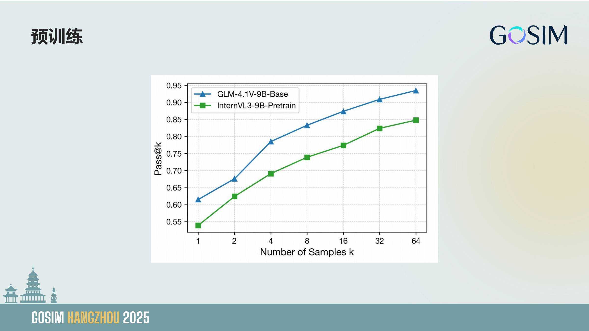

이 페이지의 곡선에서 가로축은 샘플 수 k, 세로축은 Pass@k다. 파란선은 GLM-4.1V-9B-Base, 초록선은 InternVL3-9B-Pretrain이다. 두 선 모두 k가 1에서 64로 증가함에 따라 계속 상승하여, 시각 이해 작업에서 다중 샘플링이 여전히 더 높은 통과율로 전환될 수 있음을 보여준다. 파란선이 전반적으로 초록선보다 높으며, k=4에서 k=16 구간의 향상이 특히 눈에 띈다.

이 페이지를 "사전 학습" 장에서 보면, 중요한 것은 최종 점수 하나를 비교하는 것이 아니라 시각 기반 학습이 이후 다양화된 샘플링의 상한에 영향을 미친다는 것을 보여주는 것이다. VLM 사전 학습의 이미지-텍스트 쌍 품질, OCR 데이터, 비디오 프레임 샘플링이 모두 grounding, GUI, 시각 Q&A 능력에 영향을 미친다. 여기서의 데이터 엔지니어링이 단일 모델 구조 변경보다 상한을 더 크게 결정한다.

#### Slide 23: 데이터 엔지니어링 1부

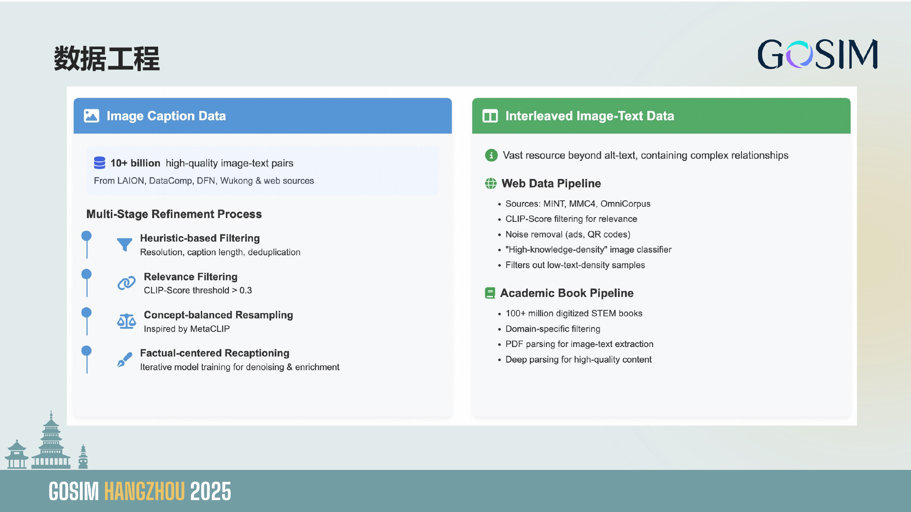

이 페이지는 이미지-텍스트 사전 학습 데이터를 두 블록으로 나눈다. 왼쪽은 Image Caption Data로, 규모는 10B+ 고품질 이미지-텍스트 쌍이며, 출처는 LAION, DataComp, DFN, Wukong, web sources를 포함한다. 아래의 multi-stage refinement는 네 단계다: 먼저 해상도, caption 길이, 중복 제거로 휴리스틱 필터링을 하고, CLIP-score(임계값 0.3 초과)로 처리한 다음, concept-balanced resampling(MetaCLIP 방식 참고)을 하고, 마지막으로 반복 모델 학습으로 caption 노이즈 제거와 사실 보완을 하는 factual-centered recaptioning을 수행한다.

오른쪽은 Interleaved Image-Text Data로, alt-text를 넘어선다고 강조한다. 즉, 이미지 캡션만이 아니라 복잡한 이미지-텍스트 관계도 필요하다. Web Data Pipeline 출처에는 MINT, MMC4, OmniCorpus가 포함되며, 필터링에는 CLIP-score 관련성, 광고/QR코드 노이즈 제거, 고지식 밀도 이미지 분류기, 저텍스트 밀도 샘플 필터링이 포함된다. Academic Book Pipeline은 100M+ 디지털화된 STEM 교재에서 나오며, 영역 필터링, PDF 이미지-텍스트 추출, 심층 파싱을 수행한다. 이 페이지는 VLM 학습의 "이미지 caption"과 "이미지-텍스트 인터리브 긴 컨텍스트" 두 가지 데이터 라인에 해당한다.

#### Slide 24: 데이터 엔지니어링 2부

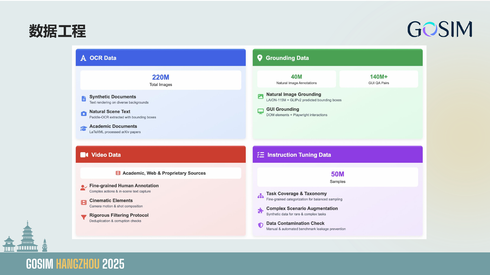

이 페이지는 데이터 소스를 OCR, grounding, 비디오, instruction tuning으로 계속 나눈다. OCR Data에는 220M total images가 표시되어 있으며, synthetic documents, natural scene text, academic documents를 포함한다: synthetic documents는 다중 배경 텍스트 렌더링이고, natural scene text는 Paddle-OCR로 추출한 텍스트 박스에서 오며, academic documents는 LaTeXML로 처리된 arXiv 논문에서 온다. Grounding Data에는 40M natural image annotations와 140M+ GUI QA pairs가 표시되어 있으며, 두 가지 유형은 natural image grounding과 GUI grounding이고, 후자는 DOM elements와 Playwright interactions를 결합한다.

왼쪽 하단의 Video Data는 academic, web, proprietary sources에서 오며, fine-grained human annotation, cinematic elements, rigorous filtering protocol을 강조한다. 오른쪽 하단 Instruction Tuning Data에는 50M samples가 표시되어 있으며, task coverage & taxonomy, complex scenario augmentation, data contamination check를 포함한다. 이 페이지와 이전 페이지를 연결하면, GLM-V의 데이터 엔지니어링은 단일 caption 데이터가 아니라 OCR, 영역 위치 파악, GUI 조작, 비디오 이해, 지시 데이터를 섞어 능력 커버리지를 달성한다.

#### Slide 25: 학습 전략

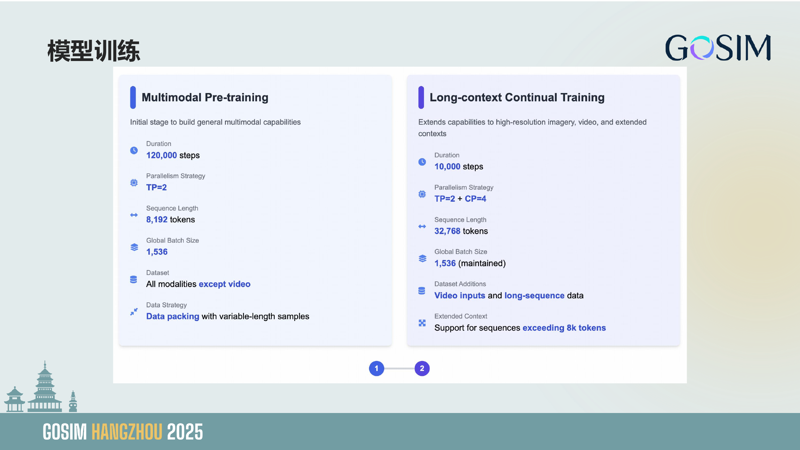

학습 전략 페이지는 모델 구조, 데이터, 병렬 학습을 함께 담는다. VLM 학습은 순수 텍스트보다 데이터 스케줄링이 한 층 더 있다: 이미지 caption, OCR, grounding, 비디오, GUI, instruction tuning의 샘플링 비율을 모두 설계해야 하며, 시각 token 길이가 처리량에 직접 영향을 미친다.

대형 MoE/VLM 학습은 TP/PP/EP/DP, checkpoint 변환, rollout 동기화도 처리해야 한다. 이것이 slime/SGLang 같은 학습-추론 연동 시스템이 필요한 이유이기도 하다: VLM도 RL에 들어가면, rollout 측이 텍스트를 생성하는 것 외에 이미지 입력, GUI 환경, verifier도 처리해야 한다.

#### Slide 26: VLM을 위한 RL

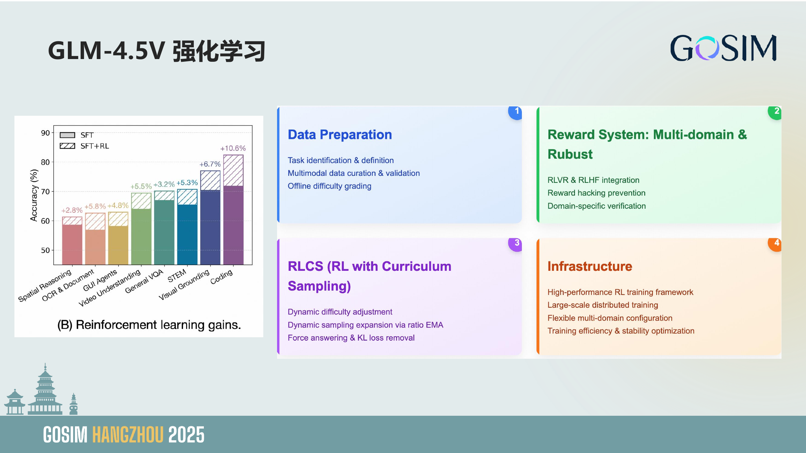

VLM을 위한 RL 페이지는 멀티모달도 RL에 들어가야 함을 보여준다. GUI, grounding, OCR 같은 작업은 검증 가능한 피드백이 있어 RL 또는 rejection sampling을 하기에 적합하다: 박스 선택이 맞는지, 버튼을 올바르게 눌렀는지, OCR이 정확한지가 모두 reward 또는 verifier로 구성될 수 있다.

어려운 점은 rollout 샘플이 더 이상 token 시퀀스만이 아니라 이미지 입력, 영역 위치, 환경 피드백도 포함한다는 것이다. 학습 시스템이 저장해야 하는 것은 `input_ids`와 `response_mask`만이 아니라, 시각 입력의 인덱스, processor 파라미터, 스크린샷 상태, 액션 실행 결과도 포함한다. 그렇지 않으면 reward가 해당 token으로 정확하게 돌아가기 어렵다.

#### Slide 27: GUI Agents와 CogAgent

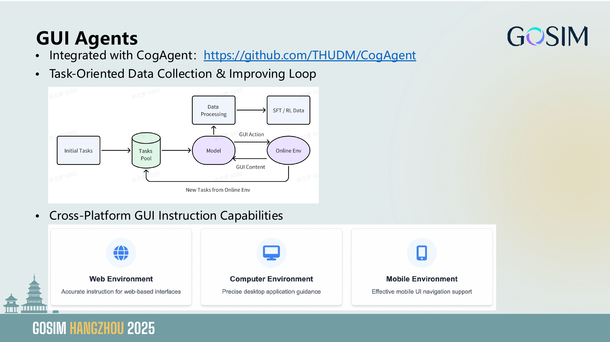

GUI Agents와 CogAgent 페이지는 VLM을 실제 환경 조작으로 밀어낸다. slide에서 integrated with CogAgent, task-oriented data collection & improving loop, cross-platform GUI instruction capabilities를 언급한다. 즉, 모델이 스크린샷을 보고 질문에 답하는 것이 아니라 실제 UI에서 작업을 완수해야 한다.

학습 프레임워크는 다중 턴, 스크린샷 입력, 액션 출력, 환경 상태를 지원해야 한다. 이는 agentic RL의 시스템 요구와 일치한다: 액션을 생성하고, 액션을 실행하고, 인터페이스 변화를 관찰하고, 다음 단계를 생성한다. GUI 데이터는 플랫폼 차이도 가져온다. 예를 들어 Web, 모바일, 데스크톱 소프트웨어의 컨트롤 체계가 달라 일반 VQA 데이터로 처리할 수 없다.

#### Slide 28: 오픈소스 생태

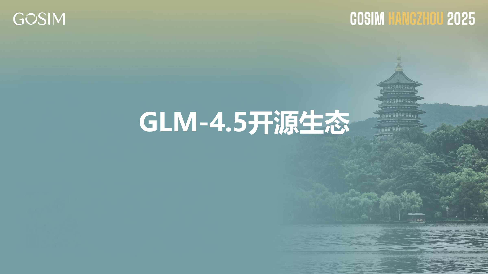

오픈소스 생태 페이지는 세 번째 부분의 시작이다. 앞에서는 모델 능력과 학습을 다루었고, 여기서는 모델이 커뮤니티에서 어떻게 사용되는지로 전환된다: 가중치, 코드, 데모, 문서, 프레임워크 적응, issue/PR, 기술 활동이 모두 adoption에 영향을 미친다.

GLM-4.5 규모의 모델에서 생태 적응은 사용자가 실제로 실행할 수 있는지를 종종 결정한다. 모델이 클수록 사용자가 기존 serving 프레임워크, 양자화 방안, 추론 문서, 모델 변환 스크립트에 더 의존하며, 하나의 환경이 빠지면 사용 문턱이 눈에 띄게 높아진다.

이것이 이 글에서 slime을 코드 분해 부분에 놓은 이유이기도 하다. 모델 생태는 발표 스크린샷으로 끝나는 것이 아니라, 학습 시스템, rollout 시스템, 추론 백엔드, 오픈소스 프레임워크가 함께 모델을 사용 가능한 엔지니어링 자산으로 만든다.

#### Slide 29: 생태 지도

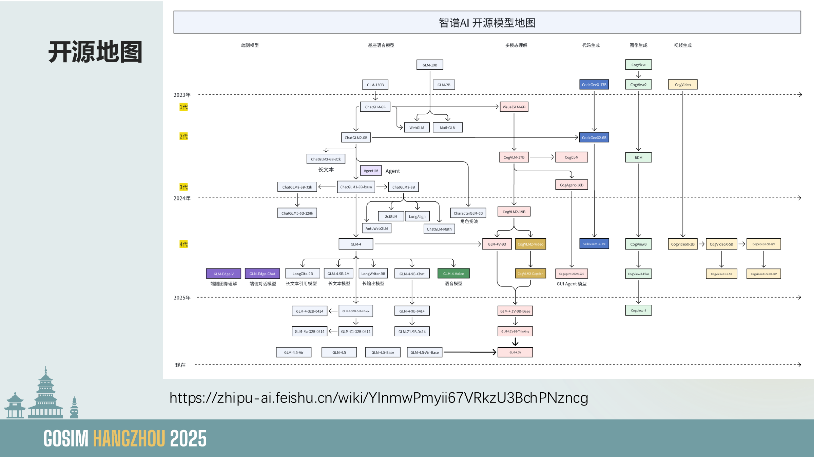

생태 지도 페이지는 주변 프로젝트와 문서 입구를 보여준다. 모델 저장소에서 "하나의 탐색 가능한 생태"로 확장하는 역할을 한다: 모델 저장소, 기술 보고서, 학습 프레임워크, 추론 프레임워크, 커뮤니티 튜토리얼이 모두 지도에 위치한다.

infra 독자 관점에서 중요한 것은 slime, SGLang, Megatron, serving 프레임워크 사이의 연결 방식이다. 학습, rollout, 가중치 형식, 추론 설정에는 모두 명확한 위치가 있어야 한다. 그렇지 않으면 생태 지도가 링크 모음이 되고 재현 가능한 경로가 아니게 된다.

#### Slide 30: HuggingFace 트렌딩

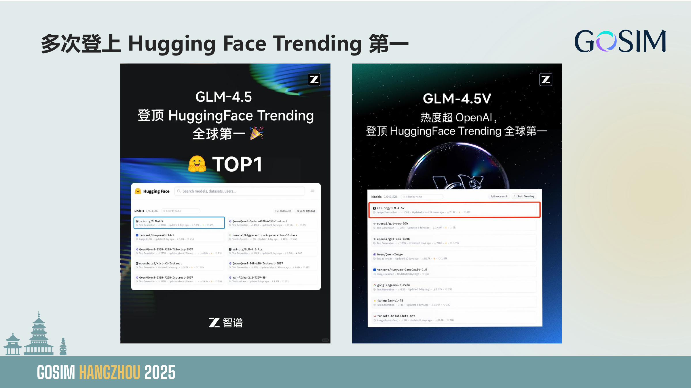

HF 트렌딩 페이지는 발표 후 커뮤니티 반응을 보여준다. HuggingFace Trending이 기술 평가를 대체할 수는 없지만, 모델 자산이 실제 사용자에게 시험되고 있음을 보여준다. 다운로드, 재현, issue 보고가 많을수록 프레임워크 호환성 문제가 더 빨리 드러난다.

오픈소스 모델의 열기는 역으로 추론 프레임워크, 양자화 방안, 학습 시스템의 호환성 완비를 촉진한다. 예를 들어 tokenizer 특수 token, MoE 가중치 이름, VLM processor 필드, SGLang/vLLM 파라미터가 모두 커뮤니티 사용에서 지속적으로 수정될 수 있다.

#### Slide 31: 프레임워크 채택 현황

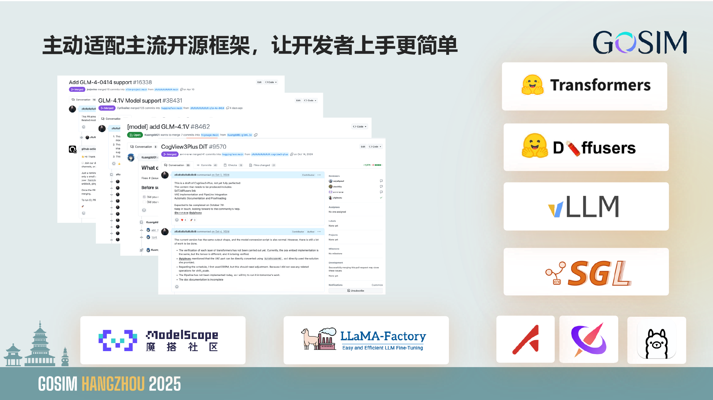

프레임워크 채택 현황 페이지는 주요 오픈소스 프레임워크에 대한 능동적 적응을 보여준다. 여기에는 최소한 Transformers, PEFT, Accelerate, Diffusers 같은 기반 라이브러리와 vLLM/SGLang 같은 serving 프레임워크가 포함된다. 개발자 관점에서 익숙한 프레임워크로 로드하고 배포할 수 있는지가 논문 점수보다 시작에 더 큰 영향을 미친다.

대형 모델 오픈소스가 단일 스크립트에서만 실행 가능하면 전파가 훨씬 느려진다. 진정으로 사용 가능한 오픈소스는 서로 다른 serving과 학습 도구가 모두 명확한 연결 경로를 가져야 한다. GLM-4.5 같은 MoE/긴 컨텍스트 모델은 특히 프레임워크 측 적응이 필요하며, 그렇지 않으면 고성능 추론과 다중 카드 배포가 모델 로드 단계에서 막히게 된다.

#### Slide 32: 오픈소스 프로세스

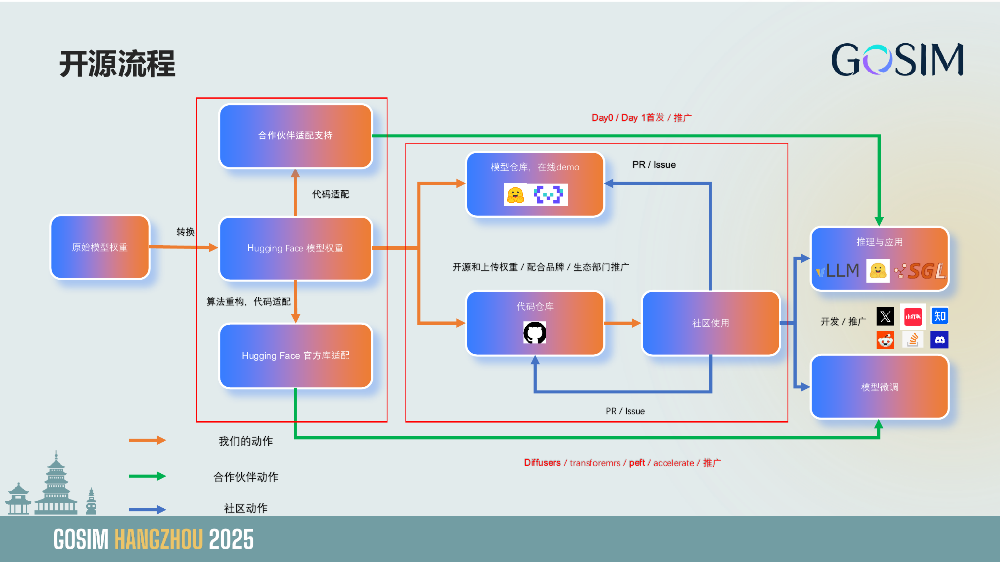

오픈소스 프로세스 페이지는 다자 협력을 그렸다: 원본 모델 가중치가 HuggingFace 가중치로 변환되고, 알고리즘 재구성과 코드 적응이 코드 저장소에 들어가며, 파트너가 적응 지원을 하고, 커뮤니티가 PR/Issue를 통해 피드백하며, 최종적으로 추론 및 애플리케이션, 모델 파인튜닝, 브랜드 및 생태 홍보로 이어진다.

다른 사람의 시간을 진정으로 절약하는 것은 명확한 가중치 형식, 추론 설정, 학습 recipe, 알려진 제약사항을 명확히 하는 것이다. 모델 발표 후, 프레임워크 적응, 문서 수정, 커뮤니티 피드백이 계속해서 사용 가능성을 변화시킨다. 이 프로세스가 GLM-4.5의 오픈소스 생태를 왜 slime/SGLang과 함께 봐야 하는지 설명한다: 학습과 추론 체인 모두 지속적인 유지 관리가 필요하다.

#### Slide 33: 커뮤니티 피드백

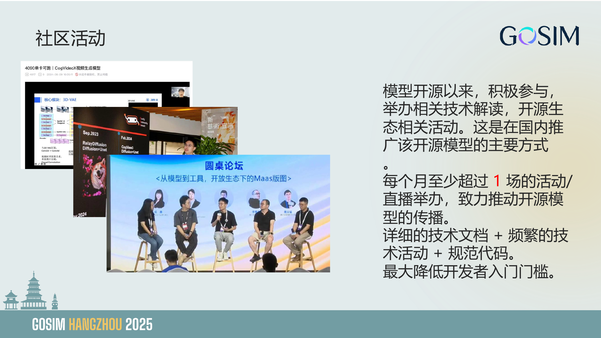

커뮤니티 피드백 페이지는 기술 해설, 오픈소스 생태 활동, 문서를 강조한다. slide에서 매달 최소 한 번 이상의 활동/라이브 방송을 목표로 하며, 개발자의 진입 문턱을 낮추는 것이 목표라고 언급한다. 대형 모델에서 문서와 활동은 홍보 부속품이 아니라 생태 유지의 일부다.

많은 사용자가 만나는 문제는 모델 능력이 부족해서가 아니라 "어떻게 배포하는지", "어떻게 도구를 연결하는지", "어떻게 긴 컨텍스트를 열 수 있는지", "왜 메모리가 터지는지"이다. 빈번한 기술 활동과 issue 피드백으로 이런 문제들이 더 빠르게 문서, 스크립트, 프레임워크 패치로 침전될 수 있다.

#### Slide 34: 논문과 기술 커뮤니티

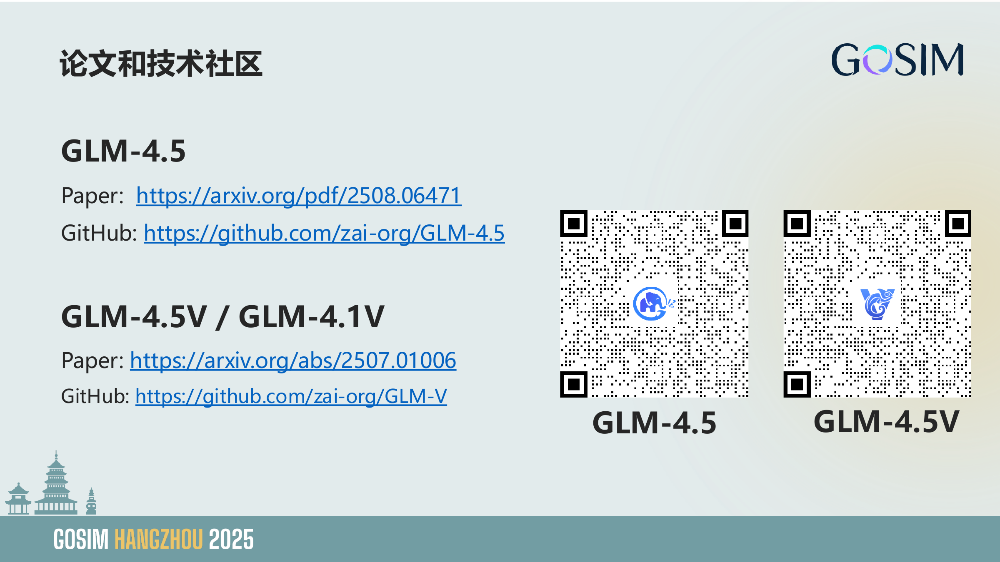

논문과 기술 커뮤니티 페이지는 입구를 제공한다: GLM-4.5 paper, GLM-4.5 GitHub, GLM-4.5V/GLM-4.1V paper, GLM-V GitHub. 독자가 모델 구조, benchmark, processor, 추론 예시를 확인하려면 이것들이 1차 자료다.

코드 해설에 slime을 선택한 것은 GLM-4.5 RL 학습과 가장 직접적인 관계가 있기 때문이다. 모델 구조와 능력 세부사항은 공식 GLM-4.5/GLM-V 저장소로 돌아가 확인한다. 이렇게 하면 "능력 해설"과 "시스템 구현"을 분리하여, 스크린샷의 발표 정보를 장기적으로 안정적인 사실로 오인하는 것을 피할 수 있다.

#### Slide 35: 마무리 페이지

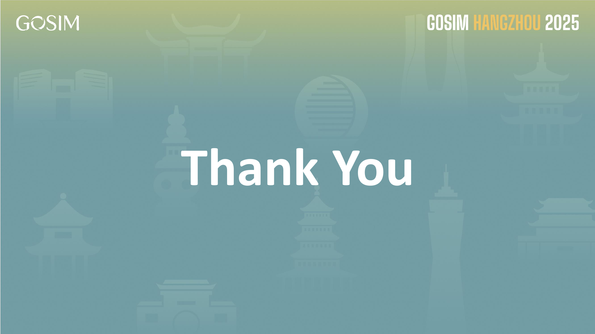

마무리 페이지. GLM-4.5의 기술 세부사항은 계속 변화할 것이며, 블로그에서는 현재 공개 소스 코드로 검증할 수 있는 학습 시스템 경로에 더 초점을 맞춘다.

## 0x3. 핵심 코드 분해

slime README는 아키텍처를 직접 제시한다: training은 Megatron 사용, rollout은 SGLang + router 사용, 중간에 data buffer. 코드에서 `SGLangEngine`은 SGLang server에 대한 Ray actor 래퍼다.

시작 시 slime은 SGLang `ServerArgs`를 구성하고, HTTP server를 기동하며, worker를 router에 등록한다:

```python
self.process = launch_server_process(ServerArgs(**server_args_dict))

payload = {
    "url": f"http://{self.server_host}:{self.server_port}",
    "worker_type": self.worker_type,
}
if self.worker_type == "prefill":
    payload["bootstrap_port"] = server_args_dict["disaggregation_bootstrap_port"]
requests.post(f"http://{self.router_ip}:{self.router_port}/workers", json=payload)
```

학습-추론 일체형 시, rollout engine은 메모리를 해제할 수 있어야 한다. slime은 SGLang의 인터페이스를 직접 호출한다:

```python
def release_memory_occupation(self):
    self.flush_cache()
    return self._make_request("release_memory_occupation")

def resume_memory_occupation(self, tags: list[str] = None):
    return self._make_request(
        "resume_memory_occupation",
        {"tags": tags},
    )
```

가중치 동기화는 tensor와 distributed 두 가지 경로가 있다:

```python
def update_weights_from_tensor(self, serialized_named_tensors, load_format=None,
                               flush_cache=False, weight_version=None):
    payload = {
        "serialized_named_tensors": serialized_named_tensors,
        "load_format": load_format,
        "flush_cache": flush_cache,
    }
    if weight_version is not None:
        payload["weight_version"] = weight_version
    return self._make_request("update_weights_from_tensor", payload)
```

```python
def update_weights_from_distributed(self, names, dtypes, shapes, group_name,
                                    flush_cache=False, weight_version=None):
    payload = {
        "names": names,
        "dtypes": [str(dtype).replace("torch.", "") for dtype in dtypes],
        "shapes": shapes,
        "group_name": group_name,
        "flush_cache": flush_cache,
    }
    return self._make_request("update_weights_from_distributed", payload)
```

`rollout.py`의 `ServerGroup`은 SGLang engine의 생명주기를 담당한다. server actor에 memory saver 관련 환경 변수를 주입한다는 점에 주목한다:

```python
env_vars = {name: "1" for name in NOSET_VISIBLE_DEVICES_ENV_VARS_LIST} | {
    "SGLANG_MEMORY_SAVER_CUDA_GRAPH": "true",
    "SGLANG_JIT_DEEPGEMM_PRECOMPILE": "true",
    "SGLANG_ENABLE_STRICT_MEM_CHECK_DURING_IDLE": "false",
}
```

colocate 학습을 위한 offload/onload:

```python
def offload(self):
    if not self.needs_offload:
        return []
    return [engine.release_memory_occupation.remote()
            for engine in self.engines if engine is not None]

def onload(self, tags: list[str] | None = None):
    if not self.needs_offload:
        return []
    return [engine.resume_memory_occupation.remote(tags=tags)
            for engine in self.engines if engine is not None]
```

이것은 GLM-4.5 slides의 RL 생태와 대응된다: 모델 능력 뒤에는 Megatron 학습, SGLang rollout, router, data buffer를 조직하는 시스템이 필요하다.

## 0x4. 소결

GLM-4.5 이 글의 소스 코드 중점은 모델 레이어 내부가 아니라 오픈소스 생태의 학습 시스템이다. slime은 Megatron과 SGLang을 연결하여 rollout, 메모리 offload, 가중치 업데이트, partial rollout 등의 능력을 제공하고, 대형 모델 RL이 데모에서 대규모 학습으로 나아가는 것을 지원한다.
