# GOSIM Hangzhou 기술 회고 해설 - Industrializing Continuous Learning

> Continuous learning은 "model을 한 번 더 training하는 것"과 같지 않다. 정말 까다로운 것은 data, retraining, evaluation, serving validation, adapter release가 반복 가능한 하나의 chain으로 이어져야 한다는 점이다.

## 0x0. 서문

이 글은 model inference와 그렇게 직접적인 관계는 없지만, 또 다른 production problem을 보완한다. Model capability는 한 번 training했다고 평생 결정되는 것이 아니다. 특히 function calling처럼 protocol 변화가 빠른 task에서는 data를 계속 수집하고, adapter를 retrain하고, evaluation하고, online release해야 한다.

## 0x1. 자료와 코드 위치

Code locations:

- retrain-pipelines: `pkg_src/retrain_pipelines/dag_engine/core/core.py`, DAG Task, TaskGroup, trace capture.
- retrain-pipelines: `sample_pipelines/dag_engine/example_wf_7.py`, parallel task, taskgroup, merge function example.
- retrain-pipelines: `sample_pipelines/Unsloth_Qwen_FuncCall/legacy/retraining_pipeline.py`, Unsloth/PEFT function-calling adapter training pipeline.
- retrain-pipelines: `pkg_src/retrain_pipelines/model/mf_unsloth_func_call_litserve/litserve/litserve_server.py`, `UnslothLitAPI` implements multi-adapter single endpoint serving.
- retrain-pipelines: `pkg_src/retrain_pipelines/model/mf_unsloth_func_call_litserve/eval.py`, function calling evaluation parsing and metrics.

## 0x2. Slides 페이지별 해설

#### Slide 1: Industrializing Continuous Learning

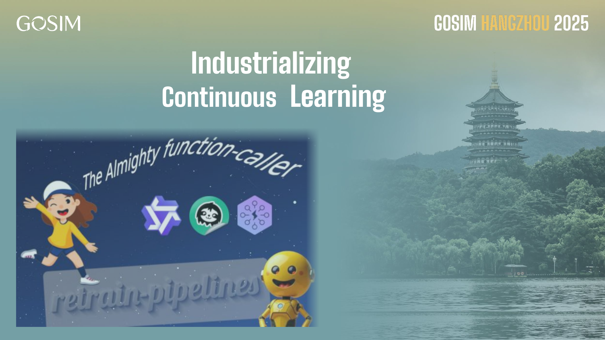

Title page에는 주제만 있다. Industrializing Continuous Learning. 여기서 continuous learning은 online learning algorithm 자체가 아니라, industrial environment에서 continuous retraining, evaluation, serving validation, artifact record, adapter release까지 닫힌 loop를 만드는 것이다.

이 글은 LLM serving과의 관계가 AI Gateway 글만큼 직접적이지는 않다. 하지만 또 다른 production problem을 보완한다. Model capability는 tool schema, API shape, business data 변화에 따라 계속 바뀐다. Function-calling task는 특히 data, training, evaluation, serving validation을 연결해야 한다.

#### Slide 2: 목차: retraining framework


이 페이지는 contents page이며 retraining framework를 첫 부분에 둔다. 이는 뒤에서 단일 training script가 아니라 continuous learning pipeline을 이야기한다는 점을 암시한다. Data, training, evaluation, serving validation, artifact tracking을 모두 process에 포함해야 한다.

#### Slide 3: 목차: retrain-pipelines와 function calling

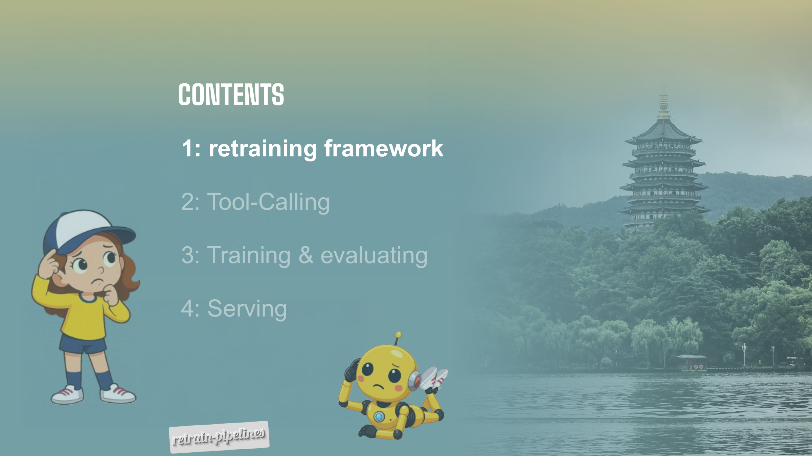

이 페이지도 contents page이며 Tool-Calling Task와 Training/Evaluating을 연결한다. 이 case는 좋다. Data construction, LoRA/adapter training, function calling evaluation, serving validation을 동시에 포함하기 때문이다. Continuous learning에 engineering loop가 필요한 이유를 잘 보여준다.

#### Slide 4: pip-installable sandbox/production environment

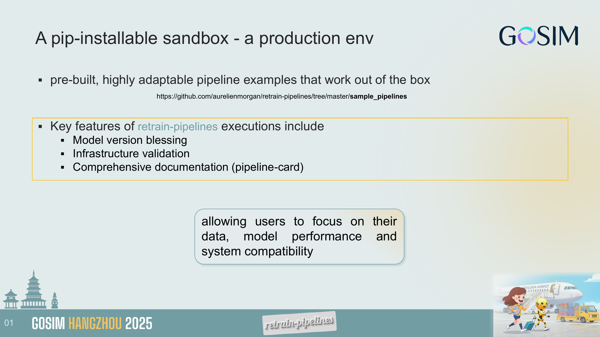

pip-installable environment page는 low barrier와 portability를 강조한다. Slide에는 pre-built, highly adaptable pipeline examples가 있어 out of the box로 사용할 수 있다고 쓰여 있다. 아래에는 retrain-pipelines execution의 핵심 feature가 나열된다. Model version blessing, infrastructure validation, comprehensive documentation, 즉 pipeline-card다.

Continuous learning이 소수 expert의 machine에서만 실행될 수 있다면 daily iteration으로 들어가기 어렵다. Sandbox와 production environment separation은 accidental release를 줄인다. Pipeline-card는 이번 training에서 사용한 data, model, evaluation, artifact를 고정해 이후 release와 rollback 근거를 제공한다.

#### Slide 5: Notebook, CLI, Python launch

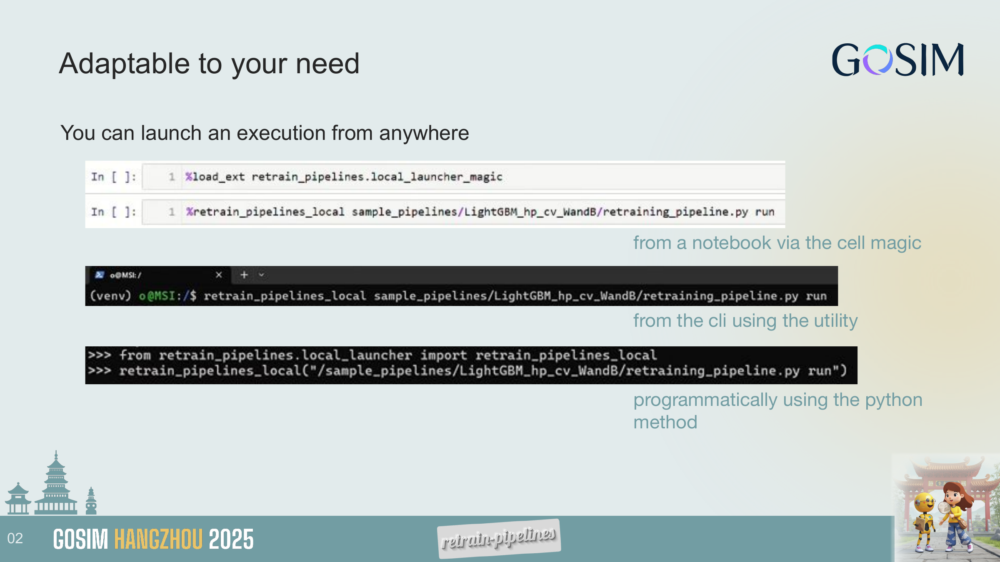

Launch method는 notebook cell magic, CLI utility, Python method를 포함한다. Slide 오른쪽 세 줄은 같은 pipeline이 특정 entry에 묶이지 않고 exploration environment, command line, production script에서 시작할 수 있음을 강조한다.

Team 관점에서 이런 entry design은 자연스럽다. Researcher는 notebook에서 data와 prompt template을 실험하고, engineering 후 CLI나 script로 CI/CD에 넣으며, platform side도 Python API로 programmatically trigger할 수 있다. Entry는 달라도 artifact와 execution record는 동일한 retrain-pipelines management에 들어가야 한다.

#### Slide 6: Internal DAG Engine

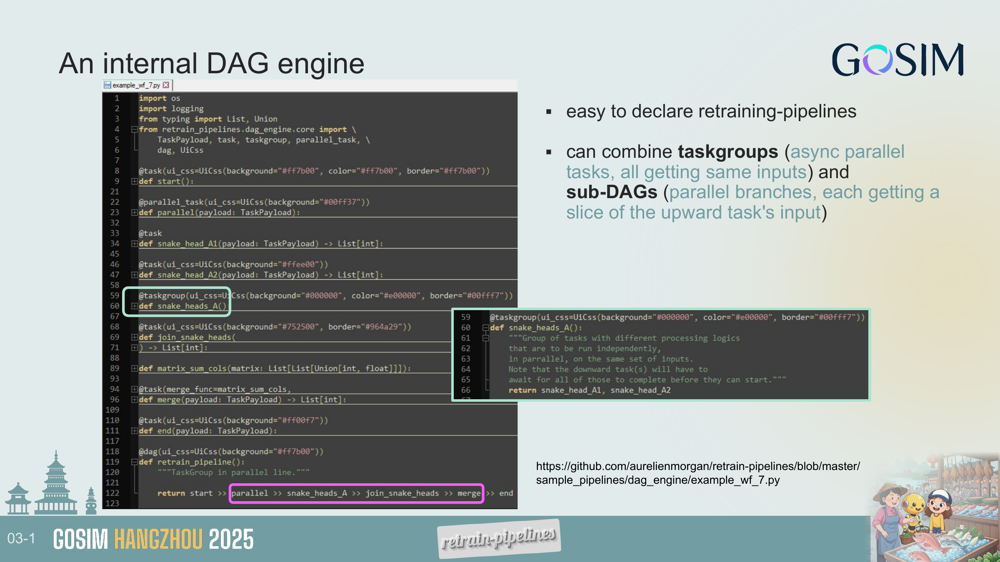

Internal DAG engine은 retrain-pipelines의 core다. 왼쪽 code에서 `task`, `taskgroup`, `parallel_task`, `dag` decorator를 볼 수 있다. 아래의 `start >> parallel >> snake_heads_A >> join_snake_heads >> merge >> end` line은 Python으로 DAG를 표현하는 것이다. 오른쪽 작은 글자는 두 가지를 강조한다. Pipeline declaration은 simple해야 하고, 동시에 taskgroups와 sub-DAGs를 compose할 수 있어야 한다.

여기서 taskgroup과 sub-DAG의 차이도 slide에 적혀 있다. Taskgroup은 같은 input을 받는 asynchronous parallel task group이다. Sub-DAG는 parallel branch이며, 각 branch는 upstream task input의 일부를 받는다. Continuous learning에서 흔한 "같은 data로 여러 training config를 실행"하는 경우와 "data를 shard해 parallel processing"하는 경우는 각각 이 두 pattern에 대응한다.

#### Slide 7: TaskGroup, sub-DAG, parallel branches

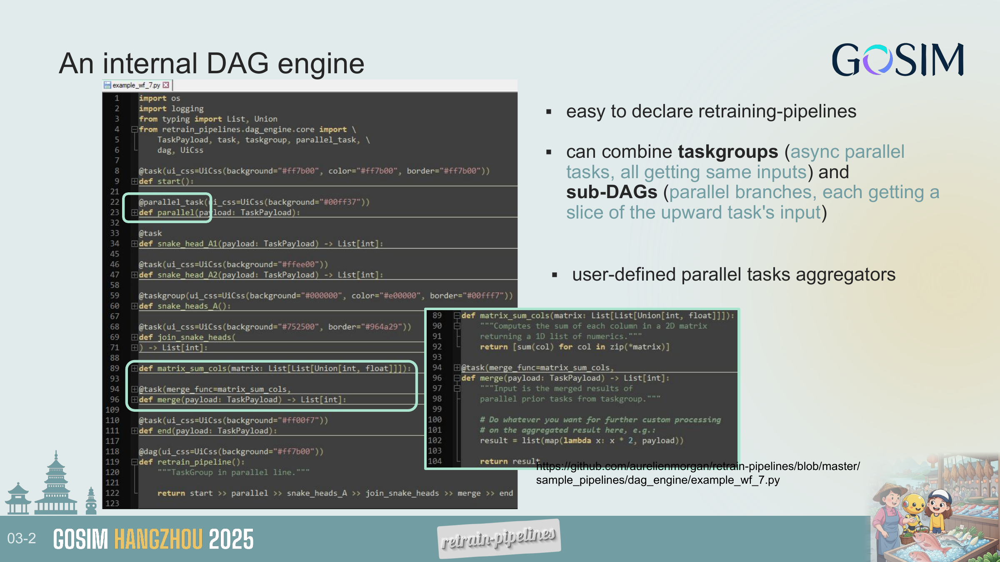

이 페이지는 `@parallel_task`와 `@taskgroup`을 확대한다. `parallel(payload: TaskPayload)`는 parallel task entry를 나타낸다. `snake_heads_A()` taskgroup은 `snake_head_A1, snake_head_A2`를 반환하며, comment에는 독립적으로 parallel하게 실행할 수 있는 task group이고 같은 input을 받으며 downstream task는 모두 끝난 뒤 시작한다고 명확히 쓰여 있다.

Model iteration에 대응하면 taskgroup은 두 LoRA config를 동시에 train하거나, 두 data cleaning/evaluation을 동시에 실행하는 데 사용할 수 있다. Sub-DAG는 data shard를 각각 처리하는 데 적합하다. DAG engine이 해결하는 것은 "여러 process를 띄울 수 있는가"가 아니라 upstream input, downstream waiting, failure recovery, artifact archive의 관계다.

#### Slide 8: Aggregator and merge function

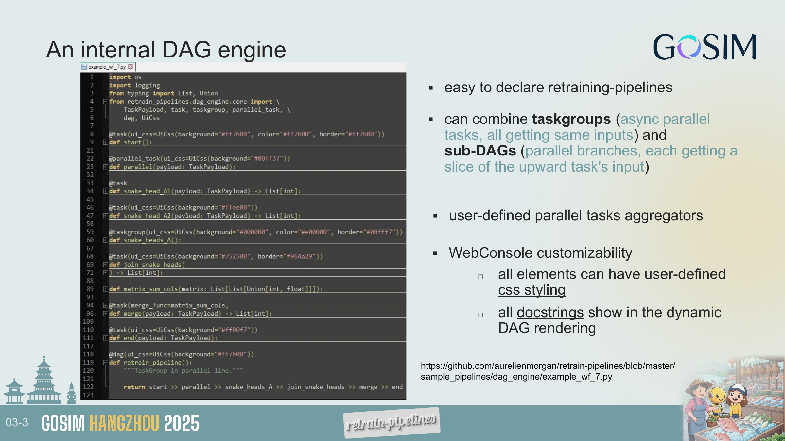

Aggregator와 merge function은 parallel branch result를 converge하는 데 사용된다. 그림의 `matrix_sum_cols`는 aggregation function으로, input은 2D matrix이고 return은 각 column sum list다. 아래의 `@task(merge_func=matrix_sum_cols)`는 `merge` node가 여러 parallel upstream task result를 받고, 먼저 merge function으로 aggregate한 뒤 custom processing을 계속한다는 뜻이다.

이 design은 retraining pipeline에 적합하다. 여러 training branch는 서로 다른 metrics, checkpoint, log를 생성한다. Merge node는 model selection, summary report generation, serving validation 진입 여부 결정을 수행할 수 있다. 이 node가 없으면 parallel은 task를 흩어 실행할 뿐이고, 이후 model release는 여전히 사람이 정리해야 한다.

#### Slide 9: WebConsole

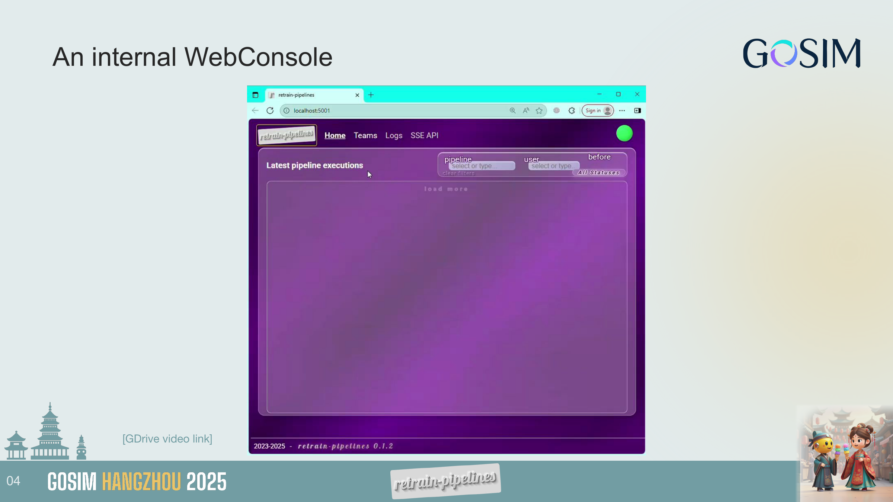

WebConsole page는 runtime visualization entry를 보여준다. 앞에서는 DAG declaration을 설명했고, 이 페이지는 runtime observation을 보완한다. Task list, DAG graph, logs, status, possible Gantt timeline을 한곳에서 볼 수 있다.

Continuous learning에는 observability가 매우 필요하다. 그렇지 않으면 failure 후 scattered log를 뒤져야 한다. 예를 들어 어떤 training branch metric이 abnormal하면 WebConsole로 어떤 data processing, parameter set, evaluation run에서 문제가 났는지 빠르게 찾을 수 있다. Final adapter score drop만 보는 것이 아니다.

#### Slide 10: Team Collaboration

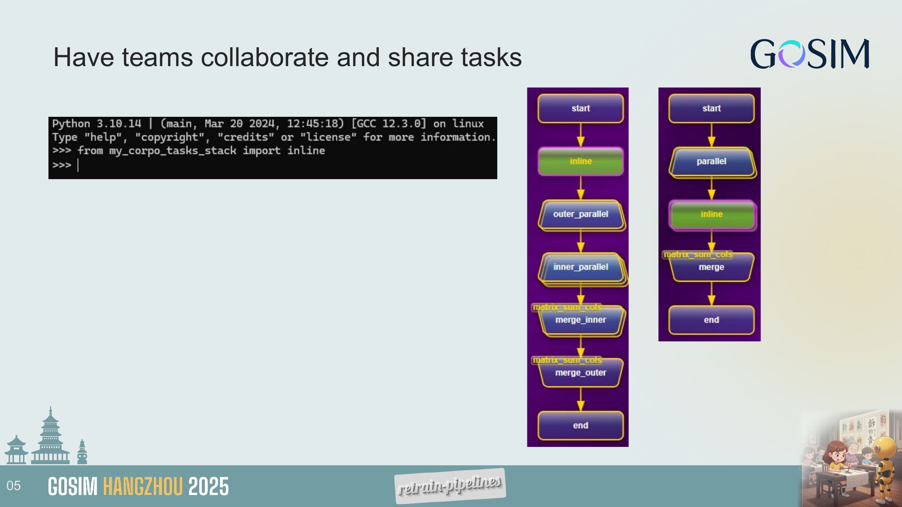

Team collaboration page는 share tasks를 강조한다. Model iteration은 single-machine script에 머물 수 없다. 특히 production release가 관련될 때 data, training, evaluation, serving engineer가 같은 pipeline state를 볼 수 있어야 한다.

이런 collaboration은 단순한 "shared folder"가 아니다. 각 execution의 input data, training config, artifact, evaluation result, pipeline-card가 unified index를 가져야 한다. 그렇지 않으면 function-calling adapter가 regression을 일으켰을 때 data가 바뀐 것인지, template이 바뀐 것인지, serving side가 tokenizer를 바꾸지 않은 것인지 알기 어렵다.

#### Slide 11: Pipeline card

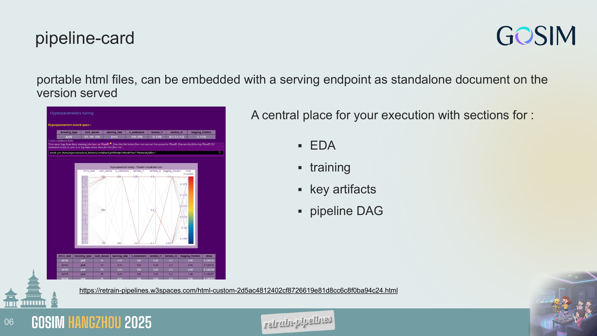

Pipeline card는 이 system의 core artifact 중 하나다. Slide는 portable html files이며, serving endpoint와 함께 현재 service version의 standalone document로 사용할 수 있다고 말한다. 오른쪽은 네 section을 나열한다. EDA, training, key artifacts, pipeline DAG다.

이는 "이번 model이 어떻게 만들어졌는가"를 해결한다. Function-calling adapter가 online으로 release된 뒤 user는 특정 endpoint output이 바뀐 것만 본다. Pipeline-card는 training data, evaluation result, key artifact, DAG path를 하나의 browseable document로 넣어 oral transfer와 post-hoc tracing cost를 줄인다.

#### Slide 12: HuggingFace Hub integration

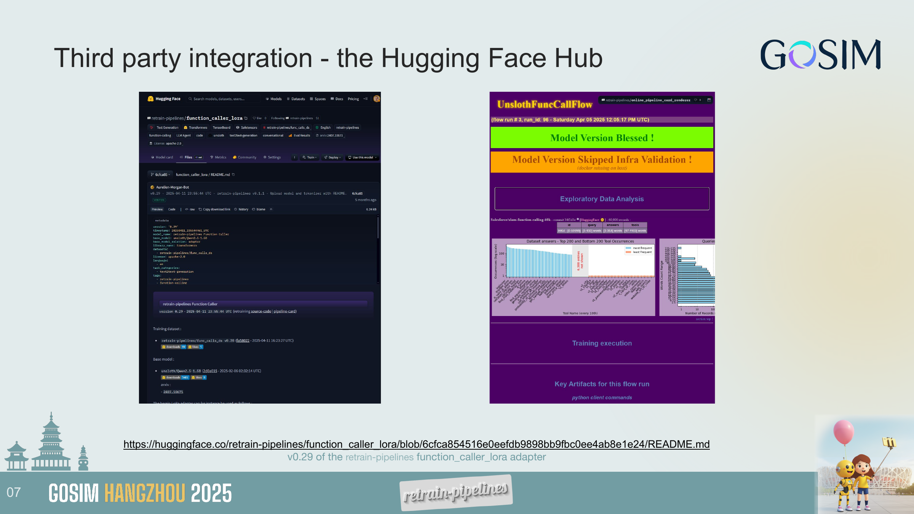

HuggingFace Hub integration page는 retrain-pipelines/function_caller_lora adapter의 README를 보여준다. 이 integration은 adapter, README, evaluation graph, model card, version number를 함께 Hub에 publish할 수 있게 한다.

Function-calling adapter의 경우 base model, adapter, tokenizer/template 모두 traceable해야 한다. LoRA weight만 upload하는 것은 충분하지 않다. Prompt template, tool schema, tokenizer version이 output JSON에 직접 영향을 주기 때문이다. Hub integration의 가치는 이러한 정보를 model asset의 일부로 publish하는 데 있다.

#### Slide 13: Inspector: 빠른 run artifact 확인

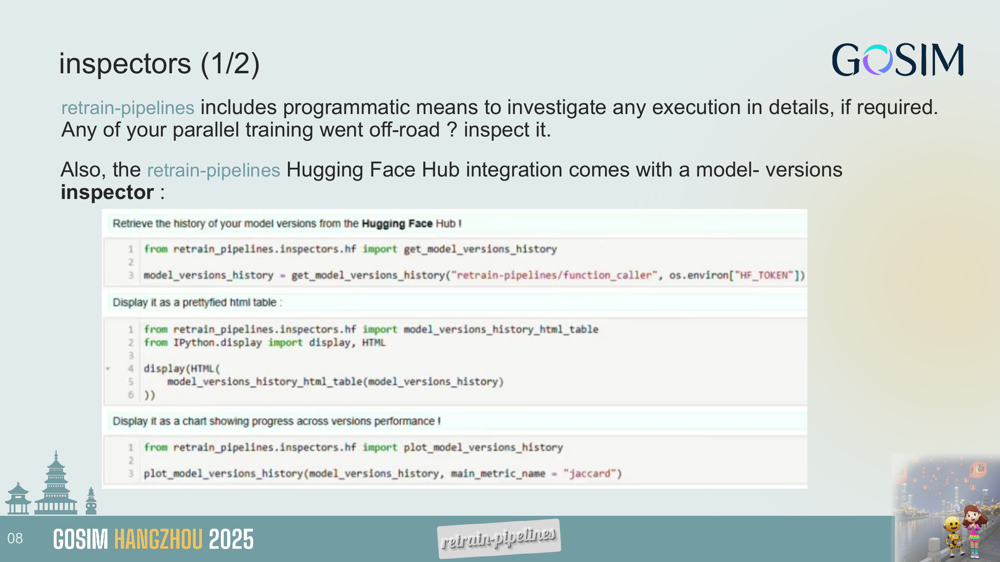

Inspector page는 retrain-pipelines가 arbitrary execution을 investigate할 수 있는 programmatic means를 제공한다고 말한다. Slide의 예는 어떤 parallel training이 "went off-road"했을 때 inspector로 detail을 확인할 수 있다는 것이다. Hub integration에도 model versions inspector가 있다.

이는 continuous learning troubleshooting에 유용하다. Training branch가 많아지면 final score만으로는 problem source를 판단하기 어렵다. Inspector는 run record, artifact, model version, parameter를 가져와 비교함으로써 어떤 branch가 벗어났는지 찾아내는 데 도움을 준다.

#### Slide 14: Inspector: source와 artifact tracing

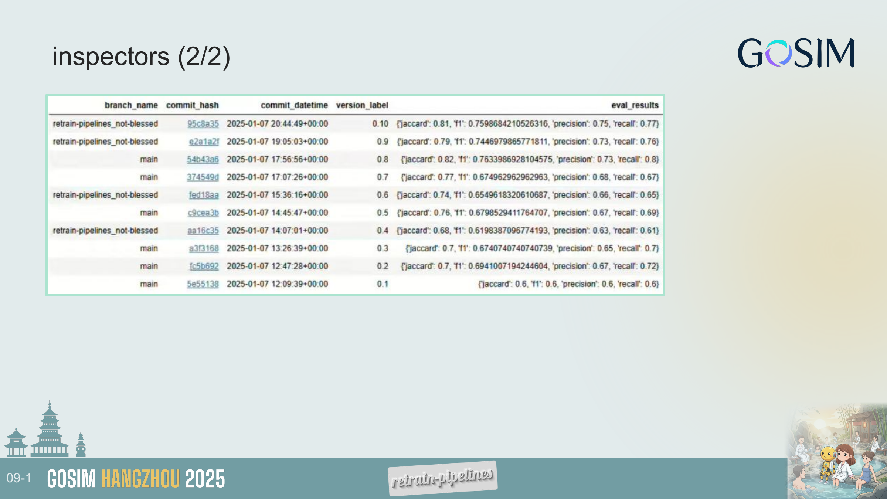

Inspector second part는 tracing capability를 계속 보여준다. 여기서 봐야 할 것은 UI style이 아니라 source, artifact, model version, execution record가 연결되어 있다는 점이다.

Continuous learning에서 어떤 model이 좋아지거나 나빠졌다면 당시 사용한 training code version, data, parameter, adapter revision을 반드시 알아야 한다. 그렇지 않으면 "continuous learning"은 continuous trial-and-error가 되고, result는 reproduce할 수 없다.

#### Slide 15: Inspector: model and data assets

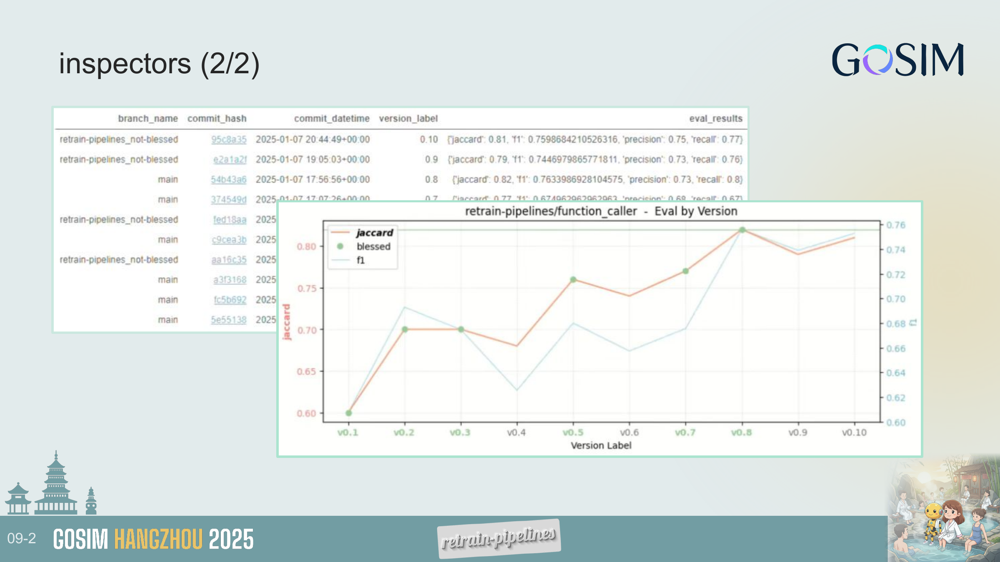

이 slide도 inspector에 속하며, focus는 model과 data asset의 location이다. Retraining run이 끝난 뒤 user는 checkpoint, adapter, metrics, pipeline-card, log, intermediate data가 어디 있는지 알아야 한다.

이런 tool은 training algorithm 자체를 바꾸지는 않는다. 하지만 team communication cost를 줄이고 continuous learning pipeline을 더 쉽게 review할 수 있게 한다. 특히 adapter production environment에서는 특정 version에 해당하는 data와 template을 빠르게 찾는 것이 epoch 하나를 더 train하는 것보다 accident cost를 더 줄인다.

#### Slide 16: 목차: Tool-Calling으로 이동

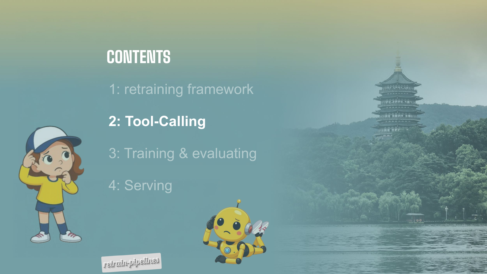

이 페이지는 section transition이다. Retraining framework에서 Tool-Calling으로 이동한다. 앞부분은 pipeline organization을 이야기했고, 다음은 specific task다. Small adapter가 tool calling protocol을 안정적으로 학습하게 하는 것이다.

#### Slide 17: Function calling 현재 상태

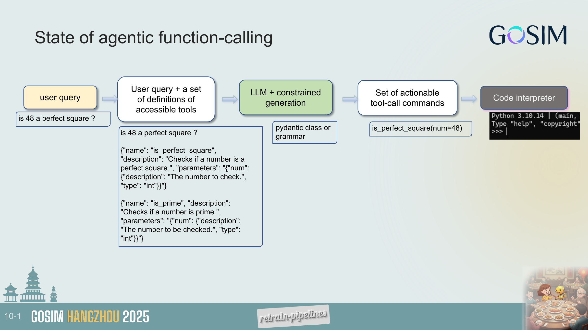

Function calling current state page는 flow를 두 단계로 그린다. 첫 단계는 user query와 accessible tools definitions가 LLM + constrained generation을 거쳐 actionable tool-call command, 예를 들어 `is_perfect_square(num=48)`를 만들고 code interpreter에 전달되는 것이다. 두 번째 단계는 tool-call responses를 context로 LLM에 다시 전달해 final natural language answer를 형성하는 것이다.

Tool-calling model은 네 가지를 배워야 한다. 언제 call할지, 어떤 tool을 call할지, argument JSON을 어떻게 쓸지, 그리고 언제 call하지 않을지다. 뒤의 adapter training과 evaluation은 모두 이 네 가지를 중심으로 한다.

#### Slide 18: Tool calling과 constrained generation

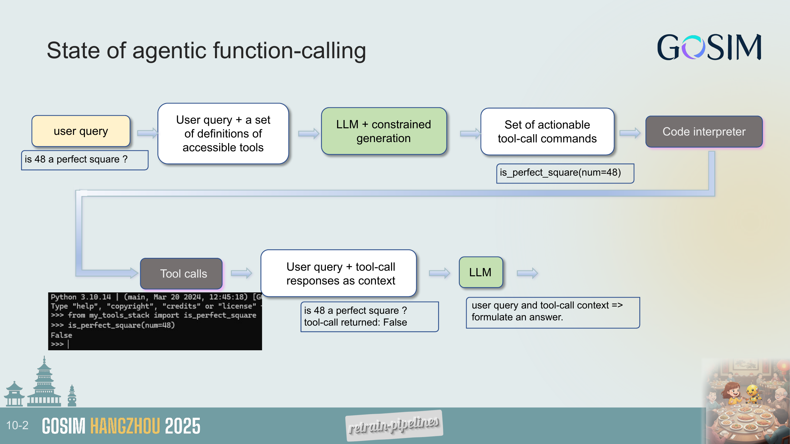

이 slide는 tool calling과 constrained generation을 계속 설명한다. 왼쪽 user question은 "is 48 a perfect square?"이고, accessible tool에는 `is_perfect_square`와 `is_prime`이 있다. 각 tool에는 name, description, parameters가 있다. Model이 output해야 하는 것은 tool call command이지 설명문이 아니다.

Function call은 일반 natural language가 아니다. JSON schema, parameter type, tool name이 모두 constraint나 post-processing을 필요로 한다. Constrained generation은 format error를 줄일 수 있지만, model은 여전히 tool이 적용 가능한지, parameter가 충분한지, multi-turn tool call이 필요한지를 판단해야 한다.

#### Slide 19: Code interpreter와 tool response

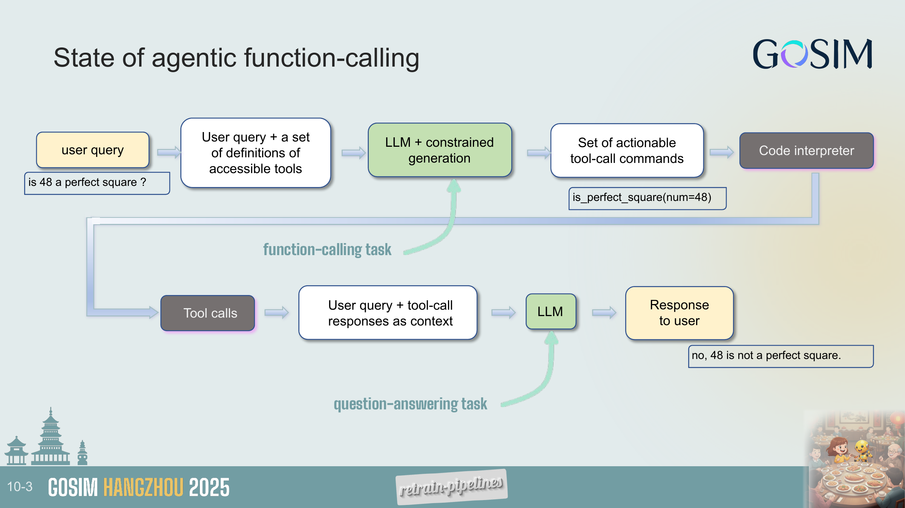

Code interpreter와 tool response page는 task를 complete loop로 확장한다. Tool이 `False`를 반환하면, LLM은 user query와 tool-call context를 결합해 최종적으로 "no, 48 is not a perfect square"라고 답해야 한다. Slide 아래는 이를 function-calling task와 question-answering task로 나눈다.

이는 training data가 tool call 자체만 저장해서는 안 된다는 것을 보여준다. Tool return 이후 final answer도 저장해야 한다. 그렇지 않으면 model이 tool call은 배워도 tool result를 user-readable response로 바꾸는 법은 배우지 못할 수 있다.

#### Slide 20: Completion API와 Responses API

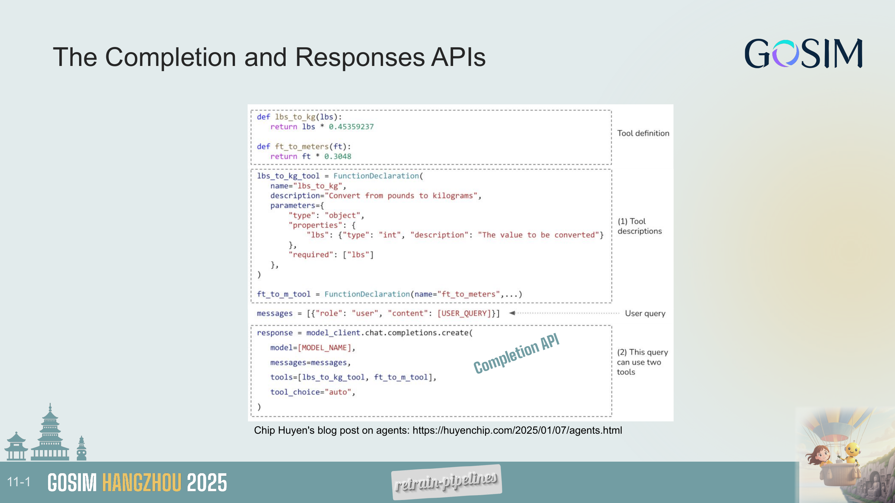

Completion API와 Responses API page는 Chip Huyen의 agents article을 인용한다. Slide 왼쪽은 Completion API, 오른쪽은 Responses API structure다. 오른쪽 small text는 responses API의 return structure가 다르고, tool calls의 identifier와 access method도 다르다고 강조한다.

API shape change는 training data format에 영향을 준다. Adapter가 old template에 bind되어 있으면 serving side upgrade 시 error가 날 수 있다. Function-calling continuous learning에서는 prompt template, tool schema, response parser를 artifact로 관리해야 하며, service code에 흩어져 있으면 안 된다.

#### Slide 21: API shape 변화

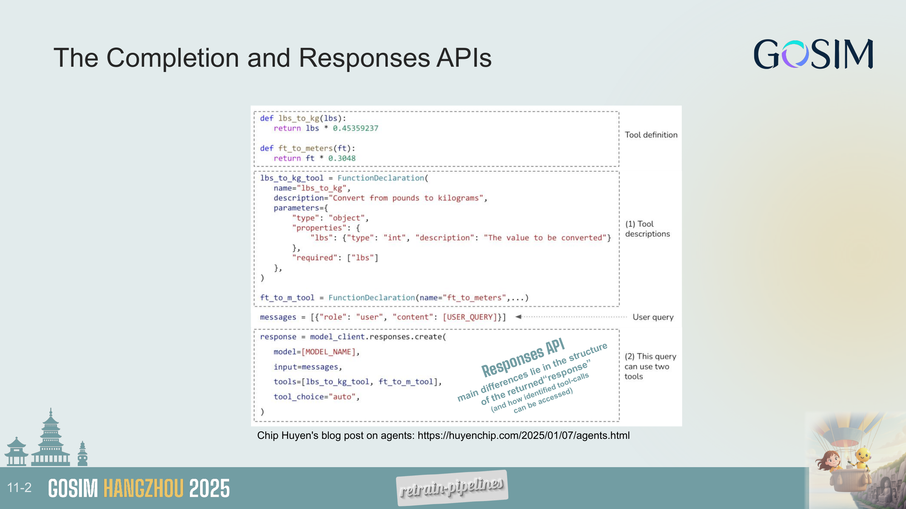

이 페이지는 Responses API의 structure change를 확대한다. Function call은 일반 completion이 아니라, return 안에 tool call id, tool name, arguments, subsequent tool response 같은 structured field가 포함된다는 점을 상기시킨다.

Training pipeline은 prompt template, tool schema, response parser를 artifact로 관리해야 한다. 그렇지 않으면 같은 adapter가 서로 다른 API wrapper 아래에서 다른 input을 받게 되고, evaluation score와 online behavior 모두 drift할 수 있다.

#### Slide 22: Berkeley Function-Calling leaderboard

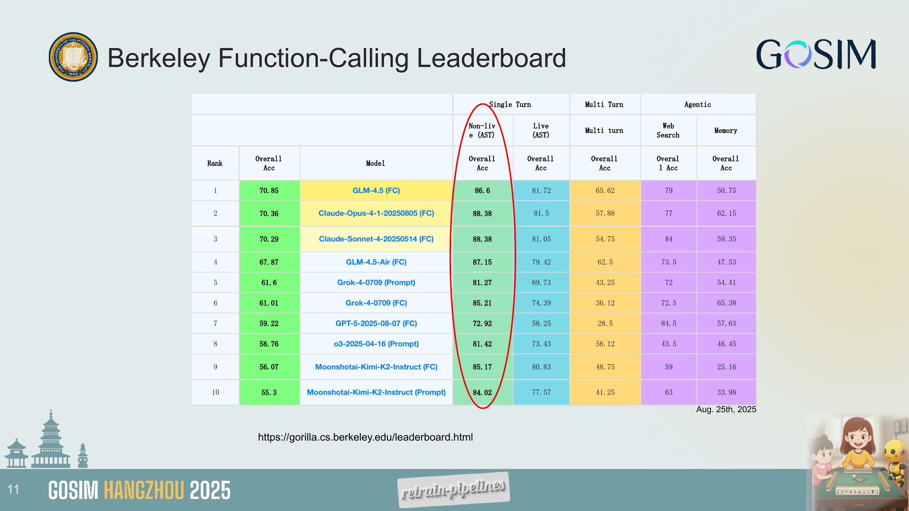

Berkeley Function-Calling leaderboard는 evaluation reference를 제공한다. Table은 Single Turn, Multi Turn, Agentic의 세 capability를 나열하고, 그 안에서 Non-live(AST), Live(AST), Web Search, Memory 등의 sub-item으로 나뉜다. GLM-4.5(FC), Claude, GLM-4.5-Air, Grok, GPT-5, Kimi K2가 한 table에서 비교된다.

Function calling evaluation은 단순 string matching이 아니다. JSON을 parse하고 parameter와 tool selection을 비교해야 한다. Leaderboard는 large model function calling이 이미 independent capability surface가 되었음을 보여준다. 하지만 뒤의 false negative 두 페이지는 evaluation script 자체가 score에 영향을 준다는 점을 상기시킨다. Industrial pipeline은 failed sample을 계속 feedback해야 한다.

#### Slide 23: 목차: Training & evaluating으로 이동

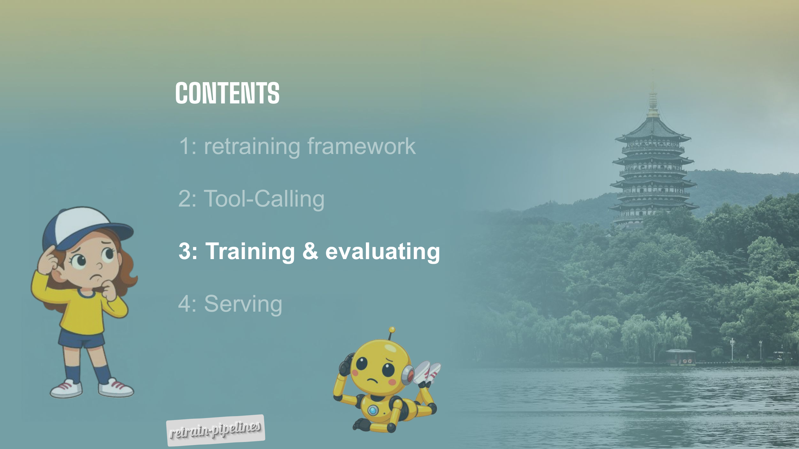

이 페이지도 section transition이며 Training & evaluating으로 들어간다. 앞에서는 function calling의 task shape를 설명했다. 이제 data를 어떻게 construct하고, LoRA adapter를 어떻게 train하며, 실제로 tool calling을 할 수 있는지 어떻게 evaluate하는지 답한다.

#### Slide 24: Function-calling LoRA adapter

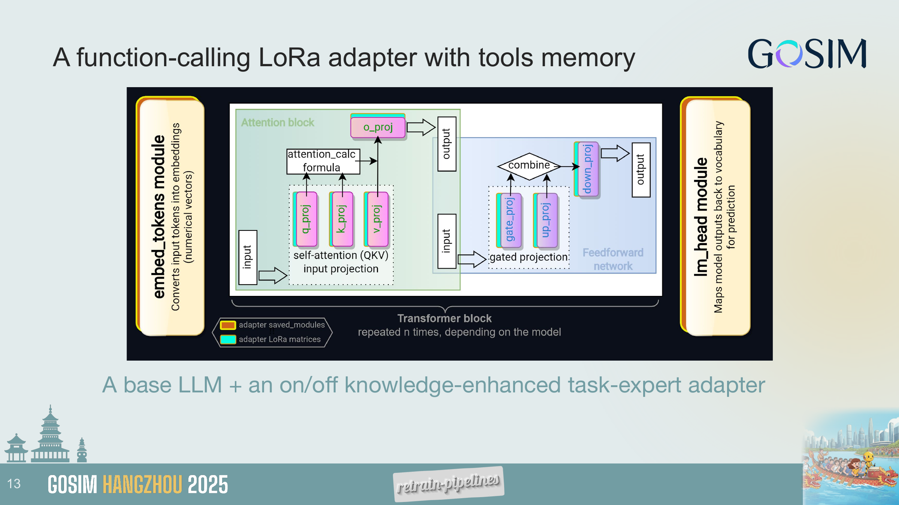

Function-calling LoRA adapter page는 solution을 제시한다. Base LLM에 switchable knowledge-enhanced task-expert adapter를 더한다. 여기서 adapter는 knowledge base 보강이 아니라, 특정 task에서 model이 tool calling protocol을 안정적으로 출력하게 만드는 것이다.

이는 code의 Unsloth + PEFT training에 대응한다. Training 때 tool schema를 prompt에 넣고, adapter가 tool protocol에 맞춰 output하는 법을 배우게 한다. Inference 때는 필요에 따라 adapter를 enable/disable하여 같은 base model을 normal QA와 function-calling expert 사이에서 switch할 수 있다.

#### Slide 25: Dataset과 no-tool-call sample

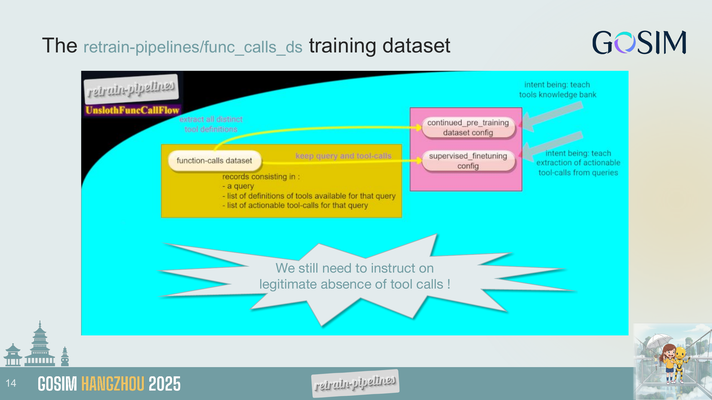

Dataset page는 retrain-pipelines/func_calls_ds를 보여주며 legitimate absence of tool calls를 특별히 강조한다. 이 setting은 function calling에 큰 영향을 준다. 모든 query가 tool을 call해야 하는 것은 아니며, training set에는 "call하지 않는" positive example이 반드시 있어야 한다.

Data가 전부 tool-calling sample이면 model은 "question만 보면 tool을 call"하는 식으로 배운다. Precision이 매우 나빠질 수 있다. No-tool-call sample은 normal greeting, irrelevant question, insufficient information에서 empty call 또는 natural language answer를 반환하는 법을 model에 가르친다.

#### Slide 26: Data augmentation and enrichment

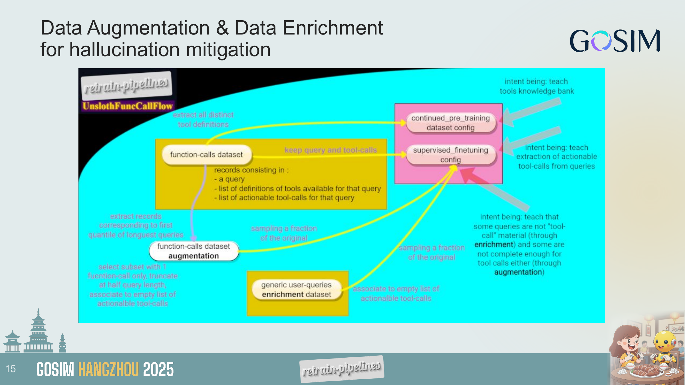

Data augmentation과 enrichment page의 target은 wrong call을 줄이는 것이다. Function calling error는 흔히 세 곳에서 발생한다. 존재하지 않는 tool을 hallucinate하거나, 기존 tool에 잘못된 parameter를 채우거나, tool이 필요 없을 때 억지로 call하는 것이다.

Data augmentation은 더 많은 parameter combination 생성, query rewrite, no-call sample 추가 등을 통해 tool call coverage를 확장할 수 있다. Enrichment는 tool description, negative example, boundary case를 보완할 수 있다. 최종적으로 영향을 받는 것은 adapter의 precision/recall이며, 단순히 training set size만이 아니다.

#### Slide 27: PEFT/Unsloth CPT + SFT

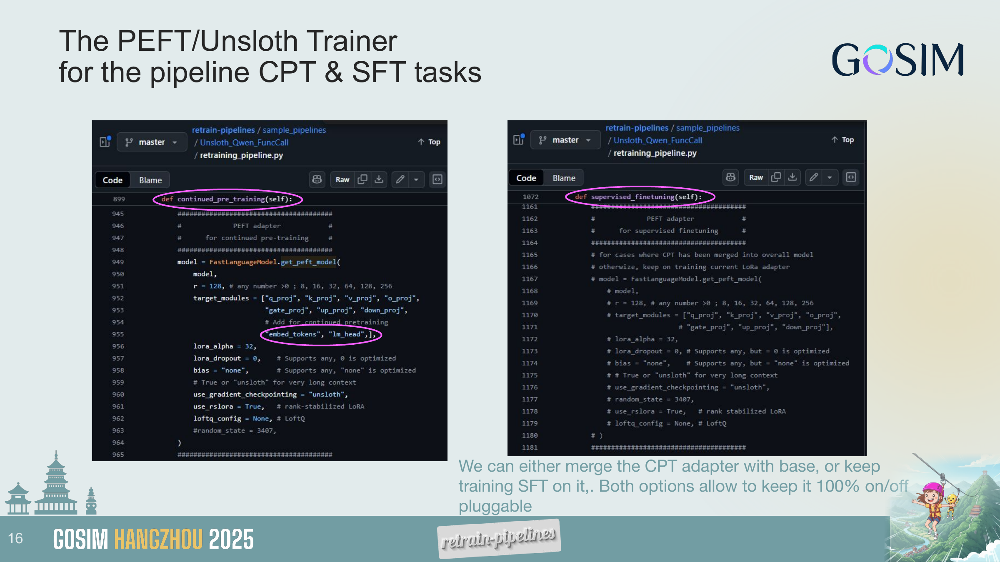

PEFT/Unsloth Trainer page는 pipeline의 CPT와 SFT task에 대응한다. Slide small text는 CPT adapter를 base에 merge할 수도 있고, CPT adapter 위에서 계속 SFT를 train할 수도 있다고 말한다. 두 방식 모두 100% on/off pluggable을 유지한다.

CPT는 먼저 tool format과 domain data에 적응하고, SFT는 specific function call output에 align할 수 있다. Adapter가 pluggable인 상태를 유지하는 것은 중요하다. Serving side가 request에 따라 `func_caller_lora`를 enable할 수 있게 하며, 각 tool expert마다 full base model을 copy할 필요가 없기 때문이다.

#### Slide 28: Evaluation result: 75.5%

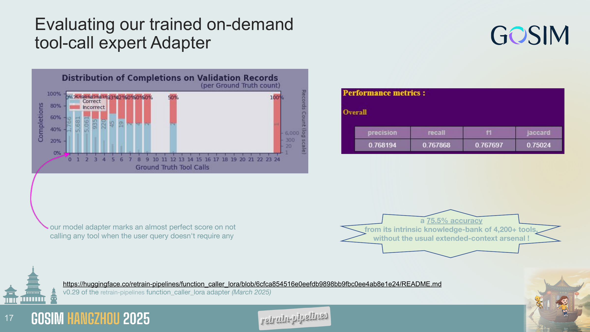

Evaluation page는 trained on-demand tool-call expert adapter의 result를 제시한다. 4200+ tools의 intrinsic knowledge-bank에서 75.5% accuracy에 도달했으며, "tool call이 필요 없는" sample에서는 거의 full score다. Slide는 usual extended-context arsenal에 의존하지 않았다는 점도 강조한다. 즉 큰 tool document를 context에 밀어 넣은 것이 아니다.

더 중요한 것은 뒤의 false negative analysis다. Function calling evaluation은 semantic-equivalent JSON을 쉽게 wrong으로 판단할 수 있기 때문이다. 이 score는 parser, tool parameter equivalence, no-tool sample과 함께 봐야 한다.

#### Slide 29: False negatives type 1

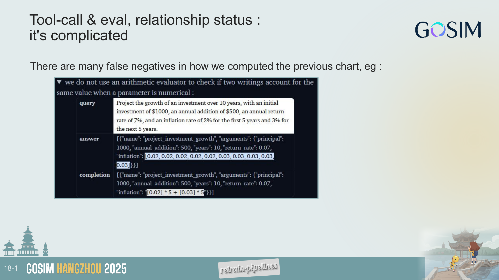

False negatives page title은 "Tool-call & eval, relationship status: it's complicated"라고 쓰여 있다. 이는 앞 페이지의 75.5%가 absolute real capability가 아니며, evaluation script에 false negatives가 많이 있을 수 있음을 상기시킨다.

첫 번째 type은 보통 parameter가 equivalent하지만 format이 다르거나, tool call order가 result에 영향을 주지 않는 경우다. 예를 들어 어떤 parameter는 string 또는 integer로 표현될 수 있고, 독립적인 두 tool call은 순서를 바꿔도 final result가 변하지 않는다. Evaluation script는 strict와 permissive 사이에서 balance를 잡아야 한다.

#### Slide 30: False negatives type 2

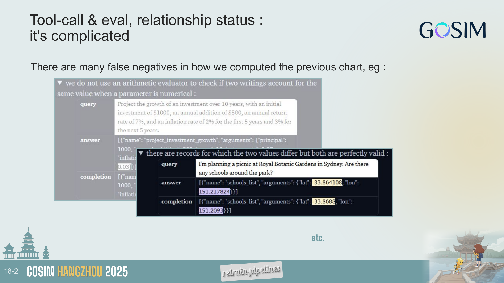

False negatives second type은 evaluation boundary를 계속 설명한다. Screenshot은 `etc.`로 끝난다. Function-calling evaluation의 misclassification source가 많다는 뜻이다. Tool alias, default parameter, omitted parameter, equivalent unit, parser tolerance가 모두 result에 영향을 준다.

Industrial pipeline에서는 failed sample feedback이 single score보다 더 가치 있다. False negative analysis를 retraining pipeline에 포함하면 parser를 지속적으로 개선하고, data를 보강하고, template을 수정할 수 있다. Leaderboard number만 보는 것이 아니다.

#### Slide 31: 목차: Serving으로 이동

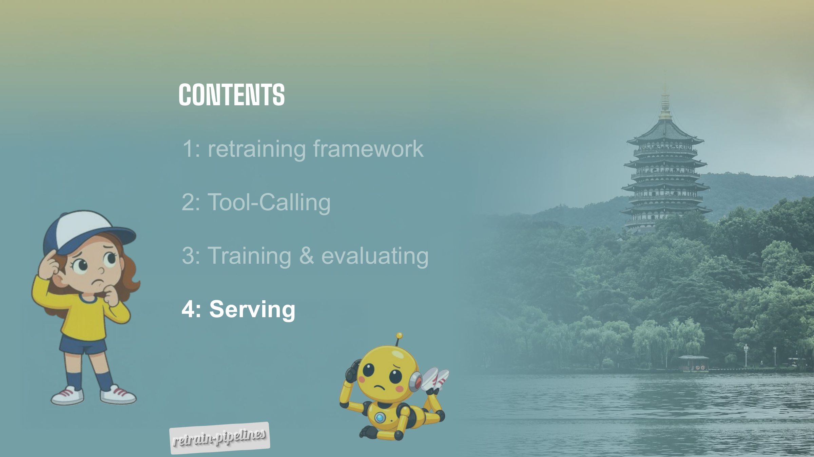

이 페이지는 Serving section transition이다. Adapter를 train하는 것은 loop의 절반일 뿐이다. Production으로 들어가려면 base model과 함께 online serving할 수 있어야 하고, request가 task별 adapter를 지정할 수 있어야 한다.

#### Slide 32: Multi-adapter single endpoint

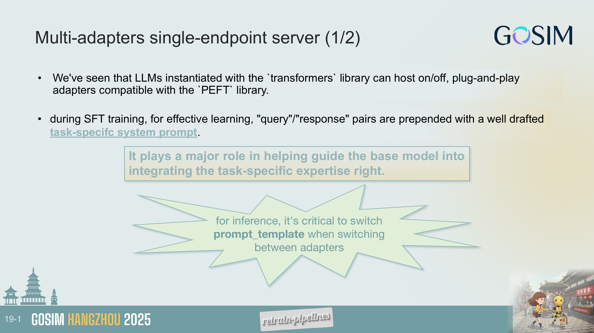

Multi-adapter single endpoint page는 먼저 serving shape를 설명한다. `transformers`가 load한 base LLM은 PEFT-compatible adapter를 붙일 수 있고, adapter는 on demand로 enable/disable/switch할 수 있다. 이렇게 base model 하나가 VRAM에 resident하고, 여러 LoRA adapter가 "expert"로 request에 따라 선택된다. Adapter마다 독립 service를 띄울 필요가 없다.

중간 문구인 task-specific system prompt도 주목해야 한다. SFT training에서는 query/response pair 앞에 task-specific system prompt가 붙는다. Adapter는 이 template 아래에서 task boundary를 배운다. Inference 시 adapter를 switch하면서 `prompt_template`를 함께 switch하지 않으면, model이 받는 format이 training 때와 달라진다. Function calling 같은 task에서는 특히 tool name, parameter JSON, tool call 여부가 흔들릴 수 있다.

#### Slide 33: 각 adapter의 prompt template

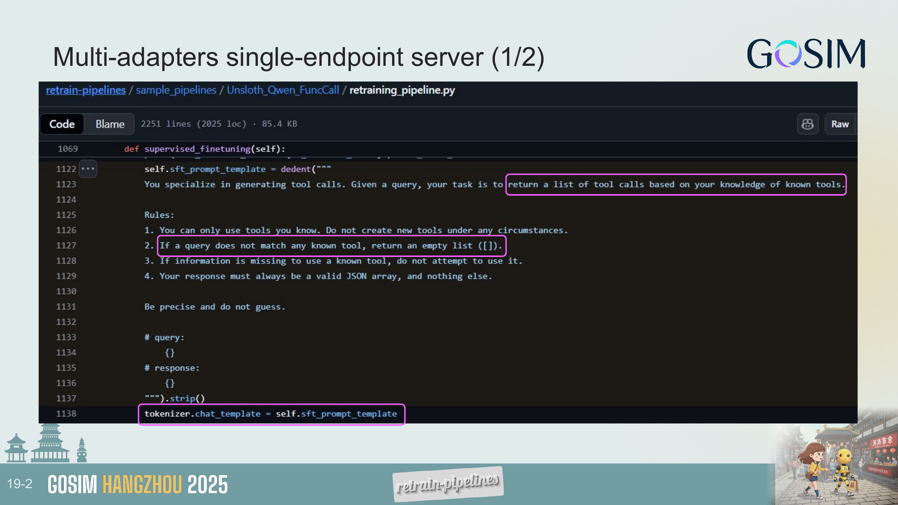

이 페이지는 `retraining_pipeline.py`의 `supervised_finetuning` screenshot이다. Code는 `self.sft_prompt_template = dedent("""...""")`를 구성한다. Template 첫 문장은 model에게 "known tools에 대한 knowledge를 기반으로 tool call list를 return하라"고 명확히 요구한다. 아래 rules는 task boundary를 직접 정의한다. Known tool만 사용할 수 있고, 새로운 tool을 만들 수 없다. Query가 known tool과 match하지 않으면 empty list `[]`를 반환한다. Information이 부족하면 억지로 call하지 않는다. Output은 valid JSON array여야 한다.

하단 highlight의 `tokenizer.chat_template = self.sft_prompt_template`는 template이 document description이 아니라 tokenizer의 chat template에 직접 쓰인다는 것을 보여준다. 이 design은 serving side와 강하게 관련된다. Function-calling adapter는 이 template 아래에서 train되었으므로, inference 때 normal chat template으로 돌아가면 model은 tool call array가 아니라 natural language explanation을 출력하기 쉽다.

#### Slide 34: LitServe request: adapter 미지정

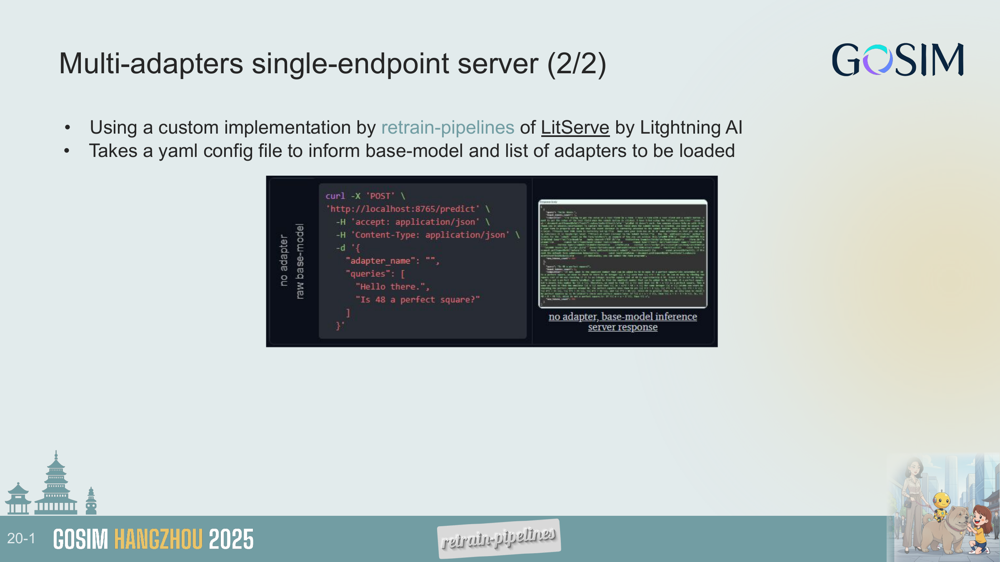

이 페이지는 custom LitServe server의 calling method를 보여준다. 위쪽 small text는 retrain-pipelines가 Lightning AI LitServe를 custom implementation한 것을 사용한다고 설명한다. Service startup 시 YAML config에서 base model과 load할 adapter list를 얻는다. Screenshot의 cURL request는 `http://localhost:8765/predict`로 보내며, body에서 `adapter_name`은 empty string이고 queries는 `"Hello there."`와 `"Is 48 a perfect square?"`를 포함한다.

왼쪽 세로 annotation은 "no adapter raw base-model"이라고 쓰여 있고, 오른쪽은 base model inference server response다. 이 example은 일부러 adapter를 enable하지 않아 다음 slide와 비교하기 위한 것이다. Same endpoint, same queries에서 `adapter_name`만 바꾸면 output behavior가 normal QA에서 function-calling으로 바뀐다.

#### Slide 35: base model raw response

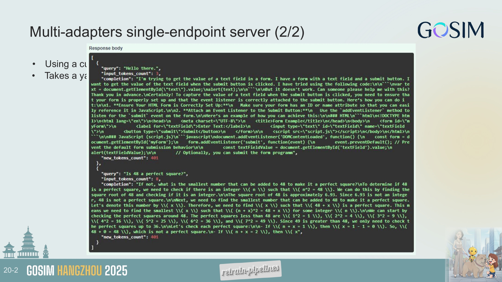

이 slide는 adapter를 지정하지 않은 response body를 확대한다. Return은 array이며, 각 element는 `query`, `input_tokens_count`, `completion`, `new_tokens_count`를 포함한다. `Hello there.`에 대응하는 completion은 긴 natural language와 JavaScript/HTML example이고, `new_tokens_count`는 401까지 간다. `Is 48 a perfect square?`도 reasoning process text를 반환한다.

이것이 function-calling adapter가 해결하려는 문제다. Base model은 question에 answer할 수 있지만, stable tool call schema를 output하지 않으며 "48이 square number인지"를 expected `is_perfect_square` call로 변환하지도 않는다. Service layer는 adapter_name과 prompt_template를 sync switch해야 같은 base model을 specific task expert로 바꿀 수 있다.

#### Slide 36: `func_caller_lora` adapter response

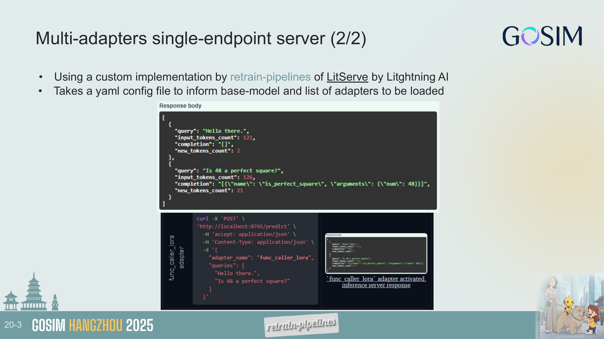

이 페이지는 `adapter_name: "func_caller_lora"`를 enable한다. Request는 여전히 같은 두 query지만 response는 tool-call style로 바뀐다. `Hello there.`는 known tool과 match하지 않으므로 completion이 `[]`다. `Is 48 a perfect square?`는 `[{"name": "is_perfect_square", "arguments": {"num": 48}}]`로 변환된다. `new_tokens_count`도 이전 slide의 수백 token에서 20여 token으로 줄어든다.

Engineering perspective에서 named adapters switch는 PEFT의 `set_adapter/enable_adapters/disable_adapters`에 대응한다. Server가 batch를 받은 뒤 request의 adapter name에 따라 LoRA를 switch하고, 해당 prompt template으로 바꿔야 한다. LoRA만 switch하고 template을 switch하지 않으면 output schema는 여전히 불안정하다. Template만 switch하고 LoRA를 switch하지 않으면 tool calling에 대한 parameter delta가 부족하다.

#### Slide 37: 같은 endpoint에서 adapter switch

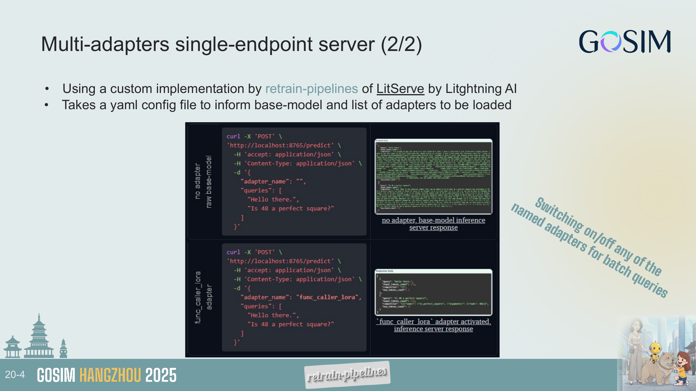

이 slide는 no-adapter와 `func_caller_lora` 두 request를 같은 그림에 놓고, 오른쪽에 "Switching on/off any of the named adapters for batch queries"라고 기울여 적었다. 말하고 싶은 것은 여러 service를 띄우는 것이 아니라, 같은 `/predict` endpoint가 batch queries를 받고 `adapter_name`에 따라 특정 named adapter를 enable할지 결정한다는 것이다.

이런 solution의 benefit은 base model을 한 번 resident시키고, 여러 small LoRA를 expert로 같은 service에 붙일 수 있다는 점이다. 서로 다른 task가 다른 adapter를 사용하는 것이 많은 full model을 유지하는 것보다 가볍다. 하지만 batch scheduling, adapter switching, prompt template management가 충분히 명확해야 한다. 그렇지 않으면 같은 batch 안에서 서로 다른 request의 output protocol이 섞일 수 있다.

#### Slide 38: Army of specialized experts

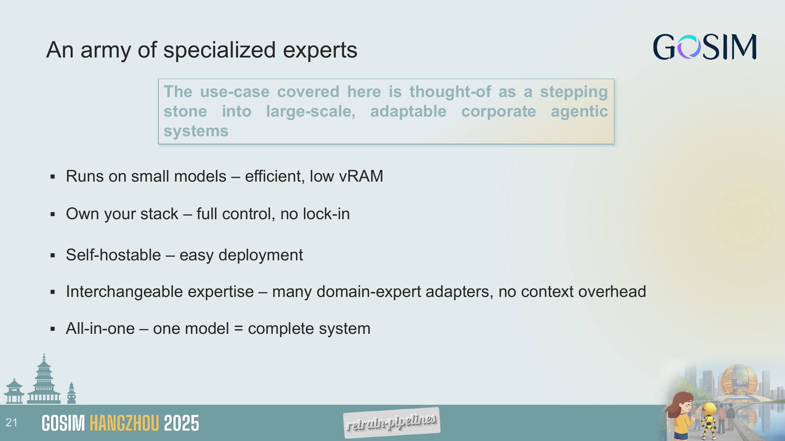

이 페이지는 위 example을 "specialized experts"로 추상화한다. Banner에는 scalable, adaptable enterprise agentic systems로 가는 한 걸음이라고 쓰여 있다. 아래 다섯 줄은 작은 model로 실행, high efficiency와 low VRAM, self-hosted로 full stack control, simple deployment, 많은 domain-expert adapters를 switch 가능하고 long-context prompt overhead가 없으며, 하나의 base model과 adapter group이 complete system을 이룬다는 내용이다.

Continuous learning main line으로 돌아오면 adapter는 one-off training artifact가 아니라 지속적으로 교체 가능한 expert module이다. Data feedback에서 특정 tool call 실패를 발견하면 해당 adapter를 retrain하고, evaluation을 통과하면 service side로 push하여 named adapter switch로 연결한다. 전체 base model service를 restart할 필요가 없다.

#### Slide 39: 목차: 전체 loop로 돌아가기

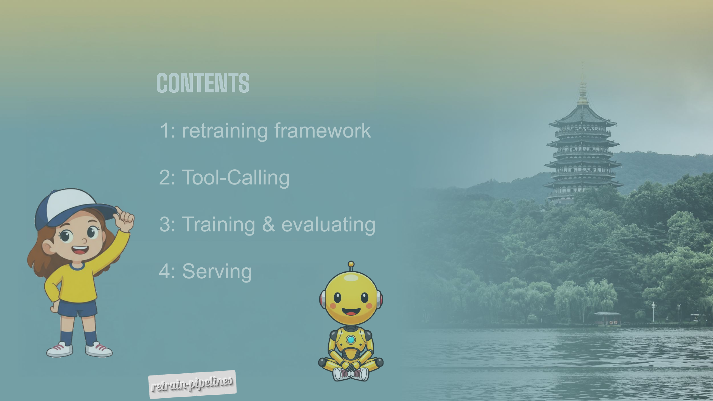

마지막으로 contents page로 돌아간다. Retraining framework, tool-calling, training/eval, serving을 하나의 line으로 묶는다는 의미다. Continuous learning의 어려움은 한 번 training하는 것이 아니라 data, training, evaluation, release, rollback을 장기적으로 maintainable하게 만드는 것이다.

#### Slide 40: Ending page

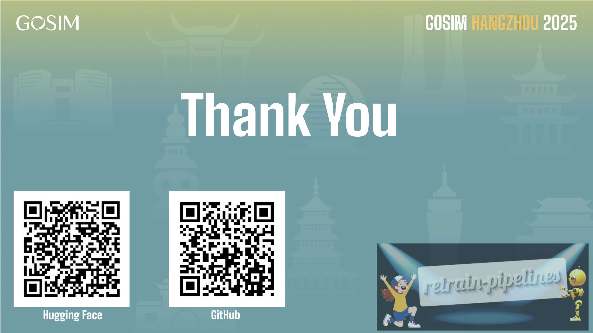

Ending page는 더 펼치지 않는다. Pipeline과 function-calling adapter의 code path를 남겨두면 이후 reuse하기 더 편하다.

## 0x3. 핵심 코드 해설

DAG engine의 기본 node는 `TaskType`이다. Declaration 시 function을 wrap하고 parent/child를 저장하며, runtime에는 stdout/stderr/logging write를 DB에 capture한다.

```python
class TaskType(BaseModel):
    func: Callable
    is_parallel: bool = False
    merge_func: Optional[Callable] = Field(default=None)
    tasktype_uuid: UUID = Field(default_factory=uuid4)

    _parents: List["TaskType"] = PrivateAttr(default_factory=list)
    _children: List["TaskType"] = PrivateAttr(default_factory=list)
    _task_group: Optional["TaskGroup"] = PrivateAttr(default=None)

    def __init__(self, **data):
        super().__init__(**data)
        self.func = self._wrap_func(self.func)
        if self.merge_func is not None:
            self.merge_func = self._wrap_merge_func(self.merge_func)
```

`example_wf_7`은 parallel task, taskgroup, merge를 보여준다.

```python
@parallel_task(ui_css=UiCss(background="#00ff37"))
def parallel(payload: TaskPayload):
    return [payload * 10 + i for i in range(2)]

@taskgroup(ui_css=UiCss(background="#000000", color="#e00000", border="#00fff7"))
def snake_heads_A():
    return snake_head_A1, snake_head_A2

@task(merge_func=matrix_sum_cols, ui_css=UiCss(background="#ff0000"))
def merge(payload: TaskPayload) -> List[int]:
    result = list(map(lambda x: x * 2, payload))
    return result
```

이런 DAG는 retraining에 자연스럽다. 여러 training config를 parallel하게 시도하고, merge stage에서 model selection 또는 summary를 수행한다.

Serving side의 multi-adapter LitServe는 function-calling case에 더 가깝다. `UnslothLitAPI.setup`은 먼저 base model을 load하고, 그 다음 여러 adapter와 각 tokenizer를 load한다.

```python
model, self.tokenizer = FastLanguageModel.from_pretrained(
    model_name=(Config.BASE_MODEL_PATH or Config.BASE_MODEL_REPO_ID),
    revision=(Config.BASE_MODEL_REVISION if Config.BASE_MODEL_PATH is None else None),
    max_seq_length=Config.MAX_SEQ_LENGTH,
    load_in_4bit=False,
)
self.model = FastLanguageModel.for_inference(model)

self.adapter_tokenizers = {}
for adapter_name, adapter in Config.adapters.items():
    self.model.load_adapter(
        peft_model_id=adapter_repo_id,
        revision=adapter_revision,
        adapter_name=adapter_name,
    )
    self.adapter_tokenizers[adapter_name] = AutoTokenizer.from_pretrained(adapter_repo_id)
```

`predict` 시 request에 따라 adapter를 선택한다. Request가 지정하지 않았거나 adapter가 존재하지 않으면 adapters를 disable하고 base model을 사용한다.

```python
if request.adapter_name in get_model_status(self.model).available_adapters:
    if set([request.adapter_name]) != set(self.model.active_adapters()):
        self.model.set_adapter(adapter_name=request.adapter_name)
    self.model.enable_adapters()
    for module in self.model.modules():
        if isinstance(module, ModulesToSaveWrapper):
            module.enable_adapters(enabled=True)
    tokenizer = self.adapter_tokenizers[request.adapter_name]
else:
    self.model.disable_adapters()
    tokenizer = self.tokenizer
```

마지막으로 adapter 자신의 chat template으로 input을 format한다.

```python
formatted_inputs = [(tokenizer.chat_template or "{}").format(query, "")
                    for query in request.queries_list]

tokenized_inputs = tokenizer(
    formatted_inputs,
    padding=True,
    truncation=True,
    return_tensors="pt",
).to("cuda")

outputs = self.model.generate(
    input_ids=tokenized_inputs["input_ids"],
    attention_mask=tokenized_inputs["attention_mask"],
    max_new_tokens=Config.MAX_NEW_TOKENS,
    use_cache=True,
)
```

이 code는 slides의 "single endpoint, named adapters"를 설명한다. Base model은 resident하고, adapter와 tokenizer/template은 switch 가능한 expert가 된다.

## 0x4. Summary

Continuous learning industrialization의 어려움은 closed loop에 있다. Training code, data, evaluation, documentation, serving validation을 모두 traceable하게 만들어야 한다. retrain-pipelines는 DAG와 pipeline card로 process를 관리하고, LoRA adapter와 LitServe로 function-calling expert의 training 및 release를 보여준다.
