# GOSIM Hangzhou 기술 회고 해설 - Omni-Infer의 MTP 추측 추론 방안

> MTP는 conceptually "몇 개 token을 더 예측하는 것"일 뿐이지만, engineering에서는 proposer/verifier, sampling state, KV cache, NPU execution path까지 끌어낸다. 이 글은 이 흐름을 따라 나눠 본다.

## 0x0. 서문

MTP는 paper에서 여러 token을 더 예측하는 것으로 자주 묘사되지만, engineering implementation에서는 verification, sampling, KV allocation, hidden state selection, hardware synchronization이 모두 실제 bottleneck이 된다. 이 글은 slides와 Omni-Infer code를 따라 이 chain을 분해해 본다.

## 0x1. 자료와 code 위치

code 위치:

- Omni-Infer: `omni/adaptors/sglang/patches/mtp.patch`, SGLang side에 `MTPWorker`, `SpeculativeAlgorithm.MTP`, sampling info repeat/restore, verify logic이 추가된다.
- Omni-Infer: `omni/layers/sampler.py`, NPU sampler, rejection sampler, penalty cache 관련 logic.
- Omni-Infer: `omni/adaptors/vllm/spec_decode/post_drafter.py`, vLLM side proposer/verifier와 adaptive speculation.
- Omni-Infer: `omni/layers/attention/deepseek_mla.py` 및 `omni/accelerators/cache/omni_cache.py`, MTP 아래 decode token 수와 MLA actual seq length 처리.
- LMSYS MTP blog: `https://lmsys.org/blog/2025-07-17-mtp/`, SGLang에서 MTP worker, draft/verify loop, acceptance statistics에 대한 complete background를 제공한다.

먼저 LMSYS의 이 general flow diagram으로 MTP main loop를 calibrate한 뒤, Omni-Infer로 돌아가 NPU adaptation을 본다.

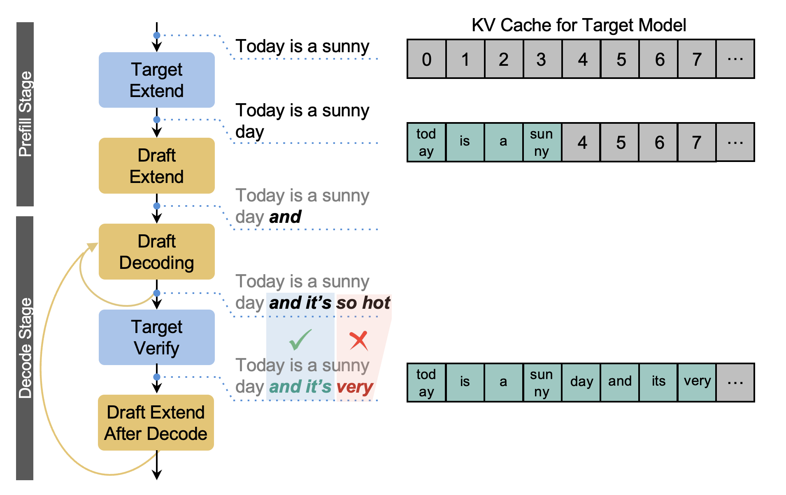

이 그림은 MTP를 세 단계로 나눈다. main model이 먼저 current token과 hidden states를 계산하고, MTP module이 hidden states에 따라 여러 token을 연속으로 draft하며, 마지막으로 main model이 이러한 candidate token을 한 번에 verify한다. accept token 수가 1보다 크기만 하면 decode의 serial step 수가 줄어든다. Omni-Infer의 이 slides에서 중점은 Ascend NPU에서 이 flow를 stable하게 실행하는 것이다. sampling info는 repeat/restore 가능해야 하고, KV cache는 여러 candidate token을 위한 space를 남겨야 하며, verify 후에는 rejected token을 다시 지워야 한다. 뒤에서 `mtp.patch`를 볼 때 이 그림을 total index로 삼을 수 있다.

## 0x2. Slides 페이지별 해설

#### Slide 1: Omni-Infer의 MTP: Ascend-friendly high-throughput speculative inference


title page는 주제를 제시한다. Omni-Infer의 MTP이며, 중점은 Ascend-friendly high-throughput speculative inference다. 여기서 "friendly"는 단순히 NPU를 지원한다는 뜻이 아니라, speculative inference의 sampling, verification, hidden state selection, MLA kernel을 Ascend execution에 적합한 형태로 바꾸는 것을 의미한다.

Decode stage의 single-token iteration은 bandwidth와 synchronization overhead의 제약을 받기 쉽다. MTP는 여러 후속 token을 한 번에 predict하며, 목표는 serial decode step을 NPU execution에 더 적합한 큰 step으로 merge하는 것이다. 이후 slides의 main line은 community implementation의 문제를 먼저 설명하고, Omni-Infer가 어떻게 CPU-NPU synchronization과 sampler limitation을 줄이는지 보는 것이다.

#### Slide 2: Decode memory-bound와 speculative inference

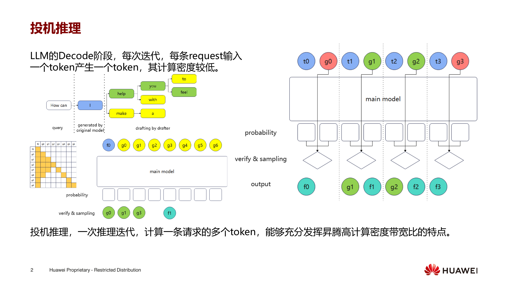

이 page는 Decode stage의 compute characteristic부터 시작한다. iteration마다 request 하나가 token 하나를 input으로 받아 token 하나를 생성하며, compute density가 낮다. Ascend 같은 high compute density/bandwidth ratio hardware에서는 single-token decode가 hardware를 충분히 채우기 어렵다.

speculative inference는 one inference iteration에서 request 하나의 여러 token을 계산한다. draft/MTP layer가 먼저 candidate token을 제안하고, main model이 다시 verify한다. acceptance rate가 충분히 높으면 한 번의 main model verification으로 여러 번의 single-token decode를 대체할 수 있어 iteration count와 scheduling overhead를 줄인다.

#### Slide 3: community MTP/EAGLE implementation의 general flow

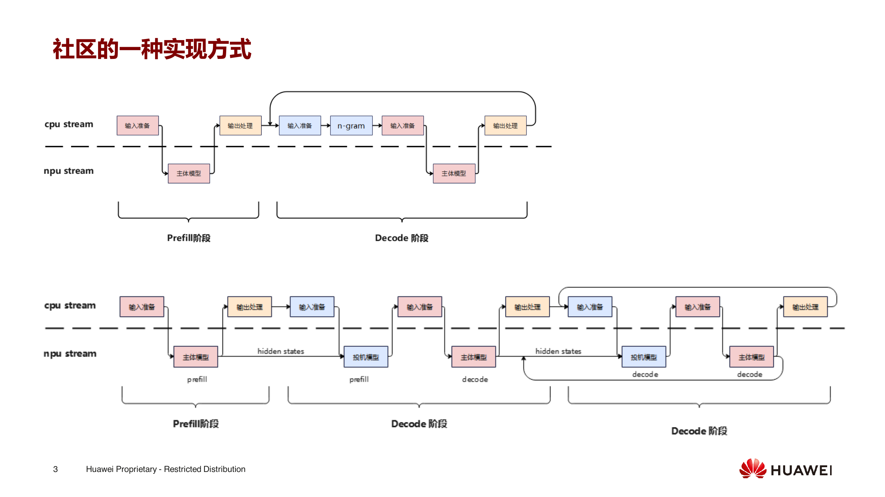

이 page는 community에서 흔히 볼 수 있는 MTP/EAGLE execution method를 그린 것이다. prefill 후 main model이 hidden states를 만들고, MTP 또는 draft module이 hidden states를 기반으로 candidate token sequence를 생성한다. decode 시 main model은 이 candidate sequence를 verify하고 prefix token을 accept하며, 이후 state를 다음 draft round에 넘긴다.

이 flow는 conceptually direct하지만, NPU에 적용하면 두 가지 문제가 생긴다. 첫째, verification 후 "correct tokens와 대응 hidden states"를 MTP input으로 선택해야 하는데, selection logic이 CPU로 돌아가면 NPU operator dispatch를 끊는다. 둘째, sampling parameter와 penalty state는 token마다 항상 같지 않다. verification stage는 단순 token equality만으로 처리할 수 없다.

#### Slide 4: verification 후 token과 hidden state selection

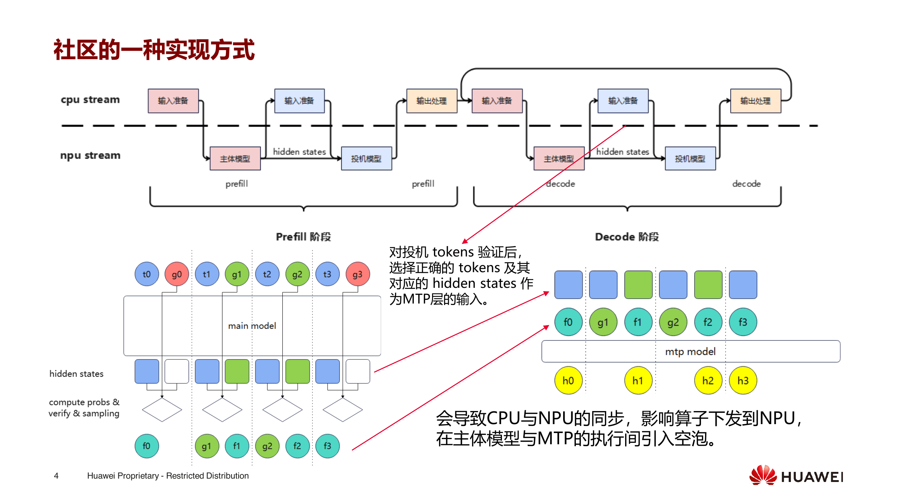

이 page의 위쪽은 CPU stream과 NPU stream을 나눈다. CPU side는 input preparation과 output processing을 담당하고, NPU side는 main model과 speculative model을 실행한다. prefill stage에서 main model이 hidden states를 만들고, speculative model이 이 hidden states로 candidate token을 생성한다. decode에 들어간 뒤 main model이 먼저 speculative tokens를 verify하고, verified token과 corresponding hidden states를 MTP layer에 넘겨 계속 predict하게 한다.

아래쪽 token diagram은 더 구체적이다. prefill에서 t0/g0/t1/g1...이 번갈아 나타나고, main model은 probs, verify, sampling을 담당한다. verification 후에는 단순히 "마지막 draft position"의 hidden state를 가져오면 안 되고, 마지막 accepted token에 대응하는 hidden state를 가져와야 한다. 오른쪽 text는 이 방식이 CPU와 NPU synchronization을 도입해 operator dispatch에 영향을 주고, main model과 MTP execution 사이에 bubble을 만든다고 지적한다. 이후 sampling과 verifier optimization은 기본적으로 이런 synchronization cost를 없애는 데 있다.

#### Slide 5: CPU-NPU synchronization bubble

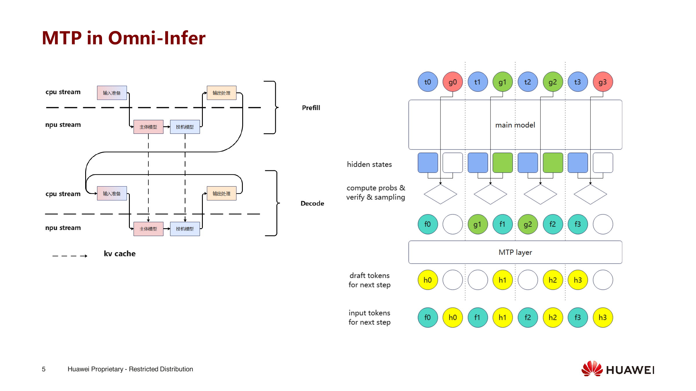

이 page는 Omni-Infer의 MTP implementation으로 들어간다. 그림은 main model, MTP model, verification, sampling을 연결한다. 핵심은 verified token selection, hidden state selection, next draft를 가능한 한 device side에서 완료해 CPU intervention을 줄이는 것이다.

CPU-NPU synchronization bubble은 Ascend scenario의 key issue다. 매 verification마다 CPU로 돌아가 accept length를 계산하고 다시 NPU로 돌아가 next step을 준비하면, speculative inference가 아낀 decode step이 synchronization에 먹힐 수 있다. 뒤의 code에서 `verify`가 tensor logic으로 accept length와 output token을 찾으려 하는 이유가 바로 이 path를 device 위에 남기기 위해서다.

#### Slide 6: Omni-Infer의 MTP support scope

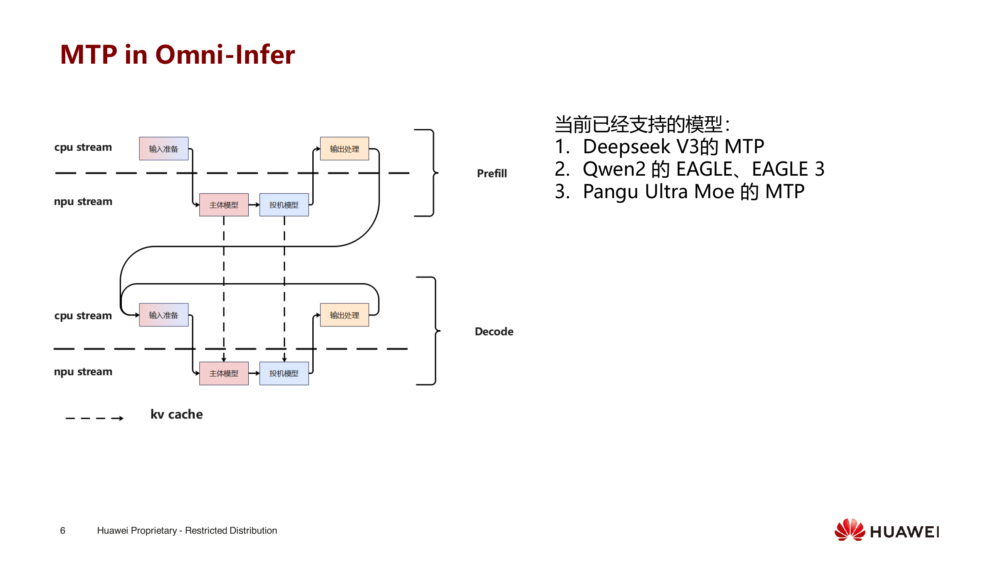

이 page는 현재 지원 model을 명확히 나열한다. DeepSeek V3의 MTP, Qwen2의 EAGLE/EAGLE3, Pangu Ultra MoE의 MTP다. 즉 Omni-Infer는 특정 model 하나에 special path를 작성하는 것이 아니라 speculative method를 inference engine capability로 만든다.

model마다 draft module source가 다르다. DeepSeek V3 MTP는 model 자체의 multi-token prediction이고, Qwen2 EAGLE/EAGLE3는 draft model/hidden state prediction을 사용하며, Pangu Ultra MoE는 MoE scenario도 처리해야 한다. engine으로 unify하면 common part는 sampling info, verify, KV/cache, hidden state selection, kernel optimization이다.

#### Slide 7: sampling과 verification strategy

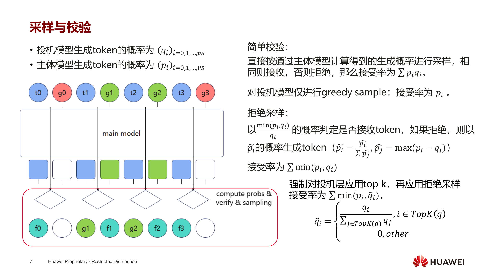

이 page는 sampling과 verification의 probability relation을 쓴다. speculative model이 token을 생성할 probability를 `q_i`, main model이 token을 생성할 probability를 `p_i`로 둔다. simple verification이 main model sampling result와 비교해 같으면 accept하고 다르면 reject한다면 acceptance rate는 `sum p_i q_i`와 관련된다. draft가 greedy sample만 수행하면 acceptance rate는 main model이 해당 token에 부여한 probability `p_i`로 degenerate된다.

rejection sampling은 더 strict하다. `min(p_i, q_i) / q_i` probability로 token을 accept한다. reject 후에는 `max(p_i - q_i, 0)`를 normalize한 distribution에서 다시 sample한다. 목표는 output distribution을 main model에 가깝게 유지하는 것이지, 속도만 추구하는 것이 아니다. slide는 speculative layer에 top-k를 강제로 적용한 뒤 rejection sampling을 수행하면 acceptance rate가 `sum min(p_i, q_tilde_i)`가 된다고도 언급한다.

#### Slide 8: community verifier의 문제

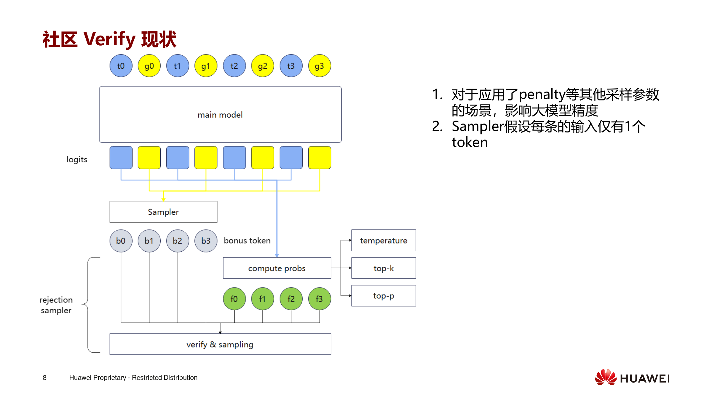

이 page는 community verifier의 두 가지 문제를 지적한다. 첫째, penalty 같은 다른 sampling parameter가 적용되는 scenario에서 simple verifier는 large model accuracy에 영향을 준다. 둘째, Sampler는 각 input에 token 하나만 있다고 가정한다.

문제는 sampling params에 집중된다. presence/frequency/repetition penalty, temperature, top-p/top-k, allowed token ids는 speculative token마다 verification에 영향을 준다. sampler가 request 하나가 token 하나만 sample한다고 가정하면, speculative window 안의 여러 token이 잘못된 sampling state를 공유하게 되고, output distribution은 main model과 맞지 않게 된다.

#### Slide 9: validator에서 두 번 sampler를 호출하는 design

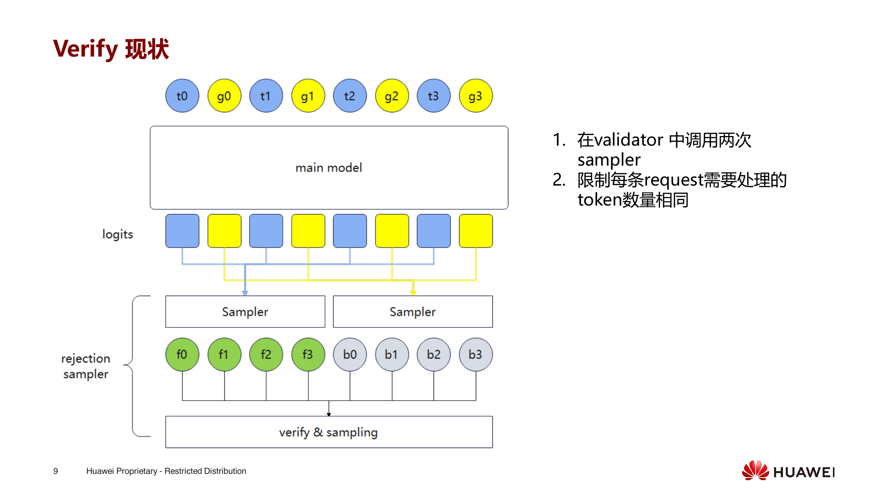

이 page는 verifier의 current state를 그린다. 위쪽 t0/g0/t1/g1...은 interleaved target token과 draft token이고, main model은 이 position들의 logits를 한 번에 output한다. 아래쪽은 logits를 두 Sampler로 나눈다. 한쪽은 target에 대응하는 candidate f0/f1/f2/f3를 sample하고, 다른 쪽은 draft 뒤의 backup token b0/b1/b2/b3를 sample한다. 마지막으로 unified rejection sampler에 들어가 verify & sampling을 수행한다.

오른쪽 두 limitation이 문제의 root cause다. validator 안에서 sampler를 두 번 호출해야 하고, 각 request가 처리해야 하는 token 수가 같아야 한다. 이 assumption은 real serving에 friendly하지 않다. 서로 다른 request의 speculative length, sampling params, penalty state가 모두 다를 수 있기 때문이다. code에서는 이후 sampling info를 speculative token 기준으로 expand한 뒤, verify 후 request granularity로 restore해야 한다.

#### Slide 10: arbitrary speculative token 수의 sampling parameter 처리

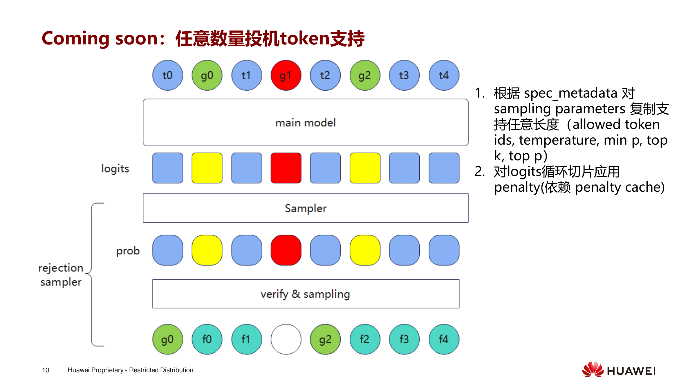

이 page의 title은 "arbitrary number speculative token support"다. 오른쪽 두 항목은 매우 구체적이다. 첫째, `spec_metadata`에 따라 sampling parameters를 copy해 arbitrary length를 지원한다. 여기에는 allowed token ids, temperature, min_p, top_k, top_p가 포함된다. 둘째, penalty는 penalty cache에 의존하므로 logits를 loop slicing해서 penalty를 적용한다.

여기서는 parameter를 단순히 repeat할 수 없다. 서로 다른 request의 speculative token 수가 다를 수 있고, 같은 request 안에서도 각 candidate token의 penalty state는 accepted token에 따라 바뀐다. implementation에서는 request-level sampling info를 token-level로 expand하고, verification 후 다시 request-level로 restore해야 한다. 그렇지 않으면 sampler와 rejection sampler가 misaligned data를 처리하게 된다.

#### Slide 11: Adaptive speculation

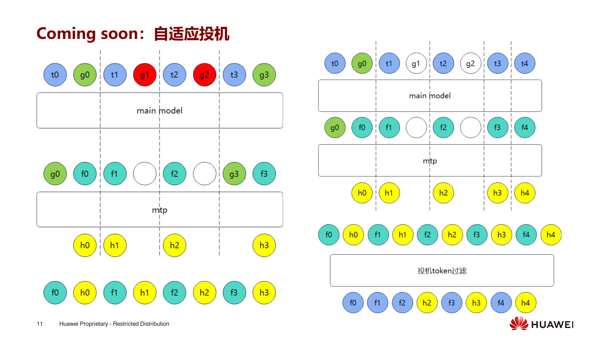

이 page title은 "Coming soon: adaptive speculation"이다. 왼쪽 그림에서 파란 `t0/t1/t2/t3`는 main model이 verify한 position이고, 초록 `g0/g3`는 accepted draft token을 나타내며, 빨간 `g1/g2`는 rejected position을 나타낸다. 아래 MTP branch는 계속 `f0/f1/f2/f3`와 `h0/h1/h2/h3`를 만든다. vertical dashed line은 speculative window의 boundary로 이해할 수 있다. 어떤 window는 많이 accept되고, 어떤 window는 빠르게 fail한다.

오른쪽 그림은 adaptive 후의 형태를 보여준다. 각 window는 더 이상 고정된 token 수를 speculate하지 않고, 이전 round acceptance 상황에 따라 다음 round에서 MTP가 몇 개 token을 계속 guess할지 결정한다. 가운데 줄 `f0/h0/f1/h1...`은 서로 다른 depth의 draft candidate이고, 아래의 "speculative token filtering"은 더 이상 verify할 필요가 없는 token을 제거하고, 다음 main model에 들어가야 하는 position만 남긴다. 목표는 매 round마다 항상 가득 guess하는 것이 아니라, acceptance rate가 높을 때 window를 키우고 낮을 때 줄여, MTP compute를 더 accept될 가능성이 높은 position에 쓰는 것이다.

#### Slide 12: MLA에서 MTP의 KV reuse optimization

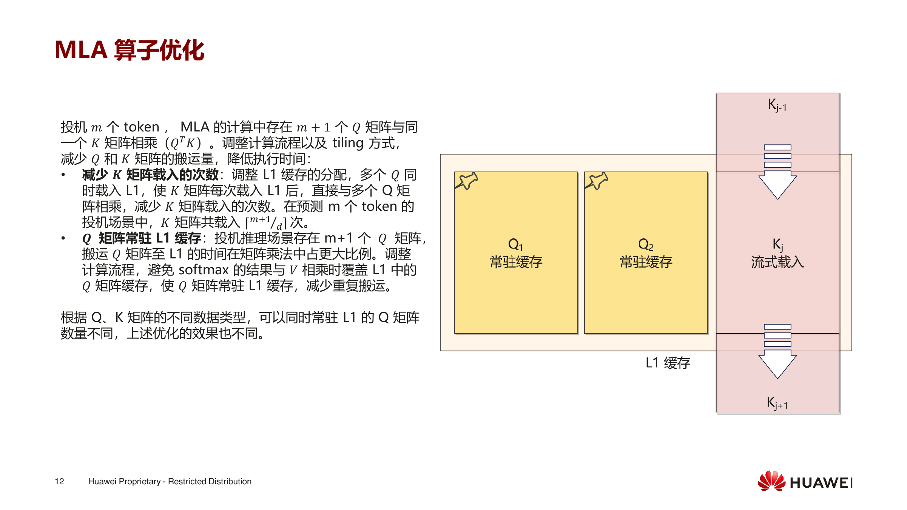

이 page는 MLA operator-level optimization을 설명한다. m개 token을 speculate할 때, MLA computation에서는 `m+1`개의 Q matrix와 같은 K matrix를 multiplication하는 상황이 생긴다. naive implementation은 각 Q가 K를 다시 load하게 만들고, K matrix가 HBM과 L1 사이를 오가며 decode의 bandwidth bottleneck을 키운다.

오른쪽 그림은 tiling idea를 제시한다. Q1, Q2는 L1 cache에 resident하고, K_j는 streaming 방식으로 load되어 여러 Q와 연속적으로 multiplication한다. 왼쪽 작은 글씨는 더 자세하다. L1 cache allocation을 조정해 여러 Q가 동시에 L1에 들어가게 하고, K가 한 번 load된 뒤 여러 Q를 직접 service하게 한다. m개 token을 predict할 때 K matrix load 횟수는 Q별 반복 load에서 대략 tile별 batch load로 바뀐다. 또 다른 optimization은 Q matrix를 L1에 resident하게 해 softmax result와 V multiplication이 Q cache를 덮어쓰지 않게 하는 것이다. code side에서는 MLA decode length에 speculative window를 포함해 더 큰 query group으로 조직하는 것에 대응한다.

#### Slide 13: Omni-Infer repository와 integration 방식

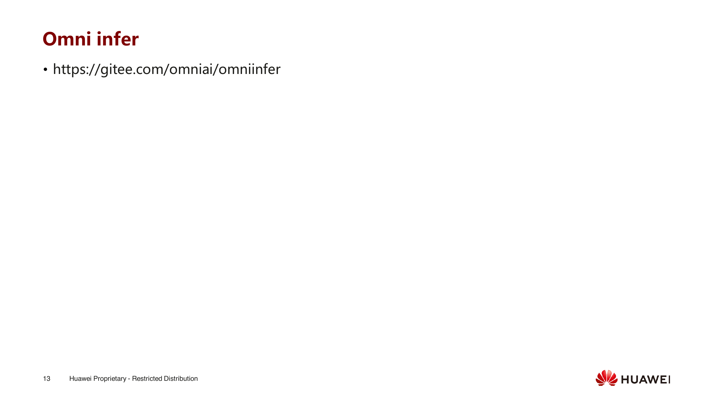

repository page는 Omni-Infer의 Gitee address를 제공한다. public implementation에는 vLLM/Ascend adaptation뿐 아니라 SGLang patch도 있다. SGLang patch 안에는 `SpeculativeAlgorithm.MTP`와 `MTPWorker`가 새로 추가되어 있으며, 이는 이 slides의 verifier, sampling info, draft/verify main loop와 직접 대응된다.

code를 읽을 때는 세 가지 clue를 따라가면 된다. 첫째, `MTPWorker`가 target model verification input을 어떻게 구성하는가. 둘째, sampler parameter를 어떻게 repeat/restore하는가. 셋째, MLA와 KV side가 speculative token 수를 어떻게 감지하는가. 이렇게 하면 slides의 "synchronization 감소, arbitrary token support, MLA reuse"를 concrete implementation에 연결할 수 있다.

#### Slide 14: 요약


정리하면 Omni-Infer의 MTP는 "EAGLE을 NPU로 옮긴 것"이 아니다. 이는 NPU 위에서 sampler, verifier, graph, MLA, synchronization overhead 같은 실제 engineering detail을 처리하는 것이다.

## 0x3. key code 분석

SGLang patch에 새로 추가된 `MTPWorker`가 main entry다. decode branch는 current token과 draft tokens를 concatenate해 target model이 한 번에 verify하게 한다.

```python
seq_lens = batch.seq_lens.repeat_interleave(self.speculative_num_steps + 1, dim=0)
seq_lens[1::2] += 1
locs = seq_lens.clone() - 1
input_ids = torch.cat(
    (batch.input_ids.reshape(-1, 1), batch.spec_info.draft_token), dim=-1
).flatten()

model_worker_batch.input_ids = input_ids
model_worker_batch.seq_lens = seq_lens
model_worker_batch.spec_info.positions = positions
self.prepare_sampling_info(batch.sampling_info)
```

verification 후 state를 draft input으로 되돌리고, 다시 MTP를 실행한다.

```python
verified_id, accept_length, last_accepted_index, bouns_ids, evict_mask = (
    self.verify(model_worker_batch.input_ids, next_token_ids, num_reqs, batch)
)

draft_input = EagleDraftInput(
    hidden_states=logits_output.hidden_states,
    verified_id=verified_id,
    accept_length=accept_length,
    seq_lens_for_draft_extend=batch.seq_lens,
    req_pool_indices_for_draft_extend=batch.req_pool_indices,
    capture_hidden_mode=CaptureHiddenMode.LAST,
)

forward_batch.spec_info = draft_input
forward_batch.input_ids = next_token_ids.to(torch.int64)
logits_output, _ = self.draft_model_runner.forward(
    forward_batch, skip_attn_backend_init=True
)
```

sampling params는 original batch에 한 번만 사용할 수 없다. patch에서는 먼저 repeat하고 실행 후 restore한다.

```python
def prepare_sampling_info(self, sampling_info):
    self.raw_temperatures = sampling_info.temperatures
    self.raw_top_ks = sampling_info.top_ks
    self.raw_top_ps = sampling_info.top_ps
    self.raw_min_ps = sampling_info.min_ps

    sampling_info.temperatures = self.raw_temperatures.repeat_interleave(
        self.speculative_num_steps + 1, dim=0
    )
    sampling_info.top_ks = self.raw_top_ks.repeat_interleave(
        self.speculative_num_steps + 1, dim=0
    )
    sampling_info.top_ps = self.raw_top_ps.repeat_interleave(
        self.speculative_num_steps + 1, dim=0
    )
```

verify 자체는 pure tensor logic이며, frequent CPU roundtrip을 피한다. draft token과 target forward token을 비교해 first reject position을 찾는다.

```python
accepted = input_ids.view(num_reqs, -1)[:, 1:] == \
    forward_token_ids.view(num_reqs, -1)[:, :-1]
accepted_mask = accepted.to(dtype=torch.int32)
accepted_mask = torch.cat((accepted_mask, padding_zero), dim=1)
accepted_num = accepted_mask.argmin(dim=1).to(dtype=torch.int32)

last_accepted_index = torch.arange(num_reqs, device=input_ids.device, dtype=torch.int32) \
    * num_sampling_tokens_per_req + accepted_num
output_token_ids = forward_token_ids[last_accepted_index]
```

MLA side는 speculative token 수를 decode sequence length에 쓴다. `deepseek_mla.py`에서 볼 수 있다.

```python
self.num_speculative_tokens = 0 if not cur_vllm_config.speculative_config \
    or not model_extra_config.operator_opt_config.mtp_remove_redundant_kv \
    else cur_vllm_config.speculative_config.num_speculative_tokens

self.actual_seq_lengths[batch_size] = (1 + self.num_speculative_tokens) * \
    torch.arange(1, batch_size // (1 + self.num_speculative_tokens) + 1,
                 dtype=torch.int64, device=current_platform.device_type)
```

이것이 slide에서 말한 MLA optimization의 code-side entry다. decode를 token 하나씩 보지 않고, speculative window를 더 큰 query group으로 조직한다.

## 0x4. small summary

Omni-Infer의 이 글은 "speculative inference를 NPU 위에서 어떻게 landing시키는가"의 case로 볼 수 있다. 정말 어려운 것은 MTP concept가 아니라 sampler distribution consistency, acceptance tensorization, hidden state selection, KV/MLA reuse, synchronization bubble이다.
