# GOSIM Hangzhou 기술 회고 해설 - OpenSeek 오픈소스가 이끄는 차세대 AI 모델

> OpenSeek 이 slides에서 infra와 가장 가까운 부분은 Dynamic Mask Attention과 flash-dmattn이다. Project background도 다루지만, 더 많은 분량은 sparse attention이 어떻게 kernel로 내려가는지에 둔다.

## 0x0. 서문

OpenSeek는 단일 model release가 아니라 data, algorithm, system을 둘러싼 open-source collaboration plan이다. slides에는 project level 정보가 꽤 많지만, 이 글은 Dynamic Mask Attention과 flash-dmattn을 중점적으로 펼쳐 본다.

## 0x1. 자료와 코드 위치

관련 자료와 source code:

- OpenSeek: `README.md`, `configs/OpenSeek-Small-v1-Baseline/train/train_deepseek_v3_1_4b.yaml`. baseline, data, checkpoint, training config에 대응한다.
- flash-dmattn: `flash_sparse_attn/utils/mask.py`. top-k/relu dynamic mask에 대응한다.
- flash-dmattn: `flash_sparse_attn/ops/triton/flash_sparse_fwd.py`와 `flash_gated_fwd.py`. sparse softmax skip과 gated attention kernel에 대응한다.
- slides에서 제시한 paper entry는 Trainable Dynamic Mask Sparse Attention이고, code repository는 `https://github.com/SmallDoges/flash-dmattn`이다.

## 0x2. Slides 페이지별 해설

#### Slide 1: OpenSeek: 오픈소스가 이끄는 차세대 AI 모델

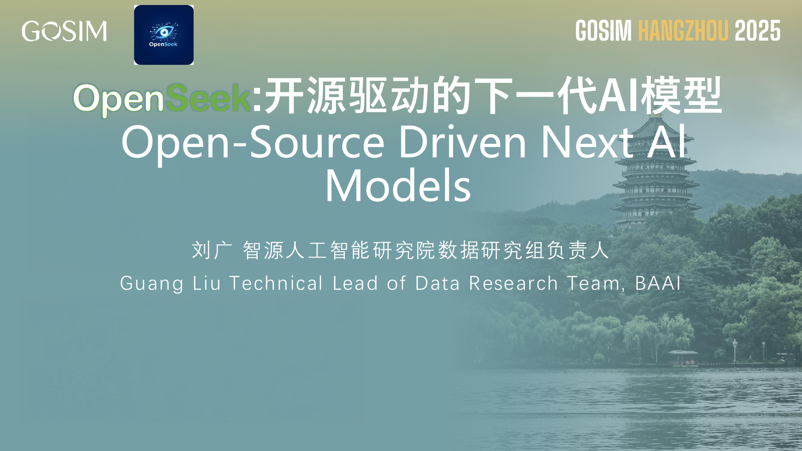

Title page는 OpenSeek의 positioning을 제시한다: open-source driven next AI models. 이는 단일 model release가 아니라 data, algorithm, system, evaluation, community contribution을 하나의 open collaboration framework 안에 넣는 시도다.

이 slides에는 project mechanism 소개가 많지만, 매우 구체적인 system point도 있다. DMA/flash-dmattn이다. 이 글은 먼저 slides 흐름대로 OpenSeek가 open-source collaboration을 어떻게 조직하는지 설명하고, 이어 sparse attention code를 mask, autograd wrapper, Triton kernel까지 내려가며 본다.

#### Slide 2: 목차: Project, data/algorithm, efficiency, future

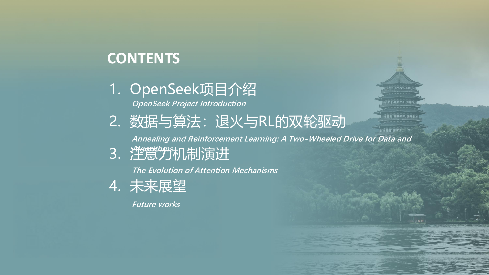

목차는 OpenSeek를 네 부분으로 나눈다: project introduction, data and algorithm의 annealing과 RL, attention mechanism evolution, future outlook. 이 순서는 단순히 model score만 말하는 것이 아니라, 먼저 open-source collaboration mechanism을 설명하고, 이어 training recipe를 다룬 뒤, 마지막에 system efficiency로 들어간다는 뜻이다.

단일 model release와 달리 OpenSeek는 open collaboration plan에 더 가깝다. data, training config, evaluation, system optimization을 모두 열어 두려 한다. 뒤에서 나오는 DMA/flash-dmattn은 system track이 기여할 수 있는 전형적인 예시다.

#### Slide 3: OpenSeek Project Introduction

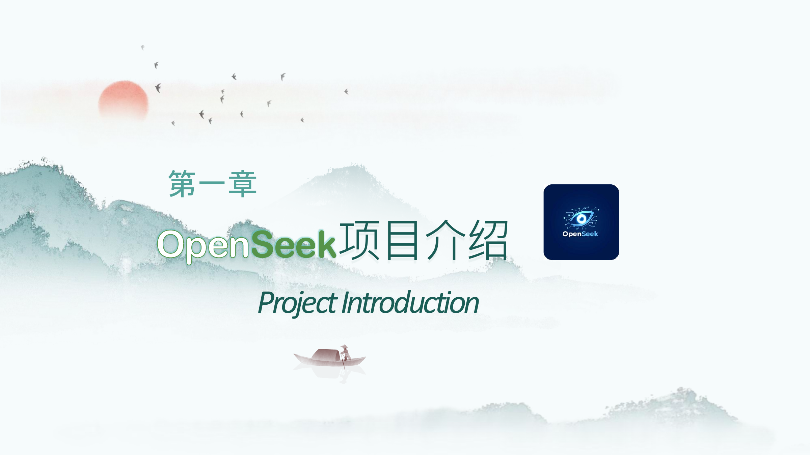

이 페이지는 project introduction section의 divider다. 뒤에서는 "Theseus's ship"과 "open-source community as shipyard"라는 두 비유로 OpenSeek의 engineering paradigm을 설명한다. model은 한 번 train해서 끝나는 static object가 아니라, data, algorithm, system이 계속 교체된 결과라는 것이다.

OpenSeek가 풀고 싶은 것은 open collaboration 안의 pipeline 문제다. community에는 data, algorithm, system optimization이 있을 수 있지만, unified baseline, evaluation, merge mechanism이 없으면 이런 변경은 같은 model 위에 누적되기 어렵다.

#### Slide 4: Theseus's Ship: Engineering paradigm replacement

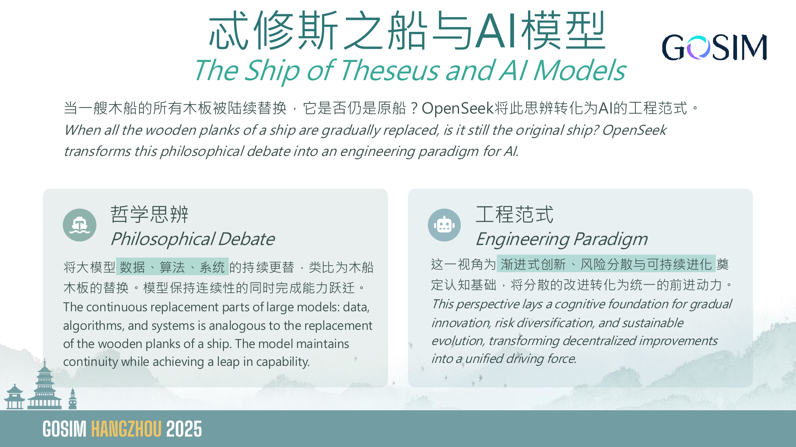

이 페이지는 Theseus's ship으로 AI model의 continuous evolution을 설명한다. 왼쪽은 철학적 사고실험이다. 배의 목재가 차례로 교체된 뒤에도 그것이 여전히 원래 배인가? 오른쪽은 engineering paradigm이다. large model의 data, algorithm, system을 지속적으로 교체하는 일을 나무배의 판자를 교체하는 것에 비유한다.

핵심은 continuity와 traceability다. model은 같은 evolution mainline을 유지하지만, data, algorithm, system이라는 판자를 하나 바꿀 때마다 evaluation, reproduction, rollback이 가능해야 한다. OpenSeek는 흩어진 improvement를 서로 호환되지 않는 fork 더미가 아니라, 하나의 전진 동력으로 바꾸고 싶어 한다.

#### Slide 5: Open-source community as shipyard

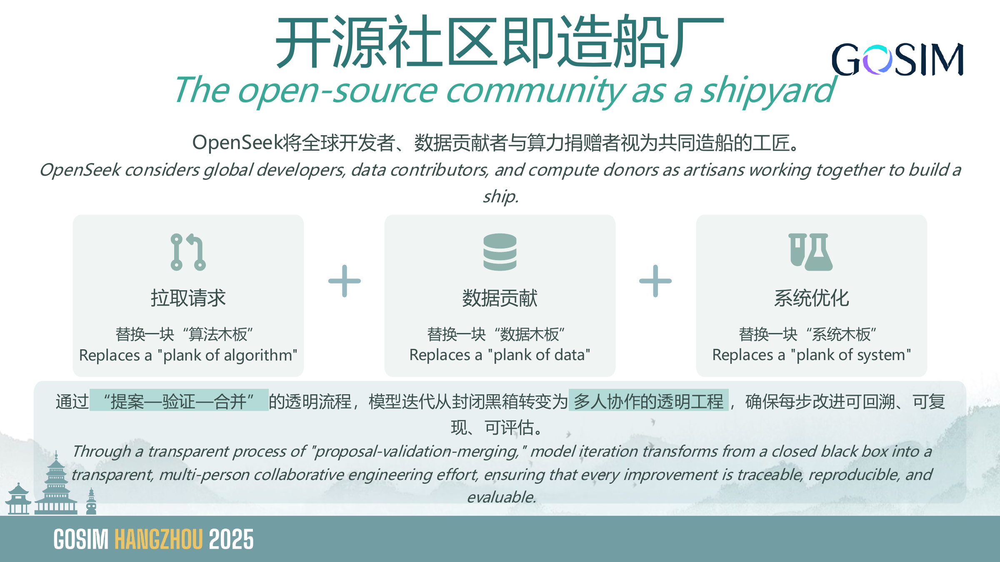

이 페이지는 open-source community를 shipyard에 비유한다. 그림 속 세 종류의 contribution은 세 가지 "plank"에 대응한다. pull request는 algorithm plank를 교체하고, data contribution은 data plank를 교체하며, system optimization은 system plank를 교체한다. 여기서 강조하는 것은 code PR만 contribution으로 치는 것이 아니라 data와 compute/system optimization도 model evolution 안으로 들어온다는 점이다.

아래 작은 글자는 process를 제시한다: proposal, verification, merge. 매우 engineering다운 표현이다. 먼저 incremental change를 제안하고, unified verification을 실행한 뒤, mainline에 merge할지 결정한다. public data, training script, evaluation이 없으면 algorithm improvement를 다른 사람이 이어받기 어렵고, 다른 task에서 퇴화했는지도 판단하기 어렵다.

#### Slide 6: Accumulated innovation and competition mechanism

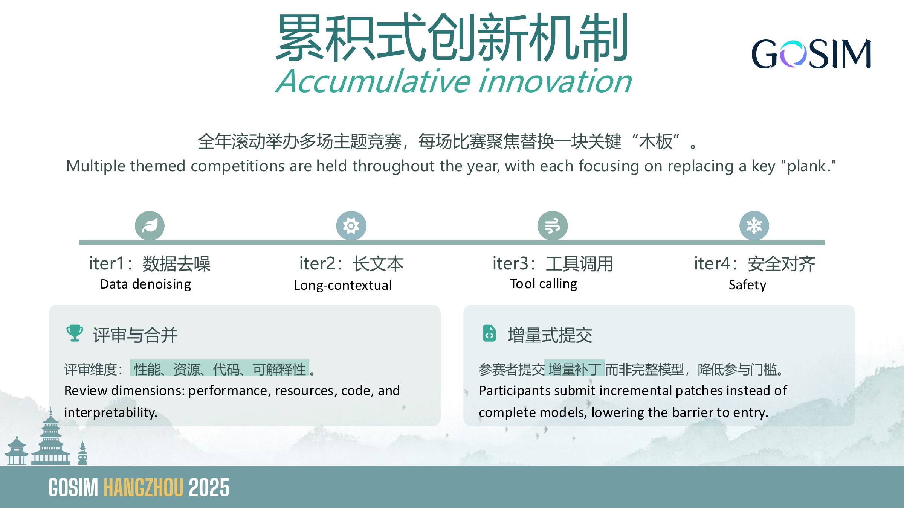

Accumulated innovation 페이지는 year-round rolling themed competitions를 말한다. 각 competition은 핵심 plank 하나를 교체하는 데 집중한다. slide에는 iter1 data denoising, iter2 long text, iter3 tool calling, iter4 safety alignment가 나열되어 있다. data, context, agent capability, safety를 정확히 덮는다.

Evaluation dimensions는 performance, resource, code, interpretability를 포함한다. 참가자가 제출하는 것은 full model이 아니라 incremental patch다. 이는 participation barrier를 낮추고, "각자 model 하나씩 train했지만 비교할 수 없는" 문제도 줄인다. flash-dmattn 같은 system optimization contribution은 이런 방식으로 들어오기에 적합하다.

#### Slide 7: OpenSeek Working Groups

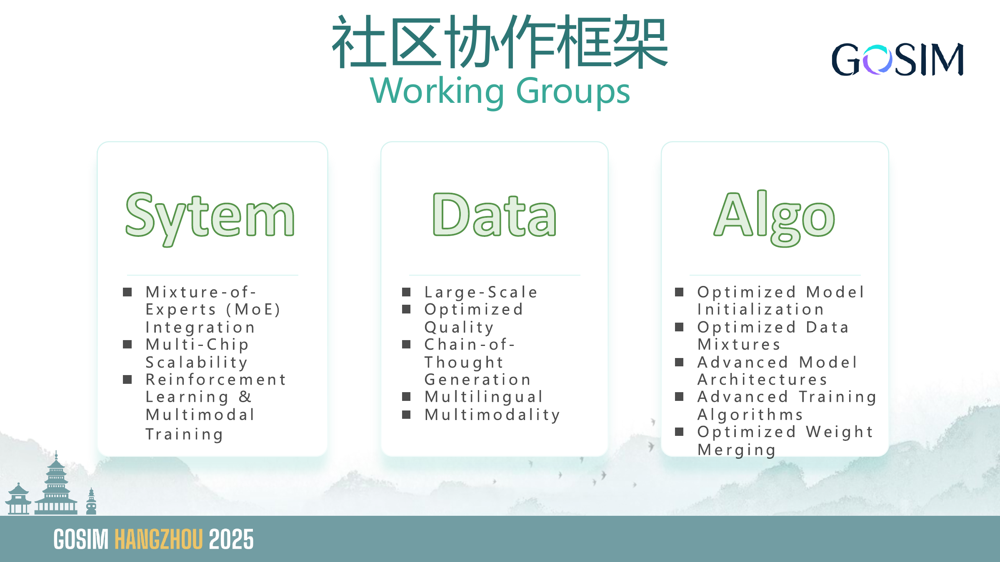

Working Groups 페이지는 collaboration을 System, Data, Algo로 나눈다. 이 division은 contribution path를 더 명확하게 만든다. data group은 cleaning, synthesis, evaluation set을 맡고, algorithm group은 training recipe, RL, structure change를 맡으며, system group은 training/inference efficiency, kernel, parallelism, deployment를 맡는다.

large model open source에 이런 division이 없으면 repo 하나에 issue만 쌓이기 쉽다. OpenSeek의 working group design은 한 가지 사실을 인정한다. model capability는 단일 방향으로만 밀어 올릴 수 없고, data quality, algorithm strategy, system efficiency가 동시에 앞으로 가야 한다.

#### Slide 8: Nonlinear leap

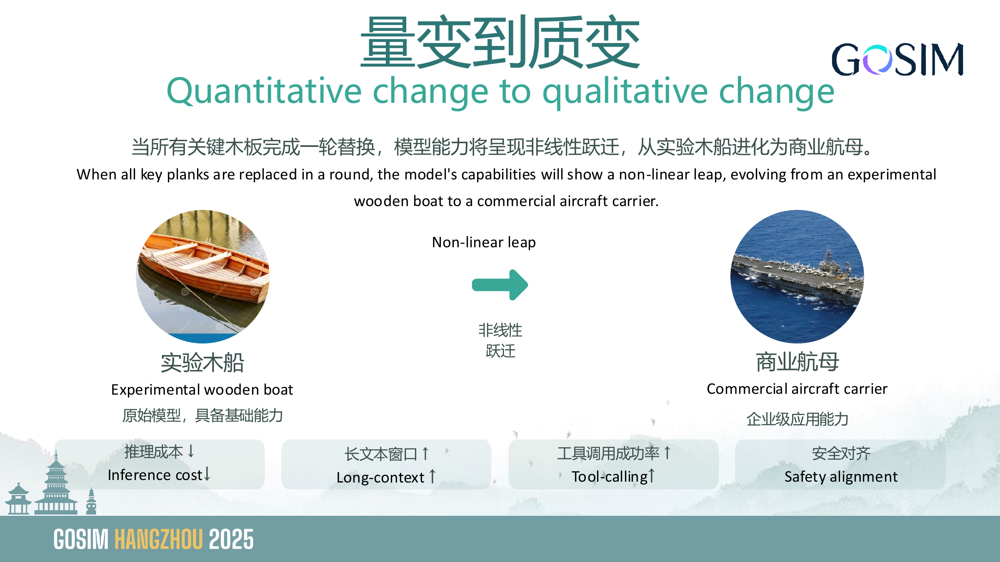

Nonlinear leap 페이지는 "plank" 비유를 이어간다. 모든 핵심 plank가 한 번 교체를 마치면 model capability는 experimental wooden boat에서 commercial aircraft carrier로 진화한다. 아래에는 네 가지 변화가 적혀 있다: inference cost 감소, long-context window 증가, tool calling success rate 향상, safety alignment 개선.

이것이 open-source collaboration의 compound effect다. data cleaning 한 번, attention kernel 한 번, training stability improvement 한 번은 각각 보면 작은 향상일 수 있다. 하지만 모두 같은 mainline에서 verification과 merge를 거치면 model capability curve 자체를 바꿀 수 있다.

#### Slide 9: Open-source competition and collaboration

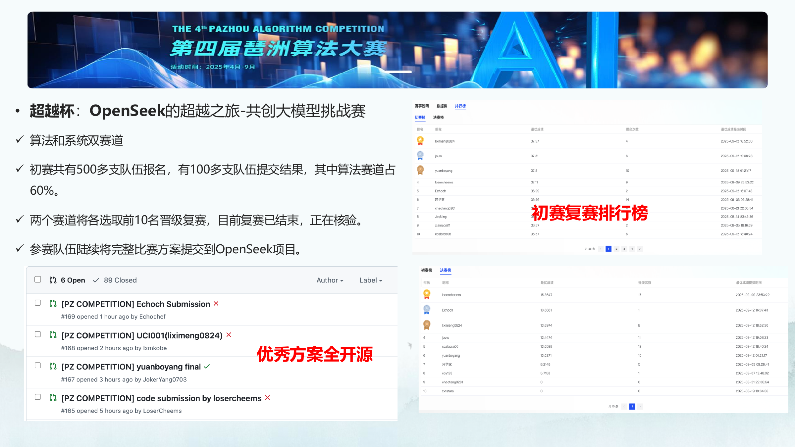

이 페이지는 "Beyond Cup" challenge를 소개한다. slide에는 algorithm과 system dual track, preliminary round에 500개 이상의 team registration, 100개 이상의 team submission, 그중 algorithm track이 60%를 차지한다는 내용이 적혀 있다. 두 track은 각각 top 10 team을 semifinal로 올리고, 뛰어난 solution은 모두 open source로 공개된다.

Competition mechanism의 가치는 contributor에게 명확한 target과 unified evaluation을 준다는 데 있다. data mix, annealing schedule, RL recipe, sparse attention, kernel optimization이 모두 같은 baseline 위에서 비교될 수 있다. OpenSeek 같은 project에서 competition은 별도 event가 아니라 external contribution을 mainline으로 끌어들이는 mechanism이다.

#### Slide 10: OpenSeek timeline

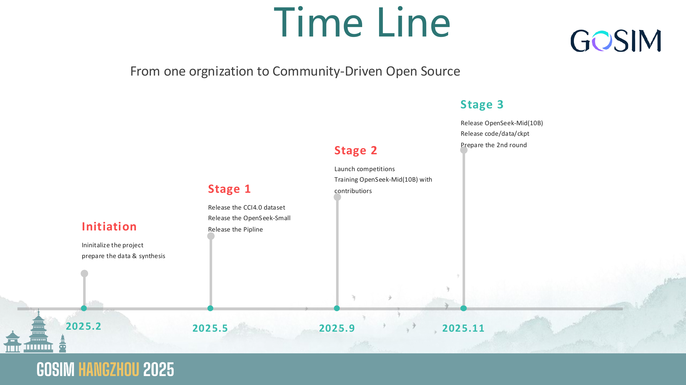

Timeline은 한 organization의 initiation에서 community-driven open source로 가는 과정을 보여준다. 2025.2는 initiation으로, data와 synthesis를 준비한다. 2025.5 Stage 1은 CCI4.0 dataset, OpenSeek-Small, pipeline을 release한다. 2025.9 Stage 2는 competition을 시작하고 contributor와 함께 OpenSeek-Mid를 train한다. 2025.11 Stage 3는 OpenSeek-Mid(10B), code, data, checkpoint release를 계획한다.

이 그림은 OpenSeek의 rhythm이 "닫힌 환경에서 먼저 잘 train한 뒤 open source"가 아니라는 점을 보여준다. baseline을 release하고, competition을 조직하고, contribution을 merge하는 일이 동시에 진행된다. README에서는 CCI4.0-M2, OpenSeek-Small v1, 100B baseline을 볼 수 있다. 이것들이 external contributor가 experiment를 reproduce하는 anchor다.

#### Slide 11: Data and Algorithm: Annealing + RL


이 페이지는 두 번째 part의 title이다: data and algorithm, annealing과 RL의 dual-wheel drive. annealing은 mid-training에서 data distribution과 learning rate/training stage를 조정하는 것에 대응하고, RL은 post-training에서 reward를 바탕으로 reasoning 같은 capability를 optimize하는 것에 대응한다.

OpenSeek-Small의 path는 pretrain tokens만 쌓는 방식이 아니라, mid-training과 post-training에서 data distribution과 training objective를 조정하는 것이다. 이 section은 뒤에서 two-stage mid-training, SFT, GRPO로 이 training path를 설명한다.

#### Slide 12: OpenMDW and OpenSeek-Small

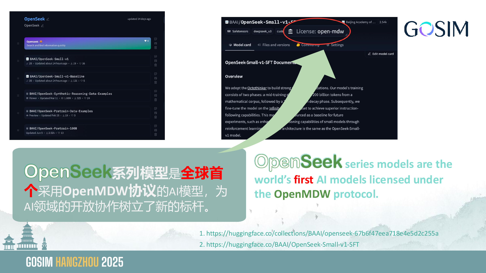

이 페이지는 OpenSeek series model이 OpenMDW protocol을 사용한다고 설명하고, HuggingFace collection과 OpenSeek-Small-v1-SFT link를 제시한다. OpenMDW의 핵심은 AI model open collaboration을 위한 더 명확한 license foundation을 주어 data, model, derivative work가 규칙 아래에서 공유될 수 있게 하는 것이다.

Engineering reproduction 관점에서 link 자체가 전부는 아니다. 정말 유용한 것은 checkpoint, wandb, config, eval, data description이 함께 공개되어, 누군가 특정 change의 gain을 찾아낼 수 있게 하는 것이다. 그렇지 않으면 open source는 model download에서 멈추고 incremental innovation을 지원하기 어렵다.

#### Slide 13: Efficiency direction

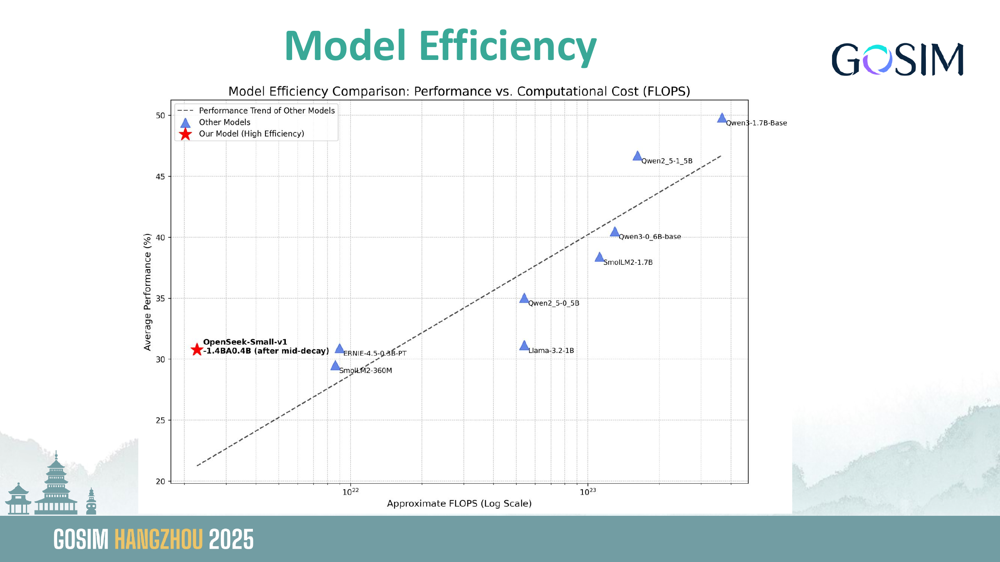

이 페이지는 Model Efficiency section transition이며, 뒤에서 training method와 attention mechanism으로 들어간다. OpenSeek에서 efficiency는 별도의 "deployment optimization"이 아니라 model structure, training recipe, long-context capability와 묶여 있다.

long-context attention의 `O(N^2)` cost는 training과 inference를 제한한다. DMA/NSA 같은 sparse attention은 invalid token computation을 건너뛰고자 한다. 뒤에서 보는 flash-dmattn code는 system group contribution이 model efficiency에 어떻게 내려앉는지 보여주는 예시다.

#### Slide 14: Training method overview

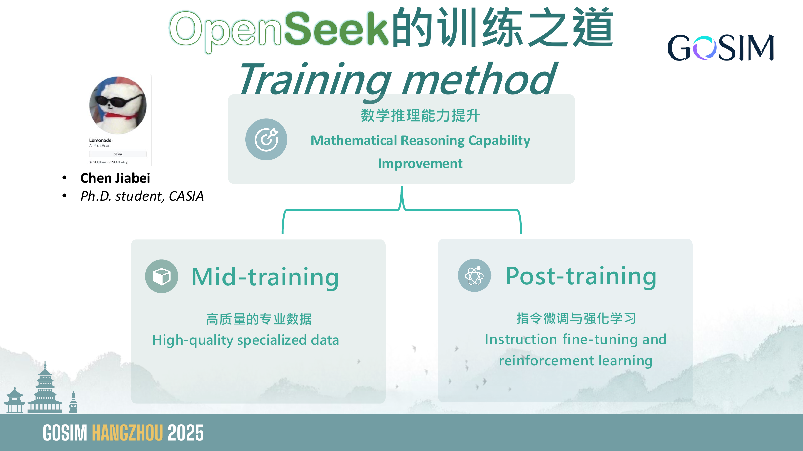

Training method overview page의 title은 OpenSeek의 training way이며, mathematical reasoning capability 향상을 강조한다. 그림은 training을 Mid-training과 Post-training으로 나눈다. 전자는 high-quality professional data를 사용하고, 후자는 instruction tuning과 reinforcement learning을 사용한다.

OpenSeek-Small config를 보면 MoE, router, group top-k 같은 training configuration도 확인할 수 있다. 여기서 training method는 고립된 algorithm이 아니라 data, model structure, system configuration이 함께 만든 recipe다.

#### Slide 15: Mid-training two stages

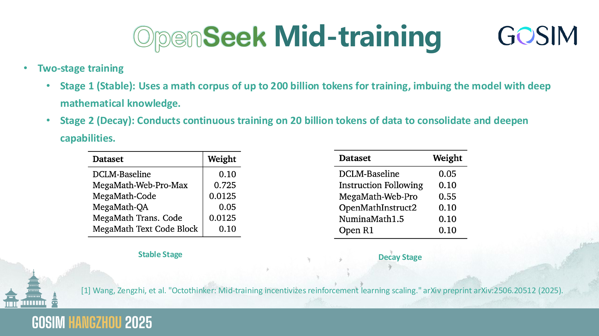

Mid-training page에는 two-stage training이 적혀 있다. Stage 1은 Stable로, 최대 200B math corpus를 사용해 model이 더 깊은 mathematical knowledge를 얻도록 train한다. Stage 2는 Decay로, 20B tokens를 사용해 continuous training을 수행하며 capability를 consolidate하고 deepen한다.

이 design은 capability strengthening과 distribution callback을 분리한 것으로 볼 수 있다. 먼저 high-quality math data로 집중적으로 강화한 뒤, decay stage에서 math domain에만 지나치게 치우치는 문제를 완화한다. slide는 OctoThinker도 인용하는데, 이는 mid-training이 뒤따르는 RL scaling에 영향을 줄 수 있음을 설명한다.

#### Slide 16: Post-training: SFT + GRPO

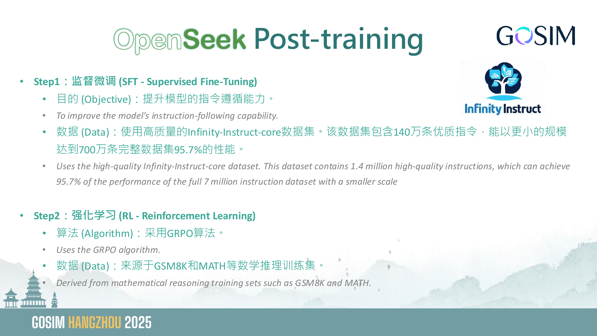

Post-training page는 두 단계로 나뉜다. Step1은 SFT이며, objective는 instruction-following 향상이다. data는 Infinity-Instruct-core이고, 1.4M high-quality instructions가 full 7M dataset의 95.7% performance에 도달할 수 있다고 한다. Step2는 RL이며, algorithm은 GRPO, data는 GSM8K, MATH 같은 mathematical reasoning training set에서 온다.

여기의 signal은 분명하다. data filtering은 무작정 data volume을 늘리는 것보다 중요하다. SFT가 format과 instruction-following capability를 먼저 안정화하고, GRPO가 verifiable math task를 통해 reasoning path를 optimize한다. 이 flow는 external contributor가 data, reward, algorithm, training config를 각각 교체하기에도 좋다.

#### Slide 17: OpenSeek-Small results

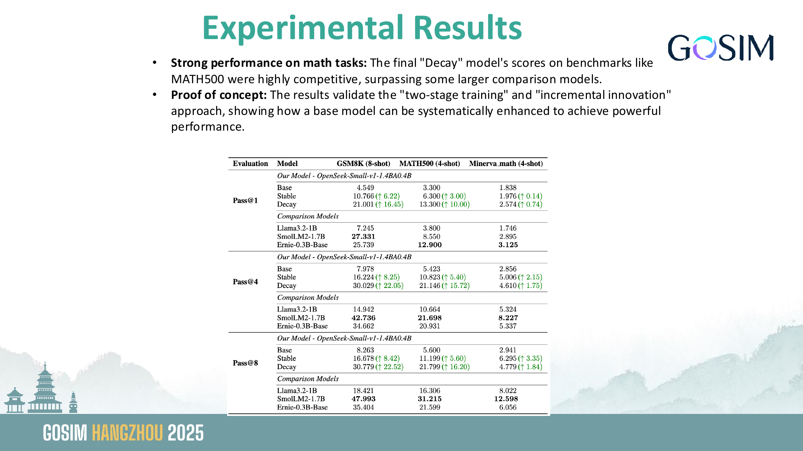

Results page는 두 가지를 보여준다. final Decay model은 MATH500 등 math benchmark에서 competitive한 performance를 내며, 일부 더 큰 comparison model을 넘는다. 또한 two-stage training과 incremental innovation approach, 즉 base model이 systematic enhancement를 통해 더 강한 capability를 얻을 수 있음을 검증한다.

Baseline으로서 이 페이지의 핵심은 final model이라고 주장하는 것이 아니라, 후속 contribution을 위한 reference point를 주는 것이다. open collaboration에는 comparable starting point가 필요하다. 뒤따르는 data, algorithm, system patch는 모두 이 baseline과 같은 조건에서 evaluation되어야 한다.

#### Slide 18: Training curves

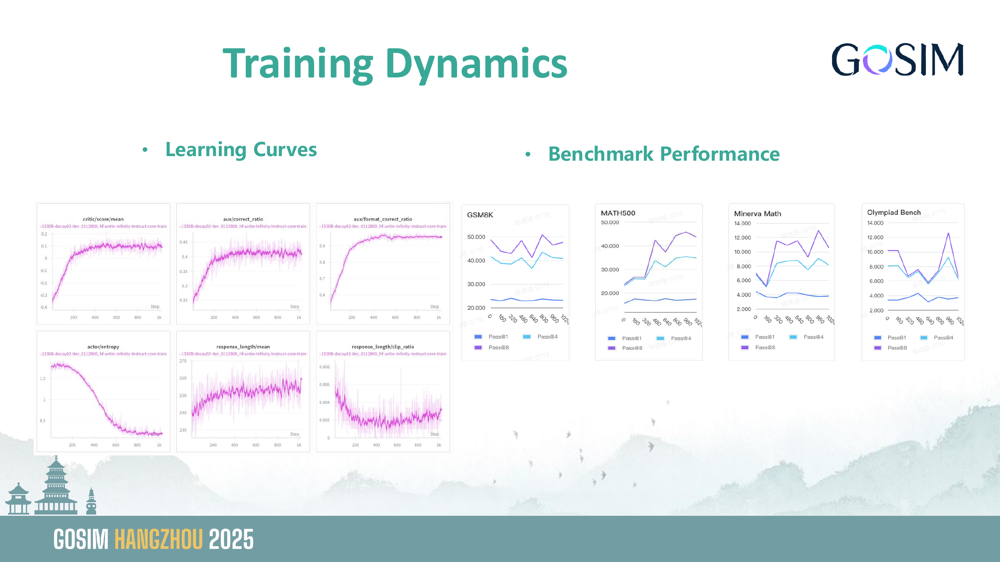

Training curves page는 learning curves와 benchmark performance로 나뉜다. learning curves는 training이 stable한지, loss spike나 plateau가 생겼는지 보는 데 쓰인다. benchmark performance는 특정 stage의 checkpoint가 task에서 실제로 향상됐는지 확인하는 데 쓰인다.

large model open source에서 final score만 주고 training curve를 주지 않으면, external contributor는 자신의 change가 early convergence를 돕는지, late-stage generalization을 개선하는지, 아니면 특정 benchmark에서 우연히 흔들린 것인지 알기 어렵다. OpenSeek가 curves를 공개하는 것은 더 iterative한 baseline에 적합하다.

#### Slide 19: Attention evolution


이 페이지는 attention mechanism evolution section의 divider다. 뒤에서는 traditional attention의 `O(N^2)` complexity에서 DMA로 가고, Trainable Dynamic Mask Sparse Attention과 flash-dmattn code로 이어진다.

long context에서 진짜 어려운 점은 mask가 compute를 아끼면서도 key token을 잃지 않아야 한다는 것이다. fixed local window는 distant dependency를 놓치기 쉽고, handwritten sparse pattern도 모든 task에 맞는 것은 아니다. DMA의 목표는 mask가 input에 따라 dynamic하게 변하게 하는 것이다.

#### Slide 20: Dynamic Mask Attention

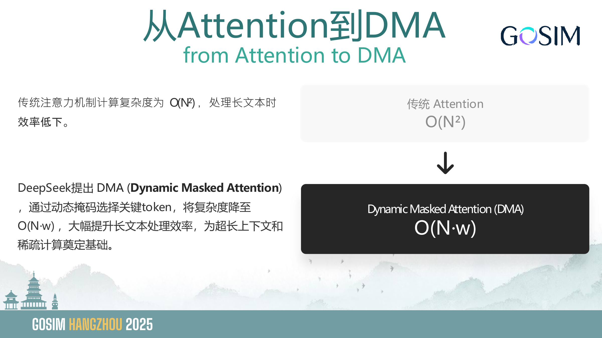

이 페이지는 문제를 complexity comparison으로 압축한다. traditional attention은 `O(N^2)`이고 sequence length가 두 배가 되면 QK와 softmax matrix가 제곱으로 커진다. DMA의 생각은 각 token에 대해 소수의 중요한 historical token을 dynamic하게 선택하고, compute complexity를 `O(N*w)`로 줄이는 것이다. 여기서 `w`는 보존되는 token 또는 window 수다.

여기서 "dynamic"이 중요하다. fixed local window는 가장 가까운 context만 볼 수 있지만, long document의 key information은 멀리 떨어진 위치에 있을 수 있다. DMA는 mask를 input content가 결정하게 하여 대부분의 invalid position은 건너뛰면서 cross-segment dependency를 보존하려 한다. 뒤에서 보는 flash-dmattn kernel code는 이런 dynamic sparse mask가 formula에만 머물지 않게 만드는 부분이다.

#### Slide 21: Trainable Dynamic Mask Sparse Attention

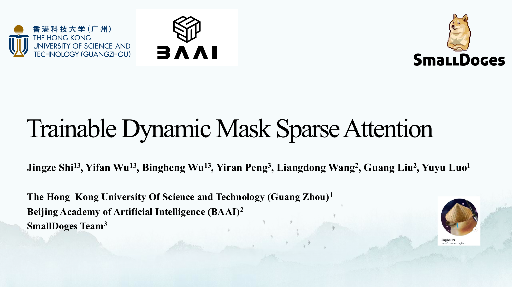

이 페이지는 paper title page다: Trainable Dynamic Mask Sparse Attention. 핵심은 `Trainable`과 `Dynamic Mask`라는 두 단어다. mask는 더 이상 handwritten rule도 fixed sliding window도 아니며, trainable parameter를 통해 서로 다른 historical position에 score를 주고 top-w position만 attention에 남긴다.

이 방식은 pure sparse pattern보다 language task에 더 잘 맞는다. model은 "현재 query가 어떤 token을 돌아봐야 하는지"를 학습할 수 있다. 예를 들면 definition, constraint, code block beginning, previous answer 같은 것들이다. 단점은 mask generation 자체도 efficient해야 한다는 점이다. 그렇지 않으면 attention compute를 줄여 얻은 이득이 mask compute에 먹힌다.

#### Slide 22: flash-dmattn code and paper

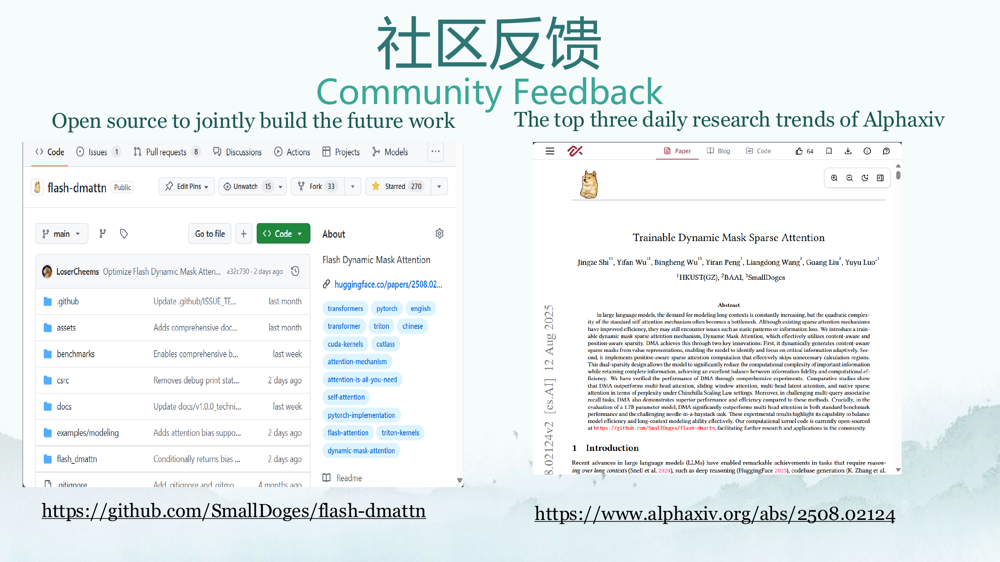

flash-dmattn repository는 Triton/CuTe implementation을 제공하며, 이 talk에서 가장 명확한 code landing point다. slide는 GitHub address와 Alphaxiv page를 함께 제시한다. 이 부분이 paper/idea에서 public implementation으로 내려왔다는 뜻이다.

이는 dense, sparse, gated, local, GQA/MQA, sparse softmax threshold를 지원한다. 뒤의 code analysis는 `topk_mask`, `FlashGatedAttnFunc`, Triton forward를 중점적으로 본다. 이 위치들은 각각 mask generation, trainable gate, tile-level compute skipping에 대응한다.

#### Slide 23: DMA vs NSA

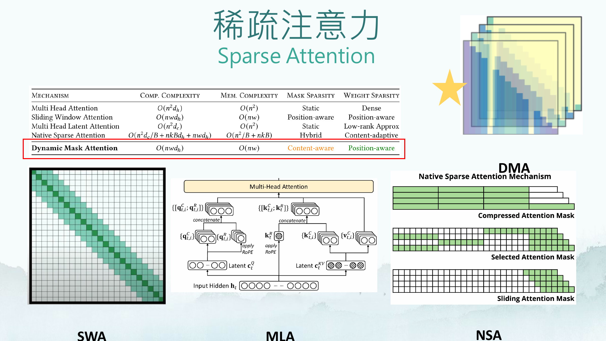

DMA vs NSA 페이지는 두 종류의 sparse attention을 나란히 둔다. NSA는 preset 또는 structured sparsity에 가깝고, DMA는 dynamic mask를 강조한다. 현재 input과 trainable parameter에 따라 어떤 token이 attention에 들어갈지 결정한다.

slides는 trainable dynamic mask 쪽에 더 무게를 둔다. code에서는 `topk_mask`와 gated attention이 핵심 entry다. 이 페이지를 볼 때는 "FLOPs 절감"과 "key token 보존"을 같이 봐야 한다. mask가 aggressive할수록 compute는 더 줄지만, long-context retrieval과 general benchmark는 더 빨리 떨어질 수 있다.

#### Slide 24: top-w / delta mask method

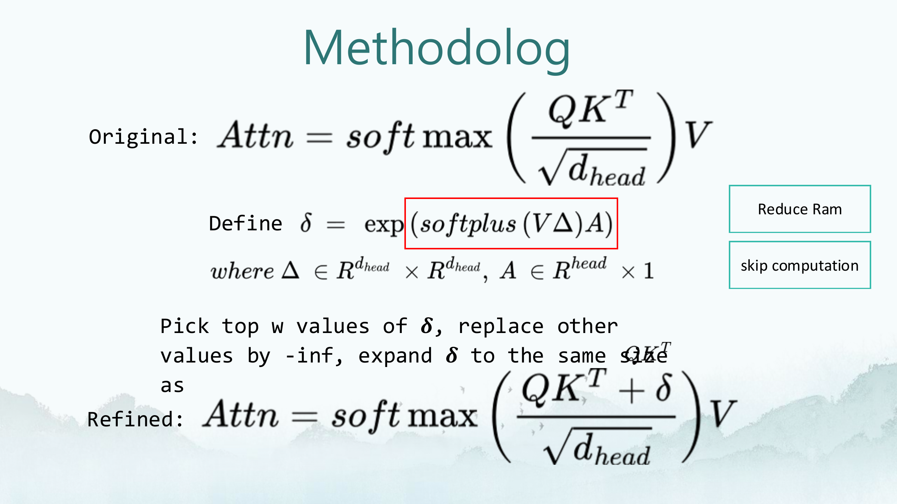

이 페이지는 DMA mask formula를 제시한다. original attention은 `softmax(QK^T / sqrt(d_head))V`다. DMA는 먼저 extra bias term `delta = exp(softplus(VΔ)A)`를 정의한다. 여기서 `Δ`는 head dimension 안의 trainable matrix이고, `A`는 head별 trainable coefficient다. 그런 다음 `delta`에서 top-w values를 선택하고 나머지 position을 `-inf`로 만든 뒤, `delta`를 `QK^T`와 같은 size로 expand하여 refined attention, 즉 `softmax((QK^T + delta) / sqrt(d_head))V`를 얻는다.

오른쪽의 "Reduce RAM / skip computation"은 두 가지 이득에 대응한다. `-inf`가 된 position은 softmax의 effective computation에 참여할 필요가 없다. sparse structure가 명확해지면 kernel은 이런 block을 skip하여 intermediate matrix와 HBM read/write를 줄일 수 있다. 이것은 full attention을 먼저 계산한 뒤 result를 crop하는 것이 아니라, mask를 attention computation path 안으로 미리 넣는 방식이다.

#### Slide 25: Experimental setup

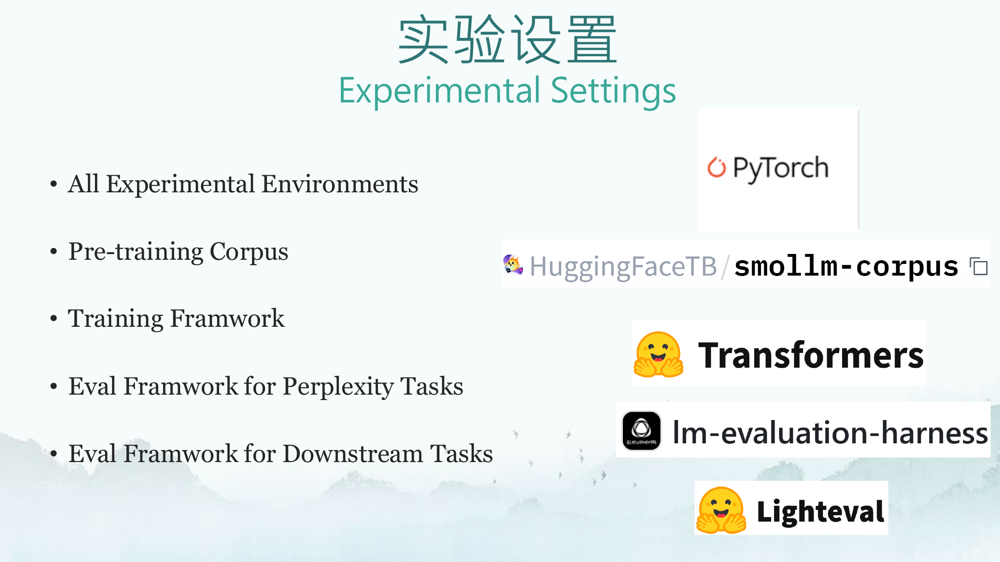

Experimental setup page는 All Experimental Environments, Pre-training Corpus, Training Framework, Eval Framework for Perplexity Tasks, Eval Framework for Downstream Tasks를 나열한다. 이는 sparse attention result를 unified training/evaluation environment 안에서 봐야 한다는 reminder다.

sparse attention의 benefit은 accuracy와 함께 평가해야 한다. speed만 보고하면 needle류 task의 recall problem을 가릴 수 있고, perplexity만 보고하면 실제 latency가 줄었는지 알 수 없다. 뒤의 Scaling, MQAR, Needle, General benchmark 네 페이지는 바로 이 logic으로 구성된다.

#### Slide 26: Scaling: fewer FLOPs

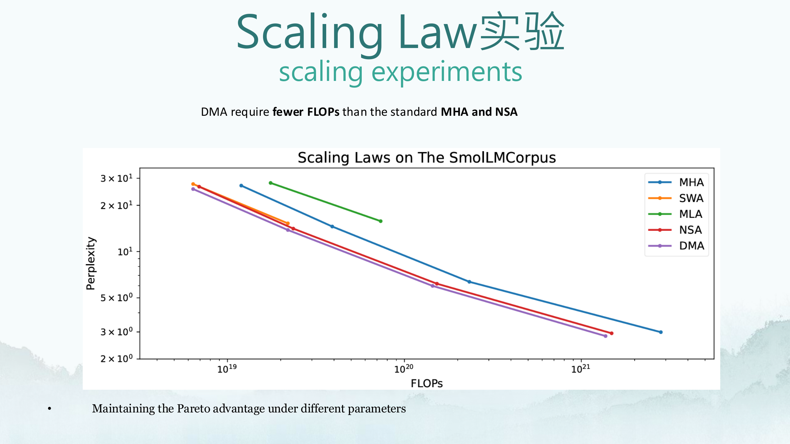

이 페이지의 title은 Scaling Law experiment이고, 그림에는 "DMA require fewer FLOPs than the standard MHA and NSA"라고 적혀 있다. x-axis는 FLOPs, y-axis는 perplexity이며, curve는 MHA, SWA, MLA, NSA, DMA를 비교한다. 보라색 DMA curve는 전체적으로 빨간 NSA와 파란 MHA보다 낮다. 비슷한 perplexity에서 더 적은 FLOPs가 필요하다는 뜻이다. 초록 MLA curve는 이 experiment에서는 우위에 있지 않다.

아래 작은 글자는 "Maintaining the Pareto advantage under different parameters"다. 이 문장은 sparse attention의 핵심 verification method에 대응한다. 단순히 덜 계산한다는 것만 증명하면 안 되고, 덜 계산한 뒤에도 perplexity가 더 나은 Pareto frontier에 있어야 한다. DMA의 dynamic mask가 서로 다른 parameter scale에서 이 관계를 유지한다면, 그것은 transferable sparse pattern을 학습했다는 뜻이다.

#### Slide 27: MQAR speed

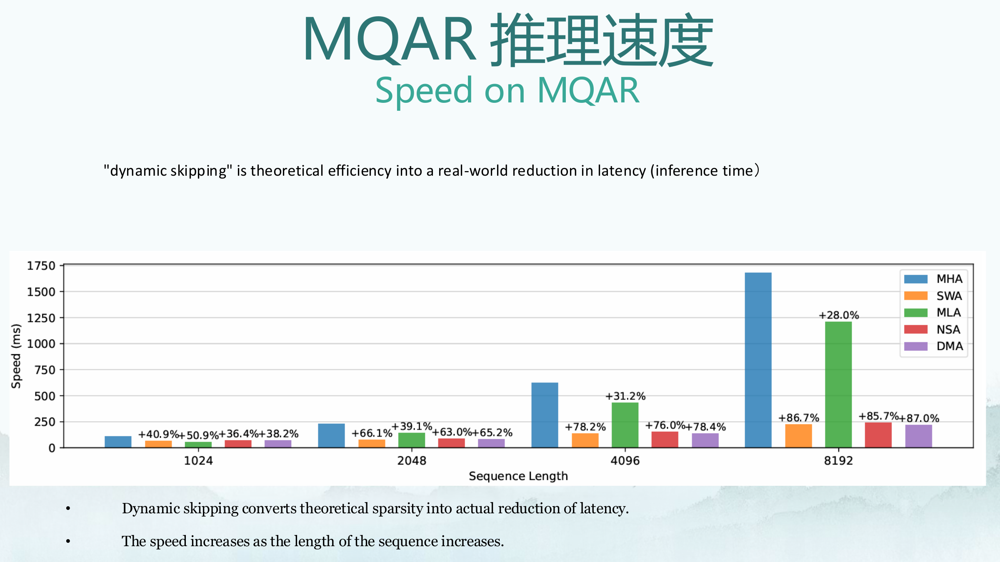

MQAR은 multi-query associative recall이며, long context의 key-value retrieval speed를 재기에 적합하다. figure의 x-axis는 sequence length로 1024부터 8192까지이고, y-axis는 speed(ms)다. 파란 MHA는 long sequence에서 급격히 느려져 8192에서는 거의 1700ms에 가깝다. SWA, NSA, DMA는 모두 MHA보다 훨씬 낮다. bar 위의 percentage는 relative speedup으로 볼 수 있는데, 4096에서 DMA는 약 78.4%, 8192에서 약 87.0%로 표시되어 있다.

page header 가운데의 "dynamic skipping is theoretical efficiency into a real-world reduction in latency"가 이 페이지의 핵심이다. 이전 page는 FLOPs가 적다는 것을 보였고, 이 page는 actual latency가 내려가는지 본다. 아래 두 줄의 작은 글자도 같은 점을 강조한다. dynamic skipping은 theoretical sparsity를 real latency reduction으로 바꾸며, sequence가 길수록 gain이 더 분명해진다.

#### Slide 28: Needle-in-a-haystack

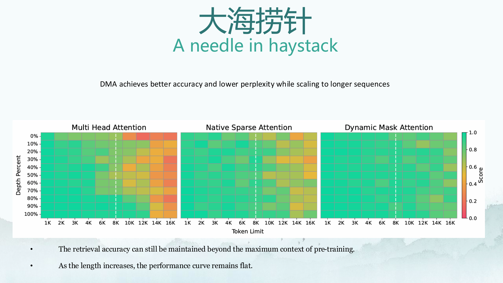

Needle-in-a-haystack은 sparse attention에 대한 recall stress test다. key information을 long context의 여러 depth에 묻고 model이 찾아낼 수 있는지 본다. 그림의 heatmap 세 개는 각각 MHA, Native Sparse Attention, Dynamic Mask Attention이다. x-axis는 token limit으로 1K부터 16K까지이고, y-axis는 depth percent로 0%부터 100%까지다. 색이 green에 가까울수록 score가 높다.

흰색 dashed line은 8K position에 표시되어 있는데, pre-training maximum context 근처의 boundary로 이해할 수 있다. MHA와 NSA는 10K, 12K, 14K, 16K column에서 yellow/orange block이 더 많이 나타나며, training length를 넘으면 recall이 불안정해진다는 뜻이다. DMA는 오른쪽에서도 여전히 넓은 영역을 green으로 유지한다. 아래 작은 글자는 "beyond the maximum context of pre-training"에서도 retrieval accuracy를 유지한다고 말한다. 즉 DMA의 dynamic mask가 needle에 필요한 distant relation을 잘라내지 않았다는 뜻이다.

#### Slide 29: General benchmark

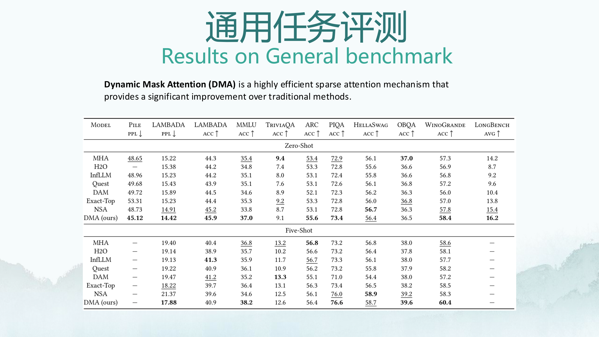

이 페이지의 table은 DMA를 general benchmark에서 비교한다. columns는 Pile/Lambada perplexity, Lambada/MMLU/TriviaQA/ARC/PIQA/HellaSwag/OBQA/WinoGrande accuracy, LongBench average를 포함한다. arrow는 PPL은 낮을수록 좋고 ACC/AVG는 높을수록 좋다는 뜻이다. table은 Zero-Shot과 Five-Shot 두 section으로 나뉘며, row에는 MHA 외에도 H2O, InfLLM, Quest, DAM, Exact-Top, NSA, DMA가 있다.

Zero-Shot에서 DMA의 Pile PPL은 45.12, LongBench Avg는 16.2이고, MMLU, ARC, PIQA, WinoGrande 등에도 bold item이 있다. Five-Shot에서는 DMA가 Lambada PPL, MMLU, PIQA, OBQA, WinoGrande 등에서 앞쪽에 있다. 여기서 볼 것은 특정 single point의 최고치가 아니라, DMA가 long context, perplexity, general capability 사이에서 뚜렷한 편식을 보이지 않는다는 점이다. long-context optimization이 synthetic task에서만 유효하면 실제 가치는 매우 제한된다.

#### Slide 30: Future plan


Future plan page는 마지막 chapter의 divider다. 앞에서 OpenSeek-Small과 DMA를 설명했고, 뒤에서는 OpenSeek-mid 10B plan과 three pillars로 들어간다.

더 큰 model, 더 긴 training, 더 복잡한 attention structure는 system optimization을 전면으로 끌어낸다. 10B scale은 수백억 이상 model보다는 작지만, data efficiency, training efficiency, structure efficiency가 함께 향상될 수 있는지 검증하기에는 충분하다.

#### Slide 31: OpenSeek-mid 10B plan

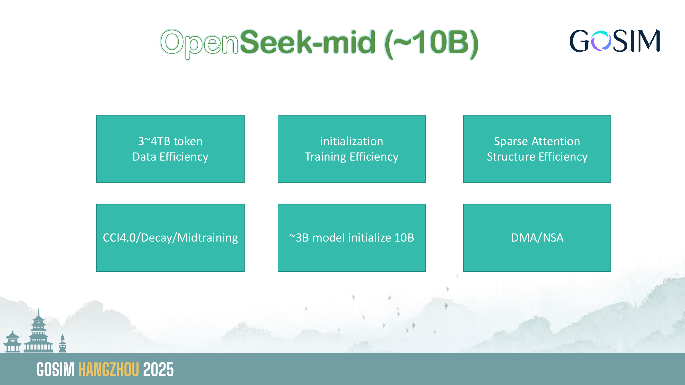

OpenSeek-mid page는 다음 stage를 세 column으로 나눈다. Data Efficiency는 3-4TB token이고, data source는 CCI4.0/Decay/Midtraining을 포함한다. Training Efficiency는 약 3B model로 10B를 initialize하는 것이다. Structure Efficiency는 DMA/NSA다.

이 plan은 sparse attention이 독립적인 experiment가 아니라 model training recipe로 들어간다는 것을 보여준다. data, initialization strategy, structure efficiency를 함께 바꿔야 DMA/NSA가 real model training에 stable gain을 주는지 판단할 수 있다.

#### Slide 32: Three pillars: data, algorithm, system

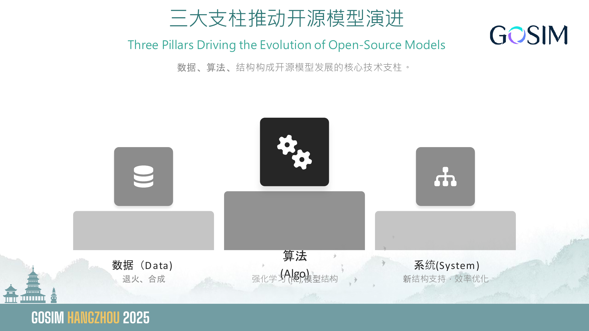

Three pillars page는 open model evolution을 Data, Algo, System으로 나눈다. Data에는 annealing과 synthesis가 포함되고, Algo에는 RL과 model structure가 포함되며, System에는 new structure support와 efficiency optimization이 포함된다.

OpenSeek의 특징은 system을 post-processing으로 보지 않는다는 점이다. attention kernel, training framework, inference efficiency, data recipe가 함께 open되어야 system contribution이 model capability에 실제로 feedback될 기회를 얻는다. flash-dmattn을 이 글에서 다루는 이유도 그것이 정확히 System pillar에 대응하기 때문이다.

#### Slide 33: Community invitation

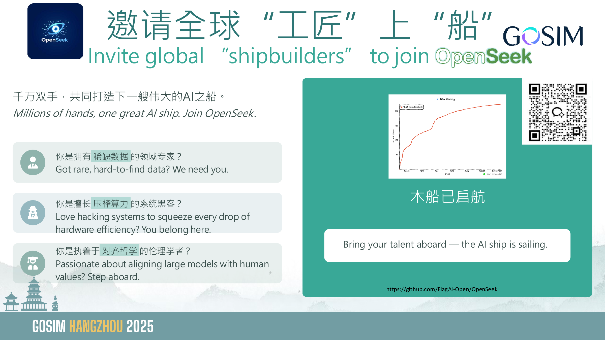

Community invitation page는 직설적이다. open model은 지속적인 contribution에 기대야 한다. engineering contributor에게 flash-dmattn, FlagScale, training config는 모두 participation entry다.

slide는 contributor를 세 종류로 나눈다. scarce data를 가진 domain expert, compute를 쥐어짜는 데 능한 system engineer, alignment philosophy에 관심 있는 researcher다. OpenSeek의 three pillars에 대응시키면 Data, System, Algo가 모두 배에 오를 수 있다. system side의 가장 직접적인 entry는 attention kernel, training efficiency, inference efficiency다.

#### Slide 34: Booth and contact

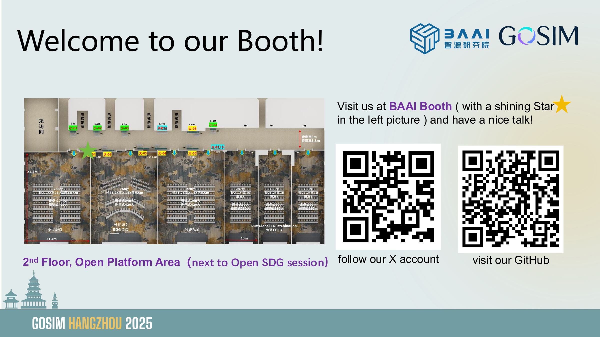

마지막은 booth와 contact다. 이 페이지에는 새로운 technical increment가 없으므로, 뒤에서는 OpenSeek의 public assets와 DMA code에 다시 초점을 둔다.

## 0x3. 핵심 코드 해설

OpenSeek README의 baseline 공개 방식은 꽤 완전하다. 100B data, training code, wandb, checkpoint, eval이 모두 나열되어 있다. training config에서는 group top-k, router scaling 같은 MoE router parameter도 볼 수 있다. 이런 config는 open-source reproduction experiment에 매우 중요하다.

slides의 Dynamic Mask Attention에 대응하는 public code는 `flash-dmattn`에 있다. 먼저 model layer를 보자. `FlashSparseAttention`은 ordinary attention보다 projection이 두 개 더 많다. `a_proj`와 `d_proj`다. Q/K/V는 그대로 계산하고, `alpha_states`, `delta_states`는 gated sparse kernel에 넘겨 어떤 tile을 계산할지 판단하게 한다.

```python
class FlashSparseAttention(nn.Module):
    def __init__(self, config, layer_idx=None):
        self.q_proj = nn.Linear(
            config.hidden_size, self.num_attention_heads * self.head_dim, bias=False
        )
        self.k_proj = nn.Linear(
            config.hidden_size, self.num_key_value_heads * self.head_dim, bias=False
        )
        self.v_proj = nn.Linear(
            config.hidden_size, self.num_key_value_heads * self.head_dim, bias=False
        )
        self.a_proj = nn.Linear(
            config.hidden_size, self.num_attention_heads, bias=False
        )
        self.d_proj = nn.Linear(
            config.hidden_size, self.num_key_value_heads, bias=False
        )
```

```python
def forward(self, hidden_states: torch.Tensor, **kwargs):
    query_states = self.q_proj(hidden_states).view(
        bsz, seq_len, self.num_attention_heads, self.head_dim
    )
    key_states = self.k_proj(hidden_states).view(
        bsz, seq_len, self.num_key_value_heads, self.head_dim
    )
    value_states = self.v_proj(hidden_states).view(
        bsz, seq_len, self.num_key_value_heads, self.head_dim
    )

    alpha_states = self.a_proj(hidden_states)
    delta_states = self.d_proj(hidden_states)

    attn_output = flash_gated_attn_func(
        query_states,
        key_states,
        value_states,
        alpha_states,
        delta_states,
        is_causal=self.is_causal,
        softmax_scale=self.scaling,
        softmax_threshold=self.softmax_threshold,
        gate_threshold=self.gate_threshold,
    )
```

이 code는 Slide 20/21을 설명한다. DMA는 static sparse pattern이 아니다. model은 current hidden states에 따라 gate 관련 `alpha/delta`를 만들고, kernel은 그것들을 사용해 sparse attention의 실제 computation range를 결정한다.

mask path에서는 먼저 `topk_mask`를 본다. 이는 attention bias를 기준으로 각 query가 볼 key를 선택한다.

```python
def topk_mask(attention_bias, attention_mask, window_size, min_dtype, block_size=None, **kwargs):
    attention_bias = attention_bias.detach()
    attention_bias = (
        attention_bias.masked_fill(~attention_mask, min_dtype)
        if attention_mask is not None
        else attention_bias
    )
    topk_values, topk_indices = torch.topk(
        attention_bias, window_size, dim=-1, largest=True, sorted=False
    )
    attention_mask = torch.zeros_like(
        attention_bias, dtype=torch.bool, device=attention_bias.device
    ).scatter_(-1, topk_indices, topk_values != min_dtype)

    if block_size is not None and block_size > 1:
        key_len = attention_mask.shape[-1]
        attention_mask = block_smooth(attention_mask, key_len, block_size)
    return attention_mask
```

`block_smooth`는 token mask를 block-level selection으로 smoothing한다. 이렇게 하는 이유는 GPU kernel의 tile access에 맞추기 위해서다. sparsity를 single-token granularity까지 내려 버리면 kernel이 efficient해지기 어렵다. `create_mask`는 ordinary 2D attention mask를 kernel이 consume할 수 있는 4D mask로 reshape하고, `type`에 따라 top-k 또는 relu mask를 선택한다.

```python
def create_mask(
    attention_bias: torch.Tensor,
    query_len: int,
    type: str = "topk",
    attention_mask: Optional[torch.Tensor] = None,
    window_size: Optional[int] = None,
    min_dtype: Optional[float] = None,
    block_size: Optional[int] = None,
) -> torch.Tensor:
    if min_dtype is None:
        min_dtype = torch.finfo(attention_bias.dtype).min

    if attention_mask is not None and attention_mask.dim() == 2:
        attention_mask = attention_mask[:, None, None, :]

    if type == "topk":
        return topk_mask(
            attention_bias,
            attention_mask,
            window_size,
            min_dtype,
            block_size=block_size,
        )
```

그 아래는 PyTorch autograd wrapper다. `FlashSparseAttnFunc.forward`는 Triton forward를 호출하고, backward를 위해 `query/key/value/out/lse`를 저장한다. `FlashGatedAttnFunc`는 `alpha/delta`도 추가로 저장한다. gate 자체도 trainable하기 때문이다.

```python
class FlashSparseAttnFunc(torch.autograd.Function):
    @staticmethod
    def forward(ctx, query, key, value, is_causal=False,
                softmax_scale=None, softmax_threshold=None, window_size=(None, None),
                is_split_kv=False, pack_gqa=False, return_lse=False):
        out, lse, softmax_scale, softmax_threshold = _flash_sparse_attn_base_forward(
            query=query,
            key=key,
            value=value,
            is_causal=False if query.shape[1] == 1 else is_causal,
            softmax_scale=softmax_scale,
            softmax_threshold=softmax_threshold,
            window_size=window_size,
            is_split_kv=is_split_kv,
            pack_gqa=pack_gqa,
        )

        ctx.save_for_backward(query, key, value, out, lse)
        ctx.softmax_scale = softmax_scale
        ctx.softmax_threshold = softmax_threshold
        ctx.window_size = window_size
        return out
```

```python
class FlashGatedAttnFunc(torch.autograd.Function):
    @staticmethod
    def forward(ctx, query, key, value, alpha, delta, is_causal=False,
                softmax_scale=None, softmax_threshold=None, gate_threshold=None,
                is_logsigmoid_gate=True, is_adapt_gate=True,
                window_size=(None, None), is_split_kv=False, pack_gqa=False,
                return_lse=False):
        out, lse, softmax_scale, softmax_threshold, gate_threshold = (
            _flash_gated_attn_base_forward(
                query=query,
                key=key,
                value=value,
                alpha=alpha,
                delta=delta,
                is_causal=False if query.shape[1] == 1 else is_causal,
                softmax_scale=softmax_scale,
                softmax_threshold=softmax_threshold,
                gate_threshold=gate_threshold,
                is_logsigmoid_gate=is_logsigmoid_gate,
                is_adapt_gate=is_adapt_gate,
                window_size=window_size,
                is_split_kv=is_split_kv,
                pack_gqa=pack_gqa,
            )
        )

        ctx.save_for_backward(query, key, value, alpha, delta, out, lse)
        return out
```

이 wrapper layer의 의미는 DMA를 normal PyTorch module처럼 train할 수 있게 만드는 것이지, inference kernel만 제공하는 것이 아니다. Slide 21의 trainable dynamic mask는 code에서는 `alpha/delta`가 autograd로 들어가고, backward가 다시 `a_proj/d_proj`로 gradient를 전파하는 것으로 구현된다.

Triton sparse forward에서는 먼저 QK를 계산하고, online sparse softmax로 간다. 어떤 block의 contribution이 너무 작으면 `skip_softmax`가 V load를 건너뛰게 한다.

```python
acc_s = tl.dot(q_tile, k_tile)

p, block_max, row_max, row_sum, row_scale, skip_softmax = (
    activations.online_sparse_softmax(
        acc_s=acc_s,
        block_max=block_max,
        row_max=row_max,
        row_sum=row_sum,
        scale_log2=softmax_scale_log2,
        softmax_threshold_log2=softmax_threshold_log2,
        CHECK_INF=CHECK_INF,
    )
)

if not skip_softmax:
    v_tile = tl.load(v_ptrs, boundary_check=(0, 1), cache_modifier=".cg")
    acc_o = activations.rescale_o(acc_o, row_scale, LAZY_RESCALE=False)
    acc_o += tl.dot(p.to(v_tile.dtype), v_tile)
```

Gated attention은 tile level에서 current block을 계산할지 더 판단한다. code는 먼저 `online_gate`로 gate를 estimate하고, 다음 tile을 skip할지 결정한다.

```python
gate_max, skip_gate_next = activations.online_gate(
    acc_s=acc_s,
    gate_max=gate_max,
    gate_threshold_log2=gate_threshold_log2,
)

if not skip_gate_next:
    acc_s += tl.dot(q_tile, k_tile)
```

이 implementation은 slides의 `O(N*w)` target과 일치한다. mask/gate는 attention이 모든 key를 훑을 필요가 없게 만들고, kernel side는 "skip"을 fewer K/V loads, fewer softmax operations, fewer V dot으로 실현한다. paper나 slides의 "sparse"가 algorithm diagram에서 멈추면 보통 이 layer를 놓치기 쉽다. 실제 time saving은 mask가 생긴 데서 오는 것이 아니라, Triton kernel이 tile level에서 memory access와 softmax, `P @ V`를 줄이는 데서 온다.

## 0x4. 요약

OpenSeek 이 글은 open-source training engineering record로 볼 수 있다. data, recipe, evaluation, system optimization이 함께 공개된다. DMA/flash-dmattn은 그중 가장 구체적인 system point이며, "long context에서 compute를 아낀다"는 아이디어를 네 위치로 내린다. model layer의 `a_proj/d_proj`, mask generation의 top-k/block smooth, autograd wrapper의 trainable gate, Triton kernel의 tile skip이다.
