> blog link: https://pytorch.org/blog/cuda-free-inference-for-llms/

# LLM을 위한 CUDA-Free Inference

> Author: Adnan Hoque, Less Wright, Raghu Ganti, Mudhakar Srivatsa

이 블로그에서는 OpenAI의 Triton language를 사용해 Meta의 Llama3-8B와 IBM의 Granite-8B Code 같은 popular LLM model의 FP16 inference를 구현하는 방법을 논의합니다. 여기서 **100%** compute는 Triton language로 수행됩니다.
Triton kernel 기반 model의 single-token generation time에서, Nvidia H100 GPU에서는 CUDA kernel dominated workflow 대비 **0.76-0.78x** performance를, Nvidia A100 GPU에서는 **0.62-0.82x** performance를 달성했습니다.

왜 100% Triton을 탐색할까요? Triton은 LLM이 NVIDIA, AMD, 그리고 future Intel 및 다른 GPU-based accelerator 같은 다양한 GPU type에서 실행될 수 있는 path를 제공합니다. 또한 GPU programming에 더 high-level Python abstraction을 제공해, vendor-specific API보다 더 빠르게 high-performance kernel을 작성할 수 있게 합니다. 이 글의 나머지 부분에서는 CUDA-free compute를 어떻게 구현했는지, 비교를 위해 single kernel을 microbenchmark한 방법, 그리고 gap을 줄이기 위해 future Triton kernel을 어떻게 더 개선할 수 있을지 논의합니다.

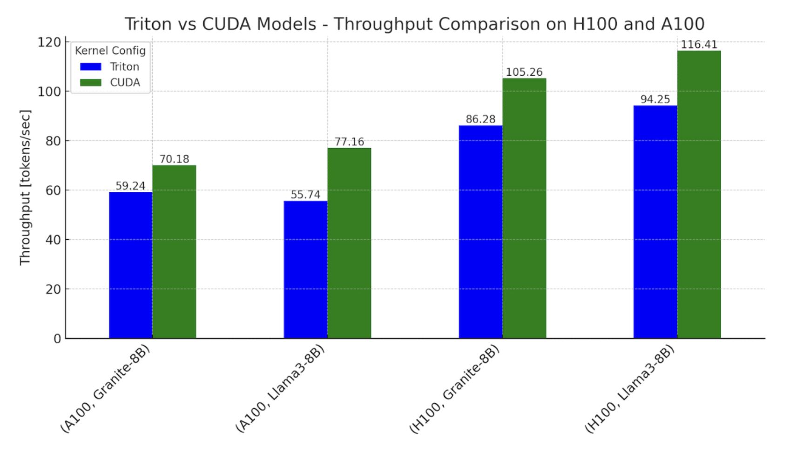

**그림 1. NVIDIA H100 및 A100에서 Llama3-8B와 Granite-8B의 Triton 및 CUDA variant inference throughput benchmark**
설정: batch size = 2, input sequence length = 512, output sequence length = 256

## 2.0 Transformer block의 구성

먼저 Transformer model에서 발생하는 compute decomposition부터 시작합니다. 아래 그림은 typical Transformer block의 "kernels"를 보여줍니다.

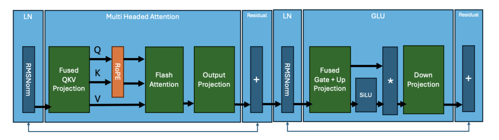

**그림 2. core kernels로 나눈 Transformer block**

Llama3 architecture의 core operation은 다음과 같이 요약됩니다.

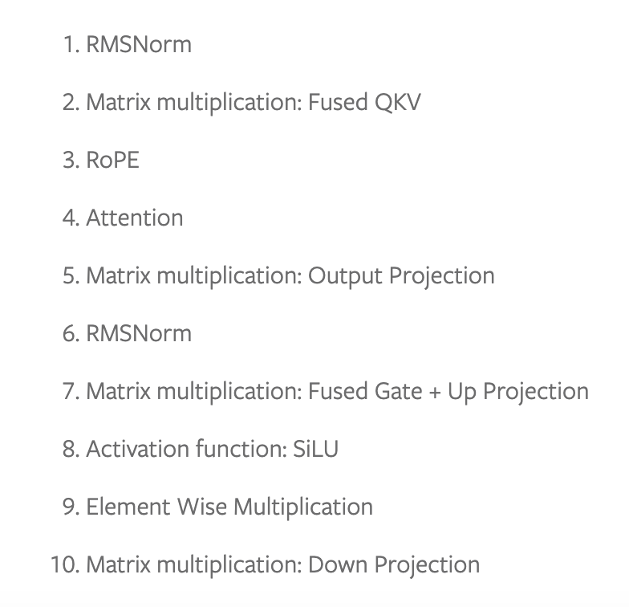

이 operation 각각은 GPU에서 하나 또는 여러 kernels를 실행해 계산됩니다. 이러한 kernels의 구체적인 detail은 transformer model마다 다를 수 있지만, core operation은 유지됩니다. 예를 들어 IBM의 Granite 8B Code model은 MLP layer에서 bias를 사용하며, 이는 Llama3와 다릅니다. 이 변화는 kernel 수정이 필요합니다. typical model은 이런 transformer block을 stack하고 embedding layer로 연결해 구성됩니다.

## 3.0 Model inference

typical model architecture code는 PyTorch가 launch하는 python model.py file과 공유됩니다. default PyTorch eager execution mode에서는 이러한 kernel이 모두 CUDA로 실행됩니다. Llama3-8B와 Granite-8B end-to-end inference를 100% Triton으로 구현하려면 handwritten Triton kernel을 작성하고 integrate해야 하며, torch.compile이 생성하는 Triton operation도 활용해야 합니다. 먼저 compiler-generated Triton kernel로 작은 operation을 대체하고, 이어서 더 expensive하고 complex한 compute, 예를 들어 matrix multiplication과 flash attention을 handwritten Triton kernel로 대체합니다.

Torch.compile은 RMSNorm, RoPE, SiLU, Element Wise Multiplication에 대해 Triton kernel을 자동 생성합니다. Nsight Systems 같은 tool을 사용하면 이러한 generated kernel을 관찰할 수 있습니다. matrix multiplication과 attention 사이에 작은 dark green kernel로 나타납니다.

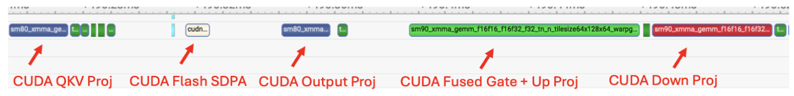

**그림 3**. torch.compile을 사용한 Llama3-8B trace. matrix multiplication과 flash attention에는 CUDA kernels가 사용됨을 보여줍니다.

위 trace에서 Llama3-8B style model의 end-to-end latency 중 **80%**를 구성하는 두 주요 operation이 matrix multiplication과 attention kernels라는 점을 볼 수 있습니다. 그리고 이 두 operation은 여전히 CUDA kernels입니다. 따라서 남은 gap을 줄이기 위해 matrix multiplication과 attention kernels를 handwritten Triton kernels로 대체했습니다.

## 4.0 Triton SplitK GEMM Kernel

linear layer의 matrix multiplication을 위해 SplitK work decomposition(https://pytorch.org/blog/accelerating-moe-model//#30-work-decomposition---splitk)을 활용하는 custom FP16 Triton GEMM(general matrix-matrix multiplication) kernel을 작성했습니다. 우리는 이전의 다른 blog에서 이 parallelization method를 LLM inference decoding 부분을 가속하는 방식으로 논의한 적이 있습니다.

> 위 blog의 Work Decomposition - SplitK 절도 여기서 번역합니다.

**Work decomposition - SplitK**

우리는 이전에 LLM inference에서 발견되는 matrix problem size, 특히 W4A16 quantized inference context에서 SplitK work decomposition(https://arxiv.org/abs/2402.00025)을 적용하면 GEMM kernel을 가속할 수 있음을 보였습니다. 따라서 vLLM MoE kernel(https://github.com/vllm-project/vllm/blob/main/vllm/model_executor/layers/fused_moe/fused_moe.py)에 SplitK를 구현하는 것으로 MoE acceleration 연구를 시작했고, data-parallel method 대비 약 18-20% speedup을 얻었습니다.

이 결과는 SplitK optimization이 inference setting에서 Triton kernel을 개선하거나 개발하는 더 formalized method의 일부가 될 수 있음을 보여줍니다. 이러한 work decomposition에 대한 intuition을 만들기 위해, 두 4x4 matrix의 multiplication과 SplitK=2라는 simple example을 생각해 보겠습니다.

아래 그림의 data-parallel GEMM kernel에서는 output matrix의 single block compute가 thread block TB0 하나로 처리됩니다.

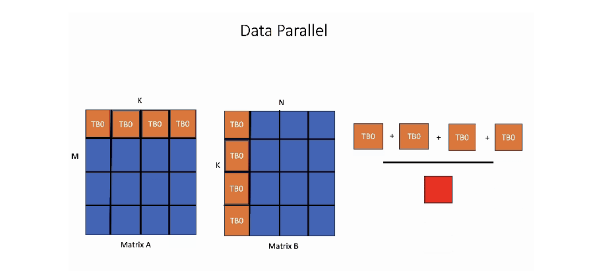

반면 SplitK kernel에서는 output matrix의 single block을 계산하는 데 필요한 work가 두 thread block TB0과 TB1에 "split" 또는 공유됩니다. 이는 더 나은 load balancing과 increased parallelism을 제공합니다.

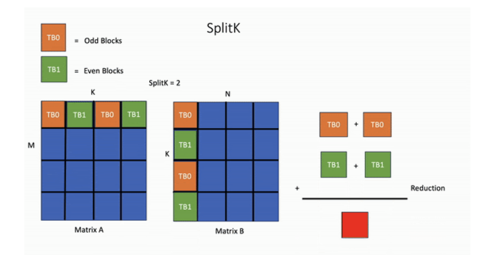

핵심 아이디어는 parallelism을 `MN`에서 `MN*SplitK`로 늘리는 것입니다. 이 방법에는 atomic operation을 통한 inter-thread-block communication 증가 같은 cost가 있습니다. 하지만 이러한 cost는 shared memory와 register 같은 다른 constrained GPU resource를 절약하는 것과 비교하면 미미합니다. 가장 중요한 점은 SplitK strategy가 MoE inference에서 보이는 thin matrix에 우수한 load balancing characteristic을 제공하며, decoding과 inference 중 흔한 matrix configuration이라는 것입니다.

## 5.0 GEMM Kernel tuning

최적 performance를 위해 exhaustive search method로 SplitK GEMM kernel을 tuning했습니다. Granite-8B와 Llama3-8B의 linear layer는 다음 shape을 가집니다.

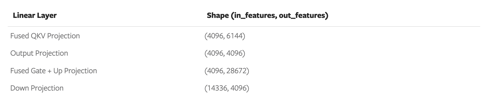

**Figure 4. Granite-8B and Llama3-8B Linear Layer Weight Matrix Shapes**

이 linear layer들은 서로 다른 weight matrix shape을 가집니다. 따라서 best performance를 얻으려면 Triton kernel을 각 shape configuration에 맞게 tuning해야 합니다. 각 linear layer를 tuning한 뒤, untuned Triton kernel 대비 Llama3-8B와 Granite-8B에서 **1.20**배 end-to-end speedup을 달성할 수 있었습니다.

## 6.0 Flash Attention Kernel

서로 다른 configuration을 가진 여러 existing Triton flash attention kernels를 평가했습니다.

1. AMD Flash(https://github.com/ROCm/triton/blob/triton-mlir/python/perf-kernels/flash-attention.py)
2. OpenAI Flash(https://github.com/triton-lang/triton/blob/main/python/tutorials/06-fused-attention.py)
3. Dao AI Lab Flash(https://github.com/Dao-AILab/flash-attention/blob/3669b25206d5938e3cc74a5f7860e31c38af8204/flash_attn/flash_attn_triton.py#L812)
4. XFormers Flash(https://github.com/facebookresearch/xformers/blob/fae0ceb195a41f2ab762d89449c6012fbcf2ffda/xformers/ops/fmha/triton_splitk.py#L96)
5. PyTorch FlexAttention(https://github.com/pytorch/pytorch/blob/e7b870c88bc3b854a95399a96a274d2f1f908172/torch/nn/attention/flex_attention.py#L800)

각 kernel의 text generation quality를 먼저 eager mode에서 평가했고, 표준 방식으로 torch.compile할 수 있으면 compiled mode에서도 평가했습니다. kernel 2-5에 대해 다음을 관찰했습니다.

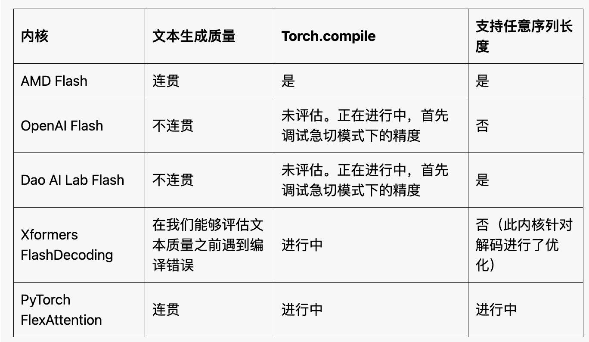

**그림 5. 시도한 여러 Flash Attention Kernels의 combination table**

위 표는 out-of-the-box observation을 요약합니다. 약간의 effort를 들이면 kernel 2-5를 수정해 위 기준을 만족시킬 수 있을 것으로 예상합니다. 하지만 이는 benchmark에 적합한 kernel을 확보하는 것이 end-to-end production kernel로 쓰기 위한 시작일 뿐임을 보여줍니다.
후속 test에서는 AMD flash attention kernel을 사용하기로 했습니다. torch.compile로 compile할 수 있고, eager mode와 compiled mode 모두 readable output을 생성하기 때문입니다.

AMD flash attention kernel이 torch.compile과 compatible하도록 만들기 위해 이를 torch custom operator로 정의해야 했습니다. 이 과정은 [여기](https://mp.weixin.qq.com/s/1P5gXcDhQxavsgo2IYP6rQ)에 자세히 설명되어 있습니다. tutorial link는 simple image crop operation을 wrapping하는 방법을 다룹니다. 하지만 더 complex한 flash attention kernel을 wrapping하는 것도 비슷한 과정을 따릅니다. 두 step은 다음과 같습니다.

- function을 PyTorch custom operator로 wrapping

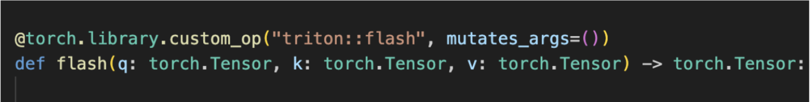

- operator에 FakeTensor Kernel을 추가합니다. 이 Kernel은 flash(q, k, v) input tensor shape에 따라 flash kernel output shape을 계산하는 방법을 제공합니다.

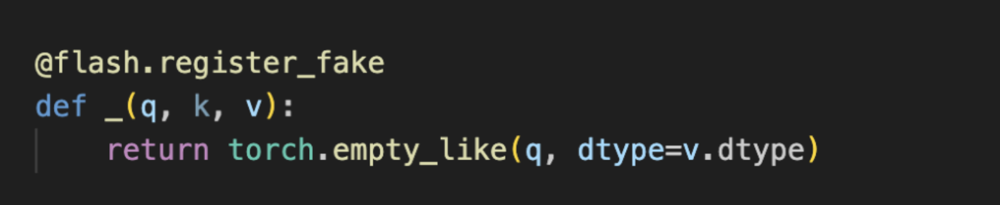

Triton flash kernel을 custom operator로 정의한 뒤, end-to-end run에 대해 성공적으로 compile할 수 있었습니다.

**그림 6**. Triton matmul과 Triton flash attention kernel로 대체한 뒤 Llama3-8B의 torch.compile trace

그림 6에서 SplitK matrix multiplication kernel, torch operator-wrapped flash attention kernel을 통합하고 torch.compile을 실행한 뒤, 100% Triton compute kernel을 사용하는 forward pass를 구현할 수 있음을 확인했습니다.

## 7.0 End-to-End Benchmarks

NVIDIA H100s와 A100s(single GPU)에서 Granite-8B와 Llama3-8B model의 end-to-end measurement를 수행했습니다. 두 configuration으로 benchmark했습니다.

Triton kernel configuration:
- Triton SplitK GEMM
- AMD Triton Flash Attention

CUDA kernel configuration:
- cuBLAS GEMM
- cuDNN Flash Attention - Scaled Dot-Product Attention(SDPA)

typical inference setting에서 eager mode와 torch compiled mode의 throughput 및 inter-token latency는 다음과 같습니다.

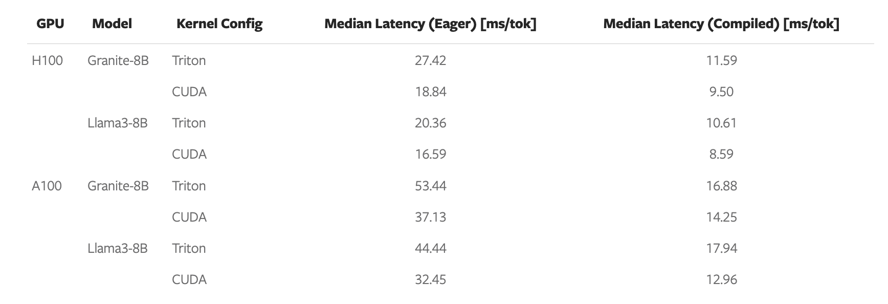

**그림 7**. H100과 A100에서 Granite-8B와 Llama3-8B의 single-token generation latency
(batch size = 2, input sequence length = 512, output sequence length = 256)

요약하면 Triton model은 H100에서 CUDA model performance의 **78%**, A100에서 **82%**에 도달할 수 있습니다.

performance gap은 다음 절에서 논의하는 matrix multiplication 및 flash attention의 kernel latency로 설명할 수 있습니다.

## 8.0 Microbenchmarks

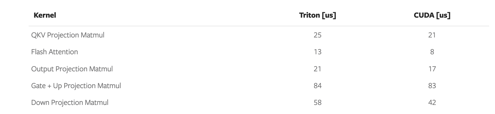

그림 8. Triton과 CUDA kernel latency 비교(Llama3-8B on NVIDIA H100)
input은 arbitrary prompt(bs=1, prompt = 44 seq length), decoding latency time

위 결과에서 다음을 볼 수 있습니다.

- Triton matrix multiplication kernel은 CUDA보다 **1.2-1.4배** 느립니다.
- AMD Triton Flash Attention kernel은 CUDA SDPA보다 **1.6배** 느립니다.

이 결과는 GEMM과 Flash Attention 같은 core primitive kernel의 performance를 더 높일 필요성을 강조합니다. 이는 future work로 남겨 둡니다. 최근 작업, 예를 들어 FlashAttention-3(https://pytorch.org/blog/flashattention-3/)와 FlexAttention(https://pytorch.org/blog/flexattention/)은 underlying hardware를 더 잘 활용하는 방법을 제공하며, 우리는 이를 기반으로 더 큰 acceleration을 구현할 수 있는 Triton path를 만들고자 합니다. 이를 설명하기 위해 FlexAttention을 SDPA 및 AMD Triton Flash kernel과 비교했습니다.

우리는 FlexAttention의 end-to-end(E2E) performance를 검증하기 위해 노력 중입니다. 현재 Flex를 사용한 preliminary microbenchmark는 long context length와 decoding problem shape, 즉 query vector가 작은 경우에 좋은 가능성을 보였습니다.

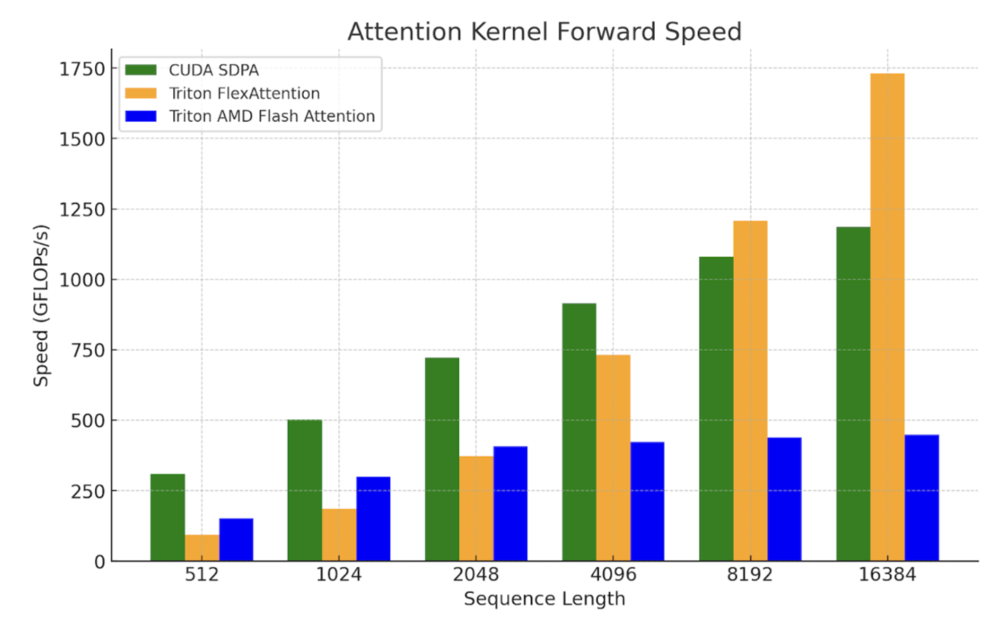

**그림 9**. NVIDIA H100 SXM5 80GB에서 FlexAttention kernel benchmark
(batch size=1, heads=32, sequence length=seq_len, head dimension=128)

## 9.0 Future Work

future work에는 hardware를 더 잘 활용하기 위해 matrix multiplication을 추가로 optimize하는 작업이 포함됩니다. 예를 들어 H100에서 TMA를 활용하는 것에 대해 우리가 발표한 blog(https://pytorch.org/blog/hopper-tma-unit/)와, StreamK 같은 persistent kernel technique을 포함한 다른 work decomposition을 탐색해 더 큰 speedup을 얻을 수 있습니다. flash attention의 경우 FlexAttention과 FlashAttention-3를 탐색할 계획입니다. 이러한 kernel에서 사용하는 technique은 Triton과 CUDA 사이의 gap을 더 줄이는 데 도움이 될 수 있습니다.
또한 이전 연구에서 FP8 Triton GEMM kernel performance가 cuBLAS FP8 GEMM과 비교했을 때 유망하다는 것을 확인했으므로, future post에서는 end-to-end FP8 LLM inference를 탐색할 예정입니다.
