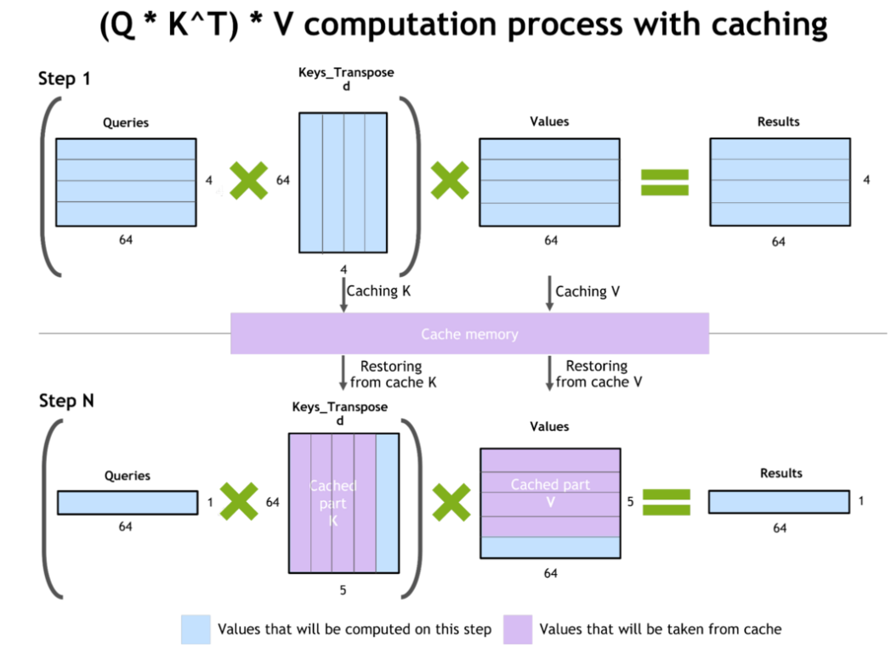
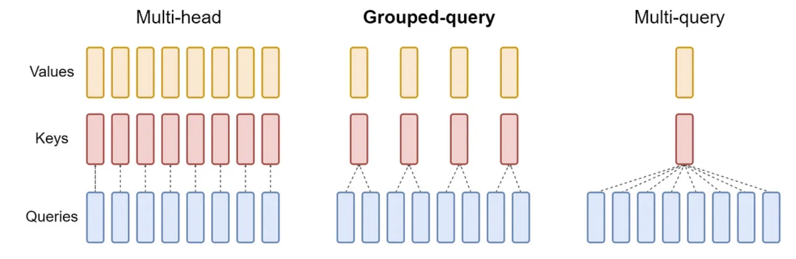
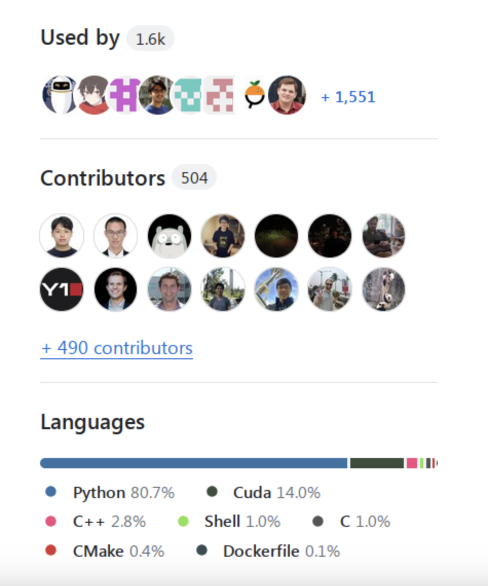

> 내 강의 노트이며, 많은 관심 바란다: https://github.com/BBuf/how-to-optim-algorithm-in-cuda/tree/master/cuda-mode 

> 이 문서의 출처: https://github.com/stas00/ml-engineering 。이 노트는 대규모 언어 모델 추론의 다양한 측면을 소개한다. 먼저 prefill 및 decode 단계, 온라인 및 오프라인 추론, grounding 등 추론의 기본 개념을 설명한다. 그런 다음 지연(latency), 처리량(throughput), 첫 번째 token까지의 시간(TTFT), 출력 token당 시간(TPOT)을 포함한 추론 성능의 핵심 지표를 자세히 논의한다. 이후에는 모델 메모리 사용량, 특히 KV Cache의 중요성과 계산 방법을 깊이 있게 다룬다. 또한 다양한 추론 프레임워크와 기능, 라이선스, 커뮤니티 활성도 등 프레임워크를 선택할 때 고려해야 할 요소를 자세히 소개한다. 이 문서는 추론 칩, 벤치마킹 방법, 모델 로딩 시간 단축 등의 주제도 다룬다. 이 문서는 대규모 모델 추론을 이해하기 위한 꽤 괜찮은 기초 입문 문서이며, 관심 있는 분들에게 읽어 보기를 추천한다.

# 추론

XXX: 이 장은 작성 중이다 - 일부 절은 완성되었고, 일부는 막 시작했으며, 아직 시작하지 않은 부분도 많지만, 읽을 만한 유용한 부분은 이미 충분히 완성되어 있다.

## 용어집

- CLA: 교차 레이어 attention(Cross-Layer Attention)
- FHE: 완전 동형 암호(Fully Homomorphic Encryption)
- GQA: 그룹화 쿼리 attention(Grouped-Query Attention)
- ITL: token 간 지연(Inter-Token Latency)
- KV: 키-값(Key Value)
- LPU: 언어 처리 장치™(Language Processing Unit™)
- MHA: 다중 헤드 attention(Multi-Head Attention)
- MPC: 안전한 다자간 연산(Secure Multi-Party Computation)
- MQA: 다중 쿼리 attention(Multi-Query Attention)
- PPML: 프라이버시 보호 머신러닝(Privacy-Preserving Machine Learning)
- QPS: 초당 쿼리 수(Queries Per Second)
- TPOT: 출력 token당 시간(Time Per Output Token)
- TTFT: 첫 번째 token까지의 시간(Time to First Token)

비슷한 용어 항목은 아래의 개념 절을 참고하기 바란다.

## 개념

### prefill과 decode

추론을 수행할 때는 두 단계가 있다:

#### prefill

prefill: 프롬프트의 모든 token이 이미 알려져 있으므로 - 전체 프롬프트 길이를 한 번에 처리하고(학습과 유사) 중간 상태(KV 캐시)를 캐싱한다. 충분한 메모리가 있다면 1k 프롬프트조차도 매우 빠르게 처리할 수 있으므로, 이 단계는 지연을 거의 추가하지 않는다.

#### decode

decode: 새 token의 생성은 이전의 모든 token(프롬프트와 지금까지 생성된 모든 새 token)을 기반으로 한 번에 하나의 새 token을 생성한다(회귀적 방법). 따라서 prefill과 달리 이 단계는 decode를 병렬화할 수 없기 때문에 생성 지연에 가장 크게 기여한다.


### 온라인 추론과 오프라인 추론

사용자가 실시간으로 쿼리를 전송할 때 - 이것은 온라인 추론이며, 배포라고도 한다. 예: 챗봇, 검색 엔진, 범용 REST API. 이 경우 일반적으로 추론 서버를 실행하며, 다양한 클라이언트가 여기에 연결될 수 있다.

프롬프트를 담은 파일을 추론해야 할 때 - 이것은 오프라인 추론이다. 예: 벤치마크 평가, 합성 데이터 생성. 이 경우 일반적으로 추론 서버가 필요 없으며, 추론은 쿼리를 전송하는 동일한 프로그램 안에서 직접 실행된다(클라이언트와 서버가 하나의 애플리케이션 안에 있다).


### grounding(Grounding)

이것은 사전 학습된 모델에게 학습 중에 사용할 수 없었던 추가 정보를 제공하는 과정이다.
예를 들어, 입력 grounding 작업(input-grounded-tasks, 아래 작업의 첫 번째 항목 참조)은 프롬프트에서 모델에게 많은 추가 정보를 제공한다. 비제로샷 프롬프트는 예시를 통해 모델에 grounding을 제공하여 기본 모델 동작을 변경한다. 프롬프트 엔지니어링의 핵심은 추론 중에 모델이 어떤 특정한 방식으로 추론하도록 만드는 것이다.

검색 증강 생성(RAG)은 추론 과정에 프롬프트와 관련된 추가 데이터를 제공하기 때문에 모델에 grounding을 제공하는 주요 기법 중 하나다. 그 목적은 모델이 학습 시에 압축된 대량의 정보보다 이 정보를 더 중시하게 만드는 것이다.

다른 지식 영역으로의 미세 조정은 또 다른 grounding 방법으로, 우리는 모델을 새로운 데이터셋에 grounding되도록 업데이트하며, 이 데이터셋은 기반 모델이 학습된 원래 데이터 영역과 완전히 다를 수 있다.

grounding은 **맥락(context)**을 제공하는 것으로 볼 수 있다. 누구나 증명할 수 있듯이, 사람이 질문의 맥락을 이해하면 질문에 답하기가 더 쉽다. 모델 생성도 마찬가지다. 맥락이 좋을수록 생성된 출력이 더 관련성이 높아진다.

멀티모달 사용 사례에서는 텍스트 프롬프트와 함께 제공되는 이미지나 비디오가 grounding 또는 맥락으로 작용할 수 있다.


### 작업(Tasks)


#### 입력 grounding 작업(Input-grounded tasks)

입력 grounding 작업은 생성 응답이 주로 프롬프트에서 나오는 작업, 즉 주요 지식이 프롬프트에 포함된 작업이다. 여기에는 다음이 포함된다:

- 번역
- 요약
- 문서 질의응답
- 다중 턴 대화
- 코드 편집
- 음성 인식(오디오 전사)

### 배치 처리(Batching)

한 번에 하나의 token을 처리하는 decode 단계는 가속기에게 매우 비효율적이다. 여러 쿼리를 함께 배치 처리하면 가속기의 이용률을 높이고 한 번에 여러 요청을 처리할 수 있게 된다.

배치 처리의 최대 가능한 크기는 모델 가중치를 로드하고 KV 캐시를 채운 후 남은 메모리 양에 따라 달라진다.

#### 정적 배치 처리(Static batching)

이것은 가장 간단하고 직접적인 배치 처리 방식으로, 앞쪽 N개의 쿼리를 함께 배치 처리한다 - 문제는 많은 쿼리가 이미 생성을 완료했더라도, 가장 긴 쿼리가 완료될 때까지 기다린 후에야 호출자에게 반환될 수 있다는 것이다 - 이는 지연을 크게 증가시킨다.

#### 연속 배치 처리 또는 인플라이트 배치 처리(Continuous Batching or In-flight batching)

연속 배치 처리 또는 인플라이트 배치 처리는 생성 엔진이 전체 배치가 완료되기를 기다리지 않고, 생성이 완료되는 즉시 완료된 쿼리를 삭제하고 새 쿼리로 교체하는 과정이다. 따라서 배치에서 위치 0의 시퀀스는 10번째 token을 생성하고 있을 수 있고, 배치에서 위치 1의 시퀀스는 막 첫 번째 token 생성을 시작했을 수 있으며, 위치 3의 시퀀스는 마지막 token을 생성하고 있을 수 있다.

이것은 응답 시간을 개선하는데, 이미 완료된 시퀀스를 즉시 반환할 필요가 없고, 새 프롬프트가 다음 배치가 사용 가능해질 때까지 기다릴 필요가 없기 때문이다. 물론 모든 연산이 처리로 바쁘고 새로운 빈 자리가 없다면, 일부 요청은 연산이 처리하기 시작할 때까지 기다려야 한다.

### 페이지 attention(Paged Attention)

페이지 attention은 추론 서버에서 매우 인기 있는 기법으로, 가속기 메모리에 가까운 방식으로 페이징을 사용함으로써 가속기 메모리를 매우 효율적으로 이용할 수 있게 해주어, 동적 메모리 할당을 가능하게 하고 메모리 단편화를 방지한다.

### decode 방법(Decoding methods)

주요 decode 방법으로는 그리디 decode, 빔 서치, 샘플링이 있다.


#### 그리디 decode(Greedy decoding)

그리디 decode는 모델이 항상 확률이 가장 높은 token을 선택하는 것이다. 이것은 가장 빠른 decode 방법이지만, 덜 이상적인 token 경로를 선택하여 좋은 미래 token 시퀀스를 놓칠 수 있기 때문에 반드시 최선의 결과를 생성하지는 않는다.

그리디 decode의 주요 문제는 루프를 만드는 것, 즉 같은 문장이 반복해서 거듭 나오는 것이다.

#### 빔 서치(Beam search)

빔 서치는 여러 출력을 동시에 생성함으로써 그리디 decode의 한계를 극복한다. 따라서 각 새 token에서 확률이 가장 높은 3개의 출력을 따라가고(빔 크기 3), 그런 다음 체인 안의 모든 token의 총 확률이 가장 높은 3개를 제외한 모든 하위 경로를 버린다(`3*3`). 마지막으로, 모든 token의 확률이 가장 높은 경로를 선택한다.

이 방법은 n배 더 많은 token을 생성해야 하고 n배 더 많은 메모리를 필요로 하므로 그리디 decode보다 느리다.

#### 샘플링(Sampling)

샘플링은 무작위성을 도입한다.

하지만 물론, 무작위 단어를 선택하면 좋은 결과가 나오지 않으므로, 우리는 여전히 그리디 decode의 결정성을 원하지만, 거기에 제어된 무작위성을 추가하여 더 흥미롭고/생동감 있게 만든다.

가장 일반적인 샘플링 방법은 다음과 같다:

- **Top-K 샘플링** 방법은 logit 확률에 따라 상위 k개의 token을 선택한 다음, 그중 하나의 token을 무작위로 선택한다.
- **Top-p 샘플링**(**nucleus 샘플링**이라고도 함)은 Top-K 샘플링과 유사하지만, K는 다음 각 token마다 가변적이며, 상위 k개 token의 확률을 임계값 `p`에 도달할 때까지 더하여 계산한다. 따라서 모델이 매우 확신할 때에만 이러한 예측들이 고려된다.

#### 온도(Temperature)

온도는 Top-p 샘플링 전략의 일부이며, 그 값은 다음과 같다:

- `t==0.0:` 최종적으로 확률이 가장 높은 token을 선택한다 - 무작위성 없음 - 그리디 decode와 동일 - 정밀 사용 사례.
- `t==1.0`: 샘플링에 영향을 주지 않는다 - 여기서는 원래의 학습 분포가 유지된다 - 관련성과 다양성의 균형 사용 사례.
- `0.0<t<1.0`: logit 확률을 더 멀리 분리시키므로 0.0에 가까울수록 무작위성이 줄어든다 - 정밀과 균형 사용 사례 사이.
- `t>1.0`: logit 확률을 더 가깝게 만들어 많은 무작위성을 생성한다 - 창의적 사용 사례.

영향을 제대로 이해하기 위해, 온도 계수는 일반적으로 Softmax 연산 전에 또는 그 일부로서 logit 확률에 적용된다.

```
logits = math.log(probs) / temperature
```
따라서 `t=1.0`이 영향을 주지 않고, `t=0`이 가장 높은 logit을 무한대로 향하게 만들며(0으로 나누는 것을 피함), `t<1.0`과 `t>1.0`이 - `log` 때문에 - 값을 그에 맞게 밀어내거나 끌어당기는 것을 쉽게 알 수 있다.

온도는 그리디 decode, 빔 서치, Top-K 샘플링 전략에는 영향을 주지 않는데, 이는 logit 확률 사이의 거리에 영향을 미치지만, 이러한 전략들은 모두 순서를 기반으로 한 상위 확률을 사용하고 온도는 확률의 순서를 바꾸지 않기 때문이다. 반면 Top-p 샘플링은 총 확률을 기반으로 한 부분집합에 더 많거나 더 적은 경쟁자가 들어가도록 허용하므로, 확률이 가까울수록(고온일수록) 무작위성이 커진다.

`t==0.0`과 `t==0`을 제외하면, 복제할 수 있는 정해진 규칙적인 값은 없으며, 각 사용 사례에 대해 실험하여 자신의 요구에 가장 적합한 값을 찾아야 한다 - 다만 사람들이 다양한 사용 사례에서 제공하는 좋은 기준선은 분명히 찾을 수 있을 것이다.


### 가이드 텍스트 생성(Guided Text Generation)

구조화된 텍스트 생성 및 보조 생성이라고도 한다.

모델이 생성한 출력을 제약이 없는 형식이 아니라 특정 형식으로 반환할 수 있다면, 모델이 유효하지 않은 형식을 생성하기를 원하지 않을 것이다. 예를 들어, 모델이 JSON 딕셔너리를 반환하기를 원한다면, 그렇게 해야 한다.

이를 실현하는 방법은 가이드 텍스트 생성을 사용하는 것이다. 확률이 가장 높은 생성 token을 선택하는 대신, 이 기법은 다음에 예상되는 token 부분집합에 맞는, 그다음으로 좋은 확률의 token을 사용한다. 예를 들어 설명하자면: 모델이 `["apples", "oranges"]`와 같은 JSON 문자열 리스트를 생성하기를 원한다면, 따라서 우리는 다음을 기대한다:

```
["string", "string", ..., "string"]
123...
```

첫 번째로 생성되는 token은 반드시 `[`여야 한다. 예를 들어 모델이 가장 높은 확률로 `[`가 아니라 `"`를 얻고 `[`의 확률이 더 낮다면 - 우리는 확률이 더 낮은 쪽을 선택하여 그것이 `[`가 되도록 한다.

그런 다음, 다음으로 생성되는 token은 반드시 `"`여야 한다. 그렇지 않다면, `"`를 찾을 때까지 확률이 더 낮은 token을 검색하여 그것을 선택한다.

세 번째 token은 반드시 유효한 문자열이어야 한다(즉 `[`나 `"`가 아니어야 한다).

이런 식으로 계속한다.

기본적으로, 다음 각 token에 대해 우리는 허용되는 token 부분집합을 알아야 하고, 그 부분집합에서 확률이 가장 높은 token을 선택해야 한다.

이것은 매우 멋진 기법이다. 항상 예상 형식과 일치한다는 보장이 없는 생성 출력을 수정하려고 시도하는 대신, 우리는 모델이 처음부터 올바른 출력을 생성하도록 한다.

이 방법에는 몇 가지 단점이 있다:
- 생성 속도를 낮춘다 - 따라야 하는 형식이 복잡할수록 token 생성 속도가 느려진다. 생성 속도를 측정한 결과, 일부 구조화된 텍스트 생성 라이브러리가 다른 라이브러리보다 훨씬 빠르다는 것을 발견했다.
- 모델이 환각(hallucination)을 일으킬 수 있다.

이 기법을 구현하는 방법은 여러 가지가 있으며, 이 글을 쓰는 시점에 두 가지 인기 있는 라이브러리는 다음과 같다:
- https://github.com/outlines-dev/outlines
- https://github.com/noamgat/lm-format-enforcer

이상적으로는 vLLM과 같은 추론 프레임워크에 이미 통합된 구현을 사용하는 것이 좋다.

#### 가이드 생성으로 추론 가속(Faster inference with guided generation)

스키마를 사용하여 추론을 가속할 수도 있다. 예를 들어, 이 간단한 "profile" 스키마를 고려해 보자:

```
{
  "type": "object",
  "properties": {
    "name": { "type": "string"},
    "age": { "type": "integer"}
  },
  "required": ["name", "age"]
}
```

스키마에 특정 키 `name`과 `age`가 있으므로, 모델이 `{"n` 또는 `{"a`를 예측하면, `{"name": `와 `{"age": `를 얻기 위해 자기회귀 생성을 수행할 필요가 없다. 이 둘은 모두 특정한 명확한 결과로 이어져야 하기 때문이다 - 따라서 여기서는 decode 대신 prefill을 수행할 수 있고, 다음 몇 개의 token이 `ame": ` 또는 `ge":`가 될 것임을 100% 알기 때문에 몇 가지 느린 단계를 절약할 수 있다. 분명히, 스키마에 미리 정해진 키가 많고 생성 값이 짧을 때 이 방법이 가장 유리하다.

### 추측 decode(Speculative decoding)

추측 추론 또는 보조 생성이라고도 한다.

한 번에 하나의 token을 생성하는 것이 매우 느리기 때문에, 때로는 더 작고 빠른 드래프트 모델을 사용하여 꼼수를 써서 가속할 수 있다. 예를 들어, 정상적인 추론에서 Llama-70B를 사용하면 느리겠지만, 우리는 Llama-7b를 드래프트 모델로 사용할 수 있고, 그런 다음 예측이 올바른지 검증할 수 있지만, 한 번에 모든 token에 대해 수행할 수 있다.

예: `I'm turnin', turnin', turnin', turnin', turnin' around and all that I can see is just`라는 프롬프트를 예로 들면, 이제:

1. Llama-7b를 사용하여 자기회귀 방식으로 `another lemon tree`를 예측한다. 3단계로 완료되지만 Llama-70b보다 훨씬 빠르다.
2. 이제 Llama-70b를 사용하여 3개의 프롬프트로 구성된 배치를 실행한다:

```
[...I can see is just]
[...I can see is just another]
[...I can see is just another lemon]
```
나는 시연을 위해 전체 프롬프트를 축약했으며, `...`는 나머지 프롬프트 부분을 나타낸다. 여기서 각 token이 완전한 단어라고 가정한다.

이제 Llama-70B가 한 단계에서 생성한다:

```
[...I can see is just] another
[...I can see is just another] lemon
[...I can see is just another lemon] tree
```

이제 여러 결과가 나올 수 있다:
- 모든 것이 일치하면 - 3개의 짧은 단계와 1개의 긴 단계로, 3개의 긴 단계를 사용하는 대신 최종 결과를 생성한 것이다.
- `another lemon`만 일치하면 - 시간을 절약했다면 더 나았을 수도 있다.
- 일치하는 것이 없거나 거의 없으면, 약간의 시간을 낭비한 것이다.

분명히, token이 3개를 넘으면 절약되는 시간이 더 클 수 있다.

부분적으로 불일치가 있을 때, 우리는 드래프트 모델로 돌아가서 첫 번째 불일치 token까지 일치하는 모든 token을 그것에 주고, 그다음 드래프트 모델이 예측한 그다음 좋은 token을 주어, 불일치하는 꼬리 부분에 대해 새로운 빠른 예측을 하게 한다.

드래프트 모델은 이상적으로는 대형 모델과 동일한 데이터(또는 적어도 유사한 분포에서 나온 데이터)를 사용해야 하며, 그 토크나이저는 대형 모델과 동일해야 한다.

추측 decode는 번역, 요약, 문서 질의응답, 다중 턴 대화와 같은 입력 지향 작업(input-grounded-tasks)에서 가장 잘 작동하는데, 이런 종류의 작업에서는 가능한 출력 범위가 훨씬 작아서 드래프트 모델이 대형 모델과 일치할 가능성이 더 높기 때문이다.

같은 이유로, 그리디 decode(greedy-decoding)에서 가장 잘 작동하는데, 생성 과정에서 가능한 변화가 가장 적기 때문이다. 그리디 decode를 사용하지 않는다면, 온도(temperature) 값을 0에 가깝게 설정해야 한다.

이 주제를 깊이 있게 다룬 좋은 글이 여기 있다: Assisted Generation: a new direction toward low-latency text generation(https://huggingface.co/blog/assisted-generation).

또 다른 더 간단한 방법은 ngram 프롬프트 룩업 decode(https://github.com/apoorvumang/prompt-lookup-decoding)를 사용하는 것인데, 이 방법에서는 드래프트 모델이 필요 없으며, 대신 프롬프트를 검색하여 후보를 생성한다. 어떤 경우에는 decode 속도를 2배 이상 높일 수 있다고 한다.

### 프라이버시 보호 추론

추론 서비스를 제공하는 대부분의 회사는 사용자 프라이버시 요구사항에 직면한다. 사용자가 쿼리를 제출할 때 안전해야 하며, 다른 사람에게 엿보이지 않아야 한다. 한 가지 해결책은 로컬 배포 솔루션, 즉 클라이언트가 스스로 서버를 실행하는 것으로, 이렇게 하면 프라이버시 문제가 없지만, 제공자의 지적 재산 - 모델의 가중치와 가능하면 코드/알고리즘 - 을 노출시킬 가능성이 매우 높다. 따라서 완전히 암호화된 생성 - 즉 연산이 클라이언트의 암호화된 데이터에 대해 수행되는 것 - 이 필요하다.

이 요구를 해결하는 솔루션은 프라이버시 보호 머신러닝(PPML)이라고 한다.

그러한 솔루션 중 하나는 완전 동형 암호(FHE)라고 한다.

그러한 구현 중 하나인 concrete-ml(https://github.com/zama-ai/concrete-ml)을 살펴볼 수 있다. 이것은 모델을 다시 작성하여, 클라이언트가 모델의 일부를 스스로 실행한 다음 중간 암호화된 활성화를 서버로 보내 attention 메커니즘을 실행하고, 다시 클라이언트로 보내도록 한다. 따라서 제공자는 지적 재산의 일부를 보존한다 - 내 생각에 이 일부 지적 재산은 클라이언트가 완전한 지적 재산을 훔치는 것을 방지할 수 있는데, 일부 가중치만으로는 완전한 모델을 재구성하기에 충분하지 않기 때문이다. 이 글(https://huggingface.co/blog/encrypted-llm)에 더 자세한 정보가 있다.

또한 다양한 다른 방법이 있는데, 예를 들어 이 논문: LLMs Can Understand Encrypted Prompt: Towards Privacy-Computing Friendly Transformers(https://arxiv.org/abs/2305.18396v3)은 안전한 다자간 연산(MPC)과 FHE를 기반으로 한 맞춤형 솔루션을 탐구하며, 좋은 참고 문헌 목록을 제공한다.

현재 솔루션의 문제는 막대한 연산 오버헤드다 - 이것은 비용과 지연에 큰 영향을 미친다. 미래의 ASIC 솔루션은 이러한 문제를 해결할 수 있어야 한다.

### 모델 병렬

모델이 단일 가속기에 맞지 않거나, 여러 가속기에 걸쳐 모델을 분할할 때, 심지어 맞더라도 빠듯할 때, 모델 병렬 기법이 추론에 적용된다.

대부분의 경우, 당신이 가장 마주칠 가능성이 높은 것은 텐서 병렬뿐이며, 여기서 모델 가중치는 2개에서 8개의 가속기 사이에 샤딩된다. 이상적으로는 모델을 하나의 가속기에 맞추려고 시도하는 것이 좋은데, 그래야 생성 중의 오버헤드가 가장 적기 때문이다. 하지만 놀랍게도, 텐서 병렬을 사용하면 결국 더 높은 decode 처리량을 얻을 수도 있다 - 이는 더 큰 배치를 맞출 수 있게 해주기 때문이기도 하고, `forward` 호출이 가속기 간의 추가 통신보다 빠를 수 있기 때문이기도 하다. 물론, 당신은 이 비용을 치르고 이 가속을 얻게 되므로, 어떤 경우에는 더 많은 가속기를 사용하는 것이 더 좋은 총 처리량을 얻게 된다. 따라서 실험하는 것이 가장 좋으며, 어떤 경우에는 동일한 가속기 수를 고려할 때 더 높은 텐서 병렬도가 더 좋은 총 처리량을 제공할 것이다.

각주: 내 실험에서는 TP=1이 TP>1과 비교하여 가장 높은 TTFT와 가장 낮은 decode 처리량을 초래했다. 따라서 TTFT를 더 빠르게 만들도록 요청받았고 모델이 맞을 수 있다면, 더 작은 TP나 TP=1을 사용하라. decode 처리량을 더 빠르게 만들도록 요청받았다면, 자원이 문제가 되지 않는다면 더 높은 TP를 통해 이를 달성하라.

## 핵심 추론 성능 지표

성능 지표를 보는 방법에는 두 가지가 있다. 하나는 시스템 지표인 지연과 처리량이고, 다른 하나는 사용자 경험 지표인 Time To First Token (TTFT)과 Time Per Output Token (TPOT)이다. 두 가지를 모두 살펴보자.

### 시스템 성능 지표

#### 지연

**지연은 요청을 보낸 후 완전한 응답을 받기까지 걸린 시간을 말한다**.

여기에는 다음 시간이 포함된다:

1. 요청 수신
2. 프롬프트 전처리(prefill 단계)
3. 응답의 새 token 생성(decode 단계)
4. 응답을 클라이언트로 다시 전송

요청 수신과 응답 전송 시간은 대체로 비슷하며, 프롬프트와 생성 응답의 길이가 다르기 때문에 약간의 변동만 있다. 이러한 길이 변동이 총 시간에 미치는 영향은 무시할 수 있을 정도여야 한다.

prefill 단계는 모든 프롬프트의 token을 병렬로 처리하므로, 여기서는 프롬프트 길이의 변동이 큰 영향을 미치지 않아야 한다. 다만 더 긴 프롬프트는 더 많은 가속기 메모리를 소비하고 총 처리량에 영향을 미친다.

decode 단계는 각 새 token이 별도의 단계로 생성되기 때문에 생성 응답 길이에 가장 큰 영향을 받는 단계다. 여기서 응답이 길수록 decode 단계가 길어진다.

서버가 현재의 모든 요청을 한 번에 처리할 충분한 용량이 없어서 일부 요청을 대기열에 넣어야 한다면, 대기 시간이 지연 시간을 늘리게 된다.

각주: 도로의 자동차 교통을 생각해 본다면, 지연은 A 지점에서 B 지점까지(예: 집에서 사무실까지) 가는 데 필요한 시간을 말하며, 여기에는 신호등, 정체, 법적 제한으로 인한 속도 제한이 포함된다.

#### 처리량

처리량은 추론 서버가 여러 요청을 병렬로 처리하고 요청을 효율적으로 배치 처리하는 능력을 측정한다.

처리량의 정의는 동시에 얼마나 많은 요청을 처리할 수 있는지가 될 수 있지만, 어떤 요청은 다른 요청보다 훨씬 빠르게 처리되기 때문에 하나의 긴 요청이 진행되는 동안 여러 개의 짧은 요청을 처리할 수 있으므로, 전체 시스템이 생성하는 총 token 속도를 계산하는 것이 합리적이다.

따라서 더 일반적인 정의는 **추론 처리량은 전체 시스템이 초당 생성하는 총 token 수**다.

각주: 도로의 자동차 교통을 생각해 본다면, 처리량은 주어진 시간 동안 주어진 도로를 통과하는 자동차의 수를 말한다. 도로 차선이 많을수록, 속도 제한이 높을수록 처리량이 높아진다. 하지만 분명히 어떤 차량은 짧고 어떤 차량은 길기 때문에, 어떤 종류의 표준화가 필요하다. 예를 들어, 페리는 몇 미터 또는 몇 피트의 차량을 수용할 수 있는지 계산하므로, 긴 차량은 짧은 차량보다 더 많은 요금을 낸다.

### 사용자 경험 지표

추론 서버의 성능은 전력 소비, 효율성, 비용 등 많은 특성으로 평가할 수 있지만, 이러한 시스템은 인간과 상호작용하기 때문에 가장 중요한 특성은 모두 매끄러운 사용자 경험을 제공하는 영역에 집중되어 있다고 말할 수 있다. 사용자 경험이 느리고 매끄럽지 않다면, 사용자는 경쟁사로 옮겨갈 것이다. 따라서 핵심 요구사항은 다음과 같다:

#### 첫 번째 Token까지의 시간

**첫 번째 Token까지의 시간(TTFT)은 사용자가 제출 버튼(또는 엔터)을 누른 후 첫 번째 단어 또는 단어의 일부를 받기까지의 시간으로 정의된다**.

첫 번째 Token까지의 시간(TTFT)이 매우 짧기를 바란다. 오늘날 사용자는 어떤 애플리케이션이든 응답 시간이 이상적으로 1초보다 빠르기를 기대한다. 따라서 사용자가 첫 번째 token을 받기 시작할 때까지 기다리는 시간이 짧을수록 좋다. 이것은 상호작용을 기대하는 챗봇에서 특히 중요하다. TTFT의 길이는 많은 요인에 영향을 받으며, 핵심 요인은 prefill 단계의 연산(프롬프트의 전처리)과, 사용자 요청을 받은 후 요청이 즉시 처리되는지 아니면 대기열에서 기다려야 하는지이다.

중요한 점은 부하가 없는 서버에서의 TTFT가 부하가 매우 심한 서버에서의 TTFT와 매우 다를 수 있다는 것이다. 보통 서버가 1초 안에 첫 번째 token을 보낸다면, 서버가 이미 모든 요청을 처리하느라 바쁘고 대기열이 있다면, 처음 몇 개의 요청을 제외하고는 실효 TTFT가 훨씬 길어질 수 있다. 따라서 일반적으로 평균 TTFT를 측정하고 벤치마크 중에 보낸 동시 요청 수와 함께 보고해야 한다.

이것은 복잡한 지표인데, 프롬프트의 크기에 따라 시간이 달라지기 때문이며, 따라서 이상적으로는 프롬프트의 token 수로 표준화하기를 원한다.

#### 출력 Token당 시간

출력 Token당 시간(TPOT)은 각 사용자별 지표다. 이것은 주어진 사용자를 위해 새 token을 생성하는 데 필요한 시간을 측정한다.

출력 Token당 시간(TPOT)이 비교적 낮기를 바라지만, 너무 높을 필요는 없다. 이 시간은 이상적으로 요청을 보낸 사람의 읽기 속도에 가까워야 한다. 예를 들어, 1학년 학생에게 서비스한다면 TPOT가 상당히 낮을 수 있지만, 교육 수준이 높은 사람일수록 매끄러운 읽기 경험을 실현하려면 TPOT가 더 빨라야 한다.

위키백과에 따르면, 3가지 읽기 유형(https://en.wikipedia.org/wiki/Speed_reading#Types_of_reading)이 있으며, 읽기 속도는 분당 단어 수(WPM)로 측정된다.

단어당 평균 token 수는 토크나이저에 따라 다르며, 주로 그 어휘량과 언어에 따라 달라진다. 여기서는 영어 토크나이저를 고려하며, 대략 단어당 1.5 token이다. 이제 분당 단어 수(WPM)를 분당 token 수(TPM)로 변환할 수 있다.

이제 60으로 나누어 초당 token 수(TPS)를 얻고, 그 역수를 취해 출력 token당 시간(TPOT)을 얻기만 하면 된다.

따라서 `TPOT = 60 / (WPM*1.5)`(단위: 초)

| 독자     | WPM |  TPM |   TPS |  TPOT |
| :-----   | --: | ---: | ----: | ----: |
| 발성 읽기 | 250 |  375 |  6.25 |  0.16 |
| 청각 읽기 | 450 |  675 | 11.25 | 0.089 |
| 시각 읽기 | 700 | 1050 | 18.75 | 0.057 |

1.5 계수는 당신의 토크나이저의 실제 단어 대 token 평균 비율로 변경해야 한다는 것을 기억하라. 예를 들어, 이 글을 쓰는 시점에 OpenAI ChatGPT의 50k 어휘량은 대략 단어당 1.3 token이며, 다른 많은 LLM은 30k 어휘량을 가지고 있어 더 높은 단어 대 token 비율을 초래한다.

보다시피, TPOT는 추적하고 머릿속으로 생각하기 어려운 값이므로, **일단 목표 TPOT를 알게 되면, 그것을 초당 token 수(TPS)로 변환하여 추적하는 것이 가장 좋다**.

따라서 이 예에서, 시스템이 요청당 초당 20 token을 지속적으로 생성할 수 있다면, 시스템이 분당 700단어의 초고속 독자를 따라갈 수 있으므로 고객이 만족할 것이다.

물론, 생성이 완료된 후에 응답을 읽기 시작하는 것을 선호하는 사용자도 있을 것이다. 이 경우에는 빠를수록 좋다.

생성 유형에 따라 다음이 적용될 수 있다:
1. 이미지 - 한 번에 생성
2. 텍스트 - 사용자의 읽기 속도만큼 빠르게, 또는 읽기를 시작하기 전에 움직이는 부분을 원하지 않는다면 한 번에 생성
3. 오디오 - 사용자의 듣기 속도만큼 빠르게
4. 비디오 - 사용자의 시청 속도만큼 빠르게

만약 이것이 개별 사용자와 인터페이스하지 않고 요청을 일괄 처리하기만 하는 오프라인 시스템이라면, 이러한 지표들은 차이가 없으며, 지연과 처리량이 핵심 지표가 된다.

### 단순화된 성능 지표

보다시피, 위에서 논의한 지표들은 많은 부분에서 겹친다. 실제로 우리는 이 모든 지표를 두 가지 지표로 단순화할 수 있다: prefill 처리량과 decode 처리량 - 그리고 시스템이 초당 처리할 수 있는 병렬 요청 수.

#### prefill 처리량

이것은 시스템이 프롬프트를 전처리하는 속도다 - 초당 token 수로 계산된다.

요청 수신과 전송의 오버헤드를 무시할 수 있다고 가정하면, 대기열이 없는 상황에서 들어오는 요청이 즉시 처리되며, TTFT는 실제로 프롬프트의 token 수를 초당 prefill token 수로 나눈 값에 첫 번째 token을 생성하는 시간을 더한 것이다(매우 빠르기 때문에 무시할 수 있다).

대기열이 있다면, prefill 처리량만으로는 충분하지 않은데, TTFT가 훨씬 길어질 수 있기 때문이다. 요청이 대기열에서 기다리는 시간을 더해야 하기 때문이다.

#### decode 처리량

이것은 시스템이 응답 token을 생성하는 속도다 - 초당 token 수로 계산된다.

이것은 처리량과 출력 Token당 시간 지표를 동시에 해결한다.

응답 지연은 프롬프트의 token 수를 prefill 처리량으로 나눈 값에 생성된 token 수를 decode 처리량으로 나눈 값을 더한 것이다.


### 추가 지표 설명

#### 가속기 이용률

가속기 이용률 - 백분율이든 전력 측정이든, 당신의 설정이 가속기를 효율적으로 사용하는지 판단하는 좋은 지표다. 예를 들어, NVIDIA GPU를 사용하고 -n 0.5 nvidia-smi 명령으로 관찰할 때, 많은 요청이 추론 서버에 쏟아지는 상황에서 "gpu util"이 10%에 불과하다는 것을 발견했다면, 이는 일반적으로 다음 두 가지 중 하나를 의미한다: 추론 서버가 매우 비효율적이거나(예: 데이터를 이리저리 복사하는 데 많은 시간을 쓴다), 클라이언트가 데이터를 수신할 때 비효율적일 수 있다(즉 IO 차단이 과도하다).

각주: 처음에 openai 클라이언트로 간단한 벤치마크를 작성했을 때, 낮은 동시성에서는 잘 작동했지만, 더 높은 동시성에서는 추론 서버의 GPU 이용률이 6-7%로 떨어졌다. 클라이언트를 `aiohttp` API로 교체한 후, 이용률이 75%로 올라갔다. 따라서 서버의 문제가 아니라 당신의 벤치마크가 성능 보고를 나쁘게 만들 수 있다는 점에 유의하라.

이것은 TFLOPS를 사용하여 학습 효율성을 측정하는 것(https://github.com/stas00/ml-engineering/blob/master/training/performance/README.md#tflops-as-a-performance-metric)과 다소 유사하다.

이상적인 경우, 가속기 이용률이 가능한 한 높기를 바란다. 유의할 점은, 적어도 NVIDIA GPU의 경우 `gpug util`이 당신이 생각하는 것과 다르다는 것이다(https://github.com/stas00/ml-engineering/blob/master/compute/accelerator/nvidia/debug.md#how-to-get-the-real-gpu-utilization-metrics). 하지만 매우 낮은 백분율을 보고한다면, 실제로 효율성 문제가 있다는 것을 알기에 충분하다.

#### 백분위수

벤치마크를 읽다가 p50, p75, p90, p95, p99 백분위수 같은 것을 마주친다면 - 이것들은 결과가 어떤 임계값 아래(또는 위)에 있는 백분율에 따라 결과를 제공하는 통계 필터다. 동일한 요청이라도 여러 번 다시 실행하면 약간씩 다른 응답 시간이 필요할 수 있다. 예를 들어, 95%의 경우 처리량이 어떤 값보다 높다면, 그 값이 p95 백분위수다. 이것은 또한 5%의 경우 처리량이 그 동일한 임계값보다 낮다는 것을 의미한다. 백분율이 높을수록 달성하기 어렵다.

예를 들어, k6(https://github.com/grafana/k6)으로 생성된 시스템 부하 보고서의 일부 출력을 살펴보자:

```
http_req_duration..: avg=13.74s   min=12.54s  med=13.81s   max=13.83s   p(90)=13.79s   p(95)=13.83s
http_req_receiving.: avg=27.98µs  min=15.16µs med=21.6µs   max=98.13µs  p(90)=44.98µs  p(95)=59.2µs
http_req_sending...: avg=133.8µs  min=20.47µs med=75.39µs  max=598.04µs p(90)=327.73µs p(95)=449.65µs
```

보고서의 첫 번째 줄인 총 생성 시간을 보면, 기록된 최소값 12.54초를 본다면, 응답 시간의 90%가 12.54초에서 13.79초 사이에 있고, 응답 시간의 95%가 12.54초에서 13.83초 사이에 있다는 것을 알 수 있다 - 이 경우 보고된 중앙값은 p90과 p95 값 사이에 있다.

같은 해석이 보고서의 다른 줄에도 적용되지만, 여기서 핵심 예시는 시간이 측정되고 있기 때문에(낮을수록 좋다) p90 값이 p95 값보다 낮다는 것이다.

백분위수는 이상치가 중요하지 않을 때 유용하다. 예를 들어, 측정된 가장 느린 처리량을 보는 대신, 최악의 5% 결과를 무시할 수 있고, 그러면 갑자기 시스템의 성능이 훨씬 좋아 보인다. 하지만 사용자를 다룰 때는 이렇게 나쁜 결과를 버리는 방법에 매우 신중해야 하는데, 일부 사용자가 나쁜 사용 경험을 하게 된다는 것을 의미하기 때문이다. 또한 수백만 명의 사용자가 있다면, 5%는 많은 사용자를 의미한다.

더 깊이 있는 설명은 백분위수(https://en.wikipedia.org/wiki/Percentile)를 참고하기 바란다.


## 모델 로딩 시간 단축

프로덕션 환경에서 서비스할 때는, 모델 로딩에 시간이 걸려도 괜찮을 수 있다. 한 번만 일어나고 그 후 서버가 며칠 동안 실행되므로, 이 오버헤드가 여러 날에 걸쳐 분할 상환되기 때문이다. 하지만 연구, 개발, 테스트를 할 때는 추론 서버가 매우 빠르게 서비스를 시작해야 한다.

때로는 오버헤드가 단지 CPU로 로드한 다음 텐서를 가속기로 옮기는 것이고, 다른 때에는 TP와 PP를 수행하기 위해 텐서를 여러 가속기에 샤딩해야 하기도 한다.

이를 위해 다양한 방법이 사용된다 - 대부분은 어떤 형태의 사전 공유와 캐싱을 수반한 다음 GPU로 직접 로드하는 것이다.

예를 들어:

- vLLM은 `--load-format` 플래그를 지원하며, `npcache`(numpy 형식 캐시)를 선택하거나 CoreWeave의 Tensorizer(https://github.com/coreweave/tensorizer)를 사용하는 `tensorizer` 옵션을 선택할 수 있다.(https://docs.vllm.ai/en/latest/serving/tensorizer.html) 물론, TP>1을 사용한다면, 가중치를 미리 샤딩해야 한다(https://docs.vllm.ai/en/latest/getting_started/examples/save_sharded_state.html).
- TensorRT-LLM은 사용자가 각 특정 사용 사례에 대해 모델 엔진을 빌드하고, 런타임에 미리 만들어진 샤드를 로드하도록 요구한다(간소화된 API를 사용하지 않는 한, 이 경우 서버가 시작될 때마다 동적으로 모델 엔진을 빌드한다).

## 벤치마킹

핵심 추론 성능 지표에서 설명한 대로 자신만의 벤치마크를 작성하거나, 기존 벤치마크를 사용할 수 있다.

현재 나는 주로 prefill 처리량과 decode 처리량 벤치마크를 사용한다. 첫 번째 벤치마크는 단지 요청을 보낸 후 첫 번째로 생성된 token을 받기까지의 초당 token 수를 측정하고, 두 번째 벤치마크는 첫 번째로 생성된 token을 받은 후 마지막으로 생성된 token을 받기까지의 처리량이다. 다음은 `openai` 클라이언트 완성 API(https://github.com/openai/openai-python)를 사용하여 이러한 측정을 수행하는 관련 코드 조각이다:

```
[... create client, data, etc. ...]
prefill_tokens_len = len(prompt)
start_time = time.time()
decode_text = ""
decode_started = False
completion = client.completions.create(prompt=prompt, ...)
for chunk in completion:
    if chunk.choices:
        decode_text += text
        if not decode_started:
            decode_started_time = time.time()
            prefill_time = decode_started_time - start_time
            decode_started = True

end_time = time.time()
decode_time = end_time - decode_started_time
decode_tokens = tokenizer.encode(decode_text)
decode_tokens_len = len(decode_tokens)

# tokens/per sec
prefill_throughput = prefill_tokens_len / prefill_time
decode_throughput  = decode_tokens_len  / decode_time
```

여기서 `prefill_throughput`은 그다지 정확하지 않은데, 클라이언트는 요청을 보낸 시간과 첫 번째 token을 받은 시간만 알기 때문에, 이 단계에는 순수한 프롬프트 전처리보다 약간 더 많은 것이 포함되어 있지만, 충분히 근접할 것이다.

물론, 여느 진지한 벤치마크와 마찬가지로, 단일 실행 간의 차이가 클 수 있으므로 실제 수치를 얻으려면 여러 번 실행해야 한다.

참고: 나는 openAI 클라이언트를 사용할 때, 다중 동시 요청에서 확장성이 좋지 않다는 것을 발견했다. openAI 클라이언트가 병목이 되어 실제 서버 성능을 측정할 수 없었다 - 이것이 내 코드의 문제인지, openAI 클라이언트의 문제인지, 아니면 vLLM 서버와의 상호작용 문제인지 아직 확실하지 않다 - 여기서 조사 중이다 https://github.com/vllm-project/vllm/issues/7935 - 나는 이 버전(https://github.com/vllm-project/vllm/blob/f842a7aff143a4a1ddc59e1fb57109cb377f5475/benchmarks/backend_request_func.py#L223-L301)의 클라이언트, `aiohttp`를 사용하도록 다시 작성된 것이 확장성이 매우 좋다는 것을 발견했다 - 그래서 그것으로 바꾸었다.

다음은 부하 테스트의 좋은 출발점들이다:

- https://github.com/vllm-project/vllm/blob/main/benchmarks/benchmark_throughput.py - 지금까지 내가 가장 좋아하는 도구
- https://github.com/grafana/k6 - 여러 동시 클라이언트를 시뮬레이션하기 위한 부하 테스트용 - JavaScript 클라이언트 사용.
- https://github.com/bentoml/llm-bench - 추론 부하 벤치마크(BentoML에만 적용되는지는 아직 확실하지 않음)

지금 내가 부족한 것은 서버가 처리할 수 있는 최대 동시성을 측정하는 도구다.

## 모델 메모리 사용량 해석

추론 시의 메모리 사용량은 학습(https://github.com/stas00/ml-engineering/tree/master/training/performance#anatomy-of-models-memory-usage) 시와 크게 다르다. 여기서 우리는 다음을 가진다:

1. 모델 가중치
2. KV 캐시 - 핵심은 새로 생성되는 각 token마다 과거의 token을 다시 계산할 필요가 없다는 것
3. 활성화 메모리 - 이것은 처리에 쓰이는 임시 메모리로, 배치 크기와 시퀀스 길이에 따라 달라진다

### 모델 가중치

- 4바이트 * 파라미터 수(fp32)
- 2바이트 * 파라미터 수(fp16/bf16)
- 1바이트 * 파라미터 수(fp8/int8)
- 0.5바이트 * 파라미터 수(int4)

각주: 당신이 이 글을 읽고 있는 동안, 더 압축적인 형식이 연구되고 있다. 예를 들어 마이크로스케일링 형식(MX)(https://fpga.org/category/microscaling-mx-formats/)이 있으며, 블록 부동소수점이라고도 한다. 여기서는 지수 비트가 텐서의 여러 요소 사이에 공유된다(MXFP6, MXFP4 등).

예: Meta-Llama-3.1-8B는 bf16 형식에서 `2(bf16 바이트) * 8B(파라미터 수) = 16GB`(대략)가 필요하다.


### KV Caching

새 token을 생성할 때마다 이전의 모든 KV(Key Value) 값을 다시 계산하는 것은 매우 비싸므로, 이들은 가속기의 메모리에 캐싱된다. 새로 계산된 KV 값은 기존 캐시에 추가된다.



([source](https://developer.nvidia.com/blog/accelerated-inference-for-large-transformer-models-using-nvidia-fastertransformer-and-nvidia-triton-inference-server/))

KV 캐시 크기는 입력 시퀀스 길이와 배치 크기에 직접 비례한다. 과거의 쿼리 값은 attention 메커니즘에서 더 이상 사용되지 않으므로 캐싱할 필요가 없다.

하나의 KV 캐시는 `dtype_bytes * 2 * num_hidden_layers * hidden_size * num_key_value_heads / num_attention_heads` 바이트가 필요하다.

비고:
- `dtype_bytes`는 각 데이터 타입의 바이트 수다: fp32는 4바이트, bf16/fp16은 2바이트 등.
- `2`는 keys + values를 나타내는데, 두 개가 있기 때문이다.
- `num_key_value_heads / num_attention_heads`는 다중 쿼리 attention(MQA), 그룹화 쿼리 attention(GQA), 다중 헤드 attention(MHA) 중 어느 것을 사용하는지에 따라 달라지는 계수다. MHA의 경우 1, MQA의 경우 `1/num_attention_heads`, GQA의 경우 그룹당 사용되는 쿼리 수, 즉 `num_key_value_heads / num_attention_heads`에 따라 달라지며, 이것이 MHA와 MQA의 일반적인 경우다.

이러한 차원은 모델 폴더의 `config.json`이나 동등한 파일에서 얻을 수 있다.
예를 들어 meta-llama/Meta-Llama-3.1-8B(https://huggingface.co/meta-llama/Meta-Llama-3.1-8B/blob/main/config.json).

예:

bf16의 Meta-Llama-3.1-8B에서 1 token은 다음이 필요하다: `2 (bf16 bytes) * 2 (keys+values) * 32 (num_hidden_layers) * 4096 (hidden_size) * 8 (num_key_value_heads) / 32 (num_attention_heads)  / 10**6 = 0.131MB`. 이 모델은 GQA를 사용하므로, vanilla MHA의 1/4을 사용한다.

배치 크기 1의 1024개 token은 `0.131*1024 = ~134MB`가 필요하다.

배치 크기 128의 1024개 token은 `0.131*1024*128 / 10**3 = ~17.2GB`가 필요하다.

만약 Meta-Llama-3.1-8B가 MHA를 사용한다면, 각 token은 4배 더 많은 메모리가 필요하고, MQA를 사용한다면 각 token은 8배 더 적은 메모리가 필요하다. 이 그림에서 그 이유를 쉽게 알 수 있다:



source(https://arxiv.org/abs/2305.13245)

이 경우, 모델은 `num_key_value_heads=8`과 `num_attention_heads=32`를 가지므로, MQA와 GQA는 각각 32배와 4배 더 적은 메모리를 사용한다.

KV 캐시는 재계산을 절약함으로써 추론 성능에 큰 영향을 미친다. 다음은 Dynamic Memory Compression: Retrofitting LLMs for Accelerated Inference(https://arxiv.org/abs/2403.09636)에서 인용한 한 단락이다:
> 2.3. 메모리 제약 및 연산 제약 연산
>
> GPU 가속기로 실행되는 각 연산, 예를 들어 일반 행렬 곱셈(GEMM)은 메모리 제약이거나 연산 제약이다. 전자의 경우, 총 실행 시간은 주로 고대역폭 메모리(HBM) 접근의 영향을 받고, 후자의 경우에는 실제 연산의 영향을 받는다. Transformer 대규모 언어 모델로 자기회귀 생성을 할 때, 각 순전파의 시퀀스 길이가 n=1이며, 이는 연산 제약이 아니라 메모리 제약인 경향이 있다. 순전파의 대부분 시간은 선형 레이어를 처리하거나(MHSA, 피드포워드, 출력 어휘 투영에서) attention 점수를 계산하고 공식 (4)에서 출력을 도출하는 데 사용된다. 선형 레이어의 경우, FLOPS 대 메모리 접근의 비율은 배치 크기가 증가함에 따라 개선되며, HBM에서 검색된 한 세트의 레이어 가중치로 더 많은 FLOPS를 실행하게 된다. 결국, 배치 크기가 충분히 커지면 선형 레이어는 연산 제약이 된다. 반면, 자기회귀 추론 중에 MHSA 레이어 내에서 공식 (4)를 계산할 때, FLOPS 대 입력 크기의 비율은 일정하게 유지되며, MHSA 레이어는 배치 크기에 관계없이 메모리 제약이다. 따라서 이러한 레이어의 경우, 지연은 KV Cache의 크기와 선형 관계에 있다.

* 공식 (4)는 일반적인 self-attention 메커니즘 공식 `Softmax(Q,K)V`다.

더 작은 KV 캐시는 더 빠른 생성과 더 높은 GPU 이용률을 가져온다. 따라서 gisting, 맥락 증류, 키-값 제거 전략, 메모리 압축, 다중 쿼리 attention, 그룹화 쿼리 attention, 교차 레이어 attention, 앵커 기반 self-attention, 양자화 등 다양한 기법이 모두 이를 실현하기 위한 것이다.

작은 배치 크기의 경우, KV 캐시를 비활성화하는 것이 더 나은 전반적인 성능을 가져오는지 확인해야 한다.

## 추론 프레임워크

추론 프레임워크는 많고, 매주 새로운 프레임워크가 등장하므로, 그것들을 모두 나열하기는 어렵다. 따라서 여기서는 당신의 요구에 적합할 수 있는 추론 프레임워크의 입문 목록을 제공하지만, 여기에 나열된 프레임워크가 당신의 요구를 충족하지 못한다면 다른 프레임워크를 살펴보기 바란다.

이 절은 어떤 특정 프레임워크도 추천하지 않고 중립을 유지하려고 노력하는데, 설령 내가 그것들을 모두 시도해 볼 수 있다 하더라도 어떤 프레임워크가 어떤 사용자/회사에 가장 적합한지 추측할 수 없기 때문이다.


### vLLM

vLLM(https://github.com/vllm-project/vllm)

### DeepSpeed-FastGen

DeepSpeed-FastGen(https://github.com/microsoft/DeepSpeed/tree/master/blogs/deepspeed-fastgen) - DeepSpeed 팀(https://github.com/microsoft/DeepSpeed)이 만들었다.

### TensorRT-LLM

TensorRT-LLM(https://github.com/NVIDIA/TensorRT-LLM) (이전의 `FasterTransformer`도 통합했다)

NVIDIA GPU만 지원한다.

### TGI

TGI(https://github.com/huggingface/text-generation-inference)

### SGLang

SGLang(https://github.com/sgl-project/sglang)

### OpenPPL

OpenPPL(https://github.com/OpenPPL/ppl.nn)

### LightLLM

LightLLM(https://github.com/ModelTC/lightllm)

### LMDeploy

LMDeploy(https://github.com/InternLM/lmdeploy)

### MLC-LLM

MLC-LLM(https://github.com/mlc-ai/mlc-llm)

당신이 선호하는 추론 프레임워크가 나열되어 있지 않다면, PR을 제출하여 추가해 주기 바란다.


### 특정 가속기 프레임워크

대부분의 추론 프레임워크는 분명히 NVIDIA CUDA를 지원한다. 일부는 AMD ROCm과 Intel Gaudi를 지원한다.

하지만 특정 가속기 전용 프레임워크도 있다:

### Intel Gaudi, MAX 등.

-  https://github.com/intel/intel-extension-for-transformers


### 추론 프레임워크를 선택하는 방법

가장 적합한 추론 프레임워크를 선택하려면, 적어도 다음 질문에 답해야 한다:

1. 그 프레임워크가 당신이 필요로 하는 기능을 가지고 있는가? 주의하라. 어떤 프레임워크는 기능 A를 지원한다고 주장하지만, 당신이 그것을 사용하려고 할 때 잘 통합되어 있지 않거나 매우 느리게 작동한다는 것을 발견할 수 있다.
2. 그 프레임워크가 당신의 현재와 미래 요구에 부합하는 관대한 라이선스를 가지고 있는가? 실제로 우리는 상업적 사용에 반대하는 라이선스를 따르는 프레임워크가 커뮤니티에 의해 거부될 수 있다는 것을 발견했다. 예를 들어, HF의 TGI는 상업적 사용에 대해 요금을 부과하려고 시도했지만, 역효과를 낳았다 - 그 라이선스는 원래의 Apache 2.0 라이선스로 복원되었고, 이제 그들은 커뮤니티에서 배척당한 상태에서 회복하려고 노력하고 있다.
3. 그 프레임워크가 활발한 기여자 커뮤니티를 가지고 있는가? 프레임워크의 github 저장소를 방문하여 기여자가 얼마나 많은지 확인하라 - 기여자가 적다면 나는 걱정할 것이다. 번성하는 프레임워크는 보통 기여를 환영하기 때문이며, 이는 핵심 기여자에게 시간이 없더라도 일부 기여자가 당신을 위해 일을 완수해 줄 수 있다는 것을 의미한다.
4. 그 프레임워크가 높은 채택률을 가지고 있는가? github 별은 보통 좋은 지표지만, 때로는 영리한 마케팅 전략으로 과대 포장될 수 있다. 따라서 다른 신호를 찾아라 - 예를 들어 프레임워크 저장소 홈페이지의 `Used by` 카운트, 이것들은 실제 수치다. 많은 수의 PR과 Issue도 또 다른 신호다. 그런 다음 주어진 프레임워크에 대해 얼마나 많은 글이 작성되었는지 검색하라.
5. 그 프레임워크의 유지보수자가 Issue와 PR에 적극적으로 응답하는가? 어떤 프레임워크는 많은 Issue와 PR을 무시한다. 해결되지 않은 PR과 Issue의 수를 확인하라. 미해결된 열린 Issue가 많다는 것은 까다로운 신호다 - 한편으로는 인기 있는 프로젝트라는 것을 의미하고, 다른 한편으로는 개발팀과 기여자가 사용자의 요구를 충족하지 못한다는 것을 의미한다.
6. 대부분의 ML 추론 프레임워크는 Python으로 작성되어 있지만, 일부는 Python으로 작성되지 않았다(예: NVIDIA의 TensorRT-LLM은 99%가 C++이고, TGI의 대부분은 Rust로 작성되었다). 어떤 것이 당신이 필요로 하는 방식대로 작동하지 않고, 당신이 Issue를 제출했지만 해결되지 않았다면, 당신은 직접 프레임워크를 수정하여 당신의 요구를 충족시킬 수 있는가?
7. 당신이 마주칠 수 있는 문제는, 어떤 프레임워크는 당신이 누락된 기능을 구현하거나 개선하는 것을 원하지 않으며, 그러면 당신은 분기(fork)를 유지해야 하는데, 만약 상류와 계속 동기화하고 싶다면 이것은 매우 어렵고 당신의 개발자들에게 많은 고통을 줄 것이다.
8. 필요한 부하에 대해 어떤 종류의 벤치마크를 실행하여 성능이 충분한지 파악하라.
9. 미래에 최고의 비용 효율을 가진 가속기를 선택하기를 원하는가, 아니면 특정 공급업체에 종속되는 것을 받아들일 수 있는가? 예를 들어, NVIDIA의 프레임워크는 NVIDIA 외의 다른 가속기를 지원할 가능성이 낮다. AMD와 Intel에도 마찬가지로 적용된다.

예를 들어, 다음은 2024-08-24 시점의 vLLM(https://github.com/vllm-project/vllm) 통계로, 현재 가장 인기 있는 추론 프레임워크 중 하나다.



많은 github 저장소에서 사용되고, 많은 기여자가 있으며, 주로 Python으로 작성되었음을 볼 수 있다. 따라서 당신이 고려할 수 있는 어떤 추론 프레임워크에 대해서도 정보를 쉽게 찾을 수 있을 것이다. 이것은 단지 하나의 예일 뿐이며, vLLM에 대한 추천은 아니다.


## 추론 칩

범용 가속기 외에도, 일부 업체는 추론 전용 ASIC을 개발하고 있다.

### Groq

- Groq(https://groq.com/)

## 자료
- A Survey on Efficient Inference for Large Language Models (2024)(https://arxiv.org/abs/2404.14294)
