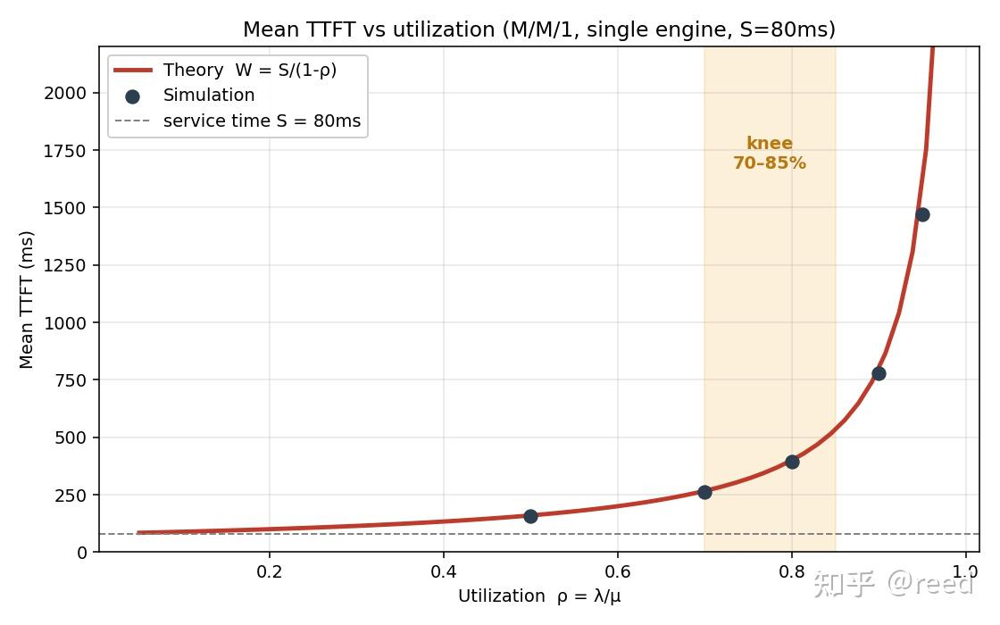
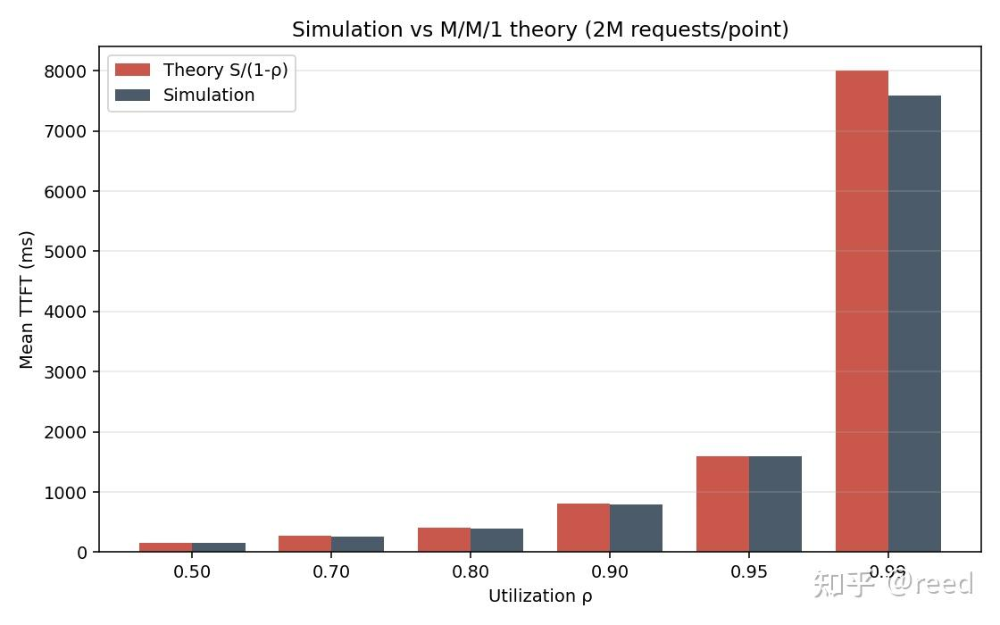

# 대기행렬 이론과 추론 시스템 2 - 이용률과 응답시간의 비선형 관계

> 원문: https://zhuanlan.zhihu.com/p/2064067785664246688

이 글은 먼저 반직관적인 현상 하나에서 출발해 시나리오 문제를 세웁니다. 그다음 Prefill 노드를 대기행렬 이론의 arrival rate $\lambda$, service rate $\mu$, utilization $\rho$ 같은 기본량으로 옮깁니다. 이어서 대기행렬 이론의 표준 모델 기호와 이상화 가정을 소개하고, queueing 시간과 총 대기 시간 공식을 제시한 뒤 수치 실험과 이론을 대조해 검증합니다. 계속해서 Little's Law로 동시성, throughput, latency 세 가지의 제약 관계를 제시하고, 마지막으로 용량 변곡점과 P 풀 용량 설계를 논의한 뒤 본 글을 정리합니다.

## 반직관적인 현상 하나

LLM 온라인 서비스에서 PD 분리는 자주 쓰이는 기법으로, P/D의 연산과 메모리 접근 특성 차이를 잘 격리해 주어 SLO(Service Level Objective)를 더 잘 보장할 수 있게 해 줍니다. 여기서는 PD 분리 시나리오에서 P의 부하 문제를 살펴봅니다. P 노드가 하나뿐이고, 사용자 요청은 평균 100ms마다 하나씩 들어오며, 요청에 대한 Prefill 계산(Attention + MoE 등)에 평균 80ms가 걸린다고 가정합니다.

직관적으로는 이 Prefill 노드가 20%의 시간 동안 놀고 있으므로(utilization 80%) 여유가 충분해 보입니다. 그러나 실제로 부하 테스트를 해 보면 요청의 평균 TTFT(Time To First Token)가 80ms가 아니라 400ms에 가깝다는 것을 알게 됩니다. 더 늘어난 320ms는 전부 queueing 대기에 쓰인 것입니다.

더 반직관적인 것은, 요청 속도를 더 높여 머신 utilization을 80%에서 90%로 올리면 TTFT가 선형으로 조금 늘어나는 것이 아니라 곧바로 두 배인 800ms가 되고, 계속해서 99%까지 올리면 TTFT가 8초까지 올라간다는 점입니다. 즉, utilization이 100%에 한 걸음 가까워질 때마다 latency는 더 큰 배율로 커집니다. 이러한 증가가 왜 이런 모양을 갖는지 이해하려면, 먼저 시스템에 정확한 언어 체계를 세워야 합니다.

## 대기행렬 시스템의 언어: λ, μ 그리고 utilization ρ

어떤 대기행렬 시스템이든 세 가지 기본량으로 기술할 수 있습니다. 위의 P 노드를 예로 들어 보겠습니다.

- **arrival rate λ**(arrival rate, lambda): 단위 시간 안에 평균적으로 도착하는 요청의 개수입니다. 방금 예에서 요청은 평균 100ms마다 하나씩 들어오므로 $\lambda = 10$ 개/초입니다.
- **service rate μ**(service rate, mu): 추론 engine(P 노드)이 전속력으로 돌 때 단위 시간 안에 평균적으로 처리할 수 있는 요청 수입니다. 예에서 P 측 평균 서비스 시간이 $S = 80\text{ms}$ 이므로 $\mu = 1/S = 12.5$ 개/초입니다.
- **utilization ρ**(utilization, rho): $\rho = \lambda/\mu = \lambda \cdot S$ 입니다. 본질적으로 "추론 engine이 전체 시간 중 어느 정도 비율로 실제 일을 하고 있는가"를 나타냅니다. 위 예에서는 $\rho = 10/12.5 = 0.8$, 즉 80%의 시간은 바쁘고 20%의 시간은 놀고 있습니다.

$\rho = \lambda S$ 는 때때로 이용률 법칙(**Utilization Law**)이라고 불립니다. 어떠한 분포 가정에도 의존하지 않으며, 단지 단위 시간에 들어오는 작업량 $\lambda S$ 가 서비스 창구가 장기적으로 바쁜 비율과 같다는 것을 말할 뿐입니다.

시스템이 안정적이려면 $\rho$ 가 반드시 엄격하게 1보다 작아야 한다는 점은 분명합니다. $\rho \geq 1$ (즉 $\lambda \geq \mu$)이면 요청이 도착하는 속도가 시스템의 처리 속도를 넘어서므로 큐는 무한히 길어집니다. 이것이 단일 서비스 창구 모델의 가장 기본적인 안정성 조건(stability condition)입니다. 간단히 말해, $\rho = 1$ 은 "딱 알맞게 꽉 찬 상태"가 아니라 큐가 제어 가능한 시스템에서 제어 불가능한 시스템으로 바뀌는 경계입니다.

"평균적으로 요청 하나가 얼마나 기다리고, 얼마나 머무는가"를 기술하기 위해 두 가지 기호를 더 약속합니다. 1. queueing 대기 시간 $W_{q}$ 는 큐 안에서 기다리며 아직 서비스가 시작되지 않은 시간을 나타냅니다. 2. 총 시간 $W = W_{q} + S$ 는 요청이 시스템에 들어온 순간부터 처리가 끝나 시스템을 빠져나갈 때까지의 총 시간을 나타냅니다. 본 편에서 약속한 PD 분리 시나리오에서는 첫 글자가 P 측에서 반환되므로, TTFT(Time To First Token)가 곧 요청이 P 노드에 머무는 시간 **$W$**, 즉 queueing 대기 시간에 자기 자신의 prefill 계산 시간을 더한 값이 됩니다.

## 모델의 통일된 명명: Kendall 기호와 M/M/1

대기행렬 시스템은 도착 과정, 서비스 시간 분포, 서비스 창구 수가 제각기 다를 수 있으므로 통일된 명명 체계가 필요합니다. Kendall은 1953년에 훗날 자신의 이름을 딴 Kendall 기호를 제안했으며, 가장 자주 쓰이는 앞의 세 자리는 다음과 같은 형태로 씁니다.

$$\text{도착 과정}\ /\ \text{서비스 시간 분포}\ /\ \text{서비스 창구 수}$$

간단하고 해석 가능하도록, 이 글에서 소개하는 도착은 포아송 과정(도착 간격이 지수분포)이며 M(Markovian)으로 표기합니다. 서비스 시간도 지수분포를 따르며 역시 M으로 표기합니다. 서비스 창구는 1개뿐입니다. 따라서 이 모델은 **M/M/1**로 씁니다. 간단히 말해 M/M/1은 "포아송 도착 + 지수 서비스 + 단일 서비스 창구"의 약칭입니다.

Kendall 기호에는 시스템 용량, 고객 모집단, 서비스 방식까지 이어서 쓸 수 있습니다. 쓰지 않으면 보통 무한 버퍼, 무한 고객 모집단, 선착순 서비스(**F**irst **C**ome **F**irst **S**erved, FCFS)를 기본값으로 합니다. 이 축약 표기 뒤에는 한 묶음의 가정이 들어 있으며, 이 시리즈에서는 그중 서비스 시간 분포, 서비스 창구 수, 시스템 용량, 도착 경계를 차례로 완화해 갈 것입니다. 본 편에서 사용하는 여섯 가지 가정은 다음과 같습니다.

1.  도착 계수 과정은 포아송 과정(Poisson process)이다(동등하게, 도착 간격이 iid로 지수분포를 따른다).
2.  서비스 시간은 독립 동일 분포이며 지수분포(exponential distribution)를 따른다.
3.  단일 서비스 창구.
4.  무한 버퍼(큐는 임의로 길어질 수 있다).
5.  FCFS 서비스 순서.
6.  서비스 시간과 도착 과정은 독립이다.

앞의 두 가지에서 "지수분포"라는 가정이 핵심적인 역할을 합니다. 지수분포의 "무기억성"(memoryless property) 덕분에 시스템 전체를 연속 시간 Markov 연쇄(CTMC)로 모델링할 수 있으며, 이것이 M/M/1이 해석해를 가질 수 있는 핵심 이유입니다. 뒤에서 보겠지만 M은 모든 모델 가운데 가장 "온건한" 분포입니다(분산이 0도 아니고 특별히 크지도 않습니다).

## 응답시간의 utilization에 따른 비선형 증가: 증폭 인자 1/(1−ρ)

M/M/1 큐에 대해, 정상 상태에서 요청이 시스템에 머무는 평균 시간에는 간결한 해가 있습니다(구체적인 유도는 관련 문헌이나 [위안바오에게 질문하기](https://yb.tencent.com/s/EDWGYhaG7w0M)를 참고하시기 바랍니다).

$$W = \frac{S}{1-\rho}$$

즉, 응답시간은 평균 서비스 시간 S에, 오직 utilization만으로 결정되는 증폭 인자 **$\frac{1}{1-\rho}$** 를 곱한 값과 같습니다. 우리 P 노드 예에서 이 응답시간은 곧 P 측의 TTFT입니다. 서로 다른 utilization에서의 증폭 인자와 TTFT를 표로 정리하면 다음과 같습니다.

| utilization ρ | 증폭 인자 1/(1−ρ) | TTFT(S=80ms) |
|----------|------------------|--------------|
| 0.5      | 2×               | 160ms        |
| 0.8      | 5×               | 400ms        |
| 0.9      | 10×              | 800ms        |
| 0.95     | 20×              | 1600ms       |
| 0.99     | 100×             | 8000ms       |

P 노드가 Prefill을 수행하는 시간은 계속 80ms로 변하지 않았습니다. 머신 utilization $\rho$ 가 90%에서 99%로 올라가면 부하는 10퍼센트포인트만 늘어났는데도 TTFT는 800ms에서 8초로 올라가며, 늘어난 시간은 전부 queueing 대기에 소모됩니다.

간단히 이해하자면, 증폭 인자 $\frac{1}{1-\rho}$ 의 분모 $1-\rho$ 는 곧 시스템의 "유휴율"입니다. 유휴율이 절반이 되면(utilization이 0.8에서 0.9로, 유휴가 0.2에서 0.1로) queueing 증폭 인자는 두 배가 됩니다. latency를 지배하는 요인은 "바쁨" 그 자체가 아니라 유휴 간격의 소멸입니다. 추론 engine에 유휴 간격이 거의 없을 때는 어떤 요청이 도착하더라도 그 앞에 완료되지 않은 요청들이 줄지어 쌓여 있을 확률이 높고, 그래서 대기가 급격하게 증폭됩니다.

이 공식을 $\rho\in(0,1)$ 구간에서 그리면 다음과 같으며, 머신 utilization과 평균 대기 시간의 곡선을 얻습니다.

## 수치 실험과 이론의 대조

위에서는 해석적 형태의 분석을 했고, 이제 수치 모의 실험을 통해 이 인식을 강화하여 아는 것에서 믿고 직관이 되는 단계로 옮겨 가겠습니다.

이벤트 구동 방식의 M/M/1 시뮬레이션을 구성합니다. 도착 간격과 서비스 시간을 각각 지수분포에서 추출합니다. 선착순 단일 서비스 창구에서 i번째 요청의 서비스 시작 시각은 "자기 자신의 도착 시각"과 "직전 요청의 완료 시각" 중 더 늦은 쪽과 같고, 체류 시간은 완료 시각에서 도착 시각을 뺀 값입니다.

평균 서비스 시간을 $S = 80\text{ms}$ 로 고정하고, 서로 다른 arrival rate $\lambda$ 로 서로 다른 utilization을 만들어 냅니다. 각 utilization마다 200만 개의 요청을 돌려 평균을 취하고, 시뮬레이션 결과와 이론값 $W = S/(1-\rho)$ 를 함께 놓고 대조합니다.

| utilization ρ | 시뮬레이션 TTFT | 이론 TTFT S/(1−ρ) | 상대 오차 |
|----------|-----------|-------------------|----------|
| 0.50     | 160.0ms   | 160.0ms           | \<0.1%   |
| 0.80     | 396.8ms   | 400.0ms           | 0.8%     |
| 0.90     | 798.7ms   | 800.0ms           | 0.2%     |
| 0.95     | 1586.3ms  | 1600.0ms          | 0.9%     |
| 0.99     | 7592.9ms  | 8000.0ms          | 5.1%     |

그림 2에서 보듯이 수치 실험과 이론은 각 utilization에서 모두 잘 일치합니다. 해석 모델(analytical model)의 가치는 시스템의 모든 세부 사항을 복제하는 데 있지 않고, 명확한 가정 문제(what-if)에 답하는 데 있습니다. P 풀의 utilization을 0.8에서 0.9로 밀어 올리면 TTFT에 무슨 일이 일어나는가 하는 질문입니다.

## Little's Law: 동시성, throughput, latency의 환산기

계속 나아가기 전에 더 보편적이고 더 유명한 결론 하나를 끼워 넣겠습니다. 위의 $W = S/(1-\rho)$ 는 M/M/1의 분포 가정에 의존하지만, 이제 소개할 이 법칙은 어떠한 분포에도 의존하지 않습니다.

1961년 John Little은 훗날 자신의 이름을 딴 Little's Law의 첫 정식 증명을 제시했습니다. 어떠한 정상 상태 대기행렬 시스템에서도, 시스템 내 평균 요청 수 $L$, arrival rate $\lambda$, 평균 체류 시간 $W$ 세 가지는 다음을 만족합니다.

$$L = \lambda W$$

추론 시스템의 언어로 옮기면 **시스템 내 진행 중(in-flight)인 요청 수 = 요청 throughput × 요청당 latency** 입니다. 이는 세 가지 관측 가능한 양 사이의 환산기이며, 시스템이 정상 상태이고 통계 구간이 충분히 길다면 구체적인 도착 분포나 서비스 분포에 의존하지 않습니다.

위의 예로 검증해 보겠습니다. $\rho = 0.8$ 일 때 M/M/1의 평균 시스템 내 요청 수는 $L = \frac{\rho}{1-\rho} = 4$ 입니다. 그리고 $\lambda = 10$ 개/초, $W = 0.4$ 초이므로 $\lambda W = 10 \times 0.4 = 4 = L$ 로 완전히 일치합니다.

Little's Law는 일상 업무에서 극히 쓸모가 많습니다. 이 세 가지 양 중 보통 두 개만 직접 측정할 수 있고, 나머지 하나는 이 법칙으로 환산하기 때문입니다. 예를 들어 P 풀의 throughput이 40 req/s이고 평균 TTFT가 150ms로 관측되었다면, 임의의 시점에 처리 중이거나 대기 중인 요청 수는 $L = 40 \times 0.15 = 6$ 개입니다. 이는 어느 정도 규모의 동시성을 위해 자원을 준비해야 하는지를 바로 알려 줍니다. 반대로 P 노드가 허용하는 최대 in-flight 요청 수 또는 등가 동시성 용량($L$ 의 상한)을 알고 있고 요청당 latency도 안다면, 그 구성이 감당할 수 있는 throughput을 계산할 수 있습니다.

> **Little's Law의 본질은 "동시성 수"라는 공간상의 양과 "throughput × latency"라는 시간상의 양을 정상 상태 평균의 의미에서 등호로 연결하는 것입니다.** 이는 분포에 의존하지 않는 **환산기**이며, 세 양이 각각 얼마인지는 알려 주지 않고 셋 사이의 관계만 알려 줍니다. 그래서 M/M/1에서는 Little's Law를 $W = S/(1-\rho)$ 와 함께 씁니다. 후자는 수치를 주고, 전자는 수치들 사이를 어떻게 환산하는지 알려 줍니다.

## 용량 변곡점(capacity knee)과 utilization 경계

$\frac{1}{1-\rho}$ 라는 곡선을 손에 넣고 나면, "서비스 창구를 도대체 얼마나 꽉 채워 돌려야 하는가"는 경험의 문제에서 계산할 수 있는 문제로 바뀝니다. 그림 1의 곡선을 다시 보겠습니다.

- $\rho = 0.5$, 2× 증폭, 여유 충분.
- $\rho = 0.7$, 3.3× 증폭, 그런대로 수용 가능.
- $\rho = 0.85$, 6.7× 증폭, 곡률이 뚜렷하게 커짐.
- $\rho > 0.9$, 곡선이 이미 수직에 가까움.

엄밀히 말하면 $\frac{1}{1-\rho}$ 에는 자연스러운 수학적 변곡점이 없습니다. 기울기와 곡률 모두 $\rho$ 가 커짐에 따라 계속 상승합니다. 70%–85%는 위 예시 M/M/1의 knee 참고 구간으로만 볼 수 있으며, 이 구간에서 평균 증폭이 약 3배에서 6–7배로 빠르게 변합니다. 실제 utilization 경계는 서비스 수준 목표(SLO), 서비스 시간 분산, 버스트 정도, 유입 제어(admission control)가 함께 결정해야 하며, "80%"를 모든 P 풀에 통용되는 상수로 삼아서는 안 됩니다.

응답시간 SLO에 민감한 모든 온라인 서비스에서 이 경계는 중요합니다. 위 예에 적용하면 이는 P 풀의 용량 계획에 직접 영향을 줍니다. 결론을 P 노드 설계의 언어로 옮겨 보겠습니다.

**첫째, P 풀의 목표 utilization은 자기 SLO에 대응하는 변곡점의 왼쪽에 두어야 합니다.** 우리가 약속한 PD 분리 아키텍처에서 P 측 TTFT는 주로 queueing 대기에 prefill/첫 글자 산출을 더한 것입니다. 위 예는 80% utilization에서 이미 5× 평균 증폭을 보였으며, 이는 상당한 여유를 남겨 두어야 함을 뜻합니다. 구체적인 목표값은 실제 서비스 분포와 꼬리 latency SLO로부터 역산해야 하며, 고정된 레드라인을 그대로 가져다 쓸 일이 아닙니다.

**둘째, M/M/1이라는 가장 단순한 모델에서 TTFT를 낮추기 위해 조정할 수 있는 파라미터는 두 개뿐입니다.** 공식 $W = S \cdot \frac{1}{1-\rho}$ 를 나누어 보면, 평균 서비스 시간 $S$ 자체를 낮추거나, utilization $\rho$ 를 낮추는 것입니다. 평균 서비스 시간을 낮추는 경로는 Prefill 연산자 최적화, prompt 길이 단축, 더 빠른 GPU 카드 사용입니다. utilization을 낮추는 경로는 P 카드를 추가해 증설하거나 입구에서 유량을 제한해 피크를 깎는 것입니다. 다음 편에서는 서비스 시간이 더 이상 지수분포를 따르지 않을 때 서비스 시간 분산이 세 번째 핵심 요인이 된다는 것을 보게 될 것입니다.

> **이 글에서 가장 기억해야 할 한 문장: P 측 평균 TTFT = 서비스 시간 × utilization 증폭 인자, 즉 $W = S \cdot \frac{1}{1-\rho}$.** 그중 평균 queueing 대기는 $W_q = \frac{\rho S}{1-\rho}$ 입니다. 앞 항은 연산자와 prompt가 결정하고, 뒤 항은 P 풀 용량과 입구 유량 제한이 결정합니다.

## 정리

이 글은 먼저 80% utilization에서 5× 평균 응답시간이라는 반직관적 현상에서 출발해 대기행렬 이론의 기본 개념 $\lambda$, $\mu$, $\rho$ 를 도입했습니다. 이어서 M/M/1 모델 정의와 대기 시간 공식 $W=S/(1-\rho)$ 를 제시하고 200만 요청 시뮬레이션과 이론을 대조했습니다. 그다음 Little's Law $L=\lambda W$ 를 소개하여 동시성, throughput, latency를 서로 연결했고, 마지막으로 용량 변곡점과 utilization으로 인한 TTFT 급증을 논의했습니다. 본문에서는 서비스 시간이 지수분포라고 가정했지만 현실은 그렇지 않으며, 서비스 시간은 입력 길이, cache 적중 등 일련의 요인과 관련됩니다. 다음 글에서는 이 가정을 걷어 내고 더 현실적인 시나리오에 가깝게 만들어 보겠습니다.

## 참고

- [A. K. Erlang, The Theory of Probabilities and Telephone Conversations, Nyt Tidsskrift for Matematik B, Vol. 20, 1909](https://www.scirp.org/reference/referencespapers?referenceid=2221031)
- [D. G. Kendall, Stochastic Processes Occurring in the Theory of Queues and their Analysis by the Method of the Imbedded Markov Chain, The Annals of Mathematical Statistics, 1953](https://www.scirp.org/reference/referencespapers?referenceid=2221033)
- [J. D. C. Little, "A Proof for the Queuing Formula: L = λW", Operations Research, Vol. 9, No. 3, 1961.](https://www2.isye.gatech.edu/~spyros/courses/IE7201/Fall-13/Little-OR-paper.pdf)
