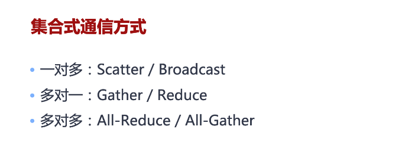
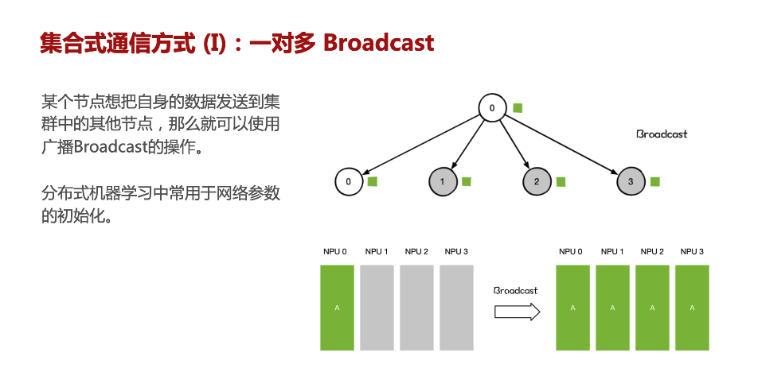
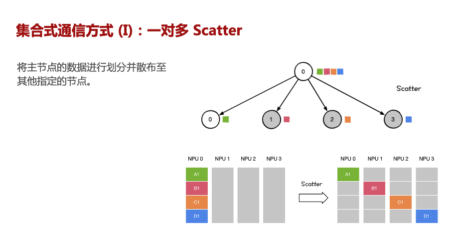
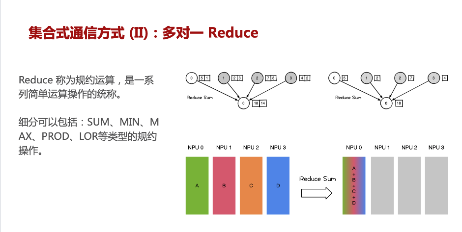
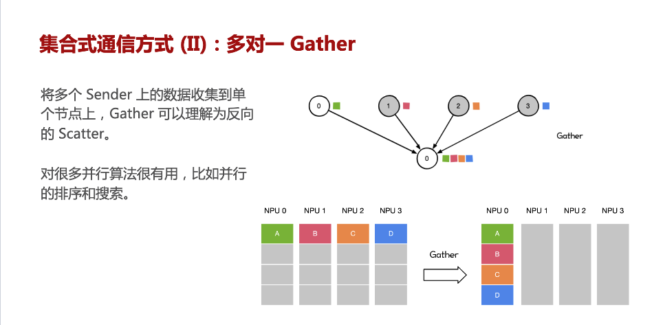
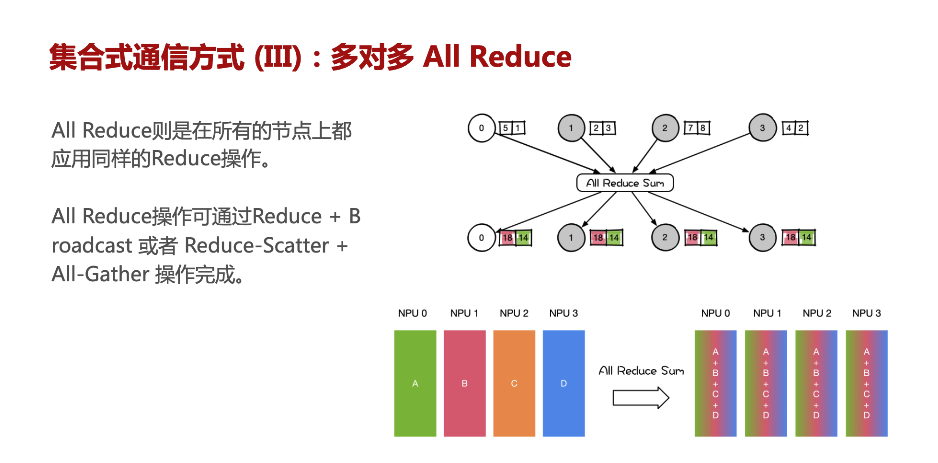
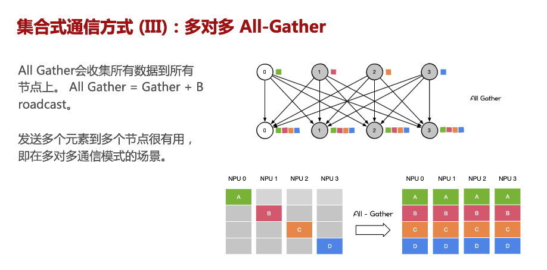
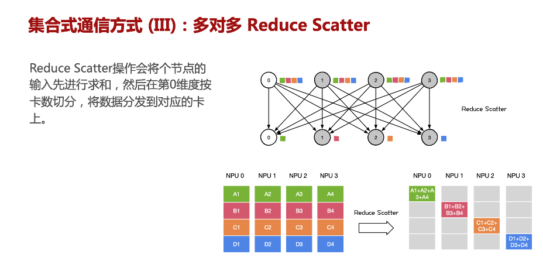
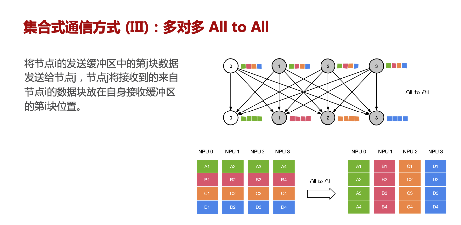
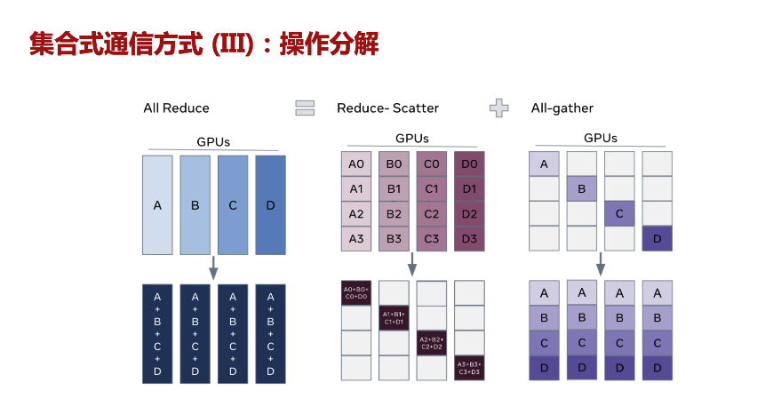

# 데이터 병렬로 대규모 모델을 학습하는 방법 (Zero)

## 데이터 병렬로 대규모 모델을 학습하는 방법(Zero)

### 집합 통신 primitive

Zero를 소개하기 전에 먼저 어떤 통신 primitive가 있는지 알아야 한다. 아래 자료의 출처는 https://github.com/chenzomi12/DeepLearningSystem/blob/main/Frontend/AICluster/04.primitive.pdf 이다.

### Zero 원리

amp 모드에서 하나의 모델을 놓고, 모델에 학습 가능한 파라미터가 $\phi$개 있다고 가정하자. 그러면 파라미터와 그래디언트의 fp16 사본은 각각 저장에 $2\phi$ bytes가 필요하다. 즉 여기서는 모델 학습 파라미터의 fp16 사본을 저장하기 위해 $4\phi$ bytes가 필요하다. 동시에 fp32에 대해서는 weight와 adam 안의 대응하는 2개 상태를 저장해야 하므로, 데이터 병렬을 합치면 필요한 총 저장량은 $12\phi$가 된다. 모델의 forward와 backward 업데이트 시에는 각각 $2\phi$의 메모리만 필요하지만, 모델의 파라미터 업데이트에는 추가로 $12\phi$가 필요하므로 총 메모리량은 $16\phi$다. 1.5B gpt2의 경우 ddp 학습 시 단일 카드에 필요한 메모리가 24GB가 된다.

zero 1은 fp32 파라미터와 optimizer 상태를 쪼개고, fp16 파라미터는 각 카드가 완전한 한 벌을 가진다. forward 계산에서 각 카드는 fp32를 fp16으로 변환한 뒤 allgather로 업데이트된 완전한 fp16 파라미터를 얻는다.  
zero 2는 한 단계 더 나아가, backward 그래디언트 계산이 끝난 뒤 reducescatter 후 원래 완전했던 fp16 그래디언트도 즉시 쪼개며, 각 카드는 대응하는 부분만 보관한다.
zero 3은 forward에서 완전한 fp16 파라미터를 한 번 allgather해야 하며, 계산이 끝난 뒤 이를 해제하고 backward에서 필요할 때 다시 한 번 allgather한다.

전체 원리는 [리무의 zero 논문 정독](https://www.bilibili.com/video/BV1tY411g7ZT/?spm_id_from=333.788&vd_source=4dffb0fbabed4311f4318e8c6d253a10)을 참고할 수 있다.

또한 [ZeRO+DeepSpeed: 마이크로소프트가 발표한 효율적인 대규모 학습 suite(상세 분산 학습 흐름 포함)](https://zhuanlan.zhihu.com/p/108571246)도 참고할 수 있다.
