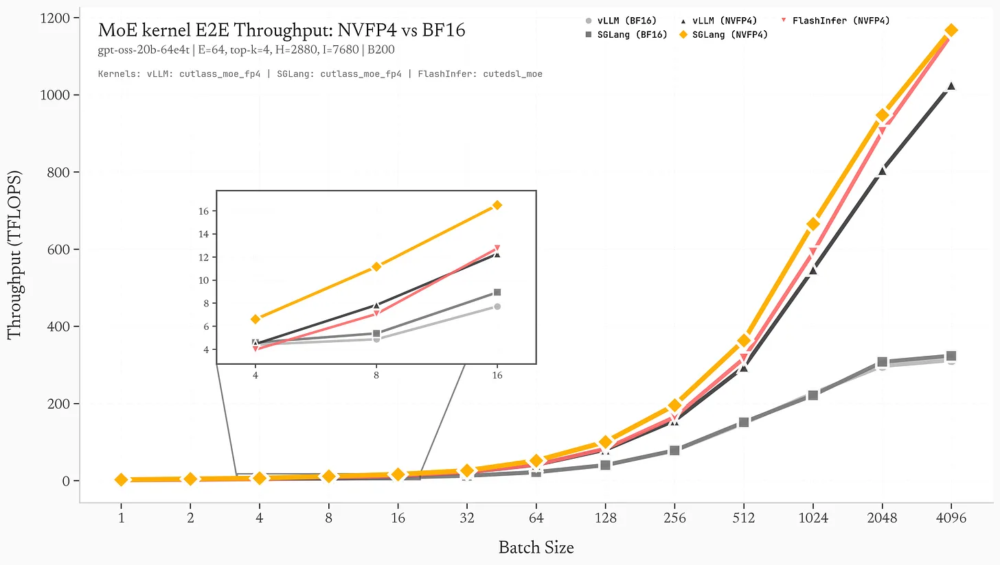
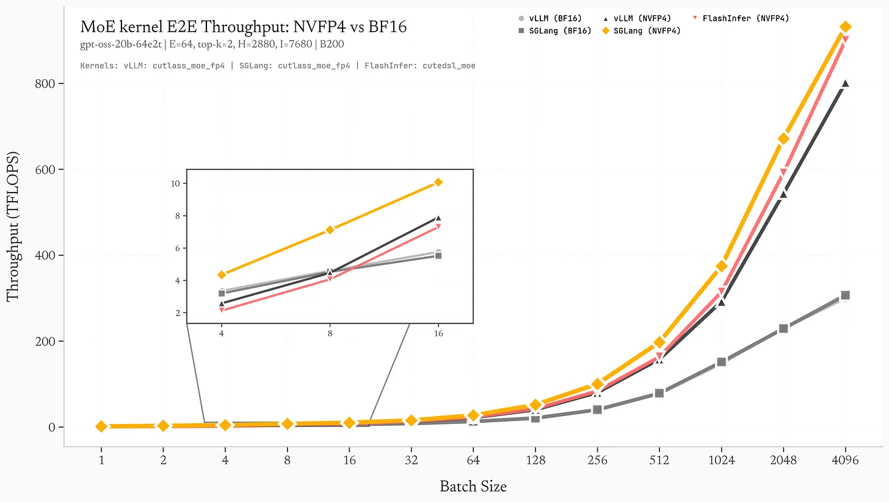
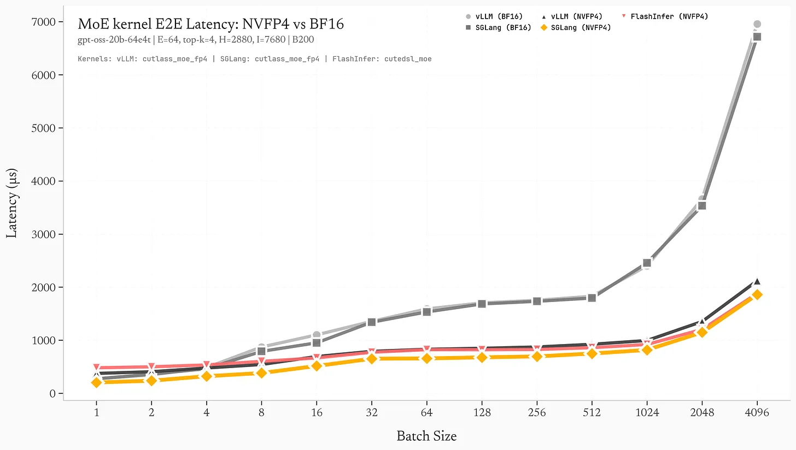
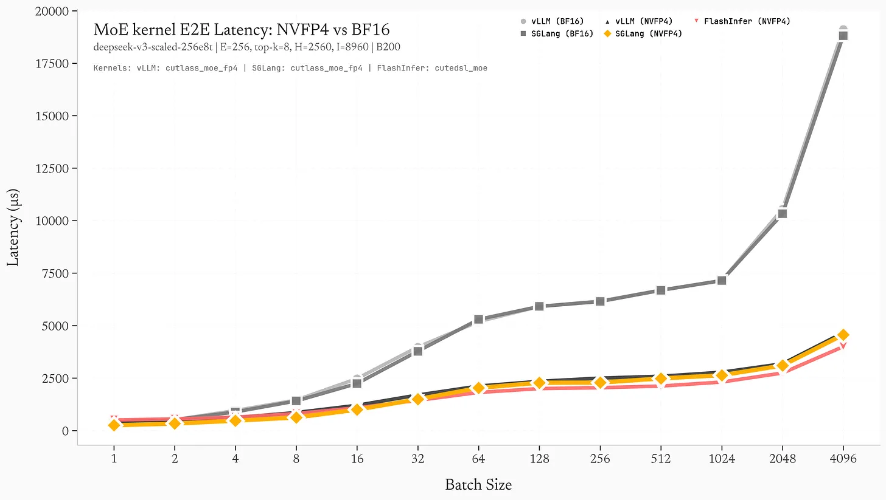
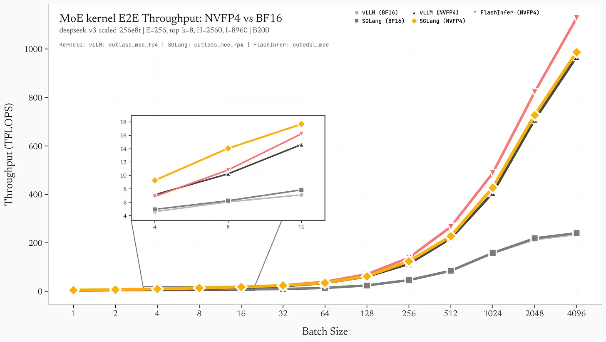

> 블로그 전재 번역 원문: https://substack.com/inbox/post/183346100?triedRedirect=true , 지식 학습 용도로만 사용하며, 침해가 있으면 삭제하겠습니다.

# 142 TFLOPS 차이: 왜 **Blackwell**에서 **FP4 MoE** operator engineering이 중요한가

**kernel fusion**, **Blackwell** 대상 최적화, 그리고 **expert-aware** 계산으로 작은 batch 추론에서 `vLLM` 대비 **1.84배** 가속을 얻는 방법

저자: advpropx(X)

## 서론

NVIDIA가 **Blackwell**의 native **FP4** 지원을 발표했을 때 약속은 매우 분명했다. **2배**의 메모리 대역폭 절감과 대형 모델 추론 처리량의 뚜렷한 향상이다. 하지만 하드웨어 능력은 이야기의 절반일 뿐이고, 나머지 절반은 **kernel engineering**에서 온다.

나는 **Blackwell B200**(`sm_100a`) GPU 한 장에서 세 가지 대표 **MoE**(**Mixture of Experts**) backend인 `vLLM`, `SGLang`, `FlashInfer CuteDSL`을 benchmark했다. 테스트 모델은 `GPT-OSS-20B`이며, 각 layer에 **32**개 expert, `top-4` routing, **FP4** quantization을 사용했다. 같은 hardware, 같은 model structure에서 kernel 구현만 달랐다.

결과는 다음과 같다.

- **SGLang**: peak throughput **1168 TFLOPS**
- **vLLM**: peak throughput **1026 TFLOPS**
- **FlashInfer CuteDSL**: peak throughput **1156 TFLOPS**

이는 `SGLang`과 `vLLM` 사이에 **142 TFLOPS**의 차이가 있음을 뜻한다. batch size = 1, 즉 interactive inference에서 가장 흔한 시나리오에서는 `SGLang`이 **1.84배** 빠르다.

이것은 distributed training도 아니고 multi-node inference 비교도 아니다. **single-card inference**에서 벌어지는 **grouped GEMM** kernel 경쟁이다. 차이는 주로 세 가지 핵심 최적화에서 나온다.

- **Kernel fusion**: global memory 왕복 3회에서 1회로 감소
- **Blackwell** 대상 **CUTLASS** schedule: native **FP4 warp specialization**
- **Adaptive grid sizing**: 작은 batch에서 **SM occupancy** 극대화

먼저 데이터를 보고, 이어서 이 kernel들이 정확히 어디에서 달라지는지 풀어 보겠다.

## Benchmark: Blackwell B200 위의 `GPT-OSS-20B`

### 모델 설정

```shell
Architecture: GPT-OSS-20B
Experts: 32 total, top-4 routing
Hidden size: 2880
Intermediate size: 7680 (per expert)
Quantization: NVFP4 (4-bit floating point, E2M1 format)
Hardware: NVIDIA Blackwell B200 (sm_100a)
```

### Peak Throughput(Batch Size = 4096)

그림 1: batch size별 effective TFLOPS. `SGLang`은 항상 앞서며, 작은 batch에서 이점이 더 뚜렷하다.





### Latency Breakdown(Batch Size = 128)

그림 2: batch size = 128, 즉 decode의 “sweet spot” 구간에서 layer별 latency breakdown.



batch = 128에서 1000개 token을 생성하면 다음과 같다.

- `vLLM`: 20.3초

- `SGLang`: 16.2초

`SGLang`은 4.1초를 절약한다. 약 **20%** 빠르다.

### 작은 batch의 이점

정말 흥미로운 부분은 batch가 작을수록 성능 격차가 커진다는 점이다.

이는 매우 중요하다. interactive inference, 예를 들어 chatbot, code completion, agent 등은 보통 batch size **1-16**에서 실행된다. 이 구간에서 `SGLang`의 **1.34배-1.84배** 이점은 곧바로 사용자 경험으로 이어진다.

## Kernel 발견 #1: **fusion**으로 memory bottleneck 제거

### `vLLM`의 직렬 구현(7회 kernel launch)

`vLLM`의 **MoE** forward는 7개의 독립 CUDA kernel을 launch한다.

출처: `vllm/model_executor/layers/fused_moe/cutlass_moe.py:671-712`

```python
# 1. Reorder tokens by expert assignment
rep_a_fp4 = ops.shuffle_rows(a_fp4, a_map, (m * topk, k))
rep_a_blockscale = ops.shuffle_rows(a_blockscale, a_map, (m * topk, k // 16))

# 2. Quantize activations to FP4
a_fp4, a_blockscale = ops.scaled_fp4_experts_quant(a, a1_gscale, ...)

# 3. First GEMM: gate_up projection
c1 = ops.cutlass_fp4_moe_mm(rep_a_fp4, w1_fp4, rep_a_blockscale, w1_blockscale, ...)

# 4. SiLU activation
intermediate = torch.empty((m * topk, n), device=device, dtype=out_dtype)
torch.ops._C.silu_and_mul(c1, intermediate)

# 5. Quantize intermediate activations
int_fp4, int_blockscale = ops.scaled_fp4_experts_quant(intermediate, a2_gscale, ...)

# 6. Second GEMM: down projection
c2 = ops.cutlass_fp4_moe_mm(int_fp4, w2_fp4, int_blockscale, w2_blockscale, ...)

# 7. Reorder output back to original token order
output = ops.shuffle_rows(c2, c_map, (m, k))
```

대가는 무엇인가?

- 7회 kernel launch, 매번 약 `~5-10μs`의 추가 overhead
- 7회 global memory 왕복
- kernel 사이 6곳의 synchronization point
- `rep_a_fp4`, `c1`, `intermediate`, `int_fp4`, `c2` 등의 intermediate buffer 할당

batch size = 4에서는 kernel launch overhead만으로도 전체 latency의 **10%-20%**를 차지한다.

### `SGLang`의 fused reduction kernel

`SGLang`은 “첫 번째 shuffle + 마지막 shuffle + 최종 reduction”을 하나의 kernel에 fuse한다.

출처: `sglang/sgl-kernel/csrc/moe/prepare_moe_input.cu:258-321`

```c++
template <typename T, typename scalar_t>
__global__ void apply_shuffle_mul_sum_kernel(
    const T* __restrict__ input,           // [m*topk, k]
    const int* __restrict__ permutation,   // [m*topk] mapping
    const scalar_t* __restrict__ weights,  // [m, topk] routing weights
    T* __restrict__ output,                // [m, k]
    int m, int k, int topk
) {
    // 128-bit vectorized loads
    constexpr uint32_t vec_size = 16 / sizeof(scalar_t);
    using vec_t = flashinfer::vec_t<T, vec_size>;

    const int token_idx = blockIdx.x;
    const int feature_idx = threadIdx.x * vec_size;

    vec_t sum;
    sum.fill(scalar_t(0));

    // Iterate over top-k experts for this token
    for (int k_idx = 0; k_idx < topk; k_idx++) {
        const int src_idx = permutation[token_idx * topk + k_idx];
        const scalar_t weight = weights[token_idx * topk + k_idx];

        // Vectorized load from expert output
        vec_t expert_output;
        expert_output.load(input + src_idx * k + feature_idx);

        // Multiply by routing weight and accumulate
        #pragma unroll
        for (int i = 0; i < vec_size; i++) {
            sum[i] += expert_output[i] * weight;
        }
    }

    // Vectorized store to output
    sum.store(output + token_idx * k + feature_idx);
}
```

하나의 kernel에서 세 가지 일을 끝낸다.

- token reorder(`permutation` lookup)
- routing weight multiply
- `TopK` reduction, 즉 선택된 experts 합산

이점은 다음과 같다.

- activation 관련 memory bandwidth 요구량이 약 **3배** 감소(global memory pass 1회)
- 더 좋은 cache locality(`L1`에서 `permutation`과 `weights` 재사용)
- intermediate buffer 할당 2개 감소
- kernel 수가 7개에서 5개로 감소(`7 → 5`)

`128-bit` vectorization은 thread 하나가 load 한 번에 `bfloat16` 원소 8개를 처리한다는 뜻이다. 작은 batch에서도 memory bandwidth를 더 충분히 끌어낼 수 있다.

### `FlashInfer CuteDSL`: 다른 trade-off

`FlashInfer`는 **token-first**가 아니라 **expert-first**라는 다른 layout을 쓴다.

출처: 내 benchmark script

```python
def prepare_flashinfer_input_vectorized(hidden_states, topk_ids, topk_weights, num_experts, topk, device, dtype):
    """Prepare input in expert-first format for FlashInfer CuteDSL.

    Reshapes from [batch, hidden] to [num_experts, max_tokens_per_expert, hidden]
    """
    batch_size, hidden_dim = hidden_states.shape

    # Count tokens per expert using vectorized bincount
    flat_ids = topk_ids.flatten()
    expert_counts = torch.bincount(flat_ids.to(torch.int64), minlength=num_experts).to(torch.int32)
    max_tokens_per_expert = expert_counts.max().item()

    # Sort tokens by expert ID
    sorted_indices = torch.argsort(flat_ids)
    sorted_hidden = weighted_hidden[sorted_indices]
    sorted_expert_ids = flat_ids[sorted_indices]

    # Create expert-first tensor [num_experts, max_tokens, hidden_dim]
    expert_hidden = torch.zeros((num_experts, max_tokens_per_expert, hidden_dim), device=device, dtype=dtype)

    # Fill using advanced indexing
    expert_offsets = torch.zeros(num_experts + 1, dtype=torch.int64, device=device)
    expert_offsets[1:] = expert_counts.cumsum(0)

    token_positions = torch.arange(len(sorted_expert_ids), device=device)
    position_in_expert = token_positions - expert_offsets[sorted_expert_ids]

    expert_hidden[sorted_expert_ids, position_in_expert] = sorted_hidden
    return expert_hidden, expert_counts
```

trade-off는 이렇다. `FlashInfer`는 preprocessing이 더 무겁다. `sorting`, `scatter` 등이 필요하다. 하지만 **expert-first** layout은 “expert dimension 기준 batch화”를 더 잘 만든다. 작은 batch(`BS=1-16`)에서는 이 overhead가 성능을 뚜렷하게 끌어내리지만, 큰 batch에서는 layout 이점이 preprocessing 비용을 상쇄하기 쉽기 때문에 전체 성능이 `SGLang`에 가까워질 수 있다.

## Kernel 발견 #2: **Blackwell** 대상 **CUTLASS** 특화 schedule

### `SGLang`의 native **FP4** schedule

`SGLang`은 `sm_100a`의 **grouped FP4 GEMM**을 위해 특별히 설계된, **Blackwell** 최적화 **CUTLASS** schedule을 사용한다.

출처: `sglang/sgl-kernel/csrc/moe/nvfp4_blockwise_moe.cu:196-201`

```c++
// SM100/Blackwell B200 configuration
using ThreadBlockShape = Shape<_128, _128, _128>;
using ClusterShape = Shape<_1, _1, _1>;
using AlignmentA = 32;
using AlignmentB = 32;
using KernelSchedule = cutlass::gemm::KernelPtrArrayTmaWarpSpecialized1SmNvf4Sm100;
```

`KernelPtrArrayTmaWarpSpecialized1SmNvf4Sm100`이 주는 이점은 다음과 같다.

- **FP4** 대상 **warp specialization**: **FP4** load, `FP16/BF16`으로 dequantize, `FP32` accumulation을 각각 전용 warp 역할에 배정해 범용 “load-convert-compute” 경로를 피한다.
- **TMA**(**Tensor Memory Accelerator**) 통합: asynchronous bulk tensor load로 `L1 cache`를 우회해 shared memory에 직접 데이터를 공급한다. 이를 위해 엄격한 **128-byte alignment**가 필요하다.
- **1 SM grouping**: “expert 하나가 SM 하나를 차지”하는 대신 SM 하나가 여러 expert를 처리한다. expert 규모가 고르지 않은 **MoE** workload에 더 우호적이다.
- native **NvFP4** 지원: software emulation이 아니라 **Blackwell** hardware **FP4** instruction을 사용한다.

### **TMA** alignment 강제

출처: `sglang/sgl-kernel/csrc/moe/nvfp4_blockwise_moe.cu:89-103`

```c++
// Strict TMA alignment enforcement
assert((reinterpret_cast<uintptr_t>(a_scales_offsets[expert_id]) % 128) == 0
       && "TMA requires 128-byte alignment");

*layout_sfa_ptr = ScaleConfig::tile_atom_to_shape_SFA(
    cute::make_shape(static_cast<int>(m), static_cast<int>(n),
                     static_cast<int>(k), 1)
);
```

`SGLang`은 `blockscale offsets`를 **128-token** boundary로 pad해서 **TMA alignment**를 보장한다.

출처: `sglang/sgl-kernel/csrc/moe/prepare_moe_input.cu:55-73`

```c++
// Round to 128-token boundaries for TMA
blockscale_offsets[expert_id + 1] =
    (expert_offsets[expert_id + 1] + 127) / 128 * 128;
```

이 방식은 약간의 GPU memory를 낭비한다. expert 하나당 최대 `float` 127개가 더 들어갈 수 있다. 하지만 unaligned access로 인한 **TMA stall**을 막을 수 있다.

### `vLLM`의 범용 **CUTLASS** 설정

`vLLM`은 더 범용적인 **CUTLASS 3.x** schedule을 사용한다. `Ampere/Hopper/Blackwell`을 모두 지원하지만, **Blackwell**에 맞춘 특화 최적화는 부족하다.

출처: `vllm/csrc/quantization/fp4/nvfp4_blockwise_moe_kernel.cu:93-101`

```c++
// Generic TMA alignment checks (no padding)
assert(reinterpret_cast<uintptr_t>(a_scales) % 128 == 0);
assert(reinterpret_cast<uintptr_t>(b_scales) % 128 == 0);
```

`vLLM`은 alignment를 검사하지만 padding으로 “강제 정렬”하지는 않는다. 따라서 token 수가 자연스럽게 alignment 조건을 만족하지 못하면 **TMA**가 더 느린 경로로 fallback할 수 있다.

#### 영향

영향은 다음과 같다.

- 더 높은 effective memory bandwidth(**TMA** vs `L1 cache` 경로)
- 더 높은 warp utilization(특화 역할 vs 범용 경로)
- 더 적은 register spill(`sm_100a` 대상 tuning)

## Kernel 발견 #3: 작은 batch 대상 **adaptive grid sizing**

#### 작은 batch에서의 **occupancy** 문제

GPU kernel이 peak performance에 가까워지려면 GPU를 “먹여 살릴” 충분한 parallelism이 필요하다. **142**개 SM을 가진 `B200`을 예로 들면, 모든 SM을 바쁘게 만들려면 최소 **142**개 thread block이 필요하다.

하지만 **MoE**는 batch size = 1에서 전형적인 문제를 만난다.

- `64 experts × 4 topk = 256 tokens`를 처리해야 한다.
- thread block 하나가 `128 tokens`를 처리하면 `2 blocks`만 launch된다.
- 결과적으로 약 **98.6%**의 SM이 idle 상태가 된다.

표준 **CUTLASS** launch heuristic은 이런 극단적인 소규모 상황에 잘 맞지 않는다.

#### `SGLang`의 dynamic block sizing

parallelism이 부족할 때 `SGLang`은 adaptive strategy를 사용한다. 더 작은 block으로 더 큰 grid를 만들어 전체 parallelism을 높인다.

출처: `sglang/sgl-kernel/csrc/gemm/nvfp4_expert_quant.cu:456-477`

```c++
// Adaptive kernel launch configuration
int const workSizePerRow = k / ELTS_PER_THREAD;  // 8 FP4 elements per thread
int const totalWorkSize = m_topk * workSizePerRow;
dim3 block(std::min(workSizePerRow, 512));
int const numBlocksPerSM = 2048 / block.x;

dim3 grid(std::min(
    static_cast<int>((totalWorkSize + block.x - 1) / block.x),
    multiProcessorCount * numBlocksPerSM
));

// Dynamic adjustment: halve block size, double grid size
while (grid.x <= multiProcessorCount && block.x > 64) {
    grid.x *= 2;
    block.x = (block.x + 1) / 2;
}
```

batch size = 1을 예로 들면 초기 설정은 다음과 같다.

```c++
m_topk = 256 tokens (1 batch × 64 experts × 4 topk)
k = 2880 (hidden size)
workSizePerRow = 2880 / 8 = 360
totalWorkSize = 256 × 360 = 92,160

block.x = min(360, 512) = 360
grid.x = min(92160 / 360, 142 × 5) = min(256, 710) = 256
```

adaptive adjustment 이후:

```c++
Iteration 1: grid.x=256 > 142, no change
Final: grid=256, block=360
```

작업량이 더 작으면 위 `while` loop가 작동한다.

```c++
Iteration 1: grid=128, block=180 → grid=256, block=90
Iteration 2: grid=256 > 142, stop
```

결과적으로 `block size`와 `grid size` 사이의 균형을 찾아 **SM occupancy**를 가능한 한 극대화한다.

### `vLLM`의 고정 heuristic

`vLLM`은 **CUTLASS** 기본 launch heuristic에 더 많이 의존한다. 이 heuristic은 큰 matrix 규모 최적화에 더 가깝다. 작은 batch에서는 다음 문제가 생긴다.

- 더 큰 block(`256-512` threads)
- 더 적은 block 수(utilization 부족)
- 더 낮은 **occupancy**

실측상 `BS=1-4`에서 `SGLang`의 adaptive sizing은 최대 **1.84배** 가속에 기여할 수 있다.

## DeepSeek 관련: scale-out **Expert Parallelism**(EP)

### DeepSeek-V3 architecture

`DeepSeek-V3`는 **MoE**를 더 극단적인 규모로 밀어붙인다.

- layer마다 **256** experts
- `Top-8` routing, 활성 expert 수가 약 **2배**
- `hidden dim = 7168`, `intermediate = 18432`, expert 하나의 계산량이 매우 큼

이 architecture의 설계 목표는 **Expert Parallelism**(**EP**)이다. expert를 여러 GPU/node로 나누고 **all-to-all** communication으로 token을 routing한다. 여기서는 `DeepEP/EP`의 communication overhead를 측정하지 않았다. 그것은 또 다른 주제다.

나는 single `B200`에 들어가는 축소 버전을 benchmark했다.

```shell
Experts: 256
TopK: 8
Hidden: 2560 (scaled from 7168)
Intermediate: 8960 (scaled from 18432)
```





### expert가 많아질수록 격차가 줄어드는 이유

experts 수가 **256**에 이르면 system의 자연 parallelism이 더 높아진다. launch heuristic이 이상적이지 않더라도 `vLLM`은 큰 batch에서 GPU를 더 쉽게 꽉 채울 수 있다. 이때 **kernel fusion**과 **Blackwell** 대상 최적화의 이점은 더 **compute-bound**한 구간에서 덜 두드러진다.

하지만 작은 batch에서는 `SGLang`의 **adaptive grid sizing**이 여전히 더 유리하다. expert가 많을수록 routing이 더 예측하기 어렵고 expert load imbalance가 더 커지는데, `SGLang`의 **expert-aware quantization**은 이런 상황을 더 잘 처리한다.

### DeepEP: multi-node expert parallelism

진짜 `DeepSeek-V3` 규모, 즉 `256` experts와 full dimension을 유지하려면 보통 node를 넘나드는 **EP**가 필요하다. `SGLang`은 `DeepEP`(DeepSeek Expert Parallelism)를 구현했고 핵심 흐름은 다음과 같다.

- **All-to-All dispatch**: token을 해당 expert를 가진 rank로 routing
- **Local GEMM**: 각 rank가 자신이 맡은 experts 계산
- **All-to-All combine**: 결과를 원래 token 순서로 다시 aggregate

출처: `sglang/srt/layers/moe/token_dispatcher/deepep.py:398-457`

```python
def _dispatch_core(
    self,
    x: Union[torch.Tensor, Tuple[torch.Tensor, torch.Tensor]],
    topk_ids: torch.Tensor,
    topk_weights: torch.Tensor,
    previous_event,
):
    buffer = self._get_buffer()

    # Compute dispatch layout (which tokens go to which rank)
    (
        num_tokens_per_rank,
        num_tokens_per_rdma_rank,
        num_tokens_per_expert,
        is_token_in_rank,
        previous_event,
    ) = buffer.get_dispatch_layout(
        topk_ids,
        self.num_experts,
        previous_event=previous_event,
        async_finish=self.async_finish,
        allocate_on_comm_stream=previous_event is not None,
    )

    # All-to-all dispatch
    (
        recv_x,
        recv_topk_ids,
        recv_topk_weights,
        num_recv_tokens_per_expert,
        self.handle,
        event,
    ) = buffer.dispatch(
        x,
        topk_idx=topk_ids,
        topk_weights=topk_weights,
        num_tokens_per_rank=num_tokens_per_rank,
        num_tokens_per_rdma_rank=num_tokens_per_rdma_rank,
        is_token_in_rank=is_token_in_rank,
        num_tokens_per_expert=num_tokens_per_expert,
        previous_event=previous_event,
        async_finish=self.async_finish,
        allocate_on_comm_stream=(previous_event is not None) and self.async_finish,
        expert_alignment=128 if deep_gemm_wrapper.ENABLE_JIT_DEEPGEMM else 1,
        config=DeepEPConfig.get_instance().normal_dispatch_config,
    )

    return (
        recv_x,
        recv_topk_ids,
        recv_topk_weights,
        num_recv_tokens_per_expert,
        event,
    )
```

핵심 세부 사항은 다음과 같다.

- `NCCL/RDMA`로 low-latency all-to-all 구현
- bandwidth 압력을 낮추기 위해 **FP8** communication 지원(dispatch 전에 activation quantization)
- 두 가지 mode: `Normal`(prefill)과 `Low-Latency`(decode)

dispatch 이후 local `GEMM` 단계에도 앞에서 언급한 kernel 최적화(fusion, **Blackwell** schedule, adaptive sizing)가 그대로 적용된다. 따라서 single-card **1.25배-1.84배** 가속은 multi-node parallelism과 추가로 겹쳐진다.

## `FlashInfer CuteDSL`: 세 번째 선수

`CuteDSL`은 비교적 새로운 방향으로, **MoE** workload를 위한 template 기반 kernel generation에 초점을 둔다.

### 성능 비교(`GPT-OSS-20B`)

peak throughput(`BS=4096`)에서는 `FlashInfer`가 `SGLang`보다 약 **1.0%** 느리다(`1156` vs `1168 TFLOPS`). 하지만 작은 batch에서는 **1.6배-2.4배** 느려진다.

### 왜 `FlashInfer`는 작은 batch에서 불리한가

`FlashInfer`의 **expert-first** layout은 무거운 preprocessing이 필요하다.

- `bincount`로 expert별 token 수 집계
- `argsort`로 expert 기준 token grouping
- `scatter`로 expert-first tensor 채우기(padding이 생길 수 있음)

`batch size = 1`이고 experts 수가 `64`이면 이 preprocessing overhead가 주요 bottleneck이 된다. `batch size = 4096`에서는 overhead가 분산되고, `FlashInfer`의 “expert별 batch화” 이점이 더 잘 드러난다.

### `FlashInfer`의 강점: masked GEMM

`FlashInfer`는 **masked GEMM**을 지원한다. 각 expert의 출력을 fixed size로 pad하는 방식이다. 이 방식은 다음 이점을 준다.

- 더 나은 memory coalescing, 더 이상 irregular stride가 아님
- 더 단순한 kernel logic, variable-length batch 처리가 필요 없음

experts 수가 매우 클 때(`256+`) 이 방법은 **token-first** layout을 넘어설 수도 있다. 하지만 `GPT-OSS-20B`(`64` experts)에서는 preprocessing 비용이 보통 이익보다 크다.

## Memory bandwidth 분석

아래에서는 **kernel fusion**이 가져오는 memory bandwidth 절감을 수치화한다.

### `vLLM`의 memory traffic

`batch size = 128`, `hidden size = 2880`, `64 experts`, `topk = 4`를 예로 든다.

```shell
Tokens processed: 128 × 4 = 512 tokens
Hidden size: 2880
Data type: bfloat16 (2 bytes)
```

memory operation:

- `shuffle_rows`(input): `512 × 2880 × 2 = 2.95 MB` read, `2.95 MB` write

- `scaled_fp4_quant`: `2.95 MB` read, `1.47 MB(FP4) + 0.09 MB(scales)` write

- `cutlass_fp4_moe_mm`(GEMM1): `1.47 + 0.09 MB(activations) + 56 MB(weights)` read, `7.87 MB(intermediate)` write

- `silu_and_mul`: `7.87 MB` read, `3.94 MB` write

- `scaled_fp4_quant`: `3.94 MB` read, `1.97 MB + 0.12 MB(scales)` write

- `cutlass_fp4_moe_mm`(GEMM2): `1.97 + 0.12 MB + 28 MB(weights)` read, `2.95 MB` write

- `shuffle_rows`(output): `2.95 MB` read, `2.95 MB` write

총 memory traffic: `2×(2.95) + 2×(2.95) + 7.87 + 3.94 + 2.95 = 26.5 MB`

weight read는 제외했다. weight read 비중은 크지만 두 구현이 비슷하므로 여기서는 먼저 빼고 본다.

### `SGLang`(fusion 이후)의 memory traffic

`SGLang`은 단계 `1`과 `7`을 `apply_shuffle_mul_sum`으로 fuse한다.

- `scaled_fp4_quant`: `2.95 MB` read, `1.47 MB + 0.09 MB` write

- `cutlass_fp4_moe_mm`(GEMM1): `1.47 + 0.09 MB + 56 MB` read, `7.87 MB` write

- `silu_and_mul`: `7.87 MB` read, `3.94 MB` write

- `scaled_fp4_quant`: `3.94 MB` read, `1.97 MB + 0.12 MB` write

- `cutlass_fp4_moe_mm`(GEMM2): `1.97 + 0.12 MB + 28 MB` read, `2.95 MB` write

- `apply_shuffle_mul_sum`: `2.95 MB(c2) + 0.01 MB(c_map, topk_weights)` read, `2.95 MB` write

총 memory traffic: `2.95 + 7.87 + 3.94 + 2.95 + 2.95 + 0.01 = 20.7 MB`

절감 비율은 `(26.5 - 20.7) / 26.5 = 21.9%`이며, activation 관련 memory traffic이 **21.9%** 감소한다.

`B200`의 memory bandwidth(`8 TB/s`)로 추정하면:

- `vLLM`: `26.5 MB / 8000 GB/s = 0.0033 ms`
- `SGLang`: `20.7 MB / 8000 GB/s = 0.0026 ms`
- 절감: layer당 약 `0.0007 ms`

`24` layers, `1000`회 forward(`1000` token 생성)를 기준으로 하면:

- 총 절감: `0.0007 × 24 × 1000 = 16.8 ms`

이는 꽤 보수적인 추정이다. cache effect와 kernel launch overhead 감소까지 고려하면 실제 이득은 보통 더 크다.

## 왜 kernel engineering의 이득은 “겹쳐서 증폭”되는가

이 최적화들은 보기에는 “incremental improvement”처럼 보일 수 있다. **142 TFLOPS** 차이, 1000 token당 4.1초 절감, activation memory traffic **21.9%** 감소처럼 말이다. 하지만 여러 dimension에서 겹쳐진다.

### 1) Layer 수

현대 대형 모델은 보통 `24-80` layers를 가진다. 각 layer마다 **MoE** forward를 한 번씩 실행하므로 single-layer 절감이 `24-80배`로 확대된다.

### 2) Token 수

단일 request는 흔히 수백-수천 token을 생성한다. chat, code generation, agent workflow는 종종 `10K` token을 넘는다. `24` layers 기준으로:

- `vLLM`: `0.847 ms/layer × 24 layers × 10,000 tokens = 203 seconds`
- `SGLang`: `0.676 ms/layer × 24 layers × 10,000 tokens = 162 seconds`(`128` requests per batch 기준)
- 절감: request당 약 `320 ms`

중간 규모 inference workload, 예를 들어 `10K req/day`에서는 이런 kernel 최적화가 1년 기준으로 상당한 비용을 줄일 수 있다.

## inference framework 개발자를 위한 제안

**Blackwell** GPU에서 높은 성능을 얻고 싶은 inference framework 개발자라면 다음이 가장 중요하다.

### 1) 더 과감하게 fuse하기

`vLLM`의 7-kernel 분리는 debug와 modularity 관점에서는 합리적이다. 하지만 production용 kernel은 가능한 한 fuse해야 한다.

- `shuffle + reduce`(`SGLang`의 `apply_shuffle_mul_sum`처럼)
- `quantization + GEMM`(별도 quant kernel 회피)
- `activation + quantization`(예: `SiLU`와 후속 quantization fusion)

목표는 token-to-token latency를 `3-4`회 kernel launch(`prepare`, `GEMM1`, `GEMM2`, `reduce`)로 압축하는 것이다.

### 2) hardware-specific schedule 사용하기

범용 **CUTLASS** 설정에만 의존하지 말아야 한다. NVIDIA는 architecture별 optimized schedule을 제공한다.

- Ampere: `KernelTmaWarpSpecialized`
- Hopper: `KernelTmaWarpSpecializedPingpong`
- Blackwell: `KernelPtrArrayTmaWarpSpecialized1SmNvf4Sm100`

목표 hardware에서 반드시 테스트해야 한다. Tensor Core 구성 차이 때문에 `Hopper` 대상 kernel이 `Blackwell`에서는 오히려 충분히 좋지 않을 수 있다.

### 3) adaptive launch heuristic

고정 `grid/block` strategy는 극단적인 batch에서 자주 실패한다. 다음을 구현하는 것이 좋다.

- small batch(`1-16`): `grid`를 최대한 키우고 `block`을 줄임
- large batch(`512+`): 표준 **CUTLASS** heuristic 사용
- dynamic tuning: 첫 실행에서 profiling하고 configuration cache

`SGLang`의 `while` loop heuristic은 단순하지만 효과적이다. 더 복잡한 방법, 예를 들어 TVM식 auto-tuning은 추가 최적화 여지를 준다.

### 4) **TMA** alignment 강제

**TMA**를 쓴다면, 그리고 `Blackwell`에서는 실제로 써야 한다면, tensor를 **128-byte** alignment로 pad해야 한다. 성능 이득에 비해 추가 memory overhead는 무시할 만하다.

### 5) 작은 batch benchmark에 집중하기

대부분의 공개 benchmark는 `batch size = 128-512`를 본다. 하지만 interactive inference는 실제로 `BS=1-16`에서 동작한다. 목표가 chat, code completion, agent라면 작은 batch 최적화를 우선해야 한다.

## 결론

`SGLang`과 `vLLM`의 **FP4 MoE** inference에서 나타나는 **142 TFLOPS** 차이는 “CUDA magic”이나 “secret sauce”가 아니라 체계적인 **kernel engineering**이다.

- **kernel fusion**: activation memory traffic **21.9%** 제거
- **Blackwell** 대상 **CUTLASS** schedule: native **FP4**와 **TMA** 가속 해방
- **adaptive grid sizing**: 작은 batch에서 **SM occupancy** 극대화

이 최적화는 layer 수, token 수, request 수에서 겹쳐 최종적으로 다음을 가져온다.

- batch size = 1(interactive inference): **1.84배** 가속
- batch size = 128(decode sweet spot): **1.25배** 가속

`CuteDSL`도 한 가지를 보여준다. **expert-first** layout은 큰 batch에서 가까이 따라가거나 경쟁할 수 있지만, 작은 batch에서는 preprocessing overhead에 발목을 잡힌다.

핵심 결론은 이렇다. hardware의 **FP4** 지원은 필요조건이지만 충분조건은 아니다. “카드만 바꾸면 inference가 자연스럽게 빨라진다”고 기대할 수 없다. 성능을 진짜로 풀어내려면 kernel이 **Blackwell**의 고유 특성, 즉 **TMA**, **warp specialization**, native **FP4** instruction 등을 충분히 활용해야 한다.

모델이 `256+` experts로 가고 multi-node **EP**가 일반화될수록 이 최적화들은 더 중요해질 것이다. 오늘 kernel engineering에 투자하는 framework가 내일의 성능 상한을 정의하게 된다.

## 부록: 전체 benchmark data

### Hardware

```shell
GPU: NVIDIA Blackwell B200 on Nebius
Compute Capability: sm_100a
```

### Software

```shell
vLLM: v0.11.0
SGLang: v0.5.5rc2
FlashInfer CuteDSL: from sglang's
CUDA: 13.0
```

### Benchmark 방법

- Warmup: 20 iterations

- Measurement: 200 iterations

- Metrics: average latency(`μs/ms`), standard deviation, `TFLOPS`

- `TFLOPS` 계산 방식:

```shell
flops = batch_size * topk * (
    2 * hidden_dim * inter_dim * 2 +  # up-projection (gate + up)
    2 * inter_dim * hidden_dim         # down-projection
)
tflops = flops * 1e-12 / (mean_ms * 1e-3)
```

- Synchronization: each iteration 뒤 `torch.cuda.synchronize()`

- GPU memory: configuration 사이에 GPU cache cleanup

## 참고 링크

### `SGLang`

- GitHub: `sgl-project/sglang`(https://github.com/sgl-project/sglang)

- fused reduction kernel: `prepare_moe_input.cu`

- Blackwell FP4 GEMM: `nvfp4_blockwise_moe.cu`

- expert quantization: `nvfp4_expert_quant.cu`

- DeepEP integration: `deepep.py`

- `CuteDSL`(`cutedsl moe`는 `sglang` project의 일부)

### `vLLM`

- GitHub: `vllm-project/vllm`(https://github.com/vllm-project/vllm)

- FP4 MoE layer: `cutlass_moe.py`

- CUTLASS kernel: `nvfp4_blockwise_moe_kernel.cu`

### `FlashInfer`

- GitHub: `flashinfer-ai/flashinfer`(https://github.com/flashinfer-ai/flashinfer)

### `NVIDIA`

- CUTLASS: `NVIDIA/cutlass`(https://github.com/NVIDIA/cutlass)

- Blackwell architecture: NVIDIA Blackwell White Paper(https://resources.nvidia.com/en-us-blackwell-architecture)

- TMA docs: CUDA Programming Guide - Tensor Memory Accelerator(https://docs.nvidia.com/cuda/cuda-c-programming-guide/index.html#tensor-memory-accelerator)
