# DeepEP: 소개와 Best Practice

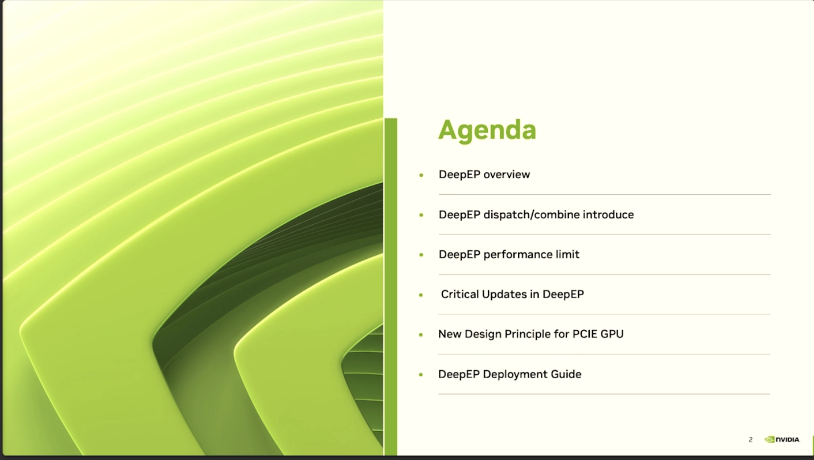

이 발표의 목차는 주로 6개 내용을 포함한다.

- DeepEP overview - DeepEP 개요, 이 기술 framework의 기본 상황 소개
- DeepEP dispatch/combine introduce - DeepEP의 dispatch와 combine 메커니즘 소개
- DeepEP performance limit - DeepEP의 성능 제한과 bottleneck 논의
- Critical Updates in DeepEP - DeepEP의 핵심 업데이트 내용
- New Design Principle for PCIE GPU - PCIe GPU를 위한 새로운 설계 원칙
- DeepEP Deployment Guide - DeepEP 배포 가이드

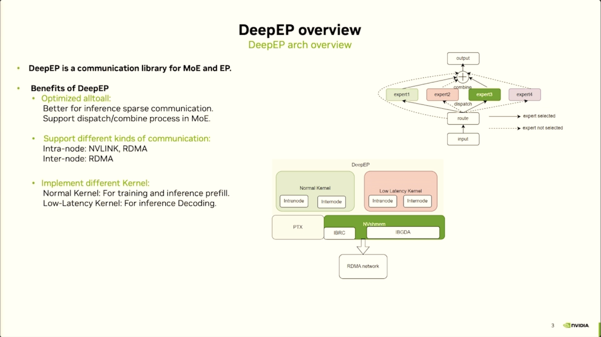

이 Slides는 DeepEP의 아키텍처 개요와 핵심 특성을 소개한다. DeepEP는 MoE(Mixture of Experts)와 EP(Expert Parallelism)를 위해 특별히 설계된 communication library다. 주요 특징은 다음과 같다.
- 최적화된 alltoall communication: 추론의 sparse communication에 맞춰 특별히 최적화되어 MoE 모델의 dispatch와 combine 과정을 더 잘 지원한다.
- 다양한 communication 지원:
  - node 내부 communication: NVLINK와 RDMA 지원
  - node 간 communication: RDMA 지원
- 두 가지 kernel 선택:
  - Normal Kernel: training과 inference의 prefill 단계에 사용
  - Low-Latency Kernel: inference의 decode 단계에 특화되어 latency 성능을 최적화

아래 아키텍처 그림은 DeepEP의 layered design을 보여 준다. 상위의 Normal Kernel과 Low Latency Kernel에서 중간의 PTX execution layer, NVSHMEM communication library 기반의 ISRC, IBGDA protocol, 마지막 RDMA network layer까지 이어진다. 여기서 언급된 NVSHMEM은 NVIDIA가 개발한 parallel programming interface로, GPU cluster에 효율적이고 scalable한 communication capability를 제공하는 것을 목표로 한다. 이는 OpenSHMEM specification을 기반으로 하며, 여러 GPU memory를 가로지르는 global address space를 생성해 GPU가 시작하는 asynchronous data transfer를 허용하고 CPU와 GPU 사이의 synchronization overhead를 줄인다. NVSHMEM은 node 내부의 NVLink와 RDMA, node 간 RDMA 등 다양한 communication 방식을 지원하며, HPC system의 대규모 GPU cluster에 적합하다.

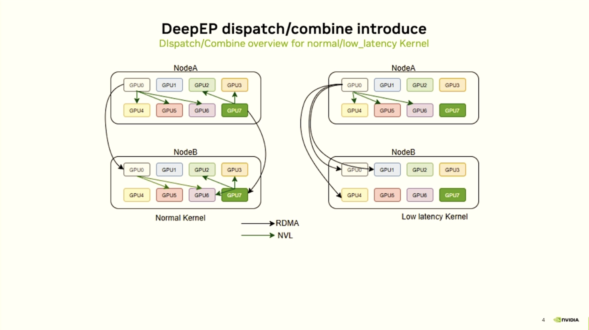

이 Slides는 DeepEP에서 dispatch와 combine mechanism이 Normal Kernel과 Low Latency Kernel 두 모드에서 어떻게 다르게 동작하는지 보여 준다. 그림에는 두 node(NodeA와 NodeB)가 있고, 각 node에는 8개 GPU(GPU0-GPU7)가 설정되어 있으며, RDMA를 통해 cross-node communication을 수행하고 NVLink(NVL)를 통해 node 내부 communication을 수행한다.

**Normal Kernel mode(왼쪽):** 이 모드에서는 dispatch와 combine 과정이 비교적 복잡하며, 더 많은 cross-node 및 cross-GPU communication이 포함된다. 화살표 흐름을 보면 데이터가 여러 GPU 사이에서 복잡한 routing과 forwarding을 거쳐야 한다. NodeA의 일부 GPU에서 NodeB의 대응 GPU로 data transfer가 발생하며, communication path가 비교적 조밀하고 node 간 communication 시 NVLink 경로뿐 아니라 RDMA 경로도 있다.

**Low Latency Kernel mode(오른쪽):** 이 모드는 inference scenario의 low latency 요구에 맞춰 특별히 최적화되어 있다. Normal Kernel과 비교하면 communication pattern이 더 단순하고 직접적이며, RDMA만 사용하고 NVLink는 사용하지 않는다.

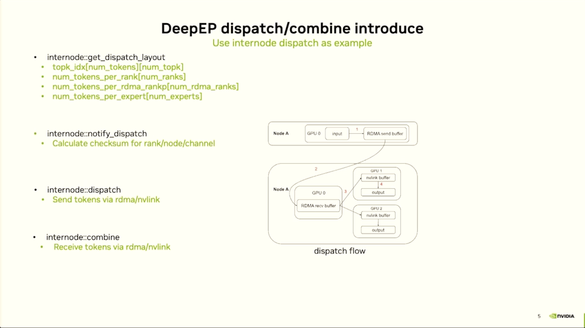

이 Slides 왼쪽의 API function 설명은 네 가지 핵심 단계를 보여 준다.

- `internode::get_dispatch_layout`: layout 계산 단계로, data distribution strategy를 결정한다. topk index array(각 token에 대응하는 top-k expert), 각 rank가 처리하는 token 수, 각 RDMA rank의 token allocation, 각 expert가 처리할 token 수를 계산한다.
- `internode::notify_dispatch`: notification 단계로, 각 rank/node/channel에 대해 checksum을 계산해 data transfer의 integrity와 consistency를 보장한다.
- `internode::dispatch`: 실제 dispatch 단계로, RDMA 또는 NVLink를 통해 token을 해당 expert가 있는 위치로 보낸다.
- `internode::combine`: aggregation 단계로, RDMA 또는 NVLink를 통해 처리 완료된 token을 수신하고 결과를 combine한다.

오른쪽 dispatch flow 그림은 구체적인 data flow를 보여 준다. NodeA의 input에서 시작해 GPU 0의 RDMA receive buffer를 거친 뒤, 각각 GPU 1과 GPU 2의 nvlink buffer로 흘러가고 최종 output이 나온다. 전체 flow는 DeepEP가 multi-GPU 환경에서 MoE 모델의 expert parallel computation을 어떻게 효율적으로 처리하는지 보여 준다. 정교하게 설계된 layout 계산, notification mechanism, data dispatch, result aggregation을 통해 최적화된 communication pattern과 data flow management를 구현한다.

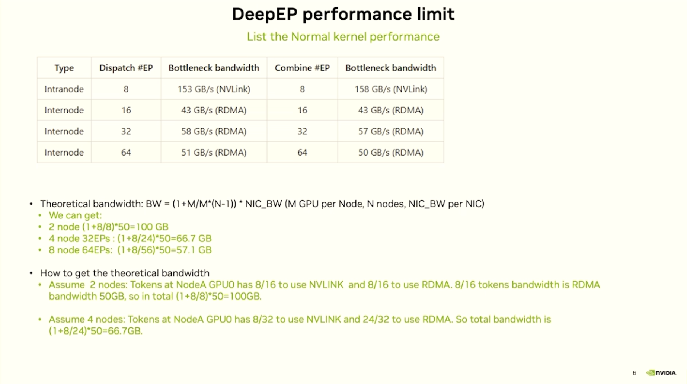

이 Slides는 DeepEP Normal Kernel의 성능 제한과 bandwidth bottleneck 분석을 자세히 보여 준다.

**DeepEP 공식 홈페이지의 성능 테스트 결과 표는 다음을 보여 준다.**

- **node 내부 communication(Intranode)**: 8개 expert parallel 상황에서 dispatch와 combine operation 모두 약 153-158 GB/s의 NVLink bandwidth에 도달하며, 성능이 가장 좋다.

- **node 간 communication(Internode)**: expert parallel 수가 16에서 64로 늘어날수록 RDMA bandwidth는 하락한다.

**이론 bandwidth 계산 공식은 다음과 같다.** `BW = (1+M/M*(N-1)) * NIC_BW`, 여기서 M은 node당 GPU 수, N은 node 수, NIC_BW는 각 network interface의 bandwidth를 뜻한다.

**구체적인 이론 bandwidth 계산 예시는 다음과 같다.**
- 2 node 설정: (1+8/8)*50=100 GB 이론 bandwidth
- 4 node 32 expert: (1+8/24)*50=66.7 GB 이론 bandwidth  
- 8 node 64 expert: (1+8/56)*50=57.1 GB 이론 bandwidth

그림은 bandwidth 계산의 실제 scenario도 설명한다. 예를 들어 2 node 설정에서 NodeA의 GPU0은 8/16의 데이터를 NVLink로 전송하고, 8/16의 데이터를 RDMA로 전송해야 하므로 전체 bandwidth가 network communication capability에 의해 제한된다. 이는 node 수가 증가할수록 cross-node RDMA communication이 주요 bottleneck이 되어 전체 scaling 성능을 제한한다는 것을 보여 준다.

여기서 EP 16은 bad case가 나타난 것 같다. 발표자는 이것이 발표 시작 부분에서 언급한 synchronization overhead와 관련 있다고 말했다.

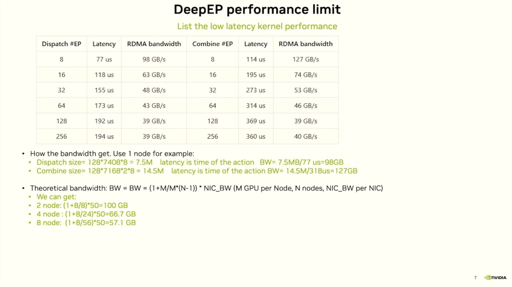

이 Slides는 DeepEP Low Latency Kernel의 성능 제한과 latency 특성을 보여 준다. 완전한 성능 테스트 표를 통해 expert parallel 수가 8에서 256으로 증가함에 따라 dispatch와 combine operation의 latency 및 RDMA bandwidth가 어떻게 변하는지 드러낸다. 데이터에 따르면 작은 scale(8 expert)에서는 dispatch latency가 77 microsecond에 불과하고 RDMA bandwidth가 98 GB/s에 도달하며, combine operation latency는 114 microsecond이고 bandwidth는 127 GB/s다. 하지만 expert parallel 수가 증가할수록 latency는 점차 상승하고 bandwidth는 점차 하락한다. 256 expert에 도달하면 dispatch latency는 194 microsecond로 늘고 bandwidth는 39 GB/s로 떨어지며, combine latency는 360 microsecond에 이르고 bandwidth는 40 GB/s가 된다. 그림에는 구체적인 bandwidth 계산 예시도 있다. 단일 node를 예로 들면 dispatch data size는 `128*7408*8=7.5MB`이고, 77 microsecond latency를 통해 98GB bandwidth가 계산된다. combine data size는 `128*7168*2*8=14.5MB`이고, 114 microsecond latency를 통해 127GB bandwidth가 계산된다. 동시에 이론 bandwidth 공식 `BW=(1+M/M*(N-1))*NIC_BW`를 제시하고 2 node, 4 node, 8 node 설정에서 이론 bandwidth가 각각 100GB, 66.7GB, 57.1GB임을 보여 준다. 이 데이터는 Low Latency Kernel이 large-scale 확장 시 직면하는 performance bottleneck과 latency challenge를 명확히 보여 준다.

주의할 점은 여기서 128은 token 수, 7408은 hidden_size, 8은 EP8이라는 것이다. 그림의 Combine 공식에 있는 318us는 잘못 적힌 것이며, 114us가 맞다.

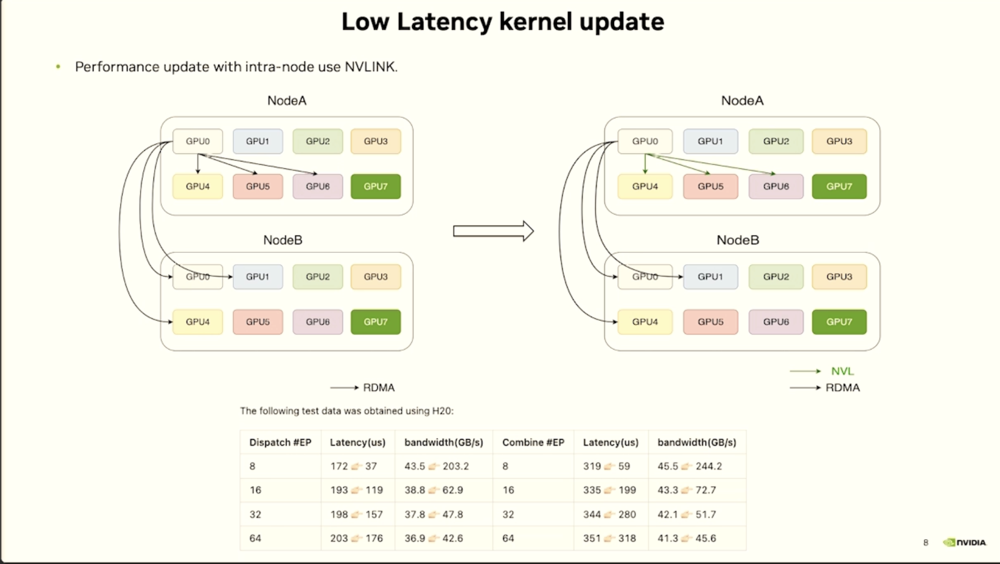

이 Slides는 DeepEP Low Latency Kernel의 중요한 성능 업데이트를 보여 준다. 즉 node 내부에서 NVLink를 사용해 communication 성능을 최적화하는 것이다. 그림은 좌우 두 아키텍처 비교를 통해 최적화 전후의 차이를 명확히 설명한다. 왼쪽 원래 아키텍처에서는 NodeA의 여러 GPU가 주로 RDMA를 통해 NodeB의 GPU0과 communication하고, 이후 GPU0이 다시 NodeB 내부의 다른 GPU로 분배한다. 오른쪽 업데이트 아키텍처에서는 더 많은 NVLink 연결(초록색 화살표로 표시)이 추가되어 node 내부 communication이 RDMA에 의존하는 대신 high-bandwidth NVLink를 더 잘 활용할 수 있게 되었고, 전체 성능이 크게 개선되었다. 아래 H20 테스트 데이터 표는 이 최적화 효과를 검증한다. 서로 다른 expert parallel scale(8, 16, 32, 64 EP)에서 dispatch와 combine operation의 latency 및 bandwidth 개선 상황을 보여 주며, 각 데이터는 개선 전후 비교를 색으로 표시한다. 예를 들어 8 expert parallel 상황에서 dispatch latency는 172 microsecond에서 37 microsecond로 낮아지고, bandwidth는 43.5 GB/s에서 203.2 GB/s로 상승한다. combine operation latency는 319 microsecond에서 59 microsecond로 낮아지고, bandwidth는 45.5 GB/s에서 244.2 GB/s로 크게 상승한다. 이 데이터는 NVLink를 더 잘 활용해 node 내부 communication을 수행하면 DeepEP가 low latency를 유지하면서 더 높은 communication bandwidth를 달성할 수 있고, MoE 모델 inference의 전체 성능을 크게 높일 수 있음을 명확히 보여 준다.

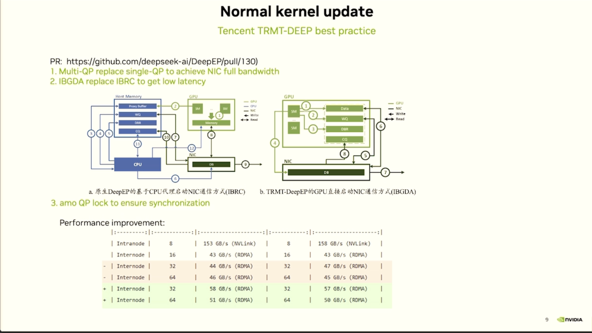

이 Slides는 DeepEP Normal Kernel의 중요한 업데이트를 보여 준다. 이 업데이트는 Tencent TRMT-DEEP 팀의 best practice를 기반으로 하며(관련 PR 링크: https://github.com/deepseek-ai/DeepEP/pull/130), 세 가지 핵심 기술 개선을 포함한다. 첫째, single-QP 대신 Multi-QP를 사용해 network interface card의 전체 bandwidth utilization을 구현한다. 둘째, IBRC 대신 IBGDA를 사용해 더 낮은 latency를 얻는다. 셋째, amo QP lock mechanism을 추가해 synchronization operation의 correctness를 보장한다. 그림은 좌우 두 아키텍처 비교를 통해 최적화 전후 차이를 명확히 보여 준다. 왼쪽은 기존 DeepEP의 CPU 기반 NIC communication 방식(IBRC)을 보여 주며, 데이터는 CPU를 거쳐 처리되고 forwarding되어야 한다. 오른쪽은 TRMT-DeepEP가 사용하는 GPU direct NIC communication 방식(IBGDA)을 보여 주며, GPU가 network interface와 직접 communication할 수 있어 CPU bottleneck을 우회하고 더 높은 bandwidth와 낮은 latency를 구현한다. 아래 성능 개선 표는 이러한 최적화의 효과를 정량적으로 증명한다. node 내부 communication(Intranode)에서는 8 expert parallel 시 NVLink bandwidth가 153-158 GB/s의 높은 수준을 유지한다. node 간 communication(Internode)에서는 이러한 최적화 기술을 통해 32 expert parallel의 RDMA bandwidth가 기존 44 GB/s에서 58 GB/s로 상승하고, 64 expert parallel에서는 46 GB/s에서 51 GB/s로 상승한다. 이 데이터는 더 advanced한 GPU direct communication architecture와 multi-queue optimization strategy를 채택하면 DeepEP가 large-scale MoE 모델의 distributed inference scenario에서 뚜렷한 성능 향상을 달성할 수 있음을 보여 준다.

여기서는 개념만 간단히 이해했다. 나는 IBRC와 IBGDA의 차이, 그리고 QP lock mechanism을 잘 모른다. 관심 있는 사람은 직접 연구해야 한다.

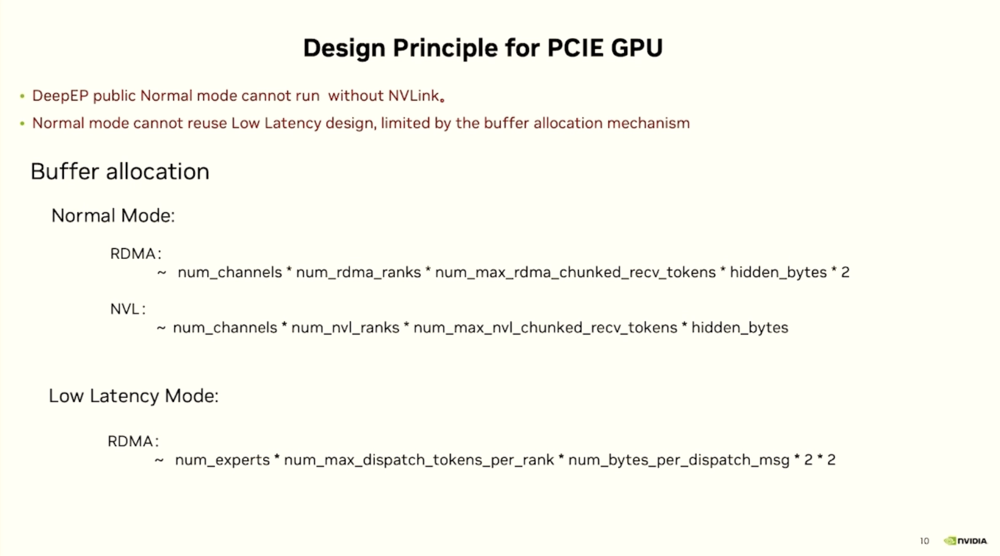

이 Slides는 PCIe GPU 환경을 대상으로 한 DeepEP의 설계 원칙과 제약 조건을 설명하며, NVLink high-speed interconnect가 없는 PCIe GPU 환경에서 DeepEP가 갖는 runtime constraint와 buffer allocation strategy를 중점적으로 설명한다. 그림은 DeepEP Normal mode가 NVLink가 없는 환경에서는 실행될 수 없음을 명확히 지적한다. 동시에 Normal mode는 buffer allocation mechanism의 제한 때문에 Low Latency 설계를 재사용할 수 없으며, 이는 두 mode가 memory management에서 근본적 차이를 가진다는 것을 보여 준다. buffer allocation에 대해서는 그림이 서로 다른 mode의 memory 계산 공식을 자세히 나열한다. Normal mode에서 RDMA buffer size는 대략 channel 수 곱하기 RDMA ranks 수 곱하기 최대 RDMA chunk receive token 수 곱하기 hidden layer bytes 수 곱하기 2와 같다. NVLink buffer에는 마지막 곱하기 2가 필요 없다. Low Latency mode에서 RDMA buffer 계산은 더 복잡하며, 대략 expert 수 곱하기 각 rank의 최대 dispatch token 수 곱하기 각 dispatch message의 bytes 수 곱하기 4(두 개의 2를 곱함)와 같다. 이러한 정확한 memory allocation 공식은 DeepEP가 서로 다른 hardware 환경과 working mode에서 memory resource를 세밀하게 관리함을 반영하며, PCIe GPU처럼 상대적으로 제약된 hardware 환경에서도 효율적인 MoE 모델 inference 성능을 구현하도록 보장한다.

Decoding 단계에서 token 수가 128일 때 이 buffer는 대략 2GB를 차지한다. 따라서 Low Latency Kernel의 설계를 그대로 사용할 수 없다. Prefill 시 token 수가 8K, 16K처럼 매우 커질 수 있고, 그러면 buffer memory가 터져 버리기 때문이다.

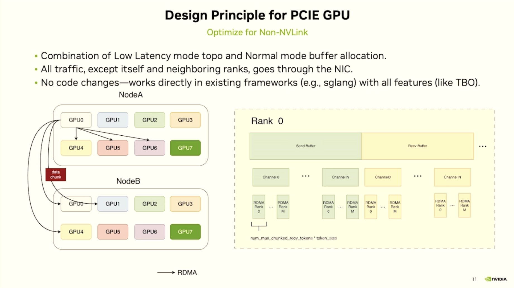

이 Slides는 PCIe GPU 환경을 대상으로 한 DeepEP의 최적화 설계 원칙을 보여 주며, 특히 NVLink high-speed interconnect가 없는 상황에서 효율적인 communication을 어떻게 구현하는지 보여 준다. 이 설계는 Low Latency mode의 topology 구조와 Normal mode의 buffer allocation strategy를 영리하게 결합해, 자기 자신과 인접 ranks를 제외한 모든 communication traffic이 network interface card(NIC)를 통해 전송되도록 보장하고, 사용 가능한 network bandwidth를 최대한 활용한다. 왼쪽 architecture diagram은 NodeA와 NodeB 사이에서 RDMA를 통해 data block을 전송하는 connection 방식을 보여 준다. 여기서 GPU0은 주요 communication hub로서 cross-node data exchange를 처리한다. 오른쪽 Rank 0 buffer layout은 memory organization structure를 자세히 설명한다. 여기에는 send buffer와 receive buffer, Channel 0부터 Channel N까지 여러 channel의 분할이 포함되며, 각 channel 아래에는 다시 Rank 0부터 Rank M까지 여러 RDMA ranks가 세분화되어 있다. 아래 공식 num_max_chunked_recv_tokens * token_size는 buffer size 계산 방법을 나타낸다. 가장 중요한 점은 이 설계가 어떤 코드 수정도 필요 없이 기존 framework(예: sglang)에서 바로 실행될 수 있고 모든 기능 특성(예: TBO)을 유지한다는 것이다. 이는 DeepEP가 PCIe GPU 환경에서 plug-and-play 고성능 MoE model inference를 구현할 수 있게 하며, NVLink를 구성할 수 없지만 여전히 효율적인 expert parallel computation이 필요한 사용자에게 실용적인 solution을 제공한다.

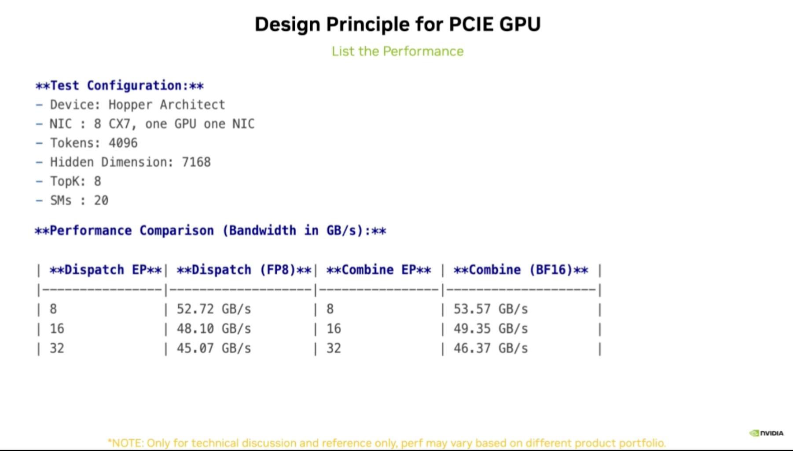

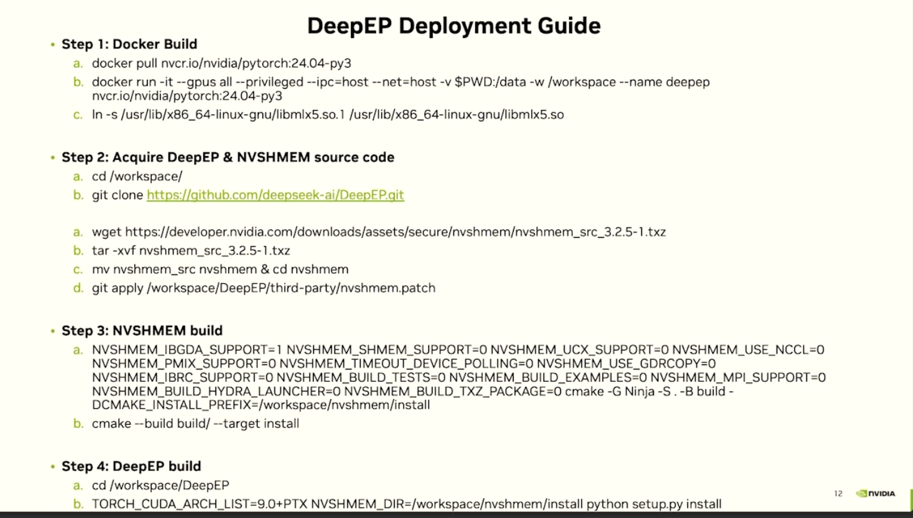

이 Slides는 DeepEP의 전체 배포 가이드를 제공하며, 환경 준비부터 최종 설치까지 네 가지 핵심 단계의 구체적인 operation flow를 자세히 보여 준다. 첫 번째는 Docker 환경 구축 단계다. NVIDIA PyTorch 24.04-py3 image를 pull한 뒤, 특정 docker run 명령으로 container를 시작해야 한다(GPU access permission, privileged mode, host network, data volume mount 등의 설정 포함). 그리고 container 안에서 libmlx5.so.1에서 libmlx5.so로 soft link를 만들어 RDMA library가 올바르게 link되도록 보장한다. 다음은 source code 획득 단계다. 작업 directory로 들어가 GitHub에서 DeepEP repository(https://github.com/deepseek-ai/DeepEP.git)를 clone해야 한다. 동시에 wget으로 NVSHMEM 3.2.5-1 버전의 source package를 다운로드하고, 압축을 푼 뒤 directory 이름을 바꾸고 DeepEP가 제공하는 patch file을 적용한다. 세 번째는 NVSHMEM compile build 단계다. IBGDA support 활성화, SHMEM, UCX, NCCL, PMIX 등 여러 component support 비활성화, Ninja build system과 특정 install prefix 지정 등을 포함한 복잡한 compile parameter를 설정한 뒤 cmake build와 install을 수행해야 한다. 마지막은 DeepEP 자체의 build install이다. DeepEP directory로 들어가 TORCH_CUDA_ARCH_LIST를 9.0+PTX로 설정해 해당 CUDA architecture를 지원하고, NVSHMEM_DIR을 앞서 설치한 path로 지정한 뒤, 최종적으로 python setup.py install을 통해 전체 DeepEP system 배포를 완료한다. 전체 과정은 Docker containerization, dependency library compile, environment variable configuration 등 여러 기술 단계를 포함하며, DeepEP가 target GPU cluster 환경에서 정상적으로 실행되도록 보장한다.

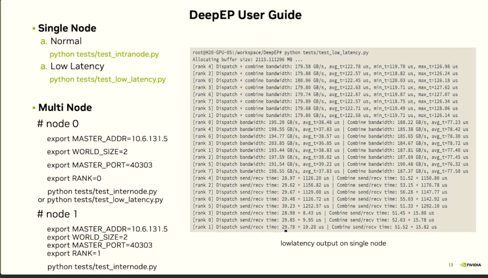

이 Slides는 DeepEP의 사용자 사용 가이드를 자세히 보여 주며, single-node와 multi-node 두 배포 scenario의 구체적인 operation 방법과 성능 테스트 결과를 포함한다. single-node mode에서는 사용자가 Normal mode(`python tests/test_intranode.py`)와 Low Latency mode(`python tests/test_low_latency.py`)를 각각 실행해 테스트할 수 있다. multi-node mode에서는 각 node에 같은 environment variable을 설정해야 한다. 여기에는 MASTER_ADDR(main node IP address 10.6.131.5), WORLD_SIZE(node total count 2), MASTER_PORT(communication port 40303)가 포함된다. 그리고 각 node마다 다른 RANK 값(node 0은 0, node 1은 1)을 설정한 뒤 해당 test script(`test_internode.py` 또는 `test_low_latency.py`)를 실행한다. 오른쪽의 test output 결과는 H20 GPU 환경에서 Low Latency mode를 실행한 상세 성능 데이터를 보여 준다. 여기에는 2115MB buffer allocation과 8개 rank의 dispatch 및 combine operation에 대한 bandwidth와 latency 지표가 포함된다. 각 rank의 dispatch+combine bandwidth는 약 179-180 GB/s로 안정적이고 평균 latency는 약 122 microsecond다. 동시에 더 자세한 dispatch와 combine 분리 통계도 보여 주며, dispatch bandwidth는 약 193-203 GB/s, combine bandwidth는 약 184-196 GB/s다. 이 데이터는 DeepEP가 multi-GPU 환경에서 효율적인 communication 성능을 가진다는 점을 충분히 증명하고, 사용자에게 명확한 performance baseline과 deployment reference를 제공한다.
