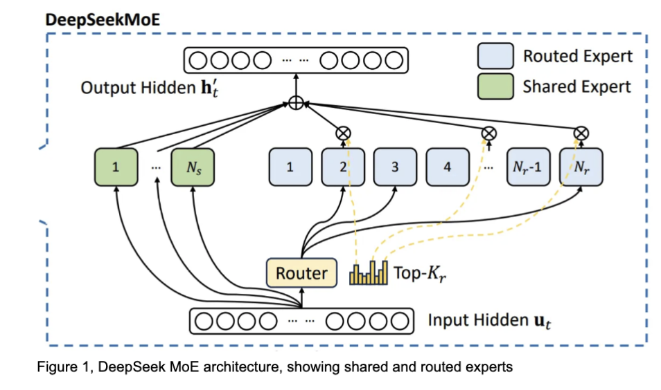
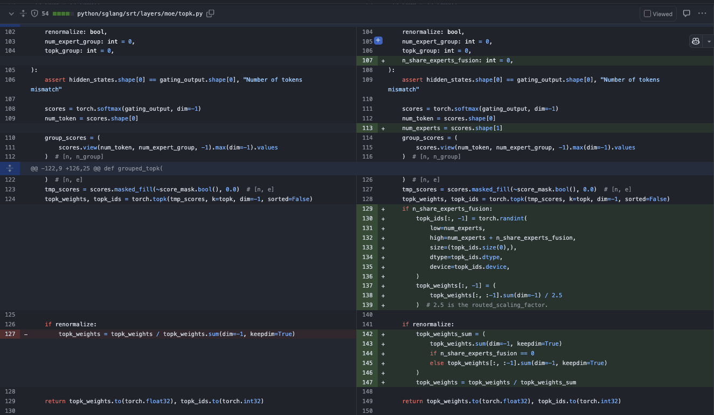

# DeepSeek V3와 R1에서 Shared Experts와 일반 Experts를 융합하는 작은 기법

## 0x0. 서문

지난 토요일에 @DiegoD94가 vLLM에서 DeepSeek V3/R1에 shared experts를 일반 256개 expert에 fuse하는 작업을 시도하는 것을 발견했습니다(https://github.com/vllm-project/vllm/pull/15502). 기술 문서도 하나 있습니다. https://docs.google.com/document/d/1iXgzR6Mt6s0DpT7w2Pz93ExlUJ-nnSnU_o9Sqd8TE34/edit?tab=t.0#heading=h.w2t5rj3ovrvv 를 읽어 보니 의미가 꽤 있고, 전체 처리량과 TTFT/ITL 모두에 좋은 이득이 있어 보였습니다. 그래서 주말 시간을 이용해 SGLang에서 이 작업을 구현해 보았습니다. 우리는 이전에 SGLang의 sgl moe_align_kernel에서 이미 num_experts>256인 경우를 지원했기 때문에 이번 구현은 비교적 편했고, sgl-kernel 안의 cuda 코드는 수정할 필요가 없었습니다. SGLang에서의 세부 사항은 https://github.com/sgl-project/sglang/pull/4918 에 있습니다. 아래에서는 이 fuse shared expert 기법을 설명하겠습니다. 다시 한번 @DiegoD94에게 감사드립니다.

## 0x1. 효과

아래는 SGLang에서의 end-to-end 효과입니다.


### GSM8K Acc Test

```shell
➜  sglang git:(support_r1_shared_expers_fusion) ✗ python3 benchmark/gsm8k/bench_sglang.py --num-questions 2000 --parallel 2000 --num-shots 8                                            
100%|████████████████████████████████████████████████████████████████████████| 1319/1319 [01:08<00:00, 19.14it/s]
Accuracy: 0.952
Invalid: 0.000
Latency: 69.547 s
Output throughput: 1998.856 token/s
```

### H200에서의 benchmark

| QPS | 지표 | Baseline (--disable-shared-experts-fusion) | 최적화 버전 | 개선 비율 |
|-----|------|-------------------------------------------|----------|------------|
| 1   | 총 처리량(tok/s) | 483.47 | 485.72 | +0.5% |
|     | 평균 TTFT(ms) | 949.18 | 664.25 | +30.0% |
|     | 평균 ITL(ms) | 54.69 | 50.20 | +8.2% |
| 4   | 총 처리량(tok/s) | 1088.59 | 1132.73 | +4.0% |
|     | 평균 TTFT(ms) | 2630.26 | 2144.08 | +18.5% |
|     | 평균 ITL(ms) | 156.21 | 132.75 | +15.0% |
| 8   | 총 처리량(tok/s) | 1188.77 | 1235.63 | +3.9% |
|     | 평균 TTFT(ms) | 6320.67 | 3443.59 | +45.5% |
|     | 평균 ITL(ms) | 188.29 | 178.94 | +5.0% |

- 처리량은 높을수록 좋고, TTFT/ITL은 낮을수록 좋다는 점에 유의하세요.

테스트 데이터를 보면 qps가 4로 커질 때 처리량은 4% 향상되고 TTFT와 ITL은 모두 약 15%-20% 낮아졌습니다. 표에 대응하는 자세한 데이터, 서비스 시작 명령, bench_serving 스크립트 사용 방식은 모두 https://github.com/sgl-project/sglang/pull/4918 에 붙여 두었으니, 관심이 있다면 여기서 관련 정보를 찾을 수 있습니다.

## 0x2. 원리



그림 1처럼 DeepSeek의 MoE 구조는 모든 입력 token을 shared experts로 보내며, 동시에 각 token을 router가 선택한 top-k routed experts로도 보냅니다. 마지막으로 가중치를 바탕으로 모든 expert 출력을 집계합니다. 구체적으로 DeepSeek R1은 256개의 routed expert와 1개의 shared expert를 사용하며, 각 token마다 top 8개의 routed expert를 선택합니다. vLLM과 SGLang 구현에서 token의 hidden state는 먼저 shared expert를 통과한 뒤 FusedMoE kernel 안의 routed expert를 통과합니다. 마지막으로 두 출력을 더해 최종 출력으로 사용합니다.

간단한 최적화 방법은 shared expert의 계산을 FusedMoE kernel 안으로 합치는 것입니다. shared expert와 routed expert는 완전히 같은 아키텍처와 shape를 갖기 때문입니다. 이렇게 하면 각 token에 대해 더 이상 256개 expert 중 top 8개를 고르고 1개의 shared expert를 별도로 선택하지 않습니다. 대신 257개 expert, 즉 256개 routed expert와 1개 shared expert 중에서 top 9개를 직접 선택하고, 항상 9번째 expert를 shared expert로 설정합니다. 이 9개 선택 expert의 집계 가중치를 추가로 조정하면 최적화 전 MoE 계층과 완전히 같은 출력 결과를 얻을 수 있습니다.

이 말은 원래 Deepseek V3/R1 MoE forward 코드에서 다음과 같다는 뜻입니다.

```python
def forward_normal(self, hidden_states: torch.Tensor) -> torch.Tensor:
    if self.n_shared_experts is not None:
        shared_output = self.shared_experts(hidden_states)
    # router_logits: (num_tokens, n_experts)
    router_logits = self.gate(hidden_states)
    final_hidden_states = (
        self.experts(hidden_states=hidden_states, router_logits=router_logits)
        * self.routed_scaling_factor
    )
    if shared_output is not None:
        final_hidden_states = final_hidden_states + shared_output
    if self.tp_size > 1:
        final_hidden_states = tensor_model_parallel_all_reduce(final_hidden_states)
    return final_hidden_states
```

일반 experts의 계산 결과에는 `self.routed_scaling_factor`를 곱해야 합니다. shared expert를 일반 expert와 함께 계산하도록 융합하려면 grouped_topk module에서 `top9`, 즉 shared experts에 대응하는 `topk_weights`를 미리 `self.routed_scaling_factor` 파라미터로 나누어야 합니다. 그래야 수치 동등성을 보장할 수 있습니다. 아래 `grouped_topk` 수정 내용을 보세요.




## 0x3. 구현 세부 사항

위에서 언급한 수치 동등성을 유지하기 위한 Topk weights 계수 수정 외에도, 우리는 항상 모든 token의 9번째 expert를 shared expert에 할당한다는 점을 볼 수 있습니다. 또한 여기서 shared expert는 하나가 아닐 수도 있습니다. 대응하는 코드는 다음 줄입니다.

```python
topk_ids[:, -1] = torch.randint(
    low=num_experts,
    high=num_experts + n_share_experts_fusion,
    size=(topk_ids.size(0),),
    dtype=topk_ids.dtype,
    device=topk_ids.device,
)
```

여러 shared experts를 설정하는 이유는 token에 대해 일종의 load balancing 전략을 적용할 수 있기 때문일 수 있습니다. 하나의 shared expert가 모든 token을 받아 expert 간 token 수 차이가 지나치게 커지고 계산 효율이 낮아지는 문제를 막기 위해서입니다.

추가 복제를 전혀 사용하지 않는 shared experts 경우를 tuning하고 benchmark해 보니, 이 경우의 성능은 tp_size개 shared experts 복제를 사용하는 경우보다 확실히 나빴고 TTFT도 오히려 길어졌습니다. 구체적인 benchmark 데이터는 여기에서 볼 수 있습니다. https://github.com/sgl-project/sglang/pull/4918

여러 shared experts 복제를 지원하려면 `DeepseekV2ForCausalLM` 클래스의 `load_weights` 함수를 조금 수정해야 합니다.

```python
if self.n_share_experts_fusion != 0:
            weights_list = list(weights)
            weights_dict = dict(weights_list)
            suffix_list = [
                "down_proj.weight",
                "down_proj.weight_scale_inv",
                "gate_proj.weight",
                "gate_proj.weight_scale_inv",
                "up_proj.weight",
                "up_proj.weight_scale_inv",
            ]
            names_to_remove = []
            for moe_layer in tqdm(
                range(
                    self.config.first_k_dense_replace,
                    self.config.num_hidden_layers,
                    self.config.moe_layer_freq,
                ),
                desc=f"Cloning {self.n_share_experts_fusion} "
                "replicas of the shared expert into MoE",
            ):
                for num_repeat in range(self.n_share_experts_fusion):
                    for suffix in suffix_list:
                        weights_list.append(
                            (
                                f"model.layers.{moe_layer}."
                                f"mlp.experts."
                                f"{self.config.n_routed_experts + num_repeat}"
                                f".{suffix}",
                                weights_dict[
                                    f"model.layers.{moe_layer}.mlp.shared_experts.{suffix}"
                                ].clone(),
                            )
                        )
                    names_to_remove += [
                        f"model.layers.{moe_layer}.mlp.shared_experts.{suffix}"
                        for suffix in suffix_list
                    ]
            weights = [w for w in weights_list if w[0] not in names_to_remove]
```

여기서는 원본 가중치에서 각 계층에 남는 shared expert 가중치도 제거합니다.

그 밖에 주의할 세부 사항은 expert 개수가 바뀌므로 fused moe tuning 스크립트를 사용해 다시 tuning해야 한다는 점입니다. 또한 원래의 non-fuse 구현 버전과 비교하면 각 tp rank의 GPU 메모리 사용량이 증가합니다. FP8 dtype의 경우 한 rank에 shared expert 하나가 추가됩니다. shared expert 하나는 FP8 dtype 기준으로 42MB 메모리입니다. 전체 파라미터 수는 hidden_size * moe_intermediate_size * 3 = 7168 * 2048 * 3입니다. 따라서 (51-3)*42MB=2016MB/1024=1.96GB입니다. 즉 이 최적화는 TP Rank에서 1-2GB 메모리를 더 사용해야 최상의 성능 이득을 얻을 수 있습니다.

또한 이 최적화는 fused moe gate가 함께 있으면 더 유용할 것입니다. 이후 진전을 기대합니다.
