# MoE의 해를 돌아보고 MoE Inference Optimization에 대해 생각한 것

## 0x0. 서문

새해 복 많이 받으시길 바란다! 모두 매일 즐겁고, 학업도 잘되고, 일도 순조롭기를 바란다.

나는 2025년 음력 설의 초칠, 즉 춘절 연휴 전 마지막 날에 이 개인 blog를 썼다. 먼저 2024년의 learning gain을 간단히 돌아본 뒤, SGLang에서 몇 달 동안 취미로 open source development를 한 경험을 이야기하려 한다. 최근 전 세계적으로 화제가 된 DeepSeek V3/R1이든, 2024년에 여러 vendor가 발표한 heavyweight MoE model이든 모두 MoE architecture를 다시 역사의 무대로 끌어올렸다. 그래서 개인적으로 2024년을 MoE의 해라고 정의한다. 따라서 마지막에는 MoE model의 Fused MoE core operator inference optimization에 대한 내 이해를 논의하고, 현재 일부 industry open source solution과 더 promising한 해법을 비교해 보겠다.

## 0x1. Learning and Gains

2024년의 앞 3분기는 매우 평범했다. 그냥 code를 쓰고 task를 완료하며, 각종 새로운 model release 소식에 폭격당해 거의 매주 나오는 새 model에 무감각해졌을 뿐이다. 이 기간 개인적으로 가장 큰 수확은 Cursor를 능숙하게 사용해 반복적인 simple work를 처리하게 된 것이다.

대략 9월부터 engineering 관점에서 LLM inference framework에 들어가기 시작했다. 처음 연구한 것은 VLLM과 SGLang이었다. framework 자체를 보는 것은 꽤 고통스러웠는데, 흥미로운 지점이 잘 trigger되지 않는 느낌이었기 때문이다. 이후 MoE model의 Fused MoE operator implementation research와 optimization을 접하고 나서야 올해의 interest point를 찾았다. 이후 이 지점을 출발점으로 SGLang developer가 되었고, SGLang open source contribution 과정에서 많은 것을 얻었다. 기술뿐 아니라 SGLang Team member가 준 emotional value도 포함된다. @Lianmin Zheng, @Yineng Zhang, @Chenyang Zhao 등 SGLang Team member를 알게 되었고, 특히 @Yineng Zhang은 내가 open source contribution을 할 때 professional technical help와 emotional value를 제공했다(hhh. 아래 0x2 절에서는 내가 몇 달 동안 SGLang framework에 처음부터 참여한 open source development experience를 이야기하겠다.

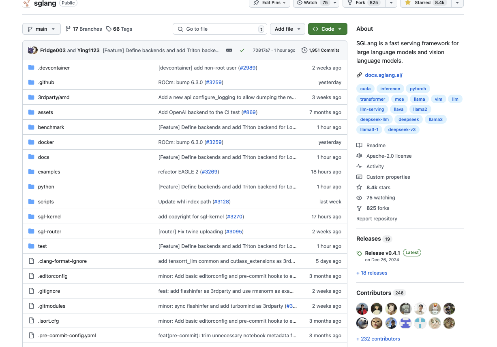

그 밖에도 GiantPandaCV public account에 1년 동안 계속 글을 썼다. Original article은 대략 한 달에 2편 정도 유지했는데, 빈도가 이렇게 낮은 이유는 내가 반쯤 손을 놓았기 때문이다. 그리고 PyTorch Blog와 CUDA MODE course note를 일부 작성했으며, 이는 취미로 지식을 보충한 셈이다(CUDA-MODE learning note도 operator 관련 한 달 2편 quota에 끼워 넣은 것이니, 올해는 GiantPandaCV에 note를 최대한 더 많이 올리려 한다).

내 github의 두 learning note repository는 2024년 하반기에 update frequency가 매우 낮아졌지만 star 수는 계속 늘었다. 관심 가져 준 netizen들에게 감사한다. 새해에도 계속 update하려고 노력하겠고, 특히 quality blog link는 더 많이 update해야 한다.

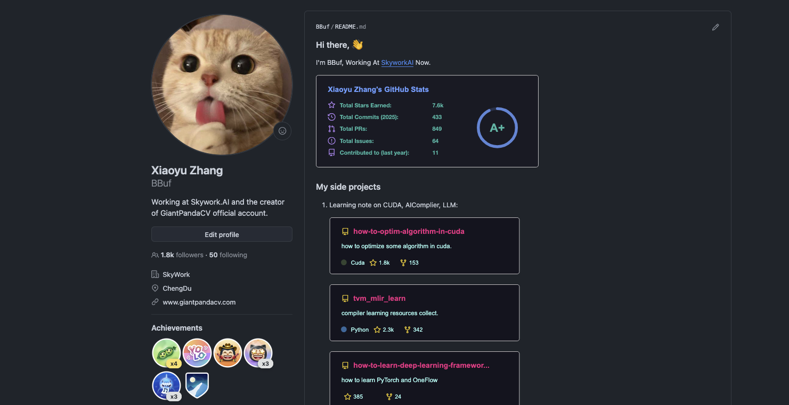

## 0x2. SGLang 몇 달간의 Open Source Development 경험

Inference framework 영역의 background에서, 나는 개인적으로 operator development와 model profile logic에 조금 익숙한 편이다. 하지만 이전에는 large model inference framework development experience가 없었다. 여기서는 내가 SGLang에 어떻게 open source contribution을 했는지 이야기해 보겠다. 대략 9월 중순부터 참여하기 시작했다. 선택한 방향은 내가 익숙한 operator와 operator/model performance optimization이었다.

처음에는 몇 가지 기본 bug fix, fused moe test 관련 작업 추가, fused moe triton operator의 auto tuning script 개선 등을 했다. 또한 low-end GPU에서 chunked prefill을 어떻게 적절히 사용할지 논의했다.

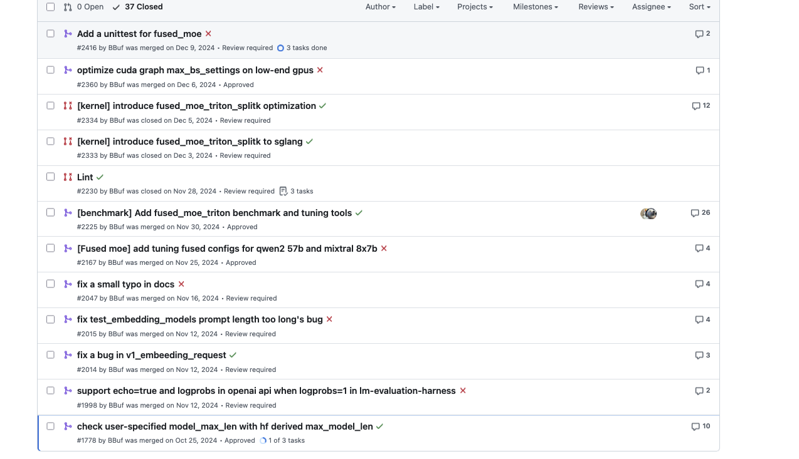

이어서 한 contribution은 model을 profile하며 발견한 점에서 나왔다. VLLM과 SGLang이 같은 qwen2-7b model을 offline inference할 때 Nsight System 결과를 보면 sglang의 rmsnorm이 명확히 더 빨랐다. 그래서 https://github.com/sgl-project/sglang/pull/2486 에서 Triton Benchmark를 기반으로 rmsnorm kernel micro benchmark 비교 script를 작성했고, 여러 상황에서 SGLang이 사용하는 FlashInfer rmsnorm이 항상 vllm 구현보다 빠르다는 것을 증명할 수 있었다. 이 발견과 benchmark script는 이후 vllm에도 채택되었다: https://github.com/vllm-project/vllm/pull/11241 . 이를 바탕으로 `write_req_to_token_pool_triton` operator의 benchmark와 preliminary optimization도 조금 진행했다. 이후 GTX 4090, H100, H200에서 현재 자주 쓰는 MoE model, 예를 들어 Mixtral 8x7B/8x22B와 Qwen2-57B-A14B 등을 대상으로 fused moe triton operator tuning을 돌려 보았다. 모두 비교적 단순하고 자잘한 open source work였다.

그 다음은 최근 한 달이다. DeepSeek V3 optimization에 참여해 Fused MoE module의 `moe_align_kernel` CUDA operator performance를 높였다. https://github.com/sgl-project/sglang/pull/2735 와 https://github.com/sgl-project/sglang/pull/2767 이다. 다만 kernel에는 여전히 optimization space가 있다. 내가 쓴 이 kernel도 vllm에 채택되었다: https://github.com/vllm-project/vllm/pull/12574 (웃음)

이어서 DeepSeek V3와 같은 시기에 release된 MiniMax-01-Text model의 Lightning Attention Prefill 및 Decode에 대해 benchmark와 correctness test를 수행했고, Lightning Attention Decode에 대해 Triton과 CUDA optimization을 몇 차례 진행했다. 자세한 내용은 [NCU와 Cursor Claude-sonnet-3.5로 efficient CUDA operator를 작성하는 올바른 자세](https://mp.weixin.qq.com/s/YEw8JZxn15CfLEnK32Jj-Q)를 참고하면 된다. 동시에 sgl-kernel library maintenance와 review에도 참여했다.

마지막으로 춘절 연휴, 즉 최근 일주일 동안, 한 contributor가 deepseek V3의 fused gate optimization에서 TensorRT-LLM의 Fused MoE operator를 따로 분리해 SGLang이 customize하고 호출할 수 있게 하자고 제안한 것을 review했다. https://github.com/sgl-project/sglang/pull/3191#issuecomment-2621438615 . 이후 내가 이 작업을 맡았고, 몇 가지 큰 함정을 밟아가며 TensorRT-LLM의 Fused MoE operator를 따로 분리하고 실행까지 성공했다. 이 작업은 DeepSeek V3 optimization을 위한 추가 기반 작업이기도 하다. 초기 code는 여기 있다: https://github.com/BBuf/tensorrt-llm-moe . 여기서 내가 밟은 몇 가지 함정을 언급한다.

- 나는 H100에서 TensorRT-LLM의 최신 branch에서 FusedMoE를 따로 꺼냈다. 그래서 Hopper의 Cutlass MoE GEMM을 실행하려면 몇 가지 특수 compile option과 architecture가 필요했다. 예를 들어 sm_90 architecture가 아니라 sm90_a를 사용해야 하며, Hopper 아래의 일부 NVCC Flags도 켜야 한다. 이 code configuration은 여기에 있으며 오래 debug했다: https://github.com/BBuf/tensorrt-llm-moe/blob/master/setup.py#L135-L150
- FusedMoE 관련 code는 꽤 독립적으로 작성되어 있어 common과 cutlass MoE GEMM이라는 비교적 독립적인 두 module만 관련된다. 따라서 code 자체는 비교적 추출하기 쉽고, source directory 구조에 맞춰 fixed position에 두면 된다. 이후 `cpp/tensorrt_llm/kernels/mixtureOfExperts` 아래의 MoE core implementation에 대해서는 여기서 LORA를 고려할 필요가 없으므로 LORA implementation 관련 code를 단계적으로 수동 삭제해 code를 더 clean하게 만들었다. 여기서 함정 하나는 이 file들이 TensorRT의 nvinfer1 namespace 아래 dtype을 data type으로 사용한다는 점이다. 따라서 자신의 docker에서 `apt install  tensort`를 수행하고 TensorRT include와 lib를 올바른 위치에 둬야 한다. https://github.com/BBuf/tensorrt-llm-moe/blob/master/setup.py#L186-L191
- Fused MoE의 Cutlass Grouped GEMM은 특정 version의 CutLass에 의존하므로, submodule 방식으로 CutLass를 3rdparty에 추가해야 한다: https://github.com/BBuf/tensorrt-llm-moe/tree/master/3rdparty
- 다음 함정은 MoE Grouped GEMM instantiation Python script를 실행해 다양한 dtype과 Tile Config의 Grouped GEMM을 instantiate해야 한다는 것이다. 그렇지 않으면 runtime에 GEMM symbol을 찾을 수 없다는 message가 나온다. Python script도 copy해서 실행하면 된다: https://github.com/BBuf/tensorrt-llm-moe/blob/master/cpp/tensorrt_llm/kernels/cutlass_kernels/python/generate_kernels.py . 한 가지 주의할 점은 PYTHONPATH를 https://github.com/NVIDIA/cutlass/python directory로 설정해야 정상 실행된다는 것이다. 또한 이 script가 생성한 `.cu`도 setup.py의 source에 추가해야 한다.
- 위 문제를 주의하면 이 ported program은 기본적으로 compile을 통과할 수 있다. 이어서 `TensorRT-LLM/cpp/tests/kernels/mixtureOfExpertsTest.cu`에서 CutlassMoeFCRunner를 호출하는 방식을 참고해 interface를 작성하고 test code를 작성해 테스트했다. https://github.com/BBuf/tensorrt-llm-moe/blob/master/moe/moe.cpp 와 https://github.com/BBuf/tensorrt-llm-moe/blob/master/tests/tensorrt_llm_moe_test.py
- Test 과정에서 result가 맞지 않아 며칠 debug했다. 첫 번째 함정은 renormalize parameter가 올바르게 전달되지 않은 것이다. https://github.com/BBuf/tensorrt-llm-moe/blob/master/moe/moe.cpp#L176 에서는 `tensorrt_llm::kernels::MOEExpertScaleNormalizationMode::RENORMALIZE,`를 전달해야 하는데, 나는 test program을 따라 None을 전달했고 topk softmax 이후 결과가 맞지 않았다. 이 문제는 program comparison으로 이틀 반 동안 해결했다.
- 다음 문제는 PyTorch로 작성한 test program의 expert weight가 default로 Row Major였지만, 이 Cutlass GEMM version은 weight가 Col Major일 것을 요구한다는 점이었다. 며칠 동안 debug하며 gemm input data와 다른 hyperparameter가 완전히 같은데 왜 output이 맞지 않는지 고민했다. @Yineng Zhang과 몇 번 교류하고 나서야 data stride가 맞지 않을 수 있다는 생각을 했고, 실제로 이 함정을 밟았다는 것을 알게 되었다. 수정 후 fp32 precision test는 통과했다. https://github.com/BBuf/tensorrt-llm-moe/blob/master/tests/tensorrt_llm_moe_test.py#L130
- 마지막 함정은 BF16에서 test가 통과하지 않았을 때였다. 원인은 TensorRT LLM이 gating을 먼저 fp32로 cast한 뒤 topk softmax를 수행한다는 점이었다. 내 test program에는 이 부분이 조금 문제가 있었고, 수정 후 통과했다. https://github.com/BBuf/tensorrt-llm-moe/blob/master/tests/tensorrt_llm_moe_test.py#L169

이 함정들을 해결하는 데 거의 한 연휴가 걸렸다. 중간에는 한때 의욕이 떨어져 손을 놓기도 했지만, 다행히 연휴가 끝나기 전에 debug를 마쳤다. 이후에는 이 version을 기반으로 interface wrapper 또는 feature customization 작업을 할 것 같다.

## 0x3. Fused MoE Inference Solution 정리

이 절에서는 2024년에 우리가 겪은 Fused MoE inference operator의 evolution, 또는 각 open source inference framework의 solution을 정리해 본다.

### VLLM/SGLang Triton Fused MoE

이는 VLLM/SGLang이 open source 초기에 MoE model을 지원한 solution이다. AnyScale이 개발한 Triton Fused MoE operator를 직접 사용했으며, 이후 이 operator 위에서 tuning strategy, FP8 PerTensor, FP8 Blockwise, INT8 Fused MoE 등을 포함한 optimization을 수행했다. 현재는 기능은 풍부하지만 제한도 뚜렷하다. 결국 Triton으로 작성되었기 때문에 CutLass로 구현한 Grouped GEMM에 비해 performance가 약해진다. 또한 Triton Grouped GEMM은 각 expert의 token 수를 matrix Tile config['M']의 배수로 padding해야 하므로 `moe_align_block_size` kernel이라는 무시할 수 없는 overhead의 operator가 도입된다. 게다가 Triton Grouped GEMM1과 silu 같은 activation function을 fuse할 수 없어 전체 operator overhead가 계속 커진다. 이 Triton operator implementation에 대해서는 SiliconFlow의 zhuping이 Triton China에서 발표할 때 Slides로 잘 정리했으므로 몇 장 screenshot을 붙인다.

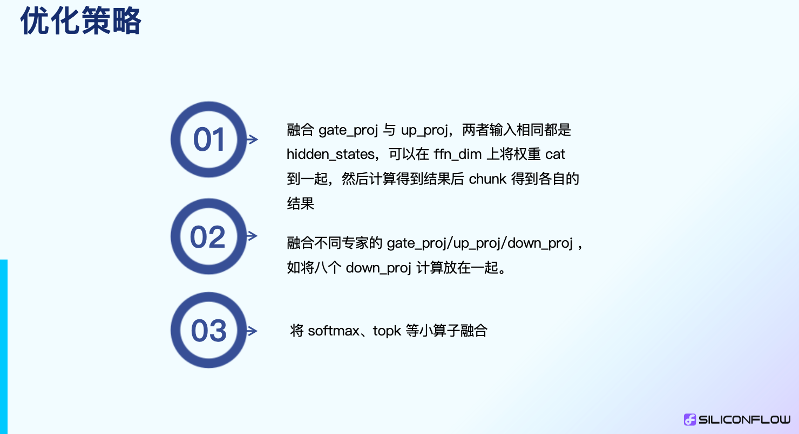

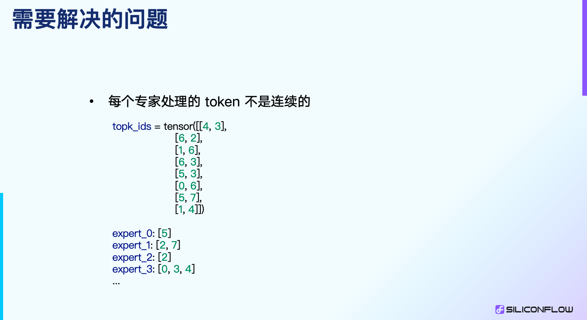

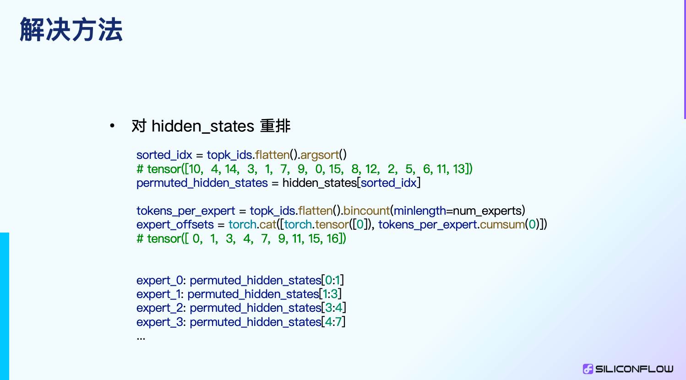

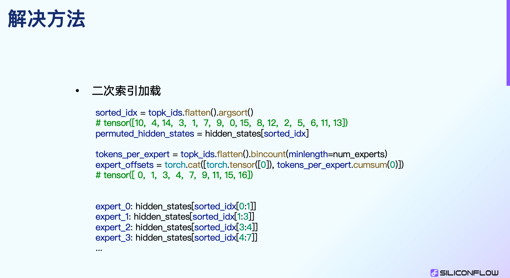

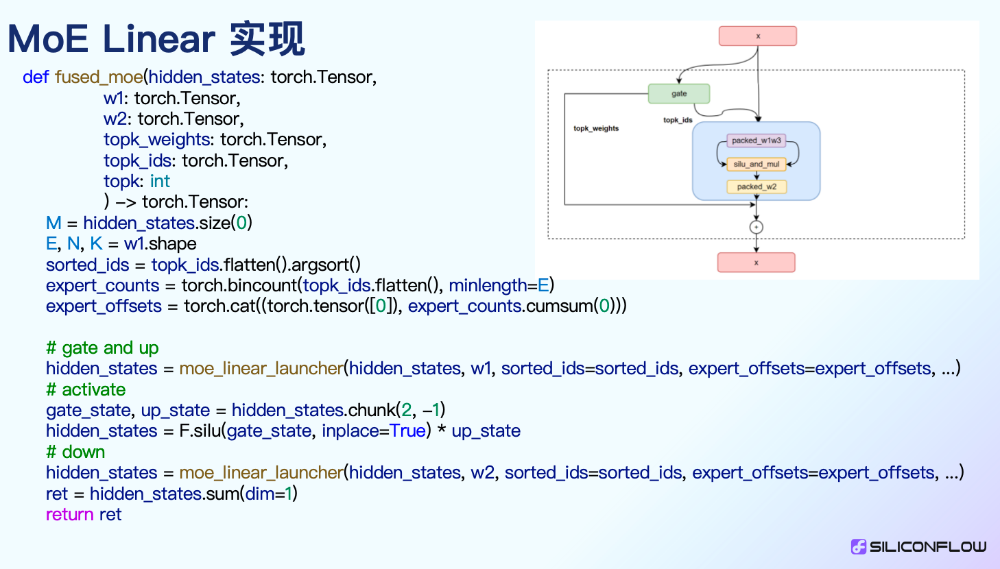

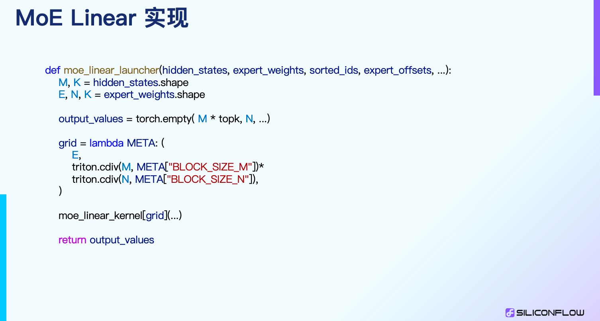

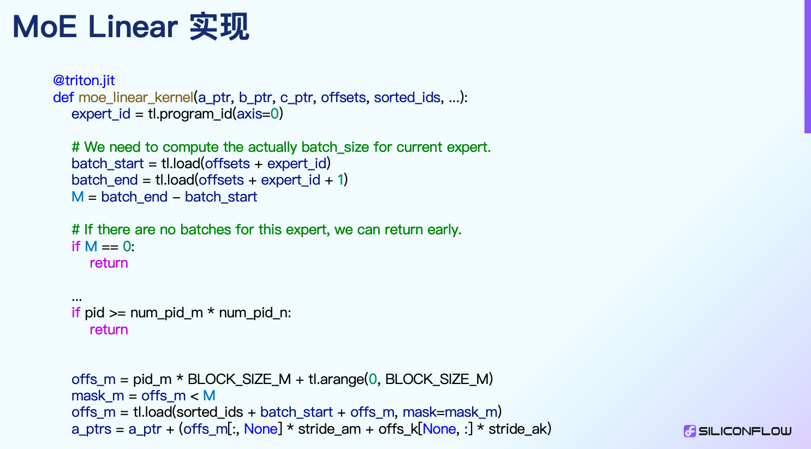

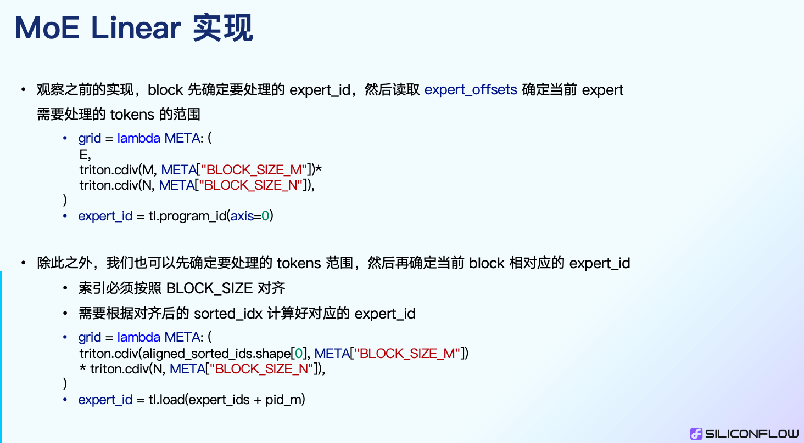

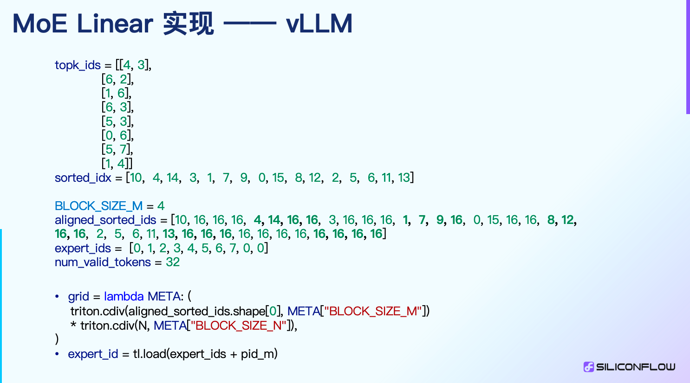

### Token 중심인가 Expert 중심인가

위 마지막 두 Slides는 먼저 Experts를 결정할 수도 있고, 먼저 Tokens를 결정할 수도 있음을 언급한다. VLLM/SGLang의 현재 version은 먼저 Experts를 결정한 뒤 Tokens를 결정하는 방식이다. LmDeploy에는 먼저 Tokens를 결정한 뒤 Expert를 결정하는 Fused MoE operator가 제공된다. https://github.com/InternLM/lmdeploy/blob/main/lmdeploy/pytorch/kernels/cuda/fused_moe.py . 하지만 Auto Tuning과 quantization 관련 여러 support가 부족하므로, 관심 있는 독자는 직접 탐색해 볼 수 있다.

### SplitK Grouped GEMM Fused MoE

출처: https://github.com/pytorch-labs/applied-ai

나는 SGLang에서 이 operator를 시도했고, FP8 support와 Auto Tuning을 추가했다. 하지만 Qwen2-57B TP4 w8a8 상황에서는 명확한 이득을 보지 못했다. 아래 그림과 같다. https://github.com/sgl-project/sglang/pull/2334

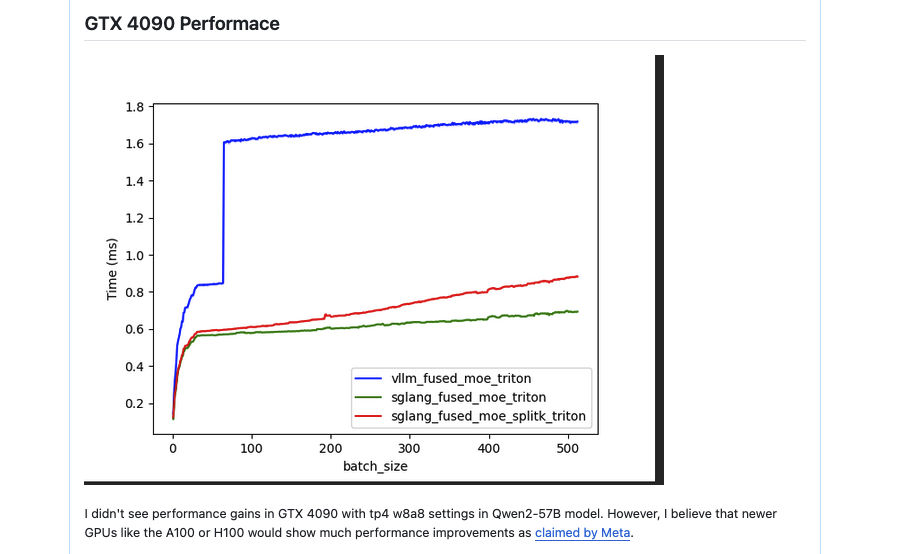

SplitK GEMM은 `tl.atomic_add`를 도입하는데, Triton의 `atomic_add`는 BF16을 지원하지 않는다. dtype이 bf16인 model을 inference하려고 하면 여기서 error가 발생하며, 이것도 하나의 limitation이다.

### SGLang Expert Parallel Fused MoE

이에 대해서는 별도로 blog를 쓴 적이 있다: [SGLang의 Expert Parallel 특성 해설](https://mp.weixin.qq.com/s/hRVpCFynybW37jogW9_BXA)

글 마지막에서도 현재의 장점과 limitation을 언급했다.

### TensorRT-LLM Fused MoE

위에서 언급한 Fused MoE variant implementation은 모두 Triton 기반이며, 제한도 많다. TensorRT-LLM도 Fused MoE implementation을 open source했는데, 이는 pure CUDA로 작성되어 있다. gating fusion을 지원할 뿐 아니라 GEMM1 뒤의 Activation을 Cutlass Epilogue로 fuse할 수도 있다. grouped gemm도 cutlass로 customize되어 있으며, 특정 tuning strategy도 있다. 또한 이 implementation은 Expert Parallel과도 완벽하게 연결될 수 있으므로, 현재 open source version 중 가장 좋은 implementation이라고 볼 수 있다. 다만 이 implementation은 C++로 작성되어 TensorRT-LLM 내부에 embedded되어 있기 때문에 외부에서 사용하려면 현재는 꽤 어렵다. 위에서 언급했듯 우리는 이를 별도로 호출 가능한 library로 독립시키는 porting 작업을 진행 중이며, 초기에 성공하고 correctness도 검증했다. 이후 open source community의 노력으로 이 implementation이 더 널리 사용될 수 있다고 믿는다. SGLang Project의 progress를 지켜봐 달라.

### LMDeploy TurboMind Fused MoE

https://github.com/InternLM/lmdeploy/pull/2621

나는 이 code를 많이 읽지는 않았으므로 여기서는 존재만 간단히 언급한다. TensorRT-LLM과 마찬가지로 이것도 처음부터 끝까지 CUDA로 Fused MoE를 작성했고, Grouped GEMM도 Cutlass를 사용해 customize한다. 개인적으로는 이 implementation과 TensorRT-LLM의 Fused MoE 중 하나를 선택하면 된다고 느낀다.

## 0x4. Summary

2024년에 수행한 일부 open source work와 learning gain을 간단히 돌아보았다. 작년은 꽤 즐거웠고, 2025년에도 open source에서 계속 빛과 열을 내며 본업을 잘하고 삶을 즐기고 싶다. 또한 2024년의 Fused MoE operator inference optimization 관련 작업을 정리했다. 이 operator에 관심이 있다면 함께 교류해도 좋다. 이상이다.

