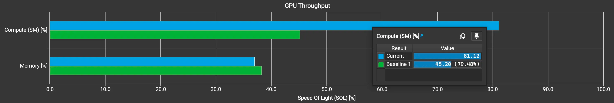

# SGLang Triton FusedMoE 최적화의 새로운 기법

> Antgroup이 최근 SGLang에 제출한 FusedMoE 최적화는 재미있는 발견이기도 하다. 여기서 학습 기록으로 정리해 공유한다.

## 0x0. 서문

최근 Ant가 SGLang에 최적화 PR([#10567](https://github.com/sgl-project/sglang/pull/10567))을 제출했다. Fused Triton MoE의 Down Projection kernel에 TMA(Tensor Memory Accelerator) 최적화를 넣은 것이다. 이 최적화는 DeepSeek-R1 모델의 H200 TP8 prefill 장면에서 두 번째 MOE(down projection)의 계산 이용률을 **45.20%에서 81.12%로** 끌어올렸고, 단일 MOE latency를 2.430ms에서 1.435ms로 낮췄으며, **성능은 약 41% 향상**되었다. 더 중요한 것은 8K tokens 장면에서 전체 TTFT를 약 8-9% 낮췄다는 점이다.

여기서는 이 최적화의 배경, 원리, 구현 세부를 자세히 분석한다.

### 0x1. 문제 배경

#### 0x1.1 비합리적인 성능 현상

H200(96GB) TP8 prefill 성능 분석 때, 작성자는 이상한 현상을 발견했다. 각 layer의 두 번째 MOE(down projection) latency가 첫 번째 MOE(up projection)와 거의 같았던 것이다. 하지만 두 번째 MOE의 weight 데이터량과 계산량은 첫 번째 MOE의 절반뿐이다. 이 성능 현상은 명백히 비합리적이다.

DeepSeek-V2/V3/R1 같은 모델은 MoE 구조를 사용하며 각 layer에는 두 MOE 연산이 있다.
- 첫 번째 MOE(up projection): hidden_states를 작은 차원에서 큰 중간 차원으로 매핑한다.
- 두 번째 MOE(down projection): 중간 결과를 큰 차원에서 원래 차원으로 다시 매핑한다.

이론적으로 down projection은 계산량이 더 작아서 더 빨라야 한다. 하지만 실제 profile 결과 latency가 비슷했고, 이는 두 번째 MOE의 계산 이용률에 심각한 문제가 있음을 뜻한다.

#### 0x1.2 성능 병목 분석

Nsight Compute 분석 결과, 두 번째 MOE의 계산 이용률은 45.20%에 불과했고 첫 번째 MOE보다 훨씬 낮았다. 문제는 주로 다음에 있었다.



1. **메모리 접근 패턴이 좋지 않음**: 두 번째 MOE의 입력 데이터 접근 패턴이 비교적 흩어져 있어 GPU 메모리 bandwidth를 충분히 활용하지 못한다.
2. **설정 파라미터 불일치**: 두 MOE가 같은 kernel 설정을 사용하지만 계산 특성은 완전히 다르다.
3. **Expert 부하 불균형**: 실제 추론에서 expert 부하 분포는 불균등하지만 tuning 때는 무작위 생성 expert 분포를 사용했다.

### 0x2. 최적화 아이디어

위 문제를 겨냥해 작성자는 비교적 종합적인 최적화 방안을 제시했다. 주로 네 부분이다.

#### 0x2.1 b_scale 획득과 계산 최적화

FP8 quantization을 사용할 때는 weight의 scale factor인 b_scale을 읽어야 한다. 기존 구현에서는 매번 `BLOCK_SIZE_N`개의 b_scale 원소를 읽었다. 하지만 `BLOCK_SIZE_N`이 `group_n`(block quantization 파라미터)보다 작거나 같으면, 매번 b_scale 원소 하나만 읽어도 충분하다.

최적화 뒤 로직은 a_scale(입력 quantization scale)과 b_scale을 먼저 곱한 뒤 dot product 결과에 다시 곱는 방식이다. 이렇게 하면 scale 계산 반복 비용을 줄일 수 있다.

#### 0x2.2 TMA 기반으로 두 번째 MOE 재구성

이것이 전체 최적화의 핵심이다. TMA(Tensor Memory Accelerator)는 NVIDIA가 Hopper 구조에 도입한 하드웨어 가속 유닛이며, GPU와 HBM 사이의 데이터 전송을 가속하는 데 특화되어 있다.

기존 구현에서 입력 A의 접근 패턴은 `(num_tokens * top_k)` 차원으로 조직되어 있었고 접근이 비교적 흩어져 있었다. 최적화 후에는 `(num_blocks * block_size_m)` 기준으로 조직해 데이터 접근을 연속적으로 만들고, TMA로 입력 A와 weight B 접근 과정을 감싼다.

구체적으로는 다음과 같다.
- 입력 A를 재조직해 같은 block 안의 token을 연속 배치한다.
- TMA descriptor로 입력 A와 weight B의 메모리 layout을 기술한다.
- TMA 하드웨어 유닛을 이용해 효율적인 데이터 이동을 수행한다.

이 방식의 장점은 메모리 bandwidth 이용률을 크게 높인다는 점이다. profile 결과를 보면 TMA를 사용한 뒤 메모리 접근 효율이 크게 좋아졌다.

#### 0x2.3 실제 Expert 분포로 Tuning

기존 tuning script는 무작위 생성 expert 분포를 사용했지만, 실제 추론에서 expert 부하는 불균등하다. 예를 들어 어떤 expert는 더 자주 선택되고, 다른 expert는 거의 쓰이지 않을 수 있다.

최적화 방안은 실제 추론 과정에서 topk_ids, 즉 어떤 token이 어떤 expert를 선택했는지를 수집하고, 이 실제 데이터로 tuning하는 것이다. 구체적 흐름은 다음과 같다.

1. `srt/models/deepseek_v2.py`를 수정해 topk_ids 저장 로직을 추가한다.
```python
# import get_tensor_model_parallel_rank
# DeepseekV2MoE::forward_normal
if hidden_states.shape[0] == 16384 and get_tensor_model_parallel_rank() == 0:
    topk_ids_dir = xxxx
    if not hasattr(self, "save_idx"):
        self.save_idx = 0
    if self.save_idx <= 1:
        torch.save(topk_output.topk_ids, 
                  f"{topk_ids_dir}/topk_idx_layer{self.layer_id}_idx{self.save_idx}.pt")
    self.save_idx += 1
```

2. chunked prefix size를 16384로 설정하고 긴 요청을 하나 보낸다.

3. 서버를 멈추고 수집한 topk_ids로 tuning한다.
```bash
model_path=/home/deepseek-ai__DeepSeek-R1
topk_ids_dir=xxxxx

python benchmark/kernels/fused_moe_triton/tuning_fused_moe_triton_sep.py \
    --model $model_path \
    --tp-size 8 \
    --dtype fp8_w8a8 \
    --topk-ids-dir ${topk_ids_dir} \
    --tune
```

이렇게 tuning한 설정은 두 파일을 만든다. 하나는 up projection용이고, 하나는 down projection용이다. 파일명 suffix에는 `_down`이 붙는다.

#### 0x2.4 두 MOE의 설정을 독립적으로 로드

두 MOE의 계산 특성이 다르다면 서로 다른 kernel 설정을 써야 한다. 최적화 후 코드는 up projection과 down projection의 최적 설정을 각각 로드한다.

핵심 코드는 `fused_moe_triton_config.py`의 `try_get_optimal_moe_config` 함수에 있다.

```python
def try_get_optimal_moe_config(
    w1_shape: Tuple[int, ...],
    w2_shape: Tuple[int, ...],
    ...
    return_down_config: bool = False,
):
    ...
    if return_down_config:
        down_configs = get_moe_configs(E, N, dtype, block_n, block_k, down_moe=True)
        if down_configs:
            down_config = down_configs[
                min(down_configs.keys(), key=lambda x: abs(x - M))
            ]
    ...
```

실제 실행 때는 `down_moe_use_tma` flag로 TMA 최적화 활성화 여부를 결정한다.

```python
down_moe_use_tma = (
    _down_moe_use_tma()
    and down_config is not None
    and down_config.pop("USE_TMA", False)
)
```

### 0x3. 코드 구현 세부

#### 0x3.1 TMA 지원 감지

먼저 현재 환경이 TMA를 지원하는지 감지해야 한다.

```python
try:
    from triton.tools.tensor_descriptor import TensorDescriptor
    _support_tensor_descriptor = True
except:
    _support_tensor_descriptor = False

def support_tensor_descriptor():
    return _support_tensor_descriptor

@functools.lru_cache()
def _down_moe_use_tma():
    return support_tensor_descriptor()
```

#### 0x3.2 입력 데이터 재조직

TMA 사용의 핵심은 데이터 접근을 연속적으로 만드는 것이다. `fused_experts_impl` 함수에서는 TMA 사용 여부에 따라 추가 padding 필요 여부를 결정한다.

```python
max_padded_tokens = (
    min(M * topk, E + 1) * (max_block_m - 1) if down_moe_use_tma else 0
)
total_tokens = M * topk + max_padded_tokens
```

이 padding은 각 block의 token 수를 정렬해 TMA 접근을 편하게 하기 위한 것이다. 계산 뒤에는 적절한 크기의 intermediate cache를 만든다.

```python
cache = torch.empty(
    total_tokens * max(N, w2.shape[1]),
    device=hidden_states.device,
    dtype=hidden_states.dtype,
)
```

#### 0x3.3 Kernel 호출

두 번째 MOE kernel 호출 때 TMA 관련 파라미터를 넘긴다.

```python
invoke_fused_moe_kernel(
    intermediate_cache2,
    w2,
    b2,
    intermediate_cache3,
    ...
    a_use_tma=down_moe_use_tma,  # 입력 A에 TMA 사용
    b_use_tma=down_moe_use_tma,  # weight B에 TMA 사용
    filter_expert=filter_expert,
)
```

동시에 첫 번째 MOE의 kernel 호출에서는 `c_sorted=down_moe_use_tma`를 설정한다. 이렇게 하면 첫 번째 MOE의 출력이 두 번째 MOE가 필요로 하는 순서로 조직되어 이후 TMA 접근에 유리하다.

### 0x4. 성능 테스트 결과

#### 0x4.1 Kernel 수준 성능 향상

16372 chunked size 장면에서 길이가 16372×3 + 502인 요청을 보낸다.

**최적화 전**:
- fused_moe_kernel 총 소요 시간: 1.525s
- 평균 호출 시간: 4.383ms
- 호출 횟수: 348회(두 MOE가 같은 kernel 공유)

**최적화 후**:
- fused_moe_kernel(up projection) 총 소요 시간: 706.7ms, 평균 4.061ms, 174회 호출
- fused_moe_down_tma_kernel(down projection) 총 소요 시간: 430.0ms, 평균 2.471ms, 174회 호출

down projection kernel 평균 latency가 4.383ms에서 2.471ms로 내려갔고, 성능은 약 **43.6%** 향상되었다. 두 kernel의 총 소요 시간(1136.7ms)도 최적화 전(1525ms)보다 약 25% 줄었다.

더 중요한 것은 Nsight Compute에서 down projection의 계산 이용률이 **45.20%에서 81.12%로** 오른 것을 볼 수 있었다는 점이다. 최적화가 실제로 하드웨어 자원을 더 충분히 활용하게 만든 것이다.

#### 0x4.2 End-to-end TTFT 테스트

서로 다른 입력 길이의 TTFT 테스트는 최적화 후 각 길이에서 8-9% 수준의 TTFT 감소를 보여준다.

| Input Lens | Before TTFT | After TTFT | TTFT 감소 |
|------------|-------------|------------|---------|
| 512        | 115.78ms    | 112.86ms   | 2.52%   |
| 1024       | 138.63ms    | 127.31ms   | 8.17%   |
| 2048       | 219.31ms    | 200.50ms   | 8.58%   |
| 4096       | 393.37ms    | 358.95ms   | 8.75%   |
| 8192       | 801.73ms    | 738.52ms   | 7.88%   |

긴 입력 길이(2K-8K tokens)에서 TTFT 감소 비율은 8% 안팎으로 안정적이다. 사용자 경험 개선에는 꽤 뚜렷한 수치다.

#### 0x4.3 정확도 검증

최적화가 모델 정확도에 영향을 주면 안 된다. PR은 GSM8K와 MMLU 테스트 결과를 제공했고, 최적화 전후 정확도는 거의 같았다.

**GSM8K**:
- 최적화 전: Accuracy 0.951
- 최적화 후: Accuracy 0.953

**MMLU**:
- 최적화 전후 평균 accuracy는 모두 약 0.871

이는 TMA 최적화가 정확도 손실을 도입하지 않았음을 보여준다.

### 0x5. 커뮤니티 토론과 추가 생각

#### 0x5.1 왜 down_proj만 최적화하는가?

PR comment에서 누군가 TMA 최적화를 왜 down_proj에만 적용하는지, up_proj도 비슷한 가속을 얻을 수 있는지 물었다.

작성자 xu-yfei의 답변은 이렇다. up_proj의 weight에도 TMA를 쓸 수는 있지만, 로컬 테스트에서 향상은 뚜렷하지 않았다(약 1-2%). 이유는 up_proj의 입력 A가 `hidden_states`이며, 값이 token 단위로 흩어져 가져와지기 때문에 down_proj처럼 연속 block으로 재조직해 TMA를 쓰기 어렵다는 것이다.

반면 down_proj의 입력 A는 이전 MOE의 출력이다. 이 출력은 계산할 때부터 연속 block 방식으로 조직할 수 있으므로 TMA의 장점을 충분히 살릴 수 있다.

#### 0x5.2 TMA가 kernel 시간을 늘릴 수도 있는가?

어떤 테스트에서는 TMA를 사용한 뒤 단일 kernel 시간이 오히려 늘었다고 한다. 작성자는 이것이 정상이라고 설명한다. 이유는 다음과 같다.

1. TMA 사용 시의 최적 설정과 미사용 시의 최적 설정이 다르다.
2. 단일 kernel 시간이 늘 수는 있지만 end-to-end throughput은 좋아질 수 있다.

작성자는 H200에서 서로 다른 설정을 사용할 때의 성능 비교표도 제공했다.

| configs | tokens | gateup proj (us) | gateup proj with TMA (us) | down proj (us) | down proj with TMA (us) |
|---------|--------|-----------------|--------------------------|----------------|------------------------|
| "64 128 128 1 4 3" | 8192 | 2311 | 2290 | 2164 | 1456 |
| "64 128 128 32 4 3" | 8192 | 2311 | 2292 | 2204 | 1391 |
| "64 128 128 16 4 3" | 8192 | 2309 | 2289 | 2172 | 1377 |

down projection에 TMA를 쓰면 성능 향상이 매우 뚜렷하다. 2164us에서 1456us로 내려가며, 약 33% 향상이다.

#### 0x5.3 왜 kernel을 합치지 않는가?

또 다른 흥미로운 토론은 두 MOE kernel을 합칠 수 있는지였다. 작성자는 합쳐 보았지만 성능이 크게 떨어졌다고 한다. 원인은 합친 뒤 일부 branch 판단이 들어가 성능이 저하되었기 때문이다. 일부 최적화 뒤 성능이 회복되긴 했지만, 여전히 분리 버전보다 못했다.

이 점은 kernel fusion이 언제나 성능 향상을 가져오지는 않는다는 사실을 상기시킨다. 두 연산의 계산 특성이 크게 다를 때는 오히려 분리 실행이 더 나을 수 있다.

#### 0x5.4 다른 모델도 이득을 볼 수 있는가?

누군가 Qwen3-MoE도 이 최적화로 이득을 볼 수 있는지 물었다. 작성자는 Qwen3-MoE도 같은 MoE operator를 사용하므로 이론적으로 비슷한 가속 효과를 얻을 수 있다고 답했다. 다만 큰 token 길이(예: 8K)와 큰 TP 규모(예: TP8)에서 테스트하기를 권했다. 이런 장면에서 MOE 계산 비중이 더 높고 최적화 효과가 더 뚜렷하기 때문이다.

### 0x6. 정리

이 PR은 완전한 성능 최적화 과정을 보여준다.

1. **문제 발견**: profiling으로 down projection의 계산 이용률이 낮고 latency가 비합리적임을 발견했다.
2. **문제 분석**: 메모리 접근 패턴, 설정 파라미터, expert 분포 등 여러 영향 요인을 찾아냈다.
3. **방안 제시**: TMA 최적화, 설정 조정, 실제 데이터 tuning을 표적으로 적용했다.
4. **효과 검증**: kernel 수준부터 end-to-end까지 성능과 정확도를 전면 검증했다.

최종적으로 계산 이용률은 45.20%에서 81.12%로 올라갔고, 단일 kernel latency는 41% 낮아졌으며, end-to-end TTFT는 8-9% 감소했다.

### 0x7. 참고 자료

- PR 링크: https://github.com/sgl-project/sglang/pull/10567
- Triton TMA 문서: https://triton-lang.org/main/programming-guide/chapter-2/index.html
- SGLang 문서: https://docs.sglang.ai
