> blog 링크: https://pytorch.org/blog/metashuffling-accelerating-llama-4-moe-inference/

# MetaShuffling: LLama4 MoE 추론 가속화

> By Shikai Li, Gefei Zuo, Jianyu Huang, Jason Park, Zoey Sun, Xiaozhu Meng, Xiaodong Wang, Hongtao Yu, Changkyu Kim, CQ Tang, Stephen ChenMay 12, 2025	

Mixture-of-Experts(MoE)는 인기 있는 LLM 모델 아키텍처다. 토큰당 더 적은 파라미터를 활성화하여 학습과 추론의 계산량을 줄이지만, 최적의 계산 효율 달성, 높은 메모리·통신 압력, 모델의 동적성과 희소성 처리 측면에서 추가적인 도전 과제가 있다. 여기에서 새로운 MoE 추론 솔루션인 MetaShuffling을 소개한다. 이를 통해 Llama 4 모델을 프로덕션 추론에 효율적으로 배포할 수 있게 되었다.

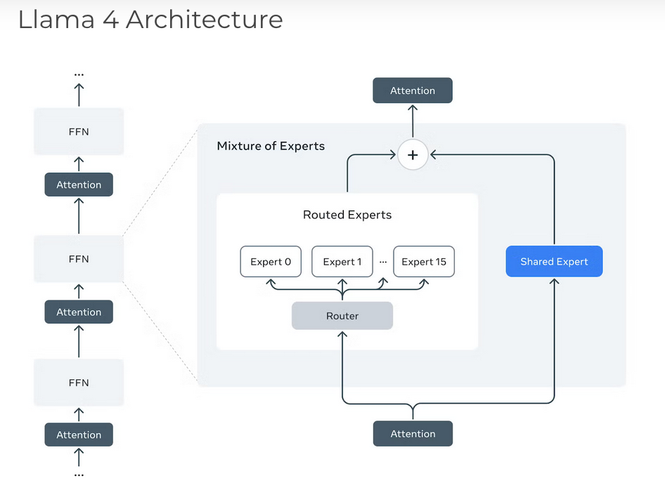

Llama 4 Scout과 Maverick 모델이 공식 출시되었다. Scout/Maverick은 공유 전문가와 16/128개의 라우팅 전문가를 가지며, dropless 토큰 선택 라우팅과 각 MoE 레이어당 Top-1 선택을 사용한다. 또한 공유 전문가와 라우팅 전문가 모두 SwiGLU 활성화를 사용하며 3개의 선형 레이어를 갖는다. 모델에 대한 자세한 내용은 The Llama 4 herd: The beginning of a new era of natively multimodal AI innovation(https://ai.meta.com/blog/llama-4-multimodal-intelligence/)을 참고한다.

## 핵심 개념

MoE 레이어의 동적성과 희소성 문제를 처리하는 여러 일반적인 솔루션이 도입되었다. 여기에서는 Top-1 선택을 사용하는 다양한 토큰 선택 라우팅 솔루션을 보여준다.


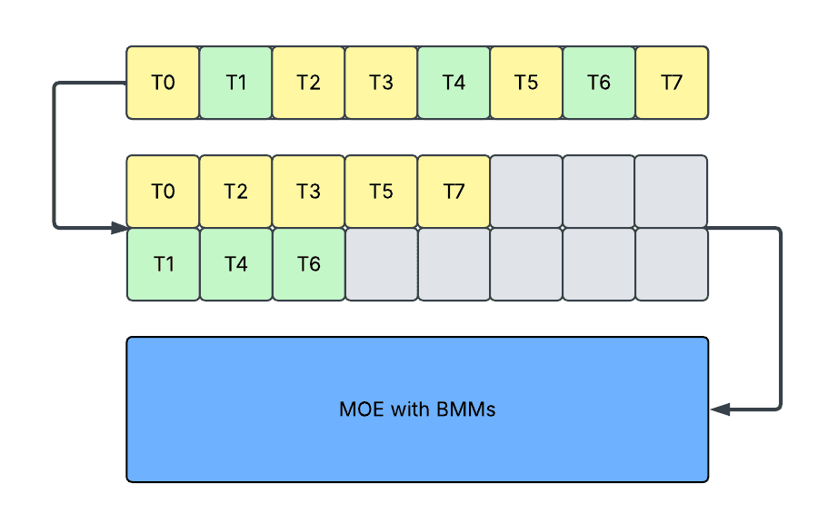

위 그림은 Padding 설계를 보여준다. 각 박스는 토큰을 나타내며, 노란색/초록색은 서로 다른 전문가로 라우팅된 유효 토큰을, 회색은 패딩된 토큰을 나타낸다. 두 번째 단계의 각 행 박스는 서로 다른 라우팅 전문가를 나타낸다. Ti는 데이터 병렬 그룹의 현재 rank에서 i번째 토큰을 나타낸다.

- **Padding**: 이 방법에서는 활성화를 각 전문가의 최대 시퀀스 길이로 패딩하고 단일 배치 행렬 곱셈(BMM)을 실행한다. 이로 인해:
    - 패딩 데이터 저장으로 메모리 사용량이 증가한다.
    - 패딩 데이터 처리로 지연이 증가한다. 참고로 jagged kernel을 사용하면 패딩 처리를 피할 수 있지만, 전문가 수가 많을 때는 jagged kernel도 높은 오버헤드를 유발할 수 있다.

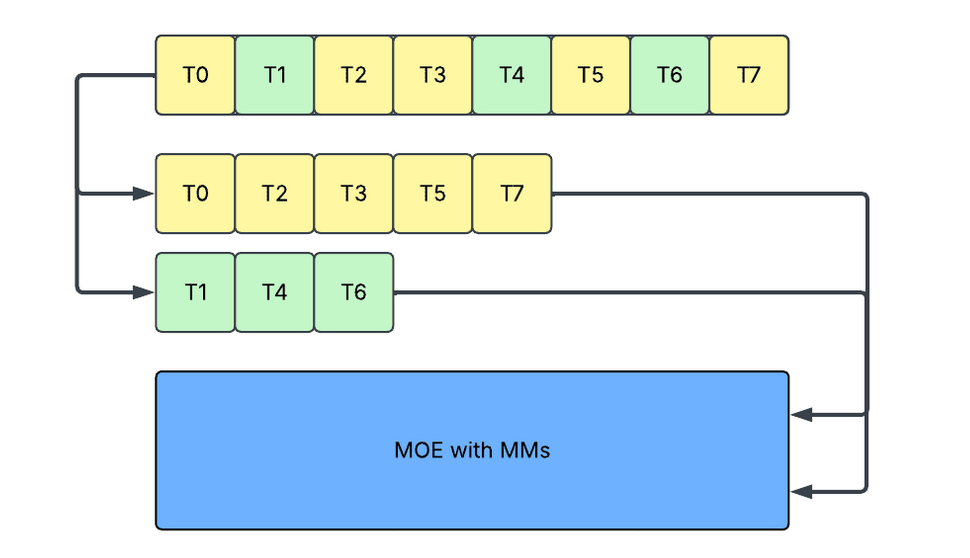

- **Slicing**: 이 방법에서는 활성화를 각 전문가의 정확한 시퀀스 길이로 슬라이싱하고 여러 행렬 곱셈(MM)을 실행한다. 패딩 문제를 피하지만 다음과 같은 단점이 있다:
    - 작은 형상에서 kernel을 반복 실행하여 kernel 효율이 저하된다.
    - 빈번한 호스트-디바이스 동기화와 동적 형상으로 인한 추가 kernel 실행 오버헤드로 디바이스 이용률이 저하된다. CUDAGraph 및 torch.compile과 같은 그래프 캡처 메커니즘과 호환되지 않는다.

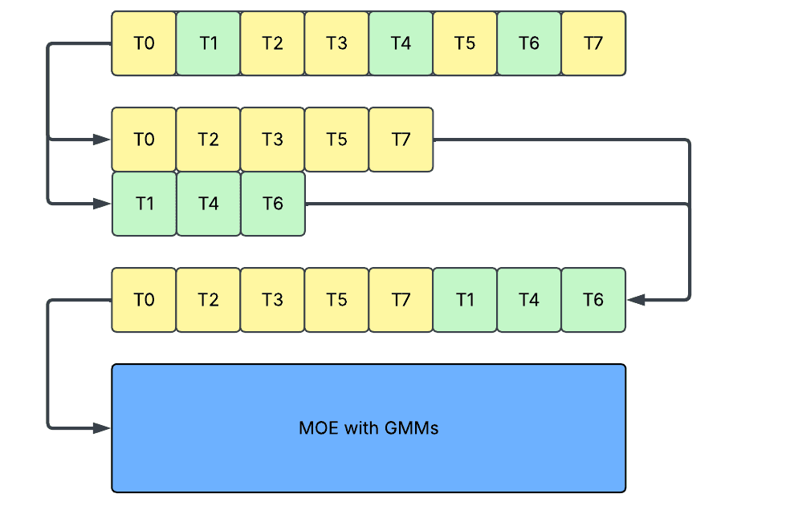

- **Concatenation**: 이 방법에서는 슬라이싱 후 활성화를 더 연결하고 단일 grouped 행렬 곱셈(GMM)을 실행한다. 슬라이싱의 kernel 효율 문제를 피하지만 여전히 다음 단점이 있다:
    - 호스트-디바이스 동기화가 여전히 필요하므로 CUDAGraph 및 torch.compile과 같은 그래프 캡처 메커니즘과 호환되지 않아 디바이스 이용률이 저하된다.

솔루션을 더 개선하기 위해 shuffle 기반 메커니즘을 제안한다:

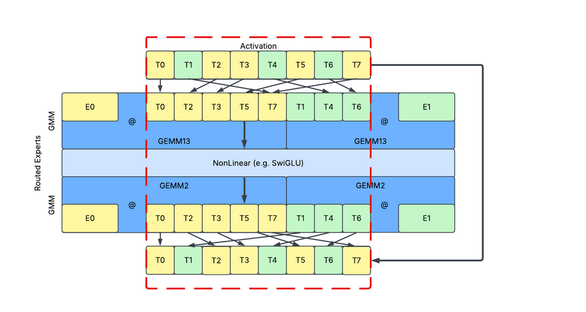

- **Shuffling**: 이 방법에서는 라우팅 전문가 ID 기준으로 정렬되도록 토큰을 직접 정렬한다. 이렇게 하면 패딩이나 분할이 없고, 동일한 전문가에 할당된 토큰이 함께 저장되어 GroupedGEMM 내에서 함께 처리될 수 있다. 위에서 언급한 모든 문제를 피하는 조밀 모델 인터페이스를 제공한다.
    - 패딩이 없다. 활성화가 조밀 텐서로 유지된다.
    - 호스트-디바이스 동기화가 없다. 활성화가 정적 형상의 텐서로 유지된다.

이 설계를 기반으로 종단간 MoE 추론 솔루션인 MetaShuffling을 구축했다.

## 런타임 설계

### 단일 GPU 추론(병렬화 없음)

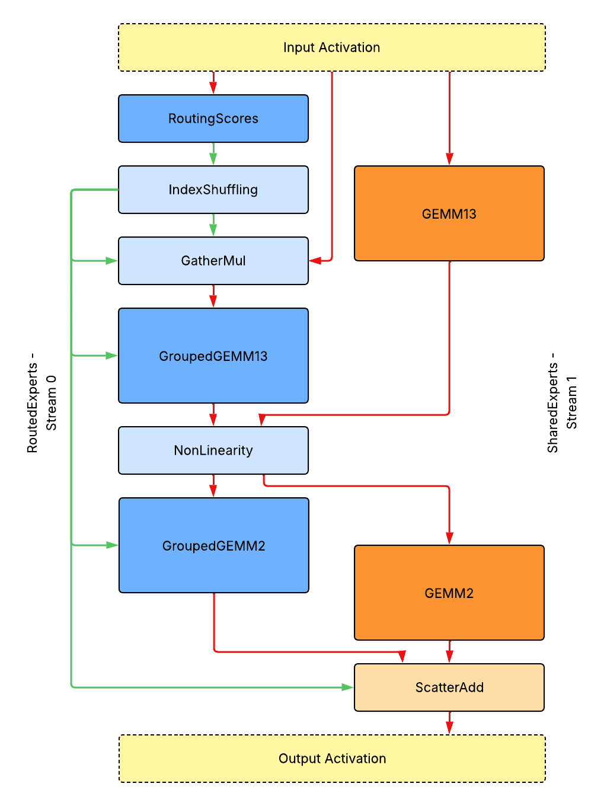


위 그림은 모델 병렬화 없는 단일 GPU 추론의 전체 런타임 설계다. 참고로 성능 최적화를 위해 SwiGLU 활성화의 첫 번째와 세 번째 선형 레이어는 GroupedGEMM13/GEMM13으로 합쳐진다.

- 진한 파란색/주황색 실선 박스는 라우팅/공유 전문가 스트림에서 Tensor Core 집약적인 kernel을 나타낸다.
- 연한 파란색/주황색 실선 박스는 라우팅/공유 전문가 스트림에서 CUDA Core 또는 메모리 트래픽 집약적인 kernel을 나타낸다.
- 빨간색 화살표는 활성화 텐서의 데이터 흐름을 나타낸다.
- 초록색 화살표는 메타데이터 텐서의 데이터 흐름을 나타낸다.

모든 메타데이터 텐서는 디바이스에 배치된다. 블로킹 디바이스-호스트 동기화가 없다. 모든 kernel은 연속적으로 실행되며 버블이 없다. 이 그림은 데이터 흐름만 보여주며 실제 성능 프로파일 Trace 시연이 아니다.
### Kernel 인터페이스와 데이터 흐름

- **RoutingScores**: 라우팅 점수 계산을 처리하는 함수 또는 융합 kernel이다.
    - 입력: input_tokens: [T, D](T: 토큰 수; D: 특징 차원); router_weights: [D, E](E: 전문가 수); router_biases: [E];
    - 출력: routing_scores: [T, E]; scaling_factors: [T, E];

- **IndexShuffling**: 인덱스 shuffle과 정렬을 처리하는 융합 kernel이다. Kernel 설계 섹션에서 최적화된 구현을 소개한다.
    - 입력: routing_scores: [T, E]; K(top-k 라우팅 임계값);
    - 출력: routed_token_indices: [K * T]; routed_expert_indices: [K * T]; routed_token_counts_per_expert: [E];

- **GatherMul**: 정렬된 인덱스에 따라 토큰을 shuffle하고 스케일링하는 융합 kernel이다.
    - 입력: input_tokens: [T, D]; routed_token_indices: [K * T]; routed_expert_indices: [K * T]; scaling_factors: [T, E];
    - 출력: scaled_routed_tokens: [K * T, D]

- **GroupedGEMM**: M 차원의 배치에 대한 디바이스 내 형상 정보를 제한 없이 처리하는 최적화된 GroupedGEMM kernel이다. Kernel 설계 섹션에서 최적화된 구현을 소개한다.
    - 입력: tokens: [K * T, D]; weights: [E, D, HD](HD: 은닉 차원); routed_token_counts_per_expert: [E];
    - 출력: tokens: [K * T, HD]

- **GEMM**: 최적화된 GEMM kernel이다. 조밀 모델 인터페이스와 유사하다.

- **NonLinearity**: 비선형성을 처리하는 융합 kernel이다. 조밀 모델 인터페이스와 유사하다.

- **ScatterAdd**: 정렬된 인덱스를 기반으로 토큰 shuffling을 역전하고 shuffle되지 않은 텐서를 구체화하지 않고 공유 전문가 출력에 직접 scatter add를 수행하는 최적화된 kernel이다.
    - 입력: shared_output_tokens: [T, D]; routed_output_tokens: [K * T, D]; routed_token_indices: [K * T];
    - 출력: combined_output_tokens: [T, D]

참고: 양자화가 적용되는 경우, 활성화 양자화 kernel은 이전 비-GEMM kernel에 융합된다. 즉 GroupedGEMM13의 경우 GatherMul에, GroupedGEMM2의 경우 NonLinearity에 융합된다.

참고: K * T가 큰 경우, GatherMul과 ScatterAdd 연산은 후속/전행 GroupedGEMM 연산에 더 융합될 수 있다. 이는 전처리/후처리에서 전역 메모리에서 shared memory/레지스터로 또는 shared memory에서 전역 메모리로의 단계로 수행되어야 한다. 그러나 이는 kernel 설계 수준에서 Tensor Core 실행과 겹치는 추가 도전 과제를 만든다. 또한 ScatterAdd 융합은 라우팅 전문가 이전에 공유 전문가가 완료되어야 하며, 이 kernel들이 AlltoAll 지연을 숨기는 데 사용될 수 있다면 좋은 설계 선택이 아닐 수 있다.

## 단일 호스트 추론을 위한 텐서 병렬화

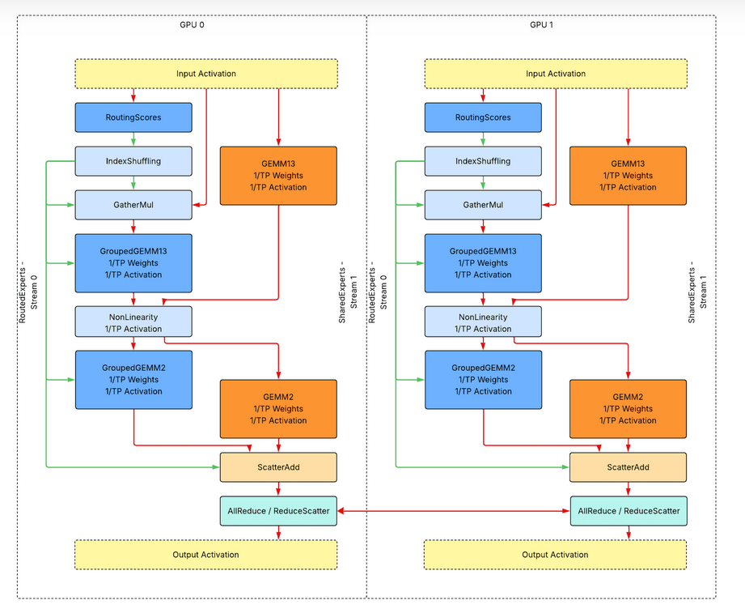

위 그림은 텐서 병렬(TP)을 사용하는 단일 호스트 추론의 전체 런타임 설계다. 단일 GPU 추론과 비교하여 추가된 단계는:

- 실선 연한 민트색 박스는 네트워크 통신 집약적인 통신 kernel을 나타낸다.

모든 메타데이터 텐서는 여전히 디바이스에 배치되며 디바이스-호스트 동기화가 없다. 모든 kernel은 연속적으로 실행되며 버블이 없다. 이 그림은 데이터 흐름만 보여주며 실제 성능 프로파일 Trace 시연이 아니다.

### 워크로드 분할과 추가 Kernel

단일 GPU 추론 사용 사례와 비교하여 추가 커스텀 kernel은 도입되지 않는다. GEMM, GroupedGEMM, 비선형 kernel에서 활성화와 가중치는 서로 다른 차원을 따라 1/TP로 분할되며 계산/메모리 오버헤드도 1/TP로 분할된다.

텐서 병렬만 적용하면 마지막 단계는 AllReduce가 되어야 한다. 또는 텐서 병렬을 시퀀스 병렬과 함께 적용하면 ReduceScatter를 사용한다.

## 다중 카드 추론을 위한 전문가 병렬화

전문가 병렬화(EP)를 활성화하기 위해 데이터 병렬 차원을 라우팅 전문가에서 교환하여 라우팅 전문가 내의 전문가 병렬 차원으로 만든다. 참고로 더 나은 GEMM 효율성을 위해 전문가 병렬은 텐서 병렬과 교환될 수 있지만, 이는 라우팅 불균형 위험을 증가시키므로 이 블로그에서는 다루지 않는다.

token-choice 라우팅에서 전문가 병렬을 활성화하면 서로 다른 전문가 그룹으로 라우팅되는 토큰 수가 동적이므로, 조밀 텐서를 사용하거나 정적 형상을 사용하는 선택을 해야 한다.

- eager 모드를 우선시할 때는 패딩 없는 AlltoAll 실행으로 인한 네트워크 트래픽과 메모리 공간 낭비를 피하기 위해 조밀 텐서와 동적 형상을 사용한다.
- 그래프 모드를 우선시할 때는 CUDAGraph 실행으로 인한 CPU 실행 오버헤드와 디바이스-호스트 동기화로 인한 GPU 버블을 피하기 위해 희소 텐서와 정적 형상을 사용한다.

참고로 패딩된 활성화로 인한 네트워크 트래픽 낭비는 커스텀 AlltoAll 구현으로도 피할 수 있지만, 이 블로그에서는 커스텀 통신이나 통신-계산 융합 kernel에 대해 다루지 않는다.

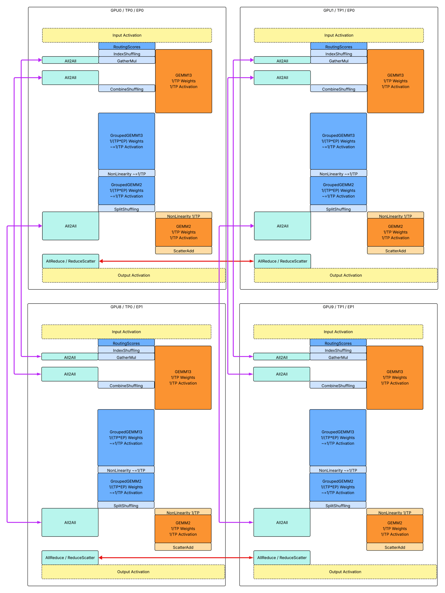
위 그림은 텐서 병렬과 전문가 병렬을 사용하는 다중 호스트 추론의 전체 런타임 설계다. 텐서 병렬을 사용하는 단일 호스트 추론과 비교하여:

- 실선 빨간색 화살표는 노드 내 통신을 나타낸다.
- 실선 보라색 화살표는 노드 간 통신을 나타낸다.

### Kernel 인터페이스와 데이터 흐름

전문가 병렬 기반 통신을 위해 형상과 토큰을 교환하는 3번의 All2All 통신을 사용한다:

- 1차 A2A: IndexShuffling kernel이 생성한 출력인 `routed_token_counts_per_expert: [E]`, 즉 각 전문가로 라우팅된 토큰 수에 관한 메타데이터 텐서를 디바이스에서 교환한다.
- 2차 A2A: 토큰을 데이터 병렬 기반에서 전문가 병렬 기반으로 변환하여 라우팅에 따라 다른 EP rank로 분배한다.
- 3차 A2A: 토큰을 전문가 병렬 기반에서 데이터 병렬 기반으로 변환하여 라우팅에 따라 다른 EP rank에서 수집한다.

또한 2개의 추가 shuffling kernel과 1개의 특수 scatter kernel이 추가된다:

- **CombineShuffling(조밀 또는 Padding)**: AllGather 후 수신된 토큰을 rank 순서에서 전문가 순서로 재정렬한다. 뒤에 오는 T*는 모든 피어 노드에서 수신된 총 토큰 수이며, routed_token_counts_per_rank_per_expert 텐서의 형상 정보로 비정형 차원으로 더 해석될 수 있다.
    - 입력: received_tokens: [T*, D](먼저 dp rank 기준 정렬, 다음 전문가 인덱스 기준 정렬); routed_token_counts_per_rank_per_expert: [EP, E // EP];
    - 출력: reshuffled_tokens: [T*, D](먼저 전문가 인덱스 기준 정렬, 다음 dp rank 기준 정렬); routed_token_counts_per_expert: [E // EP];
- **SplitShuffling(조밀 또는 Padding)**: CombineShuffling의 역과정이다. AlltoAll 전에 전송할 토큰을 전문가 우선 순서에서 rank 우선 순서로 재정렬한다.
    - 입력: reshuffuled_tokens: [T*, D](먼저 전문가 인덱스 기준 정렬, 다음 dp rank 기준 정렬); routed_token_counts_per_rank_per_expert: [EP, E // EP];
    - 출력: to_send_tokens: [T*, D](먼저 dp rank 기준 정렬, 다음 전문가 인덱스 기준 정렬);
- **ScatterAdd(Padding)**: 패딩된 텐서에서 유효 토큰을 scatter add한다.
    - 입력: 공유 출력 토큰: [T, D]; 수신된 패딩된 라우팅 출력 토큰: [EP, K*T, D]; 라우팅 토큰 인덱스: [K * T]; 전문가별 라우팅 토큰 수: [E];
    - 출력: 결합된 출력 토큰: [T, D]

"그래프 모드에서 정적 형상을 사용한 Padding 통신" 섹션에서 위의 kernel에 대해 자세히 설명한다.

### Eager 모드에서 동적 형상을 사용한 비-Padding 통신

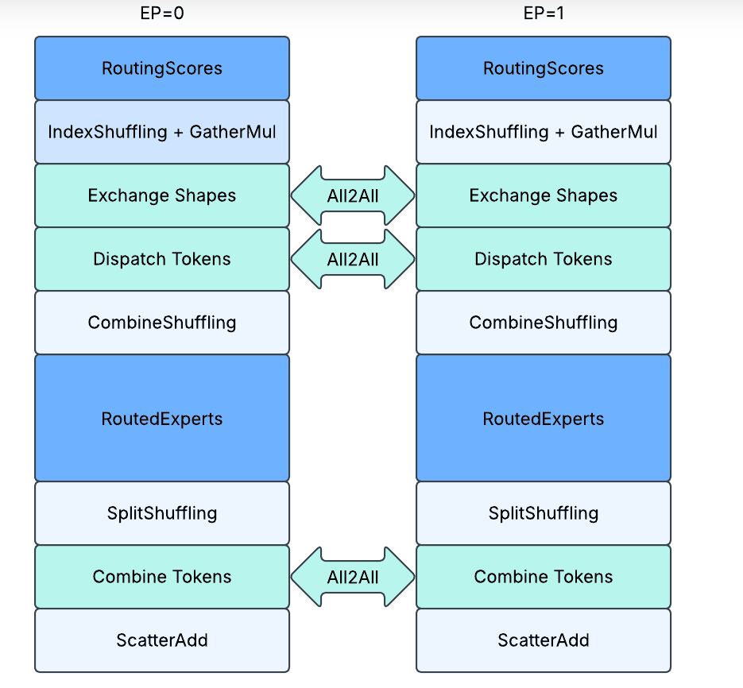

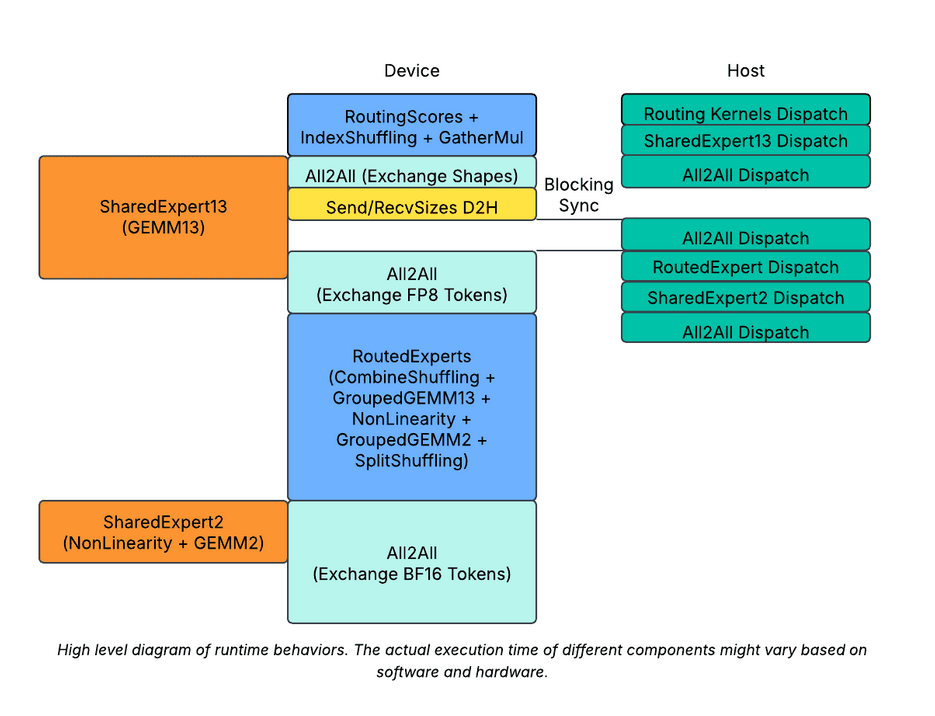


런타임 동작의 고수준 개략도. 각 구성 요소의 실제 런타임은 소프트웨어와 하드웨어에 따라 달라질 수 있다.

#### 동적 형상의 사용 최소화

라우팅이 각 MoE 레이어마다 동적이므로 필요한 최소 디바이스/호스트 동기화 횟수는 레이어당 1회다. 이를 달성하기 위해 `send_sizes`의 D2H 복사를 지연하고 `recv_sizes`와 연결하여 단일 D2H 복사로 함께 전송한다. 이로써 디바이스/호스트 동기화 횟수가 레이어당 1회로 줄어든다.

#### 동적 형상의 부정적 영향 최소화

디바이스/호스트 동기화 오버헤드를 더 숨기기 위해 공유 전문가를 두 부분으로 나눈다.

- 라우팅 후, 분배 A2A 전에 첫 번째 부분을 먼저 분배한다. 그러면 디바이스/호스트 동기화가 발생하는 동안 디바이스가 여전히 공유 전문가를 실행하며 바쁜 상태를 유지한다.
- MoE 후, 수집 A2A 전에 두 번째 부분을 분배한다. 이는 두 번째 A2A를 겹치는 데 더 도움이 된다.

### 그래프 모드에서 정적 형상을 사용한 Padding 통신

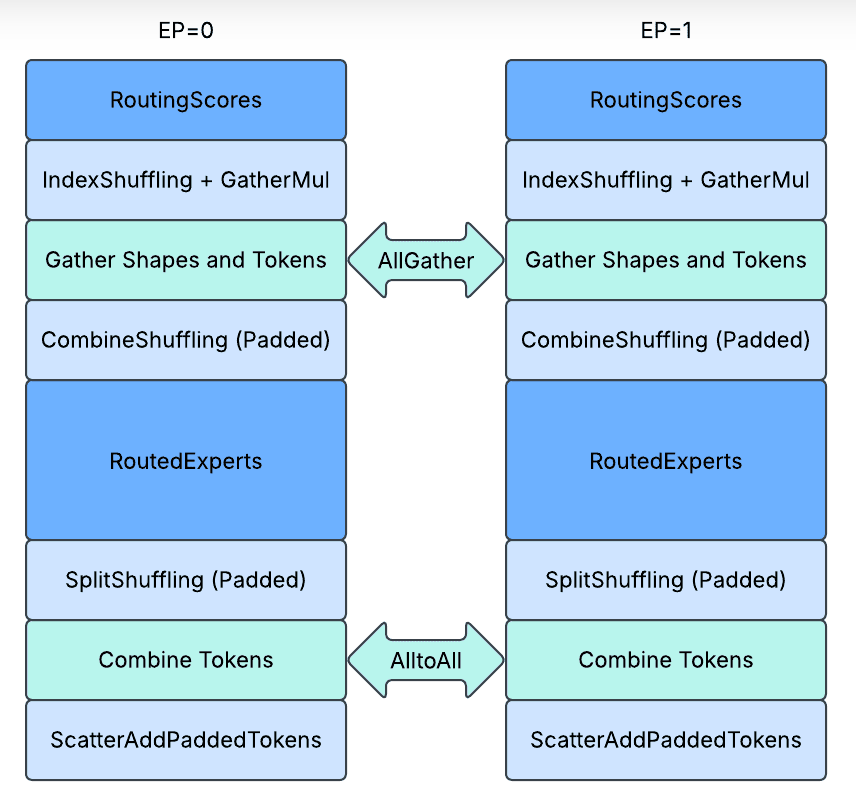

#### Padding 사용 최소화

dropless token-choice 설계에서 단일 전문가로 라우팅될 수 있는 최대 토큰 수는 T이다. 그러나 전문가 병렬 분할을 통해 여러 전문가를 결합하여 단일 GPU에 배치하면 TopK 라우팅의 경우:

- 1개 전문가로 라우팅되는 최대 토큰 수는 T이다.
- 2개 전문가로 라우팅되는 최대 토큰 수는 2 * T이다.
- ...
- K개 전문가로 라우팅되는 최대 토큰 수는 K * T이다.
- K+1개 전문가로 라우팅되는 최대 토큰 수는 여전히 K * T이다.
- ...

따라서 N개 전문가 그룹으로 라우팅되는 최대 토큰 수는 min(N, K) * T 토큰으로 제한된다.

Top1 라우팅의 경우, 임의 크기의 전문가 그룹으로 라우팅되는 토큰 수는 항상 T 토큰으로 제한된다. EP개의 전문가 그룹이 있으므로, 동적 토큰을 할당하고 저장하는 데 필요한 최소 메모리는 EP * T 토큰이다.

최소 필요 Padding을 달성하기 위해 AllGather를 직접 사용하여 서로 다른 EP rank에서 모든 활성 토큰을 수집한 후, 커스텀 kernel로 로컬에서 라우팅 토큰을 분할하고 재정렬한다. 활성화 크기는 1/(E // EP)로 압축되어 메모리와 네트워크 트래픽이 줄어든다.

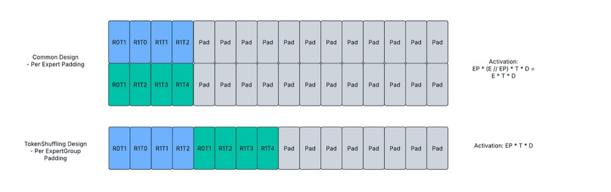

위 그림은 Padding 설계를 보여준다. 각 박스는 토큰을 나타내며, 파란색/초록색은 전문가 할당이 있는 유효 토큰을, 회색은 패딩 토큰을 나타낸다. RiTj는 전문가 병렬 그룹에서 i번째 rank의 j번째 토큰을 나타낸다.

#### Padding의 부정적 영향 최소화

Padding이 최소 허용치로 줄었지만, 디바이스 형상 정보 `routed_token_counts_per_expert` 또는 `routed_token_counts_per_rank_per_expert`를 수용하여 Padding이 메모리 공간(할당)과 네트워크 트래픽(통신)만 유발하고 중복 계산(GroupedGEMM/NonLinear), 중복 메모리 대역폭(CombineShuffling/SplitShuffling/ScatterAdd)을 유발하지 않도록 한다.


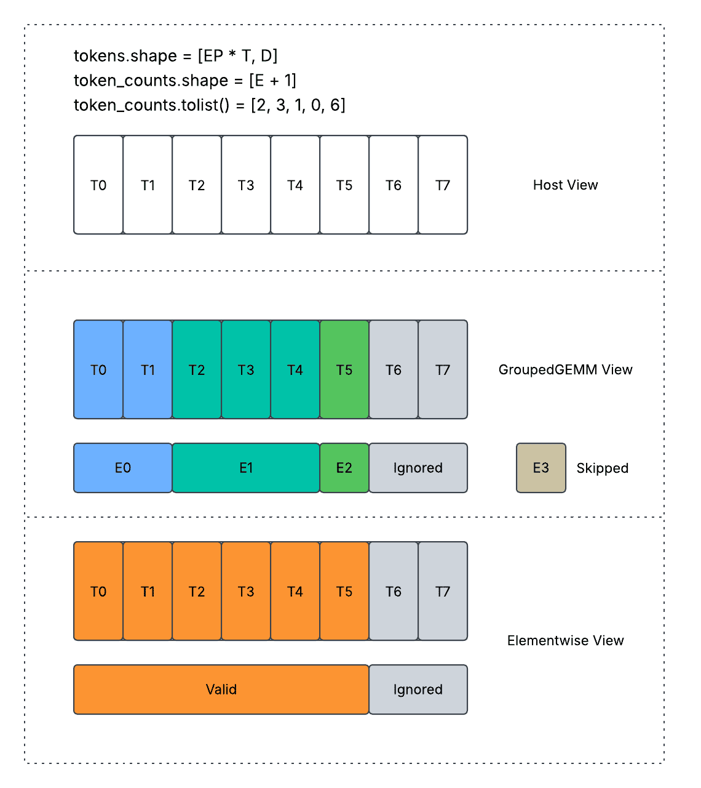

**활성화의 개념적 설명**

- 가장 중요하게, 모든 EP rank의 활성 토큰 수가 적을 때 GroupedGEMM에서 중복 전문가 활성화와 추가 메모리 트래픽을 피하기 위해 이것이 중요하다.
- 모든 EP rank의 활성 토큰 수가 많을 때도 GroupedGEMM을 memory bound에서 compute bound로 전환하는 것을 피하기 위해 이것이 중요하다.

**CombineShuffling**: 현재 EP rank에 할당된 토큰이 AllGather 후 전문가 우선 순서에서 rank 우선 순서로 재정렬된다. 할당되지 않은 토큰은 복사되지 않으며, 텐서 끝의 남은 할당된 메모리 공간은 그대로 유지된다.

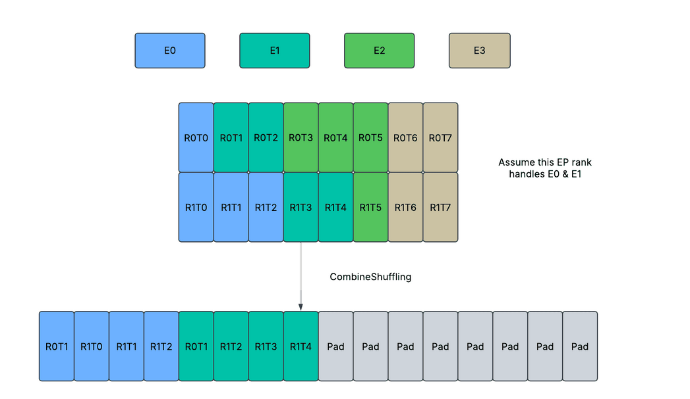

**SplitShuffling**: 현재 EP rank에 할당된 토큰이 AlltoAll 전에 rank 우선 순서에서 전문가 우선 순서로 재정렬된다. 할당되지 않은 토큰은 복사되지 않으며, 재정렬된 텐서는 인터리브된 Padding이 있는 채로 저장된다.

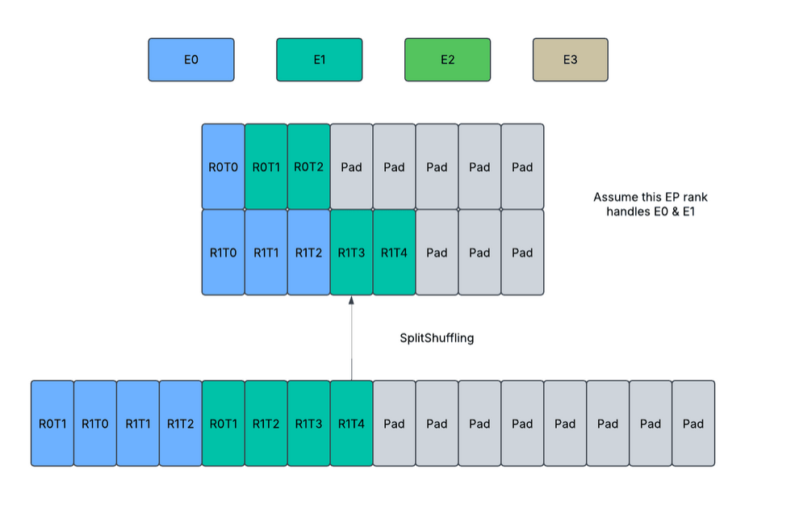


**ScatterAdd(Padded)**: 각 EP rank는 최종적으로 다른 모든 rank의 계산된 활성화를 수신하며, 어떤 것이 유효 토큰이고 어떤 것이 패딩 토큰인지 파악하여 유효 토큰만 읽어 scatter_add를 수행한다.

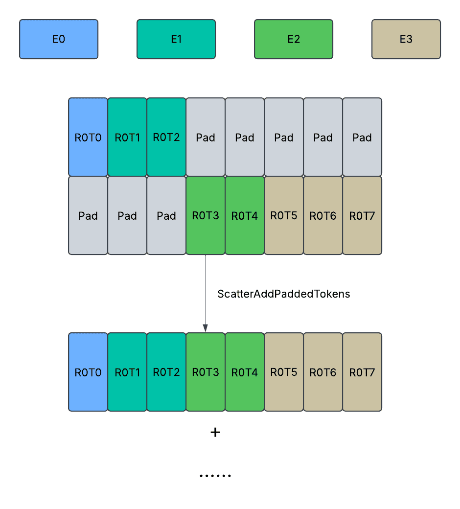


#### 통신 중복 제거

서로 다른 텐서 병렬 rank는 첫 번째 GroupedGEMM 이전과 두 번째 GroupedGEMM 이후에 동일한 활성화를 가지므로, 동일한 토큰이 노드 간에 중복 교환된다.

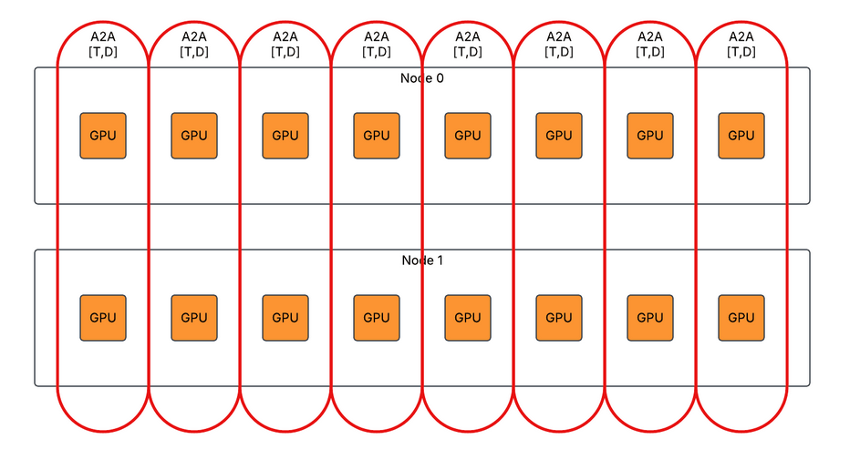

서로 다른 rank에 노드 간 통신 워크로드를 균등하게 분배하면서 추가 노드 내 통신을 도입하는 통신 중복 제거를 활성화했다. DP2/TP8/EP2 예시:

- eager 모드의 첫 번째 AlltoAll에서, $T*D$ 노드 간 AlltoAll을 $T*D/8$ 노드 간 AlltoAll과 $T*D$ 노드 내 AllGather로 분리한다.

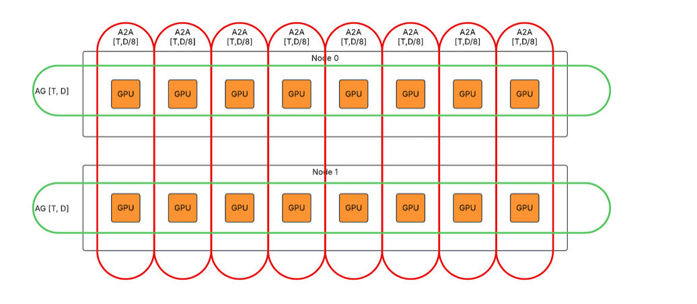

- eager/그래프 모드의 두 번째 AlltoAll에서, $T*D$ 노드 간 AlltoAll을 $T*D/8$ 노드 내 ReduceScatter와 $T*D/8$ 노드 간 AlltoAll로 분리한다.

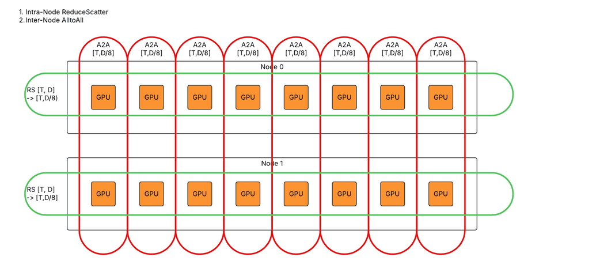

- 그래프 모드의 첫 번째 AllGather에서, $2*T*D$ 노드 간 AlltoAll을 $2*T*D/8$ 노드 간 AllGather와 $2*T*D$ 노드 내 AllGather로 분리한다.

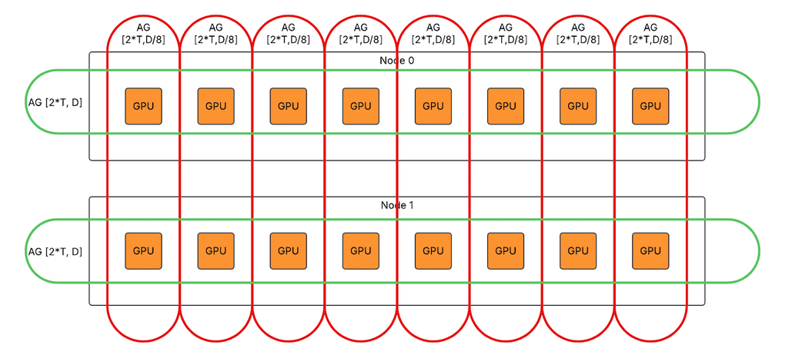


## Kernel 설계


**MetaShuffling** MoE 추론 설계를 지원하기 위해 10개 이상의 커스텀 kernel을 구현했으며, Nvidia H100 GPU와 AMD MI300X GPU에서 실행된다. 모든 계산 kernel을 PyTorch 연산자로 FBGEMM Generative AI Kernel Library(https://github.com/pytorch/FBGEMM/tree/main/fbgemm_gpu/experimental/gen_ai)에 오픈소스로 공개했다. 이를 통해 사용자가 선호하는 프레임워크와 가속기에서 Llama 4 모델을 **효율적으로** 서빙하는 데 도움이 되기를 바란다(예: vLLM/SGLang). 이 블로그에서는 추론 성능 향상의 핵심인 GroupedGEMM과 IndexShuffling 두 가지 가장 흥미로운 kernel 설계를 중점적으로 소개한다.

### GroupedGEMM

BF16/FP16/FP8 Rowwise에 대한 Triton 기반 GroupedGEMM kernel을 구현했다.

#### 인터페이스

```python
def grouped_gemm_fp8_rowwise(
	x: torch.Tensor, 		# shape: [M, K]
	w: torch.Tensor, 		# shape: [G*N, K]
	m_sizes: torch.Tensor, 	# shape: [G]
	x_scales: torch.Tensor,	# shape: [M]
	w_scales: torch.Tensor, 	# shape: [G*N]
) -> torch.Tensor:               # shape: [M, N]
	...
```

이 인터페이스는 단일 GEMM과 매우 유사하며, 왼쪽 행렬과 오른쪽 행렬을 입력으로 받아 출력을 생성한다. 런타임 관점에서 동적성이나 희소성이 없다.

그러나 이 kernel은 `m_sizes`의 데이터를 사용하여 왼쪽 행렬의 M 차원을 동적으로 분할하고, `m_sizes`의 형상을 사용하여 오른쪽 행렬의 N 차원을 정적으로 분할한다. 이 설계의 몇 가지 장점이 있다:

- 서로 다른 배치의 M 간에 추가 패딩이나 정렬 요구 사항이 없다. 따라서 합계가 `M`을 초과하지 않는 한 `m_sizes`는 임의의 비음수 값을 저장할 수 있다.
- 비활성화된 전문가의 가중치 로드를 건너뛰기 위해 `m_sizes`가 0 값을 가질 수 있다.
- `m_sizes`의 합계가 `M`보다 작을 수 있어 추가 오버헤드 없이 끝부분 패딩 토큰의 계산을 건너뛸 수 있다.
- `m_sizes` 또는 왼쪽 행렬 활성화의 분할은 디바이스에는 알려지지만 호스트에는 알려지지 않는다. 따라서 디바이스-호스트 동기화 없이 동적 라우팅 정보를 지원한다.

#### 워크로드 분할

각 SM에서 1개의 CTA를 실행하고 모든 CTA가 인터리브 방식으로 모든 분할된 tile을 실행하는 지속 kernel 설계를 채택한다. 개념적으로 워크로드 분할은 다음과 같다.

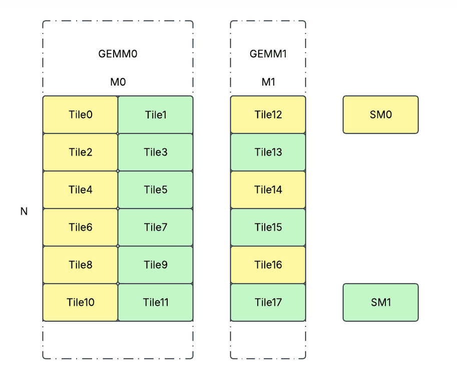

```python
def partition_workload(G: int, Ms: List[int], N: int):
	partitions = []
	for g in range(G):
		for n in range(0, N, BLOCK_N):
			for m in range(0, Ms[g], BLOCK_M):
				partitions.append((g, m, n))
	paritions_per_cta = [[] for _ in NUM_SMS]
	for i, part in enumerate(partitions):
		paritions_per_cta[i % NUM_SMS].append(part)

```

워크로드는 디바이스 측에서 동적으로 계산되며 오버헤드가 매우 작다. 이를 통해 달성할 수 있는 것:

- SM 간 워크로드 균형.
- SM당 1개의 CTA만 실행하는 작은 실행 오버헤드.
- 높은 L2 캐시 히트율. 워크로드 분할 순서는 가중치/활성화가 HBM에서 한 번 로드되어 L2에 캐시될 가능성을 최대화한다. 동일한 가중치/활성화 tile의 사용이 거의 항상 서로 다른 SM에서 동시에/연속적으로 발생하기 때문이다.

#### 지속 kernel과 warp 특화

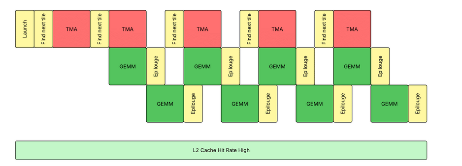


Hopper GPU에서 메모리 전송 오버헤드를 줄이기 위해 호스트 측 tensor map 기반의 활성화와 가중치 로드, 그리고 선택적 디바이스 측 tensor map 기반의 출력 저장을 채택했다. 활성화의 연속 저장 형식을 통해 단일 호스트 측 TMA(Tensor Memory Accelerator) 디스크립터를 사용하여 활성화를 로드하고 다른 전문가에 속하는 토큰을 마스킹할 수 있다. 그러나 동적 마스킹을 지원하지 않으면서 출력 저장을 위해 여러 디바이스 측 TMA 디스크립터를 만들어야 한다.

warp 특화 기반 kernel 설계를 채택하여 각 SM이 3개의 warp 그룹(생산자 1개, 소비자 2개)을 순환하며 kernel을 진정한 지속 방식으로 실행한다. 이 설계는 비동기 TMA 명령과 WGMMA(Asynchronous Warpgroup Level Matrix Multiply-Accumulate) 명령, 그리고 shared memory의 메모리 배리어를 활용하여 TMA 엔진, Tensor Core, CUDA Core 실행의 인터리브를 유지한다. 구현을 위해 Meta의 Triton 컴파일러 팀으로부터 많은 도움을 받았다. warp 특화를 통해서만 포인터 추적을 포함한 복잡한 제어 흐름을 기존 소프트웨어 파이프라인 방법으로 처리할 수 없어 프롤로그와 에필로그를 숨기는 것이 가능했다.

### IndexShuffling

CUDA/HIP 기반 index shuffling kernel을 구현했다.

#### 인터페이스

```python
def index_shuffling(
	scores: torch.Tensor,			        # shape: [T, E]
):
	token_counts: torch.Tensor = ...		# shape: [E]
	expert_indices: torch.Tensor = ...	        # shape: [T]
	token_indices: torch.Tensor = ...		# shape: [T]
	return token_counts, expert_indices, token_indices
```

이 kernel은 모든 전문가에 대한 모든 토큰의 라우팅 점수를 받아, 각 토큰이 어느 전문가로 라우팅되는지 결정하고, 동일한 전문가로 라우팅된 모든 토큰이 연속적으로 배치되도록 토큰 인덱스를 재정렬하여 다음을 반환한다:

- `token_counts`: 각 전문가로 라우팅된 토큰 수. 위에서 논의한 GroupedGEMM kernel에 입력으로 사용된다.
- `expert_indices`: 각 shuffled 토큰이 속하는 전문가 인덱스. 위에서 논의한 GatherMul kernel에 입력으로 사용된다.
- `token_indices`: 각 shuffled 토큰의 원래 토큰 인덱스. 위에서 논의한 GatherMul과 ScatterAdd kernel에 입력으로 사용된다.


#### Cooperative Kernel

협력적 kernel 설계를 채택하며 kernel을 두 주요 단계로 나눈다: top-k 리덕션 단계와 버킷 정렬 단계, 중간에 전역 동기화가 있다.

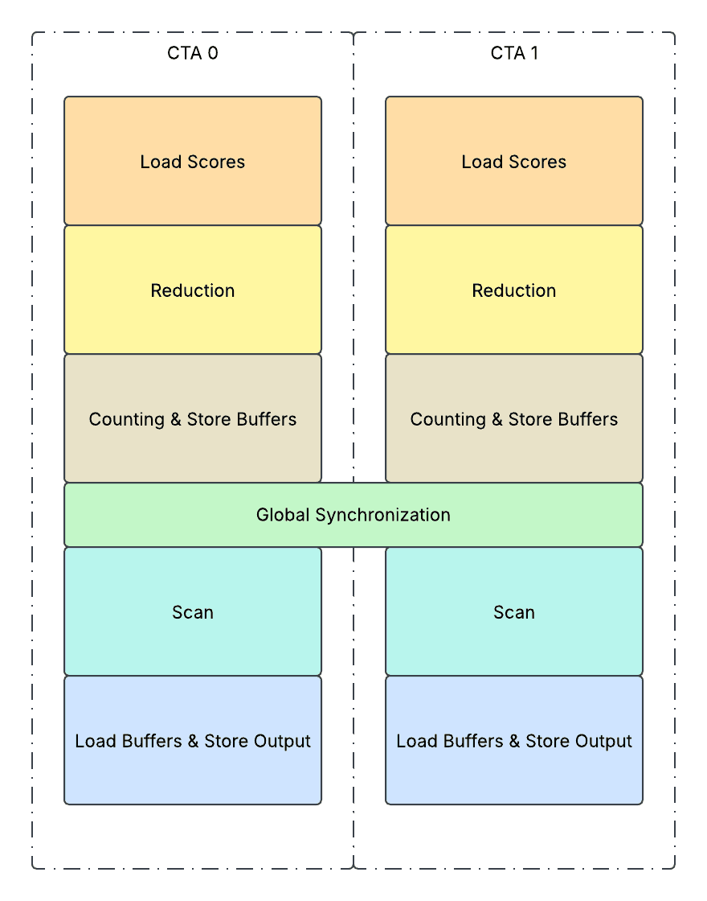


1. 점수 로드:
    - 전역 메모리(HBM)에서 shared memory(SMEM)로 라우팅 점수의 한 tile 로드
    - 동시에 관련 전문가 인덱스도 SMEM에 저장

2. 리덕션:
    - E 차원에서 SMEM에 대해 TopK 리덕션 수행
    - Llama 4 사용 사례의 경우 SMEM의 점수와 관련 전문가 인덱스에 대한 2D 병렬 트리 리덕션을 포함하는 Top1 리덕션으로서 ArgMax 정렬 수행
    - 다양한 트리 리덕션 단계에서:
        - 모든 스레드가 SMEM에서 여러 토큰의 리덕션을 동시에 처리
        - 각 스레드가 SMEM에서 여러 토큰의 리덕션을 순차적으로 처리

3. 카운트 및 버퍼 저장:
    - tile의 모든 토큰 순회
    - SMEM에서 선택된 전문가 인덱스를 가져와 HBM의 버퍼(`buf_expert_index`)에 저장
    - HBM의 출력 카운터(`token_counts`)에 `atomicAdd` 연산 수행
    - 흥미롭게도, `atomicAdd` 연산은 메모리 위치의 이전 값을 반환하며, 이는 그룹 내 토큰의 위치를 나타낸다
    - 이 값을 버퍼(`buf_local_token_index`)에 저장하고 이를 사용하여 모든 토큰 간의 전역 순서를 결정
    - CTA에 할당된 모든 토큰이 처리될 때까지 1-3단계 반복

4. 전역 동기화:
    - HBM의 전역 카운터에 `atomicAdd` 연산 수행
    - 이후 모든 CTA가 전역 카운터가 총 토큰 수에 도달할 때까지 대기
    - `st.release` + `ld.aquire` 배리어를 사용하여 이전 저장 연산과 이후 로드 연산을 보호하여 정확성 보장

5. 스캔:
    - `token_counts`의 단순 로드 및 전치합 수행
    - SMEM에서 `token_counts_cumsums`로 변환

6. 버퍼 로드 및 출력 저장:
    - 이 CTA에 할당된 모든 토큰 순회
    - 각 토큰에 대해:
        - `buf_expert_index`에서 토큰이 할당된 전문가 인덱스 로드
        - 다음 두 항목의 합으로 shuffling 후 새 토큰 인덱스 계산:
            - 이전 전문가에 속하는 토큰 수(SMEM 텐서 `token_counts_cumsums` 사용)
            - 동일한 전문가에 속하는 이전 토큰 수(HBM 텐서 `buf_local_token_index` 사용)
    - 마지막으로 shuffling 후 새 토큰 인덱스 위치에 `expert_indices`와 `token_indices` 출력을 직접 저장


## 성능

### 예시 kernel 성능

테스트 환경은 H100 80GB SMX5 HBM3 700W SKU, Python 3.12, CUDA 12.8을 사용했다. 단일 H100의 이론적 최대 HBM 메모리 대역폭은 3.35 TB/s다.

### 그룹화 GEMM

#### Prefill 성능

아래 표는 Llama 4 Scout과 Maverick 단일 호스트 서빙에서의 이 kernel의 prefill 성능을 보여준다. 실험 설정은 총 토큰 수 16,384과 텐서 병렬 분할을 가정한다.

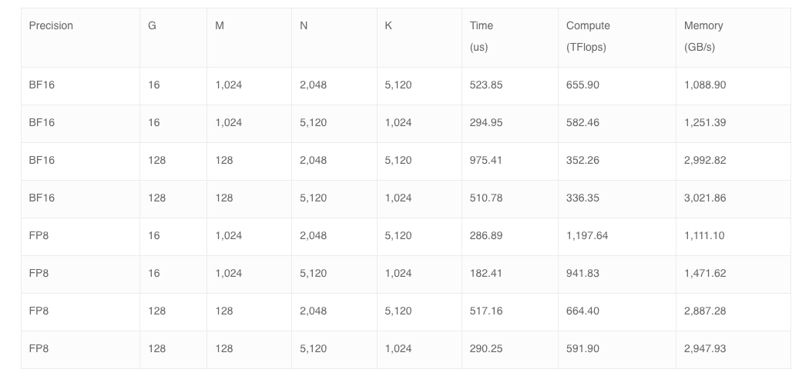

참고: G는 그룹 수, M은 그룹당 토큰 수, N은 그룹당 출력 특징 차원, K는 그룹당 입력 특징 차원. FP8은 빠른 누적을 사용하는 FP8 행 스케일링(활성화의 토큰당 스케일링 및 가중치의 채널당 스케일링). 양자화 kernel은 벤치마크에 포함되지 않음. 스케일링은 메모리 대역폭 계산에 포함되지 않음. rotating buffers와 CUDAGraphs를 사용하여 벤치마크.

#### 디코드 성능

아래 표는 Llama 4 Scout과 Maverick 단일 호스트 서빙에서의 이 kernel의 decode 성능을 보여준다. 실험 설정은 총 토큰 수 128과 텐서 병렬 분할을 가정한다.


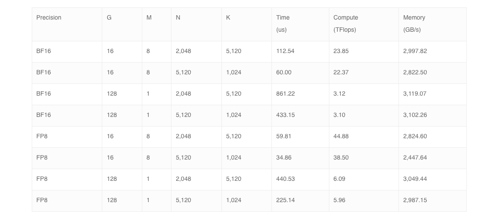


### IndexShuffling

아래 표는 Llama 4 Scout과 Maverick 단일 호스트 서빙에서의 이 kernel의 성능을 네이티브 PyTorch 구현과 비교하여 보여준다.

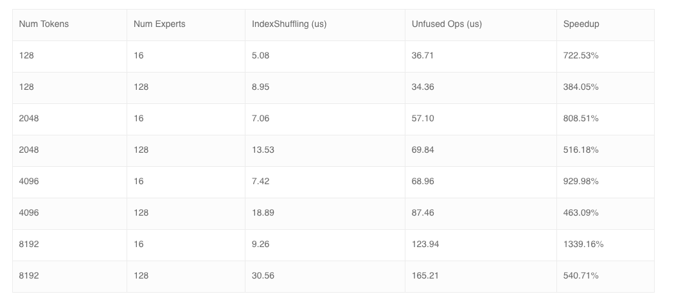

rotating buffers와 CUDAGraphs를 사용하여 벤치마크.

## 예시 Trace 분석

### Llama 4 Scout BF16 디코드

다음은 MetaShuffling MoE 추론 솔루션을 사용하여 64개 토큰에 대한 Llama 4 Scout BF16 디코드의 예시 Trace다.

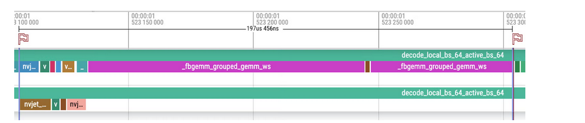


- MoE의 총 메모리 트래픽(활성화 제외):
    - 라우터: 5120x16x2 = 163,840 바이트
    - 공유 전문가: (2048×5120 + 5120×1024)x2=31,457,280 바이트
    - 라우팅 전문가: 16x(2048×5120 + 5120×1024)x2=503,316,480 바이트
    - 총계: 163,840 + 31,457,280 + 503,316,480=534,937,600 바이트
    - MoE의 총 실행 시간은 197.456 마이크로초이며, 달성된 메모리 대역폭은 534,937,600 / (197.456 * 10^-6)=2,709,148,367,231 바이트/초 ~= 2.71 TB/초로, 이는 H100 80GB SMX5 HBM3 이론적 최대 HBM 메모리 대역폭 3.35 TB/초의 80.90%에 해당한다.

다음은 Trace 분석에서 서로 다른 구성 요소의 세부 분석이다.

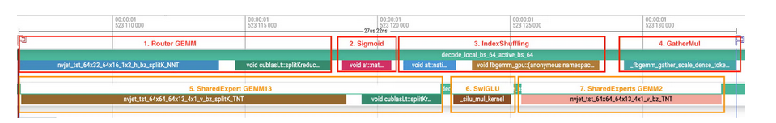


먼저 Router와 Shared Experts의 세부 분석이다. 이 두 구성 요소는 2개의 서로 다른 스트림에서 동시에 실행되어 더 나은 자원 이용률을 달성한다.

Router 스트림(빨간색 박스로 표시)의 경우:
    1. Router GEMM: split-k 설계를 사용하는 CuBLAS 기반 GEMM. 2개의 kernel을 실행하며, 두 번째 kernel은 리덕션 계산에 사용된다.
    2. Sigmoid(Router Activation): PyTorch 네이티브 sigmoid.
    3. IndexShuffling: 협력적 kernel 설계를 사용하는 FBGEMM 기반 인덱스 재정렬. topk, bincount, sort 3개 연산의 융합으로 볼 수 있다. 2개의 kernel을 실행하며, 첫 번째 kernel은 설정용이다.
    4. GatherMul: FBGEMM 기반 gather 스케일링. gather(tokens), gather(scores), mul 3개 연산의 융합으로 볼 수 있다.

공유 전문가 스트림(주황색 박스로 표시)의 경우:

    5. 공유 전문가 GEMM13: split-k 설계를 사용하는 CuBLAS 기반 GEMM. 2개의 kernel을 실행하며, 두 번째 kernel은 리덕션 계산에 사용된다.
    6. SwiGLU: 융합된 SwiGLU. sigmoid와 mul 2개 연산의 융합으로 볼 수 있다.
    7. 공유 전문가 GEMM2: CuBLAS 기반 GEMM.

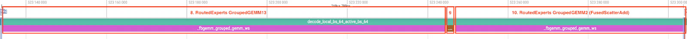


다음은 라우팅 전문가의 세부 분석이다. 이 구성 요소는 GroupedGEMM kernel이 모든 SM을 완전히 점유할 수 있도록 전용 1개 스트림에서 실행된다.

라우팅 전문가 스트림(빨간색 박스로 표시)의 경우:

    8. 라우팅 전문가 GroupedGEMM13: 지속 kernel 설계를 사용하는 FBGEMM 기반 GroupedGEMM.
    9. SwiGLU: 융합된 SwiGLU. 6번과 동일.
    10. 라우팅 전문가 GroupedGEMM2: epilogue에 scatter add가 융합된 지속 kernel 설계를 사용하는 FBGEMM 기반 GroupedGEMM.

디코드 단계는 정적 형상의 조밀 텐서에서 CUDAGraph를 사용하여 실행된다.

### Llama 4 Maverick FP8 Prefill

다음은 **MetaShuffling** MoE 추론 솔루션을 사용하여 5000개 토큰에 대한 Llama 4 Maverick FP8 prefill의 예시 Trace다. 라우팅 전문가의 FP8 행 스케일링과 Router 및 공유 전문가의 BF16 데이터 타입을 주목한다.

디코드 Trace와 비교하여:

- kernel 처리하는 문제 규모가 충분히 커서 계산 자원을 포화시킬 수 있으므로, Router와 공유 전문가 간의 kernel 상호 작용을 피하기 위해 단일 스트림을 사용한다. 추가 겹침은 특히 L2 캐시에서 자원 경쟁만 유발한다.
- kernel 실행 시간이 충분히 길고 디바이스/호스트 동기화가 없으므로, 정적 형상의 조밀 텐서에서 eager 모드로 실행한다. kernel이 버블 없이 연속적으로 실행될 수 있다.

다음은 두 Trace 간의 kernel 차이(실행 시간 제외)를 중점적으로 설명한다:

- Router GEMM과 SharedExpertGEMM13: split-k 설계를 사용하지 않는 CuBLAS 기반 GEMM. 따라서 2개 대신 1개의 kernel만 실행한다.

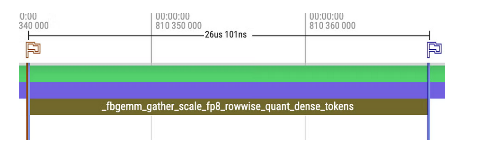


- 4 GatherMul(FP8 행별 양자화): FBGEMM 기반 gather 스케일링과 양자화. gather(tokens), gather(scores), mul, max, divide, mul, clamp, 타입 변환 8개 연산의 융합으로 볼 수 있다.
- 9 SwiGLU(FP8 행별 양자화): 융합된 SwiGLU와 양자화. sigmoid, mul, max, divide, mul, clamp, 타입 변환 7개 연산의 융합으로 볼 수 있다.

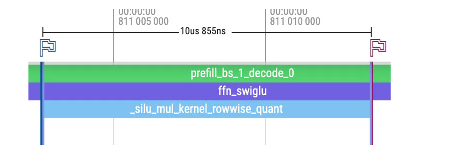

### 핵심 교훈

MoE 솔루션의 추론 성능을 최적화하기 위해 다음 단계를 순차적으로 취했다:

- 호스트와 디바이스 동기화를 피하여 디바이스 수준 이용률 향상.
- 패딩 제거 또는 패딩 처리를 피하여 낭비되는 자원 감소.
- 적극적인 kernel 융합으로 kernel 실행 및 I/O 오버헤드 감소.
- 다양한 kernel 최적화로 계산 및 메모리 효율 향상, 성능을 하드웨어 한계에 근접하게 추진.
- 계산, 메모리 트래픽 또는 네트워크 트래픽 집약적인 kernel의 동시 실행을 통해 하드웨어 구성 요소 수준 이용률 향상, 하지만 동시에 원치 않는 자원 경쟁을 피함.


## 단일 호스트 서빙

내부 **MetaShuffling** MoE 추론 스택을 사용하여 1000개의 무작위 프롬프트로 Llama 4 Maverick과 Llama 4 Scout의 단일 호스트 서빙 성능을 벤치마크했다. Maverick은 FP8로, Scout은 BF16으로 8xH100 호스트에서 최대 배치 크기 64로 실행했다. 설정은 H100 80GB SMX5 HBM3 700W SKU, Python 3.12, CUDA 12.8을 사용했다. 모든 계산 kernel(https://github.com/pytorch/FBGEMM/tree/main/fbgemm_gpu/experimental/gen_ai)과 **MetaShuffling** MoE 추론 스택의 예시 구현(https://github.com/pytorch/FBGEMM/blob/def50a6219d645c809d744f04d4ec2cbe9784620/fbgemm_gpu/experimental/gen_ai/gen_ai/moe/layers.py#L205)을 오픈소스로 공개했다.

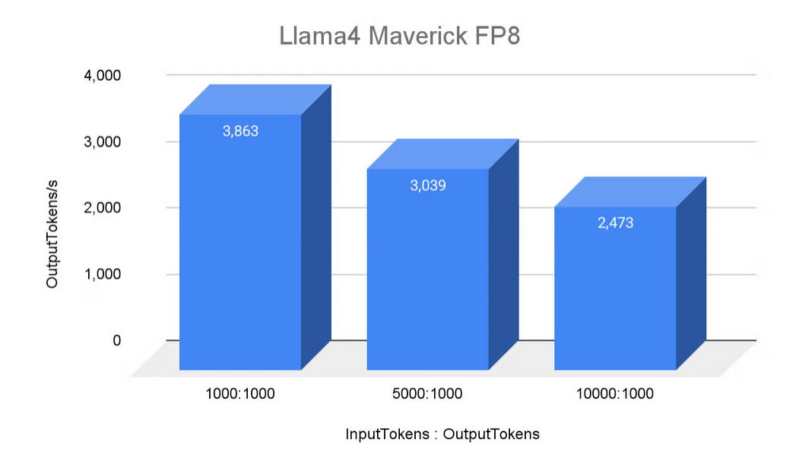

최적의 정밀도를 유지하기 위해 라우팅 전문가에 FP8 정밀도, 어텐션 선형 레이어, 어텐션, 공유 전문가, 라우터, KV cache에 BF16 정밀도를 사용하여 Llama 4 Maverick을 벤치마크했다.

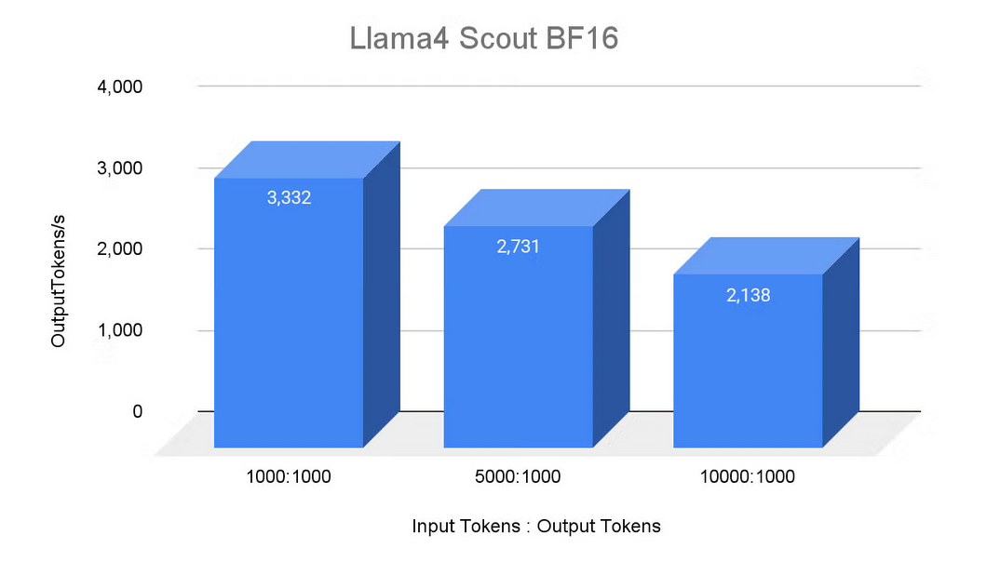


모든 선형 레이어(어텐션 선형 레이어, 공유 전문가, 라우터, 라우팅 전문가), 어텐션, KV cache에 BF16 정밀도를 사용하여 Llama 4 Scout을 벤치마크했다.

마지막으로 커뮤니티가 지속적으로 기록을 경신하고 Llama 4 모델 서빙 효율을 높여 더 나은 수치가 보고되기를 기대한다.


## 감사의 말

Jing Zhang, Ying Zhang, Manman Ren의 기술적 검토와 지도에 감사드린다.

또한 Bradley Davis, Yan Cui, Rengan Xu, Josh Fromm, Jiawen Liu, Sarunya Pumma, Jie Wang, Xinfeng Xie, Benson Ma, Michael Shu, Bingzhe Liu, Jingyi Yang, Min Si, Pavan Balaji, Dhruva Kaushal의 프로젝트 기여에도 감사드린다.


어제의 PyTorch Blog 내용[MetaShuffling: Meta의 Fused MoE kernel 엔지니어링 방안, 더 적극적인 Kernel 최적화와 Padding 최소화](https://mp.weixin.qq.com/s/MdztXkwIzw0ERTOVoCUz3g)에 이어서, fbgemm 오픈소스 moe grouped gemm kernel(https://github.com/pytorch/FBGEMM/tree/main/fbgemm_gpu/experimental/gen_ai)을 복사하여 H100(Hopper)에서 SGLang의 Grouped GEMM Triton Kernel과 정확성 및 성능을 비교했다. 정확성에 문제가 없는 상황에서 성능이 꽤 향상되었다. 세부 내용은 여기에 있다: https://github.com/sgl-project/sglang/pull/6924 . 결론은 fbgemm가 MoE 모델에서 SGLang의 grouped gemm 구현 대비 큰 성능 향상을 달성할 수 있으며, 이 kernel은 fp16/bf16 및 fp8 per-tensor 양자화 조건에서 sglang의 ep-moe grouped gemm kernel에 직접 적용하여 성능을 높일 수 있다. 단 TP 모드의 Triton Fused MoE는 가장 직접적인 Grouped GEMM이 아니므로, 이 Triton 최적화 기법에 따라 kernel을 수정할 사람이 필요하다.

## FBGEMM GroupedGEMM 벤치마크 결과

triton==3.2.0으로 벤치마크를 실행할 때 다음 경고가 발생한다: warp 특화를 사용할 수 없지만 지속 kernel과 TMA load/store는 여전히 사용 가능하다.

```shell
/home/ubuntu/bbuf/sglang/benchmark/kernels/fbgemm/fbgemm_grouped_gemm.py:1104: UserWarning: Warp specialization is disabled as the Triton build in current environment doesn't have such support. Please build from https://github.com/facebookexperimental/triton/tree/ws-3.2.x to enable it for best performance on Nvidia's SM90 GPUs.
```


### Qwen2-57B-A14B-Instruct BF16 W8A8 TP4

```shell
python3 benchmark/kernels/fbgemm/benchmark_fbgemm_grouped_gemm.py --model Qwen/Qwen2-57B-A14B-Instruct --tp-size 4

grouped-gemm-performance:
    batch_size  FBGEMM Grouped GEMM BF16  SGLang Grouped GEMM BF16
0          1.0                  0.032352                  0.022272
1          2.0                  0.032096                  0.022080
2          4.0                  0.032640                  0.021984
3          8.0                  0.031840                  0.021472
4         16.0                  0.030832                  0.021536
5         32.0                  0.032192                  0.021632
6         64.0                  0.393504                  0.595008
7        128.0                  0.393872                  0.598048
8        256.0                  0.394848                  0.589760
9        512.0                  0.397488                  0.605888
10      1024.0                  0.401248                  0.581952
11      2048.0                  0.407232                  0.559232
12      4096.0                  0.416368                  0.717936
```


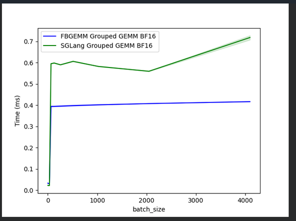


### Qwen2-57B-A14B-Instruct FP8 W8A8 TP4

```
python3 benchmark/kernels/fbgemm/benchmark_fbgemm_grouped_gemm.py --model Qwen/Qwen2-57B-A14B-Instruct --tp-size 4 --use-fp8-w8a8 

    batch_size  FBGEMM Grouped GEMM FP8  SGLang Grouped GEMM FP8
0          1.0                 0.042560                 0.022336
1          2.0                 0.041312                 0.022128
2          4.0                 0.040384                 0.022240
3          8.0                 0.041184                 0.022016
4         16.0                 0.040128                 0.022816
5         32.0                 0.014272                 0.021440
6         64.0                 0.212832                 0.595040
7        128.0                 0.211328                 0.598688
8        256.0                 0.211776                 0.590992
9        512.0                 0.213504                 0.606304
10      1024.0                 0.216864                 0.582624
11      2048.0                 0.220512                 0.558128
12      4096.0                 0.227296                 0.718848
```


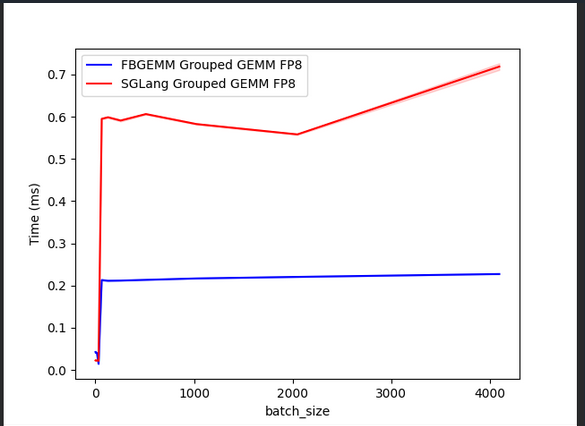


### meta-llama/Llama-4-Scout-17B-16E-Instruct FP16 TP8

```shell
python3 benchmark/kernels/fbgemm/benchmark_fbgemm_grouped_gemm.py --model meta-llama/Llama-4-Scout-17B-16E-Instruct --tp-size 8 

grouped-gemm-performance:
    batch_size  FBGEMM Grouped GEMM BF16  SGLang Grouped GEMM BF16
0          1.0                  0.034592                  0.022816
1          2.0                  0.033440                  0.022016
2          4.0                  0.033984                  0.022400
3          8.0                  0.324592                  0.532960
4         16.0                  0.321024                  0.516960
5         32.0                  0.322736                  0.695840
6         64.0                  0.321184                  0.607008
7        128.0                  0.321264                  0.475136
8        256.0                  0.321984                  0.419232
9        512.0                  0.325728                  0.363392
10      1024.0                  0.339616                  0.693824
11      2048.0                  0.396928                  1.383792
12      4096.0                  0.732640                  2.761792
```


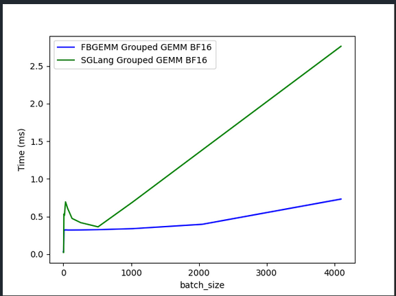


### meta-llama/Llama-4-Scout-17B-16E-Instruct FP8 TP8

```shell
python3 benchmark/kernels/fbgemm/benchmark_fbgemm_grouped_gemm.py --model meta-llama/Llama-4-Scout-17B-16E-Instruct --tp-size 8 --use-fp8-w8a8

grouped-gemm-performance:
    batch_size  FBGEMM Grouped GEMM FP8  SGLang Grouped GEMM FP8
0          1.0                 0.042336                 0.020592
1          2.0                 0.006464                 0.013536
2          4.0                 0.006464                 0.014112
3          8.0                 0.171712                 0.531744
4         16.0                 0.170944                 0.518208
5         32.0                 0.170432                 0.693952
6         64.0                 0.172704                 0.608352
7        128.0                 0.173248                 0.475200
8        256.0                 0.175040                 0.420544
9        512.0                 0.178400                 0.367200
10      1024.0                 0.196736                 0.697968
11      2048.0                 0.230688                 1.385600
12      4096.0                 0.383872                 2.766432
```


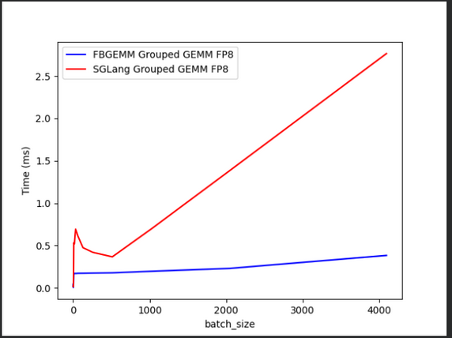


결론은 FBGEMM가 SGLang의 grouped GEMM 구현 대비 MoE 모델에서 유의미한 성능 향상을 달성할 수 있다는 것이다. 이 kernel은 fp16/bf16 및 per-tensor 양자화 fp8 조건에서 SGLang의 EP-MoE grouped GEMM kernel에 직접 적용하여 성능을 높일 수 있다.

## 한계

현재 한계는 Meta 특정 Triton 버전을 컴파일하지 않으면 warp 특화 kernel을 사용하기 어렵다는 점이다. 또한 이 kernel은 현재 fp16/bf16 및 per-tensor 양자화 fp8 w8a8만 지원하며 — DeepSeek와의 호환성을 위해서는 추가 수정이 필요하다.


