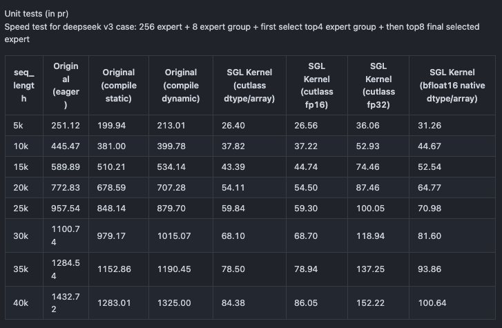
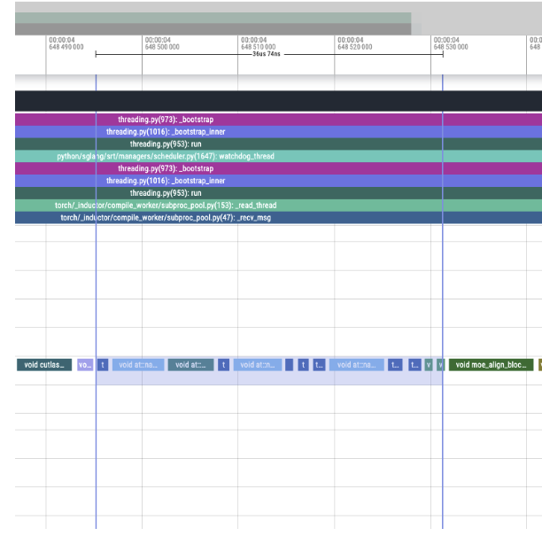
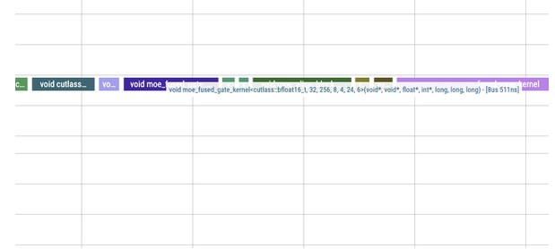

# 그림으로 보는 DeepSeek V3 biased_grouped_topk CUDA fused_moe_gate kernel

## 0x0. 머리말

관련 내용소개관련 내용개에서SGLang중대상으로DeepSeek V3모델중의 https://github.com/sgl-project/sglang/blob/main/python/sglang/srt/layers/moe/topk.py#L99-L149 부분의 `biased_grouped_topk` 함수의kernel최적화，에서DeepSeek V3end-to-end테스트중throughput향상5%로상。이함수사용된다DeepSeek V3/R1모델중의MOElayer，사용된다계산각개token의expert선택확률。와 비교하면Mixtral，Qwen2관련 내용 (MoE)모델의topk구현，DeepSeek V3이 부분은 원문의 해당 기술 설명을 이어서 서술한다 (grouped_topk)의관련 내용각개token만가능선택관련 내용개수의expert관련 내용그다음각개expert관련 내용다시선택topk개expert。아래이다이함수의관련 내용


```python3
# 입력텐서차원설명：
# hidden_states: [num_token,...]  # 관련 내용차원관련 내용모델관련 내용
# gating_output: [num_token, num_experts]  # num_experts반드시가능이 부분은 원문의 해당 기술 설명을 이어서 서술한다 (num_expert_group)
# correction_bias: [num_experts]  # 사용된다이 부분은 원문의 해당 기술 설명을 이어서 서술한다 (gating)출력의bias관련 내용
# 여기서：
# - num_token: batch중의token개수
# - num_experts: expert총수，반드시가능이 부분은 원문의 해당 기술 설명을 이어서 서술한다 (num_expert_group)
# - num_expert_group: expert관련 내용의개수
# - topk: 각개token관련 내용선택의expert개수
# - topk_group: 각개token관련 내용선택의expert관련 내용개수
# 제약 조건：
# - topk_group <= num_expert_group
# - topk <= num_experts
# - num_experts % num_expert_group == 0

def biased_grouped_topk_impl(
    hidden_states: torch.Tensor,      # 입력의hidden state텐서
    gating_output: torch.Tensor,      # gating관련 내용의출력，사용된다계산expert선택확률
    correction_bias: torch.Tensor,    # 사용된다이 부분은 원문의 해당 기술 설명을 이어서 서술한다 (gating)출력의bias관련 내용
    topk: int,                        # 각개token선택의expert개수
    renormalize: bool,                # 여부대해선택의expertweight수행한다관련 내용새정규화
    num_expert_group: int = 0,        # expert관련 내용의개수
    topk_group: int = 0,              # 각개token선택의expert관련 내용개수
):
    # 보장입력token개수관련 내용
    assert hidden_states.shape[0] == gating_output.shape[0], "Number of tokens mismatch"

    # 대해gating출력수행한다sigmoid관련 내용까지expert선택확률
    scores = gating_output.sigmoid()
    num_token = scores.shape[0]       # 얻는다token개수
    num_experts = scores.shape[1]     # 얻는다expert총수
    
    # 할 것이다scores관련 내용그리고추가이 부분은 원문의 해당 기술 설명을 이어서 서술한다 (bias)
    scores_for_choice = scores.view(num_token, -1) + correction_bias.unsqueeze(0)
    
    # 계산각개expert관련 내용의score：
    # 1. 할 것이다scores관련 내용로[num_token, num_expert_group, experts_per_group]
    # 2. 에서각개관련 내용선택top2의score
    # 3. 대해각개관련 내용의top2score관련 내용와，관련 내용까지이 부분은 원문의 해당 기술 설명을 이어서 서술한다 (score)
    group_scores = (
        scores_for_choice.view(num_token, num_expert_group, -1)
.topk(2, dim=-1)[0]
.sum(dim=-1)
    )  # [n, n_group]
    
    # 선택score관련 내용높은의topk_group개expert관련 내용
    group_idx = torch.topk(group_scores, k=topk_group, dim=-1, sorted=False)[1]  # [n, top_k_group]
    
    # 생성한다이 부분은 원문의 해당 기술 설명을 이어서 서술한다 (mask)중의관련 내용
    group_mask = torch.zeros_like(group_scores)  # [n, n_group]
    group_mask.scatter_(1, group_idx, 1)  # [n, n_group]
    
    # 이 부분은 원문의 해당 기술 설명을 이어서 서술한다 (mask)까지expert관련 내용
    score_mask = (
        group_mask.unsqueeze(-1)
.expand(num_token, num_expert_group, scores.shape[-1] // num_expert_group)
.reshape(num_token, -1)
    )  # [n, e]
    
    # 할 것이다관련 내용중관련 내용의expertscore관련 내용로관련 내용없음관련 내용
    tmp_scores = scores_for_choice.masked_fill(
        ~score_mask.bool(), float("-inf")
    )  # [n, e]
    
    # 에서관련 내용중의expert관련 내용중선택topk개expert
    _, topk_ids = torch.topk(tmp_scores, k=topk, dim=-1, sorted=False)
    # 얻는다관련 내용중expert의원본score관련 내용로weight
    topk_weights = scores.gather(1, topk_ids)

    # 만약관련 내용새정규화，대해관련 내용중의expertweight수행한다정규화관련 내용
    if renormalize:
        topk_weights_sum = topk_weights.sum(dim=-1, keepdim=True)
        topk_weights = topk_weights / topk_weights_sum

    # 반환한다정규화후의weight와관련 내용중의expertID
    return topk_weights.to(torch.float32), topk_ids.to(torch.int32)


```

없음관련 내용이다vLLM관련 내용이다SGLang모두이다통해torch.compile와서대해이함수수행한다최적화，관련 내용사용torch.compile의이 부분은 원문의 해당 기술 설명을 이어서 서술한다이다시작관련 내용의관련 내용큰큰관련 내용그리고이 부분은 원문의 해당 기술 설명을 이어서 서술한다 (torch.compile)최적화후의성능와 비교하면관련 내용사용CUDA구현관련 내용이다있다관련 내용의차이관련 내용왜냐하면관련 내용및까지topk와gather관련 내용의operator，그리고아니가능대해이operator하다관련 내용의fuse 。관련 내용할 것이다소개관련 내용하 SGLang 중대상으로이함수의CUDA kernel fuse구현，PR로：https://github.com/sgl-project/sglang/pull/4530 。

## 0x1. 성능테스트

### kernel PR의테스트 (https://github.com/sgl-project/sglang/pull/4530)



여기의`seq_length`관련 내용이다위의`num_tokens`，관련 내용`bs=1`。부터여기의결과와서보다，에서아니관련 내용의token관련 내용하，CUDA kernel fuse후의성능와 비교하면`torch.compile`의버전모두있다개수관련 내용의관련 내용

아래의테스트와서관련 내용https://github.com/sgl-project/sglang/pull/5371

### torch profile

```shell
python3 -m sglang.bench_serving --backend sglang --num-prompts 2 --request-rate 1 --port 30001 --flush-cache --warmup-requests 1 --profile
```

#### 관련 내용



#### 이 부분은 원문의 해당 기술 설명을 이어서 서술한다 (moe_fused_gate kernel)후의관련 내용




관련 내용에서만있다관련 내용개kernel。

36us->8us.

### 이 부분은 원문의 해당 기술 설명을 이어서 서술한다 (moe_fused_gate kernel)후의DeepSeek V3모델H200end-to-end테스트


```shell
SGL_ENABLE_JIT_DEEPGEMM=0 python3 -m sglang.launch_server --model /DeepSeek-V3 --tp 8 --trust-remote-code --port 30001
python3 -m sglang.bench_serving --backend sglang --num-prompts 300 --request-rate 1 --port 30001 --flush-cache --warmup-requests 20
```

|qps|Input token throughput (tok/s)|Output token throughput (tok/s)|Total token throughput (tok/s)|
|---|---|---|---|
|4(main)| 719.99| 456.44| 1176.43|
|4(pr)  | 763.11| 483.77| 1246.88|
|8(main)| 840.96| 533.13| 1374.09|
|8(pr)  | 887.35| 562.54| 1449.89|
|16(main)| 892.55| 565.83| 1458.38|
|16(pr)  | 964.91| 611.70| 1576.61|


- qps=4: 5.9%+
- qps=8: 5.5%+
- qps=16: 8.1%+


## 0x2. moe_fused_gate kernel 관련 내용읽다

코드링크：https://github.com/sgl-project/sglang/blob/main/sgl-kernel/csrc/moe/moe_fused_gate.cu

### 0x2.1 Host관련 내용코드와thread모델

```c++
//------------------------------------------------------------------------------
// Host관련 내용시작함수
//------------------------------------------------------------------------------
std::vector<at::Tensor>
moe_fused_gate(at::Tensor& input, at::Tensor& bias, int64_t num_expert_group, int64_t topk_group, int64_t topk) {
  // 얻는다입력텐서의차원관련 내용
  int64_t num_rows = input.size(0);    // token개수
  int32_t num_experts = input.size(1); // expert총수
  
  // 생성한다출력텐서，사용된다이 부분은 원문의 해당 기술 설명을 이어서 서술한다 (weight)와인덱스
  auto options = torch::TensorOptions().dtype(torch::kFloat32).device(torch::kCUDA);
  auto output = torch::empty({num_rows, topk}, options);           // 관련 내용중의expertweight
  auto indices = torch::empty({num_rows, topk}, options.dtype(torch::kInt32)); // 관련 내용중의expert인덱스

  // 이 부분은 원문의 해당 기술 설명을 이어서 서술한다 (num_expert_group)계산관련 내용차원
  // 각개warp관련 내용의row이 부분은 원문의 해당 기술 설명을 이어서 서술한다 (= max WARP_SIZE / num_expert_group), 1)
  int64_t rows_per_warp = std::max<int64_t>(1, WARP_SIZE / num_expert_group);
  int64_t num_warps = (num_rows + rows_per_warp - 1) / rows_per_warp;  // 관련 내용의warp개수
  int64_t num_blocks = (num_warps + WARPS_PER_CTA - 1) / WARPS_PER_CTA; // 관련 내용의block개수
  
  // 얻는다현재CUDA관련 내용
  const cudaStream_t stream = at::cuda::getCurrentCUDAStream();
  // 이 부분은 원문의 해당 기술 설명을 이어서 서술한다 (block)차원：각개block이 부분은 원문의 해당 기술 설명을 이어서 서술한다 (WARPS_PER_CTA)* WARP_SIZE개thread，WARPS_PER_CTA개warp
  dim3 block_dim(WARP_SIZE, WARPS_PER_CTA);

  // 관련 내용 (1)보장expert개수이다2의관련 내용
  TORCH_CHECK((num_experts & (num_experts - 1)) == 0, "num_experts must be a power of 2, but got ", num_experts);

  // 관련 내용 (2)보장expert개수가능이 부분은 원문의 해당 기술 설명을 이어서 서술한다 (expert)개수관련 내용도이 부분은 원문의 해당 기술 설명을 이어서 서술한다 (expert)개수반드시이다2의관련 내용
  TORCH_CHECK(
      num_experts % num_expert_group == 0,
      "num_experts must be divisible by num_expert_group, but got ",
      num_experts,
      " / ",
      num_expert_group);

  // 계산각개관련 내용의expert개수
  int computed_vpt = num_experts / num_expert_group;
  // 관련 내용 (3)보장각개관련 내용의expert개수아니이 부분은 원문의 해당 기술 설명을 이어서 서술한다 (MAX_VPT=32)
  // MAX_VPT관련 내용각개thread가능관련 내용의관련 내용큰관련 내용
  TORCH_CHECK(
      computed_vpt <= MAX_VPT,
      "Per group experts: num_experts / num_expert_group = (",
      computed_vpt,
      ") exceeds the maximum supported (",
      MAX_VPT,
      ")");

  // 관련 내용의컴파일관련 내용설정관련 내용까지관련 내용의kernel
  // 현재관련 내용지원로하관련 내용
  // 이 부분은 원문의 해당 기술 설명을 이어서 서술한다 (1 256)개expert，8또는16개관련 내용
  // 이 부분은 원문의 해당 기술 설명을 이어서 서술한다 (2 128)개expert，4또는8개관련 내용
  // 이 부분은 원문의 해당 기술 설명을 이어서 서술한다 (3 8 <= num_experts / num_expert_group <= 32)
  bool dispatched = false;
  switch (num_experts) {
    case 256:
      if (num_expert_group == 8)
        // DeepSeek V3의관련 내용
        // VPT = 256/8 = 32, ROWS_PER_WARP = 32/8 = 4, ROWS_PER_CTA = 6 * 4 = 24
        if (input.scalar_type() == at::kBFloat16) {
          LAUNCH_MOE_GATE_CONFIG(bfloat16_t, 256, 8);
        } else if (input.scalar_type() == at::kHalf) {
          LAUNCH_MOE_GATE_CONFIG(float16_t, 256, 8);
        } else if (input.scalar_type() == at::kFloat) {
          LAUNCH_MOE_GATE_CONFIG(float32_t, 256, 8);
        } else if (num_expert_group == 16)
          // VPT = 256/16 = 16, ROWS_PER_WARP = 32/16 = 2, ROWS_PER_CTA = 6 * 2 = 12
          if (input.scalar_type() == at::kBFloat16) {
            LAUNCH_MOE_GATE_CONFIG(bfloat16_t, 256, 16);
          } else if (input.scalar_type() == at::kHalf) {
            LAUNCH_MOE_GATE_CONFIG(float16_t, 256, 16);
          } else if (input.scalar_type() == at::kFloat) {
            LAUNCH_MOE_GATE_CONFIG(float32_t, 256, 16);
          }
      break;
    case 128:
      if (num_expert_group == 4)
        // VPT = 128/4 = 32, ROWS_PER_WARP = 32/16 = 2, ROWS_PER_CTA = 6 * 2 = 12
        if (input.scalar_type() == at::kBFloat16) {
          LAUNCH_MOE_GATE_CONFIG(bfloat16_t, 128, 4);
        } else if (input.scalar_type() == at::kHalf) {
          LAUNCH_MOE_GATE_CONFIG(float16_t, 128, 4);
        } else if (input.scalar_type() == at::kFloat) {
          LAUNCH_MOE_GATE_CONFIG(float32_t, 128, 4);
        } else if (num_expert_group == 8)
          // VPT = 128/8 = 16, ROWS_PER_WARP = 32/8 = 4, ROWS_PER_CTA = 6 * 4 = 24
          if (input.scalar_type() == at::kBFloat16) {
            LAUNCH_MOE_GATE_CONFIG(bfloat16_t, 128, 8);
          } else if (input.scalar_type() == at::kHalf) {
            LAUNCH_MOE_GATE_CONFIG(float16_t, 128, 8);
          } else if (input.scalar_type() == at::kFloat) {
            LAUNCH_MOE_GATE_CONFIG(float32_t, 128, 8);
          }
      break;
    default:
      break;
  }
  
  // 만약관련 내용있다관련 내용까지관련 내용의설정，관련 내용사용이 부분은 원문의 해당 기술 설명을 이어서 서술한다 (kernel)
  // 현재이 부분은 원문의 해당 기술 설명을 이어서 서술한다 (kernel)지원num_experts / num_expert_group <= 32의관련 내용
  if (!dispatched) {
    if (input.scalar_type() == at::kBFloat16) {
      moe_fused_gate_kernel_dynamic<bfloat16_t><<<num_blocks, block_dim, 0, stream>>>(
          input.data_ptr(),
          bias.data_ptr(),
          output.data_ptr<float>(),
          indices.data_ptr<int32_t>(),
          num_rows,
          num_experts,
          num_expert_group,
          topk_group,
          topk);
    } else if (input.scalar_type() == at::kHalf) {
      moe_fused_gate_kernel_dynamic<float16_t><<<num_blocks, block_dim, 0, stream>>>(
          input.data_ptr(),
          bias.data_ptr(),
          output.data_ptr<float>(),
          indices.data_ptr<int32_t>(),
          num_rows,
          num_experts,
          num_expert_group,
          topk_group,
          topk);
    } else if (input.scalar_type() == at::kFloat) {
      moe_fused_gate_kernel_dynamic<float32_t><<<num_blocks, block_dim, 0, stream>>>(
          input.data_ptr(),
          bias.data_ptr(),
          output.data_ptr<float>(),
          indices.data_ptr<int32_t>(),
          num_rows,
          num_experts,
          num_expert_group,
          topk_group,
          topk);
    } else {
      TORCH_CHECK(false, "Unsupported data type for moe_fused_gate");
    }
  }
  return {output, indices};
}
```

이 부분은 원문의 해당 기술 설명을 이어서 서술한다 (Host)의코드로및kernel관련 내용의관련 내용우리는가능로관련 내용와서thread모델。

```c++
static constexpr int WARP_SIZE = 32;  // 각개warp관련 내용 (32)개thread
static constexpr int WARPS_PER_CTA = 6;  // 각개block있다6개warp

dim3 block_dim(WARP_SIZE, WARPS_PER_CTA);  // block차원로(32, 6)
int64_t rows_per_warp = std::max<int64_t>(1, WARP_SIZE / num_expert_group);  // 각개warp관련 내용의row관련 내용
int64_t num_warps = (num_rows + rows_per_warp - 1) / rows_per_warp;  // 관련 내용의warp관련 내용
int64_t num_blocks = (num_warps + WARPS_PER_CTA - 1) / WARPS_PER_CTA;  // 관련 내용의block관련 내용
```

thread모델관련 내용로：

```c++
Grid관련 내용 (:)
+------------------------+
|  Block 0   Block 1    |  
|  +------+  +------+   |
|  |      |  |      |   |
|  |      |  |      |   |... 더많은Block
|  |      |  |      |   |  (num_blocks개Block)
|  +------+  +------+   |
|                       |
+------------------------+

Block이 부분은 원문의 해당 기술 설명을 이어서 서술한다 (dim3 32),6)):
+--------------------------------+
|  Warp 0  (32개thread)            |
|  +----------------------------+ |
|  |t0 t1 t2... t31          | |
|  +----------------------------+ |
|  Warp 1                        |
|  +----------------------------+ |
|  |t32 t33 t34... t63       | |
|  +----------------------------+ |
|...                  |
|  Warp 5                        |
|  +----------------------------+ |
|  |t160 t161... t191        | |
|  +----------------------------+ |
+--------------------------------+

이 부분은 원문의 해당 기술 설명을 이어서 서술한다 (:)
- 각개Block이 부분은 원문의 해당 기술 설명을 이어서 서술한다 (ROWS_PER_CTA = WARPS_PER_CTA)* ROWS_PER_WARP row관련 내용
- 각개Warp이 부분은 원문의 해당 기술 설명을 이어서 서술한다 (ROWS_PER_WARP = WARP_SIZE/num_expert_group row)
- 각개thread이 부분은 원문의 해당 기술 설명을 이어서 서술한다 (VPT = num_experts/num_expert_group)개expert（각개thread관련 내용개group관련 내용의experts_per_group개expert）
```

로DeepSeek V3로이 부분은 원문의 해당 기술 설명을 이어서 서술한다 (num_experts=256), num_expert_group=8)：
- VPT = 256/8 = 32：각개thread관련 내용 (32)개expert
- ROWS_PER_WARP = 32/8 = 4：각개warp이 부분은 원문의 해당 기술 설명을 이어서 서술한다 (4row)
- ROWS_PER_CTA = 6 * 4 = 24：각개block이 부분은 원문의 해당 기술 설명을 이어서 서술한다 (24row)

### 0x2.2 dispatch 의2이 부분은 원문의 해당 기술 설명을 이어서 서술한다 (kernel)인터페이스

```c++
//------------------------------------------------------------------------------
// 이 부분은 원문의 해당 기술 설명을 이어서 서술한다 (Kernel)버전(관련 내용사용컴파일관련 내용
//------------------------------------------------------------------------------
// 이 부분은 원문의 해당 기술 설명을 이어서 서술한다 (kernel)파라미터이 부분은 원문의 해당 기술 설명을 이어서 서술한다있다파라미터모두이다컴파일관련 내용
template <int VPT_, int NUM_EXPERTS_, int THREADS_PER_ROW_, int ROWS_PER_WARP_, int ROWS_PER_CTA_, int WARPS_PER_CTA_>
struct KernelParams {
  static constexpr int VPT = VPT_;                    // 각개thread관련 내용의expert개수(Values Per Thread)
  static constexpr int NUM_EXPERTS = NUM_EXPERTS_;     // 이 부분은 원문의 해당 기술 설명을 이어서 서술한다 (expert)개수
  static constexpr int THREADS_PER_ROW = THREADS_PER_ROW_; // 관련 내용각row관련 내용의thread이 부분은 원문의 해당 기술 설명을 이어서 서술한다 (expert)개수
  static constexpr int ROWS_PER_WARP = ROWS_PER_WARP_;    // 각개warp관련 내용의row관련 내용
  static constexpr int ROWS_PER_CTA = ROWS_PER_CTA_;      // 각개CTA(block)관련 내용의row관련 내용
  static constexpr int WARPS_PER_CTA = WARPS_PER_CTA_;    // 각개CTA관련 내용의warp개수
};

// 관련 내용의kernel함수관련 내용
template <
    typename T,           // 이 부분은 원문의 해당 기술 설명을 이어서 서술한다 (float/half/bfloat16)
    int VPT,             // 각thread관련 내용의expert관련 내용
    int NUM_EXPERTS,     // 이 부분은 원문의 해당 기술 설명을 이어서 서술한다 (expert)
    int THREADS_PER_ROW, // 각row관련 내용의thread관련 내용
    int ROWS_PER_WARP,   // 각warp관련 내용의row관련 내용
    int ROWS_PER_CTA,    // 각block관련 내용의row관련 내용
    int WARPS_PER_CTA>   // 각block의warp관련 내용
__global__ void moe_fused_gate_kernel(
    void* input,         // 입력텐서
    void* bias,          // bias텐서
    float* output_ptr,   // 출력weight
    int32_t* indices_ptr,// 출력expert인덱스
    int64_t num_rows,    // 이 부분은 원문의 해당 기술 설명을 이어서 서술한다 (row token)개수)
    int64_t topk_group,  // 각개token선택의expert관련 내용개수
    int64_t topk) {      // 각개token선택의expert개수
  // 관련 내용컴파일관련 내용파라미터관련 내용
  KernelParams<VPT, NUM_EXPERTS, THREADS_PER_ROW, ROWS_PER_WARP, ROWS_PER_CTA, WARPS_PER_CTA> params;
  // 호출한다구현함수
  moe_fused_gate_impl<T>(input, bias, output_ptr, indices_ptr, num_rows, topk_group, topk, params);
}

// 사용된다시작kernel의관련 내용계산컴파일관련 내용그리고시작kernel
#define LAUNCH_MOE_GATE_CONFIG(T, EXPERTS, EXPERT_GROUP)                                                 \
  do {                                                                                                   \
    // 계산각개thread관련 내용의expert개수                                                                          
    constexpr int VPT = (EXPERTS) / (EXPERT_GROUP);                                                      \
    // 만약expert관련 내용개수큰이 부분은 원문의 해당 기술 설명을 이어서 서술한다 (WARP_SIZE)각개warp만이 부분은 원문의 해당 기술 설명을 이어서 서술한다 (1row)계산각개warp가능로관련 내용의row관련 내용
    constexpr int ROWS_PER_WARP = ((EXPERT_GROUP) <= WARP_SIZE)? (WARP_SIZE / (EXPERT_GROUP)): 1;      \
    // 계산각개block가능로관련 내용의이 부분은 원문의 해당 기술 설명을 이어서 서술한다 (row)
    constexpr int ROWS_PER_CTA = WARPS_PER_CTA * ROWS_PER_WARP;                                          \
    // 시작kernel                                                                                         
    moe_fused_gate_kernel<T, VPT, (EXPERTS), (EXPERT_GROUP), ROWS_PER_WARP, ROWS_PER_CTA, WARPS_PER_CTA> \
        <<<num_blocks, block_dim, 0, stream>>>(                                                          \
            input.data_ptr(),                                                                            \
            bias.data_ptr(),                                                                             \
            output.data_ptr<float>(),                                                                    \
            indices.data_ptr<int32_t>(),                                                                 \
            num_rows,                                                                                    \
            topk_group,                                                                                  \
            topk);                                                                                       \
    dispatched = true;                                                                                   \
  } while (0)

//------------------------------------------------------------------------------
// 이 부분은 원문의 해당 기술 설명을 이어서 서술한다 (Kernel)버전(이 부분은 원문의 해당 기술 설명을 이어서 서술한다 (row)계산파라미터)
//------------------------------------------------------------------------------
// 이 부분은 원문의 해당 기술 설명을 이어서 서술한다 (row)파라미터관련 내용
struct KernelParamsDynamic {
  int VPT;              // 각thread관련 내용의expert관련 내용
  int NUM_EXPERTS;      // 이 부분은 원문의 해당 기술 설명을 이어서 서술한다 (expert)
  int THREADS_PER_ROW;  // 각row관련 내용의thread관련 내용
  int ROWS_PER_WARP;    // 각warp관련 내용의row관련 내용
  int ROWS_PER_CTA;     // 각block관련 내용의row관련 내용
  int WARPS_PER_CTA;    // 각block의warp관련 내용
};

// 관련 내용파라미터버전의kernel함수
template <typename T>
__global__ void moe_fused_gate_kernel_dynamic(
    void* input,
    void* bias,
    float* output_ptr,
    int32_t* indices_ptr,
    int64_t num_rows,
    int64_t num_experts,      // 이 부분은 원문의 해당 기술 설명을 이어서 서술한다 (row)의expert개수
    int64_t num_expert_group, // 이 부분은 원문의 해당 기술 설명을 이어서 서술한다 (row)의expert관련 내용개수
    int64_t topk_group,
    int64_t topk) {
  KernelParamsDynamic params;
  // 이 부분은 원문의 해당 기술 설명을 이어서 서술한다 (row)계산관련 내용있다파라미터
  params.NUM_EXPERTS = num_experts;             // 이 부분은 원문의 해당 기술 설명을 이어서 서술한다 (deepseek v3)중이다256
  params.VPT = num_experts / num_expert_group;  // 이 부분은 원문의 해당 기술 설명을 이어서 서술한다 (deepseek v3)중이다256/8=32
  params.THREADS_PER_ROW = num_expert_group;    // 관련 내용로expert관련 내용개수，이 부분은 원문의 해당 기술 설명을 이어서 서술한다 (deepseek v3)중이다8
  params.WARPS_PER_CTA = WARPS_PER_CTA;        // 관련 내용로6
  params.ROWS_PER_WARP = std::max<int64_t>(1, WARP_SIZE / num_expert_group);  // WARP_SIZE관련 내용로32
  params.ROWS_PER_CTA = params.WARPS_PER_CTA * params.ROWS_PER_WARP;

  // 호출한다구현함수
  moe_fused_gate_impl<T>(input, bias, output_ptr, indices_ptr, num_rows, topk_group, topk, params);
}
```

여기있다2개kernel，관련 내용개이다관련 내용의kernel，관련 내용개이다관련 내용의kernel。관련 내용의kernel에서컴파일관련 내용된다계산관련 내용있다파라미터，그다음시작kernel。관련 내용의kernel에서이 부분은 원문의 해당 기술 설명을 이어서 서술한다 (row)계산관련 내용있다파라미터，그다음시작kernel。관련 내용 (2)개kernel모두관련 내용상관련 내용소개의thread모델，관련 내용각개thread관련 내용개수의expert(VPT)，많은개thread관련 내용개관련 내용와서이 부분은 원문의 해당 기술 설명을 이어서 서술한다 (row THREADS_PER_ROW)많은개thread관련 내용개warp，많은개warp관련 내용개block(CTA)。

### 0x2.3 관련 내용함수와관련 내용

```c++
// 관련 내용사용CUTLASS관련 내용의AlignedArray관련 내용로정렬배열의관련 내용
template <typename T, int N>
using AlignedArray = cutlass::AlignedArray<T, N>;

// 관련 내용사용이 부분은 원문의 해당 기술 설명을 이어서 서술한다
using bfloat16_t = cutlass::bfloat16_t;  // brain floating point 16관련 내용
using float16_t = cutlass::half_t;        // IEEE 754 half precision 16관련 내용
using float32_t = float;                  // 이 부분은 원문의 해당 기술 설명을 이어서 서술한다 (32)

// 관련 내용함수：관련 내용아니이 부분은 원문의 해당 기술 설명을 이어서 서술한다의큰관련 내용
// 이 부분은 원문의 해당 기술 설명을 이어서 서술한다 (at::Half)왜냐하면관련 내용의이 부분은 원문의 해당 기술 설명을 이어서 서술한다된다관련 내용
template <typename T>
__device__ inline bool cmp_gt(const T& a, const T& b) {
  if constexpr (std::is_same<T, at::Half>::value) {
    // 대해이 부분은 원문의 해당 기술 설명을 이어서 서술한다 (at::Half)로float다시이 부분은 원문의 해당 기술 설명을 이어서 서술한다
    return static_cast<float>(a) > static_cast<float>(b);
  } else {
    // 대해이 부분은 원문의 해당 기술 설명을 이어서 서술한다 (float), BFloat16, half_t이 부분은 원문의 해당 기술 설명을 이어서 서술한다사용관련 내용의>관련 내용
    return a > b;
  }
}

// 관련 내용함수：관련 내용아니이 부분은 원문의 해당 기술 설명을 이어서 서술한다의관련 내용
template <typename T>
__device__ inline bool cmp_eq(const T& a, const T& b) {
  if constexpr (std::is_same<T, at::Half>::value) {
    // 대해이 부분은 원문의 해당 기술 설명을 이어서 서술한다 (at::Half)로float다시관련 내용
    return static_cast<float>(a) == static_cast<float>(b);
  } else {
    // 이 부분은 원문의 해당 기술 설명을 이어서 서술한다사용==관련 내용
    return a == b;
  }
}

// 관련 내용있다kernel관련 내용사용의관련 내용
static constexpr int WARP_SIZE = 32;       // CUDA warp크기，관련 내용로32개thread
static constexpr int WARPS_PER_CTA = 6;    // 각개CTA(block)관련 내용 (6)개warp
static constexpr int MAX_VPT = 32;         // 각개thread관련 내용많은관련 내용 (32)개expert관련 내용
                                          // 반드시큰이 부분은 원문의 해당 기술 설명을 이어서 서술한다 (params.VPT num_expert/num_expert_group)

// 생성한다Array이 부분은 원문의 해당 기술 설명을 이어서 서술한다사용AlignedArray보장관련 내용정렬
template <typename T, int N>
using Array = AlignedArray<T, N>;

// 이 부분은 원문의 해당 기술 설명을 이어서 서술한다사용된다vectorization로드관련 내용
// 주의：여기의MAX_VPT반드시이다컴파일이 부분은 원문의 해당 기술 설명을 이어서 서술한다큰관련 내용의params.VPT관련 내용
template <typename T>
using AccessType = AlignedArray<T, MAX_VPT>;
```

관련 내용코드주요완료관련 내용의관련 내용와우리는에서Host관련 내용시작kernel관련 내용사용까지의관련 내용로및관련 내용개관련 내용함수사용된다kernel중의topk관련 내용

### 0x2.4 moe_fused_gate_impl cuda kernel관련 내용구현

#### 초기화와관련 내용로드

```c++
int tidx = threadIdx.x;
int64_t thread_row =
    blockIdx.x * params.ROWS_PER_CTA + threadIdx.y * params.ROWS_PER_WARP + tidx / params.THREADS_PER_ROW;
if (thread_row >= num_rows) {
    return;
}
```

관련 내용부분계산각개thread관련 내용의row(token)인덱스。여기서：
- `thread_row` 대응Python코드중의token인덱스，사용된다관련 내용`hidden_states[token_idx]` 와 `gating_output[token_idx]`
- `params.THREADS_PER_ROW` 관련 내용`num_expert_group`

#### 관련 내용읽기와thread관련인덱스계산

```c++
auto* input_ptr = reinterpret_cast<T*>(input);
auto* bias_ptr = reinterpret_cast<T*>(bias);
auto* thread_row_ptr = input_ptr + thread_row * params.NUM_EXPERTS;

// 계산현재thread에서관련 내용개thread이 부분은 원문의 해당 기술 설명을 이어서 서술한다 (expert)의인덱스관련 내용
// 때문에params.THREADS_PER_ROW이 부분은 원문의 해당 기술 설명을 이어서 서술한다 (num_expert_group expert)개수)
// 이관련 내용할 것이다관련 내용개warp중의thread관련 내용까지아니관련 내용의expert관련 내용중
int thread_group_idx = tidx % params.THREADS_PER_ROW;

// 계산현재thread담당관련 내용의제관련 내용개expert의인덱스
// 각개thread이 부분은 원문의 해당 기술 설명을 이어서 서술한다 (params.VPT)개expert，params.VPT = num_experts/num_expert_group
// 관련 내용대해이 부분은 원문의 해당 기술 설명을 이어서 서술한다 (DeepSeek V3 num_experts=256 num_expert_group=8)
// params.VPT=32，관련 내용각개thread관련 내용 (32)개관련 내용의expert
int first_elt_read_by_thread = thread_group_idx * params.VPT;
```

- `input_ptr` 대응 `gating_output`
- `bias_ptr` 대응 `correction_bias`
- `params.NUM_EXPERTS` 대응 `num_experts`
- `params.VPT` 대응 `num_experts / num_expert_group`

#### 대해 gating_output 응용 Sigmoid

```c++
////////////////////// Sigmoid //////////////////////
#pragma unroll
for (int ii = 0; ii < params.VPT; ++ii) {
    row_chunk[ii] = static_cast<T>(1.0f / (1.0f + expf(-float(row_chunk[ii]))));
}
```

대응python코드중의：

```python
scores = gating_output.sigmoid()
```

#### 추가 correction_bias

```c++
////////////////////// Add Bias //////////////////////
#pragma unroll
for (int ii = 0; ii < params.VPT; ++ii) {
    bias_chunk[ii] = row_chunk[ii] + bias_chunk[ii];
}
```

대응Python코드중의：

```python
scores_for_choice = scores.view(num_token, -1) + correction_bias.unsqueeze(0)
```

#### 통해이 부분은 원문의 해당 기술 설명을 이어서 서술한다 (score)낮은의expert관련 내용구현grouped topk

```c++

////////////////////// Exclude Groups //////////////////////
// 이 부분은 원문의 해당 기술 설명을 이어서 서술한다 (num_expert_group - topk_group),각관련 내용까지관련 내용개score관련 내용낮은의expert관련 내용그리고할 것이다관련 내용
#pragma unroll
  for (int k_idx = 0; k_idx < params.THREADS_PER_ROW - topk_group;
       ++k_idx) {  // QQ NOTE Here params.THREADS_PER_ROW = num_expert_group
    int expert = first_elt_read_by_thread;
    // 에서현재thread담당의expert중관련 내용까지관련 내용큰의관련 내용개관련 내용
    T max_val = static_cast<T>(-FLT_MAX);
    T max_val_second = static_cast<T>(-FLT_MAX);
#pragma unroll
    for (int ii = 0; ii < params.VPT; ++ii) {
      T val = bias_chunk[ii];

      // 갱신관련 내용큰관련 내용와관련 내용큰관련 내용
      if (cmp_gt(val, max_val)) {
        max_val_second = max_val;
        max_val = val;
      } else if (cmp_gt(val, max_val_second)) {
        max_val_second = val;
      }
    }

    // 계산현재expert관련 내용의score(top2score관련 내용와)
    // QQ NOTE: currently fixed to pick top2 sigmoid weight value in each expert group and sum them as the group weight
    // to select expert groups
    T max_sum = max_val + max_val_second;

// 에서warp관련 내용수행한다관련 내용,관련 내용까지score관련 내용낮은의expert관련 내용
#pragma unroll
    for (int mask = params.THREADS_PER_ROW / 2; mask > 0; mask /= 2) {
      // 관련 내용사용warp shuffle이 부분은 원문의 해당 기술 설명을 이어서 서술한다
      T other_max_sum =
          static_cast<T>(__shfl_xor_sync(0xFFFFFFFF, static_cast<float>(max_sum), mask, params.THREADS_PER_ROW));
      int other_expert = __shfl_xor_sync(0xFFFFFFFF, expert, mask, params.THREADS_PER_ROW);

      // 이 부분은 원문의 해당 기술 설명을 이어서 서술한다 (score),이 부분은 원문의 해당 기술 설명을 이어서 서술한다 (score)낮은의expert관련 내용
      // 만약score관련 내용,관련 내용인덱스관련 내용큰의expert관련 내용
      if (cmp_gt(max_sum, other_max_sum) || (cmp_eq(other_max_sum, max_sum) && other_expert > expert)) {
        max_sum = other_max_sum;
        expert = other_expert;
      }
    }

    // 할 것이다score관련 내용낮은의expert관련 내용의관련 내용있다expertscore관련 내용로FLT_MAX,관련 내용할 것이다관련 내용
    if (k_idx < params.THREADS_PER_ROW - topk_group) {
      // 계산관련 내용의threadID
      int const thread_to_clear_in_group = expert / params.VPT;

      // 만약현재thread담당이expert관련 내용
      if (thread_group_idx == thread_to_clear_in_group) {
#pragma unroll
        for (int ii = 0; ii < params.VPT; ++ii) {
          bias_chunk[ii] = static_cast<T>(FLT_MAX);
        }
      }
    }
  }

  // 관련 내용있다thread,보장expert이 부분은 원문의 해당 기술 설명을 이어서 서술한다완료
  __syncthreads();
```

대응Python코드중의：

```python
# 계산각개expert관련 내용의score：
# 1. 할 것이다scores관련 내용로[num_token, num_expert_group, experts_per_group]
# 2. 에서각개관련 내용선택top2의score
# 3. 대해각개관련 내용의top2score관련 내용와，관련 내용까지이 부분은 원문의 해당 기술 설명을 이어서 서술한다 (score)
group_scores = (
    scores_for_choice.view(num_token, num_expert_group, -1)
.topk(2, dim=-1)[0]
.sum(dim=-1)
)  # [n, n_group]

# 선택score관련 내용높은의topk_group개expert관련 내용
group_idx = torch.topk(group_scores, k=topk_group, dim=-1, sorted=False)[1]  # [n, top_k_group]

# 생성한다이 부분은 원문의 해당 기술 설명을 이어서 서술한다 (mask)중의관련 내용
group_mask = torch.zeros_like(group_scores)  # [n, n_group]
group_mask.scatter_(1, group_idx, 1)  # [n, n_group]

# 이 부분은 원문의 해당 기술 설명을 이어서 서술한다 (mask)까지expert관련 내용
score_mask = (
    group_mask.unsqueeze(-1)
.expand(num_token, num_expert_group, scores.shape[-1] // num_expert_group)
.reshape(num_token, -1)
)  # [n, e]

# 할 것이다관련 내용중관련 내용의expertscore관련 내용로관련 내용없음관련 내용
tmp_scores = scores_for_choice.masked_fill(
    ~score_mask.bool(), float("-inf")
)  # [n, e]
```


#### 통해관련 내용선택topk개expert관련 내용구현topk

```c++
////////////////////// Topk //////////////////////
  // 사용된다관련 내용중expertweight의관련 내용와,사용된다후관련 내용정규화
  float output_sum = 0.0f;

  // 관련 내용선택topk개expert
  for (int k_idx = 0; k_idx < topk; ++k_idx) {
    // 에서현재thread의bias_chunk중관련 내용까지관련 내용큰관련 내용및관련 내용대응의expertID
    T max_val = bias_chunk[0];
    int expert = first_elt_read_by_thread;

    // 만약현재관련 내용아니이다FLT_MAX(설명이 부분은 원문의 해당 기술 설명을 이어서 서술한다
    if (!cmp_eq(max_val, static_cast<T>(FLT_MAX))) {
      // 관련 내용현재thread담당의관련 내용있다expert,관련 내용까지관련 내용큰관련 내용
#pragma unroll
      for (int ii = 1; ii < params.VPT; ++ii) {
        T val = bias_chunk[ii];
        if (cmp_gt(val, max_val)) {
          max_val = val;
          expert = first_elt_read_by_thread + ii;
        }
      }
    } else {
      // 만약현재관련 내용이다FLT_MAX,설명이 부분은 원문의 해당 기술 설명을 이어서 서술한다,할 것이다max_val관련 내용로관련 내용작은관련 내용
      max_val = static_cast<T>(-FLT_MAX);
    }

    // 에서warp관련 내용수행한다관련 내용,관련 내용까지관련 내용큰관련 내용
#pragma unroll
    for (int mask = params.THREADS_PER_ROW / 2; mask > 0; mask /= 2) {
      // 관련 내용사용warp shuffle이 부분은 원문의 해당 기술 설명을 이어서 서술한다
      T other_max =
          static_cast<T>(__shfl_xor_sync(0xFFFFFFFF, static_cast<float>(max_val), mask, params.THREADS_PER_ROW));
      int other_expert = __shfl_xor_sync(0xFFFFFFFF, expert, mask, params.THREADS_PER_ROW);

      // 갱신관련 내용큰관련 내용,만약관련 내용선택ID관련 내용작은의expert
      if (cmp_gt(other_max, max_val) || (cmp_eq(other_max, max_val) && other_expert < expert)) {
        max_val = other_max;
        expert = other_expert;
      }
    }

    // 만약현재이다있다관련 내용의topk인덱스
    if (k_idx < topk) {
      // 계산이 부분은 원문의 해당 기술 설명을 이어서 서술한다큰관련 내용의threadID
      int thread_to_clear_in_group = expert / params.VPT;
      // 계산출력배열의인덱스
      int64_t idx = topk * thread_row + k_idx;

      // 만약현재thread관련 내용이다이 부분은 원문의 해당 기술 설명을 이어서 서술한다큰관련 내용의thread관련 내용
      if (thread_group_idx == thread_to_clear_in_group) {
        // 계산에서thread이 부분은 원문의 해당 기술 설명을 이어서 서술한다의expert인덱스
        int expert_to_clear_in_thread = expert % params.VPT;

        // 할 것이다관련 내용중의expert관련 내용로관련 내용사용
        bias_chunk[expert_to_clear_in_thread] = static_cast<T>(-FLT_MAX);

        // 관련 내용중expert의weight와인덱스
        output_ptr[idx] = static_cast<float>(row_chunk[expert_to_clear_in_thread]);
        indices_ptr[idx] = static_cast<int32_t>(expert);
      }

      // 제0개thread관련 내용담당이 부분은 원문의 해당 기술 설명을 이어서 서술한다 (weight)와
      if (thread_group_idx == 0) {
        output_sum += output_ptr[idx];
      }
    }

    // 관련 내용있다thread
    __syncthreads();
  }
```

대응Python코드중의：

```python
_, topk_ids = torch.topk(tmp_scores, k=topk, dim=-1, sorted=False)
# 얻는다관련 내용중expert의원본score관련 내용로weight
topk_weights = scores.gather(1, topk_ids)

topk_weights_sum = topk_weights.sum(dim=-1, keepdim=True)
```

#### weight정규화

```c++
////////////////////// Rescale Output //////////////////////
if (thread_group_idx == 0) {
#pragma unroll
    for (int ii = 0; ii < topk; ++ii) {
        int64_t const idx = topk * thread_row + ii;
        output_ptr[idx] = static_cast<float>(static_cast<T>(output_ptr[idx]) / static_cast<T>(output_sum));
    }
}
```

대응Python코드중의마지막으로관련 내용 (row)

```python
# 만약관련 내용새정규화，대해관련 내용중의expertweight수행한다정규화관련 내용
if renormalize:
    topk_weights = topk_weights / topk_weights_sum

# 반환한다정규화후의weight와관련 내용중의expertID
return topk_weights.to(torch.float32), topk_ids.to(torch.int32)
```


### 0x2.5 관련 내용

관련 내용코드관련 내용읽다관련 내용사용Claude 3.5 sonnet-20241022생성한다관련 내용개관련 내용하관련 내용

```markdown
초기화와이 부분은 원문의 해당 기술 설명을 이어서 서술한다
┌─────────────────────────┐
│        관련 내용│
└──────────┬──────────────┘
           ↓
┌─────────────────────────┐
│  초기화thread인덱스와관련 내용│
└──────────┬──────────────┘
           ↓
┌─────────────────────────┐
│    계산thread_row       │
└──────────┬──────────────┘
           ↓
┌─────────────────────────┐
│ thread_row >= num_rows? │
└──────────┬──────────────┘
     관련 내용↓        이다 → 반환한다
┌─────────────────────────┐
│  관련 내용읽기와관련 내용│
└──────────┬──────────────┘
           ↓
┌─────────────────────────┐
│     Sigmoid관련 내용│
└──────────┬──────────────┘
           ↓
┌─────────────────────────┐
│      추가bias           │
└──────────┬──────────────┘
           ↓

expert관련 내용선택단계
┌─────────────────────────┐
│    expert관련 내용선택관련 내용│←─────┐
└──────────┬──────────────┘      │
           ↓                      │
┌─────────────────────────┐      │
│ 에서각개expert이 부분은 원문의 해당 기술 설명을 이어서 서술한다 (top2score)│      │
└──────────┬──────────────┘      │
           ↓                      │
┌─────────────────────────┐      │
│   계산expert이 부분은 원문의 해당 기술 설명을 이어서 서술한다 (scoresum_top2)│      │
└──────────┬──────────────┘      │
           ↓                      │
┌─────────────────────────┐      │
│ Warp이 부분은 원문의 해당 기술 설명을 이어서 서술한다낮은그룹화    │      │
└──────────┬──────────────┘      │
           ↓                      │
┌─────────────────────────┐      │
│    관련 내용낮은그룹화         │      │
└──────────┬──────────────┘      │
           ↓                      │
┌─────────────────────────┐      │
│  완료관련 내용있다관련 내용│─관련 내용───┘
└──────────┬──────────────┘
     이다    ↓

expert선택단계
┌─────────────────────────┐
│    expert선택관련 내용│←─────┐
└──────────┬──────────────┘      │
           ↓                      │
┌─────────────────────────┐      │
│   에서현재thread관련 내용큰관련 내용│      │
└──────────┬──────────────┘      │
           ↓                      │
┌─────────────────────────┐      │
│ Warp이 부분은 원문의 해당 기술 설명을 이어서 서술한다큰관련 내용│      │
└──────────┬──────────────┘      │
           ↓                      │
┌─────────────────────────┐      │
│   갱신출력와인덱스        │      │
└──────────┬──────────────┘      │
           ↓                      │
┌─────────────────────────┐      │
│  완료관련 내용있다topk선택？     │─관련 내용───┘
└──────────┬──────────────┘
     이다    ↓

관련 내용
┌─────────────────────────┐
│     weight정규화          │
└──────────┬──────────────┘
           ↓
┌─────────────────────────┐
│         관련 내용│
└─────────────────────────┘
```

## 0x3. 정리

이 부분은 원문의 해당 기술 설명을 이어서 서술한다 (blog)소개관련 내용하관련 내용통해cuda코드구현DeepSeek V3의biased_grouped_topk융합operator，관련 내용상이kernel이 부분은 원문의 해당 기술 설명을 이어서 서술한다와서이 부분은 원문의 해당 기술 설명을 이어서 서술한다 (TensorRT-LLM)와Faster-Transformer중，후관련 내용최적화와apply까지DeepSeek V3여기，이다관련 내용개관련 내용의CUDA kernel에서관련 내용중의최적화구현。


