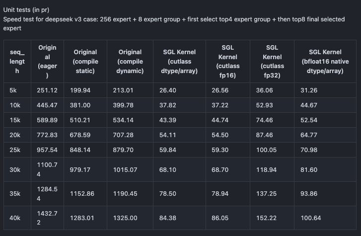
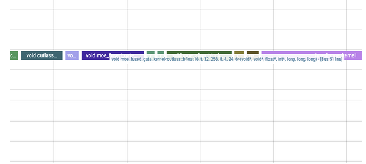

# 0x0. 서론

오늘은 SGLang에서 DeepSeek V3 모델의 https://github.com/sgl-project/sglang/blob/main/python/sglang/srt/layers/moe/topk.py#L99-L149 부분에 있는 `biased_grouped_topk` 함수에 대한 kernel 최적화를 소개한다. DeepSeek V3 end-to-end 테스트에서 처리량이 5% 이상 향상되었다. 이 함수는 DeepSeek V3/R1 모델의 MOE 레이어에서 각 token의 expert 선택 확률을 계산하는 데 사용된다. Mixtral, Qwen2 등 MoE 모델의 topk 구현과 비교하면, DeepSeek V3는 grouped_topk 메커니즘을 도입해서 각 token이 고정된 개수의 expert group만 선택할 수 있게 하고, 그다음 각 expert group 안에서 다시 topk개의 expert를 선택한다. 아래는 이 함수에 주석을 단 것이다:


```python3
# 입력 텐서 차원 설명:
# hidden_states: [num_token, ...]  # 나머지 차원은 모델 아키텍처에 따라 달라진다
# gating_output: [num_token, num_experts]  # num_experts는 num_expert_group으로 나누어떨어져야 한다
# correction_bias: [num_experts]  # gating 출력을 보정하는 bias 항
# 여기서:
# - num_token: 배치 안의 token 수
# - num_experts: 전체 expert 수, num_expert_group으로 나누어떨어져야 한다
# - num_expert_group: expert group의 개수
# - topk: 각 token이 선택할 expert 수
# - topk_group: 각 token이 선택할 expert group 수
# 제약 조건:
# - topk_group <= num_expert_group
# - topk <= num_experts
# - num_experts % num_expert_group == 0

def biased_grouped_topk_impl(
    hidden_states: torch.Tensor,      # 입력 hidden state 텐서
    gating_output: torch.Tensor,      # gating 네트워크의 출력, expert 선택 확률 계산에 사용
    correction_bias: torch.Tensor,    # gating 출력을 보정하는 bias 항
    topk: int,                        # 각 token이 선택하는 expert 수
    renormalize: bool,                # 선택된 expert 가중치를 재정규화할지 여부
    num_expert_group: int = 0,        # expert group의 개수
    topk_group: int = 0,              # 각 token이 선택하는 expert group 수
):
    # 입력 token 수가 일치하는지 확인
    assert hidden_states.shape[0] == gating_output.shape[0], "Number of tokens mismatch"

    # gating 출력에 sigmoid 활성화를 적용해 expert 선택 확률을 얻는다
    scores = gating_output.sigmoid()
    num_token = scores.shape[0]       # token 수 획득
    num_experts = scores.shape[1]     # 전체 expert 수 획득
    
    # scores를 reshape하고 보정 bias를 더한다
    scores_for_choice = scores.view(num_token, -1) + correction_bias.unsqueeze(0)
    
    # 각 expert group의 점수 계산:
    # 1. scores를 [num_token, num_expert_group, experts_per_group] 형태로 reshape
    # 2. 각 group 안에서 top2 점수를 선택
    # 3. 각 group의 top2 점수를 더해 group 점수를 얻는다
    group_scores = (
        scores_for_choice.view(num_token, num_expert_group, -1)
        .topk(2, dim=-1)[0]
        .sum(dim=-1)
    )  # [n, n_group]
    
    # 점수가 가장 높은 topk_group개의 expert group을 선택
    group_idx = torch.topk(group_scores, k=topk_group, dim=-1, sorted=False)[1]  # [n, top_k_group]
    
    # group mask를 만들어 선택된 group을 표시
    group_mask = torch.zeros_like(group_scores)  # [n, n_group]
    group_mask.scatter_(1, group_idx, 1)  # [n, n_group]
    
    # group mask를 expert 단위로 확장
    score_mask = (
        group_mask.unsqueeze(-1)
        .expand(num_token, num_expert_group, scores.shape[-1] // num_expert_group)
        .reshape(num_token, -1)
    )  # [n, e]
    
    # 선택되지 않은 group의 expert 점수를 음의 무한대로 설정
    tmp_scores = scores_for_choice.masked_fill(
        ~score_mask.bool(), float("-inf")
    )  # [n, e]
    
    # 선택된 expert group 안에서 topk개의 expert를 선택
    _, topk_ids = torch.topk(tmp_scores, k=topk, dim=-1, sorted=False)
    # 선택된 expert의 원래 점수를 가중치로 가져온다
    topk_weights = scores.gather(1, topk_ids)

    # 재정규화가 필요하면 선택된 expert 가중치를 정규화한다
    if renormalize:
        topk_weights_sum = topk_weights.sum(dim=-1, keepdim=True)
        topk_weights = topk_weights / topk_weights_sum

    # 정규화된 가중치와 선택된 expert ID를 반환
    return topk_weights.to(torch.float32), topk_ids.to(torch.int32)


```

vLLM이든 SGLang이든 모두 torch.compile을 통해 이 함수를 최적화한다. torch.compile을 사용할 때의 명백한 단점은 서비스 기동 시간이 크게 길어진다는 것이고, 게다가 torch.compile로 최적화한 성능은 CUDA로 직접 구현한 것과 비교하면 여전히 어느 정도 차이가 있다. topk와 gather 같은 복잡한 operator가 얽혀 있어서 이 연산을 완전히 fuse할 수 없기 때문이다. 이 블로그에서는 SGLang에서 이 함수를 대상으로 한 CUDA kernel fuse 구현을 소개한다. PR은 https://github.com/sgl-project/sglang/pull/4530 이다.

# 0x1. 성능 테스트

## kernel PR의 테스트 (https://github.com/sgl-project/sglang/pull/4530)



여기서 `seq_length`는 위의 `num_tokens`에 해당하며, `bs=1`이라고 가정한다. 이 결과를 보면 서로 다른 token 수에서 CUDA kernel fuse 후의 성능이 `torch.compile` 버전에 비해 모두 자릿수 단위로 앞선다.

아래 테스트는 다음에서 가져왔다: https://github.com/sgl-project/sglang/pull/5371

## torch profile

```shell
python3 -m sglang.bench_serving --backend sglang --num-prompts 2 --request-rate 1 --port 30001 --flush-cache --warmup-requests 1 --profile
```

### 메인 브랜치


### moe_fused_gate kernel로 교체한 브랜치




이제 kernel이 하나뿐이다.

36us->8us.

## moe_fused_gate kernel로 교체한 뒤 DeepSeek V3 모델의 H200 end-to-end 테스트


```shell
SGL_ENABLE_JIT_DEEPGEMM=0 python3 -m sglang.launch_server --model /DeepSeek-V3 --tp 8 --trust-remote-code --port 30001
python3 -m sglang.bench_serving --backend sglang --num-prompts 300 --request-rate 1 --port 30001 --flush-cache --warmup-requests 20
```

|qps|Input token throughput (tok/s)|Output token throughput (tok/s)|Total token throughput (tok/s)|
|---|---|---|---|
|4(main)| 719.99| 456.44| 1176.43|
|4(pr)  | 763.11| 483.77| 1246.88|
|8(main)| 840.96| 533.13| 1374.09|
|8(pr)  | 887.35| 562.54| 1449.89|
|16(main)| 892.55| 565.83| 1458.38|
|16(pr)  | 964.91| 611.70| 1576.61|


- qps=4: 5.9%+
- qps=8: 5.5%+
- qps=16: 8.1%+


# 0x2. moe_fused_gate kernel 코드 리딩

코드 링크: https://github.com/sgl-project/sglang/blob/main/sgl-kernel/csrc/moe/moe_fused_gate.cu

## 0x2.1 Host 측 코드와 스레드 모델

```c++
//------------------------------------------------------------------------------
// Host 측 launch 함수
//------------------------------------------------------------------------------
std::vector<at::Tensor>
moe_fused_gate(at::Tensor& input, at::Tensor& bias, int64_t num_expert_group, int64_t topk_group, int64_t topk) {
  // 입력 텐서의 차원 정보를 가져온다
  int64_t num_rows = input.size(0);    // token 수
  int32_t num_experts = input.size(1); // 전체 expert 수
  
  // 가중치와 인덱스를 저장할 출력 텐서 생성
  auto options = torch::TensorOptions().dtype(torch::kFloat32).device(torch::kCUDA);
  auto output = torch::empty({num_rows, topk}, options);           // 선택된 expert 가중치를 저장
  auto indices = torch::empty({num_rows, topk}, options.dtype(torch::kInt32)); // 선택된 expert 인덱스를 저장

  // num_expert_group에 따라 grid 차원을 계산
  // 각 warp가 처리하는 행 수 = max(WARP_SIZE / num_expert_group, 1)
  int64_t rows_per_warp = std::max<int64_t>(1, WARP_SIZE / num_expert_group);
  int64_t num_warps = (num_rows + rows_per_warp - 1) / rows_per_warp;  // 필요한 warp 수
  int64_t num_blocks = (num_warps + WARPS_PER_CTA - 1) / WARPS_PER_CTA; // 필요한 block 수
  
  // 현재 CUDA stream을 가져온다
  const cudaStream_t stream = at::cuda::getCurrentCUDAStream();
  // block 차원 설정: 각 block은 WARPS_PER_CTA * WARP_SIZE개의 스레드, 즉 WARPS_PER_CTA개의 warp를 포함한다
  dim3 block_dim(WARP_SIZE, WARPS_PER_CTA);

  // 검사 1: expert 수가 2의 거듭제곱인지 확인
  TORCH_CHECK((num_experts & (num_experts - 1)) == 0, "num_experts must be a power of 2, but got ", num_experts);

  // 검사 2: expert 수가 expert group 수로 나누어떨어지는지 확인(이는 expert group 수도 2의 거듭제곱이어야 함을 뜻한다)
  TORCH_CHECK(
      num_experts % num_expert_group == 0,
      "num_experts must be divisible by num_expert_group, but got ",
      num_experts,
      " / ",
      num_expert_group);

  // 각 group 안의 expert 수를 계산
  int computed_vpt = num_experts / num_expert_group;
  // 검사 3: 각 group 안의 expert 수가 MAX_VPT=32를 넘지 않는지 확인
  // MAX_VPT는 각 스레드가 처리할 수 있는 최대값을 뜻한다
  TORCH_CHECK(
      computed_vpt <= MAX_VPT,
      "Per group experts: num_experts / num_expert_group = (",
      computed_vpt,
      ") exceeds the maximum supported (",
      MAX_VPT,
      ")");

  // 이미 알려진 컴파일 타임 설정에 따라 템플릿화된 kernel로 dispatch한다
  // 현재는 다음 경우만 지원한다:
  // 경우 1: expert 256개, group 8개 또는 16개
  // 경우 2: expert 128개, group 4개 또는 8개
  // 경우 3: 그 밖의 경우, 8 <= num_experts / num_expert_group <= 32 를 요구한다
  bool dispatched = false;
  switch (num_experts) {
    case 256:
      if (num_expert_group == 8)
        // DeepSeek V3의 경우
        // VPT = 256/8 = 32, ROWS_PER_WARP = 32/8 = 4, ROWS_PER_CTA = 6 * 4 = 24
        if (input.scalar_type() == at::kBFloat16) {
          LAUNCH_MOE_GATE_CONFIG(bfloat16_t, 256, 8);
        } else if (input.scalar_type() == at::kHalf) {
          LAUNCH_MOE_GATE_CONFIG(float16_t, 256, 8);
        } else if (input.scalar_type() == at::kFloat) {
          LAUNCH_MOE_GATE_CONFIG(float32_t, 256, 8);
        } else if (num_expert_group == 16)
          // VPT = 256/16 = 16, ROWS_PER_WARP = 32/16 = 2, ROWS_PER_CTA = 6 * 2 = 12
          if (input.scalar_type() == at::kBFloat16) {
            LAUNCH_MOE_GATE_CONFIG(bfloat16_t, 256, 16);
          } else if (input.scalar_type() == at::kHalf) {
            LAUNCH_MOE_GATE_CONFIG(float16_t, 256, 16);
          } else if (input.scalar_type() == at::kFloat) {
            LAUNCH_MOE_GATE_CONFIG(float32_t, 256, 16);
          }
      break;
    case 128:
      if (num_expert_group == 4)
        // VPT = 128/4 = 32, ROWS_PER_WARP = 32/16 = 2, ROWS_PER_CTA = 6 * 2 = 12
        if (input.scalar_type() == at::kBFloat16) {
          LAUNCH_MOE_GATE_CONFIG(bfloat16_t, 128, 4);
        } else if (input.scalar_type() == at::kHalf) {
          LAUNCH_MOE_GATE_CONFIG(float16_t, 128, 4);
        } else if (input.scalar_type() == at::kFloat) {
          LAUNCH_MOE_GATE_CONFIG(float32_t, 128, 4);
        } else if (num_expert_group == 8)
          // VPT = 128/8 = 16, ROWS_PER_WARP = 32/8 = 4, ROWS_PER_CTA = 6 * 4 = 24
          if (input.scalar_type() == at::kBFloat16) {
            LAUNCH_MOE_GATE_CONFIG(bfloat16_t, 128, 8);
          } else if (input.scalar_type() == at::kHalf) {
            LAUNCH_MOE_GATE_CONFIG(float16_t, 128, 8);
          } else if (input.scalar_type() == at::kFloat) {
            LAUNCH_MOE_GATE_CONFIG(float32_t, 128, 8);
          }
      break;
    default:
      break;
  }
  
  // 미리 정의된 설정에 매칭되지 않으면 동적 kernel을 사용한다
  // 현재 동적 kernel은 num_experts / num_expert_group <= 32인 경우만 지원한다
  if (!dispatched) {
    if (input.scalar_type() == at::kBFloat16) {
      moe_fused_gate_kernel_dynamic<bfloat16_t><<<num_blocks, block_dim, 0, stream>>>(
          input.data_ptr(),
          bias.data_ptr(),
          output.data_ptr<float>(),
          indices.data_ptr<int32_t>(),
          num_rows,
          num_experts,
          num_expert_group,
          topk_group,
          topk);
    } else if (input.scalar_type() == at::kHalf) {
      moe_fused_gate_kernel_dynamic<float16_t><<<num_blocks, block_dim, 0, stream>>>(
          input.data_ptr(),
          bias.data_ptr(),
          output.data_ptr<float>(),
          indices.data_ptr<int32_t>(),
          num_rows,
          num_experts,
          num_expert_group,
          topk_group,
          topk);
    } else if (input.scalar_type() == at::kFloat) {
      moe_fused_gate_kernel_dynamic<float32_t><<<num_blocks, block_dim, 0, stream>>>(
          input.data_ptr(),
          bias.data_ptr(),
          output.data_ptr<float>(),
          indices.data_ptr<int32_t>(),
          num_rows,
          num_experts,
          num_expert_group,
          topk_group,
          topk);
    } else {
      TORCH_CHECK(false, "Unsupported data type for moe_fused_gate");
    }
  }
  return {output, indices};
}
```

Host 측 코드와 kernel 앞부분에 정의된 주석을 바탕으로 스레드 모델을 그려볼 수 있다.

```c++
static constexpr int WARP_SIZE = 32;  // 각 warp는 32개 스레드로 고정
static constexpr int WARPS_PER_CTA = 6;  // 각 block에는 6개의 warp가 있다

dim3 block_dim(WARP_SIZE, WARPS_PER_CTA);  // block 차원은 (32, 6)
int64_t rows_per_warp = std::max<int64_t>(1, WARP_SIZE / num_expert_group);  // 각 warp가 처리하는 행 수
int64_t num_warps = (num_rows + rows_per_warp - 1) / rows_per_warp;  // 전체적으로 필요한 warp 수
int64_t num_blocks = (num_warps + WARPS_PER_CTA - 1) / WARPS_PER_CTA;  // 필요한 block 수
```

스레드 모델을 표현하면 다음과 같다:

```c++
Grid 구조:
+------------------------+
|  Block 0   Block 1    |  
|  +------+  +------+   |
|  |      |  |      |   |
|  |      |  |      |   |   ... 더 많은 Block
|  |      |  |      |   |  (num_blocks개의 Block)
|  +------+  +------+   |
|                       |
+------------------------+

Block 구조(dim3(32,6)):
+--------------------------------+
|  Warp 0  (32개 스레드)         |
|  +----------------------------+ |
|  |t0 t1 t2 ... t31          | |
|  +----------------------------+ |
|  Warp 1                        |
|  +----------------------------+ |
|  |t32 t33 t34 ... t63       | |
|  +----------------------------+ |
|           ...                  |
|  Warp 5                        |
|  +----------------------------+ |
|  |t160 t161 ... t191        | |
|  +----------------------------+ |
+--------------------------------+

데이터 처리 매핑:
- 각 Block은 ROWS_PER_CTA = WARPS_PER_CTA * ROWS_PER_WARP 행의 데이터를 처리한다
- 각 Warp는 ROWS_PER_WARP = WARP_SIZE/num_expert_group 행의 데이터를 처리한다
- 각 스레드는 VPT = num_experts/num_expert_group 개의 expert를 처리한다(각 스레드가 한 group 안의 experts_per_group개 expert를 처리한다)
```

DeepSeek V3를 예로 들면(num_experts=256, num_expert_group=8):
- VPT = 256/8 = 32: 각 스레드가 32개의 expert를 처리한다
- ROWS_PER_WARP = 32/8 = 4: 각 warp가 4행의 데이터를 처리한다
- ROWS_PER_CTA = 6 * 4 = 24: 각 block이 24행의 데이터를 처리한다

## 0x2.2 dispatch되는 2가지 kernel 인터페이스

```c++
//------------------------------------------------------------------------------
// 템플릿화된 Kernel 버전(컴파일 타임 상수 사용)
//------------------------------------------------------------------------------
// kernel 파라미터 구조체 정의, 모든 파라미터는 컴파일 타임 상수다
template <int VPT_, int NUM_EXPERTS_, int THREADS_PER_ROW_, int ROWS_PER_WARP_, int ROWS_PER_CTA_, int WARPS_PER_CTA_>
struct KernelParams {
  static constexpr int VPT = VPT_;                    // 각 스레드가 처리하는 expert 수(Values Per Thread)
  static constexpr int NUM_EXPERTS = NUM_EXPERTS_;     // 전체 expert 수
  static constexpr int THREADS_PER_ROW = THREADS_PER_ROW_; // 한 행의 데이터를 처리하는 데 필요한 스레드 수, expert group 수와 같다
  static constexpr int ROWS_PER_WARP = ROWS_PER_WARP_;    // 각 warp가 처리하는 행 수
  static constexpr int ROWS_PER_CTA = ROWS_PER_CTA_;      // 각 CTA(block)가 처리하는 행 수
  static constexpr int WARPS_PER_CTA = WARPS_PER_CTA_;    // 각 CTA가 포함하는 warp 수
};

// 템플릿화된 kernel 함수 정의
template <
    typename T,           // 데이터 타입(float/half/bfloat16)
    int VPT,             // 스레드당 처리하는 expert 수
    int NUM_EXPERTS,     // 전체 expert 수
    int THREADS_PER_ROW, // 행당 필요한 스레드 수
    int ROWS_PER_WARP,   // warp당 처리하는 행 수
    int ROWS_PER_CTA,    // block당 처리하는 행 수
    int WARPS_PER_CTA>   // block당 warp 수
__global__ void moe_fused_gate_kernel(
    void* input,         // 입력 텐서
    void* bias,          // bias 텐서
    float* output_ptr,   // 출력 가중치
    int32_t* indices_ptr,// 출력 expert 인덱스
    int64_t num_rows,    // 전체 행 수(token 수)
    int64_t topk_group,  // 각 token이 선택하는 expert group 수
    int64_t topk) {      // 각 token이 선택하는 expert 수
  // 컴파일 타임 파라미터 구조체를 구성
  KernelParams<VPT, NUM_EXPERTS, THREADS_PER_ROW, ROWS_PER_WARP, ROWS_PER_CTA, WARPS_PER_CTA> params;
  // 구현 함수 호출
  moe_fused_gate_impl<T>(input, bias, output_ptr, indices_ptr, num_rows, topk_group, topk, params);
}

// kernel을 실행하기 위한 매크로, 컴파일 타임 상수를 계산하고 kernel을 실행한다
#define LAUNCH_MOE_GATE_CONFIG(T, EXPERTS, EXPERT_GROUP)                                                 \
  do {                                                                                                   \
    // 각 스레드가 처리하는 expert 수를 계산                                                                 
    constexpr int VPT = (EXPERTS) / (EXPERT_GROUP);                                                      \
    // expert group 수가 WARP_SIZE보다 크면 warp당 1행만 처리하고, 그렇지 않으면 warp당 처리 가능한 행 수를 계산  
    constexpr int ROWS_PER_WARP = ((EXPERT_GROUP) <= WARP_SIZE) ? (WARP_SIZE / (EXPERT_GROUP)) : 1;      \
    // 각 block이 처리할 수 있는 전체 행 수를 계산                                                           
    constexpr int ROWS_PER_CTA = WARPS_PER_CTA * ROWS_PER_WARP;                                          \
    // kernel 실행                                                                                        
    moe_fused_gate_kernel<T, VPT, (EXPERTS), (EXPERT_GROUP), ROWS_PER_WARP, ROWS_PER_CTA, WARPS_PER_CTA> \
        <<<num_blocks, block_dim, 0, stream>>>(                                                          \
            input.data_ptr(),                                                                            \
            bias.data_ptr(),                                                                             \
            output.data_ptr<float>(),                                                                    \
            indices.data_ptr<int32_t>(),                                                                 \
            num_rows,                                                                                    \
            topk_group,                                                                                  \
            topk);                                                                                       \
    dispatched = true;                                                                                   \
  } while (0)

//------------------------------------------------------------------------------
// 동적 Kernel 버전(런타임에 파라미터 계산)
//------------------------------------------------------------------------------
// 런타임 파라미터 구조체
struct KernelParamsDynamic {
  int VPT;              // 스레드당 처리하는 expert 수
  int NUM_EXPERTS;      // 전체 expert 수
  int THREADS_PER_ROW;  // 행당 필요한 스레드 수
  int ROWS_PER_WARP;    // warp당 처리하는 행 수
  int ROWS_PER_CTA;     // block당 처리하는 행 수
  int WARPS_PER_CTA;    // block당 warp 수
};

// 동적 파라미터 버전의 kernel 함수
template <typename T>
__global__ void moe_fused_gate_kernel_dynamic(
    void* input,
    void* bias,
    float* output_ptr,
    int32_t* indices_ptr,
    int64_t num_rows,
    int64_t num_experts,      // 런타임에 지정되는 expert 수
    int64_t num_expert_group, // 런타임에 지정되는 expert group 수
    int64_t topk_group,
    int64_t topk) {
  KernelParamsDynamic params;
  // 런타임에 모든 파라미터를 계산
  params.NUM_EXPERTS = num_experts;             // 예: deepseek v3에서는 256
  params.VPT = num_experts / num_expert_group;  // 예: deepseek v3에서는 256/8=32
  params.THREADS_PER_ROW = num_expert_group;    // expert group 수로 고정, 예: deepseek v3에서는 8
  params.WARPS_PER_CTA = WARPS_PER_CTA;        // 6으로 고정
  params.ROWS_PER_WARP = std::max<int64_t>(1, WARP_SIZE / num_expert_group);  // WARP_SIZE는 32로 고정
  params.ROWS_PER_CTA = params.WARPS_PER_CTA * params.ROWS_PER_WARP;

  // 구현 함수 호출
  moe_fused_gate_impl<T>(input, bias, output_ptr, indices_ptr, num_rows, topk_group, topk, params);
}
```

여기에는 kernel이 2개 있다. 하나는 템플릿화된 kernel이고, 다른 하나는 동적 kernel이다. 템플릿화된 kernel은 컴파일 타임에 모든 파라미터를 계산한 뒤 kernel을 실행한다. 동적 kernel은 런타임에 모든 파라미터를 계산한 뒤 kernel을 실행한다. 하지만 두 kernel 모두 앞 절에서 소개한 스레드 모델을 따른다. 즉 각 스레드가 고정된 수의 expert(VPT)를 처리하고, 여러 스레드가 하나의 그룹을 이루어 한 행의 데이터를 처리하며(THREADS_PER_ROW), 여러 스레드 그룹이 하나의 warp를 이루고, 여러 warp가 하나의 block(CTA)을 이룬다.

## 0x2.3 보조 함수와 데이터 구조

```c++
// CUTLASS 라이브러리의 AlignedArray를 정렬 배열의 기본 타입으로 사용
template <typename T, int N>
using AlignedArray = cutlass::AlignedArray<T, N>;

// 자주 쓰는 데이터 타입 별칭 정의
using bfloat16_t = cutlass::bfloat16_t;  // brain floating point 16비트
using float16_t = cutlass::half_t;        // IEEE 754 half precision 16비트
using float32_t = float;                  // 표준 32비트 부동소수점

// 비교 함수: 서로 다른 데이터 타입의 '보다 큼' 연산 처리
// at::Half 타입은 연산자 오버로딩이 모호성을 일으키므로 특별히 처리한다
template <typename T>
__device__ inline bool cmp_gt(const T& a, const T& b) {
  if constexpr (std::is_same<T, at::Half>::value) {
    // at::Half 타입은 먼저 float으로 변환한 뒤 비교하여 연산자 오버로딩 모호성을 피한다
    return static_cast<float>(a) > static_cast<float>(b);
  } else {
    // 그 밖의 타입(float, BFloat16, half_t 등)은 내장 > 연산자를 그대로 사용한다
    return a > b;
  }
}

// 비교 함수: 서로 다른 데이터 타입의 동등 비교 연산 처리
template <typename T>
__device__ inline bool cmp_eq(const T& a, const T& b) {
  if constexpr (std::is_same<T, at::Half>::value) {
    // at::Half 타입은 float으로 변환한 뒤 비교한다
    return static_cast<float>(a) == static_cast<float>(b);
  } else {
    // 그 밖의 타입은 == 연산자를 그대로 사용한다
    return a == b;
  }
}

// 모든 kernel이 공유하는 고정 상수 정의
static constexpr int WARP_SIZE = 32;       // CUDA warp 크기, 32개 스레드로 고정
static constexpr int WARPS_PER_CTA = 6;    // 각 CTA(block)는 6개의 warp를 포함한다
static constexpr int MAX_VPT = 32;         // 각 스레드는 최대 32개의 expert 값을 처리한다
                                          // params.VPT(num_expert/num_expert_group)보다 커야 한다

// Array 타입 별칭 생성, AlignedArray를 사용해 메모리 정렬을 보장한다
template <typename T, int N>
using Array = AlignedArray<T, N>;

// 접근 타입 정의, 데이터를 벡터화해서 로드하는 데 사용한다
// 주의: 여기서의 MAX_VPT는 컴파일 타임 상수여야 하고, 실제 params.VPT 값보다 커야 한다
template <typename T>
using AccessType = AlignedArray<T, MAX_VPT>;
```

이 코드는 주로 데이터 타입 정의, Host 측에서 kernel을 실행할 때 필요한 상수 정의, 그리고 kernel 안의 topk 연산에 사용되는 두 개의 비교 함수를 완성한다.

## 0x2.4 moe_fused_gate_impl cuda kernel 구체 구현

### 초기화와 데이터 로드

```c++
int tidx = threadIdx.x;
int64_t thread_row =
    blockIdx.x * params.ROWS_PER_CTA + threadIdx.y * params.ROWS_PER_WARP + tidx / params.THREADS_PER_ROW;
if (thread_row >= num_rows) {
    return;
}
```

이 부분은 각 스레드가 처리하는 행(token) 인덱스를 계산한다. 여기서:
- `thread_row`는 Python 코드의 token 인덱스에 해당하며, `hidden_states[token_idx]`와 `gating_output[token_idx]`에 접근하는 데 사용된다
- `params.THREADS_PER_ROW`는 `num_expert_group`과 같다

### 데이터 읽기와 스레드 관련 인덱스 계산

```c++
auto* input_ptr = reinterpret_cast<T*>(input);
auto* bias_ptr = reinterpret_cast<T*>(bias);
auto* thread_row_ptr = input_ptr + thread_row * params.NUM_EXPERTS;

// 현재 스레드가 하나의 스레드 그룹(expert group) 안에서 갖는 인덱스 위치를 계산
// params.THREADS_PER_ROW가 num_expert_group(expert group 수)과 같으므로
// 이 연산은 같은 warp 안의 스레드들을 서로 다른 expert group으로 나눈다
int thread_group_idx = tidx % params.THREADS_PER_ROW;

// 현재 스레드가 처리를 담당하는 첫 번째 expert의 인덱스를 계산
// 각 스레드는 params.VPT개의 expert를 처리한다. params.VPT = num_experts/num_expert_group
// 예: DeepSeek V3의 경우 num_experts=256, num_expert_group=8일 때
// params.VPT=32, 즉 각 스레드가 연속된 32개의 expert를 처리한다
int first_elt_read_by_thread = thread_group_idx * params.VPT;
```

- `input_ptr`은 `gating_output`에 해당한다
- `bias_ptr`은 `correction_bias`에 해당한다
- `params.NUM_EXPERTS`는 `num_experts`에 해당한다
- `params.VPT`는 `num_experts / num_expert_group`에 해당한다

### gating_output에 Sigmoid 적용

```c++
////////////////////// Sigmoid //////////////////////
#pragma unroll
for (int ii = 0; ii < params.VPT; ++ii) {
    row_chunk[ii] = static_cast<T>(1.0f / (1.0f + expf(-float(row_chunk[ii]))));
}
```

python 코드에서 다음에 해당한다:

```python
scores = gating_output.sigmoid()
```

### correction_bias 추가

```c++
////////////////////// Add Bias //////////////////////
#pragma unroll
for (int ii = 0; ii < params.VPT; ++ii) {
    bias_chunk[ii] = row_chunk[ii] + bias_chunk[ii];
}
```

Python 코드에서 다음에 해당한다:

```python
scores_for_choice = scores.view(num_token, -1) + correction_bias.unsqueeze(0)
```

### 점수가 가장 낮은 expert group을 루프로 제외해 grouped topk를 간접 구현하기

```c++

////////////////////// Exclude Groups //////////////////////
// num_expert_group - topk_group번 반복하며, 매번 점수가 가장 낮은 expert group을 하나 찾아 제외한다
#pragma unroll
  for (int k_idx = 0; k_idx < params.THREADS_PER_ROW - topk_group;
       ++k_idx) {  // QQ NOTE Here params.THREADS_PER_ROW = num_expert_group
    int expert = first_elt_read_by_thread;
    // 현재 스레드가 담당하는 expert 중에서 가장 큰 두 값을 찾는다
    T max_val = static_cast<T>(-FLT_MAX);
    T max_val_second = static_cast<T>(-FLT_MAX);
#pragma unroll
    for (int ii = 0; ii < params.VPT; ++ii) {
      T val = bias_chunk[ii];

      // 최대값과 두 번째 최대값을 갱신
      if (cmp_gt(val, max_val)) {
        max_val_second = max_val;
        max_val = val;
      } else if (cmp_gt(val, max_val_second)) {
        max_val_second = val;
      }
    }

    // 현재 expert group의 점수를 계산(top2 점수의 합)
    // QQ NOTE: currently fixed to pick top2 sigmoid weight value in each expert group and sum them as the group weight
    // to select expert groups
    T max_sum = max_val + max_val_second;

// warp 안에서 리덕션을 수행해 점수가 가장 낮은 expert group을 찾는다
#pragma unroll
    for (int mask = params.THREADS_PER_ROW / 2; mask > 0; mask /= 2) {
      // warp shuffle 연산으로 데이터를 교환
      T other_max_sum =
          static_cast<T>(__shfl_xor_sync(0xFFFFFFFF, static_cast<float>(max_sum), mask, params.THREADS_PER_ROW));
      int other_expert = __shfl_xor_sync(0xFFFFFFFF, expert, mask, params.THREADS_PER_ROW);

      // 점수를 비교해 점수가 더 낮은 expert group을 남긴다
      // 점수가 같으면 인덱스가 더 큰 expert group을 남긴다
      if (cmp_gt(max_sum, other_max_sum) || (cmp_eq(other_max_sum, max_sum) && other_expert > expert)) {
        max_sum = other_max_sum;
        expert = other_expert;
      }
    }

    // 점수가 가장 낮은 expert group의 모든 expert 점수를 FLT_MAX로 설정하여, 제외한 것과 같은 효과를 낸다
    if (k_idx < params.THREADS_PER_ROW - topk_group) {
      // 지워야 할 스레드 ID를 계산
      int const thread_to_clear_in_group = expert / params.VPT;

      // 현재 스레드가 이 expert group을 담당한다면
      if (thread_group_idx == thread_to_clear_in_group) {
#pragma unroll
        for (int ii = 0; ii < params.VPT; ++ii) {
          bias_chunk[ii] = static_cast<T>(FLT_MAX);
        }
      }
    }
  }

  // 모든 스레드를 동기화해 expert group 제외 연산이 완료되었음을 보장한다
  __syncthreads();
```

Python 코드에서 다음에 해당한다:

```python
# 각 expert group의 점수 계산:
# 1. scores를 [num_token, num_expert_group, experts_per_group] 형태로 reshape
# 2. 각 group 안에서 top2 점수를 선택
# 3. 각 group의 top2 점수를 더해 group 점수를 얻는다
group_scores = (
    scores_for_choice.view(num_token, num_expert_group, -1)
    .topk(2, dim=-1)[0]
    .sum(dim=-1)
)  # [n, n_group]

# 점수가 가장 높은 topk_group개의 expert group을 선택
group_idx = torch.topk(group_scores, k=topk_group, dim=-1, sorted=False)[1]  # [n, top_k_group]

# group mask를 만들어 선택된 group을 표시
group_mask = torch.zeros_like(group_scores)  # [n, n_group]
group_mask.scatter_(1, group_idx, 1)  # [n, n_group]

# group mask를 expert 단위로 확장
score_mask = (
    group_mask.unsqueeze(-1)
    .expand(num_token, num_expert_group, scores.shape[-1] // num_expert_group)
    .reshape(num_token, -1)
)  # [n, e]

# 선택되지 않은 group의 expert 점수를 음의 무한대로 설정
tmp_scores = scores_for_choice.masked_fill(
    ~score_mask.bool(), float("-inf")
)  # [n, e]
```


### 루프로 topk개의 expert를 선택해 topk를 간접 구현하기

```c++
////////////////////// Topk //////////////////////
  // 선택된 expert 가중치의 총합을 저장하며, 이후 정규화에 사용한다
  float output_sum = 0.0f;

  // 반복하며 topk개의 expert를 선택
  for (int k_idx = 0; k_idx < topk; ++k_idx) {
    // 현재 스레드의 bias_chunk에서 최대값과 그에 대응하는 expert ID를 찾는다
    T max_val = bias_chunk[0];
    int expert = first_elt_read_by_thread;

    // 현재 값이 FLT_MAX가 아니라면(해당 위치가 아직 지워지지 않았다는 뜻)
    if (!cmp_eq(max_val, static_cast<T>(FLT_MAX))) {
      // 현재 스레드가 담당하는 모든 expert를 순회하며 최대값을 찾는다
#pragma unroll
      for (int ii = 1; ii < params.VPT; ++ii) {
        T val = bias_chunk[ii];
        if (cmp_gt(val, max_val)) {
          max_val = val;
          expert = first_elt_read_by_thread + ii;
        }
      }
    } else {
      // 현재 값이 FLT_MAX라면 해당 위치가 이미 지워졌다는 뜻이므로, max_val을 최소값으로 설정한다
      max_val = static_cast<T>(-FLT_MAX);
    }

    // warp 안에서 리덕션을 수행해 전역 최대값을 찾는다
#pragma unroll
    for (int mask = params.THREADS_PER_ROW / 2; mask > 0; mask /= 2) {
      // warp shuffle 연산으로 데이터를 교환
      T other_max =
          static_cast<T>(__shfl_xor_sync(0xFFFFFFFF, static_cast<float>(max_val), mask, params.THREADS_PER_ROW));
      int other_expert = __shfl_xor_sync(0xFFFFFFFF, expert, mask, params.THREADS_PER_ROW);

      // 최대값을 갱신하고, 값이 같으면 ID가 더 작은 expert를 선택한다
      if (cmp_gt(other_max, max_val) || (cmp_eq(other_max, max_val) && other_expert < expert)) {
        max_val = other_max;
        expert = other_expert;
      }
    }

    // 현재가 유효한 topk 인덱스라면
    if (k_idx < topk) {
      // 최대값을 지워야 할 스레드 ID를 계산
      int thread_to_clear_in_group = expert / params.VPT;
      // 출력 배열의 인덱스를 계산
      int64_t idx = topk * thread_row + k_idx;

      // 현재 스레드 그룹이 최대값을 지워야 할 스레드 그룹이라면
      if (thread_group_idx == thread_to_clear_in_group) {
        // 스레드 안에서 지워야 할 expert 인덱스를 계산
        int expert_to_clear_in_thread = expert % params.VPT;

        // 선택된 expert 위치를 사용됨으로 표시
        bias_chunk[expert_to_clear_in_thread] = static_cast<T>(-FLT_MAX);

        // 선택된 expert의 가중치와 인덱스를 저장
        output_ptr[idx] = static_cast<float>(row_chunk[expert_to_clear_in_thread]);
        indices_ptr[idx] = static_cast<int32_t>(expert);
      }

      // 0번 스레드 그룹이 가중치 합의 누적을 담당한다
      if (thread_group_idx == 0) {
        output_sum += output_ptr[idx];
      }
    }

    // 모든 스레드를 동기화
    __syncthreads();
  }
```

Python 코드에서 다음에 해당한다:

```python
_, topk_ids = torch.topk(tmp_scores, k=topk, dim=-1, sorted=False)
# 선택된 expert의 원래 점수를 가중치로 가져온다
topk_weights = scores.gather(1, topk_ids)

topk_weights_sum = topk_weights.sum(dim=-1, keepdim=True)
```

### 가중치 정규화

```c++
////////////////////// Rescale Output //////////////////////
if (thread_group_idx == 0) {
#pragma unroll
    for (int ii = 0; ii < topk; ++ii) {
        int64_t const idx = topk * thread_row + ii;
        output_ptr[idx] = static_cast<float>(static_cast<T>(output_ptr[idx]) / static_cast<T>(output_sum));
    }
}
```

Python 코드의 마지막 몇 줄에 해당한다:

```python
# 재정규화가 필요하면 선택된 expert 가중치를 정규화한다
if renormalize:
    topk_weights = topk_weights / topk_weights_sum

# 정규화된 가중치와 선택된 expert ID를 반환
return topk_weights.to(torch.float32), topk_ids.to(torch.int32)
```


## 0x2.5 흐름도

코드 리딩을 바탕으로 Claude 3.5 sonnet-20241022을 사용해 다음과 같은 흐름도를 생성했다:

```markdown
초기화와 데이터 전처리
┌─────────────────────────────┐
│            시작             │
└────────────┬────────────────┘
             ↓
┌─────────────────────────────┐
│ 스레드 인덱스/데이터 초기화 │
└────────────┬────────────────┘
             ↓
┌─────────────────────────────┐
│       thread_row 계산       │
└────────────┬────────────────┘
             ↓
┌─────────────────────────────┐
│   thread_row >= num_rows?   │
└────────────┬────────────────┘
   아니오    ↓        예 → 반환
┌─────────────────────────────┐
│   데이터 읽기와 타입 변환   │
└────────────┬────────────────┘
             ↓
┌─────────────────────────────┐
│       Sigmoid 활성화        │
└────────────┬────────────────┘
             ↓
┌─────────────────────────────┐
│          bias 추가          │
└────────────┬────────────────┘
             ↓

expert group 선택 단계
┌─────────────────────────────┐
│   expert group 선택 루프    │←───────┐
└────────────┬────────────────┘        │
             ↓                         │
┌─────────────────────────────┐        │
│ 각 group 내 top2 점수 찾기  │        │
└────────────┬────────────────┘        │
             ↓                         │
┌─────────────────────────────┐        │
│  group 점수 sum_top2 계산   │        │
└────────────┬────────────────┘        │
             ↓                         │
┌─────────────────────────────┐        │
│Warp 리덕션: 최저 group 탐색 │        │
└────────────┬────────────────┘        │
             ↓                         │
┌─────────────────────────────┐        │
│    최저 점수 group 제외     │        │
└────────────┬────────────────┘        │
             ↓                         │
┌─────────────────────────────┐        │
│    모든 group 제외 완료?    │─아니오─┘
└────────────┬────────────────┘
      예     ↓

expert 선택 단계
┌─────────────────────────────┐
│      expert 선택 루프       │←───────┐
└────────────┬────────────────┘        │
             ↓                         │
┌─────────────────────────────┐        │
│ 현재 스레드에서 최대값 찾기 │        │
└────────────┬────────────────┘        │
             ↓                         │
┌─────────────────────────────┐        │
│Warp 리덕션: 전역 최대값 탐색│        │
└────────────┬────────────────┘        │
             ↓                         │
┌─────────────────────────────┐        │
│     출력과 인덱스 갱신      │        │
└────────────┬────────────────┘        │
             ↓                         │
┌─────────────────────────────┐        │
│       topk 선택 완료?       │─아니오─┘
└────────────┬────────────────┘
      예     ↓

최종 처리
┌─────────────────────────────┐
│        가중치 정규화        │
└────────────┬────────────────┘
             ↓
┌─────────────────────────────┐
│            종료             │
└─────────────────────────────┘
```

# 0x3. 요약

이 blog에서는 DeepSeek V3의 biased_grouped_topk 융합 operator를 cuda 코드로 어떻게 구현하는지 소개했다. 사실 이 kernel은 처음에는 TensorRT-LLM과 Faster-Transformer에서 유래한 것으로 보이며, 이후 지속적으로 최적화되어 DeepSeek V3에 적용되었다. 추론 프레임워크에서 CUDA kernel이 최적화되는 방식을 보여주는 매우 전형적인 구현 사례다.


