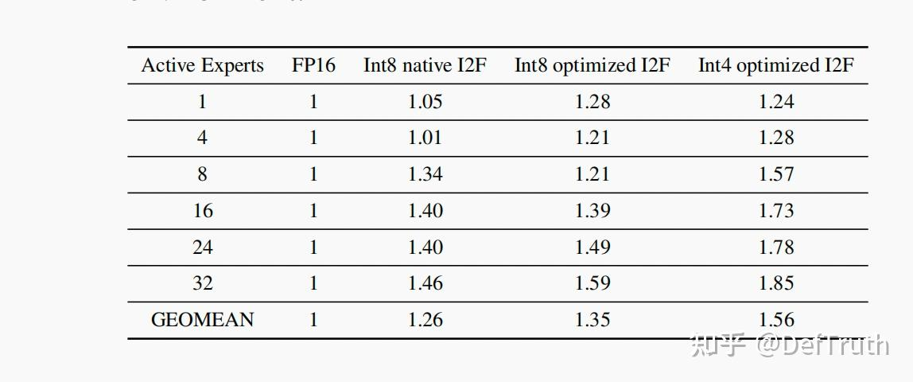
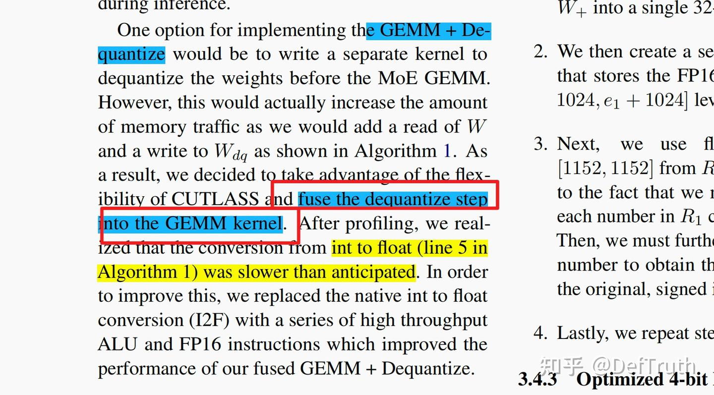
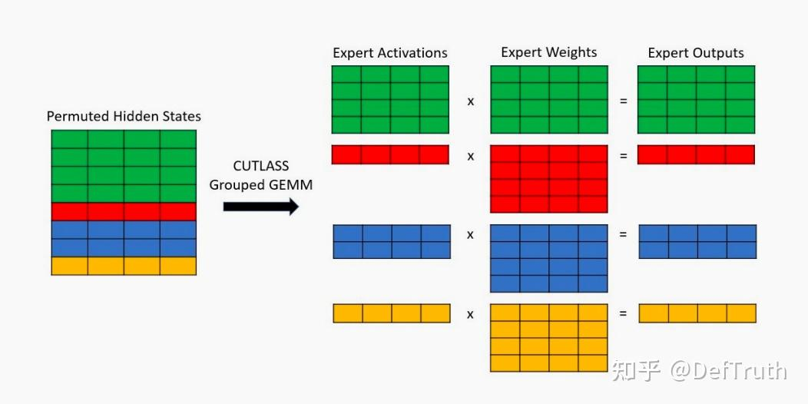
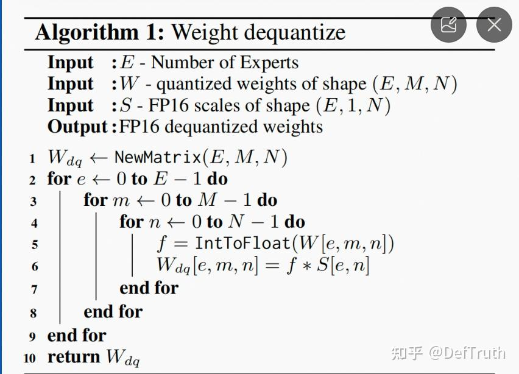
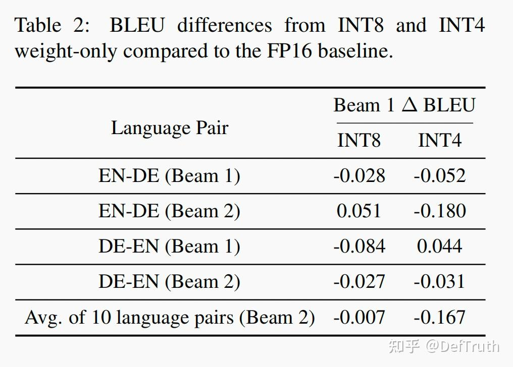
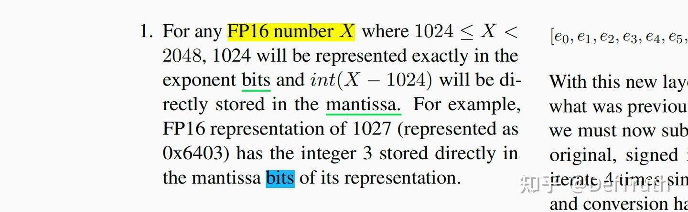
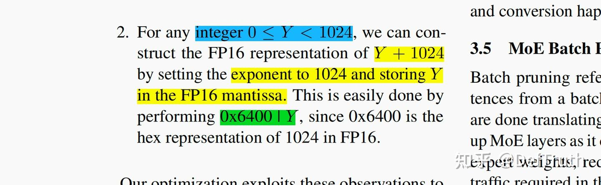
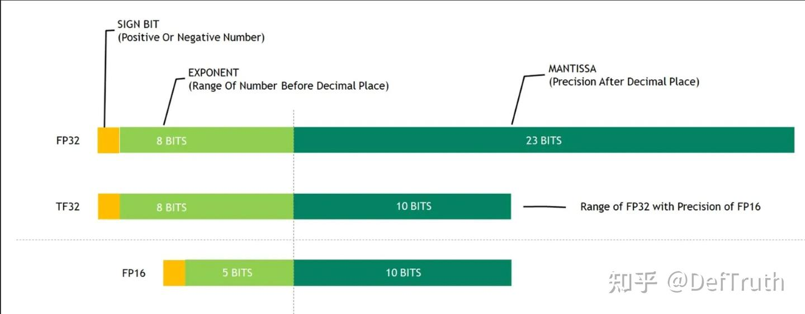
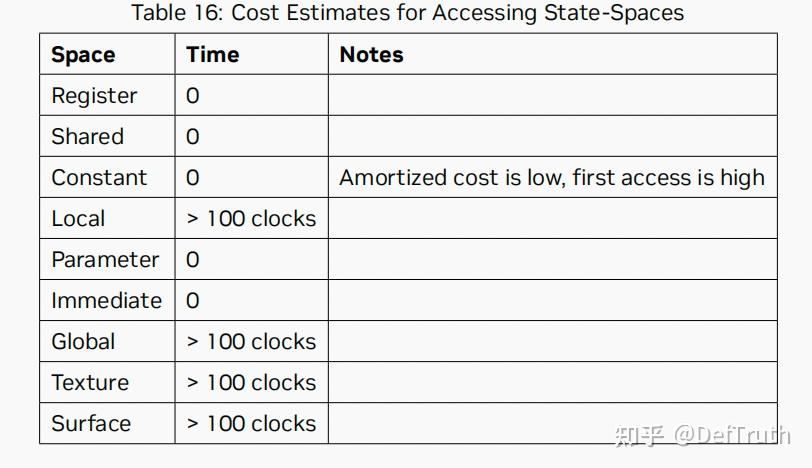

# [LLM 추론 최적화] WINT8/4-(00): 고속 역양자화 알고리즘 쉽게 이해하기

> 원문: https://zhuanlan.zhihu.com/p/657072856

**목차**
- 0x00 서문
- 0x01 Weight Only Int8 논문 읽기
- 0x02 Weight Only Int8 원리
- 0x03 정리

### 0x00 서문

키워드: GEMM + Dequantize Fuse, Fast Int8ToFloat16, Weight Only Int8, PRMT, LOP3



좋은 기억력보다 나쁜 필기가 낫다. 업무에서 봐야 할 신기술이 많아지면 모든 세부 사항을 계속 기억하기 어렵다. 그래서 중요하다고 생각한 기술 디테일을 기록한다.

이번에 정리할 내용은 Weight Only Int8/4다. 알고리즘은 2022년 MoE 추론 최적화 논문 **Who Says Elephants Can't Run: Bringing Large Scale MoE Models into Cloud Scale Production**에서 나왔다. 저자는 Microsoft와 NVIDIA다. 대규모 모델 추론에서 이미 익숙한 기술이다.

NVIDIA가 구현한 핵심 기술 중 하나는 Fast Int8ToFloat16, 즉 고속 역양자화다. 역양자화 알고리즘 설계, PRMT, LOP3 같은 명령 사용이 흥미롭다. 이 글은 개인적인 이해를 기준으로 정리한다. 완전히 정확하다고 보장하지는 않는다.

LeetCUDA/CUDA-Learn-Notes에는 LLM/VLM 글 정리와 FlashAttention, SGEMM, HGEMM, GEMV 등 CUDA Kernel 예제 구현이 포함되어 있다.


*CUDA Learn Notes with PyTorch*

### 0x01 Weight Only Int8 논문 읽기

이 글은 논문에서 언급한 Fast Int8ToFloat16 알고리즘에 집중한다.

#### GEMM + Dequantize Fuse

원래 별도 kernel인 GEMM과 Dequantize를 하나의 kernel로 fuse한다. 계산량은 그대로지만 메모리 접근을 줄일 수 있으므로 memory bound 압력을 완화한다.



저수준에서는 CUTLASS Grouped GEMM Kernel을 호출해 fuse된 kernel 계산을 수행한다.



#### Weight Only Int8/Int4

이 논문에서 사용하는 양자화 방식은 Weight Only다. activation은 FP16으로 유지하고 weight만 양자화한다. shape이 `[E, M, N]`인 weight에 대해 range-based per-channel 대칭 양자화를 적용한다. 여기서는 M 차원을 따라 양자화한다고 볼 수 있으며, scale shape은 `[E, 1, N]`이다. online 계산 시 int8 weight를 FP16으로 변환한 뒤 FP16 activation, bias와 함께 계산한다.



양자화 자체는 일반적인 방식이다. 다만 MoE에서 Expert weight가 전체 weight의 90% 이상을 차지하므로 Expert weight만 양자화한다. 논문은 FP16과 Int8/4의 차이도 제시한다. 결론적으로 Weight Only는 정확도와 성능/throughput 사이의 절충이다. 정확도 저하는 작으므로 QAT까지 갈 필요는 크지 않다.



#### Fast Int8ToFloat16 알고리즘

논문은 native Int8ToFloat16 변환 성능이 기대보다 낮았다고 설명한다. native 변환은 낮은 throughput의 `cvt` 계열 명령으로 내려갈 가능성이 있다. 그래서 이를 고성능 ALU와 FP16 연산 명령 조합으로 바꿔 Int8 -> Float16 변환을 수행한다.

핵심 관찰은 두 가지다.

**관찰 1.** 임의의 FP16 수 `X`가 `1024 <= X < 2048` 범위에 있으면, `1024`는 exponent에 정확히 표현되고 `int(X - 1024)`는 mantissa에 그대로 저장된다. 예를 들어 `1027`의 FP16 표현 `0x6403`에서 꼬리 부분 `0x03`은 정수 3의 bit 표현과 일치한다.



**관찰 2.** 임의의 정수 `0 <= Y < 1024`에 대해, `Y + 1024`의 FP16 표현을 구성할 수 있다. exponent는 1024에 해당하도록 두고, `Y`는 FP16 mantissa에 저장한다. 이는 `0x6400 | Y`로 쉽게 만든다. `0x6400`은 FP16에서 1024의 16진 표현이다.



즉 이 알고리즘의 본질은 저성능 수치 변환 명령을 쓰지 않고, 더 빠른 bit 조작과 FP16 산술 명령으로 동일한 Int8ToFloat16 변환을 구현하는 것이다.

### 0x02 Weight Only Int8 원리

#### FP16 표현

FP16의 16bit는 sign 1bit, exponent 5bit, mantissa 10bit로 구성된다.



일반적인 normalized FP16 값은 다음 식으로 해석된다.


예를 들어 `0b0110010000000011`을 보자.

```text
0b 0 11001 0000000011
sign: 0
exponent: 11001 -> 25 -> 25 - 15 = 10 -> 2^10 = 1024
mantissa: 0000000011 -> fraction = 3
```

실수 값은 다음과 같다.

```text
1 * 2^10 * (1 + 3/1024) = 1027
```

FP16 값은 exponent가 표현하는 `2^10`과 mantissa가 표현하는 `2^10 * 3/1024`의 합으로 볼 수 있다.

#### 관찰 1 이해

관찰 1은 FP16 값이 `[1024, 2048)` 범위에 있을 때의 bit 배치 규칙을 말한다. FP16은 exponent 구간마다 표현 간격이 달라진다. `1024 = 2^10`, 다음 exponent 구간은 `2048 = 2^11`이다. 이 사이의 값은 exponent가 아니라 mantissa로 표현된다.

여기서 중요한 점은 FP16 mantissa가 10bit이고, `2^10` 구간에서는 mantissa의 최소 단위가 정확히 1이라는 점이다.

```text
FP16 real = (-1)^S * (1 + fraction / 1024) * 2^10
```

따라서 `1024 + 3`은 mantissa에 정수 3의 bit를 그대로 넣으면 된다.

```text
0b 0 11001 0000000011
```

반대로 2048 구간에서는 mantissa 최소 단위가 2다. 512 구간에서는 0.5다. 정수 bit를 그대로 mantissa에 넣어 같은 값을 만들 수 없다. 따라서 magic number로 1024를 쓰는 이유가 생긴다. 1024 구간에서만 `uint8` 값을 mantissa에 bit 그대로 넣고 정수 값으로 해석할 수 있다.

예를 들어 `512 + 3`을 같은 방식으로 만들면:

```text
0b 0 11000 0000000011
1 * 2^9 * (1 + 3/1024) = 513.5
```

`515`가 아니다.

#### 관찰 2 이해

`0 <= Y < 1024`인 정수는 FP16의 `1024 + Y`로 먼저 구성할 수 있다. `Y`의 bit를 mantissa에 직접 넣고 `0x6400 | Y`를 만든다.

```text
Y = 3
Y' = 1024 + Y
Y' bits = 0x6400 | 0x0003
Y_FP16 = Y' - 1024 = 3.0
```

쓸모없는 일을 하는 것처럼 보이지만 핵심은 여기에 있다. 이렇게 하면 throughput이 낮은 `cvt` 변환 대신 PRMT와 `sub.f16x2`를 사용한다. FasterTransformer의 구현은 다음 흐름이다.

```cpp
static constexpr uint32_t I8s_TO_F16s_MAGIC_NUM = 0x64806480;
asm volatile("sub.f16x2 %0, %1, %2;\n" : "=r"(h[0]) : "r"(h[0]), "r"(I8s_TO_F16s_MAGIC_NUM));
asm volatile("sub.f16x2 %0, %1, %2;\n" : "=r"(h[1]) : "r"(h[1]), "r"(I8s_TO_F16s_MAGIC_NUM));
```

여기서 직접 1024를 빼지 않고 1152를 뺀다. quantized int 값이 저장될 때 128 bias가 더해져 있기 때문이다. 따라서 역양자화 시 `1024 + 128 = 1152`를 한 번에 뺀다. 이 bias는 sign extension을 피하기 위한 설계다.

`0x6400 | Y` 구성에는 PRMT 명령을 사용한다.

```cpp
static constexpr uint32_t mask_for_elt_01     = 0x5250;
static constexpr uint32_t mask_for_elt_23     = 0x5351;
static constexpr uint32_t start_byte_for_fp16 = 0x64646464;
asm volatile("prmt.b32 %0,%1,%2,%3;\n" : "=r"(h[0]) : "r"(i8s), "n"(start_byte_for_fp16), "n"(mask_for_elt_01));
asm volatile("prmt.b32 %0,%1,%2,%3;\n" : "=r"(h[1]) : "r"(i8s), "n"(start_byte_for_fp16), "n"(mask_for_elt_23));
```

이 코드는 본질적으로 `0x6400 | Y`를 만든다. 다만 구현상 두 개의 PRMT 명령으로 네 개의 uint8을 두 개의 half2 형태로 재배치한다.

### 0x03 정리

이 글은 **Who Says Elephants Can't Run** 논문에서 사용된 Weight Only Int8의 고속 역양자화 원리를 정리했다. 논문 결과에 따르면 native Int8 I2F를 사용한 경우 1.05배 수준이던 성능 향상이 Fast Int8ToFloat16을 쓰면 FP16 대비 1.28배까지 올라간다.


핵심은 다음과 같다.

- 1024 구간의 FP16 mantissa는 정수 bit를 그대로 담을 수 있다.
- `0x6400 | Y`로 `1024 + Y` 형태의 FP16 bit 표현을 만든다.
- `sub.f16x2`로 `1024 + bias`를 빼 원래 signed int 값을 FP16으로 얻는다.
- native type conversion 대신 PRMT와 FP16 산술을 사용해 throughput을 높인다.

질문: 어차피 FP16으로 역양자화해야 한다면, 메모리 사용량을 무시할 때 미리 FP16 weight를 저장해 두고 읽는 것이 빠를까, 아니면 online 역양자화가 빠를까?

개인적인 판단은 online 역양자화가 더 빠를 가능성이 높다. 이 고속 역양자화는 고throughput 명령 몇 개로 register 안에서 끝난다. 반면 global memory에서 FP16 weight를 읽는 것은 100 clock cycle 이상이 걸릴 수 있다.


