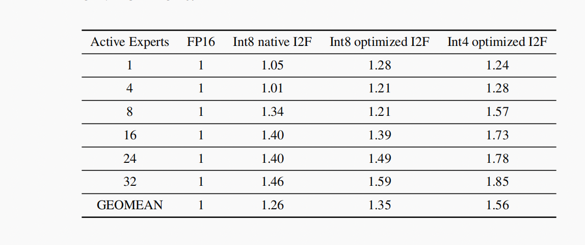
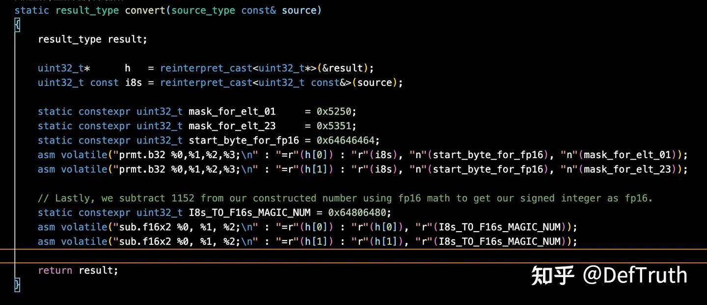
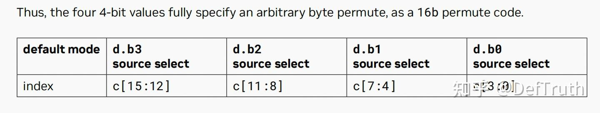
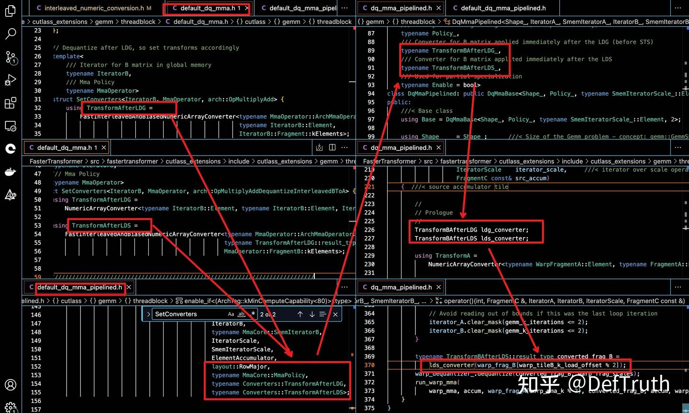

# [LLM 추론 최적화] WINT8/4-(01): PRMT 명령과 FasterTransformer 소스 분석

> 원문: https://zhuanlan.zhihu.com/p/657070837

**목차**
- 0x00 서문
- 0x01 역양자화 흐름 분석
- 0x02 PRMT 명령
- 0x03 역양자화 함수 분석
- 0x04 전체 처리
- 0x05 호출 경로
- 0x06 정리

### 0x00 서문

키워드: 고속 역양자화, PRMT.B32, SUB.F16X2, de-interleave

이전 글에서는 NVIDIA가 MoE 대형 모델 추론에서 사용한 고속 역양자화의 원리를 분석했다. native Int8ToFloat16 변환은 성능이 기대보다 낮았고, 이를 고throughput ALU/FP16 명령 조합으로 대체했다. 이번 글은 원리가 아니라 실제 구현을 본다.



LeetCUDA/CUDA-Learn-Notes에는 LLM/VLM 글 정리와 FlashAttention, SGEMM, HGEMM, GEMV 등 CUDA Kernel 예제 구현이 포함되어 있다.


*CUDA Learn Notes with PyTorch*

### 0x01 역양자화 흐름 분석

하드웨어를 잘 쓰기 위해 구현에서는 한 번에 int8 값 두 개를 FP16으로 변환한다. FP16 두 개가 32bit register 하나에 들어가기 때문이다. Int8 quantized weight의 역양자화 흐름은 다음과 같다.

```text
1. int8 값 네 개 [e0, e1, e2, e3]를 단일 32bit register에 load한다.
2. 두 번째 32bit register R1에 [e0 + 1024, e1 + 1024]의 FP16 표현을 만든다.
3. R1에서 [1152, 1152]를 FP16 산술로 뺀다.
   1024는 구성한 FP16 표현에서 원래 값을 얻기 위해 빼고,
   128은 unsigned 저장 bias를 제거하기 위해 뺀다.
4. e2, e3에도 같은 과정을 반복한다.
```

FasterTransformer의 구현은 `interleaved_numeric_conversion.h`에 있다.



구성한 FP16 표현에서 `1024 + 128 = 1152`를 빼는 핵심 코드는 다음과 같다.

```cpp
static constexpr uint32_t I8s_TO_F16s_MAGIC_NUM = 0x64806480;
asm volatile("sub.f16x2 %0, %1, %2;\n" : "=r"(h[0]) : "r"(h[0]), "r"(I8s_TO_F16s_MAGIC_NUM));
asm volatile("sub.f16x2 %0, %1, %2;\n" : "=r"(h[1]) : "r"(h[1]), "r"(I8s_TO_F16s_MAGIC_NUM));
```

`0x6400 | Y` 구성은 PRMT로 처리한다.

```cpp
static constexpr uint32_t mask_for_elt_01     = 0x5250;
static constexpr uint32_t mask_for_elt_23     = 0x5351;
static constexpr uint32_t start_byte_for_fp16 = 0x64646464;
asm volatile("prmt.b32 %0,%1,%2,%3;\n" : "=r"(h[0]) : "r"(i8s), "n"(start_byte_for_fp16), "n"(mask_for_elt_01));
asm volatile("prmt.b32 %0,%1,%2,%3;\n" : "=r"(h[1]) : "r"(i8s), "n"(start_byte_for_fp16), "n"(mask_for_elt_23));
```

`SUB.F16X2`는 FP16 두 개씩 병렬로 뺄 뿐이므로 이해가 쉽다. PRMT는 `0x6400 | Y`를 만드는 핵심이며, 동시에 interleaved weight를 de-interleave한다.

### 0x02 PRMT 명령

PTX ISA 8.1의 9.7.8.7 Data Movement and Conversion Instructions: `prmt`를 기준으로 설명한다.

```ptx
prmt.b32{.mode} d, a, b, c;
.mode = { .f4e, .b4e, .rc8, .ecl, .ecr, .rc16 }
```

PRMT는 두 32bit register `a`, `b`에서 임의의 네 byte를 골라 새로운 32bit 값을 만든다. 일반 형태에서는 네 개의 4bit selector가 최종 네 byte를 결정한다. source byte 번호는 다음과 같이 붙는다.

```text
{b, a} = {{b7, b6, b5, b4}, {b3, b2, b1, b0}}
```

목적 register의 각 byte마다 4bit selector가 있다. selector의 하위 3bit는 8개 source byte 중 선택할 index를 나타낸다. 최상위 bit는 원 byte를 그대로 복사할지, sign extension을 수행할지를 나타낸다. 여기서는 일반 형태만 다룬다.



예를 들어:

```text
c[3:0] = 0001
msb = 0 -> sign extension 없음
lsb = 001 -> index 1 byte 선택
d.b0 = b1
```

### 0x03 역양자화 함수 분석

FasterTransformer의 `FastInterleavedAndBiasedNumericArrayConverter`는 interleaved로 저장된 weight를 역양자화하면서 동시에 de-interleave한다.

핵심 구현은 다음 특수화다.

```cpp
template<>
struct FastInterleavedAndBiasedNumericArrayConverter<half_t, uint8_t, 4> {
    using result_type = Array<half_t, 4>;
    using source_type = Array<uint8_t, 4>;
    CUTLASS_DEVICE
    static result_type convert(source_type const& source) {
        result_type result;
        uint32_t* h = reinterpret_cast<uint32_t*>(&result);
        uint32_t const i8s = reinterpret_cast<uint32_t const&>(source);

        static constexpr uint32_t mask_for_elt_01     = 0x5250;
        static constexpr uint32_t mask_for_elt_23     = 0x5351;
        static constexpr uint32_t start_byte_for_fp16 = 0x64646464;

        asm volatile("prmt.b32 %0,%1,%2,%3;\n"
            : "=r"(h[0]) : "r"(i8s), "n"(start_byte_for_fp16), "n"(mask_for_elt_01));
        asm volatile("prmt.b32 %0,%1,%2,%3;\n"
            : "=r"(h[1]) : "r"(i8s), "n"(start_byte_for_fp16), "n"(mask_for_elt_23));

        static constexpr uint32_t I8s_TO_F16s_MAGIC_NUM = 0x64806480;
        asm volatile("sub.f16x2 %0, %1, %2;\n"
            : "=r"(h[0]) : "r"(h[0]), "r"(I8s_TO_F16s_MAGIC_NUM));
        asm volatile("sub.f16x2 %0, %1, %2;\n"
            : "=r"(h[1]) : "r"(h[1]), "r"(I8s_TO_F16s_MAGIC_NUM));

        return result;
    }
};
```

메모리의 원래 interleaved layout은 오른쪽이 low byte라고 보면 `{e3, e1, e2, e0}`이다. `start_byte_for_fp16 = 0x64646464`와 `i8s`를 PRMT의 두 입력으로 넣으면 다음 source byte 집합이 된다.

```text
{b, a} = {{0x64, 0x64, 0x64, 0x64}, {e3, e1, e2, e0}}
```

`mask_for_elt_01 = 0x5250`은 다음을 만든다.

```text
h[0] = 0x64[e1]64[e0]
```

`mask_for_elt_23 = 0x5351`은 다음을 만든다.

```text
h[1] = 0x64[e3]64[e2]
```

즉 PRMT는 두 가지 일을 동시에 한다.

- `0x6400 | Y` 형태의 FP16 중간 표현을 만든다.
- `{e3, e1, e2, e0}`를 `{e3, e2, e1, e0}` 형태로 de-interleave한다.

이후 `sub.f16x2`는 각 half 값에서 1152를 빼 원래 signed int8 값을 FP16으로 복원한다.

### 0x04 전체 처리

위 코드는 uint8 네 개를 처리하는 특수화다. 임의의 `N`개 uint8에 대해서는 `N`이 4의 배수인지 확인한 뒤, 4개 단위 converter를 반복 적용한다.

```cpp
template<int N>
struct FastInterleavedAndBiasedNumericArrayConverter<half_t, uint8_t, N> {
    static constexpr int VEC_WIDTH = 4;
    static_assert(!(N % VEC_WIDTH), "N must be multiple of 4.");

    CUTLASS_DEVICE
    static result_type convert(source_type const& source) {
        FastInterleavedAndBiasedNumericArrayConverter<scalar_result_type, scalar_source_type, VEC_WIDTH>
            convert_vector_;

        CUTLASS_PRAGMA_UNROLL
        for (int i = 0; i < N / VEC_WIDTH; ++i) {
            result_ptr[i] = convert_vector_(source_ptr[i]);
        }
        return result;
    }
};
```

`CUTLASS_PRAGMA_UNROLL`로 loop unroll을 유도한다.

### 0x05 호출 경로

호출 흐름은 대략 다음과 같다.

- `default_dq_mma.h`에서 `SetConverters` template을 정의한다. Volta와 Turing+ 경로를 지원한다.
- `default_dq_mma_pipelined.h`에서 `SetConverters`로 converter를 설정하고, `cutlass::gemm::threadblock::DqMmaPipelined`에 template parameter로 넘긴다.
- `dq_mma_pipelined.h`의 `DqMmaPipelined` 구현에서 `TransformBAfterLDG`, `TransformBAfterLDS` converter를 사용한다.

```cpp
TransformBAfterLDG ldg_converter;
TransformBAfterLDS lds_converter;
```

loop 안에서 `ldg_converter` 또는 `lds_converter`가 quantized weight를 변환한다. 변환은 warp 단위로 수행된다. `N`은 `MmaOperator::FragmentB::kElements`로 지정된다. 이는 MMA에서 matrix B fragment가 warp 안에서 가지는 element 수다.



### 0x06 정리

이 글은 고속 역양자화의 실제 구현 흐름, PRMT 명령의 일반 형태, FasterTransformer의 inline assembly가 하는 일을 정리했다. 여기서는 int8 weight의 역양자화만 다뤘다. int4 역양자화와 더 자세한 호출 경로는 후속 글에서 다룬다.
