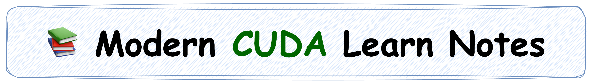
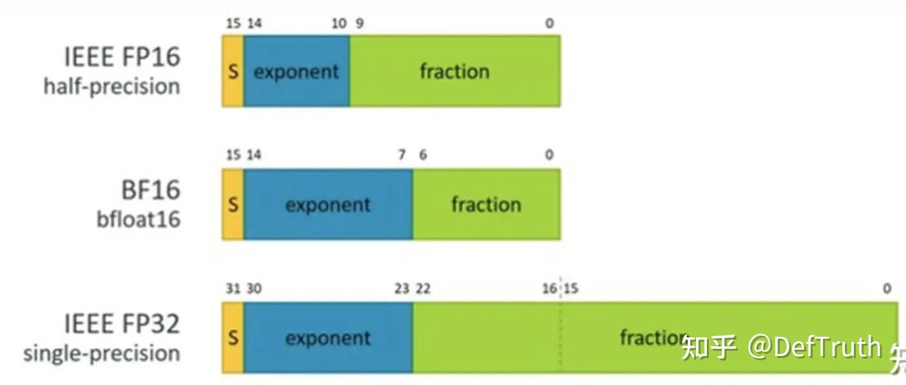

# [LLM 추론 최적화] WINT8/4-(02): 고속 역양자화 INT8 -> BF16

> 원문: https://zhuanlan.zhihu.com/p/657073159

**목차**
- 0x00 서문
- 0x01 BF16의 특수 처리
- 0x02 INT8 -> BF16 소스 분석
- 0x03 전체 처리
- 0x04 정리

### 0x00 서문

키워드: 고속 역양자화, `__byte_perm`, BF16, `fp32_base`

앞의 두 글에서는 NVIDIA가 MoE 대형 모델 추론에서 사용한 고속 역양자화 원리와 INT8 -> FP16 구현을 분석했다. FP16과 BF16은 모두 대형 모델 추론에서 흔히 쓰는 데이터 타입이다. 다만 BF16의 mantissa는 7bit뿐이라 int8 데이터 8bit를 직접 저장할 수 없다. 그래서 FasterTransformer는 BF16에 대해 별도 처리를 한다. 이 글은 INT8을 BF16으로 고속 역양자화하는 구현을 본다.


LeetCUDA/CUDA-Learn-Notes에는 LLM/VLM 글 정리와 FlashAttention, SGEMM, HGEMM, GEMV 등 CUDA Kernel 예제 구현이 포함되어 있다.


*CUDA Learn Notes with PyTorch*

### 0x01 BF16의 특수 처리

BF16과 FP16의 차이를 먼저 봐야 한다. BF16은 sign 1bit, exponent 8bit, mantissa 7bit로 구성된다. exponent는 FP32와 같고 mantissa는 FP16의 10bit보다 짧다.



uint8의 bit를 저장하려면 최소 8bit가 필요하다. BF16 mantissa는 7bit이므로 FP16 방식처럼 `0x6400 | Y`로 uint8 값을 직접 mantissa에 넣을 수 없다. FasterTransformer는 FP32를 중간 다리로 사용한다.

FP32의 mantissa는 23bit라 uint8 8bit를 충분히 담을 수 있다. 또한 FP32와 BF16은 exponent bit 수가 모두 8bit다. 따라서 FP32 -> BF16 변환은 FP32의 상위 16bit를 유지하고 하위 mantissa를 truncate하는 방식으로 간단히 처리할 수 있다.

흐름은 다음과 같다.

```text
UINT8
  -> FP32_Expr = FP32_Base_Magic_Num bits | UINT8 bits
  -> FP32_Expr_Ori = FP32_Expr - (FP32_Base_Magic_Num + 128)
  -> BF16_Expr_Ori = FP32_Expr_Ori의 상위 16bit truncate
```

### 0x02 INT8 -> BF16 소스 분석

interleaved quantized weight layout, PRMT, de-interleave 내용은 이전 글과 같다. BF16 변환에서 쓰는 `__byte_perm`은 PRMT의 CUDA Math API 버전으로 보면 된다.

소스는 FasterTransformer의 `FastInterleavedAndBiasedNumericArrayConverter` 구조체에 있다.

```cpp
template<>
struct FastInterleavedAndBiasedNumericArrayConverter<bfloat16_t, uint8_t, 4> {
    using result_type = Array<bfloat16_t, 4>;
    using source_type = Array<uint8_t, 4>;
```

핵심 `convert` 함수는 interleaved weight를 역양자화하면서 동시에 de-interleave한다.

```cpp
CUTLASS_DEVICE
static result_type convert(source_type const& source) {
    result_type result;
#if (defined(__CUDA_ARCH__) && (__CUDA_ARCH__ >= 800))
    uint32_t*      bf16_result_ptr = reinterpret_cast<uint32_t*>(&result);
    uint32_t const i8s             = reinterpret_cast<uint32_t const&>(source);

    static constexpr uint32_t fp32_base = 0x4B000000;
    float fp32_intermediates[4];

    uint32_t* fp32_intermediates_casted = reinterpret_cast<uint32_t*>(fp32_intermediates);
    fp32_intermediates_casted[0] = __byte_perm(i8s, fp32_base, 0x7650);
    fp32_intermediates_casted[1] = __byte_perm(i8s, fp32_base, 0x7652);
    fp32_intermediates_casted[2] = __byte_perm(i8s, fp32_base, 0x7651);
    fp32_intermediates_casted[3] = __byte_perm(i8s, fp32_base, 0x7653);

    CUTLASS_PRAGMA_UNROLL
    for (int ii = 0; ii < 4; ++ii) {
        fp32_intermediates[ii] -= 8388736.f;
    }

    CUTLASS_PRAGMA_UNROLL
    for (int ii = 0; ii < 2; ++ii) {
        bf16_result_ptr[ii] =
            __byte_perm(fp32_intermediates_casted[2 * ii + 0],
                        fp32_intermediates_casted[2 * ii + 1],
                        0x7632);
    }
#endif
    return result;
}
```

`0x4B000000`은 FP32 magic number다.

```text
0x4B000000 -> 0b 0 10010110 0000...0000
10010110 -> 150
150 - 127 = 23
2^23 = 8388608
+ 128 = 8388736
```

FP32 mantissa가 23bit이므로 exponent 값 `2^23`을 사용한다. quantized value에는 128 bias가 들어 있으므로 최종적으로 `8388608 + 128 = 8388736`을 뺀다.

`__byte_perm`으로 FP32 중간 표현을 만든다.

```cpp
// {b, a} = {{0x4B, 0x00, 0x00, 0x00}, {e3, e1, e2, e0}}
fp32_intermediates_casted[0] = __byte_perm(i8s, fp32_base, 0x7650);  // 0x{4B0000}{e0}
fp32_intermediates_casted[1] = __byte_perm(i8s, fp32_base, 0x7652);  // 0x{4B0000}{e1}
fp32_intermediates_casted[2] = __byte_perm(i8s, fp32_base, 0x7651);  // 0x{4B0000}{e2}
fp32_intermediates_casted[3] = __byte_perm(i8s, fp32_base, 0x7653);  // 0x{4B0000}{e3}
```

여기서 `{e3, e1, e2, e0}`는 interleaved 저장 때문이다. 변환 과정에서 `{e3, e2, e1, e0}`로 de-interleave된다.

이후 FP32 값에서 `8388736.f`를 빼 원래 signed int8 값의 FP32 표현을 얻는다.

```cpp
CUTLASS_PRAGMA_UNROLL
for (int ii = 0; ii < 4; ++ii) {
    fp32_intermediates[ii] -= 8388736.f;
}
```

마지막으로 다시 `__byte_perm`을 사용해 FP32 두 개의 상위 16bit만 취한다. 이것이 BF16 표현이다.

```cpp
bf16_result_ptr[ii] =
    __byte_perm(fp32_intermediates_casted[2 * ii + 0],
                fp32_intermediates_casted[2 * ii + 1],
                0x7632);
```

`0x7632`는 두 FP32의 high 2 bytes를 골라 32bit register 하나에 BF16 두 개를 pack한다.

### 0x03 전체 처리

4개 uint8을 BF16으로 바꾸는 특수화를 만든 뒤, `N`개 element에 대해서는 4개 단위로 반복한다.

```cpp
template<int N>
struct FastInterleavedAndBiasedNumericArrayConverter<bfloat16_t, uint8_t, N> {
    static constexpr int VEC_WIDTH = 4;
    static_assert(!(N % VEC_WIDTH), "N must be multiple of 4.");

    CUTLASS_DEVICE
    static result_type convert(source_type const& source) {
        FastInterleavedAndBiasedNumericArrayConverter<scalar_result_type, scalar_source_type, VEC_WIDTH>
            convert_vector_;

        CUTLASS_PRAGMA_UNROLL
        for (int i = 0; i < N / VEC_WIDTH; ++i) {
            result_ptr[i] = convert_vector_(source_ptr[i]);
        }
        return result;
    }
};
```

호출 경로는 이전 PRMT 글과 동일하므로 반복하지 않는다.

### 0x04 정리

BF16은 mantissa가 7bit라 int8 8bit를 직접 담을 수 없다. 따라서 INT8 -> BF16 고속 역양자화는 FP16 경로와 다르게 FP32를 중간 표현으로 사용한다.

핵심은 다음과 같다.

- `0x4B000000`으로 `2^23` FP32 magic number를 만든다.
- `__byte_perm`으로 `0x4B000000 | Y` 형태의 FP32 중간 표현을 만든다.
- `8388736 = 2^23 + 128`을 빼 signed int8 값을 FP32로 얻는다.
- FP32 상위 16bit를 잘라 BF16으로 pack한다.

결국 구조는 FP16 경로와 같다. 단지 BF16의 mantissa가 짧기 때문에 FP32를 우회로로 쓴다.
