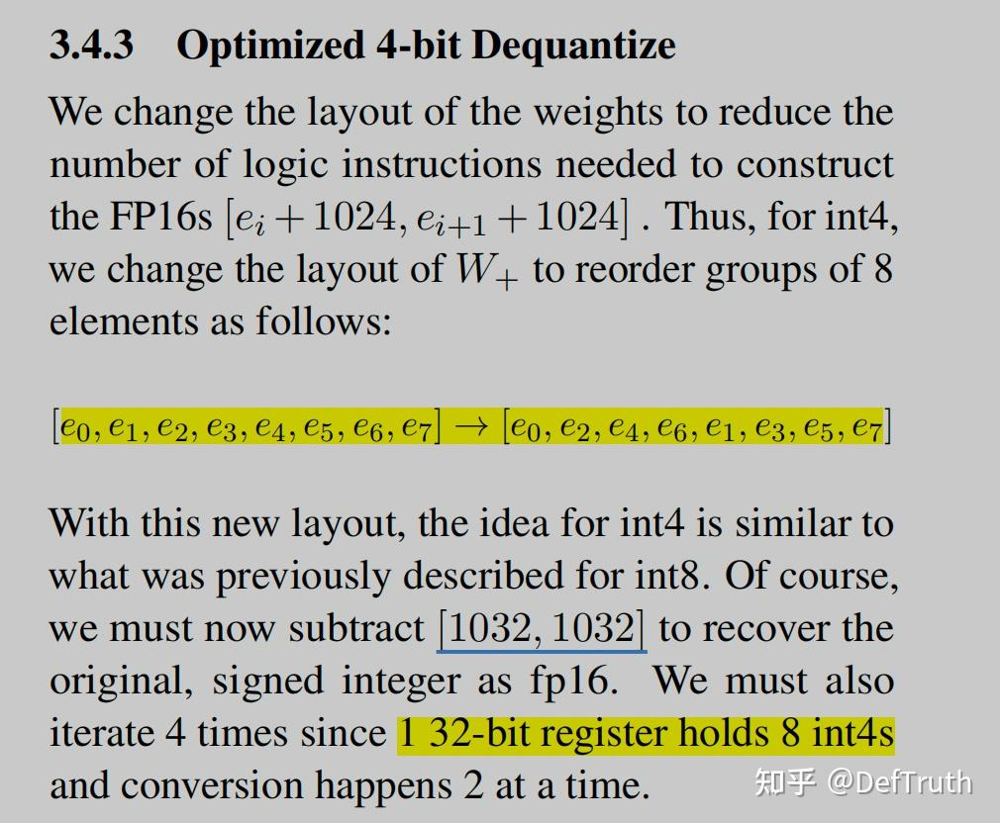

# [LLM][WO] WINT8/4-(03): LOP3 명령어와 INT4 -> FP16/BF16

> 원문: https://zhuanlan.zhihu.com/p/657073857

목차

- 0x00 서문
- 0x01 INT4 dequantization flow
- 0x02 LOP3 instruction detail
- 0x03 INT4 -> FP16
- 0x04 INT4 -> BF16
- 0x05 call chain
- 0x06 정리

### 0x00 서문

키워드: INT4, FP16, BF16, LOP3.B32, FMA.RN.F16X2, SUB.F16X2

앞의 세 글에서는 NVIDIA가 MoE large model inference에서 사용한 fast dequantization 기술의 원리, 그리고 INT8을 FP16/BF16으로 빠르게 dequantize하는 구체 구현을 분석했다. FP16과 BF16은 large model inference에서 자주 쓰이는 data type이다. 이 글에서는 INT4를 F16/BF16으로 빠르게 dequantize할 때 구체적으로 어떻게 처리하는지 계속 본다. 논문에서는 INT4 처리를 거의 한 줄로 넘기고, 세부 내용은 code 안에 있다. 이 글은 앞의 세 글을 먼저 읽은 뒤 보는 편이 좋다.


DefTruth: WINT8/4 (00), fast dequantization algorithm 입문.


DefTruth: WINT8/4 (01), PRMT instruction detail과 FasterTransformer source analysis.


DefTruth: WINT8/4 (02), fast dequantization INT8 -> BF16.

더 많은 기술 note와 CUDA learning note는 CUDA-Learn-Notes(CUDA Learn Notes with PyTorch)에 정리했다. CUDA-Learn-Notes에는 **LLM/VLM** 글 정리, **FlashAttention/SGEMM/HGEMM/GEMV** 등 일반적인 **CUDA Kernel**의 **example implementation**이 포함되어 있다. 현재 누적 **3k+ stars**다.

https://github.com/xlite-dev/CUDA-Learn-Notes


CUDA Learn Notes with PyTorch.

### 0x01 INT4 dequantization flow

- weight interleaving과 1032

기본 flow는 INT8과 거의 비슷하지만 code implementation은 차이가 크다. 논문에서는 INT4 weight가 interleaved 형태로 저장된다고 언급한다. even index와 odd index를 각각 묶어 둔다. 이 weight interleaving operation은 이전 글의 INT8 dequantization에서도 언급했지만, 논문에서는 자세히 설명하지 않는다. 또 다른 점은 INT4 dequantization에서 사용하는 magic number가 1032(1024 + 8)라는 것이다.



- INT4 dequantization의 특징

이전 PRMT instruction과 FasterTransformer source analysis 글에서 INT8 fast dequantization이 PRMT instruction을 사용한다고 설명했다. PRMT의 operation granularity는 byte다. 반면 INT4는 sub-byte이며 1 byte보다 작다. 따라서 INT8 fast dequantization에서 쓰던 방식은 INT4에 그대로 적용할 수 없다.

그러면 INT4는 어떻게 처리하는가. NVIDIA FasterTransformer implementation에서는 PRMT를 다른 instruction인 LOP3로 대체해 INT4를 FP16/BF16으로 fast dequantize하는 핵심 logic을 완성한다. 먼저 LOP3 PTX assembly instruction을 본다.

이 글에서 다루는 지식 상당수는 앞의 세 글에서 설명한 내용이므로 여기서는 반복하지 않는다.

### 0x02 LOP3 instruction detail

INT4 dequantization에서는 LOP3, FMA, SUB instruction이 사용된다. 그중 LOP3 instruction이 핵심이다. 이 절은 NVIDIA PTX ISA 8.1 document의 9.7.7.6 Logic and Shift Instructions: `lop3` section을 참고한다.

- **lop3:** Arbitrary logical operation on 3 inputs.

```ptx
lop3.b32 d, a, b, c, immLut;
```

LOP3 instruction은 세 input `a`, `b`, `c`에 대해 임의의 logical operation을 수행한다. 예를 들어 `(a & b) | c` 같은 operation이다. logical operation 결과는 destination register `d`에 저장된다. 이 register도 32-bit다. operand `immLut`는 `a`, `b`, `c`에 어떤 operation을 수행할지 지정한다.

PTX ISA 8.1 document 설명에 따르면 `immLut`는 look-up table과 대응된다. `immLut`의 possible value range는 0-255이고, 각 value는 특정 `F(a,b,c)`에 mapping된다. 예를 들어 `immLut`가 `0x80`이면 LOP3는 `a`, `b`, `c`에 대해 `d = (a & b & c)`를 수행한다.


그렇다면 어떤 operation, 예를 들어 `F(a,b,c) = (a & b & c)`에 대해 `immLut` 값을 어떻게 지정할까. logical operation `F(a,b,c)`에 대해 같은 method를 세 predefined constant value `ta`, `tb`, `tc`에 적용해 `immLut` 값을 계산할 수 있다.

```cpp
// ta, tb, tc are predefined values, each 8 bits.
ta = 0xF0;
tb = 0xCC;
tc = 0xAA;
immLut = F(ta, tb, tc);
```

몇 가지 example:

```text
If F = (a & b & c);
immLut = 0xF0 & 0xCC & 0xAA = 0x80
If F = (a | b | c);
immLut = 0xF0 | 0xCC | 0xAA = 0xFE
If F = (a & b & ~c);
immLut = 0xF0 & 0xCC & (~0xAA) = 0x40
If F = ((a & b | c) ^ a);
immLut = (0xF0 & 0xCC | 0xAA) ^ 0xF0 = 0x1A
```

예를 들어 LOP3가 `(a & b & c)` operation을 수행하게 만들려면 `immLut` value는 `0xF0 & 0xCC & 0xAA = 0x80`이다. 즉 `ta`, `tb`, `tc`에 `a`, `b`, `c`와 같은 logical operation을 적용해 얻은 값이 `immLut`다.

```ptx
lop3.b32 d, a, b, c, 0x80; // result d = (a & b & c)
```

LOP3 instruction 설명은 대략 이렇다. FMA, SUB는 일반적인 instruction이므로 여기서는 길게 풀지 않는다.

### 0x03 INT4 -> FP16

interleaved quantized weight의 memory layout과 de-interleaving 관련 내용은 여기서 반복하지 않는다. 이전 글을 참고하면 된다.

source는 NVIDIA FasterTransformer의 `FastInterleavedAndBiasedNumericArrayConverter` struct에 있다.

```cpp
template<>
struct FastInterleavedAndBiasedNumericArrayConverter<half_t, uint4b_t, 8> {
    using result_type = Array<half_t, 8>;
    using source_type = Array<uint4b_t, 8>;
```

핵심 구현은 `convert` function이다. 이 function은 INT4 -> FP16 dequantization을 수행하고, interleaved storage의 weight를 dequantize하면서 동시에 de-interleave해야 한다. 아래는 개인 주석을 추가한 version이다.

```cpp
template<>
struct FastInterleavedAndBiasedNumericArrayConverter<half_t, uint4b_t, 8> {
    using result_type = Array<half_t, 8>;
    using source_type = Array<uint4b_t, 8>;

    CUTLASS_DEVICE
    static result_type convert(source_type const& source)
    {
        result_type result;

        uint32_t*      h   = reinterpret_cast<uint32_t*>(&result);
        // i4s = {e7,e5,e3,e1,e6,e4,e2,e0}
        // This is related to CUTLASS Array implementation.
        // Array<uint4b_t, 8> effectively has one private member:
        // Storage storage[kStorageElements], a continuous memory block.
        // Other members are static const and evaluated at compile time.
        // Therefore source reference/pointer points to storage.
        // For Array<uint4b_t, 8>, storage is uint32_t.
        uint32_t const i4s = reinterpret_cast<uint32_t const&>(source);

        // First, we extract the i4s and construct an intermediate fp16 number.
        static constexpr uint32_t immLut                = (0xf0 & 0xcc) | 0xaa;  // 0b11101010
        static constexpr uint32_t BOTTOM_MASK           = 0x000f000f;  // 0xf -> 0b1111 select 0,4
        static constexpr uint32_t TOP_MASK              = 0x00f000f0;  // select 1,5
        static constexpr uint32_t I4s_TO_F16s_MAGIC_NUM = 0x64006400;  // 1024

        // Note that the entire sequence only requires 1 shift instruction. This is thanks to the register packing
        // format and the fact that we force our integers to be unsigned, and account for this in the fp16 subtractions.
        // In addition, I exploit the fact that sub and fma have the same throughput in order to convert elt_23 and
        // elt_67 to fp16 without having to shift them to the bottom bits before hand.
        // NOTE: uint4b_t keep 4 bits in low 4bits of uint8_t's 8 bits, the internal storage is 8bits uint8_t.

        // Shift right by 8 to now consider elt_45 and elt_67. Issue first to hide RAW dependency if we issue
        // immediately before required.
        // First shift right by 8 bits to get top_i4s. This obtains e7-e4 without changing masks.
        // {e7,e5,e3,e1,e6,e4,e2,e0} -> shift 8 -> {0x0,0x0,e7,e5,e3,e1,e6,e4}
        const uint32_t top_i4s = i4s >> 8;
        // Extract elt_01 - (i4s & 0x000f000f) | 0x64006400
        asm volatile("lop3.b32 %0, %1, %2, %3, %4;\n"
                     : "=r"(h[0])
                     : "r"(i4s), "n"(BOTTOM_MASK), "n"(I4s_TO_F16s_MAGIC_NUM), "n"(immLut));
        // Extract elt_23 (i4s & 0x00f000f0) | 0x64006400
        // NOTE: 0x64[e3]064[e2]0. At this time e3 and e2 are stored in high 4 bits
        // of the two low bytes. This is why fma is used later to recover original values.
        // Stored in high 4 bits means y * 16 (2^4 = 16).
        asm volatile("lop3.b32 %0, %1, %2, %3, %4;\n"
                     : "=r"(h[1])
                     : "r"(i4s), "n"(TOP_MASK), "n"(I4s_TO_F16s_MAGIC_NUM), "n"(immLut));
        // Extract elt_45 (top_i4s & 0x000f000f) | 0x64006400
        asm volatile("lop3.b32 %0, %1, %2, %3, %4;\n"
                     : "=r"(h[2])
                     : "r"(top_i4s), "n"(BOTTOM_MASK), "n"(I4s_TO_F16s_MAGIC_NUM), "n"(immLut));
        // Extract elt_67 (top_i4s & 0x00f000f0) | 0x64006400
        // NOTE: 0x64[e7]064[e6]0. At this time e7 and e6 are stored in high 4 bits
        // of the two low bytes. This is why fma is used later to recover original values.
        // Stored in high 4 bits means y * 16 (2^4 = 16).
        asm volatile("lop3.b32 %0, %1, %2, %3, %4;\n"
                     : "=r"(h[3])
                     : "r"(top_i4s), "n"(TOP_MASK), "n"(I4s_TO_F16s_MAGIC_NUM), "n"(immLut));

        // I use inline PTX below because I am not sure if the compiler will emit float2half instructions if I use the
        // half2 ctor. In this case, I chose performance reliability over code readability.

        // This is the half2 {1032, 1032} represented as an integer.
        static constexpr uint32_t FP16_TOP_MAGIC_NUM = 0x64086408;
        // This is the half2 {1 / 16, 1 / 16} represented as an integer.
        static constexpr uint32_t ONE_SIXTEENTH = 0x2c002c00;
        // This is the half2 {-72, -72} represented as an integer.
        // Interpretation: -72 = -64 - 8.
        // mantissa expression: 1024/16 + ((x+8)*16)/16 - 64 - 8 = x
        // Y_FP16 = 1024 + (x+8)*16, x = Y_FP16/16 - 64 - 8
        // (1024 + (x+8)*16)/16 = 64 + x + 8
        static constexpr uint32_t NEG_72 = 0xd480d480;

        // Finally, we construct the output numbers.
        // NOTE: uint4b_t keep 4 bits in low 4bits of uint8_t's 8 bits, the internal storage is 8bits uint8_t.
        // Convert elt_01
        asm volatile("sub.f16x2 %0, %1, %2;\n" : "=r"(h[0]) : "r"(h[0]), "r"(FP16_TOP_MAGIC_NUM));
        // Convert elt_23
        asm volatile("fma.rn.f16x2 %0, %1, %2, %3;\n" : "=r"(h[1]) : "r"(h[1]), "r"(ONE_SIXTEENTH), "r"(NEG_72));
        // Convert elt_45
        asm volatile("sub.f16x2 %0, %1, %2;\n" : "=r"(h[2]) : "r"(h[2]), "r"(FP16_TOP_MAGIC_NUM));
        // Convert elt_67
        asm volatile("fma.rn.f16x2 %0, %1, %2, %3;\n" : "=r"(h[3]) : "r"(h[3]), "r"(ONE_SIXTEENTH), "r"(NEG_72));

        return result;
    }
};
```

먼저 `i4s = {e7,e5,e3,e1,e6,e4,e2,e0}`를 본다. 이는 interleaved weight를 load하기 때문이다. even-index element는 low byte에, odd-index element는 high byte에 저장된다. 그리고 `Array<uint4b_t, 8>&` type의 `source`에 `reinterpret_cast`를 사용할 수 있는 것은 CUTLASS `Array` data structure implementation과 관련된다.

`Array<uint4b_t, 8>`은 실제로 private member variable `Storage storage[kStorageElements]` 하나만 갖고, 이것이 contiguous memory block을 나타낸다. 다른 것은 모두 static const member이고 compile time에 evaluate된다. 따라서 `source` reference 또는 pointer가 실제로 가리키는 것은 `storage`다. `Array<uint4b_t, 8>`에서 `storage`는 `uint32_t`다.

`Array<uint4b_t, 8>` 관련 구현은 CUTLASS의 `array_subbyte.h`에서 찾을 수 있다. 여기서 storage type 지정은 다음과 같다.

```cpp
  /// Storage type
  using Storage = typename platform::conditional<
    ((kSizeBits % 32) != 0),
    typename platform::conditional<
      ((kSizeBits % 16) != 0),
      uint8_t,
      uint16_t
    >::type,
    uint32_t
  >::type;
// ....
private:
  /// Internal storage
  Storage storage[kStorageElements];
```

그다음 predefined variable을 지정한다. 여기에는 `immLut`, `BOTTOM_MASK`, `TOP_MASK`, `I4s_TO_F16s_MAGIC_NUM`이 포함된다. `BOTTOM_MASK`와 `TOP_MASK`는 LOP3 instruction의 `b`에 해당하고, `I4s_TO_F16s_MAGIC_NUM`은 LOP3 instruction의 `c`에 해당한다. `immLut`는 LOP3의 `a`, `b`, `c`에 `(a & b) | c` logical operation을 수행하도록 지정한다.

```cpp
static constexpr uint32_t immLut                = (0xf0 & 0xcc) | 0xaa;  // 0b11101010
static constexpr uint32_t BOTTOM_MASK           = 0x000f000f;  // 0xf -> 0b1111 select index 0,4
static constexpr uint32_t TOP_MASK              = 0x00f000f0;  // select index 1,5
static constexpr uint32_t I4s_TO_F16s_MAGIC_NUM = 0x64006400;  // 1024
```

이후 `i4s`를 8bit right shift해서 `top_i4s`를 얻는다. 이렇게 하면 `BOTTOM_MASK`와 `TOP_MASK`를 재사용해서 `e7`, `e6`, `e3`, `e2`를 얻을 수 있다.

```text
{e7,e5,e3,e1,e6,e4,e2,e0} -> shift right 8 bits -> {0x0,0x0,e7,e5,e3,e1,e6,e4}
```

그다음 LOP3 instruction으로 `0x6400 | Y` construction과 de-interleaving operation을 수행한다. 주의할 점은 `elt_23`이다. LOP3 instruction이 실행된 뒤 `e3`와 `e2`는 각각 두 low byte의 **high 4 bits**에 저장된다. 이것이 뒤에서 FMA instruction으로 original value를 recover해야 하는 이유다. high 4 bits에 저장되면 값은 original value의 16배가 된다. 즉 `Y_In_High_4bits = Y_In_Low_4bits * 16`이다. 여기서 `2^4 = 16`이다.

```cpp
// Extract elt_01 - (i4s & 0x000f000f) | 0x64006400
asm volatile("lop3.b32 %0, %1, %2, %3, %4;\n"
    : "=r"(h[0])
    : "r"(i4s), "n"(BOTTOM_MASK), "n"(I4s_TO_F16s_MAGIC_NUM), "n"(immLut));
// Extract elt_23 (i4s & 0x00f000f0) | 0x64006400
// NOTE: 0x64[e3]064[e2]0. At this time e3 and e2 are stored in high 4 bits
// of the two low bytes. This is why fma is used later to recover original values.
// Stored in high 4 bits means y * 16 (2^4 = 16).
asm volatile("lop3.b32 %0, %1, %2, %3, %4;\n"
              : "=r"(h[1])
              : "r"(i4s), "n"(TOP_MASK), "n"(I4s_TO_F16s_MAGIC_NUM), "n"(immLut));
```

마지막으로 `elt_01`, `elt_45`에는 `SUB.F16X2`를 사용해 magic number를 빼고 original value를 recover한다. 이 부분은 이해하기 쉽다.

```cpp
// Convert elt_01
asm volatile("sub.f16x2 %0, %1, %2;\n" : "=r"(h[0]) : "r"(h[0]), "r"(FP16_TOP_MAGIC_NUM));
// Convert elt_45
asm volatile("sub.f16x2 %0, %1, %2;\n" : "=r"(h[2]) : "r"(h[2]), "r"(FP16_TOP_MAGIC_NUM));
```

반면 `elt_23`, `elt_67`은 `FMA.RN.F16X2` instruction으로 original value를 recover한다.

```cpp
// Convert elt_23
asm volatile("fma.rn.f16x2 %0, %1, %2, %3;\n" : "=r"(h[1]) : "r"(h[1]), "r"(ONE_SIXTEENTH), "r"(NEG_72));
// Convert elt_67
asm volatile("fma.rn.f16x2 %0, %1, %2, %3;\n" : "=r"(h[3]) : "r"(h[3]), "r"(ONE_SIXTEENTH), "r"(NEG_72));
```

이는 `e3`, `e2`, `e7`, `e6`가 각 byte의 high 4 bits에 저장되어 있기 때문이다. 일반적으로 4-subbyte는 8bits의 low 4 bits에 저장되어야 한다. 지금은 high 4 bits에 있으므로 source code는 먼저 low 4 bits로 shift하지 않고 FMA instruction으로 equivalent mathematical operation을 수행해 original value를 recover한다.

```cpp
// This is the half2 {1 / 16, 1 / 16} represented as an integer.
static constexpr uint32_t ONE_SIXTEENTH = 0x2c002c00;
// This is the half2 {-72, -72} represented as an integer.
// Interpretation: -72 = -64 - 8.
// mantissa expression: 1024/16 + ((x+8)*16)/16 - 64 - 8 = x
// Y_FP16 = 1024 + (x+8)*16, x = Y_FP16/16 - 64 - 8
// (1024 + (x+8)*16)/16 = 64 + x + 8
static constexpr uint32_t NEG_72 = 0xd480d480;
```

따라서 현재 `Y_FP16`에 `Y_FP16 / 16 - 64 - 8`을 수행하면 FP16으로 표현된 `Y` original value를 얻는다. 이는 정확히 하나의 FMA operation이다.

### 0x04 INT4 -> BF16

implementation logic은 INT4 -> FP16과 비슷하며, LOP3 instruction과 FMA instruction에 의존한다. 주의할 점은 magic number와 BF16 mantissa가 7bit라서 생기는 차이다. BF16은 mantissa가 7bit이므로 magic number는 `2^7 = 128`을 선택한다. 동시에 mantissa가 7bit뿐이기 때문에 INT4 -> BF16에서는 FP16 변환처럼 8bit right shift 처리로 overhead를 줄이기 어렵다. 다른 세부 내용은 길게 반복하지 않고 개인 주석을 넣은 version을 본다.

```cpp
template<>
struct FastInterleavedAndBiasedNumericArrayConverter<bfloat16_t, uint4b_t, 8> {
    using result_type = Array<bfloat16_t, 8>;
    using source_type = Array<uint4b_t, 8>;

    CUTLASS_DEVICE
    static result_type convert(source_type const& source)
    {
        result_type result;
#if (defined(__CUDA_ARCH__) && (__CUDA_ARCH__ >= 800))

        uint32_t*      h          = reinterpret_cast<uint32_t*>(&result);
        uint32_t const source_i4s = reinterpret_cast<uint32_t const&>(source);

        // First, we extract the i4s and construct an intermediate bf16 number.
        // immLut is the same as FP16 path, representing (a&b)|c.
        // For INT4->BF16, only one mask 0x000f000f is used.
        // magic number 0x43004300 represents two BF16 values.
        // The real value is 2^7 = 128 because BF16 has 7 mantissa bits.
        static constexpr uint32_t immLut                 = (0xf0 & 0xcc) | 0xaa;
        static constexpr uint32_t MASK                   = 0x000f000f;
        static constexpr uint32_t I4s_TO_BF16s_MAGIC_NUM = 0x43004300;  // 2^7=128

        // We don't have enough mantissa to remove as much shift overhead as FP16, so we must loop.
        // No shift needed for first item.
        // BF16 mantissa is not enough for the same 8-bit shift trick as FP16, so loop is used.
        uint32_t i4s = source_i4s;
        asm volatile("lop3.b32 %0, %1, %2, %3, %4;\n"
                     : "=r"(h[0])
                     : "r"(i4s), "n"(MASK), "n"(I4s_TO_BF16s_MAGIC_NUM), "n"(immLut));
        CUTLASS_PRAGMA_UNROLL
        for (int ii = 1; ii < result_type::kElements / 2; ++ii) {
            i4s >>= sizeof_bits<typename source_type::Element>::value;
            // (i4s & 0x000f000f) | 0x43004300
            asm volatile("lop3.b32 %0, %1, %2, %3, %4;\n"
                         : "=r"(h[ii])
                         : "r"(i4s), "n"(MASK), "n"(I4s_TO_BF16s_MAGIC_NUM), "n"(immLut));
        }

        // This is the BF16 {-136, -136} represented as an integer.
        static constexpr uint32_t BF16_BIAS = 0xC308C308;  // -128-8
        static constexpr uint32_t BF16_ONE  = 0x3F803F80;  // 2^(127-127) = 1

        // Finally, we construct the output numbers.
        // Finally use FMA to recover original values.
        CUTLASS_PRAGMA_UNROLL
        for (int ii = 0; ii < result_type::kElements / 2; ++ii) {
            // Since this section is for Ampere+, we use bf16 fma to do the bias subtraction
            asm("fma.rn.bf16x2 %0, %1, %2, %3;\n" : "=r"(h[ii]) : "r"(h[ii]), "r"(BF16_ONE), "r"(BF16_BIAS));
        }
    }
};
```

### 0x05 call chain

자세한 내용은 WINT8/4 (01) PRMT instruction detail과 FasterTransformer source analysis의 call-chain analysis를 보면 된다.

### 0x06 정리

이 글은 fast dequantization algorithm이 INT4에 어떻게 적용되는지, LOP3 assembly instruction의 구체 사용법, 그리고 FasterTransformer에서 INT4 -> FP16/BF16 source code와 inline assembly가 어떤 역할을 하는지 정리했다.

여기까지 쓰면 large model WINT8/4 analysis series는 거의 끝난다. 총 4편이다. 앞의 세 편은 이전 글을 참고하면 된다.

계속 갱신한다. 오타는 먼저 올리고 나중에 고친다.
