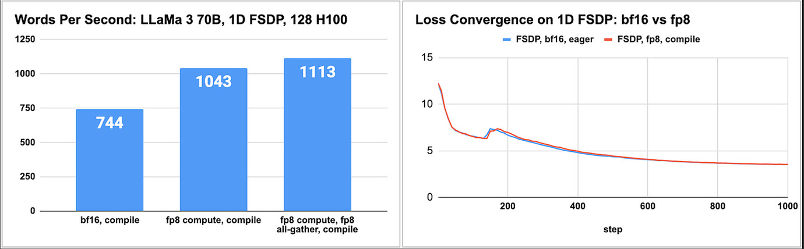
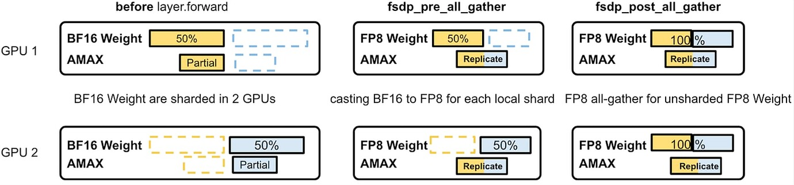
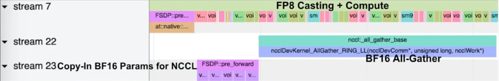
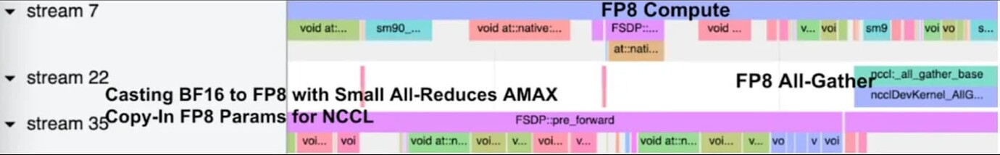
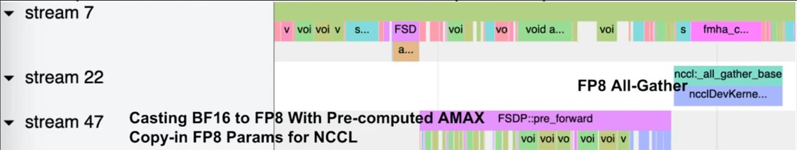
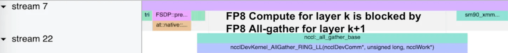
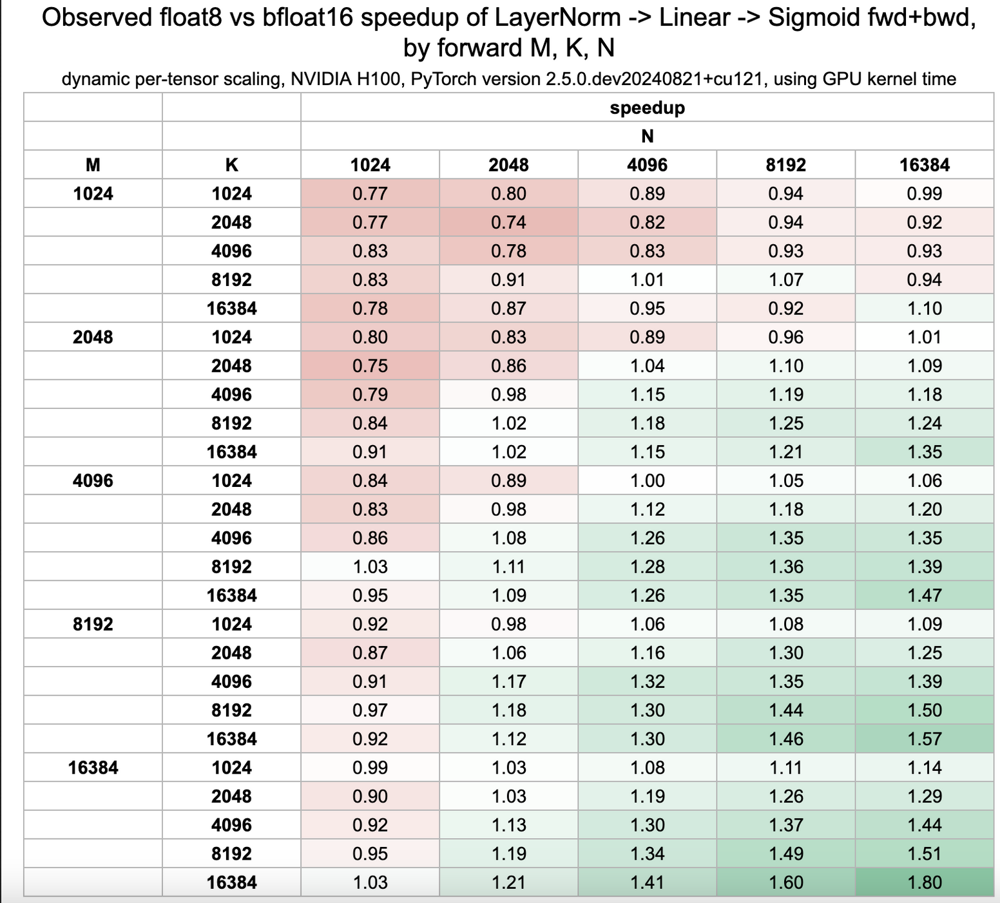

> 출처: https://discuss.pytorch.org/t/distributed-w-torchtitan-enabling-float8-all-gather-in-fsdp2/209323 . 아래 글은 두 주제를 포함합니다. 첫 번째는 FSDP2에서 Float8 All-Gather를 활성화하는 Discussion 번역이고, 두 번째는 TorchAO의 Float8 구현 quick look 번역입니다. 이 문서는 주로 FSDP2에서 float8 all-gather 기능을 활성화하는 구현과 최적화를 소개합니다. 128개 H100 GPU에서 Llama3-70B model pretraining을 검증한 결과 bfloat16 대비 1.50배 성능 향상을 얻었으며, 그중 20%는 float8 all-gather에서, 80%는 float8 computation에서 왔습니다. 문서는 Float8 training의 두 핵심 component, 즉 `torch._scaled_mm` 기반 float8 computation과 bandwidth를 50% 절약할 수 있는 float8 communication을 자세히 설명합니다. optimization strategy에서는 Float8 computation + Bfloat16 All-Gather로 1.40배 speedup을 얻고, independent AMAX All-Reduce가 있는 Float8 All-Gather와 combined AMAX AllReduce로 각각 0.02배와 0.08배의 추가 개선을 얻습니다. 또한 NCCL과 Float8 computation 사이의 SM resource competition도 최적화합니다. 문서는 `nn.Linear`를 `Float8Linear`로 대체하고, FSDP2를 configure하고, scale factor를 처리하며 type conversion을 구현하는 전체 code example도 제공합니다. 실제 적용에서는 작은 matrix(예: 1024x2048)는 bfloat16을 유지하고, 큰 matrix(예: 4096x8192)는 speedup을 얻기 위해 float8을 사용하는 것을 권합니다. 향후 작업 방향에는 tensor parallel과 pipeline parallel에서 Float8 지원, performance 향상을 위한 delayed scaling 구현, precision 개선을 위한 row-wise scaling 탐색이 포함됩니다. TorchAO의 Float8 구현은 TorchTitan에서 end-to-end로 사용할 수 있으며, Meagtron-LM의 FP8 training support도 현재 성숙해지고 있습니다.

> 참고: FSDP2는 intra-node TP를 지원합니다. FSDP가 TP를 지원하지 않는 것은 표준 Zero3입니다.

# FSDP2에서 Float8 All-Gather 활성화

## Summary

- H100의 large matrix multiplication을 가속하고 message size를 줄여 network bandwidth를 절약할 수 있기 때문에 float8에 주목합니다.
- FSDP2에서 float8 all-gather를 활성화했습니다. 독자는 TorchTitan(https://github.com/pytorch/torchtitan/blob/main/docs/float8.md)에서 Llama3 training recipe를, TorchAO/float8(https://github.com/pytorch/ao/tree/main/torchao/float8)에서 float8 dtype 구현을 찾을 수 있습니다.
- bfloat16과 비교해 float8 사용 시 1.50배 speedup을 얻으면서 비슷한 numerical precision을 유지하는 것을 관찰했습니다. 그중 20% speedup은 float8 all-gather에서, 나머지 80%는 float8 computation에서 옵니다. 이 결과는 128개 H100s*로 Llama3-70B를 pretraining한 benchmark에서 얻은 것입니다.

* Meta의 H100은 Grand Teton(https://engineering.fb.com/2024/03/12/data-center-engineering/building-metas-genai-infrastructure/)에서 custom된 것입니다. 공개 version과 specification이 다를 수 있습니다.



## Float8 training과 Float8 All-Gather가 중요한 이유

Float8 dtype은 NVIDIA H100에서 native support됩니다. Float8 training 활성화는 두 부분으로 나눌 수 있습니다. float8 computation과 float8 communication입니다.

**Float8 computation**: `torch._scaled_mm`을 통해 float8 matrix multiplication을 지원합니다(https://github.com/pytorch/pytorch/blob/618e2c9de42fbac3147e23e258122ebb76e2c041/aten/src/ATen/native/cuda/Blas.cpp#L935). bfloat16과 달리 float8은 numerical precision을 유지하기 위해 original tensor와 scale factor가 필요합니다. 사용자는 training loop에서 scale factor를 유지해야 합니다. scaling strategy에는 tensor-wise scaling, row/column-wise scaling, group-wise scaling, block-wise scaling 등이 있습니다. 이 글에서는 tensor-wise scaling과 dynamic scaling ref(https://arxiv.org/abs/2209.05433)에 집중합니다. 여기서 scale factor는 현재 high-precision tensor에서 계산됩니다.

**Float8 communication(Float8 all-gather)**: float8 computation이 있으면 float8으로 all-gather를 수행하는 것은 거의 "free"입니다. all-gather 전이나 후에 type conversion이 필요하기 때문입니다. all-gather 전에 conversion을 수행하면 bfloat16 대비 50% bandwidth를 절약할 수 있고, 그 대가는 AMAX all-reduce 한 번입니다. Float8은 model weight, activation, gradient에 적용할 수 있습니다. 우리는 float8 weight를 우선 고려합니다. training loop에서 numerical하게 더 안정적이고 low-precision dtype에 더 적합하기 때문입니다. 이 글에서는 Llama3 model에 집중합니다.

독자는 TorchTitan(https://github.com/pytorch/torchtitan/blob/main/docs/float8.md)에서 Llama3 training recipe를, TorchAO/float8(https://github.com/pytorch/ao/tree/main/torchao/float8)에서 float8 dtype 구현을 찾을 수 있습니다.

## Llama3에 Float8 weight가 있는 FSDP2 적용

Float8 model(code: https://github.com/pytorch/torchtitan/blob/0f70507f1350679428ea64f90bc5a7db17b9c103/train.py#L239C5-L239C27): PyTorch native float8은 model에 최소한의 수정만 필요합니다. Llama3-8B model을 예로 들면, 각 `nn.Linear`를 `Float8Linear`로 교체해 bfloat16 model을 float8 model로 변환하고, 이를 통해 float8 computation을 수행할 수 있습니다.

```python
TransformerBlock(
    (attention): Attention(
        (wq/wk/wv/wo): Float8Linear(in=4096, out=4096, bias=False) 
    )
    (feed_forward): FeedForward(
        (w1/w2/w3): Float8Linear(in=4096, out=14336, bias=False)
    )
    (attention_norm / ffn_norm): RMSNorm()
)
```

**FSDP2 적용**(code: https://github.com/pytorch/torchtitan/blob/0f70507f1350679428ea64f90bc5a7db17b9c103/torchtitan/parallelisms/parallelize_llama.py#L501): float8 model을 wrap하는 user experience는 bfloat16 model을 wrap하는 것과 같습니다. scale factor를 효율적으로 track하기 위해 optimizer step 이후 `precompute_float8_dynamic_scale_for_fsdp`를 호출합니다. 그러면 float8 all-gather 전에 replicated scale factor를 얻어 float8 type conversion에 사용할 수 있습니다.

```python
# wrapping each TransformerBlock, then root model
# the UX is the same across float8 model and bfloat16 model
for transformer_block in model.layers.values():
    fully_shard(transformer_block)
fully_shard(model)

# training loop
# ...
optimizer.step()
# all-reduce AMAX for Float8Linear.weight
precompute_float8_dynamic_scale_for_fsdp(model)
```

**float8 tensor subclass를 위한 FSDP2 extension**: bfloat16 model과 float8 model에서 같은 FSDP2 user experience를 유지합니다. FSDP2 extension에서 float8 type conversion을 구현했기 때문입니다. float8 linear module의 weight는 float8으로 변환하는 방법을 알고 있는 tensor subclass입니다. all-gather 전후의 type conversion logic을 아래 그림처럼 custom할 수 있습니다.

- **fsdp_pre_all_gather**(code: https://github.com/pytorch-labs/float8_experimental/blob/0aca10aced1c4b3abdf00960d83316732cb08ed1/float8_experimental/fsdp_utils.py#L166): 최신 replicated AMAX/scale factor(all-reduce 필요)에 따라 bfloat16 weight를 float8 weight로 변환합니다. 여기서 bfloat16 weight는 1/NGPU로 sharded된 상태입니다. all-reduce로 모든 rank에서 replicated AMAX와 scale factor를 얻기 때문에, all-gather 전에 sharded bfloat16 parameter를 float8으로 변환하는 것은 먼저 bfloat16 parameter를 all-gather한 뒤 float8으로 변환하는 것과 같습니다.
- **fsdp_post_all_gather**(code: https://github.com/pytorch-labs/float8_experimental/blob/0aca10aced1c4b3abdf00960d83316732cb08ed1/float8_experimental/fsdp_utils.py#L196): all-gather된 float8 data와 replicated scale factor에서 Float8Tensor를 구성해 forward와 backward에서 float8 computation을 수행할 수 있게 합니다.



## Performance deep dive

bfloat16 대비 **1.50배** speedup을 달성하기 위한 float8의 핵심 최적화를 논의합니다.

**Float8 computation + Bfloat16 All-Gather**(1.40배 speedup, code: https://github.com/pytorch-labs/float8_experimental/blob/0aca10aced1c4b3abdf00960d83316732cb08ed1/float8_experimental/float8_linear.py#L439-L452): `nn.Linear`를 `Float8Linear`로 바꿀 때 bfloat16 weight는 그대로 둘 수 있습니다. 우리는 `Float8Linear`를 일반 `nn.Linear`처럼 처리하고 FSDP2에서 bfloat16 all-gather(stream 22)를 수행하면 됩니다. `Float8Linear.forward`는 bfloat16 to float8 type conversion과 float8 matrix multiplication(stream 7)을 담당합니다. 이 방식은 1.40배 speedup을 달성하며, float8 computation의 중요성을 보여주는 강력한 baseline입니다. 하지만 최종적으로 forward 중 float8으로 변환될 parameter를 bfloat16으로 전송하므로 50% bandwidth를 낭비합니다.



**Independent AMAX All-Reduce가 있는 Float8 All-Gather**(1.40배 기반 +0.02배, code: https://github.com/pytorch/torchtitan/blob/0f70507f1350679428ea64f90bc5a7db17b9c103/torchtitan/float8_linear.py#L96): 50% bandwidth를 절약하기 위해 all-gather 전에 float8 type conversion을 수행합니다(stream 22). 따라서 `Float8Linear.forward`는 type conversion 없이 float8 weight를 직접 사용할 수 있습니다(stream 7). 하지만 float8 type conversion에는 global AMAX(abs(max)의 최대값)가 필요하므로 N개 rank 사이에서 partial AMAX(scalar 하나)를 all-reduce해야 합니다(stream 22와 35). 각 float8 parameter마다 all-reduce가 1번 필요합니다. 이런 작은 all-reduce 작업이 전체 성능을 낮춥니다.



**Combined AMAX AllReduce**(1.42배 기반 +0.08배, code: https://github.com/pytorch/torchtitan/blob/0f70507f1350679428ea64f90bc5a7db17b9c103/torchtitan/float8_linear.py#L107): optimizer step 이후 모든 float8 parameter에 대해 단일 all-reduce를 수행합니다. 따라서 FSDP hook 내부의 small all-reduce 작업을 피합니다(stream 47). 모든 float8 parameter의 AMAX를 한 번에 계산해 horizontal fusion을 구현했습니다.



**NCCL과 Float8 computation 사이의 SM competition**: NCCL version과 GPU 총 SM 수에 따라 float8 computation(stream 7)에 bubble이 나타나는 경우가 있습니다. float8 computation(sm90_xmm)과 float8 all-gather(ncclDevKernel)가 모두 SM resource를 놓고 경쟁합니다. 이상적인 상황은 항상 k번째 layer의 float8 computation을 k+1번째 layer의 float8 all-gather보다 우선하는 것입니다. 이런 상황에서 NCCL이 더 적은 SM으로 느린 communication을 수행하거나, float8 computation이 더 적은 SM을 사용하면 좋습니다. benchmark 중 `NCCL_MAX_CTAS`(https://docs.nvidia.com/deeplearning/nccl/user-guide/docs/env.html#nccl-max-ctas)를 16 또는 8로 설정하는 것이 competition 해결에 도움이 된다는 것을 발견했습니다.



## Future work

우리는 다음 방향을 적극적으로 탐색하고 있습니다(더 자세한 내용은 PyTorch roadmap 참고: https://dev-discuss.pytorch.org/t/meta-pytorch-team-2024-h2-roadmaps/2226).

**Tensor parallel과 pipeline parallel의 Float8**: tensor parallel(sequence parallel 포함)에서는 sequence dimension을 따라 module input을 shard하므로 input에 대해 float8 all-gather가 필요합니다. pipeline parallel에서는 float8에 performance gap이 있는지 검증 중입니다.

**Delayed scaling**: dynamic scaling과 비교해 delayed scaling은 이전 몇 iteration에서 AMAX를 유도해 performance gain을 얻습니다. 대가는 numerical precision 손실 가능성입니다. 실제로 float8 weight는 인접 iteration 사이에서 안정적으로 유지됩니다. 완전한 performance 달성을 위해 delayed scaling을 지원하고자 합니다.

**Row-wise scaling**: tensor-wise scaling과 비교해 row-wise scaling은 각 row에 fine-grained scale factor를 설정해 더 나은 numerical precision을 유지합니다. 대가는 backward의 복잡성입니다. matrix가 row-wise에서 column-wise로 transpose되기 때문입니다. 이는 FSDP2에서 float8 all-gather를 특별히 처리해야 합니다. 여전히 매우 exploratory한 방향입니다.

# torchao.float8

이것은 native PyTorch에서 float8으로 training을 가속하는 workflow이며, https://arxiv.org/pdf/2209.05433.pdf 에서 제안한 방법을 따릅니다. 이 codebase는 작고 수정하기 쉬우며 native PyTorch tool로 debug할 수 있고, autograd, ```torch.compile```, distributed 같은 핵심 system과 조합해 사용할 수 있도록 노력합니다. ``torch.compile``을 활성화한 상태에서 128개 GPU로 LLaMa 3 70B pretraining task를 실행한 초기 결과는 throughput이 최대 1.5배 향상될 수 있음을 보여줍니다.

:warning: <em>다가오는 기능은 feature tracker(https://github.com/pytorch/ao/issues/556)를 확인하세요.</em>

:warning: <em>codebase는 안정되었지만 아직 backward compatibility를 보장하지 않습니다.</em>

:warning: <em>이 API는 training 전용이며 float8만 지원합니다. 향후 torchao의 다른 부분과 통합할 계획입니다(https://github.com/pytorch/ao/issues/894).</em>

# Single-GPU user API

세 가지 tensor-wise scaling strategy를 제공합니다: dynamic, delayed, static. 자세한 내용은 https://arxiv.org/pdf/2209.05433.pdf Section 4.3을 참고하세요. 이 strategy들은 각각 input(`input`), weight(`weight`), gradient(`grad_output`)에 대해 설정할 수 있습니다.

## `input`, `weight`, `grad_output`에 dynamic scaling을 사용하는 float8 linear layer

각 tensor가 dynamic scaling되므로 가장 정확한 recipe입니다.

```python
import torch
import torch.nn as nn
from torchao.float8 import convert_to_float8_training
from torchao.utils import TORCH_VERSION_AT_LEAST_2_5

if not TORCH_VERSION_AT_LEAST_2_5:
    raise AssertionError("torchao.float8 requires PyTorch version 2.5 or greater")

# create model and sample input
m = nn.Sequential(
    nn.Linear(2048, 4096),
    nn.Linear(4096, 128),
).bfloat16().cuda()
x = torch.randn(4096, 2048, device="cuda", dtype=torch.bfloat16)
optimizer = torch.optim.SGD(m.parameters(), lr=0.1)

# optional: filter modules from being eligible for float8 conversion
def module_filter_fn(mod: torch.nn.Module, fqn: str):
    # don't convert the last module
    if fqn == "1":
        return False
    # don't convert linear modules with weight dimensions not divisible by 16
    if isinstance(mod, torch.nn.Linear):
        if mod.in_features % 16 != 0 or mod.out_features % 16 != 0:
            return False
    return True

# convert specified `torch.nn.Linear` modules to `Float8Linear`
convert_to_float8_training(m, module_filter_fn=module_filter_fn)

# enable torch.compile for competitive performance
m = torch.compile(m)

# toy training loop
for _ in range(10):
    optimizer.zero_grad()
    y = m(x)
    y.sum().backward()
    optimizer.step()
```

## delayed scaling을 사용하는 float8 linear layer

memory read를 최소화하므로 이론적으로 가장 효율적인 recipe입니다.

```python
import torch
import torch.nn as nn
from torchao.float8 import (
    convert_to_float8_training,
    sync_float8_amax_and_scale_history,
    Float8LinearConfig,
    ScalingType,
    CastConfig,
)
from torchao.utils import TORCH_VERSION_AT_LEAST_2_5

if not TORCH_VERSION_AT_LEAST_2_5:
    raise AssertionError("torchao.float8 requires PyTorch version 2.5 or greater")

# model and sample input 생성
# 두 linear layer를 포함하는 sequential model을 만들고 bfloat16 format으로 변환해 GPU에 올린다.
m = nn.Sequential(
    nn.Linear(2048, 4096),  # first linear layer, input dim 2048, output dim 4096
    nn.Linear(4096, 128),   # second linear layer, input dim 4096, output dim 128
).bfloat16().cuda()

# 4096x2048 random input tensor를 bfloat16 dtype으로 생성
x = torch.randn(4096, 2048, device="cuda", dtype=torch.bfloat16)

# SGD optimizer 생성, learning rate는 0.1
optimizer = torch.optim.SGD(m.parameters(), lr=0.1)

# delayed scaling config
# input, weight, grad output에 Float8LinearConfig를 설정하고 delayed scaling strategy 사용
config = Float8LinearConfig(
    cast_config_input=CastConfig(scaling_type=ScalingType.DELAYED),      # input uses delayed scaling
    cast_config_weight=CastConfig(scaling_type=ScalingType.DELAYED),     # weight uses delayed scaling
    cast_config_grad_output=CastConfig(scaling_type=ScalingType.DELAYED), # grad output uses delayed scaling
    # enable_amax_init=False,  # only needed with autocast + compile + FSDP + float8 delayed
    # enable_pre_and_post_forward=False  # only needed with autocast + compile + FSDP + float8 delayed
)

# 모든 torch.nn.Linear module을 Float8Linear로 변환하고 custom scaling behavior 지정
convert_to_float8_training(m, config=config)

# competitive performance를 위해 torch.compile 활성화
m = torch.compile(m)

# toy training loop
for _ in range(10):
    optimizer.zero_grad()  # clear gradients
    y = m(x)              # forward
    y.sum().backward()    # backward

    # float8 delayed scaling specific step: sync scales/amaxes
    # 향후 context manager로 이동할 수 있음
    sync_float8_amax_and_scale_history(m)

    optimizer.step()      # update parameters
```

# Multi-GPU user API

`DTensor` 기반 distributed API(https://pytorch.org/docs/stable/distributed.tensor.parallel.html), 예를 들어 FSDP, TP, SP와 조합해 사용합니다. distributed environment에서 `torchao.float8`을 사용하는 방법은 torchtitan(https://github.com/pytorch/torchtitan) repository의 예시를 참고하세요.

:warning: <em>FSDP를 사용할 때는 backward에서 unsharded fp8 weight가 저장되지 않도록 `config.force_recompute_fp8_weight_in_bwd`를 활성화하는 것을 권장합니다. custom activation checkpoint를 사용한다면 이 config는 무시하고 custom AC code에서 fp8 weight recompute를 처리할 수 있습니다.</em>

# Performance

float8 training에 관한 흔한 질문은 "bfloat16과 비교해 float8 linear layer는 언제 더 빠른가?"입니다. linear layer forward의 M, K, N parameter가 주어졌을 때, 아래 표의 NVIDIA H100 기반 microbenchmark speedup estimate를 참고할 수 있습니다.



Example 1(small shape):

* forward input tensor size 1024x2048, linear weight size 2048x1024; M, K, N = 1024, 2048, 1024
* microbenchmark speedup은 0.80
* recommendation: shape이 너무 작아 float8 computation 이점을 얻기 어려우므로 이 linear layer는 bfloat16으로 유지

Example 2(large shape):

* forward input tensor size 4096x8192, linear weight size 8192x16384; M, K, N = 4096, 8192, 16384
* microbenchmark speedup은 1.39
* recommendation: speedup을 얻기 위해 float8 활성화

위 표의 raw data를 재현하려면 다음 script를 실행할 수 있습니다.

```lang=shell
python benchmarks/float8/float8_roofline.py your_output_filename.csv --gemm_time_strategy benchmarks --shape_gen_name sweep
```

## Derivation

bf16 linear layer에서는 모든 시간이 gemm에 쓰인다고 가정합니다. float8 linear layer에서는 max_abs와 type conversion overhead를 고려합니다. 우리는 언제 다음이 성립하는지 알고 싶습니다.

```
bf16_gemm_time > fp8_gemm_time + fp8_overhead_time
```

동등하게는 다음입니다.

```
bf16_gemm_time - fp8_gemm_time > fp8_overhead_time
```

위 공식에서 세 가지 관찰을 얻을 수 있습니다.

* LHS > 0 for large shape. M, K, N이 증가할수록 gemm speedup은 2x에 가까워짐
* LHS < 0 for small shape, on NVIDIA H100 + cuBLAS
* RHS > 0 for all shape, memory bandwidth, framework overhead, compiler limitation에 의해 제한됨
* RHS > 0 for all shape, memory bandwidth, framework overhead, compiler limitation에 의해 제한됨

small shape에서는 (2)와 (3)이 결합되어 speedup < 1이 됩니다. medium shape에서는 (1)과 (3)의 크기가 비슷하며 speedup은 M, K, N과 framework/compiler behavior에 따라 달라집니다. large shape에서는 (1) 때문에 speedup > 1이 됩니다.

## Scaling type과 speedup

Delayed scaling은 dynamic scaling보다 빠릅니다. read/write traffic requirement가 줄어들기 때문입니다. 현재 `torch.compile`에는 몇 가지 limitation(https://github.com/pytorch/ao/issues/556 의 performance 부분 참고)이 있어 delayed scaling의 최적 performance에 도달하지 못하므로, 관찰된 delayed scaling performance는 dynamic scaling에 가깝습니다. `torch.compile` limitation이 해결되면 delayed scaling이 결국 dynamic scaling보다 더 효율적일 것으로 기대합니다.

## torch.compile behavior와 speedup

`torch.compile`은 float8 scaling과 type conversion kernel을 생성할 때 몇 가지 limitation이 있습니다(https://github.com/pytorch/ao/issues/556 의 performance 부분 참고). limitation이 해결되면서 더 나은 performance에 도달할 것으로 기대합니다.

# Tests

```bash
# run single-GPU unit tests
pytest test/float8/test_base.py

# run single-GPU compile tests
pytest test/float8/test_compile.py

# run single-GPU numerics integration tests
pytest test/float8/test_numerics_integration.py

# run a two-GPU integration test on FSDP
./test/float8/test_fsdp.sh

# run integration tests on the DTensor TP/SP integration
./test/float8/test_dtensor.sh

# run integration tests on the FSDP2 integration
python test/float8/test_fsdp2/test_fsdp2.py

# run all of these tests
./test/float8/test_everything.sh
```

# Benchmarks

```bash
# benchmark the torch._scaled_mm function on LLaMa 2 70B shapes
./benchmarks/float8/bench_matmul.py

# benchmark fw/bw of `Linear` and `Float8Linear` on LLaMa 2 70B shapes
# make sure to turn on torch.compile to get the best performance
./benchmarks/float8/bench_linear_float8.py -o ../tmp/test.txt --compile
```

TorchAO FP8 구현의 관련 open-source code는 https://github.com/pytorch/ao/tree/main/torchao/float8 에 있습니다. 전체 code는 그리 길지 않으므로, 관심 있는 독자는 읽어 볼 수 있습니다.
