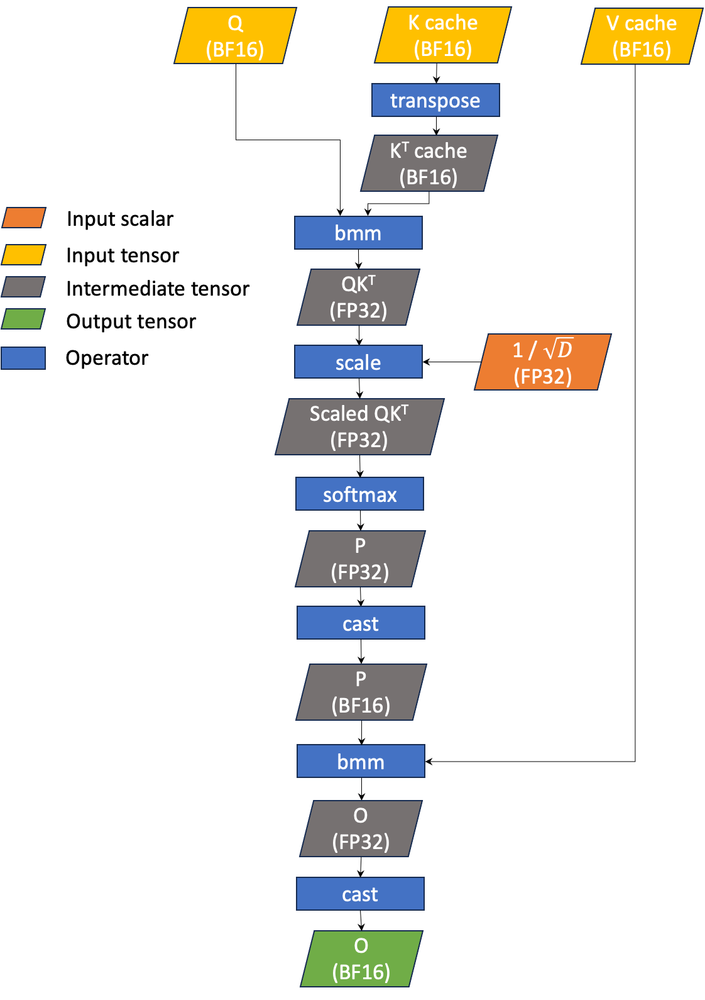
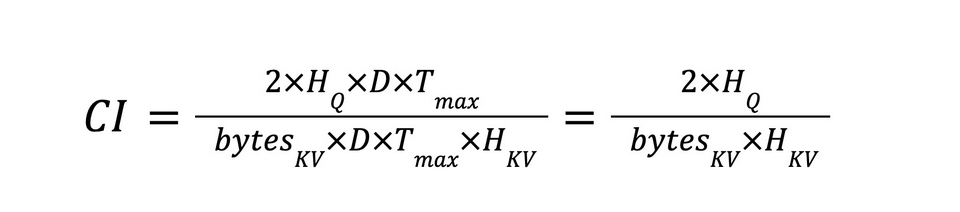
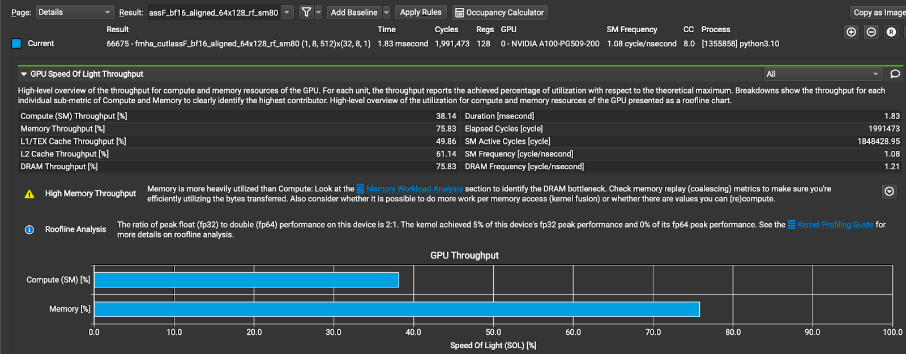
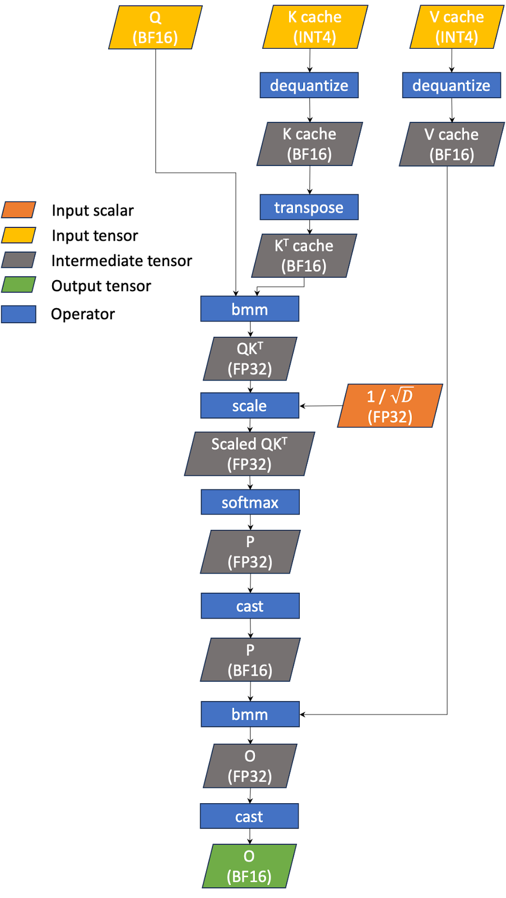
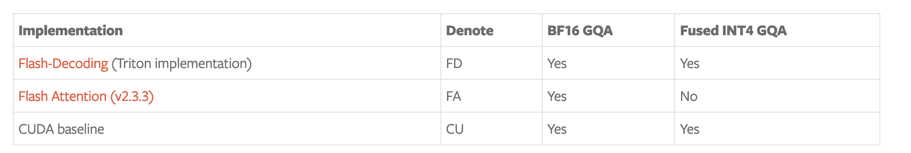
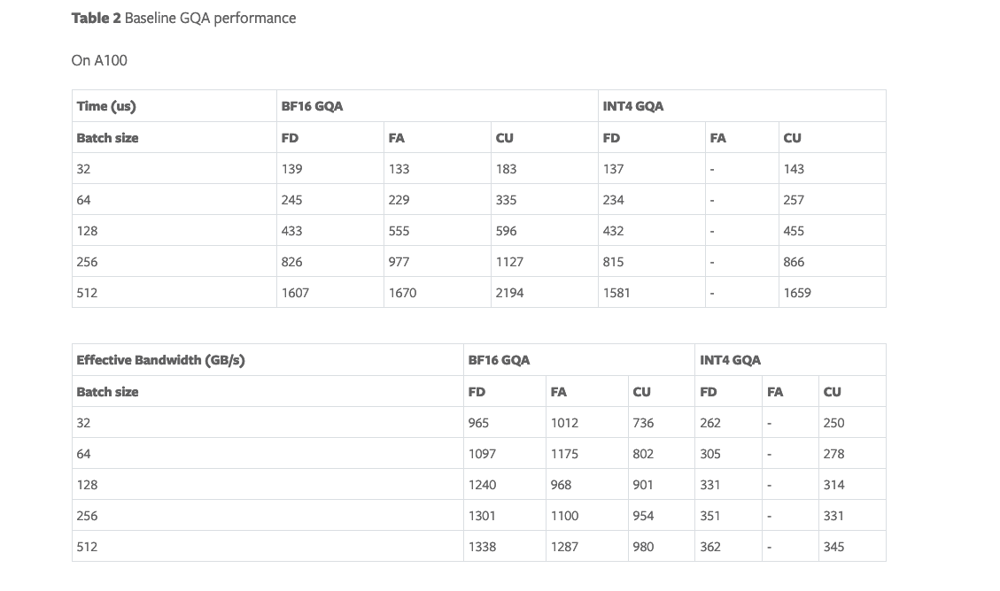
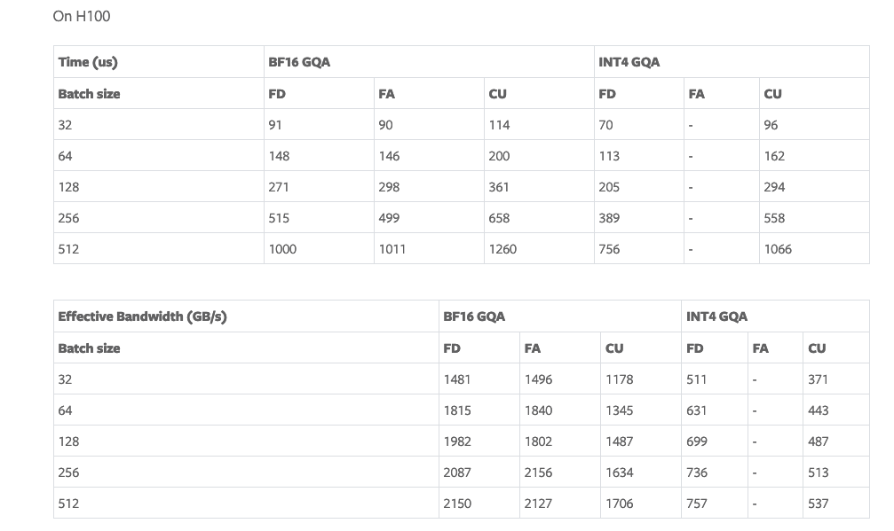
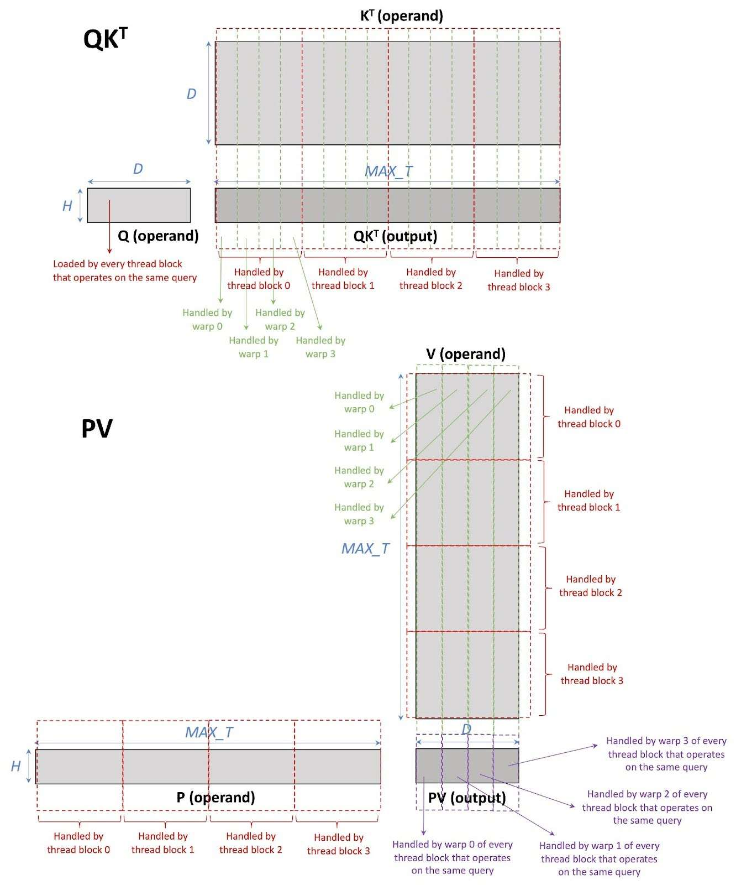

> 코드: https://github.com/pytorch/FBGEMM/blob/main/fbgemm_gpu/experimental/gen_ai/src/attention/gqa_attn_splitk.cu

> PyTorch 블로그: https://pytorch.ac.cn/blog/int4-decoding/

# LLM 추론을 위한 INT4 Decoding GQA CUDA 최적화

## 소개

Generative AI는 사람처럼 content를 생성하는 능력으로 전 세계를 휩쓸었습니다. 이러한 generative AI tool의 상당수는 Meta의 Llama model이나 OpenAI의 ChatGPT처럼 large language model(LLM)에 의해 구동됩니다. LLM의 주요 challenge 중 하나는 큰 "context length", 즉 "sequence length"를 지원하는 것입니다. context length는 model이 input context를 이해하고 response를 생성하는 데 사용하는 token 수를 의미합니다. 더 긴 context length는 일반적으로 response의 더 높은 accuracy와 quality로 이어집니다. 하지만 긴 context length는 compute와 memory 양쪽에서 요구량이 큽니다. 주된 이유는 다음과 같습니다.

- Attention의 computational complexity는 context length 증가에 따라 linear하게 증가합니다(증가율은 attention algorithm에 따라 다릅니다). 따라서 더 긴 context length를 사용할 때 attention layer가 bottleneck이 될 수 있으며, 특히 prefill stage에서는 attention이 compute bound입니다.
- KV Cache의 크기는 context length와 linear하게 증가하므로 memory requirement에 더 큰 압력을 줍니다. 이로 인해 원래도 memory bound인 attention decoding이 느려집니다. 또한 memory capacity가 제한되어 있기 때문에 KV Cache가 커질수록 batch size가 줄어들고, 이는 보통 throughput 하락으로 이어집니다.

위의 다른 문제와 비교하면 computational complexity 증가를 해결하기는 어렵습니다. KV Cache size 증가 문제를 해결하는 한 가지 방법은 low-precision KV Cache를 사용하는 것입니다. 우리의 experiment에서 볼 수 있듯, Meta Llama 2 inference의 decoding stage에서 grouped INT4 quantization은 accuracy 측면에서 BF16 KV Cache와 비슷합니다. 그러나 attention decoding layer에서 읽는 data 양이 4배 줄었음에도 latency 개선은 관찰되지 않았습니다. 이는 INT4 attention이 귀중한 HBM bandwidth를 활용하는 efficiency가 BF16 attention보다 4배 낮다는 뜻입니다.

이 note에서는 LLM inference stage에서 사용하는 attention layer인 INT4 GQA(grouped query attention)에 적용한 CUDA optimization을 논의합니다. 이 optimization은 performance를 **NVIDIA A100 GPU에서 최대 1.8배**, **NVIDIA H100 GPU에서 최대 1.9배** 향상시켰습니다.

- optimized CUDA INT4 GQA는 INT4 Flash Decoding GQA(앞서 언급한 experiment에서 사용한 best-performing INT4 GQA, https://pytorch.org/blog/flash-decoding/ )보다 우수합니다. **A100에서 1.4-1.7배, H100에서 1.09-1.3배 빠릅니다.**
- optimized CUDA INT4 GQA의 performance는 BF16 fast decoding GQA보다 우수합니다. **A100에서 1.5-1.7배, H100에서 1.4-1.7배 빠릅니다.**

## 배경

### LLM inference를 위한 GQA

Grouped Query Attention(GQA)은 Multi-Head Attention(MHA)의 변형으로, 각 KV Cache head를 query head group 사이에서 공유합니다. 우리의 LLM inference는 prefill과 decoding stage 모두에서 GQA를 attention layer로 사용해 KV Cache capacity requirement를 줄입니다. inference에서는 여러 GPU를 사용하며, KV Cache와 query head는 각 GPU에 분산됩니다. 각 GPU는 하나의 KV head와 query head group 하나를 포함하는 attention layer를 실행합니다. 따라서 single GPU 관점에서 GQA component는 MQA(multi-query attention)로도 설명할 수 있습니다.

그림 1은 Decoding GQA의 단순화된 workflow를 보여줍니다. GQA는 세 가지 주요 input을 받습니다. input query($Q$), K cache($K$), V cache($V$)입니다. 현재 GQA inference는 $Q, K, V$에 BF16을 사용합니다.

- Q는 shape이 $(B, 1, H_Q, D)$인 4D BF16 tensor입니다.
- K는 shape이 $(B, T_{max}, H_{KV}, D)$인 4D BF16 tensor입니다.
- V는 shape이 $(B, T_{max}, H_{KV}, D)$인 4D BF16 tensor입니다.

여기서,

- $B$는 batch size(input prompt 수)입니다.
- $H_Q$는 query head 수입니다.
- $H_{KV}$는 KV head 수입니다($H_Q$는 $H_{KV}$로 나누어떨어져야 합니다).
- $T_{max}$는 maximum context length입니다.
- $D$는 head dimension입니다(128로 고정).

GQA는 단지 $bmm(softmax(bmm(Q, K^T) / sqrt(D)), V)$입니다. 이는 $Q$와 shape이 같은 4D BF16 tensor인 단일 output tensor($O$)를 생성합니다. matrix multiplication은 BF16으로 수행되지만, accumulation과 softmax는 FP32에서 수행된다는 점에 주의하세요. KV cache가 BF16이므로 이를 "BF16 GQA"라고 부릅니다.

### INT4 GQA

KV Cache의 크기를 더 줄이기 위해, KV Cache를 BF16 대신 INT4로 저장할 가능성을 탐색했습니다. 우리는 INT4 GQA의 computational intensity(CI)를 계산하고 BF16 GQA의 CI와 비교해 잠재적인 performance improvement를 추정했습니다. CI는 byte당 FLOPS를 나타내기 때문입니다. 식 1에 표시된 것처럼 KV Cache를 operand로 사용하는 $QK^T$와 $PV$의 CI를 계산했습니다. Q load는 KV Cache와 비교해 무시할 수 있을 정도로 작기 때문에 제외했습니다. 또한 global memory에 있지 않은 intermediate data load/store도 무시했습니다. 따라서 CI는 compute FLOPS와 KV Cache load만 고려합니다.

$H_Q = 8$이고 $H_{KV} = 1$이라고 가정하면, BF16 KV Cache의 CI는 8이고 INT4 KV Cache의 CI는 32입니다. CI는 BF16과 INT4 GQA가 모두 memory bound임을 보여줍니다(A100과 H100의 BF16 Tensor Core peak CI는 각각 312 TF / 2 TB/s = 141(https://www.nvidia.com/content/dam/en-zz/Solutions/Data-Center/a100/pdf/a100-80gb-datasheet-update-nvidia-us-1521051-r2-web.pdf), 990 TF / 3.35 TB/s = 269(https://www.nvidia.com/en-us/data-center/h100/)입니다. 이 TF 수치는 sparsity를 포함하지 않는다는 점에 주의하세요). 또한 INT4 KV Cache를 사용하면 BF16 GQA와 비교해 4배 performance improvement를 기대해야 합니다.

GQA에서 INT4 KV Cache support를 활성화하려면, KV Cache를 BF16 GQA operator에 전달하기 전에 INT4에서 BF16으로 dequantize할 수 있습니다. 하지만 KV Cache는 보통 크기 때문에 global memory에서 또는 global memory로 이를 copy하는 비용이 클 수 있습니다. 또한 Decoding GQA는 memory bound operation입니다(memory unit이 compute unit보다 더 자주 사용됨). 그림 2는 xFormers의 FMHA CUTLASS BF16 GQA kernel(https://github.com/facebookresearch/xformers/blob/9f6abadabdec17cd4b5c301632a44bf8216a7f35/xformers/csrc/attention/cuda/fmha/autogen/impl/cutlassF_bf16_aligned.cu#L33)에 대한 NCU profile을 보여줍니다. 이는 GQA의 state-of-the-art implementation 중 하나입니다. 그림에서 memory가 bottleneck임을 명확히 볼 수 있습니다.

더 효율적인 대안은 INT4 dequantization과 GQA operation을 fuse하는 것입니다(그림 3). 다시 말해 GQA가 INT4 KV Cache를 직접 읽고 kernel 안에서 INT4에서 BF16으로 변환하게 합니다. 이런 변화는 KV Cache에 필요한 global memory read 양을 줄여 latency를 낮출 수 있습니다. 이를 "INT4 GQA"라고 부릅니다.

아래 표에는 GQA의 state-of-the-art implementation과 표 1의 기능을 나열했습니다.

**표 1** state-of-the-art GQA implementation

CU를 제외한 모든 implementation은 split-K와 non split-K를 모두 지원합니다. CU에는 split-K implementation만 있습니다. backend에서 split-K 또는 non split-K kernel을 실행할지 결정하는 heuristic은 FA에만 있습니다. 다른 implementation의 경우 사용자가 실행할 version을 명시적으로 선택해야 합니다. 이 note에서는 더 긴 context length에 집중합니다(우리 experiment에서는 context length 8192를 사용). 따라서 가능하면 split-K version을 선택합니다.

baseline으로 NVIDIA A100 및 H100 GPU에서 state-of-the-art GQA implementation의 performance를 측정했습니다. 표 2에는 latency(마이크로초 단위)와 achieved bandwidth(GB/s)를 보고했습니다. split-K 수를 2부터 128 splits까지 다양하게 실행하고, 각 implementation의 best performance를 보고했다는 점에 주의하세요. 모든 experiment에서 context length 8192를 사용했습니다. INT4 GQA의 경우 row-wise quantization, 즉 quantization group 수 = 1을 사용했습니다.

먼저 BF16 GQA performance를 논의해 보겠습니다. 모든 implementation 중 CU performance가 가장 낮습니다. FD와 FA의 performance는 비슷합니다. batch size가 64 이하일 때 FA는 split-K kernel을 사용하며 FD보다 약간 더 좋습니다. 하지만 batch size가 64보다 클 때는 FD의 performance가 더 좋습니다.

INT4 GQA의 trend도 같습니다. 다만 FA는 INT4 KV Cache를 지원하지 않으므로 performance를 측정하지 않았습니다. 모든 경우에서 FD의 performance가 CU보다 우수합니다.

FD의 BF16과 INT4 GQA latency를 비교하면 거의 동일하다는 것을 발견했습니다. 이는 INT4 GQA의 efficiency가 매우 낮다는 것을 나타내며, BF16 GQA와 비교해 INT4 GQA의 reachable bandwidth가 훨씬 낮다는 점에서도 추가로 확인됩니다. CU의 performance를 관찰할 때도 마찬가지입니다.

### Tensor Core를 사용하는 CUDA INT4 GQA implementation

이 절에서는 baseline implementation, 즉 Tensor Core를 사용하는 CUDA INT4 GQA(CU)를 간략히 소개합니다. 각 thread block은 하나의 KV head와 하나의 input prompt에서 온 query head group 하나만 처리합니다. 따라서 각 thread block은 $mm(softmax(mm(Q, K^T) / sqrt(D))$, V)를 수행합니다. $bmm$가 아니라 $mm$가 수행된다는 점에 주의하세요. 또한 split-K implementation이므로 KV Cache의 token은 서로 다른 thread block 사이에 split됩니다. 각 thread block은 4개의 warp를 포함합니다(각 warp는 NVIDIA A100 및 H100 GPU에서 32개 thread). 각 thread block 안의 work는 warp 사이에 split됩니다. 각 warp 안에서는 WMMA API를 사용해 Tensor Core에서 matrix multiplication을 계산합니다. 그림 4는 CU에서의 work partition을 보여줍니다.

