# MXFP8, MXFP4, NVFP4 상세 해설

> 원문: https://zhuanlan.zhihu.com/p/1969465397670551963

## 1. 왜 MXFP8, MXFP4, NVFP4 같은 저정밀 포맷이 필요한가?

1. 대규모 모델의 폭발적인 성장 → 연산과 메모리 병목 심화

- LLM의 파라미터 수는 이미 조 단위에 이르렀고, 학습 FLOPs는 10²⁵를 넘는다.
- 기존의 FP32/BF16 포맷은 고대역폭 메모리를 많이 차지하여 처리량과 전력 효율을 제한한다.
- 비트 폭만 단순히 낮추면(INT8/FP8 등) dynamic range가 부족해져 학습이 발산하거나 정밀도가 떨어진다.

2. 기존 저정밀 포맷에는 본질적인 결함이 있다

- INT8: scale을 미리 정해 두어야 하므로, LLM에서 멱법칙 분포를 따르는 activation/gradient(대량의 outlier를 포함한다)에 대응하지 못하고 clipping이 발생하기 쉽다.
- 표준 FP8(E4M3/E5M2 등): 부동소수점이기는 하지만 텐서 전체에 단일 scale을 적용하면(per-tensor scaling) block 내부의 큰 값과 작은 값을 함께 다루지 못해 quantization 오차가 생긴다.

그래서 제안된 것이 MX(microscaling) 저정밀 포맷이다. "block 공유 scale + 저정밀 element"의 혼합 표현이며, 기본 구조는 다음과 같다.

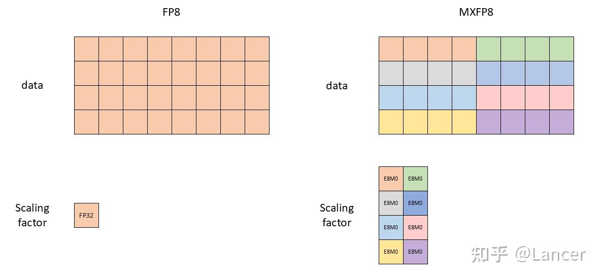

- 공유 scale 1개: E8M0(8비트 exponent 전용, 2의 거듭제곱)

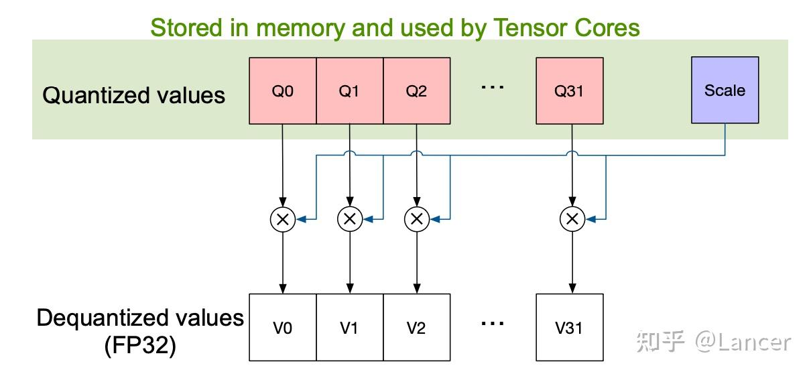

- 저정밀 element 32개: FP8 / FP6 / FP4 / INT8

NVFP4는 MX 개념을 NVIDIA가 공학적으로 강화한 버전이다.

- "block 공유 scale + 저정밀 element"라는 핵심 패러다임을 그대로 이어받았다.
- 다만 더 작은 block(block마다 element 16개)과 더 정밀한 scale(E4M3) 등을 통해, MXFP4가 4비트에서 겪는 수치적 병목을 해결했다. 이 병목이란 scale이 이산적이어서(2ⁿ만 가능하다) 원본 데이터를 FP4의 전체 표현 구간에 최적으로 압축해 넣지 못하고, 그 결과 유효 정밀도와 dynamic range를 낭비하게 되는 문제다.

전체적으로 보면 MX/NVFP 포맷은 "block 공유 scale + 저정밀 element"라는 혼합 표현을 통해 4~8비트에서 "높은 dynamic range + 높은 수치 안정성 + 높은 하드웨어 효율"을 하나로 묶은 해법을 제시하며, LLM 대규모 학습의 지속 가능한 발전을 위한 핵심 기술 경로다.

## 2. MXFP8, MXFP4, NVFP4 소개

MXFP8, MXFP4, NVFP4는 모두 quantization 포맷이다. 기준이 되는 bf16 포맷에 비해 저장 공간을 적게 쓰고 연산 속도가 빠르다는 장점이 있지만, 변환 과정에서 일정한 변환 비용과 정밀도 손실이 발생한다. 실제 성능은 GEMM 크기(MKN)와 quantization 비용의 융합 정도에 따라 달라진다. 이 글에서는 MXFP6(E3M2/E2M3)는 다루지 않는다. MXFP6의 dynamic range와 정밀도는 MXFP4와 MXFP8의 중간이지만, 최신 네이티브 코드를 확인해 보니 해당 구현을 찾을 수 없었다.

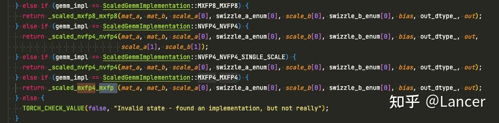

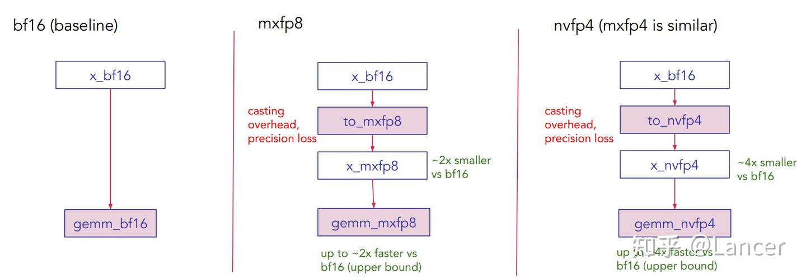

MXFP8과 MXFP4는 OCP(Open Compute Project)가 정의한 표준 포맷으로, AMD MI350x와 Blackwell이 지원한다. NVFP4는 NVIDIA가 자체 개발한 포맷으로 Blackwell 아키텍처에서만 네이티브로 지원되며, 표준 MX 포맷보다 나은 수치 표현을 제공하는 것을 목표로 한다. NVIDIA의 이전 논문에서는 10조 token이라는 초장기 학습 주기에서 NVFP4로 12B 파라미터 LLM을 성공적으로 학습했고, 학습 loss가 FP8과 매우 잘 일치하며 downstream task 성능 손실도 거의 없었다고 밝혔다. 아래 그림과 같다.

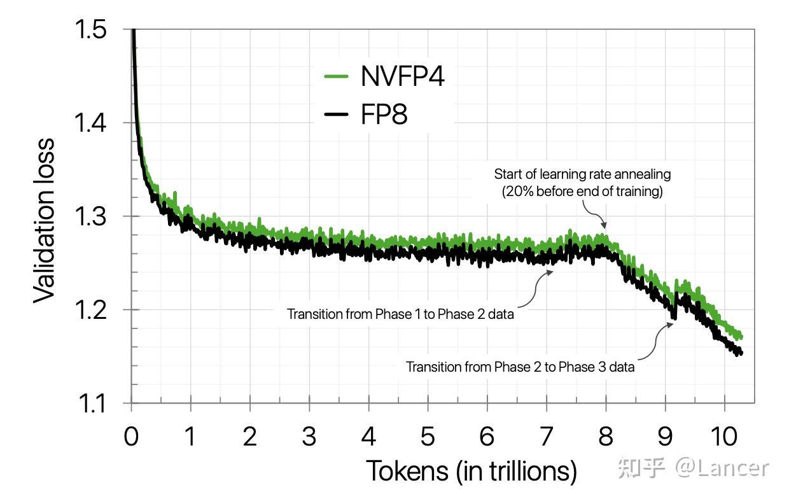

## 3. PyTorch의 microscaling 포맷: 핵심 파라미터 비교

4096×4096 크기의 bf16 텐서를 대상으로 할 때, PyTorch에서 MXFP8, MXFP4, NVFP4의 핵심 기술 파라미터는 아래 표와 같다.

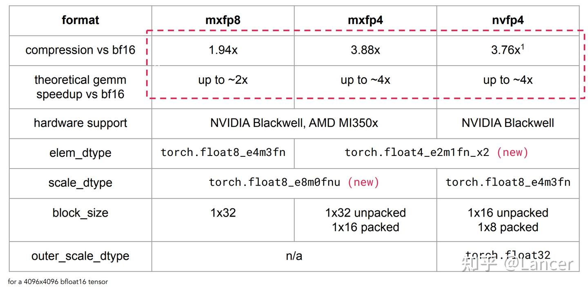

## 4. microscaling 포맷의 구성 요소

MXFP8, MXFP4, NVFP4의 구성 요소는 원리가 서로 비슷하다. 여기서는 MXFP8의 GEMM(일반 행렬 곱셈) 구성을 예로 든다. 핵심은 새로운 데이터 타입, 새로운 스케일링 방식, 새로운 GEMM 연산의 세 부분이며, 흐름은 다음과 같다.

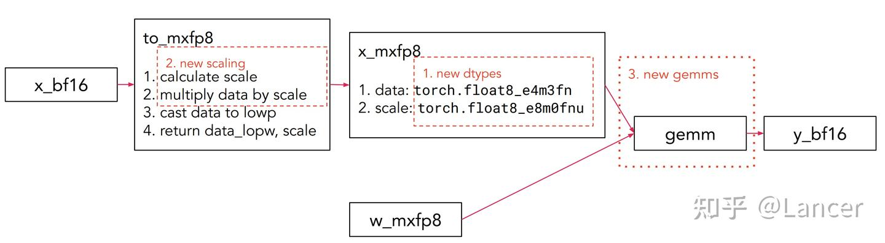

구체적인 흐름은 다음과 같다.
bf16 포맷 데이터(x_bf16) → 새로운 스케일링 방식과 데이터 타입으로 처리 → MXFP8 포맷 데이터(x_mxfp8) → 새로운 GEMM 연산에 투입 → bf16 포맷 결과(y_bf16) 출력. 이와 동시에 가중치(w)도 MXFP8 포맷(w_mxfp8)으로 변환해 연산에 참여시켜야 한다.

### (1) 데이터 타입

1. torch.float8_e8m0fnu

- **용도**: MXFP8과 MXFP4 포맷의 scale 데이터 타입이며, torch.float32(단정밀도 부동소수점)의 부호 없는 exponent를 저장하는 데 쓰인다.

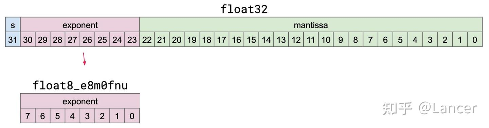

- **포맷 구조**: 총 8비트로, exponent 비트(0~7비트)만 있고 mantissa 비트는 없다. 구체적인 대응 관계는 float32의 비트 구조를 참고하면 된다(float32는 부호 비트, exponent 비트, mantissa 비트를 가지지만, 이 타입은 부호 없는 exponent만 추출해 저장한다).
- **접미사 의미**: "f"는 유한값(finite), "n"은 비표준 NaN(nonstandard NaN), "u"는 부호 없음(unsigned)을 뜻한다.
- **버전 지원**: PyTorch 2.7.0 이상에서 사용할 수 있다.
- **연산 지원**:
  - 지원하는 연산: 생성(empty 빈 텐서, fill 채우기, zeros 영 텐서), 바이트 단위 데이터 이동(cat 연결, torch.view 뷰 변환, torch.reshape 형태 변경), 타입 변환, scaled_mm(스케일링 행렬 곱셈)에서 MXFP8과 MXFP4의 scale 데이터 타입으로 사용.
  - 지원하지 않는 연산: 그 밖의 대부분의 연산.
- **추가 파라미터**:

| 파라미터 | 설명 |
|---------------------------|--------------------------|
| exponent bias | 구체적인 수치는 언급되지 않음 |
| 지원하는 exponent 범위 | -127 ~ 127 |
| 무한대(Infinities) | 지원하지 않음(N/A) |
| NaN | 이진수 11111111(8비트 전부 1) |

2. torch.float8_e4m3fn

- **용도**: MXFP8 포맷의 element 데이터 타입이며, 8비트 부동소수점 포맷이다.
- **포맷 구조**: 총 8비트로, 부호 비트(S) 1비트, exponent 비트(e) 4비트, mantissa 비트(m) 3비트로 구성되며 구체적인 element 값을 저장한다.
- **접미사 의미**: "f"는 유한값(finite), "n"은 비표준 NaN(nonstandard NaN)을 뜻한다.
- **반올림 방식**: 기본적으로 RTNE(Round to Nearest, Ties to Even, 가장 가까운 값으로 반올림하되 동점이면 짝수 쪽으로 반올림)를 사용하며, 이는 PyTorch의 기본 반올림 방식이기도 하다.

3. torch.float4_e2m1fn_x2

- **용도**: MXFP4와 NVFP4 포맷의 element 데이터 타입으로, float4(4비트 부동소수점) 두 개를 1바이트(8비트)에 패킹해 저장한다.

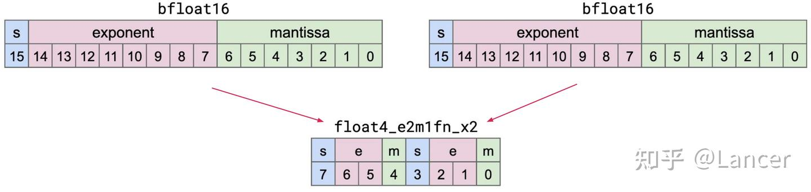

- **포맷 구조**: 1바이트(8비트)를 두 부분으로 나누며, 각 부분이 float4 데이터 하나에 대응한다.
  - 상위 4비트(7~4비트): 부호 비트(S, 7비트) 1개, exponent 비트(e, 6~5비트) 2개, mantissa 비트(m, 4비트) 1개를 포함한다.
  - 하위 4비트(3~0비트): 부호 비트(S, 3비트) 1개, exponent 비트(e, 2~1비트) 2개, mantissa 비트(m, 0비트) 1개를 포함한다.
- **접미사 의미**: "f"는 유한값(finite), "n"은 비표준 NaN(nonstandard NaN), "x2"는 1바이트에 데이터 2개를 패킹한다는 뜻이다.
- **버전 지원**: PyTorch 2.8.0 이상에서 사용할 수 있다.
- **연산 지원**:
  - 지원하는 연산: 생성(empty, fill, zeros), 바이트 단위 데이터 이동(cat, torch.view, torch.reshape), scaled_mm에서 MXFP4와 NVFP4의 element 데이터 타입으로 사용.
  - 지원하지 않는 연산: 그 밖의 대부분의 연산.
- **값의 범위**: float4 하나는 16가지 값만 가질 수 있으며, 각각 [0, 0.5, 1, 1.5, 2, 3, 4, 6, -0, -0.5, -1, -1.5, -2, -3, -4, -6]이다.
- **추가 파라미터**:

| 파라미터 | 설명 |
|----|----|
| exponent bias | 1 |
| 무한대(Infinities) | 지원하지 않음(N/A) |
| NaN | 지원하지 않음(N/A) |
| 0(Zeros) | 이진수 S 00 0(부호 비트 + exponent 비트 2개 + mantissa 비트 1개, exponent 비트와 mantissa 비트가 모두 0) |
| 최대 정규값(Max normal) | 이진수 S 11 1, 대응하는 값은 ±2²×1.5=±6.0 |
| 최소 정규값(Min normal) | 이진수 S 01 0, 대응하는 값은 ±2⁰×1.0=±1.0 |
| 최대 비정규값(Max subnorm) | 이진수 S 00 1, 대응하는 값은 ±2⁰×0.5=±0.5 |
| 최소 비정규값(Min subnorm) | 최대 비정규값과 동일하게 ±0.5 |

- **반올림 방식**:
  - 기본적으로 RTNE를 사용하지만, 현재 PyTorch에서는 이 타입에 대해 반올림 방식 설정을 열어 두지 않았다.
  - 확률적 반올림(stochastic rounding)은 학습의 수치 안정성을 높이는 데 쓸 수 있다.

### (2) 스케일링 방식

1. 스케일링의 핵심 원리

부동소수점 quantization은 고정밀 텐서(FP64, FP32, FP16, BF16 등)를 저정밀 텐서(FP8, FP4, 즉 이 글의 MXFP8, MXFP4, NVFP4)로 저장하면서 하나 이상의 scaling factor(scale)를 함께 둔다. scaling factor를 고르는 목적은 고정밀 텐서의 수치 범위를 저정밀 텐서의 사용 가능 범위에 맞추는 것이다. 구체적인 흐름은 다음과 같다.

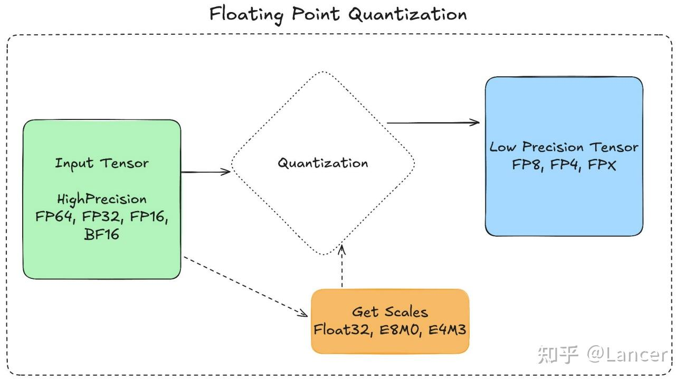

- scaling factor를 계산해 고정밀 데이터를 저정밀 포맷의 유효 범위 안으로 매핑한다.
- 고정밀 데이터에 scaling factor를 곱한 뒤 저정밀 데이터로 바로 변환한다(클램핑 처리를 포함한다).
- 원본 데이터를 복원하려면 저정밀 데이터를 고정밀 포맷으로 되돌린 뒤 scaling factor의 역수를 곱한다(복원 과정에서 어느 정도의 정밀도 손실이 생긴다).

2. 왜 (바로 변환하지 않고) 스케일링이 필요한가

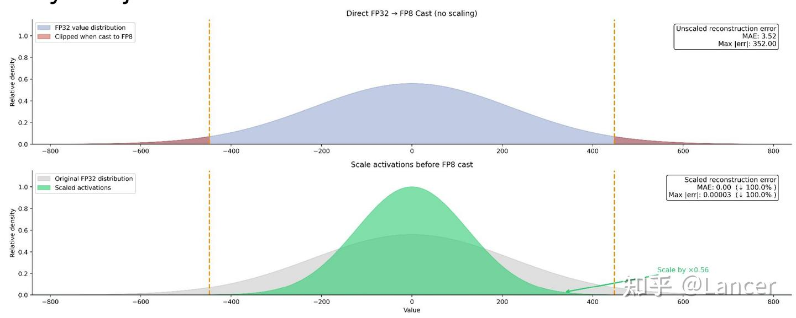

위 그림처럼 FP32를 FP8(MXFP8 등)로 바로 변환하면 데이터가 잘려 나가 큰 오차가 생긴다(최대 오차가 352.00에 이른다). 반면 데이터를 먼저 스케일링한 뒤(예: FP32 데이터에 0.56을 곱한다) FP8로 변환하면 데이터가 FP8의 유효 범위 안에 완전히 들어가므로 변환 오차가 크게 줄어든다.

3. 주요 스케일링 방식

하드웨어와 모델 시나리오에 따라 채택하는 스케일링 방식(granularity, 방법)이 다르며, 핵심 방식은 다음과 같다.

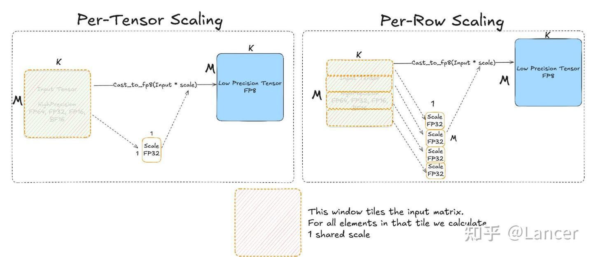

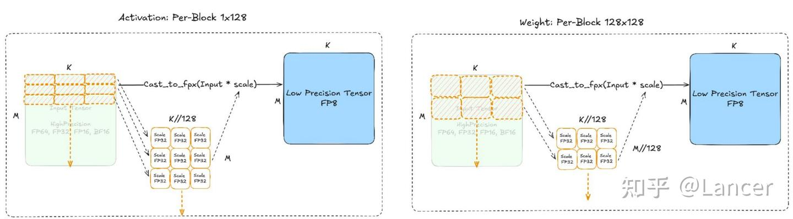

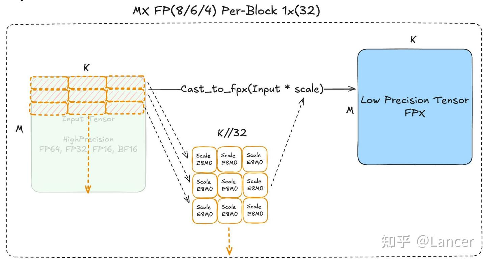

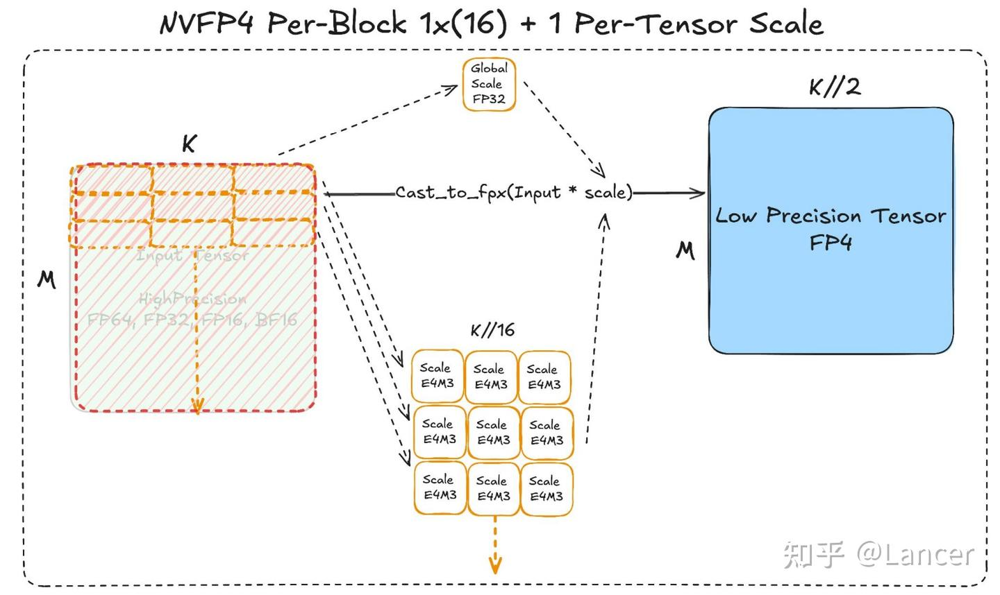

| scaling 방식 | 적용 대상 | 핵심 로직 |
|----|----|----|
| per-tensor scaling | Hopper, MI300 등의 하드웨어 | 입력 행렬 전체에 대해 global scaling factor 1개를 계산하고, 행렬의 모든 원소에 그 factor를 곱한 뒤 저정밀도 tensor(예: FP8)로 변환한다 |
| per-row scaling | Hopper, MI300 등의 하드웨어 | 입력 행렬의 각 행마다 scaling factor 1개를 계산하고, 각 행의 원소를 대응하는 factor와 곱한 뒤 저정밀도 tensor로 변환한다 |
| DeepSeekV3 방식 | DeepSeekV3 모델 | - activation: 1×128 블록 granularity. 1×128 크기 블록마다 scaling factor 1개를 계산한다. - weight: 128×128 블록 granularity. 128×128 크기 블록마다 scaling factor 1개를 계산한다 |
| MX 방식 | mxfp8, mxfp4 포맷 | - scaling granularity: 1×32(블록 크기). 1×32 크기 블록마다 scaling factor 1개를 계산하며, per-tensor/per-row보다 granularity가 세밀해 scaling factor가 더 많다. - scale 데이터 타입: E8M0(torch.float8_e8m0fnu)을 사용하며 2의 거듭제곱 scaling을 지원한다 |
| NVFP4 방식 | nvfp4 포맷 | - scaling granularity: 1×16(블록 크기). MX 방식보다 granularity가 더 세밀해 scaling factor가 더 많다. - scale 데이터 타입: E4M3(torch.float8_e4m3fn)을 사용하며, E8M0보다 정밀도는 높지만 수치 범위는 좁다. - 추가 처리: E4M3의 scaling 범위 부족을 보완하기 위해 global FP32 scaling factor 1개가 필요하다 |

4. torch.float8_e8m0fnu의 scale 계산 방식

데이터의 최대 절댓값(max(abs(x)))으로부터 E8M0(torch.float8_e8m0fnu) scaling factor를 계산하는 방식은 크게 두 가지다.

- **OCP MX 규격(floor 모드)**: max(abs(x))의 exponent 비트를 추출한 뒤, element 데이터 타입의 최대 2의 거듭제곱(elem_dtype_maxpow2)을 뺀다. 다만 NVIDIA의 이전 논문은 이 방식이 일부 값의 overflow를 일으킨다고 지적했고, 그래서 올림 방식을 제안했다.
- **NVIDIA(rceil 모드)**: max(abs(x))를 element 데이터 타입의 최대 절댓값(max_abs_dtype)으로 나누고, 올림한 뒤 exponent 비트를 추출한다.

### (3) GEMM 연산

GEMM 연산(MXFP8 GEMM, NVFP4 GEMM 등)의 핵심은 저정밀 텐서(MXFP8, NVFP4 등)와 그에 대응하는 scaling factor를 바탕으로 전용 kernel을 통해 효율적인 행렬 곱셈을 수행하는 것이다. 구체적인 예시는 다음과 같다.

1. block 스케일링 MXFP8 GEMM

```text
# 1. 입력 텐서 A, B를 mxfp8 포맷으로 변환하고, 동시에 대응하는 scaling factor A_scale, B_scale을 얻는다
A_scale, A_fp8 = to_mxfp8(A)
B_scale, B_fp8 = to_mxfp8(B)

# 2. scaled_mm을 호출해 mxfp8 포맷의 행렬 곱셈을 수행한다
# scale_recipe_b는 B의 스케일링 방식을 1×32 block granularity(Blockwise1x32)로 지정한다
# output_dtype은 출력 결과를 bf16 포맷으로 지정한다
result = scaled_mm(A_fp8, B_fp8, 
                   scale_recipe_a=ScalingType.Blockwise1x32, 
                   scale_recipe_b=ScalingType.Blockwise1x32, 
                   output_dtype=torch.bfloat16)
```

여기서 `to_mxfp8`(변환), `scaled_mm`(스케일링 행렬 곱셈) 등의 함수와 kernel은 PyTorch의 `torch/ao` 모듈에서 얻을 수 있다.

2. NVFP4 block 스케일링 GEMM

```text
# scaled_mm을 호출해 nvfp4 포맷의 행렬 곱셈을 수행한다
# scale_a는 A의 scaling factor를 지정한다: 1×16 block granularity scaling factor(to_blocked(A.scales)) + 전역 텐서 scaling factor(A_global)
# scale_recipe_a는 A의 스케일링 방식을 지정한다: 1×16 block granularity(Blockwise1x16) + 텐서 단위(TensorWise)
result = scaled_mm(A.fp.t(), B.fp, 
                   scale_a=[to_blocked(A.scales), A_global], 
                   scale_recipe_a=[ScalingType.Blockwise1x16, ScalingType.TensorWise],
                   # 그 밖의 인자는 실제 필요에 따라 설정한다
                   )
```

이 연산은 여러 개의 scaling factor와 독립적인 메모리 재배치 모드를 지원하며, 전용 kernel(cuBLAS, Cutlass, rocBLAS, Composable Kernel 등)로 디스패치되어 실행될 수 있다.

## 5. 성능

NVIDIA B200 GPU에서의 테스트 결과를 보면, MXFP8과 NVFP4는 bf16에 비해 GEMM 연산 성능에서 뚜렷한 우위를 보인다. 구체적인 내용은 다음과 같다.

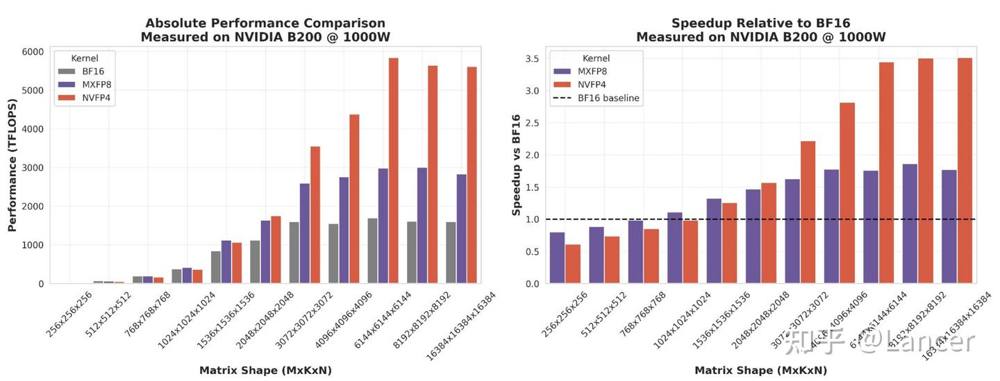

### (1) 절대 성능 비교

행렬 크기(MxKxN)가 256×256×256에서 16384×16384×16384로 커짐에 따라, MXFP8과 NVFP4의 kernel 성능은 점차 bf16을 넘어서고 그 격차도 계속 벌어진다. 예를 들어 행렬 크기가 16384×16384×16384일 때 NVFP4의 성능은 6000 TFLOPS에 가깝고 MXFP8은 4000 TFLOPS에 가까운 반면, bf16은 약 2000 TFLOPS에 그친다.

### (2) 상대 성능 비교(bf16 대비 가속비)

- 행렬 크기가 작을 때(256×256×256 등)는 MXFP8과 NVFP4의 가속비가 1에 가깝다(뚜렷한 우위가 없다). 이때는 스케일링과 변환 비용이 차지하는 비중이 크기 때문이다.
- 행렬 크기가 커지면(2048×2048×2048을 넘는 경우 등) 가속비가 점차 올라간다. MXFP8의 가속비는 최대 2배에 가깝고 NVFP4는 최대 3.5배에 가까우며, 이는 이론적인 가속비 기대치(MXFP8 최대 2배, NVFP4 최대 4배)와 부합한다.

### (3) 스케일링 비용 비교

스케일링 방식에 따라 비용이 다르다. 같은 행렬 크기에서 비교하면 다음과 같다.

- 행 단위 스케일링(per_row)과 MX 스케일링은 kernel 1개로 끝낼 수 있어 비용이 낮다.
- 텐서 단위 스케일링(per_tensor)은 여러 kernel이 협력해야 해서 비용이 높다(예를 들어 16384×16384×16384 행렬에서 텐서 단위 스케일링의 quantization 비용은 약 0.15인 반면, 행 단위 스케일링은 약 0.1이다).

## 6. 학습과 추론에서의 성능 고려사항

### (1) 학습 시나리오

1. 융합 스케일링 kernel이 핵심이다

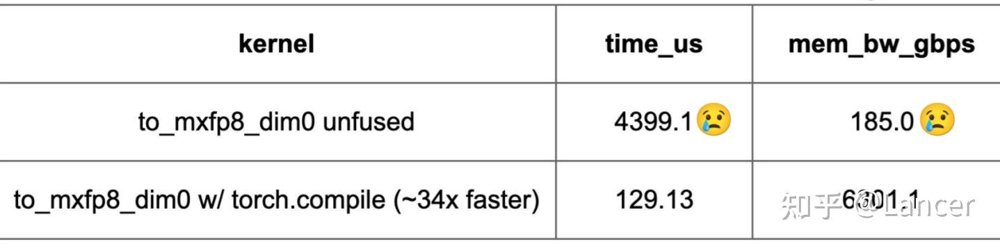

NVIDIA B200 GPU에서 16384×16384 크기의 행렬(M=K=16384)을 대상으로 테스트한 결과, 스케일링과 변환 등의 연산을 융합한 `to_mxfp8`/`to_mxfp4`/`to_nvfp4` kernel은 융합하지 않은 kernel보다 10배 이상 빠르다.

2. GEMM 행렬 크기가 충분히 커야 한다

GEMM의 행렬 크기(MxKxN)가 충분히 커야만 스케일링과 변환 비용을 상쇄하고 성능 가속을 얻을 수 있다.

- 성능 공식: bf16의 GEMM 시간 > 저정밀 포맷(MXFP8 등)의 GEMM 시간 + 저정밀 포맷의 스케일링 비용 시간일 때 비로소 저정밀 포맷이 우위를 갖는다. 여기서 GEMM 시간은 행렬 크기의 세제곱에 비례하고(O(M×K×N)), 스케일링 비용 시간은 행렬 크기의 제곱에 비례한다(O(M×K + M×N + K×N)). 따라서 행렬 크기가 클수록 저정밀 포맷의 우위가 뚜렷해진다.

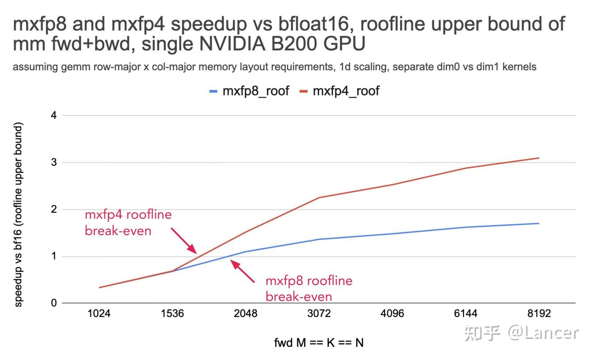

임계 범위:

- MXFP8: 행렬 크기가 약 2048×2048×2048보다 커야 한다(roofline 모델 상한).
- MXFP4/NVFP4: 행렬 크기가 약 1800×1800×1800보다 커야 한다(roofline 모델 상한).

3. 학습 과정에서는 텐서를 여러 번 quantization 해야 한다

MXFP8의 행렬 곱셈(mm) 순전파(fwd)와 역전파(bwd)를 예로 든다.

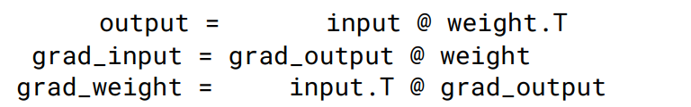

저정밀 GEMM kernel은 첫 번째 피연산자가 행 우선(row-major), 두 번째가 열 우선(col-major)일 것을 요구한다. 그래서 입력(input), 가중치(weight), 출력 gradient(grad_output)를 각각 행 우선과 열 우선 두 가지 방식으로 quantization 해야 하고, 모두 6개의 저정밀 텐서(MXFP8 텐서 등)가 생겨 데이터 처리의 복잡도가 올라간다.

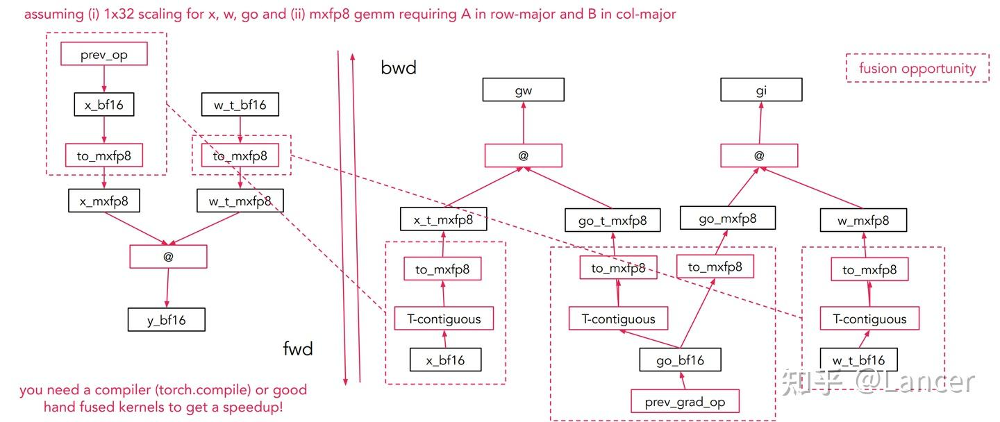

융합 요구사항: 컴파일러(torch.compile 등)를 활용하거나 융합 kernel을 직접 작성해 여러 연산(스케일링, 변환, GEMM 등)을 융합해야 성능을 한층 더 끌어올릴 수 있다.

4. 최적화 방안: 2D block 포맷으로 가중치 quantization 횟수를 줄인다

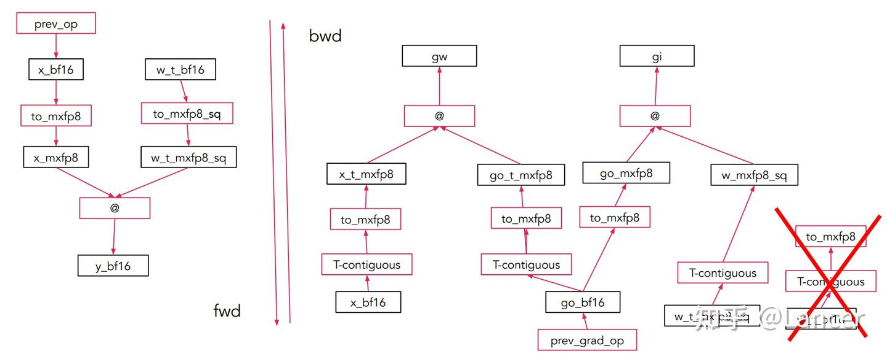

- 가중치 행렬 **W**를 **32×32(또는 16×16)의 2차원 정사각 block**으로 나눈다.
- 각 block은 **전체가 scale 하나를 공유한다**(또는 행/열마다 공유하되 레이아웃이 대칭이다).

전치 여부와 관계없이 이 block의 메모리상 scale 논리가 동일하므로, 가중치를 한 번만 quantization 해도 된다.

### (2) 추론 시나리오

1. 가중치는 한 번만 quantization 하면 된다

추론 과정에서 가중치는 고정된 값이므로, 추론 전에 한 번만 quantization 해서 저장해 두고 추론할 때는 저정밀 가중치를 그대로 쓰면 된다. 실시간으로 quantization 해야 하는 것은 activation뿐이어서 quantization 비용이 줄어든다.

2. 융합 스케일링 kernel은 여전히 핵심이다

학습 시나리오와 마찬가지로, 융합된 `to_mxfp8`/`to_nvfp4` kernel은 융합하지 않은 kernel보다 10배 이상 빠르며, `torch.compile`을 쓰거나 kernel을 직접 작성해 융합을 구현할 수 있다.

3. NVFP4는 전역 scaling factor를 오프라인으로 캘리브레이션해야 한다

NVFP4 포맷은 전역 FP32 scaling factor 1개가 필요하다. 이 factor는 추론 전에 오프라인으로 캘리브레이션할 수 있어(캘리브레이션 데이터셋을 기반으로 계산한다) 실시간 계산이 필요 없고, 추론 시의 비용을 낮춘다.

4. GEMM 행렬 크기가 충분히 커야 한다

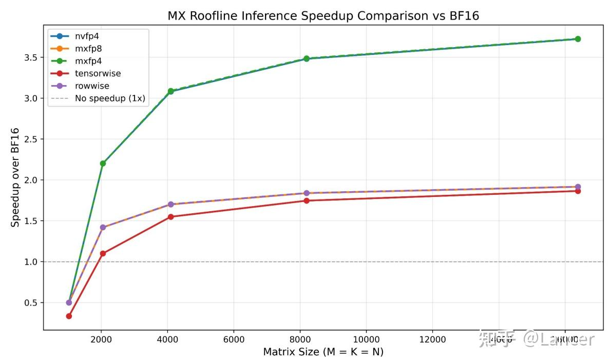

동적 activation quantization 시나리오에서는 행렬 크기가 1024×1024×1024 또는 2048×2048×2048보다 커야 quantization 비용을 상쇄하고 성능 가속을 얻을 수 있다. Roofline 모델을 보면 행렬 크기가 클수록 MXFP8, MXFP4, NVFP4의 가속비가 높아지며, NVFP4의 최대 가속비는 3.5배에 가깝고 MXFP8은 2배에 가깝다.

## 7. 정리

| 포맷 | element 정밀도 | block size | Scale 타입 | 주요 용도 |
|----|----|----|----|----|
| MXFP8 | E4M3 / E5M2 (8-bit FP) | element 32개 | E8M0(8-bit power-of-2) | 효율적인 LLM 학습: 순전파에는 E4M3(고정밀), 역전파에는 E5M2(큰 dynamic range)를 쓴다 |
| MXFP4 | E2M1 (4-bit FP) | element 32개 | E8M0(8-bit power-of-2) | 극한의 압축 학습/추론: Quartet 등의 알고리즘 지원 아래 end-to-end FP4 학습을 구현한다 |
| NVFP4 | E2M1 (4-bit FP) | element 16개 | E4M3(mantissa를 가진 8-bit FP) + 전역 FP32 scale | 높은 안정성의 4비트 학습: 더 세밀한 block + 더 정밀한 scale로 outlier 표현 능력을 높인다 |

## 참고 문헌

- mxfp8, mxfp4, nvfp4 formats and applications in PyTorch, *PyTorch Conference 2025*
- Recipes for Pre-training LLMs with MXFP8
- Pretraining Large Language Models with NVFP4
- Quartet: Native FP4 Training Can Be Optimal for Large Language Models
