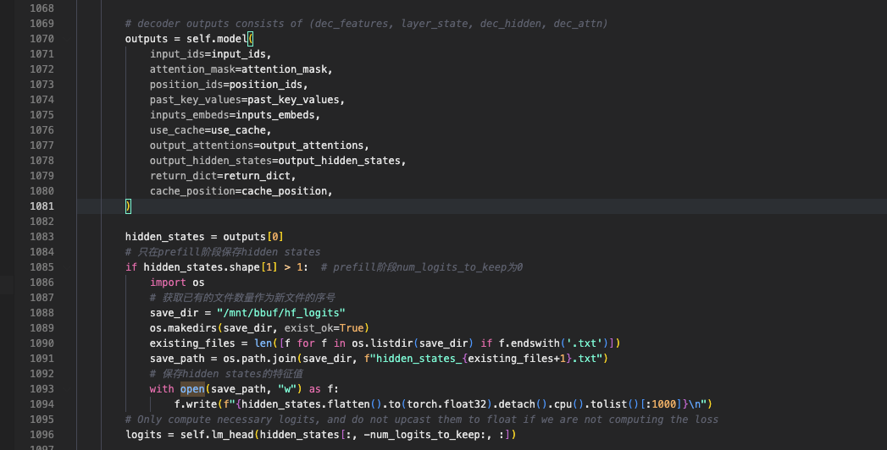
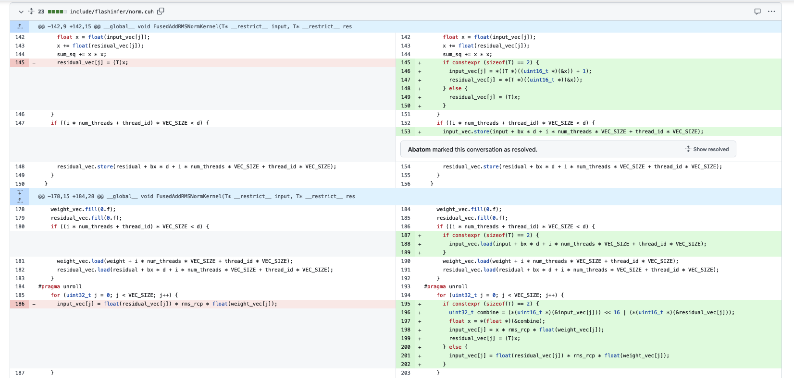

# RMSNorm 정밀도 함정: LLM 추론 정밀도 조사 기록

## 0x0. 배경

최근 SGLang으로 모델을 배포하고 있었습니다. TP2 병렬 방식과 BF16 dtype으로 fine-tuning된 LLama3 8B 모델을 배포했을 때 기묘한 현상을 발견했고, 최종적으로 RMS Norm 정밀도 함정에 빠졌다는 것을 확인했습니다.

SGLang으로 띄운 서비스에서 같은 prompt를 1000번 반복 요청하면 모델이 가끔 3-5번 이상한 출력을 냈습니다. 이 출력은 깨진 문자는 아니지만, 모델의 기대 효과에는 명백히 맞지 않았습니다. 반대로 HuggingFace에서 1000번 요청하면 모델 출력은 항상 정상이었습니다.

이 bug는 꽤 오래 괴롭혔습니다. 주로 debug가 매우 힘들고, 재현도 안정적이지 않아서 처음에는 이미 마음을 내려놓은 상태였습니다.

비슷한 bug, 즉 대형 모델 추론에서 정밀도 문제가 있다면 이 짧은 기록의 처리 방법이 맞을 수 있습니다.

**미리 방어막 하나**: 이 bug의 발생 여부는 모델 training framework의 RMSNorm 구현 방식과 custom data가 어떻게 생겼는지에 달려 있습니다. 따라서 공식 모델이나, 여러분의 custom dataset으로 fine-tuning한 모델은 추론 시 이 문제의 영향을 받지 않거나 영향이 무시할 수 있을 정도일 수도 있습니다. 비슷한 문제가 없다면 그냥 재미로 보면 됩니다.

## 0x1. 의심과 준비 작업

대형 모델의 정밀도 문제는 전체적으로 보면 모델 문제이거나 sampling 문제입니다. SGLang 1000번 결과 중 몇 번 기대와 맞지 않는 출력이 나타났기 때문에, 저는 먼저 sampling에 문제가 있을 수 있다고 추측했습니다.

bug를 더 잘 찾기 위해 재현 스크립트 2개를 준비해야 합니다. 먼저 HF 쪽입니다.

```python
from transformers.generation.utils import GenerationConfig
from transformers import AutoTokenizer, AutoModelForCausalLM
import torch

model_path = "모델 경로를 입력하세요"

tokenizer = AutoTokenizer.from_pretrained(model_path)
model = AutoModelForCausalLM.from_pretrained(
    model_path,
    torch_dtype=torch.bfloat16,
    device_map="auto",
    trust_remote_code=True,
)

generate_config = GenerationConfig(**{
    "do_sample": True,
    "max_new_tokens": 2048,
    "repetition_penalty": 1.1,
    "temperature": 0.1,
    "top_p": 0.8,
    "top_k": 1
    })
def generate_from_prompt_and_compare(prompt, num_sequences=1):
    input_ids = tokenizer.encode(prompt, return_tensors="pt").to(model.device)

    gen_kwargs = dict(
        inputs=input_ids,
        generation_config=generate_config,
        )   

    for _ in range(num_sequences):
        outputs = model.generate(**gen_kwargs)
        response = outputs[0][input_ids.shape[-1]:]
        response = tokenizer.decode(response, skip_special_tokens=True)
        print(response)

prompt1 = "prompt 입력"
generate_from_prompt_and_compare(prompt1, num_sequences=1000)
```

출력을 log 파일로 redirect할 수 있습니다. 다음은 SGLang 쪽입니다.

```python
mport requests
import json
import time

# API endpoint
url = "http://127.0.0.1:8000/v1/completions"

# request headers
headers = {
    "Content-Type": "application/json"
}

# request body
data = {
    "model": "모델 경로를 입력하세요",
    "prompt": "prompt 입력",
    "max_tokens": 4096,
    "temperature": 0.1,
    "top_k": 1,
    "top_p": 0.8,
    "repetition_penalty": 1.1,
    "stop": ["<|im_end|>", "<|endoftext|>"]
}

for i in range(1000):
    try:
        response = requests.post(url, headers=headers, json=data)
        response.raise_for_status()
        result = response.json()
        if 'choices' in result and len(result['choices']) > 0:
            text = result['choices'][0].get('text', '')
            with open('log_sglang_v0_1_6.txt', 'a', encoding='utf-8') as f:
                f.write(text + "\n")
        time.sleep(0.5)
        
    except Exception as e:
        print(f"{i+1}번째 요청 실패: {str(e)}")
        continue
```

prompt와 모델, 그리고 sampling params를 완전히 맞춰야 합니다. 또한 위 스크립트로 요청을 보내 추론을 수행하려면 SGLang serving 서비스를 하나 띄워야 합니다.

Sampling에 대한 의심을 검증하기 위해 SGLang이 제공하는 naive PyTorch sampling으로 추론을 해 보았습니다(서비스 시작 시 `sampling_backend=pytorch`만 지정하면 됩니다). 하지만 출력 결과를 보면 기본 flashinfer sampling을 사용한 결과와 거의 같았고, 여전히 기대와 맞지 않는 출력이 나타났습니다.

## 0x2. 위치 찾기

그렇다면 모델 추론에 문제가 있을 가능성이 있습니다. 모델 추론에 문제가 있다면 일반적으로 첫 번째 prefill 결과에서 차이를 관측할 수 있습니다. 그래서 매번 추론의 prefill 이후, lm head를 통과하기 전 모델 출력을 `hidden_states`라는 tensor로 기록하기로 했습니다. SGLang의 해당 bad prediction의 `hidden_states`를 찾고 HF와 비교하면 차이를 볼 수 있을 것입니다.

HF 쪽은 비교적 처리하기 쉽습니다. transformers 저장소의 llama3 model과 config 구현 파일을 모델 저장소로 복사하고, automap을 사용해 현재 모델 저장소에서 모델 구현을 로드하도록 지정합니다. 마지막으로 `AutoModelForCausalLM.from_pretrained`로 모델을 초기화할 때 `trust_remote_code=True`를 지정하면 현재 모델 저장소의 model 구현을 사용할 수 있습니다. 그런 다음 코드를 조금 수정합니다.



SGLang의 모델 구현 파일에도 비슷한 코드를 사용해 매번 추론 시 prefill의 lm head 이전 `hidden_states`를 기록합니다. 주의할 점은 두 가지입니다.

- chunked prefill을 비활성화합니다.
- warmup이 있기 때문에, 요청을 보내기 전에 SGLang이 매번 추론의 `hidden_states`를 저장하는 폴더를 먼저 비워야 합니다. 그래야 저장된 Tensor의 txt 번호가 HF와 대응됩니다.

먼저 첫 번째 추론의 HF와 SGLang `hidden_states` 앞 몇 개 값을 봅니다.

HF:

```shell
[2.96875, -1.8046875, 1.8515625, 3.46875, -1.6484375, 2.125, 2.359375, 0.640625
```

SGLang:

```shell
[2.90625, -1.796875, 1.828125, 3.359375, -1.609375, 2.125, 2.34375, 0.6484375
```

`hidden_states` 차이가 이미 꽤 크고, 1e-1 수준에 이르렀다는 것을 볼 수 있습니다.

그런 다음 비슷한 방식으로 앞쪽의 차이가 나는 Layer를 찾아갔고, 최종적으로 RMSNorm 층이 각 Transformer Block에서 정밀도 차이를 키우고 있다는 것을 발견했습니다.

그래서 RMSNorm 모듈의 cuda 구현을 HF의 naive 구현으로 바꿔 보았고, `hidden_states` 정밀도가 눈에 띄게 좋아졌으며 원래 prompt를 1000번 반복 실행해도 이상한 출력이 더 이상 나타나지 않았습니다.

## 0x3. FlashInfer RMSNorm 구현의 문제는 어디에 있나?

https://github.com/sgl-project/sglang/issues/2258 에 이 문제를 제기했고, 곧 응답을 받았습니다. 문제는 flashinfer의 `FusedAddRMSNormKernel` 연산자가 v0.1.6에서 정밀도가 낮은(1e-2) 문제를 가지고 있으며, 최근 정밀도 개선을 얻었다는 쪽으로 향했습니다.

개발자의 제안에 따라 flashinfer nightly를 설치했고, 위 prompt를 1000번 실행했을 때 출력이 모두 기대와 맞았습니다. 문제는 해결되었습니다.

## 0x4. FlashInfer RMSNorm 정밀도 개선 원리

flashinfer의 `FusedAddRMSNormKernel` 정밀도 개선 원리를 살펴볼 수 있습니다. 이 PR에 들어 있습니다: https://github.com/flashinfer-ai/flashinfer/pull/587

원리는 다음과 같습니다.

`sizeof(T) = 2`일 때, 읽어 온 입력과 residual(부동소수점 x)의 합을 상위 비트와 하위 16비트 두 부분으로 나누어 각각 input과 residual에 저장합니다. 이후 input과 residual을 읽어 결합해 x를 만들며, 목적은 뒤의 `x * rms_rcp` 연산 정밀도를 높이는 것입니다.

이렇게 하면 정밀도를 1e-2에서 1e-3으로 높일 수 있습니다.

대응하는 코드 구현은 다음과 같습니다.



그렇다면 VLLM도 입력이 FP16일 때 이 문제가 있을까요? 아래 테스트로 검증할 수 있습니다.

```python
from typing import Optional, Tuple, Union
import torch
import torch.nn as nn
class RMSNorm(nn.Module):
    """Root mean square normalization.
    Computes x -> w * x / sqrt(E[x^2] + eps) where w is the learned weight.
    Refer to https://arxiv.org/abs/1910.07467
    """
    def __init__(
        self,
        hidden_size: int,
        eps: float = 1e-6,
        dtype: torch.dtype = torch.float16,
    ) -> None:
        super().__init__()
        self.variance_epsilon = eps
        self.weight = nn.Parameter(torch.randn(hidden_size, dtype=dtype))
    
    def forward_native(
        self,
        x: torch.Tensor,
        residual: Optional[torch.Tensor] = None,
    ) -> Union[torch.Tensor, Tuple[torch.Tensor, torch.Tensor]]:
        orig_dtype = x.dtype
        x = x.to(torch.float32)
        if residual is not None:
            x = x + residual.to(torch.float32)
            residual = x.to(orig_dtype)
        variance = x.pow(2).mean(dim=-1, keepdim=True)
        x = x * torch.rsqrt(variance + self.variance_epsilon)
        x = x.to(orig_dtype) * self.weight
        if residual is None:
            return x
        else:
            return x, residual
    
    def forward_with_vllm_op(
        self,
        x: torch.Tensor,
        residual: Optional[torch.Tensor] = None,
    ) -> Union[torch.Tensor, Tuple[torch.Tensor, torch.Tensor]]:
        from vllm import _custom_ops as ops
        if residual is not None:
            ops.fused_add_rms_norm(x, residual, self.weight.data, self.variance_epsilon)
            return x, residual
        out = torch.empty_like(x)
        ops.rms_norm(out, x, self.weight.data, self.variance_epsilon)
        return out
    
    def forward_with_flashinfer(
        self,
        x: torch.Tensor,
        residual: Optional[torch.Tensor] = None,
    ) -> Union[torch.Tensor, Tuple[torch.Tensor, torch.Tensor]]:
        from flashinfer.norm import (
                fused_add_rmsnorm,
                rmsnorm,
            )
        if residual is not None:
            fused_add_rmsnorm(x, residual, self.weight.data, self.variance_epsilon)
            return x, residual
        out = rmsnorm(x, self.weight.data, self.variance_epsilon)
        return out

if __name__ == "__main__":
    def test_rmsnorm(dtype: torch.dtype, hidden_size: int = 2048, seq_len: int = 1024):
        print(f"\nRMSNorm 테스트 - dtype: {dtype}")
        
        # 모델과 테스트 데이터를 초기화한다.
        rms_norm = RMSNorm(hidden_size, dtype=dtype).cuda()
        input_tensor = torch.randn(seq_len, hidden_size, device="cuda:0", dtype=dtype)
        
        # residual connection이 있는 경우를 테스트한다.
        print("\n상황 1: residual connection 있음")
        residual = torch.randn(seq_len, hidden_size, device="cuda:0", dtype=dtype)
        
        native_output, _ = rms_norm.forward_native(x=input_tensor, residual=residual)
        vllm_output, _ = rms_norm.forward_with_vllm_op(
            x=input_tensor.clone(), residual=residual.clone()
        )
        flashinfer_output, _ = rms_norm.forward_with_flashinfer(
            x=input_tensor.clone(), residual=residual.clone()
        )
        
        vllm_match = torch.allclose(native_output, vllm_output, rtol=1e-03, atol=1e-03)
        flashinfer_match = torch.allclose(native_output, flashinfer_output, rtol=1e-03, atol=1e-03)
        
        print(f"VLLM 구현과 native 구현 일치: {vllm_match}")
        print(f"FlashInfer 구현과 native 구현 일치: {flashinfer_match}")

    
    test_rmsnorm(dtype=torch.float16)  
```

결과:

```shell
상황 1: residual connection 있음
VLLM 구현과 native 구현 일치: False
FlashInfer 구현과 native 구현 일치: True
```

VLLM의 `FusedAddRMSNormKernel` 정밀도는 flashinfer v0.1.6과 마찬가지로 FP16 데이터 타입에서 1e-2 수준까지만 유지됩니다. 우리 모델에서 VLLM으로 serving하고 테스트했을 때도 낮은 빈도로 기대와 맞지 않는 출력을 관측할 수 있었습니다.

`torch.bfloat16`을 테스트하면, flashinfer nightly라도 1e-3 정밀도를 유지하지 못한다는 것을 발견했습니다.

## 0x5. 현재 제한

flashinfer nightly로 전환한 뒤에는 현재 모델 serving 시 `--dtype=float16`을 지정해야 합니다. 그래야 flashinfer의 Attention이 보조 데이터 구조를 만들 때, 즉 `plan` 관련 함수를 호출할 때 dtype을 명시적으로 지정하지 않는 문제를 피할 수 있습니다. 그렇지 않고 `--dtype=bfloat16`을 사용하면 이 오류가 납니다: https://github.com/sgl-project/sglang/pull/2295#issuecomment-2509682065

또 다른 제한은 bfloat16 dtype으로 serving할 때, 현재 flashinfer nightly라도 `FusedAddRMSNormKernel` 연산자의 정밀도를 1e-3 수준으로 유지하지 못한다는 것입니다.

## 0x6. 정리

요약하면, 현재 SGLang이 위 custom llama3-8b tp2를 올바르게 serving할 수 있는 방식은 다음과 같습니다.

- flashinfer nightly + fused_rms_norm + torch.float16
- rms_norm_naive + torch.bfloat16/torch.float16

정확성이 알려지지 않은 방식:

- flashinfer nighly + fused_rmns_norm + torch.bfloat16

하지만 위의 단위 테스트 검증상 `FusedAddRMSNormKernel`의 정밀도가 여전히 충분히 높지 않기 때문에, 높은 확률로 불가능합니다.

대형 모델 추론 프레임워크에서 정밀도 문제를 찾는 일은 사실 꽤 힘듭니다. 여기서 언급한 절차가 같은 고민을 가진 독자에게 약간의 힌트가 되었으면 합니다. 또한 SGLang 프레임워크를 추천하고 싶습니다. 제 개인 사용 시나리오에서 보면 성능은 현재 산업계에서 가장 SOTA인 축에 들고, 개발자 팀도 매우 열정적이고 책임감이 있습니다. SGLang 저장소에서도 추론 프레임워크 자체의 Expert Parallel, Fused MoE의 torch compile 적용, SDPA/Flashinfer Backend, Embedding 입력 Serving 지원 등 매우 혁신적인 아이디어를 볼 수 있습니다. 이후에도 공부해서 공유해 보겠습니다.
