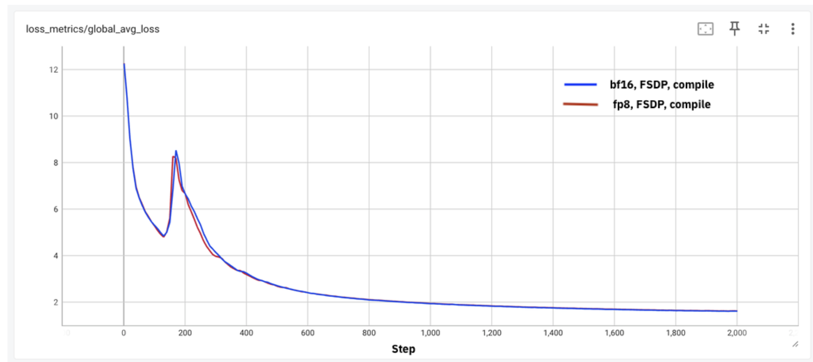
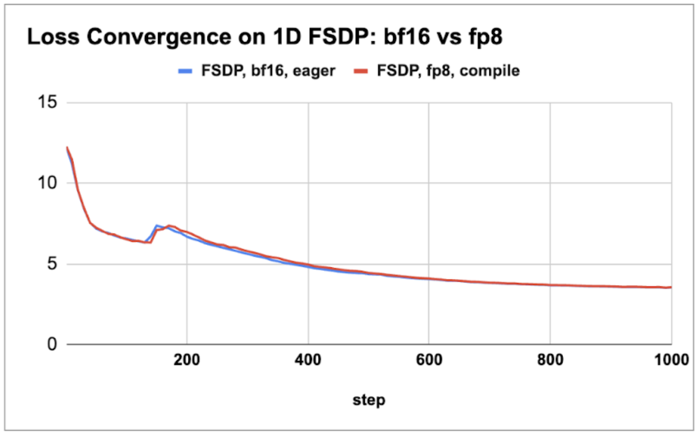
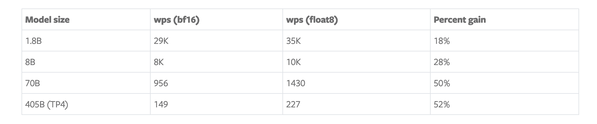
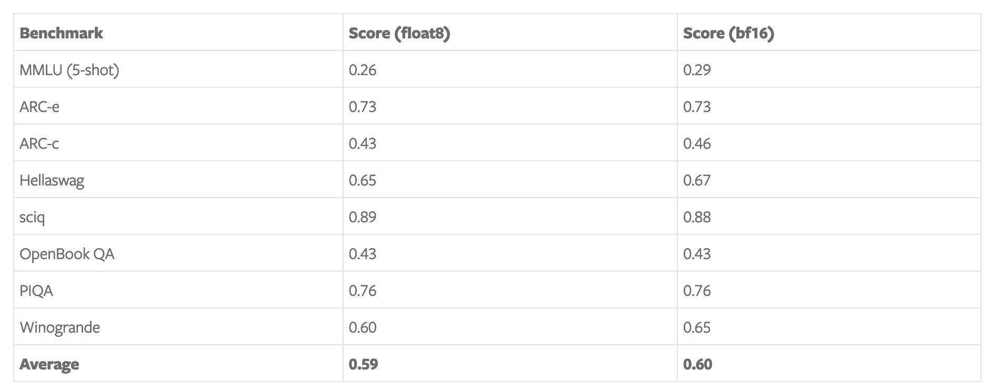
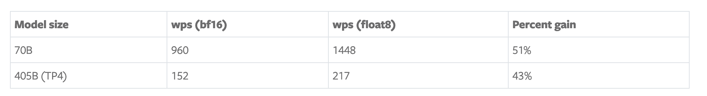

> Blog source: https://pytorch.org/blog/training-using-float8-fsdp2/ . by IBM and Meta. 여기서는 FSDP2와 FP8 training 관련 내용을 주로 요약한다. 현재 practice는 TorchTitan(DTensor, Async Tensor Parallelism, FP8 Allgather 등)과 torchao에 집중되어 있으며, `torch.compile` compiler도 대응 support를 진행 중이다. PyTorch의 이 작업은 사실 아직 매우 안정적이지는 않고, Megatron-LM의 FP8과 비슷하게 반제품 단계에 가깝다. 예를 들어 API interface 변화가 꽤 크다. 여기서는 먼저 이들의 진행 상황을 간단히 이해하면 된다.

FSDP2와 FP8 training 관련 선행 내용:

- [【번역】PyTorch FSDP로 Training Throughput 극대화](https://mp.weixin.qq.com/s/6wNX38rKcFjxLb4ooYQokw)
- [【번역】PyTorch FSDP와 Torch.compile로 Training Throughput 극대화](https://mp.weixin.qq.com/s/YVVau7boVUEnVB6o_qKORA)
- [【번역】FSDP2에서 Float8 All-Gather 켜기](https://mp.weixin.qq.com/s/44zFNWr5aVtA3zPtegY9dg)
- [[Distributed Training and TorchTitan] PyTorch의 Async Tensor Parallelism 소개](https://mp.weixin.qq.com/s/Jx4B-sF9dudg7OOT-FbsLg)

# float8과 FSDP2로 Training 가속하기

> Authors: IBM: Tuan Hoang Trong, Alexei Karve, Yan Koyfman, Linsong Chu, Divya Kumari, Shweta Salaria, Robert Walkup, Praneet Adusumilli, Nirmit Desai, Raghu Ganti, Seetharami Seelam
> Meta: Less Wright, Wei Feng, Vasiliy Kuznetsov, Driss Guesseous

이 blog에서는 loss와 evaluation benchmark consistency를 유지하면서 [FSDP1 bf16 training](https://mp.weixin.qq.com/s/YVVau7boVUEnVB6o_qKORA) 대비 throughput을 최대 50%까지 높이는 방법을 보여준다. 우리는 FSDP2, DTensor, `torch.compile`과 torchao의 float8 linear layer update(computation), 그리고 weight communication을 위한 float8 all_gathers를 활용해 이 향상을 달성했다. 이러한 개선이 Meta LLaMa model architecture의 다양한 scale, 1.8B small model부터 405B large model까지에서 어떤 효과를 내는지 보여주며, training을 이전보다 더 빠르게 만든다.

우리는 Meta Llama3 architecture를 사용해 이 개선을 보여주며, 두 scale에서 model quality study를 수행했다. 8B model scale의 100B tokens training과 70B model scale의 50B tokens training으로, float8과 bf16 training loss curve를 정확히 비교한다. 우리는 `bf16` 대비 이러한 model training run의 loss curve가 동일한 loss convergence에 도달함을 증명했다. 또한 FineWeb-edu dataset으로 3B model을 1T tokens까지 학습하고 standard evaluation benchmark를 실행해 model quality가 온전하고 bf16 run과 동등함을 확인했다.

IBM Research에서는 이러한 feature를 data ablation experiment에 사용할 계획이며, 주어진 GPU budget 안에서 실행 가능한 experiment 수를 늘리려 한다. 장기적으로는 더 큰 scale의 model run을 통해 `float8` training의 end-to-end feasibility를 보여줄 것이다.

## Float8이란 무엇인가

`float8` training format은 NVIDIA, ARM, Intel이 2022년 논문(https://arxiv.org/abs/2209.05433)에서 제안했다. 이 논문은 더 낮은 precision의 float8로도 model quality를 희생하지 않고 training할 수 있음을 증명했다. NVIDIA Hopper series 같은 새로운 GPU가 등장하면서 native float8 tensor core support 덕분에 FP8 training이 가능해졌고, 2배가 넘는 training throughput 향상이 기대된다. 이 약속을 실현하려면 몇 가지 challenge가 있다.
(i) `float8`에서 `matmul`과 `attention` 같은 core model operation을 활성화하기,
(ii) distributed framework에서 `float8` training을 활성화하기,
(iii) `float8`에서 GPU 사이의 weight communication을 활성화하기.
NVIDIA library는 `float8` `matmul`을 활성화했지만, 뒤의 두 항목은 FSDP2와 torchao의 최신 update에서 제공된다.

이 blog에서는 torchtitan(https://github.com/pytorch/torchtitan)을 training entry point로 사용하고, IBM의 deterministic dataloader, torchao의 `float8` linear layer implementation, 그리고 최신 PyTorch nightly version의 `float8 all gather`를 FSDP2와 함께 사용한다. 이번 training에서는 row-level이 아니라 `float8` per-tensor(tensorwise) scaling granularity를 사용한다. 우리는 최대 performance gain을 얻기 위해 `torch.compile`을 활용한다. 현재 `attention`은 SDPA를 사용해 `bf16`에서 계산하며, 이를 `float8`로 옮기기 위해 노력 중이다.

## Experiments

우리는 float8 training의 장점을 보여주기 위해 다양한 experiment를 수행했다. 첫 번째는 model quality가 희생되지 않음을 보장하는 것이다. 이를 검증하기 위해 8B model과 70B model을 수천 step 학습하고, float8과 bf16 training run 사이의 loss curve를 비교했다. 우리의 experiment는 서로 다른 environment를 가진 세 H100 cluster에서 수행되었다. 각각 128, 256, 512개의 H100 GPU로 구성되어 있으며 reproducibility를 보이기 위한 것이다. 첫 번째 cluster는 Meta의 Grand Teton(https://engineering.fb.com/2024/03/12/data-center-engineering/building-metas-genai-infrastructure/) 위의 custom cluster로 400Gbps custom interconnect를 갖고 있다. 두 번째는 3.2Tbps Infiniband interconnect를 갖춘 IBM research cluster다. 세 번째는 GPU-to-GPU communication에 3.2Tbps RoCE interconnect를 사용하는 IBM Cloud cluster다.

먼저 아래 그림에서 두 model의 loss curve comparison을 그려, 수천 step에서의 loss consistency를 보여준다.

그림 1: (a) 8B model 2k step loss consistency, (b) 70B model 1k step loss consistency

우리는 이러한 서로 다른 model과 environment에서 small-scale tokens training의 loss consistency를 얻었음을 관찰했다. 다음으로 1.8B부터 405B까지 네 가지 서로 다른 model scale의 throughput gain을 특성화했다. 우리는 float8과 bf16 training run의 best batch size와 activation checkpoint scheme을 탐색해 **tokens per GPU per second(wps)** metric을 결정하고 performance gain을 보고했다. 405B model의 경우 DTensor를 활용해 tensor parallel training과 FSDP2를 함께 사용했다. 모든 measurement는 8K sequence length를 사용했다.

표 1: bf16 대비 performance gain(bf16과 float8 모두 torch.compile 사용)

표 1에서 큰 model(70B와 405B)의 gain은 50%에 도달하고, 작은 model의 gain은 20%~30% 사이라는 점을 관찰했다. 추가 experiment에서는 float8 all_gather 추가가 float8 computation 자체에 더해 약 5% performance improvement를 가져왔으며, 이는 이 blog(https://aws.amazon.com/cn/blogs/machine-learning/efficient-pre-training-of-llama-3-like-model-architectures-using-torchtitan-on-amazon-sagemaker/)의 관찰과 일치했다.

둘째, FP8 model의 effectiveness를 보여주기 위해 Hugging Face의 FineWeb-edu dataset을 사용해 Llama3 architecture를 따르는 3B model을 1T tokens까지 학습했다. 우리는 lm-eval-harness framework로 evaluation을 수행했고, 아래 표에 일부 결과를 보여준다. bf16 performance가 float8 score보다 약간 더 좋음(약 1 percentage point)을 관찰했다. 일부 score는 bf16에서 더 뚜렷하게 좋지만(예: MMLU 3점 높음), 올바른 hyperparameter를 선택하고 더 큰 scale의 training run을 수행하면 이러한 gap은 사라질 것으로 예상한다. 예를 들어 bf16 run의 batch size는 절반이고, 더 작은 batch size run이 evaluation score를 높일 수 있다는 것은 잘 알려져 있다.

표 2: float8 training model을 FP16에서 evaluate한 benchmark score(FineWeb pretraining 1T tokens 시점).

마지막으로 experiment를 IBM Cloud cluster의 512개 H100 GPU까지 확장했다. 우리는 512 GPU scale에서 관찰한 결과와 acceleration을 재현할 수 있었다. 아래 표에서는 large model(70B와 405B)의 결과만 요약한다.

표 3: 512 GPU scale에서 bf16 대비 performance gain(bf16과 float8 모두 torch.compile 사용)

## Future Work

우리는 context parallelism 같은 다른 parallelism 형태도 연구하고 있다. 모든 feature를 평가해 composability와 large-scale model training을 위한 선택 능력을 보여줄 계획이다.

## 감사의 말

여러 run에서 동일한 순서로 data를 replay할 수 있게 torchtitan run에 dataloader를 활성화해 준 IBM Research의 Davis Wertheimer에게 감사드린다. 또한 H100 cluster의 early test access를 제공해 준 IBM Cloud에도 감사드린다.

