# VeriCache: Lossy KV Cache를 Lossless 추론으로 바꾸기

> 논문: **VeriCache: Turning Lossy KV Cache into Lossless LLM Inference** (Jiayi Yao et al., University of Chicago / Tensormesh / Samsung Semiconductor / Microsoft Research), arXiv 2605.17613v1, 2026.
>
> 한 줄 요약: KV cache 압축(토큰 드롭·양자화)의 **처리량**은 그대로 얻으면서 출력은 full-KV 디코딩과 **완전히 동일(lossless)** 하게 만드는 추론 프레임워크. 압축 KV로 draft하고 full KV로 verify하는 speculative execution 구조에, 이를 실제로 빠르게 만드는 두 가지 시스템 설계(cross-resource staggering, 긴 acceptance run)를 더했다.

---

## 1. 문제: 정확도–처리량 딜레마

긴 컨텍스트 LLM 서빙에서 KV cache의 크기는 이제 주된 병목이다. 컨텍스트 길이 $n$에 대해 KV cache는 $O(n)$의 메모리와 대역폭 비용을 유발하며, 이는 두 방향으로 서빙을 압박한다.

- **요청 내부(within-request):** 매 디코딩 스텝마다 attention을 위해 GPU HBM에서 전체 KV cache를 읽어야 한다. KV가 커질수록 배치에 넣을 수 있는 요청 수가 줄어든다. 예를 들어 H100 80GB에서 Qwen-32B(~64GB weights)를 서빙하면 2K-token 컨텍스트 요청당 ~0.3GB의 KV가 필요해 배치 크기 ~50이 가능하지만, 100K 토큰으로 늘리면 KV가 ~15GB가 되어 배치 크기가 1로 떨어진다.
- **요청 간(cross-request):** 시스템 프롬프트·공유 문서·대화 이력 등 긴 prefix를 공유하는 워크로드에서는 KV cache를 미리 계산해 재사용(prefix caching)하는데, 이때 저장소나 네트워크에서 KV를 GPU로 옮기는 전송이 새로운 병목이 된다.

이를 완화하려고 **KV cache 압축**이 널리 연구되었다(대표적 방법은 [Table 1] 참조). 크게 두 부류다.

- **토큰 드롭(token dropping):** 특정 레이어/attention head에서 덜 중요한 토큰을 버려 cache의 *모양*을 바꾼다. StreamingLLM, H2O, SnapKV, PyramidKV, DuoAttention, KVzip, FastKVzip 등.
- **양자화(quantization):** cache의 모양은 유지하되 원소별 정밀도를 낮춘다. KIVI, KVQuant, KVTuner, TurboQuant, CacheGen, QServe, GEAR, RotateKV 등.

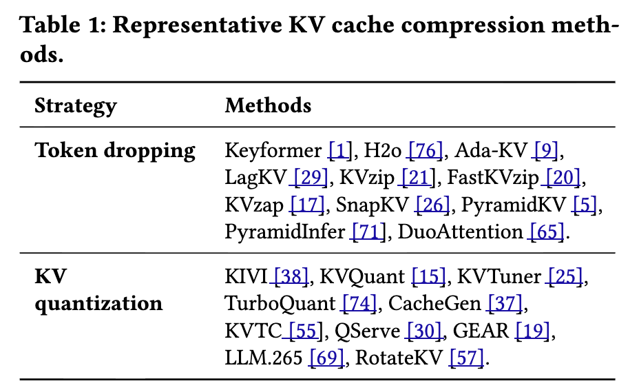

둘 다 2–5× 수준의 메모리·전송 절감을 준다. 그러나 이 방법들은 본질적으로 **lossy** 하다. 짧은 출력에서는 정확도 저하가 미미하지만, 토큰이 많이 디코딩될수록 출력이 full-KV 출력에서 점점 벗어나고, 코드 생성이나 tool calling 같은 곳에서 치명적 실패로 이어진다.

이 논문이 던지는 질문은 명확하다.

> **KV cache 압축의 처리량 이득을, LLM 출력에 영향을 주지 않고 취할 수 있는가?**

[Figure 1]은 이 딜레마를 요약한다. Full Cache는 정확도는 높지만 처리량이 낮고, Lossy Cache는 처리량은 높지만 정확도가 떨어진다. VeriCache는 압축의 처리량을 가지면서 full KV와 동일한 출력을 목표로 하는 지점(★)에 위치한다.

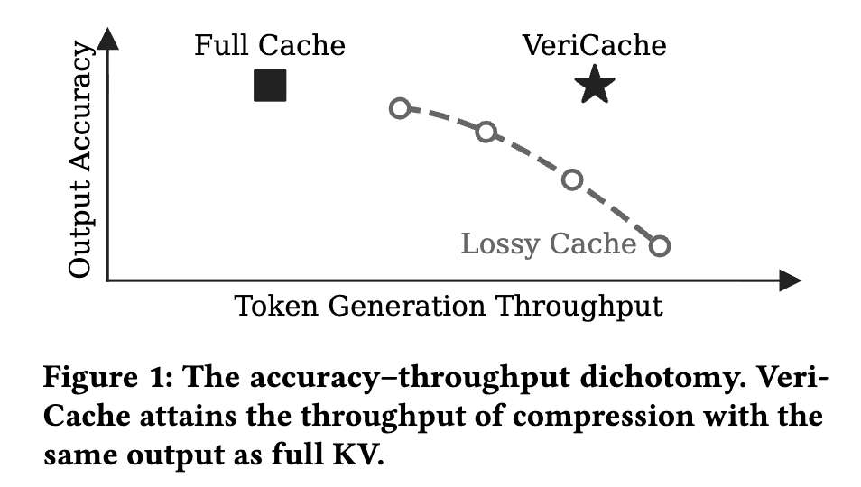

---

## 2. 왜 lossy KV는 실패하는가: 편향의 누적

### 2.1 의미적 유사성 ≠ 기능적 정확성

기존 KV 압축은 주로 토큰 수준 지표(F1, ROUGE, perplexity, cosine similarity)로 평가되어 왔다. 이런 지표는 요약·자연어 Q&A처럼 약간의 텍스트 편차를 허용하는 태스크에는 맞지만, 문법·의미의 정확성이 요구되는 응용에는 부적합하다. 유효하지 않은 구문 토큰 하나가 프로그램을 깨뜨리고, delimiter 하나가 어긋나면 JSON이 손상되며, 연산자 하나가 바뀌면 셸 명령의 의미가 바뀐다(예: `rm -rf *.logs` → `rm -rf * .`). [Figure 2]는 ~280K자 코드베이스에서 4× 압축(KVzip)이 ~200줄 이후 명확히 오답으로 새는 실제 사례를 보여준다.

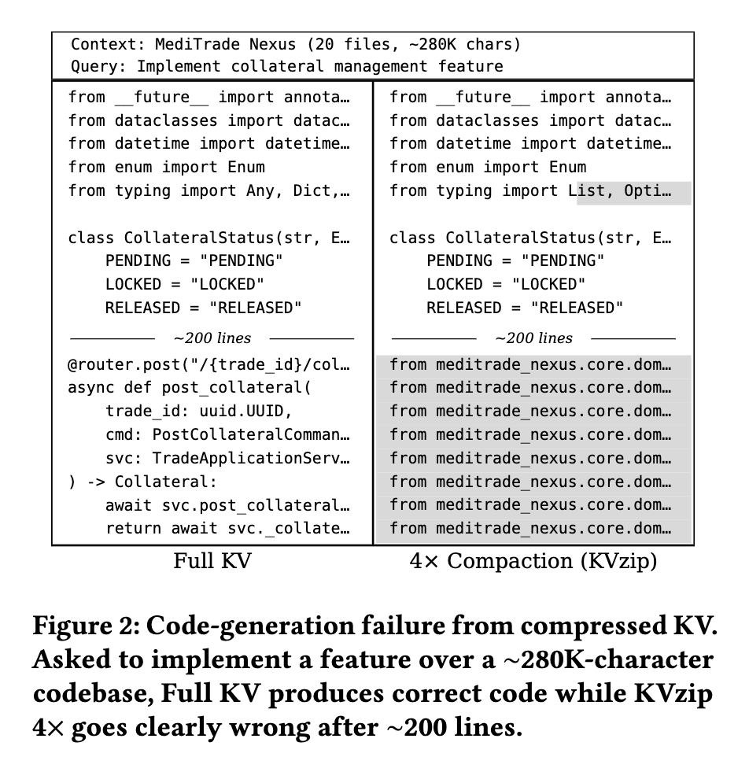

[Figure 3]은 이 차이를 정량화한다. 부분 정답에 부분 점수를 주는 F1은 75% 넘게 유지되지만, 구문적으로 유효한 diff를 요구하는 code format accuracy와 모든 인자를 정확히 맞춰야 하는 function call accuracy는 붕괴한다. 즉 **soft metric이 functional failure를 가린다**.

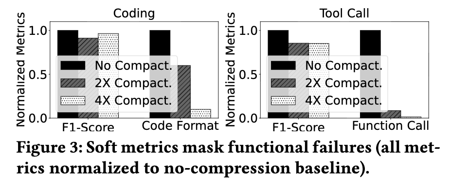

### 2.2 근본 원인: 토큰별 편향의 누적

품질 붕괴의 근본 원인은 KV 압축이 매 스텝의 attention 가중치를 바꿔, 모델이 학습한 next-token 분포 $p_\text{full}$을, 모델이 한 번도 생성하도록 학습되지 않은 다른 분포 $p_\text{lossy}$로 대체한다는 데 있다. 이는 sampling noise(예: temperature)와 근본적으로 다르다. Sampling은 *같은* $p_\text{full}$ 안에서 다른 토큰을 뽑는 것이지만, 압축은 **계통적(systematic) 편향** 이다. 매 샘플이 잘못된 분포에서 뽑히므로 재샘플링으로 교정되지 않는다.

**스텝별 분포 이동.** 각 디코딩 스텝 $t$에서 full-KV와 lossy-KV의 next-token 조건부 분포 사이의 KL divergence로 이 편향을 측정한다.

$$
\mathrm{KL}_t \;=\; \sum_{x_t} p_\text{full}(x_t \mid x_{<t})\,\log \frac{p_\text{full}(x_t \mid x_{<t})}{p_\text{lossy}(x_t \mid x_{<t})}. \tag{1}
$$

$\mathrm{KL}_t$는 두 조건부 분포가 같으면 0이고, 벌어질수록 커진다.

**편향은 생성 과정에서 누적된다.** 이 스텝별 편향은 autoregressive 생성을 따라 쌓인다. KL divergence의 chain rule에 의해 시퀀스 수준 KL은 스텝별 KL의 합으로 분해된다.

$$
\mathrm{KL}_{1:T} \;\triangleq\; \mathrm{KL}\!\big(p_\text{full}(x_{1:T}) \,\|\, p_\text{lossy}(x_{1:T})\big) \;=\; \sum_{t=1}^{T} \mathbb{E}_{x_{<t}\sim p_\text{full}}\!\left[\mathrm{KL}_t\right]. \tag{2}
$$

스텝별 KL이 어떤 $\varepsilon > 0$으로 하한된다면(즉 $\mathbb{E}_{x_{<t}\sim p_\text{full}}[\mathrm{KL}_t] \ge \varepsilon$), 시퀀스 KL은 출력 길이 $T$에 대해 최소한 선형으로 증가한다: $\mathrm{KL}_{1:T} \ge \varepsilon T$.

여기서 결정적인 결과가 나온다. $\mathrm{KL}_{1:T} = \mathbb{E}_{x_{1:T}\sim p_\text{full}}\!\big[\log(p_\text{full}(x_{1:T})/p_\text{lossy}(x_{1:T}))\big]$이므로, $p_\text{full}$에서 뽑은 시퀀스의 log-likelihood 비율은 평균 $\ge \varepsilon T$가 된다. 따라서 likelihood 비율 자체는 대략 $e^{\varepsilon T}$ 수준 — 즉 **$T$에 대해 지수적**으로 커진다(증명은 Appendix A, 아래 §7 참조).

[Figure 4]는 이를 실증한다. KVzip 4×와 TurboQuant k4v3 모두에서 시퀀스 수준 KL이 디코딩 스텝 $t$에 따라 거의 선형으로 자란다. 구체적으로 KVzip 4×는 스텝당 ~0.023 nats만 누적한다 — lossy 모델이 full-KV 토큰에 $e^{-0.023}\approx 98\%$의 확률을 부여하니 거의 구분되지 않는다. 그러나 $T=250$ 스텝 후 누적 KL은 ~6 nats에 이르고, lossy 모델이 full-KV 출력 시퀀스를 그대로 내놓을 확률은 $e^{-6}\approx 2.5\times 10^{-3}$ 뿐이다 — 스텝당 ~2%의 간극이 수백 스텝에 걸쳐 400×의 불일치로 증폭된다.

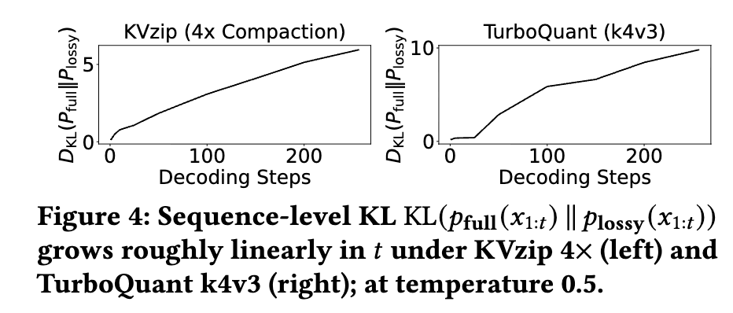

**요지:** 정밀도가 중요한 응용에서 기존 KV 압축은 "lossy를 받아들이고 조용한 실패를 감수" vs "full KV를 쓰고 효율을 포기"의 이분법을 강요한다. 이 논문의 주장은 이 이분법이 불필요하다는 것이다 — **압축이 정확한 계산을 대체할 필요는 없고, 그것을 가속하기만 하면 된다.**

---

## 3. 핵심 아이디어: KV cache verification

### 3.1 개요

VeriCache는 임의의 lossy KV 압축 방법을 추론 파이프라인의 **speculative execution 레이어**로 재활용한다([Figure 5]). $\text{KV}_\text{comp}$를 압축 KV, $\text{KV}_\text{full}$을 full cache라 하자. 핵심 루프는 다음과 같다(설명은 greedy decoding 기준이며, 표준 rejection sampling으로 sampling에도 확장된다).

1. **Draft.** 압축 KV $\text{KV}_\text{comp}$를 사용해 후보 토큰 $t_1, \dots, t_x$를 autoregressive하게 생성한다. 각 $t_i$는 압축 KV로 표현된 프롬프트와 이전 생성 토큰에 조건화된, 모델 분포상 가장 확률 높은 다음 토큰이다.
2. **Verify.** full KV $\text{KV}_\text{full}$에 조건화하여, draft된 $x$개 위치에 대해 **한 번의 forward pass**로 병렬 검증한다. 이 pass는 각 draft 위치 $k$에서 $\text{KV}_\text{full}$ 기준 next-token 예측 $t^*_1, \dots, t^*_{x+1}$을 준다(각 위치의 정답 + 마지막 draft 토큰 뒤의 bonus 예측 1개).
3. **Accept.** $t_j \ne t^*_j$인 첫 위치 $j \in [1, x]$를 찾아, $t_1, \dots, t_{j-1}$을 받아들이고 verifier의 교정 $t^*_j$를 적용한 뒤 나머지를 버린다. 모든 draft가 일치하면 $x$개 전부와 bonus $t^*_{x+1}$까지 받아들인다. Draft는 마지막으로 accept된 토큰 다음 위치에서 재개한다.

이 구조 덕분에 최종 출력은 full-KV 추론과 **비트 단위로 동일**하다(하드웨어 비결정성으로 인한 차이 제외). 여기서 "동일(identical)"은 greedy decoding(zero temperature) 기준이다.

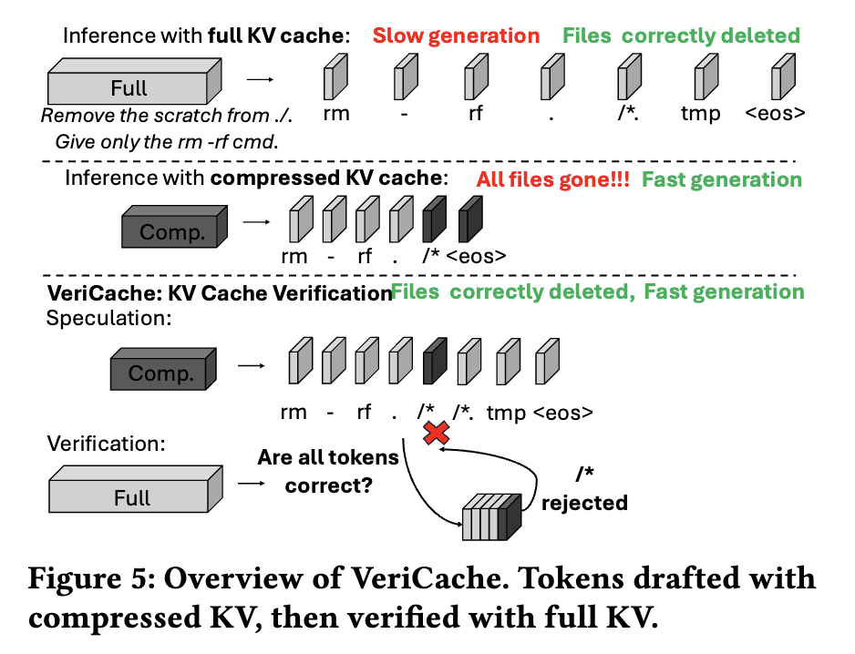

### 3.2 왜 단순 speculative decoding이 아닌가

언뜻 보면 그냥 speculative decoding 같지만, 그대로 적용하면 토큰 검증 오버헤드 때문에 처리량이 오히려 떨어져 압축의 이득을 상쇄한다(§4 실험). VeriCache가 기존 speculative decoding과 다른 두 가지 결정적 성질이 있다.

- **Drafter와 verifier가 완전히 같은 모델·가중치를 쓴다.** 전통적 speculative decoding은 작고 다른 auxiliary 모델을 drafter로 쓴다. VeriCache의 drafter는 압축 KV 위에서 도는 target 모델 자신이다. 압축 캐시는 모델의 가중치와 지배적 attention 패턴을 보존하므로, draft된 토큰이 full-KV 출력을 훨씬 잘 추적한다. 그 결과 acceptance run이 길다 — VeriCache는 verification round당 **25–40개**의 토큰이 accept되는 반면, 전형적인 small-model drafter는 2–3개에 그친다(§4.3).
- **Draft와 verify가 상보적(complementary) 자원 병목을 갖는다.** 압축 KV로 draft하는 것은 한 번에 한 토큰씩 sequential vector-matrix 곱을 하므로 GPU FLOPs를 충분히 못 쓰는 **HBM-대역폭 바운드** 연산이다. 반면 full KV를 보조 저장소에서 GPU로 올려 여러 토큰을 병렬 검증하는 것은 **inter-connect 대역폭과 GPU FLOPs 바운드** 다. 이 서로 다른 자원에 draft와 verify를 엇갈려(stagger) 배치하면 활용도가 크게 오른다.

`Insight 1`: VeriCache의 drafter는 압축 KV 위에서 도는 target 모델 자신이므로, 압축 캐시가 모델 가중치와 지배적 attention 패턴을 보존한다. 따라서 draft된 토큰이 full-KV 출력을 매우 가깝게 추적한다.

---

## 4. 시스템 설계: 두 가지 원리

검증 자체는 매 스텝 세 가지 자원을 요구한다 — (1) full KV를 CPU/원격 저장소에서 올리는 **inter-connect 대역폭**, (2) 검증 중 그것을 담을 **GPU HBM**, (3) $x$개 토큰의 검증 forward pass를 위한 **GPU compute**. 앞의 두 가지를 lock-step으로 처리하면 압축의 처리량 이득이 사라진다. VeriCache는 이를 막는 두 설계 원리(P1, P2)를 제시한다.

### 4.1 P1: Cross-resource staggering

전통적 speculative decoding은 요청들을 lock-step으로 묶는다: $x$번 draft한 뒤 $x{+}1$번째 iteration에서 한꺼번에 verify. 모든 iteration이 같은 병목을 공유하므로 다른 자원은 놀게 된다([Figure 6a]: $i{+}2$에서 동시 검증이 inter-connect를 정체시키고 GPU를 멈춘다).

VeriCache는 대신 요청들을 **엇갈린다(stagger)**. 어떤 요청이 verify하는 iteration에 다른 요청은 draft하도록 섞는다([Figure 6b]: $r_1$의 KV 전송·검증을 다른 요청의 draft와 겹친다). 압축-KV draft(HBM 바운드)와 full-KV verify(inter-connect·compute 바운드)가 상보적 자원을 쓰므로, staggering은 GPU compute·HBM·inter-connect를 동시에 바쁘게 유지한다.

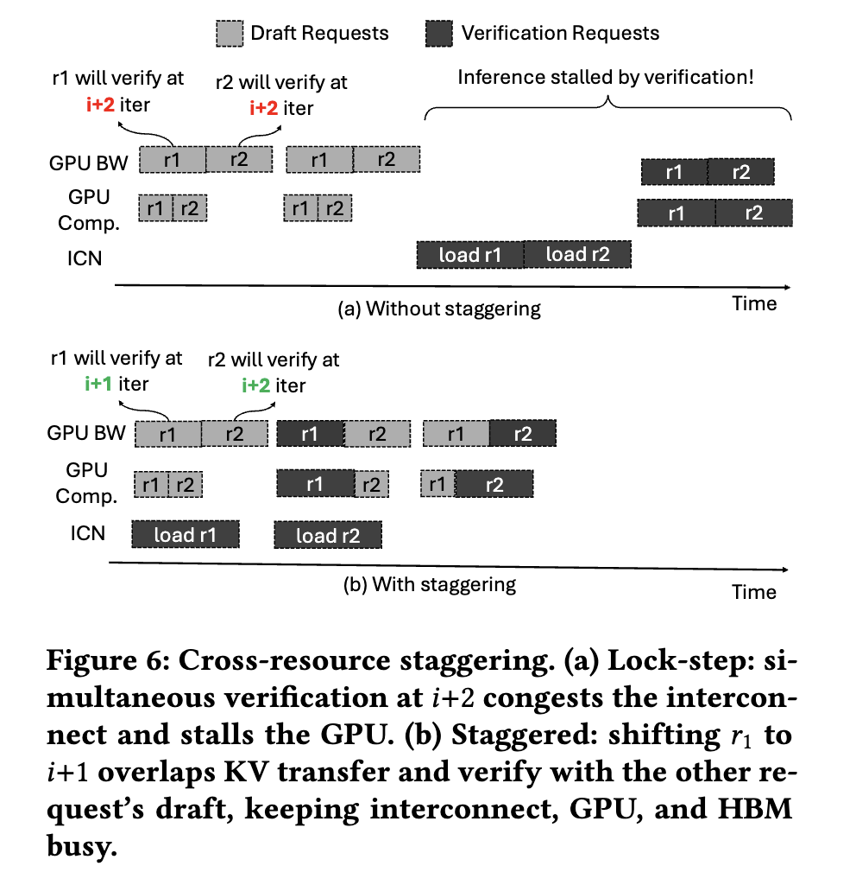

VeriCache는 두 배포 시나리오를 모두 다룬다([Figure 7]).

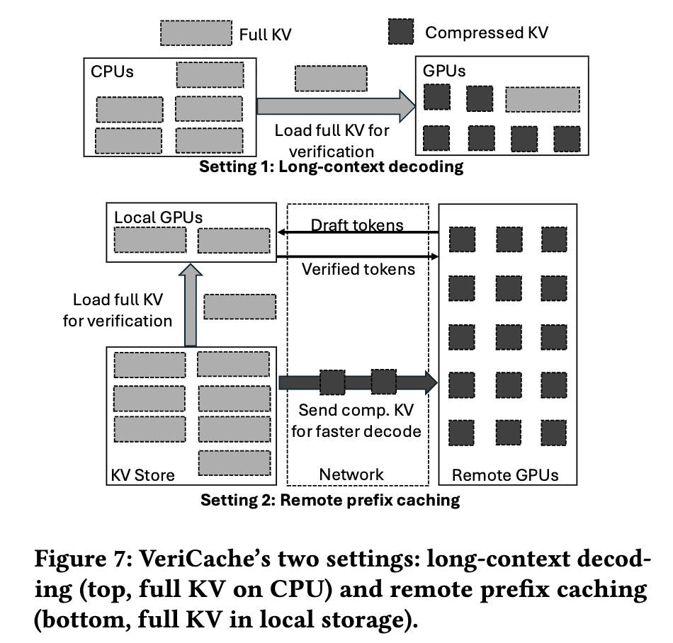

**Setting 1 — Long-context decoding.** 압축 KV는 GPU HBM에 상주해 draft에 쓰고, full KV는 CPU 메모리에 둔다. 검증이 필요할 때 full KV를 CPU→GPU inter-connect로 다시 올린다. 이때 iteration 시간은 GPU forward-pass 시간 $T_\text{gpu}$와 CPU→GPU 전송 시간 $T_\text{xfer}$의 최댓값이다.

$$
T_\text{iter} = \max\!\Bigg(
\underbrace{\frac{M + B\cdot \text{KV}_\text{full}\cdot(c + 1/x)}{\text{BW}_\text{hbm}}}_{T_\text{gpu}},\;
\underbrace{\frac{B/x \cdot \text{KV}_\text{full}}{x\cdot \text{BW}_\text{inter}}}_{T_\text{xfer}}
\Bigg). \tag{3}
$$

여기서 $M$은 모델 가중치 크기, $B$는 배치 크기(동시 요청 수), $\text{KV}_\text{full}$은 요청당 full KV 크기, $c<1$은 압축률($\text{KV}_\text{comp} = c\cdot\text{KV}_\text{full}$), $x$는 draft 길이, $\text{BW}_\text{hbm}$·$\text{BW}_\text{inter}$는 각각 HBM·inter-connect 대역폭이다. Lock-step 대안은 모든 verify를 한 iteration에 몰아 40GB 전송으로 PCIe를 ~800ms 점유하고 HBM을 스파이크시키지만, staggering은 각 ~80ms PCIe 전송을 draft 작업과 겹쳐 HBM 상주량을 $M + B\cdot\text{KV}_\text{comp} + 1\cdot\text{KV}_\text{full}$ 수준으로 안정시킨다(구체 예: Mistral 24B, RTX PRO 6000, PCIe Gen5 ×16).

**Setting 2 — Remote prefix caching.** 저장소 노드의 로컬 GPU(빠른 링크 $\text{BW}_h$)와 원격 GPU 풀(느린 링크 $\text{BW}_l \ll \text{BW}_h$)이 있다. 원격 GPU는 느린 링크로 스트리밍된 압축 KV로 draft하고, 로컬 GPU는 이미 도착한 요청의 full KV를 병렬로 올려 검증 forward pass를 돈다. Draft와 verify가 완전히 다른 하드웨어에서 돌아 하나의 요청 안에서 파이프라인된다. 요청당 시간은

$$
T_\text{req} = \underbrace{\frac{c\cdot\text{KV}_\text{full}}{\text{BW}_l}}_{\text{startup}} + \underbrace{\frac{K}{x\,\gamma(x,c)}}_{\text{\# draft-verify cycles}} \cdot\, T_\text{cycle}, \tag{4}
$$

$$
T_\text{cycle} = \max\!\big(x\cdot T_\text{decode},\; \text{KV}_\text{full}/\text{BW}_h\big) + T_\text{fwd}(x).
$$

여기서 $K$는 요청당 출력 토큰 수, $\gamma(x,c)$는 draft 길이 $x$와 압축률 $c$의 함수인 acceptance rate다. $T_\text{cycle}$의 $\max$는 draft–load 겹침을 포착하고, verify forward pass $T_\text{fwd}(x)$는 그 뒤에 직렬로 붙는다. Startup은 full-KV baseline($\text{KV}_\text{full}/\text{BW}_l$) 대비 $\sim 1/c$배 빠르고, $\gamma(x,c)$가 필요한 draft-verify cycle 수를 직접 줄인다.

### 4.2 P2: 높은 acceptance rate가 검증 비용을 상각

`Observation 2`: $x$(draft 길이)와 $\gamma$(acceptance rate)가 함께 검증 비용을 좌우한다. $x$가 너무 작으면 검증이 너무 자주 발생해 오버헤드가 지배하고, $\gamma$가 너무 낮으면 대부분의 draft가 버려져 각 round의 작업이 낭비된다. 검증이 싸게 상각되려면 $x$와 $\gamma$가 **둘 다 높아야** 한다.

VeriCache는 두 조건을 자연스럽게 만족한다. Drafter가 압축 KV 위의 target 모델 자신이므로 draft가 full-KV 출력을 잘 추적해 $\gamma$가 크고, 이는 긴 draft horizon($x$가 큼)을 지탱한다. [Figure 8]은 4× 압축에서 draft 길이 30까지도 acceptance rate가 ~0.8 이상을 유지함을 보인다. [Figure 9]는 acceptance length를 Eagle 및 small-model drafter와 비교한다: draft 길이 30에서 VeriCache는 Qwen-32B에서 ~19, Llama-70B에서 ~23의 acceptance length를 유지하는 반면, Eagle은 ~3, small model은 Qwen-32B ~3 / Llama-70B ~10에 그친다.

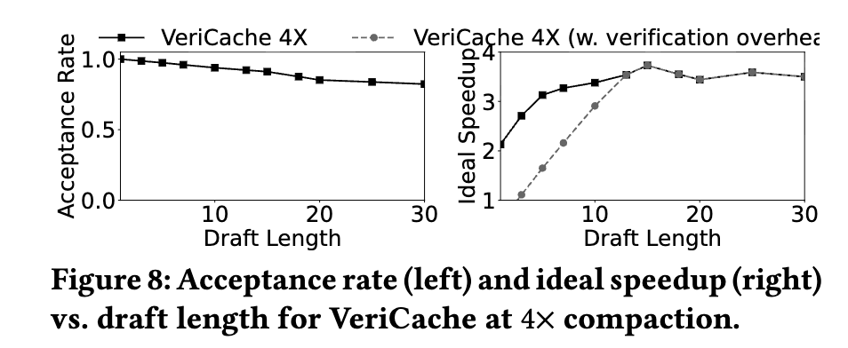

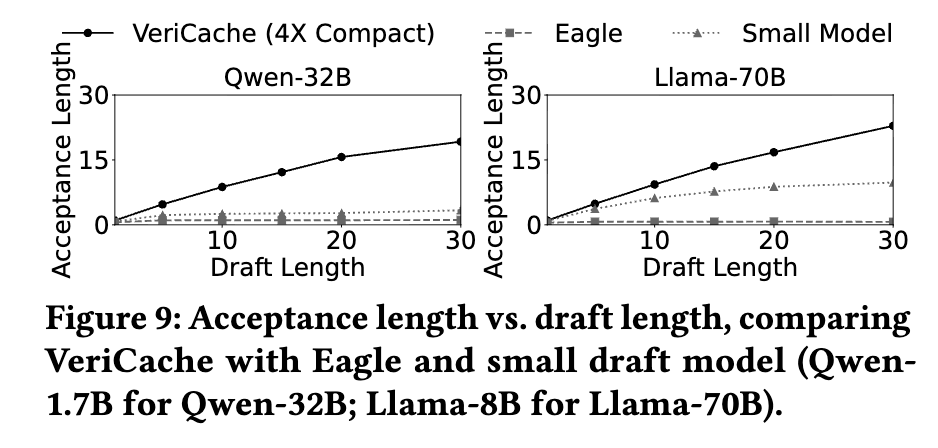

두 drafting 전략은 자연스럽게 **합성(compose)** 된다. Small-model drafter(예: MTP, EAGLE)가 압축 KV로 검증할 토큰을 먼저 제안하고, 주기적으로 full KV로 다시 검증해 압축 오류를 교정하는 방식이다. [Figure 10]이 그 효과를 보인다: VeriCache + Eagle은 이상적 speedup 4.35×에 도달해, VeriCache 단독 3.50×, Eagle 단독 1.78×를 넘는다. 두 방법이 서로 다른(orthogonal) 병목을 공격하기 때문이다 — VeriCache는 요청당 KV를 줄이고, drafter는 요청 내부의 토큰을 가속한다.

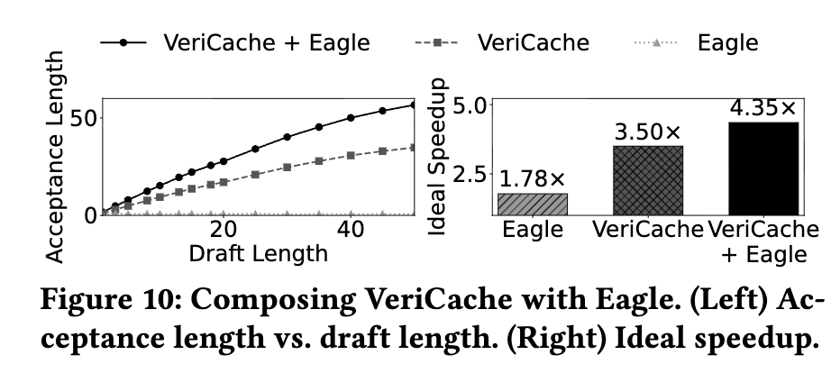

---

## 5. VeriCache 런타임

VeriCache 런타임은 §4의 cross-resource staggering을 실제로 구현한다. 매 iteration에서 어떤 요청이 draft하고 어떤 요청이 verify할지 결정하고, 각 verify가 제때 도착하도록 KV 전송을 스케줄한다. 높은 acceptance rate 덕분에 각 요청의 다음 verify를 여유 용량이 있는 window에 유연하게 배치할 수 있다(§4.2).

### 5.1 Resource model

런타임은 $W$개 미래 iteration을 내다보는 지평(horizon)을 두고, 두 개의 **reserve ring**으로 window별 예약 상태를 추적한다.

- **BW ring (inter-connect):** $T[i]$는 window $i$에 도착하는 전송에 이미 예약된 inter-connect 시간이다. 링크는 직렬(한 번에 한 전송)이므로 제약은
$$
T[i] \le T_\text{iter} \quad \forall i \in [0, W). \tag{ring-BW}
$$
전송의 iteration-등가 지속시간은 $\ell_r = \text{KV}^{(r)}_\text{full}/(\text{BW}\cdot T_\text{iter})$이고, $S_r = \max(1, \lceil \ell_r \rceil)$ window에 걸친다.

- **HBM ring (GPU memory):** $B[i]$는 window $i$에 GPU로 스트리밍되어 상주하는(아직 소비되지 않은) full KV의 크기다. 상시 상주분과 합쳐 제약은
$$
M + \text{KV}_\text{resident} + B[i] \le \text{HBM} \quad \forall i \in [0, W), \tag{ring-HBM}
$$
$M$은 모델 가중치, $\text{KV}_\text{resident}$는 GPU에 상주하는 모든 KV(draft 요청은 압축, pin/non-speculating 요청은 full)다.

GPU compute는 세 번째 ring으로 두지 않는다 — cross-resource staggering이 검증을 iteration에 고루 펴서 compute 부하가 튀지 않고 매끄럽기 때문이다.

### 5.2 Request admission과 execution loop

**Request admission (`Algorithm 1` ADMIT).** 요청 도착 시, 그리고 매 verify 후에 실행된다. 요청의 lookahead window 안에서 미래 verify iteration $d_r$을 하나 고르되, 그 자리의 full-KV 전송이 $d_r$ 전에 완료되도록 예약한다. 실패하면 요청을 대기 큐로 돌린다.

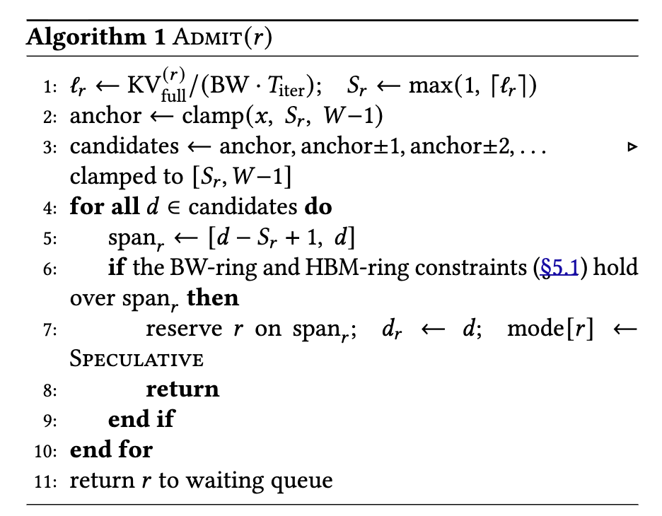

탐색은 이상적 speedup을 최대화하는 draft 길이 $x$(보통 20–50, [Figure 8])만큼 떨어진 iteration을 먼저 확인하고, 안 되면 $x{-}1$, $x{+}1$, $x{-}2$, $x{+}2$ … 순으로 anchor 주변을 넓혀가며(candidates $\leftarrow$ anchor, anchor$\pm1$, anchor$\pm2$, … , $[S_r, W{-}1]$로 clamp) BW-ring과 HBM-ring 제약을 동시에 만족하는 첫 window에 예약한다.

**Execution loop.** 매 iteration $t$마다 세 단계를 수행한다.

1. **Kick off verify reloads.** 예약된 span을 가진 각 speculating 요청에 대해, iteration $t$에 그 요청의 첫 window가 있으면 verifying GPU로 향하는 링크에서 full-KV 비동기 reload를 시작한다.
2. **Draft and verify.** Draft는 다음 iteration의 forward pass를 돌리고, 동시에 verify는 스케줄된 iteration이 현재인 요청들의 검증 forward pass를 완료한다. 완료된 각 verify마다 갱신된 상태로 ADMIT를 다시 호출해 — 다음 verify iteration을 잡아 speculation을 이어가거나, 요청을 대기 큐로 돌린다.
3. **Advance.** lookahead window를 한 iteration 앞으로 민다.

---

## 6. Compressor 인터페이스

KV 압축 방법들은 만들어내는 산출물이 제각각이다(어떤 건 (layer, head)별로 토큰 위치를 드롭, 어떤 건 원소를 양자화). VeriCache는 HBM 할당과 attention 실행에 필요한 최소한만 노출하는 **통일 인터페이스** ([Listing 1])에 기댄다 — 어떤 위치가 드롭되었고 원소당 몇 비트인지.

```python
class CompressedKV:
    dropped_indices: list[Tensor]
    bit_scheme: int

class Compressor:
    scenario: Literal["long-context", "remote-prefix"]
    mode:     Literal["offline", "online"]
    def compress(full_kv, ratio) -> CompressedKV: ...
    def decompress(compressed, layer_idx=None, page_table=None): ...
    def update(layer_idx, q, k, v, hidden, req_offsets) -> list[Tensor]: ...
```

- **Offline** 압축은 서빙 GPU 밖(유휴 GPU)에서 돌아, 일반 추론이 계산하지 않는 정보(명시적 attention 가중치)나 추가 forward pass를 쓸 수 있다.
- **Online** 압축은 `update`를 통해 인라인으로 돌며, 매 iteration 상태에 따라 결정을 내린다.

인터페이스는 **pass-through** 다: 런타임이 compressor에 물리 레이아웃 메타데이터를 넘겨주고, compressor가 스스로 모으고·dequant하고·페이지를 쓴다. `update`도 `req_offsets`를 받아 배치 슬라이싱을 처리한다. 이 비용(compressor 저자가 페이지 레이아웃을 이해해야 함)은 가상화 레이어를 피하는 대신이며, KIVI의 fused dequant-attention은 이미 페이지 단위로 동작한다.

**Scope.** 인터페이스는 다음 네 제약 아래에서 배포 시점의 치환을 대상으로 한다: (i) 한 레이어 안의 head들은 서로 다른 위치를 드롭할 수 있으나 토큰 *개수*는 같다(레이어 간에만 다름); (ii) 한 번에 한 mode만; token-dropping과 quantization은 동시 요청에 혼용하지 않음; (iii) `bit_scheme`은 토큰·레이어에 걸쳐 균일; (iv) 압축 방법은 배포 시 고정. 논문은 이 인터페이스로 기존 **7가지** 방법(토큰 드롭·양자화 스패닝)을 인스턴스화했다 — 단일 compressor를 하드코딩하던 선행 시스템과 대조된다.

---

## 7. 이론적 뒷받침 (Appendix A·B)

### 7.1 KL chain rule 증명 (Appendix A)

식 (2)를 증명한다. 스텝별 log-likelihood 비율을 $\ell_t(x_{\le t}) \triangleq \log \dfrac{p_\text{full}(x_t \mid x_{<t})}{p_\text{lossy}(x_t \mid x_{<t})}$로 두면, 확률의 chain rule로 두 joint 분포가 $p(x_{1:T}) = \prod_{t=1}^{T} p(x_t \mid x_{<t})$로 인수분해되므로

$$
\log \frac{p_\text{full}(x_{1:T})}{p_\text{lossy}(x_{1:T})} = \sum_{t=1}^{T} \ell_t(x_{\le t}).
$$

정의상 시퀀스 KL은 $p_\text{full}$ 하의 기대 log-likelihood 비율이고, tower property에 의해 $\mathbb{E}_{x_{1:T}\sim p_\text{full}}[\ell_t(x_{\le t})] = \mathbb{E}_{x_{<t}\sim p_\text{full}}[\mathrm{KL}_t]$이므로

$$
\mathrm{KL}_{1:T} = \sum_{t=1}^{T} \mathbb{E}_{x_{<t}\sim p_\text{full}}[\mathrm{KL}_t]. \qquad\blacksquare
$$

**함의.** 스텝별 KL이 어떤 $\varepsilon > 0$으로 하한되면 $\mathrm{KL}_{1:T} \ge \varepsilon T$로 최소한 선형으로 자란다. $\mathrm{KL}_{1:T}$가 log-likelihood 비율의 기대이므로, 이 비율의 평균은 $\ge \varepsilon T$이고 비율 자체는 대략 $e^{\varepsilon T}$ — 출력 길이 $T$에 지수적이다. 이것이 §2.2에서 관찰한 편향 누적의 이론적 근거다.

### 7.2 처리량 모델 (Appendix B)

아래 수식에 쓰이는 기호는 [Table 2]에 정리되어 있다.

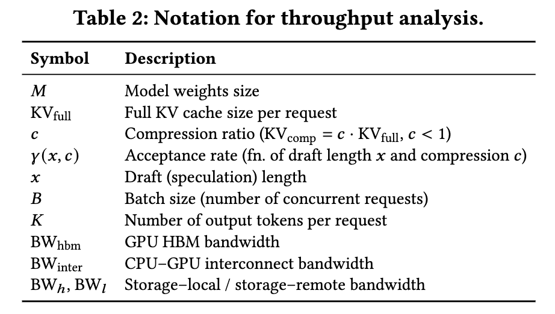

**Intra-request(요청 내부, Setting 1).** 정상 상태에서 offload된 요청은 검증을 위해 CPU에서 full KV를 다시 올려야 한다. $B_c$개 요청이 offload, $B_g$개가 GPU 상주(오프로드 안 함)일 때 offload된 요청당 평균 GPU KV 점유는

$$
\text{KV}_\text{avg} = \text{KV}_\text{full}\cdot \frac{xc + 1}{x + 1}. \tag{5}
$$

GPU 메모리 제약과 iteration당 GPU 시간은

$$
M + B_g\cdot\text{KV}_\text{full} + B_c\cdot\text{KV}_\text{avg} \le \text{GPU}_\text{mem}, \tag{6}
$$

$$
T_\text{gpu} = \frac{M + B\cdot\text{KV}_\text{avg}}{\text{BW}_\text{hbm}}. \tag{7}
$$

각 offload 검증은 $(1-c)\cdot\text{KV}_\text{full}$의 추가 전송을 요구한다. 이 reload를 $\ell$ iteration에 걸쳐 펴면 iteration당 inter-connect 부하가 줄어든다.

$$
T_\text{xfer} = \frac{B_c\cdot(1-c)\cdot\text{KV}_\text{full}}{(x+1)\cdot\text{BW}_\text{inter}\cdot\ell}. \tag{8}
$$

단, 링크는 한 번에 하나의 in-flight reload만 지탱하므로 새 부하의 도착률이 제약된다.

$$
\frac{B_c}{x+1}\cdot\ell \le 1. \tag{9}
$$

HBM 읽기와 inter-connect 전송은 서로 다른 하드웨어라 겹치므로

$$
T_\text{iter} = \max(T_\text{gpu}, T_\text{xfer}). \tag{10}
$$

모든 요청은 iteration당 평균 $\dfrac{\gamma(x,c)\cdot x + 1}{x+1}$개 토큰을 생산하므로, 스케줄러는 처리량을 최대화하도록 $B_c, x, c, \ell$을 고른다.

$$
\max_{B_c, x, c, \ell}\; \frac{B\cdot \frac{\gamma(x,c)\cdot x + 1}{x+1}}{\max(T_\text{gpu}, T_\text{xfer})}
\quad \text{s.t. Eqs. (6),(9),}\; 0 \le B_c \le B,\; x \ge 1,\; 0 < c < 1,\; \ell \ge 1. \tag{11}
$$

네 knob은 트레이드오프를 항해한다: $B_c$를 키우면 $T_\text{gpu}$는 낮아지나($T_\text{xfer}$는 올라감), $\ell$을 키우면 reload를 여러 iteration에 펴지만 제약 (9)가 offload 수/draft 길이를 제한하고, $c$를 낮추면 $T_\text{gpu}$가 줄지만 $\gamma(x,c)$도 낮아지고, $x$를 키우면 전송 비용을 더 많은 draft에 상각하나 긴 draft에서 $\gamma$가 줄어 accept 토큰의 한계 이득이 감소한다.

Full-KV baseline($B_c=0$)은 최대 $\lfloor(\text{GPU}_\text{mem}-M)/\text{KV}_\text{full}\rfloor$개 요청, 순수 lossy는 그 $1/c$배까지 담지만 정확성을 희생한다. VeriCache는 lossless를 유지한 채 그 사이에서 동작한다.

**Inter-request(요청 간, Setting 2).** $G_L$개 로컬 GPU(저장소에 가까운 빠른 링크 $\text{BW}_h$)와 $G_R$개 원격 GPU(느린 링크 $\text{BW}_l$)를 가정한다. 각 GPU가 담을 수 있는 최대 배치는 $B_\text{max} = \lfloor(\text{GPU}_\text{mem}-M)/\text{KV}_\text{full}\rfloor$이고, 배치 점유 $B$에서 요청당 토큰 디코드 시간은

$$
T_\text{tok}(B) = \frac{M/B + \text{KV}_\text{full}}{\text{BW}_\text{hbm}}. \tag{12}
$$

가중치 $M$이 배치 전체에 공유되므로 $B$가 커질수록 $T_\text{tok}$이 줄어 $B = B_\text{max}$에서 최소가 된다.

각 GPU 풀을 세 자원(network time, GPU compute time, memory-time)으로 모델링하고, 이들이 요청 내에서는 직렬이나 요청 간에는 파이프라인됨을 이용한다. 용량 제약은 로컬($G_L$)과 원격($G_R$) 각각에 대해

$$
\textstyle\sum_i L^\text{net}_i \cdot n_i \le G_L, \quad \sum_i L^\text{gpu}_i \cdot n_i \le G_L, \quad \sum_i L^\text{mem}_i \cdot n_i \le G_L\cdot B_\text{max}, \tag{13–15}
$$

$$
\textstyle\sum_i R^\text{net}_i \cdot n_i \le G_R, \quad \sum_i R^\text{gpu}_i \cdot n_i \le G_R, \quad \sum_i R^\text{mem}_i \cdot n_i \le G_R\cdot B_\text{max}, \tag{16–18}
$$

$n_i$는 경로 $i$에 배정된 처리량(초당 요청 수)이다. VeriCache는 압축 KV를 느린 링크로 원격에 보내 draft하고($T^c_l = c\cdot\text{KV}_\text{full}/\text{BW}_l$), full KV는 로컬에서 검증에 쓰는 speculative 경로를 추가해 두 경로가 서로 다른 하드웨어를 쓰도록 한다.

---

## 8. 실험 결과

### 8.1 설정

- **모델/하드웨어:** Mistral-24B·Qwen-32B는 NVIDIA RTX PRO 6000(96GB), Llama-70B는 2×H100 NVL(94GB, TP=2). CPU–GPU는 PCIe 5.0 x16(64GB/s), 로컬 KV store 40GB/s, 원격 노드 1.2GB/s.
- **두 파이프라인:** Pipeline 1(long-context decoding) — 컨텍스트 KV를 CPU/저장소에 미리 계산하고 offline/online 압축, 단일 서빙 인스턴스. Pipeline 2(remote prefix caching) — 느린 원격 링크로 KV 재사용, 로컬 1 + 원격 4 인스턴스.
- **압축 방법(7종):** 토큰 드롭 — KVzip, KVZap, ExpectedAttention, SnapKV; 양자화 — KIVI, KVQuant, RotateKV.
- **Speculative decoding baseline:** 전통적 — EAGLE3, RedHatAI pretrained speculator; self-speculative — SparseSpec(PillarAttn).
- **데이터셋/품질지표:** LMCache-trace(KL from Full KV), ComplexFuncBench(정확한 인자 매칭 function call 비율), PISanitizer(prompt injection 방어 성공률), LongGenBench(제약 만족률), GSM8K-Long(정확도).
- **구현:** vLLM(서빙 엔진) + LMCache(KV 저장·전송) 위에 8K LoC의 Python·C++. vLLM의 `AsyncScheduler`를 subclass하고, ADMIT(Algorithm 1)를 BW·HBM ring에 대해 돌리는 스케줄러 훅으로 각 요청의 verify reload를 $S_r$ window 앞서 비동기로 kick off한다. LMCache의 `lookup`/`move`/`Compressor.update`를 사용한다.

### 8.2 Full KV·전통적 speculative decoding과 비교

[Figure 11]은 지속 처리량을 비교한다. VeriCache는 Pipeline 1에서 KVzip($c{=}0.2$, $x{=}25$), Pipeline 2에서 KIVI(4-bit, $x{=}40$)를 compressed-KV drafter로 쓴다. Long-context decoding에서 VeriCache는 Full KV 대비 **1.92×–2.73×** (예: Llama-70B에서 256 vs 102 tok/s)를 내며, KV 풋프린트가 그대로인 탓에 이득이 제한되는 전통적 drafter를 앞선다. Drafter와 합성하면(VeriCache + Trad. Drafter) Qwen-32B에서 격차가 **4.26×** 까지 벌어진다 — 두 방법이 orthogonal 병목을 공격하기 때문이다. Remote prefix caching에서는 drafter 기반 방법이 적용되지 않지만 VeriCache는 여전히 Full KV 대비 **1.33×–2.11×** (예: Llama-70B 485 vs 240 tok/s).

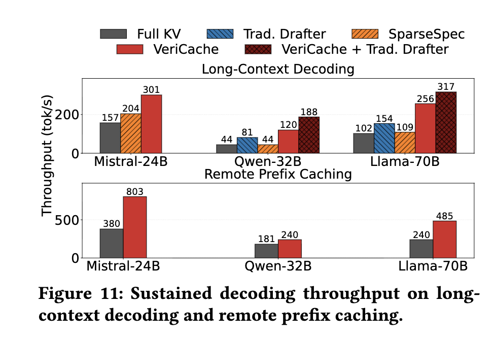

[Figure 12]는 request rate에 따른 end-to-end latency를 보이며, VeriCache가 두 파이프라인 모두에서 Full KV와 전통적 drafter보다 더 높은 부하까지 낮은 지연을 유지함을 보인다.

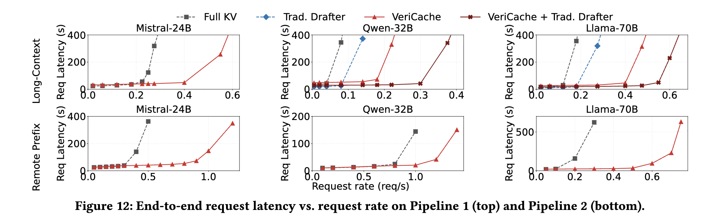

**하드웨어 변화([Figure 13]).** Pipeline 1에서 KV-cache 예산과 HBM/inter-connect 비율을 스윕한다. HBM이 0.74에서 0.2로 줄면 VeriCache의 speedup은 1.61×에서 2.71×로 커지고(Full KV 배치가 붕괴), SparseSpec은 1.82×에서 1.02×로 떨어진다(full KV를 drafting GPU에 상주시켜야 하므로). HBM-대-inter-connect 비율이 60(H100 NVL)에서 10(GH200)으로 줄면 VeriCache는 1.92×에서 3.01×로 오른다. Pipeline 2에서 $G_R/G_L$을 스윕하면 sweet spot은 $G_R/G_L=4$이며, $T_\text{init\_remote}/T_\text{decode}$를 스윕하면 초기 로딩 비용이 지배적인 ~5까지 이득이 크고 그 뒤엔 $T_\text{decode}$가 지배해 1×로 수렴한다.

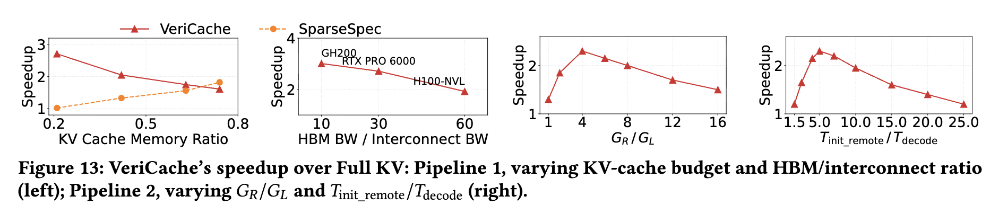

### 8.3 Lossy KV와 비교 (품질–처리량 프론티어)

[Figure 14]는 두 파이프라인·세 모델에서 KL divergence 대 처리량을 보인다. VeriCache의 KL은 0.01 nats 미만(하드웨어 비결정성 수준)을 유지하면서 Full KV 대비 최대 **3.82×** (Llama-70B, Pipeline 1)의 처리량을 낸다. 반면 KVzip은 Llama-70B/Pipeline 1, 압축 0.5에서 요청당 ~14.4 nats의 KL을 쌓아 Full KV의 정확한 출력을 확률 $e^{-14.4}\approx 5\times 10^{-7}$로만 내놓고, 최고 압축에서는 ~12× 더 벌어진다.

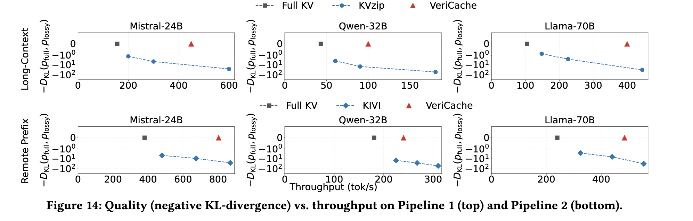

[Figure 15]는 Mistral-24B에서 추가 토큰 드롭(ExpectedAttention, SnapKV)·양자화(KVQuant, RotateKV) baseline을 더해, 네 방법 모두에 대해 VeriCache의 KL이 0.01 nats 이내를 유지하며 Full KV 대비 **1.4×–1.9×** 빠름을 보인다.

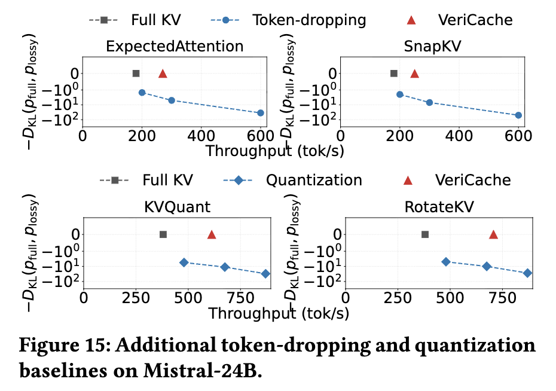

[Figure 16]은 태스크별 품질을 보인다. ComplexFuncBench function-call accuracy에서 VeriCache는 Full KV 정확도로 가장 빠른 KVzip 설정 처리량의 최소 59%에 도달하는 반면, KVzip은 최대 처리량에서 Llama-70B 기준 Full KV 정확도의 ~31%로 붕괴한다. [Figure 17]은 Qwen-32B의 long-generation(LongGenBench completion rate, GSM8K-Long accuracy)에서 VeriCache가 Full KV의 100% completion(339 tok/s)·90% accuracy(385 tok/s)를 보존함을, KVzip은 같은 속도에서 ~10점 하락함을 보인다.

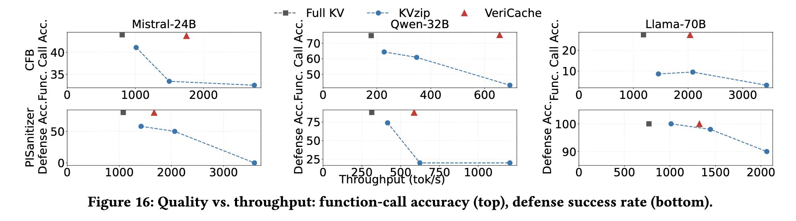

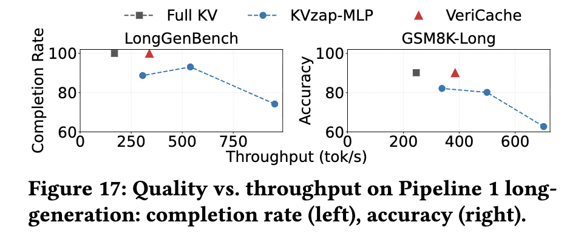

**요약:** VeriCache는 두 파이프라인·다수 모델·7가지 압축 방법에서 출력을 Full KV와 동일하게 유지하면서 최대 4× 높은 처리량을 낸다.

---

## 9. 이전 연구와의 흐름, 그리고 위치

VeriCache는 세 갈래 연구를 잇는다.

- **KV cache 압축.** 토큰 드롭(KVzip, KVZap)과 양자화(KIVI, KVQuant)는 KV를 줄이지만 본질적으로 lossy다. VeriCache는 압축 캐시로 draft하고 full 캐시로 verify함으로써 이들을 **lossless로 전환** 한다 — 즉 기존 압축 방법의 *대체*가 아니라 *래퍼(wrapper)* 다.
- **Speculative decoding.** 값싼 제안자로 target 모델을 가속하는 EAGLE, MTP, n-gram 등과 합성된다. 더 가까운 선행 연구로 MagicDec, QuantSpec, SparseSpec은 sparse/compressed 캐시로 draft하지만 full KV를 HBM에 고정(pin)하고, remote prefix caching을 무시하며, 단일 compressor를 하드코딩한다. VeriCache는 이 세 가지를 모두 해소한다 — full KV를 HBM에서 빼내 CPU/원격에 두고, remote prefix caching을 지원하며, 통일 compressor 인터페이스로 7종을 담는다.
- **Prefill–decode disaggregation.** DistServe, Splitwise, TetriInfer, Mooncake 등은 prefill과 decode를 별도 GPU 풀로 분리한다. Decode 노드는 정확히 VeriCache가 타깃하는 HBM-대역폭 병목을 가지므로, VeriCache는 decode 풀에 그대로 끼워 넣을 수 있다.

무엇보다 이 논문은 **스텝별 편향이 출력 길이에 지수적으로 증폭됨**(§2.2, §7.1)을 보여, "왜 lossy KV가 긴 출력에서 반드시 실패하는가"를 이론적으로 못박고, 그에 대한 해법으로 verification을 제시한다는 점에서 서술의 축이 분명하다.

---

## 10. 한계와 향후 과제

- **메모리 오버헤드.** VeriCache는 GPU의 압축 캐시에 더해 full KV를 CPU(또는 저장소)에 유지하므로 저장 오버헤드가 더 크다.
- **정적 draft 길이.** 워크로드당 고정 draft 길이를 쓴다. Early accept/reject 결과에 따라 요청별로 적응하는 정책이 이질적 compressor·컨텍스트를 더 우아하게 다룰 것이다.
- **Drafter 특화 압축.** 기존 compressor는 직접 서빙 정확도를 최적화하도록 설계되었다. 긴 draft horizon에서 acceptance length를 최대화하도록 설계된 compressor는 VeriCache의 처리량을 더 밀어올릴 수 있다.
- **압축 너머의 verification.** 압축 외의 lossy 기법(예: 비인접 청크의 precomputed KV 재사용, CacheBlend)도 full-KV 디코딩에서 벗어난 출력을 낸다. draft-then-verify 접근이 여기에도 도움이 될지는 흥미로운 열린 질문이다.

---

## 11. 결론

Lossy KV 압축은 긴 컨텍스트 LLM 서빙을 가속하지만 출력 품질을 떨어뜨린다. VeriCache는 압축 캐시로 draft하고 full 캐시로 verify함으로써 lossless 추론을 복원하며, cross-resource staggering과 긴 acceptance run으로 검증 비용을 숨긴다. 그 결과 토큰 드롭·양자화 방법 전반에서 **동일한 출력을 유지하면서 full-KV 디코딩 대비 최대 4× 높은 처리량**을 낸다.
