# GOSIM Hangzhou 기술 회고 해설 - SpecForge와 EAGLE3 학습 프레임워크

> speculative decoding 학습 부분은 serving 쪽 성능 데이터에 가려지기 쉽다. 여기서는 SpecForge, EAGLE3 학습, SGLang serving 쪽 연결 방식을 분명히 정리한다.

## 0x0. 서문

speculative decoding의 serving 쪽은 많이 이야기되지만, 학습 쪽은 오히려 과소평가되기 쉽다. EAGLE3 같은 방법의 acceptance length는 draft model 품질에 크게 의존하고, draft model 학습은 target hidden states, 특수 mask, 재귀 unroll, 모델 적응을 모두 포함한다. SpecForge 발표는 이 빠진 조각을 채워 준다.

## 0x1. 자료와 코드 위치

관련 자료와 코드:

- SpecForge 저장소: `specforge/core/eagle3.py`, `specforge/core/eagle3_adapters.py`, `specforge/modeling/draft/flex_attention.py`.
- SpecForge 문서: `docs/basic_usage/training.md`, online/offline hidden states를 설명한다.
- LMSYS 블로그: `https://lmsys.org/blog/2025-07-25-spec-forge/`, SpecForge의 위치와 EAGLE3 학습을 소개한다. `https://lmsys.org/blog/2025-08-27-gpt-oss/`는 GPT-OSS EAGLE 실전에 대응된다.
- SGLang serving 쪽 speculative decoding과 multi-LoRA 능력은 하류 소비자이며, 아래에서는 학습 프레임워크 자체에 초점을 둔다.

LMSYS의 SpecForge blog는 학습 문제를 더 명확히 설명한다. EAGLE3의 draft model은 token embedding만 먹는 것이 아니라 target model의 여러 중간층 hidden states도 먹는다. 장점은 draft model이 target model의 국소 추론 상태에 더 가까워진다는 점이고, 단점은 학습 흐름이 일반 LM처럼 깨끗하지 않다는 점이다. 먼저 target hidden states를 얻고, 여러 층 hidden states를 투영, 결합, 재귀 unroll해야 한다.

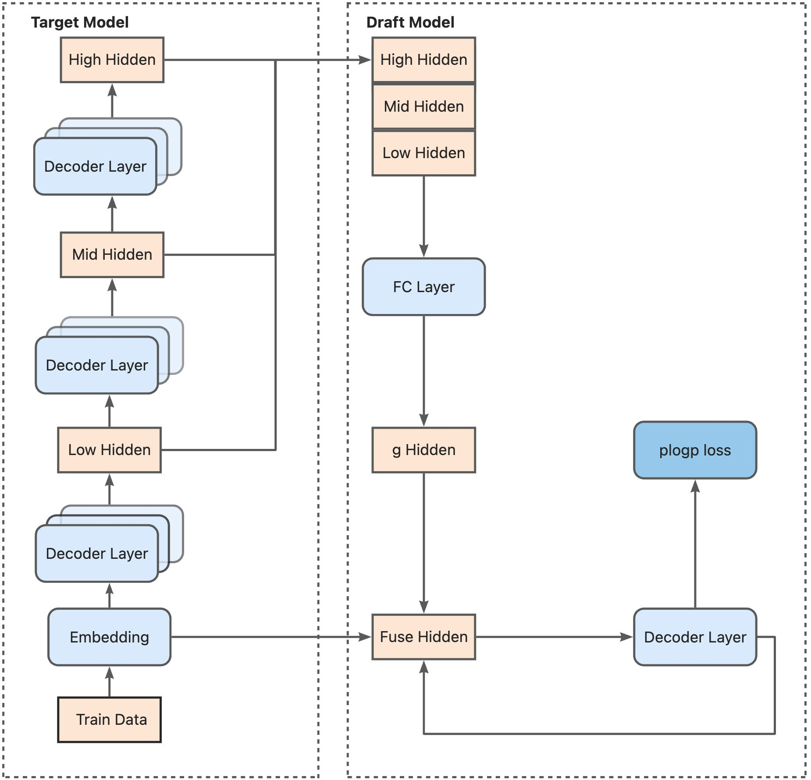

이 그림이 EAGLE3의 학습 데이터 흐름이다. target model은 logits와 hidden states를 제공하고, draft model은 이 중간 표현으로 뒤 token을 예측한다. 학습 때는 다단계 생성을 시뮬레이션해야 한다. LMSYS blog가 SpecForge가 online/offline 두 경로를 지원한다고 강조하는 이유도 여기에 있다. 온라인으로 target model을 돌리면 학습 때 GPU 압력이 크지만 hidden states 데이터셋이 디스크를 폭발시키지는 않는다. 반대로 hidden states를 먼저 오프라인 생성하면 학습 단계는 훨씬 싸지만 중간 데이터가 매우 커진다.

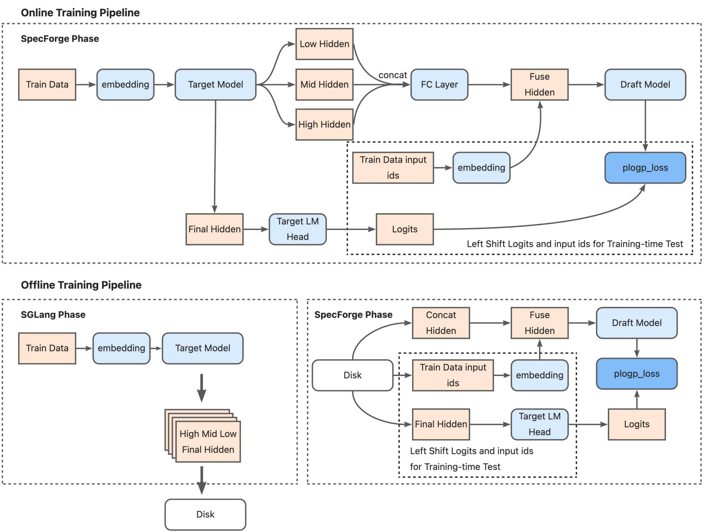

이 online/offline 그림은 코드에서 두 진입점에 대응된다. online 경로는 학습 step 내부에서 target model을 호출해 hidden states를 얻고, offline 경로는 hidden states를 dataset 필드로 읽어 온다. SpecForge 소스 코드를 읽을 때는 이 점만 붙잡으면 길을 잃지 않는다. `Eagle3Model`은 공통 TTT/unroll/loss 로직을 처리하고, online/offline 차이는 hidden states가 어디서 오느냐에 주로 있다. GPT-OSS에 관한 LMSYS blog의 가치도 여기에 있다. SpecForge가 특정 Llama-like 모델만 맞춘 것이 아니라 target backend를 확장 가능한 층으로 만들었고, 새 모델 구조가 바뀌면 hidden states, tokenizer, draft config만 맞추면 된다는 점을 보여준다.

## 0x2. Slides 페이지별 해설

#### Slide 1: SpecForge: Speculative Decoding Models의 학습 프레임워크

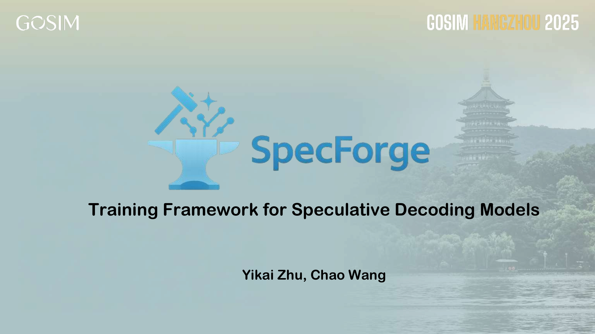

SpecForge가 해결하는 것은 speculative decoding의 "학습 쪽"이다. SGLang은 이미 EAGLE/EAGLE3 draft model을 serve할 수 있지만, draft model을 어디서 가져오고 target model hidden states와 어떻게 정렬하며 특수 attention mask를 어떻게 처리할지는 또 하나의 완전한 엔지니어링 문제다.

#### Slide 2: 목차: speculative decoding에서 커스텀 학습까지

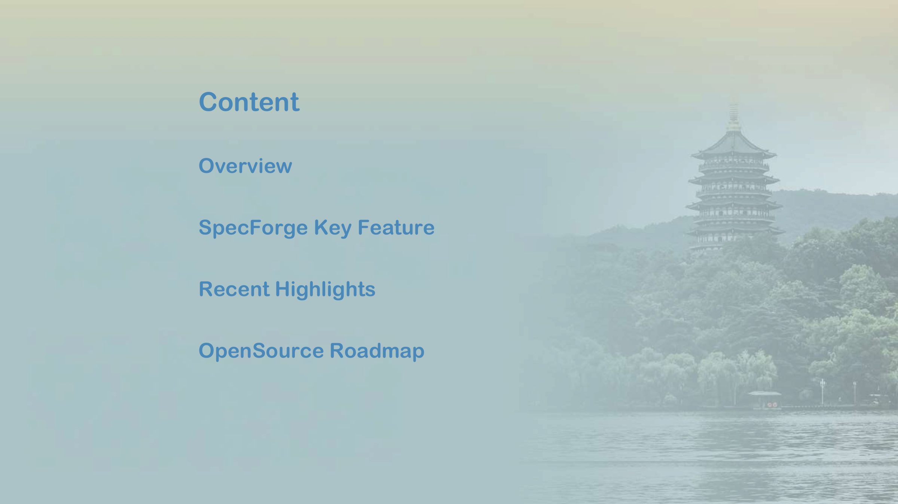

목차 순서는 명확하다. 먼저 speculative decoding이 왜 decode latency를 낮출 수 있는지 설명하고, 이어서 EAGLE3와 SpecForge를 다룬다. 그다음 GPT-OSS, Flex Attention, VLM, LoRA, 커스텀 학습으로 내려간다. 이것은 단일 모델 스크립트가 아니라 학습 프레임워크다.

#### Slide 3: 왜 decode 단계에 speculative decoding을 쓸 가치가 있는가

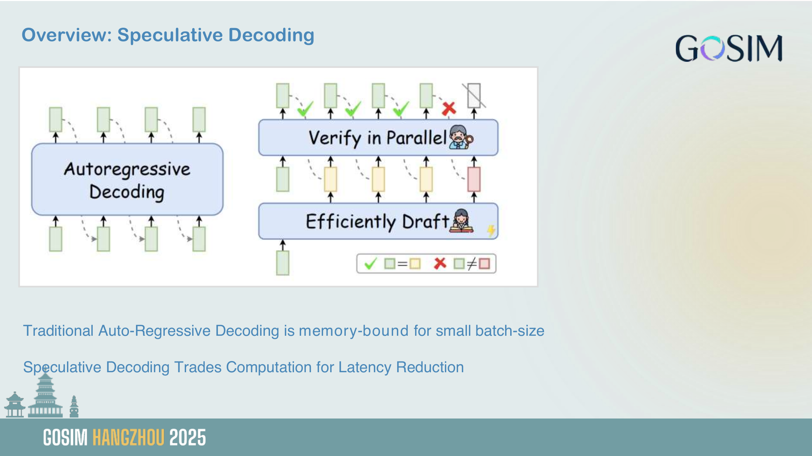

작은 batch decode는 쉽게 memory-bound가 된다. target model은 매 step마다 token 하나만 내기 때문에 GPU 계산 능력을 충분히 쓰지 못한다. speculative decoding은 저렴한 draft model이 한 번에 여러 token을 추측하게 하고, target model이 병렬로 검증하게 한다. 더 많은 계산으로 더 적은 직렬 step을 사는 방식이다.

#### Slide 4: SGLang 안의 EAGLE3 이득

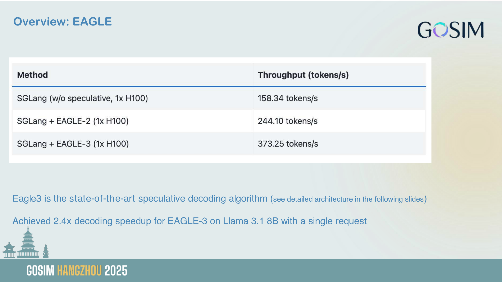

EAGLE3의 의미는 draft model이 token만 보는 것이 아니라 target model의 중간 hidden states도 본다는 데 있다. SGLang 쪽은 더 높은 acceptance length를 얻을 수 있고, slides에는 Llama3.1-8B에서 약 2.4x의 예가 제시된다.

#### Slide 5: SpecForge의 위치: draft model 학습

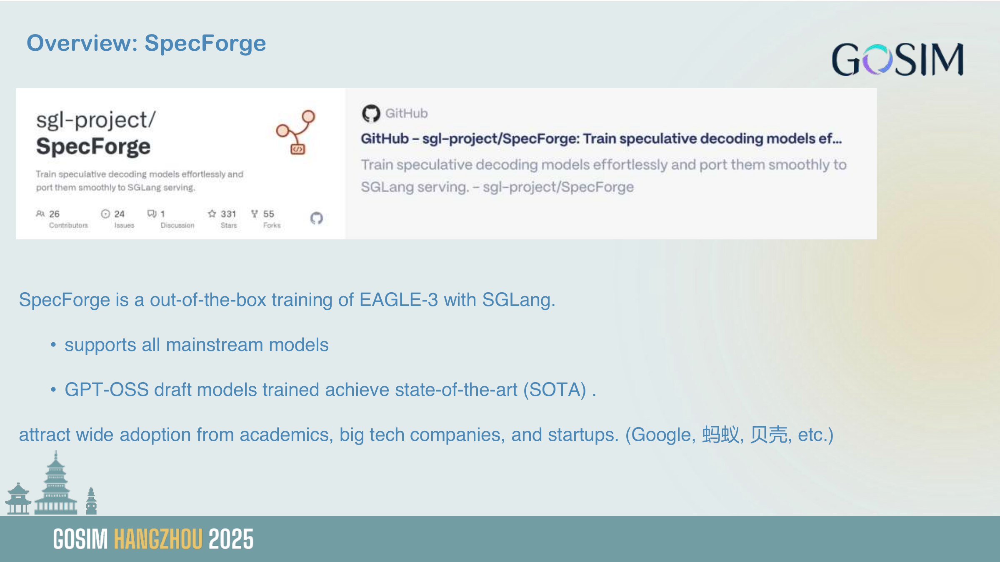

SpecForge의 위치는 "EAGLE3 학습 흐름 표준화"다. target hidden states 생성, draft forward, TTT unroll, loss/accuracy 계산을 프레임워크 안에 감싼다. 사용자는 SafeAILab/EAGLE의 학습 스크립트에서 시작해 직접 손으로 맞출 필요가 줄어든다.

#### Slide 6: 주요 모델과 SGLang을 바로 지원


바로 지원한다는 말은 단순한 모델명 목록이 아니다. GPT-OSS, Qwen, Llama, Qwen2.5-VL 같은 모델은 tokenizer, hidden state layer 선택, attention backend, FSDP/TP가 모두 다르다. SpecForge는 이런 차이를 target/draft backend 안으로 넣는다.

#### Slide 7: 학습 프레임워크를 SGLang 생태계에 둔 이유

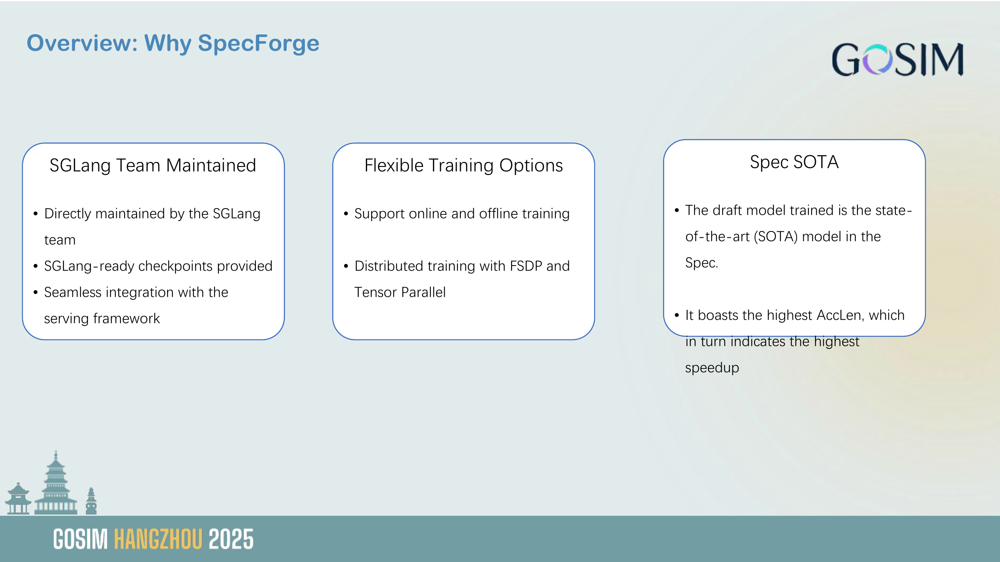

SGLang 생태계에 두는 장점은 학습과 serving이 같은 모델 가정을 쓸 수 있다는 점이다. 학습된 draft model을 바로 SGLang speculative decoding에 사용할 수 있고, acceptance length 평가도 온라인 행동에 더 가까워진다.

#### Slide 8: EAGLE3의 Training-Time Test

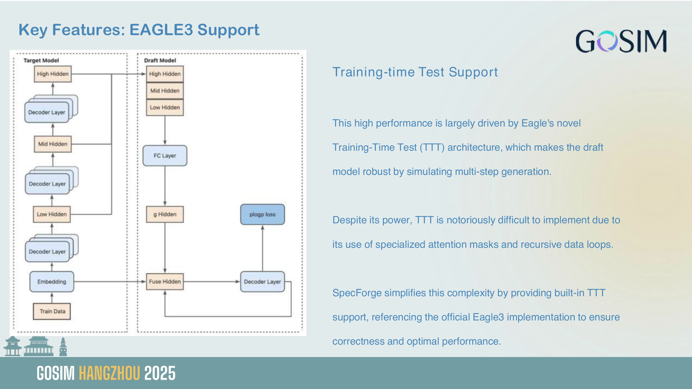

이 페이지의 왼쪽 그림은 target model과 draft model 두 부분으로 보아야 한다. target model은 train data를 embedding과 여러 decoder 층으로 통과시켜 low/mid/high 세 층 hidden states를 꺼낸다. high hidden은 draft 쪽 high hidden으로 직접 들어가고, 세 층 hidden도 draft 쪽에서 융합된다. draft model 쪽은 먼저 low/mid/high hidden을 FC 한 층에 통과시켜 `g hidden`을 얻고, 입력 token embedding과 합쳐 `fuse hidden`을 만든 뒤 draft decoder로 보낸다. 마지막으로 `plogp_loss`로 draft가 다음 token을 예측하도록 학습한다.

오른쪽 설명의 Training-Time Test는 평가 스크립트가 아니라 학습 구조의 일부다. EAGLE3는 학습 때 다단계 생성을 시뮬레이션해야 한다. draft가 첫 단계에서 생성한 token은 다음 단계 입력으로 들어가고, mask, position, hidden state도 함께 이동한다. 이 재귀 loop 덕분에 draft model은 학습 때부터 "이전 예측이 target에서 벗어난 뒤"의 상태를 접한다. SpecForge가 하는 일은 공식 EAGLE3의 특수 attention mask와 재귀 데이터 루프를 프레임워크 안으로 거두는 것이다. 사용자는 모델을 하나 붙일 때마다 TTT를 다시 쓸 필요가 없다.

#### Slide 9: online/offline hidden states 두 가지 학습 경로

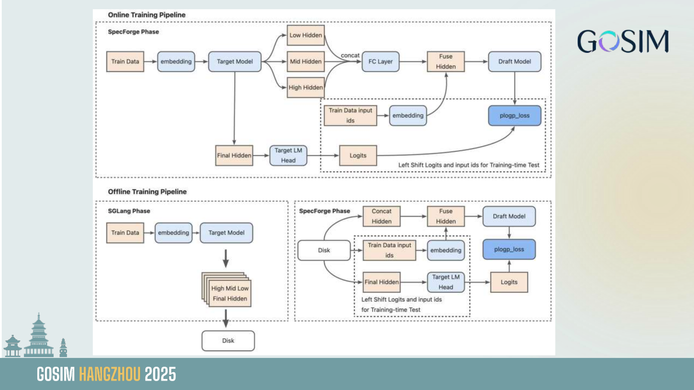

Online 경로는 위쪽이다. 데이터는 `Train Data -> embedding -> Target Model`을 거쳐 target으로 들어가고, target은 low/mid/high hidden을 출력한다. 세 hidden을 concat한 뒤 FC를 지나 `Fuse Hidden`을 얻는다. 다른 한편 final hidden은 `Target LM Head`로 보내져 logits를 낸다. 점선 박스 오른쪽이 Training-Time Test다. 학습 input ids 자체도 embedding되고, fuse hidden과 함께 draft model에 들어간다. target logits와 draft 출력이 함께 `plogp_loss`를 계산한다. slide에는 "Left Shift Logits and input ids"가 따로 표시되어 있는데, target logits와 학습 token을 한 칸 어긋나게 정렬한다는 뜻이다.

Offline 경로는 아래쪽이다. 왼쪽 `SGLang Phase`는 target model을 미리 실행해 high/mid/low/final hidden을 disk에 쓴다. 오른쪽 `SpecForge Phase`는 학습 때 disk에서 hidden을 읽고, concat hidden, fuse hidden, draft model, `plogp_loss`를 지난다. 두 경로의 학습 본체는 같고, 차이는 hidden states를 학습 중에 생성하느냐, 미리 생성해서 데이터 필드처럼 읽느냐다.

#### Slide 10: Online & Offline Training 비교

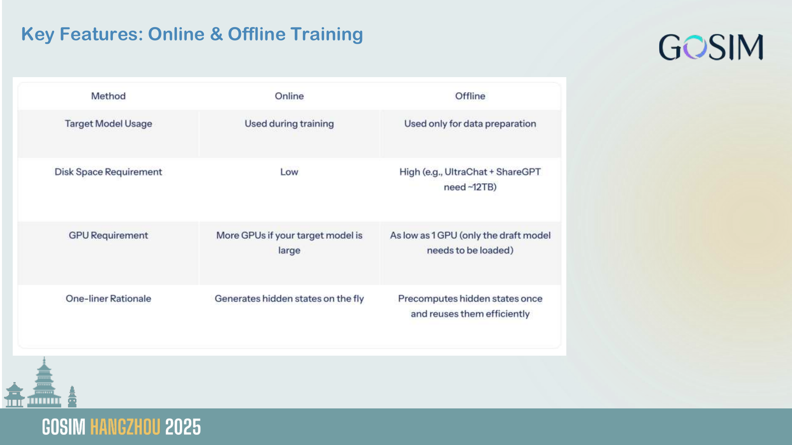

표는 네 행이다. Target Model Usage 행은 online 학습이 학습 중 target model을 호출하고, offline은 데이터 준비 단계에서만 target model을 쓴다고 말한다. Disk Space Requirement 행은 가장 직관적인 비용에 대응된다. online은 hidden states를 거의 저장하지 않아 디스크 압력이 낮다. offline은 low/mid/high/final hidden을 디스크에 내려야 하며, slides의 UltraChat + ShareGPT 예시는 약 12TB가 필요하다고 한다. GPU Requirement는 반대다. online은 학습 중 target model과 draft 학습이 같이 있으므로 target이 클수록 GPU 압력이 높다. offline 학습 단계는 draft만 로드하므로 최소 1장 GPU로도 돌릴 수 있다.

마지막 One-liner Rationale 행은 선택 원칙으로 이해할 수 있다. online은 "generates hidden states on the fly"라서 거대한 중간 데이터를 유지하고 싶지 않고 target을 올릴 학습 자원이 충분한 경우에 맞다. offline은 "precomputes hidden states once and reuses them efficiently"라서 draft를 반복 학습하거나 hyperparameter를 훑거나, target model이 무겁지만 디스크를 감당할 수 있는 경우에 맞다.

#### Slide 11: GPT-OSS EAGLE 예시

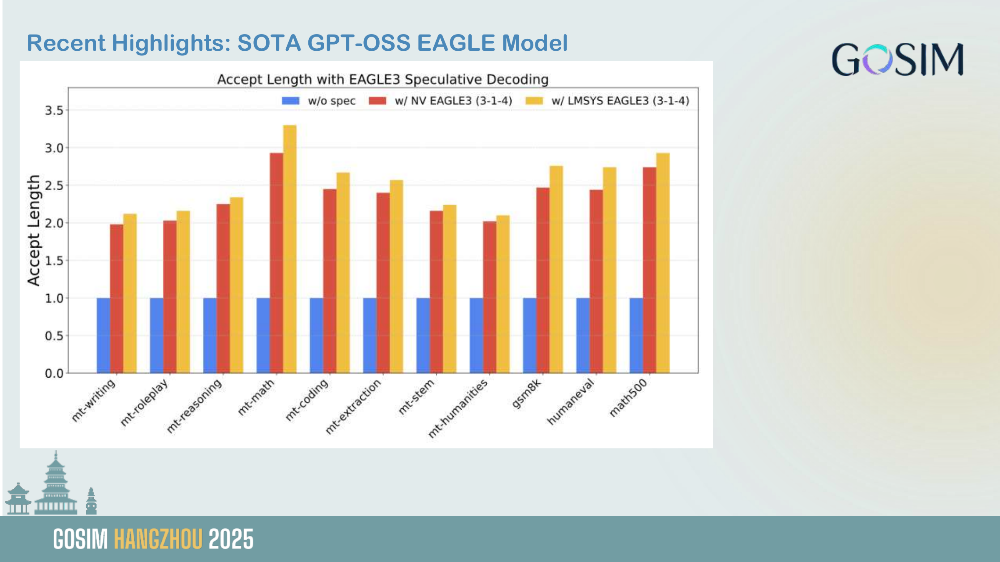

GPT-OSS 예시는 SpecForge가 Llama만을 위한 것이 아니라는 점을 보여준다. 오픈소스 모델 구조는 빠르게 변한다. 학습 프레임워크가 target model 세부를 하드코딩하면 금방 쓸 수 없게 된다. SpecForge는 GPT-OSS의 target backend를 별도로 맞추고, draft 쪽은 EAGLE3 로직을 유지한다. 그림의 acceptance length 비교도 draft model 학습 품질이 serving 쪽 처리량으로 바로 나타난다는 점을 상기시킨다.

#### Slide 12: Flex Attention으로 메모리 절감과 가속

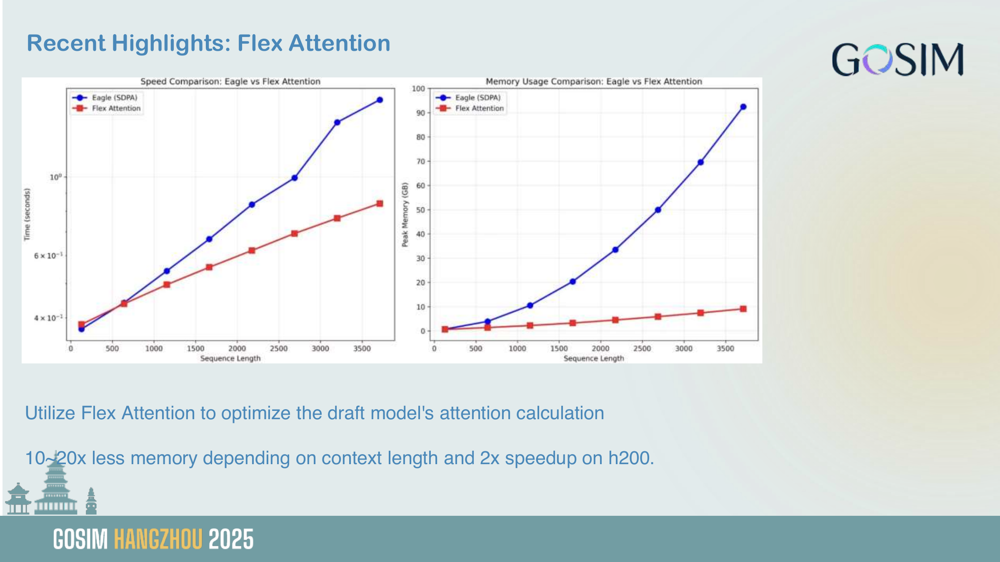

Flex Attention 페이지에는 두 곡선이 있다. 왼쪽은 속도 비교다. 가로축은 sequence length, 세로축은 시간이며, 파란 선은 일반 Eagle(SDPA), 빨간 선은 Flex Attention이다. 시퀀스가 길수록 파란 선은 더 빨리 올라가고 빨간 선은 더 완만하게 증가한다. 오른쪽은 메모리 비교다. 파란 선은 긴 시퀀스에서 90GB 이상으로 올라가지만, 빨간 선은 여전히 10GB 안팎에 머문다. 아래 작은 글자는 10-20x less memory와 H200에서 약 2x speedup을 말한다.

이 결과는 EAGLE3의 mask 형태에서 온다. TTT를 재귀 전개한 뒤 attention 의존성은 일반 causal mask가 아니다. 이를 SDPA에 dense mask로 넘기면 실제로 볼 필요가 없는 위치도 메모리와 계산으로 펼쳐진다. SpecForge는 PyTorch Flex Attention으로 의존 관계를 block mask로 표현하고, DynamicCache로 재귀 unroll의 KV 상태를 유지한다. 최적화한 것은 특정 kernel 하나가 아니라, TTT 같은 sparse attention pattern을 의미에 더 가까운 형태로 표현한 것이다.

#### Slide 13: VLM도 EAGLE3 draft를 학습할 수 있다

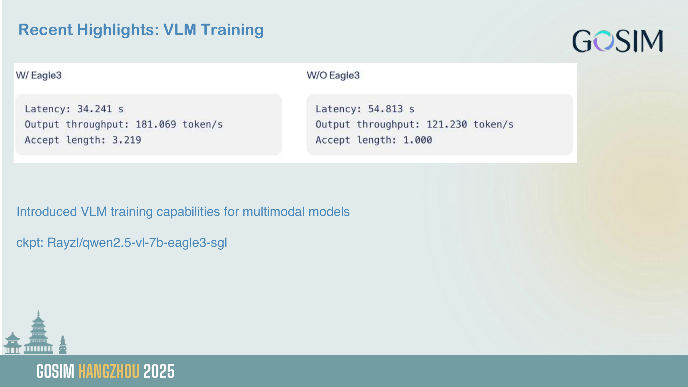

VLM 페이지에서 핵심은 hidden states가 텍스트에서만 오지 않는다는 점이다. Qwen2.5-VL 같은 모델은 image grid, mrope position id, 시각 token과 텍스트 token 정렬을 처리해야 한다. SpecForge의 VLM wrapper는 target model이 출력한 여러 층 hidden states를 EAGLE3 draft에 연결한다.

#### Slide 14: LoRA와 speculative decoding의 공존

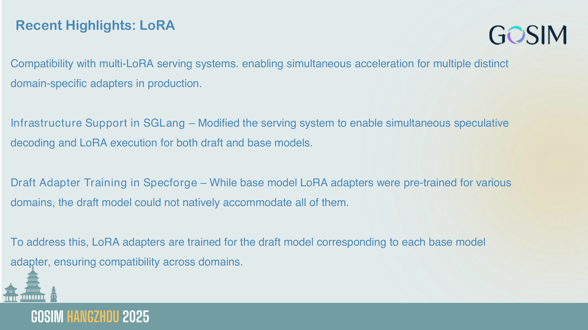

LoRA 페이지는 배포 현실을 다룬다. 온라인 base model은 여러 LoRA adapter를 동시에 붙일 수 있다. speculative decoding이 base draft만 갱신하고 adapter 쪽 차이를 처리하지 않으면 acceptance rate가 떨어진다. SpecForge/SGLang은 draft/base의 LoRA 상태를 맞춰야 한다.

#### Slide 15: 커스텀 학습 파라미터와 chat template

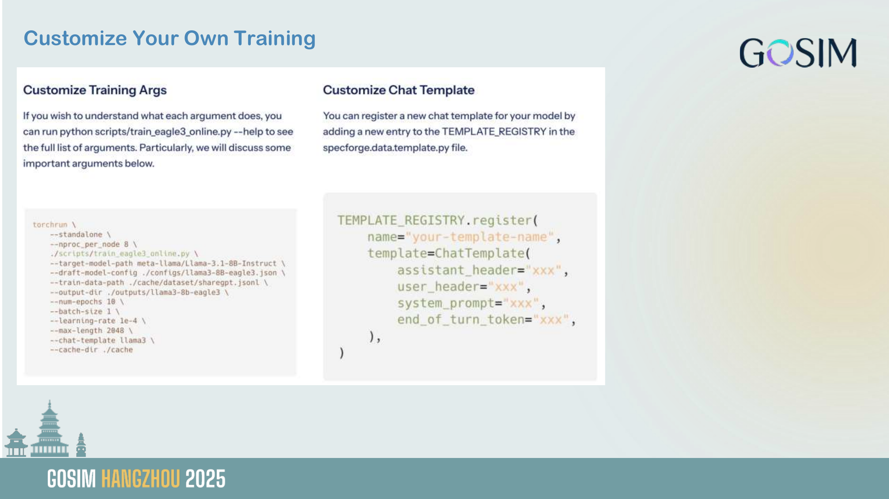

커스텀 학습의 첫 단계는 파라미터와 데이터 형식을 연결하는 것이다. 왼쪽 코드는 online 학습 진입점이다. `torchrun --standalone --nproc_per_node 8 ./scripts/train_eagle3_online.py`를 사용하며, 핵심 파라미터는 `--target-model-path meta-llama/Llama-3.1-8B-Instruct`, `--draft-model-config ./configs/llama3-8B-eagle3.json`, `--train-data-path ./cache/dataset/sharegpt.jsonl`, `--output-dir ./outputs/llama3-8b-eagle3`, `--num-epochs 10`, `--batch-size 1`, `--learning-rate 1e-4`, `--max-length 2048`, `--chat-template llama3`, `--cache-dir ./cache`다. 이 파라미터들은 target model, draft config, 학습 데이터, 출력 디렉터리, 컨텍스트 길이를 명시적으로 넘긴다.

오른쪽은 chat template 등록이다. SpecForge는 `specforge.data.template.py`의 `TEMPLATE_REGISTRY`에 `ChatTemplate`을 등록한다. 필드는 `assistant_header`, `user_header`, `system_prompt`, `end_of_turn_token`이다. template은 token 경계를 직접 결정하고, 뒤의 target hidden states, labels, loss mask가 모두 그것을 따른다. chat template이 틀리면 학습은 겉보기로는 돌지만, draft가 배운 정렬 관계가 어긋나 acceptance length가 보통 매우 나빠진다.

#### Slide 16: 커스텀 target model과 draft model

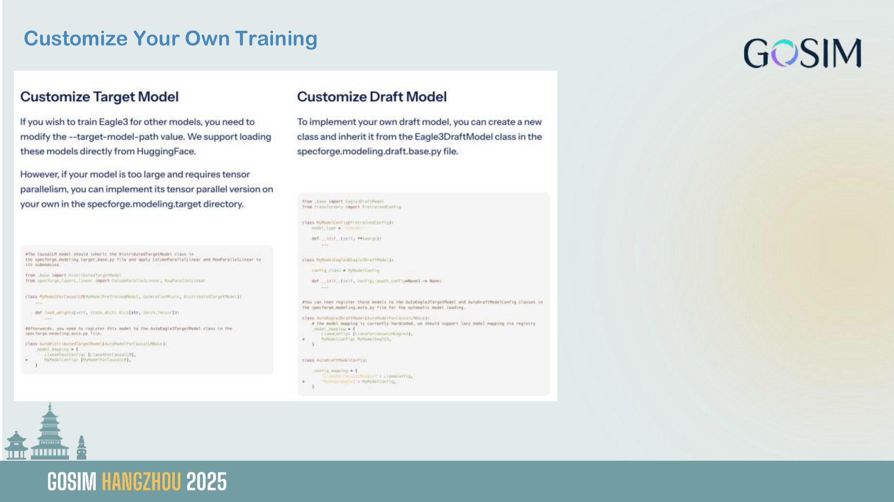

이 페이지가 모델 접속 입구다. 왼쪽 target model 부분은 HuggingFace가 바로 로드할 수 있는 작은 모델이라면 `--target-model-path`만 바꾸면 된다고 말한다. 모델이 너무 크거나 tensor parallel이 필요하다면 `specforge.modeling.target` 디렉터리에 자체 병렬 버전을 구현해야 한다. 스크린샷의 코드는 커스텀 target model이 distributed target model 클래스를 상속하고, `load_weights` 같은 입구를 구현한 뒤 Auto target model에 등록해야 함을 암시한다.

오른쪽 draft model 부분은 새 클래스를 만들어 `Eagle3DraftModel`을 상속하라고 한다. 위치는 `specforge.modeling.draft.base.py`다. draft 쪽은 backbone, embedding, lm head, projection을 잘 조립하고 draft config/model mapping에 등록해야 한다. EAGLE3 학습 본체는 재사용할 수 있지만 hidden states layer 선택, 차원, position ids, mrope 또는 멀티모달 위치 인코딩 같은 모델 관련 세부는 wrapper 안에 명확히 적어야 한다.

#### Slide 17: 종료 페이지

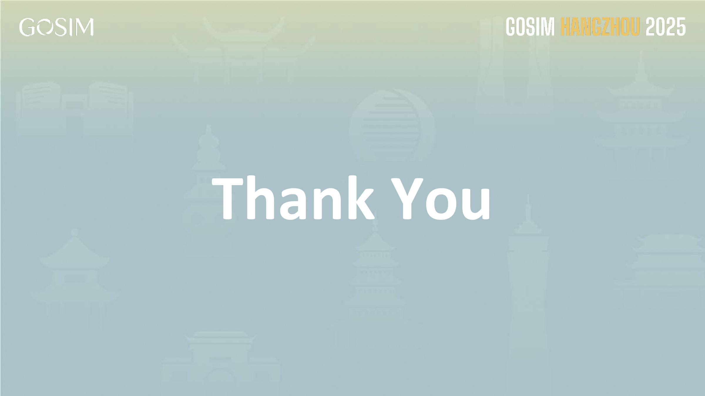

종료 페이지에는 새로운 기술 포인트가 없다. 주선으로 돌아가 보면, SpecForge의 가치는 EAGLE3 학습에서 가장 유지보수하기 어려운 hidden states, TTT unroll, 특수 mask, 모델 적응을 프레임워크에 넣어, 학습된 draft model이 SGLang serving으로 자연스럽게 들어가게 하는 데 있다.

## 0x3. 핵심 코드 해설

아래에서는 소스를 따라 `specforge/core/eagle3.py`, `specforge/modeling/target/eagle3_target_model.py`, `specforge/data/preprocessing.py`, `specforge/core/eagle3_adapters.py`, `specforge/modeling/draft/flex_attention.py`를 주로 본다. 이 파일들은 slides의 hidden states 수집, online/offline 데이터 흐름, TTT unroll, Flex Attention, 커스텀 backend와 맞물린다.

먼저 target hidden states가 어디서 오는지 보자. HF backend는 단순히 `output_hidden_states=True`를 켜서 모든 층을 가져오지 않는다. 그렇게 하면 메모리 압력이 크게 올라간다. SpecForge는 `HFEagle3TargetModel.generate_eagle3_data`에서 EAGLE3에 필요한 세 층에만 forward hook을 등록한다.

```python
def set_aux_hidden_states_layers(self, aux_hidden_states_layers=None):
    if aux_hidden_states_layers is None:
        num_layers = self.model.config.num_hidden_layers
        aux_hidden_states_layers = [1, num_layers // 2 - 1, num_layers - 4]
    self.aux_hidden_states_layers = aux_hidden_states_layers
    assert len(self.aux_hidden_states_layers) == 3
```

```python
captured_states = {}
handles = []

def get_hook(layer_idx):
    def hook(module, input, output):
        hidden = output[0] if isinstance(output, tuple) else output
        captured_states[layer_idx] = hidden
    return hook

layers = self._get_transformer_layers()
target_indices = self.aux_hidden_states_layers

for idx in target_indices:
    handles.append(layers[idx].register_forward_hook(get_hook(idx)))

try:
    outputs = self.model(
        input_ids=input_ids,
        attention_mask=attention_mask,
        output_hidden_states=False,
        output_attentions=False,
        output_router_logits=False,
        use_cache=False,
    )
finally:
    for handle in handles:
        handle.remove()

hidden_states = torch.cat(
    (
        captured_states[target_indices[0]],
        captured_states[target_indices[1]],
        captured_states[target_indices[2]],
    ),
    dim=-1,
)
```

이 코드는 Slide 8/9의 "세 층 hidden states + target logits"와 대응된다. EAGLE3가 필요한 것은 전체 activation dump가 아니라 낮은 층, 중간 층, 높은 층 각각 하나다. hook으로 이 세 층만 잘라내고 `output_hidden_states=False`로도 정상 실행할 수 있다는 점이 중요하다. online 학습은 이미 target model을 상주시켜야 하므로, 모든 층 hidden states까지 보관하면 메모리가 금방 막힌다.

세 층 hidden states를 얻은 뒤 학습 메인 루프는 `OnlineEagle3Model.forward`에 있다. 클래스 주석은 아주 직접적이다.

```python
class OnlineEagle3Model(Eagle3Model):
    """
    Online training means we have the target hidden_states available during training.
    1. extract hidden states from the target model.
    2. concatenate hidden states from 3 aux layers.
    3. project 3*hidden_size to hidden_size.
    4. concat projected hidden states and embedding output.
    5. run TTT to train the draft model.
    """
```

`forward`에 들어가면 먼저 target logits를 처리한다. `_compute_target_p_padded`는 target token 분포를 TTT unroll에 필요한 sliding window 형태로 정리한다. 이후 세 층 hidden states를 `3 * hidden_size`에서 `hidden_size`로 투영한다.

```python
target_p_padded, position_mask = _compute_target_p_padded(
    target=target,
    t2d=self.draft_model.t2d,
    loss_mask=loss_mask,
    length=self.length,
)

batch_size, seq_length, _ = hidden_states.shape
hidden_states = self.draft_model.project_hidden_states(hidden_states)
```

draft model 쪽의 projection은 추상 개념이 아니다. `LlamaForCausalLMEagle3.project_hidden_states`는 선형층 하나다.

```python
def project_hidden_states(self, hidden_states: torch.Tensor) -> torch.Tensor:
    # eagle 3 requires hidden states from 3 layers
    assert hidden_states.size(-1) == self.config.hidden_size * 3
    return self.fc(hidden_states)
```

`Eagle3DraftModel`은 draft 쪽에서 반드시 구현할 인터페이스를 좁게 잡는다. embedding, hidden state projection, logits 세 가지다. 새 모델을 접속할 때 가장 먼저 맞춰야 하는 것도 학습 loop 전체가 아니라 이 함수들이다.

```python
class Eagle3DraftModel(PreTrainedModel, ABC):
    @abstractmethod
    def embed_input_ids(self, input_ids: torch.Tensor) -> torch.Tensor:
        ...

    @abstractmethod
    def project_hidden_states(self, hidden_states: torch.Tensor) -> torch.Tensor:
        ...

    @abstractmethod
    def compute_logits(self, hidden_states: torch.Tensor) -> torch.Tensor:
        ...
```

TTT loop는 코드에서 주의 깊게 봐야 할 부분이다. 각 단계마다 adapter에서 현재 step의 view를 가져오고, input ids를 다시 embedding하고, draft backbone을 실행하고, loss/accuracy를 계산한다. 다음 단계에 필요한 input/mask는 오른쪽으로 한 칸 pad한다.

```python
adapter = self._make_adapter()
for idx in range(self.length):
    state = adapter.step_view(
        idx=idx,
        ttt_length=self.length,
        global_input_ids=global_input_ids,
        attention_mask=attention_mask,
        loss_mask=loss_mask,
        position_ids=position_ids,
        hidden_states=hidden_states,
        target_p_padded=target_p_padded,
        position_mask=position_mask,
        seq_length=seq_length,
    )

    inputs_embeds = self.draft_model.embed_input_ids(state.input_ids)
    hidden_states_out = self.draft_model.backbone(
        input_embeds=inputs_embeds,
        hidden_states=state.hidden_states,
        attention_mask=state.attention_mask,
        position_ids=state.position_ids,
        past_key_values=past_key_values,
        cache_hidden=cache_hidden,
    )

    hidden_states = hidden_states_out
    logits = self.draft_model.compute_logits(hidden_states)
    acc, loss = self._acc_and_loss(
        logits=logits,
        target_p=state.target_p,
        position_mask=state.position_mask,
        loss_mask=state.loss_mask,
        adapter=adapter,
    )

    if not is_last:
        global_input_ids = padding(global_input_ids, left=False)
        position_mask = padding(position_mask, left=False)
        loss_mask = padding(loss_mask, left=False)
```

이것이 Slide 8의 Training-Time Test 코드 형태다. 일반 LM 학습은 teacher forcing 한 번이면 되지만, EAGLE3는 "draft가 연속으로 여러 단계를 추측하는" 상태를 시뮬레이션해야 한다. 그래서 각 단계의 `input_ids`, `loss_mask`, `position_mask`가 바뀐다. `hidden_states = hidden_states_out`도 다음 단계가 target hidden states를 다시 먹는 것이 아니라 draft 자신의 hidden state를 이어서 간다는 뜻이다. 그래야 draft model이 다단계 생성 후의 오차 전파를 배우게 된다.

adapter는 서로 다른 attention backend의 view를 잘라낸다. SDPA/FA 경로는 전체 시퀀스 view다.

```python
class SdpaLikeAdapter(BackendAdapter):
    def step_view(...):
        target_p = target_p_padded[:, idx : idx + seq_length, :].contiguous()
        return StepState(
            input_ids=global_input_ids,
            hidden_states=hidden_states,
            position_ids=position_ids,
            attention_mask=attention_mask,
            target_p=target_p,
            position_mask=position_mask,
            loss_mask=loss_mask,
        )
```

USP 경로는 sequence parallel rank에 따라 local chunk를 자르고 `ttt_length`만큼 overlap을 보존한다. 이 세부는 긴 시퀀스 학습에서 중요하다. 각 카드가 자기 local sequence만 보더라도 TTT shift가 경계의 컨텍스트를 바로 잘라 버리면 안 된다.

```python
class UspAdapter(BackendAdapter):
    def step_view(...):
        usp_chunk_size = seq_length - ttt_length
        target_p = target_p_padded[:, idx : idx + usp_chunk_size, :]
        return StepState(
            input_ids=global_input_ids[:, :usp_chunk_size],
            hidden_states=hidden_states[:, :usp_chunk_size, :],
            position_ids=position_ids[:, : usp_chunk_size * self.sp_ulysses_degree],
            attention_mask=attention_mask[:, :usp_chunk_size],
            target_p=target_p,
            position_mask=position_mask[:, :usp_chunk_size, :],
            loss_mask=loss_mask[:, :usp_chunk_size, :],
        )

    def reduce_loss(self, loss: torch.Tensor) -> torch.Tensor:
        loss = dist_nn.all_reduce(loss, op=dist.ReduceOp.SUM, group=self.sp_group)
        return loss / self.sp_world_size
```

online/offline의 차이는 학습 알고리즘이 바뀌는 것이 아니라 hidden states의 출처가 바뀌는 것이다. offline dataset은 디스크에서 `aux_hidden_state`와 `hidden_state`를 바로 읽은 뒤 같은 EAGLE3 학습 로직으로 넘긴다.

```python
class OfflineEagle3Dataset(torch.utils.data.Dataset):
    @staticmethod
    def process_data(data, max_len, transform=None):
        hidden_state = data["aux_hidden_state"].squeeze(0)[:max_len][None, :]
        target = data["hidden_state"].squeeze(0)[:max_len][None, :]

        input_ids = data["input_ids"][:max_len][None, :]
        loss_mask = data["loss_mask"][:max_len][None, :]
        loss_mask[0, -1] = 0

        new_data["attention_mask"] = torch.ones_like(loss_mask, dtype=torch.long)
        new_data["loss_mask"] = loss_mask
        new_data["target"] = target
        new_data["hidden_state"] = hidden_state
        new_data["input_ids"] = input_ids
        return new_data
```

USP preprocessing을 켜면 offline 데이터도 dataset 단계에서 SP rank에 맞춰 자르고 TTT overlap을 추가한다.

```python
chunk_size = (global_len + sp_size - 1) // sp_size
start = sp_rank * chunk_size
local_len = chunk_size + ttt_length

new_data["hidden_state"], _ = _slice_and_pad(data["aux_hidden_state"])
new_data["target"], _ = _slice_and_pad(data["hidden_state"])
new_data["input_ids"], valid_len = _slice_and_pad(input_ids)
```

따라서 Slide 9/10의 online/offline 비교는 코드 쪽에서 한 문장으로 번역할 수 있다. online은 `generate_eagle3_data`를 학습 step 안에 넣고, offline은 `aux_hidden_state`를 dataset 필드로 바꾼다. 전자는 GPU를 먹고, 후자는 디스크를 먹는다.

Flex Attention 경로는 Slide 12의 메모리 최적화와 대응된다. `OnlineEagle3Model`에서 backend가 `flex_attention`이면 `DynamicCache`를 쓰고, mask 축소는 attention module 쪽에 맡긴다.

```python
if self.attention_backend in ["sdpa", "fa", "usp"]:
    cache_hidden = [[], []]
    past_key_values = None
elif self.attention_backend == "flex_attention":
    cache_hidden = None
    past_key_values = DynamicCache()
else:
    raise ValueError(f"Unknown attention backend: {self.attention_backend}")
```

실제로 Flex Attention을 호출하는 곳은 `specforge/modeling/draft/flex_attention.py`다. 여기서는 singleton을 사용해 `torch.compile(flex_attention)`의 컴파일 결과를 캐시하고, 매 forward마다 다시 컴파일되는 일을 피한다.

```python
class WrappedFlexAttention:
    _instance = None
    _is_flex_compiled = False
    _compiled_flex_attention = None

    @torch.compiler.disable(recursive=False)
    def __init__(self):
        if not self._is_flex_compiled:
            self._compiled_flex_attention = torch.compile(flex_attention)
            self._is_flex_compiled = True

def compile_friendly_flex_attention(query, key, value, **kwargs):
    flex_attention_compiled = (
        WrappedFlexAttention()() if not is_torchdynamo_compiling() else flex_attention
    )
    return flex_attention_compiled(query, key, value, **kwargs)
```

이 코드는 slides의 "Flex Attention이 메모리를 줄이고 속도를 높이는" 출처를 설명한다. EAGLE3 TTT의 mask는 일반 causal mask가 아니며, dense attention mask로 펼치면 부담이 크다. Flex Attention은 이런 block mask를 더 잘 표현하고, `DynamicCache`는 재귀 unroll의 KV 상태를 매 step마다 같은 list cache 의미로 억지로 맞추지 않게 해준다.

VLM 지원도 바깥에 processor를 한 겹 씌우는 정도가 아니다. `QwenVLOnlineEagle3Model.forward`는 학습 step 안에서 먼저 target model을 호출해 멀티모달 데이터를 준비하고, 텍스트 EAGLE3와 비슷하게 projection/TTT로 간다.

```python
hidden_states, target, loss_mask, input_ids = self._prepare_data(
    input_ids, attention_mask, loss_mask, pixel_values, image_grid_thw
)

target_p_padded, position_mask = _compute_target_p_padded(
    target=target,
    t2d=self.draft_model.t2d,
    loss_mask=loss_mask,
    length=self.length,
)

hidden_states = self.draft_model.project_hidden_states(hidden_states)
```

Qwen2.5-VL은 MRoPE도 처리해야 한다. 코드에서는 target model의 `get_rope_index`를 호출하고, `image_grid_thw`와 attention mask로 position id를 계산한다.

```python
position_ids, rope_deltas = self.target_model.model.get_rope_index(
    input_ids,
    image_grid_thw,
    None,
    second_per_grid_ts=None,
    attention_mask=attention_mask_tensor,
)
```

이 부분은 Slide 13과 대응된다. VLM draft 학습의 난점은 "이미지가 추가된다"는 데 있지 않고, 시각 token, 텍스트 token, MRoPE position, loss mask가 동시에 정렬되어야 한다는 데 있다. 이 중 하나만 틀려도 training loss는 내려갈 수 있지만 serving의 acceptance length는 매우 나빠질 수 있다.

GPT-OSS와 커스텀 모델 접속은 target/draft backend와 chat template에 떨어진다. `template.py`에는 `openai-harmony` parser를 사용하는 전용 `gpt-oss` template이 있다.

```python
TEMPLATE_REGISTRY.register(
    name="gpt-oss",
    template=ChatTemplate(
        assistant_header=None,
        user_header=None,
        system_prompt=None,
        end_of_turn_token=None,
        parser_type="openai-harmony",
    ),
)
```

이 지점은 Slide 11/15와 이어져 있다. GPT-OSS의 chat format은 일반 `<|im_start|>` 스타일이 아니다. 학습 데이터의 assistant 경계, loss mask, target hidden states가 모두 parser에 의존한다. SpecForge가 template을 registry에 넣는 것은 최소한 "같은 데이터에서 어디부터 loss를 계산해야 하는가"에 통일된 입구를 제공한다.

마지막으로 학습 스크립트 파라미터를 보자. GPT-OSS online 학습 예시는 target backend를 SGLang으로 지정한다.

```bash
torchrun --nproc_per_node $NUM_GPUS scripts/train_eagle3.py \
  --target-model-path openai/gpt-oss-20b \
  --draft-model-config configs/gpt-oss-20B-eagle3.json \
  --train-data-path cache/dataset/perfect-blend-gptoss-20B.jsonl \
  --chat-template gpt-oss \
  --tp-size $TP_SIZE \
  --target-model-backend sglang
```

VLM 예시는 `--is-vlm`을 명시적으로 켜고 pixel 범위도 학습 파라미터에 넣는다.

```bash
torchrun --nproc_per_node $NUM_GPUS scripts/train_eagle3.py \
  --target-model-path Qwen/Qwen2.5-VL-7B-Instruct \
  --chat-template qwen2-vl \
  --is-vlm \
  --min-pixels 50176 \
  --max-pixels 802816
```

이 파라미터들은 보기에는 자잘하지만, 바로 이런 것들이 SpecForge 같은 프레임워크의 가치다. EAGLE3 draft 학습은 loss 하나를 쓰는 일이 아니다. 진짜 어려운 것은 target backend, template, hidden states layer 선택, attention backend, VLM position 같은 작은 톱니들이 모두 맞물리게 하는 것이다.

## 0x4. 소결

SpecForge 코드의 엔지니어링 경계는 비교적 명확하다. target model은 logits와 세 층 hidden states를 만들고, draft model은 embedding/projection/logits/backbone을 노출한다. training loop는 TTT unroll을 맡고, adapter는 서로 다른 attention/sequence parallel의 view를 맡는다. 경계가 명확해야 GPT-OSS, Qwen2.5-VL, LoRA, 이후 새 모델도 접속할 공간이 생긴다. SGLang은 draft model을 serving 쪽에서 쓰고, SpecForge는 이 draft model을 학습 가능하고 재현 가능하게 만든다.
