# GOSIM Hangzhou 기술 회고 해설 - verl 대규모 LLM RL 프레임워크와 SGLang 추론 백엔드

> verl을 SGLang directory에서 보는 핵심 이유는 rollout이다. training framework는 high-throughput sampling이 필요하고, inference framework도 weight synchronization, GPU memory offload, multi-turn agent sampling 같은 training-side 요구를 받아들여야 한다.

## 0x0. 서문

이 글과 앞선 두 SGLang 글의 연결점은 rollout이다. training framework에는 high-throughput inference backend가 필요하고, inference backend는 training framework의 weight synchronization, GPU memory offload, multi-turn agent sampling을 받아들여야 한다.

## 0x1. 자료와 코드 위치

관련 자료와 code:

- verl repository: `verl/workers/rollout/sglang_rollout/sglang_rollout.py`. SGLang HTTP server adapter, GPU memory release/resume, bucket weight update.
- verl repository: `verl/experimental/agent_loop/tool_agent_loop.py`. Agentic RL multi-turn tool calling state machine.
- verl single Controller abstraction: `verl/single_controller/base/decorator.py`. 여러 dispatch/collect behavior를 정의한다.
- slime 자료: `https://lmsys.org/blog/2025-07-09-slime/`와 `THUDM/slime`. SGLang-native RL system의 comparison point로 볼 수 있다.

LMSYS의 slime blog는 여기서 비교해 보기 좋다. verl과 slime은 같은 project가 아니지만 같은 system problem을 다룬다. RL training framework는 계속 rollout을 생성해야 하고, rollout은 high-throughput inference engine이 필요하다. training weights가 update되면 inference engine은 새 parameter를 빠르게 synchronize해야 한다. slime의 system diagram은 매우 직관적이다.

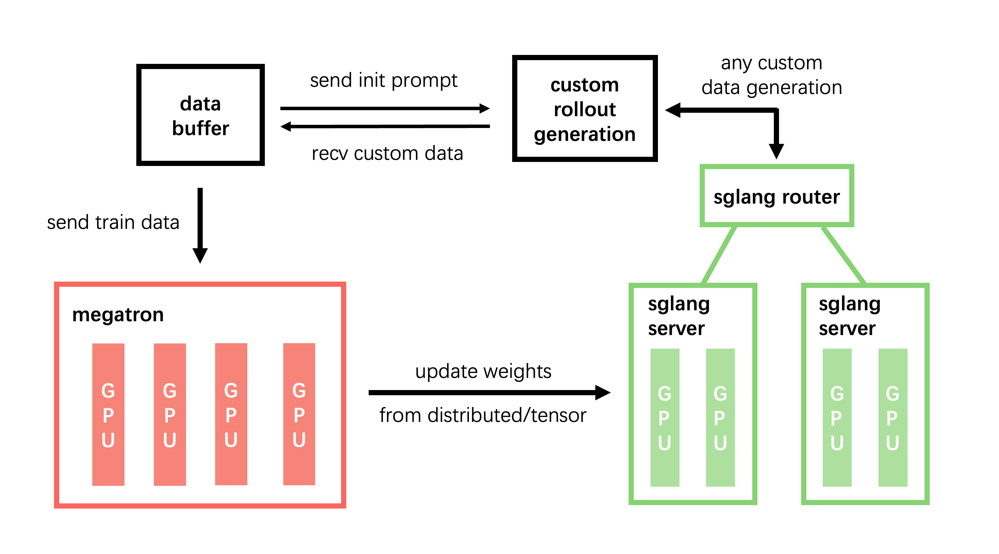

slime의 design은 SGLang-native에 더 가깝다. rollout server group, router, weight sync, partial rollout이 모두 SGLang 중심으로 전개된다. verl은 general RL orchestration framework에 더 가깝고, FSDP/Megatron, vLLM/SGLang, Ray worker를 unified controller 아래에 둔다. 이 slides를 읽을 때 slime을 comparison group으로 보면 좋다. SGLang만 serve한다면 많은 path를 더 tight하게 쓸 수 있지만, 여러 training/inference backend를 지원하려면 verl 같은 더 abstract한 dispatch/collect, worker group, backend adapter가 필요하다.

LMSYS의 또 다른 deterministic inference blog도 Agentic RL에 참고할 가치가 있다. 이 blog가 다루는 문제는 같은 prompt와 같은 sampling parameter에서 distributed inference와 multi-turn rollout이 재현 가능한가이다. RL training에서는 reward fluctuation 자체가 큰데, rollout engine까지 batch shape, kernel path, scheduling order 때문에 추가 randomness를 만들면 debugging이 매우 괴로워진다. slime/SGLang의 deterministic route는 training system에 "reproducible experiment"를 위한 safety line을 더하는 것으로 이해할 수 있다.

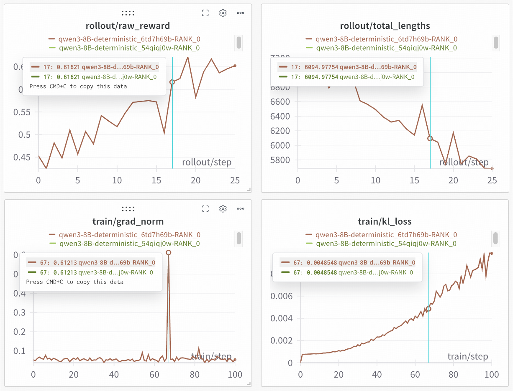

## 0x2. Slides 페이지별 해설

#### Slide 1: verl: Agentic Tasks를 위한 대규모 LLM RL 프레임워크

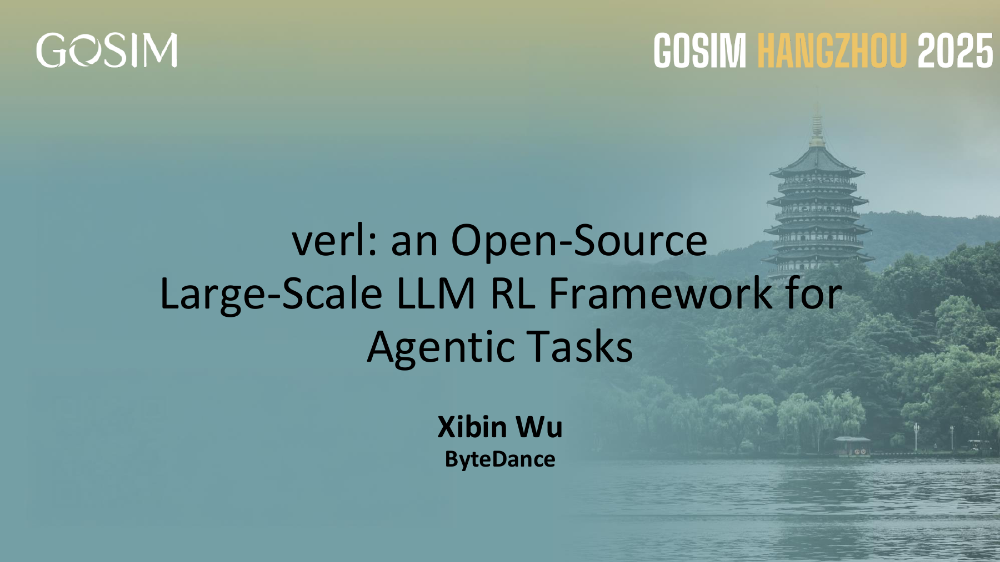

title에는 두 keyword가 있다: Large-Scale과 Agentic Tasks. 전자는 verl이 single-card RL demo가 아니라 actor, critic, reference, reward, rollout engine을 distributed resources 위에 올리는 것을 목표로 한다는 뜻이다. 후자는 rollout이 더 이상 단 한 번의 `generate`가 아니라 tool calling, environment execution, multi-turn dialogue와 섞인다는 뜻이다.

SGLang directory에서 볼 때 가장 중요한 연결점은 rollout backend다. SGLang은 high-throughput sampling을 담당하고, verl은 sampling result를 training data로 바꾸며, 매 training round 뒤 새 weights를 synchronize하고 inference-side GPU memory를 release/resume한다. 뒤의 Hybrid Controller, 3D-HybridEngine, AgentLoop는 모두 이 closed loop를 중심으로 전개된다.

#### Slide 2: Project background

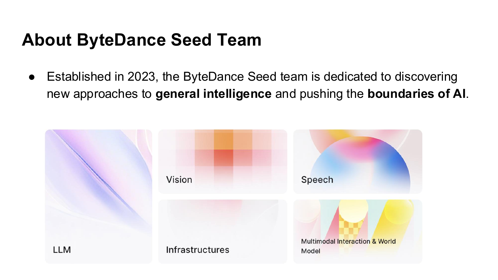

이 페이지는 ByteDance Seed Team을 소개한다. technical main text 관점에서는 배경 설명이다. verl은 장기간 RLHF, reasoning, agent, tool-use를 해야 하는 team에서 나왔으므로 design target은 특정 algorithm을 한 번 run하는 것이 아니라 여러 RL algorithm, training backend, inference backend를 지속적으로 연결하는 것이다.

이것은 왜 verl의 abstraction layer가 두꺼운지도 설명한다. PPO, GRPO, RLOO 같은 algorithm은 controller와 worker group을 공유할 수 있고, FSDP, Megatron, vLLM, SGLang 같은 backend는 adapter를 통해 들어온다. system complexity는 dispatch/collect, worker group, rollout adapter 같은 layer에 눌러 담긴다.

#### Slide 3: Seed team project background

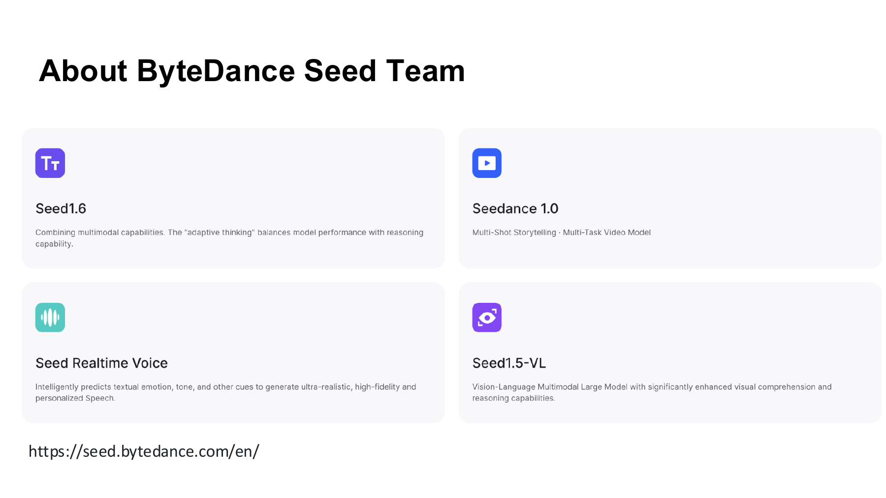

이 페이지는 Seed team entry를 이어서 보여준다. technical diagram은 아니지만 talk의 context를 보충한다. verl이 serve하는 것은 계속 evolve하는 model과 task의 묶음이지, one-off paper reproduction experiment가 아니다. large model post-training에서는 algorithm recipe, data, evaluation, rollout throughput, weight sync가 모두 자주 바뀐다.

따라서 뒤의 code에는 "algorithm처럼 보이지 않는" logic이 많이 나온다. 예를 들면 GPU memory release/resume, server mode, sticky session, DataProto padding이다. 이것들은 peripheral miscellaneous work가 아니라 RL training이 real cluster에서 오래 돌 수 있게 만드는 infrastructure다.

#### Slide 4: Boundary between SFT and RL

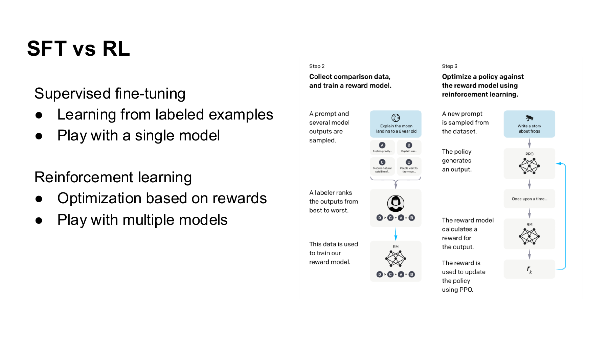

이 페이지는 SFT와 RL의 차이를 명확하게 압축한다. SFT는 labeled sample에서 학습하므로 보통 "one model + one static dataset"으로 main flow를 설명할 수 있다. RL은 reward를 기반으로 optimize하며, training data는 current policy가 생성한다. policy가 한 번 update될 때마다 다음 round rollout distribution도 바뀐다.

그래서 RL framework는 data production과 model update를 같은 closed loop 안에 넣어야 한다. actor가 response를 rollout하고, reference/actor가 logprob를 다시 계산하고, reward 또는 verifier가 score를 주며, 마지막으로 advantage에 따라 actor를 update한다. SGLang은 이 closed loop에서 high-throughput data production endpoint를 맡는다.

#### Slide 5: Why LLM RL needs a system framework

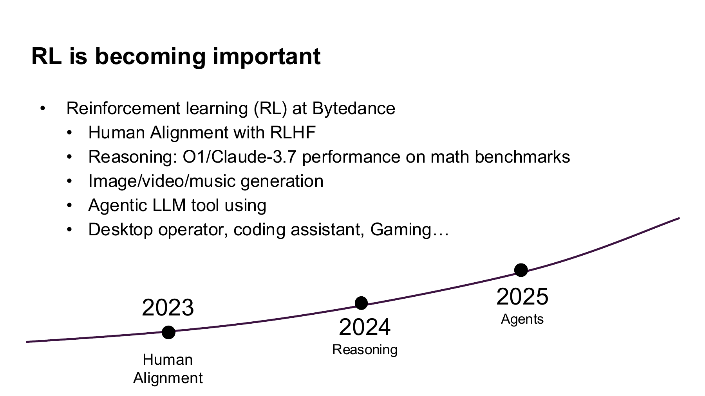

이 페이지의 timeline은 2023 human alignment에서 2024 reasoning을 거쳐 2025 agents로 간다. 말하고 싶은 것은 RL task shape가 변하고 있다는 점이다. RLHF는 주로 preference를 optimize했고, reasoning은 verifiable answer를 도입하기 시작했으며, agentic LLM은 tool, desktop operation, coding assistant, game environment를 training에 포함해야 한다.

system pressure도 함께 변한다. ordinary reward model scoring은 상대적으로 regular하지만, agentic rollout은 long-tail environment latency, multi-turn tool return, early termination sample을 만든다. LLM RL은 actor, reference, reward/verifier, rollout engine, advantage, logprob, training side와 inference side 사이의 weight update를 동시에 처리해야 한다.

#### Slide 6: RL dataflow is much more complex than supervised learning

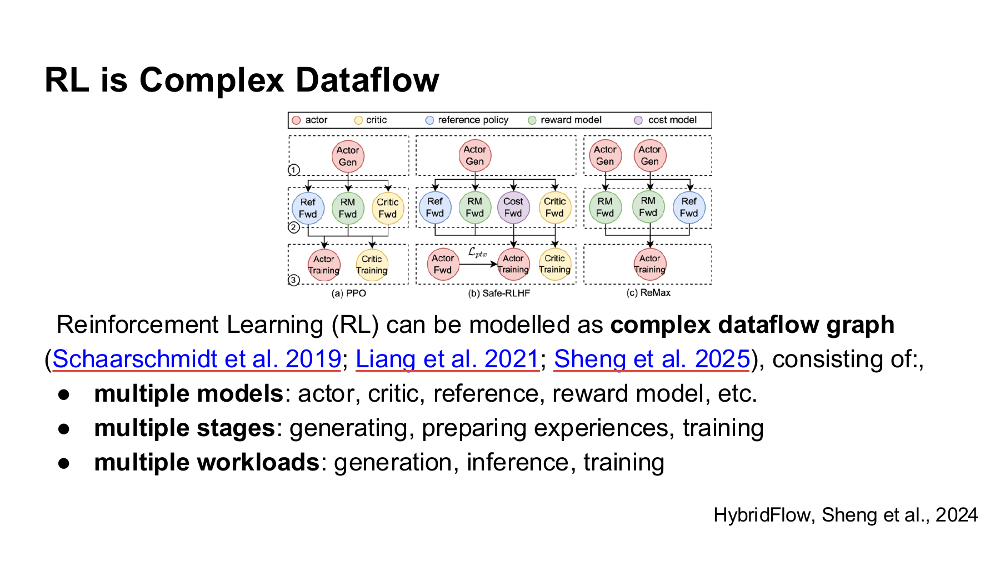

이 dataflow diagram은 verl 입문의 핵심이다. slide에는 RL can be modeled as complex dataflow graph라고 적혀 있고, multiple models, multiple stages, multiple workloads가 있다. multiple models는 actor, critic, reference, reward model을 포함한다. multiple stages는 generation, experience preparation, training을 포함한다. multiple workloads는 각각 generation, inference, training에 대응한다.

한 번의 rollout은 response text만 만들지 않는다. token ids, attention mask, response mask, old logprobs, rewards, values 같은 training tensor도 만든다. 뒤의 training에서는 다시 micro-batch, sequence length, DP rank에 맞게 split해야 한다. mask나 logprob가 하나만 어긋나도 loss가 반드시 error를 내지는 않지만, training signal은 틀어진다.

#### Slide 7: Large-scale distributed dataflow

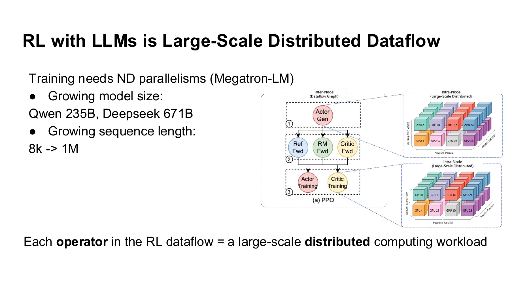

이 페이지는 LLM RL의 각 dataflow operator 자체가 large-scale distributed workload라는 점을 강조한다. training side는 Qwen 235B, DeepSeek 671B 같은 model scale을 감당하기 위해 Megatron-LM/FSDP 같은 ND parallelism을 써야 한다. sequence length도 8k에서 1M으로 올라가며, single batch shape만으로도 이미 충분히 복잡하다.

distributed setting에서는 dataflow가 더 이상 local function call이 아니라 Ray actor, placement group, device mesh, communication group을 가로지르는 scheduling이 된다. verl Controller는 "algorithmically 다음에 누구를 호출해야 하는가"와 "system-wise data를 어느 worker group에 잘라 줘야 하는가"를 동시에 만족시켜야 한다.

#### Slide 8: Dependencies and resource limitations in RL dataflow

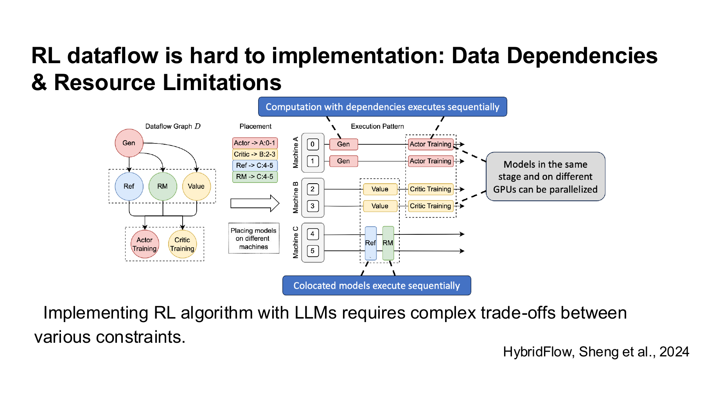

title에는 두 단어가 있다: Data Dependencies와 Resource Limitations. data dependency는 generation 이후에야 reward/logprob/value를 계산할 수 있고, advantage가 나온 뒤에야 training할 수 있다는 뜻이다. resource limitation은 actor, critic, reference, rollout engine이 자주 같은 GPU나 같은 GPU memory budget을 두고 경쟁한다는 뜻이다.

이것이 colocate, release/resume, weight sync가 등장하는 이유다. rollout stage에서는 training 관련 module을 offload할 수 있고, training stage에서는 rollout engine이 KV/weights/graph를 release할 수 있다. 두 stage 사이를 전환할 때 다시 resume하고 weights를 synchronize한다. verl의 Hybrid Controller는 이런 stage dependency를 readable Python control flow로 쓰고, 아래 worker group은 각자 parallel execution을 처리한다.

#### Slide 9: Community and adoption

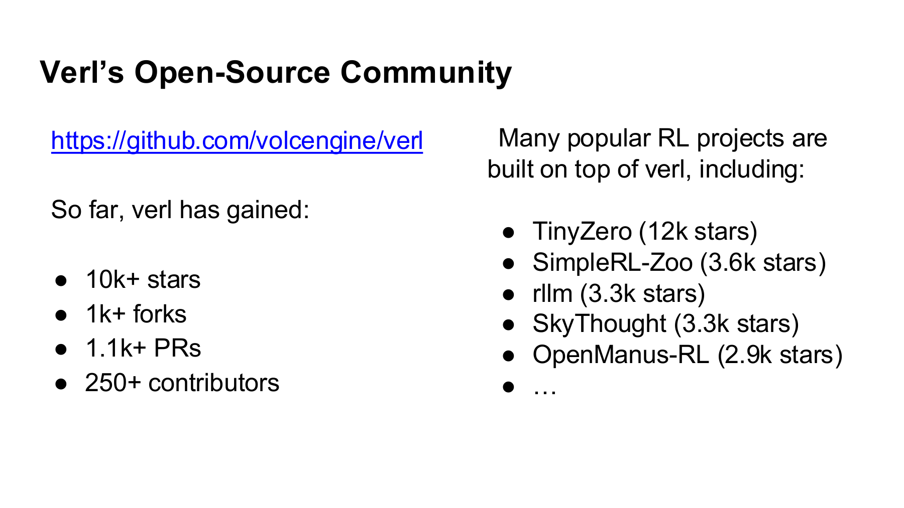

Community page는 10k+ stars, 1k+ forks, 1.1k+ PRs, 250+ contributors, 그리고 TinyZero, SimpleRL-Zoo, rllm, SkyThought, OpenManus-RL 같은 project를 나열한다. 이는 verl이 더 이상 paper adjunct code가 아니라 많은 RL project가 underlying system으로 사용하는 framework가 되었음을 보여준다.

community adoption은 interface를 더 general하게 만들도록 압박한다. 어떤 사람은 FSDP가 필요하고, 어떤 사람은 Megatron이 필요하다. rollout에는 vLLM을 쓰는 사람도 있고 SGLang을 쓰는 사람도 있다. 어떤 사람은 GRPO만 하지만, 어떤 사람은 tool-use와 agentic loop가 필요하다. verl의 adapter layer는 이런 변화가 algorithm main flow를 직접 오염시키지 않게 하기 위한 것이다.

#### Slide 10: verl feature surface

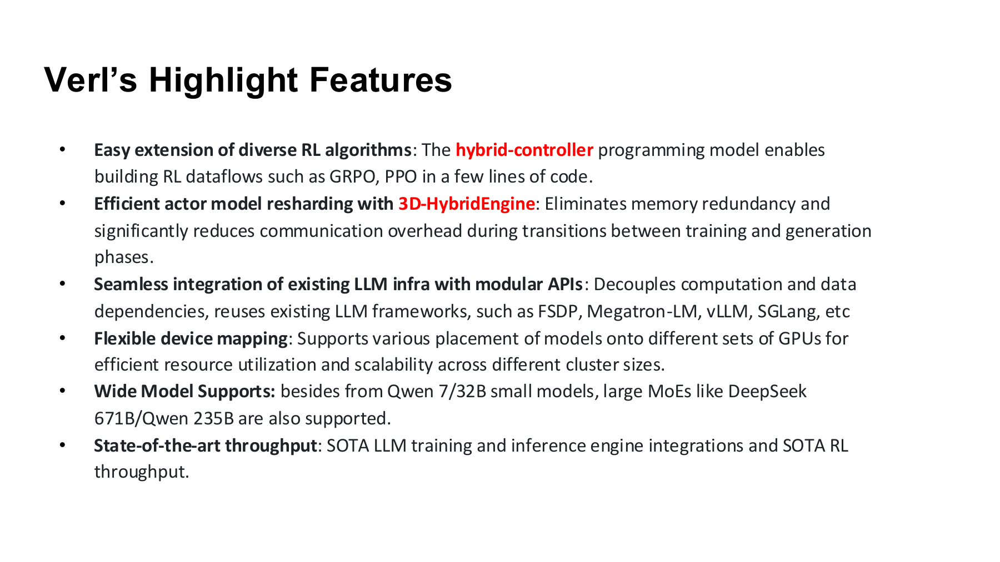

이 페이지는 verl의 highlight features를 나열한다. Hybrid Controller는 PPO/GRPO 같은 RL dataflow를 적은 code로 표현하게 한다. 3D-HybridEngine은 training과 generation stage의 actor resharding을 담당한다. modular APIs는 FSDP, Megatron-LM, vLLM, SGLang을 reuse한다. device mapping은 다른 GPU placement를 지원하고, large MoE도 support 범위 안에 있다.

SGLang user에게 핵심은 "Seamless integration of existing LLM infra"다. SGLang은 단순히 `requests.post("/generate")`로 한 번 호출되는 것이 아니라 server group management, GPU memory release/resume, bucket weight update, PD role split, AgentLoop server mode에 참여해야 한다.

#### Slide 11: Hybrid Controller: keep control flow in Python

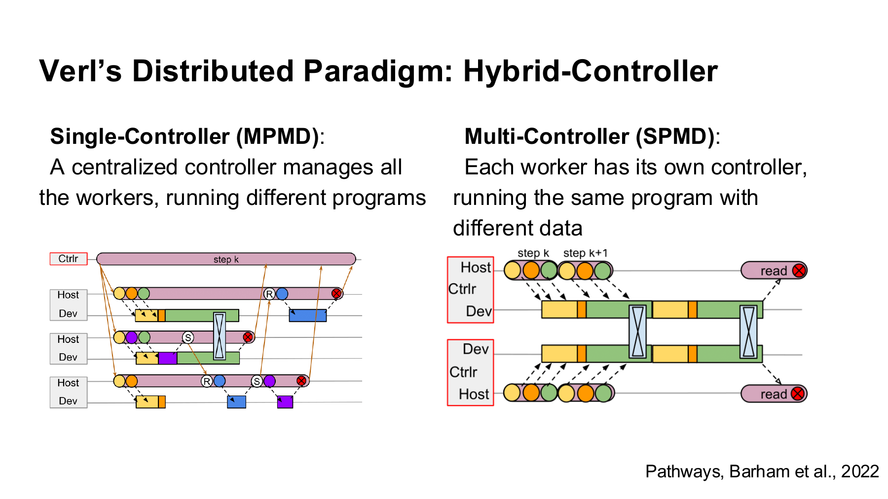

이 페이지는 Pathways의 그림을 빌려 두 distributed programming paradigm을 설명한다. 왼쪽 Single-Controller(MPMD)는 central controller 하나가 모든 worker를 관리하고, 서로 다른 worker는 서로 다른 program을 실행할 수 있다. 그림의 긴 step k는 global scheduling을 나타내고, 아래 host/dev timeline에는 send/recv, computation, wait가 있다. 오른쪽 Multi-Controller(SPMD)는 각 worker가 자기 controller를 갖고 같은 program을 다른 data로 실행한다. 그림에서는 step k, step k+1이 여러 device에서 synchronized하게 진행되고, read/write는 각 controller 안에서 일어난다.

verl은 Hybrid Controller를 선택한다. 둘을 합친 것이다. algorithm layer는 여전히 Single-Controller처럼 Python에서 "먼저 generation, 그 다음 reward/logprob/value, 그 다음 actor update"를 쓴다. specific operator layer는 Multi-Controller처럼 worker group 내부에서 parallel하게 실행할 수 있다. 이렇게 하면 RL code는 sequential하고 readable하게 유지되고, 아래에는 FSDP, Megatron, vLLM/SGLang 같은 multi-process backend를 붙일 수 있다.

#### Slide 12: Single Controller driving multiple Workers

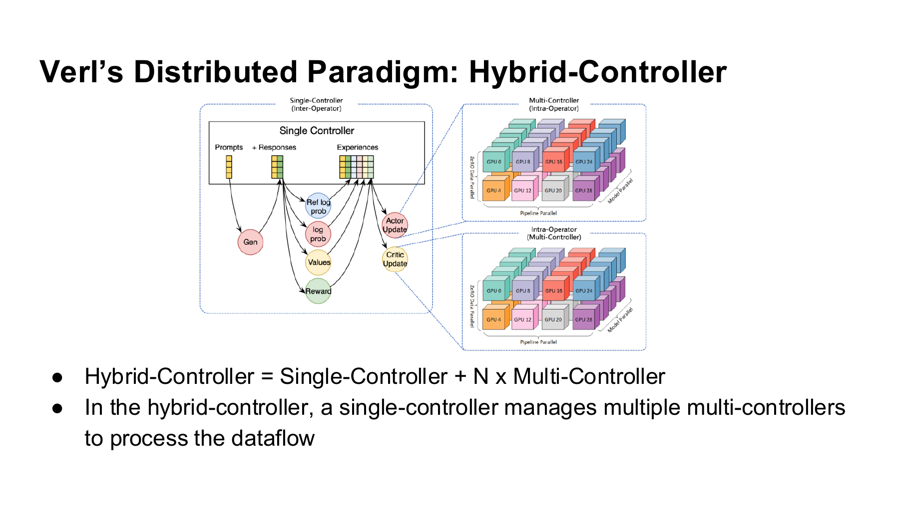

이 페이지는 Hybrid Controller를 `Single Controller + N x Multi-Controller`로 그린다. 왼쪽 single controller는 prompts를 받고 `Gen`을 trigger한다. prompts+responses를 받은 뒤 ref logprob, actor logprob, values, reward를 차례로 호출하고, 마지막에 experiences로 합쳐 actor update와 critic update로 보낸다. 오른쪽의 두 3D GPU mesh는 worker group 내부의 parallel structure를 나타낸다. zero data parallel, pipeline parallel, model parallel이 모두 있을 수 있고, controller는 각 kernel이 어떻게 배치되는지 알 필요가 없다.

이것이 verl과 단순히 distributed training script 하나를 쓰는 방식의 차이다. controller는 inter-operator dataflow를 처리한다. 예를 들어 generation output을 reward와 logprob에 먹여야 한다. multi-controller는 intra-operator parallelism을 처리한다. 예를 들어 actor update 내부에서 DP/TP/PP를 어떻게 구성할지다. source code의 worker group, dispatch/collect, backend adapter가 바로 이 level에서 분업한다.

#### Slide 13: Dispatch/Collect data distribution semantics

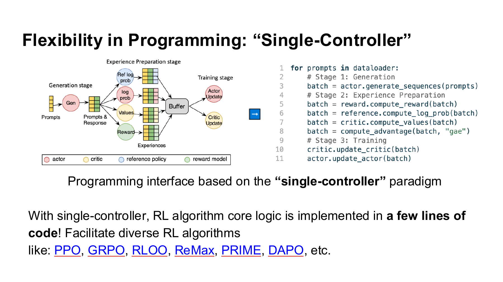

왼쪽은 RL flow를 세 stage로 나눈다. Generation stage에서는 prompts가 actor로 들어가 responses를 생성한다. Experience Preparation stage에서는 prompts & responses에 대해 reference log prob, actor log prob, values, reward를 각각 계산한다. Training stage는 buffer의 experiences로 actor/critic을 update한다. 오른쪽 code도 정확히 이 순서에 대응한다. `actor.generate_sequences(prompts)`, 이어서 `reward.compute_reward`, `reference.compute_log_prob`, `critic.compute_values`, `compute_advantage(batch, "gae")`, 마지막에 `critic.update_critic`와 `actor.update_actor`다.

Dispatch/Collect는 이 single-machine Python처럼 보이는 flow가 multiple workers 위에서 돌게 한다. prompt data는 보통 DP로 rollout worker에 split된다. logprob/value/reward는 서로 다른 worker group으로 갈 수 있다. training update는 다시 actor/critic의 mesh에 맞춰 aggregate된다. verl source code에서 `Dispatch.DP_COMPUTE_PROTO` 같은 strategy가 하는 일이 이것이다. dispatch 전 batch를 split하고, 필요하면 padding하며, collect 뒤 DataProto로 다시 concat한다.

#### Slide 14: FSDP, Megatron, vLLM, SGLang backends

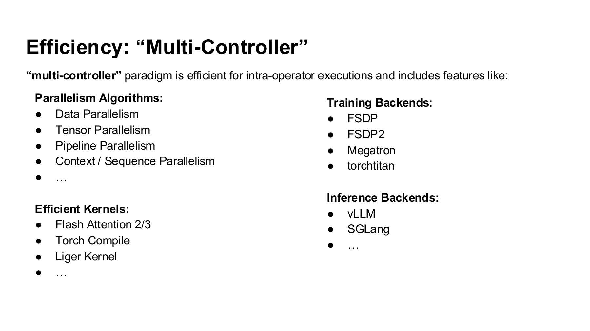

이 페이지는 multi-controller가 붙일 수 있는 backend를 펼쳐 놓는다. parallel algorithm은 DP, TP, PP, context/sequence parallel을 포함한다. training backend는 FSDP, FSDP2, Megatron, torchtitan을 포함한다. inference backend는 vLLM과 SGLang을 포함한다. kernel side에서는 FlashAttention, torch compile, Liger Kernel도 사용할 수 있다.

이는 verl의 "multi-controller"가 추상적 slogan이 아님을 보여준다. actor update는 Megatron mesh 안에서 돌 수 있고, rollout은 SGLang server group에서 돌 수 있으며, reward/logprob는 또 다른 worker group일 수 있다. controller는 data dependency만 설명하면 되고, specific operator 내부 parallelism은 각 backend가 맡는다.

#### Slide 15: 3D-HybridEngine and colocate

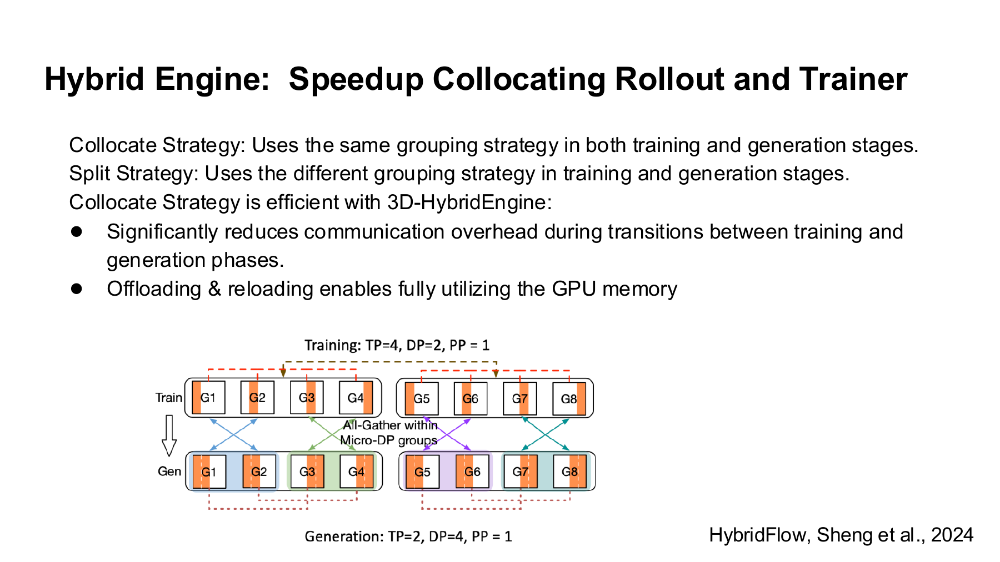

이 페이지는 colocate strategy와 split strategy를 구분한다. colocate는 training과 generation stage에 같은 GPU group을 사용하고, split은 두 stage가 서로 다른 group을 사용한다. 아래 예시에서 training은 `TP=4, DP=2, PP=1`이고 generation은 `TP=2, DP=4, PP=1`이다. Train에서 Gen으로 가는 arrow는 같은 GPU가 stage 전환 때 regroup하고 weights를 synchronize해야 함을 나타낸다. 그림의 `All-Gather within Micro-DP group`은 weights가 training slicing shape에서 inference가 필요한 full/resharded shape로 바뀌는 것에 대응한다.

slide 아래 두 줄은 따로 봐야 한다. 3D-HybridEngine에서 colocate는 training/generation switching communication overhead를 줄인다. offloading & reloading은 GPU memory를 충분히 활용하게 한다. SGLang에 내려오면 rollout이 끝난 뒤 KV/weights/graph를 release하고, training이 끝난 뒤 resume하고 새 weights를 synchronize하는 것이다. release/resume이 없으면 training peak와 inference resident memory가 겹친다. weight sync가 없으면 복구된 rollout server는 여전히 old policy를 사용한다.

#### Slide 16: verl programming style

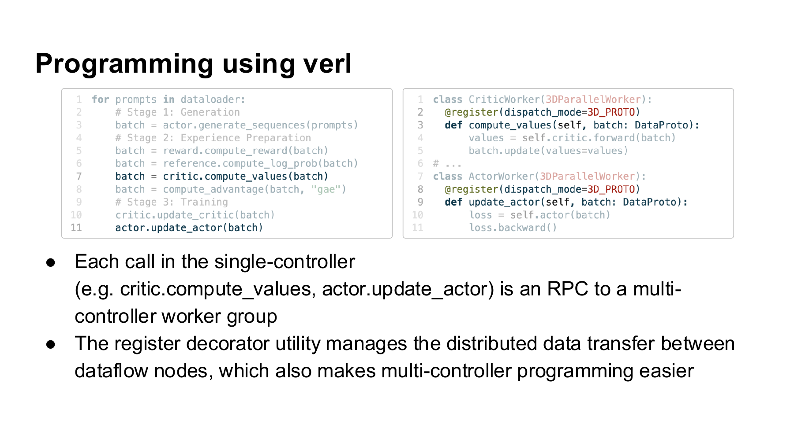

이 페이지는 verl programming interface를 보여준다. slide의 작은 글자는 직설적이다. single-controller 안의 각 call, 예를 들어 `critic.compute_values`, `actor.update_actor`는 본질적으로 multi-controller worker group으로 보내는 RPC다. `register` decorator는 dataflow node 사이의 distributed data transfer를 관리한다.

이것이 뒤의 code에서 `Dispatch`와 `Collect`가 나오는 이유다. algorithm author에게 보이는 것은 ordinary Python이다. generate하고, reward/logprob/value를 계산하고, advantage를 계산하고, actor/critic을 update한다. system layer가 실제로 하는 일은 batch split, padding, cross-worker-group call, result concat이다. 이 interface design이 verl이 PPO, GRPO, RLOO, ReMax, PRIME, DAPO 같은 algorithm을 동시에 serve할 수 있게 한다.

#### Slide 17: Agentic RL section transition

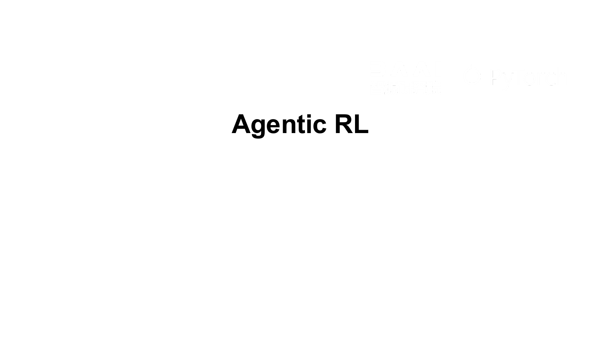

이 페이지는 section transition이며, Agentic RL로 들어간다. 앞에서는 ordinary RL dataflow와 Hybrid Controller를 말했고, 뒤에서는 scheduling이 더 어려운 rollout을 처리한다. model은 tool을 call하고, environment return을 기다리고, observation을 context에 다시 쓴 뒤, generation을 계속한다.

이 단계는 SGLang에도 영향을 준다. ordinary rollout은 prompt batch를 backend에 보내고 response를 기다리면 된다. Agentic rollout은 각 trajectory의 session state, KV cache, tool-call state, request id를 보존해야 한다. inference backend가 asynchronous server mode와 sticky session을 지원하지 않으면, multi-turn interaction은 매 round context를 계속 rebuild하게 된다.

#### Slide 18: What is an Agent

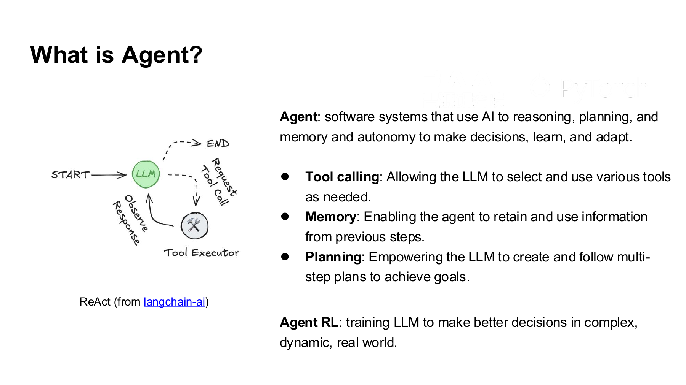

이 페이지는 Agent definition을 준다: software systems that use AI to reasoning, planning, memory and autonomy. slide 아래에는 세 capability가 있다. tool calling은 LLM이 필요에 따라 tool을 선택하게 하고, memory는 agent가 historical step information을 사용하게 하며, planning은 model이 multi-step plan을 세우고 실행하게 한다.

RL framework 관점에서 Agent RL은 complex dynamic environment에서 decision making을 train하는 것이다. rollout은 더 이상 fixed-length single `generate`가 아니라 `message -> action/tool call -> observation -> next message` loop다. training data도 single response에서 multi-turn trajectory로 바뀌며, 그 안에서 model-generated token과 environment-returned token을 구분해야 한다.

#### Slide 19: ReTool: tool-calling training

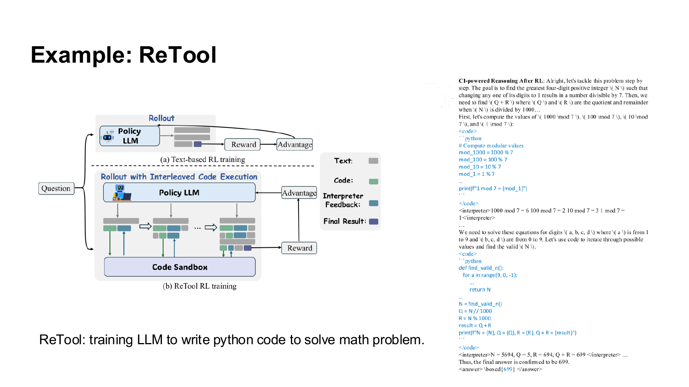

이 페이지의 example은 ReTool이다: training LLM to write python code to solve math problem. model은 final answer를 바로 내지 않고 먼저 Python code를 생성하고, environment가 이를 실행한 다음, code output을 바탕으로 계속 reasoning하거나 answer한다. math problem에서는 code execution result가 verifier의 일부가 되기 쉽다.

ReTool은 ordinary RLHF의 response를 action/observation trajectory로 확장한다. model이 code를 생성하는 것은 action이고, sandbox의 return은 observation이며, final answer는 reward/verifier가 검사한다. code side에서는 `ToolAgentLoop`에 대응한다. generation stage는 tool calls를 parse하고, tool stage는 concurrent execution을 수행하며, tool response는 chat template을 통해 다시 `prompt_ids`에 append된다.

#### Slide 20: Synchronous rollout problem in Agentic RL

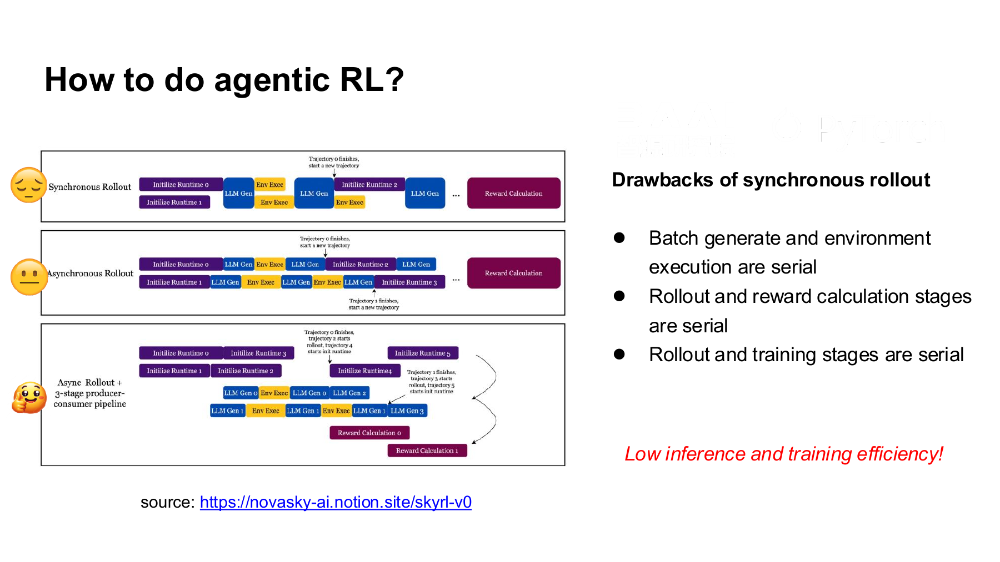

이 페이지는 세 timeline으로 rollout orchestration을 비교한다. 맨 위 synchronous rollout에서는 `Initialize Runtime`, `LLM Gen`, `Env Exec`, 다음 round `LLM Gen`이 거의 serial하고, 마지막에야 `Reward Calculation`으로 간다. 가운데 asynchronous rollout은 서로 다른 trajectory를 interleave하게 하며, 어떤 trajectory가 끝나면 새 trajectory를 시작할 수 있지만 reward는 여전히 뒤쪽에 있다. 맨 아래 async rollout + 3-stage producer-consumer pipeline은 runtime initialization, LLM generation, environment execution, reward calculation을 pipeline으로 나누어 여러 trajectory가 동시에 서로 다른 stage에 있을 수 있게 한다.

오른쪽 세 drawback은 그림에 대응한다. batch generate와 environment execution이 serial하고, rollout과 reward calculation이 serial하며, rollout과 training이 serial하다. Agentic RL에서는 각 sample의 tool latency와 turn count가 크게 다르다. 모든 sample이 synchronous batch로 기다리면 slow sample이 entire batch training data를 잡아 두고, inference와 training 양쪽에 빈 구간이 생긴다.

#### Slide 21: AgentLoop state machine

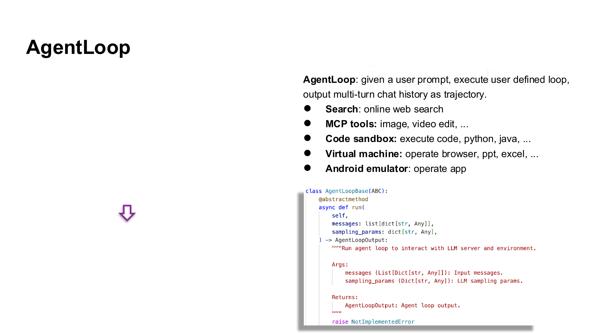

이 페이지는 AgentLoop interface definition을 제시한다. user prompt 하나를 받아 user-defined loop를 실행하고, multi-turn chat history를 trajectory로 output한다. 오른쪽에는 online web search, MCP tools, code sandbox, virtual machine, Android emulator 같은 environment가 나열되어 있다. 즉 rollout은 더 이상 `prompt -> response`가 아니라, model이 action을 계속 생성하고 environment가 observation을 반환하며, 그 observation이 context에 다시 기록되는 loop다.

아래 code의 `AgentLoopBase(ABC)`는 `async def run(self, messages, sampling_params) -> AgentLoopOutput`을 노출한다. asynchronous interface가 핵심이다. tool calling과 environment execution은 본질적으로 waiting time을 갖기 때문이다. implementation은 여전히 `PENDING -> GENERATING -> PROCESSING_TOOLS -> TERMINATED` 같은 state machine일 수 있다. 하지만 upper trainer는 final trajectory와 intermediate token/mask/reward information만 받으면 된다.

#### Slide 22: AgentLoop server mode

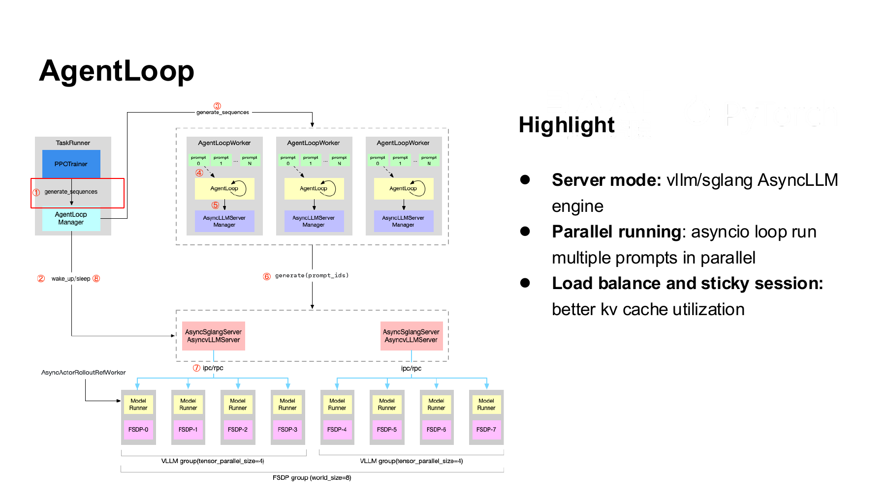

왼쪽 그림은 server mode dataflow를 매우 자세히 그린다. `PPOTrainer`가 `generate_sequences`를 호출하면 `AgentLoop Manager`로 들어가고, Manager는 prompts를 여러 `AgentLoopWorker`에 분배한다. 각 worker 내부에는 `AgentLoop`와 `AsyncLLMServer Manager`가 있으며, 실제 model generation은 아래 `AsyncSglangServer/AsyncvLLMServer`를 통해 model runner group으로 간다. 아래에는 vLLM group 두 개가 표시되어 있고, 각 group은 tensor_parallel_size=4이며, 바깥에는 FSDP group world_size=8도 있다.

오른쪽 세 highlight는 이 structure에 대응한다. server mode는 vLLM/SGLang AsyncLLM engine과 연결할 수 있고, parallel running은 asyncio로 multiple prompts를 동시에 실행하며, load balance and sticky session은 KV cache utilization을 높인다. sticky session은 같은 multi-turn agent trajectory를 되도록 같은 backend session에 두는 것이다. 그러면 앞에서 생성한 KV cache를 매 turn 다시 만들 필요가 없다.

#### Slide 23: ReTool with AgentLoop

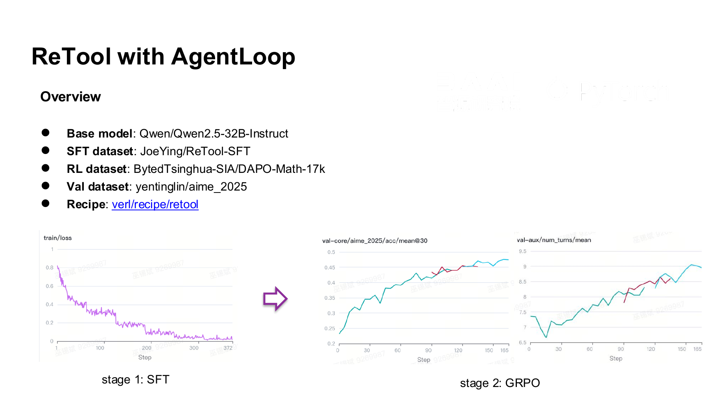

이 페이지는 ReTool reproduction config와 training curves를 함께 둔다. Overview에는 base model이 Qwen/Qwen2.5-32B-Instruct, SFT dataset이 JoeYing/ReTool-SFT, RL dataset이 ByteTsinghua-SIA/DAPO-Math-17k, val dataset이 yentinglin/aime_2025, recipe가 `verl/recipe/retool`이라고 적혀 있다. 아래 stage도 분명하다. stage 1은 SFT, stage 2는 GRPO다.

세 curve는 training status를 설명한다. 왼쪽 `train/loss`는 SFT stage에서 내려간다. 가운데 `val-score/aime_2025/acc/mean@30`은 GRPO stage에서 올라간다. 오른쪽 `val-aux/num_turns/mean`도 올라가는데, model이 validation set에서 multi-turn tool interaction을 더 자주 한다는 뜻이다. AgentLoop semantic으로 보면 model이 tool call을 생성하고, environment가 tool을 실행하고, observation을 context에 넣고, model이 계속 generation한다. training 전에는 이런 trajectory를 token, mask, logprob, reward tensor로 정리해야 한다.

#### Slide 24: ReTool reproduction lessons

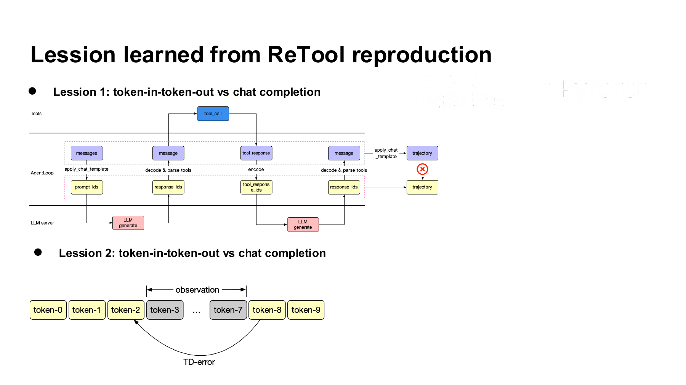

이 페이지는 ReTool reproduction experience summary다. slide에는 두 lesson이 적혀 있고, title은 모두 `token-in-token-out vs chat completion`을 가리킨다. 이 conflict는 매우 실제적이다. training framework 내부에서 가장 stable한 것은 token ids, attention mask, response mask 같은 tensor다. 하지만 agent/tool ecosystem은 role, tool call, tool response, multi-modal payload가 들어 있는 chat completion semantic을 자주 사용한다.

중간 conversion이 엄밀하지 않으면 문제는 곧바로 training signal에 반영된다. 예를 들어 tool return token을 response token으로 잘못 표시하면 loss가 model에게 "environment output을 imitate"하도록 train한다. chat template에서 tool role이 빠지면 다음 turn generation이 observation을 user question처럼 취급할 수 있다. token boundary가 틀리면 logprob, KL, reward mask가 모두 어긋난다. ReTool reproduction에서 정말 어려운 점은 GRPO를 단지 run하는 것이 아니라 token-level training tensor와 chat-level agent trajectory를 일대일로 맞추는 것이다.

#### Slide 25: Roadmap: larger MoE and stronger inference backend

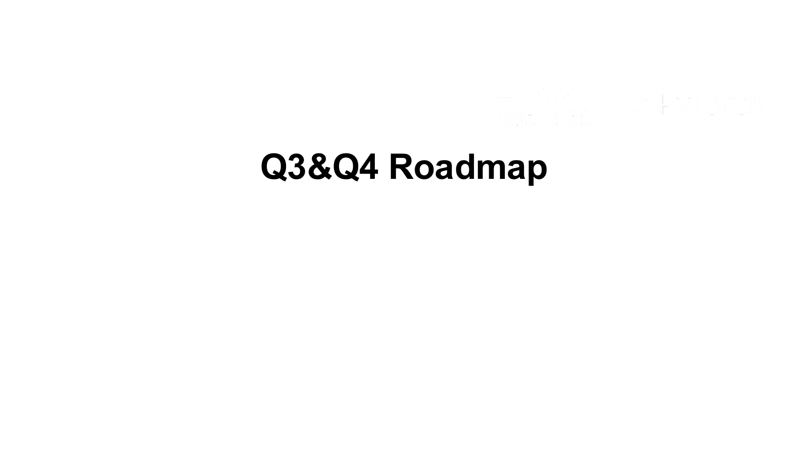

이 페이지는 Q3/Q4 Roadmap transition이다. technical detail은 없지만 위치가 중요하다. ordinary RL과 Agentic RL을 다룬 뒤, roadmap은 large MoE, partial rollout, async pipeline, server-style rollout 같은 engineering problem으로 돌아간다.

더 큰 MoE model은 앞의 contradiction을 모두 키운다. parameter가 많고, expert routing이 더 복잡하며, training-side checkpoint/reshard가 더 무거워지고, rollout-side memory는 더 빠듯해진다. SGLang backend의 DP attention, EP, MTP, memory saver, PD, weight update capability가 모두 RL system의 upper bound에 영향을 준다.

#### Slide 26: Large MoE RL training updates

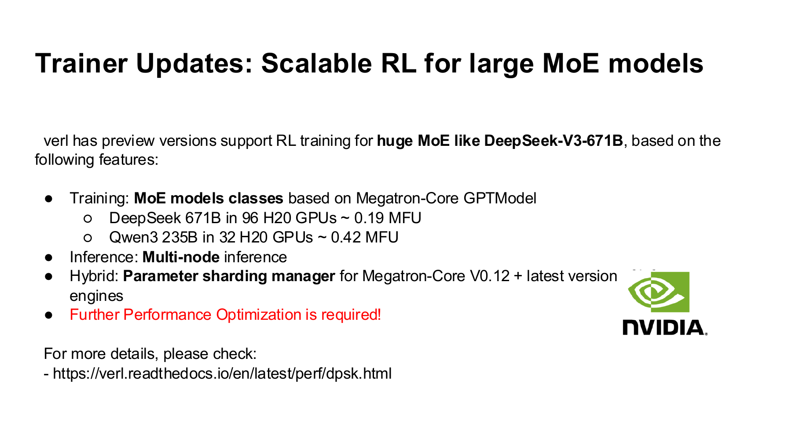

이 페이지는 Trainer Updates를 다룬다. title은 Scalable RL for large MoE models다. slide는 verl이 이미 DeepSeek-V3-671B 같은 giant MoE에 대한 preview support를 갖췄다고 말한다. training side는 Megatron-Core GPTModel 기반이고, 예시에서 DeepSeek 671B는 96 H20, Qwen3 235B는 32 H20을 사용한다. inference side는 multi-node inference를 지원한다. Hybrid 부분에서는 Megatron-Core V0.12와 latest inference engine 사이의 parameter sharding manager가 필요하다.

이 페이지 마지막의 "Further Performance Optimization is required"는 매우 솔직하다. large MoE RL bottleneck은 operator 안에만 있지 않다. training weights를 rollout server로 어떻게 synchronize할지, Megatron shard를 inference side가 필요한 shard로 어떻게 바꿀지, multi-node SGLang/vLLM이 throughput을 어떻게 유지할지 모두 system problem이다. slime 같은 SGLang-native system은 comparison point가 될 수 있다. SGLang server group, router, weight sync, partial rollout을 RL system core path에 넣기 때문이다.

#### Slide 27: Partial rollout and async rollout

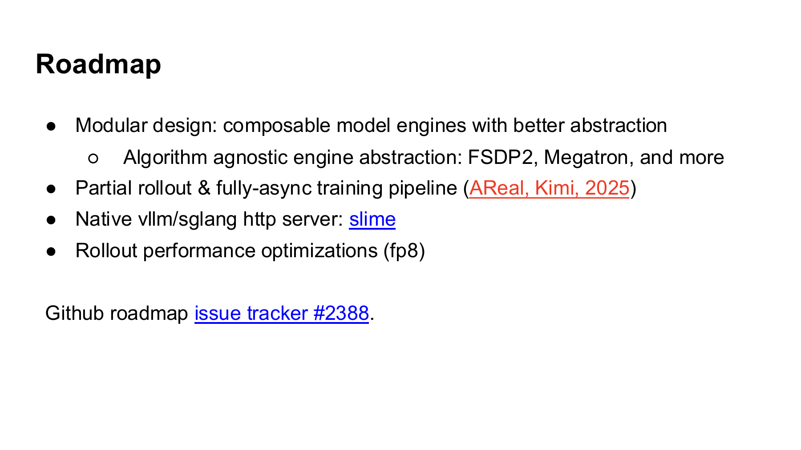

Roadmap page는 네 방향을 나열한다. modular design, partial rollout & fully-async training pipeline, native vLLM/SGLang HTTP server, rollout performance optimizations(fp8)다. 첫 번째는 FSDP2, Megatron 같은 model engine을 더 composable하게 abstract하는 것이고, 세 번째는 slime을 언급하며 SGLang/vLLM server-style rollout이 training framework에 계속 가까워질 것임을 보여준다.

Partial rollout의 핵심은 rollout이 "complete trajectory" 단위로만 training system에 들어가도록 만들지 않는 것이다. Agentic task에서는 어떤 sample은 tool execution이 느리고, 어떤 sample은 빨리 끝난다. 전체 batch가 끝날 때까지 기다려야 하면 long tail이 trainer를 붙잡는다. partial rollout은 data buffer가 half trajectory, request state, KV/cache mapping, generated tokens를 저장하고, 다음 round에서 이어서 채우거나 이미 끝난 부분을 먼저 training에 사용할 수 있어야 한다.

#### Slide 28: More realistic Agentic tasks

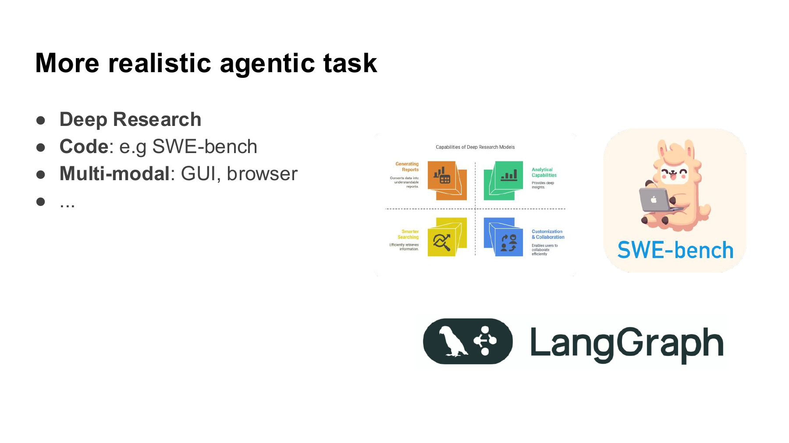

이 페이지는 더 realistic한 agentic task를 나열한다. Deep Research, Code/SWE-bench, Multi-modal GUI/browser 등이다. 공통점은 environment가 무거워진다는 것이다. Deep Research는 search와 web page reading이 필요하고, SWE-bench는 code change와 test running이 필요하며, GUI/browser는 screenshot, coordinate, click, input, page state를 다뤄야 한다.

이 task들은 rollout backend를 "long-lived session service"로 밀어 넣는다. 한 trajectory가 많은 generation round를 거칠 수 있고, 그 사이에는 tool execution과 environment wait가 끼어 있다. 매 round full context를 다시 prefill하면 cost가 매우 높다. SGLang 같은 backend는 sticky session, KV cache reuse, async request, multi-modal input과 함께 동작해야 이런 Agentic RL을 지탱할 수 있다.

#### Slide 29: Community collaboration directions

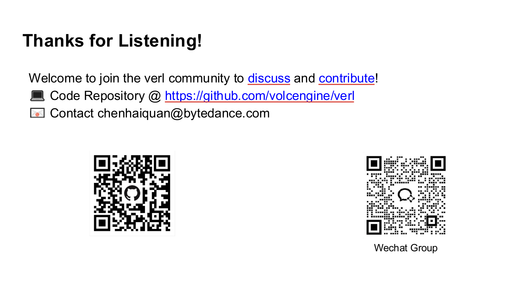

이 페이지는 community invitation page이며, verl repository, contacts, community entry를 제시한다. technical하게는 open interface의 reminder로 볼 수 있다. Agentic RL의 task와 environment는 아직 빠르게 변하고 있고, framework는 new algorithm, new tool protocol, new inference backend를 계속 흡수해야 한다.

contributor에게 entry는 algorithm만이 아니다. SGLang rollout adapter, AgentLoop, new verifier, server mode, partial rollout buffer, MoE weight synchronization이 모두 독립적으로 evolve할 수 있다. verl의 가치는 이런 change가 같은 training closed loop에 들어갈 수 있다는 데 있다. 흩어진 experiment script 더미로 남지 않는 것이다.

#### Slide 30: Summary

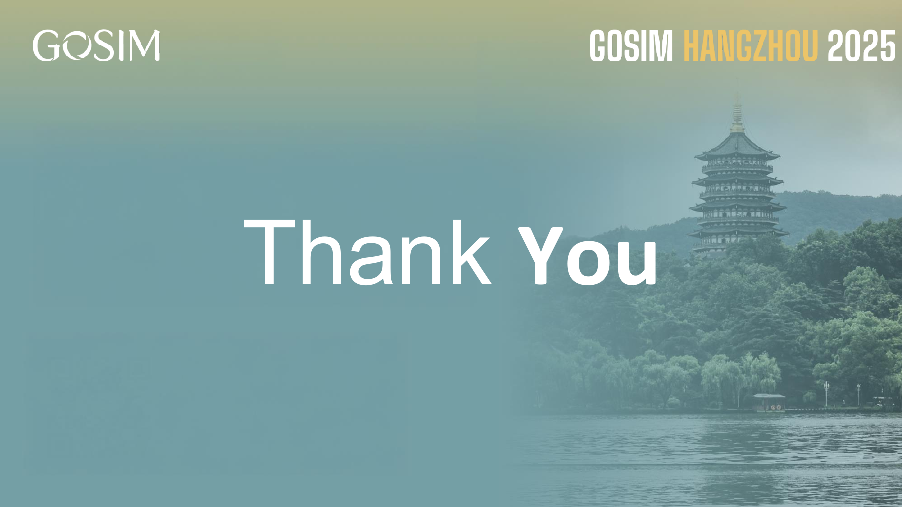

Summary page는 topic으로 돌아온다. verl의 가치는 특정 RL algorithm이 아니라, complex RL dataflow, distributed worker, rollout server, agent environment를 고치고 조정하고 확장할 수 있는 framework 안에 넣는 것이다.

SGLang 관점에서 이 글을 읽으면 conclusion을 세 가지로 압축할 수 있다. 첫째, LLM RL의 rollout은 system core path이지 auxiliary script가 아니다. 둘째, training과 inference 사이에는 weight synchronization, memory switching, data format alignment가 반드시 필요하다. 셋째, Agentic RL은 server mode, async scheduling, sticky session, trajectory mask 같은 inference system detail이 training effect에 직접 영향을 주게 만든다.

## 0x3. 핵심 코드 해설

먼저 verl의 SGLang adapter를 보자. current rank를 기준으로 자신이 어떤 SGLang server에 대응하는지 계산한다. PD disaggregation에서는 prefill/decode도 구분해야 한다.

```python
if disagg is not None and getattr(disagg, "enabled", False):
    footprint = prefill_tp + disagg.decode_replicas * decode_tp
    local = self.rollout_rank % footprint
    if local < prefill_tp:
        self._pd_role = "prefill"
        self._pd_server_index = 0
        self._pd_tp_local_rank = local
    else:
        off = local - prefill_tp
        self._pd_role = "decode"
        self._pd_server_index = off // decode_tp
        self._pd_tp_local_rank = off % decode_tp
```

Hybrid Controller의 dispatch/collect도 source code에서 바로 볼 수 있다. `Dispatch.DP_COMPUTE_PROTO` 같은 mode는 Python parameter를 단순 broadcast하는 것이 아니라 `DataProto`를 worker 수에 맞게 split한다. evenly split되지 않으면 자동 padding하고, 결과를 collect한 뒤 다시 concat한다.

```python
def dispatch_dp_compute_data_proto(worker_group, *args, **kwargs):
    assert isinstance(worker_group, WorkerGroup)
    # enable auto padding for dp compute DataProto
    splitted_args, splitted_kwargs = _split_args_kwargs_data_proto_with_auto_padding(
        worker_group.world_size,
        *args,
        **kwargs,
    )
    return splitted_args, splitted_kwargs

def collect_dp_compute_data_proto(worker_group, output):
    assert BatchData(output).is_concatable()
    output = collect_dp_compute(worker_group, output)
    return _concat_data_proto_or_future(output)
```

이 code는 Slide 13/16에 대응한다. verl은 upper layer가 ordinary Python control flow를 쓰게 하고 싶지만, 아래의 rollout, reward, logprob, ref logprob는 distributed workers가 계산한다. 그래서 "parameter를 어떻게 distribute하고, result를 어떻게 collect할지"에 대한 explicit semantic이 필요하다. `DataProto` auto padding의 의미도 실제적이다. RL batch는 자주 world size의 multiple이 아니며, framework가 마지막 몇 sample 때문에 user에게 manual padding을 요구해서는 안 된다.

release/resume은 SGLang HTTP interface로 직접 들어간다. 여기서 `sleep_level`은 LoRA scenario에 큰 영향을 준다. LoRA adapter mode에서는 base weights를 유지하고 KV cache만 release할 수 있다.

```python
async def resume(self, tags: list[str]):
    await self._init_server_adapter()
    if self._engine is None:
        return
    if self._is_server_tp_leader() and self.config.free_cache_engine:
        await self._engine.resume_memory_occupation(tags=tags)

async def release(self):
    await self._init_server_adapter()
    if self._engine is None:
        return
    if self._is_server_tp_leader() and self.config.free_cache_engine:
        if self.sleep_level == 1:
            tags = ["kv_cache"]
        else:
            tags = ["kv_cache", "weights"]
        await self._engine.release_memory_occupation(tags=tags)
```

weight update path에는 매우 값진 comment가 있다. 모든 rank가 weights generator를 iterate해야 한다는 것이다. 이유는 `DTensor.full_tensor()` 안에서 FSDP all_gather가 trigger될 수 있고, 일부 rank가 skip하면 다른 rank가 hang될 수 있기 때문이다.

```python
async for params_batch in get_named_tensor_buckets(weights, update_weights_bucket_bytes):
    await sgl_update_weights(
        engine=self._engine,
        params_batch=params_batch,
        device_mesh_key="infer_tp",
        device_mesh=self.device_mesh,
    )
```

Agentic RL은 `ToolAgentLoop`를 보면 된다. 이것은 state machine이다.

```python
state = AgentState.PENDING
while state != AgentState.TERMINATED:
    if state == AgentState.PENDING:
        state = await self._handle_pending_state(agent_data, sampling_params)
    elif state == AgentState.GENERATING:
        state = await self._handle_generating_state(agent_data, sampling_params)
    elif state == AgentState.PROCESSING_TOOLS:
        state = await self._handle_processing_tools_state(agent_data)
```

generation stage는 server를 호출하고 tool calls를 parse한다.

```python
output: TokenOutput = await self.server_manager.generate(
    request_id=agent_data.request_id,
    prompt_ids=agent_data.prompt_ids,
    sampling_params=sampling_params,
    image_data=agent_data.image_data,
    video_data=agent_data.video_data,
)
agent_data.response_ids = output.token_ids
agent_data.prompt_ids += agent_data.response_ids
agent_data.response_mask += [1] * len(agent_data.response_ids)
_, agent_data.tool_calls = await self.tool_parser.extract_tool_calls(
    agent_data.response_ids, tools
)
```

tool stage는 concurrent execution을 수행한 뒤 tool response를 context에 append한다. tool response의 `response_mask`가 0이라는 점에 주의하라.

```python
tasks = []
for tool_call in agent_data.tool_calls[: self.max_parallel_calls]:
    tasks.append(self._call_tool(tool_call, agent_data.tools_kwargs, agent_data))
responses = await asyncio.gather(*tasks)

agent_data.messages.extend(add_messages)
response_ids = await self.apply_chat_template(
    add_messages,
    images=images,
    videos=videos,
    remove_system_prompt=True,
)
agent_data.prompt_ids += response_ids
agent_data.response_mask += [0] * len(response_ids)
agent_data.user_turns += 1
return AgentState.GENERATING
```

이 code는 slide의 Agentic RL abstraction을 training data로 내린다. model-generated token은 train하고, environment-returned token은 context로만 사용한다.

## 0x4. 요약

verl system의 핵심은 "orchestration 가능성"이다. ordinary RL도 이미 multi-model, multi-backend, multi-communication-group을 필요로 한다. Agentic RL은 여기에 multi-turn tools와 environment state를 더한다. SGLang은 여기서 있으면 좋은 serving component가 아니라 rollout data production line의 일부다.
