# GOSIM Hangzhou 기술 회고 해설 - 학습 중 SGLang 해제와 재기동

> Colocate RL에서 가장 번거로운 부분은 SGLang을 띄우는 일이 아니라, 학습과 추론이 같은 GPU를 공유할 때 메모리, CUDA Graph, weight update를 모두 리듬에 맞춰 전환하는 일이다.

## 0x0. 서문

이 발표의 키워드는 colocate다. 학습 프레임워크는 카드를 아끼고 싶고, 추론 프레임워크는 높은 throughput을 지키고 싶다. 둘은 같은 GPU 메모리를 두고 다툰다. 주변 논의는 종종 "학습과 추론을 시간대별로 엇갈리게 실행한다"에서 멈추지만, 이 slides는 구현층까지 들어간다. SGLang이 tag 단위로 메모리를 어떻게 pause하는지, CUDA Graph의 virtual address를 어떻게 지키는지, 학습 뒤 weight를 어떻게 빠르게 추론 프로세스에 다시 밀어 넣는지를 다룬다.

## 0x1. 자료와 코드 위치

이 글은 주로 다음 공개 구현에 대응된다.

- `torch_memory_saver`: `csrc/entrypoint.cpp`, `csrc/core.cpp`, hook, VA 보존, pause/resume 구현.
- SGLang: `python/sglang/srt/managers/scheduler_update_weights_mixin.py`, `release_memory_occupation`, `resume_memory_occupation` 인터페이스 제공.
- SGLang: `python/sglang/srt/model_executor/model_runner.py`, `update_weights_from_distributed`, `update_weights_from_tensor`, `flattened_bucket` 구현.
- SGLang: `python/sglang/srt/model_executor/cuda_graph_runner.py`, `torch_memory_saver_adapter.py`, CUDA Graph capture도 memory saver tag에 포함한다.
- LMSYS slime blog: `https://lmsys.org/blog/2025-07-09-slime/`, colocate rollout, weight sync, SGLang-native RL 시스템의 보충 배경으로 볼 수 있다.

로컬 `sglang`과 `torch_memory_saver` 소스에서 slide의 구현을 맞춰 볼 수 있었다. 여기서는 PR 번호를 억지로 쓰지 않는다. 이 변경 묶음은 현재 코드 트리에서 이미 기능면으로 자리 잡았기 때문에, 블로그에서는 파일과 핵심 함수 기준으로 설명하는 편이 더 안정적이다.

slime의 시스템 그림은 이 글의 시각을 맞추는 데 도움이 된다. release/resume은 고립된 기능이 아니라, RL 시스템에서 "학습 단계에는 메모리를 내주고, rollout 단계에는 추론을 복원하는" 한 고리다. LMSYS blog는 SGLang rollout, weight sync, partial rollout, training actor를 한 그림에 넣는데, 이 slides의 colocate 주제와 딱 맞는다.


그림에서 가장 중요한 것은 weight sync와 rollout server group이다. 학습 step이 끝난 뒤 actor 쪽 새 weight를 CPU를 거쳐 한 층씩 천천히 옮기면 rollout 시간이 동기화 비용에 먹힌다. 추론 server가 복원된 뒤에도 CUDA Graph가 capture한 virtual address를 깨면 안 된다. 따라서 아래에서 `torch_memory_saver`와 SGLang weight update 코드를 볼 때는 이 폐루프 안에 놓고 이해해야 한다. release/resume은 메모리 재사용을 해결하고, bucket/IPC/broadcast는 weight refresh를 해결한다. 어느 한쪽이 빠지면 매끄럽게 돌기 어렵다.

## 0x2. Slides 페이지별 해설

#### Slide 1: Reinforcement Learning에서 training을 강화하는 inference

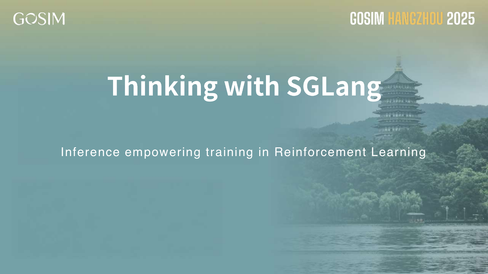

RL 학습의 SGLang은 우회 rollout 서비스가 아니라 학습 시스템 안의 스케줄 가능한 컴포넌트다. rollout 생성이 필요할 때는 메모리, CUDA Graph, KV cache가 있어야 한다. 학습 step이 메모리를 꽉 써야 할 때는 자신이 점유하던 physical memory를 내놓아야 한다.

#### Slide 2: 내용 주선: SGLang 해제/재기동과 파라미터 업데이트

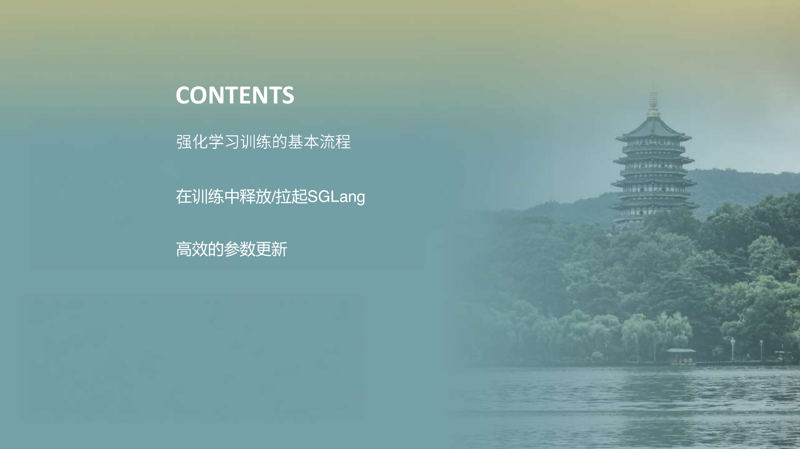

목차는 문제를 두 부분으로 나눈다. 하나는 학습 중 SGLang을 release하고 resume하는 것이고, 다른 하나는 효율적인 파라미터 update다. 앞쪽은 GPU 공존을 해결하고, 뒤쪽은 매 학습 라운드 후 추론 weight를 어떻게 빠르게 갱신할지 해결한다. 두 작업이 연결되어야 colocate RL이 안정적으로 돈다.

#### Slide 3: RL 학습에서 추론 엔진은 우회 컴포넌트가 아니다

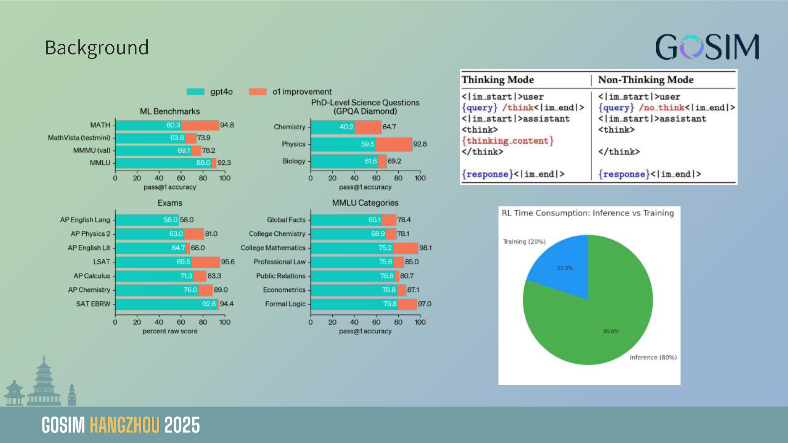

RLHF, GRPO 같은 흐름에서 추론은 오프라인 데이터 준비가 아니다. policy model sampling, scoring, filtering, training이 계속 번갈아 일어나고, 추론 쪽은 새 weight를 자주 보게 된다. SGLang은 여기서 rollout engine을 맡으며, throughput, first token latency, 메모리 점유가 모두 학습 효율에 직접 영향을 준다.

#### Slide 4: Rollout과 학습의 자원 시간차 사용

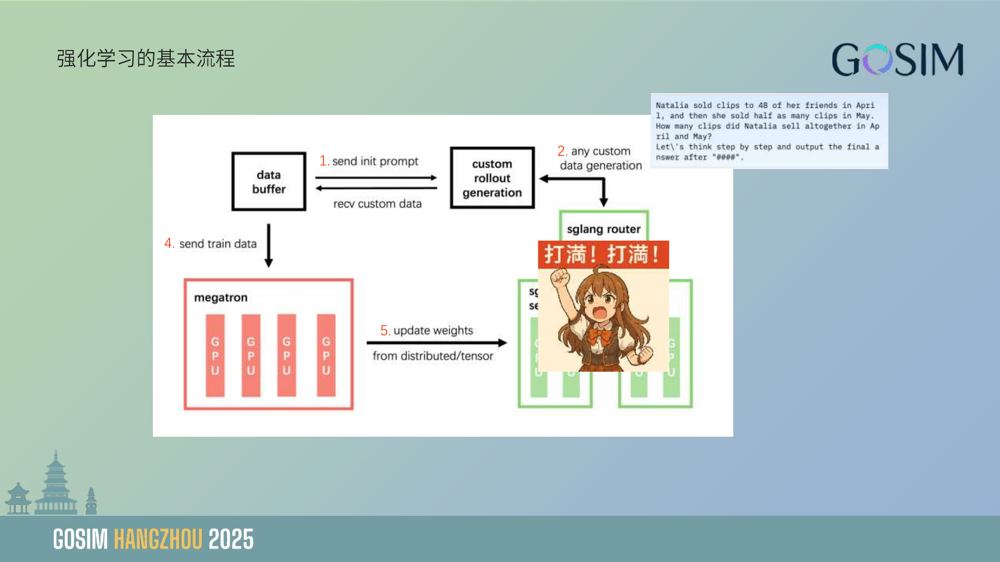

이 페이지가 표현하려는 것은 자원의 time slice다. rollout 단계에서는 학습 쪽 연산자가 일하지 않고, 학습 단계에서는 rollout runtime이 새 weight를 기다린다. 학습과 추론에 각각 카드 묶음을 따로 주면 한쪽이 상대 단계에서 유휴 창을 남긴다. colocate의 목표는 두 time slice를 같은 GPU 묶음 위에 겹치고, 단계 전환 때 release/resume으로 메모리와 CUDA Graph를 함께 전환하는 것이다.

#### Slide 5: 학습 측 메모리 피크와 추론 측 상주 메모리

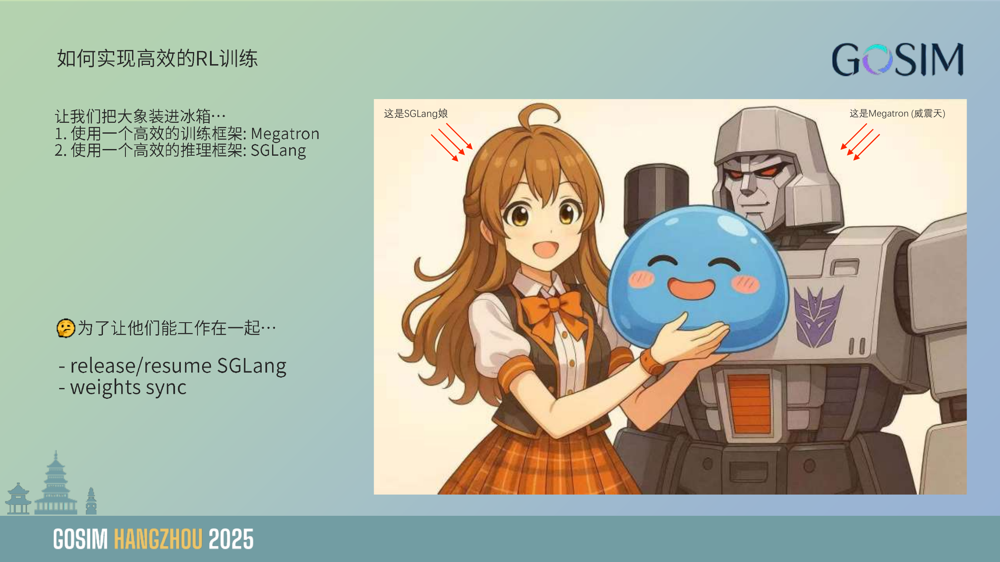

메모리 계산이 colocate의 난점이다. 학습 쪽은 optimizer state, gradient, activation 또는 recomputation buffer가 필요하다. 추론 쪽은 weight, KV cache, CUDA Graph pool이 상주한다. 따로 보면 모두 합리적이지만 같은 카드에 놓으면 OOM이 난다.

#### Slide 6: SGLang을 학습 폐루프에 넣은 뒤의 문제

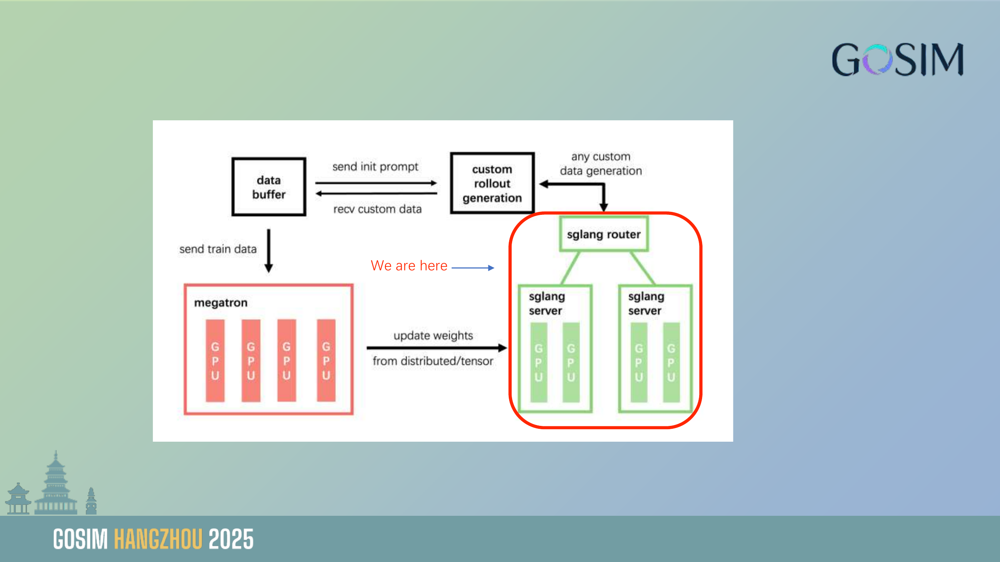

SGLang을 training loop 안에 넣고 나면 `torch.cuda.empty_cache()`만으로는 부족하다. SGLang의 weight, KV cache, CUDA Graph capture 주소에는 모두 lifecycle이 있다. 외부 학습 프레임워크가 언제 sleep하고 언제 resume할지 알려 줄 수 있어야 한다.

#### Slide 7: Qwen2-7B full-shard의 메모리 장부

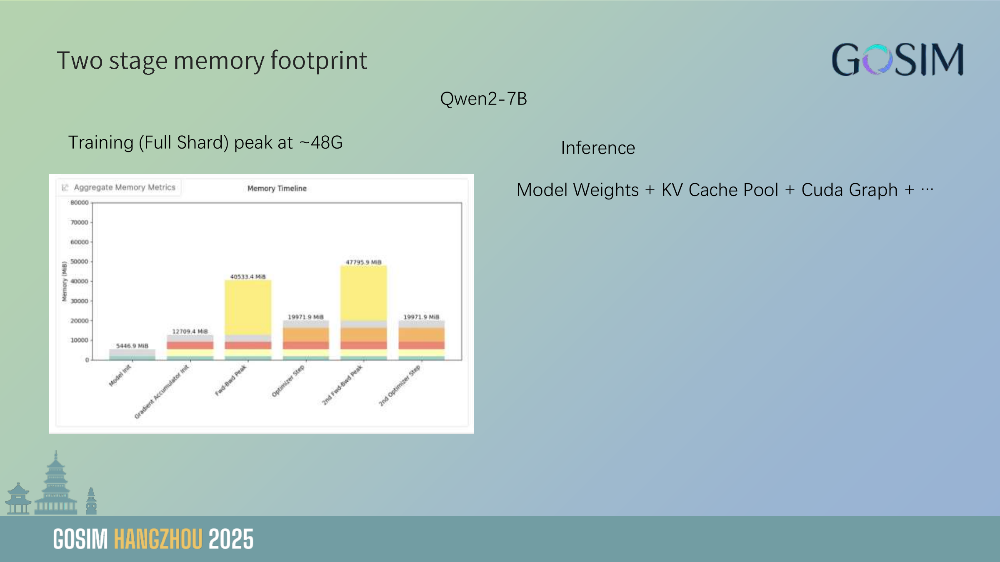

Qwen2-7B 예시는 충돌을 수치화한다. full-shard 학습의 피크가 이미 48GB에 가깝고, 추론 쪽은 weight, KV, graph를 남겨야 한다. 이 숫자는 극단적 case가 아니라 중간 크기 모델에서도 만나는 일상적인 상황이다.

#### Slide 8: 카드가 8장뿐일 때 유휴 창을 낭비할 수 없다

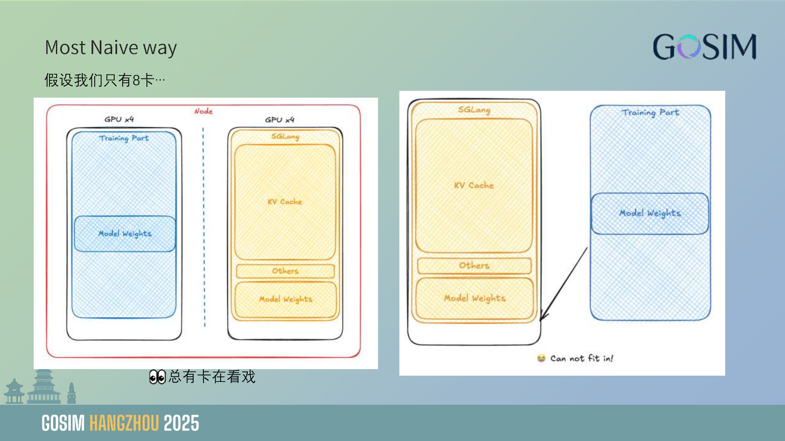

8카드 환경에서 4장은 학습, 4장은 추론에 주면 항상 한쪽이 기다린다. colocate의 이득은 idle time을 사용 가능한 메모리로 바꾸는 데서 온다. 모델 자체의 메모리 요구를 낮추는 것이 아니라, 유휴 단계의 메모리를 현재 일하는 쪽에 다시 넘기는 것이다.

#### Slide 9: Colocate의 기본 형태

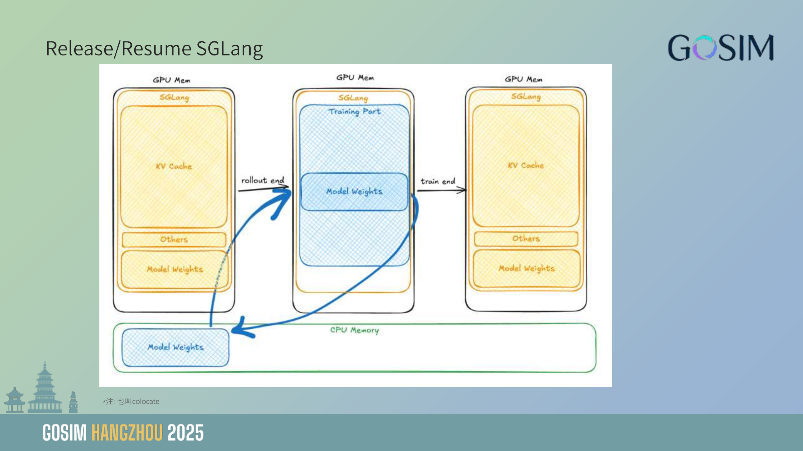

Colocate 후 편성은 이렇다. rollout 때는 SGLang이 online이다. 학습 전 SGLang이 memory를 release한다. 학습 뒤 추론 weight를 update한다. 이후 resume해서 rollout을 계속한다. 여기서 가장 위험한 부분은 resume 뒤 CUDA Graph 주소가 달라지는 것이다. 뒤의 소스에서 왜 virtual address를 보존해야 하는지 볼 수 있다.

#### Slide 10: torch-memory-saver의 네 가지 Driver API

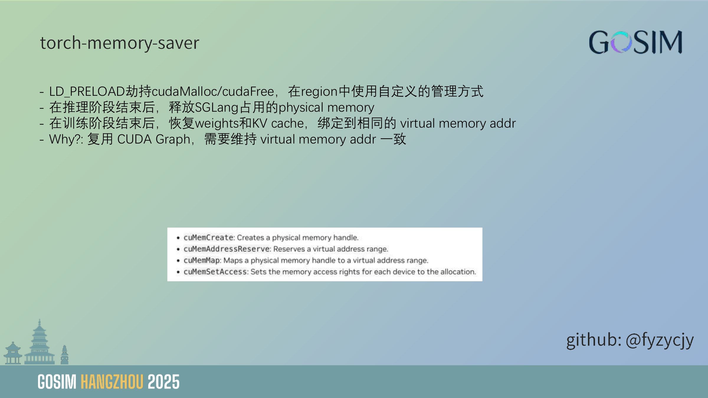

이 페이지는 `torch-memory-saver`의 인터페이스 경계를 직접 설명한다. 먼저 `LD_PRELOAD`로 `cudaMalloc/cudaFree`를 hook하지만, `memory_saver.region()`으로 감싼 영역 안에서만 allocation을 접수한다. region 밖의 일반 PyTorch/SGLang allocation은 원래 allocator를 그대로 지난다. 이렇게 하면 변경면이 작다. weight, KV cache, CUDA Graph처럼 pause/resume이 필요한 tensor만 TMS 관리로 들어간다.

아래 작은 글자는 네 가지 CUDA Driver API를 나열한다. `cuMemCreate`는 physical memory handle을 만들고, `cuMemAddressReserve`는 virtual address 범위를 예약한다. `cuMemMap`은 physical handle을 이 virtual address 범위에 매핑하고, `cuMemSetAccess`는 어떤 device가 이 mapping에 접근할 수 있는지 정한다. 핵심은 "다른 malloc"이 아니라 "pointer address"와 "진짜 메모리"를 분리해서 관리하는 것이다. 추론 단계가 끝난 뒤 physical memory를 풀고, 학습 단계가 끝난 뒤 weights와 KV cache를 같은 virtual memory address에 다시 매핑할 수 있다. CUDA Graph 재사용은 이 주소가 변하지 않는 데 의존한다.

#### Slide 11: TMS 사용 방식

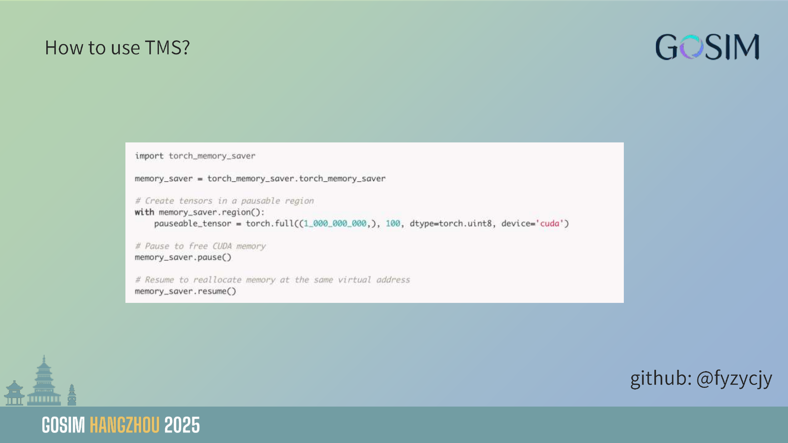

이 페이지의 코드 조각은 TMS 사용법을 설명한다. 먼저 `import torch_memory_saver`를 하고, `torch_memory_saver.torch_memory_saver`를 얻는다. 이후 `with memory_saver.region():` 안에서 위탁 관리가 필요한 tensor를 만든다. slide의 예시는 `torch.full((1_000_000_000,), 100, dtype=torch.uint8, device='cuda')`이며 약 1GB다. 이 tensor가 만들어진 뒤 `memory_saver.pause()`는 뒤의 CUDA physical memory를 해제하고, `memory_saver.resume()`은 같은 virtual address에 다시 할당해 mapping을 복원한다.

이것은 CUDA Graph와 관계가 깊다. CUDA Graph capture 때는 kernel 파라미터의 pointer도 기록된다. 일반 `cudaFree` 뒤 다시 `cudaMalloc`을 하면 새 tensor가 예전 주소를 받을 보장이 없고, graph replay가 이미 무효화된 주소를 볼 수 있다. TMS 사용 방식은 이런 tensor에 "주소 껍데기"를 만든 것과 같다. 껍데기는 변하지 않고, 내부 physical backing만 단계에 따라 떼었다 붙인다.

#### Slide 12: TMS 동작 방식

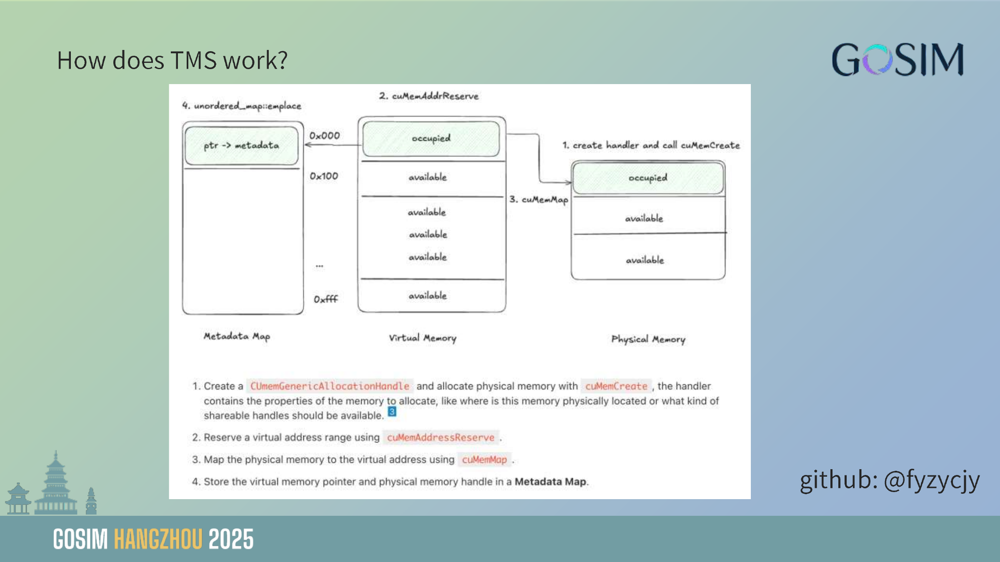

이 페이지는 사용자가 캡처한 그 그림이다. 세 열을 함께 보아야 한다. 가운데 `Virtual Memory`는 PyTorch/SGLang이 보는 주소 공간이다. 그림의 `0x000`부터 `0xfff`는 예시이고, 초록색 `occupied`는 이미 예약되고 매핑된 virtual address 구간을 뜻한다. 오른쪽 `Physical Memory`는 실제 GPU 메모리를 점유하는 부분이다. 왼쪽 `Metadata Map`은 `ptr -> metadata`를 저장한다. `ptr`은 virtual address 구간을 가리키고, `metadata`에는 size, device, tag, state, CPU backup pointer, physical allocation handle이 있다.

그림의 1부터 4는 allocation 흐름이다. 첫째, `cuMemCreate`로 `CUmemGenericAllocationHandle`을 만들어 physical memory handle을 얻는다. 이 handle에는 memory location과 공유 가능 여부 같은 속성이 붙는다. 둘째, `cuMemAddressReserve`로 virtual address space에 연속 범위를 잡는다. 셋째, `cuMemMap`으로 physical handle을 이 virtual address 범위에 바인딩한다. 넷째, virtual pointer와 physical handle을 `Metadata Map`에 기록한다. 뒤에서 pause/resume이 특정 weights나 KV cache를 찾는 것도 이 metadata 덕분이다.

SGLang은 TMS 바깥에 다시 tag 계층을 추가한다. 흔한 tag는 `weights`, `kv_cache`, `cuda_graph`다. tag의 의미는 scheduler가 allocation을 그룹별로 제어할 수 있게 하는 것이다. KV cache는 먼저 flush한 뒤 pause할 수 있고, weights는 model buffer의 static state를 저장해야 하며, CUDA Graph 관련 메모리는 virtual address 재사용성을 유지해야 한다.

#### Slide 13: release: physical memory만 해제

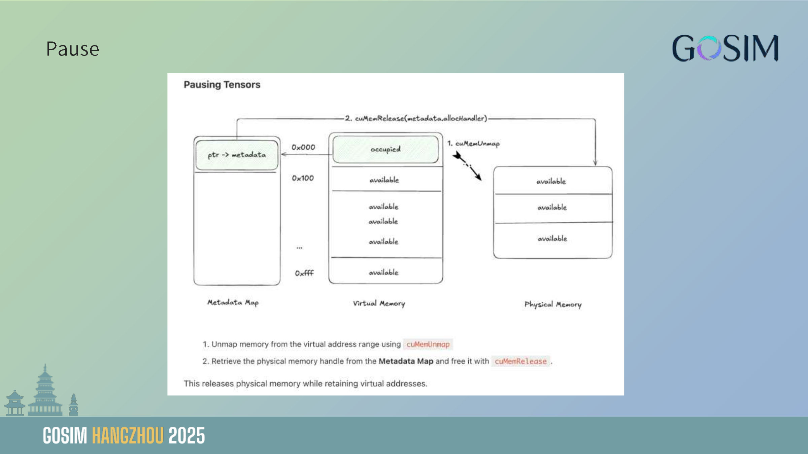

이 페이지는 pause를 그린다. 세 열은 여전히 `Metadata Map / Virtual Memory / Physical Memory`이지만, 오른쪽 physical memory는 이미 `available` 상태가 되었다. 흐름은 두 단계뿐이다. 먼저 `cuMemUnmap`으로 virtual address와 physical allocation의 mapping을 끊고, metadata에서 `allocHandle`을 꺼내 `cuMemRelease(metadata.allocHandle)`로 실제 메모리를 해제한다.

주의할 점은 가운데 virtual memory가 여전히 `occupied`로 표시된다는 것이다. TMS가 `cuMemAddressFree`를 호출하지 않았고, 주소 범위는 아직 예약되어 있다. 즉 tensor의 pointer 값도 있고, CUDA Graph가 capture한 pointer도 남아 있지만, 이 주소에는 잠시 physical backing이 없다. 이 상태에서 kernel이 접근하면 안 되므로 SGLang의 `release_memory_occupation` 앞에는 server가 fully idle이어야 한다는 assert가 있다. allocation에 CPU backup이 켜져 있으면 `pause()`는 먼저 내용을 pinned host memory로 복사하고, resume 때 다시 GPU로 복사한다.

#### Slide 14: resume: 원래 virtual address로 다시 매핑

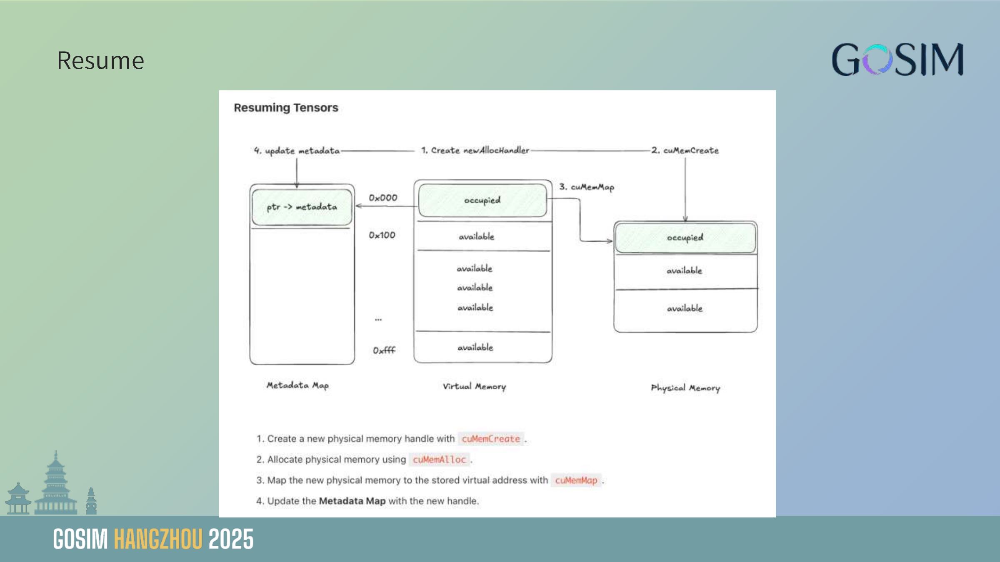

resume 그림에서는 오른쪽 physical memory에 다시 초록색 `occupied`가 나타나고, 가운데 virtual memory의 초록색 블록 위치는 변하지 않는다. 순서는 새 physical allocation handle을 만들고, physical memory를 다시 할당하고, 새 physical memory를 metadata에 저장된 예전 virtual address에 `cuMemMap`한 뒤, metadata의 handle을 갱신하는 것이다.

이 단계의 핵심은 `ptr`이 변하지 않는다는 점이다. PyTorch parameter의 storage 주소, KV cache tensor의 주소, CUDA Graph capture 때 기록된 주소가 계속 같은 virtual address를 가리킨다. 바뀌는 것은 뒤의 physical handle뿐이다. CPU backup이 켜져 있으면 resume은 host backup을 이 주소로 다시 복사하고 allocation state를 active로 되돌린다. 이렇게 학습 단계에서 풀어낸 메모리를 SGLang에 다시 돌려줄 수 있고, graph는 다시 capture할 필요가 없다.

#### Slide 15: SGLang Scheduler 안의 pause/resume 경계

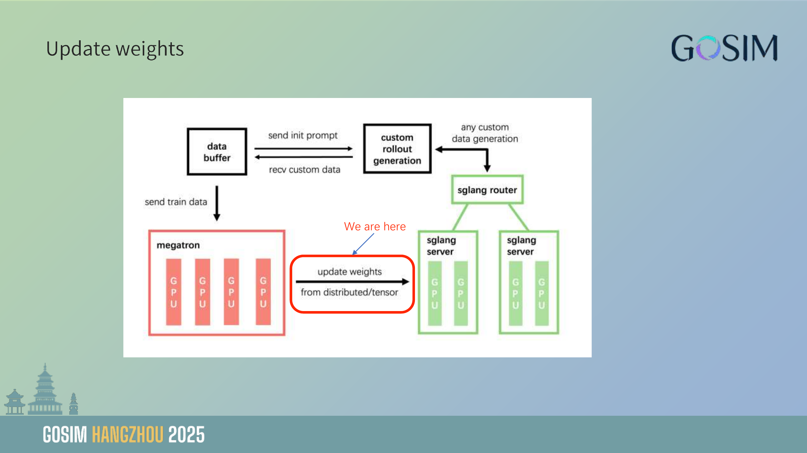

이 페이지의 시스템 그림은 data buffer에서 시작한다. 위쪽 buffer는 init prompt를 custom rollout generation으로 보내고, 커스텀 생성 데이터를 돌려받는다. 왼쪽 아래 megatron은 학습을 맡고, 오른쪽 sglang router 뒤에는 여러 sglang server가 붙는다. 빨간 박스의 `update weights from distributed/tensor`가 이 글 후반에서 설명할 업데이트 경로다. 화살표 의미도 분명하다. training data는 buffer에서 megatron으로 내려가고, rollout data는 SGLang 쪽에서 되돌아온다. train end 뒤에는 megatron 쪽 새 weight가 SGLang server로 동기화되어야 한다.

SGLang Scheduler는 release 전에 server idle을 요구한다. 이 제한은 위 몇 페이지의 메모리 의미에서 온다. 아직 요청이 실행 중인데 KV나 weights를 pause하면 실행 중 batch가 끊긴다. 소스에서 release는 먼저 offload tag를 기록한다. KV cache 경로는 먼저 `pause`한 뒤 `flush_cache`한다. weights 경로는 model buffers를 export하고 TP CPU group barrier를 한 번 수행한 뒤 weights를 pause한다. CUDA graph도 tag별로 따로 pause한다. 복원은 `cuda_graph -> weights -> kv_cache` 순서로 resume한다.

#### Slide 16: 온라인 파라미터 업데이트의 통신 경로

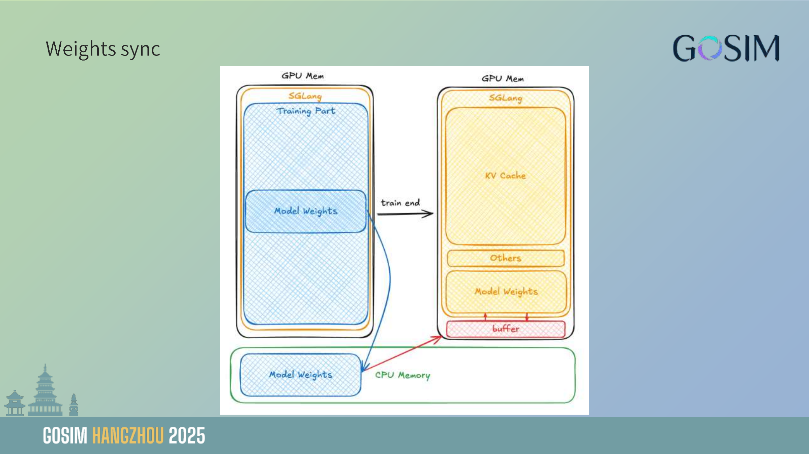

이 페이지 그림은 train end 뒤의 메모리 상태를 양쪽으로 그린다. 왼쪽은 학습 단계다. GPU memory 안에는 SGLang의 껍데기가 있지만 대부분 공간은 `Training Part`가 차지하고, `Model Weights`는 학습 쪽에서 업데이트 중인 파라미터다. 오른쪽은 복원된 뒤의 SGLang GPU memory다. 위에는 KV cache, 가운데에는 others, 아래에는 model weights가 있고, 맨 아래 빨간 buffer는 파라미터 동기화 때 새 weight를 임시로 받는 영역이다. 아래 CPU memory에도 model weights 사본이 있다. 파란 화살표와 빨간 화살표는 학습 쪽/CPU 쪽 weight가 SGLang으로 동기화되는 서로 다른 경로를 표시한다.

파라미터 업데이트 경로는 두 부류다. distributed broadcast와 tensor/IPC다. RL 프레임워크는 보통 학습 weight를 들고 있고, SGLang 쪽은 해당 tensor를 받은 뒤 `model.load_weights`로 제자리 update를 수행한다. 그림의 buffer는 파라미터 동기화의 임시 landing point다. 진짜 병목은 총 바이트 수가 아니라, 많은 작은 tensor가 가져오는 scheduling, communication, load 호출 비용인 경우가 많다. 그래서 뒤의 slide가 CUDA IPC와 flattened bucket을 끌어낸다.

#### Slide 17: CUDA IPC weight update

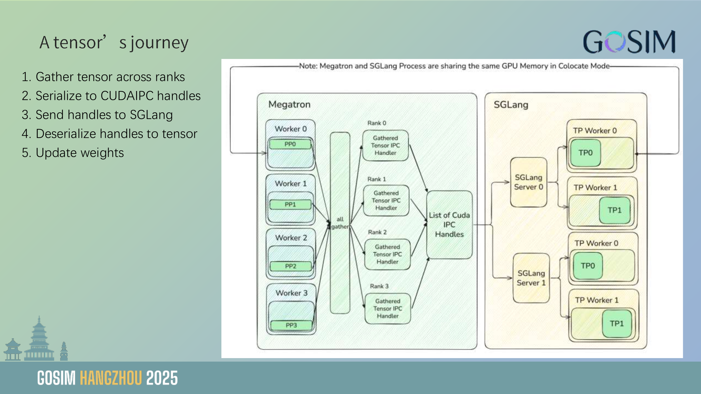

이 페이지의 제목은 "A tensor's journey"다. 왼쪽 다섯 단계는 하나의 파라미터 tensor가 학습 프로세스에서 SGLang 프로세스로 가는 경로다. 먼저 학습 쪽에서 rank across gather를 수행하고, gather된 GPU tensor를 CUDA IPC handle로 직렬화한다. handle을 SGLang에 보내고, SGLang은 이를 다시 tensor로 역직렬화한 뒤 local weights를 update한다. 여기서 전송되는 것은 handle이지, 전체 파라미터를 HTTP Python bytes로 복사하는 것이 아니다.

오른쪽 그림은 colocate 모드의 topology를 그린다. 위 작은 글자는 Megatron과 SGLang 프로세스가 같은 GPU memory를 공유한다고 설명한다. 왼쪽 Megatron에는 Worker 0부터 Worker 3까지 있고, PP0/PP1/PP2/PP3에 대응된다. 가운데 `all gather` 뒤 각 rank는 `Gathered Tensor IPC Handler`를 얻고, 다시 `List of Cuda IPC Handles`로 모인다. 오른쪽은 두 SGLang server이며, 각 server 아래 TP Worker 0/1이 TP0/TP1에 대응된다. 이 그림의 핵심은 parallel 형태가 바뀐다는 점이다. 학습 쪽은 pipeline/data/tensor parallel로 파라미터를 나눌 수 있고, 추론 쪽은 TP worker가 파라미터를 받는다. 따라서 update는 단순히 "state_dict 하나를 보낸다"가 아니라 rank와 TP worker의 대응 관계에 따라 tensor를 재구성해야 한다.

#### Slide 18: flattened bucket으로 MoE 파라미터 update 비용 줄이기

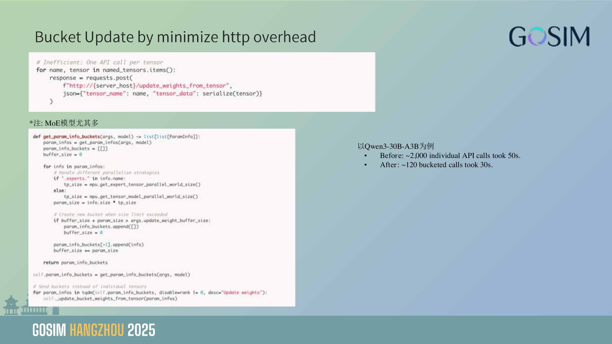

이 페이지 제목은 "Bucket Update by minimize http overhead"다. 위쪽 코드는 비효율 버전이다. `for name, tensor in named_tensors.items()`로 각 tensor마다 `requests.post(".../update_weights_from_tensor", json={"tensor_name": name, "tensor_data": serialize(tensor)})`를 한 번씩 보낸다. MoE 모델에 expert 파라미터가 많으면 이 loop는 한 번의 weight update를 수많은 HTTP 요청과 handler open/close로 쪼갠다.

아래 코드는 bucket 버전이다. `get_param_info_buckets(args, model)`이 먼저 `param_infos`를 수집하고, `args.update_weight_buffer_size`로 bucket 크기를 제어한다. 파라미터 이름에 `.experts.`가 있으면 expert tensor parallel world size로 파라미터 크기를 추정하고, 아니면 일반 tensor model parallel world size를 사용한다. loop에서 `buffer_size + param_size`가 임계값을 넘으면 새 bucket을 연다. 마지막에는 tensor마다 `_update_weights_from_tensor`를 부르지 않고, 각 `param_infos` bucket마다 `_update_bucket_weights_from_tensor`를 부른다. 오른쪽 Qwen3-30B-A3B 예시는 수치를 직관적으로 보여준다. 약 2000번의 단일 tensor API 호출은 50초가 걸렸고, bucket으로 합치면 약 120번 호출에 30초가 걸린다.

#### Slide 19: flatten tensor 이후 시간 분해

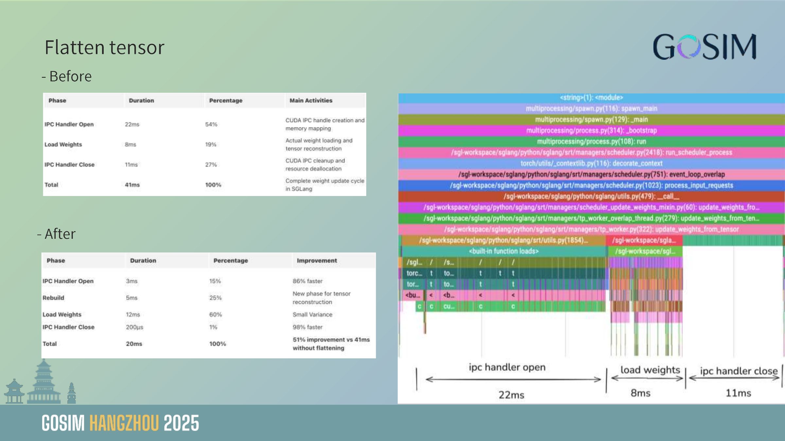

이 페이지는 flattened tensor의 이득을 더 분해한다. 왼쪽 위 `Before` 표는 41ms update를 세 부분으로 나눈다. IPC Handler Open 22ms, 54%; Load Weights 8ms, 19%; IPC Handler Close 11ms, 27%다. 오른쪽 flamegraph에서도 `update_weights_from_tensor` 아래에 긴 `ipc handler open`과 `ipc handler close` 구간이 보인다. 시간이 주로 weight 복사 자체가 아니라 IPC handler를 반복해서 만들고, mapping하고, 닫는 데 쓰인다는 뜻이다.

왼쪽 아래 `After` 표는 flatten 뒤 결과다. IPC Handler Open은 3ms로 내려가고, Close는 200us로 줄어든다. 전체 시간은 41ms에서 20ms가 되었고, "51% improvement vs 41ms without flattening"이라고 표시된다. 중간에 추가된 `Rebuild` 5ms는 flatten buffer를 다시 각 파라미터 tensor로 자르는 비용이다. Load Weights는 12ms로 늘었고 비중도 더 높지만, 이는 handler open/close가 눌리면서 진짜 데이터 load가 주요 부분으로 떠오른 결과다. 이 페이지와 앞 페이지를 이어 보면, 먼저 bucket으로 HTTP/API 횟수를 줄이고, 다시 flatten으로 IPC handler 횟수를 줄이는 구조다.

#### Slide 20: 먼저 weights를 복원하고 update한 뒤 KV/CUDA Graph를 복원

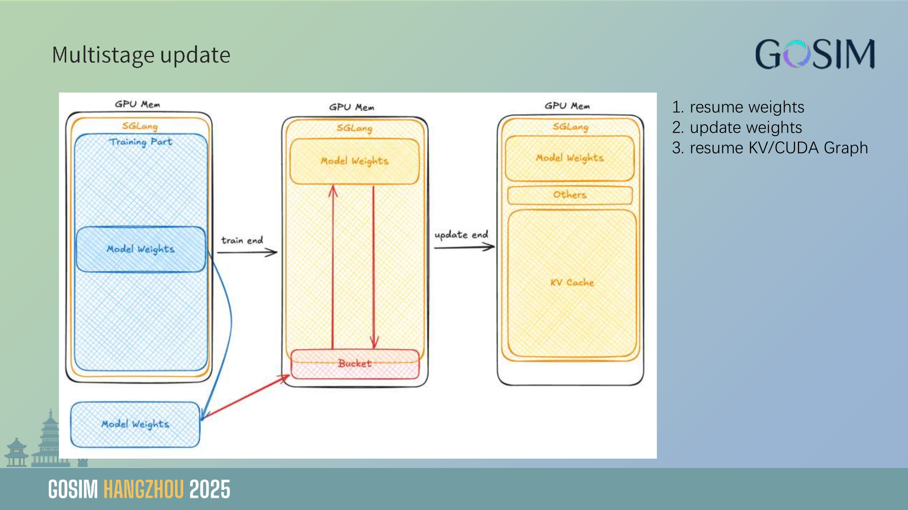

Multistage update 페이지는 앞의 메모리와 파라미터 update를 하나의 시퀀스로 엮는다. 왼쪽 그림은 학습 단계가 끝나기 직전이다. 같은 GPU memory 안에서 바깥쪽은 여전히 SGLang의 관리 경계지만 대부분 공간은 `Training Part`가 차지하고, 학습 쪽 `Model Weights`는 파란 영역에 있다. `train end` 뒤에는 중간 상태로 들어간다. SGLang은 먼저 `Model Weights`만 resume하고, 아래에는 파라미터 update buffer인 빨간 `Bucket`을 남긴다. 빨간 화살표는 bucket data가 model weights에 쓰이는 것을 뜻하고, 파란 화살표는 학습 쪽/CPU 쪽 weight가 bucket으로 들어오는 것을 뜻한다.

오른쪽 그림은 `update end` 이후의 완전한 추론 상태다. GPU memory 안에 `Model Weights`, `Others`, `KV Cache`가 복원되어 있다. 오른쪽 목록의 세 단계가 정확히 이 세 그림과 대응된다. 1. resume weights. 2. update weights. 3. resume KV/CUDA Graph. 순서를 바꾸면 두 문제가 생긴다. 먼저 KV/CUDA Graph를 resume하면 요청이 반쯤 update된 weight를 볼 수 있다. weights를 먼저 resume하지 않으면 파라미터 update의 안정적인 GPU landing point가 없다. 코드의 tag grouping과 barrier도 이 순서를 중심으로 설계되어 있다.

#### Slide 21: 정리: 추론 엔진이 학습 시스템의 일부가 된다

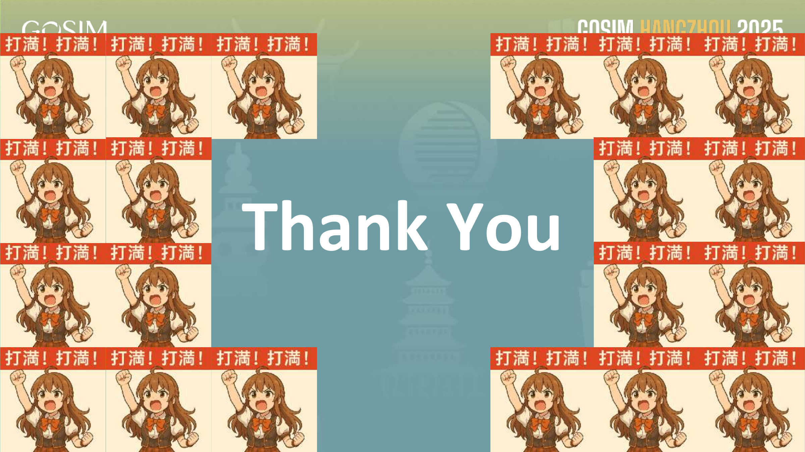

이 발표는 마지막에 추상 수준으로 올라간다. SGLang은 더 이상 단순한 서비스 프로세스가 아니라, 학습 시스템이 제어할 수 있는 GPU resident runtime이다. 메모리, graph, weight sync가 모두 protocol로 노출되어야 RL 시스템이 진짜 training-inference integration을 할 수 있다.

## 0x3. 핵심 코드 해설

첫 부분은 hook을 본다. `torch_memory_saver/csrc/entrypoint.cpp`에서 스레드가 interesting region 안에 있을 때만 allocation을 접수한다.

```cpp
#ifdef TMS_HOOK_MODE_PRELOAD
cudaError_t cudaMalloc(void **ptr, size_t size) {
    if (thread_local_config.is_interesting_region()) {
        return TorchMemorySaver::instance().malloc(
            ptr, CUDAUtils::cu_ctx_get_device(), size,
            thread_local_config.current_tag_,
            thread_local_config.enable_cpu_backup());
    } else {
        return APIForwarder::call_real_cuda_malloc(ptr, size);
    }
}

cudaError_t cudaFree(void *ptr) {
    return TorchMemorySaver::instance().free(ptr);
}
#endif
```

`current_tag_`는 뒤에서 weights/KV/CUDA Graph를 그룹별로 release하는 근거다. 설계가 절제되어 있다. region 밖의 일반 CUDA allocation은 여전히 실제 `cudaMalloc`에 맡겨, 전 프로세스 allocator 행동을 다 바꾸지 않는다.

진짜 핵심은 `core.cpp`에 있다. allocation 때는 먼저 address를 reserve하고, 그다음 physical memory를 map한다.

```cpp
CURESULT_CHECK(cuMemAddressReserve((CUdeviceptr *) ptr, size, 0, 0, 0));
CURESULT_CHECK(cuMemMap((CUdeviceptr) * ptr, size, 0, allocHandle, 0));
CUDAUtils::cu_mem_set_access(*ptr, size, device);

allocation_metadata_.emplace(
    *ptr,
    AllocationMetadata{size, device, tag,
        AllocationState::ACTIVE, enable_cpu_backup, nullptr, allocHandle}
);
```

pause는 unmap/release만 하고 address는 free하지 않는다.

```cpp
if (metadata.enable_cpu_backup) {
    cudaMallocHost(&metadata.cpu_backup, metadata.size);
    cudaMemcpy(metadata.cpu_backup, ptr, metadata.size, cudaMemcpyDeviceToHost);
}

CURESULT_CHECK(cuMemUnmap((CUdeviceptr) ptr, metadata.size));
CURESULT_CHECK(cuMemRelease(metadata.allocHandle));
metadata.state = AllocationState::PAUSED;
```

resume은 같은 `ptr`에 다시 map한다.

```cpp
CUmemGenericAllocationHandle newAllocHandle;
CUDA_ERROR_CHECK(CUDAUtils::cu_mem_create(&newAllocHandle, metadata.size, metadata.device));

CURESULT_CHECK(cuMemMap((CUdeviceptr) ptr, metadata.size, 0, newAllocHandle, 0));
CUDAUtils::cu_mem_set_access(ptr, metadata.size, metadata.device);

if (metadata.enable_cpu_backup) {
    cudaMemcpy(ptr, metadata.cpu_backup, metadata.size, cudaMemcpyHostToDevice);
    cudaFreeHost(metadata.cpu_backup);
    metadata.cpu_backup = nullptr;
}
metadata.state = AllocationState::ACTIVE;
metadata.allocHandle = newAllocHandle;
```

이것이 slide에서 왜 계속 virtual address를 강조하는지 설명한다. 실제로 release되는 것은 physical allocation handle이지 pointer가 아니다.

SGLang 쪽은 이 능력을 서비스 인터페이스로 감싼다. `release_memory_occupation`에서는 세 tag의 처리 순서를 볼 수 있다.

```python
if GPU_MEMORY_TYPE_KV_CACHE in tags:
    self.memory_saver_adapter.pause(GPU_MEMORY_TYPE_KV_CACHE)
    self.flush_cache()

if GPU_MEMORY_TYPE_WEIGHTS in tags:
    self.stashed_model_static_state = _export_static_state(
        self.tp_worker.model_runner.model
    )
    torch.distributed.barrier(self.tp_cpu_group)
    self.memory_saver_adapter.pause(GPU_MEMORY_TYPE_WEIGHTS)

if GPU_MEMORY_TYPE_CUDA_GRAPH in tags:
    self.memory_saver_adapter.pause(GPU_MEMORY_TYPE_CUDA_GRAPH)
```

복원 때는 CUDA Graph, weights, KV cache가 차례대로 돌아온다.

```python
if GPU_MEMORY_TYPE_CUDA_GRAPH in tags:
    self.memory_saver_adapter.resume(GPU_MEMORY_TYPE_CUDA_GRAPH)

if GPU_MEMORY_TYPE_WEIGHTS in tags:
    self.memory_saver_adapter.resume(GPU_MEMORY_TYPE_WEIGHTS)
    torch.distributed.barrier(self.tp_cpu_group)
    _import_static_state(
        self.tp_worker.model_runner.model,
        self.stashed_model_static_state,
    )

if GPU_MEMORY_TYPE_KV_CACHE in tags:
    self.memory_saver_adapter.resume(GPU_MEMORY_TYPE_KV_CACHE)
```

마지막으로 파라미터 update를 본다. 일반 경로는 tensor마다 broadcast를 한 번씩 하고, bucket 경로는 먼저 연속 buffer를 만든다.

```python
if load_format == "flattened_bucket":
    return self._update_bucketed_weights_from_distributed(
        names, dtypes, shapes, group_name
    )

weights = []
handles = []
for name, dtype, shape in zip(names, dtypes, shapes):
    weight = torch.empty(shape, dtype=target_dtype, device=self.device)
    handles.append(torch.distributed.broadcast(
        weight, src=0, group=self._model_update_group[group_name], async_op=True
    ))
    weights.append((name, weight))
for handle in handles:
    handle.wait()
self.model.load_weights(weights)
```

```python
named_tensors = []
for name, dtype, shape in zip(names, dtypes, shapes):
    named_tensors.append((name, torch.empty(shape, dtype=target_dtype, device=self.device)))
bucket = FlattenedTensorBucket(named_tensors=named_tensors)
flattened_tensor = bucket.get_flattened_tensor()
torch.distributed.broadcast(flattened_tensor, src=0, group=self._model_update_group[group_name])
reconstructed_tensors = bucket.reconstruct_tensors()
self.model.load_weights(reconstructed_tensors)
```

MoE 장면에서 bucket 최적화는 총 바이트 수를 줄이기 위한 것이 아니라 Python/HTTP/collective scheduling 횟수를 줄이기 위한 것이다. 이것이 slide에서 약 2000회 API call이 약 120회로 줄어든 이유다.

## 0x4. 소결

이 글은 "학습 시스템이 추론 runtime을 어떻게 제어하는가"에 가까운 사례다. 메모리 release는 cache를 비우는 일이 아니라 VA와 physical memory를 분리하는 일이다. weight update는 단순 reload가 아니라 프로세스와 TP rank를 가로지르는 온라인 동기화다. 이 두 층을 이해해야 SGLang이 RL colocate에서 왜 돌아갈 수 있는지 보인다.
