# NVIDIA 기술 살롱 《강화학습 파이프라인 최적화：성능 분석과 Rollout 가속》 강연 노트

> Slides는 BiliBili NVIDIA 영어 채널에 업로드된 NVIDIA 전문가 대면 기술 살롱 《강화학습 파이프라인 최적화：성능 분석과 Rollout 가속》 영상 강연에서 가져왔다. 여기서는 영상을 참고하여 Slides의 요점을 더 상세히 기록하였으며, 학습 용도로 활용한다. 이 강연은 강화학습(RL) 파이프라인 최적화의 핵심 전략과 실천을 체계적으로 정리한다. 먼저 Nsight Systems를 사용하여 RL 프레임워크의 성능 Profile을 분석하는 것의 중요성을 강조하며, 구체적으로 Ray Actor에 Nsight 파라미터를 추가하는 방법과 RL 프레임워크에서 얻은 Nsight Profile 파일을 해석하는 방법을 다룬다. 다음으로 Slides는 훈련/생성 파라미터 최적화의 상세 기법을 제공하는데, 이는 두 가지 주요 측면으로 세분화된다: Actor 훈련 최적화(dynamic batching과 sequence packing 활성화 권장, offload·recompute·fused kernel의 전략적 사용 포함)와 Rollout 최적화(gpu_memory_utilization 향상, CUDA Graph 활용, Rollout 단계의 긴 꼬리 문제 해결에 초점). 마지막으로 Qwen 2.5 7B 모델을 예시로 RL 파라미터 조정의 실천 경험을 정리하고, Qwen3 235B MoE 모델의 SOTA 설정도 언급하며 실제 응용에서의 성능 최적화에 대한 포괄적인 지침을 제공한다.

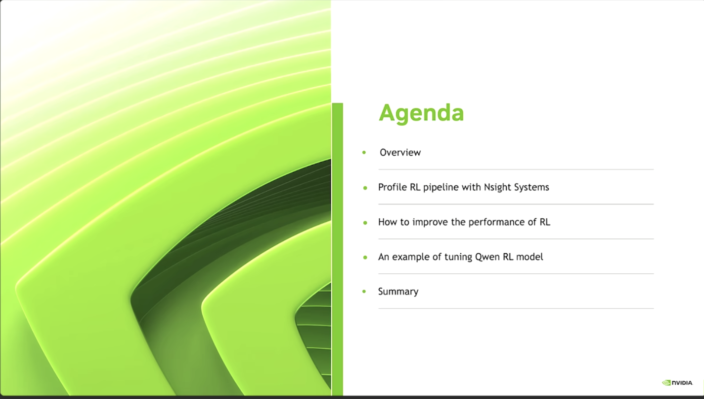

이 강연은 다섯 가지 핵심 주제를 다룬다: 먼저 강화학습 시스템에 대한 전체적인 개요, 이어서 NVIDIA Nsight Systems 도구로 강화학습 파이프라인의 성능을 분석하는 방법, 그다음으로 강화학습 성능을 높이는 구체적인 방법과 기법, Qwen 강화학습 모델 조정 사례를 통한 실제 응용 시연, 마지막으로 전체 내용의 요약이다.

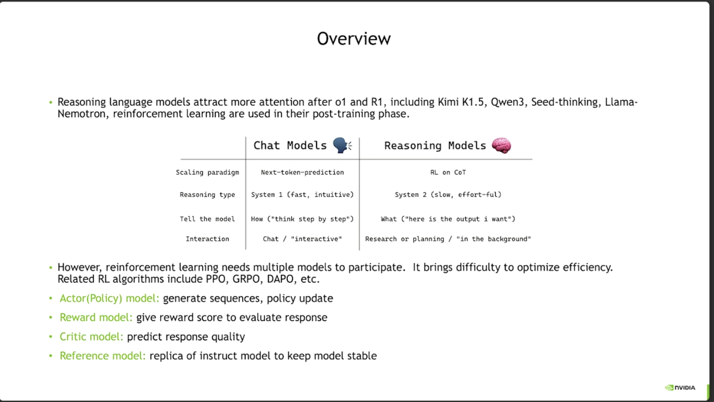

이 Slides는 Reasoning 언어 모델(Kimi K1.5, Qwen3, Seed-thinking, Llama-Nemotron 등)의 발전 현황을 다루며, Chat 모델과의 근본적인 차이와 강화학습이 모델 post-training 단계에서 담당하는 핵심 역할을 중점적으로 분석한다. Slides는 비교 표를 통해 두 모델 유형이 네 가지 핵심 차원에서 다름을 상세히 설명한다: 확장 패러다임(Chat 모델은 "다음 token 예측", Reasoning 모델은 "사고 사슬 위의 강화학습"), Reasoning 유형(Chat 모델은 "시스템 1의 빠른 직관적 추론", Reasoning 모델은 "시스템 2의 느린 노력 추론"), 지시 방식(Chat 모델은 "어떻게 하는가"라는 과정 중심 지도, Reasoning 모델은 "무엇을 하는가"라는 결과 지향), 그리고 상호작용 방식(Chat 모델은 "채팅/상호작용성", Reasoning 모델은 "연구 또는 계획/백그라운드 실행"). Slides 하단에는 강화학습 시스템의 복잡성을 보여주며, 여러 모델이 협력해야 한다고 지적한다(시퀀스 생성과 Policy 업데이트를 담당하는 Actor 모델, 응답 품질을 평가하는 Reward 모델, 응답 품질을 예측하는 Critic 모델, 모델 안정성을 유지하는 Reference 모델 포함). 이 다중 컴포넌트 아키텍처는 효율성 최적화에 도전 과제를 제시하며, 강화학습에는 PPO, GRPO, DAPO 등 다양한 알고리즘이 존재한다.

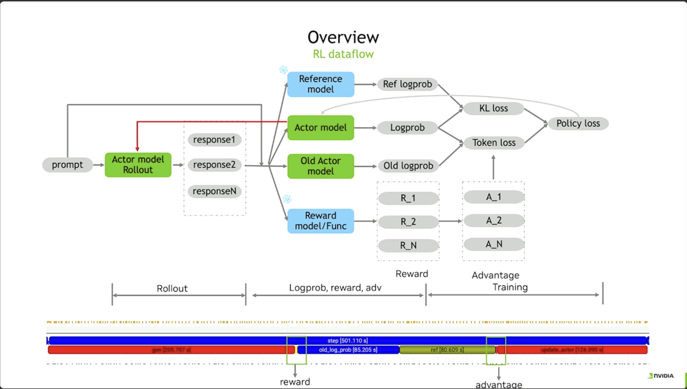

이 Slides는 GRPO 기반 Single Controller 강화학습 훈련 파이프라인의 완전한 데이터 흐름 아키텍처와 성능 분석을 보여준다. 전체 시스템은 세 가지 핵심 단계로 나뉜다: 첫째 Rollout 단계로 prompt에서 시작하여 Actor 모델을 통해 여러 response 시퀀스를 생성하며, 이는 데이터 수집과 경험 생성의 핵심 고리이다; 둘째 평가 및 손실 계산 단계로 여러 모델의 협력을 수반하는데, Reference 모델이 KL divergence 제약을 위한 Ref logprob을 계산하고, Actor 모델이 현재 정책의 Logprob을 계산하며, Old Actor 모델이 중요도 샘플링을 위한 구 정책 Old logprob을 계산하고, Reward 모델이 응답 품질을 평가하여 보상 값 R_N을 생성하며, 이들 출력을 바탕으로 KL loss, Token loss, Advantage 값을 계산하여 최종적으로 Policy loss를 구성한다; 셋째 훈련 단계로 Policy loss가 역전파되어 Actor 모델 파라미터를 업데이트하고, 업데이트된 Actor 모델이 새로운 Rollout에 참여한다.

Nsight System 성능 타임라인 분석에서 전체 훈련 반복의 총 소요 시간은 약 501.110초이며, Rollout 생성 단계가 205.707초, 훈련 단계는 old_log_prob 계산(85.205초), reference 모델 계산(80.609초), reward 및 advantage 계산, update_actor 파라미터 업데이트(126.090초)로 구성되어 RL 시스템의 성능 병목과 최적화 방향을 이해하는 양적 기술 근거를 제공한다.

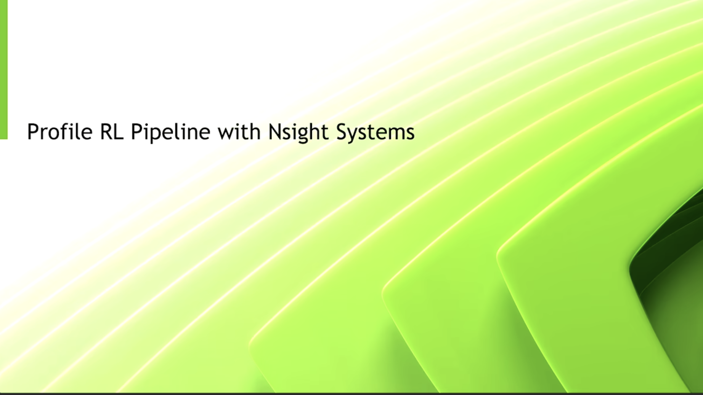

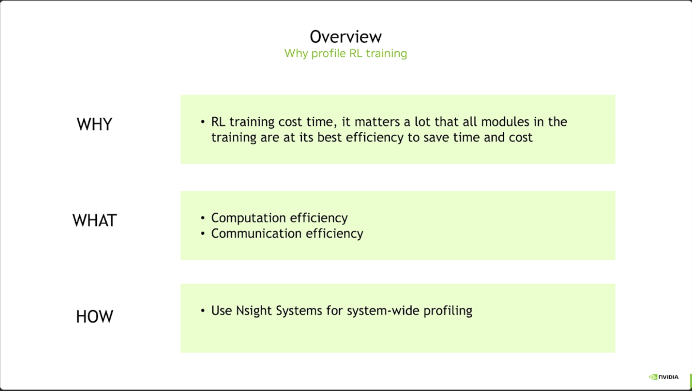

RL 훈련은 시간이 많이 걸리며 전체 파이프라인 안에 여러 모듈이 있으므로, 각 모듈의 계산과 통신 지연에 주목해야 한다. Nsight Systems를 사용하여 시스템 수준의 profiling을 수행할 수 있다.

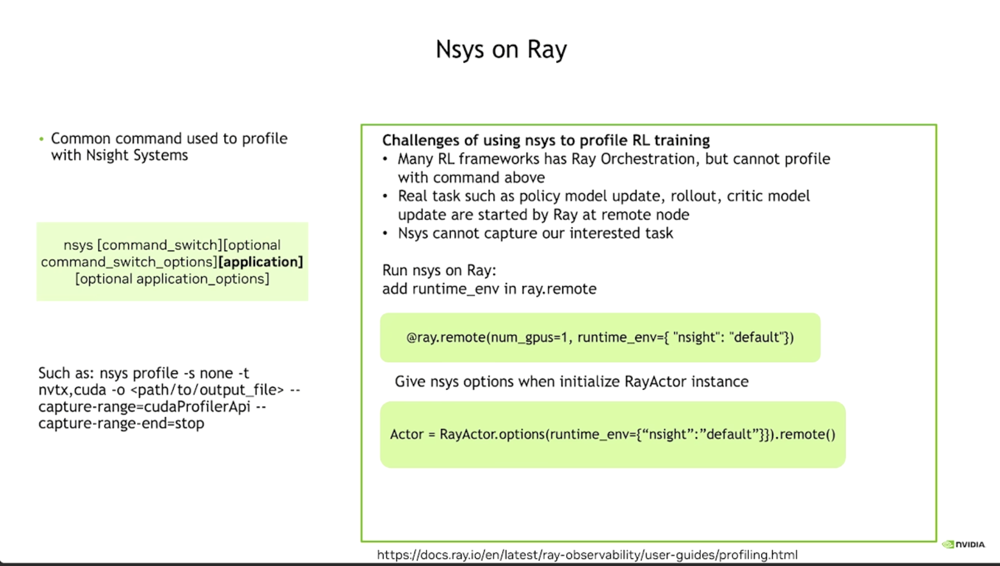

Slides는 먼저 nsys의 일반 명령 구조 `nsys [command_switch][optional command_switch_options][application][optional application_options]`를 소개하고, 구체적인 예시를 통해 `nsys profile` 명령을 사용하여 CUDA API 및 NVTX 이벤트의 성능 데이터를 수집하는 방법을 보여준다. 예를 들어 Megatron-LM에서 이 명령을 직접 사용하여 profile을 수행할 수 있다.

그런데 RL 훈련에서 nsys를 사용하는 데 문제가 있다: RL 프레임워크가 Ray를 사용하여 태스크를 편성하기 때문에, 기존 nsys 명령은 분산 태스크(Policy 모델 업데이트, Rollout 데이터 수집, Critic 모델 업데이트 등)를 직접 profile할 수 없다. 이 태스크들은 Ray가 원격 노드에서 시작하여 실행하기 때문이다. 이 문제를 해결하기 위해 Slides는 두 가지 통합 방안을 제시한다: 하나는 `ray.remote` 데코레이터의 `runtime_env`에 `"nsight": "default"`를 지정하는 것이고, 다른 하나는 `RayActor` 인스턴스를 초기화할 때 `RayActor.options(runtime_env={"nsight":"default"}}).remote()`로 설정하는 것이다. 이 방법들을 통해 nsys가 Ray의 분산 worker에서 실행될 수 있어 RL 훈련의 분산 태스크 성능 데이터를 효과적으로 캡처한다. VerL에서는 두 번째 방식을 사용할 수 있으며, 가장 아래 링크에 두 방식의 설명 문서가 있다.

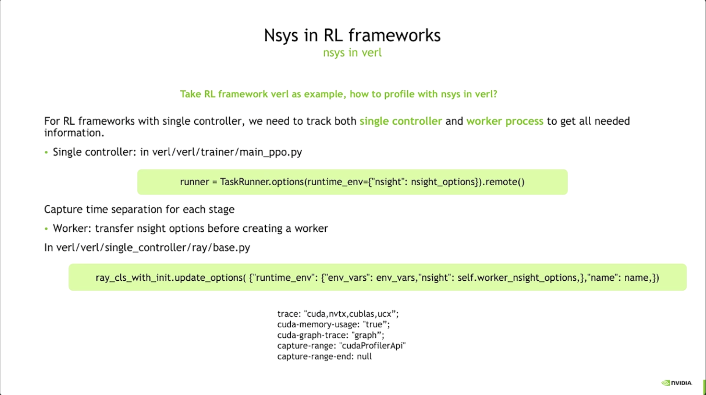

이 페이지는 Ray 기반 강화학습 프레임워크(`verl` 예시)에서 NVIDIA Nsight Systems(nsys)를 통합하여 Profile을 수행하는 방법을 보여준다. Single Controller 아키텍처에서는 완전한 성능 정보를 얻기 위해 Controller 프로세스와 worker를 동시에 추적해야 한다. Slides는 두 가지 구체적인 통합 방법을 제공한다: 하나는 Single Controller 프로세스 profile로, `verl/verl/trainer/main_ppo.py` 파일에서 `TaskRunner.options(runtime_env={"nsight": nsight_options}).remote()`를 사용하여 nsight 설정을 `TaskRunner`의 런타임 환경에 주입하는 것이고; 다른 하나는 worker profile로, `verl/verl/single_controller/ray/base.py` 파일에서 `ray_cls_with_init.update_options({"runtime_env": {"env_vars": env_vars, "nsight": self.worker_nsight_options,},"name": name,})`를 통해 Ray 클래스의 런타임 환경을 업데이트하여 worker별 nsight 옵션과 환경 변수를 전달하는 것이다. Slides는 또한 `nsight_options`의 설정 파라미터를 상세히 나열하는데, CUDA API, NVTX 이벤트, cuBLAS 및 UCX 라이브러리 활동 추적, CUDA 메모리 사용량 및 CUDA 그래프 추적 활성화, CUDA Profiler API로 제어하는 캡처 범위 설정이 포함되어 있어 verl에서 세밀한 성능 분석을 구현하기 위한 참고 자료를 제공한다.

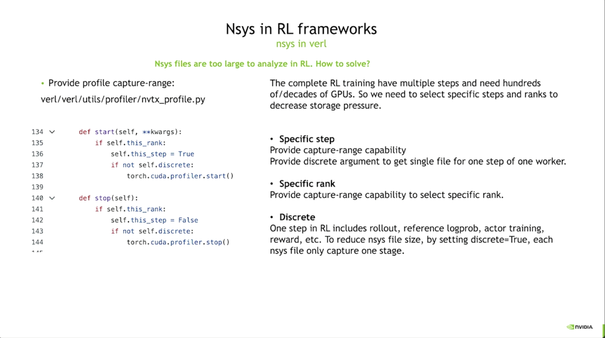

VerL에서 Nsight Systems를 사용하여 Profile할 때의 주요 문제는, RL 훈련이 보통 여러 단계와 수백 또는 수십 개의 GPU를 포함하기 때문에 생성되는 nsys 성능 파일이 매우 커져 분석하기 어렵다는 점이다. 이 문제를 해결하기 위해 Slides는 profile 범위를 세밀하게 제어하여 저장 부담을 줄이는 전략을 제시한다. 구체적으로는: Profile 캡처 범위(Profile Capture-Range) 능력을 제공하여, `verl/verl/utils/profiler/nvtx_profile.py` 파일의 `start`와 `stop` 함수를 수정함으로써 `torch.cuda.profiler.start()`와 `torch.cuda.profiler.stop()`의 조건부 호출을 구현한다; 특정 단계(Specific Step) profile로, 캡처 범위 능력과 `discrete` 파라미터를 통해 개별 worker의 특정 훈련 단계에 대해 독립적인 nsys 파일을 생성한다; 특정 rank(Specific Rank) profile로, 특정 GPU 또는 worker를 선택적으로 profile한다; 그리고 이산화(Discrete) profile로, `discrete=True`를 설정하여 각 nsys 파일이 전체 복잡한 RL 단계가 아닌 하나의 독립적인 하위 단계(Rollout, reference 모델 log_prob 계산, Actor 모델 훈련, 보상 계산 등)만 캡처하도록 하여 더 세밀한 성능 분석과 더 작은 파일 크기를 실현한다. 이로써 분산 RL 훈련에서 nsys 도구를 이용한 효율적이고 선택적인 성능 profile을 위한 완전한 기술 방안을 제공한다.

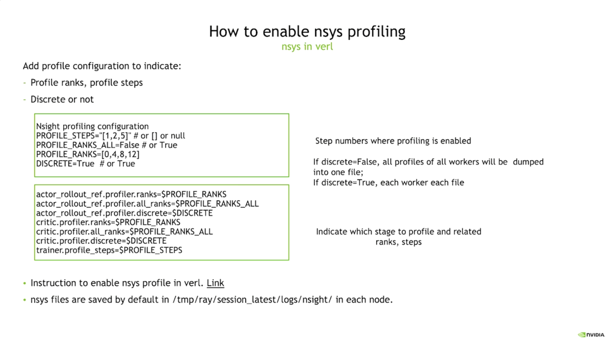

이 Slides의 내용을 요약하면 다음과 같다:

이 Slides는 `verl` 환경에서 NVIDIA Nsight Systems(nsys)를 설정하여 성능 Profile을 수행하는 방법을 설명하며, 핵심은 세밀한 파라미터 제어를 통해 profile의 범위와 세밀도를 조정하는 것이다. 먼저 profile할 "rank"(ranks)와 "단계"(steps)를 설정하고, "이산화"(discrete) profile 모드 사용 여부를 결정해야 한다고 지적한다. 구체적인 Nsight profile 설정은 다음과 같다: `PROFILE_STEPS`는 profile할 훈련 단계를 지정하는 데 사용되고(예: `"[1,2,5]"`), `PROFILE_RANKS_ALL`은 부울 값으로 모든 worker rank를 profile할지 제어하며, `PROFILE_RANKS`는 profile할 특정 rank를 지정할 수 있다(예: `[0,4,8,12]`). `DISCRETE` 파라미터(`True` 또는 `False`로 설정 가능)는 profile 파일 생성 방식을 결정한다: `DISCRETE=False`이면 모든 worker의 profile 데이터가 하나의 파일로 통합되고, `DISCRETE=True`이면 각 worker가 독립적인 profile 파일을 생성하여 분산 환경에서 더 세밀한 분석을 가능하게 한다. 이 설정 파라미터들은 강화학습 파이프라인의 다양한 컴포넌트, 예를 들어 `actor_rollout_ref.profiler`, `critic.profiler`, `trainer`에 적용되며, 각각의 `ranks`, `all_ranks`, `discrete`, `profile_steps` 속성을 설정하여 각 단계의 profile 동작을 정밀하게 제어한다. 아울러 Slides는 nsys profile을 활성화하는 명령 링크를 제공하고, nsys가 생성하는 profile 파일은 기본적으로 각 노드의 `/tmp/ray/session_latest/logs/nsight/` 경로에 저장됨을 명확히 밝혀 개발자들에게 완전한 설정 및 파일 검색 가이드를 제공한다.

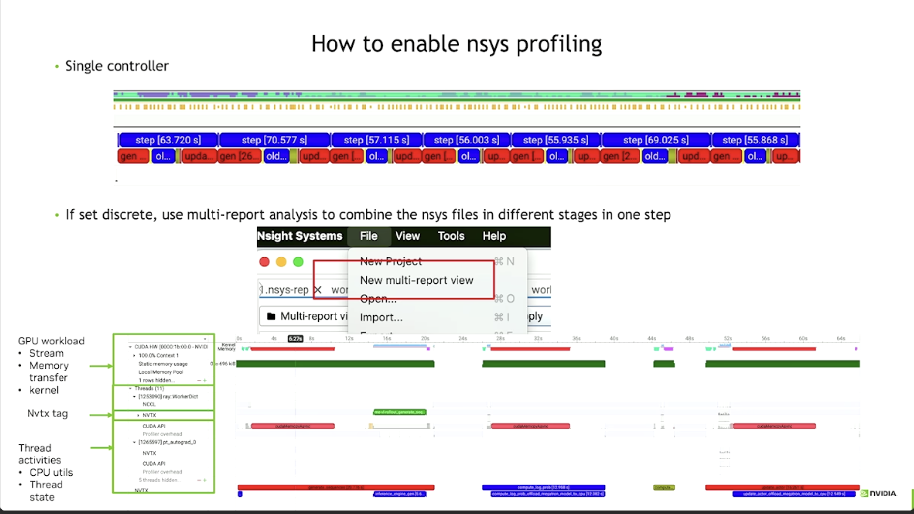

이 Slides는 앞에서 설정한 대로 VerL에서 Nsight Systems로 Profile한 결과를 시각화하여 보여주며, 전체 프로세스에서 가장 시간이 많이 소요되는 부분을 명확히 확인할 수 있다. 또한 `discrete=True`로 설정한 경우, Nsight System File 아래의 New multi-report view를 사용하여 각 단계의 profile 파일을 하나의 완전한 Step으로 결합해야 한다.

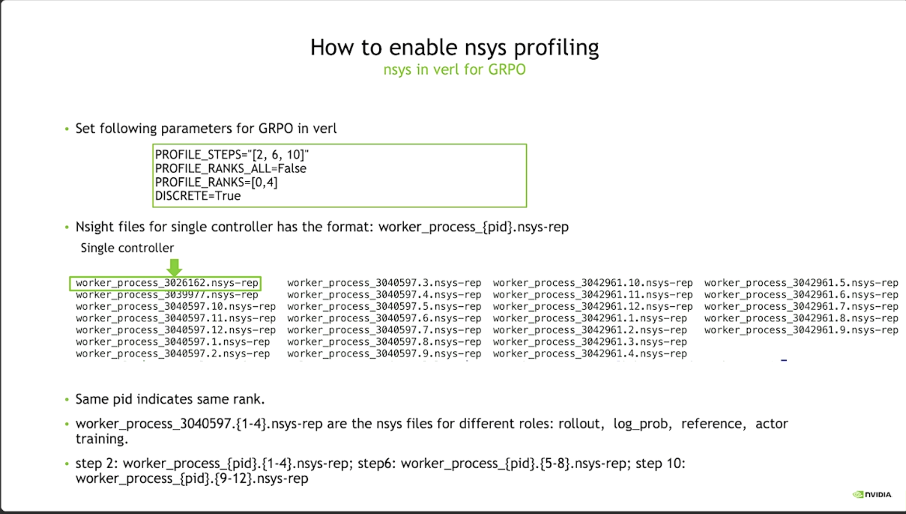

이 슬라이드 내용을 요약하면 다음과 같다:

이 페이지는 VerL에서 생성되는 nsys profile 파일의 명명 규칙을 보여준다. 먼저 `PROFILE_STEPS`(예: `"[2, 6, 10]"`)를 설정하여 profile할 step을 지정하고, `PROFILE_RANKS_ALL=False`와 `PROFILE_RANKS=[0,4]`로 특정 worker rank를 선택적으로 profile하며, `DISCRETE=True`를 설정하여 이산화 profile 모드를 활성화한다. `DISCRETE=True`인 경우, nsys는 각 worker의 각 특정 훈련 단계에 대해 독립적인 성능 파일을 생성하며, 파일 이름 형식은 `worker_process_{pid}.nsys-rep`이다. Slides는 파일 이름의 `pid`(프로세스 ID)가 특정 rank에 대응하며, `{1-4}` 숫자 접미사는 특정 `step 2` 내에서 서로 다른 역할(`rollout`, `log_prob`, `reference`, `actor training`)에 대해 생성된 독립 profile 파일을 나타낸다고 설명한다. 이로써 강화학습 파이프라인의 각 세부 단계와 역할에 대한 세밀한 성능 추적을 실현하여 분산 RL 훈련의 성능 분석 및 최적화를 위한 체계적인 파일 관리 방안을 제공한다.

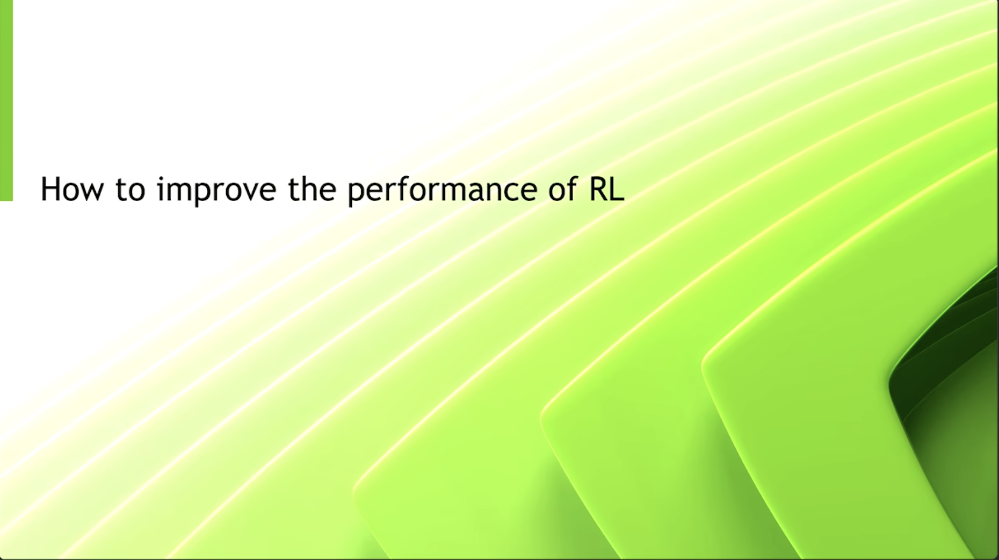

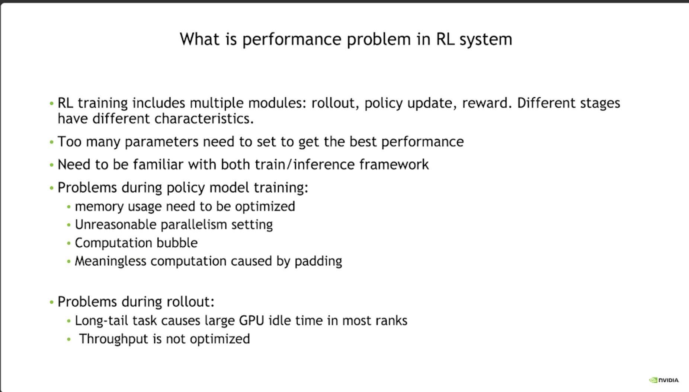

이 페이지는 RL 훈련 과정이 복잡하며 Rollout, 정책 업데이트, 보상 계산 등 여러 모듈을 포함하고 각 단계의 특성이 매우 다름을 지적한다. 공통적인 도전 과제로는 최적의 성능을 달성하기 위해 대량의 파라미터를 조정해야 하며, 개발자가 훈련과 추론 프레임워크 모두에 익숙해야 한다는 점이 있다. Policy 모델 훈련 단계에서는 메모리 사용 효율 저하, 비합리적인 병렬 설정, 계산 버블(GPU 유휴 시간), 데이터 패딩으로 인한 무의미한 계산이 구체적인 문제로 나타난다.

Rollout 단계에서는 긴 꼬리 태스크로 인해 대부분의 GPU 노드에서 많은 유휴 시간이 발생하고 전체 처리량이 충분히 최적화되지 않는 것이 주요 병목이다. 이 문제들이 함께 RL 시스템 성능 최적화의 핵심 도전 과제를 구성한다.

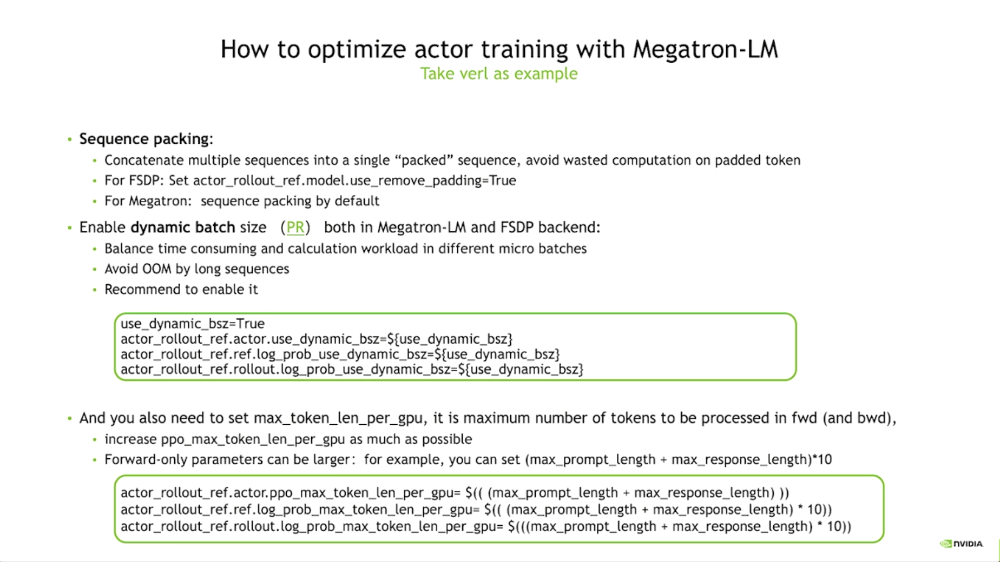

이 Slides는 VerL Megatron-LM Backend에서 Actor 모델 훈련을 최적화하는 전략을 설명한다. 핵심 최적화 항목은 다음과 같다: 먼저 **시퀀스 패킹(Sequence packing)**으로, 여러 짧은 시퀀스를 하나의 "패킹된" 시퀀스로 이어 붙여 패딩(padding)으로 인한 계산 자원 낭비를 효과적으로 방지한다; FSDP 백엔드에서는 `actor_rollout_ref.model.use_remove_padding=True`를 설정해야 하며, Megatron에서는 시퀀스 패킹이 기본 동작이다.

두 번째는 **동적 배치 크기(Dynamic batch size) 활성화**로, 서로 다른 마이크로 배치 간의 계산 부하와 시간 소비를 균형 있게 조절하는 데 도움이 되며, 동적으로 배치 크기를 조정하여 긴 시퀀스로 인한 메모리 부족(OOM)을 방지한다. 강력히 활성화를 권장하며, 설정 시 `use_dynamic_bsz`를 `True`로 설정하고 `actor_rollout_ref.actor`, `actor_rollout_ref.ref.log_prob`, `actor_rollout_ref.rollout.log_prob` 등 컴포넌트에 적용한다.

마지막으로 **`max_token_len_per_gpu`** 파라미터를 합리적으로 설정해야 한다. 이 파라미터는 각 GPU가 순전파와 역전파에서 처리하는 최대 token 수를 정의한다. `ppo_max_token_len_per_gpu`는 가능한 한 크게 설정하되, 순전파 전용 파라미터는 더 크게 설정할 수 있다(예: `(max_prompt_length + max_response_length) * 10`). 추론의 메모리 점유가 적기 때문이다. 구체적인 설정 예시는 Actor, Reference 모델의 log-prob 계산 및 Rollout 단계의 log-prob 계산에 대한 token 길이 제한 설정 방법을 보여준다.

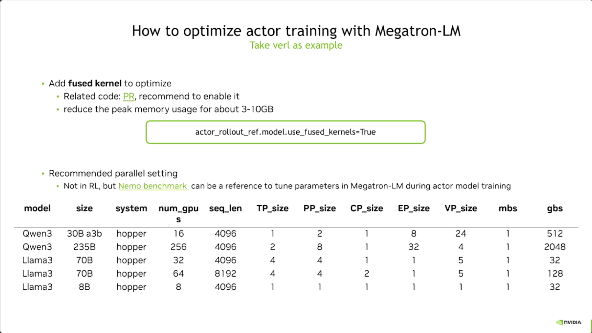

이 Slides는 Megatron-LM 프레임워크에서 Actor 모델 훈련을 최적화하는 **fuse kernel 추가** 전략을 설명한다. `actor_rollout_ref.model.use_fused_kernels=True`를 설정하면 피크 메모리 사용량을 약 3~10GB 줄일 수 있다. 이 fuse kernel은 cross-entropy와 관련된 최적화이다.

다음으로 Slides는 **권장 병렬 설정**을 제공하며, Nemo Benchmark가 Actor 모델 훈련 중 Megatron-LM 파라미터를 조정하는 참고 자료로 활용될 수 있다고 지적한다. 이어서 상세한 표가 다양한 모델(Qwen3, Llama3 등)과 규모(30B, 235B, 70B, 8B 등)에 대해 `hopper` 시스템에서의 구체적인 병렬 설정을 보여준다. 여기에는 GPU 수(`num_gpus`), 시퀀스 길이(`seq_len`), 그리고 다양한 병렬 전략의 크기가 포함된다: tensor parallel(`TP_size`), pipeline parallel(`PP_size`), context parallel(`CP_size`), expert parallel(`EP_size`), virtual pipeline parallel(`VP_size`), 그리고 마이크로 배치 크기(`mbs`)와 전역 배치 크기(`gbs`). 예를 들어 Qwen3 235B 모델은 256개 GPU에서 `TP_size=2`, `PP_size=8`, `EP_size=32`, `VP_size=4` 설정으로 2048의 전역 배치 크기를 달성한다.

이 기본 병렬 설정을 토대로 NVIDIA가 Megatron-LM에서 제공하는 메모리 계산기를 사용하여 병렬 설정을 추가로 판단하고 조정할 수 있다.

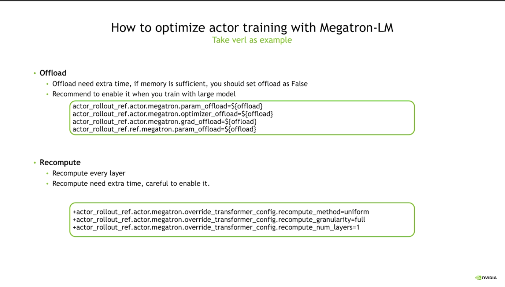

또한 두 가지 최적화 전략이 있다:

첫 번째는 **Offload(오프로드)**로, 모델 파라미터, 옵티마이저 상태, 그래디언트를 GPU 메모리에서 CPU 메모리로 오프로드하여 GPU 메모리를 절약할 수 있다. 대형 모델을 훈련하고 자원이 제한적인 경우 활성화를 권장하며, 이 최적화는 추가적인 훈련 시간을 증가시킨다. GPU 메모리가 충분하다면 `offload`를 `False`로 설정해야 한다.

두 번째는 **Recompute(재계산)**로, 역전파 시 순전파의 일부 중간 활성화 값을 재계산하여 메모리 점유를 줄이는 기술이다. 마찬가지로 추가적인 계산 시간이 발생하므로 신중하게 활성화해야 한다.

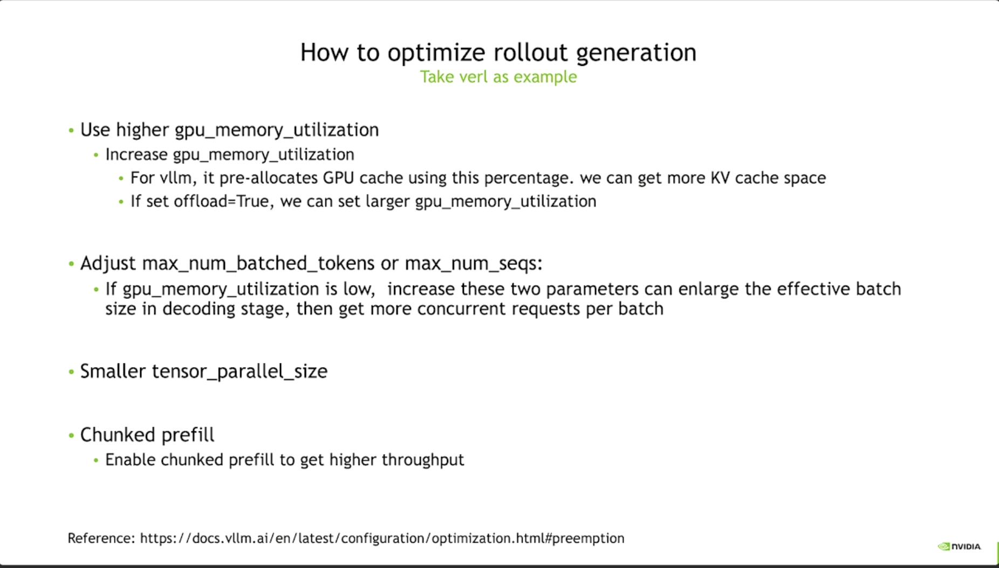

이 Slides는 Rollout 성능을 향상시키는 최적화 전략을 제시한다.

- 첫 번째는 **`gpu_memory_utilization` 높이기**로, GPU 메모리 이용률을 높이면 `vllm` 같은 프레임워크에서 더 많은 GPU 캐시를 사전 할당하여 더 큰 KV 캐시 공간을 확보할 수 있다; `offload=True`를 활성화한 경우 `gpu_memory_utilization`을 더 높게 설정할 수 있다.

- 두 번째는 **`max_num_batched_tokens` 또는 `max_num_seqs` 조정**으로, GPU 메모리 이용률이 낮을 때 이 두 파라미터를 늘리면 decode 단계의 유효 배치 크기를 효과적으로 확장하여 배치당 더 많은 동시 요청을 처리할 수 있다.

- 세 번째는 **더 작은 `tensor_parallel_size` 사용**으로, 이는 통신 오버헤드를 줄이거나 특정 시나리오에서의 계산 효율을 최적화하는 데 도움이 된다.

- 마지막은 **청크 prefill(Chunked prefill) 활성화**로, 이를 통해 Rollout 생성의 전체 처리량을 크게 높일 수 있다.

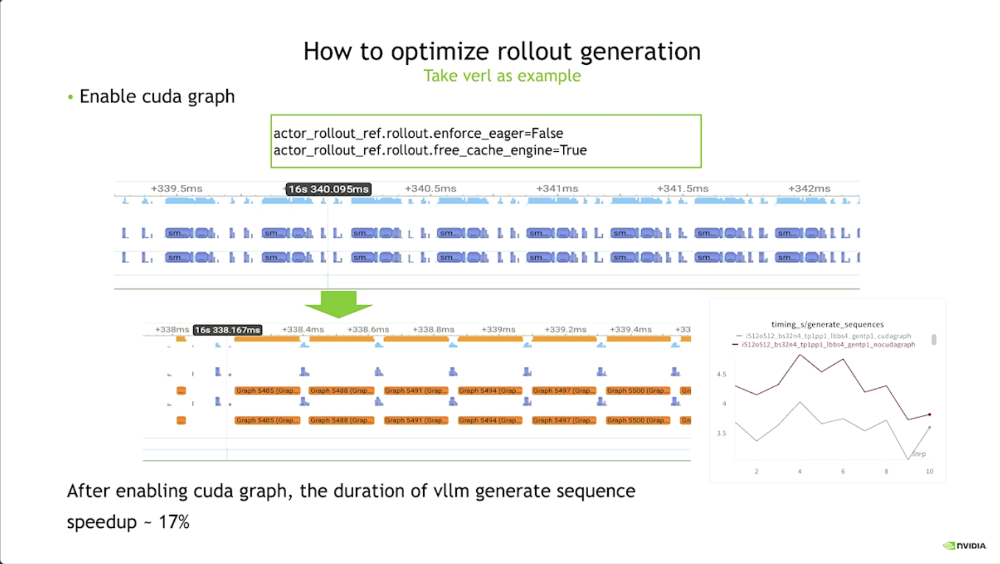

또한 CUDA graph 지원을 활성화해야 한다. VerL에서는 vLLM에 대해 기본적으로 CUDA graph가 활성화되어 있지 않으며, SGLang에서는 기본적으로 활성화되어 있다.

Slides에서 보여주는 것은 qwen2-7b에서 response length 512로 수행한 테스트이다. 위 그림은 CUDA graph를 활성화하지 않았을 때의 결과로, kernel 사이의 공백이 매우 크다. generate_sequence 단계에서 end-to-end로 17% 가속을 달성한다. 오른쪽 하단 그림은 qwen3-30b에서 2048의 prompt length, 8192의 response length로 CUDA graph를 활성화하면 1배 가속이 이루어짐을 보여준다.

CUDA graph를 활성화할 때 OOM 문제가 발생할 수 있으며, CUDA graph capture size를 조정하여 메모리 점유를 낮출 수 있다.

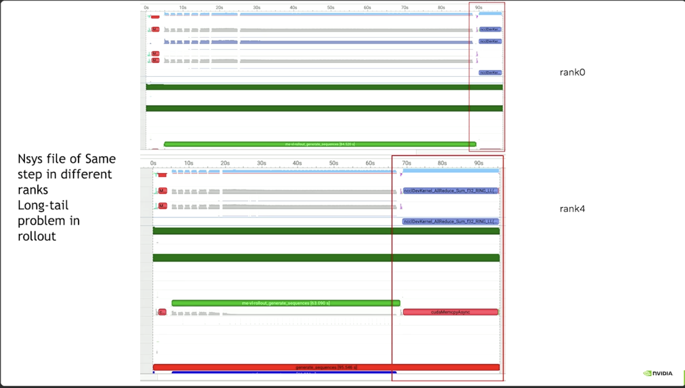

이 실험은 강화학습 Rollout 단계의 긴 꼬리 효과 문제를 보여주며, 같은 훈련 단계에서 서로 다른 GPU 노드(rank0와 rank4)의 Rollout 실행 소요 시간 분포 차이를 비교하여 계산 자원 이용률 불균형 현상을 드러낸다.

그림을 보면 녹색 generate_sequence 부분에서 rank4가 rank0보다 시간이 훨씬 적게 걸리며, 뒤의 빨간 상자 부분은 모두 rank4가 rank0을 기다리는 시간임을 알 수 있다.

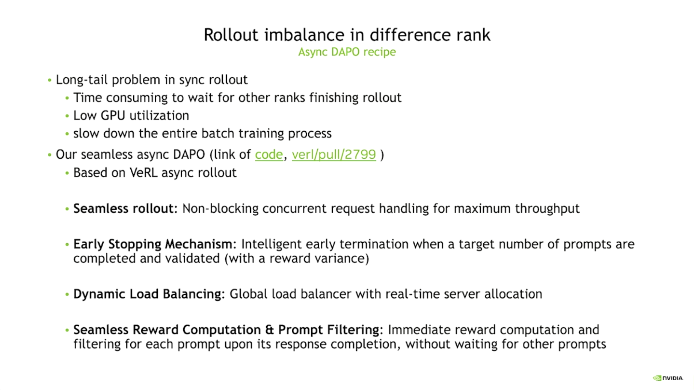

강화학습(RL)의 Rollout 단계에서 동기(sync) Rollout은 "긴 꼬리 문제"와 이로 인한 성능 병목에 직면하며, 여기서는 "무결합 비동기 DAPO(Async DAPO recipe)"라는 해결책이 제시된다. 동기 Rollout의 주요 문제는 모든 계산 단위(rank)가 Rollout을 완료할 때까지 오랫동안 기다려야 하여 GPU 이용률이 낮아지고 결국 전체 배치 훈련 과정이 느려진다는 것이다. 이 문제를 해결하기 위해 Slides가 소개하는 무결합 비동기 DAPO(코드 링크: `verl/pull/2799`)는 VeRL 비동기 Rollout 메커니즘을 기반으로 하며 여러 핵심 특성을 갖는다: 첫 번째는 **무결합 Rollout**으로, 비차단 병렬 요청 처리를 통해 처리량을 최대화한다; 두 번째는 **조기 종료 메커니즘**으로, 목표 수의 prompt가 완료되고 검증되면(보상 분산 고려) 시스템이 지능적으로 Rollout을 조기 종료할 수 있다; 세 번째는 **동적 부하 분산**으로, 전역 부하 분산기를 사용하여 실시간 서버 할당을 수행하여 자원 이용을 최적화한다; 마지막은 **무결합 보상 계산과 prompt 필터링**으로, 각 prompt의 응답이 완료되는 즉시 보상 계산과 필터링을 수행하여 다른 prompt의 완료를 기다릴 필요가 없어 Rollout 단계의 효율과 전체 훈련 속도를 크게 향상시킨다. 분산 강화학습 훈련에서 자원 이용률 최적화를 위한 혁신적인 비동기 처리 아키텍처를 제공한다.

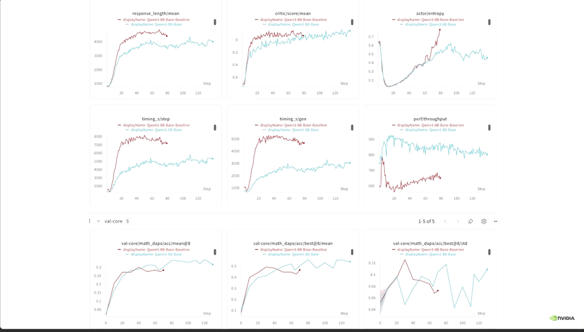

이 최적화의 성능 향상은 20%~40% 사이다.

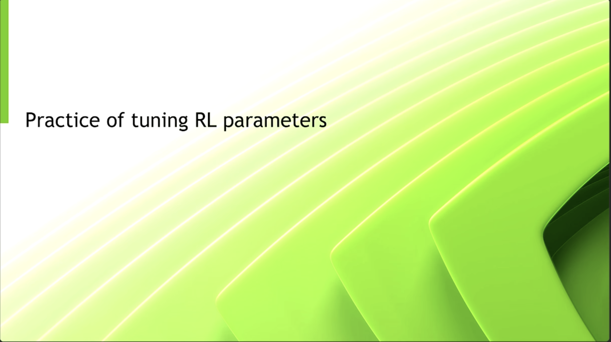

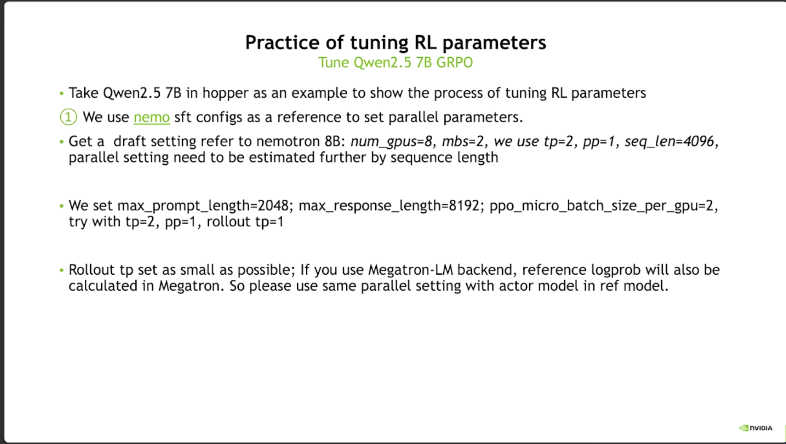

이 페이지는 Qwen2.5 7B GRPO 모델을 예시로 강화학습(RL) 파라미터 조정의 실천 과정을 보여준다. 먼저 Qwen2.5 7B 모델을 예시로 삼고, Nemo SFT(지도 미세 조정) 설정을 참고하여 병렬 파라미터를 설정한다. 그다음 Slides는 Nemotron 8B 기반의 초기 병렬 설정 초안을 제공하는데, 여기에는 `num_gpus=8`, `mbs=2`(마이크로 배치 크기), `tp=2`(tensor parallel), `pp=1`(pipeline parallel), `seq_len=4096`(시퀀스 길이)이 포함되며, 이 병렬 설정들은 실제 시퀀스 길이에 따라 추가적인 추정이 필요하다고 강조한다.

이어서 Slides는 핵심 길이와 배치 크기 파라미터를 명확히 한다: `max_prompt_length`는 2048, `max_response_length`는 8192, `ppo_micro_batch_size_per_gpu`는 2, Policy 훈련은 `tp=2`, `pp=1`을 사용하고, Rollout 자체의 tensor parallel(`rollout tp`)은 1로 설정한다.

마지막으로 Slides는 Rollout의 tensor parallel(`tp`)을 가능한 한 작게 설정해야 하며, Megatron-LM 백엔드를 사용하는 경우 Ref 모델의 로그 확률(reference logprob)도 Megatron에서 계산되므로 Ref 모델은 Actor 모델과 동일한 병렬 설정을 사용하여 일관성을 보장할 것을 권장하는데, 이는 실제 RL 모델 훈련의 파라미터 설정에 체계적인 지침을 제공한다.

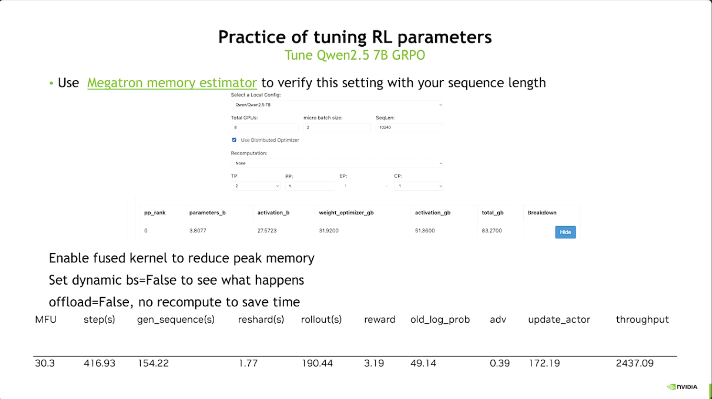

이 Slides는 Megatron 메모리 추정기를 사용하여 주어진 시퀀스 길이에서의 설정을 검증할 것을 권장한다. Slides는 이전 페이지의 설정에 해당하는 메모리 점유를 보여준다: 모델은 Qwen2.5 7B, 8개의 GPU, 마이크로 배치 크기 2, 시퀀스 길이 10240을 사용하며, 분산 옵티마이저가 활성화되어 있고 재계산은 수행하지 않는다. 병렬 설정은 tensor parallel(TP) 2, pipeline parallel(PP), expert parallel(EP), context parallel(CP) 모두 1이다. 이 설정에서 메모리 사용 상세 내역은 GPU당 총 메모리 점유가 83.27GB이며, 파라미터가 3.81GB, 활성화가 27.57GB와 51.36GB, 가중치 옵티마이저 상태가 31.92GB를 차지한다. 또한 슬라이드는 여러 최적화 제안을 제시한다: 피크 메모리를 줄이기 위한 fused kernel 활성화, 관찰을 위해 `dynamic bs`를 `False`로 설정할 것을 권장하며, 메모리가 허용하는 경우 `offload`와 `recompute`를 `False`로 설정하면 시간을 절약할 수 있다고 지적한다. 마지막으로 Slides는 일련의 성능 지표를 제공한다: MFU 30.3, 총 단계 시간 416.93초, 시퀀스 생성 시간 154.22초, reshard 시간 1.77초, rollout 시간 190.44초, Reward 3.19초, 구 로그 확률 계산 시간 49.14초, advantage 계산 시간 0.39초, Actor 업데이트 시간 172.19초, 총 처리량 2437.09 tokens/s로, RL 모델 훈련의 성능 평가와 최적화를 위한 양적 기술 근거를 제공한다.

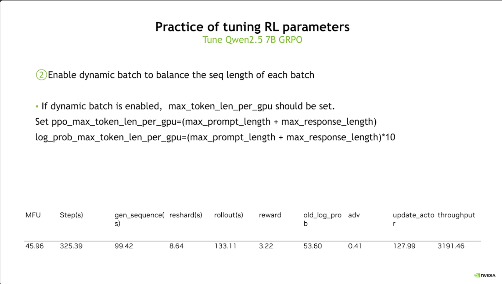

dynamic batch를 활성화하고 적절한 max_token_per_gpu를 설정한 후의 성능을 보면, MFU가 크게 향상되어 45.96%에 달함을 알 수 있다.

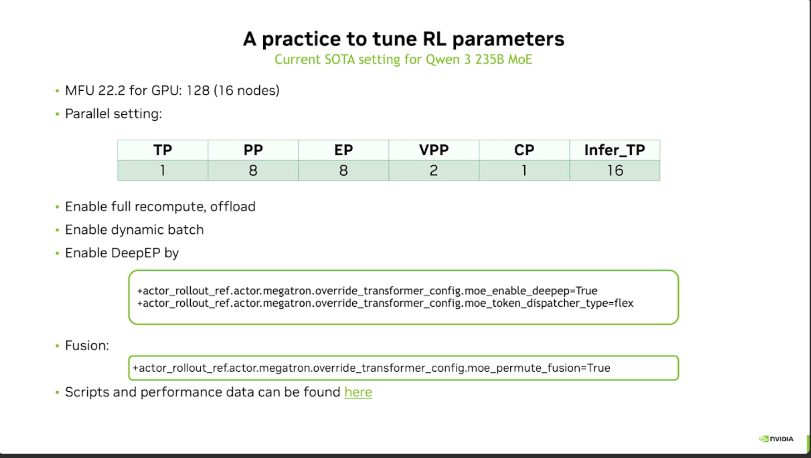

이 페이지는 VerL 기반의 Qwen 3 235B MoE 모델의 최적 파라미터 조합과 달성한 최고 MFU를 보여주며, 참고 자료로 활용할 수 있다.

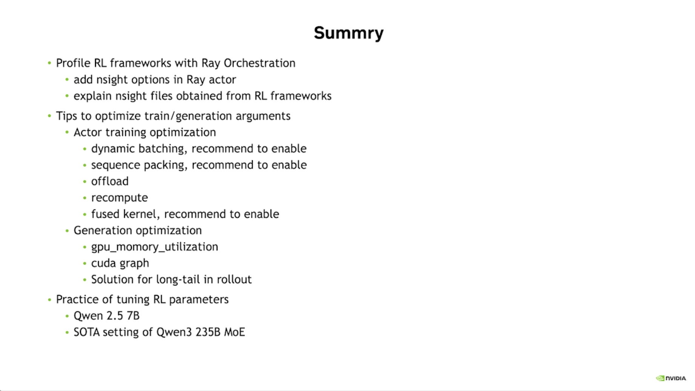

여기서 단어 하나가 잘못 표기되었다. 이 강연은 강화학습(RL) 파이프라인 최적화의 핵심 전략과 실천을 체계적으로 정리한다. 먼저 Nsight Systems를 사용하여 RL 프레임워크의 성능 Profile을 분석하는 것의 중요성을 강조하며, 구체적으로 Ray Actor에 Nsight 파라미터를 추가하는 방법과 RL 프레임워크에서 얻은 Nsight Profile 파일을 해석하는 방법을 다룬다. 다음으로 Slides는 훈련/생성 파라미터 최적화의 상세 기법을 제공하는데, 이는 두 가지 주요 측면으로 세분화된다: Actor 훈련 최적화(dynamic batching과 sequence packing 활성화 권장, offload·recompute·fused kernel의 전략적 사용 포함)와 Rollout 최적화(gpu_memory_utilization 향상, CUDA Graph 활용, Rollout 단계의 긴 꼬리 문제 해결에 초점). 마지막으로 Qwen 2.5 7B 모델을 예시로 RL 파라미터 조정의 실천 경험을 정리하고, Qwen3 235B MoE 모델의 SOTA 설정도 언급하며 실제 응용에서의 성능 최적화에 대한 포괄적인 지침을 제공한다.
