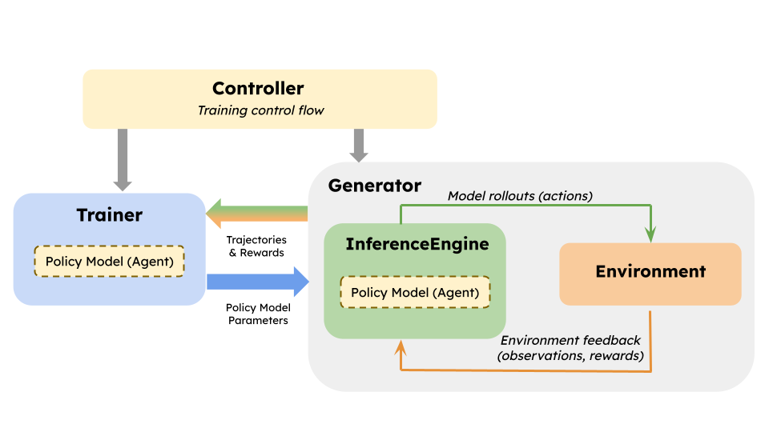

# [draft]RLVR 시대의 Inference Framework : Weight Syncing

LLM의 Reasoning 성능을 향상시키기 위해서는 사후학습으로서 RLHF(RL with Human Feedback)와 같은 강화학습 기반의 학습이 필요하다. 24년은 이런 강화학습기반의 사후학습의 시대였다고 할수있다. 25년 들어 다양한 의문점이 제기되었지만 어찌되었건 reasoning 성능 향상을 위해서는 강화학습 기반의 사후학습이 필요하다는 점은 변함이 없다. RLHF 중에서도 RLVR(RL with Value Reward) 기반의 사후학습이 LLM의 reasoning 성능 향상에 가장 효과적이라는 점이 입증되었다. RLVR은 기존의 RLHF와 달리, reward model을 학습시키는 과정에서 human feedback을 최소화하고, 대신 LLM이 스스로 reasoning을 통해 reward를 생성하도록 하는 방식이다. 이를 통해 LLM은 더 높은 수준의 reasoning 능력을 갖추게 된다. RLVR 에 있어서 효율적인 학습을 위해서는 weight syncing 이 필요하다. 추론 엔진(vLLM 등)이 어떻게 이 역할을 수행하는지 알아보자.

## Weight Syncing

### Background

 

RL 기반의 학습은 위 그림과 같이 모델의 parameter 갱신을 실시하기 위해서 forward/backward를 실시하는 Trainer Process(아래 그림에 있어서의 청색의 Trainer)와, model weights를 이용해 Inference Engine에서 Rollouts를 생성하는 Generator Process의 2개가 크게 나누어 존재한다. 2개의 Process는 화살표로 연결되어 있는 것처럼 모델이 출력 결과를 생성하는 과정인 Trajectories 나, Environment 로부터의 피드백인 Rewards 를 Generator Process로부터 Processor Process에 전달하거나, Trainer weight를 Generator에 전달하는 것이 수행된다. 이 모델 weight의 전달을 주기적으로 수행하지 않으면 환경(Environment)으로부터의 피드백을 받은 대상의 모델 weights와 실제로 forward/backward로 갱신되고 있는 model weights와의 사이에 괴리가 생긴다. 

On-policy 또는 Synchronous RL 기반의 학습에서는 Trainer에서 업데이트되는 policy 와 Generator에서 생성되는 policy의 괴리를 가능한 최소로해야한다. Async RL 기반의 학습에서도 일정한 policy lag 나 stale rollouts 를 허용하면서 비동기적으로 policy를 업데이트 하더라도 그 차이를 줄이는것은 중요하다. Generator 에서 사용되는 모델의 weights 를 가능한 최신화하여 현재의 Trainer policy 가 오래된 weights 를 기반으로 rollout을 생성하는것을 방지해야 training feedback이 정상적으로 이루어질 수 있다.

### Native weight transfer

